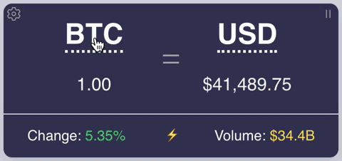

<h1 align="center">Crypto Converter ⚡ Widget</h1>

* Latest version: 1.5.1;
* Size: ≈71.5 kBytes;
* License: MIT

[](https://wordpress.org/plugins/crypto-converter-widget/)

The __[Crypto Converter Widget](https://co-w.io)__ — is a powerful and easy-to-use with beauty UI real-time web tool to conversion cryptocurrencies FOR ANY WEBSITES. Customers can choose from available ≈170 fiat currencies and ≈1,656 crypto. For FREE.

- [Features](#features-)
- [Install](#install-%EF%B8%8F)
- [Example](#example-)
- [Changelog](#changelog-%EF%B8%8F)
- [For Developers](#for-developers-)
- [Cryptocurrencies id list](#cryptocurrencies-id-list)
- [Currencies id list](#currencies-id-list)

## [DEMO](https://co-w.io) ###

<a href="https://co-w.io"></a>

### Features 🤩 ###

- [x] No Cryptojacking!
- [x] Pure JavaScript ≈71.5 kBytes (gzip), no dependencies;
- [x] Flexible settings and customizable design;
- [x] Real-time ⚡ streaming price update;
- [x] Processed on a third-party server;
- [x] Sound beep when price changed
- [x] ≈1,656 cryptocurrencies and ≈170 fiat currencies;
- [x] SSL support;
- [x] SEO-friendly.

---

### Install 🖥️ ###

0. Copy [example](#example-) below and set your attributes customize.
1. Enjoy.

---

### Example 💡 ###

```html
<!-- Crypto Converter ⚡ Widget -->
<crypto-converter-widget
   live
   shadow
   symbol
   fiat="united-states-dollar"
   crypto="bitcoin"
   amount="1"
   border-radius="0.60rem"
   background-color="#383a59"
   decimal-places="2"
   font-family="inherit"></crypto-converter-widget>
<script async src="https://cdn.jsdelivr.net/gh/dejurin/crypto-converter-widget/dist/latest.min.js"></script>
<!-- /Crypto Converter ⚡ Widget -->
```
Examples: <b><a href="https://jsfiddle.net/5w6zs8x0/">JSFiddle</a></b> | <b><a href="https://codepen.io/dejurin/pen/ExgNJBg">CodePen</a></b> | <b><a href="https://codepen.io/dejurin/pen/MWjpwGa">CodePen (multi color example)</a></b> | <b><a href="https://co-w.io/coins.html">A lot widget on one page</a></b>

You can find many uses for this widget, not just on the website. See how I did a live stream with cryptocurrencies: <a href="https://www.youtube.com/watch?v=LQIsk5wIAzw">https://www.youtube.com/watch?v=LQIsk5wIAzw</a>

---

### jsDelivr CDN

##### Latest

```html
https://cdn.jsdelivr.net/gh/dejurin/crypto-converter-widget/dist/latest.min.js
```

##### Latest legacy

```html
https://cdn.jsdelivr.net/gh/dejurin/crypto-converter-widget/dist/latest-legacy.min.js
```

All versions here: <a href="https://cdn.jsdelivr.net/gh/dejurin/crypto-converter-widget/dist/">https://cdn.jsdelivr.net/gh/dejurin/crypto-converter-widget/dist/</a>

---

### StackPath CDN

##### Latest

```html
https://s.fx-w.io/ccw/latest.min.js
```

##### Latest legacy

```html
https://s.fx-w.io/ccw/latest-legacy.min.js
```

---

### Changelog ✳️ ###

#### [1.5.1] - 2021-01-10
##### Fixed
- Major fixes

#### [1.5.0] - 2021-01-09
##### Fixed
- Major fixes

#### [1.4.2] - 2021-01-08
##### Fixed
- Minor fixes

#### [1.4.1] - 2021-01-08
##### Fixed
- Minor fixes
##### Add
- Loading anim

#### [1.4.0] - 2021-01-07
##### Fixed
- Add interceptors for poor request
- Minor fixes
##### Add
- Play/Pause price updates
##### Delete
- Sound beep when price changed

#### [1.3.5] - 2021-01-05
##### Fixed
- Minor fixes
##### Add
- Sound beep when price changed

#### [1.1.7] - 2021-01-04
##### Fixed
- Select fiat [live]
- Minor fixes

#### [1.1.6] - 2021-01-03
##### Fixed
- Currency symbol
- Minor fixes
##### Add
- Currency symbol attribut

#### [1.0.4] - 2020-12-12
##### Fixed
- Select form [await load]
- Background image
- WebSocket stop/start

#### [1.0.0] - 2020-12-11
- First release

---

### For Developers 🧑‍💻 ###

|Attribute|Type|Default|Reactive|Description|
|--- |--- |--- |--- |--- |
|Amount|float|1|+|Amount of cryptocurrency.|
|background-color|string|#383a59|+|Background color of widget.|
|border-radius|string|0.60rem|+|Border radius of widget.|
|crypto|string|bitcoin|+|Cryptocurrency ID.|
|decimal-places|int|2|+|Decimal places.|
|fiat|string|united-states-dollar|+|Fiat money symbol.|
|font-family|string|inherit|+|Font of widget.|
|shadow|boolean|false|+|Shadow of widget.|
|symbol|boolean|false|+|Currency symbol ($).|
|live|boolean|false|+|Prices are updated real-time.|

---

### Cryptocurrencies ID list ###

|Cryptocurrency ID|Symbol|Name|
|--- |--- |--- |
|bitcoin|BTC|Bitcoin|
|ethereum|ETH|Ethereum|
|xrp|XRP|XRP|
|tether|USDT|Tether|
|bitcoin-cash|BCH|Bitcoin Cash|
|litecoin|LTC|Litecoin|
|chainlink|LINK|Chainlink|
|cardano|ADA|Cardano|
|polkadot|DOT|Polkadot|
|binance-coin|BNB|Binance Coin|
|stellar|XLM|Stellar|
|usd-coin|USDC|USD Coin|
|bitcoin-sv|BSV|Bitcoin SV|
|eos|EOS|EOS|
|monero|XMR|Monero|
|wrapped-bitcoin|WBTC|Wrapped Bitcoin|
|tron|TRX|TRON|
|nem|XEM|NEM|
|tezos|XTZ|Tezos|
|unus-sed-leo|LEO|UNUS SED LEO|
|filecoin|FIL|Filecoin|
|crypto-com-coin|CRO|Crypto.com Coin|
|cosmos|ATOM|Cosmos|
|neo|NEO|Neo|
|multi-collateral-dai|DAI|Multi Collateral DAI|
|vechain|VET|VeChain|
|dash|DASH|Dash|
|aave|AAVE|Aave|
|waves|WAVES|Waves|
|huobi-token|HT|Huobi Token|
|iota|MIOTA|IOTA|
|uniswap|UNI|Uniswap|
|binance-usd|BUSD|Binance USD|
|yearn-finance|YFI|yearn.finance|
|zcash|ZEC|Zcash|
|ethereum-classic|ETC|Ethereum Classic|
|theta|THETA|THETA|
|compound|COMP|Compound|
|celsius|CEL|Celsius|
|maker|MKR|Maker|
|synthetix-network-token|SNX|Synthetix|
|omg|OMG|OMG Network|
|dogecoin|DOGE|Dogecoin|
|kusama|KSM|Kusama|
|uma|UMA|UMA|
|ftx-token|FTT|FTX Token|
|ontology|ONT|Ontology|
|okb|OKB|OKB|
|algorand|ALGO|Algorand|
|zilliqa|ZIL|Zilliqa|
|trueusd|TUSD|TrueUSD|
|sushiswap|SUSHI|SushiSwap|
|decred|DCR|Decred|
|bittorrent|BTT|BitTorrent|
|basic-attention-token|BAT|Basic Attention Token|
|nexo|NEXO|Nexo|
|digibyte|DGB|DigiByte|
|0x|ZRX|0x|
|paxos-standard-token|PAX|Paxos Standard Token|
|ren|REN|Ren|
|qtum|QTUM|Qtum|
|elrond-egld|EGLD|Elrond|
|hedera-hashgraph|HBAR|Hedera Hashgraph|
|icon|ICX|ICON|
|abbc-coin|ABBC|ABBC Coin|
|celo|CELO|Celo|
|loopring|LRC|Loopring|
|ampleforth|AMPL|Ampleforth|
|blockstack|STX|Blockstack|
|augur|REP|Augur|
|terra-luna|LUNA|Terra|
|kyber-network|KNC|Kyber Network|
|reserve-rights|RSR|Reserve Rights|
|energy-web-token|EWT|Energy Web Token|
|ocean-protocol|OCEAN|Ocean Protocol|
|lisk|LSK|Lisk|
|bitcoin-gold|BTG|Bitcoin Gold|
|quant|QNT|Quant|
|siacoin|SC|Siacoin|
|thorchain|RUNE|THORChain|
|nano|NANO|Nano|
|band-protocol|BAND|Band Protocol|
|numeraire|NMR|Numeraire|
|decentraland|MANA|Decentraland|
|maidsafecoin|MAID|MaidSafeCoin|
|enjin-coin|ENJ|Enjin Coin|
|aragon|ANT|Aragon|
|status|SNT|Status|
|verge|XVG|Verge|
|swissborg|CHSB|SwissBorg|
|ravencoin|RVN|Ravencoin|
|golem-network-tokens|GNT|Golem|
|horizen|ZEN|Horizen|
|bitcoin-diamond|BCD|Bitcoin Diamond|
|nervos-network|CKB|Nervos Network|
|orchid|OXT|Orchid|
|nxm|NXM|NXM|
|holo|HOT|Holo|
|bancor|BNT|Bancor|
|iostoken|IOST|IOST|
|monacoin|MONA|MonaCoin|
|matic-network|MATIC|Matic Network|
|bytom|BTM|Bytom|
|xinfin-network|XDC|XinFin Network|
|pax-gold|PAXG|PAX Gold|
|balancer|BAL|Balancer|
|rsk-infrastructure-framework|RIF|RSK Infrastructure Framework|
|unibright|UBT|Unibright|
|kava|KAVA|Kava.io|
|solana|SOL|Solana|
|iotex|IOTX|IoTeX|
|rlc|RLC|iExec RLC|
|theta-fuel|TFUEL|Theta Fuel|
|storj|STORJ|Storj|
|yearn-finance-ii|YFII|DFI.Money|
|swipe|SXP|Swipe|
|bitshares|BTS|BitShares|
|komodo|KMD|Komodo|
|steem|STEEM|Steem|
|kucoin-shares|KCS|KuCoin Shares|
|civic|CVC|Civic|
|aelf|ELF|aelf|
|nest-protocol|NEST|NEST Protocol|
|ardor|ARDR|Ardor|
|centrality|CENNZ|Centrality|
|chiliz|CHZ|Chiliz|
|kleros|PNK|Kleros|
|just|JST|JUST|
|wanchain|WAN|Wanchain|
|origintrail|TRAC|OriginTrail|
|noia-network|NOIA|NOIA Network|
|wax|WAXP|WAX|
|serum|SRM|Serum|
|energi|NRG|Energi|
|ankr|ANKR|Ankr|
|tomochain|TOMO|TomoChain|
|hive-blockchain|HIVE|Hive|
|irisnet|IRIS|IRISnet|
|fantom|FTM|Fantom|
|quarkchain|QKC|QuarkChain|
|ark|ARK|Ark|
|utrust|UTK|Utrust|
|electroneum|ETN|Electroneum|
|pundi-x|NPXS|Pundi X|
|aeternity|AE|Aeternity|
|sun|SUN|SUN|
|fetch|FET|Fetch.ai|
|power-ledger|POWR|Power Ledger|
|hypercash|HC|HyperCash|
|zcoin|XZC|Zcoin|
|library-credit|LBC|LBRY Credits|
|ultra|UOS|Ultra|
|singularitynet|AGI|SingularityNET|
|xdai|STAKE|xDai|
|aion|AION|Aion|
|tellor|TRB|Tellor|
|syscoin|SYS|Syscoin|
|waykichain|WICC|WaykiChain|
|gatechain-token|GT|Gatechain Token|
|v-systems|VSYS|v.systems|
|polymath-network|POLY|Polymath|
|handshake|HNS|Handshake|
|super-zero-protocol|SERO|Super Zero Protocol|
|melon|MLN|Melon|
|travala|AVA|Travala.com|
|harmony|ONE|Harmony|
|district0x|DNT|district0x|
|mxc|MXC|MXC|
|thunder-token|TT|Thunder Token|
|streamr|DATA|Streamr|
|adx-net|ADX|AdEx Network|
|bzx-protocol|BZRX|bZx Protocol|
|kardiachain|KAI|KardiaChain|
|elastos|ELA|Elastos|
|dad|DAD|DAD|
|gxchain|GXC|GXChain|
|akropolis|AKRO|Akropolis|
|funfair|FUN|FunFair|
|coti|COTI|COTI|
|celer-network|CELR|Celer Network|
|nuls|NULS|NULS|
|wink-tronbet|WIN|WINk|
|bitmax-token|BTMX|BitMax Token|
|pivx|PIVX|PIVX|
|loom-network|LOOM|Loom Network|
|trustswap|SWAP|TrustSwap|
|rocket-pool|RPL|Rocket Pool|
|morpheus-network|MRPH|Morpheus.Network|
|waltonchain|WTC|Waltonchain|
|metal|MTL|Metal|
|mainframe|MFT|Mainframe|
|zap|ZAP|Zap|
|grin|GRIN|Grin|
|origin-protocol|OGN|Origin Protocol|
|ripio-credit-network|RCN|Ripio Credit Network|
|cortex|CTXC|Cortex|
|beam|BEAM|Beam|
|arpa-chain|ARPA|ARPA Chain|
|audius|AUDIO|Audius|
|dent|DENT|Dent|
|idex|IDEX|IDEX|
|request-network|REQ|Request Network|
|quantstamp|QSP|Quantstamp|
|nebulas-token|NAS|Nebulas|
|digitex-futures|DGTX|Digitex Futures|
|dmm-governance|DMG|DMM: Governance|
|dragonchain|DRGN|Dragonchain|
|nexus|NXS|Nexus|
|hashgard|GARD|Hashgard|
|nimiq|NIM|Nimiq|
|bluzelle|BLZ|Bluzelle|
|groestlcoin|GRS|Groestlcoin|
|gas|GAS|Gas|
|ethos|ETHOS|Ethos|
|truechain|TRUE|TrueChain|
|dia-data|DIA|DIA|
|crypterium|CRPT|Crypterium|
|bitkan|KAN|BitKan|
|populous|PPT|Populous|
|airswap|AST|AirSwap|
|darwinia-network|RING|Darwinia Network|
|project-pai|PAI|Project Pai|
|nkn|NKN|NKN|
|phala-network|PHA|Phala.Network|
|qash|QASH|QASH|
|moeda-loyalty-points|MDA|Moeda Loyalty Points|
|metronome|MET|Metronome|
|fusion|FSN|Fusion|
|nxt|NXT|Nxt|
|skycoin|SKY|Skycoin|
|raiden-network-token|RDN|Raiden Network Token|
|high-performance-blockchain|HPB|High Performance Blockchain|
|seele|SEELE|Seele-N|
|tenx|PAY|TenX|
|gochain|GO|GoChain|
|the-force-protocol|FOR|ForTube|
|ost|OST|OST|
|telcoin|TEL|Telcoin|
|arcblock|ABT|Arcblock|
|selfkey|KEY|Selfkey|
|fio-protocol|FIO|FIO Protocol|
|time-new-bank|TNB|Time New Bank|
|morpheus-labs|MITX|Morpheus Labs|
|coinex-token|CET|CoinEx Token|
|dock|DOCK|Dock|
|appcoins|APPC|AppCoins|
|achain|ACT|Achain|
|neblio|NEBL|Neblio|
|bread|BRD|Bread|
|everex|EVX|Everex|
|wepower|WPR|WePower|
|bnktothefuture|BFT|BnkToTheFuture|
|ruff|RUFF|Ruff|
|genesis-vision|GVT|Genesis Vision|
|tokenclub|TCT|TokenClub|
|oax|OAX|OAX|
|amber|AMB|Ambrosus|
|mithril|MITH|Mithril|
|bibox-token|BIX|Bibox Token|
|iot-chain|ITC|IoT Chain|
|suncontract|SNC|SunContract|
|blox|CDT|Blox|
|vibe|VIBE|VIBE|
|poa-network|POA|POA Network|
|swftcoin|SWFTC|SwftCoin|
|qlink|QLC|QLC Chain|
|smartmesh|SMT|SmartMesh|
|viberate|VIB|Viberate|
|medishares|MDS|MediShares|
|agrello-delta|DLT|Agrello|
|genaro-network|GNX|Genaro Network|
|egretia|EGT|Egretia|
|libra-credit|LBA|Cred|
|hydro-protocol|HOT|Hydro Protocol|
|u-network|UUU|U Network|
|zrcoin|ZRC|ZrCoin|
|skrumble-network|SKM|Skrumble Network|
|qunqun|QUN|QunQun|
|hitchain|HIT|HitChain|
|deepbrain-chain|DBC|DeepBrain Chain|
|merculet|MVP|Merculet|
|remme|REM|Remme|
|8x8-protocol|EXE|8X8 PROTOCOL|
|odyssey|OCN|Odyssey|
|oneledger|OLT|OneLedger|
|echolink|EKO|EchoLink|
|content-neutrality-network|CNN|Content Neutrality Network|
|bitmark|BTM|Bitmark|
|rate3|RTE|Rate3|
|red|RED|RED|
|fanstime|FTI|FansTime|
|datx|DATX|DATx|
|insolar|XNS|Insolar|
|exchange-union|XUC|Exchange Union|
|topchain|TOPC|TopChain|
|mytoken|MT|MyToken|
|counos-x|CCXX|Counos X|
|revain|REV|Revain|
|homeros|HMR|Homeros|
|zelwin|ZLW|Zelwin|
|husd|HUSD|HUSD|
|tnc-coin|TNC|TNC Coin|
|largo-coin|LRG|Largo Coin|
|defichain|DFI|DeFiChain|
|hedgetrade|HEDG|HedgeTrade|
|cybervein|CVT|CyberVein|
|poseidon-network|QQQ|Poseidon Network|
|zb-token|ZB|ZB Token|
|terra-krw|KRT|TerraKRW|
|dxchain-token|DX|DxChain Token|
|arweave|AR|Arweave|
|helium|HNT|Helium|
|baer-chain|BRC|Baer Chain|
|darma-cash|DMCH|Darma Cash|
|gnosis-gno|GNO|Gnosis|
|velas|VLX|Velas|
|stratis|STRAX|Stratis|
|kin|KIN|Kin|
|enigma-project|ENG|Enigma|
|hyperion|HYN|Hyperion|
|stasis-euro|EURS|STASIS EURO|
|switcheo|SWTH|Switcheo|
|harvest-finance|FARM|Harvest Finance|
|solve|SOLVE|SOLVE|
|redd|RDD|ReddCoin|
|livepeer|LPT|Livepeer|
|loki|LOKI|Loki|
|mimblewimblecoin|MWC|MimbleWimbleCoin|
|bytecoin-bcn|BCN|Bytecoin|
|vethor-token|VTHO|VeThor Token|
|everipedia|IQ|Everipedia|
|huobi-pool-token|HPT|Huobi Pool Token|
|yflink|YFL|YF Link|
|metaverse-dualchain-network-architecture|DNA|Metaverse Dualchain Network Architecture|
|ignis|IGNIS|Ignis|
|refereum|RFR|Refereum|
|salt|SALT|SALT|
|stakenet|XSN|Stakenet|
|cindicator|CND|Cindicator|
|gemini-dollar|GUSD|Gemini Dollar|
|digixdao|DGD|DigixDAO|
|medibloc|MED|MediBloc|
|measurable-data-token|MDT|Measurable Data Token|
|0chain|ZCN|0Chain|
|meta|MTA|Meta|
|molecular-future|MOF|Molecular Future|
|metadium|META|Metadium|
|constellation|DAG|Constellation|
|rchain|REV|RChain|
|latoken|LA|LATOKEN|
|factom|FCT|Factom|
|kcash|KCASH|Kcash|
|cream-finance|CREAM|Cream Finance|
|bit-z-token|BZ|Bit-Z Token|
|vertcoin|VTC|Vertcoin|
|insights-network|INSTAR|Insights Network|
|likecoin|LIKE|LikeCoin|
|nav-coin|NAV|NavCoin|
|linkeye|LET|LinkEye|
|pchain|PI|PCHAIN|
|sentinel|SENT|Sentinel|
|metaverse|ETP|Metaverse ETP|
|ubiq|UBQ|Ubiq|
|sirin-labs-token|SRN|SIRIN LABS Token|
|gamecredits|GAME|GameCredits|
|propy|PRO|Propy|
|single-collateral-dai|SAI|Single Collateral DAI|
|cybermiles|CMT|CyberMiles|
|vite|VITE|VITE|
|te-food|TONE|TE-FOOD|
|peercoin|PPC|Peercoin|
|endor-protocol|EDR|Endor Protocol|
|spacechain|SPC|SpaceChain|
|monero-classic|XMC|Monero Classic|
|pluton|PLU|Pluton|
|gifto|GTO|Gifto|
|viacoin|VIA|Viacoin|
|veridocglobal|VDG|VeriDocGlobal|
|digitalnote|XDN|DigitalNote|
|smartcash|SMART|SmartCash|
|all-sports|SOC|All Sports|
|gulden|NLG|Gulden|
|oneroot-network|RNT|OneRoot Network|
|wabi|WABI|Wabi|
|phantasma|SOUL|Phantasma|
|mobius|MOBI|Mobius|
|pillar|PLR|Pillar|
|lamden|TAU|Lamden|
|game|GTC|Game.com|
|nucleus-vision|NCASH|Nucleus Vision|
|autonio|NIOX|Autonio|
|singulardtv|SNGLS|SingularDTV|
|monetha|MTH|Monetha|
|credits|CS|Credits|
|unlimitedip|UIP|UnlimitedIP|
|poet|POE|Po.et|
|six|SIX|SIX|
|sonm|SNM|SONM|
|educare|EKT|EDUCare|
|tripio|TRIO|Tripio|
|blockmason|BCPT|Blockmason Credit Protocol|
|bit-tube|TUBE|BitTube|
|jibrel-network|JNT|Jibrel Network|
|cardstack|CARD|Cardstack|
|xaurum|XAUR|Xaurum|
|presearch|PRE|Presearch|
|global-social-chain|GSC|Global Social Chain|
|1world|1WO|1World|
|restart-energy-mwat|MWAT|Restart Energy MWAT|
|xyo-network|XYO|XYO Network|
|contentbox|BOX|ContentBox|
|lympo|LYM|Lympo|
|loopring-neo|LRN|Loopring [NEO]|
|cpchain|CPC|CPChain|
|aidoc|AIDOC|AI Doctor|
|carvertical|CV|carVertical|
|exrnchain|EXRN|EXRNchain|
|tera|TERA|TERA|
|yee|YEE|YEE|
|hydrogen|HYDRO|Hydro|
|tierion|TNT|Tierion|
|matrix-ai-network|MAN|Matrix AI Network|
|seal-network|SEAL|Seal Network|
|chatcoin|CHAT|ChatCoin|
|turtlecoin|TRTL|TurtleCoin|
|humaniq|HMQ|Humaniq|
|sumokoin|SUMO|Sumokoin|
|zero|ZER|Zero|
|internxt|INXT|Internxt|
|eosdac|EOSDAC|eosDAC|
|yeed|YEED|YGGDRASH|
|scryinfo|DDD|Scry.info|
|alphacat|ACAT|Alphacat|
|eden|EDN|Eden|
|medical-chain|MTN|Medicalchain|
|0xcert|ZXC|0xcert|
|datum|DAT|Datum|
|geocoin|GEO|GeoCoin|
|primas|PST|Primas|
|bottos|BTO|Bottos|
|friends|FDZ|Friendz|
|iht-real-estate-protocol|IHT|IHT Real Estate Protocol|
|aventus|AVT|Aventus|
|matryx|MTX|Matryx|
|ubex|UBEX|Ubex|
|banca|BANCA|Banca|
|delphy|DPY|Delphy|
|stk|STK|STK|
|flypme|FYP|FlypMe|
|veros|VRS|Veros|
|dprating|RATING|DPRating|
|herocoin|PLAY|HEROcoin|
|sharder|SS|Sharder|
|neurochain|NCC|NeuroChain|
|hashcoin|HSC|HashCoin|
|trinity-network-credit|TNC|Trinity Network Credit|
|electrifyasia|ELEC|Electrify.Asia|
|memetic|MEME|Memetic / PepeCoin|
|gobyte|GBX|GoByte|
|zeepin|ZPT|Zeepin|
|investdigital|IDT|InvestDigital|
|sentinel-chain|SENC|Sentinel Chain|
|zeusshield|ZSC|Zeusshield|
|bounty0x|BNTY|Bounty0x|
|playkey|PKT|Playkey|
|micromoney|AMM|MicroMoney|
|qbao|QBT|Qbao|
|metamorph|METM|MetaMorph|
|soma|SCT|Soma|
|aeron|ARNX|Aeron|
|aditus|ADI|Aditus|
|intelligent-trading-foundation|ITT|Intelligent Trading Foundation|
|desire|DSR|Desire|
|comet|CMT|Comet|
|etheroll|DICE|Etheroll|
|pickle-finance|PICKLE|Pickle Finance|
|fsw-token|FSW|Falconswap|
|intelligent-investment-chain|IIC|Intelligent Investment Chain|
|bitcoin-god|GOD|Bitcoin God|
|edu-coin|EDU|EduCoin|
|lemochain|LEMO|LemoChain|
|coinmeet|MEET|CoinMeet|
|shinechain|SHE|ShineChain|
|bumo|BU|BUMO|
|hex|HEX|HEX|
|yeld-finance|YELD|Yeld Finance|
|pixie-coin|PXC|Pixie Coin|
|bitcoinx|BCX|BitcoinX|
|blockcdn|BCDN|BlockCDN|
|eosblack|BLACK|eosBLACK|
|cybereits|CRE|Cybereits|
|sopay|SOP|SoPay|
|gsenetwork|GSE|GSENetwork|
|comsa-eth|CMS|COMSA [ETH]|
|bitcoin-file|BIFI|Bitcoin File|
|dacc|DACC|DACC|
|ino-coin|INO|INO COIN|
|insight-chain|INB|Insight Chain|
|creditcoin|CTC|Creditcoin|
|vitae|VITAE|Vitae|
|mindol|MIN|MINDOL|
|sologenic|SOLO|Sologenic|
|iconomi|ICN|Iconomi|
|eidoo|EDO|Eidoo|
|whitecoin|XWC|WhiteCoin|
|crypto-com|MCO|MCO|
|flexacoin|FXC|Flexacoin|
|uquid-coin|UQC|Uquid Coin|
|s4fe|S4F|S4FE|
|btu-protocol|BTU|BTU Protocol|
|c20|C20|CRYPTO20|
|voyager-token|VGX|Voyager Token|
|orbs|ORBS|Orbs|
|substratum|SUB|Substratum|
|yam|YAM|YAM|
|nectar|NEC|Nectar|
|red-pulse|PHX|Red Pulse Phoenix|
|storm|STORM|Storm|
|bankera|BNK|Bankera|
|boscoin|BOS|BOScoin|
|dynamic-trading-rights|DTR|Dynamic Trading Rights|
|aurora|AOA|Aurora|
|modum|MOD|Modum|
|deuscoin|DEUS|DeusCoin|
|invictus-hyperion-fund|IHF|Invictus Hyperion Fund|
|byteball|GBYTE|Byteball Bytes|
|einsteinium|EMC2|Einsteinium|
|steem-dollars|SBD|Steem Dollars|
|firstblood|1ST|FirstBlood|
|tap|XTP|Tap|
|salus|SLS|SaluS|
|tokencard|TKN|TokenCard|
|dmarket|DMT|DMarket|
|rialto|XRL|Rialto|
|covesting|COV|Covesting|
|quantum-resistant-ledger|QRL|Quantum Resistant Ledger|
|santiment|SAN|Santiment Network Token|
|namecoin|NMC|Namecoin|
|blocknet|BLOCK|Blocknet|
|sentinel-protocol|UPP|Sentinel Protocol|
|dynamic|DYN|Dynamic|
|grid|GRID|Grid+|
|veritaseum|VERI|Veritaseum|
|lockchain|LOC|LockTrip|
|yoyow|YOYOW|YOYOW|
|peculium|PCL|Peculium|
|digix-gold-token|DGX|Digix Gold Token|
|wagerr|WGR|Wagerr|
|particl|PART|Particl|
|bezant|BZNT|Bezant|
|blockv|VEE|BLOCKv|
|polybius|PLBT|Polybius|
|uttoken|UTT|United Traders Token|
|pumapay|PMA|PumaPay|
|tokenomy|TEN|Tokenomy|
|etherparty|FUEL|Etherparty|
|universa|UTNP|Universa|
|aeon|AEON|Aeon|
|cryptopay|CPAY|Cryptopay|
|hycon|HYC|HYCON|
|neumark|NEU|Neumark|
|kryll|KRL|Kryll|
|lykke|LKK|Lykke|
|naga|NGC|NAGA|
|burst|BURST|Burst|
|callisto-network|CLO|Callisto Network|
|lunyr|LUN|Lunyr|
|auctus|AUC|Auctus|
|dentacoin|DCN|Dentacoin|
|counterparty|XCP|Counterparty|
|taas|TAAS|TaaS|
|bitcore|BTX|Bitcore|
|wings|WINGS|Wings|
|feathercoin|FTC|Feathercoin|
|odem|ODE|ODEM|
|dragon-coins|DRG|Dragon Coins|
|myriad|XMY|Myriad|
|blackmoon|BMC|Blackmoon|
|the-abyss|ABYSS|The Abyss|
|thorenext|THX|ThoreNext|
|html-coin|HTML|HTMLCOIN|
|stealth|XST|Stealth|
|blackcoin|BLK|BlackCoin|
|flo|FLO|FLO|
|ethereum-blue|BLUE|Blue Protocol|
|robotina|ROX|Robotina|
|radium|RADS|Radium|
|minereum|MNE|Minereum|
|okcash|OK|OKCash|
|apex|CPX|Apex|
|gonetwork|GOT|GoNetwork|
|polyswarm|NCT|PolySwarm|
|coinpoker|CHP|CoinPoker|
|thekey|TKY|THEKEY|
|vexanium|VEX|Vexanium|
|you-coin|YOU|YOU COIN|
|cashbet-coin|CBC|CashBet Coin|
|nolimitcoin|NLC2|NoLimitCoin|
|emercoin|EMC|Emercoin|
|cargox|CXO|CargoX|
|potcoin|POT|PotCoin|
|sphere|SPHR|Sphere|
|litecoin-cash|LCC|Litecoin Cash|
|change|CAG|Change|
|bitcapitalvendor|BCV|BitCapitalVendor|
|hempcoin|THC|HempCoin|
|shipchain|SHIP|ShipChain|
|cryptaur|CPT|Cryptaur|
|swarm-fund|SWM|Swarm|
|education-ecosystem|LEDU|Education Ecosystem|
|hive-project|HVN|Hive Project|
|curecoin|CURE|Curecoin|
|incent|INCNT|Incent|
|fox-token|FOX|FOX Token|
|crown|CRW|Crown|
|trueflip|TFL|TrueFlip|
|zip|ZIP|Zipper|
|commerceblock|CBT|CommerceBlock|
|spankchain|SPANK|SpankChain|
|ceek-vr|CEEK|CEEK VR|
|amon|AMN|Amon|
|neurotoken|NTK|Neurotoken|
|solarcoin|SLR|SolarCoin|
|aricoin|ARI|Aricoin|
|box-token|BOX|BOX Token|
|dao-casino|BET|DAO.Casino|
|cloakcoin|CLOAK|CloakCoin|
|vericoin|VRC|VeriCoin|
|tidex-token|TDX|Tidex Token|
|bloomtoken|BLT|Bloom|
|daex|DAX|DAEX|
|playgroundz|IOG|Playgroundz|
|tokenpay|TPAY|TokenPay|
|zclassic|ZCL|ZClassic|
|iocoin|IOC|I/O Coin|
|syncfab|MFG|SyncFab|
|upfiring|UFR|Upfiring|
|chronobank|TIME|Chronobank|
|cube|AUTO|Cube|
|ormeus-coin|ORMEUS|Ormeus Coin|
|axpire|AXPR|aXpire|
|mobilego|MGO|MobileGo|
|pinkcoin|PINK|Pinkcoin|
|babb|BAX|BABB|
|peerplays-ppy|PPY|Peerplays|
|dubaicoin-dbix|DBIX|DubaiCoin|
|sapien|SPN|Sapien|
|kick-token|KICK|KickToken|
|leadcoin|LDC|Leadcoin|
|bitcoin-private|BTCP|Bitcoin Private|
|trust|TRST|WeTrust|
|0xbtc|0XBTC|0xBitcoin|
|alis|ALIS|ALIS|
|novacoin|NVC|Novacoin|
|expanse|EXP|Expanse|
|ratecoin|XRA|Ratecoin|
|patron|PAT|Patron|
|penta|PNT|Penta|
|pylon-network|PYLNT|Pylon Network|
|karbo|KRB|Karbo|
|dav-coin|DAV|DAV Coin|
|nework|NKC|Nework|
|monetaryunit|MUE|MonetaryUnit|
|paypie|PPP|PayPie|
|synereo|AMP|HyperSpace|
|mercury|MER|Mercury|
|indahash|IDH|indaHash|
|adbank|ADB|adbank|
|thrive-token|THRT|Thrive Token|
|russiacoin|RC|RussiaCoin|
|veriumreserve|VRM|VeriumReserve|
|domraider|DRT|DomRaider|
|zmine|ZMN|ZMINE|
|digital-insurance-token|DIT|Digital Insurance Token|
|cosmo-coin|COSM|Cosmo Coin|
|origin-sport|ORS|Origin Sport|
|flip|FLP|FLIP|
|stox|STX|Stox|
|adtoken|ADT|adToken|
|helbiz|HBZ|Helbiz|
|patientory|PTOY|Patientory|
|decent|DCT|DECENT|
|atn|ATN|ATN|
|bitscreener-token|BITX|BitScreener Token|
|sibcoin|SIB|SIBCoin|
|flixxo|FLIXX|Flixxo|
|exclusivecoin|EXCL|ExclusiveCoin|
|verify|CRED|Verify|
|latiumx|LATX|LatiumX|
|faceter|FACE|Faceter|
|fortuna|FOTA|Fortuna|
|primalbase|PBT|Primalbase Token|
|niobium-coin|NBC|Niobium Coin|
|valuecybertoken|VCT|ValueCyberToken|
|aidcoin|AID|AidCoin|
|cappasity|CAPP|Cappasity|
|fuzex|FXT|FuzeX|
|ink|INK|Ink|
|meetone|MEETONE|MEET.ONE|
|devery|EVE|Devery|
|edgeless|EDG|Edgeless|
|eventchain|EVC|EventChain|
|on-live|ONL|On.Live|
|ink-protocol|XNK|Ink Protocol|
|golos|GOLOS|Golos|
|knoxstertoken|FKX|Knoxstertoken|
|internationalcryptox|INCX|InternationalCryptoX|
|fintrux-network|FTX|FintruX Network|
|energo|TSL|Energo|
|bitbar|BTB|BitBar|
|view|VIEW|View|
|bobs-repair|BOB|Bob's Repair|
|phi-token|PHI|PHI Token|
|zebi|ZCO|Zebi|
|fedoracoin|TIPS|FedoraCoin|
|eristica|ERT|Eristica|
|dether|DTH|Dether|
|essentia|ESS|Essentia|
|hellogold|HGT|HelloGold|
|coinfi|COFI|CoinFi|
|crycash|CRC|CryCash|
|opus|OPT|Opus|
|dopecoin|DOPE|DopeCoin|
|hexx|HXX|Hexx|
|gems-protocol|GEM|Gems|
|rublix|RBLX|Rublix|
|starbase|STAR|Starbase|
|insurepal|IPL|VouchForMe|
|fire-lotto|FLOT|Fire Lotto|
|pkg-token|PKG|PKG Token|
|zilla|ZLA|Zilla|
|swarm-city|SWT|Swarm City|
|insanecoin-insn|INSN|InsaneCoin|
|swing|SWING|Swing|
|midasprotocol|MAS|MidasProtocol|
|cryptocarbon|CCRB|CryptoCarbon|
|tokenstars|TEAM|TEAM (TokenStars)|
|rentberry|BERRY|Rentberry|
|yocoin|YOC|Yocoin|
|arcticcoin|ARC|Advanced Technology Coin|
|bata|BTA|Bata|
|bigbom|BBO|Bigbom|
|bitsend|BSD|BitSend|
|audiocoin|ADC|AudioCoin|
|cartaxi-token|CTX|CarTaxi Token|
|chronologic|DAY|Chronologic|
|goldblocks|GB|GoldBlocks|
|ailink-token|ALI|AiLink Token|
|bitwhite|BTW|BitWhite|
|unify|UNIFY|Unify|
|transfercoin|TX|TransferCoin|
|elcoin-el|EL|Elcoin|
|trumpcoin|TRUMP|TrumpCoin|
|heronode|HER|HeroNode|
|skincoin|SKIN|SkinCoin|
|blockmesh|BMH|BlockMesh|
|maecenas|ART|Maecenas|
|heartbout|HB|HeartBout|
|moin|MOIN|Moin|
|iticoin|ITI|iTicoin|
|kind-ads-token|KIND|Kind Ads Token|
|commodity-ad-network|CDX|Commodity Ad Network|
|bitrewards|BIT|BitRewards|
|more-coin|MORE|More Coin|
|linfinity|LFC|Linfinity|
|crowd-machine|CMCT|Crowd Machine|
|bitboost|BBT|BitBoost|
|micromines|MICRO|Micromines|
|elysian|ELY|Elysian|
|tourist-token|TOTO|Tourist Token|
|4new|KWATT|4NEW|
|mincoin|MNC|Mincoin|
|webcoin|WEB|Webcoin|
|kun|KUN|KUN|
|showhand|HAND|ShowHand|
|ecocoin|ECO|EcoCoin|
|get-protocol|GET|GET Protocol|
|neural-protocol|NRP|Neural Protocol|
|zenswap-network-token|ZNT|Zenswap Network Token|
|nper|NPER|NPER|
|luna-coin|LUNA|Luna Coin|
|dollar-online|DOLLAR|Dollar Online|
|uchain|UCN|UChain|
|signal-token|SIG|Spectiv|
|nitro|NOX|Nitro|
|futurax|FTXT|FUTURAX|
|masternet|MASH|MASTERNET|
|roulettetoken|RLT|RouletteToken|
|capricoin|CPS|Capricoin+|
|master-swiscoin|MSCN|Master Swiscoin|
|triangles|TRI|Triangles|
|dignity|DIG|Dignity|
|galactrum|ORE|Galactrum|
|comsa-xem|CMS|COMSA [XEM]|
|kittenfinance|KIF|KittenFinance|
|terranova|TER|TerraNova|
|key|KEY|KEY|
|hdac|HDAC|Hdac|
|sashimi|SASHIMI|Sashimi|
|starchain|STC|StarChain|
|first-bitcoin|BIT|First Bitcoin|
|endorsit|EDS|Endorsit|
|ors-group|ORS|ORS Group|
|xtrd|XTRD|XTRD|
|ubique-chain-of-things|UCT|Ubique Chain Of Things|
|usechain-token|USE|Usechain Token|
|infinity-economics|XIN|Infinity Economics|
|super-bitcoin|SBTC|Super Bitcoin|
|aavegotchi-ghst-token|GHST|Aavegotchi GHST Token|
|gold-reward-token|GRX|GOLD Reward Token|
|pirate-blocks|SKULL|Pirate Blocks|
|alphabitcoinfund|ABC|Alphabit|
|candy|CANDY|Candy|
|2give|2GIVE|2GIVE|
|42-coin|42|42-coin|
|808coin|808|808Coin|
|8bit|8BIT|8Bit|
|ab-chain-rtb|RTB|AB-Chain RTB|
|abulaba|AAA|Abulaba|
|ac3|AC3|AC3|
|acchain|ACC|ACChain|
|aced|ACED|AceD|
|ace|ACE|ACE (TokenStars)|
|acute-angle-cloud|AAC|Acute Angle Cloud|
|adcoin|ACC|AdCoin|
|adhive|ADH|AdHive|
|adshares|ADS|Adshares|
|adultchain|XXX|AdultChain|
|advanced-internet-blocks|AIB|Advanced Internet Blocks|
|adzcoin|ADZ|Adzcoin|
|aegeus|AEG|Aegeus|
|aichain|AIT|AICHAIN|
|aigang|AIX|Aigang|
|airbloc|ABL|Airbloc|
|akuya-coin|AKY|Akuya Coin|
|alax|ALX|ALAX|
|alchemint-standards|SDS|Alchemint Standards|
|allion|ALL|Allion|
|allsafe|ASAFE|AllSafe|
|amlt|AMLT|AMLT|
|ammo-reloaded|AMMO|Ammo Reloaded|
|amsterdamcoin|AMS|AmsterdamCoin|
|anarchistsprime|ACP|AnarchistsPrime|
|animation-vision-cash|AVH|Animation Vision Cash|
|animecoin|ANI|Animecoin|
|anoncoin|ANC|Anoncoin|
|anryze|RYZ|ANRYZE|
|aphelion|APH|Aphelion|
|apis|APIS|APIS|
|apollo-currency|APL|Apollo Currency|
|apollon|XAP|Apollon|
|apr-coin|APR|APR Coin|
|apx|APX|APX|
|aquariuscoin|ARCO|AquariusCoin|
|arbitrage|ARB|ARBITRAGE|
|arbitragect|ARCT|ArbitrageCT|
|archetypal-network|ACTP|Archetypal Network|
|argentum|ARG|Argentum|
|argus|ARGUS|Argus|
|arion|ARION|Arion|
|arlize|ARLIZE|ARLIZE|
|artbyte|ABY|ArtByte|
|asch|XAS|Asch|
|asiacoin|AC|AsiaCoin|
|asiadigicoin|ADCN|Asiadigicoin|
|aston|ATX|Aston|
|atbcoin|ATB|ATBCoin|
|atc-coin|ATCC|ATC Coin|
|atlant|ATL|ATLANT|
|attention-token-of-media|ATM|ATMChain|
|atmos|ATMOS|Atmos|
|atonomi|ATMI|Atonomi|
|attila|ATT|Attila|
|auroracoin|AUR|Auroracoin|
|aurora-dao|AURA|Aurora DAO|
|aurumcoin|AU|AurumCoin|
|avoncoin|ACN|Avoncoin|
|aware|AT|AWARE|
|b2bx|B2B|B2BX|
|baasid|BAAS|BaaSid|
|bankex|BKX|BANKEX|
|banyan-network|BBN|Banyan Network|
|bastonet|BSN|Bastonet|
|bean-cash|BITB|Bean Cash|
|bee-token|BEE|Bee Token|
|belacoin|BELA|Bela|
|beldex|BDX|Beldex|
|benjirolls|BENJI|BenjiRolls|
|betacoin|BET|BetaCoin|
|betterbetting|BETR|BetterBetting|
|bezop|BEZ|Bezop|
|biblepay|BBP|BiblePay|
|bigup|BIGUP|BigUp|
|billionaire-token|XBL|Billionaire Token|
|biocoin|BIO|BioCoin|
|biotron|BTRN|Biotron|
|birds|BIRDS|Birds|
|bismuth|BIS|Bismuth|
|bitball-treasure|BTRS|Bitball Treasure|
|bitbay|BAY|BitBay|
|bitblocks|BBK|Bitblocks|
|bitclave|CAT|BitClave|
|bitcloud|BTDX|Bitcloud|
|bitcoen|BEN|BitCoen|
|bitcoinfast|BCF|Bitcoin Fast|
|bitcoin-green|BITG|Bitcoin Green|
|bitcoin-incognito|XBI|Bitcoin Incognito|
|bitcoin-interest|BCI|Bitcoin Interest|
|bitcoin-planet|BTPL|Bitcoin Planet|
|bitcoin-plus|XBC|Bitcoin Plus|
|bitcoinpos|BPS|BitcoinPoS|
|bitcoin-red|BTCRED|Bitcoin Red|
|bitcoin-scrypt|BTCS|Bitcoin Scrypt|
|bitcoinz|BTCZ|BitcoinZ|
|bitcrystals|BCY|BitCrystals|
|bitcurrency|BTCR|Bitcurrency|
|bitdeal|BDL|Bitdeal|
|bitdegree|BDG|BitDegree|
|bitdice|CSNO|BitDice|
|bitqy|BQ|bitqy|
|bitradio|BRO|Bitradio|
|bitrent|RNTB|BitRent|
|bitsoar|BSR|BitSoar|
|bitstation|BSTN|BitStation|
|bitswift|BITS|Bitswift|
|bittokens|BXT|BitTokens|
|bitzeny|ZNY|Bitzeny|
|blazercoin|BLAZR|BlazerCoin|
|blitzpredict|XBP|BlitzPredict|
|block-array|ARY|Block Array|
|blockchain-quotations-index-token|BQT|Blockchain Quotations Index Token|
|blocklancer|LNC|Blocklancer|
|blocknode|BND|Blocknode|
|blockpool|BPL|Blockpool|
|blockport|BPT|Blockport|
|blocktix|TIX|Blocktix|
|blocktrade|BTT|Blocktrade|
|doubloon|BOAT|BOAT|
|bodhi|BOT|Bodhi|
|bodhi-eth|BOE|Bodhi [ETH]|
|bolenum|BLN|Bolenum|
|bolivarcoin|BOLI|Bolivarcoin|
|bonpay|BON|Bonpay|
|botxcoin|BOTX|botXcoin|
|bowhead|AHT|Bowhead|
|boxx-token-blockparty|BOXX|BOXX Token|
|brahmaos|BRM|BrahmaOS|
|breakout|BRK|Breakout|
|breakout-stake|BRX|Breakout Stake|
|brickblock|BBK|Brickblock|
|britcoin|BRIT|BritCoin|
|brokernekonetwork|BNN|BrokerNekoNetwork|
|brat|BRAT|BROTHER|
|budbo|BUBO|Budbo|
|bullion|CBX|Bullion|
|bulwark|BWK|Bulwark|
|bumbacoin|BUMBA|BumbaCoin|
|bunnycoin|BUN|BunnyCoin|
|bunnytoken|BUNNY|BunnyToken|
|buzzcoin|BUZZ|BUZZCoin|
|campuscoin|CC|CampusCoin|
|canada-ecoin|CDN|Canada eCoin|
|cannabiscoin|CANN|CannabisCoin|
|cannation|CNNC|Cannation|
|cononchain|CZR|CanonChain|
|canyacoin|CAN|CanYaCoin|
|carblock|CAR|CarBlock|
|carinet|CIT|CariNet|
|carlive-chain|IOV|Carlive Chain|
|cashaa|CAS|Cashaa|
|cashbery-coin|CBC|Cashbery Coin|
|catcoin|CAT|Catcoin|
|catocoin|CATO|CatoCoin|
|c-bit|XCT|C-Bit|
|cedex-coin|CEDEX|CEDEX Coin|
|cfun|CFUN|CFun|
|chainium|CHX|Chainium|
|chesscoin|CHESS|ChessCoin|
|chips|CHIPS|CHIPS|
|circuits-of-value|COVAL|Circuits of Value|
|citadel|CTL|Citadel|
|clams|CLAM|Clams|
|clearcoin|XCLR|ClearCoin|
|clearpoll|POLL|ClearPoll|
|clubcoin|CLUB|ClubCoin|
|cobinhood|COB|Cobinhood|
|coffeecoin|CFC|CoffeeCoin|
|cofound-it|CFI|Cofound.it|
|coimatic-3|CTIC3|Coimatic 3.0|
|coinlancer|CL|Coinlancer|
|coin|CNO|Coin(O)|
|coinonat|CXT|Coinonat|
|coinonatx|XCXT|CoinonatX|
|coinvest|COIN|Coinvest|
|colossusxt|COLX|ColossusXT|
|colu-local-network|CLN|Colu Local Network|
|commerce-data-connection|CDC|Commerce Data Connection|
|concierge-coin|CCC|Concierge Coin|
|condensate|RAIN|Condensate|
|condominium|CDM|Condominium|
|coni|CONI|Coni|
|connectjob|CJT|ConnectJob|
|consentium|CSM|Consentium|
|content-and-ad-network|CAN|Content and AD Network|
|contractnet|CNET|ContractNet|
|copytrack|CPY|COPYTRACK|
|corion|COR|CORION|
|coss|COSS|COSS|
|couchain|COU|Couchain|
|counos-coin|CCA|Counos Coin|
|coupecoin|COUPE|Coupecoin|
|crave|CRAVE|Crave|
|cream|CRM|Cream|
|creativecoin|CREA|Creativecoin|
|credence-coin|CRDNC|Credence Coin|
|credit-tag-chain|CTC|Credit Tag Chain|
|credo|CREDO|Credo|
|crevacoin|CREVA|CrevaCoin|
|cropcoin|CROP|Cropcoin|
|crowdholding|YUP|Crowdholding|
|crypto-harbor-exchange|CHE|Crypto Harbor Exchange|
|crypto-improvement-fund|CIF|Crypto Improvement Fund|
|cryptojacks|CJ|Cryptojacks|
|cryptonex|CNX|Cryptonex|
|cryptonite|XCN|Cryptonite|
|cryptopiafeeshares|CEFS|CryptopiaFeeShares|
|cryptosolartech|CST|Cryptosolartech|
|crystal-clear|CCT|Crystal Clear|
|cubits|QBT|Cubits|
|curve-dao-token|CRV|Curve DAO Token|
|cvcoin|CVN|CVCoin|
|cyberfm|CYFM|CyberFM|
|cybermusic|CYMT|CyberMusic|
|cyder|CYDER|Cyder|
|dacsee|DACS|DACSEE|
|dadi|DADI|DADI|
|dalecoin|DALC|Dalecoin|
|daneel|DAN|Daneel|
|daps-token|DAPS|DAPS Token|
|darcio-ecosystem-coin|DEC|Darico Ecosystem Coin|
|darsek|KED|Darsek|
|databits|DTB|Databits|
|datacoin|DTC|Datacoin|
|datawallet|DXT|Datawallet|
|debitcoin|DBTC|Debitcoin|
|debitum-network|DEB|Debitum|
|decent-bet|DBET|DecentBet|
|decision-token|HST|Decision Token|
|deeponion|ONION|DeepOnion|
|deex|DEEX|DEEX|
|delta-chain|DELTA|DeltaChain|
|deutsche-emark|DEM|Deutsche eMark|
|deviantcoin|DEV|DeviantCoin|
|dew|DEW|DEW|
|diamond|DMD|Diamond|
|digitalcoin|DGC|Digitalcoin|
|digital-money-bits|DMB|Digital Money Bits|
|digitalprice|DP|DigitalPrice|
|digital-rupees|DRS|Digital Rupees|
|dimcoin|DIM|DIMCOIN|
|dimecoin|DIME|Dimecoin|
|dinastycoin|DCY|Dinastycoin|
|dinero|DIN|Dinero|
|dipnet|DPN|DIPNET|
|distributed-credit-chain|DCC|Distributed Credit Chain|
|divi|DIVI|Divi|
|docademic|MTC|Docademic|
|dorado|DOR|Dorado|
|draftcoin|DFT|DraftCoin|
|dragonglass|DGS|Dragonglass|
|dropil|DROP|Dropil|
|droxne|DRXNE|DROXNE|
|dutch-coin|DUTCH|Dutch Coin|
|dws|DWS|DWS|
|dynamiccoin|DMC|DynamicCoin|
|dystem|DTEM|Dystem|
|earthcoin|EAC|EarthCoin|
|earth-token|EARTH|Earth Token|
|ebcoin|EBC|EBCoin|
|ebtcnew|EBTC|eBitcoin|
|ebittree-coin|EBT|Ebittree Coin|
|eboostcoin|EBST|eBoost|
|eccoin|ECC|ECC|
|e-dinar-coin|EDR|E-Dinar Coin|
|edrcoin|EDRC|EDRCoin|
|e-gulden|EFL|e-Gulden|
|ejoy|EJOY|EJOY|
|elastic|XEL|Elastic|
|electra|ECA|Electra|
|electronic-pk-chain|EPC|Electronic PK Chain|
|elementrem|ELE|Elementrem|
|eligma-token|ELI|Eligma Token|
|1337coin|1337|Elite|
|elixir|ELIX|Elixir|
|ellaism|ELLA|Ellaism|
|elysium|ELS|Elysium|
|embercoin|EMB|EmberCoin|
|embers|MBRS|Embers|
|emerald|EMD|Emerald Crypto|
|emphy|EPY|Emphy|
|encrypgen|DNA|EncrypGen|
|encryptotel|ETT|EncryptoTel [WAVES]|
|energitoken|ETK|EnergiToken|
|engagement-token|ENGT|Engagement Token|
|enigma|XNG|Enigma|
|entcash|ENT|ENTCash|
|equal|EQL|Equal|
|equitrader|EQT|EquiTrader|
|blakestar|ERA|ERA|
|eroscoin|ERO|Eroscoin|
|eryllium|ERY|Eryllium|
|espers|ESP|Espers|
|esports-token|EST|Esports Token|
|eternal-token|XET|ETERNAL TOKEN|
|eternity|ENT|Eternity|
|ethbits|ETBS|Ethbits|
|ethereum-dark|ETHD|Ethereum Dark|
|ethereum-gold|ETG|Ethereum Gold|
|etheriya|RIYA|Etheriya|
|ethersocial|ESN|Ethersocial|
|europecoin|ERC|EuropeCoin|
|evergreencoin|EGC|EverGreenCoin|
|everus|EVR|Everus|
|evil-coin|EVIL|Evil Coin|
|excaliburcoin|EXC|Excaliburcoin|
|eximchain|EXC|Eximchain|
|exmr|EXMR|EXMR|
|experience-points|XP|Experience Points|
|experty|EXY|Experty|
|eztoken|EZT|EZToken|
|fabric-token|FT|Fabric Token|
|faircoin|FAIR|FairCoin|
|fairgame|FAIR|FairGame|
|fantasy-cash|FANS|Fantasy Cash|
|fantasygold|FGC|FantasyGold|
|fantomcoin|FCN|Fantomcoin|
|fapcoin|FAP|FAPcoin|
|farmatrust|FTT|FarmaTrust|
|first-bitcoin-capital|BITCF|First Bitcoin Capital|
|flash|FLASH|Flash|
|flik|FLIK|FLiK|
|fnkos|FNKOS|FNKOS|
|foldingcoin|FLDC|FoldingCoin|
|folmcoin|FLM|FolmCoin|
|fonziecoin|FONZ|Fonziecoin|
|food|FOOD|FoodCoin|
|forkcoin|FORK|Forkcoin|
|formosa-financial|FMF|Formosa Financial|
|forty-seven-bank|FSBT|Forty Seven Bank|
|freyrchain|FREC|Freyrchain|
|fujicoin|FJC|FujiCoin|
|fujinto|NTO|Fujinto|
|futurocoin|FTO|FuturoCoin|
|fuzzballs|FUZZ|FuzzBalls|
|gainer|GNR|Gainer|
|gambit|GAM|Gambit|
|gamechain|GCS|GameChain System|
|garlicoin|GRLC|Garlicoin|
|gatcoin|GAT|Gatcoin|
|gazecoin|GZE|GazeCoin|
|gcn-coin|GCN|GCN Coin|
|geertcoin|GEERT|GeertCoin|
|gincoin|GIN|GINcoin|
|gladius-token|GLA|Gladius Token|
|glasscoin|GLS|GlassCoin|
|glitzkoin|GTN|GlitzKoin|
|globalboost-y|BSTY|GlobalBoost-Y|
|globaltoken|GLT|GlobalToken|
|goldcoin|GLC|Goldcoin|
|goldmaxcoin|GMX|GoldMaxCoin|
|goldpieces|GP|GoldPieces|
|gold-poker|GPKR|Gold Poker|
|golfcoin|GOLF|Golfcoin|
|golos-gold|GBG|Golos Gold|
|goodomy|GOOD|Goodomy|
|graft|GRFT|Graft|
|grandcoin|GDC|GrandCoin|
|graphcoin|GRPH|Graphcoin|
|greencoin|GRE|Greencoin|
|greenmed|GRMD|GreenMed|
|gridcoin|GRC|GridCoin|
|grimcoin|GRIM|Grimcoin|
|growers-international|GRWI|Growers International|
|guaranteed-ethurance-token-extra|GETX|Guaranteed Ethurance Token Extra|
|hacken|HKN|Hacken|
|hackspace-capital|HAC|Hackspace Capital|
|halalchain|HLC|HalalChain|
|halloween-coin|HALLO|Halloween Coin|
|happycoin|HPC|Happycoin|
|haracoin|HRC|Haracoin|
|harmonycoin-hmc|HMC|HarmonyCoin|
|harvest-masternode-coin|HC|Harvest Masternode Coin|
|havven|HAV|Havven|
|havy|HAVY|Havy|
|healthywormcoin|WORM|HealthyWormCoin|
|heat-ledger|HEAT|HEAT|
|helleniccoin|HNC|Hellenic Coin|
|hero|HERO|Hero|
|hicoin|XHI|HiCoin|
|high-gain|HIGH|High Gain|
|hi-mutual-society|HMC|Hi Mutual Society|
|hirematch|HIRE|HireMatch|
|hodlcoin|HODL|HOdlcoin|
|hold|HOLD|HOLD|
|homeblockcoin|HBC|HomeBlockCoin|
|honey|HONEY|Honey|
|humanscape|HUM|Humanscape|
|huncoin|HNC|Huncoin|
|huntercoin|HUC|HunterCoin|
|hurify|HUR|Hurify|
|hush|HUSH|Hush|
|hyper|HYPER|Hyper|
|hyperstake|HYP|HyperStake|
|i0coin|I0C|I0Coin|
|idea-chain-coin|ICH|Idea Chain Coin|
|idex-membership|IDXM|IDEX Membership|
|idice|ICE|iDice|
|idol-coin|IDOL|IDOL COIN|
|ifoods-chain|IFOOD|Ifoods Chain|
|ignition|IC|Ignition|
|imbrex|REX|imbrex|
|impact|IMX|Impact|
|incakoin|NKA|IncaKoin|
|indicoin|INDI|Indicoin|
|infinitecoin|IFC|Infinitecoin|
|inflationcoin|IFLT|InflationCoin|
|influence-chain|INC|Influence Chain|
|innova|INN|Innova|
|insurchain|INSUR|InsurChain|
|internet-node-token|INT|Internet Node Token|
|internet-of-people|IOP|Internet of People|
|invacio|ENIX|Invacio|
|investfeed|IFT|InvestFeed|
|ion|ION|ION|
|iou|IOUX|IOU|
|ipchain|IPC|IPChain|
|ip-exchange|IPSX|IP Exchange|
|iqcash|IQ|IQ.cash|
|iquant|IQT|iQuant|
|irishcoin|IRL|IrishCoin|
|iungo|ING|Iungo|
|ivy|IVY|Ivy|
|ixcoin|IXC|Ixcoin|
|ixledger|IXT|IXT|
|ize|IZE|IZE|
|jesus-coin|JC|Jesus Coin|
|jet8|J8T|JET8|
|jetcoin|JET|Jetcoin|
|jin-coin|JIN|Jin Coin|
|jingtum-tech|SWTC|Jingtum Tech|
|joincoin|J|Joincoin|
|joulecoin|XJO|Joulecoin|
|jury-online-token|JOT|Jury.Online Token|
|kanadecoin|KNDC|KanadeCoin|
|karatgold-coin|KBC|Karatgold Coin|
|karma-eos|KARMA|KARMA|
|kayicoin|KAYI|Kayicoin|
|kekcoin|KEK|KekCoin|
|knekted|KNT|Knekted|
|kobocoin|KOBO|Kobocoin|
|kolion|KLN|Kolion|
|kora-network-token|KNT|Kora Network Token|
|korecoin|KORE|Kore|
|kubera-coin|KBR|Kubera Coin|
|kurrent|KURT|Kurrent|
|kzcash|KZC|Kzcash|
|lala-world|LALA|LALA World|
|lampix|PIX|Lampix|
|leafcoin|LEAF|LeafCoin|
|lendingblock|LND|Lendingblock|
|lendroid-support-token|LST|Lendroid Support Token|
|leocoin|LC4|LEOcoin|
|level-up|LUC|Level Up Coin|
|leverj|LEV|Leverj|
|leviar|XLC|Leviar|
|levocoin|LEVO|Levocoin|
|legolas-exchange|LGO|LGO Exchange|
|life|LIFE|LIFE|
|lightchain|LIGHT|LightChain|
|lightning-bitcoin|LBTC|Lightning Bitcoin|
|lightpaycoin|LPC|Lightpaycoin|
|lina|LINA|LINA|
|linda|LINDA|Linda|
|linkedcoin|LKC|LinkedCoin|
|link-platform|LNK|Link Platform|
|linx|LINX|Linx|
|litebitcoin|LBTC|LiteBitcoin|
|litecoin-plus|LCP|Litecoin Plus|
|litedoge|LDOGE|LiteDoge|
|live-stars|LIVE|Live Stars|
|local-world-forwarders|LWF|Local World Forwarders|
|locicoin|LOCI|LOCIcoin|
|logiscoin|LGS|LogisCoin|
|lomocoin|LMC|LoMoCoin|
|loyalcoin|LYL|LoyalCoin|
|luxcoin|LUX|LUXCoin|
|lynx|LYNX|Lynx|
|maggie|MAG|Maggie|
|magi|XMG|Magi|
|magnetcoin|MAGN|Magnetcoin|
|magnum|MGM|Magnum|
|mainstream-for-the-underground|MFTU|Mainstream For The Underground|
|mark-space|MRK|MARK.SPACE|
|marscoin|MARS|Marscoin|
|martexcoin|MXT|MarteXcoin|
|massgrid|MGD|MassGrid|
|mass-vehicle-ledger|MVL|Mass Vehicle Ledger|
|masternodecoin|MTNC|Masternodecoin|
|guppy|GUP|Matchpool|
|maverick-chain|MVC|Maverick Chain|
|mavro|MAVRO|Mavro|
|maximine-coin|MXM|Maximine Coin|
|medx|MEDX|MediBloc [ERC20]|
|mediccoin|MEDIC|MedicCoin|
|meesh-coin|MEESH|MEESH Coin|
|megacoin|MEC|Megacoin|
|milocoin|MILO|MiloCoin|
|miners-reward-token|MRT|Miners' Reward Token|
|minex|MINEX|Minex|
|minexcoin|MNX|MinexCoin|
|mintcoin|MINT|MintCoin|
|mirai|MRI|Mirai|
|mixin|XIN|Mixin|
|moac|MOAC|MOAC|
|mojocoin|MOJO|MojoCoin|
|monero-original|XMO|Monero Original|
|moneytoken|IMT|Moneytoken|
|monacocoin|XMCC|Monoeci|
|mothership|MSP|Mothership|
|moving-cloud-coin|MCC|Moving Cloud Coin|
|msd|MSD|MSD|
|mtc-mesh-network|MTC|MTC Mesh Network|
|musicoin|MUSIC|Musicoin|
|musiconomi|MCI|Musiconomi|
|mustangcoin|MST|MustangCoin|
|mywish|WISH|MyWish|
|nam-coin|NAM|NAM COIN|
|nanjcoin|NANJ|NANJCOIN|
|napoleonx|NPX|NaPoleonX|
|narrative|NRVE|Narrative|
|natcoin|NTC|Natcoin|
|naviaddress|NAVI|Naviaddress|
|nebula-ai|NBAI|Nebula AI|
|neo-gold|NEOG|NEO GOLD|
|neoscoin|NEOS|NeosCoin|
|netcoin|NET|NetCoin|
|netko|NETKO|Netko|
|neuro|NRO|Neuro|
|neutron|NTRN|Neutron|
|nevacoin|NEVA|NevaCoin|
|neverdie|NDC|NEVERDIE|
|new-power-coin|NPW|New Power Coin|
|newyork-exchange|NYE|NewYork Exchange|
|nexium|NXC|Nexium|
|nexty|NTY|Nexty|
|noah-coin|NOAH|Noah Coin|
|noblecoin|NOBL|NobleCoin|
|no-bs-crypto|NOBS|No BS Crypto|
|nullex|NLX|Nullex|
|numus|NMS|Numus|
|nusd|NUSD|nUSD|
|nyancoin|NYAN|Nyancoin|
|obsidian|ODN|Obsidian|
|oceanchain|OC|OceanChain|
|oceanlab|OCL|Oceanlab|
|octocoin|888|OctoCoin|
|ofcoin|OF|OFCOIN|
|olympus-labs|MOT|Olympus Labs|
|omni|OMNI|Omni|
|omnitude|ECOM|Omnitude|
|onix|ONX|Onix|
|op-coin|OPC|OP Coin|
|opcoinx|OPCX|OPCoinX|
|open-trading-network|OTN|Open Trading Network|
|oraclechain|OCT|OracleChain|
|orbitcoin|ORB|Orbitcoin|
|own|CHX|Own|
|oxycoin|OXY|Oxycoin|
|pabyosi-coin-special|PCS|Pabyosi Coin (Special)|
|paccoin|PAC|PACcoin|
|pakcoin|PAK|Pakcoin|
|pandacoin-pnd|PND|Pandacoin|
|paragon|PRG|Paragon|
|parallelcoin|DUO|ParallelCoin|
|pareto-network|PARETO|Pareto Network|
|pascal-coin|PASC|Pascal Coin|
|pascal-lite|PASL|Pascal Lite|
|paycent|PYN|PAYCENT|
|paycoin2|XPY|PayCoin|
|paycon|CON|PayCon|
|payday-coin|PDX|PayDay Coin|
|payfair|PFR|Payfair|
|paymon|PMNT|Paymon|
|peepcoin|PCN|PeepCoin|
|guess|GUESS|Peerguess|
|penguin-coin|PENG|Penguin Coin|
|pepe-cash|PEPECASH|Pepe Cash|
|pesetacoin|PTC|Pesetacoin|
|phoenixcoin|PXC|Phoenixcoin|
|phore|PHR|Phore|
|photon|PHO|Photon|
|piggycoin|PIGGY|Piggycoin|
|pioneer-coin|PCOIN|Pioneer Coin|
|pirl|PIRL|Pirl|
|pitiscoin|PTS|PitisCoin|
|platincoin|PLC|PLATINCOIN|
|platinumbar|XPTX|PlatinumBAR|
|playcoin|PLY|PlayCoin [QRC20]|
|playercoin|PLACO|PlayerCoin|
|plexcoin|PLX|PlexCoin|
|polcoin|PLC|Polcoin|
|policypal-network|PAL|PolicyPal Network|
|polis|POLIS|Polis|
|popchain|PCH|POPCHAIN|
|popularcoin|POP|PopularCoin|
|postcoin|POST|PostCoin|
|postoken|POS|PoSToken|
|prasm|PSM|PRASM|
|president-trump|PRES|President Trump|
|pressone|PRS|PressOne|
|primecoin|XPM|Primecoin|
|primulon|PRIMU|Primulon|
|printerium|PRX|Printerium|
|prochain|PRA|ProChain|
|procurrency|PROC|ProCurrency|
|profile-utility-token|PUT|Profile Utility Token|
|prospectors-gold|PGL|Prospectors Gold|
|protean|PRN|Protean|
|proton-token|PTT|Proton Token|
|proud-money|PROUD|PROUD Money|
|proxeus|XES|Proxeus|
|proximax|XPX|ProximaX|
|publica|PBL|Publica|
|pura|PURA|Pura|
|purex|PUREX|Pure|
|purevidz|VIDZ|PureVidz|
|putincoin|PUT|PutinCoin|
|qcash|QC|Qcash|
|quanta-utility-token|QNTU|Quanta Utility Token|
|quasarcoin|QAC|Quasarcoin|
|qube|QUBE|Qube|
|quotient|XQN|Quotient|
|qurito|QURO|Qurito|
|qvolta|QVT|Qvolta|
|qwark|QWARK|Qwark|
|rabbitcoin|RBBT|RabbitCoin|
|read|READ|Read|
|realchain|RCT|RealChain|
|rebl|REBL|REBL|
|redcoin|RED|RedCoin|
|reftoken|REF|RefToken|
|relex|RLX|Relex|
|renos|RNS|Renos|
|rentledger|RTL|Rentledger|
|revolutionvr|RVR|RevolutionVR|
|revolvercoin|XRE|RevolverCoin|
|rhenium|XRH|Rhenium|
|rightmesh|RMESH|RightMesh|
|rivetz|RVT|Rivetz|
|rock|RKT|Rock|
|roofs|ROOFS|Roofs|
|rrcoin|RRC|RRCoin|
|rubycoin|RBY|Rubycoin|
|runners|RUNNERS|Runners|
|rupee|RUP|Rupee|
|russian-mining-coin|RMC|Russian Miner Coin|
|ryo-currency|RYO|Ryo Currency|
|safe-exchange-coin|SAFEX|Safe Exchange Coin|
|safe-trade-coin|XSTC|Safe Trade Coin|
|saga|SGA|Saga|
|sagacoin|SAGA|SagaCoin|
|sakuracoin|SKR|Sakuracoin|
|salpay|SAL|SalPay|
|savedroid|SVD|savedroid|
|scorecoin|SCORE|Scorecoin|
|securecoin|SRC|SecureCoin|
|seer|SEER|SEER|
|segwit2x|B2X|SegWit2x|
|selfsell|SSC|SelfSell|
|senderon|SDRN|Senderon|
|consensus|SEN|Sentient Coin|
|sequence|SEQ|Sequence|
|shacoin|SHA|SHACoin|
|sharetoken|SHR|ShareToken|
|sharex|SEXC|ShareX|
|sharpe-platform-token|SHP|Sharpe Platform Token|
|shekel|JEW|Shekel|
|shield-xsh|XSH|SHIELD|
|shift|SHIFT|Shift|
|shivom|OMX|Shivom|
|show|SHOW|Show|
|sigmacoin|SIGMA|SIGMAcoin|
|silent-notary|SNTR|Silent Notary|
|sisa|SISA|SISA|
|six-domain-chain|SDA|Six Domain Chain|
|sixeleven|611|SixEleven|
|skeincoin|SKC|Skeincoin|
|slothcoin|SLOTH|Slothcoin|
|smartcoin|SMC|SmartCoin|
|smartshare|SSP|Smartshare|
|smileycoin|SMLY|SmileyCoin|
|snipcoin|SNIP|SnipCoin|
|snovio|SNOV|Snovian.Space|
|soarcoin|SOAR|Soarcoin|
|sociall|SCL|Sociall|
|social-send|SEND|Social Send|
|soilcoin|SOIL|SOILcoin|
|solarflarecoin|SFC|Solarflarecoin|
|solaris|XLR|Solaris|
|sola-token|SOL|Sola Token|
|soniq|SONIQ|Soniq|
|sophiatx|SPHTX|SophiaTX|
|sp8de|SPX|Sp8de|
|spacecoin|SPACE|SpaceCoin|
|sparks|SPK|Sparks|
|spectre-utility|SXUT|Spectre.ai Utility Token|
|spectrecoin|XSPEC|Spectrecoin|
|speedcash|SCS|SpeedCash|
|speed-mining-service|SMS|Speed Mining Service|
|sphre-air|XID|Sphre AIR|
|spindle|SPD|SPINDLE|
|sportyco|SPF|SportyCo|
|spreadcoin|SPR|SpreadCoin|
|sprouts|SPRTS|Sprouts|
|srcoin|SRCOIN|SRCOIN|
|starcointv|KST|StarCoin|
|starta|STA|Starta|
|startercoin|STAC|StarterCoin|
|interstellar-holdings|HOLD|Stellar Holdings|
|steneum-coin|STN|Steneum Coin|
|stockchain|SCC|StockChain|
|storiqa|STQ|Storiqa|
|storjcoin-x|SJCX|Storjcoin X|
|straks|STAK|STRAKS|
|stronghands|SHND|StrongHands|
|student-coin|STC|Student Coin|
|sugar-exchange|SGR|Sugar Exchange|
|supercoin|SUPER|SuperCoin|
|supernet-unity|UNITY|SuperNET|
|suretly|SUR|Suretly|
|swisscoin|SIC|Swisscoin|
|syndicate|SYNX|Syndicate|
|tajcoin|TAJ|TajCoin|
|talao|TALAO|Talao|
|target-coin|TGT|Target Coin|
|tatatu|TTU|TaTaTu|
|tattoocoin-limited|TLE|Tattoocoin (Limited Edition)|
|tattoocoin|TSE|Tattoocoin (Standard Edition)|
|tcoin|TCN|TCOIN|
|techshares|THS|TechShares|
|tekcoin|TEK|TEKcoin|
|tellurion|TELL|Tellurion|
|terracoin|TRC|Terracoin|
|teslacoilcoin|TESLA|TeslaCoilCoin|
|teslacoin|TES|TeslaCoin|
|the-midas-touch-gold|TMTG|The Midas Touch Gold|
|themis|GET|Themis|
|theresa-may-coin|MAY|Theresa May Coin|
|thorecoin|THR|ThoreCoin|
|tiesdb|TIE|Ties.DB|
|tigercoin|TGC|Tigercoin|
|titcoin|TIT|Titcoin|
|tittiecoin|TIT|TittieCoin|
|ti-value|TV|Ti-Value|
|toacoin|TOA|ToaCoin|
|tokendesk|TDS|TokenDesk|
|tokes|TKS|Tokes|
|tokia|TKA|Tokia|
|tokugawa|TOK|Tokugawa|
|tolar|TOL|Tolar|
|topaz|TOPAZ|Topaz Coin|
|torcoin-tor|TOR|Torcoin|
|traceability-chain|TAC|Traceability Chain|
|tracto|TRCT|Tracto|
|b2bcoin|BBC|TraDove B2BCoin|
|transcodium|TNS|Transcodium|
|traxia|TM2|TRAXIA|
|trezarcoin|TZC|TrezarCoin|
|trident|TRDT|Trident Group|
|trinity|TTY|Trinity|
|trittium|TRTT|Trittium|
|trollcoin|TROLL|Trollcoin|
|truckcoin|TRK|Truckcoin|
|trustnote|TTT|TrustNote|
|ttc-protocol|TTC|TTC Protocol|
|turbocoin|TURBO|TurboCoin|
|twist|TWIST|TWIST|
|ugchain|UGC|ugChain|
|ulord|UT|Ulord|
|uncoin|UNC|UNCoin|
|uniform-fiscal-object|UFO|Uniform Fiscal Object|
|unikoin-gold|UKG|Unikoin Gold|
|united-bitcoin|UBTC|United Bitcoin|
|unitus|UIS|Unitus|
|universal-currency|UNIT|Universal Currency|
|unobtanium|UNO|Unobtanium|
|uptoken|UP|UpToken|
|utrum|OOT|Utrum|
|vaperscoin|VPRC|VapersCoin|
|vault-coin|VLTC|Vault Coin|
|verime|VME|VeriME|
|version|V|Version|
|vestchain|VEST|VestChain|
|vezt|VZT|Vezt|
|vice-industry-token|VIT|Vice Industry Token|
|vidt-datalink|VIDT|VIDT Datalink|
|vipstar-coin|VIPS|Vipstar Coin|
|virtacoin|VTA|Virtacoin|
|virtacoinplus|XVP|Virtacoinplus|
|virtualcoin|VC|VirtualCoin|
|visio|VISIO|Visio|
|viuly|VIU|Viuly|
|vivo|VIVO|VIVO|
|voisecom|VOISE|Voise|
|volt|ACDC|Volt|
|votecoin|VOT|VoteCoin|
|vsportcoin|VSC|vSportCoin|
|vsync-vsx|VSX|Vsync|
|vulcano|VULC|VULCANO|
|w3coin|W3C|W3Coin|
|wabnetwork|WAB|WABnetwork|
|wandx|WAND|WandX|
|wavesgo|WGO|WavesGo|
|wearesatoshi|WSX|WeAreSatoshi|
|whalecoin|WHL|WhaleCoin|
|wi-coin|WIC|Wi Coin|
|wiki-token|WIKI|Wiki Token|
|wild-crypto|WILD|Wild Crypto|
|win-coin|WC|WINCOIN|
|winding-tree|LIF|Winding Tree|
|witchain|WIT|WITChain|
|women|WOMEN|WomenCoin|
|worldcore|WRC|Worldcore|
|wowbit|WWB|Wowbit|
|xceltoken|XCEL|XcelToken|
|xchange|XCG|Xchange|
|x-coin|XCO|X-Coin|
|xdna|XDNA|XDNA|
|xenon|XNN|Xenon|
|xgox|XGOX|XGOX|
|xmct|XMCT|XMCT|
|xrt-token|XRT|XRT Token|
|xtrabytes|XBY|XTRABYTES|
|yenten|YTN|YENTEN|
|yuki|YUKI|YUKI|
|zeitcoin|ZEIT|Zeitcoin|
|zelcash|ZEL|ZelCash|
|zennies|ZENI|Zennies|
|zen-protocol|ZP|Zen Protocol|
|zest|ZEST|ZEST|
|zetacoin|ZET|Zetacoin|
|zetamicron|ZMC|ZetaMicron|
|zinc|ZINC|ZINC|
|zippie|ZIPT|Zippie|
|zozocoin|ZZC|ZoZoCoin|
|zper|ZPR|ZPER|

---

### Currencies id list ###

|Currency ID|ISO 4217|Symbol|Type|
|--- |--- |--- |--- |
|surinamese-dollar|SRD|$|fiat|
|bolivian-boliviano|BOB|$b|fiat|
|polish-zloty|PLN|zł|fiat|
|jamaican-dollar|JMD|J$|fiat|
|hungarian-forint|HUF|Ft|fiat|
|barbadian-dollar|BBD|$|fiat|
|nigerian-naira|NGN|₦|fiat|
|united-arab-emirates-dirham|AED|فلس|fiat|
|honduran-lempira|HNL|L|fiat|
|egyptian-pound|EGP|£|fiat|
|norwegian-krone|NOK|kr|fiat|
|chinese-yuan-renminbi|CNY|¥|fiat|
|thai-baht|THB|฿|fiat|
|costa-rican-colón|CRC|₡|fiat|
|venezuelan-bolívar-fuerte|VEF|Bs|fiat|
|chinese-yuan-(offshore)|CNH||fiat|
|tajikistani-somoni|TJS||fiat|
|fijian-dollar|FJD|$|fiat|
|salvadoran-colón|SVC|$|fiat|
|congolese-franc|CDF||fiat|
|czech-republic-koruna|CZK|Kč|fiat|
|silver-ounce|XAG||fiat|
|binance-coin|BNB||crypto|
|azerbaijani-manat|AZN|₼|fiat|
|swiss-franc|CHF|CHF|fiat|
|turkmenistani-manat|TMT||fiat|
|cuban-convertible-peso|CUC|$|fiat|
|swedish-krona|SEK|kr|fiat|
|turkish-lira|TRY|Kr|fiat|
|samoan-tala|WST|$|fiat|
|jersey-pound|JEP|£|fiat|
|cambodian-riel|KHR|៛|fiat|
|moldovan-leu|MDL||fiat|
|dominican-peso|DOP|RD$|fiat|
|cape-verdean-escudo|CVE|$|fiat|
|usd-coin|USDC||crypto|
|euro|EUR|€|fiat|
|iraqi-dinar|IQD|د.ع|fiat|
|israeli-new-sheqel|ILS|₪|fiat|
|são-tomé-and-príncipe-dobra-(pre-2018)|STD||fiat|
|cfp-franc|XPF||fiat|
|dogecoin|DOGE||crypto|
|bitcoin|BTC|₿|crypto|
|zimbabwean-dollar|ZWL|$|fiat|
|zambian-kwacha|ZMW|ZK|fiat|
|paraguayan-guarani|PYG|Gs|fiat|
|multi-collateral-dai|DAI||crypto|
|jordanian-dinar|JOD||fiat|
|kuwaiti-dinar|KWD|ك|fiat|
|sudanese-pound|SDG||fiat|
|falkland-islands-pound|FKP|£|fiat|
|bulgarian-lev|BGN|лв|fiat|
|swazi-lilangeni|SZL||fiat|
|bahraini-dinar|BHD|BD|fiat|
|burundian-franc|BIF||fiat|
|east-caribbean-dollar|XCD|$|fiat|
|serbian-dinar|RSD|Дин.|fiat|
|mauritanian-ouguiya|MRU||fiat|
|lesotho-loti|LSL||fiat|
|malawian-kwacha|MWK|MK|fiat|
|peruvian-nuevo-sol|PEN|S/.|fiat|
|litecoin|LTC||crypto|
|lebanese-pound|LBP|£|fiat|
|ethiopian-birr|ETB|Br|fiat|
|iranian-rial|IRR|﷼|fiat|
|new-zealand-dollar|NZD|$|fiat|
|botswanan-pula|BWP|P|fiat|
|south-african-rand|ZAR|R|fiat|
|namibian-dollar|NAD|$|fiat|
|haitian-gourde|HTG|G|fiat|
|romanian-leu|RON|lei|fiat|
|uzbekistan-som|UZS|лв|fiat|
|sierra-leonean-leone|SLL|Le|fiat|
|vietnamese-dong|VND|₫|fiat|
|canadian-dollar|CAD|$|fiat|
|myanma-kyat|MMK|K|fiat|
|cayman-islands-dollar|KYD|$|fiat|
|gold-ounce|XAU||fiat|
|tunisian-dinar|TND||fiat|
|nepalese-rupee|NPR|₨|fiat|
|eos|EOS||crypto|
|cfa-franc-bceao|XOF||fiat|
|maldivian-rufiyaa|MVR||fiat|
|macedonian-denar|MKD|ден|fiat|
|solomon-islands-dollar|SBD|$|fiat|
|gambian-dalasi|GMD||fiat|
|bitcoin-cash|BCH||crypto|
|philippine-peso|PHP|₱|fiat|
|netherlands-antillean-guilder|ANG|ƒ|fiat|
|trinidad-and-tobago-dollar|TTD|TT$|fiat|
|kenyan-shilling|KES|KSh|fiat|
|syrian-pound|SYP|£|fiat|
|cuban-peso|CUP|₱|fiat|
|brazilian-real|BRL|R$|fiat|
|croatian-kuna|HRK|kn|fiat|
|waves|WAVES||crypto|
|bangladeshi-taka|BDT|Tk|fiat|
|laotian-kip|LAK|₭|fiat|
|colombian-peso|COP|$|fiat|
|saint-helena-pound|SHP|£|fiat|
|mexican-peso|MXN|$|fiat|
|ghanaian-cedi|GHS|¢|fiat|
|liberian-dollar|LRD|$|fiat|
|bosnia-herzegovina-convertible-mark|BAM|KM|fiat|
|dash|DASH||crypto|
|comorian-franc|KMF||fiat|
|bhutanese-ngultrum|BTN||fiat|
|australian-dollar|AUD|$|fiat|
|algerian-dinar|DZD||fiat|
|kazakhstani-tenge|KZT|лв|fiat|
|sri-lankan-rupee|LKR|₨|fiat|
|cfa-franc-beac|XAF||fiat|
|indian-rupee|INR|₹|fiat|
|saudi-riyal|SAR|﷼|fiat|
|russian-ruble|RUB|₽|fiat|
|singapore-dollar|SGD|$|fiat|
|brunei-dollar|BND|$|fiat|
|libyan-dinar|LYD|LD|fiat|
|rwandan-franc|RWF||fiat|
|qatari-rial|QAR|﷼|fiat|
|argentine-peso|ARS|$|fiat|
|hong-kong-dollar|HKD|$|fiat|
|malagasy-ariary|MGA|Ar|fiat|
|guyanaese-dollar|GYD|$|fiat|
|qtum|QTUM||crypto|
|platinum-ounce|XPT||fiat|
|mauritian-rupee|MUR|₨|fiat|
|indonesian-rupiah|IDR|Rp|fiat|
|papua-new-guinean-kina|PGK|K|fiat|
|panamanian-balboa|PAB|B/.|fiat|
|mozambican-metical|MZN|MT|fiat|
|gibraltar-pound|GIP|£|fiat|
|manx-pound|IMP|£|fiat|
|belarusian-ruble|BYN|Br|fiat|
|kyrgystani-som|KGS|лв|fiat|
|armenian-dram|AMD|֏|fiat|
|guinean-franc|GNF||fiat|
|special-drawing-rights|XDR||fiat|
|ugandan-shilling|UGX|UGX|fiat|
|ukrainian-hryvnia|UAH|₴|fiat|
|djiboutian-franc|DJF|$|fiat|
|seychellois-rupee|SCR|₨|fiat|
|husd|HUSD||crypto|
|bermudan-dollar|BMD|$|fiat|
|omani-rial|OMR|﷼|fiat|
|palladium-ounce|XPD||fiat|
|nicaraguan-córdoba|NIO|C$|fiat|
|new-taiwan-dollar|TWD|NT$|fiat|
|united-states-dollar|USD|$|fiat|
|venezuelan-bolívar-soberano|VES||fiat|
|macanese-pataca|MOP|MOP$|fiat|
|moroccan-dirham|MAD||fiat|
|chilean-peso|CLP|$|fiat|
|mongolian-tugrik|MNT|₮|fiat|
|angolan-kwanza|AOA|Kz|fiat|
|icelandic-króna|ISK|kr|fiat|
|mauritanian-ouguiya-(pre-2018)|MRO||fiat|
|chilean-unit-of-account-(uf)|CLF||fiat|
|são-tomé-and-príncipe-dobra|STN||fiat|
|aruban-florin|AWG|ƒ|fiat|
|zcash|ZEC||crypto|
|eritrean-nakfa|ERN||fiat|
|yemeni-rial|YER|﷼|fiat|
|uruguayan-peso|UYU|$U|fiat|
|vanuatu-vatu|VUV|VT|fiat|
|malaysian-ringgit|MYR|RM|fiat|
|afghan-afghani|AFN|؋|fiat|
|tanzanian-shilling|TZS||fiat|
|danish-krone|DKK|kr|fiat|
|somali-shilling|SOS|S|fiat|
|south-sudanese-pound|SSP||fiat|
|guernsey-pound|GGP|£|fiat|
|south-korean-won|KRW||fiat|
|ethereum|ETH||crypto|
|belize-dollar|BZD|BZ$|fiat|
|japanese-yen|JPY|¥|fiat|
|north-korean-won|KPW|₩|fiat|
|british-pound-sterling|GBP|£|fiat|
|guatemalan-quetzal|GTQ|Q|fiat|
|tether|USDT||crypto|
|georgian-lari|GEL||fiat|
|pakistani-rupee|PKR|₨|fiat|

---

### Copyright and license 
Code copyright 2021 CR.Today, [CurrencyRate](https://currencyrate.today/). Code released under [the MIT license](https://github.com/dejurin/coin-converter-widget/blob/master/LICENSE).
