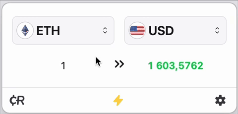
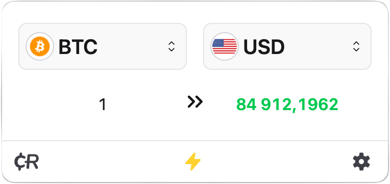
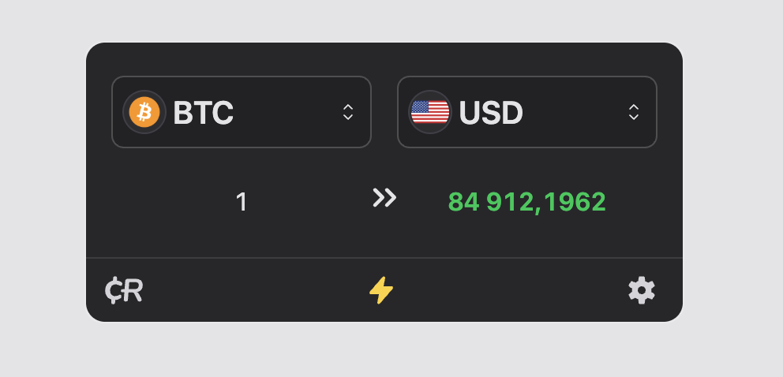
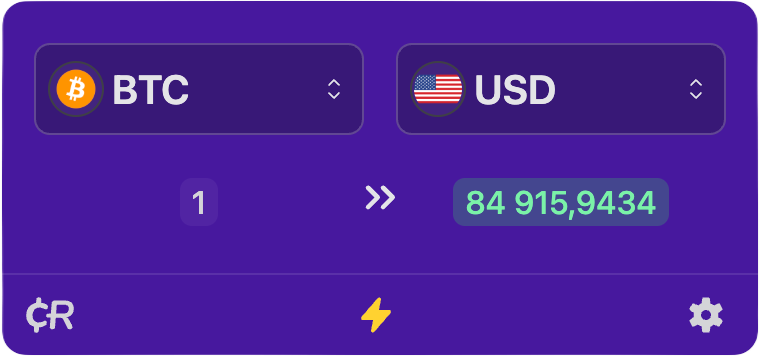

<h1 align="center">Crypto Converter ⚡ Widget</h1>

* Latest version: 3.0.3;
* Size: ≈80.0 kB;
* License: MIT

> ❗ As of April 1, the widget stopped working due to the closure of the api we used for 5 years.
> Fortunately, we found an even better alternative, so the widget will live on!
> **TODAY** is the launch 🚀 of the new updated widget. The third version.

[](https://wordpress.org/plugins/crypto-converter-widget/)

The __[Crypto Converter Widget](https://co-w.io)__ is a secure, lightweight (≈80 kB), dependency‑free JavaScript widget—hosted via CDN with SSL—to deliver real‑time ⚡ streaming price updates for cryptocurrencies (≈3 313), fiat currencies (≈170), tokens, blockchains and commodities. It requires no API key and protects against cryptojacking by offloading data processing to a secure third‑party server. With four layers of public data providers and automatic fallback, built‑in caching minimizes network requests and keeps your page fast and responsive. Featuring flexible settings, background gradient and dark‑theme support, plus SEO‑friendly markup, it integrates instantly as an Exchange Rates tool or Currency Converter—completely free and maintenance‑free.

---

[](https://buymeacoffee.com/deyurii)

---

- [Features](#features-)
- [Install](#install-%EF%B8%8F)
- [Example](#example-)
- [Changelog](#changelog-%EF%B8%8F)
- [For Developers](#for-developers-)
- [Cryptocurrencies id list](https://github.com/dejurin/crypto-converter-widget/blob/master/list.md)

## DEMO 👀 **[Example 1](https://bitcoin-pulse.pages.dev/)** | **[Example 2](https://co-w.io/)**

<a href="https://co-w.io"></a>

### Features 🤩

- [x] 🔑 No API key needed;
- [x] 🥞 Four layers of API data providers;
- [x] 🪶 Pure JavaScript ≈80kB, no dependencies;
- [x] ⚙️ Flexible settings;
- [x] ⚡ Real-time price update;
- [x] 🌐 Processed on a third-party server;
- [x] 💅 Beautiful design;
- [x] 🌈 Supports background gradient;
- [x] 🌑 Supports dark theme;
- [x] 💵 Fiat, Tokens, Blockchains, Commodity;
- [x] ₿ ≈3,313 cryptocurrencies and ≈170 fiat currencies;
- [x] 💱 Can be used as Exchange Rates or Currency Converter;
- [x] 🦠 No Cryptojacking!
- [x] ☁️ CDN Assets;
- [x] 🔐 SSL support;
- [x] 🩷 SEO-friendly;
- [x] 🆓 Free.

---

### Install 🖥️

0. Copy [example](#example-) below and set your attributes customize.
1. Enjoy.

---

### Example HTML-code 💡

```html
<!-- Crypto Converter ⚡ Widget --><crypto-converter-widget amount="1" shadow="true" locale="auto" rounded="true" quote="USD" base="BTC" theme="auto" decimal="2" stat="false"></crypto-converter-widget><a href="https://currencyrate.today/" target="_blank" rel="noopener">CurrencyRate.Today</a><script async src="https://cdn.jsdelivr.net/gh/dejurin/crypto-converter-widget@latest/dist/latest.min.js"></script><!-- /Crypto Converter ⚡ Widget -->
```

Examples: <b><a href="https://codepen.io/dejurin/pen/xbbbVBL">CodePen</a></b> | <b><a href="https://codepen.io/currencyrate_today/pen/GRmzMOm">CodePen (multi color example)</a></b>

You can find many uses for this widget, not just on the website. See how I did a live stream with cryptocurrencies: <a href="https://www.youtube.com/watch?v=LQIsk5wIAzw">https://www.youtube.com/watch?v=LQIsk5wIAzw</a>

---

### jsDelivr CDN

##### Latest

```html
https://cdn.jsdelivr.net/gh/dejurin/crypto-converter-widget@main/dist/latest.min.js
```

---

### Light Theme

<a href="https://co-w.io"></a>

### Dark Theme

<a href="https://co-w.io"></a>

### Custom Theme

<a href="https://co-w.io"></a>

---

### Layers

The price widget automatically cycles through multiple public data sources in priority order, so if one API fails or changes its response format it simply falls back to the next provider without missing a beat. Built‑in caching minimizes network requests and keeps your page fast and responsive. There’s no need for API keys or server‑side setup—just drop the HTML snippet into your page and you’re good to go. This lightweight, self‑configuring design delivers rock‑solid reliability and extreme flexibility with zero maintenance.

#### How it works

```plaintext
┌──────────────────────────────────────┐
│ 1. Provider 1 (Coindesk – full data) │
└──────────────────────────────────────┘
              ↓
   [1.1] Is detailed price in cache?
         ├─ Yes → return full price → END
         └─ No  →  
              ↓
   [1.2] Fetch from Provider 1  
         ├─ Success & status OK →  
         │     • parse detailed data  
         │     • cache full price  
         │     • return full price → END  
         └─ Failure → proceed to Provider 2  

┌───────────────────────────────────────┐
│ 2. Provider 2 (CryptoCompare – price) │
└───────────────────────────────────────┘
              ↓
   [2.1] Is simple price in cache?
         ├─ Yes → return price → END
         └─ No  →  
              ↓
   [2.2] Fetch from Provider 2  
         ├─ Success →  
         │     • parse numeric price  
         │     • cache price  
         │     • return price → END  
         └─ Failure → proceed to Provider 3  

┌──────────────────────────────────────┐
│ 3. Provider 3 (Coinbase – price)     │
└──────────────────────────────────────┘
              ↓
   [3.1] Is simple price in cache?
         ├─ Yes → return price → END
         └─ No  →  
              ↓
   [3.2] Fetch from Provider 3  
         ├─ Success →  
         │     • parse numeric price  
         │     • cache price  
         │     • return price → END  
         └─ Failure → proceed to Provider 4  

┌──────────────────────────────────────┐
│ 4. Provider 4 (OKX – price)          │
└──────────────────────────────────────┘
              ↓
   [4.1] Is simple price in cache?
         ├─ Yes → return price → END
         └─ No  →  
              ↓
   [4.2] Fetch from Provider 4  
         ├─ Success →  
         │     • parse numeric price  
         │     • cache price  
         │     • return price → END  
         └─ Failure →  
              ↓
┌────────────────────────────────────┐
│ All providers failed → show error  │
└────────────────────────────────────┘
```

---

### Changelog ✳️

#### [3.0.3] - 2025-04-19
##### Fixed
- Minor bug fixes.

#### [3.0.2] - 2025-04-18
##### Fixed
- Minor bug fixes and performance optimizations.

#### [3.0.1] - 2025-04-18
##### Added
- Implemented four layers of API data providers for enhanced reliability and redundancy.
##### Fixed
- Minor bug fixes and performance optimizations.

#### [3.0.0] - 2025-04-17
##### Added
- New core engine for improved performance and scalability.
- Updated API with expanded functionality and new endpoints.
- Support for fiat currency tracking.
- Integration with multiple blockchain networks and token standards.
- Commodity price tracking functionality.
- Exchange rate data integration.
- Currency converter feature.
##### Fixed
- Major bug fixes and stability improvements.

#### [1.5.2] - 2021-01-10
##### Fixed
- Addressed critical bugs and improved application stability.

#### [1.5.1] - 2021-01-10
##### Fixed
- Resolved major issues impacting performance and reliability.

#### [1.5.0] - 2021-01-09
##### Fixed
- Fixed significant bugs and optimized application performance.

#### [1.4.2] - 2021-01-08
##### Fixed
- Minor bug fixes and user interface improvements.

#### [1.4.1] - 2021-01-08
##### Added
- Loading animation to enhance user experience.
##### Fixed
- Minor bug fixes and performance enhancements.

#### [1.4.0] - 2021-01-07
##### Added
- Play/Pause functionality for real-time price updates.
- Request interceptors to handle poor network conditions.
##### Fixed
- Minor bug fixes and stability improvements.
##### Removed
- Sound notification for price changes.

#### [1.3.5] - 2021-01-05
##### Added
- Sound notification for price changes.
##### Fixed
- Minor bug fixes and performance tweaks.

#### [1.1.7] - 2021-01-04
##### Added
- Real-time fiat currency selection.
##### Fixed
- Minor bug fixes and user interface enhancements.

#### [1.1.6] - 2021-01-03
##### Added
- Currency symbol attribute for improved formatting.
##### Fixed
- Currency symbol display issues.
- Minor bug fixes.

#### [1.0.4] - 2020-12-12
##### Fixed
- Improved form selection with asynchronous loading.
- Fixed background image rendering issues.
- Resolved WebSocket connection start/stop issues.

#### [1.0.0] - 2020-12-11
##### Released
- Initial release of the application.
---

### For Developers 🧑‍💻

| Attribute         | Type    | Default   | Reactive | Description                                     |
|-------------------|---------|-----------|----------|-------------------------------------------------|
| base              | string  | BTC       | ☑️       | Base currency of widget (From).                 |
| quote             | string  | USD       | ☑️       | Quote currency of widget (To).                  |
| symbol            | boolean | false     | ☑️       | Display currency symbol ($).                    |
| shadow            | boolean | false     | ☑️       | Display shadow for widget.                      |
| rounded           | boolean | true      | ☑️       | Rounded corners for widget.                     |
| background-color  | string  | undefined | ☑️       | Background color of widget.                     |
| background        | string  | undefined | ☑️       | Background of widget (supports gradients).      |
| stat              | boolean | false     | ☑️       | Display fiat currency.                          |
| tax               | float   | 0         | ☑️       | Additional tax/fee for quote.                   |
| decimal           | int     | 2         | ☑️       | Number of decimal places.                       |
| amount            | float   | 1         | ☑️       | Amount of currency.                             |
| locale            | string  | auto      | ☑️       | Locale setting for widget.                      |
| theme             | string  | auto      | ☑️       | Theme of widget.                                |

---

The list of cryptocurrencies that can be selected in the widget:
https://github.com/dejurin/crypto-converter-widget/blob/master/list.md

---

### Copyright and license 

Code copyright 2023 CR.Today, [CurrencyRate](https://currencyrate.today/). Code released under [the MIT license](https://github.com/dejurin/coin-converter-widget/blob/master/LICENSE).
