# Cryptocurrency list (page: 1)

[Next →](./list/list2.md)

| Logo | ID | Symbol | Name |
|:----:|:--:|:------:|:-----|
| 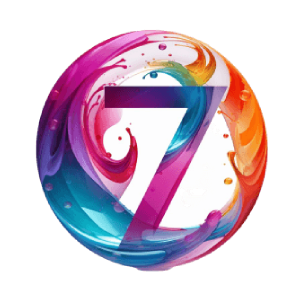 | 13557 | 7 | Lucky7 |
| 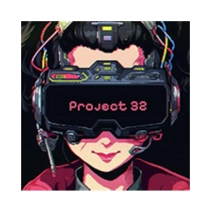 | 18499 | 32 | Project 32 |
| 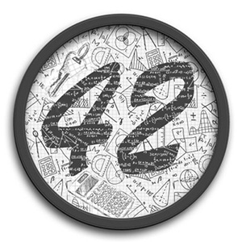 | 3318 | 42 | 42 Coin |
|  | 17809 | 47 | President Trump |
|  | 5045 | 300 | 300 token |
|  | 4074 | 365 | 365Coin |
| 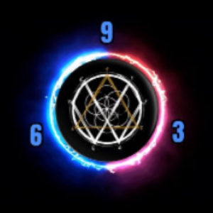 | 14100 | 369 | Nikola Tesla Token |
| 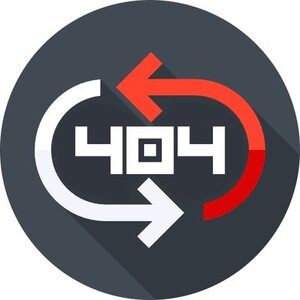 | 3803 | 404 | 404Coin |
|  | 6035 | 433 | 433 Token |
|  | 3788 | 611 | SixEleven |
| 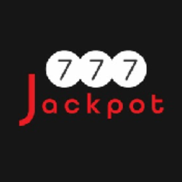 | 14569 | 777 | Jackpot |
|  | 3927 | 808 | 808 |
| 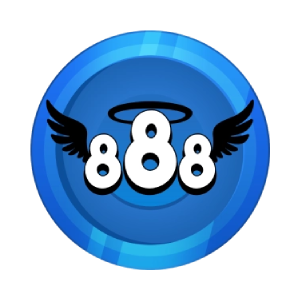 | 18253 | 888 | 888 |
|  | 7282 | 1211 | BYD Company Limited |
|  | 3782 | 1337 | EliteCoin |
|  | 3333 | 2015 | 2015 coin |
| 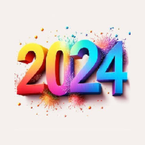 | 10831 | 2024 | 2024 |
| 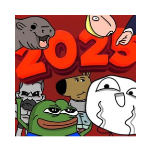 | 18512 | 2025 | 2025 TOKEN |
|  | 13112 | 2049 | TOKEN 2049 |
| 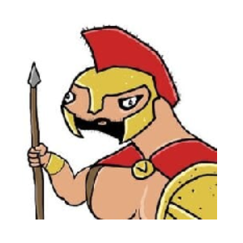 | 13834 | 2192 | LERNITAS |
| 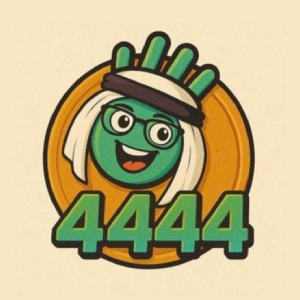 | 19263 | 4444 | 4444 Meme |
|  | 7283 | 9988 | Alibaba Group Holding Limited |
|  | 1 | BTC | Bitcoin |
|  | 2 | ETH | Ethereum |
|  | 3 | SOL | Solana |
| 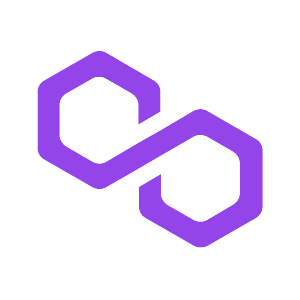 | 4 | MATIC | Polygon |
|  | 5 | USD | United States Dollar |
| 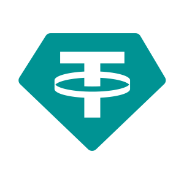 | 7 | USDT | Tether |
|  | 8 | BNB | Binance Coin |
|  | 9 | AAVE | Aave |
| 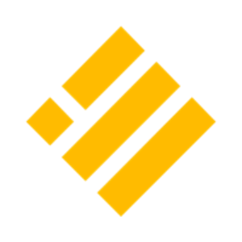 | 10 | BUSD | Binance USD |
|  | 11 | LUNC | Terra Classic |
| 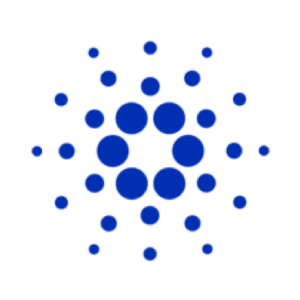 | 12 | ADA | Cardano |
|  | 13 | XRP | XRP |
| 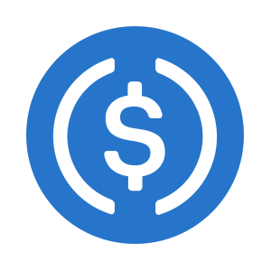 | 14 | USDC | USDC |
|  | 15 | ATOM | Cosmos |
| 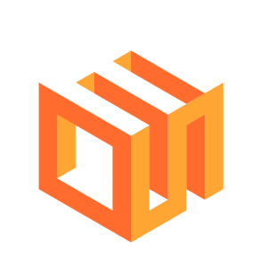 | 16 | EOS | EOS |
|  | 17 | LUNA | Terra |
| 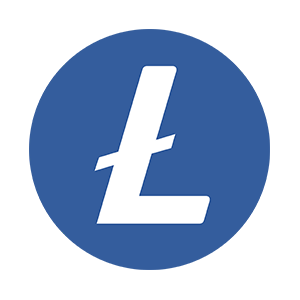 | 18 | LTC | Litecoin |
| 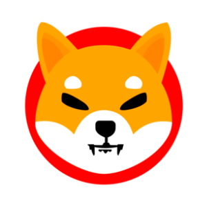 | 19 | SHIB | Shiba Inu |
|  | 20 | DOT | Polkadot |
|  | 21 | AVAX | Avalanche |
|  | 22 | RVN | Ravencoin |
| 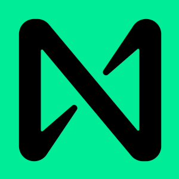 | 23 | NEAR | Near |
|  | 24 | CHZ | Chiliz |
|  | 25 | OP | Optimism |
| 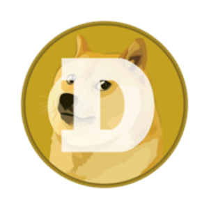 | 26 | DOGE | Dogecoin |
| 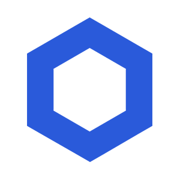 | 27 | LINK | Chainlink |
| 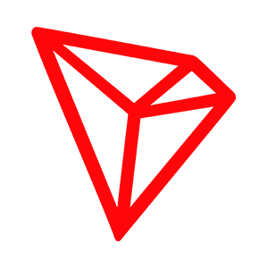 | 28 | TRX | TRON |
|  | 29 | BCH | Bitcoin Cash |
| 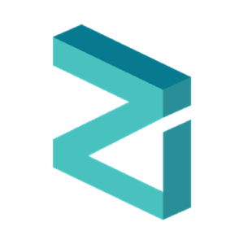 | 30 | ZIL | Zilliqa |
| 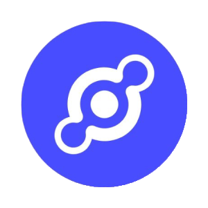 | 31 | HNT | Helium |
| 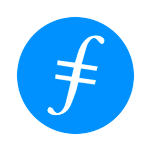 | 32 | FIL | FileCoin |
| 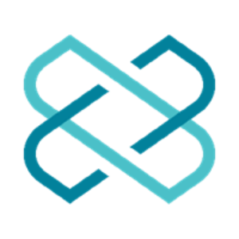 | 33 | LOOM | Loom Network |
| 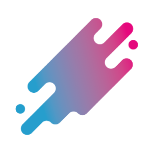 | 36 | AERGO | AERGO |
|  | 37 | APE | ApeCoin |
|  | 38 | GLM | Golem Network Token |
| 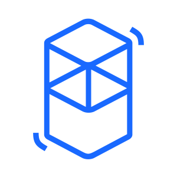 | 39 | FTM | Fantom |
| 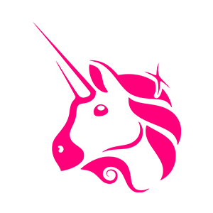 | 40 | UNI | Uniswap Protocol Token |
| 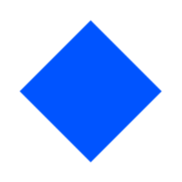 | 41 | WAVES | Waves |
|  | 42 | XMR | Monero |
|  | 43 | HBAR | Hedera Hashgraph |
|  | 44 | SAND | The Sandbox |
| 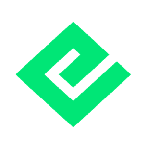 | 45 | NRG | Energi |
|  | 46 | FTT | FTX Token |
|  | 47 | REEF | Reef |
|  | 48 | FLOW | Flow |
|  | 49 | MANA | Decentraland |
| 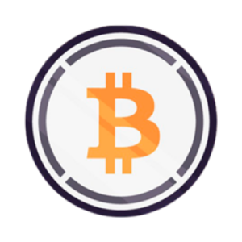 | 50 | WBTC | Wrapped Bitcoin |
| 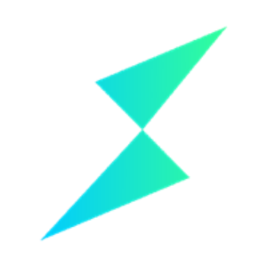 | 51 | RUNE | Thorchain |
| 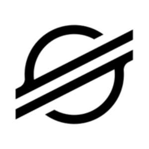 | 52 | XLM | Stellar Lumen |
| 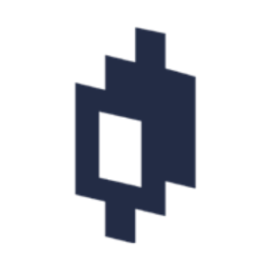 | 53 | MIR | Mirror Protocol |
| 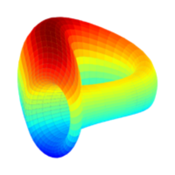 | 54 | CRV | Curve DAO Token |
|  | 55 | WING | Wing Finance |
| 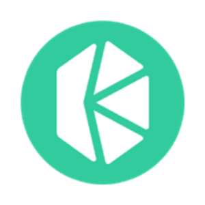 | 56 | KNC | Kyber Network Crystal v2 |
|  | 57 | ANC | Anchor Protocol |
| 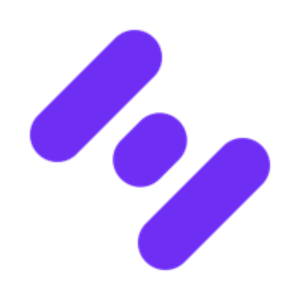 | 58 | MFT | Hifi Finance (Old) |
| 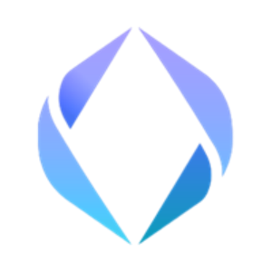 | 59 | ENS | Ethereum Name Service |
|  | 60 | TUSD | True USD |
| 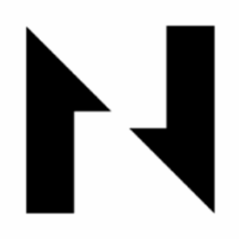 | 61 | CKB | Nervos Network |
| 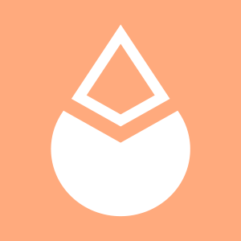 | 62 | LDO | Lido DAO |
|  | 63 | TRB | Tellor Tributes |
|  | 64 | FIRO | Firo |
|  | 65 | BEAMMW | Beam |
| 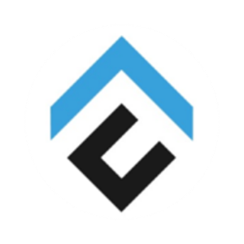 | 66 | CFX | Conflux Network |
|  | 68 | JST | JUST |
|  | 69 | COMP | Compound |
| 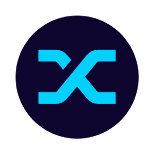 | 70 | SNX | Synthetix |
|  | 71 | NFT | APENFT |
| 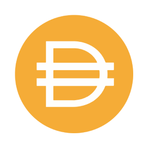 | 72 | DAI | Dai |
|  | 73 | CEL | Celsius Network |
| 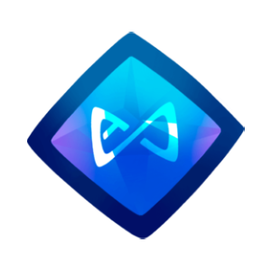 | 74 | AXS | Axie Infinity Shards |
| 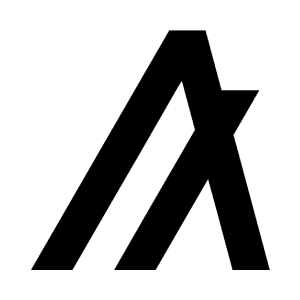 | 75 | ALGO | Algorand |
|  | 76 | QKC | QuarkChain |
| 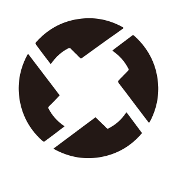 | 77 | ZRX | 0x |
| 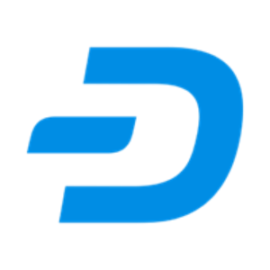 | 78 | DASH | Dash |
|  | 79 | VIB | Viberate |
| 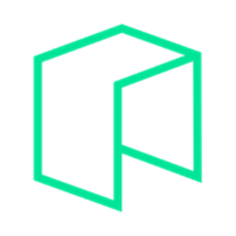 | 80 | GAS | Gas |
|  | 81 | ICP | Internet Computer |
|  | 82 | QNT | Quant |
|  | 83 | VET | VeChain |
|  | 84 | INJ | Injective |
|  | 85 | KSM | Kusama |
|  | 86 | OKB | OKB |
|  | 87 | THETA | Theta Network |
|  | 88 | CAKE | PancakeSwap |
|  | 89 | SXP | SXP |
|  | 90 | JASMY | JasmyCoin |
|  | 91 | WIN | WINkLink |
|  | 92 | DYDX | dYdX |
|  | 93 | ENJ | Enjin Coin |
|  | 94 | EPX | Ellipsis X |
|  | 95 | YFI | yearn.finance |
|  | 96 | YFII | DFI.money |
|  | 97 | POLY | Polymath Network |
|  | 98 | GMT | STEPN |
|  | 99 | BAT | Basic Attention Token |
|  | 100 | QLC | Kepple [OLD] |
|  | 101 | EURS | STASIS EURS |
|  | 102 | ZEC | ZCash |
|  | 103 | MOB | MobileCoin |
|  | 104 | OAX | Oax |
|  | 105 | MXC | Machine Xchange Coin |
|  | 106 | RSR | Reserve Rights |
|  | 107 | 1INCH | 1inch |
|  | 108 | GRT | The Graph |
|  | 109 | LRC | Loopring |
|  | 110 | BTS | Bitshares |
|  | 111 | NEO | NEO |
|  | 112 | GRS | Groestlcoin |
|  | 113 | ROSE | Oasis |
|  | 114 | EGLD | MultiversX eGold |
|  | 115 | BSW | Biswap |
|  | 116 | CRO | Cronos |
|  | 117 | UFT | UniLend Finance |
|  | 118 | BOUNTY | ChainBounty |
|  | 119 | TFUEL | Theta Fuel |
|  | 120 | SUSHI | Sushi |
|  | 121 | BTCDOM | Binance BTC Dominance Index |
|  | 122 | SNT | Status Network Token |
|  | 123 | KAIA | Kaia |
|  | 124 | KAVA | Kava |
|  | 125 | COTI | COTI |
|  | 126 | AR | Arweave |
|  | 127 | BSV | Bitcoin SV |
|  | 128 | MKR | Maker |
|  | 129 | UMA | UMA |
|  | 130 | OCEAN | Ocean Protocol |
|  | 131 | GODS | Gods Unchained |
|  | 132 | VGX | Voyager Token |
|  | 133 | UNFI | Unifi Protocol DAO |
|  | 134 | KEY | SelfKey |
|  | 135 | ANKR | Ankr Network |
|  | 136 | XTZ | Tezos |
|  | 137 | BTG | Bitcoin Gold |
|  | 138 | BAKE | BakeryToken |
|  | 139 | STEEM | Steem |
|  | 140 | QTUM | QTUM |
|  | 141 | STORJ | Storj |
|  | 142 | SRM | Serum |
|  | 143 | CTC | Creditcoin |
|  | 144 | PLA | PlayDapp |
|  | 145 | CELO | Celo |
|  | 146 | MIOTA | IOTA |
|  | 147 | USTC | TerraClassicUSD |
|  | 148 | USDP | Pax Dollar |
|  | 149 | ABBC | ABBC Coin |
|  | 150 | SKL | SKALE Network |
|  | 151 | ANT | Aragon |
|  | 152 | ONT | Ontology |
|  | 153 | MINA | Mina Protocol |
|  | 154 | ASTR | Astar |
|  | 155 | BTCST | BTC Standard Hashrate Token |
|  | 156 | PAXG | PAX Gold |
|  | 157 | CSPR | Casper Network |
|  | 158 | AHT | AhaToken |
|  | 159 | IMX | Immutable X |
|  | 160 | RNDR | Render |
|  | 161 | APM | apM Coin |
|  | 162 | NMR | Numeraire |
|  | 163 | GLMR | Moonbeam |
|  | 164 | CELR | Celer Network |
|  | 165 | SPELL | Spell Token |
|  | 166 | RLC | iExec |
|  | 167 | XNO | Xeno Token |
|  | 168 | HT | Huobi Token |
|  | 169 | WIKEN | Project WITH |
|  | 170 | MTL | Metal |
|  | 171 | BRZ | Brazilian Digital Token |
|  | 172 | MASK | Mask Network |
|  | 173 | STPT | STP Network |
|  | 174 | YGG | Yield Guild Games |
|  | 175 | WOZX | Efforce |
|  | 176 | ICX | ICON |
|  | 177 | BNT | Bancor Network Token |
|  | 178 | GHST | Aavegotchi |
|  | 179 | FLY | Franklin |
|  | 180 | DAR | Mines of Dalarnia |
|  | 181 | API3 | API3 |
|  | 182 | GALA | Gala |
|  | 183 | SLP | Smooth Love Potion |
|  | 184 | IOST | IOS token |
|  | 185 | CLV | Clover Finance |
|  | 186 | OGN | Origin Protocol |
|  | 189 | BORA | BORA |
|  | 190 | NEBL | Neblio |
|  | 191 | CHR | Chromia |
|  | 192 | KDA | Kadena |
|  | 193 | IOTX | IoTeX Network |
|  | 194 | REP | Reputation |
|  | 195 | STMX | StormX |
|  | 196 | BAND | Band Protocol |
|  | 197 | ALPHA | Stella |
|  | 198 | WOO | WOO |
|  | 199 | EPICV1 | Ethernity Chain |
|  | 200 | ACH | Alchemy Pay |
|  | 201 | CVC | Civic |
|  | 202 | VIDT | VIDT DAO |
|  | 203 | WOM | WOM |
|  | 204 | REQ | Request Network |
|  | 205 | ADX | Ambire AdEx |
|  | 206 | VOXEL | Voxies |
|  | 207 | ORN | Orion |
|  | 208 | BOA | BOSAGORA |
|  | 209 | CHANGE | ChangeX |
|  | 210 | HYDRA | Hydra |
|  | 211 | XVG | Verge |
|  | 212 | KP3R | Keep3rV1 |
|  | 213 | COCOS | COCOS BCX |
|  | 214 | ARPA | ARPA Chain |
|  | 215 | BETA | Beta Finance |
|  | 216 | ORBS | Orbs |
|  | 217 | WABI | WABI |
|  | 218 | ATA | Automata |
|  | 219 | ATM | Atletico de Madrid Fan Token |
|  | 220 | TVK | Terra Virtua Kolect |
|  | 221 | BLZ | Bluzelle |
|  | 222 | HIGH | Highstreet |
|  | 223 | RAY | Raydium |
|  | 224 | LIT | Litentry |
|  | 225 | BEL | Bella Protocol |
|  | 226 | DESO | Decentralized Social |
|  | 227 | PERP | Perpetual Protocol  |
|  | 228 | SFP | SafePal |
|  | 229 | LOKA | League of Kingdoms |
|  | 230 | XCH | Chia |
|  | 231 | FORT | Forta |
|  | 232 | FITFI | Step App |
|  | 233 | HERO | Metahero |
|  | 234 | XPR | Proton |
|  | 235 | DUSK | Dusk Network |
|  | 236 | BLOK | Bloktopia |
|  | 237 | AUCTION | Bounce |
|  | 238 | PYR | Vulcan Forged |
|  | 239 | CVX | Convex Finance |
|  | 240 | DOCK | Dock.io |
|  | 241 | WTC | Waltonchain |
|  | 242 | METIS | Metis Token |
|  | 243 | VLX | Velas |
|  | 244 | AUDIO | Audius |
|  | 245 | TITAN | TitanSwap |
|  | 246 | ILV | Illuvium |
|  | 247 | DEP | DEAPCOIN |
|  | 249 | PHB | Phoenix Global |
|  | 250 | TWT | Trust Wallet Token |
|  | 251 | NWC | Numerico |
|  | 252 | FARM | Harvest Finance |
|  | 253 | SOLO | Sologenic |
|  | 254 | DAWN | Dawn Protocol |
|  | 255 | PICKLE | Pickle Finance |
|  | 256 | MOC | Mossland |
|  | 257 | FAIRG | FairGame |
|  | 258 | MBOX | MOBOX |
|  | 259 | PHA | Phala Network |
|  | 263 | POLS | Polkastarter |
|  | 264 | BIT | BitDAO |
|  | 265 | FLM | Flamingo |
|  | 266 | TT | ThunderCore |
|  | 267 | AION | Aion |
|  | 270 | OGSP | OriginSport |
|  | 271 | KISHU | Kishu Inu |
|  | 272 | CVP | PowerPool Concentrated Voting Power |
|  | 273 | MDT | Measurable Data Token |
|  | 274 | TCT | TokenClub |
|  | 275 | PROM | Prometeus |
|  | 277 | NBS | New BitShares |
|  | 278 | DGB | DigiByte |
|  | 279 | QI | BENQI |
|  | 280 | GVR | GroveCoin |
|  | 281 | METADIUM | Metadium |
|  | 283 | DTA | Data |
|  | 284 | ONIT | ONBUFF |
|  | 285 | HQX | HOQU |
|  | 286 | GRPL | Golden Ratio Per Liquidity |
|  | 287 | YAMV2 | YAM v2 |
|  | 291 | CREAM | Cream |
|  | 293 | ERD | Elrond |
|  | 294 | RFCTR | Reflector.Finance |
|  | 297 | CHAL | Chalice Finance |
|  | 298 | GBP | British Pound Sterling |
|  | 299 | APT | Aptos |
|  | 300 | LEO | LEO Token |
|  | 301 | HBTC | Huobi BTC |
|  | 302 | VIC | Viction |
|  | 303 | BTCB | Binance-Peg Bitcoin (Binance Bridge) |
|  | 304 | RENBTC | renBTC |
|  | 305 | ONE | Harmony |
|  | 306 | WETH | Wrapped Ether |
|  | 307 | OETH | Ethereum (Orbit Bridge) |
|  | 308 | RBTC | Rootstock Smart Bitcoin |
|  | 309 | BTCPX | BTC Proxy |
|  | 310 | SETH | sETH |
|  | 311 | SETH2 | sETH2 |
|  | 312 | BETH | Beacon ETH |
|  | 314 | ETC | Ethereum Classic |
|  | 315 | GUSD | Gemini Dollar |
|  | 318 | FRAX | Frax |
|  | 319 | GOBTC | goBTC |
|  | 321 | RENDOGE | renDOGE |
|  | 325 | KCS | KuCoin Token |
|  | 326 | PCI | PayProtocol Paycoin |
|  | 327 | XDC | XDC Network |
|  | 328 | NEXO | NEXO |
|  | 329 | XEC | eCash |
|  | 330 | LYXE | LUKSO (OLD) |
|  | 331 | HFT | Hashflow |
|  | 332 | DERO | Dero |
|  | 333 | JOE | JOE |
|  | 334 | FUN | FUN Token |
|  | 335 | DENT | Dent |
|  | 336 | FET | Artificial Superintelligence Alliance |
|  | 337 | STRAX | Stratis |
|  | 338 | GT | GateToken |
|  | 339 | OSMO | Osmosis |
|  | 340 | FXS | Frax Share |
|  | 341 | SOLIC | Solice |
|  | 342 | MX | MX Token |
|  | 343 | BDX | Beldex |
|  | 344 | KIN | Kin |
|  | 345 | DFI | DeFiChain |
|  | 346 | PARA | Paralink Network |
|  | 347 | STG | Stargate Finance |
|  | 348 | CETH | Compound Ethereum |
|  | 349 | XRD | Radix |
|  | 350 | UBEX | Ubex |
|  | 351 | MULTI | Multichain |
|  | 352 | CAPP | Cappasity |
|  | 353 | HEZ | Hermez Network Token |
|  | 354 | WHOLE | Whole Network |
|  | 355 | NU | NuCypher |
|  | 356 | FTI | FansTime |
|  | 357 | AURORA | Aurora |
|  | 358 | BIX | BiboxCoin |
|  | 359 | BCUG | Blockchain Cuties Universe Governance |
|  | 360 | DHV | DeHive |
|  | 361 | FORESTPLUS | The Forbidden Forest |
|  | 362 | YIELD | Yield Protocol |
|  | 363 | ADB | Adbank |
|  | 364 | LIEN | Lien |
|  | 365 | MEOW | MEOW |
|  | 366 | AMP | Amp |
|  | 367 | STX | Stacks |
|  | 368 | BAL | Balancer |
|  | 369 | GAL | Galxe |
|  | 370 | BICO | Biconomy |
|  | 371 | DCR | Decred |
|  | 372 | XEM | NEM |
|  | 373 | HOT | Holo |
|  | 374 | BEAM | Beam |
|  | 375 | TEL | Telcoin |
|  | 376 | EWT | Energy Web Token |
|  | 377 | XYM | Symbol |
|  | 378 | EUM | Elitium |
|  | 379 | GNO | Gnosis |
|  | 380 | SFM | SafeMoon |
|  | 381 | MLK | MiL.k Alliance |
|  | 382 | CET | CoinEx Token |
|  | 383 | RBN | Ribbon Finance |
|  | 384 | ONGAS | Ontology Gas |
|  | 385 | MCO | Crypto.com |
|  | 386 | DAO | DAO Maker |
|  | 387 | NEST | Nest Protocol |
|  | 388 | CHSB | SwissBorg |
|  | 389 | CVNT | Conscious Value Network |
|  | 390 | WAXP | Worldwide Asset eXchange |
|  | 391 | BTRST | Braintrust |
|  | 392 | UQC | Uquid Coin |
|  | 393 | ULTRA | Ultra |
|  | 394 | TRIBE | Tribe |
|  | 395 | USDJ | USDJ |
|  | 396 | DAG | Constellation |
|  | 397 | OMI | ECOMI |
|  | 398 | LPT | Livepeer |
|  | 399 | SENSO | SENSO |
|  | 400 | ZYN | Zynecoin |
|  | 401 | SCRT | Secret |
|  | 402 | T | Threshold Network Token |
|  | 403 | GTC | Gitcoin |
|  | 404 | EFI | Efinity |
|  | 405 | OMG | OMG Network |
|  | 406 | RAD | Radworks |
|  | 407 | DKA | dKargo |
|  | 408 | FLUX | Flux |
|  | 409 | XAUT | Tether Gold |
|  | 410 | POWR | Power Ledger |
|  | 411 | WRX | WazirX |
|  | 412 | DAC | Davinci Coin |
|  | 413 | OCN | Odyssey |
|  | 414 | VIDY | Vidy |
|  | 415 | TKO | Tokocrypto |
|  | 416 | PVT | Pivot Token |
|  | 417 | RLY | Rally |
|  | 418 | GOM2 | GoMoney2 |
|  | 419 | HIVE | Hive |
|  | 420 | VALUE | Value Liquidity |
|  | 421 | BOTX | BOTXCOIN |
|  | 422 | VEED | VEED |
|  | 423 | KAI | KardiaChain |
|  | 424 | MAN | Matrix AI Network |
|  | 425 | ZEN | Horizen |
|  | 426 | XRA | Xriba |
|  | 427 | SBR | Saber |
|  | 428 | PNG | Pangolin |
|  | 429 | SC | Siacoin |
|  | 430 | RARE | SuperRare |
|  | 431 | ALICE | My Neighbor Alice |
|  | 432 | MED | Medibloc |
|  | 433 | SSV | ssv.network |
|  | 434 | XVS | Venus |
|  | 435 | KCASH | Kcash |
|  | 436 | DODO | DODO |
|  | 437 | LSK | Lisk |
|  | 438 | HGET | Hedget |
|  | 439 | GF | GuildFi |
|  | 440 | CTSI | Cartesi |
|  | 441 | AMO | AMO Coin |
|  | 442 | CQT | Covalent |
|  | 443 | TOKO | ToKoin |
|  | 444 | LOOKS | LooksRare |
|  | 445 | WHALE | WHALE |
|  | 446 | SUPER | SuperVerse |
|  | 447 | CGG | Chain Guardians |
|  | 448 | EXRD | e-Radix |
|  | 449 | BEPRO | BEPRO Network |
|  | 450 | OM | MANTRA |
|  | 451 | LAMB | Lambda |
|  | 452 | SWRV | Swerve |
|  | 453 | OLT | OneLedger |
|  | 454 | ENQ | Enecuum |
|  | 455 | ELF | aelf |
|  | 456 | INDI | IndiGG |
|  | 457 | ALI | Alethea Artificial Liquid Intelligence Token |
|  | 458 | IQ | IQ |
|  | 459 | BOBA | Boba Network |
|  | 460 | NANO | Nano |
|  | 461 | REN | REN |
|  | 462 | XDB | DigitalBits |
|  | 463 | XPRT | Persistence |
|  | 464 | ISP | Ispolink |
|  | 465 | CTK | Shentu |
|  | 466 | VAL | Validity |
|  | 467 | SEELE | Seele-N |
|  | 468 | CAS | Cashaa |
|  | 469 | TRAC | OriginTrail |
|  | 470 | ERG | Ergo |
|  | 471 | KEEP | Keep Network |
|  | 472 | MOVR | Moonriver |
|  | 473 | OXT | Orchid Protocol |
|  | 474 | SUKU | SUKU |
|  | 475 | MBL | MovieBloc |
|  | 476 | ARDR | Ardor |
|  | 477 | EVER | Everscale |
|  | 478 | SYS | Syscoin |
|  | 479 | GFI | Goldfinch |
|  | 480 | MAP | MAP Protocol |
|  | 481 | ARRR | Pirate Chain |
|  | 482 | MHC | MetaHash |
|  | 483 | CHESS | Tranchess |
|  | 484 | POLK | Polkamarkets |
|  | 485 | UX | UX Chain |
|  | 486 | LTO | LTO Network |
|  | 487 | MPL | Maple |
|  | 488 | TLOS | Telos |
|  | 489 | LQTY | Liquity |
|  | 490 | BAX | BABB |
|  | 491 | MPLX | Metaplex |
|  | 492 | FKX | FortKnoxster |
|  | 493 | CERE | Cere Network |
|  | 494 | DIA | DIA |
|  | 495 | TOKAMAK | Tokamak Network |
|  | 496 | XYO | XY Oracle |
|  | 497 | BMX | BitMart Token |
|  | 498 | HMT | HUMAN Token |
|  | 499 | NKN | NKN |
|  | 500 | BADGER | Badger DAO |
|  | 501 | VTHO | VeChainThor |
|  | 502 | QUICKOLD | Quickswap [OLD] |
|  | 503 | TRU | TrueFi |
|  | 504 | RARI | Rarible |
|  | 505 | RIF | RSK Infrastructure Framework |
|  | 506 | AST | AirSwap |
|  | 507 | HTR | Hathor |
|  | 508 | TORN | Tornado Cash |
|  | 509 | BHP | Blockchain of Hash Power |
|  | 510 | ACM | AC Milan Fan Token |
|  | 511 | POND | Marlin |
|  | 512 | EURT | Euro Tether |
|  | 513 | HUNT | HUNT |
|  | 514 | STARL | StarLink |
|  | 515 | IDEX | IDEX |
|  | 516 | FST | Futureswap |
|  | 517 | UBX | UBIX Network |
|  | 518 | GUM | Gourmet Galaxy |
|  | 519 | ZAM | Zamio |
|  | 520 | HEX | HEX |
|  | 521 | INT | Internet Node token |
|  | 522 | PBTC | pTokens BTC |
|  | 523 | TRUE | True Chain |
|  | 524 | CATTO | Cat Token |
|  | 525 | RUFF | Ruff |
|  | 526 | CMT | CyberMiles |
|  | 527 | CTI | ClinTex CTi |
|  | 528 | MERCU | Merculet |
|  | 529 | TCP | The Crypto Prophecies |
|  | 530 | STETH | Staked Ether |
|  | 531 | STRP | Strips Finance |
|  | 532 | TIME | Chrono.tech |
|  | 533 | DF | dForce |
|  | 534 | FORTH | Ampleforth Governance Token |
|  | 535 | ALBT | AllianceBlock |
|  | 536 | ADS | Adshares |
|  | 537 | ALPACA | Alpaca Finance |
|  | 538 | UTK | xMoney |
|  | 539 | CWAR | Cryowar Token |
|  | 540 | BOSON | Boson Protocol |
|  | 541 | CLO | Callisto Network |
|  | 542 | FSN | Fusion |
|  | 543 | SAFEX | SafeExchangeCoin |
|  | 544 | HEGIC | Hegic |
|  | 545 | AKT | Akash Network |
|  | 546 | ARK | ARK |
|  | 547 | SNM | SONM |
|  | 548 | AUTO | Auto |
|  | 549 | AVG | Avocado DAO |
|  | 550 | REV | Revain |
|  | 551 | BIFI | Beefy |
|  | 552 | ETHW | EthereumPoW |
|  | 553 | RNT | OneRoot Network |
|  | 554 | AGIX | SingularityNET |
|  | 555 | MLN | Enzyme |
|  | 556 | REVV | REVV |
|  | 557 | BLY | Blocery |
|  | 558 | WXT | WXT |
|  | 559 | NOIA | Syntropy |
|  | 560 | PLANETS | PlanetWatch |
|  | 561 | ORCA | Orca |
|  | 562 | BOND | BarnBridge |
|  | 563 | PRO | Propy |
|  | 564 | LCX | LCX |
|  | 565 | WAN | Wanchain |
|  | 566 | AVA | AVA |
|  | 567 | ALEPH | Aleph.im |
|  | 568 | DORA | Dora Factory |
|  | 569 | EVEREST | Everest |
|  | 570 | ETN | Electroneum |
|  | 571 | PSTAKE | pSTAKE Finance |
|  | 572 | MDX | Mdex (BSC) |
|  | 573 | OPUL | Opulous |
|  | 574 | WNXM | Wrapped NXM |
|  | 575 | AMPL | Ampleforth |
|  | 576 | GARI | Gari Network |
|  | 577 | ALCX | Alchemix |
|  | 578 | C98 | Coin98 |
|  | 579 | FIS | Stafi |
|  | 580 | MONA | MonaCoin |
|  | 581 | FOX | ShapeShift FOX Token |
|  | 582 | IRIS | IRIS Network |
|  | 583 | MCO2 | Moss Carbon Credit |
|  | 584 | IGNIS | Ignis |
|  | 585 | KLV | Klever |
|  | 586 | DRGN | Dragonchain |
|  | 587 | ZANO | Zano |
|  | 588 | LUFFY | Luffy |
|  | 589 | VSYS | V Systems |
|  | 590 | BONDLY | Forj |
|  | 591 | CELL | Cellframe |
|  | 592 | POLC | Polka City |
|  | 593 | VID | Vivid Labs |
|  | 594 | DATA | Streamr |
|  | 595 | MONAV | Monavale |
|  | 596 | RFUEL | Rio DeFi |
|  | 597 | GSWAP | Gameswap |
|  | 598 | WICC | WaykiChain |
|  | 599 | MUSE | Muse DAO |
|  | 600 | XHV | Haven Protocol |
|  | 601 | TBTC | tBTC |
|  | 602 | ZKP | Panther Protocol |
|  | 603 | OXY | Oxygen |
|  | 604 | SHA | Safe Haven |
|  | 605 | CRPT | Crypterium |
|  | 606 | ABYSS | Abyss Finance |
|  | 607 | MTA | Meta |
|  | 608 | HC | HyperCash |
|  | 609 | PBR | PolkaBridge |
|  | 610 | ICOS | ICOBox |
|  | 611 | XED | Exeedme |
|  | 612 | VSP | Vesper Finance |
|  | 613 | INSUR | InsurAce |
|  | 614 | SHR | ShareToken |
|  | 615 | ABL | Airbloc |
|  | 616 | LOON | Loon Network |
|  | 617 | GRIN | Grin |
|  | 618 | PPT | Populous |
|  | 619 | LBC | LBRY Credits |
|  | 620 | O3 | O3 Swap |
|  | 621 | YOU | YOU Chain |
|  | 622 | ACHAIN | Achain |
|  | 623 | PSP | ParaSwap |
|  | 624 | COV | Covesting |
|  | 625 | GENS | Genshiro |
|  | 626 | PAY | TenX |
|  | 627 | HARD | Kava Lend |
|  | 628 | SRK | SparkPoint |
|  | 629 | CWS | Crowns |
|  | 630 | HMR | Homeros |
|  | 631 | AE | Aeternity |
|  | 632 | NAOS | NAOS Finance |
|  | 633 | DREP | DREP |
|  | 634 | EGT | Egretia |
|  | 635 | VRA | Verasity |
|  | 636 | BMI | Bridge Mutual |
|  | 637 | VELO | Velo |
|  | 638 | NAS | Nebulas |
|  | 639 | KMD | Komodo |
|  | 641 | SDN | Shiden Network |
|  | 642 | XTN | Neutrino Index Token |
|  | 643 | ELA | Elastos |
|  | 644 | RSV | Reserve |
|  | 645 | TROY | Troy |
|  | 646 | FIO | FIO Protocol |
|  | 647 | DX | DxChain Token |
|  | 648 | BCD | Bitcoin Diamond |
|  | 649 | CARRY | Carry |
|  | 650 | DDX | DerivaDAO |
|  | 651 | VITE | VITE |
|  | 652 | AGLD | Adventure Gold |
|  | 653 | SOLVE | SOLVE |
|  | 654 | RFR | Refereum |
|  | 655 | PRQ | PARSIQ |
|  | 656 | MIX | MixMarvel Token |
|  | 657 | DAD | DAD |
|  | 658 | TLM | Alien Worlds |
|  | 659 | SYLO | Sylo |
|  | 660 | MATH | MATH |
|  | 661 | NULS | Nuls |
|  | 662 | CTX | Cryptex |
|  | 663 | SAMO | Samoyedcoin |
|  | 664 | DPI | DeFiPulse Index |
|  | 665 | UBT | UniBright |
|  | 666 | XRT | Robonomics Network |
|  | 667 | BTM | Bytom |
|  | 668 | YCC | Yuan Chain Coin |
|  | 669 | DEXT | DEXTools |
|  | 670 | ROOK | KeeperDAO |
|  | 671 | DNT | district0x |
|  | 672 | AAA | Moon Rabbit |
|  | 673 | FEI | Fei Protocol |
|  | 674 | COVAL | Circuits of Value |
|  | 675 | ASM | Assemble AI |
|  | 676 | LYM | Lympo |
|  | 677 | OOKI | Ooki |
|  | 678 | COS | Contentos |
|  | 679 | PST | Primas |
|  | 680 | INDEX | Index Cooperative |
|  | 681 | FRONT | Frontier |
|  | 682 | PNK | Kleros |
|  | 683 | SCLP | Scallop |
|  | 684 | TONE | TE-FOOD |
|  | 685 | DEGO | Dego Finance |
|  | 686 | CENNZ | Centrality Token |
|  | 687 | WCFG | Wrapped Centrifuge |
|  | 688 | PIVX | Private Instant Verified Transaction |
|  | 689 | CTXC | Cortex |
|  | 690 | CNTM | Connectome |
|  | 691 | PAID | PAID Network |
|  | 692 | CUDOS | Cudos |
|  | 693 | MARO | Maro |
|  | 694 | ABT | ArcBlock |
|  | 695 | STOX | Stox |
|  | 696 | DVI | Dvision Network |
|  | 697 | PRE | Presearch |
|  | 698 | ZSC | Zeusshield |
|  | 699 | AMB | AirDAO |
|  | 700 | PERL | Perlin |
|  | 701 | HIT | HitChain |
|  | 702 | NIM | Nimiq |
|  | 703 | LA | LATOKEN |
|  | 704 | JAR | Jarvis+ |
|  | 705 | GTO | GIFTO |
|  | 706 | FOR | ForTube |
|  | 707 | PAINT | MurAll |
|  | 708 | BF | BitForex Token |
|  | 709 | SOUL | Phantasma |
|  | 710 | CAPS | Ternoa |
|  | 711 | AKRO | Akropolis |
|  | 712 | HAI | Hacken Token |
|  | 713 | KRL | Kryll |
|  | 714 | PNT | pNetwork Token |
|  | 715 | HNS | Handshake |
|  | 716 | OHM | Olympus |
|  | 717 | SERO | Super Zero |
|  | 718 | MITH | Mithril |
|  | 719 | KYL | Kylin Network |
|  | 720 | QSP | Quantstamp |
|  | 721 | GOF | Golff |
|  | 722 | SWFTC | SWFTCoin |
|  | 723 | KUMA | Kuma Inu |
|  | 724 | RFOX | RedFOX Labs |
|  | 725 | CRU | Crust Network |
|  | 726 | SFG | S.Finance |
|  | 727 | APL | Apollo Currency |
|  | 728 | NFTX | NFTX |
|  | 729 | LGCY | LGCY Network |
|  | 730 | RAIREFLEX | Rai Reflex Index |
|  | 731 | IOWN | iOWN Token |
|  | 732 | WEST | Waves Enterprise |
|  | 733 | DBC | DeepBrain Chain |
|  | 734 | BKK | BKEX Token |
|  | 735 | MTV | MultiVAC |
|  | 736 | FRM | Ferrum Network |
|  | 737 | TRIAS | Trias |
|  | 738 | TOPN | TOP Network |
|  | 739 | MBS | MonkeyLeague |
|  | 740 | EDEN | EDEN |
|  | 741 | ARV | Ariva |
|  | 742 | RING | Darwinia Network |
|  | 743 | GNY | GNY |
|  | 744 | GBPT | poundtoken |
|  | 745 | XOR | Sora |
|  | 746 | SNC | SunContract |
|  | 747 | SMARTM | SmartMesh |
|  | 748 | TNB | Time New Bank |
|  | 749 | LBA | Cred |
|  | 750 | SWINGBY | Swingby |
|  | 751 | STRONG | Strong |
|  | 752 | SHROOM | Niftyx Protocol |
|  | 753 | UNIL | UniLayer |
|  | 754 | REDI | REDi |
|  | 755 | BCDT | EvidenZ |
|  | 756 | ROOBEE | ROOBEE |
|  | 757 | HPB | High Performance Blockchain |
|  | 758 | DDD | Scry.info |
|  | 759 | OPCT | Opacity |
|  | 760 | 2KEY | 2key.network |
|  | 761 | DPY | Delphy |
|  | 762 | MDA | Moeda |
|  | 763 | ELEC | Electrify.Asia |
|  | 764 | BEST | Bitpanda Ecosystem Token |
|  | 765 | HBD | Hive Dollar |
|  | 766 | SWTH | Carbon |
|  | 767 | GO | GoChain |
|  | 768 | GZONE | GameZone |
|  | 769 | TMTG | The Midas Touch Gold |
|  | 770 | SUTER | Suterusu |
|  | 771 | CVT | CyberVein |
|  | 772 | SASHIMI | Sashimi |
|  | 776 | RENAVAX | renAVAX |
|  | 779 | RENLUNA | renLUNA |
|  | 780 | RENMATIC | renMATIC |
|  | 781 | RENUSDC | renUSDC |
|  | 782 | RENUNI | renUNI |
|  | 783 | RENLINK | renLINK |
|  | 784 | RENDAI | renDAI |
|  | 785 | RENBCH | renBCH |
|  | 786 | RENZEC | renZEC |
|  | 787 | RENFIL | renFIL |
|  | 788 | RENBNB | renBNB |
|  | 789 | RENFTM | renFTM |
|  | 790 | RENUSDT | renUSDT |
|  | 791 | RENCRV | renCRV |
|  | 792 | RENFTT | renFTT |
|  | 793 | BNX | BinaryX |
|  | 794 | HEDG | HedgeTrade |
|  | 795 | MAID | MaidSafe Coin |
|  | 796 | SWAP | Trustswap |
|  | 797 | AVT | Aventus |
|  | 798 | SALT | Salt Lending |
|  | 799 | BCN | ByteCoin |
|  | 800 | SDL | Saddle Finance |
|  | 801 | EM | Eminer |
|  | 802 | KAT | Kambria |
|  | 803 | RAVENCOINC | Ravencoin Classic |
|  | 804 | KAN | Bitkan |
|  | 805 | OPENP | Open Platform |
|  | 806 | GMB | GMB |
|  | 807 | OPENCHAT | OpenChat |
|  | 808 | ARB | Arbitrum |
|  | 810 | WBNB | Wrapped BNB |
|  | 811 | WTRX | Wrapped Tron |
|  | 813 | TON | Toncoin |
|  | 814 | USDD | USDD |
|  | 815 | XCN | Onyxcoin |
|  | 816 | BTTOLD | BitTorrent |
|  | 817 | MCH | Meconcash |
|  | 818 | BTT | BitTorrent |
|  | 819 | JUPI | Jupiter |
|  | 820 | GMX | GMX |
|  | 821 | GBYTE | Obyte |
|  | 822 | SIGNA | Signa |
|  | 823 | TRL | Triall |
|  | 824 | MV | GensoKishi Metaverse |
|  | 825 | EXPAND | Expand |
|  | 826 | CRDTS | Credits |
|  | 828 | BGB | Bitget Token |
|  | 829 | TMG | T-mac DAO |
|  | 830 | RPL | RocketPool |
|  | 831 | SLND | Solend |
|  | 833 | LUSD | Liquity USD |
|  | 834 | HORD | Hord |
|  | 835 | NXT | Nxt |
|  | 836 | YAM | YAM |
|  | 837 | SKM | Skrumble Network |
|  | 838 | ELON | Dogelon Mars |
|  | 839 | FUSE | Fuse Network Token |
|  | 840 | BONE | Bone ShibaSwap |
|  | 841 | LN | LINK |
|  | 842 | BRISE | Bitgert |
|  | 843 | MAGIC | MAGIC |
|  | 844 | ZEON | Zeon Network |
|  | 845 | BABYDOGE | BABYDOGE |
|  | 846 | PEOPLE | ConstitutionDAO |
|  | 847 | VUSDC | Venus USDC |
|  | 848 | KRD | Krypton DAO |
|  | 849 | FIDA | Bonfida |
|  | 850 | VVS | VVS Finance |
|  | 851 | PUNDIX | Pundi X |
|  | 852 | KOK | KOK Chain |
|  | 853 | VERI | Veritaseum |
|  | 855 | WEMIX | WEMIX |
|  | 856 | SD | Stader |
|  | 857 | DEXE | DeXe |
|  | 858 | AVINOC | AVINOC |
|  | 860 | KAS | Kaspa |
|  | 861 | HOOK | Hooked Protocol |
|  | 862 | MVL | MVL |
|  | 863 | HI | hi Dollar |
|  | 864 | FX | Function X |
|  | 865 | ACA | Acala |
|  | 866 | CEEK | CEEK Smart VR Token |
|  | 867 | CFG | Centrifuge |
|  | 869 | RACA | Radio Caca V2 |
|  | 870 | VBUSD | Venus BUSD |
|  | 871 | BFC | Bifrost |
|  | 872 | HUM | Humanscape |
|  | 873 | CVAULT | cVault.finance |
|  | 874 | POLIS | Star Atlas DAO |
|  | 875 | POLYX | Polymesh |
|  | 876 | MNW | Morpheus Network |
|  | 877 | WEVER | Wrapped Ever (Wrappedever bridge) |
|  | 878 | VAI | Vai |
|  | 880 | LOCUS | Locus Chain |
|  | 881 | QUACK | Rich Quack |
|  | 882 | SURE | inSure |
|  | 883 | ORC | Orbit Chain |
|  | 884 | BLD | Agoric |
|  | 885 | WVLX | Wrapped Velas |
|  | 886 | WMTX | World Mobile Token |
|  | 887 | OUSD | Origin Dollar |
|  | 888 | XSGD | XSGD |
|  | 889 | BURGER | BurgerCities |
|  | 890 | KUB | Bitkub Coin |
|  | 891 | NYM | Nym Token |
|  | 892 | FLX | Reflexer Ungovernance Token |
|  | 893 | AXL | Axelar |
|  | 894 | REDTOKEN | RED TOKEN |
|  | 895 | HPT | Huobi Pool Token |
|  | 896 | HYC | HYCON |
|  | 897 | LET | LinkEye |
|  | 898 | VOLT | Volt Inu |
|  | 899 | TSL | Energo |
|  | 900 | CNNS | CNNS |
|  | 901 | NYE | NewYork Exchange |
|  | 902 | TOPC | Topchain |
|  | 903 | VINCI | VINCI |
|  | 904 | COL | Clash of Lilliput |
|  | 905 | SUN | Sun Token |
|  | 906 | AXEL | AXEL |
|  | 907 | RAMP | RAMP |
|  | 908 | CCD | Concordium |
|  | 909 | DMG | DMM: Governance |
|  | 910 | FLOKI | Floki |
|  | 911 | ONUS | ONUS |
|  | 912 | SFUND | Seedify.fund |
|  | 913 | BWO | Battle World |
|  | 914 | XWC | WhiteCoin |
|  | 915 | SAITA | SaitaChain Coin |
|  | 916 | ASD | AscendEX Token |
|  | 917 | MBX | Marblex |
|  | 918 | MUSD | mStable USD |
|  | 919 | DIVI | Divi Project |
|  | 920 | GTN | GlitzKoin |
|  | 921 | SSX | SOMESING |
|  | 922 | TRR | Terran Coin |
|  | 923 | RSS3 | RSS3 |
|  | 924 | XCAD | XCAD Network |
|  | 926 | NXM | Nexus Mutual |
|  | 930 | ANY | Anyswap |
|  | 931 | ANKRETH | Ankr Staked ETH |
|  | 932 | STRIKE | Strike |
|  | 933 | HUSD | HUSD |
|  | 934 | KUNCI | Kunci Coin |
|  | 935 | MTRG | Meter |
|  | 936 | NVIR | NvirWorld |
|  | 937 | VUSDT | Venus USDT |
|  | 938 | H2O | H2O Dao |
|  | 939 | LEVER | LeverFi |
|  | 940 | HSF | Hillstone Finance |
|  | 941 | UFO | UFO Gaming |
|  | 942 | PMGT | Perth Mint Gold Token |
|  | 943 | JFI | JackPool.finance |
|  | 944 | LAT | PlatON Network |
|  | 945 | GXC | GXChain |
|  | 946 | ATLAS | Star Atlas |
|  | 947 | VEGA | Vega Protocol |
|  | 948 | TBRIDGE | tBridge Token |
|  | 949 | DFG | Defigram |
|  | 950 | USDK | USDK |
|  | 951 | OKT | OKT Chain |
|  | 952 | GAFI | GameFi |
|  | 953 | LAZIO | Lazio Fan Token |
|  | 954 | WKAI | Wrapped KardiaChain |
|  | 955 | ICHI | ICHI |
|  | 956 | EURC | EURC |
|  | 957 | ULT | Ultiledger |
|  | 958 | STEEMD | Steem Dollars |
|  | 959 | CEUR | Celo Euro |
|  | 960 | YOOSHI | YooShi |
|  | 961 | LON | Tokenlon |
|  | 962 | CBK | Cobak Token |
|  | 963 | VRSC | Verus Coin |
|  | 964 | DXD | DXdao |
|  | 965 | XMON | XMON |
|  | 966 | CHO | Choise |
|  | 967 | CRE | Carry |
|  | 968 | ALPINE | Alpine F1 Team Fan Token |
|  | 969 | CHP | CoinPoker Token |
|  | 970 | LINA | Linear |
|  | 971 | SOFI | RAI Finance |
|  | 972 | CULT | Cult DAO |
|  | 973 | PART | Particl |
|  | 974 | VTC | Vertcoin |
|  | 975 | MDCL | Medicalchain |
|  | 976 | REM | REMME |
|  | 977 | INX | Insight Protocol |
|  | 978 | OPEN | Open Custody Protocol |
|  | 979 | FWT | Freeway Token |
|  | 980 | ASTRAFER | Astrafer |
|  | 981 | AIOZ | AIOZ Network |
|  | 982 | WILD | Wilder World |
|  | 983 | SPS | Splinterlands |
|  | 984 | SWEAT | Sweat Economy |
|  | 985 | SANTOS | Santos FC Fan Token |
|  | 986 | PSG | Paris Saint-Germain Fan Token |
|  | 987 | REI | REI Network |
|  | 988 | FREE | FREE coin |
|  | 989 | LMTOKEN | LM Token |
|  | 990 | BPT | BlackPool Token |
|  | 991 | XAVA | Avalaunch |
|  | 992 | EFX | Effect Network |
|  | 993 | EUL | Euler |
|  | 994 | EVMOS | Evmos |
|  | 995 | GEEQ | Geeq |
|  | 996 | STR | Sourceless |
|  | 997 | XCONSOL | X-Consoles |
|  | 998 | EWTT | Ecowatt |
|  | 999 | RECKOON | Reckoon |
|  | 1000 | KGC | Krypton Galaxy Coin |
|  | 1001 | MIDASDOLLAR | Midas Dollar Share |
|  | 1002 | MIDAS | Midas |
|  | 1003 | STRM | StreamCoin |
|  | 1004 | HPAY | HedgePay |
|  | 1005 | SPXC | SpaceXCoin |
|  | 1006 | GEOJ | Geojam |
|  | 1007 | BZZ | Swarmv |
|  | 1008 | DHT | dHedge DAO |
|  | 1009 | GNX | Genaro Network |
|  | 1010 | CRP | Crypton |
|  | 1011 | PLAC | PLANET |
|  | 1012 | MXT | MixTrust |
|  | 1013 | XTM | TORUM |
|  | 1015 | PLU | Pluton |
|  | 1016 | PORTO | FC Porto |
|  | 1017 | GYEN | GYEN |
|  | 1018 | WTK | WadzPay Token |
|  | 1019 | EPS | Ellipsis (OLD) |
|  | 1020 | AQT | Alpha Quark Token |
|  | 1021 | MNGO | Mango protocol |
|  | 1022 | BCOIN | Bombcrypto |
|  | 1023 | CLT | CoinLoan |
|  | 1024 | GOG | Guild of Guardians |

---

[Next →](./list/list2.md)
