# Cryptocurrency list \#1

[Next →](./list/list2.md)

| Logo | ID | Symbol | Name |
|:----:|:--:|:------:|:-----|
| 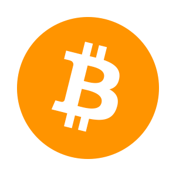 | 90 | BTC | Bitcoin |
| 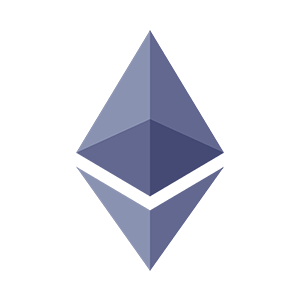 | 80 | ETH | Ethereum |
| 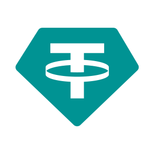 | 518 | USDT | Tether |
| 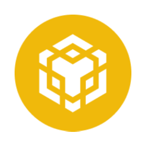 | 2710 | BNB | Binance Coin |
| 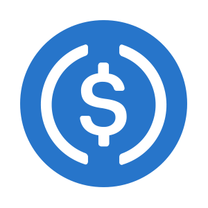 | 33285 | USDC | USD Coin |
|  | 58 | XRP | XRP |
| 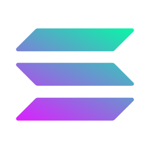 | 48543 | SOL | Solana |
| 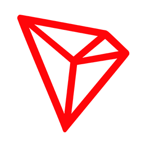 | 2713 | TRX | TRON |
| 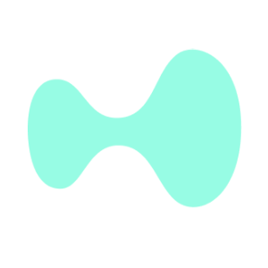 | 148109 | HYPE | Hyperliquid |
| 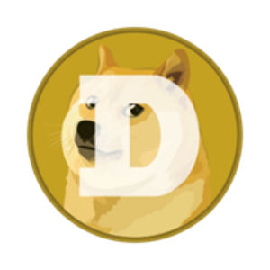 | 2 | DOGE | Dogecoin |
| 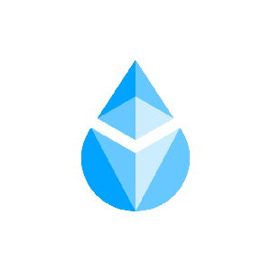 | 46971 | STETH | Staked Ether |
| 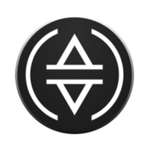 | 158405 | USDE | Ethena USDe |
| 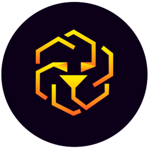 | 33833 | LEO | UNUS SED LEO |
| 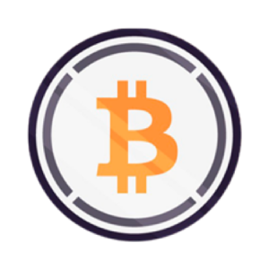 | 33422 | WBTC | Wrapped Bitcoin |
| 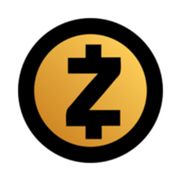 | 134 | ZEC | Zcash |
|  | 28 | XMR | Monero |
| 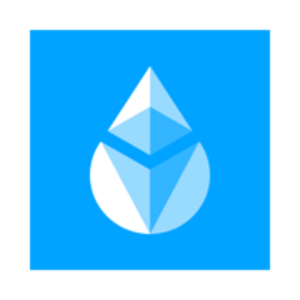 | 65945 | WSTETH | Wrapped stETH |
| 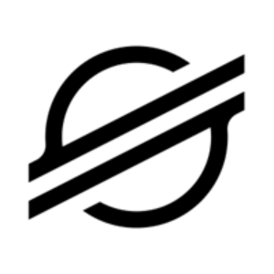 | 89 | XLM | Stellar |
| 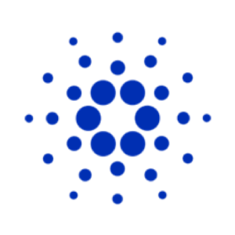 | 257 | ADA | Cardano |
| 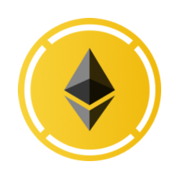 | 96901 | WBETH | Wrapped Beacon ETH |
| 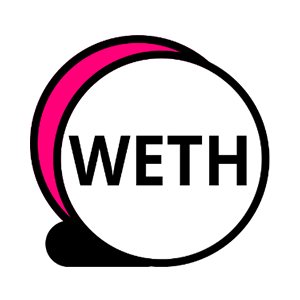 | 32610 | WETH | WETH |
| 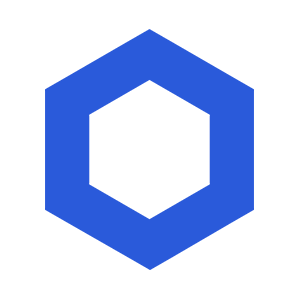 | 2751 | LINK | ChainLink |
| 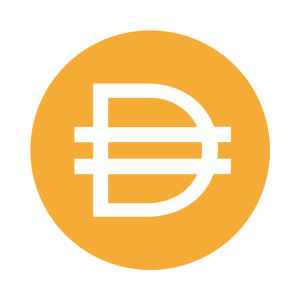 | 32417 | DAI | Dai |
|  | 54683 | TON | TON Coin |
|  | 2321 | BCH | Bitcoin Cash |
|  | 48555 | HBAR | Hedera Hashgraph |
| 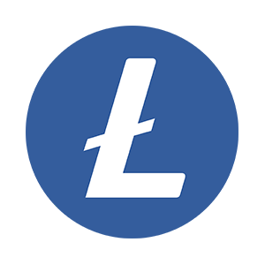 | 1 | LTC | Litecoin |
| 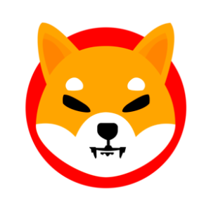 | 45088 | SHIB | Shiba Inu |
|  | 44883 | AVAX | Avalanche |
|  | 93845 | SUI | Sui |
|  | 168551 | SUSDS | sUSDS |
| 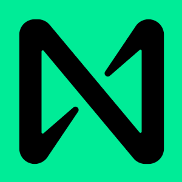 | 48563 | NEAR | NEAR Protocol |
| 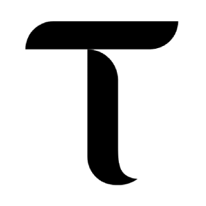 | 121619 | TAO | Bittensor |
|  | 146391 | USDTB | Ethena Labs (USDTb) |
|  | 121595 | MNT | Mantle |
|  | 164809 | BFUSD | BFUSD |
| 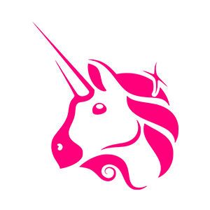 | 47305 | UNI | Uniswap |
| 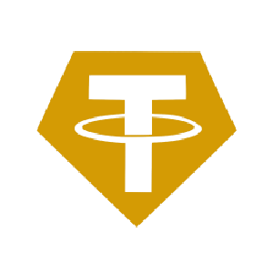 | 42855 | XAUT | Tether Gold |
|  | 33531 | OKB | OKB |
|  | 45219 | DOT | Polkadot |
| 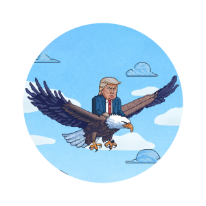 | 165635 | WLFI | World Liberty Financial |
| 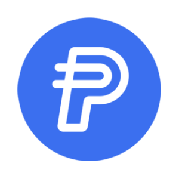 | 111357 | PYUSD | PayPal USD |
| 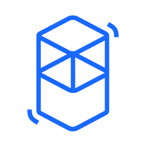 | 33644 | FTM | Fantom |
|  | 67117 | BGB | Bitget Token |
| 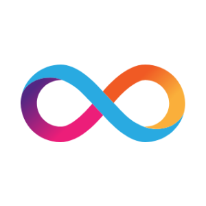 | 47311 | ICP | Internet Computer (IOU) |
|  | 42227 | PAXG | PAX Gold |
|  | 46273 | DEXE | DeXe |
|  | 93841 | PEPE | Pepe |
|  | 100423 | FDUSD | First Digital USD |
| 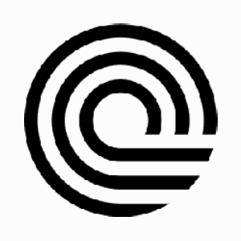 | 121611 | ONDO | Ondo |
| 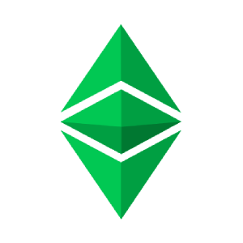 | 118 | ETC | Ethereum Classic |
|  | 165637 | ASTER | Aster |
|  | 151099 | PI | Pi |
| 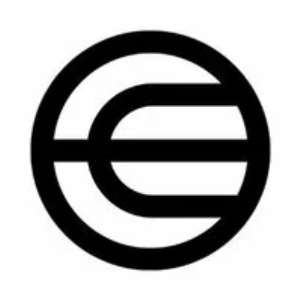 | 99329 | WLD | Worldcoin |
|  | 46018 | AAVE | Aave |
|  | 33830 | ATOM | Cosmos |
|  | 144321 | BNSOL | Binance Staked SOL |
|  | 135601 | RENDER | Render |
|  | 70485 | KAS | Kaspa |
| 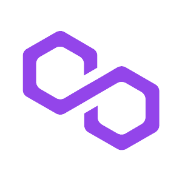 | 33536 | MATIC | Matic Network |
| 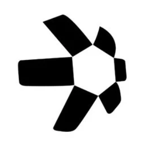 | 33085 | QNT | Quant |
| 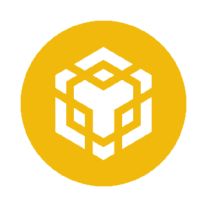 | 46722 | WBNB | Wrapped BNB |
| 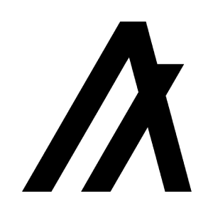 | 34406 | ALGO | Algorand |
|  | 44043 | JST | JUST |
| 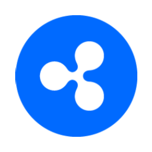 | 146447 | RLUSD | Ripple USD |
|  | 154209 | USDG | Global Dollar |
|  | 161453 | MORPHO | Morpho |
|  | 94003 | LSETH | Liquid Staked ETH |
| 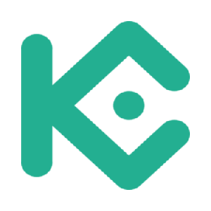 | 2750 | KCS | KuCoin Shares |
| 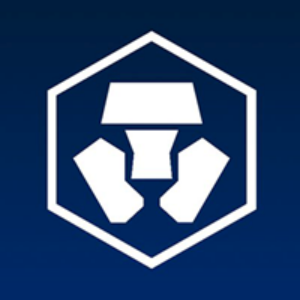 | 33819 | CRO | Crypto.com Chain |
|  | 84965 | FLR | Flare |
| 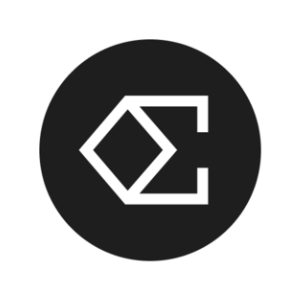 | 126763 | ENA | Ethena |
| 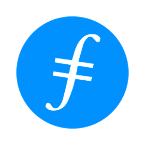 | 32607 | FIL | Filecoin |
|  | 65689 | STG | Stargate Finance |
| 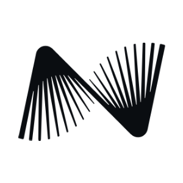 | 32604 | NEXO | Nexo |
|  | 46183 | INJ | Injective Protocol |
|  | 69801 | USDD | USDD |
|  | 148135 | VVV | Venice Token |
|  | 33718 | FET | Fetch.ai |
|  | 32479 | TUSD | TrueUSD |
|  | 33389 | BDX | Beldex |
|  | 45985 | CAKE | PancakeSwap |
| 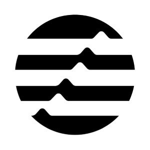 | 111341 | APT | Aptos |
| 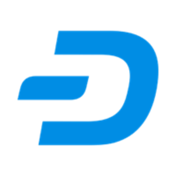 | 8 | DASH | Dash |
|  | 93847 | ARB | Arbitrum |
|  | 151101 | PENGU | Pudgy Penguins |
| 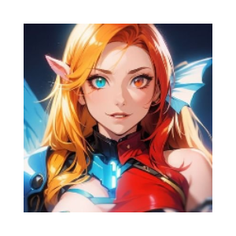 | 150891 | SIREN | siren |
|  | 2741 | VET | VeChain |
|  | 161613 | H | Humanity Protocol |
|  | 48537 | LUNC | Terra Classic |
|  | 127083 | VIRTUAL | Virtual Protocol |
| 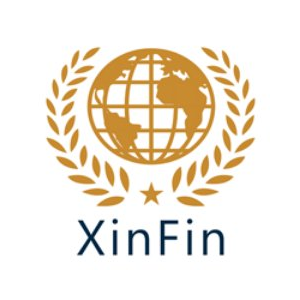 | 32408 | XDCE | XinFin Network |
| 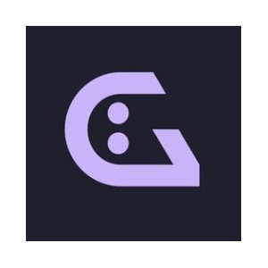 | 111413 | GHO | GHO |
| 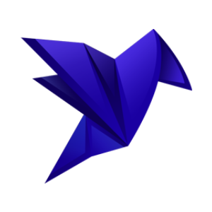 | 60269 | RAVE | Ravendex |
|  | 148111 | TRUMP | OFFICIAL TRUMP |
| 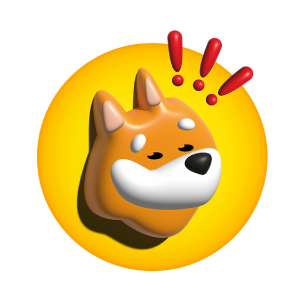 | 82537 | BONK | Bonk |
|  | 48581 | CRV | Curve DAO Token |
| 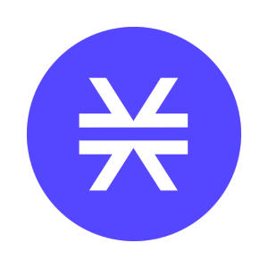 | 48569 | STX | Stacks |
|  | 122319 | AERO | Aerodrome Finance |
|  | 100427 | SEI | Sei |
|  | 136127 | SPX | SPX6900 |
| 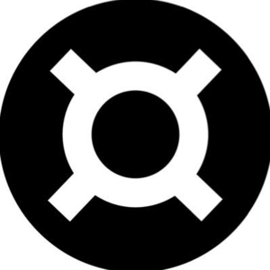 | 46968 | FRAX | Frax |
|  | 34391 | CHZ | Chiliz |
| 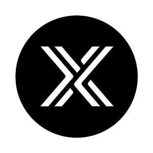 | 121593 | IMX | Immutable |
|  | 62647 | NFT | APENFT |
|  | 151441 | SKYAI | SKYAI |
|  | 167 | GNO | Gnosis |
| 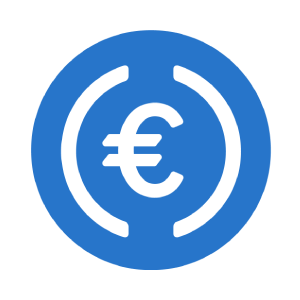 | 111393 | EURC | EURC |
|  | 70785 | EUROC | Euro Coin |
| 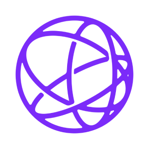 | 136105 | TIA | Celestia |
| 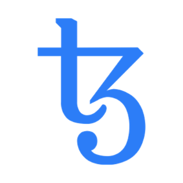 | 3682 | XTZ | Tezos |
|  | 165639 | 2Z | DoubleZero |
| 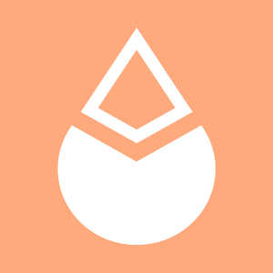 | 46981 | LDO | Lido DAO |
| 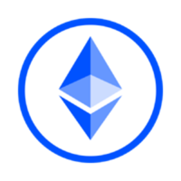 | 86181 | CBETH | Coinbase Wrapped Staked ETH |
|  | 51947 | FLOKI | Floki Inu |
| 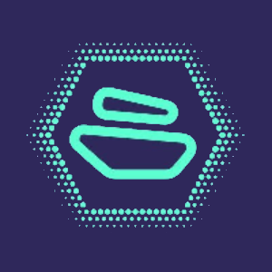 | 126787 | ZBCN | Zebec Network |
|  | 158415 | B | BUILDon |
|  | 121599 | CFX | Conflux |
|  | 48039 | JASMY | JasmyCoin |
| 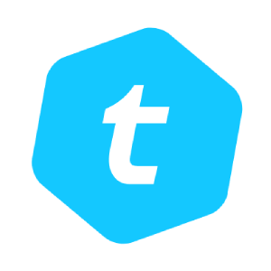 | 32373 | TEL | Telcoin |
|  | 33234 | BCHSV | Bitcoin SV |
|  | 141199 | KAIA | Kaia |
|  | 148123 | ZRO | LayerZero |
|  | 111347 | PYTH | Pyth Network |
|  | 48839 | PENDLE | Pendle |
|  | 99 | DCR | Decred |
|  | 111351 | JTO | Jito |
|  | 48561 | GRT | The Graph |
|  | 447 | MIOTA | IOTA |
|  | 32382 | TRAC | OriginTrail |
| 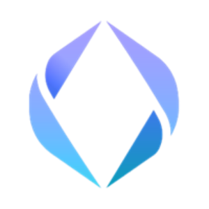 | 56821 | ENS | Ethereum Name Service |
| 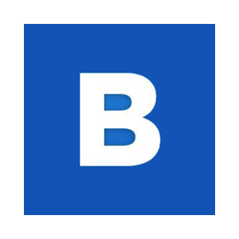 | 64739 | BTSE | BTSE Token |
|  | 46194 | AKT | Akash Network |
|  | 70497 | OP | Optimism |
|  | 47304 | COMP | Compound |
| 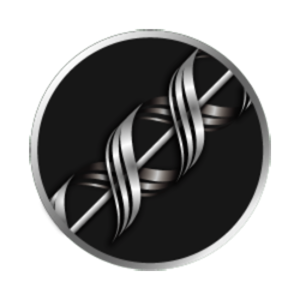 | 64731 | RAIL | Railgun |
|  | 44178 | TWT | Trust Wallet Token |
|  | 141535 | SYRUP | Maple Finance |
|  | 36329 | MX | MX Token |
| 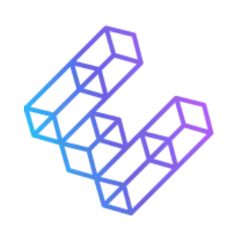 | 126771 | ETHFI | ether.fi |
| 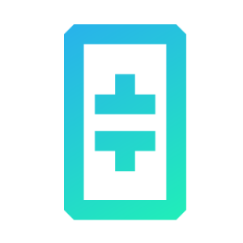 | 32360 | THETA | Theta Token |
| 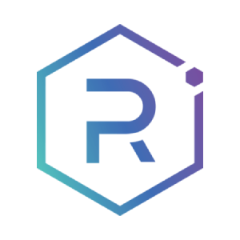 | 47371 | RAY | Raydium |
|  | 121613 | WIF | dogwifhat |
|  | 46575 | AXS | Axie Infinity |
| 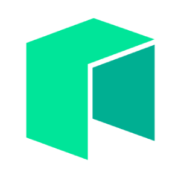 | 133 | NEO | Neo |
|  | 136109 | STRK | Starknet |
| 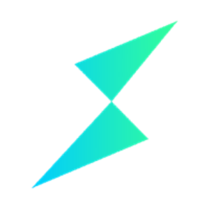 | 36447 | RUNE | THORChain |
| 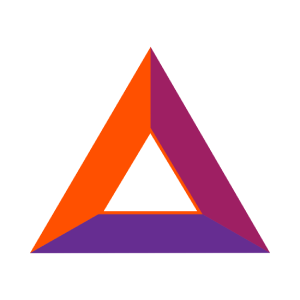 | 184 | BAT | Basic Attention Token |
|  | 45161 | SAND | The Sandbox |
|  | 258 | MANA | Decentraland |
| 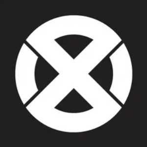 | 148117 | XCN | Onyxcoin |
|  | 136345 | AUSD | AUSD |
|  | 42441 | AR | Arweave |
| 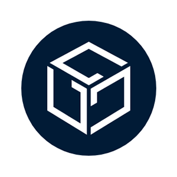 | 45577 | GALA | Gala |
|  | 47369 | SFP | SafePal |
|  | 161739 | VELVET | Velvet |
| 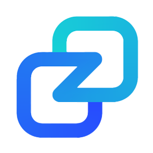 | 34795 | ZANO | Zano |
| 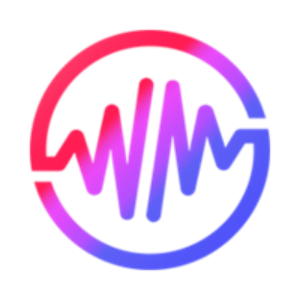 | 46642 | WEMIX | Wemix Token |
| 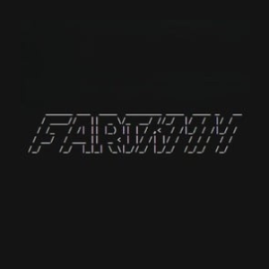 | 141213 | FARTCOIN | Fartcoin |
|  | 148191 | S | Sonic (prev. FTM) |
| 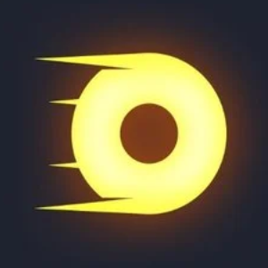 | 121625 | RLB | Rollbit Coin |
| 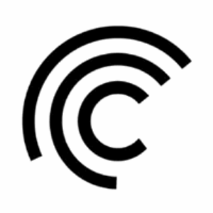 | 49753 | CFG | Centrifuge |
| 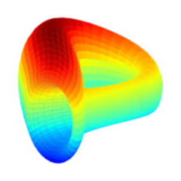 | 99849 | CRVUSD | crvUSD |
| 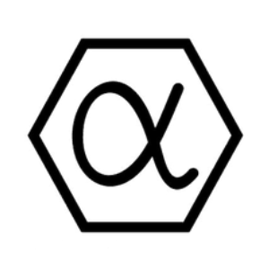 | 161451 | A | Vaulta |
|  | 48829 | CVX | Convex Finance |
|  | 154243 | TIBBIR | Ribbita by Virtuals |
|  | 46571 | GLM | Golem |
| 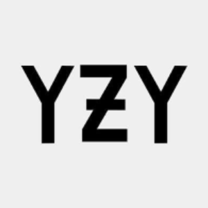 | 161841 | YZY | YZY MONEY |
|  | 51539 | XEC | eCash |
|  | 158419 | AWE | AWE |
|  | 131335 | GOMINING | Gomining |
|  | 147589 | CHEEMS | Cheems (cheems.pet) |
|  | 127213 | ALE | Ailey |
|  | 46966 | 1INCH | 1inch |
|  | 126809 | SHFL | Shuffle |
| 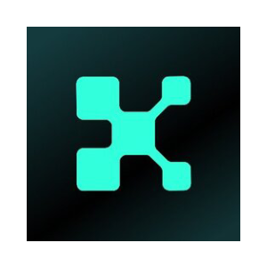 | 150885 | KAITO | KAITO |
|  | 165659 | RIVER | River |
|  | 45930 | APE | APEcoin |
|  | 54377 | DYDX | dYdX |
|  | 48547 | FTT | FTX Token |
| 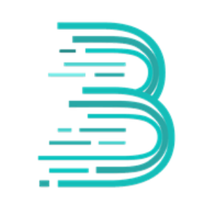 | 32840 | BMX | BitMart Token |
|  | 148215 | SOSO | SoSoValue |
|  | 50807 | INST | Instadapp |
|  | 150883 | IP | Story |
|  | 136111 | ZK | zkSync |
| 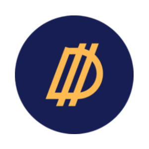 | 48213 | DOLA | Dola USD Stablecoin |
|  | 141207 | GRASS | Grass |
|  | 115409 | OZO | Ozone Chain |
|  | 144537 | WFI | WeFi |
|  | 165041 | AB | AB |
| 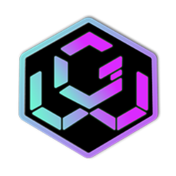 | 141505 | WIBE | Wibegram |
| 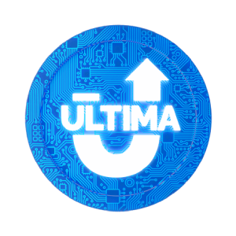 | 111369 | ULTIMA | Ultima |
|  | 141501 | BANANAS31 | Banana For Scale |
| 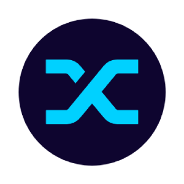 | 33723 | SNX | Synthetix Network |
|  | 147535 | ARC | AI Rig Complex |
|  | 33878 | RSR | Reserve Rights |
| 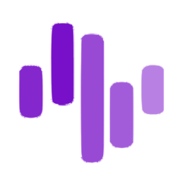 | 48909 | ZIG | Zignaly |
| 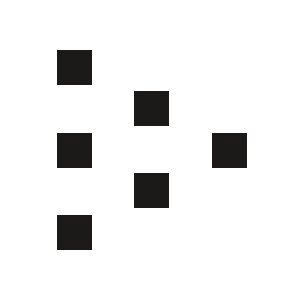 | 33433 | LPT | Livepeer |
|  | 158407 | NXPC | NEXPACE |
|  | 151499 | KTA | Keeta |
| 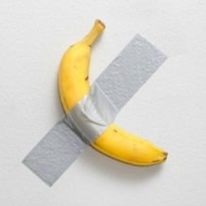 | 151129 | BAN | Comedian |
| 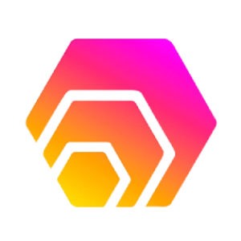 | 42604 | HEX | HEX |
|  | 186 | ZEN | Horizen |
|  | 161497 | DRV | Derive |
| 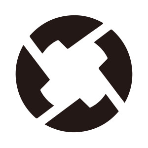 | 2729 | ZRX | 0x |
| 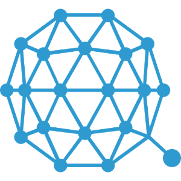 | 237 | QTUM | Qtum |
|  | 147565 | COW | CoW Protocol |
| 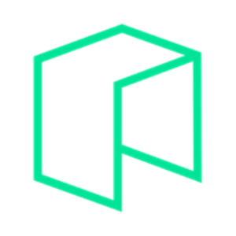 | 2708 | GAS | Gas |
|  | 98667 | USDC.E | USD Coin Ethereum Bridged |
| 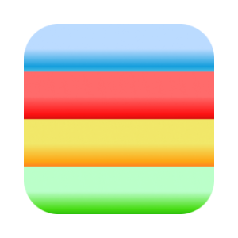 | 136107 | BEAM | Beam |
|  | 188 | QRL | Quantum Resistant Ledger |
| 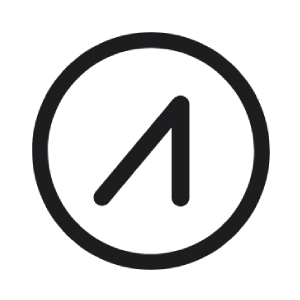 | 48807 | AIOZ | AIOZ Network |
|  | 97137 | ORDI | Ordinals |
|  | 151103 | MELANIA | Official Melania Meme |
| 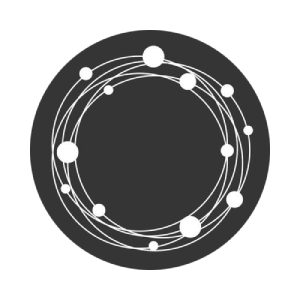 | 36332 | OMI | ECOMI |
|  | 151483 | NILA | MindWaveDAO |
|  | 32386 | RVN | Ravencoin |
|  | 44710 | YFI | yearn.finance |
| 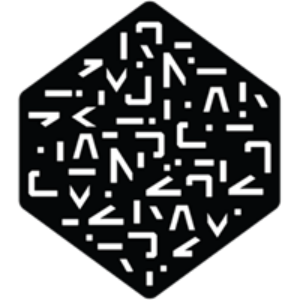 | 202 | NMR | Numeraire |
|  | 64671 | USDP | Pax Dollar |
|  | 165641 | 0G | 0G |
| 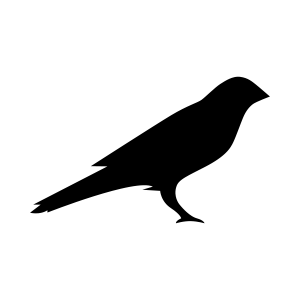 | 42277 | KSM | Kusama |
|  | 44909 | ORCA | ORCA |
|  | 44102 | XPR | Proton |
| 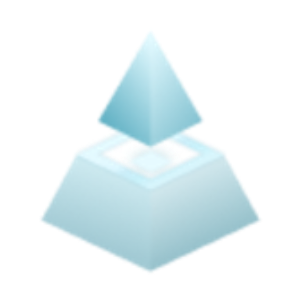 | 71369 | SLG | Land Of Conquest SLG |
| 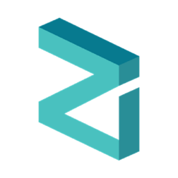 | 32334 | ZIL | Zilliqa |
| 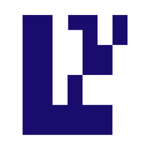 | 141205 | EIGEN | EigenLayer |
| 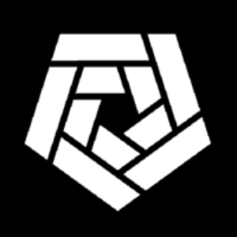 | 100449 | ARKM | Arkham |
| 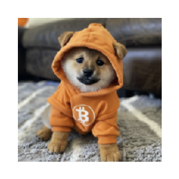 | 147537 | DOG | Dog (Bitcoin) |
|  | 33768 | TFUEL | Theta Fuel |
|  | 147663 | WHITE | WhiteRock |
|  | 45544 | VELO | Velo |
|  | 120831 | SUPER | SuperVerse |
|  | 161455 | SAFE | Safe |
|  | 141221 | DEEP | DeepBook Protocol |
|  | 136129 | EURI | Eurite |
|  | 150199 | JELLYJELLY | Jelly-My-Jelly |
| 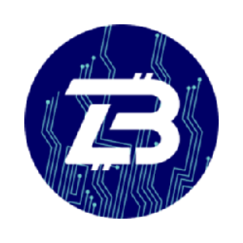 | 70775 | LBT | Law Blocks |
| 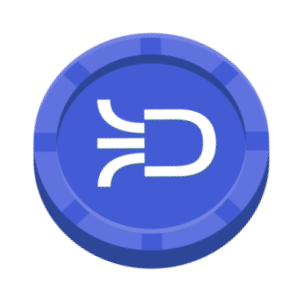 | 70353 | DHN | Dohrnii |
|  | 120827 | HNT | Helium |
| 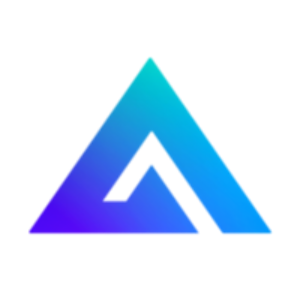 | 77735 | GMX | GMX |
| 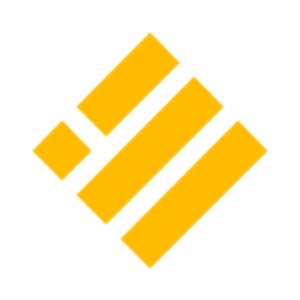 | 48591 | BUSD | Binance USD |
| 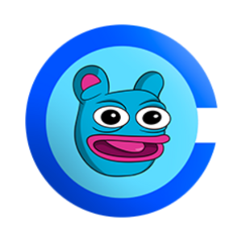 | 126779 | BRETT | Brett |
|  | 122163 | QUBIC | QUBIC |
|  | 2581 | ENJ | Enjin Coin |
|  | 127467 | QAI | QuantixAI |
| 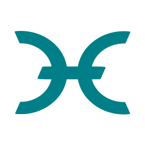 | 32686 | HOT | Holo |
| 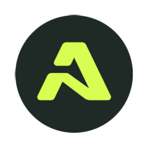 | 148129 | ATH | Aethir |
|  | 33904 | ARRR | Pirate Chain |
| 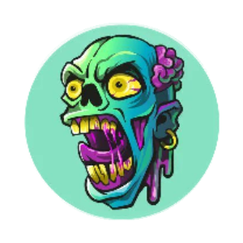 | 131039 | UDS | Undeads Games |
| 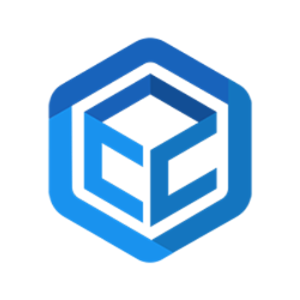 | 47123 | ELG | Escoin Token |
| 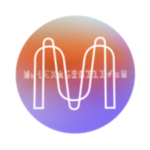 | 62645 | MINA | Mina Protocol |
|  | 147523 | BIO | Bio Protocol |
| 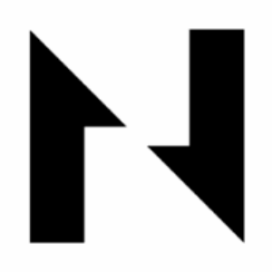 | 59971 | CKB | Nervos Network |
|  | 111431 | TOSHI | Toshi |
|  | 64677 | KUB | Bitkub Coin |
|  | 161871 | LUR | Lumera Health |
| 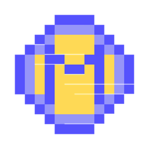 | 51559 | MIM | Magic Internet Money |
| 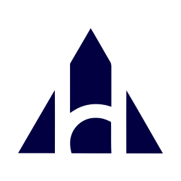 | 64721 | ACH | Alchemy Pay |
|  | 64751 | CLV | Clover Finance |
| 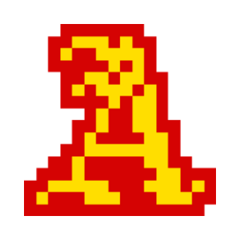 | 146443 | ALCH | Alchemist AI |
|  | 63431 | CCD | Concordium |
| 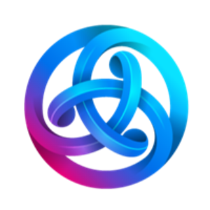 | 62661 | ASTR | Astar |
|  | 127565 | GEOD | GEODNET |
|  | 121637 | CTC | Creditcoin |
| 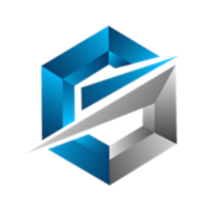 | 56205 | ZEDXION | Zedxion |
| 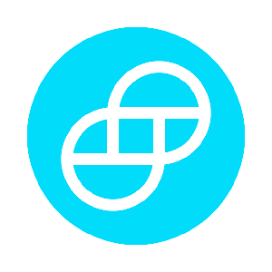 | 33762 | GUSD | Gemini Dollar |
| 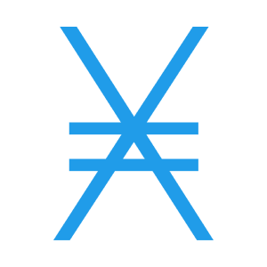 | 2835 | NANO | Nano |
|  | 64689 | VVS | VVS Finance |
|  | 32226 | ELF | aelf |
|  | 151093 | BDCA | BitDCA |
|  | 161835 | LION | Loaded Lions |
|  | 158425 | HUMA | Huma Finance |
| 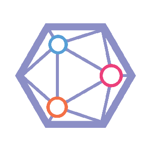 | 32762 | XYO | XYO Network |
|  | 161883 | AIO | OLAXBT |
| 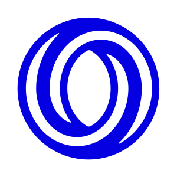 | 46572 | ROSE | Oasis Network |
|  | 48589 | FLOW | Flow |
|  | 64675 | KAVA | Kava |
|  | 2792 | REQ | Request Network |
|  | 70719 | POLYX | Polymesh |
| 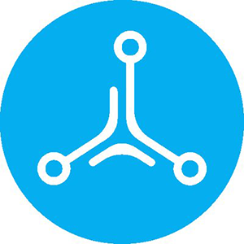 | 161489 | SERV | OpenServ |
| 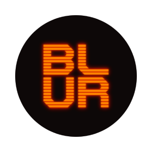 | 90065 | BLUR | Blur |
| 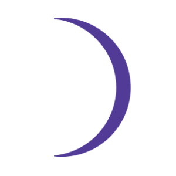 | 36449 | DUSK | Dusk Network |
|  | 99333 | AXL | Axelar |
| 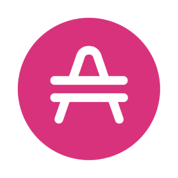 | 148119 | AMP | Amp |
| 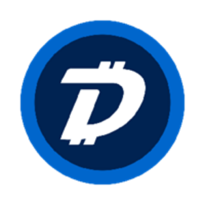 | 43 | DGB | Digibyte |
|  | 121961 | PLAY | Play Token |
| 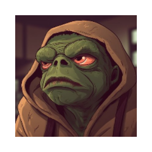 | 141445 | APEPE | Ape and Pepe |
| 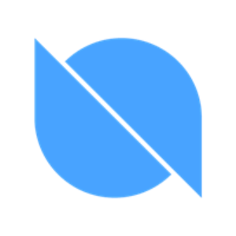 | 32331 | ONT | Ontology |
|  | 126765 | W | Wormhole |
| 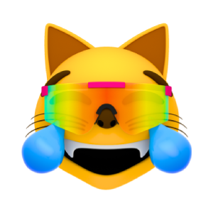 | 111457 | MOG | Mog Coin |
| 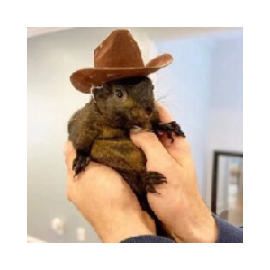 | 141201 | PNUT | Peanut the Squirrel |
|  | 64703 | RON | Ronin |
| 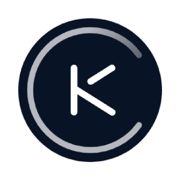 | 130985 | KMNO | Kamino Finance |
| 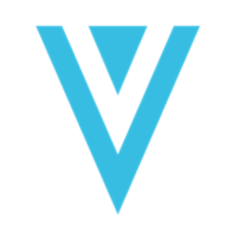 | 102 | XVG | Verge |
| 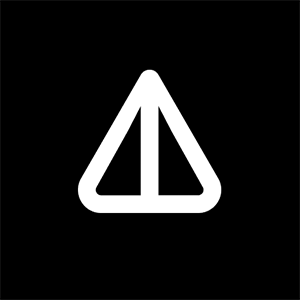 | 130947 | NOT | Notcoin |
|  | 46184 | XVS | Venus |
| 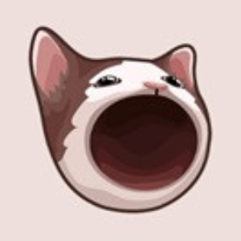 | 122333 | POPCAT | Popcat |
|  | 183 | SC | Siacoin |
|  | 147755 | SRX | StorX Network |
| 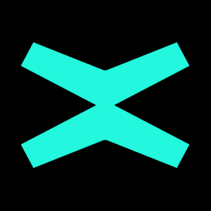 | 45467 | EGLD | Elrond eGold |
|  | 41314 | PCI | Pay Coin |
| 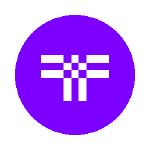 | 60911 | T | Threshold Network Token |
| 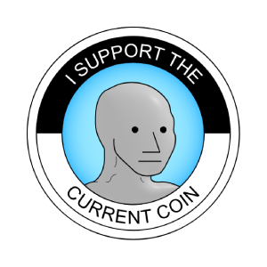 | 122713 | NPC | Non-Playable Coin |
| 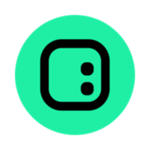 | 147517 | ID | SPACE ID |
| 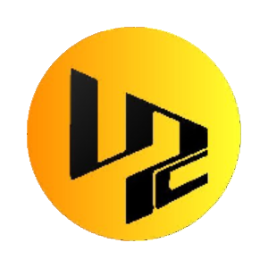 | 113581 | UNP | Unipoly |
|  | 147527 | ZETA | ZetaChain |
|  | 136125 | MOODENG | Moo Deng (moodengsol.com) |
| 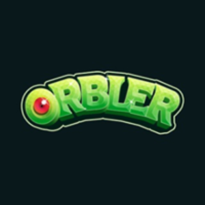 | 64263 | ORBR | Orbler |
|  | 48711 | LUSD | Liquity USD |
| 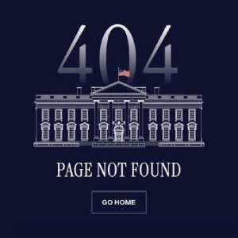 | 150927 | GOHOME | GOHOME |
|  | 33157 | VTHO | VeThor Token |
|  | 161839 | PROVE | Succinct |
|  | 165043 | LINEA | Linea |
|  | 121603 | MANTA | Manta Network |
|  | 64789 | TRB | Tellor |
|  | 47375 | MASK | Mask Network |
| 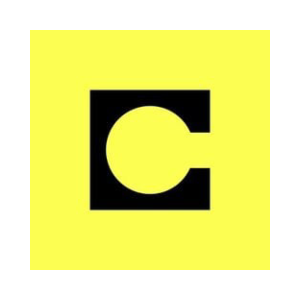 | 44425 | CELO | Celo |
|  | 44040 | UMA | UMA |
|  | 161611 | SAHARA | Sahara AI |
|  | 207 | SNT | Status Network Token |
| 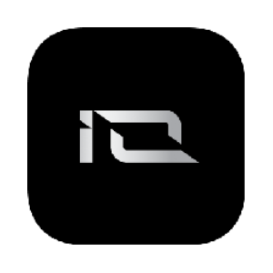 | 136011 | IO | io.net |
|  | 165647 | BARD | Lombard |
|  | 136329 | MOCA | Moca Network |
|  | 148115 | MOVE | Movement |
| 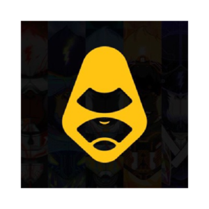 | 147659 | APEX | ApeX Protocol |
|  | 161469 | SPK | Spark |
|  | 172275 | KGEN | KGeN |
|  | 45228 | SUSHI | Sushi |
|  | 148195 | VANA | Vana |
|  | 147623 | DEGEN | Degen |
|  | 147893 | FB | Fractal Bitcoin |
|  | 64669 | OSMO | Osmosis |
|  | 161509 | BR | Bedrock |
| 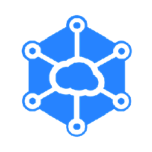 | 221 | STORJ | Storj |
| 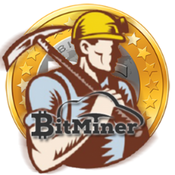 | 112445 | BIM | BIM |
| 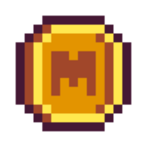 | 147525 | MEME | Memecoin |
| 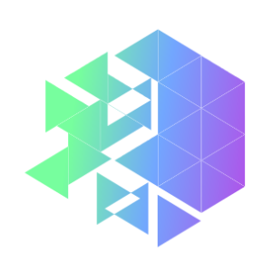 | 32719 | IOTX | IoTeX |
| 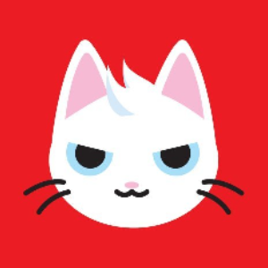 | 126769 | MEW | cat in a dogs world |
|  | 122421 | AIAT | AI Analysis Token |
|  | 70961 | WKC | Wiki Cat |
|  | 3708 | ICX | ICON |
|  | 161661 | ICNT | Impossible Cloud Network |
|  | 48761 | ILV | Illuvium |
|  | 150197 | BERA | Berachain |
| 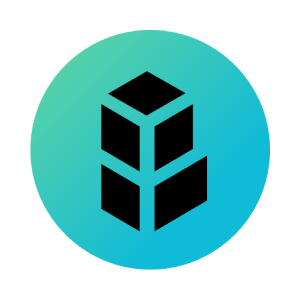 | 200 | BNT | Bancor |
|  | 166 | RLC | iExec RLC |
| 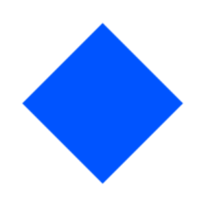 | 113 | WAVES | Waves |
|  | 56145 | SSV | SSV Network |
|  | 3014 | PRO | Propy |
|  | 126767 | BOME | BOOK OF MEME |
|  | 33764 | RIF | RIF Token |
|  | 32402 | SWFTC | SwftCoin |
| 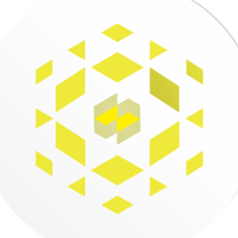 | 111389 | NIZA | Niza Global |
|  | 42709 | MWC | MimbleWimbleCoin |
|  | 33213 | RPL | Rocket Pool |
| 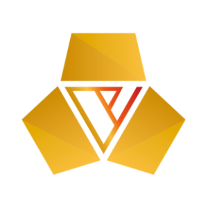 | 44086 | DEP | DEAPCOIN |
|  | 120837 | XCH | Chia |
|  | 165045 | AVNT | Avantis |
| 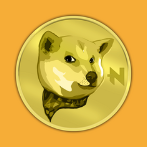 | 147547 | NEIRO | Neiro (First Neiro On Ethereum) |
|  | 141465 | DBR | deBridge |
|  | 131 | ARDR | Ardor |
|  | 141453 | PEAQ | peaq |
|  | 141451 | HSK | HashKey Platform Token |
| 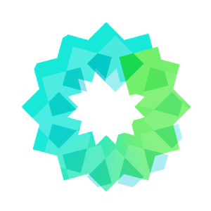 | 269 | POWR | Power Ledger |
|  | 48703 | CSPR | Casper Network |
| 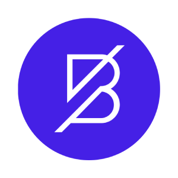 | 42222 | BAND | Band Protocol |
| 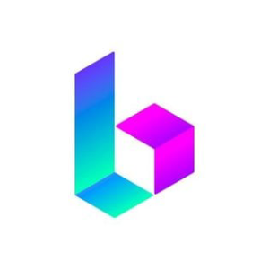 | 33430 | BORA | BORA |
|  | 32450 | UQC | Uquid Coin |
|  | 147613 | MVL | MVL |
| 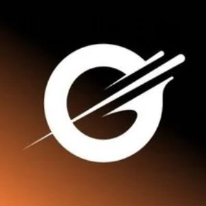 | 147551 | G | Gravity |
|  | 165651 | GIGGLE | Giggle Fund |
| 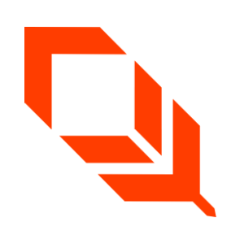 | 147099 | PLUME | Plume |
| 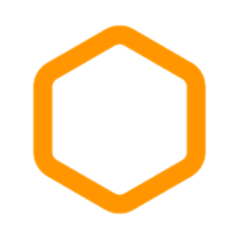 | 120829 | CORE | Core |
| 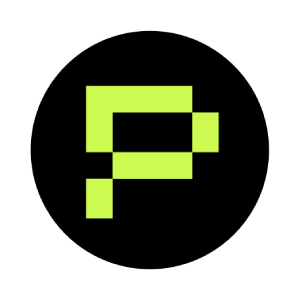 | 45613 | PHA | Phala Network |
| 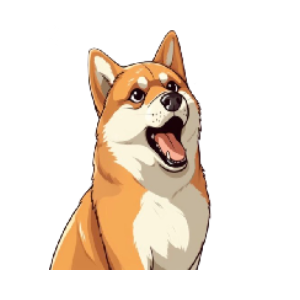 | 158461 | IDOL | MEET48 |
| 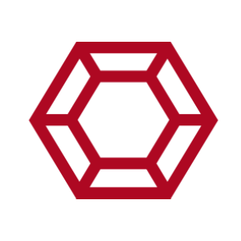 | 151113 | RED | RedStone |
|  | 59005 | PEOPLE | ConstitutionDAO |
|  | 141211 | ZEREBRO | Zerebro |
|  | 154319 | NEET | Not in Employment, Education, or Training |
|  | 121607 | ALT | Altlayer |
| 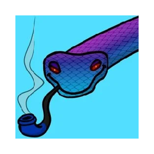 | 94287 | SNEK | Snek |
| 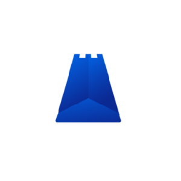 | 33401 | SHX | Stronghold Token |
|  | 130957 | SQD | Subsquid |
|  | 121731 | ACX | Across Protocol |
|  | 76581 | PUNDIX | Pundi X (New) |
| 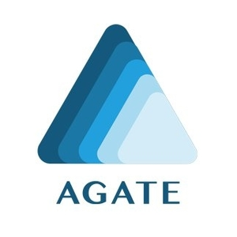 | 161507 | AGT | Alaya Governance Token |
|  | 127769 | NMD | Nexusmind |
|  | 46568 | SKL | SKALE Network |
| 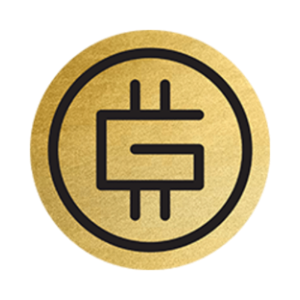 | 121609 | GMT | GMT |
|  | 59969 | HIVE | Hive |
|  | 42605 | LCX | LCX |
| 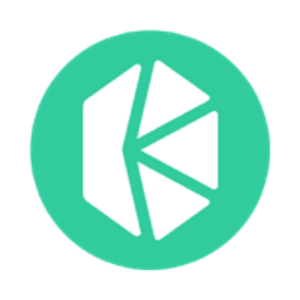 | 2515 | KNC | Kyber Network |
| 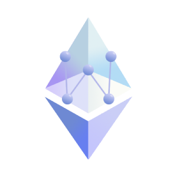 | 77733 | ETHW | EthereumPoW |
| 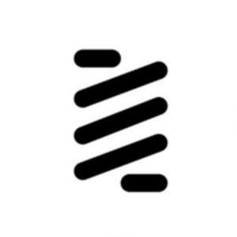 | 64759 | AUCTION | Bounce |
|  | 148121 | GIGA | Gigachad (gigachadsolana.com) |
| 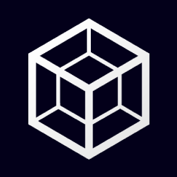 | 147553 | FIDA | Solana Name Service |
| 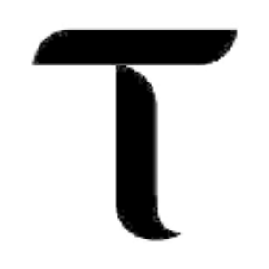 | 100025 | WTAO | Wrapped TAO |
| 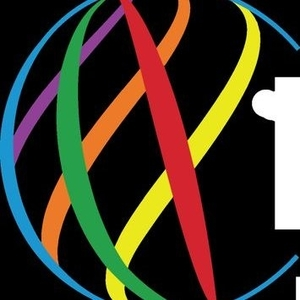 | 161761 | KLK | Klickl Token |
| 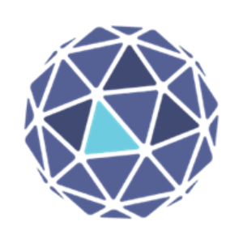 | 33824 | ORBS | Orbs |
|  | 144615 | AIC | AI Companions |
|  | 147711 | REKT | Rekt (rektcoin.com) |
|  | 161897 | NAORIS | Naoris Protocol |
|  | 165059 | SPYON | SPDR S&P 500 Tokenized ETF (Ondo) |
|  | 106 | STEEM | STEEM |
|  | 33874 | COTI | COTI |
| 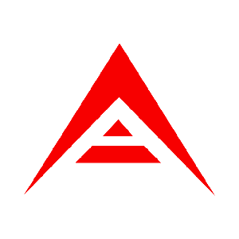 | 149 | ARK | Ark |
| 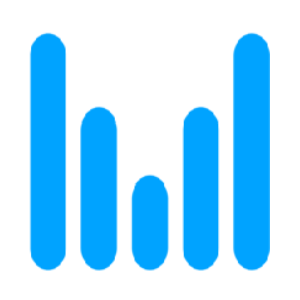 | 114731 | MOBILE | Helium Mobile |
| 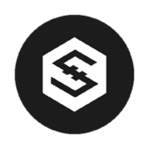 | 32229 | IOST | IOStoken |
|  | 161909 | ESPORTS | Yooldo |
| 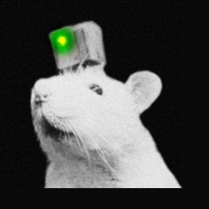 | 147075 | PYTHIA | Pythia |
|  | 161515 | CORN | Corn |
| 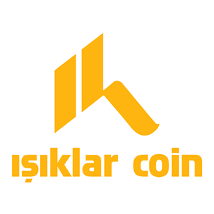 | 44061 | ISIKC | Isiklar Coin |
|  | 69705 | CAW | A Hunters Dream |
|  | 234 | CVC | Civic |
|  | 147569 | DOGS | DOGS |
| 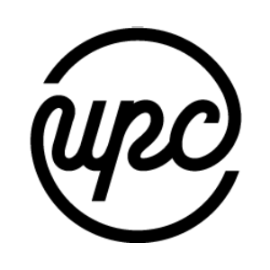 | 115633 | UPC | UPCX |
| 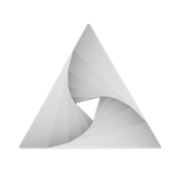 | 46577 | API3 | API3 |
|  | 141475 | AIXBT | aixbt by Virtuals |
| 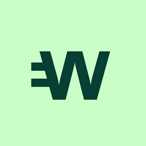 | 36430 | WXT | Wirex Token |
|  | 47401 | TORN | Tornado Cash |
| 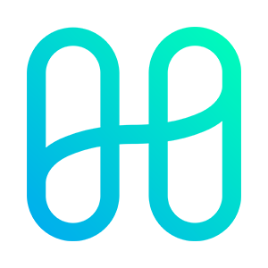 | 48567 | ONE | Harmony |
|  | 161843 | MBG | MultiBank Group |
|  | 147795 | TPT | TokenPocket |
| 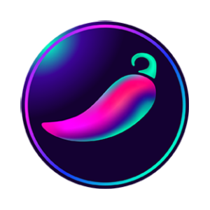 | 87933 | CHEEL | Cheelee |
| 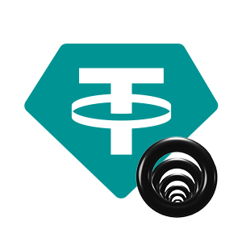 | 72385 | USDTE | Tether Avalanche Bridged (USDT.e) |
| 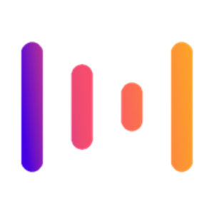 | 219 | MTL | Metal |
|  | 165643 | XAN | Anoma |
|  | 147607 | STRAX | Stratis [New] |
|  | 44728 | DKA | dKargo |
| 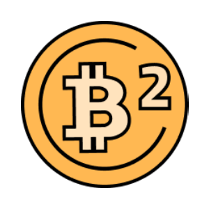 | 151147 | B2 | BSquared Network |
| 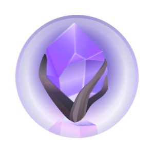 | 48831 | SPELL | Spell Token |
|  | 41756 | XT | XT.com Token |
| 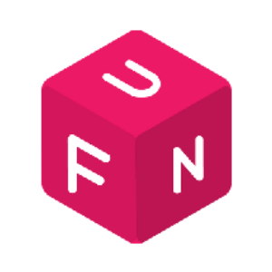 | 147723 | FUN | FUNToken |
|  | 32238 | WAXP | WAX |
|  | 46186 | AUDIO | Audius |
|  | 161865 | SAPIEN | Sapien |
|  | 121617 | FLUX | Flux |
| 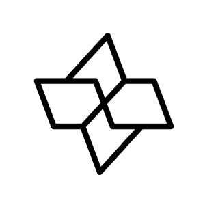 | 44041 | CTSI | Cartesi |
|  | 33540 | ONG | Ontology Gas |
| 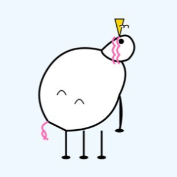 | 147065 | PIPPIN | pippin |
|  | 136119 | HMSTR | Hamster Kombat |
| 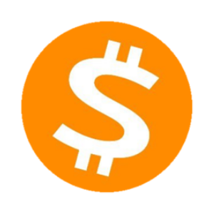 | 122091 | SATS | SATS (Ordinals) |
|  | 115653 | 1000SATS | SATS |
|  | 48737 | LQTY | Liquity |
| 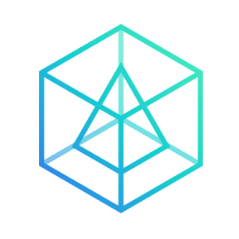 | 32350 | ABT | Arcblock |
| 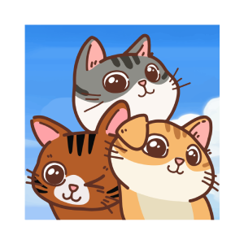 | 136123 | CATI | Catizen |
| 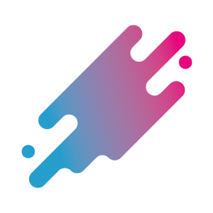 | 33310 | AERGO | Aergo |
| 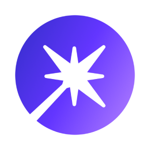 | 126957 | MERL | Merlin Chain |
|  | 130951 | ZENT | Zentry |
|  | 147103 | GPS | GoPlus Security |
|  | 147625 | SCRT | Secret |
|  | 60113 | CBK | Cobak Token |
|  | 44174 | EWT | Energy Web Token |
| 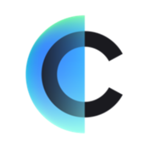 | 56837 | CPOOL | Clearpool |
|  | 70365 | CGO | Comtech Gold |
|  | 147633 | CTK | Shentu |
|  | 108 | LSK | Lisk |
|  | 51971 | FORM | Formation FI |
|  | 49729 | XYM | Symbol |
| 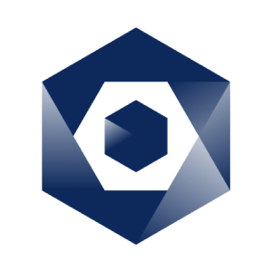 | 32794 | DAG | Constellation |
|  | 161961 | XPIN | XPIN Network |
|  | 90833 | CGPT | ChainGPT |
|  | 59323 | BICO | Biconomy |
|  | 165069 | QQQON | Invesco QQQ Tokenized ETF (Ondo) |
| 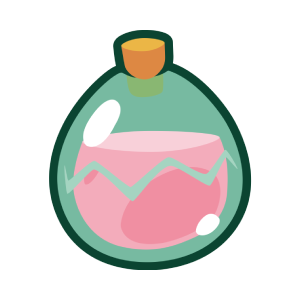 | 147603 | SLP | Smooth Love Potion |
|  | 144587 | FAI | Freysa |
|  | 147783 | OHO | Oho |
|  | 122385 | QANX | QANplatform |
|  | 147599 | IQ | IQ |
|  | 36439 | PROM | Prometeus |
|  | 2781 | LRC | Loopring |
|  | 89363 | EUL | Euler |
| 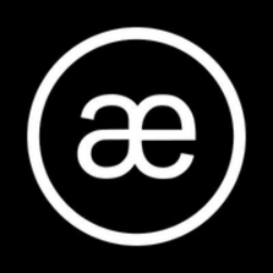 | 33319 | AEVO | Aevo |
|  | 147639 | GAME | GameBuild |
|  | 32787 | QKC | QuarkChain |
| 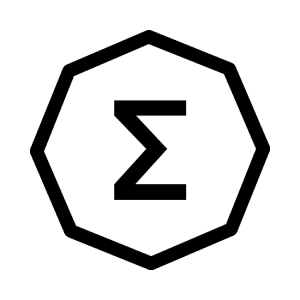 | 121655 | ERG | Ergo |
|  | 148133 | WIN | WINkLink |
| 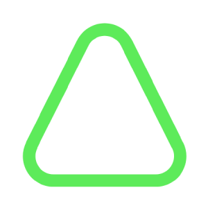 | 147631 | AURORA | Aurora |
|  | 61273 | POKT | Pocket Network |
|  | 111387 | CYBER | CyberConnect |
| 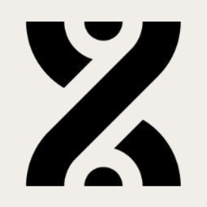 | 147585 | BB | BounceBit |
|  | 161891 | XNY | Codatta |
|  | 146719 | READY | READY! |
| 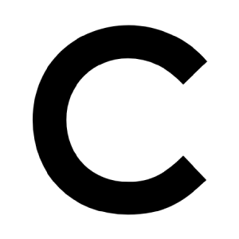 | 33772 | CELR | Celer Network |
|  | 165047 | SOMI | Somnia |
| 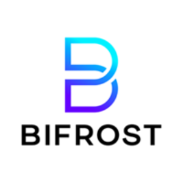 | 64723 | BFC | Bifrost |
|  | 147563 | EDU | Open Campus |
|  | 49563 | METIS | Metis Token |
|  | 41201 | HUNT | HUNT Token |
|  | 111371 | BIGTIME | Big Time |
|  | 48735 | ELON | Dogelon Mars |
| 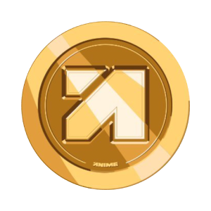 | 151115 | ANIME | Animecoin |
| 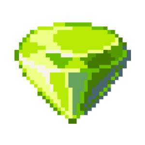 | 120833 | PIXEL | Pixels |
|  | 147069 | TOKAMAK | Tokamak Network |
|  | 47383 | ERN | Ethernity Chain |
| 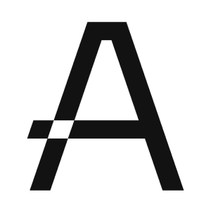 | 136335 | ALEO | Aleo |
|  | 32239 | MED | MediBloc [QRC20] |
|  | 131337 | TAIKO | Taiko |
|  | 154321 | ARARA | Araracoin |
|  | 79709 | MPLX | Metaplex |
|  | 97213 | CETUS | Cetus Protocol |
|  | 51751 | MMUI | MetaMUI |
|  | 56965 | GNS | Gains Network |
| 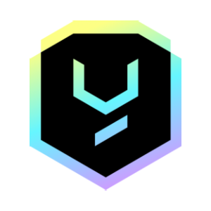 | 53987 | YGG | Yield Guild Games |
| 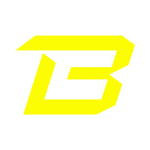 | 147567 | BLAST | Blast |
|  | 54879 | BTRST | Braintrust |
| 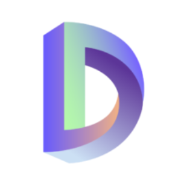 | 45056 | DIA | DIA |
| 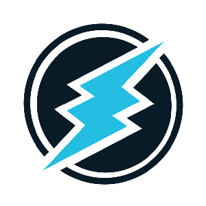 | 2623 | ETN | Electroneum |
|  | 122151 | NOS | Nosana |
|  | 165065 | TLTON | iShares 20+ Year Treasury Bond Tokenized ETF (Ondo) |
| 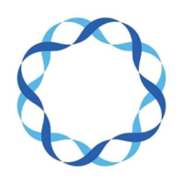 | 33870 | LOCUS | Locus Chain |
| 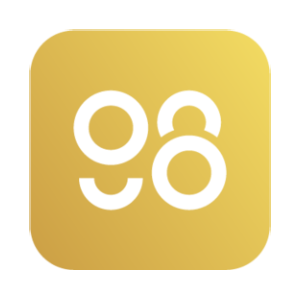 | 54111 | C98 | Coin98 |
|  | 69001 | NYM | Nym |
|  | 112745 | ISLM | Islamic Coin |
|  | 67021 | WMATIC | Wrapped Matic |
|  | 64737 | MAGIC | Magic |
| 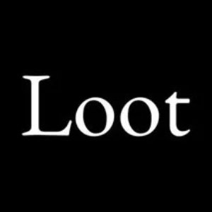 | 54855 | AGLD | Adventure Gold |
|  | 121753 | PONKE | Ponke |
|  | 161879 | TA | Trusta.AI |
|  | 46974 | POND | Marlin |
|  | 46270 | HEZ | Hermez Network Token |
| 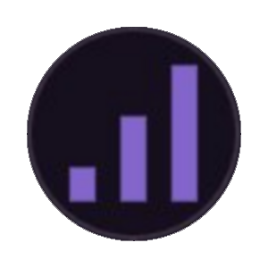 | 144517 | CLANKER | tokenbot |
| 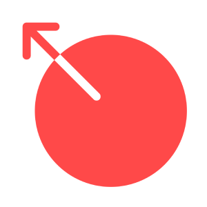 | 33770 | META | Metadium |
|  | 144565 | MEY | Mey Network |
|  | 63583 | FTRB | Faith Tribe |
|  | 147899 | DFG | Defigram |
|  | 77839 | SAUCE | SaucerSwap |
| 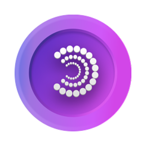 | 151127 | PARTI | Particle Network |
|  | 48029 | HOPR | HOPR |
|  | 34418 | MBL | MovieBloc |
| 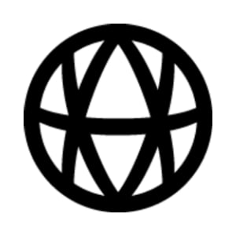 | 32817 | AVA | Travala |
|  | 111415 | OSAK | Osaka Protocol |
| 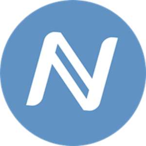 | 323 | NMC | Namecoin |
|  | 33879 | CHR | Chromia |
|  | 121605 | XRD | Radix |
| 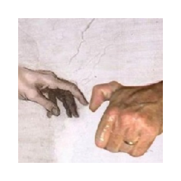 | 141203 | GOAT | Goatseus Maximus |
| 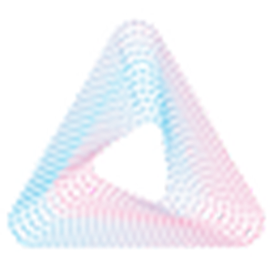 | 42744 | MAP | Marcopolo |
|  | 46573 | FIRO | Firo |
|  | 127017 | VENOM | Venom |
| 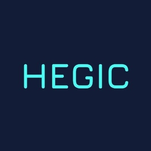 | 45521 | HEGIC | Hegic |
| 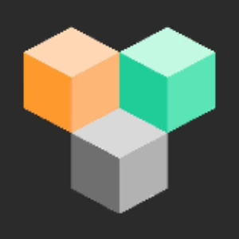 | 111509 | APFC | APF coin |
|  | 33223 | CET | CoinEx Token |
|  | 147807 | CONX | Connex |
| 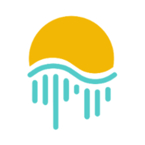 | 53673 | MOVR | Moonriver |
|  | 121643 | ALI | Artificial Liquid Intelligence |
| 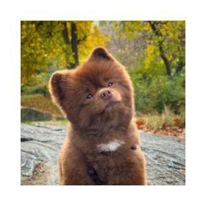 | 141247 | BERT | Bertram The Pomeranian |
| 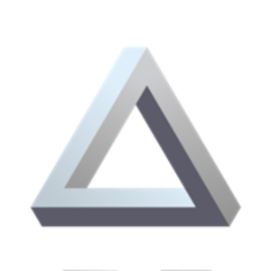 | 36416 | ARPA | ARPA Chain |
|  | 158421 | SXT | Space and Time |
|  | 131333 | LISTA | Lista DAO |
| 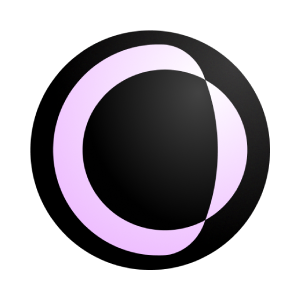 | 141225 | USUAL | Usual |
|  | 130949 | REZ | Renzo |
|  | 79577 | GRND | SuperWalk |
|  | 59537 | VR | Victoria VR |
|  | 161475 | HP | Hippo Protocol |
|  | 172277 | ENSO | Enso |
|  | 122369 | RSC | ResearchCoin |
|  | 161511 | STO | StakeStone |
|  | 43242 | KDA | Kadena |
|  | 54653 | JOE | JOE |
|  | 122649 | CHEX | Chintai |
|  | 147571 | BITCOIN | HarryPotterObamaSonic10Inu (ERC-20) |
|  | 158445 | DOOD | Doodles |
|  | 121729 | OG | OG Fan Token |
|  | 121679 | BANANA | Banana Gun |
|  | 50593 | KISHU | Kishu Inu |
|  | 161663 | SPYX | SP500 tokenized ETF (xStock) |
|  | 141227 | LUMIA | Lumia |
| 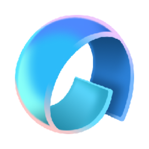 | 135829 | AVAIL | Avail |
| 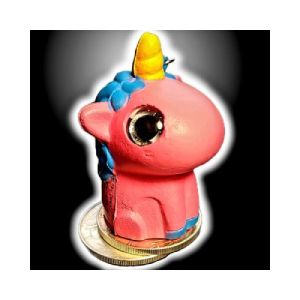 | 146387 | UFD | Unicorn Fart Dust |
|  | 54923 | IXS | IX Swap |
|  | 158695 | EGL1 | EGL1 |
| 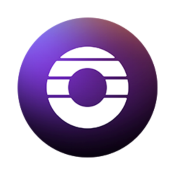 | 136141 | ORDER | Orderly Network |
|  | 137071 | PEP | Pepecoin |
|  | 151149 | KERNEL | KernelDAO |
|  | 161465 | SIGN | Sign |
|  | 64697 | OGN | Origin Protocol |
| 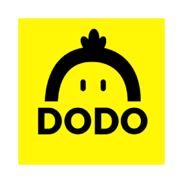 | 45886 | DODO | DODO |
| 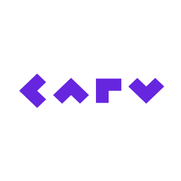 | 141223 | CARV | CARV |
|  | 58745 | BOBA | Boba Network |
|  | 148013 | VINE | Vine Coin |
|  | 147595 | CAT | Simon's Cat |
|  | 46324 | XSGD | XSGD |
| 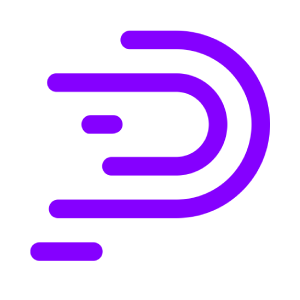 | 32455 | NCT | PolySwarm |
|  | 161439 | NEWT | Newton Protocol |
| 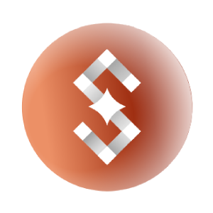 | 46188 | ALPHA | Alpha Finance |
| 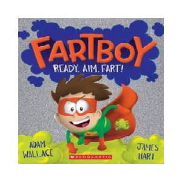 | 151145 | FARTBOY | Fartboy |
|  | 47395 | RAD | Radicle |
|  | 151139 | MUBARAK | Mubarak |
| 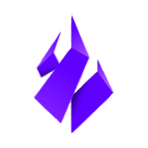 | 61613 | WALLET | Ambire Wallet |
| 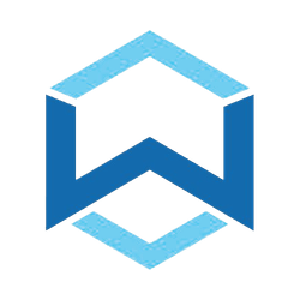 | 32333 | WAN | Wanchain |
| 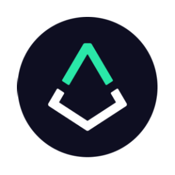 | 129 | REP | Augur |
| 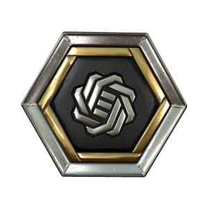 | 56829 | GODS | Gods Unchained |
| 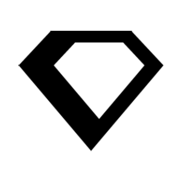 | 121667 | RARE | SuperRare |
|  | 147647 | BONE | Bone ShibaSwap |
|  | 151159 | DOLO | Dolomite |
|  | 148127 | PRIME | Echelon Prime |
| 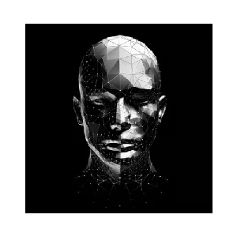 | 111585 | AITECH | Solidus Ai Tech |
|  | 168793 | NVDAX | NVIDIA xStock |
|  | 147555 | TAI | TARS AI |
| 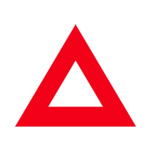 | 120835 | XAI | Xai |
|  | 151111 | ME | Magic Eden |
| 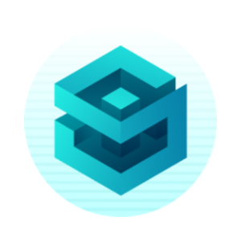 | 146393 | F | SynFutures |
|  | 48869 | XAVA | Avalaunch |
|  | 111355 | CORGIAI | CorgiAI |
| 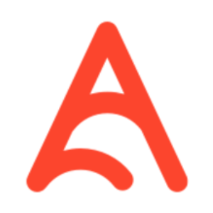 | 64771 | AQT | Alpha Quark Token |
|  | 147677 | QI | BENQI |
|  | 165049 | ZKC | Boundless |
| 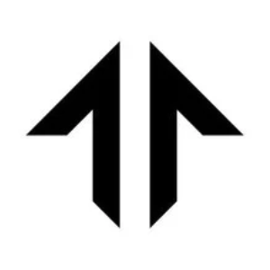 | 134635 | TNSR | Tensor |
|  | 122437 | TGC | TG Casino |
|  | 151447 | APTM | Apertum |
| 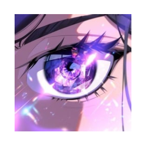 | 147579 | ACT | Act I : The AI Prophecy |
| 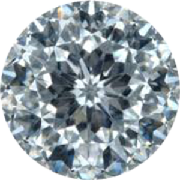 | 150895 | DIAM | DIAM |
|  | 151117 | INIT | Initia |
|  | 62657 | OUSD | Origin Dollar |
| 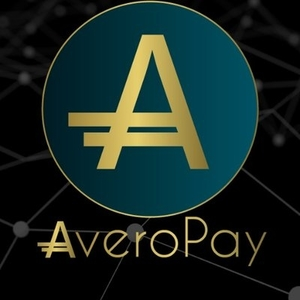 | 165671 | AOP | Ark of Panda |
|  | 47367 | ALICE | My Neighbor Alice |
|  | 136559 | KONET | KONET |
|  | 61275 | GLMR | Moonbeam |
| 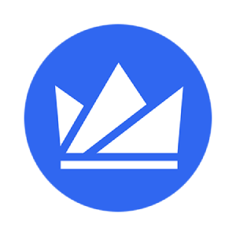 | 64693 | WRX | WazirX |
|  | 33320 | ACM | Actinium |
| 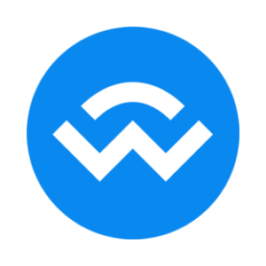 | 161471 | WCT | WalletConnect Token |
|  | 64869 | SD | Stader |
|  | 161505 | EVER | Everscale |
|  | 165489 | KLED | Kled AI |
| 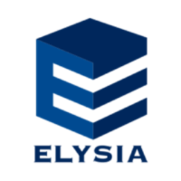 | 77859 | EL | ELYSIA |
| 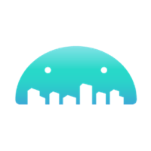 | 89091 | MOC | Moss Coin |
| 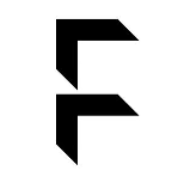 | 147873 | FLOCK | FLock.io |
|  | 121633 | AI | Sleepless AI |
| 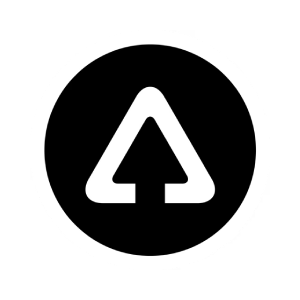 | 44560 | ASM | Assemble Protocol |
|  | 54299 | IAG | IAGON |
|  | 141209 | CHILLGUY | Just a chill guy |
|  | 165649 | 4 | 4 |
| 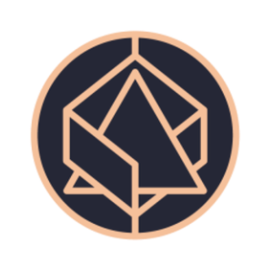 | 47381 | ALCX | Alchemix |
|  | 151431 | PROMPT | Wayfinder |
| 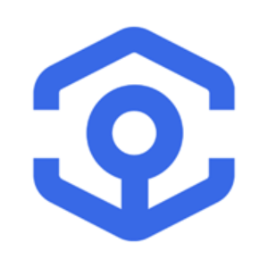 | 33643 | ANKR | Ankr Network |
|  | 121709 | GFI | Goldfinch |
|  | 62689 | TKO | Tokocrypto |
|  | 59431 | SANTOS | Santos FC Fan Token |
| 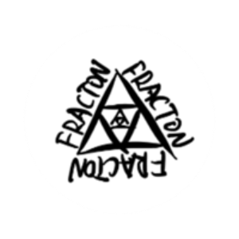 | 122599 | FT | FractonX |
| 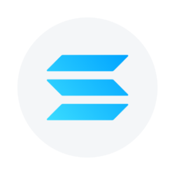 | 55709 | STSOL | Lido Staked SOL |
|  | 151153 | TUT | Tutorial |
| 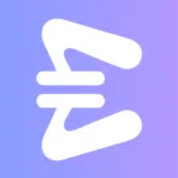 | 142135 | EURR | StablR Euro |
|  | 33913 | TT | ThunderCore |
|  | 47739 | XDAI | xDAI |
| 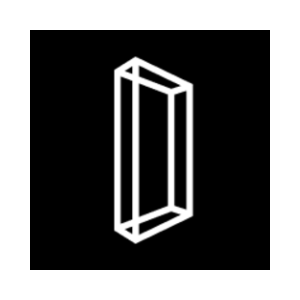 | 121663 | AGI | Delysium |
| 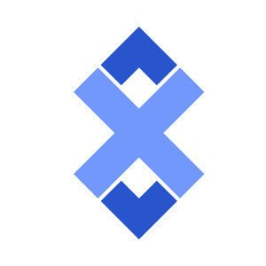 | 223 | ADX | AdEx |
|  | 146517 | BGSC | BugsCoin |
|  | 32341 | ELA | Elastos |
|  | 121659 | WILD | Wilder World |
|  | 136149 | SQGROW | SquidGrow |
| 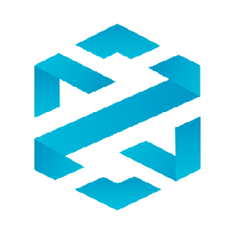 | 62703 | DEXT | DexTools |
| 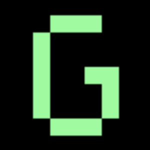 | 146381 | GRIFFAIN | GRIFFAIN |
| 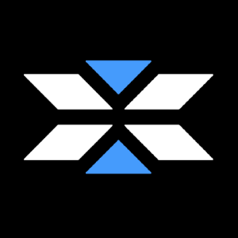 | 147665 | X | X Empire |
|  | 172273 | YB | YieldBasis |
| 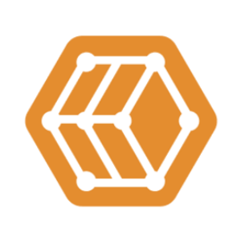 | 148221 | BOUNTY | ChainBounty |
|  | 147705 | FORT | Forta |
| 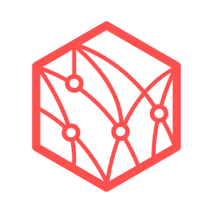 | 146493 | RBNT | Redbelly Network |
|  | 165085 | IAUON | iShares Gold Trust Tokenized ETF (Ondo) |
|  | 44678 | ASR | AS Roma Fan Token |
| 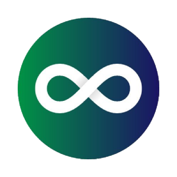 | 70749 | KCT | Konnect |
|  | 33451 | AGRS | Agoras Tokens |
| 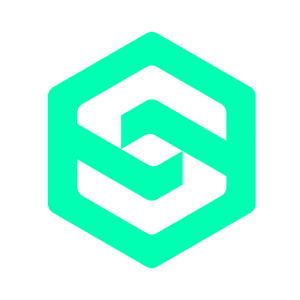 | 96563 | SDEX | SmarDex |
|  | 53581 | VOW | Vow |
| 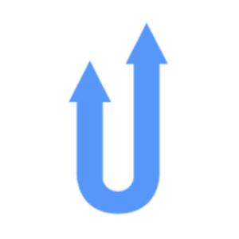 | 61309 | JMPT | JumpToken |
|  | 158697 | LIBERTY | Torch of Liberty |
|  | 51151 | VITA | VitaDAO |
| 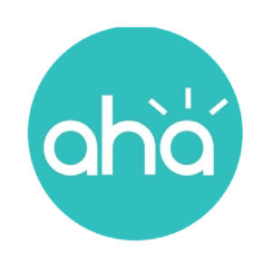 | 60647 | AHT | AhaToken |
| 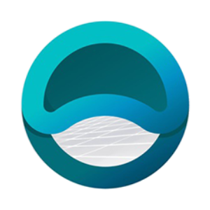 | 135301 | ANYONE | ANyONe Protocol |
| 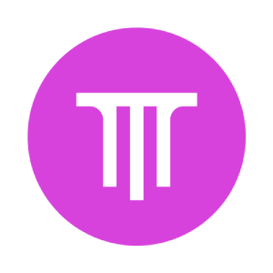 | 147675 | THE | THENA |
| 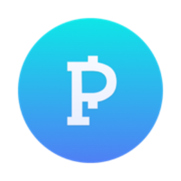 | 44585 | PXP | PXP Token |
| 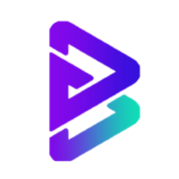 | 121681 | BRISE | Bitgert |
| 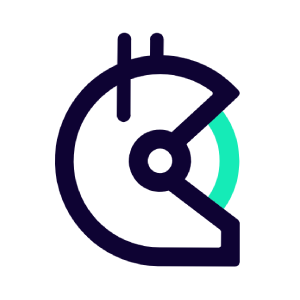 | 147707 | GTC | Gitcoin |
|  | 121639 | HONEY | Hivemapper |
|  | 56851 | SCLP | Scallop |
|  | 33807 | XFC | Footballcoin |
|  | 172271 | RECALL | Recall |
| 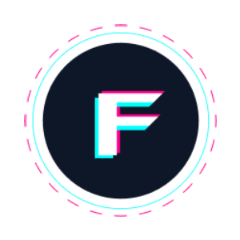 | 111625 | FOOM | Foom |
| 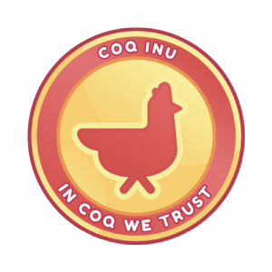 | 113811 | COQ | Coq Inu |
|  | 44689 | BAL | Balancer |
|  | 60735 | CWEB | Coinweb |
| 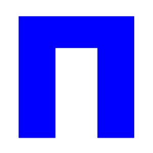 | 161473 | NIL | Nillion |
|  | 146533 | PHNIX | Phoenix |
| 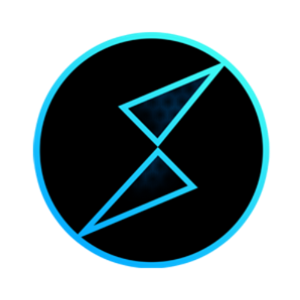 | 64827 | THOR | THORSwap |
|  | 147941 | ATM | Atletico De Madrid Fan Token |
|  | 161895 | BSU | Baby Shark Universe |
| 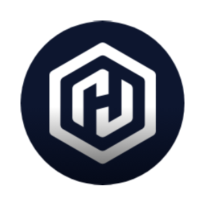 | 121761 | HDN | Hydranet |
|  | 33129 | AMO | AMO Coin |
|  | 42593 | OXT | Orchid |
|  | 44675 | RIO | Realio Network |
|  | 147573 | APU | Apu Apustaja |
|  | 111373 | PAAL | PAAL AI |
|  | 114125 | VANRY | Vanar Chain |
|  | 45884 | POLS | Polkastarter |
|  | 168595 | INC | WorldAssets |
| 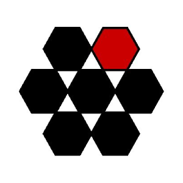 | 146383 | SWARMS | Swarms |
|  | 232 | OMG | OmiseGO |
|  | 147775 | INV | Inverse Finance |
|  | 46975 | BADGER | Badger DAO |
| 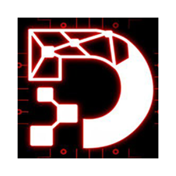 | 127151 | DSYNC | Destra Network |
|  | 147689 | MBX | MARBLEX |
| 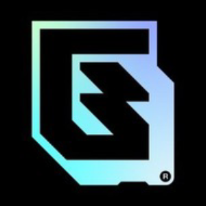 | 161501 | GUN | GUNZ |
| 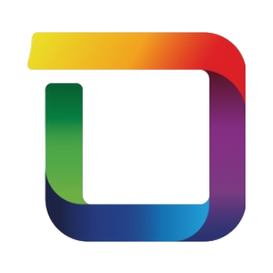 | 70855 | OGY | ORIGYN Foundation |
|  | 4 | PPC | Peercoin |
|  | 45591 | BEL | Bella Protocol |
| 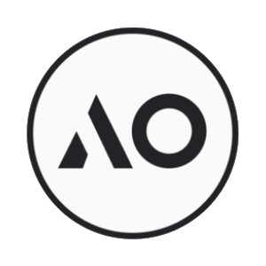 | 161477 | AO | AO |
| 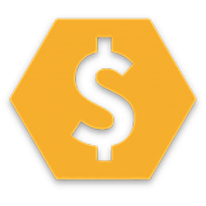 | 32935 | NIM | Nimiq |
| 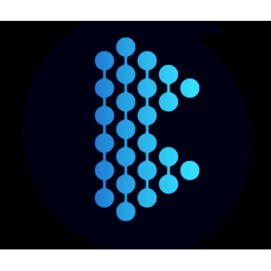 | 121855 | BKN | Brickken |
| 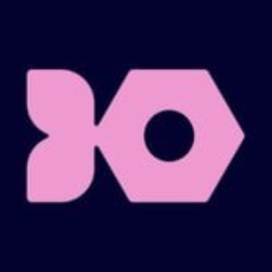 | 93945 | IRON | Iron Fish |
| 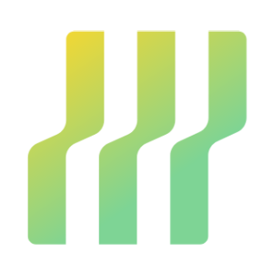 | 150893 | HEI | Heima |
|  | 147577 | PEPECOIN | PepeCoin |
|  | 147587 | SCR | Scroll |
| 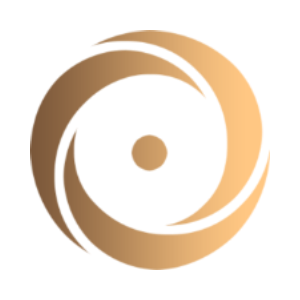 | 147673 | ACE | Fusionist |
|  | 58767 | PORTO | FC Porto |
|  | 161917 | AKE | AKEDO |
|  | 151125 | MNSRY | Mansory |
| 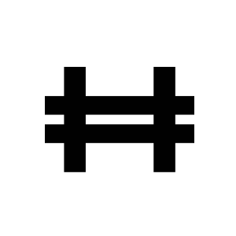 | 121649 | HFT | Hashflow |
|  | 127015 | ESE | Eesee |
|  | 47385 | DAO | DAO Maker |
| 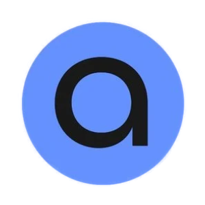 | 121665 | ACS | Access Protocol |
|  | 121635 | WE | WeBuy |
| 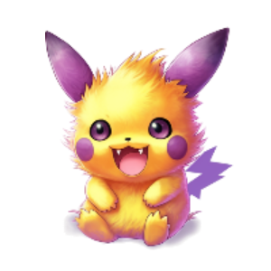 | 147757 | PIKA | Pikaboss |
|  | 44849 | PSG | Paris Saint-Germain Fan Token |
|  | 46206 | ORAI | Oraichain Token |
| 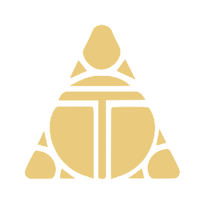 | 48719 | TLM | Alien Worlds |
|  | 121597 | DYM | Dymension |
|  | 77765 | SWEAT | Sweatcoin - Sweat Economy |
|  | 165267 | MAIGA | Maiga |
|  | 161849 | OVPP | OpenVPP |
|  | 166093 | NETX | NetX |
|  | 123225 | WUSD | Worldwide USD |
| 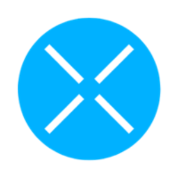 | 80821 | XPLA | XPLA |
|  | 111353 | LYX | LUKSO |
|  | 64747 | SPA | Sperax |
|  | 47079 | WISE | Wise |
|  | 161885 | HEMI | Hemi |
| 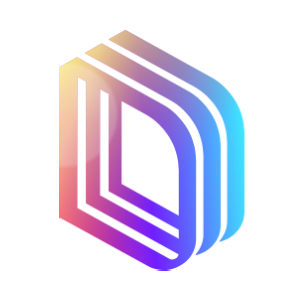 | 147529 | DRIFT | Drift |
|  | 151131 | BMT | Bubblemaps |
|  | 147799 | QUICK | Quickswap [New] |
|  | 56481 | LAZIO | Lazio Fan Token |
|  | 147615 | COOKIE | Cookie DAO |
| 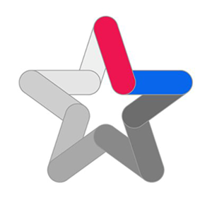 | 147691 | MIN | Minswap |
| 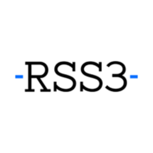 | 63347 | RSS3 | RSS3 |
| 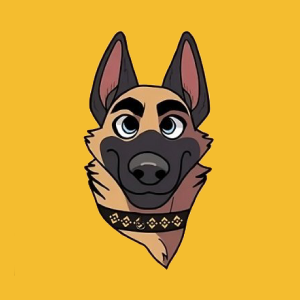 | 150889 | BROCCOLI | Broccoli (firstbroccoli.com) |
|  | 126789 | MAPO | MAP Protocol |
| 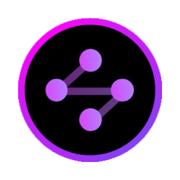 | 64679 | SYN | Synapse |
|  | 51177 | PIT | Pitbull |
|  | 32351 | HT | Huobi Token |
|  | 54597 | RACA | Radio Caca |
| 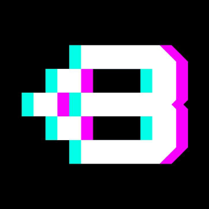 | 165669 | BTR | Bitlayer |
|  | 165053 | TRADOOR | Tradoor |
|  | 158429 | RESOLV | Resolv |
| 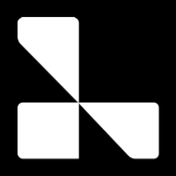 | 136015 | L3 | Layer3 |
| 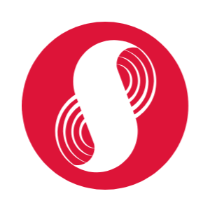 | 161479 | SUPRA | SUPRA |
| 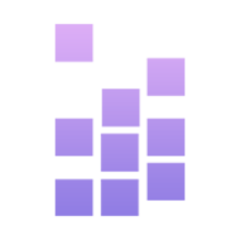 | 147887 | MPC | Partisia Blockchain |
|  | 126681 | NATI | IlluminatiCoin |
|  | 60177 | VOXEL | Voxies |
| 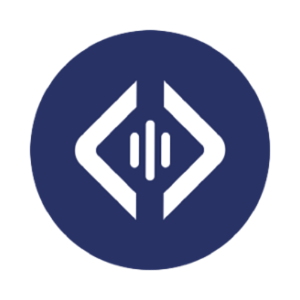 | 50253 | COOK | Cook |
|  | 103 | PIVX | Pivx |
| 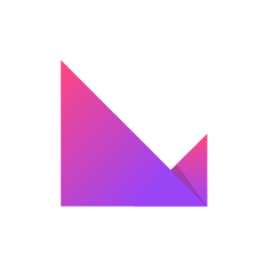 | 45275 | KLV | Klever |
|  | 124219 | WEXO | Wexo |
| 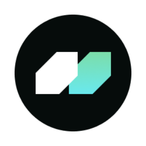 | 151157 | FHE | Mind Network |
| 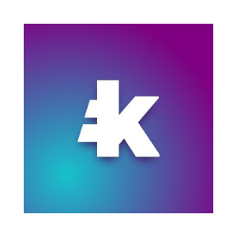 | 32985 | KRL | Kryll |
|  | 151163 | AIOT | OKZOO |
|  | 33738 | SIX | SIX |
|  | 64951 | MNDE | Marinade |
|  | 126987 | ANDY | ANDY |
| 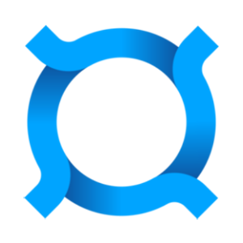 | 48705 | PKOIN | Pkoin |
|  | 121683 | CRE | Carry |
| 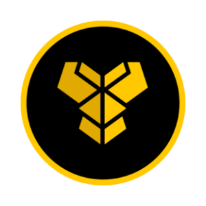 | 64873 | PNG | Pangolin |
| 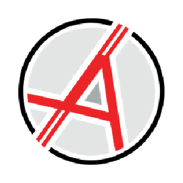 | 147539 | ANON | Hey Anon |
|  | 147617 | SOLV | Solv Protocol |
| 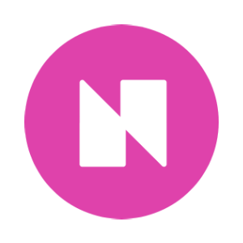 | 161493 | NEON | Neon EVM |
|  | 70 | XEM | NEM |
| 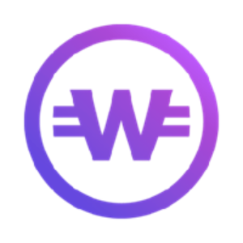 | 21 | XWC | WhiteCoin |
|  | 161487 | XION | XION |
|  | 161855 | TOWNS | Towns |
|  | 94651 | LMWR | LimeWire Token |
| 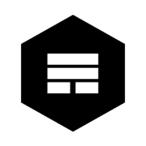 | 100193 | OLAS | Autonolas |
|  | 70663 | M87 | MESSIER |
| 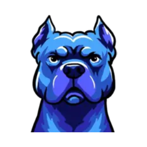 | 127127 | DOGINME | doginme |
|  | 147649 | CXT | Covalent X Token |
| 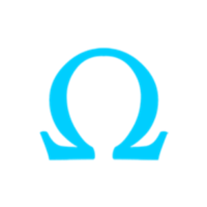 | 69457 | GALEON | Galeon |
|  | 32722 | UBT | Unibright |
| 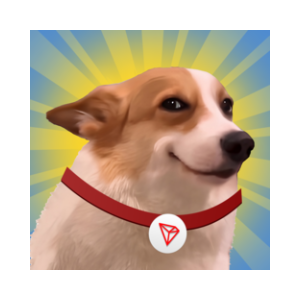 | 136121 | SUNDOG | SUNDOG |
|  | 111507 | OMIKAMI | AMATERASU OMIKAMI |
|  | 121641 | PORK | PepeFork |
| 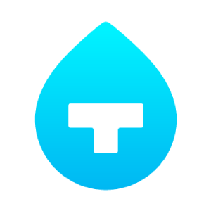 | 65879 | TDROP | ThetaDrop |
| 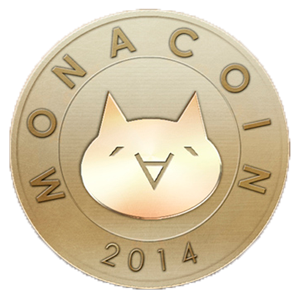 | 22 | MONA | MonaCoin |
|  | 151479 | NOBODY | Nobody Sausage |
|  | 64793 | SWAP | Trustswap |
|  | 36667 | TLOS | Telos |
|  | 121733 | CITY | Manchester City Fan Token |
| 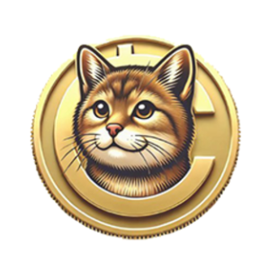 | 48887 | CATE | CateCoin |
|  | 62717 | CCS | CloutContracts |
|  | 70903 | BIDZ | BIDZ Coin |
| 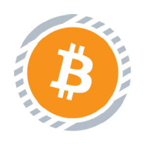 | 44497 | RENBTC | renBTC |
| 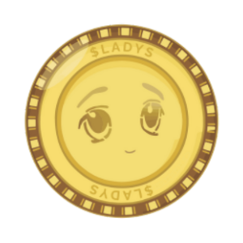 | 97131 | LADYS | Milady Meme Coin |
|  | 147561 | FWOG | Fwog (SOL) |
| 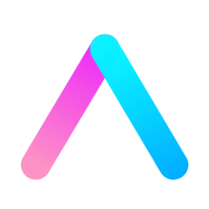 | 50543 | ALU | Altura |
|  | 131477 | DADDY | Daddy Tate |
| 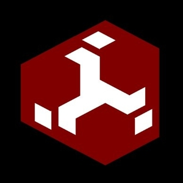 | 121697 | MCT | Metacraft |
|  | 48729 | GHX | GamerCoin |
|  | 72 | DMD | Diamond |
| 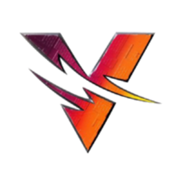 | 50333 | PYR | Vulcan Forged |
|  | 86839 | LIF3 | LIF3 |
| 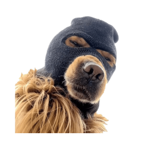 | 147597 | SKI | Ski Mask Dog |
|  | 147751 | GST | Green Satoshi Token (SOL) |
|  | 70501 | BWO | Battle World |
| 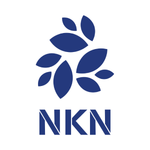 | 32740 | NKN | NKN |
| 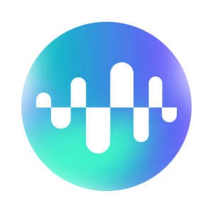 | 147715 | MLN | Enzyme |
|  | 151141 | HAEDAL | Haedal Protocol |
|  | 147823 | ASD | ASD |
| 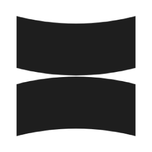 | 121671 | VIC | Viction |
|  | 161667 | QQQX | Nasdaq tokenized ETF (xStock) |
|  | 122309 | OORT | OORT |
|  | 136171 | SPARKLET | Upland (SPARKLET) |
|  | 158469 | JAGER | Jager Hunter |
|  | 121629 | MAVIA | Heroes of Mavia |
|  | 65081 | BTCMT | Minto |
|  | 121717 | BAR | FC Barcelona Fan Token |
| 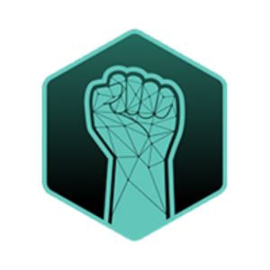 | 77779 | HERO | Metahero |
|  | 85681 | GMMT | Giant Mammoth |
| 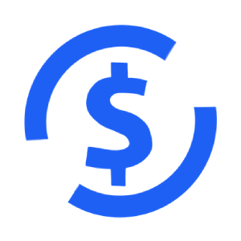 | 161967 | FUSD | Freedom Dollar |
|  | 146445 | KEKIUS | Kekius Maximus (kekiusmaximus.vip) |
|  | 285 | BTG | Bitcoin Gold |
|  | 50111 | LAT | PlatON Network |
|  | 55505 | BIGSB | BigShortBets |
| 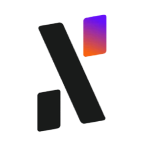 | 61585 | ALPH | Alephium |
| 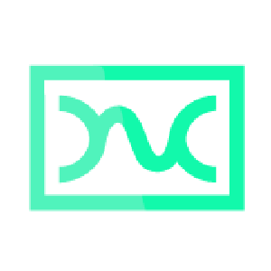 | 48833 | BOSON | Boson Protocol |
| 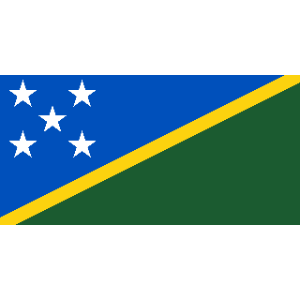 | 116 | SBD | Steem Dollars |
|  | 56243 | NAKA | Nakamoto Games |
| 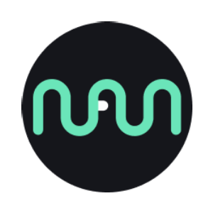 | 122103 | NAVX | NAVI Protocol |
|  | 127053 | KEYCAT | Keyboard Cat |
|  | 44060 | JUV | Juventus Fan Token |
|  | 56173 | IHC | Inflation Hedging Coin |
| 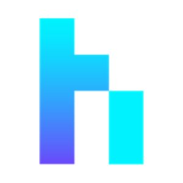 | 121669 | HIGH | Highstreet |
|  | 64695 | XSUSHI | xSUSHI |
| 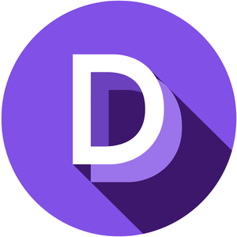 | 45568 | DPI | DeFiPulse Index |
|  | 158455 | USDUC | Unstable Coin (usduc.xyz) |
| 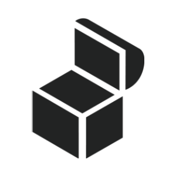 | 141447 | OL | Open Loot |
|  | 94315 | PROPC | Propchain |
|  | 147661 | NFP | NFPrompt |
| 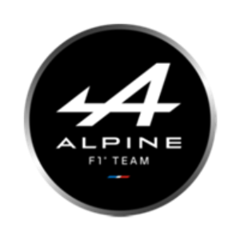 | 63343 | ALPINE | Alpine F1 Team Fan Token |
|  | 114515 | TET | Tectum |
| 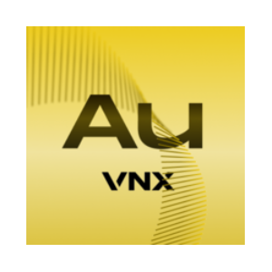 | 80477 | VNXAU | VNX Gold |
| 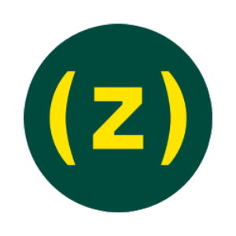 | 114029 | ZARP | ZARP Stablecoin |
|  | 77739 | BLD | Agoric |
|  | 142517 | EURQ | Quantoz EURQ |
| 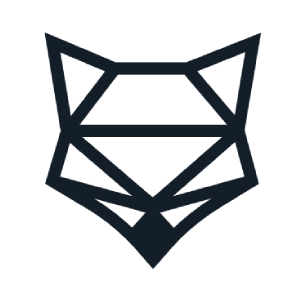 | 121727 | FOX | Shapeshift FOX Token |
|  | 49063 | IMO | IMO |
|  | 136587 | PUSS | PussFi |
| 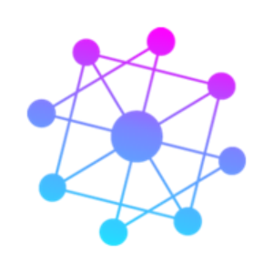 | 1276 | BLZ | Bluzelle |
| 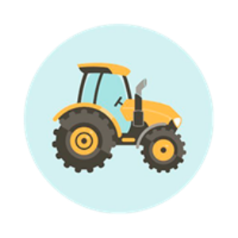 | 64779 | FARM | Harvest Finance |
|  | 165585 | CRCLX | Circle xStock |
|  | 58751 | DESU | Dexsport |
|  | 141477 | STNK | Stonks |
| 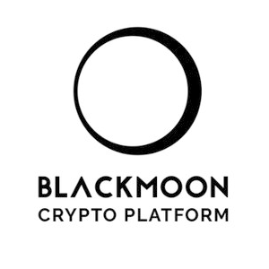 | 125261 | BMC | BountyMarketCap |
|  | 60381 | HEART | Humans.ai |
|  | 147731 | BLUE | Bluefin |
|  | 147685 | D | DAR Open Network |
| 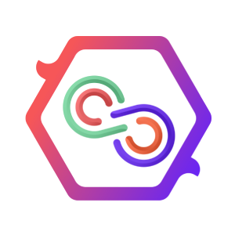 | 88325 | DEOD | Decentrawood |
| 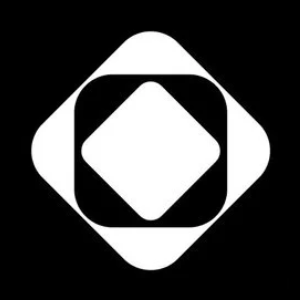 | 147601 | SAGA | Saga |
|  | 161859 | MITO | Mitosis |
|  | 135281 | NATIX | NATIX Network |
| 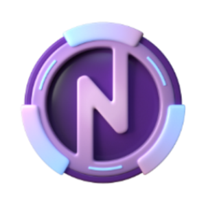 | 146497 | LINGO | Lingo |
| 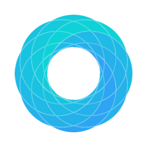 | 33804 | OBSR | Observer |
|  | 165735 | STRIKE | StrikeBit AI |
| 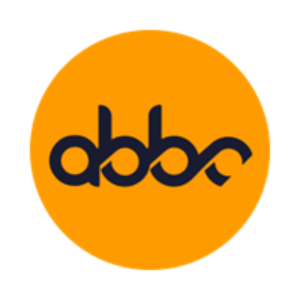 | 33821 | ABBC | ABBC Coin |
|  | 78427 | DAR | Mines of Dalarnia |
| 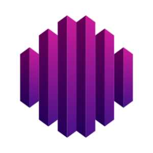 | 122267 | OCTA | OctaSpace |
|  | 64719 | CRTS | Cratos |
|  | 161615 | CESS | CESS Network |
|  | 141489 | KOMA | Koma Inu |
|  | 96273 | 0X0 | 0x0.ai: AI Smart Contract |
| 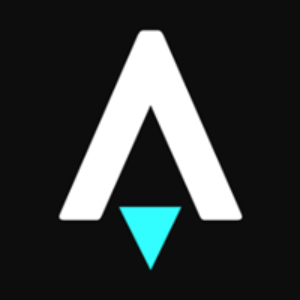 | 121653 | POLIS | Star Atlas DAO |
| 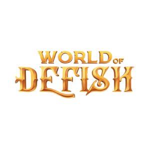 | 147909 | WOD | World of Dypians |
|  | 122327 | GEAR | Gearbox Protocol |
|  | 67967 | MEV | MEVerse |
|  | 155 | GBYTE | Byteball Bytes |
| 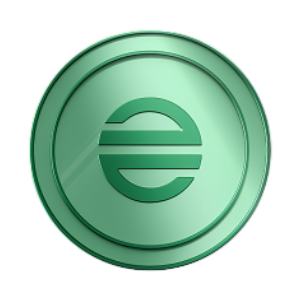 | 122183 | DEVVE | Devve |
| 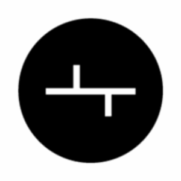 | 54441 | TOKE | Tokemak |
|  | 121685 | WEN | Wen |
|  | 161933 | RION | Hyperion |
| 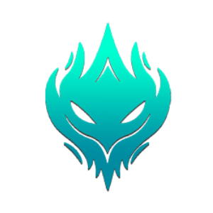 | 113213 | SPECTRE | Spectre AI |
|  | 161481 | PIN | PinLink |
|  | 3026 | DENT | Dent |
|  | 96165 | DIMO | DIMO |
|  | 126955 | PRCL | Parcl |
|  | 84985 | FIDU | Fidu |
| 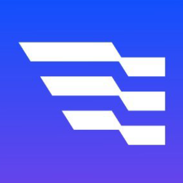 | 121831 | EPIC | Epic Cash |
|  | 147679 | PALM | PaLM AI |
| 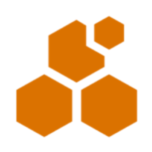 | 64765 | BZZ | Swarm |
|  | 121823 | MVC | MileVerse |
| 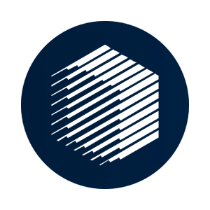 | 147789 | REN | Ren |
| 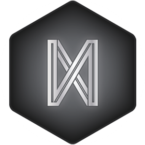 | 148425 | NRS | Nereus |
| 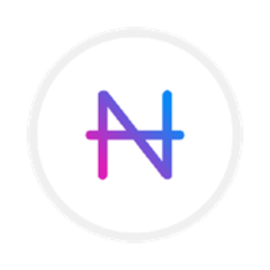 | 34 | NAV | NAVCoin |
|  | 141241 | BELLS | Bellscoin |
|  | 158727 | MAMO | Mamo |
|  | 141749 | MINIMA | Minima |
| 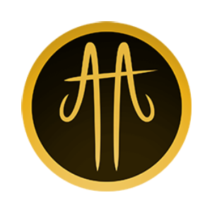 | 130971 | CTA | Cross The Ages |
| 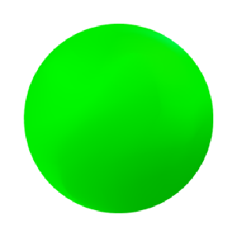 | 45055 | SUKU | SUKU |
|  | 48077 | XEP | Electra Protocol |
|  | 3 | VTC | Vertcoin |
|  | 44704 | ALEPH | Aleph.im |
|  | 111391 | ZEPH | Zephyr Protocol |
| 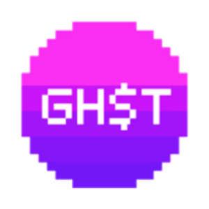 | 45519 | GHST | Aavegotchi |
| 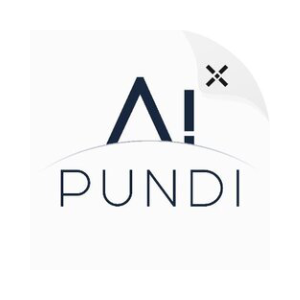 | 151433 | PUNDIAI | Pundi AI |
|  | 77801 | ZPAY | ZoidPay |
|  | 147743 | GEMS | Gems |
| 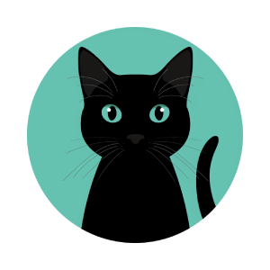 | 148243 | NACHO | Nacho the Kat |
|  | 66159 | MNFT | Mongol NFT |
| 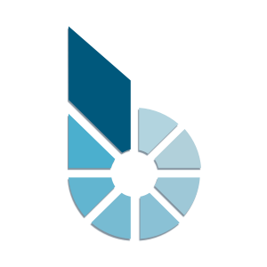 | 54 | BTS | BitShares |
|  | 147843 | GME | GmeStop |
| 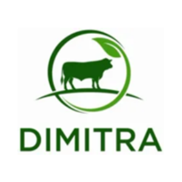 | 56475 | DMTR | Dimitra |
|  | 165363 | CODEC | Codec Flow |
| 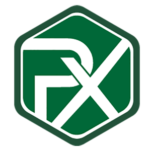 | 158439 | PX | Not Pixel |
|  | 147765 | MUMU | Mumu the Bull (SOL) |
| 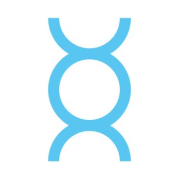 | 64999 | MPS | Mt Pelerin Shares |
| 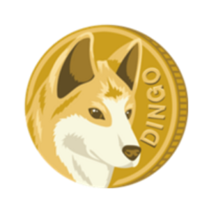 | 121929 | DINGO | Dingocoin |
| 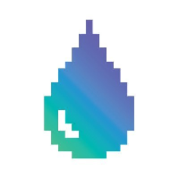 | 69147 | LQ | Liqwid Finance |
| 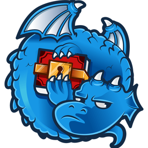 | 32237 | DRGN | Dragonchain |
| 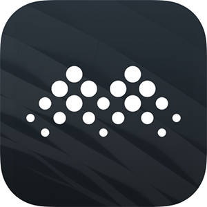 | 44565 | MATH | MATH |
| 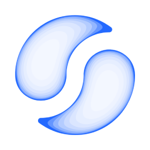 | 147635 | SEND | Suilend |
|  | 88929 | CRETA | Creta World |
|  | 113201 | SOIL | Soil |
| 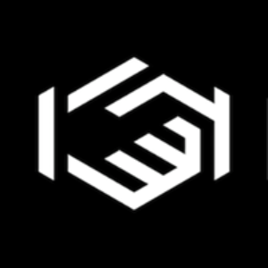 | 61285 | ASK | Permission Coin |
| 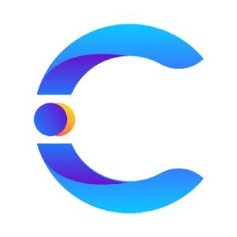 | 34396 | COS | Contentos |
| 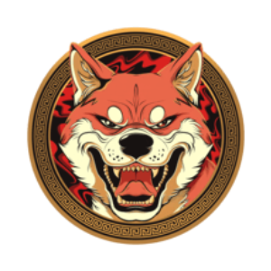 | 131019 | KENDU | Kendu Inu |
|  | 77825 | CTX | Cryptex Finance |
| 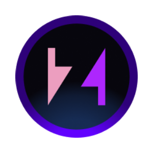 | 135265 | ZEX | Zeta |
| 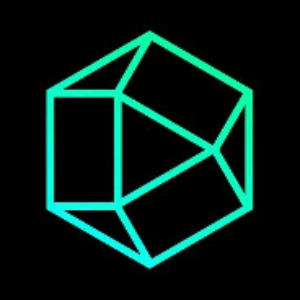 | 131339 | ZKJ | Polyhedra Network |
|  | 165473 | WFCA | World Friendship Cash |
|  | 147709 | REI | REI Network |
| 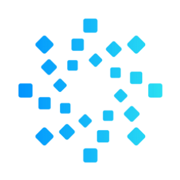 | 127227 | BXN | BlackFort Exchange Network |
| 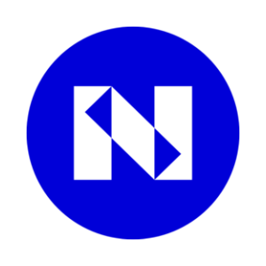 | 58943 | NUM | Numbers Protocol |
|  | 165673 | EVAA | EVAA Protocol |
| 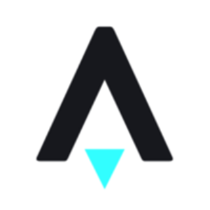 | 54453 | ATLAS | Star Atlas |
|  | 121631 | OAS | Oasys |
| 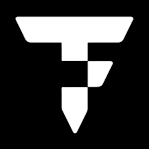 | 147727 | TOKEN | TokenFi |
|  | 48805 | MBOX | Mobox |
| 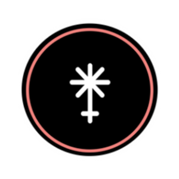 | 56297 | JUNO | Juno Network |
|  | 161921 | PUBLIC | PublicAI |
|  | 64791 | FORTH | Ampleforth Governance Token |
|  | 161919 | DJI6930 | DOWGE |
|  | 61289 | SKEY | Skey Network |
|  | 46846 | HANDY | Handy |
| 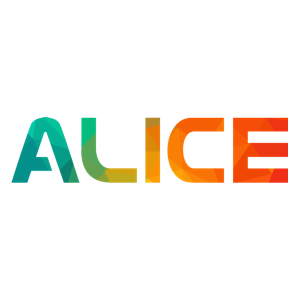 | 136145 | LWA | LumiWave |
|  | 141243 | PUFFER | Puffer |
|  | 46582 | WOO | Wootrade Network |
|  | 54461 | WNCG | Wrapped NCG |
| 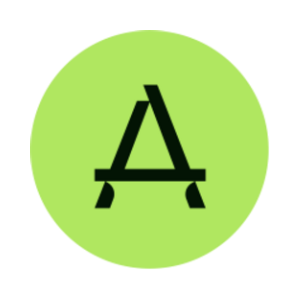 | 135603 | A8 | Ancient8 |
| 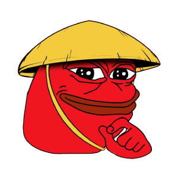 | 131345 | PEIPEI | PeiPei |
| 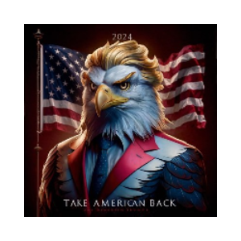 | 161915 | TAKE | OVERTAKE |
| 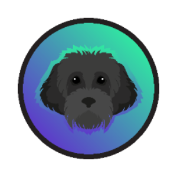 | 121673 | MYRO | Myro |
|  | 60585 | GOG | Guild of Guardians |
| 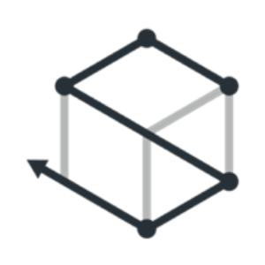 | 71551 | STAT | STAT |
| 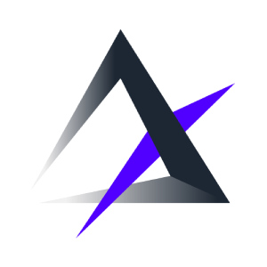 | 2874 | AVT | Aventus |
|  | 130287 | CSWAP | ChainSwap |
|  | 146483 | TAOBOT | tao.bot |
|  | 136679 | SHARP | Sharp |
|  | 42630 | ARX | Arcs |
|  | 33773 | GRIN | Grin |
| 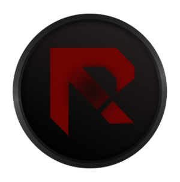 | 158953 | RZR | Rezor |
| 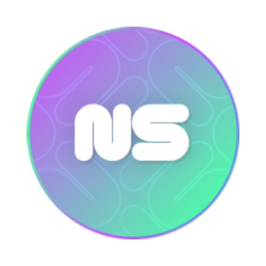 | 147741 | NS | Sui Name Service |
| 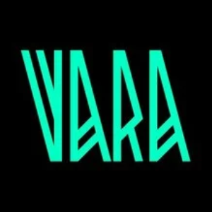 | 122293 | VARA | Vara Network |
|  | 126253 | LUSH | Lush AI |
| 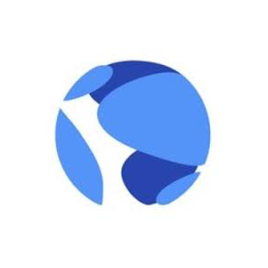 | 121989 | SDT | Stake DAO |
| 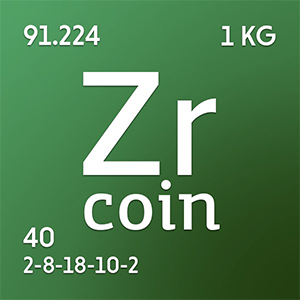 | 147637 | ZRC | Zircuit |
| 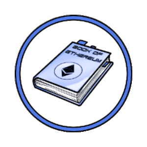 | 131061 | BOOE | Book of Ethereum |
|  | 121787 | LM | LeisureMeta |
|  | 48917 | GMEE | GAMEE |
| 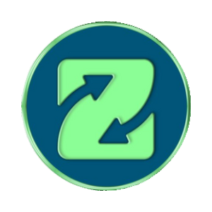 | 134645 | ZYPTO | Zypto Token |
| 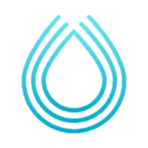 | 45054 | SRM | Serum |
| 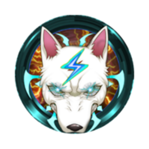 | 147861 | VOLT | Volt Inu |
|  | 45952 | DEXTF | DEXTF |
| 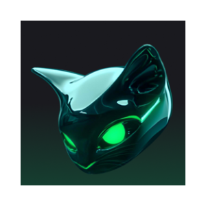 | 161899 | COLS | Cointel |
|  | 161639 | YURU | YURU COIN |
|  | 32394 | DOCK | Dock |
|  | 55119 | INTER | Inter Milan Fan Token |
| 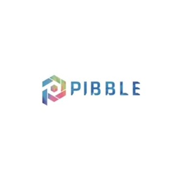 | 33666 | PIB | PIBBLE |
| 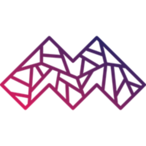 | 196 | MYST | Mysterium |
|  | 55101 | GAFI | GameFi |
|  | 151653 | Q | QuantumCoin |
| 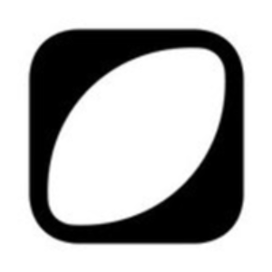 | 94443 | TAVA | ALTAVA |
|  | 64963 | ALD | Aladdin DAO |
| 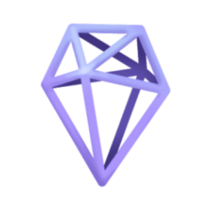 | 111473 | ROA | ROACORE |
| 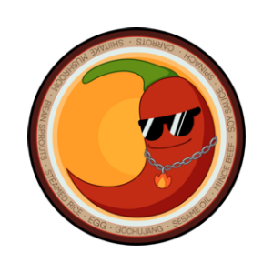 | 136521 | GOCHU | Gochujangcoin |
|  | 144913 | PINGO | PinGo |
| 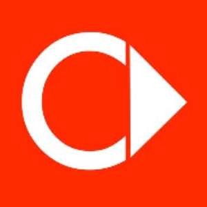 | 121821 | CA | Coupon Assets |
|  | 94301 | STIK | Staika |
|  | 96259 | VNO | Veno Finance |
|  | 147921 | BIOT | BioPassport Token |
| 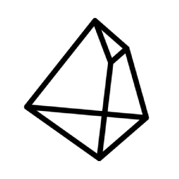 | 48249 | TRIAS | Trias Token |
|  | 161697 | PEPEONTRON | PePeonTron |
| 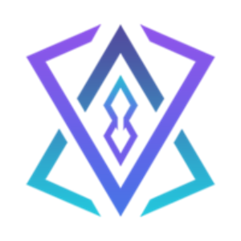 | 69901 | BRN | BRN Metaverse |
|  | 151121 | ROAM | Roam |
| 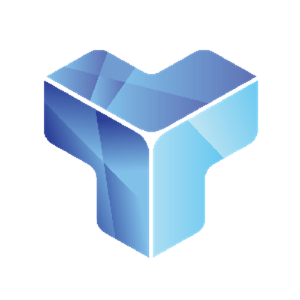 | 33655 | TEMCO | TEMCO |
|  | 165595 | MSTRX | MicroStrategy xStock |
| 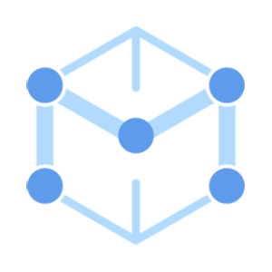 | 10865 | MDT | Measurable Data Token |

---

[Next →](./list/list2.md)
