# Cryptocurrency list \#10

[← Prev](./list9.md) | [Next →](./list11.md)

| Logo | ID | Symbol | Name |
|:----:|:--:|:------:|:-----|
|  | 9678 | GRAYSCALE | Grayscale Bitcoin Trust |
|  | 9679 | AMC | AMC Entertainment Holdings |
|  | 9680 | MMETA | Duckie Land Multi Metaverse |
| 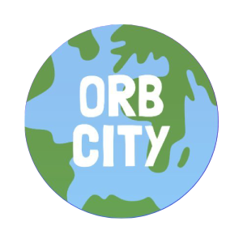 | 9681 | ORB | Orbcity |
|  | 9682 | AFIT | Actifit |
|  | 9683 | PSOL | Parasol Finance |
|  | 9684 | MEVR | Metaverse VR |
|  | 9685 | CATCOINV2 | CatCoin Cash |
|  | 9686 | MU | Miracle Universe |
|  | 9687 | MSQ | MSquare Global |
|  | 9688 | CSR | Cashera |
|  | 9689 | VTG | Victory Gem |
|  | 9690 | MISA | Sangkara |
|  | 9691 | XRUN | XRun |
|  | 9692 | JTS | Jetset |
|  | 9693 | PLSD | PulseDogecoin |
|  | 9694 | J9BC | J9CASINO |
|  | 9695 | SOY | Soy Finance |
|  | 9696 | MOVEY | Movey |
| 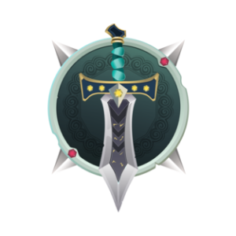 | 9697 | TARO | Taroverse |
|  | 9698 | CREO | Creo Engine |
|  | 9699 | BONTE | Bontecoin |
|  | 9700 | PETO | Petoverse |
|  | 9701 | SLEEPEE | SleepFuture |
| 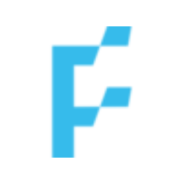 | 9702 | FLD | FLUID |
|  | 9703 | GARTS | Glink Arts Share |
|  | 9704 | JM | JustMoney |
|  | 9705 | GRVE | Grave |
|  | 9706 | ZONX | METAZONX |
|  | 9707 | BNSV2 | BNS token |
| 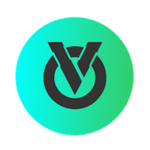 | 9708 | OMNIAV2 | OmniaVerse |
|  | 9709 | ASUNA | Asuna Hentai |
|  | 9710 | THRY | THEORY |
|  | 9711 | N3DR | NeorderDAO |
|  | 9712 | METAPK | Metapocket |
|  | 9713 | ELONCAT | ELON CAT COIN |
|  | 9714 | FLOVM | FLOV MARKET |
|  | 9715 | KS2 | Kingdomswap |
| 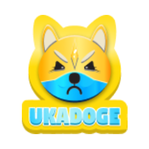 | 9716 | UDOGE | UKA DOGE COIN |
|  | 9717 | HONOR | HonorLand |
|  | 9718 | SLEEP | Sleep Ecosystem |
|  | 9719 | MDB | Million Dollar Baby |
|  | 9720 | MOVON | MovingOn Finance |
|  | 9721 | FURY | Engines of Fury |
|  | 9722 | BHEROES | BombHeroes coin |
|  | 9723 | MAPE | Mecha Morphing |
|  | 9724 | AETHC | Ankr Reward-Bearing Staked ETH |
|  | 9725 | SVT | Solvent |
|  | 9726 | KZEN | Kaizen |
|  | 9727 | HDV | Hydraverse |
|  | 9728 | DOGA | Dogami |
|  | 9729 | EGS | EdgeSwap |
|  | 9730 | POLYPAD | PolyPad |
|  | 9731 | DOMI | Domi |
|  | 9732 | METO | Metafluence |
|  | 9733 | ADAPAD | ADAPad |
|  | 9734 | ALTB | Altbase |
|  | 9735 | CHICKS | SolChicks |
|  | 9736 | AOG | AgeOfGods |
|  | 9737 | DANA | Ardana |
|  | 9738 | DAL | DAOLaunch |
|  | 9739 | SWAY | Sway Social |
|  | 9740 | WEAR | MetaWear |
|  | 9741 | ICONS | SportsIcon |
|  | 9742 | MHUNT | MetaShooter |
|  | 9743 | SCY | Synchrony |
|  | 9744 | BAKED | Baked |
|  | 9745 | SONAR | SonarWatch |
|  | 9746 | ENNO | ENNO Cash |
|  | 9747 | FIWA | Defi Warrior |
|  | 9748 | BUSY | Busy DAO |
|  | 9749 | BLOCKIFY | Blockify.Games |
|  | 9750 | GRBE | Green Beli |
|  | 9751 | ATK | Attack Wagon |
|  | 9752 | AFK | AFKDAO |
|  | 9753 | JCG | JustCarbon Governance |
|  | 9754 | GDAO | Governor DAO |
|  | 9755 | MOOO | Hashtagger |
|  | 9756 | NSDX | NASDEX |
|  | 9757 | XPRESS | CryptoXpress |
|  | 9758 | HIBIKI | Hibiki Finance |
|  | 9759 | SAVG | SAVAGE |
|  | 9760 | PRIDE | Nomad Exiles |
|  | 9761 | HATI | Hati |
|  | 9762 | PPAD | PlayPad |
|  | 9763 | BUC | Beau Cat |
|  | 9764 | VDR | Vodra |
|  | 9765 | ZONE | Zone |
|  | 9766 | KCT | Konnect |
|  | 9767 | AMZE | The Amaze World |
|  | 9768 | SINGLE | Single Finance |
|  | 9769 | TTK | The Three Kingdoms |
|  | 9770 | SPG | Space Crypto |
|  | 9771 | WOJ | Wojak Finance |
|  | 9772 | NATION | Nation3 |
|  | 9773 | MPC | Metaplace |
|  | 9774 | NFUP | Natural Farm Union Protocol |
|  | 9775 | SEAT | SeatlabNFT |
|  | 9776 | CHER | Cherry Network |
|  | 9777 | MBP | MobiPad |
|  | 9779 | TBE | TrustBase |
|  | 9780 | BXH | BXH |
|  | 9781 | PLACE | PlaceWar Governance |
|  | 9782 | PLATO | Plato Game |
|  | 9783 | DV | Dreamverse |
|  | 9784 | ZODI | Zodium |
|  | 9785 | MELI | Meli Games |
|  | 9786 | ESG | ESG |
|  | 9787 | FNCY | Fancy That |
|  | 9788 | KBD | Kyberdyne |
|  | 9789 | EVOL | EVOL NETWORK |
| 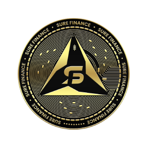 | 9790 | SUREFIN | Sure Finance |
|  | 9791 | ISKY | Infinity Skies |
|  | 9792 | RUBYEX | Ruby.Exchange |
|  | 9793 | FIC | Filecash |
|  | 9794 | STZ | 99Starz |
|  | 9795 | CANTI | Cantina Royale |
|  | 9796 | BLA | BlaBlaGame |
|  | 9797 | VTS | Veritise |
|  | 9798 | ARTEM | Artem |
|  | 9799 | POLI | Polinate |
|  | 9800 | BRZN | Brayzin |
|  | 9801 | PHN | Phayny |
|  | 9802 | SKYRIM | Skyrim Finance |
|  | 9803 | PCR | Paycer Protocol |
|  | 9804 | BATS | Batcoin |
|  | 9805 | WNZ | Winerz |
|  | 9806 | WOLFILAND | Wolfiland |
|  | 9807 | CBOT | C-BOT |
|  | 9808 | FAR | Farmland Protocol |
|  | 9809 | MCASH | Monsoon Finance |
|  | 9810 | MIMIR | Mimir |
|  | 9811 | VELOX | Velox |
|  | 9812 | POG | PolygonumOnline |
|  | 9813 | SANDWICH | Sandwich Network |
|  | 9814 | NBP | NFTBomb |
|  | 9815 | UBXS | UBXS Token |
|  | 9816 | MDF | MatrixETF |
|  | 9817 | VSO | Verso |
|  | 9818 | ZEUM | Colizeum |
|  | 9819 | SB | DragonSB |
|  | 9820 | QTC | Qitcoin |
|  | 9821 | IOEN | Internet of Energy Network |
|  | 9822 | GOFX | GooseFX |
|  | 9823 | DELFI | DeltaFi |
|  | 9824 | HVT | HyperVerse |
|  | 9825 | BAXS | BoxAxis |
|  | 9826 | BABL | Babylon Finance |
|  | 9827 | ZTC | ZeTo |
|  | 9828 | DEG | Degis |
|  | 9829 | BLWA | BlockWarrior |
|  | 9830 | EMBR | Embr |
|  | 9831 | ANSR | Answerly |
|  | 9832 | FNC | Fancy Games |
|  | 9833 | AQUAGOAT | Aqua Goat |
|  | 9834 | UM | UncleMine |
|  | 9835 | BFLOKI | BurnFloki |
|  | 9836 | ELEN | Everlens |
|  | 9837 | CLIST | Chainlist |
|  | 9838 | DTO | DotOracle |
|  | 9839 | WIRTUAL | Wirtual |
|  | 9840 | KYOKO | Kyoko |
|  | 9841 | DFIAT | DeFiato |
|  | 9842 | SMON | StarMon |
|  | 9844 | FWW | Farmers World Wood |
|  | 9845 | RPS | Rps League |
|  | 9846 | CMN | Crypto Media Network |
|  | 9847 | RIP | Fantom Doge |
|  | 9848 | NRGY | NRGY Defi |
|  | 9849 | LENDA | Lenda |
|  | 9850 | DUET | Duet Protocol |
|  | 9851 | LFT | Lend Flare Dao |
|  | 9852 | PLUG | PL^Gnet |
|  | 9853 | FADO | FADO Go |
|  | 9854 | GMI | GamiFi |
| 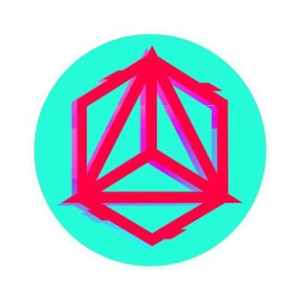 | 9855 | ANRX | AnRKey X |
|  | 9856 | FLAG | Flag Network |
|  | 9857 | RLOOP | rLoop |
|  | 9858 | MELT | Defrost Finance |
|  | 9859 | PHL | Philcoin |
|  | 9860 | THEHARAMBE | Harambe |
|  | 9861 | MOWA | Moniwar |
|  | 9862 | QUB | Qubism |
|  | 9863 | BASEDFINANCE | Based |
|  | 9864 | ECD | Echidna |
|  | 9865 | COREDAO | coreDAO |
|  | 9866 | XDOGE | Xdoge |
| 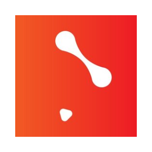 | 9867 | SOGA | SOGA Project |
|  | 9868 | EXFI | Flare Finance |
|  | 9869 | RBW | Rainbow Token |
|  | 9870 | ONES | OneSwap DAO |
|  | 9871 | UNIM | Unicorn Milk |
|  | 9872 | SFL | Sunflower Land |
|  | 9873 | TBAC | BlockAura |
|  | 9874 | FCH | Freecash |
|  | 9875 | OCB | BLOCKMAX |
|  | 9876 | TINC | Tiny Coin |
|  | 9877 | MNDCC | Mondo Community Coin |
|  | 9878 | LUNCH | LunchDAO |
|  | 9879 | MARKE | Market Ledger |
|  | 9880 | NIT | Nesten |
|  | 9881 | WIZA | Wizardia |
|  | 9882 | WOOL | Wolf Game Wool |
|  | 9883 | WGL | Wiggly Finance |
|  | 9884 | ARTM | ARTM |
|  | 9885 | BIOFI | Biometric Financial Token |
|  | 9886 | DUKE | Duke Inu |
|  | 9887 | WELUPS | Welups Blockchain |
|  | 9888 | OLOID | OLOID |
|  | 9889 | TARP | Totally A Rug Pull |
|  | 9890 | AENS | AEN Smart |
|  | 9891 | POTS | Moonpot |
|  | 9892 | LEGO | Lego Coin |
|  | 9893 | TURBOW | Turbo Wallet |
|  | 9894 | CHECK | Paycheck |
|  | 9895 | MPD | Metapad |
|  | 9896 | DOGECOIN | Buff Doge Coin |
|  | 9897 | LUCA | LUCA |
|  | 9898 | HELIOS | Mission Helios |
|  | 9899 | 2022M | 2022MOON |
|  | 9900 | FONE | Fone |
|  | 9901 | PSTN | Piston |
|  | 9902 | RND | The RandomDAO |
|  | 9903 | WACO | Waste Digital Coin |
|  | 9904 | LXTO | LuxTTO |
|  | 9905 | ADAO | ADADao |
|  | 9906 | YYE | YYE Energy |
|  | 9907 | STMAN | Stickman Battleground |
|  | 9908 | LIBERO | Libero Financial |
|  | 9909 | QBX | qiibee |
|  | 9910 | TASTE | TasteNFT |
|  | 9911 | CMK | Credmark |
|  | 9912 | TRDC | Traders Coin |
|  | 9913 | DRIPNET | Drip Network |
|  | 9914 | MERCE | MetaMerce |
|  | 9915 | SBCC | Smart Block Chain City |
|  | 9916 | SWDAO | Super Whale DAO |
|  | 9917 | UMAD | MADworld |
|  | 9918 | MNTG | Monetas |
|  | 9919 | CAST | Castello Coin |
|  | 9920 | SMRAT | Secured MoonRat |
|  | 9921 | SGLY | Singularity |
|  | 9922 | SAFUU | SAFUU |
|  | 9923 | ISTEP | iSTEP |
|  | 9924 | CRIME | Crime Gold |
|  | 9925 | HRDG | HRDGCOIN |
|  | 9926 | MSOT | BTour Chain |
|  | 9927 | HELPS | HelpSeed |
|  | 9928 | XDEN | Xiden |
|  | 9929 | HITOP | Hitop |
|  | 9930 | SHIBDOGE | ShibaDoge |
|  | 9931 | PTX | PlatinX |
|  | 9932 | LTEX | Ltradex |
|  | 9933 | BGC | Bee Token |
|  | 9934 | TSG | The Soldiers Gold |
|  | 9935 | CHECKR | CheckerChain |
|  | 9936 | GRBT | Grinbit |
|  | 9937 | GTCOIN | Game Tree |
|  | 9938 | 4JNET | 4JNET |
|  | 9939 | ADXX | AnonyDoxx |
|  | 9940 | RLT | Runner Land |
|  | 9941 | ASKO | Asko |
|  | 9942 | CALO | Calo |
|  | 9943 | DEFLY | Deflyball |
|  | 9945 | GOTG | Got Guaranteed |
|  | 9946 | LEPA | Lepasa |
|  | 9947 | KDIA | KDIA COIN |
|  | 9948 | MOI | MyOwnItem |
|  | 9949 | GDSC | Golden Safety Coin |
|  | 9950 | QA | Quantum Assets |
|  | 9951 | LEAN | Lean Management |
|  | 9952 | LIBERA | Libera Financial |
|  | 9953 | YUCJ | Yu Coin |
|  | 9954 | MINIFOOTBALL | Minifootball |
|  | 9955 | CPAD | Cronospad |
|  | 9956 | DCCT | DocuChain |
|  | 9957 | ETHSHIB | Eth Shiba |
|  | 9958 | SCO | SCOPE |
|  | 9959 | TSCT | Transient |
|  | 9960 | OPTCM | Optimus |
|  | 9961 | FCF | French Connection Finance |
|  | 9962 | CMSN | The Commission |
|  | 9963 | ERA7 | Era Token |
|  | 9964 | JAM | Tune.Fm |
|  | 9965 | GBD | Great Bounty Dealer |
|  | 9966 | OZG | Ozagold |
|  | 9967 | MIVRS | Minionverse |
|  | 9968 | BLST | Crypto Legions Bloodstone |
|  | 9969 | MBCASH | MBCash |
|  | 9970 | OPV | OpenLive NFT |
|  | 9971 | GDS | Grat Deal Coin |
|  | 9972 | NFCR | NFCore |
|  | 9973 | BELR | Belrium |
|  | 9974 | REVOLAND | Revoland Governance Token |
|  | 9975 | WPC | WePiggy Coin |
|  | 9976 | MAXR | Max Revive |
|  | 9977 | LDX | Litedex |
|  | 9978 | SAITANOBI | Saitanobi |
|  | 9979 | MBF | MoonBear.Finance |
|  | 9980 | WINRY | Winry Inu |
|  | 9981 | CCP | CryptoCoinPay |
|  | 9982 | COINSCOPE | Coinscope |
|  | 9983 | RENS | Rens |
|  | 9984 | DGP | DGPayment |
|  | 9985 | CASIO | CasinoXMetaverse |
|  | 9986 | METAF | MetaFastest |
|  | 9987 | LTR | LogiTron |
|  | 9988 | XMP | Mapt.Coin |
|  | 9989 | MELOS | Melos Studio |
|  | 9990 | ASIMI | ASIMI |
|  | 9991 | TP | Token Swap |
|  | 9992 | WITCH | Witch |
|  | 9993 | BTFA | Banana Task Force Ape |
|  | 9994 | WAGMIGAMES | WAGMI Games |
|  | 9995 | LAW | Law Token |
|  | 9996 | SNE | StrongNode |
|  | 9997 | EAT | EDGE Activity Token |
|  | 9998 | RADIO | RadioShack |
|  | 9999 | FJB | Freedom. Jobs. Business. |
|  | 10000 | XY | XY Finance |
|  | 10001 | QBU | Quannabu |
|  | 10002 | PCE | PEACE COIN |
|  | 10003 | CARES | CareCoin |
|  | 10004 | ICOM | iCommunity |
|  | 10005 | BZX | Bitcoin Zero |
|  | 10006 | LEMC | LemonChain |
|  | 10007 | FAKT | Medifakt |
|  | 10008 | DCIP | Decentralized Community Investment Protocol |
|  | 10009 | XMT | MetalSwap |
|  | 10010 | GLDX | Goldex |
|  | 10011 | NNN | Novem Gold |
|  | 10012 | ERW | ZeLoop Eco Reward |
|  | 10013 | BENX | BlueBenx |
|  | 10014 | UNR | Unirealchain |
|  | 10015 | ANA | Nirvana ANA |
|  | 10016 | FENOMY | Fenomy |
|  | 10017 | CPU | CPUcoin |
|  | 10018 | XTAL | XTAL |
|  | 10019 | UEDC | United Emirate Decentralized Coin |
|  | 10020 | LMCSWAP | LimoCoin SWAP |
|  | 10021 | PAYT | PayAccept |
|  | 10022 | GDO | GroupDao |
|  | 10023 | ZURR | ZURRENCY |
|  | 10024 | DKEY | DKEY Bank |
|  | 10025 | BIBL | Biblecoin |
|  | 10026 | IMPER | Impermax |
|  | 10027 | MDICE | Multidice |
|  | 10028 | LUXO | Luxo |
|  | 10029 | EVCOIN | EverestCoin |
|  | 10030 | CEJI | Ceji |
|  | 10031 | KYCC | KYCCOIN |
|  | 10032 | MSTO | Millennium Sapphire |
|  | 10033 | CROGE | Crogecoin |
|  | 10034 | PANDA | PandaDAO |
|  | 10035 | HANDY | Handy |
|  | 10036 | ASTROC | Astroport Classic |
|  | 10037 | NSTE | NewSolution 2.0 |
|  | 10038 | SNACK | Crypto Snack |
|  | 10039 | VER | VersalNFT |
|  | 10040 | BME | BitcoMine |
|  | 10041 | HTT | Hello Art |
|  | 10042 | NEKI | Neki Token |
|  | 10043 | GGM | Monster Galaxy |
|  | 10044 | LGX | Legion Network |
|  | 10045 | CML | Camelcoin |
|  | 10046 | SEOR | SEOR Network |
|  | 10047 | JUMBO | Jumbo Exchange |
|  | 10048 | LOA | League of Ancients |
|  | 10049 | MVEDA | MedicalVeda |
|  | 10050 | BCNT | Bincentive |
|  | 10051 | TADPOLEF | Tadpole Finance |
|  | 10052 | LAEEB | LaEeb |
|  | 10053 | TOOB | Toobcoin |
|  | 10054 | TAF | TAF |
|  | 10055 | XBT | Xbit |
|  | 10056 | UCG | Universe Crystal Gene |
|  | 10057 | JUNGLEKING | JungleKing TigerCoin |
|  | 10058 | IME | Imperium Empires |
|  | 10059 | CASTLE | bitCastle |
|  | 10060 | STI | Seek Tiger |
|  | 10061 | MYT | Mytrade |
|  | 10062 | METAS | Metaseer |
|  | 10063 | CLM | CoinClaim |
|  | 10064 | MTG | MagnetGold |
|  | 10065 | INES | Inescoin |
|  | 10066 | FERMA | Ferma |
|  | 10067 | MJT | Mojito Token |
|  | 10068 | PLD | Plutonian DAO |
|  | 10069 | HIBAYC | hiBAYC |
|  | 10070 | MIE | MIE Network |
|  | 10071 | PICO | PicoGo |
|  | 10072 | XGLI | Glitter Finance |
|  | 10073 | MVDG | MetaVerse Dog |
| 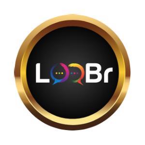 | 10074 | LOOBR | LooBr |
|  | 10075 | PYM | Playermon |
|  | 10076 | BITCCA | Bitcci Cash |
|  | 10077 | TMON | Two Monkey Juice Bar |
|  | 10078 | WCSOV | Wrapped CrownSterling |
|  | 10079 | NSUR | NSUR Coin |
|  | 10080 | ZGD | ZambesiGold |
|  | 10081 | GSTETH | Green Satoshi Token (ETH) |
|  | 10082 | GSTBSC | Green Satoshi Token (BSC) |
|  | 10083 | BX | BlockXpress |
|  | 10084 | DVRS | DaoVerse |
|  | 10085 | TOPG | Tate Token |
|  | 10086 | ALTA | Alta Finance |
|  | 10087 | GZX | GreenZoneX |
|  | 10088 | SMOON | SaylorMoon |
|  | 10089 | BTBS | BitBase Token |
|  | 10090 | CWD | CROWD |
|  | 10091 | THEOS | Theos |
|  | 10092 | FDLS | FIDELIS |
|  | 10093 | BNSD | BNSD Finance |
|  | 10094 | FDM | Fandom |
|  | 10095 | KVERSE | KEEPs Coin |
|  | 10096 | LPY | LeisurePay |
|  | 10097 | SMTF | SmartFi |
|  | 10098 | MOGX | Mogu |
|  | 10099 | POPK | POPKON |
|  | 10100 | FNF | FunFi |
|  | 10101 | ETHPOW | ETHPoW |
|  | 10102 | ETHPOS | ETHPoS |
|  | 10103 | MMG | Monopoly Millionaire Game |
|  | 10104 | APOLLO | Apollo Crypto |
|  | 10105 | AVDO | AvocadoCoin |
|  | 10106 | KLAP | Klap Finance |
|  | 10107 | XMARK | xMARK |
|  | 10108 | METAG | MetagamZ |
|  | 10109 | KNOT | Karmaverse |
|  | 10110 | FOF | Future Of Fintech |
|  | 10111 | MOPS | Mops |
|  | 10112 | SUZUME | Shita-kiri Suzume |
|  | 10113 | HECTA | Hectagon |
|  | 10114 | SOM | Souls of Meta |
|  | 10115 | ARIA | Legends of Aria |
|  | 10116 | KINGDOMQUEST | Kingdom Quest |
|  | 10117 | HIENS4 | hiENS4 |
|  | 10118 | ACK | Arcade Kingdoms |
|  | 10119 | TOKKI | CRYPTOKKI |
|  | 10120 | IJZ | iinjaz |
|  | 10121 | MPM | Monopoly Meta |
|  | 10122 | GIGASWAP | GigaSwap |
|  | 10123 | DOGECUBE | DogeCube |
|  | 10124 | 37C | 37Protocol |
|  | 10125 | BANDEX | Banana Index |
|  | 10126 | P202 | Project 202 |
|  | 10127 | DEFY | DEFY |
|  | 10128 | BACK | DollarBack |
|  | 10129 | CATS | CatCoin Token |
|  | 10130 | TWEP | The Web3 Project |
|  | 10131 | CDBIO | CDbio |
|  | 10132 | SERG | Seiren Games Network |
|  | 10133 | IUX | GeniuX |
|  | 10134 | AVAT | AVATA Network |
|  | 10135 | KILLER | Fat Cat Killer |
|  | 10136 | YCO | Y Coin |
|  | 10137 | BDY | Buddy DAO |
|  | 10138 | DOGEMETA | Dogemetaverse |
|  | 10139 | XI | Xi |
|  | 10140 | CENX | Centcex |
|  | 10141 | NASSR | Alnassr FC Fan Token |
|  | 10142 | KODACHI | Kodachi Token |
|  | 10143 | THECITADEL | The Citadel |
|  | 10144 | FEENIXV2 | ProjectFeenixv2 |
|  | 10145 | KKT | Kingdom Karnage |
|  | 10146 | FVT | Finance Vote |
|  | 10147 | CTN | Continuum Finance |
|  | 10148 | BXTB | BXTB Foundation |
|  | 10149 | RBXS | RBXSamurai |
|  | 10150 | POLVEN | Polka Ventures |
|  | 10151 | FRZSS | Frz Solar System |
|  | 10152 | CYOP | CyOp Protocol |
|  | 10153 | OTHR | OtherDAO |
|  | 10154 | SLRR | Solarr |
|  | 10155 | LXF | LuxFi |
|  | 10156 | TRAXX | Traxx |
|  | 10157 | COLR | colR Coin |
|  | 10158 | HTO | Heavenland HTO |
|  | 10159 | SAITAMAV1 | Saitama Inu v1 |
|  | 10160 | SQAT | Syndiqate |
|  | 10161 | TINU | Telegram Inu |
|  | 10162 | MNFTS | Marvelous NFTs |
|  | 10163 | S2K | Sports 2K75 |
|  | 10164 | LKD | LinkDao |
|  | 10165 | TRNDZ | Trendsy |
|  | 10166 | FUSO | Fusotao |
|  | 10167 | USDI | Interest Protocol USDi |
|  | 10168 | BTCPAY | Bitcoin Pay |
|  | 10169 | PRXY | Proxy |
|  | 10170 | BSGG | Betswap.gg |
|  | 10171 | EARN | EarnGuild |
|  | 10172 | ITG | iTrust Governance |
|  | 10173 | FREL | Freela |
|  | 10174 | D11 | DeFi11 |
|  | 10175 | TOON | Pontoon |
|  | 10176 | JACY | JACY |
|  | 10177 | WMEMO | Wonderful Memories |
|  | 10178 | DCNT | Decanect |
|  | 10179 | WLXT | Wallex Token |
|  | 10180 | NAVC | NavC token |
|  | 10181 | ASA | ASA Coin |
|  | 10182 | SMR | Shimmer |
|  | 10183 | BLV3 | Crypto Legions V3 |
|  | 10184 | HBOT | Hummingbot |
|  | 10185 | WSTR | Wrapped Star |
|  | 10186 | EHIVE | eHive |
|  | 10187 | AZA | Kaliza |
|  | 10188 | LEOX | Galileo |
|  | 10189 | ELONGT | Elon GOAT |
|  | 10190 | X7R | X7R |
|  | 10191 | X7DAO | X7DAO |
|  | 10192 | INERY | Inery |
|  | 10193 | INTR | Interlay |
|  | 10194 | NODL | Nodle Network |
|  | 10195 | PARALL | Parallel Finance |
| 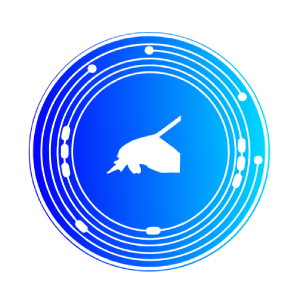 | 10196 | JOT | JOT ART |
|  | 10197 | IP3 | Cripco |
|  | 10198 | SIFU | SIFU |
|  | 10199 | CRAMER | Cramer Coin |
|  | 10200 | ICSA | Icosa |
|  | 10201 | BIVE | BIZVERSE |
|  | 10202 | BULLSH | Bullshit Inu |
|  | 10203 | CGT | Coin Gabbar Token |
|  | 10204 | LOOP | LOOP |
|  | 10205 | NUMITOR | Numitor |
|  | 10206 | ZZC | ZudgeZury |
|  | 10207 | WTN | Wateenswap |
|  | 10208 | BRT | Bikerush |
|  | 10209 | IDO | Idexo |
|  | 10210 | NOVA | Nova Finance |
| 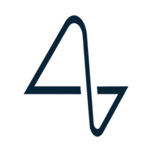 | 10211 | NEURALINK | Neuralink |
|  | 10212 | XSPECTAR | xSPECTAR |
|  | 10213 | MOONER | CoinMooner |
|  | 10214 | VRGW | Virtual Reality Game World |
|  | 10215 | GDE | Golden Eagle |
|  | 10216 | VLTY | Vaulty |
|  | 10217 | VICA | ViCA Token |
|  | 10218 | VOLR | Volare Network |
|  | 10219 | HPN | HyperonChain |
|  | 10220 | KALI | Kalissa |
|  | 10221 | TIKTOKEN | TikToken |
|  | 10222 | KRU | Kingaru |
|  | 10223 | TCG2 | TCG Coin 2.0 |
|  | 10224 | KTO | Kounotori |
|  | 10225 | SPUME | Spume |
|  | 10226 | UNITED | UnitedCoins |
|  | 10227 | PGALA | pGALA |
|  | 10228 | MCG | MicroChains Gov Token |
|  | 10229 | KUBE | KubeCoin |
|  | 10230 | DRIVECRYPTO | Drive Crypto |
|  | 10231 | YCT | Youclout |
|  | 10232 | GCAKE | Pancake Games |
|  | 10233 | GOLC | GOLCOIN |
|  | 10234 | LOF | Land of Fantasy |
|  | 10235 | ERTH | Erth Point |
|  | 10236 | IVAR | Ivar Coin |
|  | 10237 | FANV | FanVerse |
|  | 10238 | WMF | Whale Maker Fund |
|  | 10239 | VNES | Vanesse |
|  | 10240 | PNFT | Pawn My NFT |
|  | 10241 | QIE | QI Blockchain |
|  | 10242 | SMETA | StarkMeta |
|  | 10243 | ESNC | Galaxy Arena Metaverse |
|  | 10244 | ARIX | Arix |
|  | 10245 | SPAT | Meta Spatial |
|  | 10246 | KEES | Korea Entertainment Education & Shopping |
|  | 10247 | WTF | Waterfall Governance |
|  | 10248 | OKG | Ookeenga |
|  | 10249 | OKSE | Okse |
|  | 10250 | SMCW | Space Misfits |
|  | 10251 | 2GCC | 2G Carbon Coin |
|  | 10252 | AGX | Agricoin |
|  | 10253 | SNAP | SnapEx |
|  | 10254 | STSR | SatelStar |
|  | 10255 | METAVIE | Metavie |
|  | 10256 | ITEM | ITEMVERSE |
|  | 10257 | GATEWAY | Gateway Protocol |
|  | 10258 | PAXW | pax.world |
|  | 10259 | EVO | EvoVerses |
|  | 10260 | BITBURN | Bitburn |
|  | 10261 | DRACOO | DracooMaster |
|  | 10262 | DKS | DarkShield |
|  | 10263 | MTRX | Metarix |
|  | 10264 | ELVN | 11Minutes |
|  | 10265 | PIAS | PIAS |
|  | 10266 | BFHT | BeFaster Holder Token |
|  | 10267 | CNG | Changer |
|  | 10268 | TRICKLE | Trickle |
|  | 10269 | POSS | Posschain |
|  | 10270 | XODEX | Xodex |
|  | 10271 | BGS | Battle of Guardians Share |
|  | 10272 | YEON | Yeon |
|  | 10273 | LUXY | Luxy |
|  | 10274 | HRTS | YellowHeart Protocol |
|  | 10275 | UCAP | Unicap.finance |
|  | 10276 | PRI | Privateum Global  |
|  | 10277 | IXP | IMPACTXPRIME |
|  | 10278 | RCCC | RCCC |
|  | 10279 | ZEDTOKEN | Zed Token |
|  | 10280 | ALCAZAR | Alcazar |
|  | 10281 | AMDG | AMDG |
|  | 10282 | AOK | AOK |
|  | 10283 | ARTL | ARTL |
|  | 10284 | BINGO | Tomorrowland |
|  | 10285 | CTS | Citrus |
|  | 10286 | CMQ | Communique |
|  | 10287 | DOTR | Cydotori |
|  | 10288 | FRNT | Final Frontier |
|  | 10289 | HOWL | Coyote |
|  | 10290 | NPAS | New Paradigm Assets Solution |
|  | 10291 | MF | MetaFighter |
|  | 10292 | CATHEON | Catheon Gaming |
|  | 10293 | PRTG | Pre-Retogeum |
|  | 10294 | POO | POOMOON |
|  | 10295 | RB | REBorn |
|  | 10296 | RBD | Rubidium |
|  | 10297 | RCG | Recharge |
|  | 10298 | RVLNG | RevolutionGames |
|  | 10299 | RXT | RIMAUNANGIS |
|  | 10300 | NXTT | Next Earth |
|  | 10301 | ZFM | ZFMCOIN |
|  | 10302 | DZAR | Digital Rand |
|  | 10303 | NFTT | NFT |
|  | 10304 | DIE | Die Protocol |
|  | 10305 | GOKUINU | Goku (gokuinu.io) |
|  | 10306 | H2ON | H2O Securities |
|  | 10307 | RTC | Reltime |
|  | 10308 | STRIP | Stripto |
|  | 10309 | CONG | The Conglomerate Capital |
|  | 10310 | MINIMA | Minima |
|  | 10311 | ENCD | Encircled |
|  | 10312 | MONEYBYTE | MoneyByte |
|  | 10313 | GRIDZ | GridZone.io |
|  | 10314 | FLIC | Skaflic |
|  | 10315 | HEARTR | Heart Rate |
|  | 10316 | SOULS | Soulsaver |
|  | 10317 | ATHVODKA | All Time High Vodka |
|  | 10318 | METOLD | Metronome |
|  | 10340 | SBC | Brale Stable Coin |
|  | 10341 | POOLX | Poolz Finance |
|  | 10343 | POL | Polygon Ecosystem Token |
| 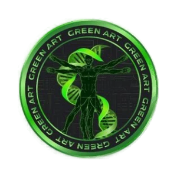 | 10344 | GAC | Green Art Coin |
|  | 10345 | GLFT | Global Fan Token |
| 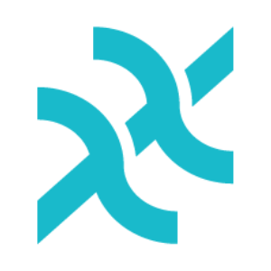 | 10347 | XX | XX Network |
|  | 10348 | SRBP | Super Rare Ball Potion |
|  | 10350 | ETI | Etica |
| 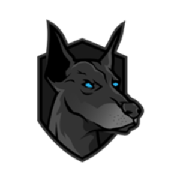 | 10351 | AXLINU | AXL INU |
|  | 10352 | ORDI | ORDI |
|  | 10353 | EGAZ | EGAZ |
| 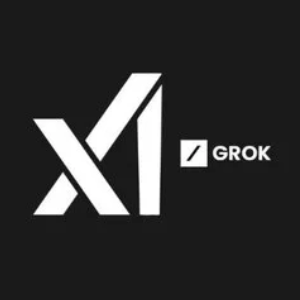 | 10354 | GROK | Grok |
| 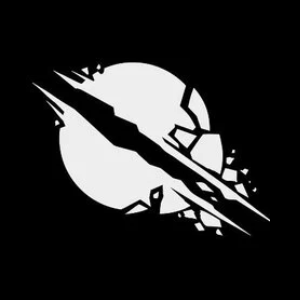 | 10355 | SHRAP | Shrapnel |
| 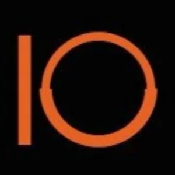 | 10356 | IDEAL | Ideal Opportunities |
| 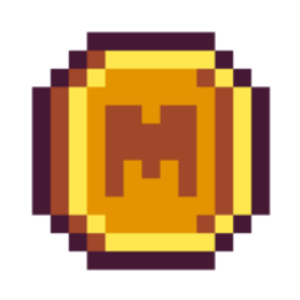 | 10358 | MEME | Memecoin |
| 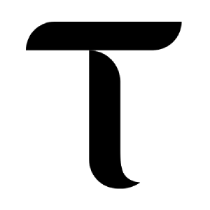 | 10359 | TAO | Bittensor |
| 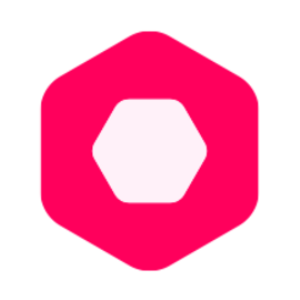 | 10360 | LYX | LUKSO |
|  | 10361 | RPK | RepubliK |
|  | 10362 | USDY | Ondo US Dollar Yield Token |
| 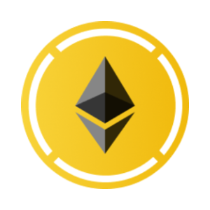 | 10363 | WBETH | Wrapped Beacon ETH |
|  | 10364 | KITTYERC20 | Hello Kitty ERC20 (clone) |
| 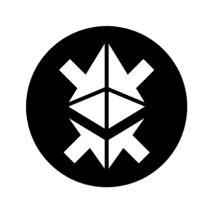 | 10365 | FRXETH | Frax Ether |
| 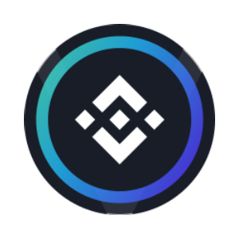 | 10366 | VBNB | Venus BNB |
| 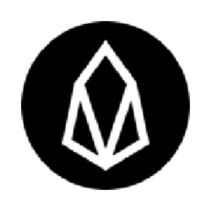 | 10367 | WEOS | Wrapped EOS |
|  | 10368 | WHBAR | Wrapped HBAR |
|  | 10369 | WKAVA | Wrapped Kava |
|  | 10370 | PYTH | Pyth Network |
|  | 10371 | CORGIAI | CorgiAI |
|  | 10372 | FNSA | FINSCHIA |
| 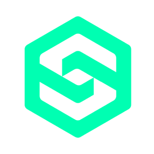 | 10373 | SDEX | SmarDex |
| 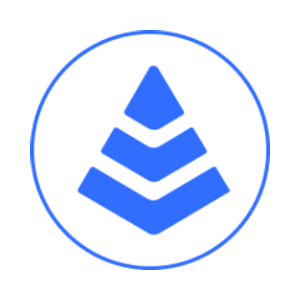 | 10374 | MKUSD | Prisma mkUSD |
|  | 10375 | 0X0 | 0x0.ai |
|  | 10376 | MURA | Murasaki |
|  | 10377 | VNO | Veno Finance |
|  | 10379 | KAG | Kinesis Silver |
| 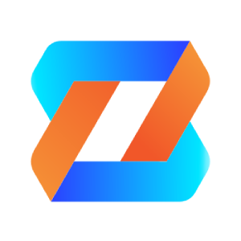 | 10380 | ZBU | Zeebu |
|  | 10382 | KAU | Kinesis Gold |
|  | 10383 | ARCH | Archway |
| 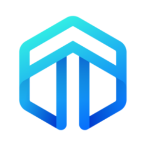 | 10384 | DNX | Dynex |
|  | 10385 | OZO | Ozone Chain  |
| 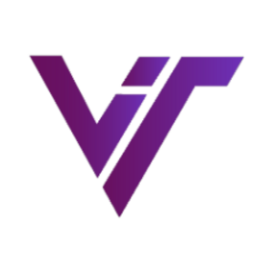 | 10386 | VRC | Virtual Coin |
| 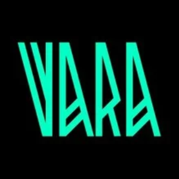 | 10387 | VARA | Vara Network |
|  | 10388 | STT | Statter Network |
| 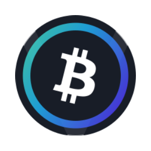 | 10389 | VBTC | Venus BTC |
|  | 10390 | VRTX | Vertex Protocol |
|  | 10391 | SIGN | Sign Token |
| 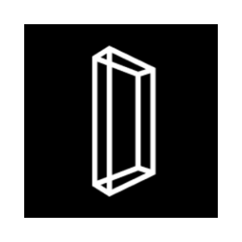 | 10392 | AGI | Delysium |
| 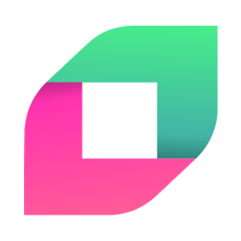 | 10393 | FLIP | Chainflip |
| 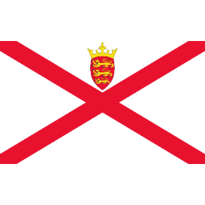 | 10395 | JEP | Jersey pound |
| 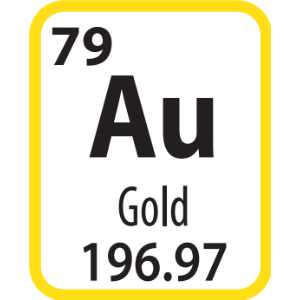 | 10396 | XAU | Gold (troy ounce) |
| 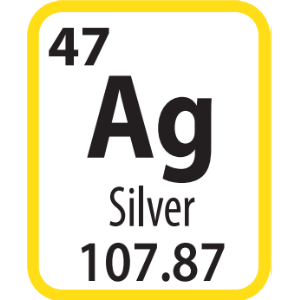 | 10397 | XAG | Silver (troy ounce) |
| 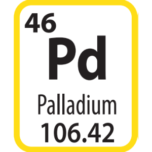 | 10399 | XPD | Palladium Ounce |
| 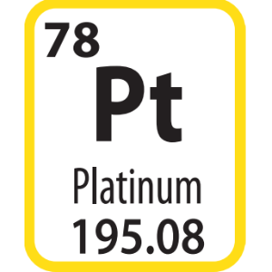 | 10401 | XPT | Platinum Ounce |
| 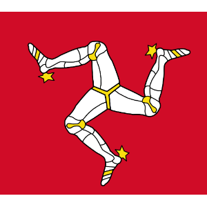 | 10403 | IMP | MANX pound (Isle of Man) |
|  | 10404 | LKR | Sri Lankan Rupee |
|  | 10405 | CNH | Chinese Yuan (Offshore) |
| 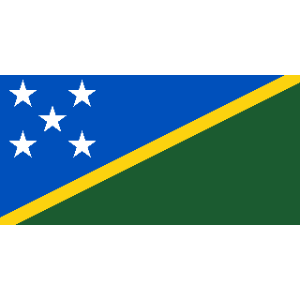 | 10406 | SBD | Solomon Islands Dollar |
| 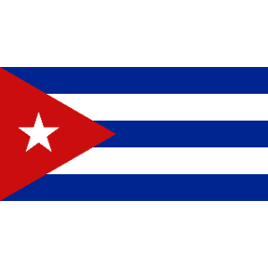 | 10407 | CUC | Cuban Convertible Peso |
| 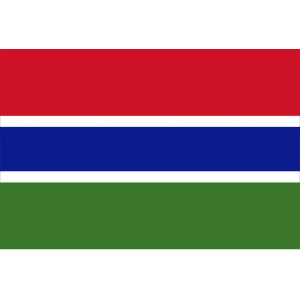 | 10408 | GMD | Gambian Dalasi |
|  | 10409 | GGP | Guernsey Pound |
| 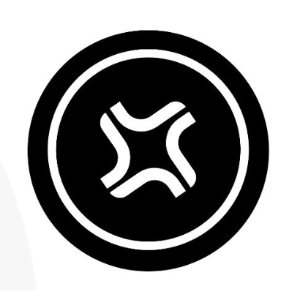 | 10410 | JTO | Jito |
|  | 10411 | LITT | LitLab Games |
|  | 10412 | SEAM | Seamless Protocol  |
|  | 10413 | RATS | Rats |
|  | 10414 | SAUCE | SaucerSwap |
| 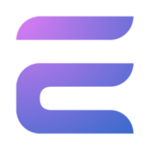 | 10417 | EDLC | Edelcoin |
| 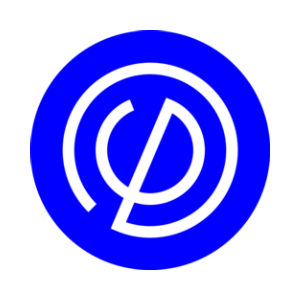 | 10418 | PMG | Pomerium Ecosystem Token |
| 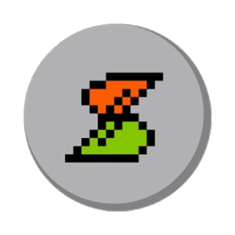 | 10419 | BSSB | BitStable Finance |
| 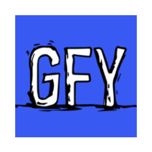 | 10420 | GFY | go fu*k yourself |
| 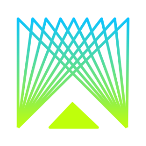 | 10421 | MUBI | Multibit |
| 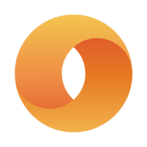 | 10422 | MC | Merit Circle |
| 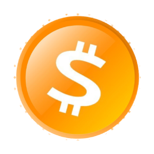 | 10423 | 1000SATS | SATS |
|  | 10424 | LAI | LayerAI |
|  | 10425 | LMWR | LimeWire Token |
|  | 10426 | DEXTV1 | DEXTools V1 |
|  | 10429 | BKN | Brickken |
|  | 10430 | CHB | COINHUB TOKEN |
|  | 10431 | XIDR | XIDR |
|  | 10432 | USDGLO | Glo Dollar |
|  | 10433 | SAITAMA | Saitama Inu |
|  | 10434 | SOLSCC | sols |
|  | 10435 | JOY | Joystream |
|  | 10436 | OMV1 | OM Token v1 |
|  | 10437 | WIF | dogwifhat (dogwifcoin.org) |
|  | 10438 | LP | Liquid Protocol |
|  | 10439 | BABYGROK | Baby Grok |
|  | 10440 | DEGOV1 | Dego Finance v1 |
|  | 10441 | DZOO | Degen Zoo |
|  | 10443 | PBRV1 | PolkaBridge v1 |
|  | 10444 | ISLM | Islamic Coin |
|  | 10445 | GEOD | GEODNET |
|  | 10446 | MOBILE | Helium Mobile |
|  | 10447 | 1CAT | Bitcoin Cats |
|  | 10448 | VANRY | Vanar Chain |
|  | 10449 | WETHV1 | WETH v1 |
|  | 10450 | MNFT | Mongol NFT |
|  | 10451 | ZKF | ZKFair |
|  | 10452 | BITN | Bitnet |
|  | 10453 | AGIV1 | SingularityNET v1 |
|  | 10454 | KYVE | KYVE Network |
|  | 10455 | TRBV1 | Tellor Tributes v1 |
|  | 10456 | VOLTV2 | Volt Inu v2 |
|  | 10457 | PBXV1 | Probinex v1 |
|  | 10458 | WBTCWXG | BTC-WXG |
|  | 10459 | SIDESHIFT | SideShift Token |
|  | 10460 | LTOV2 | LTO Network v2 |
|  | 10461 | ALEX | ALEX Lab |
|  | 10462 | MYTH | Mythos |
|  | 10463 | LTOV1 | LTO Network v1 |
|  | 10464 | TURBOS | Turbos Finance |
|  | 10465 | BENV1 | Ben v1 |
|  | 10466 | ROUP | Roup (Ordinals) |
|  | 10467 | VV | Virtual Versions |
|  | 10468 | RSTK | Restake Finance |
|  | 10469 | AIDOGE | ArbDoge AI |
|  | 10471 | NFP | NFPrompt |
|  | 10472 | LIGO | Ligo |
|  | 10473 | SEILOR | Kryptonite |
|  | 10474 | XPET | XPET token |
|  | 10475 | SATOX | Satoxcoin |
|  | 10476 | PORT3 | Port3 Network |
|  | 10477 | GALAV1 | Gala v1 |
|  | 10478 | TITANX | TitanX |
|  | 10479 | USEDCAR | A Gently Used 2001 Honda |
|  | 10480 | BNSX | Bitcoin Name Service System |
|  | 10481 | GUAC | Guacamole |
|  | 10482 | HUAHUA | Chihuahua |
|  | 10483 | RSC | ResearchCoin |
|  | 10484 | MUSIC | Gala Music |
|  | 10485 | BIDP | BID Protocol |
|  | 10487 | ISSP | ISSP |
|  | 10488 | ETGM | ETGM |
|  | 10489 | HON | SoulSociety |
|  | 10490 | VAIV1 | VAIOT v1 |
|  | 10491 | DOGIHUB  | Dogihub |
|  | 10493 | SSHIP | StarShip |
|  | 10494 | MANTA | Manta Network |
|  | 10495 | L7 | L7 |
|  | 10497 | MYRO | Myro |
|  | 10498 | TERRAB | TERRABYTE AI |
|  | 10499 | HONEY | Hivemapper |
|  | 10500 | LANDS | Two Lands |
|  | 10503 | BONKH | BonkHoneyHNTMobileSOL |
|  | 10504 | ADF | Art de Finance |
|  | 10505 | XUPS | Xups |
|  | 10506 | AI | Sleepless AI |
|  | 10507 | ACE | Fusionist |
|  | 10508 | FELIX2 | Felix 2.0 ETH |
|  | 10509 | TET | Tectum  |
|  | 10510 | NIZA | Niza Global |
|  | 10512 | GROKFATHER | Grok Father |
|  | 10513 | SILLY | Silly Dragon |
|  | 10514 | GROKQUEEN | Grok Queen |
|  | 10517 | COQ | Coq Inu |
|  | 10518 | GELATO | Gelato |
|  | 10519 | HPO | Hippocrat |
|  | 10520 | GROKGROW | GrokGrow |
|  | 10521 | MODEL | Model Labs |
|  | 10522 | ROTTY | ROTTYCOIN |
|  | 10523 | CHII | Chiiper Chain |
|  | 10524 | CYBERTRUCK | Cyber Truck |
|  | 10525 | WALK | Walk Token |
|  | 10526 | NEON | Neon EVM |
|  | 10527 | ETFETH | ETFETH |
|  | 10528 | GROKX | GROKX |
|  | 10529 | MYRIA | Myria |
|  | 10530 | TOSHI | Toshi |
|  | 10531 | IBFN | IBF Net |
|  | 10532 | AEUR | Anchored Coins AEUR |
|  | 10533 | FLIX | OmniFlix Network |
|  | 10534 | SHYTCOIN | ShytCoin |
|  | 10535 | RMBCASH | RMBCASH |
|  | 10537 | MEMET | MEMETOON |
|  | 10538 | RUBCASH | RUBCASH |
|  | 10539 | GFAL | Games for a Living |
|  | 10540 | CAMEL | The Camel |
|  | 10542 | METACR | Metacraft |
|  | 10543 | USDCASH | USDCASH |
|  | 10544 | STIK | Staika |
|  | 10545 | SMARTO | smARTOFGIVING |
|  | 10546 | CAVE | Deepcave |
|  | 10547 | CAGA | Crypto Asset Governance Alliance |
|  | 10548 | AL | ArchLoot |
|  | 10549 | IOT | Helium IOT |
|  | 10550 | DOGEMONEY | Doge Money |
|  | 10551 | INSP | Inspect |
|  | 10552 | VETH | Venus ETH |
|  | 10553 | JESUS | Jesus Coin |
|  | 10554 | XPHX | PhoenixCo Token |
|  | 10555 | GROKOLAUS | GROKolaus |
|  | 10556 | GSWIFT | GameSwift |
|  | 10557 | KOIP | KoiPond |
|  | 10558 | BABYBOB | Baby Bob |
|  | 10559 | HTM | Hatom |
|  | 10560 | SHEI | SheikhSolana |
|  | 10561 | CLORE | Clore.ai |
|  | 10562 | XMASGROK | Xmas Grok |
|  | 10563 | SSWP | Suiswap |
|  | 10564 | DEFLECT | Deflect Harbor AI |
|  | 10566 | DAIMO | Diamond Token |
|  | 10567 | CETUS | Cetus Protocol |
|  | 10568 | GOJOCOIN | Gojo Coin |
|  | 10569 | WAIT | Hourglass |
|  | 10570 | GOW39 | God Of Wealth |
|  | 10572 | SQUATCH | SASQUATCH |
|  | 10573 | UNS | UNS TOKEN |
|  | 10574 | VITAFAST | Molecules of Korolchuk IP-NFT |
|  | 10575 | DOJO | ProjectDojo |
|  | 10576 | FUL | Fulcrom Finance |
|  | 10577 | THETRIBE | The Tribe |
|  | 10578 | DOGB | DogeBoy |
|  | 10579 | ZK | zkSync |
|  | 10580 | SPARKO | Sparko |
|  | 10581 | PGOLD | Polkagold |
|  | 10582 | CONX | Connex |
|  | 10583 | USDV | Verified USD |
|  | 10584 | RBX | RabbitX |
|  | 10585 | SQR | Magic Square |
|  | 10586 | PROPC | Propchain |
|  | 10587 | ABEL | Abelian |
|  | 10588 | BANANA | Banana Gun |
|  | 10590 | NETZ | MainnetZ |
|  | 10591 | GG | Reboot |
|  | 10592 | MCADE | Metacade |
|  | 10593 | PIP | Pip |
|  | 10594 | GALATA | Galatasaray Fan Token |
|  | 10595 | INDY | Indigo Protocol |
|  | 10596 | OTK | Octokn |
|  | 10597 | KLEVA | KLEVA Protocol |
|  | 10598 | STWEMIX | Staked WEMIX |
|  | 10599 | BTCP | Bitcoin Palladium |
|  | 10600 | BBB | BitBullBot |
|  | 10601 | LYRA | Lyra |
|  | 10602 | AIPIN | AI PIN |
|  | 10603 | SPURS | Tottenham Hotspur Fan Token |
|  | 10604 | LUCK | Lucky Cat |
|  | 10605 | NUDE | 0xNude |
|  | 10606 | SAFEGROK | SafeGrok |
|  | 10607 | ONDO | Ondo |
|  | 10608 | WEETH | Wrapped eETH |
|  | 10609 | GTA6 | GTA VI |
|  | 10610 | ANALOS | analoS |
|  | 10611 | MILKYWAY | MilkyWayZone |
|  | 10612 | OPTIMOUSE | Optimouse |
|  | 10613 | PGROK | Papa Grok |
|  | 10614 | CATCOINETH | Catcoin |
|  | 10615 | GEOL | GeoLeaf |
|  | 10616 | GRND | SuperWalk |
|  | 10617 | PZP | PlayZap |
|  | 10618 | WAGON | Wagon Network |
|  | 10619 | PEIPEICN | PEIPEI (peipeicn.vip) |
|  | 10620 | BABYBONK | Baby Bonk |
|  | 10621 | GOYOO | GoYoo |
|  | 10622 | BTEX | BTEX |
|  | 10623 | BULLMOON | Bull Moon |
|  | 10624 | ISKR | ISKRA Token |
|  | 10625 | RSRV | Reserve |
|  | 10626 | VERSACE | VERSACE |
|  | 10627 | HDN | Hydranet |
|  | 10628 | ELONIUM | Elonium |
|  | 10629 | GUCCI | GUCCI |
|  | 10630 | SAFELUNAR | SafeLunar |
|  | 10631 | APUAPU | Apu |
|  | 10632 | MELB | Minelab |
|  | 10633 | MEGABOT | Megabot |
|  | 10634 | WNT | Wicrypt |
|  | 10635 | REFUND | Refund |
|  | 10636 | SPOL | Starterpool |
|  | 10639 | YUSRA | YUSRA |
|  | 10640 | ALGB | Algebra |
|  | 10641 | PIKA | Pikaboss |
|  | 10642 | OFN | Openfabric AI |
|  | 10643 | VMINT | Volumint |
|  | 10644 | HVH | HAVAH |
|  | 10645 | REKTV1 | REKT v1 (rekt.game) |
|  | 10646 | ORDIFI | OrdinalsFi |
|  | 10647 | MAIL | CHAINMAIL |
|  | 10648 | SMT | Swarm Markets |
|  | 10649 | METAMEME | met a meta metameme |
|  | 10650 | WINN | Winnerz |
|  | 10651 | KINGU | KINGU |
|  | 10652 | BLUEM | BlueMove |
|  | 10653 | BABYMEME | Baby Memecoin |
|  | 10654 | THE | THENA |
|  | 10655 | CMCC | CMC Coin |
|  | 10656 | SAFEREUM | Safereum |
|  | 10657 | FRLONG | FRLONGTOKEN |
|  | 10658 | VLTC | Venus LTC |
|  | 10659 | WEFI | WeFi |
|  | 10660 | CDT | CheckDot |
|  | 10661 | SIMPSON6900 | Simpson6900 |
|  | 10662 | OXBT | OXBT (Ordinals) |
|  | 10663 | SELO | SELO+ |
|  | 10665 | HERMIONE | Hermione |
|  | 10666 | EMOTI | EmotiCoin |
|  | 10667 | GGH | Green Grass Hopper |
|  | 10668 | VC | VinuChain |
|  | 10669 | EFC | Everton Fan Token |
|  | 10670 | CRVY | Curve Inu |
|  | 10671 | BETROCK | Betrock |
|  | 10673 | CPR | Cipher |
|  | 10674 | VOCARE | Vocare ex Machina |
|  | 10675 | RET | Renewable Energy |
|  | 10676 | NAVI | Atlas Navi |
|  | 10677 | SCCP | S.C. Corinthians Fan Token |
|  | 10678 | SAM | Samsunspor Fan Token |
|  | 10679 | METAT | MetaTrace |
|  | 10680 | TENT | TENT |
|  | 10681 | ODIN | Odin Protocol |
|  | 10682 | GRACY | Gracy |
|  | 10683 | SCPT | Script Network |
|  | 10684 | COLLE | Collective Care |
|  | 10685 | DJED | Djed |
|  | 10687 | STARSHI | Starship |
|  | 10688 | GROKKY | GroKKy |
|  | 10689 | WECAN | Wecan Group |
|  | 10690 | EXE | Windoge98 |
|  | 10691 | EURCV | EUR CoinVertible |
|  | 10692 | IPVOLD | IPVERSE (Klaytn) |
|  | 10693 | GEMINI | Gemini Ai |
|  | 10694 | GEMINIT | Gemini |
|  | 10695 | AERO | Aerodrome Finance |
|  | 10696 | LIBRE | Libre |
|  | 10697 | BONKINU | Bonkinu |
|  | 10698 | DRAGON | Dragon |
|  | 10699 | FUZN | Fuzion |
|  | 10700 | MARSUPILAMI | MARSUPILAMI INU |
|  | 10701 | BUGATTI | BUGATTI |
|  | 10702 | ATF | Alion Tech Food |
|  | 10703 | EAG | Emerging Assets Group |
|  | 10704 | PAWS | PawStars |
|  | 10705 | BABYPEPE | Babypepe (BSC) |
|  | 10707 | CA | Coupon Assets |
|  | 10708 | AA | Alva |
|  | 10710 | NEXBOX | NexBox |
|  | 10711 | SHILLD | SHILLD |
|  | 10712 | DORKL | DORK LORD |
|  | 10713 | STEALTH | StealthPad |
|  | 10714 | GRP | Grape |
|  | 10715 | SKYX | SKUYX |
|  | 10717 | LAUNCH | Launchblock.com |
|  | 10718 | BTOP | Botopia.Finance |
|  | 10719 | CLEO | Cleo Tech |
|  | 10720 | ULTIMATEBOT | Ultimate Tipbot |
|  | 10721 | SHIA | Shiba Saga |
|  | 10722 | SAUBER | Alfa Romeo Racing ORLEN Fan Token  |
|  | 10723 | MIXCOIN | Mixaverse |
|  | 10724 | EXNT | EXNT |
|  | 10725 | MCHC | My Crypto Heroes |
|  | 10728 | HMND | Humanode |
|  | 10729 | ZOO | ZooKeeper |
|  | 10730 | RPG | Rangers Protocol |
|  | 10731 | BCUBE | B-cube.ai |
|  | 10732 | SPX | SPX6900 |
|  | 10733 | CONE | BitCone |
|  | 10734 | ABOND | ApeBond |
|  | 10735 | HYPR | Hypr Network |
|  | 10736 | HAIR | HairDAO |
|  | 10737 | ZELIX | ZELIX |
|  | 10738 | BOW | Archer Swap |
|  | 10739 | DXGM | DEXGame |
|  | 10740 | VEUR | VNX Euro |

---

[← Prev](./list9.md) | [Next →](./list11.md)
