# Cryptocurrency list \#10

[← Prev](./list9.md) | [Next →](./list11.md)

| Logo | ID | Symbol | Name |
|:----:|:--:|:------:|:-----|
| 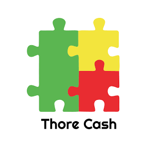 | 33033 | TCH | Thore Cash |
| 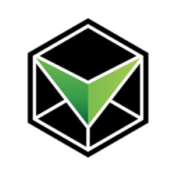 | 33185 | VDG | VeriDocGlobal |
| 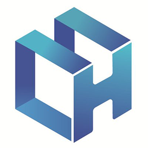 | 33599 | HSN | Helper Search Token |
|  | 33218 | LATINO | Latino Token |
| 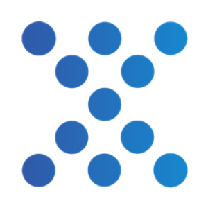 | 33176 | KXC | KingXChain |
| 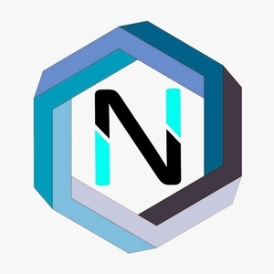 | 33268 | NRP | Neural Protocol |
|  | 33687 | XUEZ | Xuez |
|  | 33743 | QUIN | QUINADS |
|  | 33383 | BNANA | Chimpion |
| 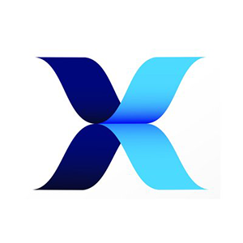 | 33685 | EXO | Exosis |
| 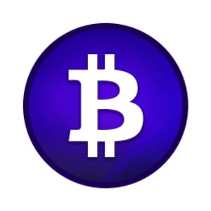 | 33503 | IBTC | iBTC |
| 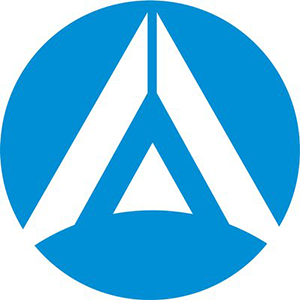 | 33399 | ARAW | ARAW |
| 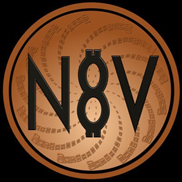 | 33755 | N8V | NativeCoin |
| 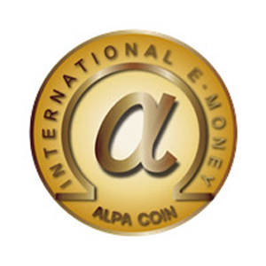 | 33751 | APC | Alpha Coin |
| 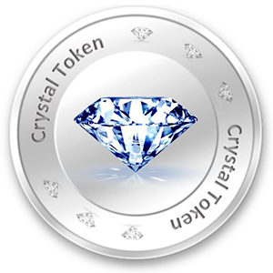 | 33750 | CYL | Crystal Token |
|  | 33402 | NAVY | BoatPilot Token |
|  | 33689 | FEX | FidexToken |
| 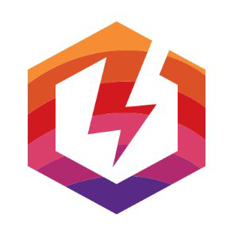 | 33692 | ELD | electrumdark |
| 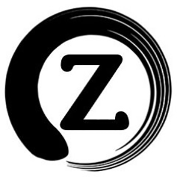 | 33694 | ZNT | Zenswap Network Token |
| 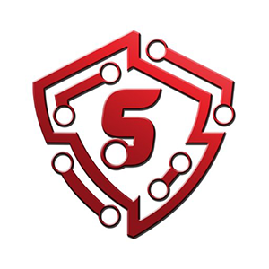 | 33746 | FBN | Fivebalance |
| 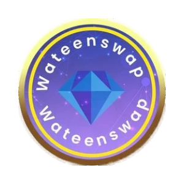 | 33710 | WTN | Waletoken |
|  | 33472 | VSF | VeriSafe |
|  | 33715 | HERB | Herbalist Token |
|  | 33497 | TVNT | TravelNote |
|  | 33741 | DATP | Decentralized Asset Trading Platform |
|  | 32590 | NOAH | Noah Coin |
|  | 32526 | LEDU | Education Ecosystem |
| 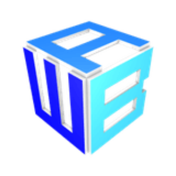 | 32901 | WAB | WABnetwork |
| 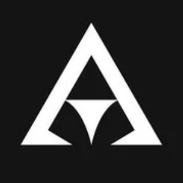 | 33023 | DELTA | DeltaChain |
| 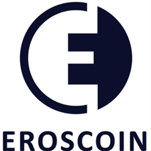 | 32503 | ERO | Eroscoin |
|  | 32923 | RET | RealTract |
| 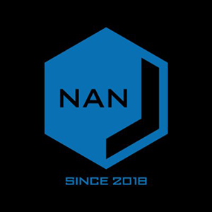 | 32371 | NANJ | NANJCOIN |
| 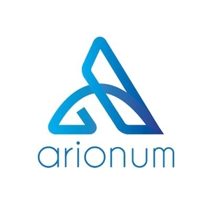 | 32967 | ARO | Arionum |
| 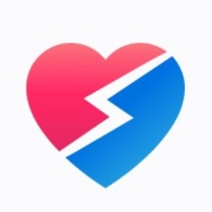 | 32964 | HB | HeartBout |
| 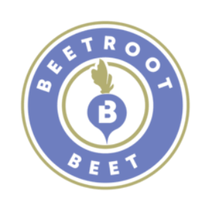 | 32982 | BEET | Beetle Coin |
|  | 32998 | CYMT | CyberMusic |
|  | 32825 | KNDC | KanadeCoin |
| 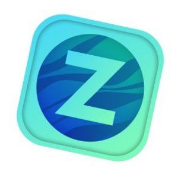 | 32645 | FDZ | Friendz |
| 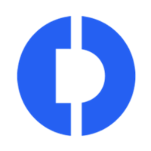 | 32728 | DGTX | Digitex Futures |
|  | 32995 | VIKKY | VikkyToken |
| 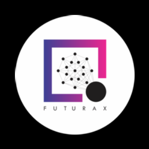 | 32993 | FTXT | FUTURAX |
|  | 33014 | HAVY | Havy |
|  | 32486 | PKT | Playkey |
| 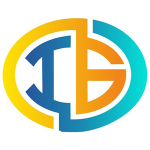 | 33008 | IG | IGToken |
|  | 32649 | HYDRO | Hydrogen |
| 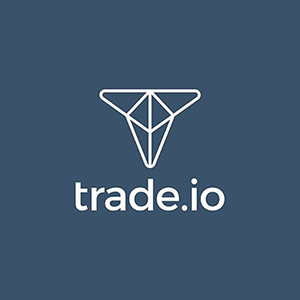 | 32404 | TIOX | Trade Token |
|  | 32857 | OTB | OTCBTC Token |
|  | 32939 | CRBT | Cruisebit |
| 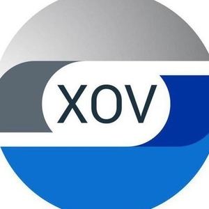 | 33020 | XOV | XOVBank |
| 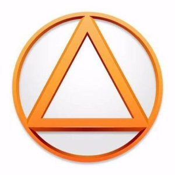 | 32635 | ADI | Aditus |
|  | 3012 | BELA | Bela |
| 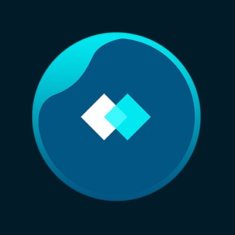 | 2401 | SKIN | SkinCoin |
| 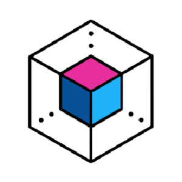 | 2800 | ENG | Enigma |
|  | 2812 | EVX | Everex |
|  | 2839 | CDT | Blox |
|  | 32187 | EVC | EventChain |
|  | 32129 | CCO | Ccore |
|  | 10816 | SKB | Sakura Bloom |
|  | 11040 | BON | Bonpay |
| 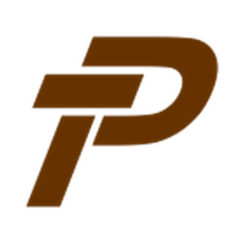 | 3732 | PAYX | Paypex |
| 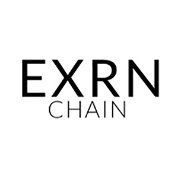 | 3811 | EXRN | EXRNchain |
| 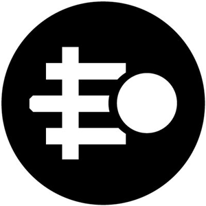 | 3701 | ELTCOIN | ELTCOIN |
|  | 127 | XAUR | Xaurum |
| 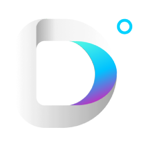 | 47 | DOPE | DopeCoin |
|  | 70033 | EAD | Learning Cash |
|  | 66201 | NII | Nahmii |
|  | 32435 | AIT | AICHAIN |
| 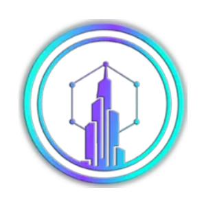 | 127197 | DUBX | DUBXCOIN |
| 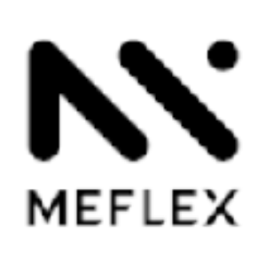 | 85401 | MEF | MEFLEX |
|  | 46341 | YFET | YFET |
|  | 95015 | DUA | DUA Token |
|  | 78799 | XDAO | XDAO |
| 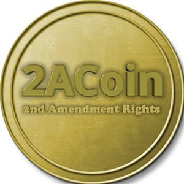 | 41240 | ARMS | 2ACoin |
|  | 55163 | $LORDZ | Meme Lordz |
|  | 125351 | $ARKEN | Arken Finance |
| 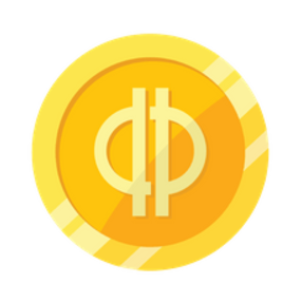 | 67721 | FDLS | FIDELIS |
| 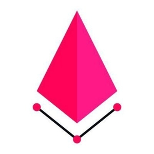 | 46219 | AXIAV3 | Axia |
|  | 113921 | GASC | GasChameleon |
| 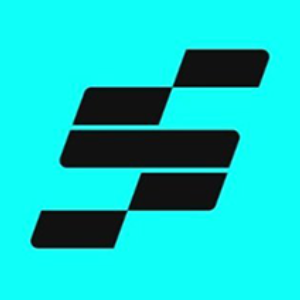 | 127989 | SOWA | Sowa AI |
|  | 99491 | LHINU | Love Hate Inu |
|  | 82593 | XBLL | ExtractoDAO Bull |
| 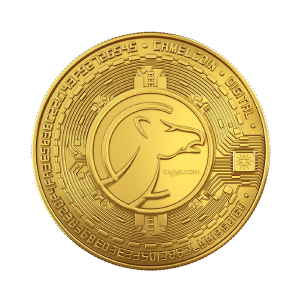 | 69867 | CML | Camelcoin |
|  | 61129 | GWT | Galaxy War |
|  | 33742 | INNBCL | InnovativeBioresearchClassic |
|  | 94843 | STYLE | Style |
| 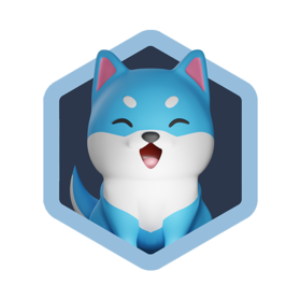 | 86243 | ARBINU | ArbInu |
|  | 94497 | BIGCAP | BIGCAP |
| 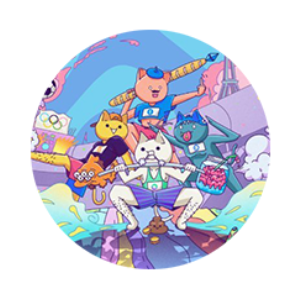 | 138039 | SOLYMPICS | Solympics |
| 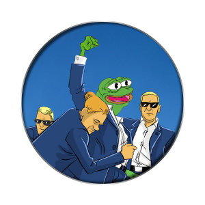 | 137697 | FIGHTPEPE | FIGHT PEPE |
| 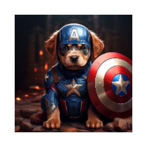 | 137709 | ADOG | America Dog |
| 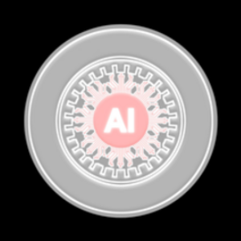 | 136693 | BCAI | Bright Crypto Ai |
|  | 135333 | GAMEBUD | GAMEBUD |
| 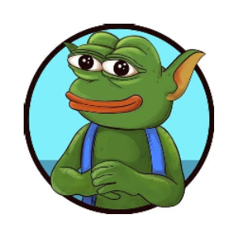 | 131587 | GEGE | GEGE |
| 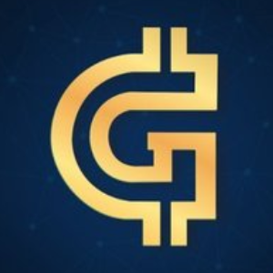 | 126619 | GLD | GoldenCoin |
|  | 125989 | RLTO | REAL-TOK |
|  | 113277 | BAYE | Bayesian |
|  | 86787 | X7103 | X7103 |
|  | 57629 | CSMS | Cosmostarter |
| 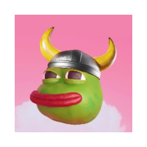 | 133009 | PEPEFLOKI | PEPE FLOKI (BSC) |
|  | 113375 | ETV | EarnTV |
|  | 112709 | JINKO | Jinko AI |
| 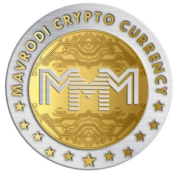 | 100299 | MMM | Meta Merge Mana |
|  | 51059 | PLANETS | PlanetWatch |
| 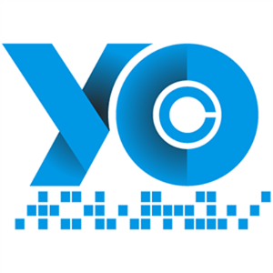 | 544 | YOC | YoCoin |
|  | 113443 | GOW39 | God of Wealth |
|  | 123423 | GWGW | GoWrap |
| 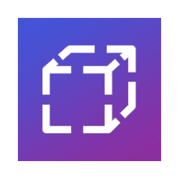 | 113755 | RDGX | R-DEE Protocol |
|  | 111851 | LOTTY | Lotty |
| 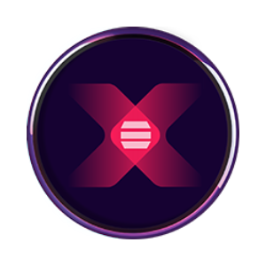 | 79427 | EPIX | Byepix |
| 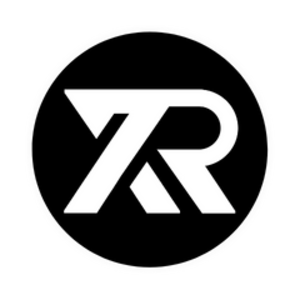 | 79333 | X7R | X7R |
|  | 112329 | SPOON | Spoony |
|  | 85407 | X7104 | X7104 |
| 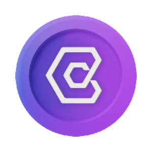 | 67979 | CMFI | Compendium.Fi |
|  | 126753 | TOOLS-FI | Tools-Fi |
|  | 47811 | TRL | Trolite |
|  | 85261 | X7101 | X7101 |
|  | 127513 | OAT | OAT Network |
|  | 85741 | X7102 | X7102 |
|  | 86919 | X7105 | X7105 |
| 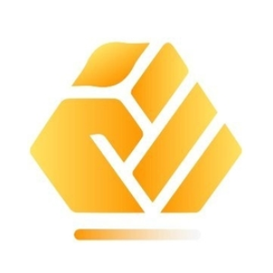 | 48337 | HFI | HecoFi |
|  | 90401 | KOINB | KoinBülteni Token |
| 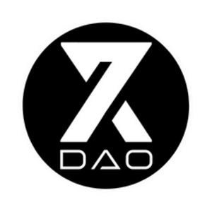 | 81051 | X7DAO | X7DAO |
|  | 67943 | PAPPAY | Pappay |
|  | 64903 | SEFI | Secret Finance |
|  | 68553 | NESTA | Nest Arcade |
|  | 65491 | TOD | TraDAO |
| 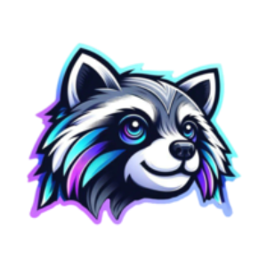 | 136063 | TANUPAD | Tanuki Launchpad |
| 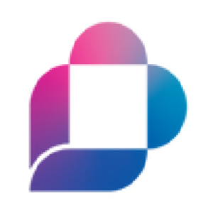 | 115243 | LYF | Lillian Token |
| 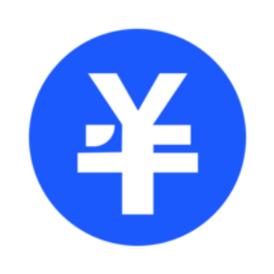 | 96191 | TCNH | TrueCNH |
|  | 122915 | $ELY | Elyssa AR |
|  | 112327 | SPZ | SpookyZ |
|  | 132565 | KNTO | Kento |
|  | 127491 | $REFLECT | $REFLECT |
| 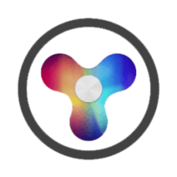 | 127423 | QUARK | Quark (Atomicals) |
|  | 127493 | EPEP | Epep |
|  | 125515 | AIGC | AIGC (Ordinals) |
|  | 122611 | $HUB | Dogihub (DRC-20) |
| 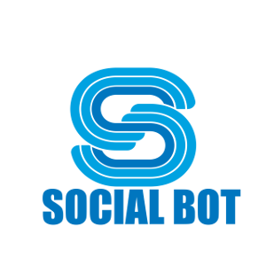 | 99933 | XBOT | XBot |
|  | 82485 | MGXG | Malgo Finance |
|  | 50373 | HMNG | Hummingbird Finance |
|  | 70405 | $WNZ | Winerz |
| 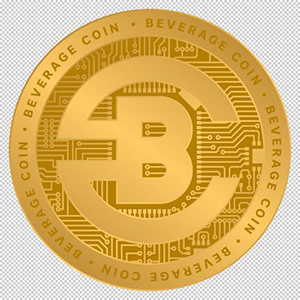 | 65551 | BC | Bitcoin Confidential |
|  | 86927 | EPILLO | Epillo |
|  | 113411 | FXDX | FXDX |
| 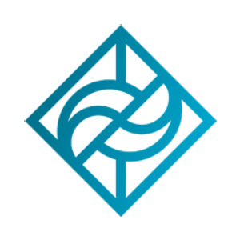 | 97399 | UMMA | UMMA Token |
|  | 65905 | RCG | Recharge |
|  | 112983 | $BNBTIGER | BNB Tiger |
|  | 50225 | SDOG | Small Doge |
| 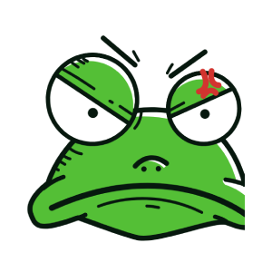 | 136785 | DOGEPEPE | Doge-PEPE |
|  | 123305 | TBCI | tbci (Ordinals) |
|  | 111995 | FUSION | FusionBot |
|  | 63637 | TNNS | TNNS |
|  | 33587 | WIX | Wixlar |
|  | 33266 | SCC | SiaCashCoin |
| 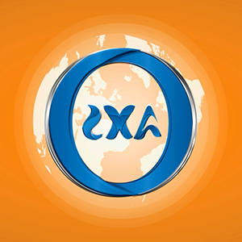 | 33404 | OLXA | OLXA |
| 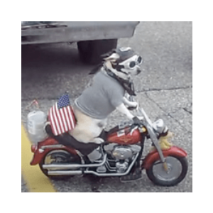 | 132745 | TOBI | MOTO DOG |
| 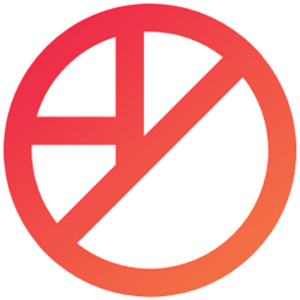 | 127511 | IDK | i dont know |
| 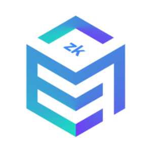 | 112579 | ZKEVM | zkEVMChain (BSC) |
| 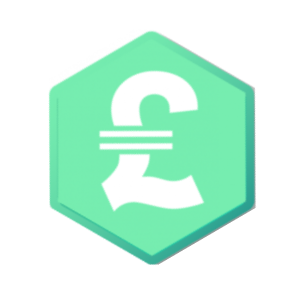 | 95939 | GBPT | poundtoken |
|  | 67143 | SIL | SIL Finance Token V2 |
| 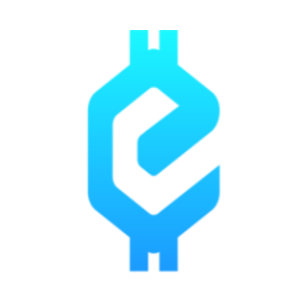 | 49959 | EDGT | Edgecoin |
| 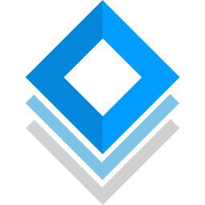 | 113315 | CRDS | Cradles |
|  | 113005 | NWT | Ninja Warriors |
| 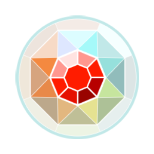 | 89651 | LARO | Anito Legends |
|  | 70091 | MGS | MG.Social |
| 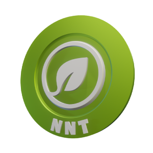 | 69299 | NNT | Nunu Spirits |
|  | 127469 | TOR | Resistor AI |
| 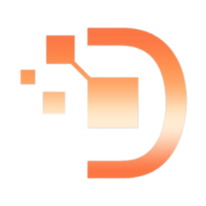 | 113325 | FREELA | DecentralFree |
|  | 115505 | HUT | Hibiki Run |
| 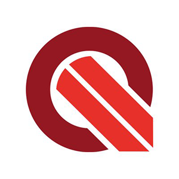 | 33579 | XQR | Qredit |
| 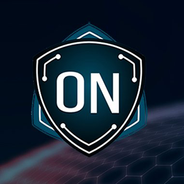 | 79345 | IPT | Interest Protocol Token |
| 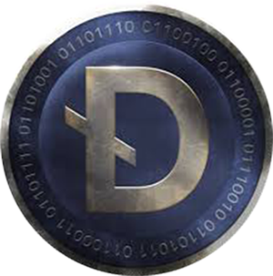 | 124801 | DRK | Draken |
|  | 101797 | NIKL | Nikel Tech |
|  | 136257 | SUNPUMP | To The Sun |
| 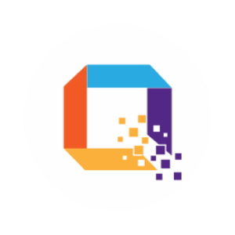 | 130387 | QRO | Querio |
| 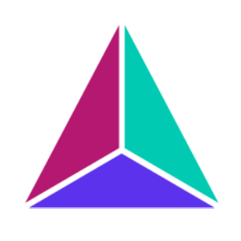 | 89323 | ALGB | Algebra |
|  | 66485 | ELVN | ElevenToken |
| 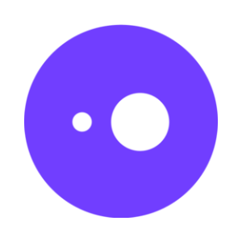 | 58289 | LNR | Lunar |
| 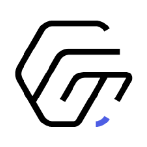 | 44050 | EDI | Freight Trust Network |
| 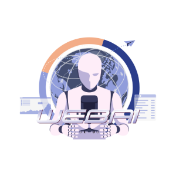 | 125677 | WEBAI | Website AI |
| 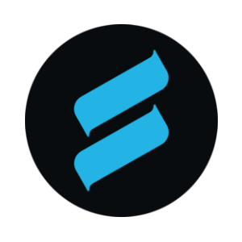 | 59997 | SPOOL | Spool DAO Token |
| 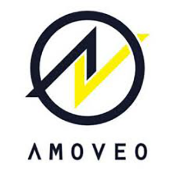 | 33287 | VEO | Amoveo |
|  | 126733 | USDTPO | Bridged Tether (Wormhole POS) |
|  | 126735 | USDTET | Bridged Tether (Wormhole Ethereum) |
| 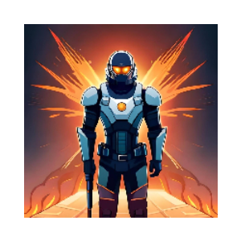 | 94701 | MOETA | Moeta |
|  | 87253 | YAKU | Yaku |
|  | 86531 | EPCT | Epics Token |
| 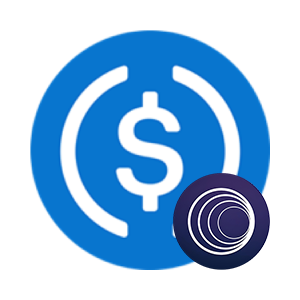 | 88617 | USDCET | USD Coin (Wormhole from Ethereum) |
|  | 79309 | USDCPO | USD Coin (PoS) (Wormhole) |
|  | 78411 | SOBTC | Wrapped Bitcoin (Sollet) |
| 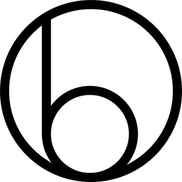 | 68085 | BASIS | basis.markets |
|  | 57609 | SCNSOL | Socean Staked Sol |
| 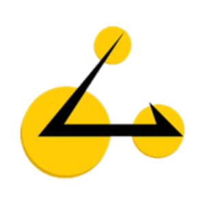 | 32593 | AAC | Acute Angle Cloud |
|  | 126133 | MNX | Nodetrade |
|  | 90565 | PIGGIE | MyPiggiesBank |
|  | 81013 | BABIL | BABIL TOKEN |
|  | 80589 | PTCL | Packetchain |
|  | 79205 | SCALP | SCALPingcoin |
|  | 76541 | XNODE | XNODE |
|  | 70907 | CROM | Crome |
|  | 71051 | FUCHA | Funcha |
|  | 69061 | AVIAN | Avianite |
|  | 68215 | CURVE | CURVEHASH |
|  | 66697 | VIP | Vip Coin |
|  | 47945 | EMOJ | Emoji |
|  | 47827 | BNJ | Binjit Coin |
|  | 47063 | GSA | Global Smart Asset |
|  | 46894 | BBX | Ballotbox |
|  | 46487 | SMNC | Simple Masternode Coin |
|  | 45617 | EAPC | Escort Coin |
|  | 45141 | C4T | Coin4Trade |
|  | 44848 | SCM | Simulacrum |
|  | 44899 | PIVXL | Pivx Lite |
| 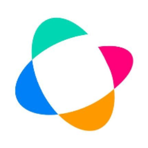 | 44528 | GLF | Glufco |
| 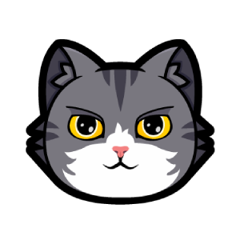 | 44878 | CATS | Catscoin |
| 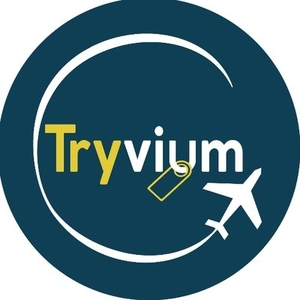 | 44838 | TYM | TimeLockCoin |
|  | 42840 | MW | Masterwin |
|  | 43236 | POOL | POOLCOIN |
|  | 43062 | AFO | All For One Business |
|  | 42733 | DMS | Documentchain |
| 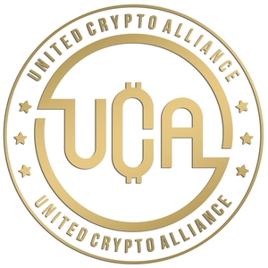 | 44090 | UCA | UCA Coin |
|  | 42483 | BTSC | Beyond The Scene Coin |
|  | 43129 | VN | Vice Network |
|  | 42781 | CVA | Crypto Village Accelerator |
| 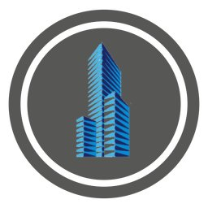 | 42730 | RLD | Reload |
|  | 43013 | DONU | Donu |
| 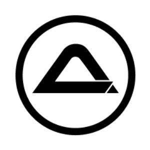 | 43130 | ZOA | Zotova |
|  | 42863 | HPTF | HEPTAFRANC |
|  | 43038 | MCLB | MillenniumClub Coin |
|  | 42888 | EPG | Encocoinplus |
|  | 42857 | MEK | Meraki |
|  | 42598 | SCAP | SafeCapital |
|  | 42698 | BSTX | Blastx |
|  | 41903 | FXTC | Fixed Trade Coin |
| 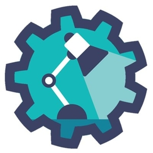 | 42157 | WORX | Worx |
|  | 36461 | MCASH | Mcashchain |
| 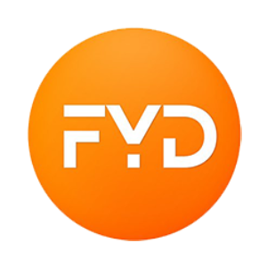 | 41226 | FYD | FYDcoin |
| 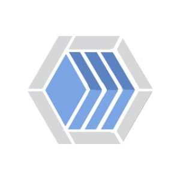 | 41231 | DXO | Dextro |
|  | 41259 | CLG | Collegicoin |
|  | 33459 | PNY | Peony |
|  | 33791 | MNP | MNPCoin |
|  | 33714 | KZC | KZ Cash |
|  | 34507 | CBTC | Classic Bitcoin |
|  | 34773 | DLN | Delion |
|  | 34401 | KTS | Klimatas |
| 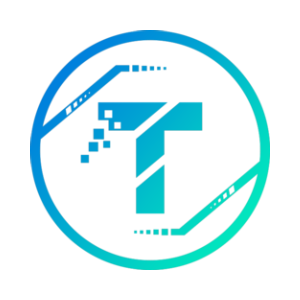 | 33410 | TELOS | Teloscoin |
|  | 34739 | LYRA | Scrypta |
| 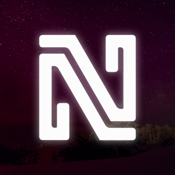 | 33782 | NOR | Noir |
| 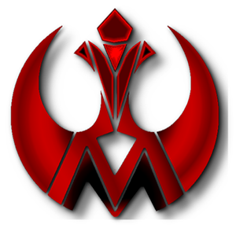 | 33885 | MERI | Merebel |
|  | 34752 | ULG | Ultragate |
| 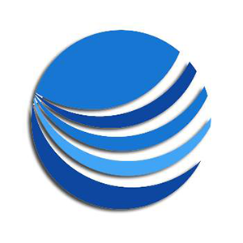 | 33649 | SINS | SafeInsure |
| 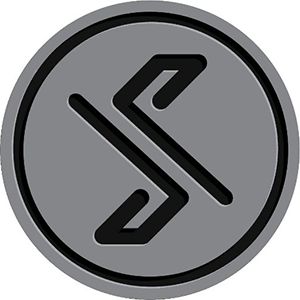 | 34512 | SIERRA | Sierracoin |
| 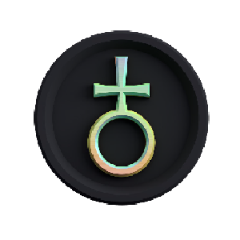 | 33894 | NTR | Netrum |
| 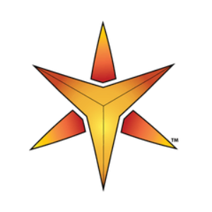 | 33385 | BECN | Beacon |
|  | 34632 | KEC | Keyco |
| 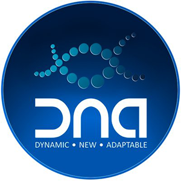 | 33012 | XDNA | XDNA |
|  | 32956 | ZEL | ZelCash |
| 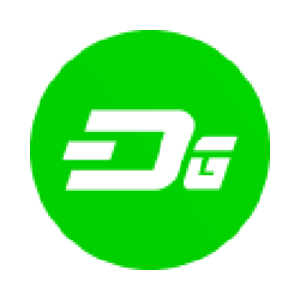 | 33246 | DASHG | Dash Green |
| 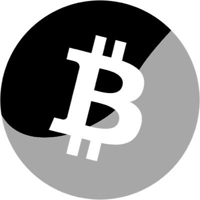 | 32975 | XBI | Bitcoin Incognito |
|  | 33006 | CATO | CatoCoin |
| 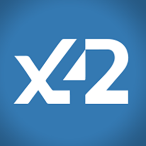 | 33267 | X42 | X42 Protocol |
|  | 33192 | GIO | Graviocoin |
| 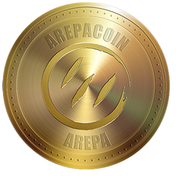 | 33054 | AREPA | Arepacoin |
|  | 33056 | BTCONE | BitCoin One |
| 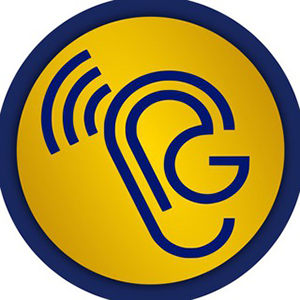 | 33253 | GOSS | Gossipcoin |
|  | 32880 | CRU | Curium |
| 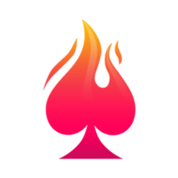 | 33353 | ABET | Altbet |
|  | 33221 | VIVID | Vivid Coin |
|  | 32950 | XAP | Apollon |
| 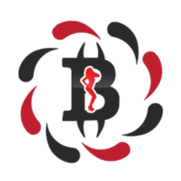 | 33171 | BTAD | Bitcoin Adult |
| 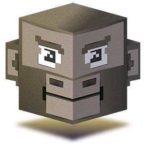 | 31623 | MONK | Monkey Project |
| 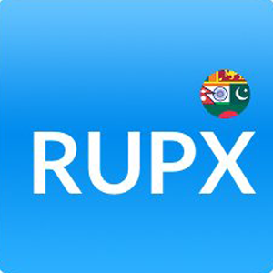 | 3451 | RUPX | Rupaya |
| 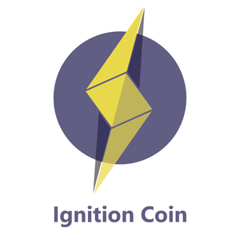 | 32550 | IC | Ignition |
|  | 3543 | ASAFE2 | AllSafe |
|  | 11822 | XLQ | ALQO |
|  | 32422 | MEDIC | MedicCoin |
| 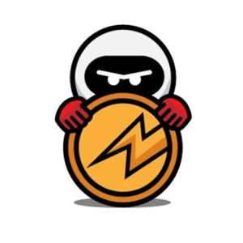 | 32511 | DEV | DeviantCoin |
|  | 1624 | NTRN | Neutron |
| 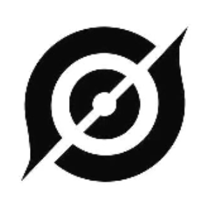 | 122869 | BLACK | Black Token |
|  | 122271 | SNMT | Satoshi Nakamoto Token |
|  | 68945 | $GNOME | GNOME |
| 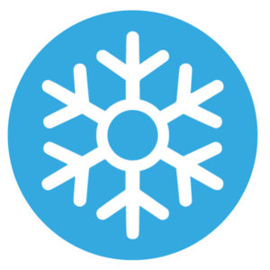 | 36504 | SNOW | SnowBlossom |
|  | 33590 | SWC | Scanetchain |
| 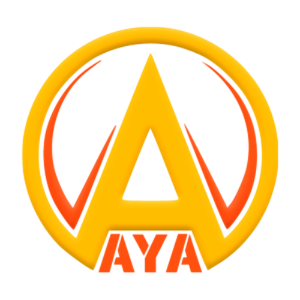 | 33900 | AYA | Aryacoin |
|  | 134203 | PEPEX | pepeX |
| 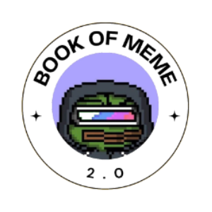 | 128275 | BOME2 | Book of Meme 2.0 |
|  | 96763 | CHICA | CHICA |
|  | 90621 | EPHIAT | ePhiat |
|  | 125687 | WUT | WUT |
|  | 67927 | MALL | MetaMall |
|  | 50033 | DESS | Dessfi |
|  | 47033 | NPO | NPO Coin |
|  | 46240 | GMNG | Global Gaming |
|  | 43145 | GLDY | Buzzshow |
| 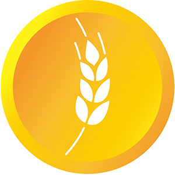 | 42414 | DMTC | DMTC Token |
|  | 112535 | CHAN | Chanalog |
|  | 112457 | $BEN | BENCOIN |
|  | 114061 | TLIFE | TLifeCoin |
|  | 96525 | GDCC | GLOBAL DIGITAL CLUSTER COIN |
| 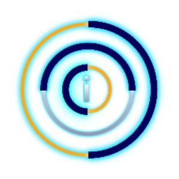 | 136689 | I3D | i3D Protocol |
| 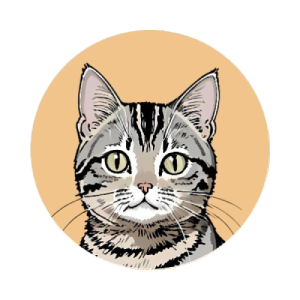 | 136443 | TSUJI | Tsutsuji |
|  | 130393 | PIA | Olympia AI |
| 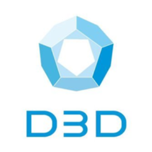 | 86273 | D3D | D3D Social |
|  | 80811 | BHAT | BHNetwork |
| 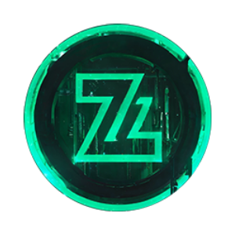 | 130469 | ZKARCH | zkArchive |
| 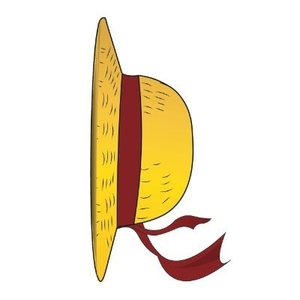 | 114923 | DCX | D-Ecosystem |
|  | 101667 | UIND | INDUNIVERSE |
| 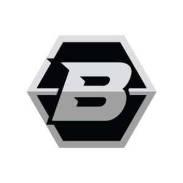 | 97019 | BEAI | BeNFT Solutions |
|  | 80615 | MCD | CDbio |
|  | 66627 | SAFEHOLD | SafeHold |
| 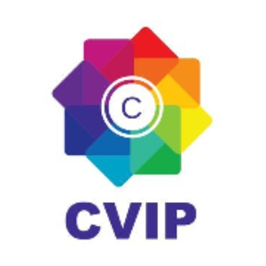 | 60493 | CVIP | CVIP |
| 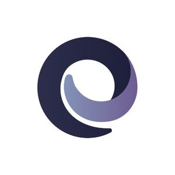 | 43180 | IMBTC | The Tokenized Bitcoin |
| 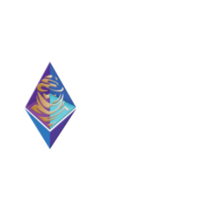 | 69447 | NNI | Neonomad Finance |
| 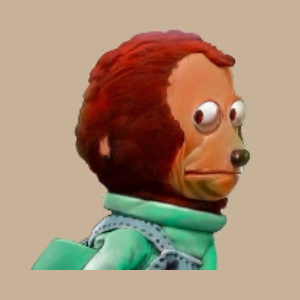 | 137159 | PUPPET | Puppet |
| 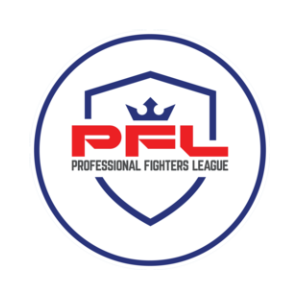 | 121945 | PFL | Professional Fighters League Fan Token |
|  | 121781 | UFC | UFC Fan Token |
|  | 115533 | FAV | Football At AlphaVerse |
|  | 112835 | UB | Utopia Bot |
| 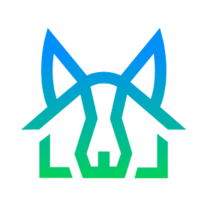 | 96023 | SRLTY | SaitaRealty |
|  | 94981 | CVXFPIS | Convex FPIS |
| 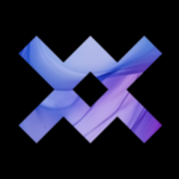 | 128055 | MWAVE | MeshWave |
| 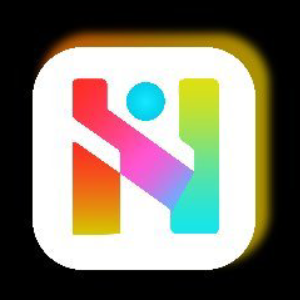 | 128751 | INOVAI | INOVAI |
| 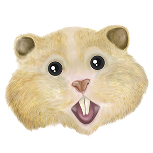 | 125125 | HAMS | Hamsters |
| 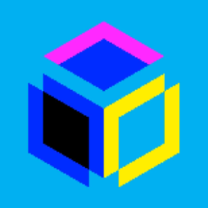 | 57799 | FTG | fantomGO |
|  | 67381 | RPTC | Reptilian |
| 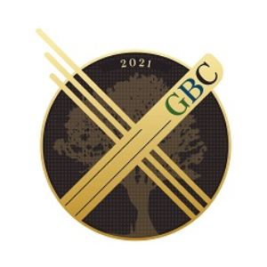 | 123355 | GBC | Green Blue Coin |
|  | 113973 | CHFP | SuperFrank |
|  | 113995 | TELEB | TeleBucks |
| 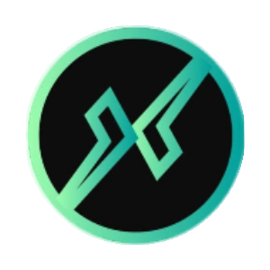 | 114137 | XUV | XUV Coin |
| 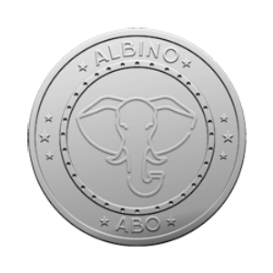 | 97565 | ABO | ALBINO |
|  | 90301 | BUUN | Business Universe |
|  | 89839 | FIX00 | FIX00 |
|  | 80345 | PRVC | PrivaCoin |
|  | 77959 | IBS | IBS |
| 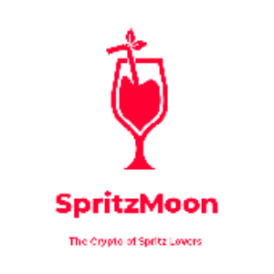 | 68465 | SPRITZMOON | SpritzMoon Crypto |
| 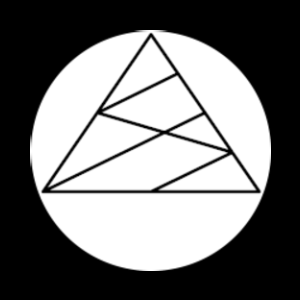 | 57077 | USTX | UpStableToken |
|  | 32830 | FGC | FantasyGold |
|  | 122737 | XFLOKI | XFLOKI |
| 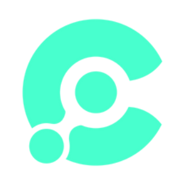 | 88059 | CMOS | CoinMerge OS |
| 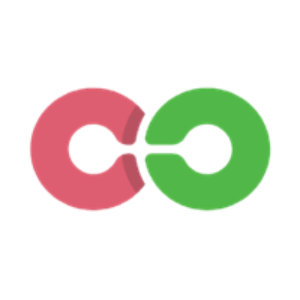 | 32487 | IPL | InsurePal |
| 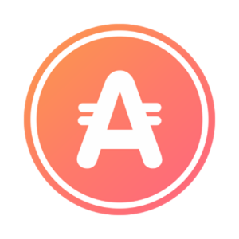 | 32224 | APPC | AppCoins |
|  | 3134 | FYP | FlypMe |
|  | 32444 | IDH | indaHash |
|  | 124201 | BBO | BAMBOO TOKEN |
| 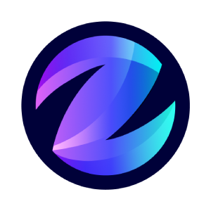 | 42438 | SPORTS | ZenSports |
| 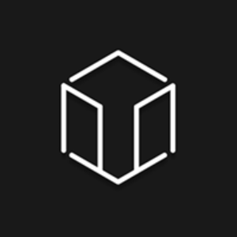 | 34646 | MESH | MeshBox |
| 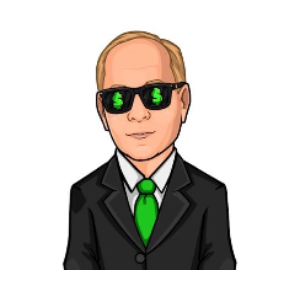 | 129091 | FINK | FINK |
|  | 128155 | VAULT | Vault Tech |
| 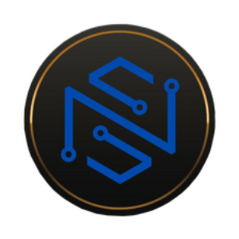 | 90153 | NVS | Navis |
| 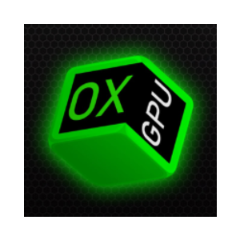 | 130433 | 0XG | 0xGpu.ai |
| 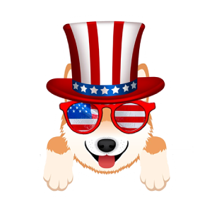 | 67903 | SHIBMERICAN | Shibmerican |
|  | 132461 | HIDE | Hide Coin |
|  | 126557 | CBDC | Central Bank Digital Currency Memecoin |
|  | 127425 | SONICWIF | SonicWifHat |
| 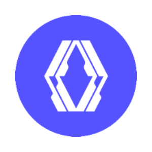 | 122719 | HON | Soul Society |
|  | 112121 | AIMAGE | AiMage Tools |
| 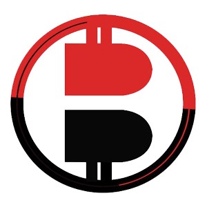 | 77925 | BLN | Balance Network |
| 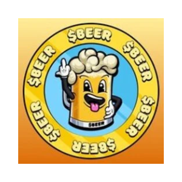 | 44562 | BEER | Beer Money |
|  | 113819 | NOVAX | NovaX |
| 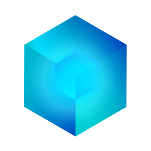 | 86989 | USH | Hedge USD |
| 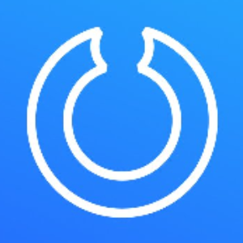 | 123597 | PACT | impactMarket |
|  | 113089 | SALLY | SALAMANDER |
|  | 88799 | DUAL | Dual Finance |
| 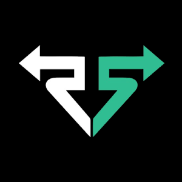 | 131709 | RS | ReadySwap |
| 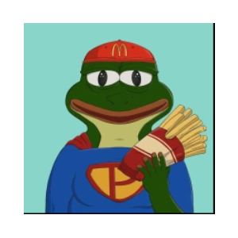 | 122489 | ZKPEPE | ZKPEPEs |
| 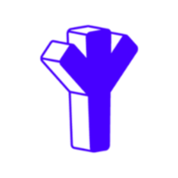 | 121967 | CMP | Caduceus |
| 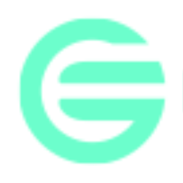 | 98227 | EGRN | Energreen |
|  | 42472 | FBT | FANBI TOKEN |
| 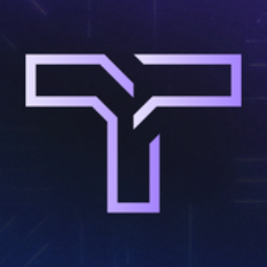 | 127449 | TEQ | Teq Network |
| 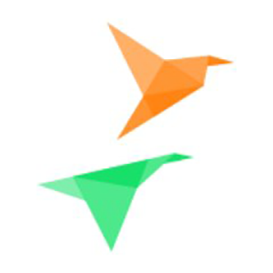 | 60099 | XCB | Crypto Birds |
| 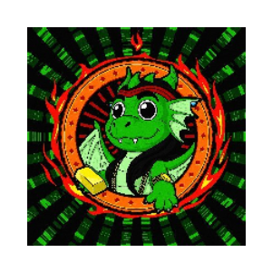 | 128675 | AGON | Arabian Dragon |
|  | 69827 | KYOKO | Kyoko |
| 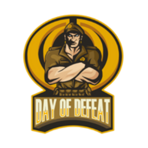 | 58639 | DOD | Day Of Defeat |
|  | 125357 | COLANA | COLANA |
|  | 112649 | $GGH | Green Grass Hopper |
| 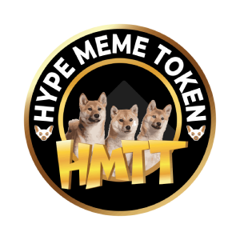 | 112673 | HMTT | Hype Meme Token |
|  | 112351 | 0XFREE | 0xFreelance |
|  | 133005 | SEW | simpson in a memes world |
| 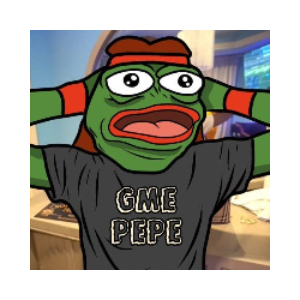 | 132593 | GMEPEPE | GAMESTOP PEPE |
|  | 132649 | SESE | Simpson Pepe |
| 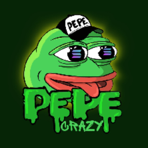 | 113313 | CRAZYPEPE | CRAZYPEPE |
|  | 66637 | MARA | Amara Finance |
|  | 64297 | CWD | CROWD |
|  | 50605 | APE$ | APE Punk |
|  | 111731 | NOSO | Noso |
| 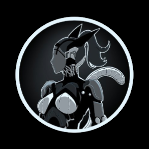 | 94959 | OPTIG | Catgirl Optimus |
|  | 112347 | 0XB | 0xBlack |
|  | 112185 | GROKBOT | GROKBOT |
|  | 95205 | FNSA | FINSCHIA |
| 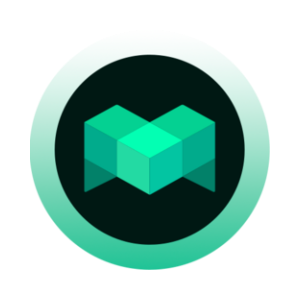 | 113633 | BMTC | Metabit Network |
|  | 79271 | LCR | Lucro |
|  | 76869 | SHINT | Shiba Interstellar |
|  | 69245 | CRI | Crypto International |
|  | 33862 | EUM | Elitium |
| 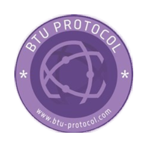 | 33717 | BTU | BTU Protocol |
| 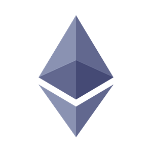 | 123495 | ETX | Ethrix |
|  | 99519 | MBOT | MoonBot |
|  | 68887 | GROK | Grok |
|  | 59175 | MONO | MonoX |
|  | 126131 | SCARCE | No Decimal |
|  | 33529 | ZB | ZB |
| 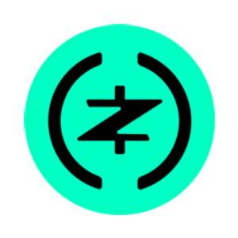 | 131639 | ZKX | ZKX |
| 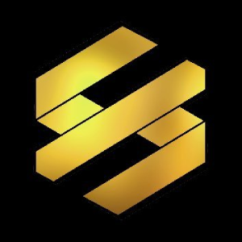 | 123091 | ENV | Envoy |
| 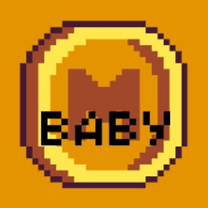 | 112171 | BABYMEME | Baby Memecoin |
|  | 113729 | QDO | Qoodo |
|  | 100393 | ULTIMATEBO | Ultimate Tipbot |
|  | 71127 | RELIC | Relic |
|  | 102613 | FARMS | Farmsent |
|  | 77815 | ATPAY | AtPay |
| 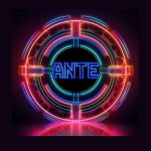 | 113797 | CHANCE | Ante Casino |
|  | 58371 | MGH | MetaGameHub DAO |
| 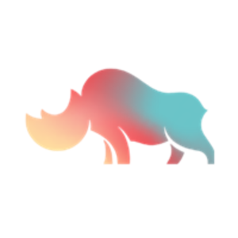 | 50821 | DVF | DVF |
| 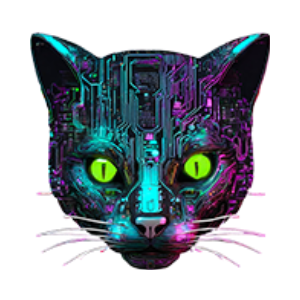 | 131647 | BOAM | BOOK OF AI MEOW |
|  | 128895 | MORSE | Morse |
|  | 130305 | SNORT | SNORT |
| 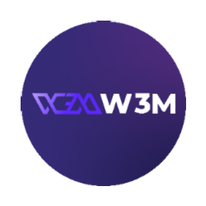 | 123929 | W3M | Web3Met |
|  | 71325 | ZAPC | Zappay |
|  | 42488 | ES | Era Swap Token |
|  | 128689 | FLORK | FLORK BNB |
|  | 126383 | MELL | Mellivora |
|  | 113545 | MAGNET | Yield Magnet |
| 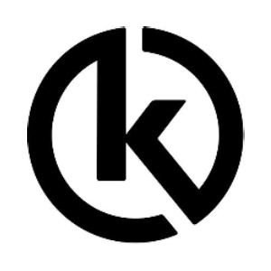 | 115493 | KLUB | KlubCoin |
|  | 99813 | CHOP | Chopbot |
|  | 96783 | MFPS | Meta FPS |
|  | 97939 | HIBAKC | hiBAKC |
| 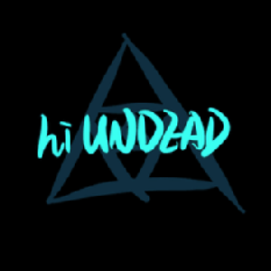 | 88861 | HIUNDEAD | hiUNDEAD |
| 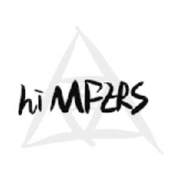 | 90099 | HIMFERS | hiMFERS |
| 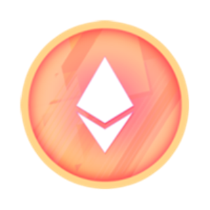 | 51091 | RETH | rETH |
|  | 46282 | DFK | DefiKing |
|  | 32581 | PNT | Penta |
| 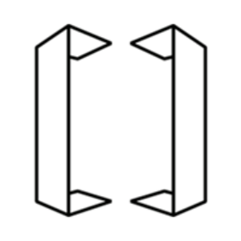 | 32445 | MTX | Matryx |
|  | 32456 | SWM | Swarm |
|  | 12944 | HTML | Htmlcoin |
| 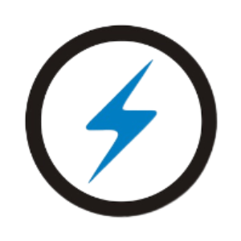 | 2894 | POE | Po.et |
|  | 164 | WINGS | Wings DAO |
|  | 128 | SNGLS | SingularDTV |
|  | 123893 | GAMERFI | GamerFI |
|  | 122913 | PUNCH | PUNCHWORD |
|  | 112071 | 0STC | ShieldTokenCoin |
|  | 68531 | MCDOGE | McDoge |
|  | 71381 | 1SP | Onespace |
|  | 112851 | WSP | Wall Street Pepes |
|  | 33329 | AGCMN | Agricoin |
|  | 129163 | SQTS | Sqts (Ordinals) |
| 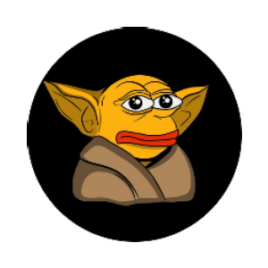 | 124151 | PORKINU | PepeFork INU |
| 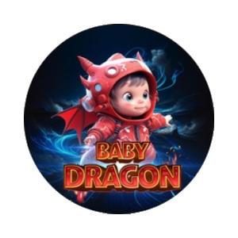 | 122671 | BABYDRAGON | Baby Dragon |
| 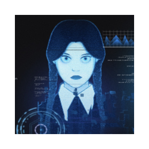 | 115585 | ADDAMS | ADDAMS AI |
|  | 112437 | XBBC | Beebox |
| 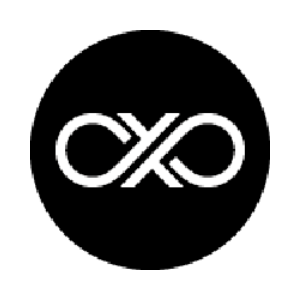 | 96631 | STSW | Stackswap |
|  | 80719 | MTE | Meta to Earn |
|  | 78871 | ZBTX | ZiobitX |
|  | 79419 | GFULL | Gainfull |
| 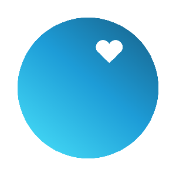 | 78441 | ERTH | Erth Point |
| 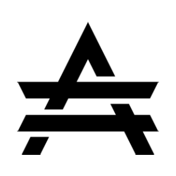 | 60009 | ARA | Adora Token |
|  | 51901 | QTF | Quantfury |
|  | 128669 | LULU | LULU |
| 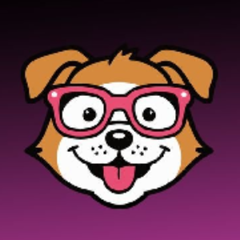 | 131077 | BONG | BonkWifGlass |
|  | 127553 | SOLGOAT | SOLGOAT |
| 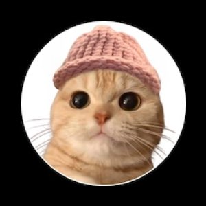 | 127393 | MEOWIF | Meowifhat |
|  | 98471 | YURI | YURI |
|  | 97491 | WEWE | WEWE |
| 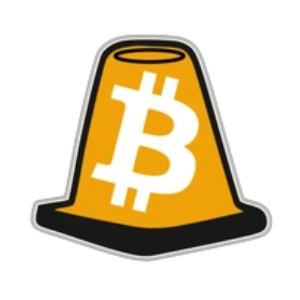 | 90055 | CONE | HoneyWood |
|  | 68321 | DRAW | Dragon War |
| 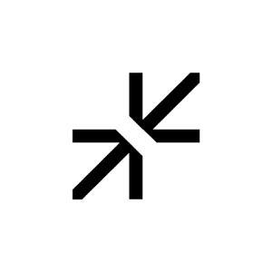 | 63913 | STARLY | Starly |
|  | 122643 | $OPHX | Operation Phoenix |
|  | 56409 | PICIPO | Picipo |
|  | 66053 | GU | Kugle GU |
|  | 122729 | NOVA | Nova |
|  | 127219 | $QUACK | DegenDuckRace |
|  | 123467 | OKG | Ookeenga |
| 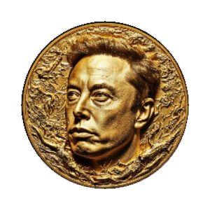 | 123961 | MEMEMUSK | MEME MUSK |
|  | 125427 | XNF | XNF |
|  | 113969 | SUBI | Subi Network |
|  | 111651 | VKA | Vaultka |
| 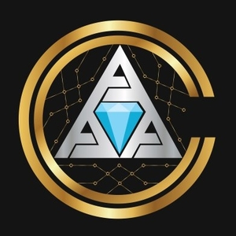 | 111889 | ARCHI | Archi Token |
|  | 111613 | LILAI | LilAI |
|  | 111821 | SVY | Savvy |
|  | 96811 | SNAIL | SnailBrook |
|  | 95095 | NSWAP | Nulswap |
|  | 89567 | LFI | LunaFi |
|  | 94145 | $ZPC | ZenPandaCoin |
| 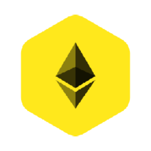 | 84977 | ANKRETH | Ankr Staked ETH |
|  | 79375 | UTED | United |
|  | 71079 | RVLT | Revolt 2 Earn |
|  | 65139 | GOAL | Goal Token |
|  | 60687 | ZYTH | Uzyth |
| 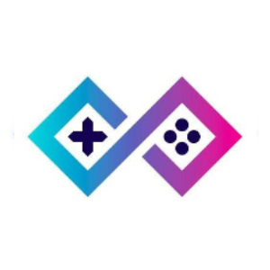 | 57251 | GAMER | GameStation |
| 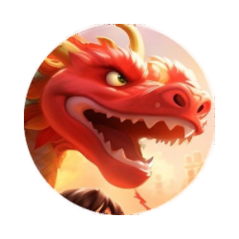 | 128949 | CNYD | Chinese NY Dragon |
|  | 68163 | MCAN | Medican Coin |
|  | 47745 | ESPRO | EsportsPro |
| 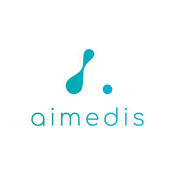 | 44732 | AIM | ModiHost |
| 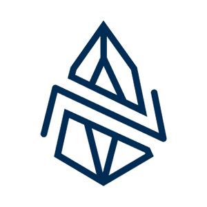 | 36538 | NUT | NUT |
| 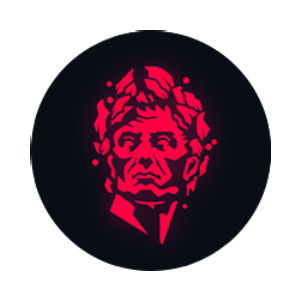 | 128179 | CAESAR | Caesar's Arena |
|  | 126221 | ELONX | ELONX |
|  | 122717 | SOBB | SoBit |
|  | 127367 | OSIS | OSIS |
|  | 112625 | NAMX | Namx |
|  | 97953 | VROOM | TurboPepe |
|  | 76885 | DHLT | DeHealth |
|  | 59055 | EMBR | Embr |
|  | 112665 | HUSTLE | HustleBot |
|  | 127581 | AZURE | Azure Wallet |
|  | 57667 | GORILLA INU | Gorilla Inu |
| 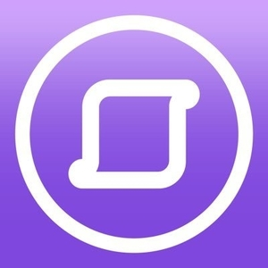 | 122589 | SCRL | Wizarre Scroll |
| 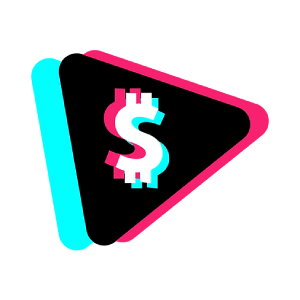 | 81097 | TIKTOKEN | TikToken |
|  | 56479 | WEMP | Women Empowerment Token |
| 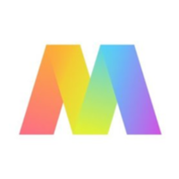 | 89783 | MMC | Monopoly Millionaire Control |
|  | 42270 | DYNGE | Dyngecoin |
|  | 78017 | DBL | Doubloon |
| 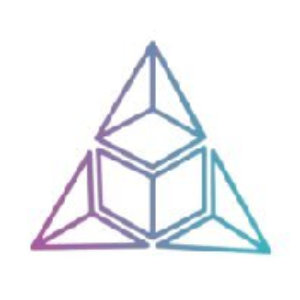 | 70471 | UTG | UltronGlow |
|  | 127167 | MIA | MIA |
|  | 124477 | RNT | Rencom Network |
|  | 93983 | LG | Legends Token |
| 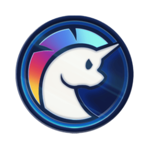 | 69603 | RBW | Crypto Unicorns Rainbow |
|  | 126593 | PNF | ERROR404 |
| 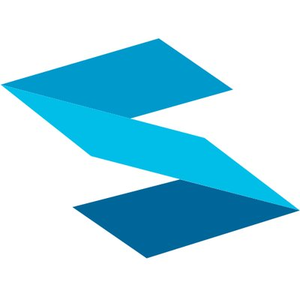 | 124769 | SONO | SonoCoin |
| 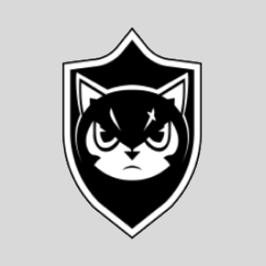 | 113103 | SHILLD | SHILLD |
|  | 112735 | IGS | iGameS |
|  | 113631 | MESSI | MESSI COIN |
|  | 113399 | FROBOT | FrouBot |
|  | 113919 | GRB | Garbi Protocol |
|  | 36400 | BIH | BitHostCoin |
|  | 126715 | XMP | X-MetaPol |
|  | 112189 | GROK CM | Grok Community |
|  | 100223 | BLOCK-0 | Block-0 |
|  | 112145 | UNITYBOT | UnityBot |
| 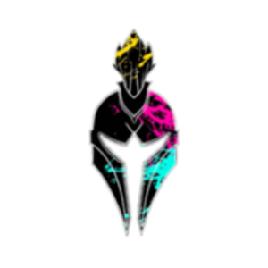 | 59379 | MANDOX | MandoX |
|  | 34656 | SFX | Safex Cash |
|  | 2932 | OCT | OracleChain |
|  | 78501 | HARM | Harmony Token |
| 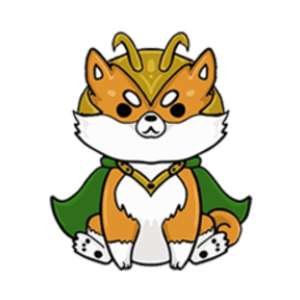 | 56779 | LILFLOKI | Lil Floki |
|  | 126275 | MGOLD | MinerGold.io |
|  | 125413 | DECATS | DeCats |
| 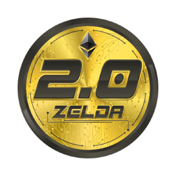 | 61213 | ZLDA | Zelda Inu |
| 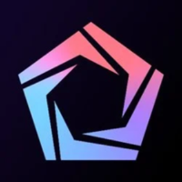 | 123527 | ELT | Element.Black |
| 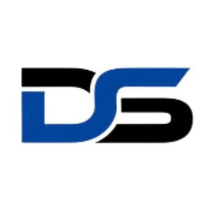 | 53609 | DAILYS | DailySwap Token |
| 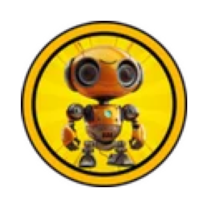 | 131137 | GENAI | Gen AI BOT |
| 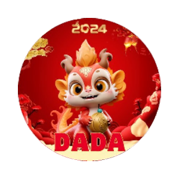 | 124135 | DADA | DADA |
| 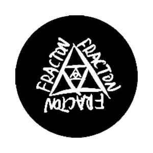 | 90057 | HIFLUF | hiFLUF |
| 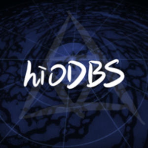 | 77707 | HIODBS | hiODBS |
|  | 68429 | SHINTAMA | Shintama |
| 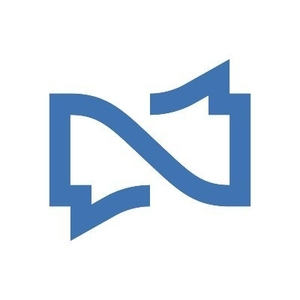 | 46672 | WIS | Experty Wisdom Token |
|  | 95961 | NEPT | Metanept |
| 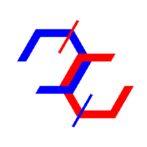 | 47130 | DGP | DGPayment |
| 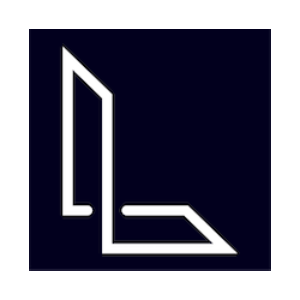 | 36414 | LEVL | Levolution |
| 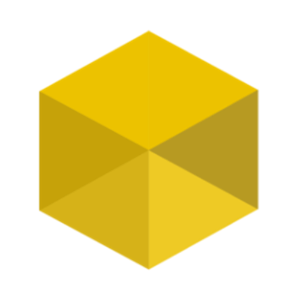 | 32790 | CBC | CashBet Coin |
| 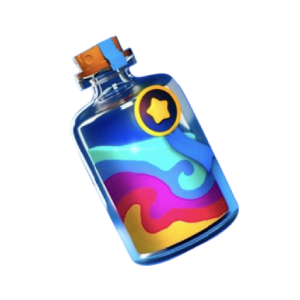 | 65983 | UNIM | Unicorn Milk |
|  | 36534 | PEC | Poverty Eradication Coin |
|  | 125343 | XPERP | xperp |
| 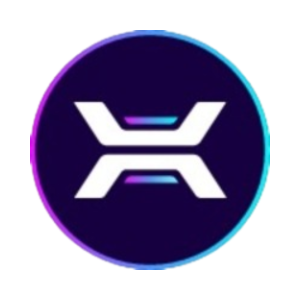 | 124455 | XLN | LunaOne |
| 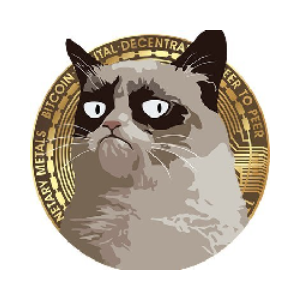 | 111891 | GRUM | Grumpy |
| 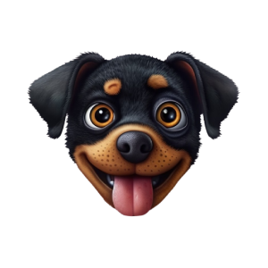 | 115647 | ROTTY | ROTTYCOIN |
| 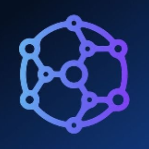 | 131675 | CHARTIQ | ChartIQ |
|  | 127801 | SPONGEBOB | Spongebob Squarepants |
|  | 46264 | MO | Morality |
| 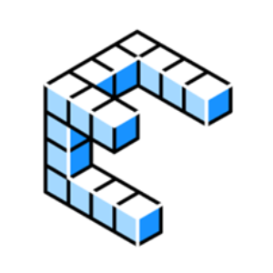 | 34395 | EOSDT | EOSDT |
|  | 128619 | TRUMPJR | TrumpJr |
|  | 130357 | AIMARKET | Acria.AI AIMARKET |
|  | 112463 | BIGF | Bigfoot Monster |
|  | 111813 | PYME | PymeDAO |
| 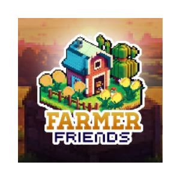 | 95047 | FRENS | Frens Coin |
| 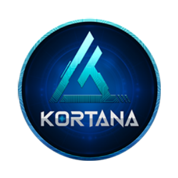 | 98397 | KORA | Kortana |
|  | 86449 | MTSP | Metasphere |
|  | 80653 | DOTR | Cydotori |
|  | 77527 | MOI | MyOwnItem |
|  | 77669 | LKC | Lucky Coin |
|  | 76913 | CIRRUS | Cirrus |
|  | 65281 | FRKT | FRAKT Token |
| 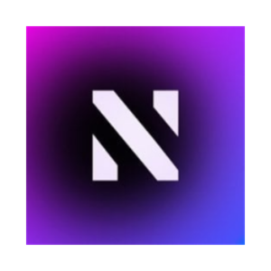 | 58561 | NIFT | Niftify |
|  | 113149 | RVS | Revswap |
|  | 68751 | KONGTAMA | Kongtama |
|  | 129463 | ONNO | Onno Vault |
| 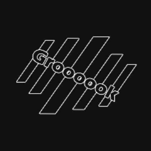 | 112191 | GROOOOOK | Groooook |
|  | 67443 | SBABYDOGE | SOL Baby Doge |
|  | 122973 | VST | Voice Street |
|  | 99505 | $MAXX | Maxx |
|  | 68635 | BAMI | Bami |
|  | 44988 | BALO | Balloon Coin |
| 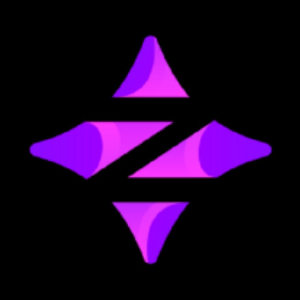 | 127679 | SOLNAV | SOLNAV AI |
| 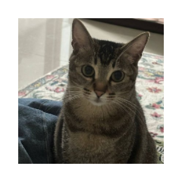 | 128783 | YAOYAO | Yaoyao's Cat |
| 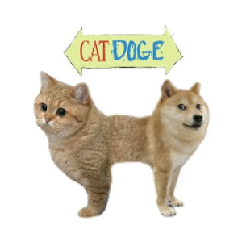 | 128083 | CATDOGE | CAT DOGE |
| 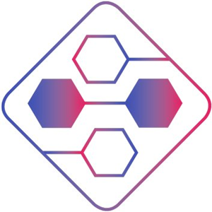 | 127961 | SPEND | SolSpend |
|  | 99081 | USPLUS | Fluent Finance |
|  | 77941 | VSTA | Vesta Finance |
| 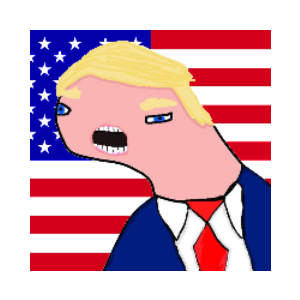 | 129169 | TRWP | Danol Tremp |
|  | 125123 | $TRUTH | TruthGPT (ETH) |
|  | 100191 | ATE | AutoEarn Token |
| 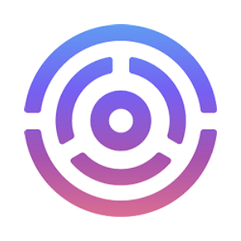 | 90135 | WTR | Deepwaters |
|  | 99149 | TRANS | Trans Pepe |
|  | 54313 | INVI | Invitoken |
|  | 113377 | EMMI | EMMI GG |
|  | 41981 | IFV | INFLIV |
| 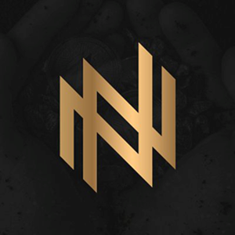 | 33895 | MINX | InnovaMinex |
| 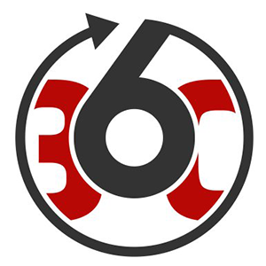 | 123023 | FAN | Fanadise |
|  | 68067 | ALK | Alkemi Network DAO Token |
|  | 125697 | SNIPE | Snipe Finance |
|  | 100015 | WPEPE | Wrapped Pepe |
|  | 81373 | GOSH | GOSH Realm |
|  | 68291 | $MUNDO | MUNDO Token |
|  | 124577 | TYO GHOUL | TYO GHOUL |
|  | 112701 | RAPTOR | Jesus |
|  | 89047 | VXON | VoxNET |
|  | 64227 | BMN | BlockStream Mining Notes |
| 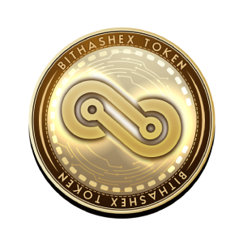 | 57111 | BHAX | Bithashex |
|  | 47627 | YVS | YVS Finance |
|  | 112175 | GOOD | Good Entry |
| 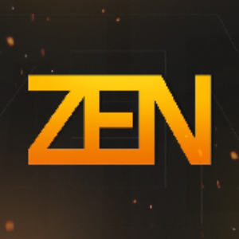 | 130101 | GZT | Golden Zen Token |
| 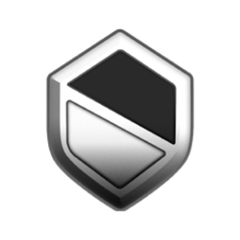 | 123665 | DEG | Degis |
|  | 32468 | BDG | BitDegree |
| 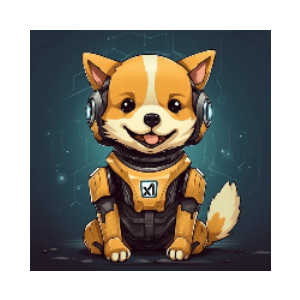 | 124543 | BONKGROK | Bonk Grok |
|  | 113539 | YESGO | Yes |
|  | 96907 | METRO | Metropoly |
| 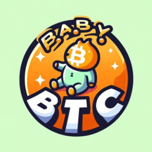 | 124013 | BABYBTC | BABYBTC |
|  | 51335 | GNBU | Nimbus Governance Token |
|  | 64161 | DOGECO | Dogecolony |
|  | 78493 | POS32 | PoS-32 |
|  | 65979 | UNLOCK | UNLOCK |
| 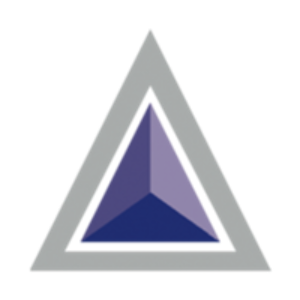 | 58191 | ENTC | EnterButton |
|  | 57287 | DFP2 | DefiPlaza |
|  | 100047 | XS | XSale |
|  | 90311 | ATOR | Airtor Protocol |
| 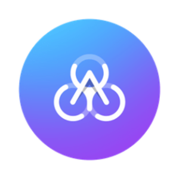 | 59261 | ACYC | All Coins Yield Capital |
| 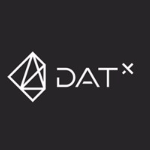 | 32398 | DATX | DATx |
| 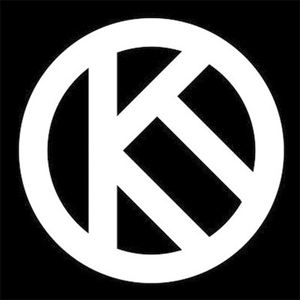 | 127295 | KEP | Kelp Earned Points |
|  | 80129 | MIRL | Made In Real Life |
|  | 51669 | DMOD | Demodyfi |
| 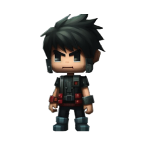 | 98243 | WOID | WORLD ID |
| 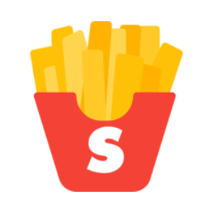 | 112055 | FRIES | Soltato FRIES |
| 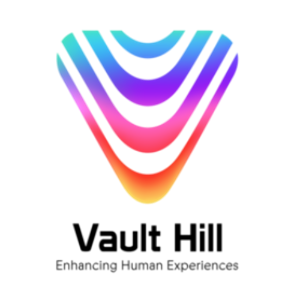 | 81837 | VHC | Vault Hill City |
|  | 60315 | BOLLY | BollyCoin |
|  | 54623 | ROBODOGE | RoboDoge Coin |
|  | 127205 | OBEMA | burek obema |
|  | 126413 | OPOE | Only Possible On Ethereum |
| 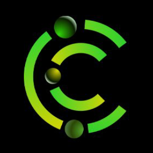 | 88509 | OMMI | Ommniverse |
|  | 76907 | LGBT | Lets Go Brandon Token |
|  | 65333 | ASTAR | AceStarter |
|  | 41558 | BULP | BulpCoin |
| 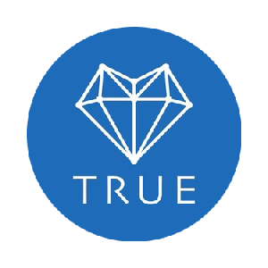 | 32380 | TRUE | True Chain |
|  | 113675 | PHYSICS | Physics |
|  | 113193 | SHUB | SimpleHub |
|  | 96931 | PPIZZA | P Pizza |
|  | 63865 | UAC | Ulanco |
| 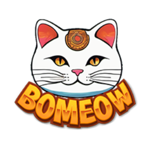 | 127183 | BOMEOW | Book of Meow |
| 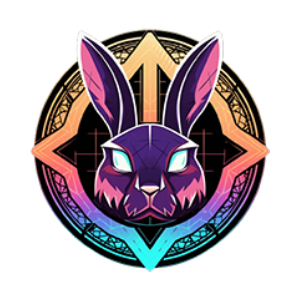 | 121883 | EMAGIC | ElvishMagic |
|  | 123979 | HOOD | ROBIN HOOD |
| 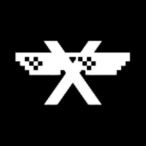 | 112653 | GROKX | GROKX |
|  | 88381 | SYNOPTI | Synopti |
| 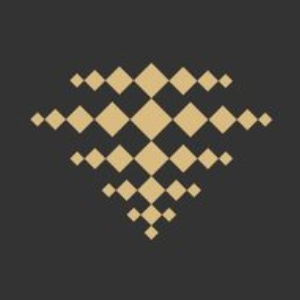 | 70969 | LUXO | Luxo |
|  | 70465 | NPICK | NPick Block |
| 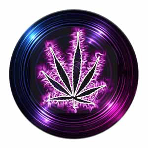 | 49085 | DANK | MU DANK |
|  | 48941 | UNIQ | Uniqly |
|  | 49357 | RVP | Revolution Populi |
|  | 46205 | VOX | Vox.Finance |
| 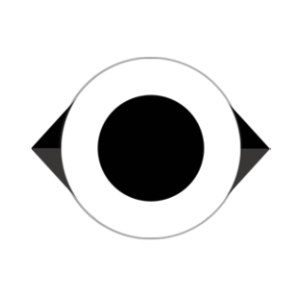 | 45060 | ETHV | Ethverse |
| 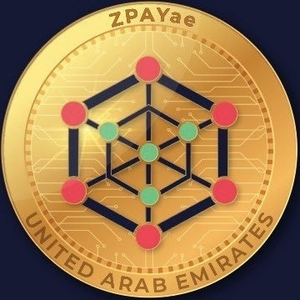 | 44540 | ZPAE | ZelaaPayAE |
|  | 69633 | XSB | Solareum Wallet |
|  | 69017 | CVNX | CVNX |
| 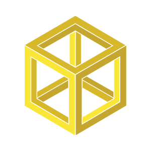 | 45184 | USG | USGold |
| 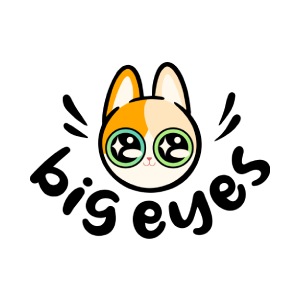 | 123581 | BIG | Big Eyes |
|  | 112975 | NPM | Neptune Mutual |
|  | 121885 | BLOX | BLOX |
|  | 97769 | UTBAI | UTB.ai |
|  | 90109 | SKET | Sketch Coin |
| 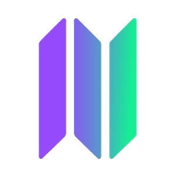 | 80187 | STAY | STAY |
|  | 68943 | LDXG | LondonCoinGold |
|  | 50105 | NXL | Next Level |
|  | 99663 | SCRATS | Scratch Meme Coin |
|  | 100279 | GUISE | Guiser |
|  | 79337 | MXZ | Maximus Coin |
| 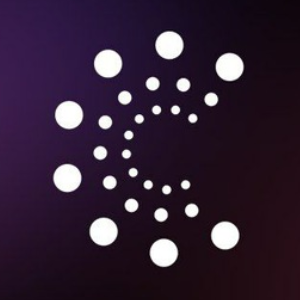 | 54563 | CW | CardWallet |
| 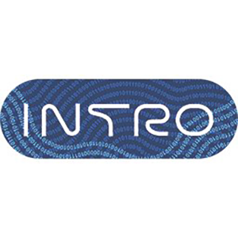 | 57133 | ITR | Intercoin |
| 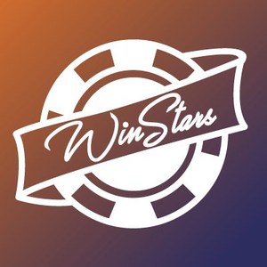 | 111633 | WINS | Wins |
|  | 70249 | PPI | Swappi |
|  | 127819 | AIRB | BillionAir |
|  | 128395 | AITK | AITK |
| 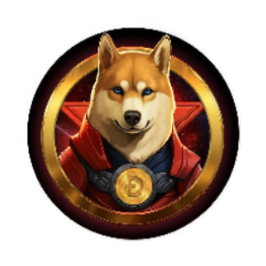 | 128647 | DOGEPAY | Doge Payment |
|  | 126405 | NSC | Nuson Chain |
|  | 128193 | CRICKETS | Kermit |
|  | 129147 | EVE | EVE Token |
| 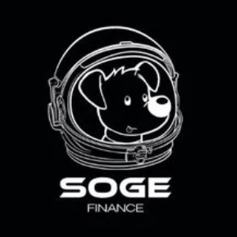 | 126065 | SOGE | SOGE |
| 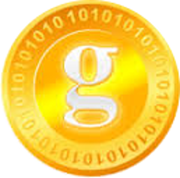 | 123049 | GDC | Global Digital Content |
| 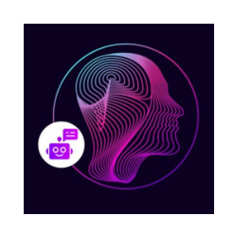 | 113827 | OCTAVUS | Octavus Prime |
|  | 113359 | DTE | Drive To Earn |
|  | 100089 | PG | PEGO Network |
|  | 97117 | HUS | Husky.AI |
|  | 90133 | DUX | DUX |
|  | 77691 | IMPT | IMMOPET Token |
|  | 67799 | ASVA | Asva Labs |
|  | 64337 | 1MCT | MicroCreditToken |
|  | 60951 | OBROK | OBRok |
|  | 50831 | ADAX | ADAX |
| 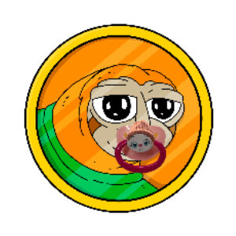 | 128113 | BABYSLERF | Baby Slerf |
|  | 125279 | ASSA | AssaPlay |
| 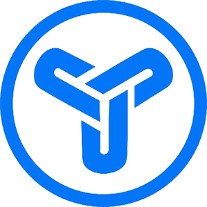 | 33082 | YCC | Yuan Chain Coin |
|  | 123677 | MBET | MetaBET |
|  | 94265 | SANCTA | Sanctum Coin |
|  | 79051 | GWD | GreenWorld |
| 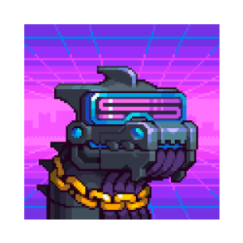 | 65719 | BOKU | Boryoku Dragonz |
| 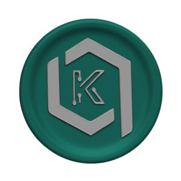 | 66403 | KNB | Kronobit |
| 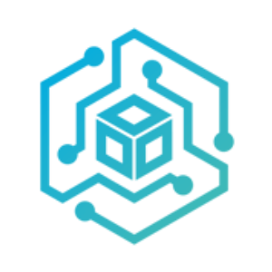 | 61973 | OPV | OpenLive NFT |
|  | 45994 | DHC | DeltaHub Community |
| 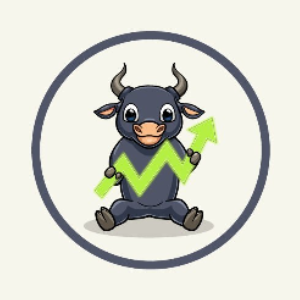 | 131317 | NBD | Never Back Down |
|  | 126477 | NEWU | NEWU (Ordinals) |
| 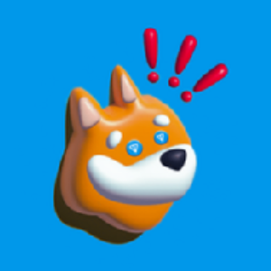 | 127195 | TONK | Tonk Inu |
|  | 125415 | BSAT | Black Sats (Ordinals) |
|  | 97313 | OSHI | OSHI |
| 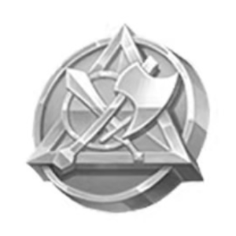 | 88029 | CGL | Crypto Gladiator League |
|  | 69623 | NHCT | Hurricane NFT |
| 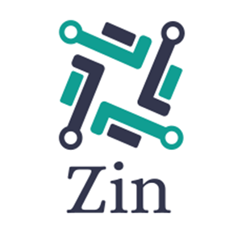 | 60369 | ZIN | Zin |
|  | 61935 | BSGG | Betswap.gg |
|  | 99529 | $DLANCE | DeeLance |
|  | 69097 | GNL | Green Life Energy |
| 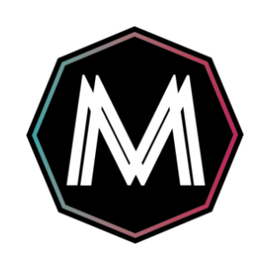 | 60653 | MF1 | Meta Finance |
|  | 125825 | $ENCR | ENCRYPT |
|  | 79977 | REDAN | REDANCOIN |
|  | 126219 | EYT | EasyToken |
|  | 125619 | GUARDIAN | Guardian AI |
|  | 67041 | GOV | GovWorld |
| 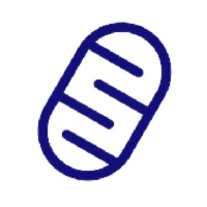 | 58263 | DHP | dHealth |
|  | 126401 | NUKEM | Nuk'em Loans |
|  | 94229 | PAPA | Papa |
|  | 79065 | CLOUD | CloudTx |
|  | 125973 | MOONAIR | Moon Air |
|  | 125921 | AICR | AICrew |
| 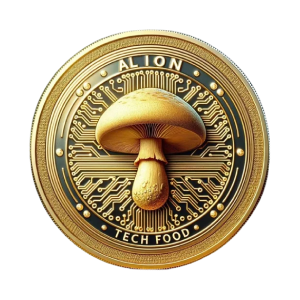 | 123887 | ATF | ArithFi |
|  | 113715 | WELLE | Welle |
|  | 112563 | YMII | Young Mids Inspired |
| 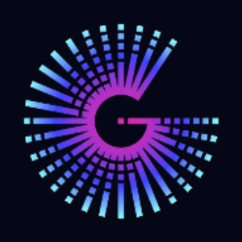 | 112381 | AIG | A.I Genesis |
|  | 112591 | MWM | Metaverse World Membership |
|  | 112671 | HYME | HYME |
|  | 112655 | GROK X | Grok X |
|  | 112133 | ZKGAP | ZKGAP |
|  | 111775 | GW | Gyrowin |
|  | 85269 | SWPR | The Swappery |
| 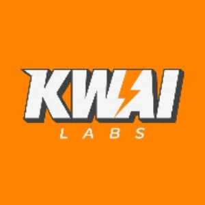 | 85165 | KWAI | KWAI |
|  | 78035 | INUKO | Inuko Finance |
|  | 78675 | OX2 | OxyO2 |
|  | 67437 | HIP | Hippo Token |
|  | 67511 | VS | Vision Metaverse |
| 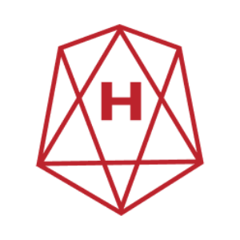 | 63561 | HO | HALO Network |
|  | 61655 | KKT | Kingdom Karnage |
|  | 56083 | SFO | Sunflower Finance |
|  | 53929 | APPLEB | APPLEB |
| 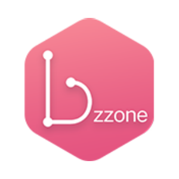 | 54609 | BZZONE | Bzzone |
|  | 44403 | CTG | Cryptorg Token |
| 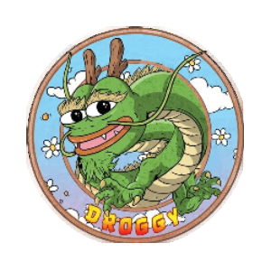 | 113361 | DROGGY | Droggy |
|  | 99595 | NEUTR | Neutrinos |
|  | 94041 | LEVI | LeverageInu |
| 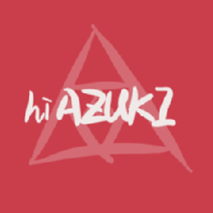 | 88593 | HIAZUKI | hiAZUKI |
| 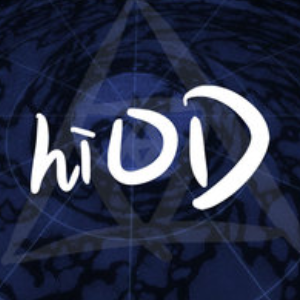 | 88187 | HIOD | hiOD |
|  | 88855 | HIDOODLES | hiDOODLES |
| 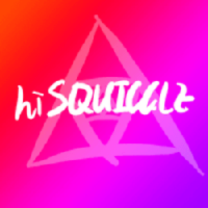 | 88859 | HISQUIGGLE | hiSQUIGGLE |
| 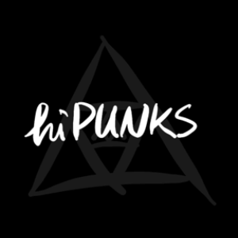 | 88191 | HIPUNKS | hiPunks |
| 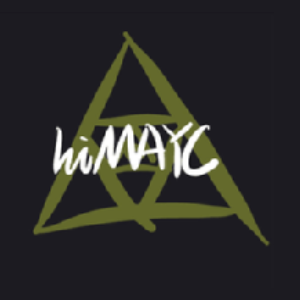 | 79461 | HIMAYC | hiMAYC |
|  | 71341 | HIBAYC | hiBAYC |
| 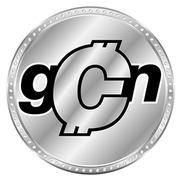 | 126611 | GCN | Gascoin |
|  | 111725 | QR | Qrolli |
|  | 102637 | HEAVEN | Heaven Token |
|  | 158 | EDG | Edgeless |
| 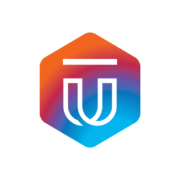 | 33763 | UGAS | UGAS |
| 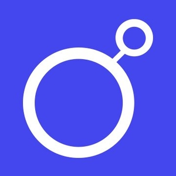 | 32922 | NOKU | Noku |
| 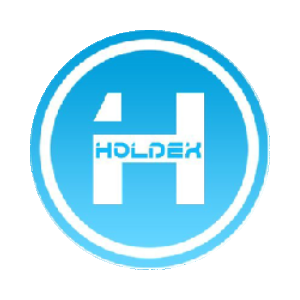 | 56573 | HOLDEX | Holdex Finance |
| 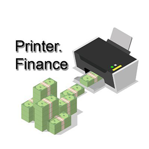 | 122453 | PRINT | Print Protocol |
|  | 82277 | WCA | WCAPES |
| 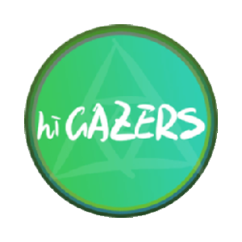 | 90003 | HIGAZERS | hiGAZERS |
|  | 88863 | HIVALHALLA | hiVALHALLA |
|  | 88163 | HIRENGA | hiRENGA |
| 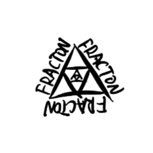 | 89987 | HIFIDENZA | hiFIDENZA |
| 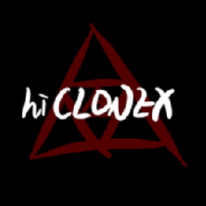 | 88597 | HICLONEX | hiCLONEX |
| 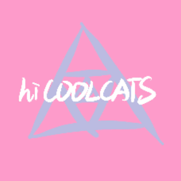 | 88599 | HICOOLCATS | hiCOOLCATS |
| 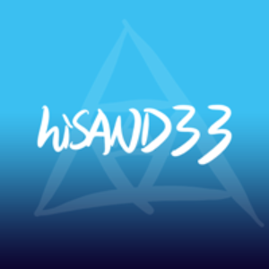 | 88177 | HISAND33 | hiSAND33 |
| 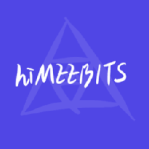 | 89967 | HIMEEBITS | hiMEEBITS |
|  | 69191 | GMETA | Green Meta |
| 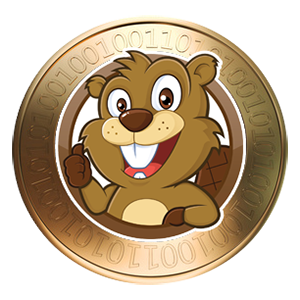 | 63557 | BVC | BattleVerse |
|  | 56529 | CDTC | DeCredit |
|  | 68261 | QSD | QIAN Second Generation Dollar |
|  | 112359 | $0XS | 0xS |
| 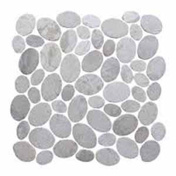 | 111587 | XPB | PowBlocks |
|  | 65635 | RAISE | Raise Token |
|  | 32439 | UUU | U Network |
|  | 3681 | XUC | Exchange Union |
|  | 127887 | VTRO | Vitruveo DEX |
|  | 125633 | HRPT | Homeunity |
|  | 113435 | GMBT | GMBot |
| 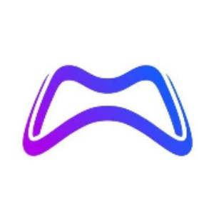 | 115597 | MEU | MetaUnit |
| 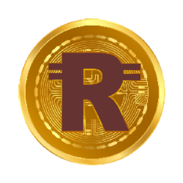 | 82559 | ROVI | ROVI |
|  | 45280 | BLZN | Blaze Network |
| 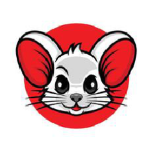 | 127249 | MOW | mouse in a cats world |
|  | 126123 | NKS | Nikssa |
|  | 42151 | XGK | GoldKash |
|  | 33245 | HELP | Helpico |
|  | 123971 | MUSKMEME | MUSK MEME |
|  | 123419 | MODEL | Model Labs |
| 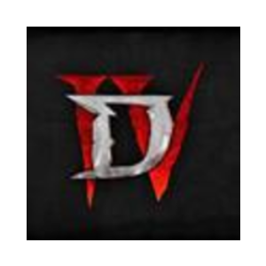 | 123803 | DIABLO | Diablo IV |
| 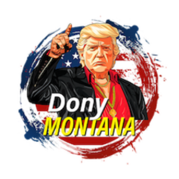 | 125289 | DOMO | DOMO |
|  | 113957 | PUM | Pumpkin Monster Token |
| 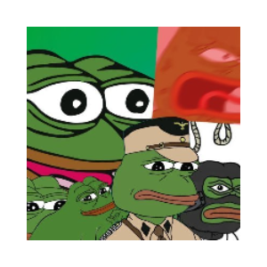 | 122883 | PEPEE | Pepe the pepe |
|  | 122917 | DWARS | Dynasty Wars |
|  | 122425 | TOKA | Tonka Finance |
| 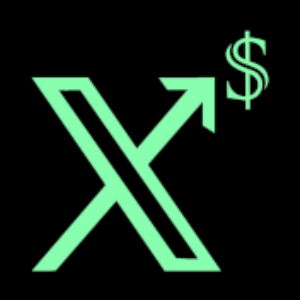 | 123759 | XRISE | Xrise |
| 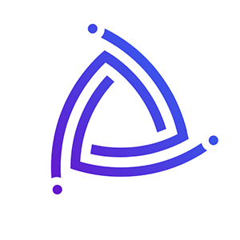 | 123353 | JUR | Jur |
|  | 123773 | RAIT | Rabbitgame |
|  | 124031 | KIRBYINU | Kirby Inu |
| 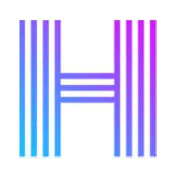 | 112729 | HOS | Hotel of Secrets |
|  | 111873 | XRAI | XRender |
|  | 99363 | DPEX | DPEX |
|  | 90291 | VNN | VINU Network |
| 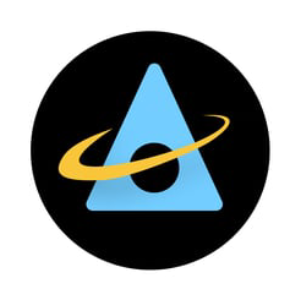 | 78121 | ATID | AstridDAO |
|  | 79575 | APCG | ALLPAYCOIN |
|  | 114009 | $XNOVA | XNOVA |
|  | 67399 | XMPT | XiamiPool |
|  | 112615 | MRABBIT | Mr Rabbit Coin |
|  | 88493 | MOVER | Mover.xyz |
|  | 86259 | KDOE | Kudoe |
|  | 81885 | BTCIX | BITCOLOJIX |
|  | 44600 | BION | Biido |
|  | 33665 | BRZE | Breezecoin |
|  | 479 | ORMEUS | OrmeusCoin |
| 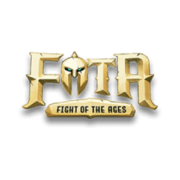 | 122087 | FOTA | FOTA - Fight Of The Ages |
|  | 70219 | JUMBO | Jumbo Exchange |
|  | 68127 | DINOEGG | DINOEGG |
| 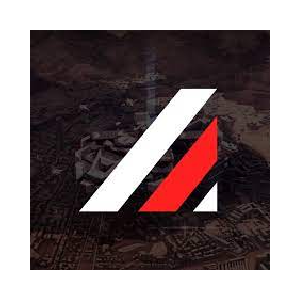 | 63939 | ARKN | Ark Rivals |
|  | 64095 | PHCR | PhotoChromic |
| 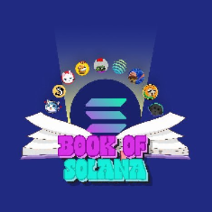 | 127731 | BOSOL | Book of Solana |
| 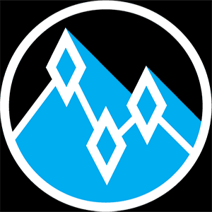 | 122105 | CFT | Cash Flash |
| 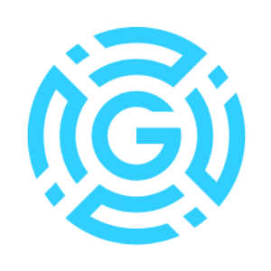 | 71485 | GGTKN | GGTKN |
| 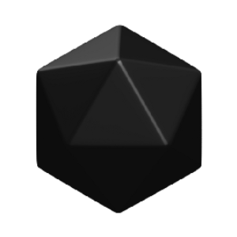 | 128921 | BARK | dog in cats world |
|  | 123699 | BUGS | Bugs Bunny |
| 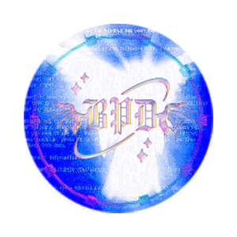 | 124683 | BPD | Beautiful Princess Disorder |
| 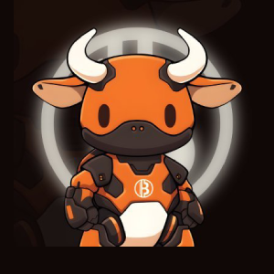 | 125205 | BBB | BitBullBot |
|  | 124273 | SERUM | Karmaverse Zombie |
| 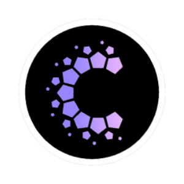 | 122565 | CHUB | CallHub |
| 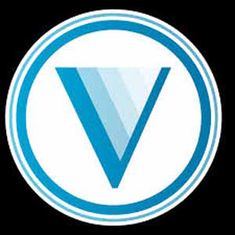 | 125147 | VIRAL | Viralsniper |
| 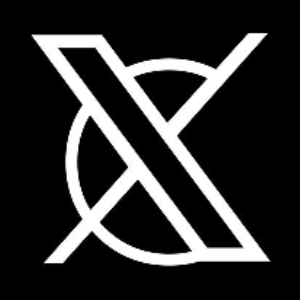 | 122469 | CX | CHARTAI |
|  | 115569 | BEG | BEG |
|  | 115499 | RSRV | Reserve |
|  | 121971 | SOHOT | SOHOTRN |
| 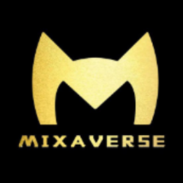 | 115369 | MIXCOIN | Mixaverse |
| 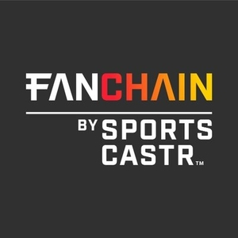 | 80349 | FANZ | FrontFanz |
|  | 60711 | DOEX | DOEX |
|  | 55675 | B2U | B2U Coin |
|  | 54861 | SWEET | Honey Token |
|  | 54545 | SOLD | Solanax |
|  | 49583 | YAY | YaySwap |
|  | 47031 | MKS | Makes |
|  | 48371 | OMNIUNIT | Omniunit |
|  | 44953 | SAON | Saon |
|  | 44960 | YANU | Yanu |
| 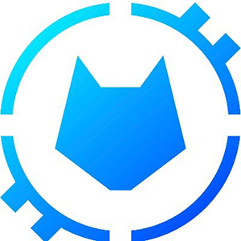 | 45319 | CATX | CAT.trade Protocol |
| 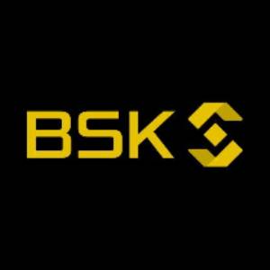 | 46735 | BSK | BitcoinStaking |
| 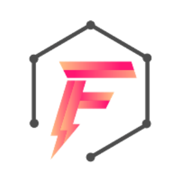 | 44591 | FESS | Fesschain |
|  | 43031 | TUSC | The Universal Settlement Coin |
| 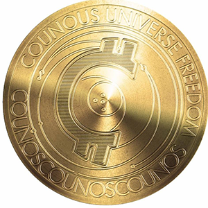 | 42723 | CCXX | CounosX |
|  | 36328 | PDATA | Opiria |
|  | 41602 | CCA | Counos Coin |
| 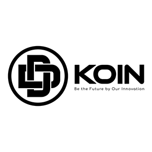 | 36420 | DDK | DDKoin |
| 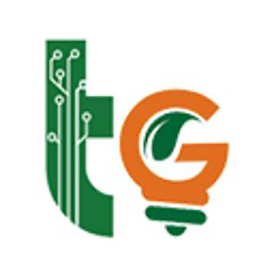 | 36649 | TGN | TerraGreen |
| 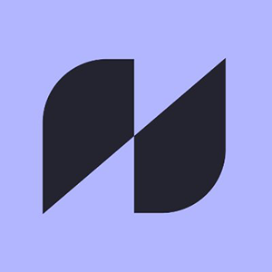 | 33802 | UDOO | Hyprr (Howdoo) |
|  | 49101 | SVX | Savix |
|  | 112771 | KINGU | KingU |
|  | 78053 | MIBR | MIBR Fan Token |
|  | 59315 | BUSDX | BUSDX |
|  | 126137 | NYBC | NY Blockchain |
|  | 82497 | BITCONEY | BITCONEY |
|  | 67419 | RVLNG | RevolutionGames |
|  | 126269 | BMBI | Metaverse Universal Assets BMBI (Ordinals) |
|  | 70535 | SRCX | Source Protocol |
| 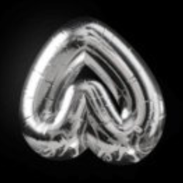 | 122413 | ALPHABET | Alphabet |
|  | 113065 | PLCUC | PLC Ultima Classic |
| 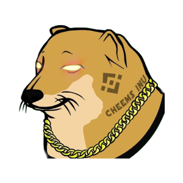 | 111681 | CINU | Cheems Inu [NEW] |
| 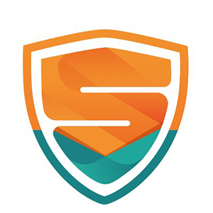 | 123115 | SEC | SEC |
| 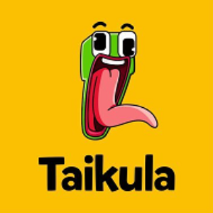 | 114041 | TAIKULA | Taikula Coin |
|  | 112581 | ZOOK | Zook Protocol |
|  | 97089 | SHAUN | SHAUN INU |
|  | 69377 | AKTIO | Aktio |
| 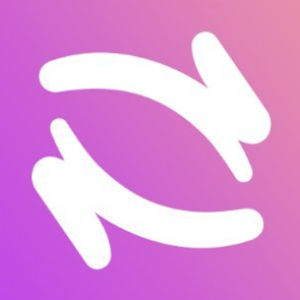 | 51607 | HOP | HOPPY |
| 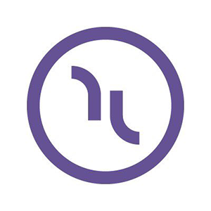 | 122455 | XD | LENX Finance |
| 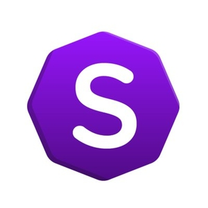 | 122747 | STL | Cyberstella |
| 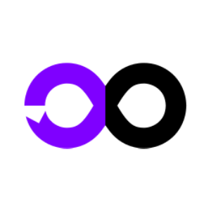 | 113953 | PVFYBO | Public Violet Fybo |
|  | 70031 | AVAT | AVATA Network |
| 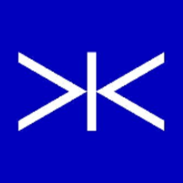 | 64809 | TCR | Tracer DAO |
| 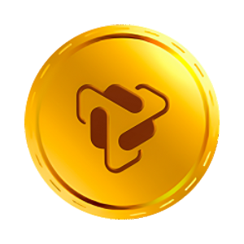 | 60385 | TARAL | Tarality |
| 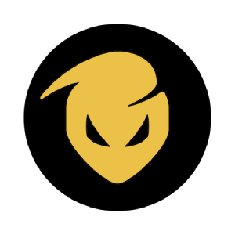 | 68913 | SWDAO | Super Whale DAO |
|  | 78603 | LYNK | LynKey |
| 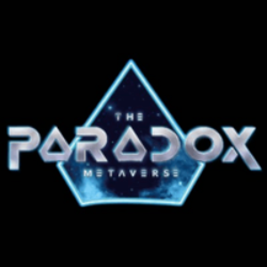 | 79119 | PARADOX | Paradox Metaverse |
|  | 68919 | ANV | Aniverse |
|  | 80055 | JNS | Janus Network |
|  | 64045 | MTIX | Matrix |
| 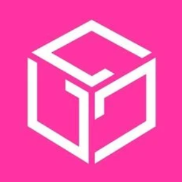 | 78249 | MUSIC | NFTMusic.ai |
| 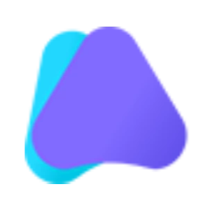 | 57733 | ANSR | Answerly |
| 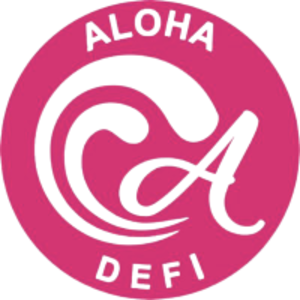 | 48233 | ALOHA | Aloha |
|  | 44842 | AKM | COST COIN+ |
| 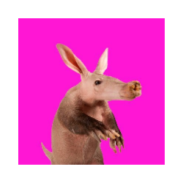 | 123229 | VARK | Aardvark |
|  | 122587 | DUG | DUG |
| 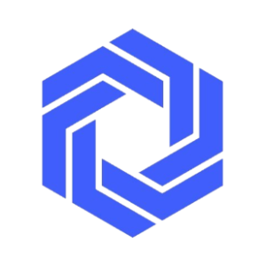 | 51697 | MRCR | Mercor Finance |
|  | 80979 | SL | SoloxCoin |
|  | 71571 | XTAL | XTAL |
|  | 71601 | CEJI | Ceji |
|  | 42908 | ARW | Arrow |
|  | 125235 | NKO | Niko |
| 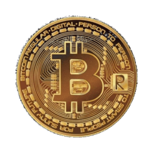 | 34640 | BTRL | BitcoinRegular |
| 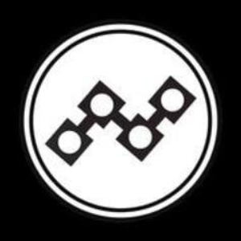 | 124733 | PWR | PWR Coin |
|  | 124865 | LSILVER | Lyfe Silver |
| 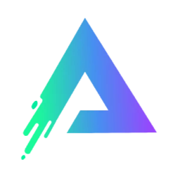 | 66431 | DELFI | DeltaFi |
|  | 49477 | SHPP | ShipItPro |
| 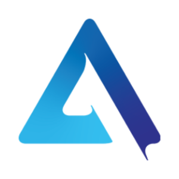 | 44706 | ASKO | Askobar Network |
|  | 33501 | STEEP | SteepCoin |
|  | 33238 | AUX | Auxilium |
| 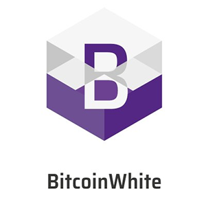 | 32562 | BTW | BitWhite |
| 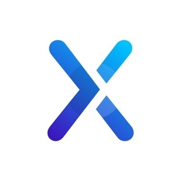 | 32888 | NIX | NIX |
| 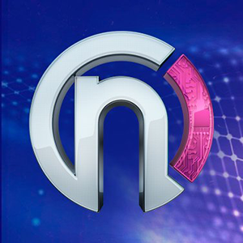 | 32958 | NSD | Nasdacoin |
| 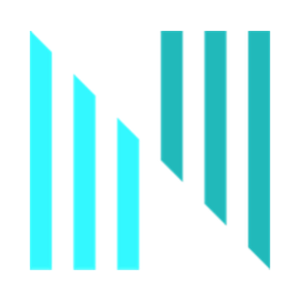 | 472 | NOTE | DNotes |
|  | 44567 | REW | Rewardiqa |
|  | 123533 | ROW | Rage On Wheels |
|  | 113943 | PAXB | PAXB |
| 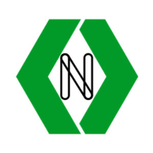 | 44269 | NBXC | Nibble |
|  | 125215 | NITO | Nitroken |
| 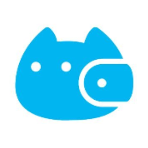 | 66401 | CATPAY | CATpay |
| 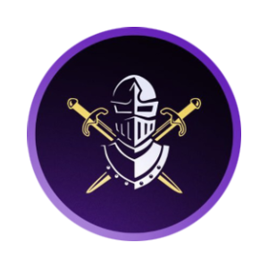 | 66099 | NBL | Nobility |
|  | 125741 | ANIMAL | Animal army |
|  | 122841 | VOY | Volley token |
|  | 125481 | SOLBROE | SolBroe |
|  | 123213 | CHRISPUMP | Christmas Pump |
| 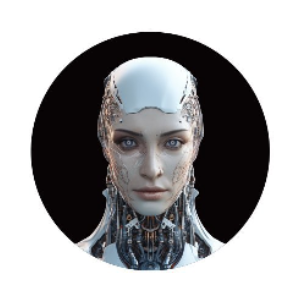 | 123603 | GROKBANK | Grok Bank |
|  | 122423 | BOARD | SurfBoard Finance |
|  | 112993 | NTP | NFT Track Protocol |
| 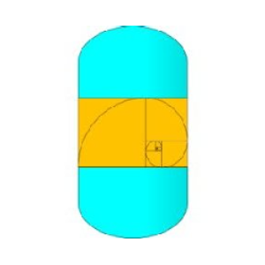 | 115275 | OPAIG | OvalPixel |
|  | 114899 | CHOKE | Artichoke Protocol |
|  | 87159 | SHIBDAO | Shibarium DAO |
| 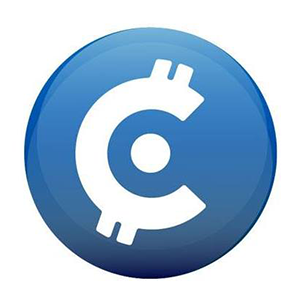 | 76429 | CALL | Global Crypto Alliance |
| 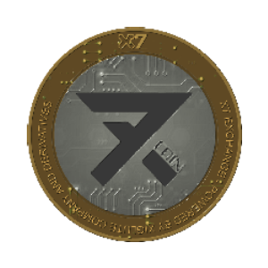 | 78891 | X7C | X7 Coin |
|  | 70559 | FON | Force of Nature |
|  | 69393 | CAND | Canary Dollar |
|  | 66837 | HGHG | HUGHUG |
|  | 46902 | BUP | BuildUp |
|  | 114013 | XPPT | XPayPro.Tech |
|  | 65455 | UNV | Unvest |
|  | 51281 | CYCLUB | Cyclub |
| 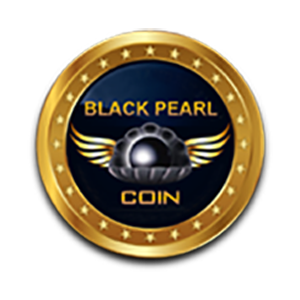 | 529 | XBP | BlitzPredict |
|  | 96681 | BTYC | BigTycoon |
|  | 82225 | YOLLLO | Yolllo |
|  | 94031 | MDCY | MedCareCoin |
|  | 85913 | ROLL | Polyroll |
|  | 79075 | VSW | Venera |
|  | 77921 | 1WO | 1World |
|  | 70549 | XCA | Xcavator |
|  | 71135 | ACEC | Ace Cash |
| 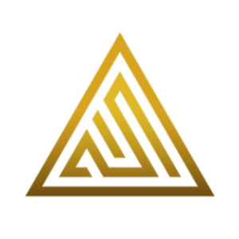 | 67269 | AMDG | AMDG Token |
| 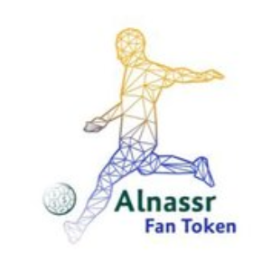 | 69415 | NASSR | Alnassr FC Fan Token |
|  | 69115 | ELNC | EloniumCoin |
|  | 68629 | EXMOC | EXMOC |
|  | 58801 | ANPAN | AnpanSwap Token |
|  | 57367 | MSPC | Monspac |
|  | 58065 | LORC | LandOrc |
|  | 54949 | MUSO | MUSO Finance |
|  | 48419 | FAMOUS | Famous Coin |
|  | 45967 | CYF | CY Finance |
| 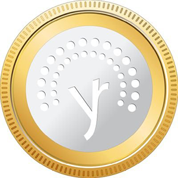 | 44202 | TREX | Trexcoin |
| 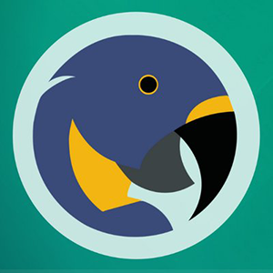 | 41224 | BRAZ | Brazio |
|  | 113829 | $CHOO | Chooky |
|  | 67981 | FANTA | Football Fantasy Pro |
| 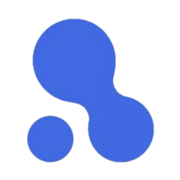 | 44198 | B1P | B ONE PAYMENT |
|  | 123227 | DEED | Deed (Ordinals) |
|  | 94351 | RYOMA | Ryoma |
|  | 51691 | ESOV | Sovryn |
| 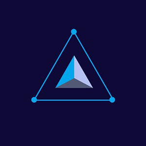 | 44737 | RWS | Robonomics Web Services |
| 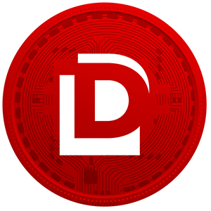 | 71017 | DGN | Dungeon |
|  | 71205 | HIRO | Hiroki |
|  | 70613 | COURSE | Meta Course |
|  | 51351 | DINA | Dina |
| 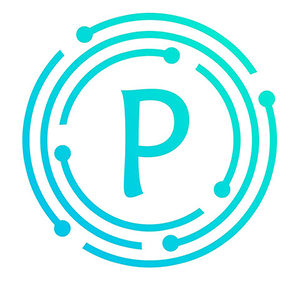 | 124627 | PC | Pepe Chain |
|  | 112561 | YOJ | YOJ |
|  | 98073 | PAPI | Papi |
|  | 96691 | EADX | EADX |
| 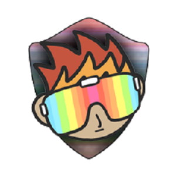 | 87219 | JELLY | Jelly eSports |
|  | 70271 | MVX | Mavaverse |
|  | 111797 | PINT | PintSwap |
|  | 79865 | HNY | Hive.Investments HONEY |
| 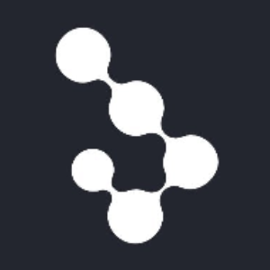 | 112697 | JVL | Javelin |
| 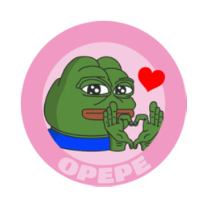 | 95105 | OPEPE | Optimism PEPE |
|  | 47611 | QUAI | Quai Dao |
|  | 41470 | PIASA | PIASA |
| 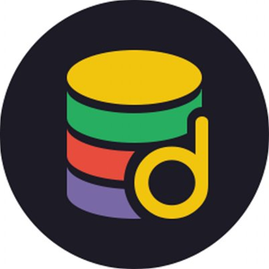 | 32577 | DTC | Datacoin |
|  | 69079 | P2E | Plant2Earn |
|  | 65547 | MATPAD | MaticPad |
|  | 93859 | DTL | Dotlab |
|  | 51869 | DEEZNUTS | Deez Nuts |
|  | 115037 | MILOCEO | Milo CEO |
|  | 33893 | ODEX | One DEX |
|  | 113941 | PAG | Paw-a-Gotchi |
|  | 111645 | ROCI | RociFi |
|  | 64333 | LIZ | LizardToken.Finance |
| 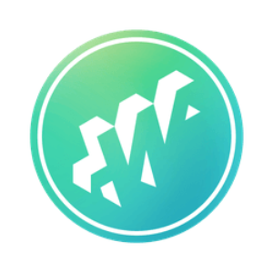 | 33424 | WHEN | WHEN Token |
|  | 112661 | GVS | GVS |
| 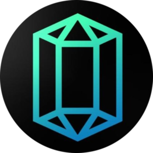 | 46503 | BTNYX | BitOnyx |
|  | 41682 | SPAZ | SwapCoinz |
| 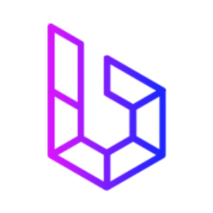 | 124103 | BOT | Bot Planet |
| 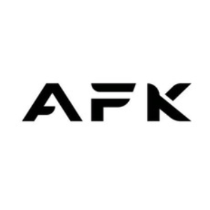 | 123793 | AFK | AFKDAO |
|  | 122269 | HXXH | Pioneering Decentralized UTXO-Based NFT Social Protocol |
|  | 71217 | KTL | Kamaleont |

---

[← Prev](./list9.md) | [Next →](./list11.md)
