# Cryptocurrency list

### page: 11

[← Prev](./list10.md) | [Next →](./list12.md)

| Logo | ID | Symbol | Name |
|:----:|:--:|:------:|:-----|
| 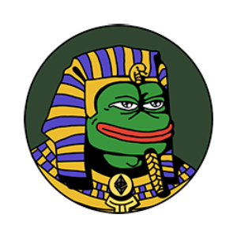 | 10741 | KEKE | KEK |
| 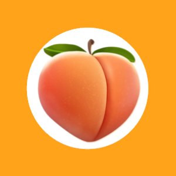 | 10742 | PORNROCKET | PornRocket |
| 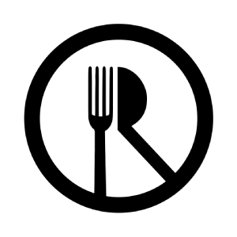 | 10743 | ORARE | OneRare |
| 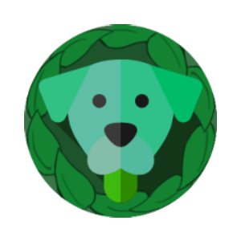 | 10744 | EBEN | Green Ben |
| 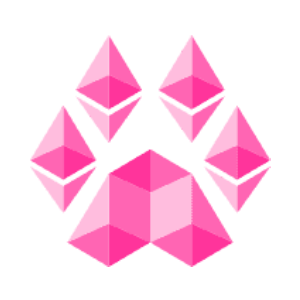 | 10745 | PAWTH | Pawthereum |
|  | 10746 | MORSE | Morse |
| 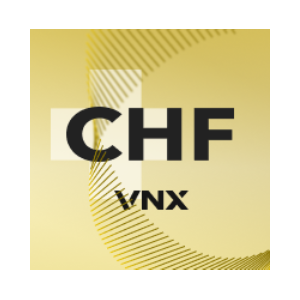 | 10747 | VCHF | VNX Swiss Franc |
| 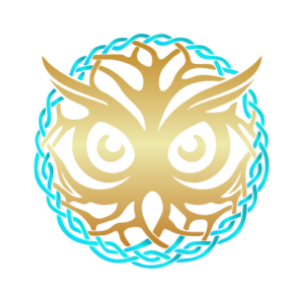 | 10748 | WBN | Wisdom Bank Network |
| 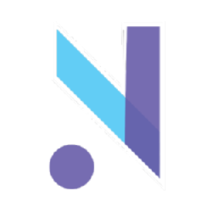 | 10749 | NRK | Nordek |
|  | 10750 | YBO | Young Boys Fan Token |
| 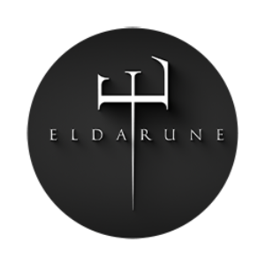 | 10751 | ELDA | Eldarune |
| 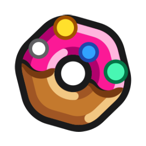 | 10752 | DONUT | Donut |
| 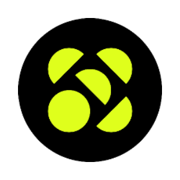 | 10753 | VCX | VaultCraft |
| 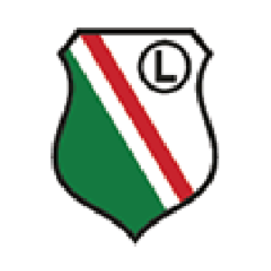 | 10754 | LEG | Legia Warsaw Fan Token |
| 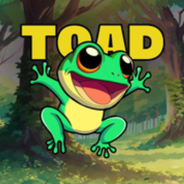 | 10755 | TOAD | TOAD |
| 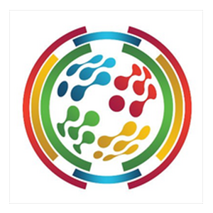 | 10757 | CRYPTOSDG | Sustainable Development Goals |
| 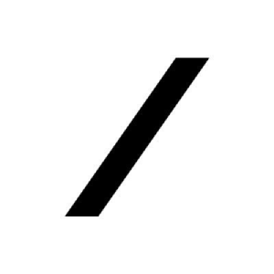 | 10758 | GRAVITAS | Gravitas |
|  | 10759 | NBLU | NuriTopia |
|  | 10760 | MEMEAI | Meme Ai |
| 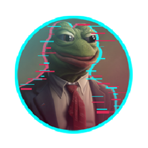 | 10761 | PEPECEO | REAL PEPE CEO |
|  | 10762 | TH | Team Heretics Fan Token |
| 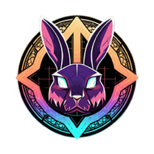 | 10763 | EMAGIC | ElvishMagic |
| 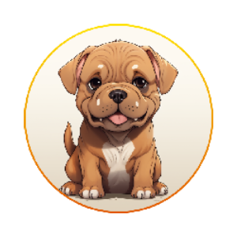 | 10764 | TOSA | TosaInu BSC |
|  | 10765 | GRG | RigoBlock |
|  | 10766 | SGPT | ShitGPT |
| 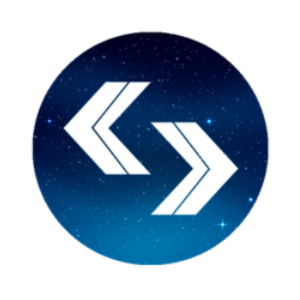 | 10767 | 0X1 | 0x1.tools: AI Multi-tool Plaform |
| 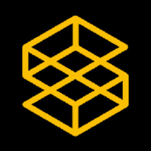 | 10768 | SAVM | SatoshiVM |
| 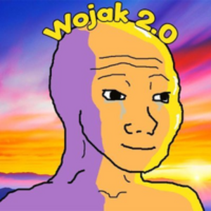 | 10769 | WOJAK2 | Wojak 2.0 Coin |
|  | 10770 | AVATLY | Avatly |
| 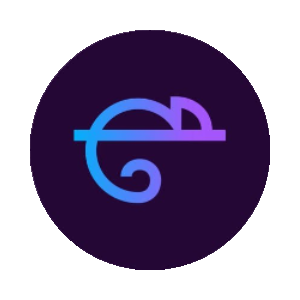 | 10771 | KLT | Kamaleont |
|  | 10772 | GLINT | BeamSwap |
|  | 10773 | ROTTO | Rottolabs |
|  | 10774 | BRIDGE | Bridge Bot |
|  | 10775 | IBFK | İstanbul Başakşehir Fan Token |
|  | 10776 | THUG | Thug Life |
|  | 10777 | GSTSOL | Green Satoshi Token (SOL) |
| 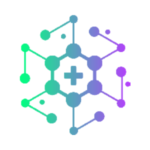 | 10778 | XRPH | XRP Healthcare |
| 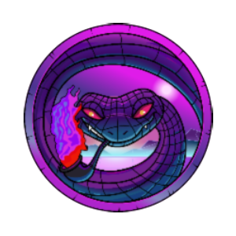 | 10779 | SNEKE | Snek on Ethereum |
| 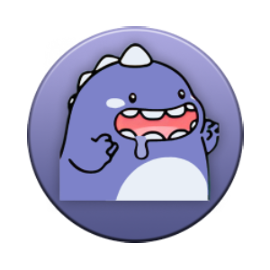 | 10780 | KUKU | KuKu |
| 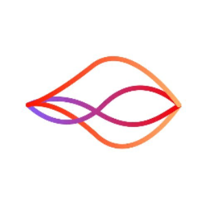 | 10781 | MAW | Mountain Sea World |
|  | 10782 | SPFC | São Paulo FC Fan Token |
| 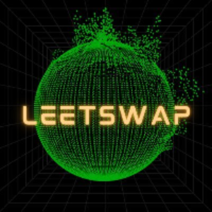 | 10783 | LEET | LeetSwap |
| 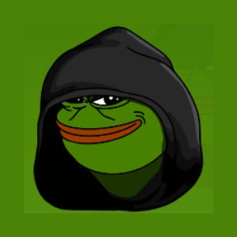 | 10784 | EVILPEPE | Evil Pepe |
| 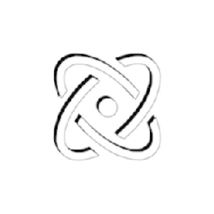 | 10785 | FUSION | FusionBot |
| 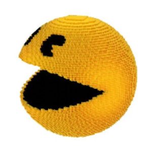 | 10786 | PACMAN | Pac Man |
| 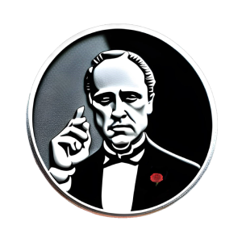 | 10787 | DONS | The Dons |
| 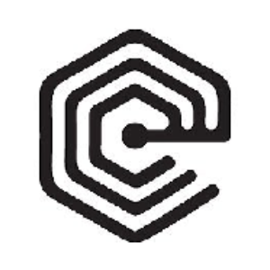 | 10788 | ELMT | Element |
|  | 10789 | NONE | None Trading |
|  | 10790 | PETS | PolkaPets |
|  | 10791 | UPRO | ULTRAPRO |
| 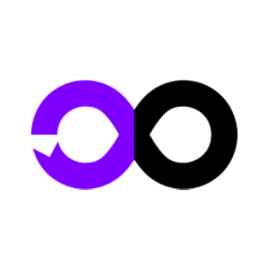 | 10792 | PVFYBO | JRVGCUPVSC |
|  | 10793 | FRKT | FRAKT Token |
| 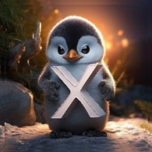 | 10794 | PENGYX | PengyX |
| 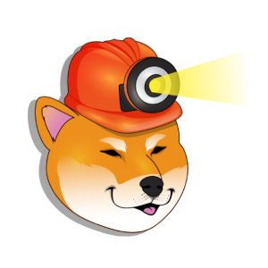 | 10795 | MINU | Minu |
| 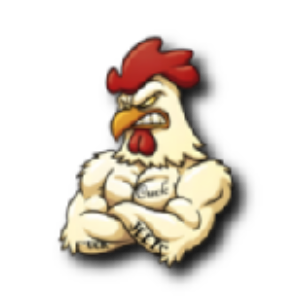 | 10796 | CUCK | Cuckadoodledoo |
|  | 10797 | TRADEX | TradeX AI |
| 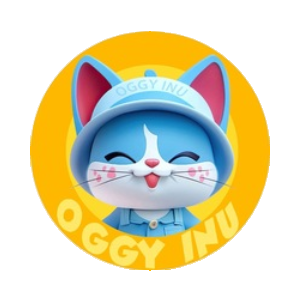 | 10798 | OGGY | Oggy Inu |
| 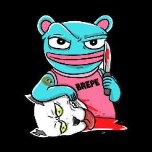 | 10799 | BREPE | BREPE |
|  | 10800 | FXDX | FXDX |
| 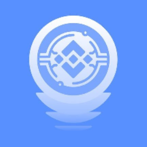 | 10801 | ECHOBOT | ECHO BOT |
| 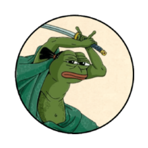 | 10802 | PEPURAI | PEPURAI |
| 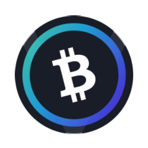 | 10803 | VBCH | Venus BCH |
|  | 10804 | SALLY | SALAMANDER |
|  | 10805 | AIONE | AiONE |
| 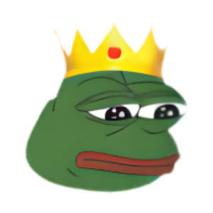 | 10806 | PEPEKING | PEPEKING |
| 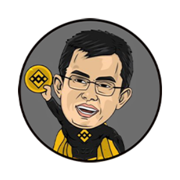 | 10807 | CZGOAT | CZ THE GOAT |
| 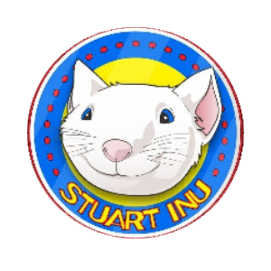 | 10808 | STUART | Stuart Inu |
|  | 10809 | QRT | Qrkita Token |
| 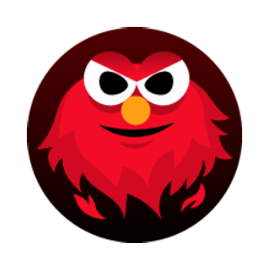 | 10810 | ELMO | ELMOERC |
|  | 10811 | CHORIZO | Chorizo |
| 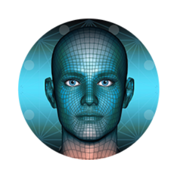 | 10812 | MEFA | Metaverse Face |
|  | 10813 | INUKO | Inuko Finance |
| 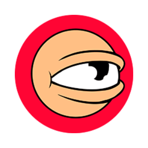 | 10814 | GOB | Goons of Balatroon |
|  | 10816 | DK | Dominant Kong |
|  | 10817 | RHINOMARS | RhinoMars |
| 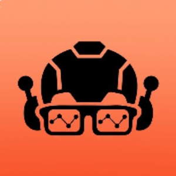 | 10818 | NERD | Nerd Bot |
| 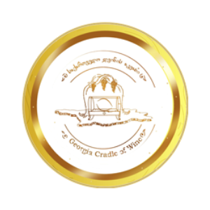 | 10819 | GCW | GCWine |
| 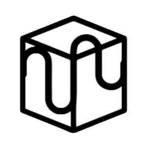 | 10820 | PACE | 3space Art |
|  | 10821 | WRONG | The Wrong Token |
|  | 10822 | LINDACEO | LindaYacc Ceo |
|  | 10823 | ELMON | Elemon |
|  | 10824 | SDOGE | SpaceXDoge |
|  | 10825 | KSN | KISSAN |
|  | 10826 | BLACKSWAN | BlackSwan AI  |
|  | 10827 | UTBAI | UTB.ai |
|  | 10828 | KNIGHT | Forest Knight |
|  | 10829 | NEZHATOKEN | NezhaToken (nezhatoken.meme) |
|  | 10830 | KANGAL | Kangal |
|  | 10832 | HIMEEBITS | hiMEEBITS |
|  | 10833 | CATBOY | Catboy |
|  | 10834 | AITRA | Aitra |
|  | 10835 | STAK | Jigstack |
|  | 10836 | BEG | BEG |
|  | 10837 | SILVA | Silva Token |
|  | 10838 | JVL | Javelin |
|  | 10839 | TKB | TokenBot |
|  | 10840 | HIUNDEAD | hiUNDEAD |
|  | 10841 | CAKEBOT | CakeBot |
|  | 10842 | HIMOONBIRDS | hiMOONBIRDS  |
|  | 10843 | SDAI | Savings Dai |
|  | 10844 | NOV | Novara Calcio Fan Token |
|  | 10845 | HIGAZERS | hiGAZERS |
|  | 10846 | BAKAC | Baka Casino |
|  | 10847 | BLUI | Blui |
|  | 10848 | SHARES | shares.finance |
|  | 10849 | COINBT | CoinBot |
|  | 10850 | HISAND33 | hiSAND33 |
|  | 10851 | SYBL | Sybulls |
|  | 10852 | HICLONEX | hiCLONEX |
|  | 10853 | LEAD | Lead Wallet |
|  | 10854 | BPD | Beautiful Princess Disorder |
|  | 10855 | EDE | El Dorado Exchange |
|  | 10856 | TIK | ChronoBase |
|  | 10857 | SONICSONIC | Sonic (sonicsonic.xyz) |
|  | 10858 | DONA | DONASWAP |
|  | 10859 | HIBEANZ | hiBEANZ |
|  | 10860 | STRONGX | STRONGX |
|  | 10861 | SHRED | ShredN |
|  | 10862 | JNY | JNY |
|  | 10863 | HIRENGA | hiRENGA  |
|  | 10864 | HIFRIENDS | hiFRIENDS |
|  | 10865 | PEPEAI | Pepe Analytics |
|  | 10866 | NEXT | Everclear |
|  | 10867 | DYNA | Dynamix |
|  | 10868 | AGA | AGA Token |
|  | 10869 | CO | Corite |
|  | 10870 | CX | Crypto X |
|  | 10871 | STARSHIP | STARSHIP |
|  | 10872 | TRUTH | TruthGPT |
|  | 10873 | HTD | HeroesTD |
|  | 10874 | ROUSH | Roush Fenway Racing Fan Token |
|  | 10875 | PEPEGAINS | PepeGains |
|  | 10876 | DXL | Dexlab |
|  | 10877 | BOGEY | Bogey |
|  | 10878 | KML | KinkyMilady |
|  | 10879 | FPFT | Peruvian National Football Team Fan Token  |
|  | 10880 | AZUKIDAO | AzukiDAO |
|  | 10881 | KABY | Kaby Arena |
|  | 10883 | SALD | Salad |
|  | 10884 | HOLA | Hola Token |
|  | 10885 | IF | Impossible Finance |
|  | 10886 | QWAN | The QWAN |
|  | 10887 | SMPF | SMP Finance |
|  | 10888 | NEKOIN | Nekoin |
|  | 10889 | EDNS | EDNS Token |
|  | 10890 | TEA | TeaDAO |
|  | 10891 | SFRC | Safari Crush |
|  | 10892 | BUBU | BUBU |
|  | 10893 | INCORGNITO | Incorgnito |
|  | 10894 | LUPIN | LUPIN |
|  | 10895 | BOSSBABY | BossBaby |
|  | 10896 | BUNNYINU | Bunny Inu |
|  | 10897 | CHEEMSCO | Cheems (cheems.co) |
|  | 10898 | MRX | Metrix Coin |
|  | 10900 | HIMAYC | hiMAYC |
|  | 10901 | DESU | Dexsport |
|  | 10902 | HIAZUKI | hiAZUKI |
|  | 10903 | RAPTOR | Jesus-Raptor |
|  | 10904 | HIFLUF | hiFLUF |
|  | 10905 | HICOOLCATS | hiCOOLCATS |
|  | 10906 | GOGU | GOGU Coin |
|  | 10907 | HISQUIGGLE | hiSQUIGGLE |
|  | 10908 | BABYHKTIGER | BabyHkTiger |
|  | 10909 | KLD | Koduck |
|  | 10910 | BLTC | BABYLTC |
|  | 10911 | WSPP | Wolf Safe Poor People |
|  | 10912 | BAMA | BabyAMA |
|  | 10913 | COGI | COGI |
|  | 10914 | KINGB | King Bean |
|  | 10915 | HIODBS | hiODBS  |
|  | 10916 | KONG | KONG |
|  | 10917 | AD | ADreward |
|  | 10918 | ORION | Orion Money |
|  | 10919 | ASAP | Asap Sniper Bot |
|  | 10920 | OCICAT | OciCat |
|  | 10921 | ZES | Zetos |
|  | 10922 | ZETA | ZetaChain |
|  | 10923 | FERZAN | Ferzan |
|  | 10924 | DCNTR | Decentrahub Coin |
|  | 10925 | DUMMY | Dummy |
|  | 10926 | T99 | Tethereum |
|  | 10927 | DUBAICAT | Dubai Cat |
|  | 10928 | BEM | BEMIL Coin |
|  | 10929 | ONLINE | Onlinebase |
|  | 10930 | SHEEESH | Secret Gem |
|  | 10931 | KWT | Kawaii Island |
|  | 10932 | SNOB | Snowball |
|  | 10933 | FLORKY | Florky |
|  | 10934 | HIPUNKS | hiPUNKS |
|  | 10935 | WFAI | WaifuAI |
|  | 10936 | DAVIS | Davis Cup Fan Token |
|  | 10937 | GZT | Golden Zen Token |
|  | 10938 | DWEB | DecentraWeb |
|  | 10939 | DUCKIES | Yellow Duckies |
|  | 10940 | WEXO | Wexo |
|  | 10941 | PDRAGON | Phoenix Dragon |
|  | 10942 | KAMPAY | KamPay |
|  | 10943 | SNPS | Snaps |
|  | 10944 | DIVA | DIVA Protocol |
|  | 10945 | ZKVAULT | zkVAULT |
|  | 10946 | KNTO | Kento |
|  | 10947 | SXS | Sphere |
|  | 10948 | CNF | CryptoNeur Network foundation |
|  | 10949 | DZG | Dinamo Zagreb Fan Token |
|  | 10950 | PEPEZILLA | PEPEZilla |
|  | 10951 | PAPI | Papi |
|  | 10952 | BARA | Capybara |
|  | 10953 | AGATA | Agatech |
|  | 10954 | MIBR | MIBR Fan Token |
|  | 10955 | L2 | Leverj Gluon |
|  | 10956 | HIMFERS | HIMFERS |
|  | 10957 | INEX | Inex Project |
|  | 10958 | MTVT | Metaverser |
|  | 10959 | RINU | Raichu Inu |
|  | 10960 | PYME | PymeDAO |
|  | 10961 | HARAM | HARAM |
|  | 10962 | MOTA | MotaCoin |
|  | 10963 | PUMBAA | Pumbaa |
|  | 10964 | EDFI | EdFi |
|  | 10965 | PRCY | PRivaCY Coin |
|  | 10966 | PEPEINU | PEPE inu |
|  | 10967 | FOFO | FOFO Token |
|  | 10968 | FYD | FYDcoin |
|  | 10969 | 3D3D | 3d3d |
|  | 10970 | NGMI | NGMI Coin |
|  | 10971 | CRE8 | Creaticles |
|  | 10972 | PEPEDERP | PepeDerp |
|  | 10973 | HOS | Hotel of Secrets |
|  | 10974 | COPIUM | Copium |
|  | 10975 | CLX | Celeum |
|  | 10976 | SKPEPE | Sheikh Pepe |
|  | 10977 | TIN | Token IN |
|  | 10978 | YUKKY | YUKKY |
|  | 10979 | RITO | Ritocoin |
|  | 10980 | LSPHERE | Lunasphere |
|  | 10981 | BOBAI | Bob AI |
|  | 10982 | ROLS | RollerSwap |
|  | 10983 | PUPPETS | Puppets Coin |
|  | 10984 | ASW | AdaSwap |
|  | 10985 | HINU | HajiIni |
|  | 10986 | JW | Jasan Wellness |
|  | 10987 | GATSBY | Gatsby Inu |
|  | 10988 | FREED | FreedomCoin |
|  | 10989 | RKI | RAKHI |
|  | 10990 | DRC | DRC Mobility |
|  | 10991 | CORGIB | The Corgi of PolkaBridge |
|  | 10992 | FS | FantomStarter |
|  | 10993 | SHACK | Shackleford |
|  | 10994 | HTZ | Hertz Network |
|  | 10995 | DIFI | Digital Files |
|  | 10996 | UTMDOGE | UltramanDoge |
|  | 10997 | RAGE | Rage Fan |
|  | 10998 | PIPA | Pipa Coin |
|  | 10999 | WALLY | Wally Bot |
|  | 11000 | PEPEGRINCH | Pepe Grinch |
|  | 11001 | XUI | YouSUI |
|  | 11002 | XGPT | XGPT |
|  | 11003 | NANA | Bananace |
|  | 11004 | ETPOS | EtherPOS |
|  | 11005 | KERMIT | KermitTheCoin |
|  | 11006 | SLOTH | Sloth |
|  | 11007 | TCS | Timechain Swap Token |
|  | 11008 | PEPEPI | PEPEPi |
|  | 11009 | DISPEPE | Disabled Pepe |
|  | 11010 | HIBAKC | hiBAKC |
|  | 11011 | BUNI | Bunicorn |
|  | 11012 | SABLE | Sable Finance |
|  | 11013 | KFX | KnoxFS |
|  | 11014 | MRBOB | MR BOB COIN |
|  | 11015 | HISEALS | hiSEALS |
|  | 11016 | SIBA | SibaInu |
|  | 11017 | EBA | Elpis Battle |
|  | 11018 | ENIGMA | ENIGMA |
|  | 11019 | POWELL | Jerome Powell |
|  | 11020 | HTX | HTX |
|  | 11021 | SPIDER | Spider Man |
|  | 11022 | PORK | PepeFork |
|  | 11023 | POPCAT | Popcat |
|  | 11025 | DZDD | DZD |
|  | 11026 | CYRUS | Cyrus Exchange |
|  | 11027 | IRA | Diligence |
|  | 11028 | GARU | Garuda Coin |
|  | 11029 | BEFX | Belifex |
|  | 11030 | KEMA | Kemacoin |
|  | 11031 | SWIRLX | SwirlToken |
|  | 11032 | MATE | Mate |
|  | 11033 | KIWI | kiwi |
|  | 11034 | REELT | Reel Token |
|  | 11035 | REMIT | BlockRemit |
|  | 11036 | SFLOKI | SuiFloki-Inu |
|  | 11037 | ETHI | Ethical Finance |
|  | 11039 | RPILL | Red Pill |
|  | 11040 | GROKKING | GROKKING |
|  | 11041 | TRACN | trac (Ordinals) |
|  | 11043 | ALT | Altlayer |
|  | 11044 | FONS | FONSmartChain |
|  | 11045 | WEN | Wen |
|  | 11046 | EVA | Evadore |
|  | 11047 | CAH | Moon Tropica |
|  | 11048 | INFRA | Bware |
|  | 11049 | ACATO | ACA Token |
|  | 11050 | WOLFOF | Wolf of Wall Street |
|  | 11051 | LOOT | LootBot |
|  | 11052 | LANDWOLFETH | Landwolf (landwolfeth.com) |
|  | 11053 | GORILLA | Gorilla |
|  | 11054 | MILEI | MILEI |
|  | 11055 | SANTAGROK | Santa Grok |
|  | 11056 | XCOM | X.COM |
|  | 11057 | STC | Satoshi Island |
|  | 11059 | GBOT | GBOT |
|  | 11060 | DRAW | Drawshop Kingdom Reverse |
|  | 11061 | OXS | 0xS |
|  | 11062 | AXIST | AXIS Token |
|  | 11063 | CTLS | Chaintools |
|  | 11064 | MMS | Marsverse |
|  | 11065 | BLOX | BLOX |
|  | 11066 | TOUCHFAN | TouchFan |
|  | 11067 | DICE | Klaydice |
|  | 11068 | TOONF | Toon Finance |
|  | 11069 | GALO | Clube Atlético Mineiro Fan Token  |
|  | 11070 | HIPENGUINS | hiPENGUINS |
|  | 11071 | SAKAI | SAKAI |
|  | 11072 | UPC | UPCX |
|  | 11073 | ARKI | ArkiTech |
|  | 11074 | NEI | Neurashi |
|  | 11075 | LORD | MEMELORD |
|  | 11076 | UBDN | UBD Network |
|  | 11077 | KINGGROK | King Grok |
|  | 11078 | JOTCHUA | Perro Dinero |
|  | 11079 | TROLLHEIM | Trollheim |
|  | 11080 | A | Alpha Token |
|  | 11081 | CARO | Meta Ricaro |
|  | 11082 | BSCBURN | BSCBURN |
|  | 11083 | PYRO | PYRO Network |
|  | 11084 | DEDE | Dede |
|  | 11085 | UFARM | UniFarm |
|  | 11086 | TXG | TRUSTxGAMING |
|  | 11087 | STUSDT | Staked USDT |
|  | 11088 | BNU | ByteNext |
|  | 11089 | WAGMI | Wagmi Coin |
|  | 11090 | ELET | Elementeum |
|  | 11091 | WAGMIT | Wagmi |
|  | 11092 | HXA | HXAcoin |
|  | 11094 | GAJ | Gaj Finance |
|  | 11095 | PRVC | PrivaCoin |
|  | 11096 | SCHO | Scholarship Coin |
|  | 11097 | LESSF | LessFnGas |
|  | 11098 | LUFFYG | Luffy G5 |
|  | 11099 | GENESIS | Genesis Worlds |
|  | 11100 | WEWE | WEWE |
|  | 11101 | FLL | Feellike |
|  | 11102 | SODO | Scooby Doo |
|  | 11103 | MARTK | Martkist |
|  | 11104 | FRZ | Frozy Inu |
|  | 11105 | DEGENR | DegenReborn |
|  | 11106 | PAYB | Paybswap |
|  | 11107 | BLAUNCH | B-LAUNCH |
|  | 11108 | BABYJESUS | BabyJesusCoin |
|  | 11109 | PEPVERS | PepVerse |
|  | 11110 | RFD | RefundCoin |
|  | 11111 | SEFA | Mesefa |
|  | 11112 | RFDB | Refund |
|  | 11113 | DONU | Donu |
|  | 11114 | PEPEX | pepeX |
|  | 11115 | FUZE | FUZE Token |
|  | 11116 | SNN | SeChain |
|  | 11117 | YOLO | YoloNolo |
|  | 11118 | VCAKE | Venus CAKE |
|  | 11119 | JLP | Jupiter Perps LP |
|  | 11120 | ORDS | Ordiswap |
|  | 11121 | PEPPA | PEPPA |
|  | 11122 | GTAI | GT Protocol |
|  | 11123 | PEPEBURN | Pepeburn |
|  | 11124 | WBS | Websea |
|  | 11125 | RUUF | RuufCoin |
|  | 11126 | VADA | Venus Cardano |
|  | 11127 | POTTER | POTTER |
|  | 11128 | DMAIL | DMAIL Network |
|  | 11130 | H4TOKEN | Hold Ignore Fud |
|  | 11131 | JSM | Joseon Mun |
|  | 11132 | UZX | UZX |
|  | 11133 | PEPED | PepeDAO Coin |
|  | 11134 | BV3A | Buccaneer V3 Arbitrum |
|  | 11135 | VXRP | Venus XRP |
|  | 11136 | HKB | HongKong BTC bank |
|  | 11137 | PONKE | Ponke |
|  | 11138 | PNDC | Pond Coin |
|  | 11139 | ZETRIX | Zetrix |
|  | 11140 | SWETH | swETH |
|  | 11141 | SHUB | SimpleHub |
|  | 11142 | STACKS | STACKS PAY |
|  | 11143 | SERSH | Serenity Shield |
|  | 11144 | REV3L | REV3AL |
|  | 11145 | DROGGY | Droggy |
|  | 11146 | TLC | Trillioner |
|  | 11147 | SAUDIBONK | Saudi Bonk |
|  | 11148 | PRISMA | Prisma Finance |
|  | 11149 | SMARTMEME | SmartMEME |
|  | 11150 | HEFI | HeFi |
|  | 11151 | DYM | Dymension |
|  | 11152 | WMNT | Wrapped Mantle |
|  | 11153 | VFIL | Venus Filecoin |
|  | 11154 | GROKHEROES | GROK heroes |
|  | 11155 | SOHOT | SOHOTRN |
|  | 11156 | USDEBT | USDEBT |
|  | 11157 | AVAV | AVAV |
|  | 11158 | SAITABIT | SaitaBit |
|  | 11159 | TKX | Tokenize Xchange |
|  | 11160 | PEAS | Peapods Finance |
|  | 11161 | BULLPEPE | Bullpepe |
|  | 11162 | SHDW | Shadow Token |
|  | 11163 | SAROS | Saros |
|  | 11164 | EGGMAN | Eggman Inu |
|  | 11165 | VPR | VaporWallet |
|  | 11166 | FRGX | FRGX |
|  | 11167 | OPAIG | OvalPixel |
|  | 11168 | WTAO | Wrapped TAO |
|  | 11169 | RSETH | Kelp DAO Restaked ETH |
|  | 11170 | AVIVE | Avive World  |
|  | 11171 | TENET | TENET |
|  | 11172 | HOPPYTOKEN | Hoppy |
|  | 11173 | AMU | Amulet |
|  | 11174 | BORK | Bork |
|  | 11175 | EQPAY | EquityPay |
|  | 11176 | TEST | Test |
|  | 11177 | LPV | Lego Pepe Vision |
|  | 11178 | F3 | Friend3 |
|  | 11179 | MUZZ | MuzzleToken |
|  | 11180 | RDEX | Orders.Exchange |
|  | 11181 | WOJAK | Wojak |
|  | 11182 | BOZO | BOZO |
|  | 11184 | ODS | Odesis |
|  | 11185 | VMPX | VMPX (Ordinals) |
|  | 11186 | EVERMOON | EverMoon |
|  | 11187 | FI | Fideum |
|  | 11188 | NARCO | Mr. Narco |
|  | 11189 | BMW | BMW |
|  | 11190 | BABYCRAZYT | BABY CRAZY TIGER |
|  | 11191 | DOVI | Dovi (Ordinals) |
|  | 11192 | GPN | Gamepass Network |
|  | 11193 | NITO | Nitroken |
|  | 11194 | DINW | Dinowars |
|  | 11195 | CASINU | Casinu Inu |
|  | 11196 | GLAX | BLOCK GALAXY NETWORK |
|  | 11197 | ROB | ROB |
|  | 11198 | GROKCEO | GROK CEO |
|  | 11200 | OSHI | Oshi Token |
|  | 11201 | HKDOGE | HongKong Doge |
|  | 11202 | IDRX | IDRX |
|  | 11203 | FLUXB | Fluxbot |
|  | 11204 | HAVOC | Havoc |
|  | 11206 | DAVE | DAVE |
|  | 11207 | ROCKY | Rocky |
|  | 11208 | PEPC | Pepe Classic |
|  | 11209 | BABYSHARK | Baby Shark |
|  | 11210 | VUNI | Venus UNI |
|  | 11211 | LUIGI | Luigi Inu |
|  | 11212 | SOLAMA | Solama |
|  | 11213 | AIFLOKI | AI Floki |
|  | 11214 | DUAL | Dual Finance |
|  | 11215 | BEET | BEETroot |
|  | 11216 | WGHOST | Wrapped GhostbyMcAfee |
|  | 11217 | CATCEO | CATCEO |
|  | 11218 | MEZZ | MEZZ Token |
|  | 11219 | FMC | Fimarkcoin |
|  | 11220 | DIPA | Doge Ipa |
|  | 11221 | WORK | Work X |
|  | 11222 | MARE | Mare Finance |
|  | 11223 | JOKER | JOKER |
|  | 11224 | DOGRMY | DogeArmy |
|  | 11225 | MINAR | Miner Arena |
|  | 11226 | EDX | Equilibrium |
|  | 11227 | MAVIA | Heroes of Mavia |
|  | 11228 | PANDORA | Pandora |
|  | 11229 | WHALES | Whales Market |
|  | 11230 | OLAS | Autonolas |
|  | 11231 | AINN | AINN |
|  | 11232 | HONK | Honk |
|  | 11233 | SWCH | SwissCheese |
|  | 11234 | WYNN | Anita Max Wynn |
|  | 11235 | CLFI | cLFi |
|  | 11236 | VMATIC | Venus MATIC |
|  | 11237 | VEC | Vector |
|  | 11238 | TURT | TurtSat |
|  | 11239 | MICE | Mice |
|  | 11240 | VDOGE | Venus Dogecoin |
|  | 11241 | FORWARD | Forward Protocol |
|  | 11242 | OBT | Oobit |
|  | 11243 | ANALY | Analysoor |
|  | 11244 | MARVIN | Marvin |
|  | 11245 | MYRODRAGON | MYRO DRAGON |
|  | 11246 | SMILEY | SMILEY |
|  | 11247 | ZUZALU | Zuzalu Inu |
|  | 11248 | ORNJ | Orange |
|  | 11249 | AMAPT | Amnis Finance |
|  | 11250 | QTO | QToken |
|  | 11251 | KIMBO | Kimbo |
|  | 11252 | WNEON | Wrapped Neon EVM |
|  | 11253 | VAAVE | Venus AAVE |
|  | 11254 | VBETH | Venus BETH |
|  | 11255 | TALIS | Talis Protocol |
|  | 11256 | ROW | Rage On Wheels |
|  | 11257 | TONNEL | TONNEL Network |
|  | 11258 | BUCK | Coinbuck |
|  | 11259 | VATRENI | Croatian FF Fan Token |
|  | 11260 | SAUCEINU | SAUCEINU |
|  | 11261 | DIGIV | Digiverse |
|  | 11262 | LAVE | Lavandos |
|  | 11263 | PT | Phemex Token |
|  | 11264 | T23 | T23 |
|  | 11265 | ZF | zkSwap Finance |
|  | 11266 | CMDX | Comdex |
|  | 11267 | FRTC | FART COIN |
|  | 11268 | IDYP | iDypius |
|  | 11269 | VTRX | Venus TRX |
|  | 11270 | UNDX | UNODEX |
|  | 11271 | CAMLY | Camly Coin |
|  | 11272 | PORTX | ChainPort |
|  | 11273 | WWROSE | Wrapped Rose (Portal Bridge) |
|  | 11274 | TYBG | Base God |
|  | 11275 | TRUMP2024 | Donald Trump |
|  | 11276 | LUCKYSLP | LuckysLeprecoin |
|  | 11277 | VMT | Vemate |
|  | 11278 | SUIP | SuiPad |
|  | 11279 | CNAME | Cloudname |
|  | 11280 | DCRN | Decred-Next |
|  | 11281 | BABYLONG | Baby Long |
|  | 11282 | LHINU | Love Hate Inu |
|  | 11283 | AIE | A.I.Earn |
|  | 11284 | HGPT | HyperGPT |
|  | 11285 | HOSHI | Dejitaru Hoshi |
|  | 11286 | RAB | Rabbit |
|  | 11287 | MCUSD | Moola Celo USD |
|  | 11288 | NEVER | neversol |
|  | 11289 | SPEX | StepEx |
|  | 11290 | ZEXI | ZEXICON |
|  | 11291 | MEMEMINT | MEME MINT |
|  | 11292 | NLINK | Neuralink |
|  | 11293 | POOH | POOH |
|  | 11294 | BTAD | Bitcoin Adult |
|  | 11295 | CTRT | Cryptrust |
|  | 11296 | CMIT | CMITCOIN |
|  | 11297 | TRXC | TRONCLASSIC |
|  | 11298 | DATP | Decentralized Asset Trading Platform  |
|  | 11300 | MODX | MODEL-X-coin |
|  | 11301 | ESCE | Escroco Emerald |
|  | 11302 | DASHG | Dash Green |
|  | 11303 | TVNT | TravelNote |
|  | 11304 | SHVR | Shivers |
|  | 11305 | QUIN | QUINADS |
|  | 11306 | DCTO | Decentralized Crypto Token |
|  | 11307 | WEBD | WebDollar |
|  | 11308 | SFCP | SF Capital |
|  | 11309 | MCPC | Mobile Crypto Pay Coin |
|  | 11310 | OUCHI | OUCHI |
|  | 11311 | SDOPE | SHIBADOGEPEPE |
|  | 11312 | SHK | Shrike |
|  | 11313 | WHEX | Whale Exploder |
|  | 11314 | MLD | MonoLend |
|  | 11315 | WASSIE | WASSIE |
|  | 11316 | BRIUM | Bearium |
|  | 11317 | PTAS | La Peseta |
|  | 11318 | CT | CryptoTwitter |
|  | 11319 | MSHIB | Magic Shiba Starter |
|  | 11320 | GOOCH | Gooch |
|  | 11321 | MIGMIG | MigMig Swap |
|  | 11322 | MASYA | MASYA |
|  | 11323 | MONGBNB | MongBNB |
|  | 11324 | YOBASE | All Your Base |
|  | 11325 | MMSS | MMSS (Ordinals) |
|  | 11326 | SFRXETH | Frax Staked Ether |
|  | 11327 | WSTUSDT | wstUSDT |
|  | 11328 | 5IRE | 5ire |
|  | 11329 | DOGWIFHAT | dogwifhat (dogwifhat.io) |
|  | 11330 | TRESTLE | TRESTLE |
|  | 11331 | SIMPSONSINU | The Simpsons Inu |
|  | 11332 | TUCKER | TUCKER CARLSON |
|  | 11333 | VROOM | TurboPepe |
|  | 11334 | RDGX | R-DEE Protocol |
|  | 11335 | MOROS | MOROS NET |
|  | 11336 | BEEP | BEEP |
|  | 11337 | LCSN | Lacostoken |
|  | 11338 | HXXH | Pioneering Decentralized UTXO-Based NFT Social Protocol |
|  | 11339 | PAM | PAM |
|  | 11340 | ANIM | Animalia |
|  | 11341 | NIHAO | NiHao |
|  | 11342 | TANGYUAN | TangYuan |
|  | 11343 | ANKRBNB | Ankr Staked BNB |
|  | 11344 | ZKSP | zkSwap |
|  | 11345 | DEXNET | DexNet |
|  | 11346 | PEPEGA | Pepe GEM AI |
|  | 11347 | VSC | Vyvo Coin |
|  | 11348 | TIDE | Tidalflats |
|  | 11349 | PEPEARMY | PEPEARMY |
|  | 11350 | ROSX | Roseon |
|  | 11351 | HACHI | Hachi |
|  | 11352 | NLS | Nolus |
|  | 11353 | INEDIBLE | INEDIBLE |
|  | 11354 | HMTT | Hype Meme Token |
|  | 11355 | RJV | Rejuve.AI |
|  | 11356 | WFT | Windfall Token |
|  | 11357 | POPO | popo |
|  | 11358 | PSUB | Payment Swap Utility Board  |
|  | 11359 | UPS | UPFI Network |
|  | 11360 | ASEED | aUSD SEED (Acala) |
|  | 11361 | ACALAUSD | Acala Dollar (Acala) |
|  | 11362 | JUP | Jupiter |
|  | 11363 | MIN | MINDOL |
|  | 11364 | MINS | Minswap |
|  | 11365 | FRICTION | Frictionless |
|  | 11366 | SUB | Subsocial  |
|  | 11367 | SAFTP | Simple Agreement for Future Tokens |
|  | 11368 | ELONDRAGON | ELON DRAGON |
|  | 11369 | BEATLES | JohnLennonC0IN |
|  | 11370 | BABYHONK | Baby Honk |
|  | 11371 | ICLICK | Iclick inu |
|  | 11372 | ASC | Ascend |
|  | 11373 | SOR | Sorcery |
|  | 11374 | TECAR | Tesla Cars |
|  | 11375 | PG | Pepe Grow |
|  | 11376 | INSR | Insurabler |
|  | 11377 | AUDF | Forte AUD |
|  | 11378 | MXRP | Monsta XRP |
|  | 11379 | FRENS |  Farmer Friends |
|  | 11380 | MOETA | Moeta |
|  | 11381 | NINJA | Dog Wif Nunchucks |
|  | 11382 | SHIBCEO | ShibCEO |
|  | 11383 | ALIF | ALIF COIN |
|  | 11384 | PAYS | Payslink |
|  | 11385 | ECOTERRA | ecoterra |
|  | 11386 | THEO | Theopetra |
|  | 11388 | ARSL | Aquarius Loan |
|  | 11389 | FETCH | Fetch |
|  | 11390 | JNGL | Jungle Labz |
|  | 11391 | AEGGS | aEGGS |
|  | 11392 | CADINU | Canadian Inuit Dog |
|  | 11393 | HOKA | Hokkaido Inu |
|  | 11394 | DERP | Derp |
|  | 11395 | MTY | Viddli |
|  | 11396 | AIAKITA | AiAkita |
|  | 11397 | R3T | Real Estate Token |
|  | 11398 | CHONKY | CHONKY |
|  | 11399 | KIRA | Kira the Injective Cat |
|  | 11400 | EGRN | Energreen |
|  | 11401 | CRACER | Coinracer Reloaded |
|  | 11402 | REACH | /Reach |
|  | 11403 | DSUN | DsunDAO |
|  | 11404 | BEBE | BEBE |
|  | 11405 | AVS | Aves |
|  | 11406 | GMUSD | GND Protocol |
|  | 11407 | FAVR | FAVOR |
|  | 11408 | ITLR | MiTellor |
|  | 11409 | KREST | krest Network |
|  | 11410 | OBI | Orbofi AI |
|  | 11411 | KANG3N | Kang3n |
|  | 11412 | LQ | Liqwid Finance |
|  | 11413 | NEUTR | Neutrinos |
|  | 11414 | PAYN | PayNet Coin |
|  | 11415 | URS | URUS |
|  | 11416 | OZONE | Ozone metaverse |
|  | 11417 | FID | Fidira |
|  | 11418 | AMV | Avatar Musk Verse |
|  | 11419 | BABYSWEEP | BabySweep |
|  | 11420 | LSC | LS Coin |
|  | 11421 | BTCINU | Bitcoin Inu |
|  | 11422 | SELLC | Sell Token |
|  | 11423 | TARAL | TARALITY |
|  | 11424 | CEODOGE | CEO DOGE |
|  | 11425 | TORE | Toreus Finance |
|  | 11426 | ZKPEPE | ZKPEPEs |
|  | 11427 | WED | Wednesday Inu |
|  | 11428 | CCASH | C-cash |
|  | 11429 | JNB | Jinbi Token |
|  | 11430 | FKGARY | Fuck Gary Gensler |
|  | 11431 | RENQ | Renq Finance |
|  | 11432 | LSDOGE | LSDoge |
|  | 11433 | IYKYK | IYKYK |
|  | 11434 | YOD | Year of the Dragon |
|  | 11435 | REDFLOKICEO | Red Floki CEO |
|  | 11436 | SKINS | Coins & Skins |
|  | 11438 | ZKZ | Zkzone |
|  | 11439 | STARWARS | Star Wars |
|  | 11440 | TYRION | Tyrion |
|  | 11441 | OGZ | OGzClub |
|  | 11442 | RXO | RocketXRP Official |
|  | 11443 | SEEDX | SEEDx |
|  | 11444 | CCGDS | CCGDS |
|  | 11445 | NINJAZ | Danketsu |
|  | 11446 | EFBAI | EuroFootball AI |
|  | 11447 | CREMAT | Cremation Coin |
|  | 11448 | NCOP | NCOP |
|  | 11449 | SHANG | Shanghai Inu |
|  | 11450 | BCG | BlockChainGames |
|  | 11451 | CRI3X | CRI3X |
|  | 11452 | HF | Have Fun |
|  | 11453 | VIZ | Vision City |
|  | 11454 | PZT | Pizon |
|  | 11455 | SHAUN | SHAUN INU |
|  | 11456 | FLOKIPEPE | FlokiPepe |
|  | 11457 | TED | TED |
|  | 11458 | ACTA | Acta Finance |
|  | 11459 | THING | Nothing |
|  | 11460 | REDPEPE | Red Pepe |
|  | 11461 | POPECOIN | Popecoin |
|  | 11462 | QDC | Quadrillion Coin |
|  | 11463 | HQR | Hayya Qatar |
|  | 11464 | WDOG | Winterdog |
|  | 11465 | NUTGV2 | NUTGAIN |
|  | 11466 | ROO | Lucky Roo |
|  | 11467 | AFG | Army of Fortune Gem |
|  | 11468 | CAPY | Capybara |
|  | 11469 | FACTR | Defactor |
|  | 11470 | CAPO | IL CAPO OF CRYPTO |
|  | 11471 | SWITCH | Switch |
|  | 11472 | RMV | Reality Metaverse |
|  | 11473 | HXD | Honeyland |
|  | 11474 | LENFI | Lenfi |
|  | 11475 | SSEV2 | Soroosh Smart Ecosystem |
|  | 11476 | PTH | PlasticHero |
|  | 11477 | TOKA | Tonka Finance |
|  | 11478 | BABYDRAGON | Baby Dragon |
|  | 11479 | GHUB | GemHUB |
|  | 11480 | ARTT | ARTT Network |
|  | 11481 | HLN | Holonus |
|  | 11482 | KEKEC | THE BALKAN DWARF |
|  | 11483 | SQUID2 | Squid Game 2.0 |
|  | 11484 | PURSE | Pundi X PURSE |
|  | 11486 | SWU | Smart World Union |
|  | 11487 | BOBO | BOBO |
|  | 11489 | MGAR | Metagame Arena |
|  | 11490 | XPE | Xpense |
|  | 11491 | GMBL | GMBL Computer |
|  | 11492 | UVT | UvToken |
|  | 11493 | JIM | Jim |
|  | 11494 | PNDR | Pandora Finance |
|  | 11495 | OS | Ethereans |
|  | 11496 | VETME | VetMe |
|  | 11497 | POGAI | POGAI |
|  | 11498 | LOVESNOOPY | I LOVE SNOOPY |
|  | 11499 | RAFT | Raft |
|  | 11500 | GRAPE | GrapeCoin |
|  | 11501 | MURATIAI | MuratiAI |
|  | 11502 | NOTHING | NOTHING |
|  | 11503 | WZM | Woozoo Music |
|  | 11504 | GRL | Greelance |
|  | 11505 | BOARD | SurfBoard Finance |
|  | 11506 | DGH | Digihealth |
|  | 11507 | NESS | Ness LAB |
|  | 11508 | USHARK | uShark |
|  | 11509 | CRYSTAL | Crystal |
|  | 11510 | AICODE | AI CODE |
|  | 11511 | STEAK | SteakHut Finance |
|  | 11512 | APFC | APF coin |
|  | 11513 | TETU | TETU |
|  | 11514 | GETA | Getaverse |
|  | 11515 | BPET | BPET |
|  | 11516 | OCAI | Onchain AI |
|  | 11517 | RNDX | Round X |
|  | 11518 | MAR3 | Mar3 AI |
|  | 11519 | JTC | Jurat |
|  | 11520 | QR | Qrolli |
|  | 11521 | MWCC | Metaworld |
|  | 11522 | OORC | Orbit Chain (Orbit Bridge) |
|  | 11523 | SBABE | SNOOPYBABE |
|  | 11524 | DHP | dHealth |
|  | 11525 | UNM | UNIUM |
|  | 11526 | PIRI | Pirichain |
|  | 11527 | RAIT | Rabbitgame |
|  | 11528 | VLUNA | Venus Luna |
|  | 11529 | AIG | A.I Genesis |
|  | 11530 | EVDC | Electric Vehicle Direct Currency |
|  | 11531 | XVR | Xover |
|  | 11532 | TRIVIA | Trivians |
|  | 11535 | WELA | Wrapped Elastos |
|  | 11536 | TRUMPDO | TRUMP |
|  | 11537 | BLOVELY | Baby Lovely Inu |
|  | 11538 | SHIBLITE | Shiba Lite |
|  | 11539 | UXP | UXD Protocol |
|  | 11540 | HOA | Hex Orange Address |
|  | 11541 | RAKE | Rake Coin |
|  | 11542 | PAYU | Platform of meme coins |
|  | 11543 | HHGTTG | Douglas Adams |
|  | 11544 | CDOGE | cyberdoge |
|  | 11545 | EMOJI | MOMOJI |
|  | 11546 | MSHD | MASHIDA |
|  | 11547 | NEMS | The Nemesis |
|  | 11548 | SIMPSON | Homer |
|  | 11549 | KRIDA | KridaFans |
|  | 11550 | MZM | MetaZooMee |
|  | 11551 | GECKO | Gecko Coin |
|  | 11552 | ZTG | Zeitgeist |
|  | 11553 | LEE | Love Earn Enjoy |
|  | 11554 | TORI | Teritori |
|  | 11555 | TAP | TAP FANTASY |
|  | 11556 | AMAZINGTEAM | AmazingTeamDAO |
|  | 11557 | WAGIEBOT | Wagie Bot |
|  | 11558 | UMT | UnityMeta |
|  | 11559 | LAVITA | Lavita AI |
|  | 11560 | CHAPZ | Chappyz |
|  | 11561 | CULO | CULO |
|  | 11562 | SHEZMU | Shezmu |
|  | 11563 | HO | HALO network |
|  | 11564 | MLNK | Malinka |
|  | 11565 | SHIBAI | AiShiba |
|  | 11566 | LWC | Linework Coin |
|  | 11567 | KAKA | KAKA NFT World |
|  | 11568 | CKP | Cakepie |
|  | 11569 | DQQQ | Invesco QQQ Trust Defichain  |
|  | 11570 | FUNCH | FUNCH |
|  | 11571 | CBY | Carbify |
|  | 11572 | SFARM | SolFarm |
|  | 11573 | VSG | Vitalik Smart Gas |
|  | 11574 | SEX | SEX Odyssey |
|  | 11575 | SER | Secretum |
|  | 11576 | SEXY | EthXY |
|  | 11577 | DGME | GameStop Tokenized Stock Defichain  |
|  | 11578 | KIZUNA | KIZUNA |
|  | 11579 | 0XCOCO | 0xCoco |
|  | 11580 | TAIKULA | TAIKULA COIN |
|  | 11581 | ZBIT | zbit |
|  | 11582 | LOTUS | The White Lotus |
|  | 11583 | ARTR | Artery Network |
|  | 11584 | KLIMA | KlimaDAO |
|  | 11585 | KPAPA | KPAPA |
|  | 11586 | BLID | Bolide |
|  | 11587 | STRK | Starknet |
|  | 11588 | PLSRDNT | Plutus RDNT |
|  | 11589 | OXM | OXM Protocol |
|  | 11590 | CYBA | CYBRIA |
|  | 11591 | LISA | Lisa Simpson |
|  | 11592 | KAP | KAP Games |
|  | 11593 | HKFLOKI | hong kong floki |
|  | 11594 | JERRYINU | JERRYINU |
|  | 11595 | MRPEPE | Pepe Potato |
|  | 11596 | FLOSHIDO | FLOSHIDO INU |
|  | 11597 | MEMEME | MEMEME |
|  | 11598 | PCSP | GenomicDao G-Stroke |
|  | 11599 | CVIP | CVIP |
|  | 11600 | SOBB | SoBit |
|  | 11601 | VNN | VINU Network |
|  | 11602 | SABAI | Sabai Protocol |
|  | 11603 | TUF | TUF Token |
|  | 11604 | PEEPO | PEEPO |
|  | 11605 | RINIA | Rinia Inu |
|  | 11606 | BABYBINANCE | BABYBINANCE |
|  | 11607 | LIZA | Liza |
|  | 11608 | GGPT | Generative GPT |
|  | 11609 | AKITAX | Akitavax |
|  | 11610 | HOBBES | Hobbes |
|  | 11611 | COLT | Collateral Network |
|  | 11612 | MONIE | Infiblue World |
|  | 11613 | LIS | Realis Network |
|  | 11614 | YDOGE | Yorkie Doge |
|  | 11615 | OPEPE | Optimism PEPE |
|  | 11616 | NXN | Naxion |
|  | 11617 | SHIBL | ShibLa |
|  | 11618 | PROTEO | Proteo DeFi |
|  | 11619 | USPLUS | Fluent Finance |
|  | 11620 | GPTG | GPT Guru |
|  | 11621 | CHICA | CHICA |
|  | 11622 | AISHIB | ARBSHIB |
|  | 11623 | KLUB | KlubCoin |
|  | 11624 | BOXETH | Cat-in-a-Box Ether |
|  | 11625 | CCHG | C+Charge |
|  | 11626 | ASTRADAO | Astra DAO |
|  | 11627 | PEPEDAO | PEPE DAO |
|  | 11628 | MTHN | MTH Network |
|  | 11629 | OREO | OreoFi |
|  | 11630 | BRCT | BRC App |
|  | 11631 | LBT | Law Blocks |
|  | 11632 | AIBABYDOGE | AIBabyDoge |
|  | 11633 | SKCS | Staked KCS |
|  | 11634 | GOETH | Algomint |
|  | 11635 | 3AIR | 3air |
|  | 11636 | STD | STEED |
|  | 11637 | HAYYA | GO HAYYA |
|  | 11638 | BRANA | Branaverse |
|  | 11639 | WCA | WCAPES |
|  | 11640 | SWIM | SWIM - Spread Wisdom |
|  | 11641 | MLXC | Marvellex Classic |
|  | 11642 | LIQD | Liquid Finance |
|  | 11643 | CRTB | Coritiba F.C. Fan Token |
|  | 11644 | KUMU | Kumu Finance |
|  | 11645 | JKL | Jackal Protocol |
|  | 11646 | LVM | LakeViewMeta |
|  | 11647 | ESPR | Espresso Bot |
|  | 11648 | STSTARS | Stride Staked Stars |
|  | 11649 | DECODE | Decode Coin |
|  | 11650 | REUNI | Reunit Wallet |
|  | 11651 | SHAN | Shanum |
|  | 11652 | XAH | Xahau |
|  | 11653 | BAFC | BabyApeFunClub |
|  | 11654 | ITHEUM | Itheum |
|  | 11655 | KDX | eckoDAO |
|  | 11656 | XDAO | XDAO |
|  | 11657 | OTSEA | OTSea |
|  | 11658 | WHEE | WHEE (Ordinals) |
|  | 11659 | EPIX | Byepix |
|  | 11660 | D2T | Dash 2 Trade |
|  | 11661 | NTG | NEWTOWNGAMING |
|  | 11662 | HOMMIES | HOMMIES |
|  | 11663 | ATNT | Artizen |
|  | 11664 | NSK | NSKSwap |
|  | 11665 | JPGC | JPGold Coin |
|  | 11666 | MOONION | Moonions |
|  | 11667 | PRESALE | Presale.World |
|  | 11668 | ADO | ADO Protocol |
|  | 11669 | SOCCER | SoccerInu |
|  | 11670 | MXZ | Maximus Coin |
|  | 11671 | PPL | Pink Panther Lovers |
|  | 11672 | SWIFTIES |  Taylor Swift |
|  | 11673 | ARBS | Arbswap |
|  | 11674 | SIPHON | Siphon Life Spell |
|  | 11675 | MINIMYRO | Mini Myro |
|  | 11676 | MODC | Modclub |
|  | 11677 | TONS | TONSniper |
|  | 11678 | BBCG | BBC Gold Coin |
|  | 11679 | DOGMI | DOGMI |
|  | 11680 | BBC | Bull BTC Club |
|  | 11681 | SMOG | Smog |
|  | 11683 | BIGBANGCORE | BigBang Core |
|  | 11685 | MAGA | MAGA (magamemecoin.com) |
|  | 11686 | SONICO | Sonic |
|  | 11687 | SKIBIDI | Skibidi Toilet |
|  | 11688 | ROOT | The Root Network |
|  | 11689 | CKETH | Chain-key Ethereum |
|  | 11690 | CKBTC | Chain-key Bitcoin |
|  | 11691 | GEM | Gemie |
|  | 11692 | NAZAR | NAZAR PROTOCOL |
|  | 11693 | FARCA | Farcana |
|  | 11694 | MAGICV | Magicverse |
|  | 11695 | SOLARE | Solareum |
|  | 11696 | GROKXAI | Grok X Ai |
|  | 11697 | FELIX | FelixCoin |
|  | 11698 | PMPY | Prometheum Prodigy |
|  | 11700 | SHINA | Shina Inu |
|  | 11701 | BLOCX | BLOCX. |
|  | 11702 | OSS | OSSChain |
|  | 11703 | CRYPTOU | CryptoUnity |
|  | 11704 | VT | Virtual Tourist |
|  | 11705 | BUYI | Buying.com |
|  | 11706 | CHUB | CallHub |
|  | 11707 | FOOX | Foox |
|  | 11708 | JOJO | JOJO |
|  | 11709 | KALDI | Kaldicoin |
|  | 11710 | SMRT | SmartMoney |
|  | 11711 | JUSDT | Tether (TON Bridge) |
|  | 11712 | HAMSTR | Hamster Coin |
|  | 11713 | SHEPE | Shiba V Pepe |
|  | 11714 | FINC | Finceptor |
|  | 11715 | MARUMARU | marumaruNFT |
|  | 11716 | DONG | DongCoin |
|  | 11717 | LIMO | Limoverse |
|  | 11718 | CHANCE | Ante Casino |
|  | 11719 | PARAS | Paras |
|  | 11720 | SPAI | Starship AI |
|  | 11721 | EDAT | EnviDa |
|  | 11722 | VTUSD | Venus TUSD |
|  | 11723 | ELONPEPE | Elon Pepe Robot |
|  | 11724 | SFTY | Stella Fantasy |
|  | 11725 | SAUDIPEPE | SAUDI PEPE |
|  | 11726 | EPIKO | Epiko |
|  | 11727 | 3P | Web3Camp |
|  | 11728 | BLZE | BLAZE TOKEN |
|  | 11729 | MKT | MikeToken |
|  | 11730 | TRUMPARMY | Trump Army |
|  | 11731 | LILA | LiquidLayer |
|  | 11732 | ITX | Intellix |
|  | 11733 | PSYOP | PSYOP |
|  | 11734 | LOYAL | Loyalty Labs |
|  | 11735 | ZIZY | ZIZY |
|  | 11736 | KCAKE | KittyCake |
|  | 11737 | PEPEBRC | PEPE (Ordinals) |
|  | 11738 | DOGC | Dogeclub |
|  | 11739 | ADDAMS | ADDAMS AI |
|  | 11740 | XMAS | Elon Xmas |
|  | 11742 | EDUM | EDUM |
|  | 11743 | UNMD | Utility Nexusmind |
|  | 11744 | FOXAI | FOXAI |
|  | 11745 | BULLINU | Bull inu |
|  | 11746 | NVS | Navis |
|  | 11747 | GLR | Glory Finance |
|  | 11748 | AIEN | AIENGLISH |
|  | 11749 | HLS | Halis |
|  | 11750 | MDI | Medicle |
|  | 11751 | DAOP | Dao Space |
|  | 11752 | GMTO | Game Meteor Coin |
|  | 11753 | XTR | Xtreme |
|  | 11754 | REALUSD | Real USD |
|  | 11755 | MFPS | Meta FPS |
|  | 11756 | UNIDEXAI | UniDexAI |
|  | 11757 | CUBEB | CubeBase |
|  | 11758 | SECT | SECTBOT |
|  | 11759 | ZENF | Zenland |
|  | 11761 | TNDC | TendaCoin |
|  | 11762 | MOE | Merchant Moe |
|  | 11763 | SPGBB | SPGBB |
|  | 11764 | TWOGE | Twoge Inu |
|  | 11765 | HERMES | Hermes Protocol |
|  | 11766 | VALI | VALIMARKET |

---

[← Prev](./list10.md) | [Next →](./list12.md)
