# Cryptocurrency list \#11

[← Prev](./list10.md) | [Next →](./list12.md)

| Logo | ID | Symbol | Name |
|:----:|:--:|:------:|:-----|
|  | 69857 | THECA | Theca |
|  | 32451 | RMT | SureRemit |
|  | 68213 | MFM | MoonFarmer |
| 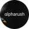 | 125595 | RUSHAI | AlphaRushAI |
|  | 90919 | AMV | Avatar Musk Verse |
|  | 81593 | BEC | Betherchip |
|  | 77061 | AIZA | AizaWorld |
|  | 49217 | PYE | Creampye |
|  | 44194 | XTRM | XTRM |
|  | 124005 | COCO | 0xCoco |
|  | 68817 | MWG | MotionWreck Games |
| 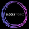 | 70569 | BLKZ | BlocksWorkz |
|  | 67257 | GREYHOUND | Greyhound |
|  | 67557 | CX1 | ChorusX |
|  | 64205 | ERR | Coinerr |
|  | 65293 | FF | Forefront |
|  | 111771 | $TYRION | Tyrion.finance |
|  | 71213 | B8T | B8DEX |
|  | 61747 | BES | battle esports coin |
|  | 60115 | AMC | AMC Fight Night |
|  | 59701 | 4JNET | 4JNET |
|  | 47013 | IFEX | Interfinex Bills |
|  | 47019 | FR | Freedom Reserve |
|  | 48003 | XCZ | XChainZ |
|  | 45903 | AITRA | AITRA |
|  | 45121 | FLL | Feellike |
|  | 33846 | MPAY | MenaPay |
|  | 3603 | DOLLAR | Dollar Online |
|  | 126757 | TRK | Torekko |
|  | 125865 | FLMC | FleaMint |
|  | 126327 | XAIGROK | XAIGROK |
|  | 126425 | ORCAINU | ORCA INU |
|  | 124081 | DTR | Dotori |
|  | 123575 | HALLOWEEN | HALLOWEEN |
|  | 115497 | XINU | XINU |
|  | 115527 | ORDI2 | ORDI 2.0 |
|  | 115567 | PUFFIN | Puffin Global |
|  | 113737 | QTX | Quantum X |
|  | 113725 | SXM | SaxumDAO |
| 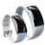 | 112293 | IWELL | I WELL TRACK PRO |
| 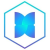 | 112815 | MINTI | Minti |
|  | 90819 | ALF | AlfProtocol |
|  | 80675 | NXDT | NXD Next |
|  | 79779 | TRMX | TourismX |
|  | 78943 | ELAN | Elan |
|  | 60377 | CDS | Crypto Development Services |
|  | 61731 | WEFIN | eFin Decentralized |
|  | 56319 | ARTI | Arti Project |
| 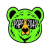 | 113653 | PAPA2049 | papa2049 |
|  | 55929 | PXLC | Pixl Coin |
|  | 45933 | HLP | HLP Token |
|  | 33479 | BLTG | Block-Logic |
|  | 113319 | CRESCITE | Crescite |
| 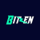 | 80947 | BZEN | Bitzen |
|  | 69045 | SCAM | Simple Cool Automatic Money |
|  | 58251 | DTO | DotOracle |
|  | 34645 | TRAD | Tradcoin |
|  | 78349 | APOLLO | Apollo Crypto |
|  | 97873 | NEAT | Neatio |
|  | 97255 | MSHIB | Magic Shiba Starter |
|  | 124059 | STR | Sourceless |
|  | 70453 | LEGO | Lego Coin |
| 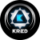 | 61625 | KRED | KRED |
|  | 46710 | LYR | Lyra |
|  | 44159 | XFG | Fango |
|  | 122741 | TELLER | Teller |
|  | 114193 | XSMB | Northern Lottery |
|  | 36484 | TN | TurtleNetwork |
|  | 88117 | MEMAG | Meta Masters Guild |
|  | 81011 | MMAPS | MapMetrics |
|  | 115193 | EDNS | EDNS Token |
|  | 112227 | YOHO | HK.Chat |
|  | 94613 | ITLR | iTeller |
|  | 71461 | ICB | Incube Chain |
|  | 113281 | BETROCK | Betrock |
|  | 70509 | ASTROC | Astroport Classic |
|  | 59723 | FABRIC | MetaFabric |
|  | 56689 | HEGG | Hummingbird Egg Token |
|  | 45450 | SALE | DxSale Network |
|  | 111535 | $FAST | PodFast |
|  | 90771 | MTY | Viddli |
|  | 96927 | VIZ | Vision City |
|  | 96855 | WED | Wednesday Inu |
|  | 88875 | SHIN | Shinsekai |
|  | 70141 | LIC | Lightening Cash |
|  | 122445 | PABLO | PABLO DEFI |
|  | 113283 | BHD1 | BHD1 |
| 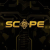 | 113177 | SCOPE | Scope Sniper |
|  | 94355 | SAUDIPEPE | SAUDI PEPE |
|  | 64867 | FLOOR | FloorDAO |
|  | 49759 | REDPANDA | RedPanda Earth |
|  | 86867 | SML | Saltmarble |
|  | 87149 | $CRYPT | Secret Skellies Society |
|  | 61071 | SCARD | SCARDust |
|  | 125159 | BULLMOON | Bull Moon |
|  | 112357 | NUDE | 0xNude |
|  | 47195 | MDZA | Medooza Ecosystem |
|  | 112361 | 0XT | 0xTools |
|  | 113317 | CRMT | Cremate |
|  | 98605 | WHEE | WHEE |
|  | 98555 | LOYAL | Loyalty Labs |
|  | 88459 | CYMI | CryptMi |
|  | 88053 | TRENDAI | TrendAI |
|  | 86581 | SODATSU | Sodatsu |
|  | 66263 | NFT11 | NFT11 |
|  | 32744 | APR | APR Coin |
|  | 99809 | CHOICE | Choice Coin |
|  | 111659 | ZIZY | Zizy |
|  | 99879 | HDL | Headline |
|  | 82491 | DEXO | DEXO |
|  | 54459 | BABYDOUG | Baby Doug |
|  | 33721 | CVNT | Content Value Network |
|  | 112793 | LEET | LEETCoin |
|  | 98863 | GOMINT | Algomint |
|  | 66813 | FRZSS | Frz Solar System |
|  | 64375 | MEISHU | Meishu |
|  | 58859 | WAIFER | Waifer |
|  | 44153 | LSV | Litecoin SV |
|  | 55365 | BABY EVERDOGE | Baby EverDoge |
|  | 125775 | BAHAMAS | Bahamas |
|  | 69119 | DANDY | Dandy Dego |
|  | 67965 | PIXL | Pixels.so |
|  | 114465 | HRCC | HRC Crypto |
|  | 113275 | BANGER | BANGER |
|  | 67767 | AVAI | Orca AVAI |
|  | 113825 | NCWW | Nuclear Waste Water |
|  | 78745 | KALE | Bluelight |
|  | 114455 | INTD | INTDESTCOIN |
|  | 113393 | FSNIPE | FriendSniper |
|  | 44929 | NIT | Nesten |
|  | 112737 | IGNT | Ignite The Chain |
|  | 113521 | VOCARE | Vocare ex Machina |
|  | 59515 | BTCBR | Bitcoin BR |
|  | 112837 | VELOS | VelosBot |
|  | 87945 | AZK | AnonZK |
|  | 86007 | BPTL | BlockPortal |
|  | 60479 | BTRFLY | Redacted Cartel |
|  | 113453 | GOYOO | GoYoo |
|  | 112349 | 0XCON | 0xConnect |
|  | 94391 | SPGBB | SPGBB |
|  | 63261 | MDAO | Metaverse DAO |
|  | 56117 | FCF | French Connection Finance |
|  | 123045 | BIDEN2024 | BIDEN 2024 |
|  | 96643 | SHOOTER | Top Down Survival Shooter |
|  | 62959 | CSX | Coinstox |
|  | 2877 | BCPT | BlockMason Credit Protocol |
|  | 113251 | ASPC | Astropup Coin |
|  | 112519 | CALIC | Calico Cat |
|  | 93941 | IPISTR | Shorter Finance |
|  | 80037 | SWISSNFTFUND | Swiss NFT Fund |
|  | 80889 | CIC | Crazy Internet Coin |
|  | 60889 | LTEX | Ltradex |
|  | 56119 | DATE | SolDate Token |
|  | 51549 | SMSCT | SMSCodes |
|  | 46009 | YEP | YEP COIN |
|  | 111581 | ARCAS | Arcas |
|  | 91171 | R3T | Real Estate Token |
|  | 79689 | LKD | LinkDao |
|  | 59389 | LTNM | Bitcoin Latinum |
|  | 55621 | TP3 | Token Play |
|  | 51119 | PIST | Pist Trust |
|  | 46712 | BMP | Brother Music Platform |
|  | 33326 | AGVC | AgaveCoin |
|  | 115321 | TXG | TRUSTxGAMING |
|  | 113659 | P2P | Peer-to-Peer |
|  | 85833 | PAD | NearPad |
|  | 78407 | KIRA | KIRA |
|  | 79315 | PIP | Pi Protocol |
|  | 70557 | WZEC | Wrapped Zcash |
|  | 68367 | IBY | iBetYou |
|  | 68093 | CLNY | Colony Network Token |
|  | 66635 | WKDA | Wrapped Kadena |
|  | 65575 | LEAG | LeagueDAO Governance Token |
|  | 56857 | QUARTZ | Sandclock |
|  | 58291 | STANDARD | Stakeborg DAO |
|  | 56457 | ENTR | EnterDAO |
|  | 55761 | RMX | RemeX |
|  | 46738 | PRV | Privacy |
|  | 44553 | FMA | Flama |
|  | 43015 | VX | VX |
|  | 42938 | DUN | Dune |
|  | 44722 | COL | Unit Protocol |
|  | 42603 | PEG | PegNet |
|  | 115343 | BITCOIN1 | HarryPotterObamaSonic11Inu |
|  | 112813 | MINNA | Minnapad |
|  | 113405 | FNY | Funny Money |
|  | 112877 | WOFO1 | WORLD FOOTBALL1 |
|  | 115159 | FOXAI | FOXAI |
| 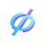 | 113051 | PHAROS | Pharos |
|  | 113127 | SQUID2 | Squid Game 2.0 |
|  | 115339 | XCOM | X.COM |
|  | 112465 | BIGPANDA | BIGPANDA |
|  | 115453 | DOGSROCK | Dogs Rock |
|  | 100069 | UCF | UC Finance |
|  | 96471 | PNB | Pink BNB |
|  | 96997 | AIEN | AIENGLISH |
|  | 90275 | SBG | SB Group |
|  | 94847 | HYPES | Supreme Finance HYPES |
|  | 80887 | VRS | VRES |
|  | 69469 | OKLP | OkLetsPlay |
|  | 60901 | GDO | GroupDao |
| 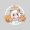 | 58883 | GFLOKI | GenshinFlokiInu |
|  | 52265 | RDPX | Dopex Rebate Token |
|  | 53531 | BFLY | Butterfly Protocol |
|  | 50565 | VLK | Vulkania |
|  | 36585 | IOEX | ioeX |
|  | 113895 | FOE | Family Over Everything |
|  | 42220 | NEWS | PUBLISH |
|  | 93969 | KEES | Korea Entertainment Education & Shopping |
|  | 67627 | CYN | Cycan Network |
|  | 68683 | GYC | GameYoo |
|  | 51407 | BAKT | Backed Protocol |
|  | 49021 | KGO | Kiwigo |
| 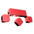 | 100289 | EMGS | EMG SuperApp |
|  | 33084 | TV | Ti-Value |
|  | 3729 | DSR | Desire |
|  | 33450 | TTN | Titan Coin |
|  | 71503 | SAUDISHIB | SAUDI SHIBA INU |
|  | 112545 | CLICKART | Clickart.ai |
|  | 113299 | HIBA | Coinhiba |
|  | 115601 | IBFN | IBF Net |
|  | 115553 | GOJOCOIN | Gojo Coin |
|  | 115361 | DUB | DubX |
|  | 102451 | BPEPEF | Baby Pepe Floki |
|  | 97561 | SKPEPE | Sheikh Pepe |
|  | 100235 | CTUS | Contractus |
|  | 97929 | RKI | RAKHI |
|  | 97629 | STUART | Stuart Inu |
|  | 97539 | PEPEDERP | PepeDerp |
|  | 96251 | ROTTO | Rottoken |
|  | 96667 | URS | URUS |
|  | 90299 | DIFI | Digital Files |
|  | 81529 | TEP | Tepleton |
|  | 76927 | GWSPP | GoldenWspp |
|  | 69771 | HDT | Hold Diamond |
|  | 69677 | EKX | EnkiX |
|  | 67213 | ABBUSD | Wrapped BUSD (Allbridge from BSC) |
|  | 67753 | SCTK | Sparkle Coin |
|  | 65233 | CPD | CoinsPaid |
|  | 63815 | XTR | Xtremcoin |
|  | 60939 | COMT | Community Metaverse |
|  | 60933 | VPL | Viplus |
| 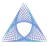 | 58877 | AXUS | Axus Coin |
|  | 57027 | MPLAY | MetaPlay |
|  | 55745 | OMNIS | OMNIS |
|  | 54935 | BAE | BAE |
|  | 51785 | ALLOY | HyperAlloy |
|  | 51113 | MTM | Momentum Token |
|  | 49423 | PETAL | bitFlowers |
|  | 49599 | BSCB | BscBond |
|  | 46740 | CLA | Candela Coin |
|  | 47183 | BTSHK | Bitshark |
|  | 47043 | TRISM | Trism |
|  | 46709 | YFIIG | YFII Gold |
|  | 45297 | TNR | Tonestra |
|  | 45102 | KFX | KnoxFS |
|  | 44555 | MNMC | MNMCoin |
|  | 44142 | BNOX | BlockNoteX |
| 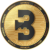 | 44864 | BITH | Bithachi |
|  | 42530 | TUN | TUNE |
|  | 42156 | VTAR | Vantaur |
|  | 42788 | MHSP | MelonHeadsProtocol |
|  | 42432 | ROGER | TheHolyRogerCoin |
|  | 41969 | BTCX | BitcoinXGames |
|  | 34769 | SCP | SCPrime |
|  | 34721 | OMEGA | OMEGA |
|  | 36533 | RNRC | RocknRainCoin |
|  | 36399 | JAN | CoinJanitor |
|  | 34689 | ALTM | Altmarkets Coin |
|  | 34488 | EGOLD | eGold |
|  | 33624 | PLUS1 | PlusOneCoin |
|  | 33426 | SFCP | SF Capital |
|  | 33237 | SCOL | SColcoin |
|  | 33052 | DIN | Dinero |
|  | 33026 | TSC | Thunderstake |
|  | 33053 | HTH | Help The Homeless Coin |
|  | 32785 | EDR | Endor Protocol |
|  | 3635 | JS | JavaScript Token |
|  | 12380 | PNX | Phantomx |
|  | 505 | SMLY | SmileyCoin |
|  | 372 | BBP | Biblepay |
|  | 78449 | SPIRAL | Up Spiral |
|  | 115359 | XSHIBA | XShiba Inu |
|  | 65289 | DGE | DarleyGo Essence |
|  | 65965 | SNP | Synapse Network |
|  | 68009 | YLA | Yearn Lazy Ape |
|  | 68891 | SOLC | Solcubator |
|  | 51399 | CENX | Centralex |
|  | 50495 | GLXC | Galaxy Coin |
|  | 96831 | BBPP | Baby Pepe |
|  | 58839 | PNFT | Pawn My NFT |
|  | 47843 | DEOR | Decentralized Oracle |
|  | 112205 | DCXEN | dcXEN |
|  | 42200 | DDR | Digi Dinar |
|  | 33722 | DAPS | DAPS Coin |
|  | 114867 | COPIUM | Copium |
|  | 102761 | KONG | KONG |
|  | 98945 | BERC | Fair BERC20 |
|  | 77939 | UNIC | Unicly |
|  | 69929 | DOGBOSS | Dog Boss |
|  | 62745 | GTON | GTON CAPITAL |
|  | 51471 | STEAMX | Steam Exchange |
|  | 32533 | LOCI | LOCIcoin |
|  | 112163 | DOBBY | DorkOrdinalBitcoinBinance |
|  | 66531 | THUNDERBNB | ThunderBNB |
|  | 67163 | BUGG | BUGG Finance |
|  | 69287 | T1NY | Tiny Bonez |
|  | 34760 | XSR | SucreCoin |
| 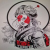 | 79215 | MIKOTO | Tsukuyomi-no-Mikoto |
| 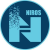 | 61375 | NIROS | Niros |
|  | 113279 | BETIT | BetIT |
|  | 54529 | DOGECOLA | DogeCola |
|  | 51193 | MICN | Mindexnew |
|  | 97979 | GMFAM | GMFAM |
|  | 94901 | ANKAA | Ankaa Exchange |
|  | 80479 | KOSON | Age of Zalmoxis KOSON |
|  | 115265 | DZ | DecentralZone |
| 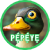 | 115205 | PEPEYE | PEPEYE |
|  | 115449 | SIMPSON6900 | Simpson6900 |
|  | 115405 | STARWARS | Star Wars |
|  | 115353 | PACMAN | Pac Man |
|  | 113117 | SDP | SOPDAP AI |
|  | 113109 | AIBUDDY | ShoppingFriend.AI |
|  | 113471 | LIEFLAT | LieFlat |
|  | 112277 | INSR | Insurabler |
|  | 112207 | HAPPYCAT | HAPPYCAT |
|  | 102589 | WVC | World Virtual Coin |
|  | 97493 | SODO | Scooby Doo |
|  | 97505 | 3D3D | 3d3d |
|  | 97401 | PUMBAA | Pumbaa |
|  | 97297 | AIDOGEX | AI DogeX |
|  | 101925 | ENIX | ASENIX |
|  | 94225 | PANDAI | PandAI |
| 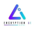 | 93863 | 0XENCRYPT | Encryption AI |
|  | 70935 | KOLNET | KOLNET |
|  | 70797 | HATI | Hati |
|  | 53643 | VYNC | VYNK CHAIN |
|  | 47929 | PHOON | Typhoon Cash |
|  | 66999 | SBNK | Solbank Token |
|  | 67289 | ASC | Ashward Coin |
|  | 112477 | BISHOP | Bishop |
|  | 68149 | WMEMO | Wonderful Memories |
|  | 114911 | NOIS | Nois Network |
|  | 94069 | MGN | Mugen Finance |
|  | 79239 | VINA | VICUNA |
|  | 76439 | SKC | SKINCHAIN |
|  | 68911 | KUKY | Kuky Star |
|  | 41846 | GIG | GigEcoin |
|  | 80747 | WT | Wohlstand |
|  | 68505 | EBUSD | EarnBUSD |
|  | 60273 | LDN | Ludena Protocol |
| 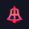 | 85439 | ALERT | ALERT |
|  | 100339 | OPERA | Opera Protocol |
|  | 56919 | AKAMARU | Akamaru Inu |
|  | 113163 | SAFUCZ | SAFU CRYPTO CZ |
|  | 102413 | PEPEBURN | Pepeburn |
| 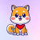 | 61607 | BABYSHIBA | Baby Shiba Coin |
|  | 64025 | MPLGR | Pledge Finance |
|  | 54961 | BAIT | Baitcoin |
|  | 115251 | SAUDIRAPTOR | SAUDI RAPTOR |
| 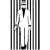 | 94227 | PANTO | Pantomime |
|  | 82415 | HLM | Healium |
|  | 79739 | UZRS | UZUROCKS |
| 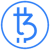 | 81397 | TZBTC | tzBTC |
|  | 78757 | AKN | Akoin |
|  | 79341 | CWC | CrypWorld |
|  | 70539 | ANTE | AnteDAO |
|  | 70483 | HRTS | YellowHeart Protocol |
|  | 77965 | MUNT | Munt |
|  | 71525 | TRZ | Trazable |
|  | 69717 | MTRA | MetaRare |
|  | 69403 | DVK | Devikins |
|  | 67937 | GPYX | GoldenPyrex |
|  | 65763 | ARTIC | ARTIC Foundation |
|  | 60233 | APXP | APEX Protocol |
|  | 61287 | GPX | GPEX |
|  | 60245 | GRNC | VeganNation GreenCoin |
|  | 61523 | EPTT | Evident Proof Transaction Token |
|  | 61825 | 1PECO | 1peco |
|  | 61259 | 1ECO | 1eco |
|  | 59401 | ARTII | ARTII Token |
|  | 56451 | DFCH | DeFi.ch |
|  | 57503 | MYCE | MY Ceremonial Event |
|  | 55755 | DAF | DaFIN |
|  | 55187 | DMR | Dreamr |
|  | 50235 | FOL | Folder Protocol |
|  | 51577 | DRE | DoRen |
|  | 50563 | TEA | Tea Token |
|  | 49937 | MYID | My Identity Coin |
|  | 49783 | CTPL | Cultiplan |
|  | 49321 | ICA | Icarus Finance |
|  | 48957 | SMG | Smaugs NFT |
|  | 49143 | WXBTC | Wrapped xBTC |
|  | 48327 | ROC | Roxe |
|  | 49625 | IQQ | Iqoniq |
|  | 47098 | ACXT | AC eXchange Token |
|  | 47088 | CBANK | Crypto Bank |
|  | 46493 | ZILD | Zild Finance Coin |
|  | 46039 | ECELL | Consensus Cell Network |
|  | 44877 | MOV | MOTIV Protocol |
|  | 33546 | VBK | VeriBlock |
|  | 32499 | INSTAR | Insights Network |
|  | 67 | FLO | FlorinCoin |
|  | 74 | SPHR | Sphere |
|  | 138 | UBQ | Ubiq |
|  | 39 | IOC | I/O Coin |
|  | 90149 | MADOG | MarvelDoge |
|  | 50721 | FFA | Cryptofifa |
|  | 102275 | CHORIZO | Chorizo |
|  | 78855 | ROO | Lucky Roo |
| 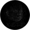 | 58005 | XAEA12 | X AE A-12 |
|  | 65595 | CRYY | Cry Coin |
|  | 66449 | DEGN | Degen |
|  | 79769 | DOA | Doaibu |
| 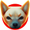 | 86301 | SHIBGUN | Shibagun |
|  | 51507 | CAPT | Captain |
|  | 95039 | $FLUFFY | Fluffy Token |
|  | 67523 | CONDOMS | SolCondoms |
|  | 63957 | MEDOC | MetaDoctor |
|  | 47813 | DXF | Dexfin |
|  | 42899 | DDRT | DigiDinar Token |
|  | 76431 | CUR | Curio |
|  | 67051 | ITG | iTrust Governance Token |
|  | 71515 | KUT | KlayUniverse |
|  | 60659 | TALI | Talaria Inu |
|  | 56945 | ECOP | Eco DeFi |
|  | 50357 | DAIN | Dain Token |
|  | 78635 | GGCM | Gold Guaranteed Coin |
|  | 57341 | SHAK | Shakita Inu |
|  | 76527 | YFID | YFIDapp |
|  | 70109 | ORBC | Orbis |
|  | 65065 | SRY | Serey Coin |
|  | 52251 | ASEC | ASEC Frontier |
|  | 53841 | ZINA | Zinari |
|  | 50885 | BKING | King Arthur |
|  | 48271 | VIDA | Vidiachange |
|  | 47029 | RANK | Rank Token |
|  | 47134 | DNC | Danat Coin |
|  | 45223 | FME | FME |
|  | 99397 | DVDOGE | DiviDoge |
|  | 100283 | GUPPI | Guppi Finance |
|  | 70015 | TAILS | Tails |
|  | 50817 | VEED | VEED |
|  | 50367 | HXN | Havens Nook |
|  | 46598 | JEM | Jem |
|  | 2151 | CREA | CreativeCoin |
|  | 69327 | METR | Metria Network |
|  | 42223 | NSS | NSS Coin |
| 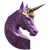 | 100075 | UNICHAD | Unichad |
| 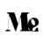 | 115415 | MEGODS | MeGods |
|  | 99941 | XCHAIN | X-Chain |
|  | 48731 | CARDS | Cardstarter |
|  | 50423 | EGGPLANT | Eggplant |
|  | 85099 | ONIGI | Onigiri Neko |
|  | 60991 | ORGN | OragonX |
|  | 60091 | COINMAMA | MamaVerse |
|  | 115391 | PEPEA | ALL IN PEPE |
|  | 100239 | CRST | Coorest |
|  | 76619 | BTDMD | BitDiamond |
|  | 81221 | BASAN | Basan |
|  | 33356 | ZT | ZBG Token |
|  | 78039 | BNI | Bitindi Chain |
|  | 58485 | WGMI | WGMI |
|  | 51665 | SIMBA | Simba Token |
|  | 100913 | SWDTKN | Swords of Blood |
|  | 100229 | BOGEY | Bogey |
|  | 97139 | PEPERA | PEPERA |
|  | 81019 | LWD | Landworld |
|  | 71579 | CASHZ | CashZone |
|  | 36413 | DAPPT | Dapp Token |
|  | 98541 | BNBDOG$ | BnBdognetwork |
|  | 98507 | PEPEGA | Pepe GEM AI |
|  | 98567 | HONG | HONGKONG INU |
|  | 98177 | NARCO | Mr. Narco |
|  | 98443 | ARU | Aruna |
|  | 90641 | BUMBLEC | Bumble-C |
| 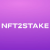 | 89959 | NFT2$ | NFT2STAKE |
|  | 90319 | METT | MetaThings |
|  | 86219 | CMPN | Companion |
|  | 62901 | CNYX | CanaryX |
|  | 57893 | ZUNA | Zuna |
|  | 58785 | BABYTK | Baby Tiger King |
|  | 46195 | JNTR | Jointer |
|  | 96725 | EFBAI | EuroFootball AI |
|  | 90187 | CHIN | Chin |
|  | 94413 | BPTC | Tomato Coin |
|  | 89819 | 3QT | 3QT |
|  | 77169 | PVERSE | PornVerse |
|  | 66361 | SHIBGEKI | Shibgeki |
|  | 90143 | ESCROW | Cryptegrity DAO |
|  | 89401 | TCOIN | Travel Coin |
|  | 90953 | LEVX | Leverage Protocol |
|  | 82641 | AROR | Arora |
|  | 78989 | FLOH | Halloween Floki |
|  | 71513 | NFTN | NFTNetwork |
|  | 76959 | MRT | Meta Rewards Token |
|  | 70223 | DELOT | DELOT.IO |
|  | 58587 | SHIBABNB | ShibaBNB.org |
|  | 49891 | EARNX | EarnX |
|  | 48913 | YOP | Yield Optimization Platform & Protocol |
|  | 96381 | USHA | uShark |
|  | 66355 | TSR | Tesra |
|  | 61067 | MNU | NirvanaMeta |
|  | 63525 | SKUY | Sekuya |
|  | 94635 | KEKYA | Kekya |
|  | 87075 | WAGIE | WAGIE |
|  | 66821 | RGEN | Paragen |
|  | 59749 | WSDQ | Wasdaq Finance |
|  | 57435 | LXF | LuxFi |
|  | 49633 | MOONPAW | MoonPaw |
|  | 44059 | ECU | Decurian |
|  | 42599 | 1GOLD | 1irstGold |
|  | 98735 | BRIBIT | BerylTrioChain |
|  | 86101 | SWIFY | Swapify |
|  | 52031 | XBE | XBE Token |
|  | 42596 | VNXLU | VNX Exchange |
|  | 51651 | SK | SideKick Token |
|  | 33828 | ADMN | ADIOMAN |
|  | 69363 | EXIST | Exist |
|  | 59533 | LEZ | Peoplez |
| 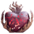 | 78459 | RHLLOR | Token of Fire |
|  | 69725 | VRBLOCKS | VR Blocks |
|  | 65741 | SIFU | Sifu Vision |
| 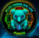 | 99419 | FUC | Funny Coin |
|  | 79299 | WUKONG | Monkey King |
| 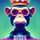 | 80569 | BOREDM | BoredMemes |
|  | 70597 | OTHR | OtherDAO |
|  | 50277 | ETIT | eTitanium |
| 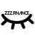 | 47173 | ZZZV2 | zzz.finance v2 |
|  | 98877 | GPTG | GPT Guru |
|  | 48975 | BASK | BasketDAO |
|  | 98869 | QORT | Qortal |
|  | 96753 | BETT | BedlingtonTerrierToken |
|  | 80537 | NRB | Neorbit |
|  | 55057 | IVG | IVOGEL |
|  | 46718 | BTLLR | Betller Coin |
|  | 44217 | ICOL | Icolcoin |
|  | 44590 | MLR | Mega Lottery Services Global |
|  | 90091 | CNLT | Cannaland Token |
|  | 66287 | RIFF | MetaTariff |
| 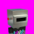 | 59863 | MBBT | MeebitsDAO Pool |
|  | 79479 | VXXL | VXXL |
|  | 69445 | ALGOBLK | AlgoBlocks |
| 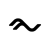 | 65073 | NERIAN | Nerian Network |
|  | 63585 | MSTO | Millennium Sapphire |
|  | 60161 | AMZE | The Amaze World |
|  | 56013 | GHC | Galaxy Heroes Coin |
| 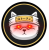 | 57653 | RYOSHIMOTO | Ryoshimoto |
|  | 86275 | JCHF | Jarvis Synthetic Swiss Franc |
|  | 71057 | YUCJ | Yu Coin |
|  | 55399 | MEME20 | MEME LTD |
|  | 94821 | SCOOBY | SCOOBY |
|  | 78601 | SHINSHU | Shinshu Inu |
|  | 94493 | BPEPE | BasedPepe |
|  | 67733 | HELPS | HelpSeed |
|  | 97987 | LBVV | LBViVi |
|  | 97343 | SHROOMS | SHROOMS AI |
|  | 98349 | PPRNI | Peperonni |
|  | 96905 | DOGEBLUE | Doge Blue |
|  | 98573 | HKB | HongKong BTC bank |
| 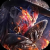 | 98583 | IS | Injustice Samurai |
|  | 98203 | TRUMPINU | Trump Inu |
|  | 97593 | SIMPSONSINU | The Simpsons Inu |
|  | 82179 | VRH | Versailles Heroes |
|  | 86799 | PROXY | Proxy Swap |
|  | 81253 | PAXW | pax.world |
|  | 67687 | DAMA | DAMA |
| 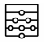 | 68639 | AVAK | Avakus |
|  | 60947 | MREIT | MetaSpace REIT |
|  | 56043 | BORUTO | Boruto Inu |
|  | 95051 | FROKI | Froki |
|  | 65435 | MFO | MoonFarm Finance |
|  | 60281 | HUH | HUH |
|  | 69175 | 300 | Spartan |
|  | 63981 | ARTEQ | artèQ NFT Investment Fund |
|  | 58529 | OKLG | ok.lets.go. |
|  | 41578 | XPN | PANTHEON X |
|  | 3740 | ERC20 | ERC20 |
|  | 78165 | TFLOW | TradeFlow |
|  | 80415 | OKINU | Arcade Canine |
|  | 87125 | PIXIA | PixiaAI |
|  | 51243 | BUDA | BudaCoin |
|  | 46614 | MOL | Molten |
|  | 94579 | DOOMER | Doomer.AI |
|  | 70255 | LILFLOKICEO | LilFlokiCeo |
|  | 76435 | WCC | WinCash |
|  | 33429 | TOSC | T.OS |
|  | 33013 | LOBS | Lobstex |
|  | 45471 | AUOP | Opalcoin |
|  | 99475 | LAINESOL | Laine Stake |
|  | 81591 | FFYI | Fiscus.fyi |
|  | 81599 | UFFYI | Unlimited FiscusFYI |
|  | 54067 | TTF | TurboTrix Finance |
|  | 46698 | WANATHA | Wrapped ANATHA |
|  | 44983 | WMA | weeMAT |
|  | 36351 | PHT | Phoneum |
|  | 51997 | VOYRME | VOYR |
|  | 46221 | MOONS | MoonTools |
|  | 100151 | 1% | The 1% Club |
| 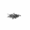 | 93989 | LINT | Lint |
|  | 69267 | BSCD | BSDium |
|  | 93919 | HLD | Hackerlabs DAO |
|  | 90281 | REDUX | ReduX |
|  | 68571 | DFS | Defis Network |
|  | 60945 | ZEOS | ZEOS |
|  | 45074 | YAS | YAS |
|  | 45245 | OGX | Organix |
|  | 41884 | TRYBE | Trybe |
|  | 42146 | BOID | Boid |
|  | 41673 | PIXEOS | PixEOS |
|  | 41898 | HVT | HireVibes |
|  | 33631 | PTI | Paytomat |
|  | 32892 | HORUS | HorusPay |
|  | 32549 | SENSE | Sense |
|  | 97441 | 100XGEMS | 100xgems |
|  | 60401 | DIQ | DiamondQ |
|  | 57227 | MARSRISE | MarsRise |
|  | 48439 | RAMEN | RamenSwap |
|  | 33079 | INO | INO COIN |
|  | 99203 | $GAIN | Gold AI Network Token |
|  | 85461 | CREDS | Creds |
|  | 87311 | GLTR | GAX Liquidity Token Reward |
|  | 81441 | LEAP | LEAP Token |
|  | 47665 | YFTE | YFTether |
|  | 47573 | IMPULSE | Impulse By FDR |
|  | 33156 | IHF | Invictus Hyperion Fund |
|  | 99543 | DSQ | DollarSqueeze |
|  | 47000 | TWA | Adventure Token |
|  | 44515 | KMW | Kepler Network |
|  | 41524 | ECR | ECreditCoin |
|  | 32425 | BITG | Bitcoin Green |
|  | 78853 | ARNM | Arenum |
|  | 68517 | VEUSD | VeUSD |
|  | 99195 | STUB | BitStubs |
|  | 71219 | WKIT | WORKIT |
|  | 56131 | VLTY | Vaulty Token |
|  | 99503 | MAW | MAW |
|  | 81911 | ACDX | Acadex Network |
|  | 57013 | $MAINST | BuyMainStreet |
|  | 89911 | YEON | Yeon |
|  | 86491 | TUPAN | Tupan |
|  | 86995 | HSE | Hest stake |
| 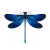 | 93861 | DRFLY | Dragon Fly |
|  | 47683 | FAMILY | The Bitcoin Family |
|  | 90199 | FCTR | Factor Dao |
|  | 95911 | SROCKET | Stable One Rocket |
|  | 79823 | BFIGHT | BARFIGHT |
|  | 70725 | BAIL | SolPatrol Bail |
|  | 70237 | ZENO | Zeno Inu |
|  | 66959 | XQK | XQuake |
| 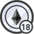 | 66345 | PETH18C | pETH18C |
|  | 65493 | SOLAB | Solabrador |
|  | 64077 | RBI | Durham Inu |
|  | 60469 | ERON | ERON |
|  | 54743 | GSAIL | SolanaSail Governance Token |
|  | 97395 | THING | Nothing Token |
|  | 97113 | OGMF | CryptoPirates |
|  | 97289 | BTCPEP | BitcoinPepe |
|  | 96799 | BCG | BlockChainGames |
|  | 95045 | FLUUS | FLUUS |
|  | 96039 | TYP | The Youth Pay |
|  | 97405 | GUSTA | Me Gusta |
|  | 96989 | AIHULK | AIHulk |
|  | 94159 | URD | UrDEX Finance |
|  | 97575 | ORJVR | OrjinVR |
|  | 90235 | YOM | YOM |
|  | 68451 | FEN | First Ever NFT |
|  | 46217 | SWG | Swirge |
|  | 36374 | UEC | United Emirate Coin |
|  | 81447 | SOWL | SOWL |
|  | 50145 | DFM | DeFi on MCW |
|  | 36460 | MBN | Membrana |
|  | 94245 | RELAX | Relaxable |
|  | 80399 | KODACHI | Kodachi Token |
|  | 97433 | YUN | Y U No Guy |
|  | 36407 | HOSP | Hospital Coin |
|  | 46670 | UNIDX | UniDex |
|  | 94477 | ASTRAL | Astral AI |
|  | 88229 | $AI | Alpha Intelligence |
|  | 89993 | TY | Takyon |
|  | 58601 | ESHK | eShark Token |
|  | 79515 | KOYO | Yofune Nushi |
| 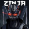 | 67571 | Z | Zinja |
|  | 60649 | HINU | Hayate Inu |
| 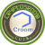 | 82501 | CROOM | Cryptosroom |
|  | 77251 | P2PTXT | P2P Taxi Token |
|  | 32948 | VIN | VINchain |
| 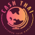 | 82109 | CTHAI | CASHTHAI |
|  | 71447 | BANKERS | BullBankers |
|  | 66387 | SHINJA | Shibnobi |
|  | 55387 | EBS | Ebisu Network |
|  | 79285 | POSS | Posschain |
|  | 46006 | YFF | YFF.Finance |
|  | 33094 | SDA | Six Domain Chain |
|  | 33481 | BETHER | Bethereum |
|  | 32984 | PTT | Proton Token |
| 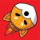 | 94273 | $SHIBP | Shibarium Pad |
|  | 79753 | STLE | Saint Ligne |
|  | 67057 | 2CRZ | 2crazyNFT |
|  | 79853 | FWCL | Legends |
|  | 61199 | OUSE | Ouse |
|  | 44787 | CUSDT | cUSDT |
|  | 70811 | BITCCA | Bitcci Cash |
|  | 96125 | JPC | JPEX |
|  | 86395 | OKSE | Okse |
|  | 51449 | SAFEEARTH | SafeEarth |
|  | 85005 | DXP | Vela Exchange |
|  | 67253 | SAMU | Samusky Token |
|  | 66687 | ENX | ENEX |
|  | 64863 | STACK | StackOS |
|  | 59873 | BRAINS | Brainiac |
|  | 56235 | DEKU | Deku Inu |
|  | 32348 | POA | POA Network |
|  | 69965 | WCV | Wellness Convertible |
|  | 60171 | INF | Infam |
|  | 59555 | VITC | Vitamin Coin |
|  | 59153 | GA | Golden Age |
|  | 57195 | AMPLE | AmpleSwap |
| 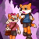 | 98627 | EWW | EndlessWebWorlds |
|  | 78585 | GOO | Art Gobblers Goo |
|  | 53897 | POLO | NftyPlay |
|  | 44428 | PYRK | Pyrk |
|  | 96675 | FRZSSCOIN | FRZ Solar System Coin |
|  | 67647 | ETHK | OEC ETH |
| 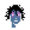 | 98029 | RBE | Rebate Coin |
| 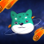 | 68329 | PLANETINU | Planet Inu |
|  | 71417 | FAS | Fasst |
|  | 49201 | LQDR | LiquidDriver |
|  | 96755 | WBESC | Wrapped BESC |
|  | 99139 | INEDIBLE | INEDIBLE |
|  | 81479 | USDAP | BondAppetite USD |
|  | 70781 | INMES | Inme Swap |
|  | 65539 | BAG | BondAppetit Governance Token |
| 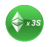 | 43150 | ETC3S | ETC3S |
| 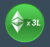 | 42904 | ETC3L | ETC3L |
| 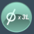 | 42948 | ATOM3L | ATOM3L |
|  | 42626 | BTC3S | BTC3S |
| 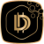 | 44992 | DION | DionCoin |
|  | 43209 | MOZOX | MozoX |
|  | 36465 | SWACE | Swace |
|  | 89385 | WOL | World of Legends |
|  | 68399 | FTR | Future |
|  | 66189 | COOHA | CoolMining |
|  | 59045 | ILA | Infinite Launch |
|  | 55533 | SNOOP | SnoopDoge |
|  | 69265 | DDDX | DDDX Protocol |
| 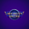 | 66425 | INAZ | Infinity Arena |
|  | 51437 | CELEB | Celeb |
|  | 98205 | REEE | Sold Early |
|  | 98017 | AOL | AOL Coin |
|  | 97471 | DUDES | My Dudes |
| 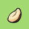 | 97833 | PSALE | PRESALE |
|  | 97835 | MRF | Mr F was here |
|  | 97173 | REKTPEPE | RektPepe |
|  | 90213 | SHIBCAT | SHIBCAT |
|  | 89977 | XCAL | 3xcalibur |
|  | 82705 | MOH | Medal of Honour |
|  | 78115 | WBM | WB-Mining |
| 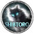 | 77139 | SHIBTORO | Shibtoro |
| 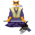 | 77009 | SHIBURAI | Shiba Samurai |
|  | 67305 | BBQ | BarbecueSwap |
|  | 65057 | PILOT | Unipilot |
| 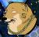 | 66313 | $CINU | CHEEMS INU |
|  | 65269 | BABL | Babylon Finance |
|  | 59613 | GAMINGSHIBA | GamingShiba |
|  | 56431 | AXNT | Axentro |
|  | 56389 | KISHIMOTO | Kishimoto Inu |
|  | 57461 | SHAMAN | Shaman King Inu |
|  | 49931 | VYN | Vyndao |
|  | 51195 | PEA | Pea Farm |
|  | 48865 | RAINI | Rainicorn |
|  | 46692 | BTOUR | BTour Chain |
|  | 43173 | BCH3L | BCH3L |
|  | 42592 | CXC | CAPITAL X CELL |
|  | 33390 | BAXS | BoxAxis |
|  | 95267 | IBP | Innovation Blockchain Payment |
|  | 67871 | MBCC | Blockchain-Based Distributed Super Computing Platform |
|  | 66549 | ELAMA | Elamachain |
|  | 57677 | XFL | Florin |
|  | 55613 | ETOS | Eternal Oasis |
|  | 55439 | WRK | BlockWRK |
|  | 53637 | LCMS | LCMS |
|  | 49037 | FMG | FM Gallery |
|  | 49123 | MSS | Monster Slayer Share |
|  | 48345 | PTR | Payturn |
|  | 47677 | RIGEL | Rigel Finance |
|  | 47729 | BREW | CafeSwap Token |
|  | 46284 | 7UP | 7up |
|  | 45368 | OCB | BLOCKMAX |
|  | 45605 | LNT | Lottonation |
|  | 44498 | PAZZI | Paparazzi |
|  | 44273 | ZASH | ZIMBOCASH |
|  | 44265 | BIP | Minter Network |
|  | 45249 | ZDC | Zodiac |
|  | 44510 | YSR | Ystar |
|  | 45272 | PICK | PICK |
|  | 44126 | GL | Green Light |
|  | 42987 | WPX | Wallet Plus X |
|  | 44100 | BASIC | BASIC |
|  | 42597 | MDM | Medium |
|  | 41591 | DVC | DragonVein |
|  | 41570 | YT | Cherry Token |
|  | 41797 | BXA | Blockchain Exchange Alliance |
|  | 36464 | OPNN | Opennity |
|  | 36437 | FLETA | FLETA |
|  | 33661 | NASH | NeoWorld Cash |
|  | 33898 | WFX | Webflix Token |
|  | 33880 | OGO | Origo |
|  | 33447 | TMTG | The Midas Touch Gold |
|  | 32884 | COSM | Cosmo Coin |
|  | 32599 | MOF | Molecular Future |
|  | 32633 | UIP | UnlimitedIP |
|  | 94917 | ARRAY | Array |
|  | 97665 | PMAN | PEPMAN |
|  | 68717 | SHERPA | Sherpa |
|  | 49645 | MOONSHOT | Moonshot |
|  | 46580 | ZLOT | zLOT |
|  | 44676 | RINGX | RING X PLATFORM |
|  | 34506 | DIC | DAIKICOIN |
|  | 94361 | BHNY | SBU Honey |
|  | 59289 | TXBIT | Txbit |
|  | 42090 | GUNTHY | GUNTHY |
|  | 99255 | $MOE | Farmer Moe |
|  | 67759 | FLWR | SOL Flowers |
|  | 79133 | AICO | Aicon |
|  | 77481 | STAR1 | Star Chain |
|  | 70283 | NEOFI | NeoFi |
|  | 67653 | NPAS | New Paradigm Assets Solution |
|  | 59281 | MNET | MINE Network |
|  | 47531 | DVG | DAOventures |
|  | 36592 | VID | VideoCoin |
|  | 99241 | SGO | SafuuGO |
| 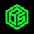 | 99033 | BULLET | Bitsniper |
|  | 99063 | $GF | Girlfriend |
|  | 97385 | PEPEKI | Pepeki |
|  | 97591 | MONGBNB | MongBNB |
|  | 96491 | MOIL | Moovy |
|  | 97413 | TRUMPARMY | Trump Army |
|  | 95069 | GGBOND | GGbond |
|  | 94797 | HELENA2 | Helena Financial V2 |
|  | 94665 | MCEO | Master CEO |
|  | 87203 | SEURO | Standard Euro |
|  | 88061 | NMSP | Nemesis PRO |
|  | 87987 | XLV | LaunchVerse |
|  | 82459 | BIB | BIB Token |
|  | 80127 | CPTLC | Cryptolic |
|  | 78929 | ES2 | EverSAFUv2 |
|  | 78511 | HOOP | Primal Hoop |
|  | 78417 | PPM | Punk Panda Messenger |
|  | 80107 | BNBP | BNBPot |
|  | 81243 | SOLARIX | SOLARIX |
|  | 70561 | AFP | PIGS |
|  | 69845 | BURNX20 | BurnX 2.0 |
|  | 70973 | IONZ | Meta Nebulas IONZ |
|  | 69883 | MAIN | Main |
|  | 69727 | BOJI | Boji |
|  | 68403 | MATA | Mata |
|  | 67777 | RETA | Realital Metaverse |
|  | 69493 | ANATION | A-Nation |
|  | 67639 | CZUSD | CZUSD |
| 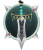 | 69507 | $TARO | Taroverse |
|  | 68975 | KGT | Kaby Gaming Token |
|  | 65479 | SOAK | Soakmont |
|  | 66165 | ATPAD | AtomPad |
|  | 66597 | HES | Hero Essence |
|  | 67155 | WAI | Wanaka Farm WAIRERE Token |
|  | 66571 | ESHARE | EMP Shares |
|  | 66767 | GSTRM | Gastream |
|  | 63673 | RMARS | REDMARS |
|  | 61771 | ACY | ACY Finance |
|  | 61811 | DIGICHAIN | Digichain Coin |
|  | 61939 | ST | Sacred Tails |
|  | 63109 | BRB | BerylBit |
|  | 61863 | BX | ByteEx |
|  | 61603 | NINKY | Ninky |
|  | 64419 | NEKOS | Nekocoin |
|  | 63113 | SHOP | Shoppi Coin |
|  | 63391 | FADO | FADO Go |
|  | 61479 | CJET | CryptoJetski |
|  | 63523 | XMETA | TTX Metaverse |
|  | 60191 | SAFEST | SafuFide |
|  | 61203 | MTW | Meta World Game |
|  | 58923 | BIHODL | BinanceHODL |
|  | 58189 | ANJI | Anji |
|  | 58025 | SURGE | Surge Inu |
|  | 57097 | 1BIT | OneBit |
|  | 57569 | TORII | Torii Finance |
|  | 57159 | MERKLE | Merkle Network |
|  | 56941 | KUBIC | Kubic |
|  | 57401 | WALL | LaunchWall |
|  | 56539 | BATH | Battle Hero |
|  | 55529 | YTOFU | yTOFU |
|  | 56095 | DNFT | DareNFT |
|  | 56485 | GEMG | GemGuardian |
|  | 56313 | WND | WonderHero |
|  | 54599 | IDTT | Identity |
|  | 49369 | CROX | CroxSwap |
|  | 45264 | FSW | Falconswap |
|  | 32582 | KCASH | Kcash |
|  | 96047 | PVK | Privok Green Enegry |
|  | 89517 | XERM | XERIUM |
|  | 79417 | UCOIL | UCONetwork |
|  | 86941 | SUKO | Retsuko |
|  | 79893 | DCU | Decentralized United |
|  | 71449 | SHINURI | Shinuri |
| 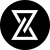 | 45956 | IPM | Timers |
|  | 85939 | ETHER | Ether Tech |
|  | 79839 | PRUF | PRüF Protocol |
|  | 79263 | EMB | Overline Emblem |
|  | 70363 | SAGAW | SagaWorld |
|  | 67989 | GREENFUEL | Greenfuel |
|  | 68569 | XRSHIB | XR Shiba Inu |
|  | 60683 | MONSTR | MonstaVerse |
|  | 45064 | TACO | Tacos |
|  | 70281 | DRYP | Dripto |
|  | 97443 | VNM | Venom |
|  | 69311 | WCSOV | CrownSterling |
|  | 52025 | BWI | Bitwin24 |
|  | 52053 | XFR | The Fire Token |
|  | 46749 | GASP | gAsp |
|  | 31190 | TNB | Time New Bank |
|  | 98807 | PEPE CEO | Pepe CEO BSC |
|  | 99117 | OSL | OSL AI |
|  | 98709 | ALMR | Almira Wallet |
|  | 95601 | FIRSTHARE | FirstHare |
|  | 90897 | RBNB | StaFi Staked BNB |
| 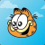 | 95057 | $GARFIELD | Garfield (BSC) |
|  | 88877 | CATSHIRA | Shira Cat |
| 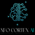 | 90501 | CORAI | NeoCortexAI |
|  | 79733 | AER | Aerdrop |
|  | 80423 | CHIPS | Chipstars |
|  | 80261 | HPAY | HedgePay |
|  | 80711 | BACK | DollarBack |
|  | 80185 | SMURF | SmurfsINU |
|  | 77151 | HOHOHO V2.0 | Santa Floki v2.0 |
|  | 78245 | ORI | HNK Orijent 1919 |
|  | 79039 | CC | CowCoin |
|  | 71375 | MHAM | Metahamster |
|  | 77991 | BRDG | Bridge Network |
|  | 69733 | ARZ | ARize |
|  | 70765 | SRBS | Super Rare Ball Shares |
|  | 70275 | DOGEY | Doge Yellow Coin |
|  | 69511 | DEFLY | Deflyball |
|  | 69305 | SINGH | Singh |
|  | 67919 | MVS | MVS Multiverse |
|  | 68861 | TGDAO | TG DAO |
|  | 68447 | GENX | GENX |
|  | 68357 | BINS | BSocial |
|  | 68351 | SCIX | Scientix |
|  | 68591 | MITA | Legends of Mitra |
|  | 68331 | GMS | GameStar |
|  | 68479 | STUD | Studyum |
| 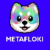 | 68557 | MFLOKI | Meta Floki |
| 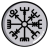 | 68397 | RXS | Rune Shards |
|  | 69099 | PERSIA | Persia |
|  | 68807 | WCCX | Wrapped Conceal |
|  | 68839 | SHIBAZILLA | ShibaZilla |
|  | 68401 | SFZ | Safemoon Zilla |
|  | 68713 | UMW | UMetaWorld |
|  | 68319 | MOONSHIB | The Moon Shiba |
|  | 68733 | LUMI | Luminos Mining Protocol |
|  | 68581 | USV | Atlas USV |
|  | 68347 | TAHU | TAHU |
|  | 67953 | LAVAX | LavaX Labs |
|  | 68949 | INP | InPoker |
|  | 67729 | AUREUSRH | Aureus Token |
|  | 68033 | PIRA | Piratera |
|  | 69043 | BAKECOIN | Bake Coin |
|  | 66525 | MONX | Monster of God |
|  | 66609 | HIMO | Himo World |
|  | 67369 | ARDN | Ariadne |
|  | 66595 | BITV | BitValley |
|  | 66205 | KOT | Kols Offering Token |
|  | 66477 | ANIA | Arkania Protocol |
|  | 66191 | SDLN | Seedling |
|  | 66915 | ETCH | ElonTech |
|  | 65777 | PLATO | Plato Game |
|  | 67065 | PAPR | Paprprintr Finance |
|  | 66139 | BABYXRP | Baby Ripple |
|  | 65761 | ROFI | HeroFi Token |
|  | 67029 | SHIBEV | ShibaElonVerse |
| 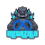 | 67011 | MZ | MetaZilla |
|  | 66409 | CRUX | CryptoMines Reborn |
|  | 65731 | SHBAR | Shilly Bar |
|  | 67615 | WTWOOL | Wolf Town Wool |
|  | 67327 | 4STC | 4-Stock |
|  | 66615 | MANY | Many Worlds |
|  | 66659 | RBO | Roboots |
|  | 65631 | BFI | Bearn.fi |
|  | 67249 | CHARGE | ChargeDeFi Charge |
|  | 66523 | CCF | Cross Chain Farming |
|  | 66509 | GOIN | GOIN |
|  | 66815 | MESA | myMessage |
|  | 66817 | OGS | Ouro Governance Share |
| 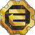 | 66507 | ECIO | ECIO Space |
|  | 66527 | STATIC | ChargeDeFi Static |
|  | 66761 | TNODE | Trusted Node |
|  | 67423 | SBANK | SafeBank BSC |
|  | 66565 | FASTMOON | FastMoon |
|  | 66849 | SAFEMONEY | SafeMoneyBSC |

---

[← Prev](./list10.md) | [Next →](./list12.md)
