[← Prev](./list11.md) | [Next →](./list13.md)

| Logo | ID | Symbol | Name |
|:----:|:--:|:------:|:-----|
| 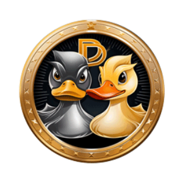 | 11767 | DD | DuckDAO |
|  | 11768 | INTD | INTDESTCOIN |
|  | 11769 | HRCC | HRC Crypto |
|  | 11770 | PLSARB | Plutus ARB |
|  | 11771 | DKUMA | KumaDex Token |
| 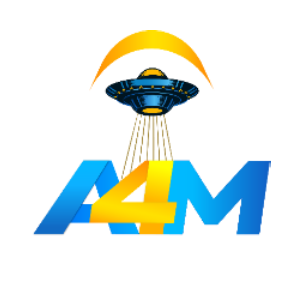 | 11772 | A4M | AlienForm |
| 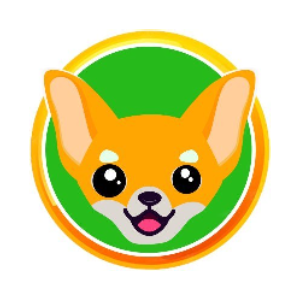 | 11773 | CHH | Chihuahua Token |
| 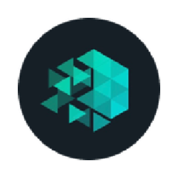 | 11774 | WIOTX | Wrapped IoTeX |
| 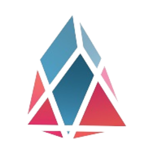 | 11775 | TANG | Tangent |
| 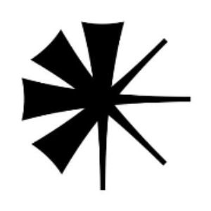 | 11776 | ENQAI | enqAI |
| 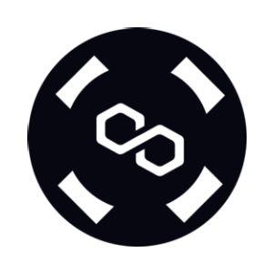 | 11777 | MATICX | Stader MaticX |
|  | 11778 | OPSEC | OpSec |
| 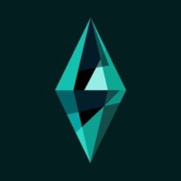 | 11779 | DGI | DGI Game |
| 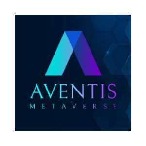 | 11780 | AVTM | Aventis Metaverse |
| 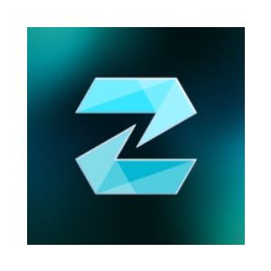 | 11781 | ZKML | zKML |
| 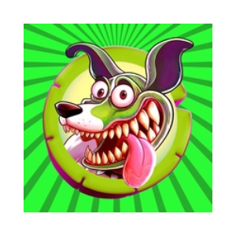 | 11782 | MILODOG | MILO DOG |
| 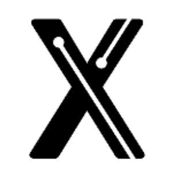 | 11783 | KNDX | Kondux |
| 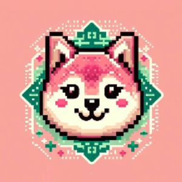 | 11784 | SHEB | SHEBOSHIS |
|  | 11785 | BHAT | BH Network |
|  | 11786 | FAV | Football At AlphaVerse |
| 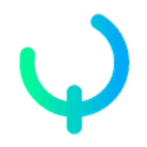 | 11787 | QKNTL | Quick Intel |
| 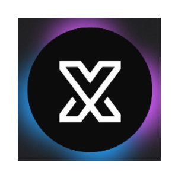 | 11788 | VRL | Virtual X |
| 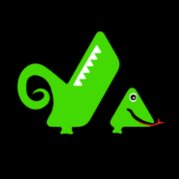 | 11789 | LIZARD | LIZARD |
| 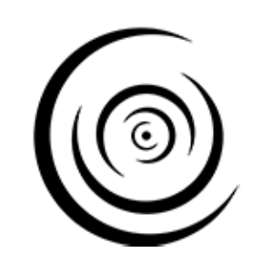 | 11790 | LQDX | Liquid Crypto |
| 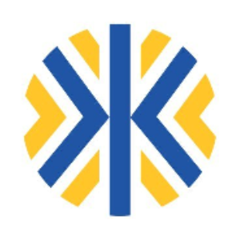 | 11791 | KNJ | Kunji Finance |
| 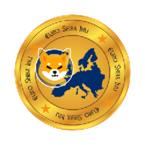 | 11792 | ESHIB | Euro Shiba Inu |
|  | 11793 | MBLK | Magical Blocks |
| 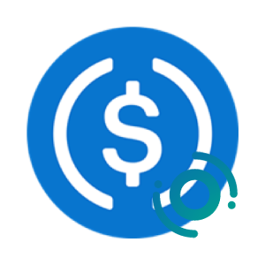 | 11794 | OUSDC | USD Coin (Orbit Bridge) |
|  | 11795 | GWD | GreenWorld |
| 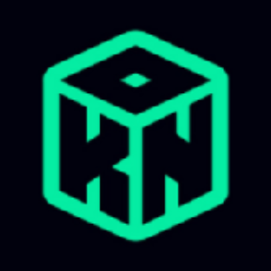 | 11796 | 0KN | 0 Knowledge Network |
| 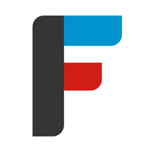 | 11797 | FNCT | Financie Token |
|  | 11798 | MORRA | Morra |
| 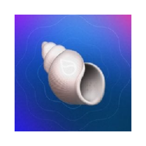 | 11799 | SUIA | SUIA |
| 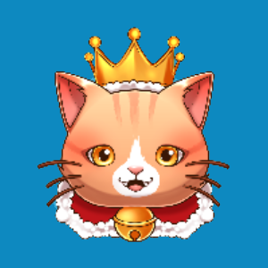 | 11800 | KINGCAT | King Cat |
| 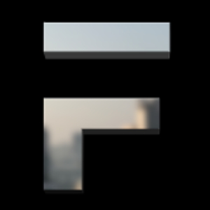 | 11801 | FORE | FORE Protocol |
| 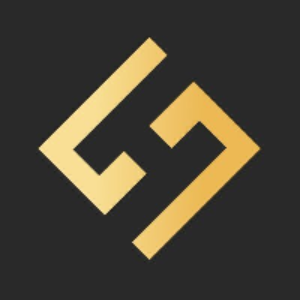 | 11802 | HMX | HMX |
| 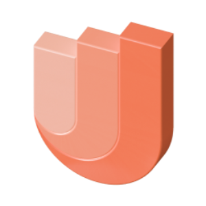 | 11803 | LIFT | Uplift |
| 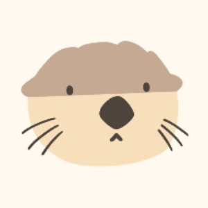 | 11804 | HASUI | Haedal |
| 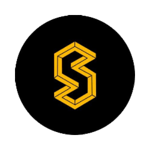 | 11805 | BNBX | Stader BNBx |
| 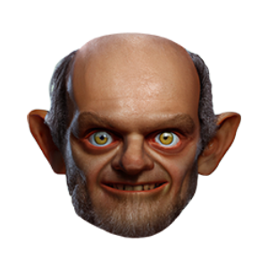 | 11806 | GRELF | GRELF |
| 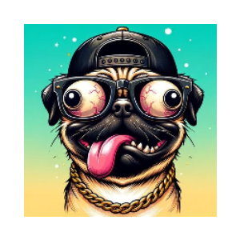 | 11807 | DAWG | Dawg Coin |
| 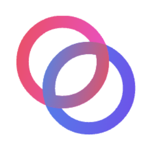 | 11808 | REBUS | Rebuschain |
|  | 11809 | SPIDEY | Spidey |
| 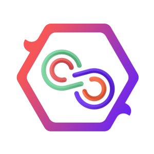 | 11810 | DEOD | Decentrawood |
|  | 11811 | DRAGY | Dragy |
|  | 11812 | GGTK | GGDApp |
| 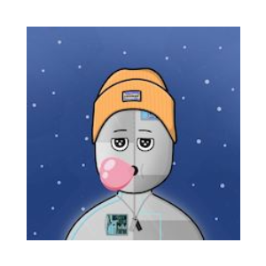 | 11813 | 404A | 404Aliens |
| 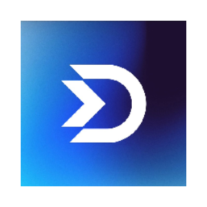 | 11814 | DUBBZ | Dubbz |
| 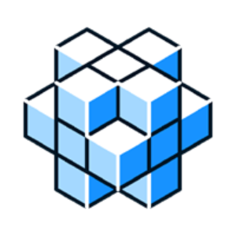 | 11815 | EQUIL | Equilibrium |
|  | 11816 | RCM | READ2N |
| 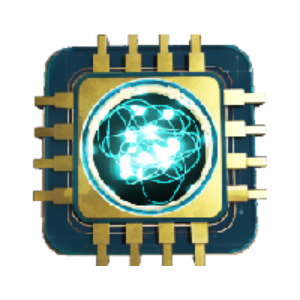 | 11817 | NEUROS | Shockwaves |
|  | 11818 | MATCH | Matching Game |
|  | 11819 | SPIZ | SPACE-iZ |
| 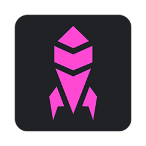 | 11820 | WEAPON | MEGAWEAPON |
|  | 11821 | MILOCEO | Milo CEO |
| 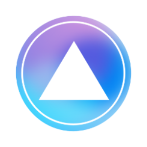 | 11822 | GNOME | GNOME |
|  | 11823 | BABYCEO | Baby Doge CEO |
| 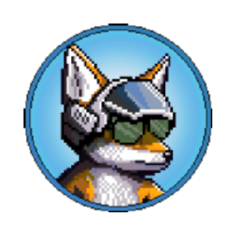 | 11824 | AVI | Aviator |
|  | 11825 | FLOYX | Floyx |
|  | 11826 | PLXY | Plxyer |
| 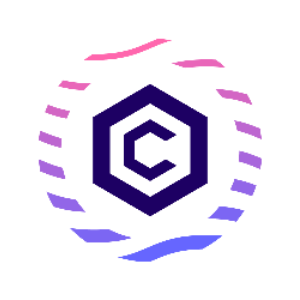 | 11827 | LCRO | Liquid CRO |
|  | 11828 | REDLUNA | Redluna |
|  | 11829 | BTCIX | BITCOLOJIX |
|  | 11830 | MMX | MMX |
|  | 11831 | BTCMT | Minto |
|  | 11832 | RIB | Ribus |
|  | 11833 | SNAIL | SnailBrook |
| 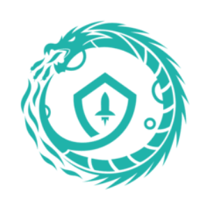 | 11834 | OPHX | Operation Phoenix |
| 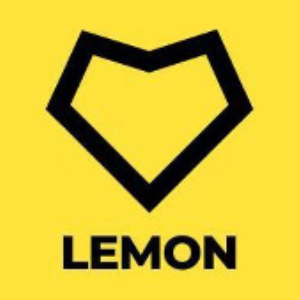 | 11835 | LEMN | LEMON |
| 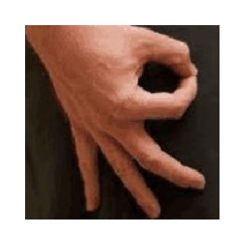 | 11836 | CIRCLE | You Looked |
|  | 11837 | WJEWEL | WJEWEL |
| 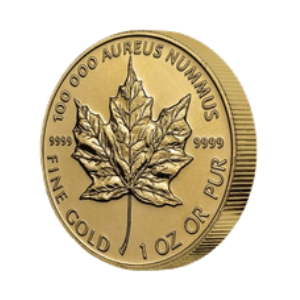 | 11839 | ANGO | Aureus Nummus Gold |
| 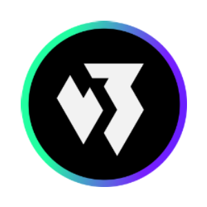 | 11840 | WGT | Web3Games.com |
| 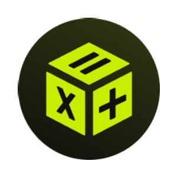 | 11841 | EQU | Equation |
| 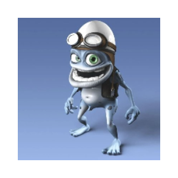 | 11842 | CRAZY | Crazy Frog |
| 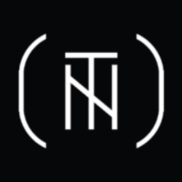 | 11843 | BYTES | Neo Tokyo |
| 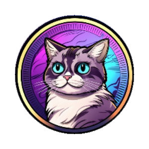 | 11844 | SILLYCAT | Sillycat |
|  | 11845 | HUT | Hibiki Run |
|  | 11846 | XOX | XOX Labs |
|  | 11847 | MICKEY | Steamboat Willie |
|  | 11848 | EXEN | Exen Coin |
|  | 11849 | CZOL | Czolana |
|  | 11850 | DOGEPAY | Doge Payment |
|  | 11851 | GRUM | Grumpy (Ordinals) |
|  | 11852 | XPLL | ParallelChain |
|  | 11853 | SSHIB | Solana Shib |
|  | 11854 | YAKU | Yaku |
|  | 11855 | SOBER | Solabrador |
|  | 11856 | BABYSHIB | Baby Shiba Inu |
|  | 11857 | JCO | JennyCo |
|  | 11858 | YOTO | yotoshi |
|  | 11859 | ARBIT | Arbit Coin |
|  | 11860 | BNBDOG | BNB DOG INU |
|  | 11861 | MZR | Mazuri GameFi |
|  | 11862 | LOPES | Leandro Lopes |
|  | 11863 | OZK | OrdiZK |
|  | 11864 | RVM | Realvirm |
|  | 11865 | BABYTRUMP | BABYTRUMP |
|  | 11866 | SWOT | Swot AI |
|  | 11867 | CRYN | CRYN |
|  | 11868 | SNST | Smooth Network Solutions Token |
|  | 11869 | TELLER | Teller |
|  | 11870 | PAXU | Pax Unitas |
|  | 11871 | USP | USP Token |
|  | 11872 | NOOT | NOOT (Ordinals) |
|  | 11873 | CRAYRABBIT | CrazyRabbit |
|  | 11874 | CBSL | CeBioLabs |
|  | 11875 | SMOL | Smolcoin |
|  | 11876 | INSC | INSC (Ordinals) |
|  | 11877 | LUNCARMY | LUNCARMY |
|  | 11878 | DUA | Brillion |
|  | 11879 | KURO | Kurobi |
|  | 11880 | GEKKO | Gekko HQ |
|  | 11881 | STONKS | HarryPotterObamaWallStreetBets10Inu |
|  | 11882 | PINCHI | Da Pinchi |
|  | 11883 | SPOX | Sports Future Exchange Token |
|  | 11884 | SAPE | SolanaApe |
|  | 11885 | OCTAGON | POLYDeFI |
|  | 11886 | BNBLION | BNB LION |
|  | 11887 | DLYCOP | Daily COP |
|  | 11888 | JELLY | Jelly eSports |
|  | 11889 | BMF | MetaFame |
|  | 11890 | ATMCHAIN | ATMChain |
|  | 11891 | R2R | CitiOs |
|  | 11892 | LIMEX | Limestone Network |
|  | 11893 | LTT | LocalTrade |
|  | 11894 | SHIBEMP | Shiba Inu Empire |
|  | 11895 | BIRB | Birb |
|  | 11896 | MMSC | MMSC PLATFORM |
|  | 11897 | AELIN | Aelin |
|  | 11898 | DYST | Dystopia |
|  | 11899 | BRUV | Bruv |
|  | 11900 | CRUX | CryptoMines Reborn |
|  | 11901 | GTE | GreenTek |
|  | 11902 | ASNT | Assent Protocol |
|  | 11903 | BABYCATS | Baby Cat Coin |
|  | 11904 | METAUFO | MetaUFO |
|  | 11905 | MAGIK | Magik Finance |
|  | 11906 | BEA | Beagle Inu |
|  | 11907 | CZSHARES | CZshares |
|  | 11908 | AUR | AUREO |
|  | 11909 | COLLAR | PolyPup Finance |
|  | 11910 | ATLX | Atlantis Loans Polygon |
|  | 11911 | ARI10 | Ari10 |
|  | 11912 | MFO | Moonfarm Finance |
|  | 11913 | EURE | Monerium EUR emoney |
|  | 11914 | MYROWIF | MYROWIF |
|  | 11915 | XCEPT | XCeption |
|  | 11916 | DSFR | Digital Swiss Franc |
|  | 11917 | 0XDEV | DEVAI |
|  | 11918 | HSUITE | HbarSuite |
|  | 11919 | SDO | TheSolanDAO |
|  | 11920 | SPURDO | spurdo |
|  | 11921 | LYF | Lillian Token |
|  | 11922 | RETA | Realital Metaverse |
|  | 11923 | LGBT | Let's Go Brandon Token |
|  | 11924 | WEB4 | WEB4 AI |
|  | 11925 | XFLOKI | XFLOKI |
|  | 11926 | FHM | FantOHM |
|  | 11927 | DNVDA | Nvidia Tokenized Stock Defichain |
|  | 11928 | SMU | SafeMoneyUP |
|  | 11929 | PEPEF | PEPEFLOKI |
|  | 11930 | WDOGE | Wrapped Dogecoin |
|  | 11931 | BEY | NBX |
|  | 11932 | BXBT | BoxBet  |
|  | 11933 | MELO | Melo Token |
|  | 11934 | IST | Inter Stable Token |
|  | 11935 | BOKU | Boryoku Dragonz |
|  | 11937 | BSG | Baby Squid Game |
|  | 11938 | VIM | VicMove |
|  | 11939 | JOLT | Joltify |
|  | 11940 | TUS | Treasure Under Sea |
|  | 11941 | FORA | UFORIKA |
|  | 11942 | FACT | Orcfax |
|  | 11944 | JNX | Janex |
|  | 11945 | GYRO | Gyro |
|  | 11946 | EPETS | Etherpets |
|  | 11947 | HUGO | Hugo Inu |
|  | 11948 | CEX | Catena X |
|  | 11949 | LFI | LunaFi |
|  | 11950 | FXI | FX1 Sports |
|  | 11951 | TIGERMOON | TigerMoon |
|  | 11952 | UNSHETH | unshETH Ether |
|  | 11953 | GOO | Gooeys |
|  | 11954 | PEACHY | Peachy |
|  | 11955 | BECO | BecoSwap Token |
|  | 11956 | SIZ | Sizlux |
|  | 11957 | JEFE | JEFE TOKEN |
|  | 11958 | BIDI | Bidipass |
|  | 11959 | RGOLD | Royal Gold |
|  | 11960 | 2DAI | 2DAI.io |
|  | 11961 | CRYSTL | Crystl Finance |
|  | 11962 | AIMBOT | AimBot AI |
|  | 11963 | FLUIDTRADE | Fluid |
|  | 11964 | SHIBAKEN | Shibaken Finance |
|  | 11965 | BIOCOIN | Biocoin |
|  | 11966 | STSW | Stackswap |
|  | 11967 | CRAZYTIGER | CRAZY TIGER |
|  | 11968 | GOLDEN | Golden Inu |
|  | 11969 | FIRSTHARE | FirstHare |
|  | 11970 | W8BIT | 8Bit Chain |
|  | 11971 | JMZ | Jimizz |
|  | 11972 | FRONK | Fronk |
|  | 11973 | SUBAWU | Subawu Token |
|  | 11974 | BGPT | BlockGPT |
|  | 11975 | FITT | Fitmint |
|  | 11976 | BBT | BitBook |
|  | 11977 | ROCKET | Team Rocket |
|  | 11978 | IPMB | IPMB |
|  | 11979 | FROGCEO | Frog Ceo |
|  | 11980 | SIMP | SO-COL |
|  | 11981 | WOOD | Mindfolk Wood |
|  | 11982 | BSPT | Blocksport |
|  | 11983 | XTREME | ExtremeCoin |
|  | 11984 | EMP | Emp Money |
|  | 11985 | ALM | Alium Finance |
|  | 11986 | MIVA | Minerva Wallet |
|  | 11987 | WMINIMA | Wrapped Minima |
|  | 11988 | GDCC | GLOBAL DIGITAL CLUSTER COIN |
|  | 11989 | MCLB | Millennium Club Coin |
|  | 11990 | CCV2 | CelebrityCoinV2 |
|  | 11991 | IUS | Iustitia Coin |
|  | 11992 | SYPOOL | Sypool |
|  | 11993 | UBXN | UpBots Token |
|  | 11994 | SPND | Spindle |
|  | 11995 | SORA | Sora Validator Token |
|  | 11996 | CYBERWAY | CyberWay |
|  | 11997 | CYBERC | CyberCoin |
|  | 11998 | CRYPTOBULLION | Crypto Bullion |
|  | 11999 | RISEVISION | Rise |
|  | 12000 | REDLANG | RED |
|  | 12001 | REALY | Realy Metaverse |
|  | 12002 | RATECOIN | Ratecoin |
|  | 12003 | PROTO | Protocon |
|  | 12004 | PLAYKEY | Playkey |
|  | 12005 | PLAYC | PlayChip |
|  | 12006 | JADEC | Jade Currency |
|  | 12007 | CAF | Childrens Aid Foundation |
|  | 12008 | EPANUS | Epanus |
|  | 12009 | ATRNO | AETERNUS |
|  | 12010 | DINGO | Dingocoin |
|  | 12011 | MEF | MEFLEX |
|  | 12012 | BIDEN | Dark Brandon |
|  | 12013 | LOONG | PlumpyDragons |
|  | 12014 | OSAK | Osaka Protocol |
|  | 12015 | DMD | DMD |
|  | 12016 | BAZED | Bazed Games |
|  | 12017 | LODE | Lodestar |
|  | 12018 | CHOKE | Artichoke Protocol |
|  | 12019 | NEWM | NEWM |
|  | 12021 | COFFEECOIN | CoffeeCoin |
|  | 12022 | DFC | DeFinder Capital |
|  | 12023 | KICKS | GetKicks |
|  | 12024 | CCX | Conceal |
|  | 12025 | BFTC | BITS FACTOR |
|  | 12026 | SXM | saxumdao |
|  | 12027 | LKSM | Liquid KSM |
|  | 12028 | OPENX | OpenSwap Optimism Token |
|  | 12029 | HIME | Phantom of the Kill |
|  | 12030 | WMOXY | Moxy |
|  | 12031 | SHOOTER | Top Down Survival Shooter |
|  | 12032 | CNETA | AnetaBTC |
|  | 12033 | GAMER | GameStation |
|  | 12034 | VNLNK | VINLINK |
|  | 12035 | CHILI | CHILI |
|  | 12036 | COWRIE | MYCOWRIE |
|  | 12037 | IVI | IVIRSE |
|  | 12038 | MONTE | Monte |
|  | 12039 | JOEBIDEN2024  | JOEBIDEN2024 |
|  | 12040 | VETTER | Vetter Token |
|  | 12041 | STYL | Stylike Governance |
|  | 12042 | KI | Genopets KI |
|  | 12043 | DYZILLA | DYZilla |
|  | 12044 | DUG | DUG |
|  | 12045 | SCNR | Swapscanner |
|  | 12046 | MXNT | Tether MXNt |
|  | 12047 | STATE | New World Order |
|  | 12048 | MORPH | Morpheus Token |
|  | 12049 | DRAGONGROK | DragonGROK |
|  | 12050 | TXBIT | Txbit Token |
|  | 12051 | DSHARE | Dibs Share |
|  | 12052 | ZORO | Zoro Inu |
|  | 12053 | USDO | USD Open Dollar |
|  | 12054 | KOGECOIN | KogeCoin.io |
|  | 12055 | XPTP | xPTP |
|  | 12056 | DOGE1SAT | DOGE-1SATELLITE |
|  | 12057 | SOT | Soccer Crypto |
|  | 12058 | KACY | Kassandra |
|  | 12059 | GDRT | Good Driver Reward Token |
|  | 12060 | WOKT | Wrapped OKT |
|  | 12061 | SCK | Space Corsair Key |
|  | 12062 | SHINT | Shiba Interstellar |
|  | 12063 | GW | Gyrowin |
|  | 12064 | AINU | Ainu Token |
|  | 12065 | HLPR | HELPER COIN |
|  | 12066 | FLIBERO | Fantom Libero Financial |
|  | 12067 | POOCOIN | PooCoin |
|  | 12068 | SMUDCAT | Smudge Cat |
|  | 12069 | CLA | ClaimSwap |
|  | 12070 | DEMIR | Adana Demirspor Token |
|  | 12071 | HEAVEN | Heaven Token |
|  | 12072 | BXR | Blockster |
|  | 12073 | CHITCAT | ChitCAT |
|  | 12074 | DOGSROCK | Dogs Rock |
|  | 12075 | SIV | Sivasspor Token |
|  | 12076 | RACING | Racing Club Fan Token |
|  | 12077 | DLANCE | DeeLance |
|  | 12078 | OCAVU | Ocavu Network Token |
|  | 12079 | PD | PUDEL |
|  | 12080 | BIAO | Biaocoin |
|  | 12081 | NEMO | NEMO |
|  | 12082 | DCAR | Dragon Crypto Argenti |
|  | 12083 | MOBIC | Mobility Coin |
|  | 12084 | GMNG | Global Gaming |
|  | 12085 | DPLTR | Palantir Tokenized Stock Defichain |
|  | 12086 | 0XOS | 0xOS AI |
|  | 12087 | OKLP | OkLetsPlay |
|  | 12088 | KINGBONK | King Bonk |
|  | 12089 | DLTA | delta.theta |
|  | 12090 | ALTD | Altitude |
|  | 12091 | LICO | Liquid Collectibles |
|  | 12092 | BR34P | BR34P |
|  | 12093 | SHEN | Shen |
|  | 12094 | NIOB | Niob Finance |
|  | 12095 | GBURN | GBURN |
|  | 12096 | GENSLR | Good Gensler |
|  | 12097 | BANUS | Banus.Finance |
|  | 12098 | BALA | Shambala |
|  | 12099 | MAU | MAU |
|  | 12100 | ELON2024 | ELON 2024(BSC) |
|  | 12101 | GUT | Genesis Universe |
|  | 12103 | LIZD | Dancing Lizard Coin |
|  | 12104 | BPEPEF | Baby Pepe Floki |
|  | 12105 | IPOR | IPOR |
|  | 12106 | A51 | A51 Finance |
|  | 12107 | IMO | IMO |
|  | 12108 | BABYBNB | BabyBNB |
|  | 12109 | ZAFI | ZakumiFi |
|  | 12110 | DEFX | DeFinity |
|  | 12111 | VOLTZ | Voltz |
|  | 12112 | SHIB2 | SHIB2 |
|  | 12113 | QXC | QuantumXC |
|  | 12114 | ELONMARS | ELON MARS |
|  | 12115 | MAXI | Maximus |
|  | 12116 | XRPC | Xrp Classic |
|  | 12117 | BAI | BearAI |
|  | 12118 | USHI | Ushi |
|  | 12119 | XCRX | xCRX |
|  | 12120 | UMY | KaraStar UMY |
|  | 12121 | HARE | Hare Token |
|  | 12122 | CREAL | Celo Brazilian Real |
|  | 12123 | DACAT | daCat |
|  | 12124 | GOV | SubDAO |
|  | 12125 | PIXELV | PixelVerse |
|  | 12126 | HK | Hongkong |
|  | 12127 | PIXEL | Pixels |
|  | 12128 | BEFTM | Beefy Escrowed Fantom |
|  | 12129 | PHTR | Phuture |
|  | 12130 | MAZI | MaziMatic |
|  | 12131 | BOHR | BOHR |
|  | 12132 | BLUES | Blueshift |
|  | 12133 | BOC | BOCOIN |
|  | 12134 | BBL | beoble |
|  | 12135 | PEM | Pembrock |
|  | 12136 | RAMA | Ramestta |
|  | 12137 | PEFI | Penguin Finance |
|  | 12138 | IAI | inheritance Art |
|  | 12139 | MANE | MANE |
|  | 12140 | OKINAMI | Kanagawa Nami |
|  | 12141 | VX | ViteX Coin |
|  | 12142 | BURROW | Burrow |
|  | 12143 | BITO | BitoPro Exchange Token |
|  | 12144 | SILV2 | Escrowed Illuvium 2 |
|  | 12145 | DMOON | Dollarmoon |
|  | 12146 | SVN | Savanna |
|  | 12147 | VPK | Vulture Peak |
|  | 12148 | NOLA | Nola |
|  | 12149 | HOW | HowInu |
|  | 12150 | SUMMER | Summer |
|  | 12151 | NOKA | Noka Solana AI |
|  | 12152 | UMMA | UMMA Token |
|  | 12153 | MUMU | Mumu the Bull |
|  | 12154 | PME | DogePome |
|  | 12155 | BEMD | Betterment Digital |
|  | 12156 | RDF | ReadFi |
|  | 12157 | SPONGE | Sponge |
|  | 12158 | DHN | Dohrnii |
|  | 12159 | SFIT | Sense4FIT |
|  | 12160 | BNBP | BNBPot |
|  | 12161 | HOME | OtterHome |
|  | 12162 | M87 | MESSIER |
|  | 12163 | BREWLABS | Brewlabs |
|  | 12164 | PROTOCOLZ | Protocol Zero |
|  | 12165 | GWGW | GoWrap |
|  | 12166 | JEN | JEN COIN |
|  | 12167 | RIM | MetaRim |
|  | 12168 | CONK | ShibaPoconk |
|  | 12169 | ASCN | AlphaScan |
|  | 12170 | XDG | Decentral Games Governance |
|  | 12171 | WINTER | Winter |
|  | 12172 | AFP | Animal Farm Pigs |
|  | 12173 | DOD | Day Of Defeat 2.0 |
|  | 12174 | MFET | MultiFunctional Environmental Token |
|  | 12175 | SQTS | Sqts (Ordinals) |
|  | 12176 | NVG | NightVerse Game |
|  | 12177 | QDT | QCHAIN |
|  | 12178 | WSTOR | StorageChain |
|  | 12179 | SRG | Street Runner NFT |
|  | 12180 | NERO | Nero Token |
|  | 12182 | GROOOOOK | Groooook |
|  | 12183 | WISTA | Wistaverse |
|  | 12184 | DGNX | DegenX |
|  | 12185 | FXB | FxBox |
|  | 12186 | LPL | LinkPool |
|  | 12187 | BABI | Babylons |
|  | 12188 | PPIZZA | P Pizza |
|  | 12189 | INUS | MultiPlanetary Inus |
|  | 12190 | GARY | Gary |
|  | 12191 | ACRIA | Acria.AI |
|  | 12192 | EXA | Exactly Protocol |
|  | 12193 | WATER | doginwotah |
|  | 12194 | ASPC | Astropup Coin |
|  | 12195 | LICK | PetLFG |
|  | 12196 | CERES | Ceres |
|  | 12197 | SPOODY | Spoody Man |
|  | 12198 | SERP | Shibarium Perpetuals |
|  | 12199 | JARY | JeromeAndGary |
|  | 12200 | DOGEWHALE | Dogewhale |
|  | 12201 | AIWALLET | AiWallet Token |
|  | 12202 | FIX00 | FIX00 |
|  | 12203 | GHA | Ghast |
|  | 12204 | LDZ | Voodoo Token |
|  | 12205 | INUINU | Inu Inu |
|  | 12206 | TATE | Tate |
|  | 12207 | FCK | Find & Check |
|  | 12208 | BSY | Bestay |
|  | 12209 | DIYAR | Diyarbekirspor Token |
|  | 12210 | PEPERA | PEPERA |
|  | 12211 | XGEM | Exchange Genesis Ethlas Medium |
|  | 12212 | HATAY | Hatayspor Token |
|  | 12213 | DNFLX | Netflix Tokenized Stock Defichain |
|  | 12214 | BURNIFYAI | BurnifyAI |
|  | 12215 | CTRL2XY | Control2XY |
|  | 12216 | STJUNO | Stride Staked JUNO |
|  | 12217 | SBOX | SUIBOXER |
|  | 12218 | FBA | Firebird Aggregator |
|  | 12219 | EZY | EzyStayz |
|  | 12220 | HTMOON | HTMOON |
|  | 12221 | MHAM | Metahamster |
|  | 12222 | KITTENS | Kitten Coin |
|  | 12223 | BRACE | Bitci Racing Token |
|  | 12224 | SHAK | Shakita Inu |
|  | 12226 | AIPEPE | AI PEPE KING |
|  | 12227 | OT | Onchain Trade |
|  | 12228 | BABYMYRO | Babymyro |
|  | 12229 | W3W | Web3 Whales |
|  | 12230 | DOD100 | Day of Defeat Mini 100x |
|  | 12231 | BSAFU | BlockSAFU |
|  | 12232 | FENTANYL | Chinese Communist Dragon |
|  | 12233 | AGOV | Answer Governance |
|  | 12234 | RYIU | RYI Unity |
|  | 12235 | SWIN | SwinCoin |
|  | 12236 | ZKSHIB | zkShib |
|  | 12237 | LULU | LULU |
|  | 12238 | UIM | UNIVERSE ISLAND |
|  | 12239 | FLOKINY | Floki New Year |
|  | 12240 | GROKMOON | Grok Moon |
|  | 12241 | JSOL | JPool Staked SOL |
|  | 12242 | GAFA | Gafa |
|  | 12243 | CZF | CZodiac Farming Token |
|  | 12244 | WANUSDT | wanUSDT |
|  | 12245 | WEB5 | WEB5 Inu |
|  | 12246 | MOONSTAR | MoonStar |
|  | 12247 | AVATAR | Avatar |
|  | 12248 | 2SHARES | 2SHARE |
|  | 12249 | DNY | Dynasty Coin |
|  | 12250 | FURYX | Metafury |
|  | 12251 | DACKIE | DackieSwap |
|  | 12252 | MEB | Meblox Protocol |
|  | 12253 | YUSE | Yuse Token |
|  | 12254 | XRP2 | XRP2.0 |
|  | 12255 | GELO | Grok Elo |
|  | 12256 | PEPEMO | PepeMo |
|  | 12257 | GAMINGDOGE | GAMINGDOGE |
|  | 12258 | PREME | PREME Token |
|  | 12259 | FUFU | Fufu Token |
|  | 12260 | MAXX | MAXX Finance |
|  | 12261 | BFK WARZONE | BFK Warzone |
|  | 12262 | BHIG | BuckHathCoin |
|  | 12263 | BLAST | Blast |
|  | 12264 | FARMS | Farmsent |
|  | 12265 | VSUI | Volo Staked SUI |
|  | 12266 | ROND | ROND |
|  | 12267 | BTCVB | BitcoinVB |
|  | 12268 | HEMULE | Hemule |
|  | 12269 | SFTMX | BeethovenX sFTMX |
|  | 12270 | DFB | Facebook Tokenized Stock Defichain |
|  | 12271 | 2OMB | 2omb Finance |
|  | 12272 | USK | USK |
|  | 12273 | ENRX | Enrex |
|  | 12274 | AIUS | Arbius |
|  | 12276 | LAKE | Data Lake |
|  | 12277 | METH | Mantle Staked Ether |
|  | 12278 | BIBI | BIBI |
|  | 12279 | ROKO | ROKO |
|  | 12280 | ZKID | zkSync id |
|  | 12281 | FIBO | FibSWAP DEx |
|  | 12282 | ALOT | Dexalot |
|  | 12283 | YUMMI | Yummi Universe |
|  | 12284 | ZEFI | ZCore Finance |
|  | 12285 | MUNITY | Metahorse Unity |
|  | 12286 | BEANS | Moonbeans |
|  | 12287 | FOOM | FOOM |
|  | 12288 | GUC | Green Universe Coin |
|  | 12289 | GAU | Gamer Arena |
|  | 12290 | GBL | Global Token |
|  | 12291 | AGB | Apes Go Bananas |
|  | 12292 | WPI | Wrapped Pi |
|  | 12293 | DADA | DADA |
|  | 12294 | MOONED | MoonEdge |
|  | 12295 | SOCOLA | SOCOLA INU |
|  | 12296 | AITEK | AI Technology |
|  | 12297 | TAONU | TAO INU |
|  | 12298 | BEFY | Befy Protocol |
|  | 12299 | KOY | Koyo |
|  | 12300 | SLN | Smart Layer Network |
|  | 12301 | AXSV1 | Axie Infinity Shards v1 |
|  | 12302 | DEXIO | Dexioprotocol |
|  | 12303 | 50X | 50x.com |
|  | 12304 | CAWCEO | CAW CEO |
|  | 12305 | NIOCTIB | nioctiB |
|  | 12306 | SSLX | StarSlax |
|  | 12307 | LOTTY | Lotty |
|  | 12308 | TESLAI | Tesla AI |
|  | 12309 | PACT | impactMarket |
|  | 12310 | SIZE | SIZE |
|  | 12311 | ANKRMATIC | Ankr Staked MATIC |
|  | 12312 | AFYON | Afyonspor Fan Token |
|  | 12313 | BMBO | Bamboo Coin |
|  | 12314 | GFLY | BattleFly |
|  | 12315 | TOTEM | DragonMaster |
|  | 12316 | CHARGED | GoCharge Tech |
|  | 12317 | MRUN | Metarun |
|  | 12318 | STRDY | Sturdy |
|  | 12319 | VPND | VaporNodes |
|  | 12320 | DEGA | Dega |
|  | 12321 | 404BLOCKS | 404Blocks |
|  | 12322 | MEMEETF | Meme ETF |
|  | 12323 | AVR | Avrora Metaverse |
|  | 12324 | HUDI | Hudi |
|  | 12325 | BES | battle esports coin |
|  | 12326 | DTG | Defi Tiger |
|  | 12327 | ANUS | URANUS |
|  | 12328 | OMMI | Ommniverse |
|  | 12329 | GLIDE | Glide Finance |
|  | 12330 | HSUI | Suicune |
|  | 12331 | VAPE | VAPE |
|  | 12332 | CUMINU | CumInu |
|  | 12333 | CPIGGY | Vix Finance |
|  | 12334 | GUISE | GUISE |
|  | 12335 | DRAM | DRAM |
|  | 12336 | BIXI | Bixi |
|  | 12337 | PORTAL | Portal |
|  | 12338 | ZARP | ZARP Stablecoin |
|  | 12339 | SANTA | SANTA CHRISTMAS INU |
|  | 12340 | C2H6 | Ethane |
|  | 12341 | HOUSE | Klaymore Stakehouse |
|  | 12342 | CRONA | CronaSwap |
|  | 12343 | 1MT | 1Move |
|  | 12344 | WSHIBA | wShiba |
|  | 12345 | STIC | StickMan |
|  | 12346 | SANJI | Sanji Inu |
|  | 12347 | AROR | Arora |
|  | 12348 | APTOGE | Aptoge |
|  | 12349 | ADR | Adroverse |
|  | 12350 | POLYCUB | PolyCub |
|  | 12351 | 1NFT | 1NFT |
|  | 12352 | BNBDOGE | BNBdoge |
|  | 12353 | ZCULT | Zkcult |
|  | 12354 | QWLA | Qawalla |
|  | 12355 | TITI | TiTi Protocol |
|  | 12356 | SLPV1 |  Small Love Potion v1 |
|  | 12357 | SLCL | Solcial |
|  | 12358 | FOXGIRL | FoxGirl |
|  | 12359 | WMXWOM | Wombex WOM |
|  | 12360 | CATO | CATO |
|  | 12361 | DELOT | DELOT.IO |
|  | 12362 | TETHYS | Tethys |
|  | 12363 | LONGFU | LONGFU |
|  | 12364 | WADA | Wrapped Cardano |
|  | 12365 | PIKO | Pinnako |
|  | 12366 | MPWR | Empower |
|  | 12367 | VBSWAP | vBSWAP |
|  | 12368 | SWPR | Swapr |
|  | 12369 | D20 | DAM Finance |
|  | 12370 | PUNCH | PUNCHWORD |
|  | 12371 | PSPS | BobaCat |
|  | 12372 | DWARS | Dynasty Wars |
|  | 12373 | CAIR | Crypto-AI-Robo.com |
|  | 12374 | WDOT | WDOT |
|  | 12375 | BOOT | Bostrom |
|  | 12376 | ELK | Elk Finance |
|  | 12377 | QSR | Quasar |
|  | 12378 | OMNOM | Doge Eat Doge |
|  | 12379 | OGSM | OGSMINEM |
|  | 12380 | GORA | Gora |
|  | 12381 | CTR | Creator Platform |
|  | 12382 | NEXTEXV1 | Next.exchange Token v1 |
|  | 12383 | FDC | Fidance |
|  | 12384 | MINE | SpaceMine |
|  | 12385 | FISH | Polycat Finance |
|  | 12386 | HBDC | Happy Birthday Coin |
|  | 12387 | FTMO | Fantom Oasis |
|  | 12388 | DRAGONKING | DragonKing |
|  | 12389 | VBNT | Bancor Governance Token |
|  | 12390 | FANG | FANG Token |
|  | 12391 | NNT | Nunu Spirits |
|  | 12392 | TSHARE | Tomb Shares |
|  | 12393 | VRSW | VirtuSwap |
|  | 12394 | KODA | Koda Cryptocurrency |
|  | 12395 | 4TOKEN | Ignore Fud |
|  | 12396 | RCKT | RocketSwap |
|  | 12397 | MOVER | Mover |
|  | 12398 | CHAD | Chad Coin |
|  | 12399 | FUSDC | Fluidity |
|  | 12400 | CLMRS | Crolon Mars |
|  | 12402 | JTT | Justus |
|  | 12403 | CS | Child Support |
|  | 12404 | MIDAI | Midway AI |
|  | 12405 | DMIND | DecentraMind |
|  | 12406 | JAWS | AutoShark |
|  | 12407 | PEPEE | Pepe the pepe |
|  | 12408 | CRAZYBUNNY | Crazy Bunny |
|  | 12409 | FAMOUSF | Famous Fox Federation |
|  | 12410 | HALLOWEEN | HALLOWEEN |
|  | 12411 | PINE | Pine |
|  | 12412 | DECI | Maximus DECI |
|  | 12413 | UCX | UCX |
|  | 12414 | KUS | KuSwap |
|  | 12415 | IBTC | Indigo Protocol - iBTC |
|  | 12416 | MEU | MetaUnit |
|  | 12417 | ENCS | ENCOINS |
|  | 12418 | PANIC | PanicSwap |
|  | 12419 | YAK | Yield Yak |
|  | 12420 | DOBBY | Dobby |
|  | 12421 | BMDA | Bermuda |
|  | 12422 | MUSKMEME | MUSK MEME |
|  | 12423 | SMARS | SafeMars |
|  | 12424 | SNRK | Snark Launch |
|  | 12425 | XCFX | Nucleon |
|  | 12426 | PWT | PANDAINU |
|  | 12427 | BABYSORA | Baby Sora |
|  | 12428 | EGOLD | EGOLD |
|  | 12429 | RODAI | ROD.AI |
|  | 12430 | LOFIBUZZ | LOFI (lofi.buzz) |
|  | 12431 | NFTS | NFT STARS |
|  | 12432 | RSPN | Respan |
|  | 12433 | BFG | BFG Token |
|  | 12434 | LCD | Lucidao |
|  | 12435 | OSK | OSK |
|  | 12436 | THOREUM | Thoreum V3 |
|  | 12437 | SYA | SaveYourAssets |
|  | 12438 | NPICK | NPICK BLOCK |
|  | 12439 | YMS | Yeni Malatyaspor Token |
|  | 12440 | HOLDEX | Holdex Finance |
|  | 12441 | FINS | AutoShark DEX |
|  | 12442 | WHT | Wrapped Huobi Token |
|  | 12443 | BIDZ | BIDZ Coin |
|  | 12444 | EXPO | Exponential Capital |
|  | 12445 | OMD | OneMillionDollars |
|  | 12446 | SCM | ScamFari token |
|  | 12447 | 0XL | 0x Leverage |
|  | 12448 | MATA | Ninneko |
|  | 12449 | IRENA | Irena Coin Apps |
|  | 12450 | X7C | X7 Coin |
|  | 12451 | UUSD | Utopia USD |
|  | 12452 | HPYPEPE | Happy Pepe Token |
|  | 12453 | HTE | Hepton |
|  | 12454 | GLF | Galaxy Finance |
|  | 12455 | ZPC | Zen Panda Coin |
|  | 12456 | XINU | XINU |
|  | 12457 | SHIBKILLER | ShibKiller |
|  | 12458 | GROKBANK | Grok Bank |
|  | 12459 | SFIN | Songbird Finance |
|  | 12460 | MTP | Macro Protocol |
|  | 12461 | WJXN | Jax.Network |
|  | 12462 | METAMUSK | Musk Metaverse |
|  | 12463 | BUDDHA | Buddha |
|  | 12464 | KDOE | Kudoe |
|  | 12465 | BLOB | Blob |
|  | 12466 | YACHT | YachtingVerse |
|  | 12467 | FLIGHT | FLIGHTCLUPCOIN |
|  | 12468 | LINQ | LINQ |
|  | 12470 | SMRTR | SmarterCoin |
|  | 12471 | TWEETY | Tweety |
|  | 12472 | PLEB | PLEBToken |
|  | 12473 | DTSLA | Tesla Tokenized Stock Defichain |
|  | 12474 | STELLA | StellaSwap |
|  | 12475 | PAVIA | Pavia |
|  | 12476 | XSAUCE | xSAUCE |
|  | 12477 | PEAR | Pear Swap |
|  | 12478 | BAOS | BaoBaoSol |
|  | 12479 | YESP | Yesports |
|  | 12480 | EMAID | MaidSafeCoin |
|  | 12481 | SDCRV | Stake DAO CRV |
|  | 12482 | HBARX | HBARX |
|  | 12483 | EXD | Exorde |
|  | 12484 | RBP | Rare Ball Potion |
|  | 12485 | CREPE | Crepe Coin |
|  | 12486 | KABOSU | Kabosu Family |
|  | 12487 | ZOOMER | Zoomer Coin |
|  | 12488 | RXCG | RXCGames |
|  | 12489 | ZKDOGE | zkDoge |
|  | 12490 | HABIBI | The Habibiz |
|  | 12491 | SPECTRE | SPECTRE AI |
|  | 12492 | OGY | ORIGYN |
|  | 12493 | VP | Torah Network |
|  | 12494 | SOLEX | Solex Launchpad |
|  | 12495 | BABYPORK | Baby Pepe Fork |
|  | 12496 | ARRO | Arro Social |
|  | 12497 | UNP | UNIPOLY |
|  | 12498 | ANIMA | Realm Anima |
|  | 12499 | BIOP | Biop |
|  | 12500 | EETH | ether fi |
|  | 12501 | VOLTA | Volta Club |
|  | 12502 | ZOA | Zone of Avoidance |
|  | 12503 | STAPT | Ditto Staked Aptos |
|  | 12504 | JUGNI | JUGNI |
|  | 12505 | LOST | Lost Worlds |
|  | 12506 | MAGICK | Cosmic Universe Magick |
|  | 12507 | XJEWEL | xJEWEL |
|  | 12508 | CAVADA | Cavada |
|  | 12509 | BRUSH | PaintSwap |
|  | 12510 | PUMP | PUMP |
|  | 12511 | TKST | TokenSight |
|  | 12512 | THOL | AngelBlock |
|  | 12513 | ATEM | Atem Network |
|  | 12514 | BIIS | biis (Ordinals) |
|  | 12515 | INFBIT | InfinityBit Token |
|  | 12516 | STIMA | STIMA |
|  | 12517 | BTAF | BTAF token |
|  | 12518 | BRGE | OrdBridge |
|  | 12519 | F1C | Future1coin |
|  | 12520 | DHLT | DeHealth |
|  | 12521 | AWM | Another World |
|  | 12522 | CODAI | CODAI |
|  | 12523 | SOL10 | SOLANA MEME TOKEN |
|  | 12524 | OPENSOURCE | Open Source Network |
|  | 12525 | LYUM | Layerium |
|  | 12526 | SCAPE | Etherscape |
|  | 12528 | SINSO | SINSO |
|  | 12529 | RDO | Rodeo Finance |
|  | 12530 | DGLN | Dogelana |
|  | 12531 | LFNTY | Lifinity |
|  | 12532 | KIRBYCEO | Kirby CEO |
|  | 12533 | FKPEPE | Fuck Pepe |
|  | 12534 | RBNB | StaFi Staked BNB |
|  | 12535 | UW3S | Utility Web3Shot |
|  | 12536 | MAIA | Maia |
|  | 12537 | PIVN | PIVN |
|  | 12538 | MTO | Merchant Token |
|  | 12539 | APING | aping |
|  | 12540 | WANNA | Wanna Bot |
|  | 12541 | WONE | Wrapped Harmony |
|  | 12542 | RAK | Rake Finance |
|  | 12543 | PASG | Passage |
|  | 12544 | BIDEN2024 | BIDEN 2024 |
|  | 12545 | SOLZILLA | Solzilla |
|  | 12546 | 3KM | 3 Kingdoms Multiverse |
|  | 12547 | WAD | WardenSwap |
|  | 12548 | GSYS | Genesys |
|  | 12549 | TREAT | Treat |
|  | 12550 | SOLAV | SOLAV TOKEN |
|  | 12551 | LYVE | Lyve Finance |
|  | 12552 | VARK | Aardvark |
|  | 12553 | HAHA | Hasaki |
|  | 12554 | SPEPE | SolanaPepe |
|  | 12555 | SANI | Sanin Inu |
|  | 12556 | W3S | Web3Shot |
|  | 12557 | JEUR | Jarvis Synthetic Euro |
|  | 12558 | 0XGAS | 0xGasless |
|  | 12559 | DINEROBET | Dinerobet |
|  | 12560 | WKC | Wiki Cat |
|  | 12561 | ICG | Invest Club Global |
|  | 12562 | GLI | GLI TOKEN |
|  | 12563 | PERRY | Perry The BNB |
|  | 12564 | BAJU | Bajun Network |
|  | 12565 | BD | BlastDEX |
|  | 12566 | GCOTI | COTI Governance Token |
|  | 12567 | CRIMINGO | Criminal Flamingo |
|  | 12568 | MOBX | MOBIX |
|  | 12569 | SPYRO | SPYRO |
|  | 12570 | PUPPIES | I love puppies |
|  | 12571 | PABLO | PABLO DEFI |
|  | 12572 | PUFFCOIN | Puff |
|  | 12573 | EXTRA | Extra Finance |
|  | 12574 | DSRUN | Derby Stars |
|  | 12575 | KIBSHI | KiboShib |
|  | 12576 | PUGAI | PUG AI |
|  | 12577 | WTFUEL | Wrapped TFUEL |
|  | 12578 | MODAI | Modai |
|  | 12579 | MEMES | MemeCoinDAO |
|  | 12580 | EDUX | Edufex |
|  | 12581 | BSWAP | BaseSwap |
|  | 12582 | NPM | Neptune Mutual |
|  | 12583 | STKBNB | pSTAKE Staked BN |
|  | 12584 | NEWG | NewGold |
|  | 12585 | BABYMUSK | Baby Musk |
|  | 12586 | TMNT | TMNT |
|  | 12587 | KOMPETE | KOMPETE |
|  | 12588 | GHSY | Ghosty Cash |
|  | 12589 | BLACKDRAGON | Black Dragon |
|  | 12590 | RABI | Rabi |
|  | 12591 | UCJL | Utility Cjournal |
|  | 12592 | MOONKIZE | MoonKize |
|  | 12593 | TOTO | TOTO |
|  | 12594 | GINOA | Ginoa |
|  | 12595 | CYBONK | CYBONK |
|  | 12596 | WECO | WECOIN |
|  | 12597 | UGOLD | UGOLD Inc. |
|  | 12598 | LEIA | Leia |
|  | 12599 | SEAN | Starfish Finance |
|  | 12600 | DCHF | DeFi Franc |
|  | 12601 | EVEAI | EVEAI |
|  | 12602 | TOSHE | Toshe |
|  | 12603 | P3D | 3DPass |
|  | 12604 | TIGRES | Tigres Fan Token |
|  | 12605 | RIK | RIKEZA |
|  | 12606 | EG | EG Token |
|  | 12607 | HYPES | Supreme Finance |
|  | 12608 | SCOTTY | Scotty Beam |
|  | 12609 | DMCC | DiscoverFeed |
|  | 12610 | OSETH | StakeWise Staked ETH |
|  | 12611 | PALAI | PaladinAI |
|  | 12612 | WARPED | Warped Games |
|  | 12613 | NEOX | Neoxa |
|  | 12614 | NEAT | NEAT |
|  | 12615 | NWS | Nodewaves |
|  | 12616 | DNODE | DecentraNode |
|  | 12617 | ADOGE | Arbidoge |
|  | 12618 | SWEEP | Sweeptoken |
|  | 12620 | DETF | Decentralized ETF |
|  | 12621 | PLB | Paladeum |
|  | 12622 | HGHG | HUGHUG Coin |
|  | 12623 | IUSD | Indigo Protocol - iUSD |
|  | 12624 | SIR | Sir |
|  | 12625 | CATFISH | Catfish |
|  | 12626 | STINJ | Stride Staked INJ |
|  | 12627 | CRDC | Cardiocoin |
|  | 12630 | BURNS | Burnsdefi |
|  | 12631 | JAY | Jaypeggers |
|  | 12632 | BURRRD | BURRRD |
|  | 12633 | OMIKAMI | Amaterasu Omikami |
|  | 12634 | DLLR | Sovryn Dollar |
|  | 12635 | BVT | BovineVerse Token |
|  | 12636 | BIZA | BizAuto |
|  | 12637 | JAN | Storm Warfare |
|  | 12638 | PER | Perproject |
|  | 12639 | SCALE | Scalia Infrastructure |
|  | 12640 | VIS | Vigorus |
|  | 12641 | HPY | Hyper Pay |
|  | 12642 | CHD | CharityDAO |
|  | 12643 | KORRA | KORRA |
|  | 12644 | NCO | Nexacore |
|  | 12645 | STNEAR | Staked NEAR |
|  | 12646 | SCANS | 0xScans |
|  | 12647 | TI | Titanium22 |
|  | 12648 | CHATGPT | AI Dragon |
|  | 12649 | CVG | Convergence |
|  | 12650 | BEFE | BEFE |
|  | 12651 | HUNDRED | HUNDRED |
|  | 12652 | NINU | Nvidia Inu |
|  | 12653 | XRP20 | XRP20 |
|  | 12654 | PEPE2V1 | Pepe 2.0 v1 |
|  | 12655 | DCARD | DECENTRACARD |
|  | 12656 | GNG | GreenGold |
|  | 12657 | ARCHIVE | Chainback |
|  | 12658 | BLAZEX | BlazeX |
|  | 12659 | JETTON | JetTon Game |
|  | 12660 | LNDRY | LNDRY |
|  | 12663 | VAULT | Vault Tech |
|  | 12664 | ITSB | ITSBLOC |
|  | 12665 | STDYDX | Stride Staked DYDX |
|  | 12666 | AZR | Azure |
|  | 12667 | ARBUZ | ARBUZ |
|  | 12668 | SPRING | Spring |
|  | 12669 | VIRTUAL | Virtual Protocol |
|  | 12670 | ATPAY | AtPay |
|  | 12671 | MIND | Morpheus Labs |
|  | 12672 | SOLS | sols |
|  | 12673 | REKTV2 | REKT 2.0 (rekt.game) |
|  | 12674 | VENTI | VentiSwap |
|  | 12675 | VESTATE | Vestate |
|  | 12676 | BYTE | Byte |
|  | 12677 | TATSU | Taτsu |
|  | 12678 | SAPPC | SappChat |
|  | 12679 | HIPP | El Hippo |
|  | 12680 | STOSMO | Stride Staked OSMO |
|  | 12681 | VONSPEED | Andrea Von Speed |
|  | 12682 | AIMEE | AIMEE |
|  | 12683 | TGPT | Trading GPT |
|  | 12684 | CROID | Cronos ID |
|  | 12685 | CHUCK | Chuck Norris |
|  | 12687 | RKR | REAKTOR |
|  | 12688 | AAST | AASToken |
|  | 12689 | CGL | Crypto Gladiator League |
|  | 12690 | AQTIS | AQTIS |
|  | 12691 | RIBBIT | Ribbit |
|  | 12692 | SOCA | Socaverse |
|  | 12693 | FINGER | Finger Blast |
|  | 12694 | XERS | X Project |
|  | 12695 | CLIPS | Clips |
|  | 12696 | BUILD | BuildAI |
|  | 12697 | KOINB | KoinBülteni Token |
|  | 12698 | NMD | Nexusmind |
|  | 12699 | CARBO | CleanCarbon |
|  | 12700 | DOGEGROKAI | Doge Of Grok AI |
|  | 12701 | FIRA | Defira |
|  | 12702 | CHOPPY | Choppy |
|  | 12703 | UTG | UltronGlow |
|  | 12704 | NERF | Neural Radiance Field |
|  | 12705 | AEVO | Aevo |
|  | 12706 | MONSTA | Cake Monster |
|  | 12707 | GGAVAX | GoGoPool AVAX |
|  | 12708 | LINSPIRIT | linSpirit |
|  | 12709 | KINGWIF | King WIF |
|  | 12710 | TXAG | tSILVER |
|  | 12711 | INTX | Intexcoin |
|  | 12712 | STEVMOS | Stride Staked EVMOS |
|  | 12713 | JEDALS | Yoda Coin Swap |
|  | 12714 | ONNO | Onno Vault |
|  | 12715 | ELFI | ELYFI |
|  | 12716 | DLY | Daily Finance |
|  | 12717 | SWPRS | Maid Sweepers |
|  | 12718 | WTG | Watergate |
|  | 12719 | NRCH | EnreachDAO |
|  | 12720 | GEGE | Gege |
|  | 12721 | ELEPHANT | Elephant Money |
|  | 12722 | ROBIN | Robin of Da Hood |
|  | 12723 | L2DAO | Layer2DAO |
|  | 12724 | MEMEMUSK | MEME MUSK |
|  | 12725 | AMF | AddMeFast |
|  | 12726 | MVG | Mad Viking Games |
|  | 12727 | CMFI | Compendium |
|  | 12728 | FIDO | FIDO |
|  | 12730 | BABYTOMCAT | Baby Tomcat |
|  | 12731 | NMKR | NMKR |
|  | 12732 | ORBT | Orbitt Pro |
|  | 12733 | AEVUM | Aevum |
|  | 12734 | LEVE | Leve Invest |
|  | 12735 | TONI | Daytona Finance |
|  | 12736 | BONFIRE | Bonfire |
|  | 12737 | FRGST | Froggies Token |
|  | 12738 | ELONDOGE | ELON DOGE |
|  | 12739 | CHAMPZ | Champz |
|  | 12740 | NAC | Nirvana Chain |
|  | 12741 | EKS | Elumia Krystal Shards |
|  | 12742 | SNCT | SnakeCity |
|  | 12743 | CANDYLAD | Candylad |
|  | 12744 | WIGO | WigoSwap |
|  | 12745 | KINGY | KINGYTON |
|  | 12746 | BMAGA | Baby Maga |
|  | 12747 | AICORE | AICORE |
|  | 12748 | AUTUMN | Autumn |
|  | 12749 | MGKL | MAGIKAL.ai |
|  | 12750 | GROKGIRL | Grok Girl |
|  | 12751 | ROME | Rome |
|  | 12752 | TROSS | Trossard |
|  | 12753 | NCORAI | NeoCortexAI |
|  | 12754 | SMUDGE | Smudge Lord |
|  | 12755 | GROKINU | Grok Inu |
|  | 12756 | SIDE | Side.xyz |
|  | 12757 | BALD | Bald |
|  | 12758 | OSEA | Omnisea |
|  | 12759 | WRT | World of Retail Token |
|  | 12760 | MSGO | MetaSetGO |
|  | 12761 | SORACEO | SORA CEO |
|  | 12762 | LGC | LiveGreen Coin |
|  | 12763 | DOGEFORK | DogeFork |
|  | 12764 | POOP | Poopsicle |
|  | 12765 | SO | Shiny Ore |
|  | 12766 | GNFT | GNFT |
|  | 12767 | TQRT | TokoQrt |
|  | 12768 | FTVT | FashionTV Token |
|  | 12769 | BCL | Bitcoin Legend |
|  | 12770 | KGT | Kaby Gaming Token |
|  | 12771 | TLW | TILWIKI |
|  | 12772 | FAYD | Fayda |
|  | 12773 | FROZE | FrozenAi |
|  | 12774 | CRAZYDOGE | CRAZY DOGE |
|  | 12775 | ENDCEX | Endpoint CeX Fan Token |
|  | 12776 | HUH | HUH Token |
|  | 12777 | DXS | Dx Spot |
|  | 12778 | FATHOM | Fathom |
|  | 12779 | LSTAR | Learning Star |
|  | 12780 | ECS | eCredits |
|  | 12781 | AITIGER | BNB Tiger AI |
|  | 12782 | AMG | DeHeroGame Amazing Token |
|  | 12783 | AVAI | Orca AVAI |
|  | 12784 | CHINAZILLA | ChinaZilla |

---

[← Prev](./list11.md) | [Next →](./list13.md)
