# Cryptocurrency list \#12

[← Prev](./list11.md) | [Next →](./list13.md)

| Logo | ID | Symbol | Name |
|:----:|:--:|:------:|:-----|
|  | 65685 | RIFI | Rikkei Finance |
|  | 66569 | HCK | Hero Cat Key |
|  | 65655 | XEUS | XEUS |
|  | 66749 | THUNDERADA | ThunderADA.app |
| 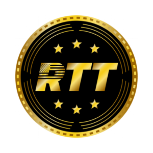 | 66421 | RTT | Restore Truth Token |
|  | 65369 | CWE | Chain Wars |
| 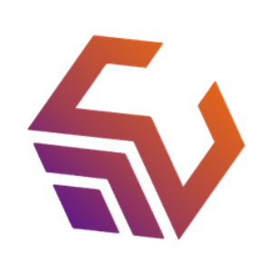 | 64097 | CLX | CargoLink |
| 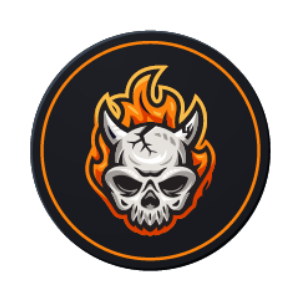 | 65465 | DRACE | DeathRoad |
| 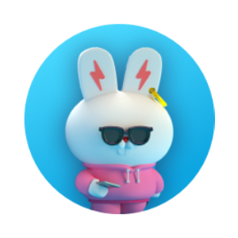 | 65503 | BG | BunnyPark Game |
|  | 65341 | NUKE | Nuke Token |
|  | 64081 | DFAI | DeFiAI |
|  | 65457 | ARCANE | Arcane Token |
|  | 63945 | IXIR | Ixirswap |
|  | 64073 | BABYTETHER | BABY TETHER |
|  | 64159 | $WINU | Walter Inu |
|  | 63693 | ELLO | Ichello |
|  | 63411 | TDG | Teddy Dog |
| 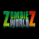 | 63409 | ZWZ | Zombie World Z |
|  | 63559 | NOBF | Nobo Finance |
|  | 61761 | SURV | Survival Game Online |
|  | 63075 | YON | YESorNO |
|  | 61633 | ALTS | AltSwitch |
| 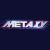 | 61515 | MXY | Metaxy |
|  | 61929 | WSO | Widi Soul |
|  | 61505 | BANK$ | Bankers Dream |
|  | 62027 | DOGEFOOD | DogeFood |
|  | 61959 | SMARTSHIB | Smart Shiba |
|  | 61697 | EVRF | EverReflect |
| 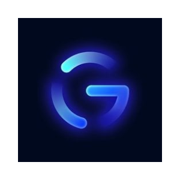 | 62903 | GMI | GamiFi |
| 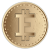 | 61525 | ELONGRAB | Elongrab |
|  | 61753 | SPACES | AstroSpaces.io |
| 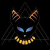 | 63201 | ONYX | Onyx |
|  | 63713 | HTF | Healthify |
| 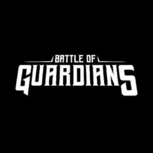 | 62043 | BGS | Battle of Guardians Share |
| 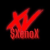 | 61565 | XENOX | Xenoverse Crypto |
|  | 61933 | ETHE | ETHEKing |
| 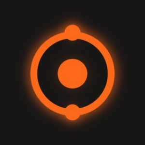 | 63219 | ORBIT | Orbit Token |
|  | 62927 | RIPH | Harambe Protocol |
|  | 61751 | MVD | MvPad |
| 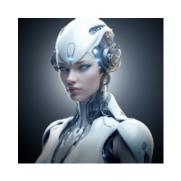 | 62997 | MVERSE | MaticVerse |
| 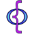 | 61549 | PYO | Pyrrho DeFi |
|  | 63611 | $CLEAR | Clear Water |
|  | 61707 | TBL | Tank Battle |
|  | 63063 | RXC | Ran x Crypto |
|  | 63517 | ATHENASV2 | Athenas |
| 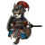 | 61485 | FIRSTDOGE | FirstDoge |
| 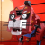 | 63609 | SHENGWEIHU | Shengweihu |
|  | 62075 | VDORA | VeldoraBSC |
| 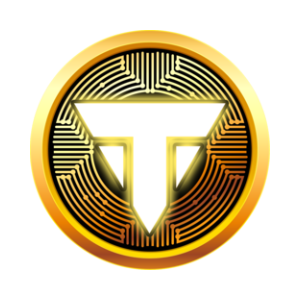 | 63893 | TAUM | Orbitau Taureum |
|  | 63465 | FLOV | Valentine Floki |
|  | 61719 | ULAB | Unilab |
|  | 62025 | CMF | Crypto Makers Foundation |
|  | 62089 | BLINU | Baby Lambo Inu |
| 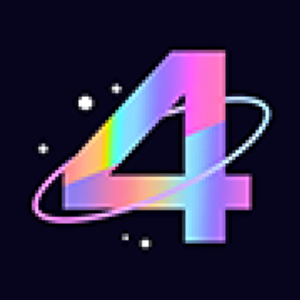 | 61487 | 4MW | 4MW |
|  | 63191 | FLOKICOKE | FlokiCoke |
|  | 61663 | WARE | Warrior Rare Essentials |
| 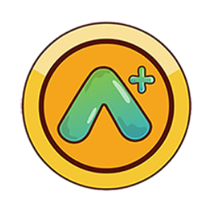 | 62099 | ASIX | ASIX |
|  | 61887 | MSPACE | Metaspace |
|  | 63491 | $SANDWICH | Sandwich Network |
| 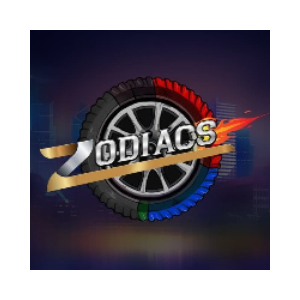 | 61827 | ZDCV2 | ZodiacsV2 |
|  | 61443 | GOBLIN | Goblin |
|  | 60799 | CSHIP | CryptoShips |
| 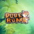 | 61095 | DRUN | Doge Run |
|  | 60557 | SNAP | SnapEx |
|  | 61325 | BMCC | Binance Multi-Chain Capital |
|  | 60783 | VOYCE | Voyce |
|  | 60389 | SVT | SpaceVikings |
| 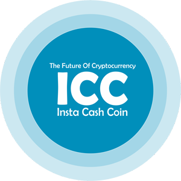 | 61191 | ICC | Intergalactic Cockroach |
|  | 61059 | ULAND | ULAND |
|  | 61321 | PULI | Puli |
| 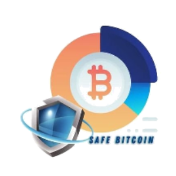 | 60395 | SAFEBTC | SafeBitcoin |
| 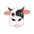 | 60249 | CI | Cow Inu |
|  | 60751 | WEBFOUR | WEBFOUR |
| 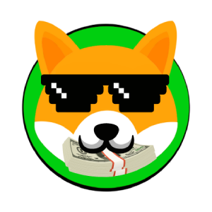 | 60747 | SHIBADOLLARS | Shiba Dollars |
|  | 60767 | RVZ | Revoluzion |
| 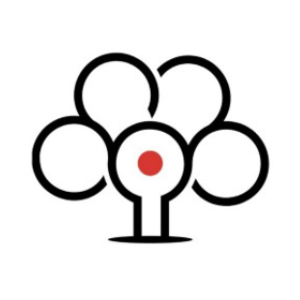 | 61327 | LEPA | Lepasa |
|  | 61215 | XWAP | SwapX |
| 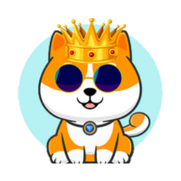 | 60309 | KFR | KING FOREVER |
| 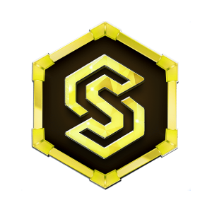 | 60571 | SOM | Somnium |
| 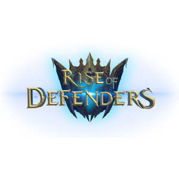 | 61219 | RDR | Rise of Defenders |
| 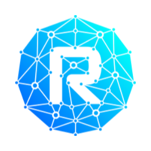 | 61319 | RVL | REVIVAL |
|  | 60691 | ESC | The Essential Coin |
| 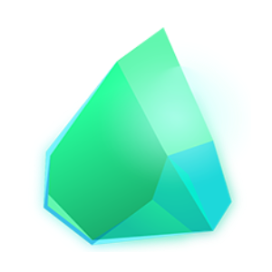 | 61125 | FOA | Fragments of Arker |
|  | 61389 | TGNB | Tiger Token |
| 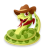 | 61183 | COWS | Cowboy Snake |
|  | 60879 | BPLUS | Billionaire Plus |
|  | 60645 | MRFLOKI | MarioFloki |
|  | 60431 | WEGRO | WeGro |
|  | 61235 | WDO | WatchDO |
|  | 61257 | DIBS | Dibs Money |
|  | 60685 | EFUN | EFUN |
|  | 60367 | YLB | Yearnlab |
| 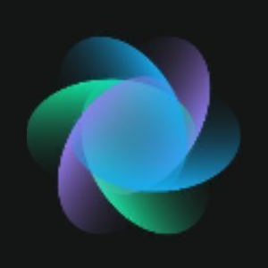 | 60655 | MEB | Meblox Protocol |
|  | 61137 | RLQ | Realliq |
|  | 59417 | SYKLE | Reesykle |
|  | 59697 | TGB | Traders Global Business |
|  | 59691 | TANUKI | Tanuki Token |
|  | 59875 | JETS | JeToken |
|  | 59811 | LORDA | Lord Arena |
|  | 59559 | WIDI | WidiLand |
|  | 59409 | INCOME | Income Island |
|  | 59567 | REGU | RegularPresale |
| 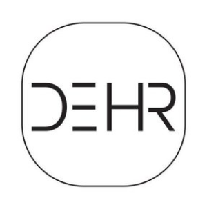 | 60145 | DHR | DeHR Network |
|  | 59951 | MINIBTC | MiniBTC |
|  | 59575 | TAKEDA | Takeda Shin |
|  | 59671 | BUFFS | BuffSwap |
|  | 59425 | MARSDOGE | Mars Doge |
| 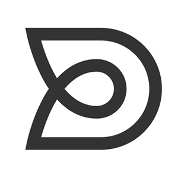 | 59149 | DDL | DeFi Degen Land |
| 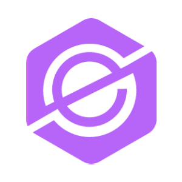 | 59485 | ELEN | Everlens |
| 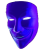 | 59629 | ANOM | Anomus Coin |
|  | 59263 | CANNA | The CanCoin |
| 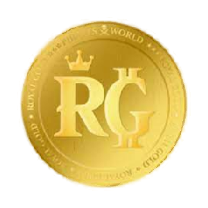 | 59757 | RGOLD | Royal Gold |
|  | 59301 | TOSHINORI | Toshinori Inu |
|  | 59861 | HPL | Happy Land |
| 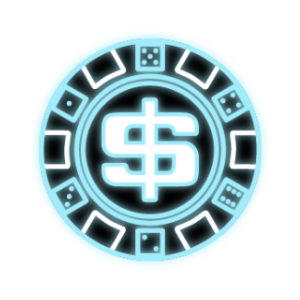 | 60017 | SLAM | Slam Token |
| 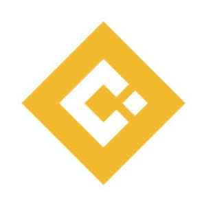 | 60151 | IBNB | iBNB |
|  | 59727 | BECOIN | bePAY Finance |
|  | 59965 | MASTER | Beast Masters |
| 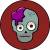 | 59735 | ZOMFI | Zomfi |
| 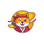 | 59603 | SHIBGX | ShibaGalaxy |
|  | 59705 | COX | Coxswap |
|  | 59597 | METASFM | MetaSafeMoon |
| 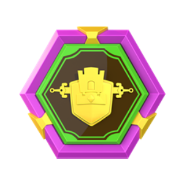 | 59269 | HTD | Heroes TD |
|  | 59843 | LMN | Lemonn |
|  | 60023 | SCROOGE | Scrooge |
|  | 58969 | DBTYCOON | DeFi Bank Tycoon |
| 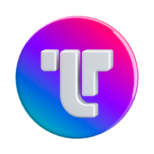 | 58395 | TRIBEX | Tribe Token |
| 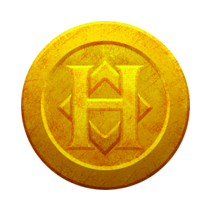 | 58879 | BNBH | BnbHeroes Token |
|  | 58399 | RU | RIFI United |
|  | 58917 | MAGICDOGE | MagicDOGE |
| 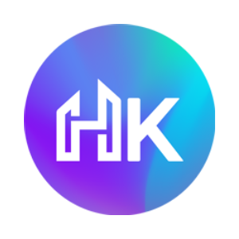 | 57805 | HK | Helkin |
| 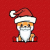 | 58947 | SANINU | Santa Inu |
|  | 59107 | SWCAT | Star Wars Cat |
|  | 58687 | GAMINGDOGE | Gaming Doge |
|  | 58633 | LTNV2 | Life Token v2 |
|  | 58827 | NFMON | NFMonsters |
|  | 59021 | RLOKI | Floki Rocket |
| 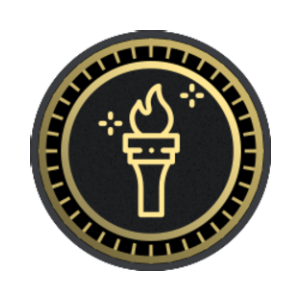 | 57763 | CHIM | Chimeras |
|  | 58811 | CKT | Caketools |
| 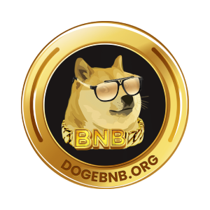 | 57495 | DOGEBNB | DogeBNB.org |
| 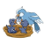 | 59023 | HUNGER | Hunger Token |
| 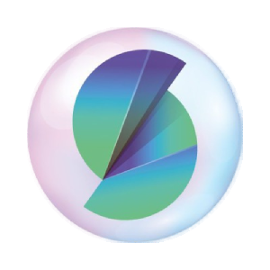 | 57509 | NFTSTYLE | NFTStyle |
| 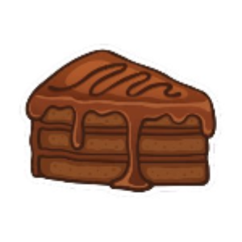 | 59119 | BROWN | BrowniesSwap |
| 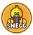 | 58517 | NEGG | Nest Egg |
|  | 57553 | KSW | KillSwitch |
| 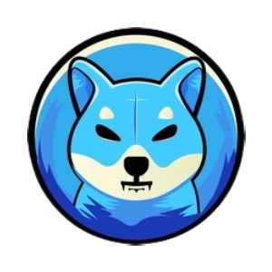 | 58185 | BSHIB | BuffedShiba |
|  | 58783 | SWPT | SwapTracker |
| 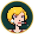 | 58445 | NFTPUNK2.0 | NFTPunk |
|  | 57987 | BABYFD | Baby Floki Doge |
|  | 57363 | TXS | TIMEXSPACE |
|  | 58161 | BIDOG | Binancedog |
| 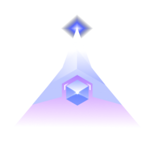 | 58729 | SIP | Space SIP |
|  | 58717 | POM | Pomeranian |
| 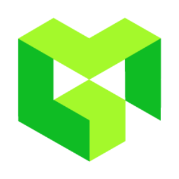 | 58715 | MIRAI | Mirai Token |
|  | 58053 | ALGOPAD | AlgoPad |
| 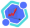 | 58831 | FRET | Future Real Estate Token |
|  | 58713 | CLIST | Chainlist |
| 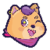 | 58313 | GOGE | DogeGaySon |
| 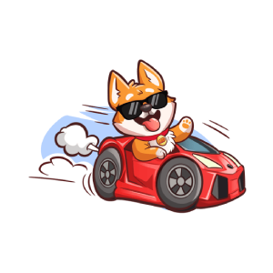 | 58853 | SHIBU | Shibu Life |
|  | 57493 | ZFAI | Zafira |
| 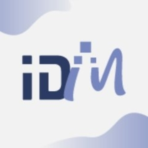 | 58567 | IDM | IDM Token |
| 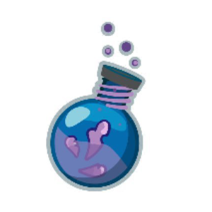 | 59085 | ELIXIR | Starchi |
| 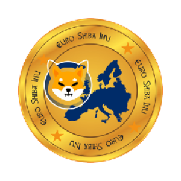 | 58355 | ESHIB | Shiba Elon |
|  | 58357 | SCIE | Scientia |
| 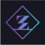 | 58387 | ZUF | ZuFinance |
|  | 59041 | SEAMLESS | SeamlessSwap Token |
|  | 58021 | BNBEER | BNBeer |
|  | 58393 | NFA | NFTFundArt |
|  | 57347 | FLOBO | FlokiBonk |
| 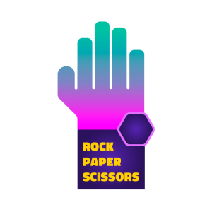 | 59031 | RPS | Rps League |
| 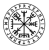 | 58987 | GULL | PolyGod |
| 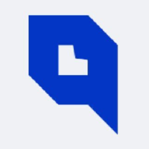 | 56853 | BITORB | BitOrbit |
|  | 56049 | PANGOLIN | Pangolinswap |
|  | 56765 | DYNA | Dynamix |
| 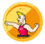 | 56967 | UCHAD | UltraChad |
|  | 56905 | WNDG95 | Windoge95 |
|  | 57007 | NFTG | NFT Global Platform |
|  | 56063 | BABYFLOKICOIN | Baby Floki Coin |
| 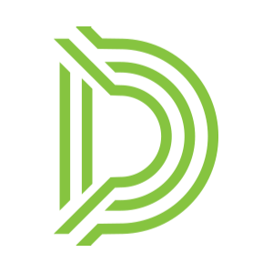 | 56621 | DVDX | Derived |
|  | 56587 | MINERS | MinersDefi |
|  | 56943 | CRACE | Coinracer |
|  | 56017 | TWO | 2gather |
|  | 56951 | FLOKIM | Flokimooni |
|  | 57273 | DADDYUSDT | DaddyUSDT |
|  | 56093 | BSCM | BSC MemePad |
|  | 56705 | PSN | Polkasocial Network |
|  | 57215 | EPICHERO | EpicHero |
| 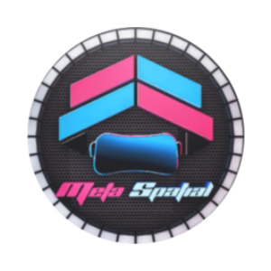 | 57005 | SPAT | Meta Spatial |
|  | 56293 | FCB | ForceCowBoy |
|  | 57123 | SEADOG | Seadog Metaverse |
|  | 57243 | MOONER | CoinMooner |
| 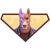 | 56935 | FAFI | Famous Five |
|  | 56627 | MSH | CRIR MSH |
| 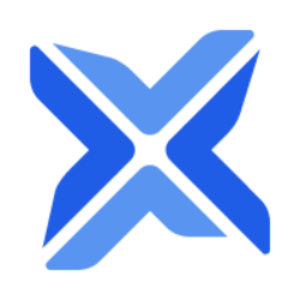 | 56795 | CXPAD | CoinxPad |
|  | 56067 | AGSPAD | Aegis Launchpad |
|  | 54403 | EBIRD | Early Bird |
|  | 55931 | MOMENTO | Momento |
| 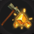 | 54847 | UMG | UnderMineGold |
|  | 54187 | CPHR | PolkaCipher |
|  | 55971 | KHALIFA | Khalifa Finance |
| 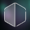 | 54643 | NFTPAD | NFTPad |
| 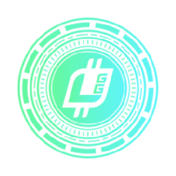 | 54095 | ULTGG | UltimoGG |
|  | 55729 | NPI | Ninja Panda Inu |
| 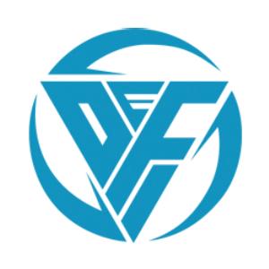 | 55347 | DEFC | DeFi Coin |
|  | 55089 | REUM | Rewardeum |
|  | 55417 | FNDZ | FNDZ Token |
|  | 55847 | MOJOV2 | Mojo V2 |
| 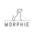 | 55911 | MRFI | Morphie |
| 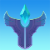 | 54901 | HEROEGG | HeroFi |
|  | 55609 | HAVEN | Haven Token |
| 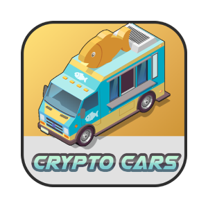 | 54785 | CCAR | CryptoCars |
|  | 55485 | CCDOGE | Community Doge Coin |
| 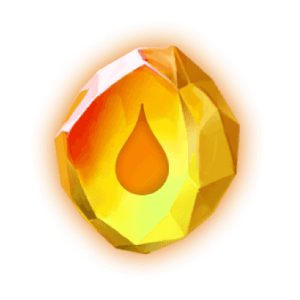 | 54815 | SMON | Starmon Metaverse |
| 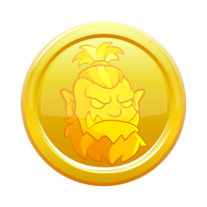 | 54747 | YAG | Yaki Gold |
| 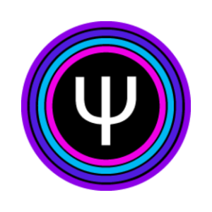 | 55003 | QA | Quantum Assets |
| 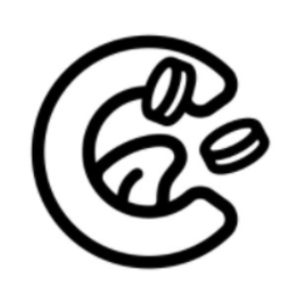 | 54001 | BURP | Burp |
| 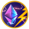 | 55667 | THUNDERETH | ThunderETH |
|  | 55455 | KISHUBABY | Kishu Baby |
|  | 53773 | OSWAP | OpenSwap |
| 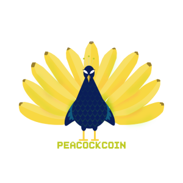 | 49765 | PEKC | Peacockcoin |
| 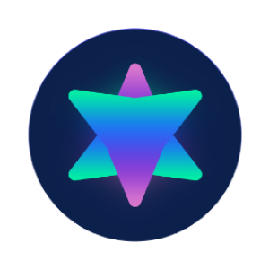 | 50733 | SAFESTAR | Safestar |
|  | 50351 | WNTR | Weentar |
|  | 52327 | MEONG | Meong Token |
| 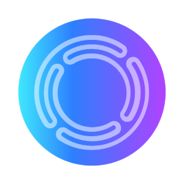 | 50291 | LOF | LonelyFans |
|  | 50447 | HYFI | Hyper Finance |
| 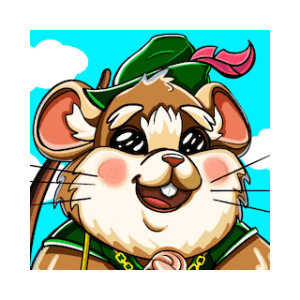 | 50045 | SAFEHAMSTERS | SafeHamsters |
|  | 49701 | X2P | Xenon Pay |
| 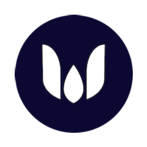 | 51659 | WAD | Warden |
|  | 51737 | ZFARM | ZFarm |
|  | 49781 | PANTHER | PantherSwap |
|  | 51159 | INVEST | InvestDex |
|  | 49651 | CLEANOCEAN | CleanOcean |
| 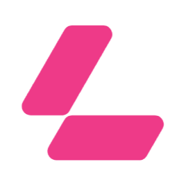 | 47647 | LDFI | Lendefi Token |
|  | 49373 | BSCGOLD | BSCGold |
|  | 47479 | NIF | Unifty |
|  | 45256 | TIIM | TriipMiles |
| 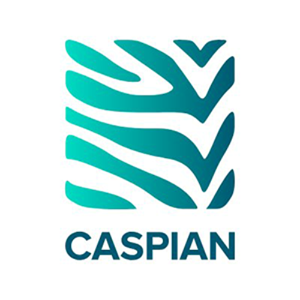 | 33735 | CSP | Caspian |
|  | 33769 | MHC | #MetaHash |
|  | 34408 | JAR | Jarvis+ |
| 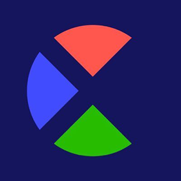 | 34390 | CIX100 | Cryptoindex.com 100 |
|  | 32972 | FKX | Knoxstertoken |
| 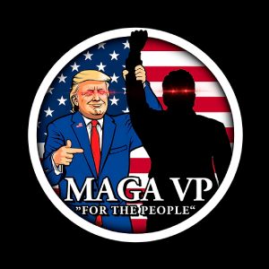 | 32792 | MVP | Merculet |
|  | 33427 | SNTVT | Sentivate |
| 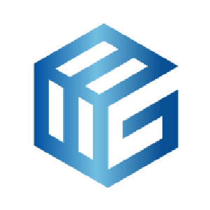 | 33436 | GMB | GAMB |
| 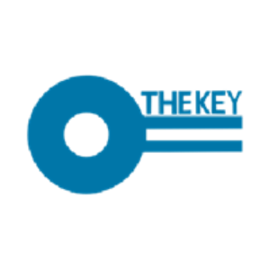 | 32363 | TKY | THEKEY |
|  | 69149 | MOONWILLY | MoonWilly |
|  | 68595 | LTY | Ledgity |
|  | 65627 | CAKEBANK | Cake Bank |
|  | 65859 | TNGL | Tangle |
|  | 65225 | SHOO | SHOOT |
|  | 61743 | METAVS | MetaVersus |
| 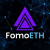 | 60663 | FOMOETH | FomoETH |
| 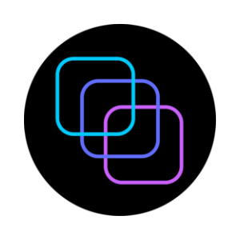 | 62953 | HOR | Horde |
|  | 61749 | WEBOO | WebooSwap |
|  | 60335 | METAFLIP | MetaFlip |
| 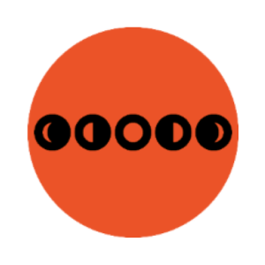 | 58605 | 2022M | 2022MOON |
|  | 59513 | HRO | CryptoDiceHero |
|  | 60167 | DNKY | AstroDonkey |
|  | 56649 | WHE | Worthwhile |
| 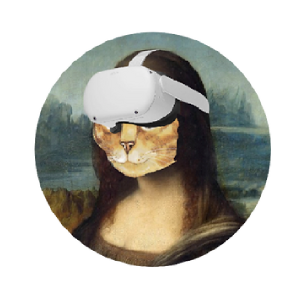 | 57143 | METACAT | MetaCat |
|  | 56729 | LECLIENTE | LE CALIENTE |
| 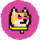 | 57575 | HORNY | Horny Doge |
|  | 58293 | GHSP | Ghospers Game |
|  | 57803 | 1BOX | 1BOX |
|  | 55095 | MNSTRS | Block Monsters |
| 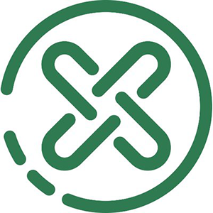 | 55213 | AXC | AXIA Coin |
|  | 51907 | MEM | Memecoin |
| 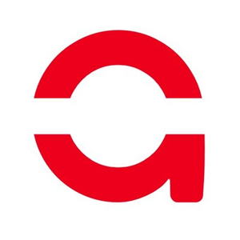 | 32497 | ADB | adbank |
|  | 71467 | HEE | beFITTER Health |
|  | 67897 | YMPA | YmplePay |
| 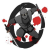 | 61231 | KTZ | KILLTHEZERO |
| 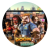 | 60821 | DHG | Doom Hero Game |
|  | 61917 | IWR | Inu Wars |
| 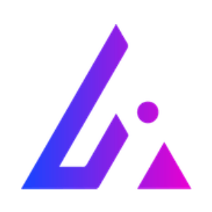 | 63053 | AFT | Ape Fun Token |
| 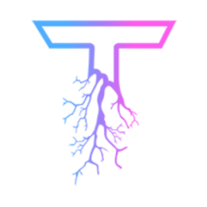 | 61683 | TRNDZ | Trendsy |
| 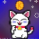 | 62809 | KTY | Krypto Kitty |
| 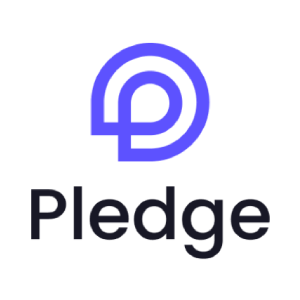 | 61567 | PLGR | Pledge |
| 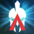 | 60251 | AKL | Akil Coin |
|  | 59753 | RIDES | Bit Rides |
|  | 60503 | IGO | Meta Islands |
| 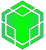 | 57989 | JFM | JustFarm |
|  | 58311 | SPEP | Stadium Pepe |
| 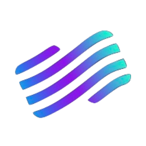 | 56671 | ZKT | zkTube |
|  | 57361 | FREEMOON | Freemoon |
| 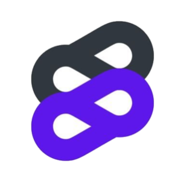 | 57199 | MYNE | ITSMYNE |
|  | 54779 | BABYUSDT | BabyUSDT |
|  | 47571 | DITTO | Ditto |
| 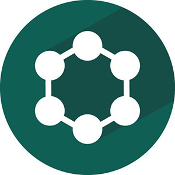 | 33022 | ZCR | ZCore |
|  | 97717 | MUZZ | MuzzleToken |
|  | 88525 | MDCX | MDCx |
| 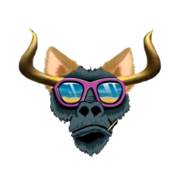 | 86139 | ABI | Abachi |
|  | 59721 | WSN | WallStreetNinja |
|  | 60745 | AGGL | aggle.io |
|  | 59565 | DOGERISEUP | Doge Rise Up |
|  | 57197 | BABYCATGIRL | BabyCatGirl |
| 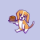 | 56253 | BEAGLECAKE | BeagleCake |
| 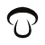 | 55185 | FNG | Fungie DAO |
| 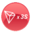 | 43087 | TRX3S | TRX3S |
| 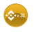 | 43161 | BNB3L | BNB3L |
|  | 43165 | BSV3S | BSV3S |
|  | 89007 | FREQAI | FREQAI |
|  | 79069 | ABB | Astro Babies |
| 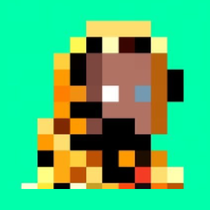 | 78187 | SPUNK | Shiba Punkz |
|  | 78695 | TSY | Token Shelby |
|  | 68251 | 1TRC | 1TRONIC |
|  | 61993 | RMOG | Reforestation Mahogany |
| 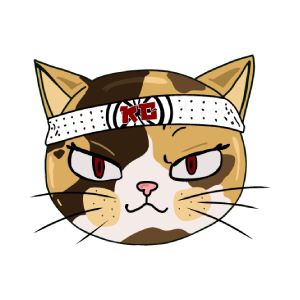 | 60497 | KARA | KaraStar |
| 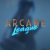 | 59507 | ARCANELEAGUE | ArcaneLeague |
|  | 59773 | FLOSHIN | Floshin |
|  | 60143 | SFC | Solar Full Cycle |
| 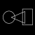 | 58741 | EVILSQUID | EvilSquidGame |
|  | 57321 | NOID | Tokenoid |
| 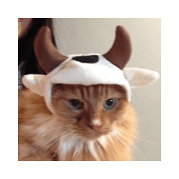 | 56325 | BULLISH | BullishApes |
|  | 86943 | REVOAI | revoAI |
|  | 88261 | CFC | Crypto Fantasy Coin |
| 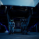 | 67403 | SSAP | Human World |
|  | 66651 | EVAPE | EveryApe BSC |
|  | 66491 | HYPERBOOST | HyperBoost |
| 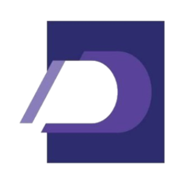 | 62951 | DDN | Den Domains |
|  | 60769 | ESOL | EVERSOL |
| 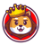 | 60195 | SIMBAINU | Simba Inu |
|  | 56487 | SUNRISE | The Sun Rises |
| 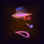 | 95035 | FIGMA | Figments Club |
|  | 88435 | FYT | FloraChain |
| 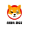 | 61661 | SHIBA22 | SHIBA2K22 |
|  | 58931 | DEVL | Devil Token |
|  | 58937 | ROCKETBUSD | RocketBUSD |
|  | 60201 | GMV | GameVerse |
| 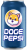 | 56507 | DOGEPEPSI | DogePepsi |
|  | 46785 | LSH | Leasehold |
| 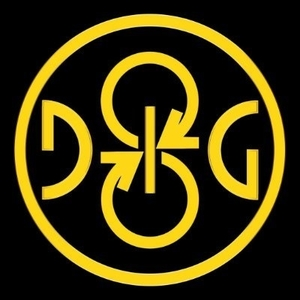 | 46258 | DFGL | DeFi Gold |
|  | 44853 | HCUT | HealthChainUS |
| 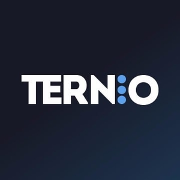 | 32788 | TERN | Ternio |
| 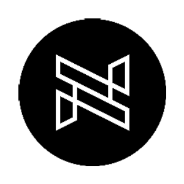 | 96163 | NIK | NIKPLACE |
| 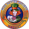 | 79291 | MADHAT | Mad Hatter Society |
|  | 69189 | MLD | Hurrian Network |
|  | 68481 | OCTANE | Octane Protocol Token |
| 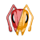 | 69769 | WANTS | Wrapped FireAnts |
|  | 63703 | $ADTX | Aurora Dimension |
|  | 63997 | MGMOON | MegaMoon |
|  | 60287 | ATHD | ATH Games |
|  | 62097 | CTS | Citrus |
|  | 61867 | ESWAPV2 | eSwapping v2 |
|  | 61583 | DELTAF | DeltaFlip |
|  | 59879 | BPKR | BlackPoker |
|  | 57411 | ERABBIT | ELONs RABBIT |
|  | 50799 | XPOSE | Xpose Protocol |
|  | 49443 | SAFESUN | SafeSun |
|  | 44866 | BTCHG | BITCOINHEDGE |
|  | 96733 | TFTC | TycoonFintech |
| 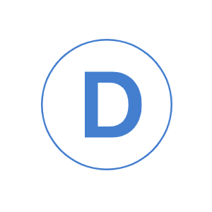 | 80177 | DVX | DRIVENx |
| 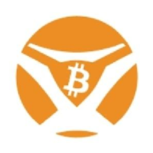 | 69235 | BCL | BitcoinLegend |
|  | 67363 | CHIWA | Chiwawa |
| 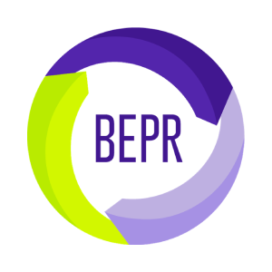 | 65985 | BEPR | Blockchain Euro Project |
|  | 64009 | WORTH | Worthpad |
| 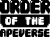 | 61103 | OAV | Order of the Apeverse |
|  | 60861 | EVERBNB | EverBNB |
|  | 59177 | SAFESHIB | SafeShiba |
|  | 57979 | OTIUM | Otium Technologies |
| 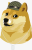 | 56823 | DGAT | Doge Army Token |
|  | 59011 | DRIVE | Safe Drive |
|  | 55343 | METAS | Metaseer |
|  | 62863 | MOR | Morcilla War |
|  | 59063 | EVERDOT | EverDot |
|  | 60351 | G9 | GoldenDiamond9 |
|  | 56889 | LLN | LunaLand |
|  | 57471 | $ROKK | Rokkit Fuel |
|  | 56381 | NEXUS | Nexus Token |
|  | 55279 | SISTA | srnArtGallery Tokenized Arts |
|  | 96187 | GRI | GOLDEN REGENT INVESTMENT |
|  | 94347 | RUNY | Runy |
| 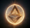 | 78425 | GENBLOK | The Genesis Block |
|  | 68667 | OLYMPIC DOGE | Olympic Doge |
| 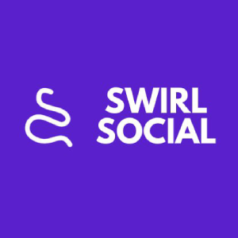 | 68995 | SWIRL | SwirlToken |
|  | 67093 | MQST | MonsterQuest |
|  | 63157 | IKA | Linkka |
|  | 61767 | OCTF | Octafarm |
|  | 63111 | PP | Pool Party |
|  | 61175 | KIK | Kikswap |
|  | 61173 | METAM | MetaMars |
| 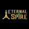 | 61843 | ENSP | Eternal Spire V2 |
| 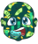 | 58965 | FOMOBABY | FOMO BABY |
|  | 58663 | OGSHIB | Original Gangsta Shiba |
| 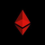 | 59003 | SOLIDETH | SolidETH |
|  | 58499 | YHC | YoHero (YHC) |
| 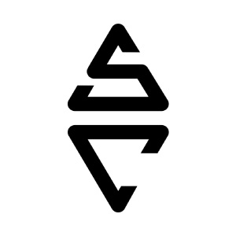 | 63253 | STEEL | Steel |
|  | 63279 | TTI | Tiara |
|  | 58435 | POORDOGE | PoorDoge |
|  | 58763 | PNDMLV | Panda Multiverse |
| 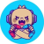 | 58507 | DGA | Doge Gamer |
|  | 56287 | LOUD | Loud Market |
| 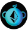 | 56747 | BABYETHV2 | BabyETH V2 |
| 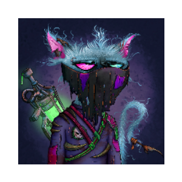 | 50651 | DIRTY | Dirty Finance |
|  | 49755 | SAFESPACE | SafeSpace |
| 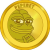 | 79111 | PEPEBET | PEPE.bet |
|  | 67811 | DLAUNCH | DeFi Launch |
|  | 65887 | CAKEPUNKS | CAKEPUNKS |
|  | 56975 | TANKS | Tanks |
|  | 58955 | TRUSTK | TrustKeys Network |
| 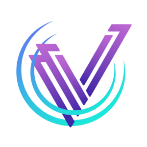 | 57885 | VFY | Verify Token |
|  | 57213 | PEAX | Prelax |
|  | 52171 | FAN8 | Fan8 |
|  | 50705 | GIFT | Gift Coin |
|  | 49121 | LABO | The Lab Finance |
|  | 45079 | ZYX | ZYX |
| 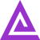 | 36563 | AUDAX | Audax |
| 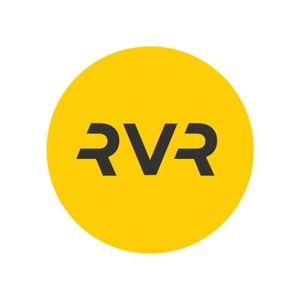 | 98875 | RVR | Reality VR |
|  | 90113 | KLX | Kalima Blockchain |
|  | 67071 | CGC | HeroesTD CGC |
| 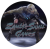 | 58309 | ZSKULL | Zombie Skull Games |
| 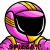 | 59759 | $PIZZA | Pizza NFT |
| 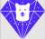 | 57205 | SPACEXDOGE | Doge Universe |
| 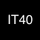 | 44440 | IT40 | FTSE MIB 40 Token |
|  | 44439 | EU50 | Euro Stoxx 50 Token |
| 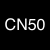 | 44438 | CN50 | FTSE China A50 Token |
| 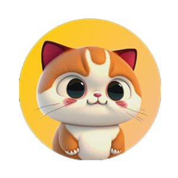 | 97049 | CHITCAT | ChitCAT |
|  | 67597 | MONSTER | Monster Valley |
| 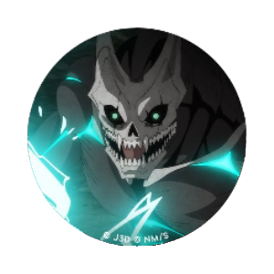 | 63215 | KAIJU | Kaiju Worlds |
| 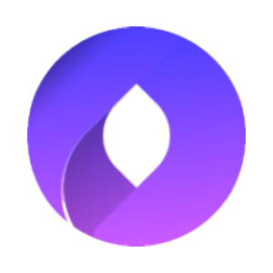 | 62969 | MCF | Max Crowdfund |
| 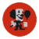 | 59151 | JKT | JokerManor Metaverse |
|  | 57999 | CHIV | Chiva Token |
|  | 56699 | LPI | LPI DAO |
|  | 52035 | GANY | Ganymede |
| 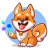 | 55359 | INDC | Nano Dogecoin |
| 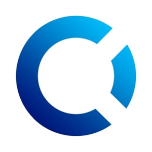 | 36598 | CRON | Cryptocean |
|  | 81431 | ICNQ | Iconic ICNQ |
|  | 69817 | BRNG | bRing.Finance |
| 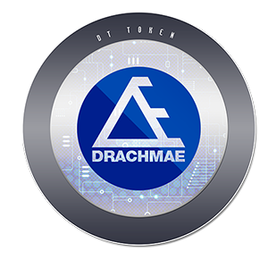 | 68509 | DRACO | Baby Soulja Boy |
|  | 62107 | BFIRE | Bitblocks Fire |
|  | 61541 | CFRESH | Coinfresh |
|  | 59257 | MOONWAY | MoonWay |
|  | 60283 | ELO INU | Elo Inu |
|  | 57981 | CAKEGIRL | Cake Girl |
| 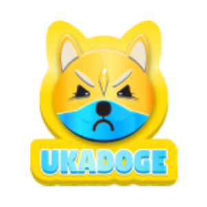 | 51929 | UDOGE | Uncle Doge |
|  | 55937 | PACIFIC | Pacific DeFi |
| 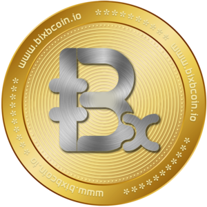 | 47747 | BIXB | BixB Coin |
|  | 45972 | YFE | YFE Money |
|  | 86749 | OKAGE | Okage Inu |
|  | 67859 | DLD | Daoland |
|  | 60805 | NX | Nxtech Network |
|  | 60081 | TRISE | TrustRise |
|  | 59037 | ROKT | Rocket |
|  | 57897 | ADVAR | Advar Protocol |
|  | 59423 | FPL | Farm Planet |
|  | 58599 | GOOFYDOGE | GoofyDoge |
| 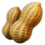 | 57311 | PEANUTS | Peanuts |
|  | 57171 | SHIBADUFF | ShibaDuff |
| 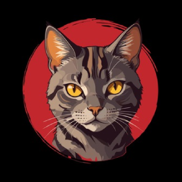 | 86747 | TORA | Tora Inu |
|  | 59381 | SQUIRT | Squirt Game |
|  | 57235 | NFTASCII | NFTASCII |
| 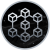 | 56769 | DELOS | Delos Defi |
|  | 48367 | TREAT | TreatDAO |
|  | 85975 | ZOGI | ZOGI |
| 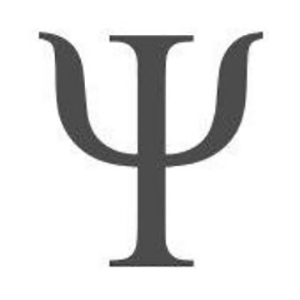 | 65157 | IVN | Investin |
|  | 60379 | LAZYSHIBA | Lazy Shiba |
|  | 79019 | ANTX | AntNetworX |
|  | 67223 | CGAZ | CryptoGamez |
| 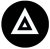 | 68725 | BRANK | Brank |
|  | 61961 | FEENIXV2 | ProjectFeenixv2 |
|  | 59747 | GLOW | Glow |
| 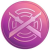 | 57061 | XBLADE | CryptoWar xBlade |
|  | 51019 | SBEAR | yBEARSwap |
|  | 71397 | FBA | Firebird Aggregator |
|  | 68197 | CSCT | Corsac v2 |
|  | 67579 | HORGI | Horgi |
| 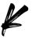 | 68453 | KFAN | KFan Token |
|  | 67853 | WSSCR | Wrapped Staked SCR |
| 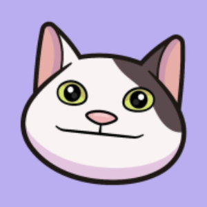 | 66367 | BELUGA | Beluga.fi |
|  | 61871 | FVP | FisherVsPirate |
|  | 60461 | PURPLEFLOKI | Purple Floki Inu |
|  | 60289 | MNTTBSC | MoonTrustBSC |
|  | 60813 | KINO | Kino |
| 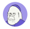 | 59835 | COAPE | Council of Apes |
|  | 59769 | HWXT | Howlx |
|  | 56531 | RWSC | RewardsCoin |
|  | 79555 | UTC | Unitech |
| 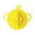 | 68729 | BABYETH | BabyEth |
|  | 70305 | ADXX | AnonyDoxx |
|  | 68523 | WSYS | Wrapped Syscoin |
| 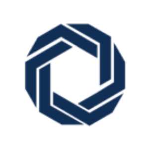 | 66641 | FDM | Freedom |
| 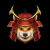 | 67791 | INUGAMI | Inugami |
|  | 63331 | FEB | ForeverBlast |
|  | 62021 | $CASIO | CasinoXMetaverse |
| 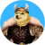 | 61557 | BUFLOKI | Buff Floki |
|  | 60877 | PANDAVS | My Pandaverse |
|  | 59825 | YOSI | Yoi Shiba Inu |
| 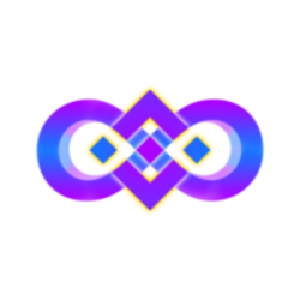 | 58197 | FBNB | ForeverBNB |
|  | 59061 | IDOSCAN | Idoscan |
|  | 50349 | SOME | Mixsome |
|  | 48299 | BNW | NagaSwap |
|  | 97723 | 1COIN | 1COIN |
|  | 59585 | ZNS | Zeronauts |
| 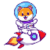 | 58379 | MARTIANDOGE | MartianDoge |
| 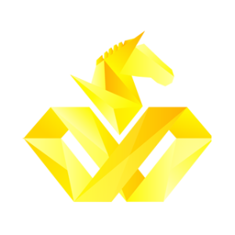 | 82677 | METAF | METAFASTEST |
| 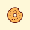 | 65599 | BAGEL | Bagels Finance |
|  | 63237 | IMC | i Money Crypto |
|  | 57579 | TROLLER | The Troller Coin |
|  | 57599 | LR | Looks Rare |
|  | 55209 | RD | Round Dollar |
|  | 50167 | SHIBAPUP | ShibaPup |
| 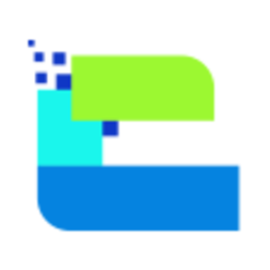 | 34603 | CCP | CryptoCoinPay |
|  | 94455 | FARB | Arb Furbo |
| 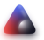 | 79747 | LICP | Liquid ICP |
|  | 66925 | ADAFLECT | ADAFlect |
| 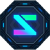 | 82247 | SALO | SALO Players |
|  | 80435 | SRS | Sirius Finance |
| 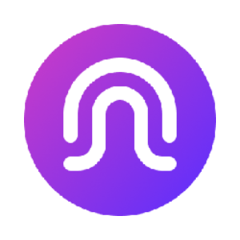 | 69397 | NUDES | NUDES |
| 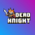 | 67235 | DKM | Dead Knight |
|  | 64145 | HARL | HarmonyLauncher |
| 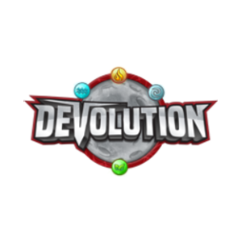 | 58705 | DEVO | DeVolution |
| 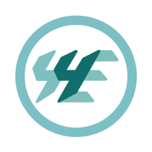 | 58759 | YYE | YYE Energy |
|  | 58187 | TIGERBABY | Tiger Baby |
| 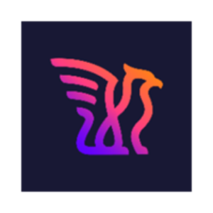 | 55125 | GART | Griffin Art |
|  | 55105 | AVXL | AvaXlauncher |
| 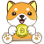 | 55547 | DGSTB | Dogestribute |
|  | 50365 | TATA | Hakuna Matata |
| 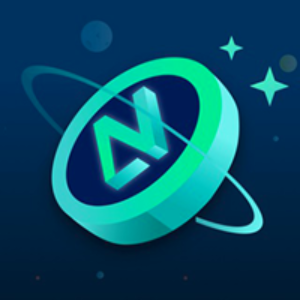 | 45574 | ZYRO | Zyro |
|  | 44692 | DMG | DMM: Governance |
|  | 44079 | FX1 | FANZY |
|  | 78821 | MIKABOSHI | Amatsu-Mikaboshi |
|  | 69067 | $HRIMP | WhaleStreet $hrimp Token |
| 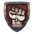 | 60083 | SRGT | Severe Rise Games |
| 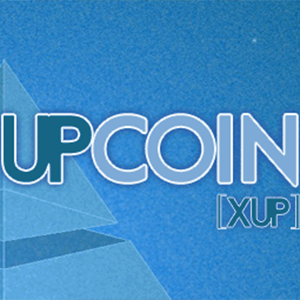 | 55853 | UPCOIN | Upcoin |
| 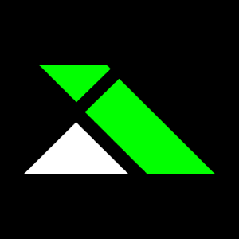 | 97963 | INRX | INRx |
|  | 82363 | NUGEN | NUGEN COIN |
|  | 71533 | PRAY | Pray |
| 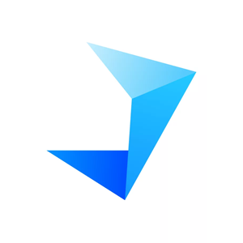 | 69821 | JCR | JustCarbon Removal |
|  | 67793 | 0XPAD | 0xPAD |
|  | 61357 | SPROUT | The Plant Dao |
|  | 58477 | CPTL | Capitol |
| 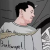 | 57587 | BANKWUPT | Bankwupt |
| 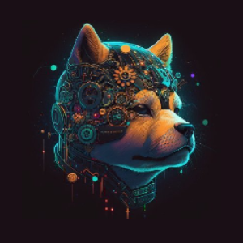 | 88215 | AIFLOKI | AI Floki |
| 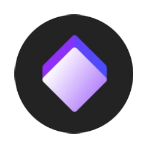 | 76633 | NFTP | NFT TOKEN PILOT |
|  | 70213 | FAVOR | Favor |
| 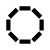 | 67315 | NOOFT | Nooft |
|  | 63287 | BOON | Baboon Financial |
|  | 61909 | DECENT | DECENT Database |
|  | 58239 | UTOPIA | Utopia |
| 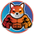 | 58267 | BUFFSHIBA | Buff Shiba Inu |
|  | 33357 | ZDR | Zloadr |
| 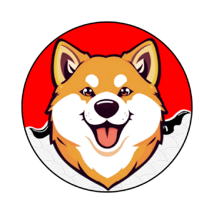 | 90865 | JAI | Jarvis AI |
| 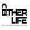 | 61803 | OTL | OtherLife |
|  | 60989 | ICEBERG | ICEBERG |
| 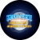 | 57965 | TSUGA | Tsukiverse:Galactic Adventures |
|  | 70915 | BFORM | Blatform |
| 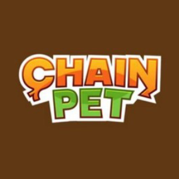 | 67765 | CPET | Chain Pet |
| 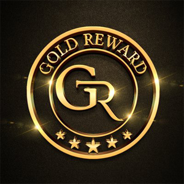 | 60591 | GRX | GravitX |
|  | 98321 | PSYCHO | Psycho |
| 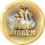 | 82143 | DOGEDIGGER | Doge Digger |
| 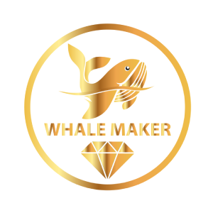 | 78643 | WMF | Whale Maker Fund |
|  | 60093 | FANT | Phantasia |
|  | 58721 | SIMPLY | Simply |
| 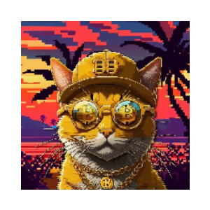 | 58219 | OPCAT | OptimusCat |
|  | 68955 | META CAR | Meta Car |
|  | 66991 | FUR | Pagan Gods Fur token |
|  | 61859 | $UPL | Universal Pickle |
|  | 62039 | TCW | TCW Token |
|  | 61447 | $DBET | DefiBet |
| 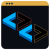 | 63311 | CDDSP | Can Devs Do Something Please |
|  | 61951 | RAHO | Radio Hero |
| 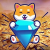 | 59935 | DS$ | DiamondShiba |
|  | 60111 | ZOMI | ZOMI |
| 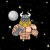 | 58455 | UFLOKI | Universal Floki Coin |
|  | 68811 | ROMEODOGE | Romeo Doge |
|  | 66555 | PITQD | Pitquidity-BSC |
|  | 63231 | ZBT | Zoobit |
|  | 59661 | WETA | WETA VR |
|  | 60223 | WNNW | WinNow |
|  | 57043 | NELO | NELO Metaverse |
|  | 58863 | SBY | Shelby Token |
|  | 58835 | DADDYETH | DaddyETH |
| 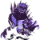 | 58247 | ETHZILLA | EthZilla |
| 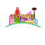 | 59207 | COUNTY | County Metaverse |
| 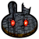 | 59523 | BCAKE | Burnt Cake |
|  | 57465 | GREM | Gremlins Finance |
|  | 58523 | GNNX | Gennix |
|  | 57033 | LUTO | Luto Cash |
|  | 59001 | SOSX | SocialX |
|  | 57779 | NOMY | NOMY |
|  | 57487 | PSHIBAX | PumpShibaX |
|  | 58031 | LEAFTY | Leafty |
|  | 58573 | CEVO | CardanoEvo |
|  | 56415 | B8 | Binance8 |
| 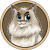 | 55503 | MURPHY | MURPHYCAT |
|  | 56603 | BABYHARMONY | BabyHarmony |
|  | 49459 | GGIVE | GlobalGive |
| 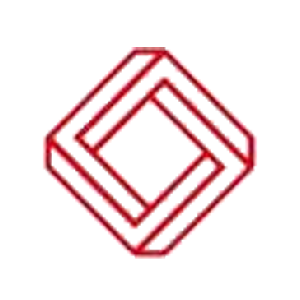 | 45123 | PERX | PeerEx Network |
|  | 76427 | MACH | MACH Project |
|  | 70359 | TSG | The Soldiers Gold |
| 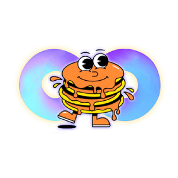 | 68247 | INCAKE | InfinityCake |
|  | 68313 | FSTAR | Future Star |
|  | 56917 | EINSTEIN | Polkadog V2.0 |
|  | 57089 | BIGETH | BIG ETH |
| 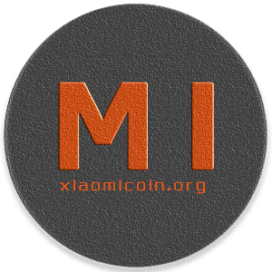 | 58033 | MI | MosterIsland |
| 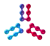 | 57489 | AVEX! | Aevolve Token |
|  | 56161 | ANFT | Artwork NFT |
|  | 55585 | DRDOGE | DrDoge |
|  | 49557 | PMP | Pumpy Farm |
|  | 90735 | EMS | Ethereum Message Service |
|  | 68199 | BCM | BitcoinMoney |
|  | 69611 | PSTN | Piston |
| 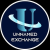 | 67643 | UTIP | uTip |
|  | 67659 | TTY | Trinity |
|  | 63689 | SSM | Satoshi Monsters |
|  | 63399 | ISO | IsotopeC |
|  | 58641 | PFW | Perfect World |
|  | 58403 | GENSHIN | Genshin NFT |
|  | 44845 | GRW | GrowthCoin |
|  | 44216 | FLAPX | FlapX |
|  | 44447 | 421 | FourTwentyOne |
|  | 44213 | DIYT | DIY Tube Coin |
|  | 43032 | IVC | Invoice Coin |
|  | 44404 | BDCASH | BigdataCash |
| 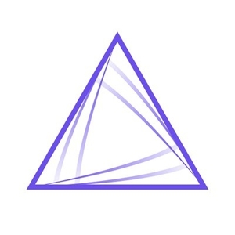 | 42236 | PVP | PlayerVsPlayerCoin |
|  | 42509 | BCCX | BlockChainCoinX |
|  | 42240 | LCNT | Lucent |
|  | 42516 | BYND | Beyondcoin |
|  | 42254 | OHMC | Ohmcoin |
|  | 41701 | CGB | Crypto Global Bank |
|  | 36529 | ZARH | Zarcash |
| 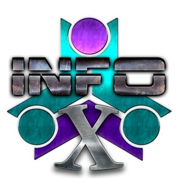 | 36526 | INFO | INFO Coin |
|  | 33482 | GXX | GravityCoin |
| 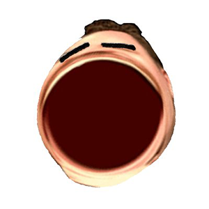 | 34763 | JMC | Junson Ming Chan Coin |
|  | 34536 | REEX | Reecore |
| 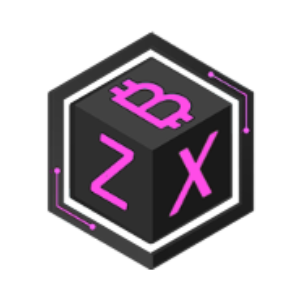 | 33683 | BZX | Bitcoin Zero |
| 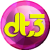 | 33280 | DT3 | DreamTeam3 |
| 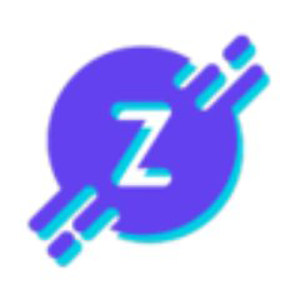 | 33242 | ZND | Zenad |
|  | 33328 | AGU | Agouti |
|  | 3240 | MNC | Mincoin |
|  | 3239 | SPRTS | Sprouts |
|  | 3314 | DMB | Digital Money Bits |
| 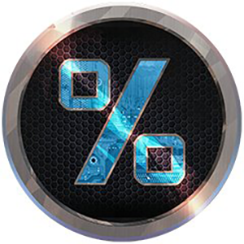 | 32245 | OPC | OP Coin |
| 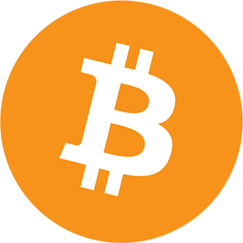 | 30638 | BCC | BitConnect |
| 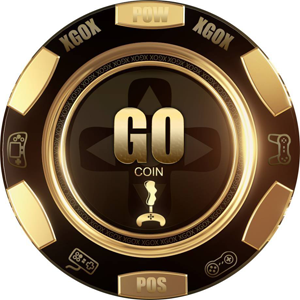 | 2539 | XGOX | XGOX |
|  | 1392 | SLOTH | SlothCoin |
| 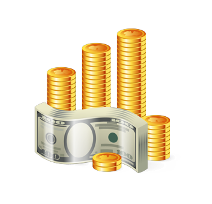 | 358 | 611 | SixEleven |
| 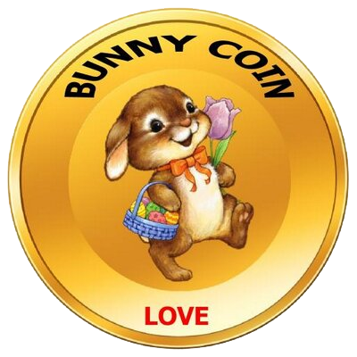 | 1284 | BUN | BunnyCoin |
|  | 91157 | PWRC | PWRCASH |
|  | 90999 | SEEDX | SEEDx |
| 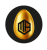 | 94019 | MARAN | MaranBet |
|  | 82383 | FRL | Fireal |
| 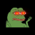 | 96791 | FADE | Fade |
| 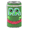 | 97197 | PEPECOLA | PepeCola |
|  | 70875 | BOXCH | Boxch |
|  | 70431 | BXS | Bancambios AX |
|  | 77241 | ALTRU | Altrucoin |
|  | 68881 | TRTLS | Turtles Token |
|  | 67915 | MILLI | MILLIONSY |
| 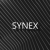 | 66939 | MINECRAFT | Synex Coin |
|  | 66111 | SOLUM | Solum |
|  | 66591 | ISOLA | Intersola |
| 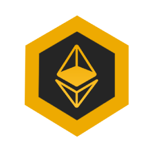 | 80171 | EHIVE | eHive |
|  | 78285 | SLX | Solex Finance |
|  | 66135 | OSK | OSK |
| 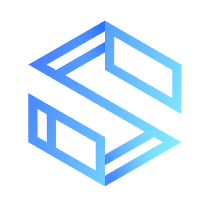 | 68059 | SWAN | Swanlana |
|  | 67537 | CHIH | ChihuahuaSol |
| 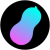 | 67709 | SOLNUT | Solana Nut |
|  | 58209 | ROYALADA | RoyalADA |
|  | 55951 | NAXAR | Naxar |
|  | 36543 | ELPH | Elphyrecoin |
| 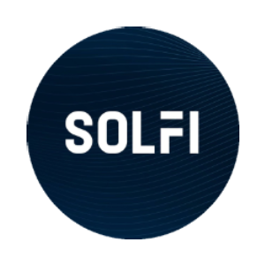 | 66333 | SOLFI | Solfina |
| 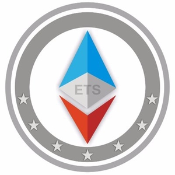 | 60299 | ETS | Ethersniper |
|  | 58755 | WLFGRL | Wolfgirl |
|  | 56135 | DELO | Decentra-Lotto |
|  | 81263 | NTIC | Entice |
| 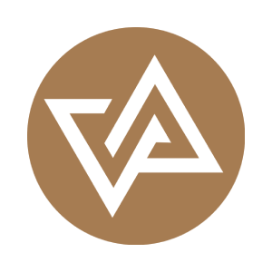 | 79595 | IVAR | Ivar Coin |
| 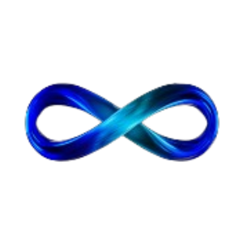 | 60215 | ETER | Eterland |
| 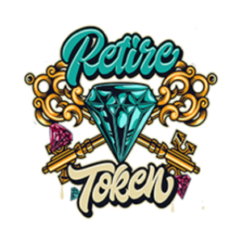 | 58343 | RETIRE | Retire Token |
| 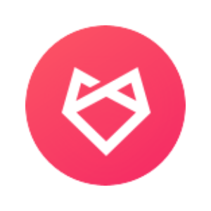 | 51287 | KAWA | Kawakami Inu |
| 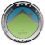 | 97551 | QUINTA | Quinta Eco |
|  | 89005 | 4SHIBA | FOREVER SHIBA |
| 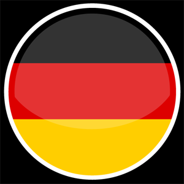 | 67001 | GER | Ginza Eternity Reward |
|  | 60969 | ASV | Astro Verse |
| 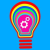 | 60531 | IDS | IDEAS |
|  | 55737 | CFXT | Chainflix |
| 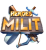 | 57813 | MILIT | Militia Games |
|  | 53501 | NFUP | Natural Farm Union Protocol |
| 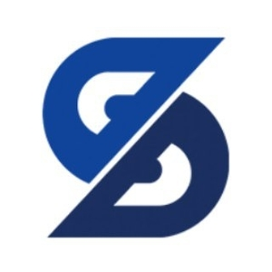 | 46241 | ISDT | Istardust |
| 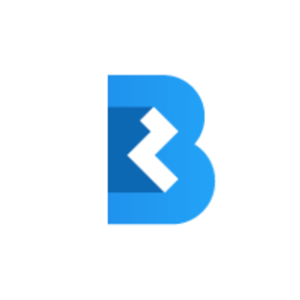 | 69019 | BGG | Bgogo Token |
|  | 67123 | BOLE | Bole Token |
| 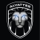 | 61893 | ALYA | Alyattes |
|  | 59593 | MRXB | Wrapped Metrix |
| 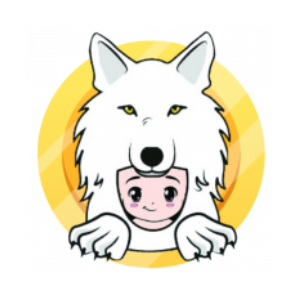 | 55811 | BABYSAITAMA | Baby Saitama |
|  | 54071 | CFL365 | CFL 365 Finance |
| 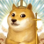 | 49837 | HDOGE | HolyDoge |
| 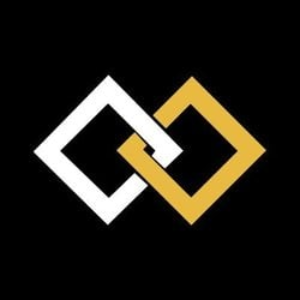 | 49005 | COLL | Collateral Pay |
|  | 32845 | ZXC | 0xcert |
| 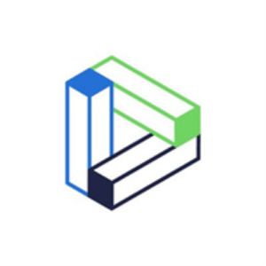 | 32364 | DTA | DATA |
| 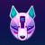 | 85341 | SOLGE | Solge |
| 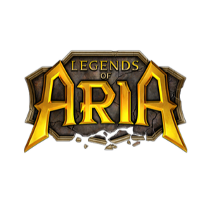 | 81425 | ARIA | Legends Of Aria |
|  | 70461 | PGNT | Pigeon Sol |
|  | 68477 | SOLBEAR | Solar Bear |
|  | 69029 | SLNA | Soluna |
| 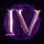 | 68109 | IV | Invoker |
|  | 68075 | ZION | Zion |
|  | 69459 | SLDR | Solderland |
|  | 69879 | SHBL | Shoebill Coin |
|  | 68483 | SWERVE | SWERVE Protocol |
|  | 68135 | BORK | Bork |
|  | 69321 | LADA | LadderCaster |
|  | 68137 | JOKE | Jokes Meme |
|  | 68779 | SOLBERRY | SolBerry |
|  | 68143 | TICKET | Ticket Finance |
| 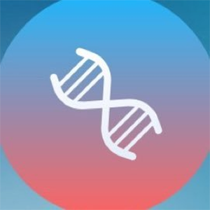 | 66327 | MEDI | Medi Token |
| 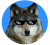 | 66737 | WOLFE | Wolfecoin |
|  | 65643 | LEONIDAS | Leonidas Token |
|  | 66823 | NRA | Nora Token |
|  | 66045 | OPPA | OPPA |
|  | 66965 | $HIPPO | Hippo Coin |
|  | 66091 | PPUG | Pizza Pug Coin |
|  | 66557 | BSAMO | Buff Samo |
|  | 65843 | BABYTIGER | BabyTigerGold |
|  | 65903 | KEKW | Kekwcoin |
| 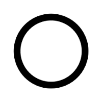 | 65361 | SWARM | MIM |
|  | 63291 | IGN | Infinity Game NFT |
| 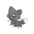 | 59057 | WOLFIES | WOLF PUPS |
|  | 52173 | 2LC | 2local |
|  | 69873 | DAKE | DogKage |
|  | 68627 | DBAY | DefiBay |
| 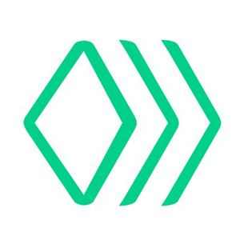 | 60565 | POS | POS Coin |
|  | 60313 | BA | BaTorrent |
|  | 59959 | CGOLD | CrimeGold |
|  | 59501 | METACEX | Metaverse Exchange |
| 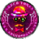 | 57925 | $GREED | Greed |
|  | 44810 | LBRL | LBRL |
|  | 43122 | NFXC | NFX Coin |
|  | 34797 | BNODE | BeeNode |
|  | 33786 | SHMN | StrongHands Masternode |
|  | 68869 | SYX | Solanyx |
| 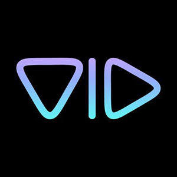 | 68823 | VI | Vybit |
| 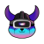 | 66011 | FLOKIV | Flokiverse |
| 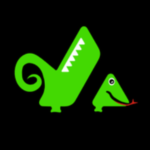 | 66319 | LIZARD | Lizard Token |
| 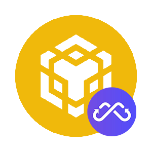 | 59655 | MBNB | MAGIC BNB |
|  | 89747 | GDG | Golden Goal |
|  | 80755 | OKA | Okaleido |
| 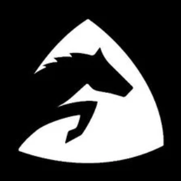 | 79045 | PCR | Paycer Protocol |
|  | 69971 | BRE | Boba Brewery |
|  | 67265 | CHTT | Token Cheetah |
| 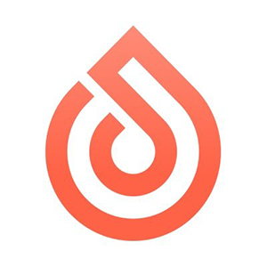 | 66683 | JT | Jubi Token |
|  | 64317 | RCNT | Ricnatum |
|  | 60205 | GLO | Glosfer Token |
|  | 62113 | POMI | Pomi |
|  | 57735 | MOVD | MOVE Network |
| 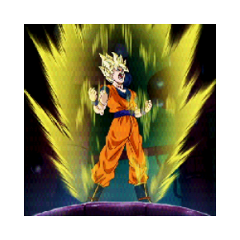 | 56533 | GOKU | Goku Inu |
|  | 55747 | NASADOGE | Nasa Doge |
|  | 56225 | GRANX | GranX Chain |
|  | 54863 | PETN | Pylon Eco Token |
| 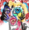 | 55249 | UFEWO | Unicly Fewocious Collection |
|  | 52079 | OIOC | OIOCoin |
|  | 44129 | PAA | Palace |
|  | 86889 | OKANA | Okami Lana |
| 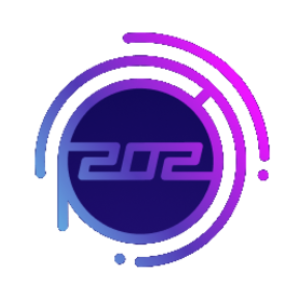 | 71557 | P202 | Project 202 |
| 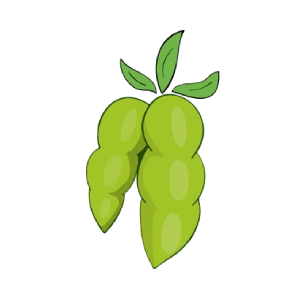 | 69541 | SOY | Soy Finance |
| 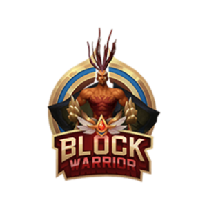 | 59083 | BLWA | BlockWarrior |
|  | 58533 | EAGON | EagonSwap Token |
|  | 58023 | SUG | Sulgecoin |
|  | 56167 | RBS | RobiniaSwap Token |
| 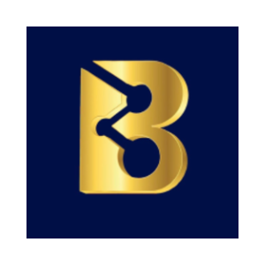 | 54907 | BME | BitcoMine Token |
| 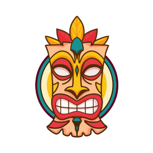 | 50835 | TIKI | Tiki Token |
| 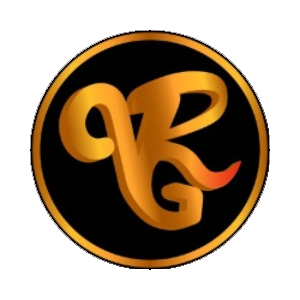 | 81029 | VRGW | Virtual Reality Game World |
|  | 69871 | SHIBT | Shiba Light |
| 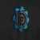 | 48347 | DFE | DFE.Finance |
|  | 80237 | NAME | PolkaDomain |
|  | 86023 | DOGENS | Dogens |
| 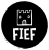 | 78071 | FIEF | Fief |
|  | 70701 | CLCT | CollectCoin |
|  | 66621 | WRAITH | Wraith |
|  | 67245 | OTR | Otter Finance |
|  | 67857 | AGTE | Agronomist |
| 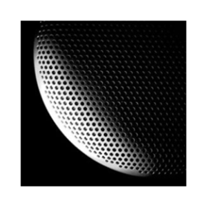 | 65399 | ZORA | Zoracles |
|  | 64833 | SWAPXI | SwapXI Token |
| 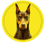 | 51981 | DOBE | Dobermann |
| 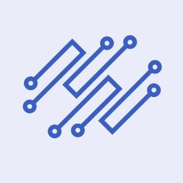 | 47731 | PRVS | Previse |
|  | 46602 | DEFO | DefHold |
|  | 67865 | TRBL | Tribeland |
|  | 65533 | VITAL | Vitall Markets |
|  | 61757 | BEPIS | BEPIS |
| 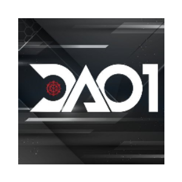 | 51649 | DAO1 | DAO1 |
|  | 49481 | CWAP | DeFIRE |
|  | 47085 | ITS | Iteration Syndicate |
| 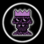 | 68097 | SHROOMZ | Crypto Mushroomz |
|  | 68805 | SBFC | SBF Coin |
|  | 67757 | CHUG | CHUG Token |
|  | 54255 | KCLP | KuCoin LaunchPad |
| 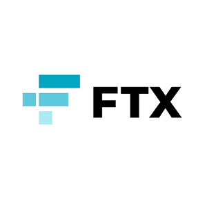 | 44154 | BVOL | 1x Long BTC Implied Volatility Token |
| 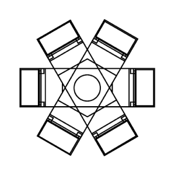 | 88249 | CBYTE | CBYTE Network |
|  | 86755 | MUSICAI | MusicAI |
|  | 88243 | SYNCBRAIN | Brain Sync |
|  | 87077 | WLX | Wallax |
| 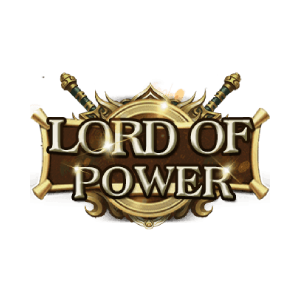 | 79599 | GDE | Lord of Power Golden Eagle |
|  | 81153 | SGS | Melody SGS |
|  | 78563 | MYPO | MyPoints E-Commerce |
| 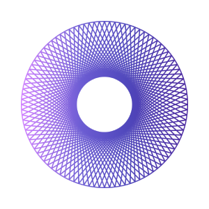 | 79717 | HECTA | Hectagon |
|  | 70603 | Z7 | Z7DAO |
| 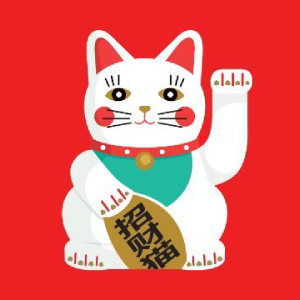 | 71151 | LUCK | Luck2Earn |
|  | 71595 | BPAY | Beyondpay |
|  | 71307 | ZIOT | Ziot |
| 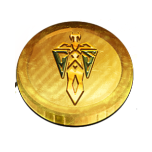 | 71323 | CSTC | CryptosTribe |
|  | 69211 | WAMO | WAMO |
| 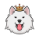 | 65861 | KSAMO | King Samo |
| 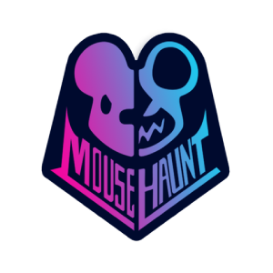 | 66521 | MHT | Mouse Haunt |
|  | 65023 | WARP | Warp Finance |
|  | 60893 | CVZ | CryptoVsZombie |
|  | 56185 | ZPTC | Zeptagram |
|  | 46608 | UWL | UniWhales |
|  | 46683 | YTSLA | yTSLA Finance |
|  | 77683 | BPIT | BabyPitbull |
|  | 78941 | DAE | Daefrom |
|  | 66675 | SHIVER | Shibaverse Token |
|  | 68021 | WEENS | Ween Token |
| 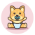 | 51567 | MINIBABYDOGE | Mini Baby Doge |
|  | 44226 | XLPG | StellarPayGlobal |
|  | 60537 | MEXI | Metaxiz |
|  | 70051 | POMO | Pomo |
| 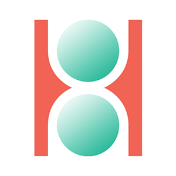 | 44456 | EHRT | Eight Hours |
| 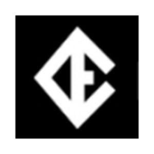 | 42209 | DTEP | DECOIN |
|  | 67405 | KLB | Black Label |
| 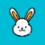 | 57271 | SLTRBT | sLittle Rabbit |
|  | 70171 | OINK | Oink Token |
| 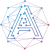 | 42002 | AIQ | Artiqox |
| 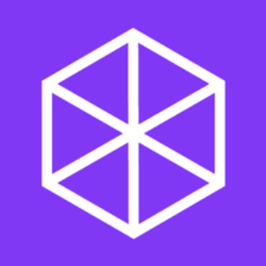 | 70439 | JCG | JustCarbon Governance |
|  | 69621 | TOOB | Toobcoin |
|  | 56363 | BTCI | Bitcoin International |
| 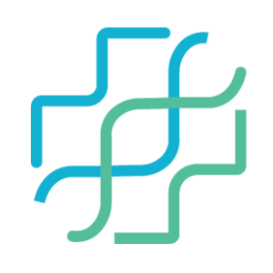 | 52093 | GNBT | Genebank Token |
| 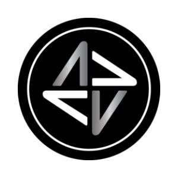 | 45021 | ASIMI | ASIMI |
|  | 82433 | SFUSD | StableFund USD |
|  | 76845 | MUSC | Muslim Coins |
|  | 76501 | YFA | YFA Finance |
|  | 70693 | DBEA | Deep Blue Sea |
|  | 71227 | CLK | Click |
| 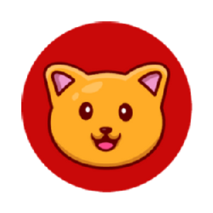 | 67455 | MLOKY | MLOKY |
| 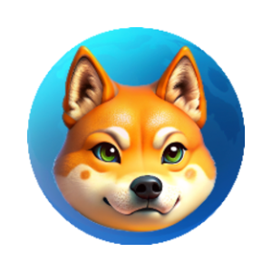 | 49659 | MOONI | Mooni |
|  | 46266 | YRISE | yRise Finance |
|  | 90315 | BFLOKIC | Baby Floki CEO |
| 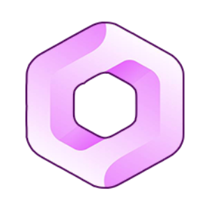 | 57015 | EVOC | EvoCardano |
| 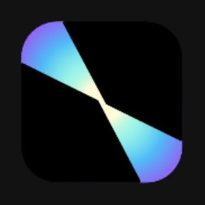 | 90881 | QSR | Quasar |
|  | 89997 | CD | Cash Driver |
|  | 81415 | VRJAM | VRJAM |
|  | 86371 | BTON | Blockton |
|  | 70623 | SVA | Solvia |
|  | 68211 | AWRT | Active World Rewards Token |
|  | 66035 | XYSL | xYSL |
| 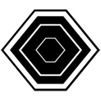 | 67125 | XHT | HollaEx Token |
|  | 54849 | DEHUB | DeHub |
|  | 56051 | DOGEDASH | Doge Dash |
|  | 48075 | GSPI | GSPI |
|  | 45387 | CANA | Cannabis Seed Token |
|  | 46189 | EASY | EasyFi |
|  | 43102 | FT1 | Fortune1Coin |
| 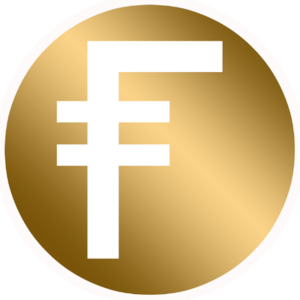 | 36343 | FDR | FD Reserve |
|  | 32904 | VITAE | Vitae |
| 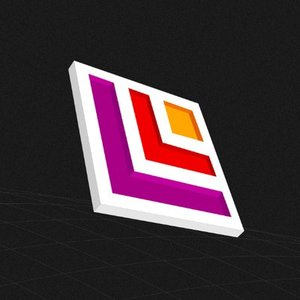 | 32878 | AKA | Akroma |
| 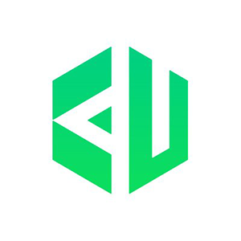 | 33058 | BU | BUMO |
|  | 2832 | EDO | Eidoo |
| 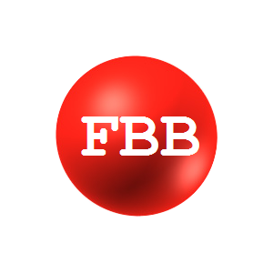 | 59539 | FBB | Foxboy |
| 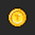 | 70325 | TKNRM | Tokenarium |
|  | 67211 | TBK | TokenBook |
|  | 89771 | DR1$ | DR1VER |
|  | 76791 | SHWA | ShibaWallet |
|  | 68547 | TAT2 | TattooMoney |
|  | 68001 | LAW | Law Token |
|  | 62879 | HACHIKO | Hachiko |
|  | 59163 | BXMI | Bxmi Token |
|  | 58159 | DBS | Drakeball Super |
|  | 91117 | AIGPT | All In GPT |
| 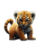 | 90923 | BABYBNBTIG | BabyBNBTiger |
|  | 90857 | HORSEA | HorseaFi |
| 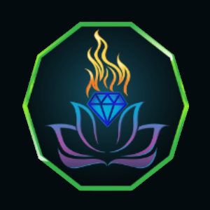 | 90747 | CREMAT | Cremation Coin |
|  | 91087 | CBEX | CryptoBank |
|  | 91093 | $LUCA | Lucrosus Capital |
|  | 90341 | FDAO | Figure DAO |
| 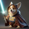 | 90351 | FLOKIDASH | FlokiDash |
|  | 90309 | CATCEO | CATCEO |
|  | 88219 | AIAI | ALLINAI |
|  | 88225 | ALONMARS | Alon Mars |
|  | 82565 | KATZ | LUCKY CATS |
| 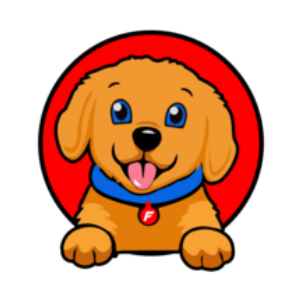 | 86605 | FLOSHIDO | FLOSHIDO INU |
|  | 86677 | SHINU | Sheikh Inu |
| 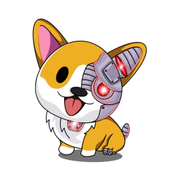 | 86681 | AIDOGEMINI | AI DogeMini |
| 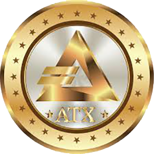 | 86381 | ATX | AstroX |
|  | 86797 | FUTURE-AI | Future AI |
|  | 86255 | DOGETREND | DogeTrend |
|  | 79627 | FBD | Football Decentralized |
| 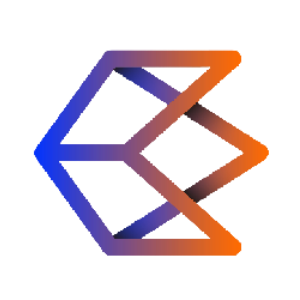 | 79871 | EGON | EAGLE MINING NETWORK |
| 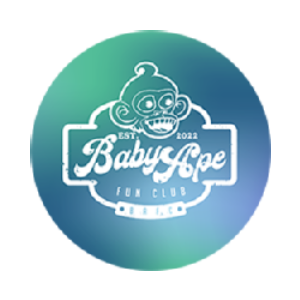 | 80121 | BAFC | BabyApeFunClub |
|  | 80831 | TEDDY V2 | Teddy Doge V2 |
| 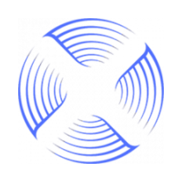 | 82509 | PROP | Propland |
|  | 71041 | YLF | YieldLock |
|  | 71271 | TBS | TLabs |
|  | 77983 | COLLIE | COLLIE INU |
|  | 70529 | DODB | DODbase |
|  | 77903 | BTNT | BitNautic |
|  | 70847 | NRFX | Narfex |
| 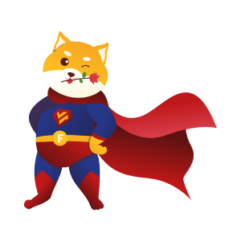 | 67917 | SLOKI | Super Floki |
| 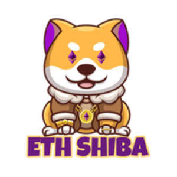 | 68489 | ETHSHIB | Eth Shiba |
|  | 69747 | ASIX+ | AsixPlus |
| 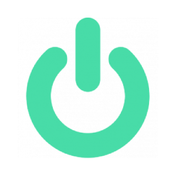 | 63965 | SEON | Seedon |
| 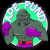 | 58889 | APEFUND | ApeFund |
|  | 55267 | BEACH | Beach Token |
| 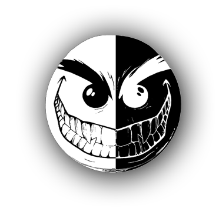 | 90375 | ACID | 0xACID |
| 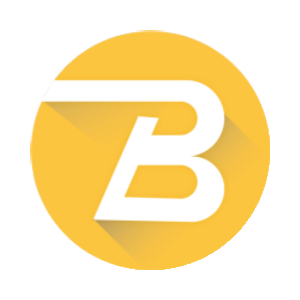 | 90151 | BSCPAY | BSC PAYMENTS |
| 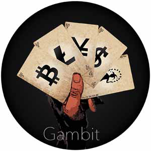 | 81751 | GAM | Gamma |
|  | 82169 | ALTPAY | ALTPAY FINANCE |
| 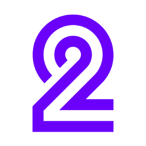 | 78677 | 2OMB | 2omb |
|  | 78843 | FRANK | Frank Inu |
| 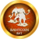 | 80409 | BHT | Bahtcoin |
| 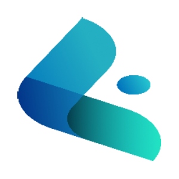 | 80609 | EAT | EDGE Activity |
|  | 80027 | DLP | Decentralized Liquidity Program |
|  | 78055 | OLO | OolongSwap |
|  | 80453 | FRGST | Froggies |
|  | 78437 | ICN | I-Coin V2 |
| 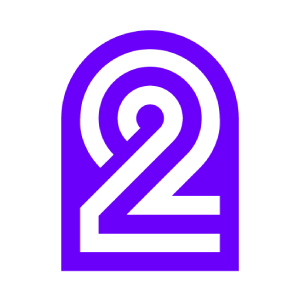 | 80169 | 2SHARES | 2SHARE |
| 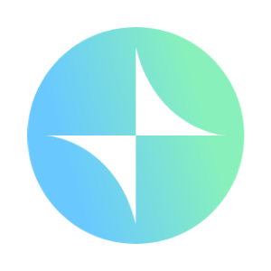 | 69585 | NATION | Nation3 |
|  | 71197 | MDDN | Modden |
|  | 70391 | 99DEFI | 99Defi |
|  | 68657 | CPHX | Crypto Phoenix |
|  | 69255 | BTFA | Banana Task Force Ape |
|  | 68301 | GAFA | Gafa |
|  | 65033 | USF | Unslashed Finance |
| 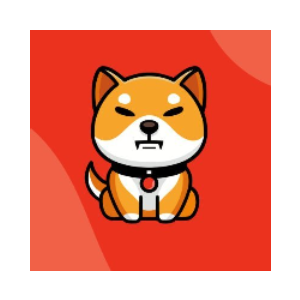 | 66529 | BABYSHIB | BabyShibby Inu |
|  | 64895 | ROME | Rome |
|  | 63773 | BNBBACK | BNBBack |
|  | 64123 | QUANTIC | Quantic |
|  | 61033 | FLQ | FlexQ |
| 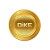 | 61609 | DIKE | Dike |
| 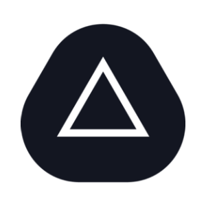 | 60049 | ARTM | ARTM |
|  | 58919 | CDROP | CryptoDrop |
| 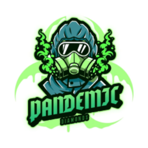 | 55941 | PMD | Promodio |
|  | 56957 | WGL | Wiggly Finance |
|  | 54259 | GSHIBA | Gambler Shiba |
|  | 53483 | KP2R | KP2R.Network |
| 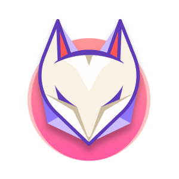 | 51079 | MYOBU | Myōbu |
| 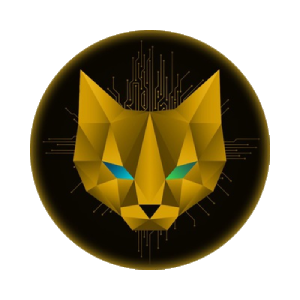 | 49543 | VANCAT | Vancat |
|  | 50039 | CLIMB | Climb Token Finance |
|  | 47449 | SEUR | sEUR |
|  | 45281 | FYZ | Fyooz |
|  | 44918 | AQX | Aqua Intelligence |
|  | 45565 | RI | RI Token |
|  | 34606 | DKYC | DataKYC |
| 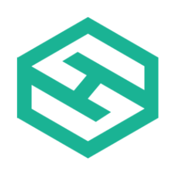 | 34551 | HTB | Hotbit Token |
|  | 34613 | EUBC | EUB Chain |
| 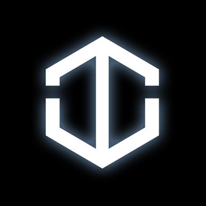 | 33566 | TOL | Tolar |
| 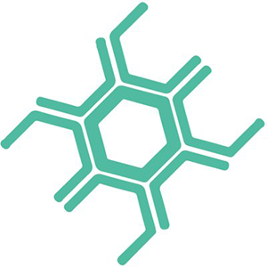 | 33740 | COVA | COVA |
|  | 32815 | ORS | Origin Sport |
| 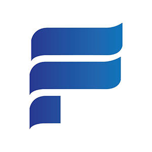 | 33102 | FOIN | FOIN |
|  | 86455 | EMC1 | EMCIS NETWORK |
|  | 81771 | ICD | IC DEFI |
| 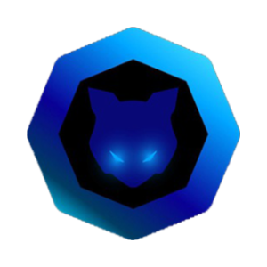 | 85499 | CATAI | Catgirl AI |
|  | 82531 | HWT | Honor World Token |
|  | 78303 | VITOGE | Vitoge |
| 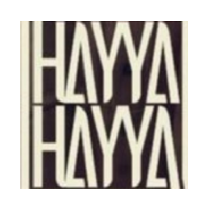 | 77579 | HAYYA | Hayya |
|  | 70375 | OPSMEN | OPSMEN |
|  | 69381 | PAYZ | Payz Payments |
| 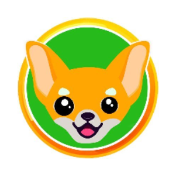 | 70591 | CHH | CHHIPSCOIN |
| 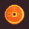 | 69891 | GNAR | GNAR TOKEN |
|  | 70617 | JIMN | JimnGalaxy |
| 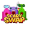 | 67203 | SCARY | Scaryswap |
|  | 66871 | DSOL | DecentSol |
|  | 64707 | MSHARE | Meerkat Shares |
| 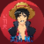 | 58725 | ODA | Eiichiro Oda Inu |
| 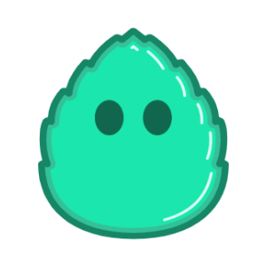 | 55487 | MINTYS | MintySwap |
| 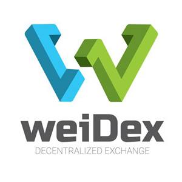 | 50579 | WDX | Wordlex |
|  | 50647 | HUNGRY | HungryBear |
|  | 44972 | CPI | Crypto Price Index |
| 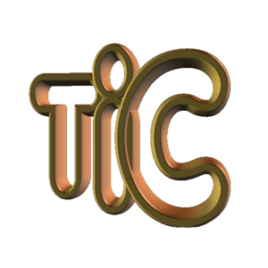 | 32911 | TIC | Thingschain |
| 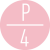 | 59483 | P4C | Parts of Four Coin |
|  | 69131 | NOCH | NodeBunch |
|  | 55807 | YPLX | Yoplex |
| 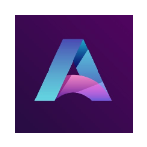 | 52089 | ATFI | Atlantic Finance |
|  | 55117 | TSA | TSA NFT |
|  | 50603 | SAFELOGIC | Safelogic |
|  | 46297 | JSB | JSB Foundation |
|  | 46028 | TCFX | Tcbcoin |
|  | 44841 | 1CT | 1ClickToken |
|  | 45316 | MONGOCM | MONGO Coin |
| 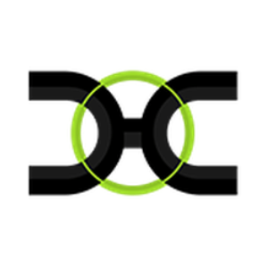 | 45172 | DCNTR | Decentrahub Coin |
|  | 44897 | CLOG | CLO GOLD |
|  | 44859 | MACPO | Master Coin Point |
| 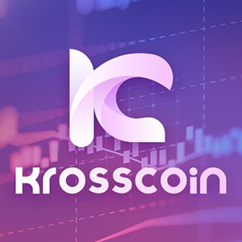 | 44928 | KSS | Krosscoin |
|  | 44597 | STABL | Stable Coin |
|  | 44052 | XEMX | Xeniumx |
|  | 42082 | SVR | SovranoCoin |
|  | 41905 | IOX | IONOS |
|  | 41523 | PRD | Predator Coin |
| 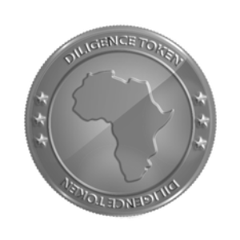 | 36405 | IRA | Diligence |
| 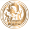 | 41630 | BSVG | BITCOINSVGOLD |
|  | 34537 | BSH | Bitcoin Stash |
| 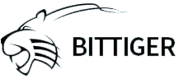 | 34776 | BTTR | BittrackSystems |
|  | 34793 | TFTN | TFT Network |
|  | 34534 | HMN | Hostmasternode |
|  | 34701 | IEX | Internal Exchange Coin |
|  | 33241 | GALI | Galilel |
|  | 65 | FLDC | FoldingCoin |
| 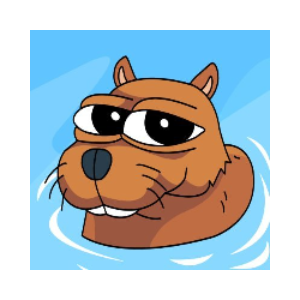 | 59987 | CAP | Cap |
|  | 54759 | LZ | LaunchZone |
| 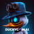 | 90939 | DUCKYAI | DuckyCoinAI |
|  | 90717 | SWS | SwiftSwap |
| 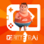 | 90211 | FITAI | GoFitterAI |
|  | 90991 | REELFI | ReelFi |
|  | 90831 | BTSCRW | Bitscrow |

---

[← Prev](./list11.md) | [Next →](./list13.md)
