[← Prev](./list12.md) | [Next →](./list14.md)

| Logo | ID | Symbol | Name |
|:----:|:--:|:------:|:-----|
| 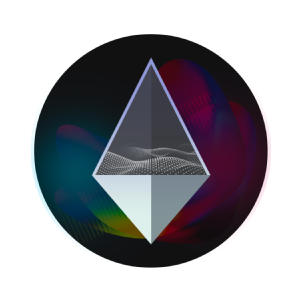 | 12785 | VNY | Vanity |
| 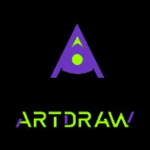 | 12786 | ARTDRAW | ArtDraw |
| 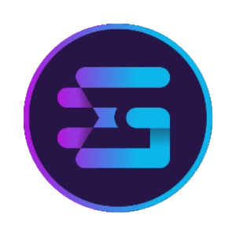 | 12787 | GEZY | EZZY GAME GEZY |
| 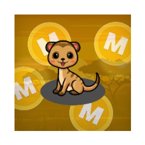 | 12788 | MONGOOSE | Mongoose |
| 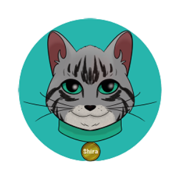 | 12789 | CATSHIRA | Shira Cat |
| 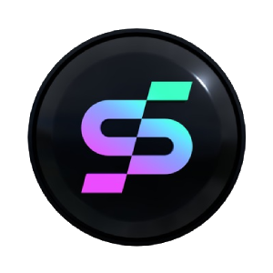 | 12790 | SOLCASH | SOLCash |
| 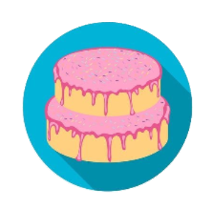 | 12791 | CAKESWAP | CakeSwap |
| 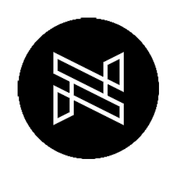 | 12792 | NIK | NIKPLACE |
|  | 12793 | DEER | ToxicDeer Finance |
|  | 12794 | LADA | LadderCaster |
| 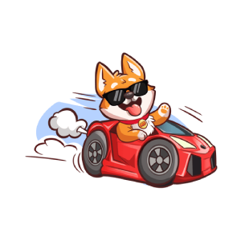 | 12795 | SHIBU | SHIBU INU |
| 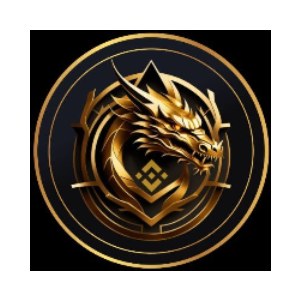 | 12796 | BNBDRGN | BNBDragon |
| 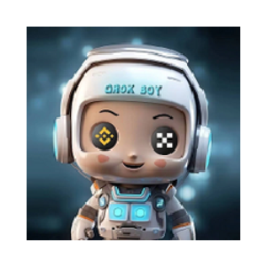 | 12797 | GROKBOY | GrokBoy |
| 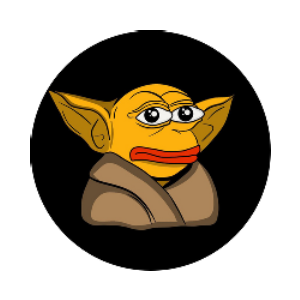 | 12798 | PORKINU | PepeFork INU |
| 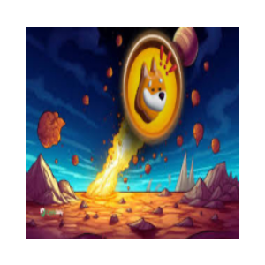 | 12799 | CRAZYBONK | CRAZY BONK |
| 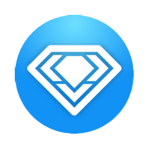 | 12800 | VSHARE | V3S Share |
|  | 12801 | FLN | Falcon |
|  | 12802 | ERROR404 | ERROR404 MEME |
| 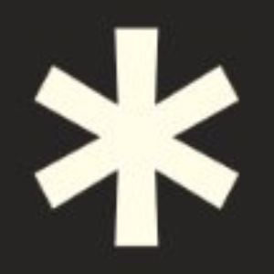 | 12803 | ASTX | Asterix Labs |
|  | 12804 | LUSH | Lush AI |
|  | 12805 | AEG | Aether Games |
| 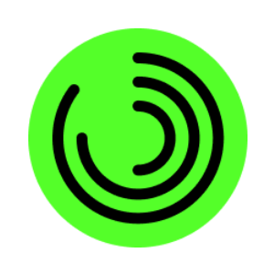 | 12806 | DECHAT | Dechat |
| 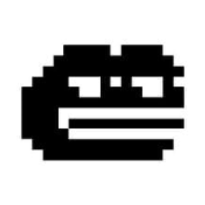 | 12807 | DEFROGS | DeFrogs |
|  | 12808 | ALVA | Alvara Protocol |
|  | 12809 | UNICE | UNICE |
|  | 12810 | CATMAN | Catman |
| 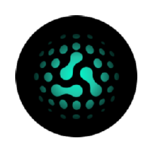 | 12811 | AKI | Aki Network |
| 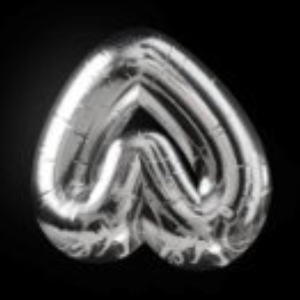 | 12812 | ALPHABET | Alphabet |
|  | 12813 | MMA | Meme Alliance |
|  | 12814 | APP | Moon App |
| 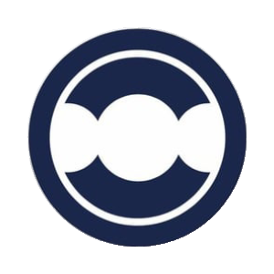 | 12815 | METAQ | MetaQ |
| 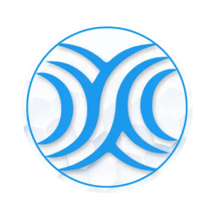 | 12816 | EXGO | EXGOLAND |
|  | 12817 | FLOKITA | FLOKITA |
|  | 12818 | LENDS | Lends |
| 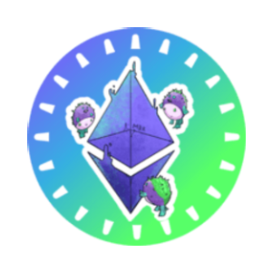 | 12819 | PUFETH | pufETH |
| 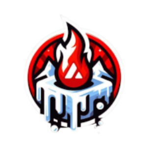 | 12820 | NOCHILL | AVAX HAS NO CHILL |
|  | 12821 | BRETTFYI | Brett (brett.fyi) |
|  | 12822 | PATEX | Patex |
| 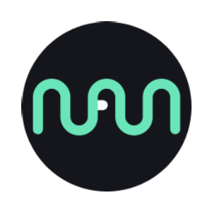 | 12823 | NAVX | NAVI Protocol |
| 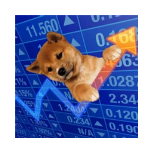 | 12824 | UPDOG | What's Updog |
| 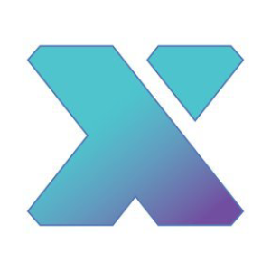 | 12825 | AXGT | AxonDAO Governance Token |
|  | 12826 | FAKEAI | DeepFakeAI |
| 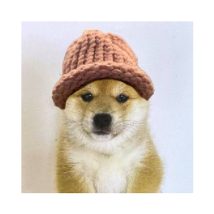 | 12827 | BABYWIF | babydogwifhat |
| 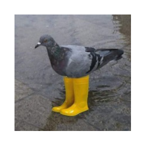 | 12828 | PIGEON | Pigeon In Yellow Boots |
| 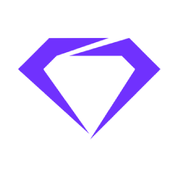 | 12829 | QORPO | QORPO WORLD |
|  | 12830 | NIRVA | Nirvana |
| 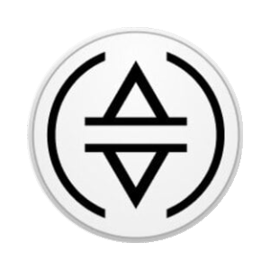 | 12831 | SUSDE | Ethena Staked USDe |
| 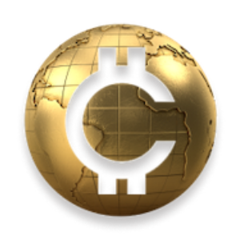 | 12832 | CRH | Crypto Hunters Coin |
|  | 12833 | NAO | Nettensor |
| 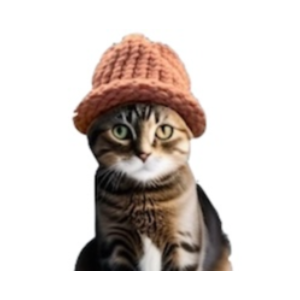 | 12834 | CWIF | catwifhat |
| 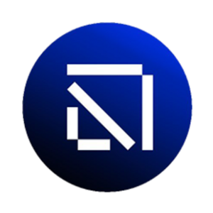 | 12835 | BLENDR | Blendr Network |
| 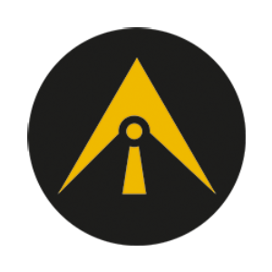 | 12836 | AIAT | AI Analysis Token |
|  | 12837 | DECL | Decimal token |
|  | 12838 | MCIV | Mars Civ Project |
| 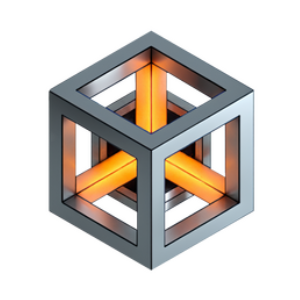 | 12839 | AIPG | AI Power Grid |
| 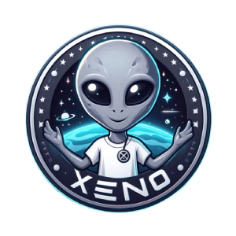 | 12840 | XENO | Xeno |
| 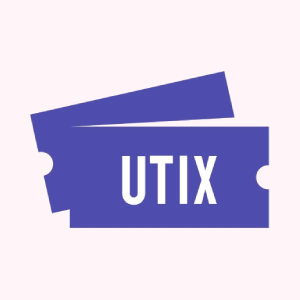 | 12841 | UTX | UTIX |
|  | 12842 | GONE | GONE |
| 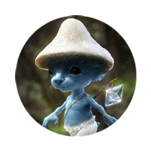 | 12843 | SMURFCATETH | Real Smurf Cat |
| 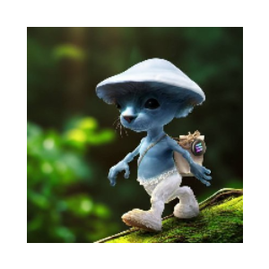 | 12844 | SMURFCATSOL | Real Smurf Cat |
| 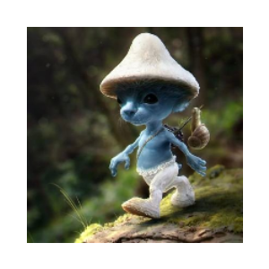 | 12845 | SMURFCATBSC | Real Smurf Cat |
|  | 12846 | DYAD | Dyad Stable |
| 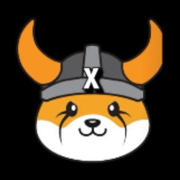 | 12847 | FLOKIX | FLOKI X |
| 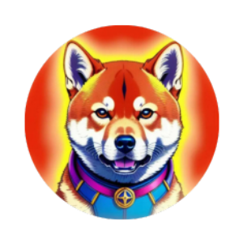 | 12848 | BURNNY | Burnny Inu |
|  | 12849 | TELEBTC | teleBTC |
|  | 12850 | GROKCOIN | Grok Coin |
| 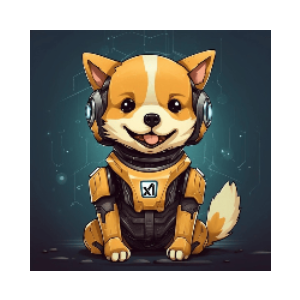 | 12851 | BONKGROK | Bonk Grok |
| 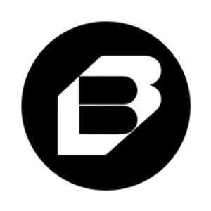 | 12852 | BUNDL | Bundl Tools |
| 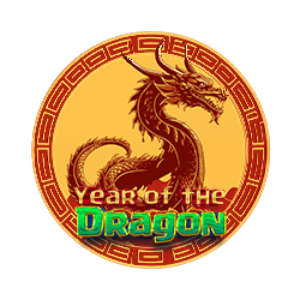 | 12853 | YOTD | Year of the Dragon |
| 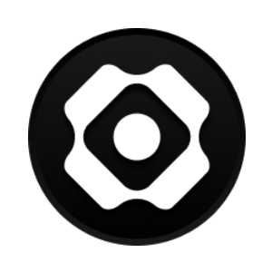 | 12854 | USDM | Mountain Protocol |
|  | 12855 | CBABY | Cosmo Baby |
|  | 12856 | AFB | A Fund Baby |
| 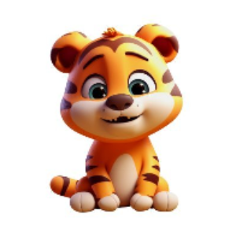 | 12857 | MINIBNBTIGER | MiniBNBTiger |
| 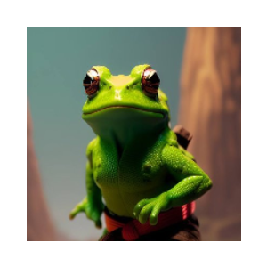 | 12858 | KIKO | KIKO |
| 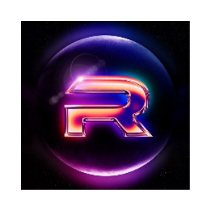 | 12859 | MOONR | PulseMoonR |
| 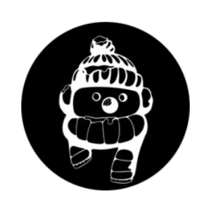 | 12860 | SNOWMANTASTIC | Snowmantastic |
|  | 12861 | DUCKER | Ducker |
|  | 12862 | MUSKVSZUCK | Cage Match |
|  | 12863 | FREELA | DecentralFree |
|  | 12864 | SKRIMP | Skrimples |
|  | 12865 | PEPECHAIN | PEPE Chain |
|  | 12866 | ABO | Albino |
|  | 12867 | SSB | SatoshiStreetBets |
|  | 12868 | IFIT | CALO INDOOR |
|  | 12869 | JPD | JackpotDoge |
|  | 12870 | UPLOAD | Upload Token |
|  | 12871 | FBURN | Forever Burn |
|  | 12872 | OPXVEVELO | OpenX Locked Velo |
|  | 12873 | TSN | Tsunami Exchange Token |
|  | 12874 | CATVILLS | Catvills Coin |
|  | 12875 | MBE | MxmBoxcEus Token |
|  | 12876 | MTW | Meta Space 2045 |
|  | 12877 | OHANDY | Handy (Orbit Bridge) |
|  | 12878 | CACTUS | CACTUS |
|  | 12879 | MECI | Meta Game City |
|  | 12880 | SHIL | Shila Inu |
|  | 12881 | BSCPAY | BSC PAYMENTS |
|  | 12882 | JGLP | Jones GLP |
|  | 12883 | TERZ | SHELTERZ |
|  | 12884 | SHIBCAT | SHIBCAT |
|  | 12885 | WTWOOL | Wolf Town Wool |
|  | 12886 | LGOLD | LYFE GOLD |
|  | 12887 | TVRS | TiraVerse |
|  | 12888 | DOGEY | Dogey |
|  | 12889 | FLEPE | Floki VS Pepe |
|  | 12890 | GPLX | Gplx |
|  | 12891 | DSHIB | DOLLAR SHIBA INU |
|  | 12892 | BNBSONGOKU | BNBsongoku (bnbsongokutoken.com) |
|  | 12893 | SILVER | SILVER |
|  | 12894 | POKEGROK | PokeGROK |
|  | 12895 | INTERN | Interns |
|  | 12896 | XQUOK | XQUOK |
|  | 12897 | P404 | Potion 404 |
|  | 12898 | BNBVEGETA | BNB VEGETA |
|  | 12899 | 4RZ | 4REALZA COIN |
|  | 12900 | GMAC | Gemach |
|  | 12901 | DWT | DiveWallet Token |
|  | 12902 | KOMO | Komoverse |
|  | 12903 | PRTC | Protectorate Protocol |
|  | 12904 | MINION | Minions INU |
|  | 12905 | FOXE | Foxe |
|  | 12906 | LANDWOLF | LANDWOLF (landwolf.xyz) |
|  | 12907 | LARRY | LarryCoin |
|  | 12908 | EDEL | Coin Edelweis |
|  | 12909 | SCRATCH | Scratch |
|  | 12910 | DEFC | Defi Coin |
|  | 12911 | WMW | WoopMoney |
|  | 12912 | MAGE | MetaBrands |
|  | 12913 | FCP | FILIPCOIN |
|  | 12914 | TPV | TravGoPV |
|  | 12915 | CONJ | Conjee |
|  | 12916 | A4 | A4 Finance |
|  | 12917 | SCARAB | Scarab Finance |
|  | 12918 | AVAO | AvaOne Finance |
|  | 12919 | ZPRO | ZAT Project |
|  | 12920 | SONGOKU | SONGOKU (songokutoken.com) |
|  | 12921 | LIF3 | LIF3 |
|  | 12922 | MDDN | Modden |
|  | 12923 | RFX | Reflex |
|  | 12924 | JAIHO | Jaiho Crypto |
|  | 12925 | TROLLMODE | TROLL MODE |
|  | 12926 | MISTRAL | Mistral AI |
|  | 12927 | BITRA | Bitratoken |
|  | 12928 | PEPELON | Pepelon |
|  | 12929 | MFTU | Mainstream For The Underground |
|  | 12930 | DPAD | Dpad Finance |
|  | 12931 | TRANQ | Tranquil Finance |
|  | 12932 | DOFI | Doge Floki Coin |
|  | 12933 | PWINGS | JetSwap pWings |
|  | 12934 | MSCT | MUSE ENT NFT |
|  | 12935 | FPAD | FantomPAD |
|  | 12936 | DGOLD | PolyDragon |
|  | 12937 | MARIO | MARIO CEO |
|  | 12938 | USV | Universal Store of Value |
|  | 12939 | METRO | Metropoly |
|  | 12940 | CVSHOT | CV SHOTS |
|  | 12941 | BNBCAT | BNBcat |
|  | 12942 | STRI | Strite |
|  | 12943 | PIRATECOIN | Pirate Coin Games |
|  | 12944 | SATSALL | ALL BEST ICO SATOSHI |
|  | 12945 | MLTPX | MoonLift Capital |
|  | 12946 | CUAN | CuanSwap.com |
|  | 12947 | SOLIDSEX | SOLIDsex: Tokenized veSOLID |
|  | 12948 | BURNZ | BURNZ |
|  | 12949 | CUBEAUTO | Cube |
|  | 12950 | JIND | JINDO INU |
|  | 12951 | DAWCURRENCY | Daw Currency |
|  | 12952 | DEXSHARE | dexSHARE |
|  | 12953 | REAPER | Grim Finance |
|  | 12954 | VTU | Virtu |
|  | 12955 | TATA | TATA Coin |
|  | 12956 | ROVI | ROVI |
|  | 12957 | OCW | Online Cold Wallet |
|  | 12958 | SOULO | SouloCoin |
|  | 12959 | SPIDERMAN | SPIDERMAN BITCOIN |
|  | 12960 | ABCD | Crypto Inu |
|  | 12961 | BONKFORK | BonkFork |
|  | 12962 | XCAL | 3xcalibur |
|  | 12963 | KPHI | Kephi Gallery |
|  | 12964 | ZGEM | GemSwap |
|  | 12965 | 3CEO | FLOKI SHIBA PEPE CEO |
|  | 12966 | GTAVI | GTAVI |
|  | 12967 | SUTEKU | Suteku |
|  | 12968 | ZKPAD | zkLaunchpad |
|  | 12969 | VRSE | CronosVerse |
|  | 12970 | BABYBITC | BabyBitcoin |
|  | 12971 | PS1 | POLYSPORTS |
|  | 12972 | FATHER | DogeFather |
|  | 12973 | BLACKROCK | BlackRock |
|  | 12974 | REDFLOKI | Red Floki |
|  | 12975 | DOGERA | Dogera |
|  | 12976 | BABYOKX | BABYOKX |
|  | 12977 | BMICKEY | Baby Mickey |
|  | 12978 | VALAS | Valas Finance |
|  | 12979 | RIZE | Rizespor Token |
|  | 12980 | BCRO | Bonded Cronos |
|  | 12981 | KINGTRUMP | King Trump |
|  | 12982 | GEAR | Gearbox Protocol |
|  | 12983 | SCRAP | Scrap |
|  | 12984 | HATCHY | Hatchyverse |
|  | 12985 | JERRY | Jerry Inu |
|  | 12986 | MINIPEPE | MiniPepe |
|  | 12987 | FLOKICASH | Floki Cash |
|  | 12988 | BRICKS | MyBricks |
|  | 12989 | FLOKIM | Flokimooni |
|  | 12990 | XRISE | Xrise |
|  | 12991 | BNBSNAKE | BNB SNAKE |
|  | 12992 | MKC | Meta Kongz |
|  | 12993 | KINGPEPE | KING PEPE |
|  | 12994 | RUSD | Reflecto USD |
|  | 12995 | CZUSD | CZUSD |
|  | 12996 | BITBULL | Bitbull |
|  | 12997 | GMFAM | GMFAM |
|  | 12998 | GROKSORAX | GROKSORAX |
|  | 12999 | URFA | Urfaspor Token |
|  | 13000 | ZKLAB | zkSync Labs |
|  | 13001 | BLI | BALI TOKEN |
|  | 13002 | ZUCKPEPE | ZuckPepe |
|  | 13003 | FERT | Chikn Fert |
|  | 13004 | CLIMB | CLIMB TOKEN FINANCE |
|  | 13005 | ADDY | Adamant |
|  | 13006 | DROVERS | Drover Inu |
|  | 13007 | OSEAN | OSEAN |
|  | 13008 | MSCP | Moonscape |
|  | 13009 | CRHT | CryptHub |
|  | 13010 | FIF | flokiwifhat |
|  | 13011 | TIUSD | TiUSD |
|  | 13012 | KOGE | BNB48 Club Token |
|  | 13013 | FROGGY | Froggy |
|  | 13014 | THECA | Theca |
|  | 13015 | MECHA | Mechanium |
|  | 13016 | SAFEMOONCASH | SafeMoonCash |
|  | 13017 | KMC | Kitsumon |
|  | 13018 | SAUDISHIB | Saudi Shiba Inu |
|  | 13019 | MGOD | MetaGods |
|  | 13020 | NSI | nSights DeFi Trader |
|  | 13021 | MITHRIL | CLIMBERS |
|  | 13022 | HVI | Hungarian Vizsla Inu |
|  | 13023 | GERMANY | Germany Rabbit Token |
|  | 13024 | SWOLE | Swole Doge |
|  | 13025 | OCTAVUS | Octavus Prime |
|  | 13026 | GAMERFI | GamerFI |
|  | 13027 | E8 | Energy8 |
|  | 13028 | HOTMOON | HotMoon Token |
|  | 13029 | DCA | AutoDCA |
|  | 13030 | PRCH | Power Cash |
|  | 13031 | BSTS | Magic Beasties |
|  | 13032 | VNDT | Vendit |
|  | 13033 | BHBD | bHBD |
|  | 13034 | TRUSTNFT |  TrustNFT |
|  | 13035 | LIFEBIRD | LIFEBIRD |
|  | 13036 | TCGC | TCG Verse |
|  | 13037 | SCIVIVE | sciVive |
|  | 13038 | NBABSC | NBA BSC |
|  | 13039 | NUR | Nurcoin |
|  | 13040 | IRYDE | iRYDE COIN |
|  | 13041 | SAFLE | Safle |
|  | 13042 | VERVE | Verve |
|  | 13043 | FRZSSCOIN | FRZ Solar System Coin |
|  | 13044 | CDRAGON | Clumsy Dragon |
|  | 13045 | SPARTACATS | SpartaCats |
|  | 13046 | PORKE | PONKE FORK |
|  | 13047 | SNITCH | Randall |
|  | 13048 | BABYKITTY | BabyKitty |
|  | 13049 | TXAU | tGOLD |
|  | 13050 | GGTKN | GG Token |
|  | 13051 | RISITA | Risitas |
|  | 13052 | AAVEGOTCHIFOMO | Aavegotchi FOMO |
|  | 13053 | GSKY | SKY FRONTIER |
|  | 13054 | PETF | PEPE ETF |
|  | 13055 | BEPE | Blast Pepe |
|  | 13056 | 1FLR | Flare Token |
|  | 13057 | ORAIX | OraiDEX |
|  | 13058 | ROCKETFI | RocketFi |
|  | 13059 | NALS | NALS (Ordinals) |
|  | 13060 | SOLPAKA | Solpaka |
|  | 13061 | OGD | OLYMPIC GAMES DOGE |
|  | 13062 | ORACLE | Oracle AI |
|  | 13063 | GPUINU | GPU Inu |
|  | 13064 | VIZSLASWAP | VizslaSwap |
|  | 13065 | SHIBAAI | SHIBAAI |
|  | 13066 | ACRE | Arable Protocol |
|  | 13067 | AII | Artificial Idiot |
|  | 13068 | XBTC | XenBitcoin |
|  | 13070 | BABYRATS | Baby Rats |
|  | 13071 | MKONG | MEME KONG |
|  | 13072 | OPINU | Optimus Inu |
|  | 13073 | TAPROOT | Taproot Exchange |
|  | 13074 | PUSSYINBIO | Pussy In Bio |
|  | 13075 | MARCO | MELEGA |
|  | 13076 | CHMPZ | Chimpzee |
|  | 13077 | MAGNET | Yield Magnet |
|  | 13078 | PANDAI | PandAI |
|  | 13079 | RFKJ | Independence Token |
|  | 13080 | NMBTC | NanoMeter Bitcoin |
|  | 13081 | UCON | YouCoin Metaverse (new) |
|  | 13082 | ND | Nemesis Downfall |
|  | 13083 | AK12 | AK12 |
|  | 13084 | AJNA | Ajna Protocol |
|  | 13085 | VTRO | Vitruveo DEX |
|  | 13086 | OCP | Omni Consumer Protocols |
|  | 13087 | HRM | Honorarium |
|  | 13091 | COUP | CouponBay |
|  | 13092 | DDAO | DDAO Hunters |
|  | 13093 | DOCSWAP | Dex on Crypto |
|  | 13094 | WOOOOO | Wooooo! Coin |
|  | 13095 | RLM | MarbleVerse |
|  | 13096 | LINKFI | LinkFi |
|  | 13097 | WAIFU | Waifu |
|  | 13098 | CHRISPUMP | Christmas Pump |
|  | 13099 | THL | Thala |
|  | 13100 | DIABLO | Diablo IV |
|  | 13101 | FROGEX | FrogeX |
|  | 13102 | GINZA | GINZA NETWORK |
|  | 13103 | MFAM | Moonwell Apollo |
|  | 13104 | SOVI | Sovi Finance |
|  | 13105 | BABYDOGEINU | BABY DOGE INU |
|  | 13106 | MAMAI | MammothAI |
|  | 13107 | NXDT | NXD Next |
|  | 13108 | BSFM | BABY SAFEMOON |
|  | 13109 | ABR | Allbridge |
|  | 13110 | METADOGE | MetaDoge |
|  | 13111 | NFTBS | NFTBooks |
|  | 13113 | UXOS | UXOS |
|  | 13114 | BONKCON | Bonkcon |
|  | 13115 | SOLPAD | Solpad Finance |
|  | 13116 | SOLAPE | SolAPE Token |
|  | 13117 | CLASS | Class Coin |
|  | 13118 | DCAU | Dragon Crypto Aurum |
|  | 13119 | BANG | BANG |
|  | 13120 | SWIRL | Swirl Social |
|  | 13121 | MARMAJ | marmaj |
|  | 13122 | TOYBOX | Memefi Toybox 404 |
|  | 13123 | FUNASSYI | Funassyi |
|  | 13124 | KNOX | KnoxDAO |
|  | 13125 | KIRBYINU | Kirby Inu |
|  | 13126 | BST | Blocksquare Token |
|  | 13127 | TRUMPINU | Trump Inu |
|  | 13128 | SATOZ | Satozhi |
|  | 13129 | MEGALANDV1 | Metagalaxy Land v1 |
|  | 13130 | GPCX | Good Person Coin |
|  | 13131 | FLOOF | FLOOF |
|  | 13132 | WPOKT | wrapped POKT |
|  | 13133 | EOTH | Echo Of The Horizon |
|  | 13134 | COPYCAT | Copycat Finance |
|  | 13135 | DOGALD | dogald trump |
|  | 13136 | SLIME | Snail Trail |
|  | 13137 | Y2K | Y2K |
|  | 13138 | BCITY | Bitcoin City Coin |
|  | 13139 | LUNAR | Lunar |
|  | 13140 | 1MCT | MicroCreditToken |
|  | 13141 | MTRA | MetaRare |
|  | 13142 | BCAU | BetaCarbon |
|  | 13143 | SEBA | Seba |
|  | 13144 | JONESUSDC | Jones USDC |
|  | 13145 | DIBBLE | Dibbles |
|  | 13146 | MSHEESHA | Sheesha Finance Polygon |
|  | 13147 | MPX | Morphex |
|  | 13148 | MNI | Map Node |
|  | 13149 | MCEUR | Moola Celo EUR |
|  | 13150 | CATPAY | CATpay |
|  | 13151 | JFIVE | Jonny Five |
|  | 13152 | ALTMAN | SAM |
|  | 13153 | FRTN | EbisusBay Fortune |
|  | 13154 | FINK | FINK |
|  | 13155 | MEGE | MEGE |
|  | 13156 | PYRAMID | Pyramid |
|  | 13157 | MEGAHERO | MEGAHERO |
|  | 13158 | WOR | Hollywood Capital Group WARRIOR |
|  | 13159 | SOLSPONGE | Solsponge |
|  | 13160 | CRONK | CRONK |
|  | 13161 | OTB | OTCBTC Token |
|  | 13162 | PEPI | PEPI |
|  | 13163 | KWAI | KWAI |
|  | 13164 | HIKARI | Hikari Protocol |
|  | 13165 | GUARD | Guardian |
|  | 13166 | DORK | DORK |
|  | 13167 | MELANIATRUMP | Melania Trump (melania.world) |
|  | 13168 | SOAI | SOAI |
|  | 13169 | EDGESOL | Edgevana Staked SOL |
|  | 13170 | VEKTOR | VEKTOR |
|  | 13171 | 1MIL | 1MillionNFTs |
|  | 13172 | MDTK | MDtoken |
|  | 13173 | GMRX | Gaimin |
|  | 13174 | EZETH | Renzo Restaked ETH |
|  | 13175 | JITOSOL | Jito Staked SOL |
|  | 13176 | WASTR | Wrapped Astar |
|  | 13177 | APRS | Aperios |
|  | 13178 | HOSTAI | Host AI |
|  | 13179 | DBOE | DBOE |
|  | 13180 | BEFI | BeFi Labs |
|  | 13181 | BODEN | Jeo Boden |
|  | 13182 | NMSP | Nemesis PRO |
|  | 13183 | IRISTOKEN | Iris Ecosystem |
|  | 13184 | CHILL | ChillPill |
|  | 13185 | PROPHET | PROPHET |
|  | 13186 | ARKEN | Arken Finance |
|  | 13187 | SPHERE | Sphere Finance |
|  | 13188 | ASVA | Asva |
|  | 13189 | ETRL | Ethereal |
|  | 13190 | TRSCT | Transactra Finance |
|  | 13191 | THE9 | THE9 |
|  | 13192 | AIDOGEX | AI DogeX |
|  | 13193 | TRUMPDOGE | Trump Doge |
|  | 13194 | YURI | YURI |
|  | 13195 | BRETTA | Bretta (basedbretta.xyz) |
|  | 13196 | HECT | Hectic Turkey |
|  | 13197 | TRWP | Danol Tremp |
|  | 13198 | BABYSLERF | BabySlerf |
|  | 13199 | PUFFIN | Puffin Global |
|  | 13200 | HOMIECOIN | Homie Wars |
|  | 13201 | PGEN | Polygen |
|  | 13202 | ETHFI | Ether.fi |
|  | 13203 | VIDA | Vidiachange |
|  | 13204 | SHARDS | SolChicks Shards |
|  | 13205 | TINY | TinyBits |
|  | 13206 | SKRY | Sakaryaspor Token |
|  | 13207 | LIQR | Topshelf Finance |
|  | 13208 | SEG | Solar Energy |
|  | 13209 | YIELDX | Yield Finance |
|  | 13210 | FLT | Fluence |
|  | 13211 | CNYD | Chinese NY Dragon |
|  | 13212 | NUDES | NUDES |
|  | 13213 | DPEX | DPEX |
|  | 13214 | ADACASH | ADACash |
|  | 13215 | BLF | Baby Luffy |
|  | 13216 | YAW | Yawww |
|  | 13217 | TITTY | TamaKitty |
|  | 13218 | WHTGRPXL | White Tiger Pixel |
|  | 13219 | DMA | Dragoma |
|  | 13220 | NGA | NGA Tiger |
|  | 13221 | USN | USN |
|  | 13222 | BESHARE | Beshare Token |
|  | 13223 | MDUS | MEDIEUS |
|  | 13224 | QUO | Quoll Finance |
|  | 13225 | BIB | BIB Token |
|  | 13226 | CRNCHY | Crunchy Network |
|  | 13227 | KNS | Kenshi |
|  | 13228 | RIF3 | MetaTariffv3 |
|  | 13229 | MLOKY | MLOKY |
|  | 13230 | VITY | Vitteey |
|  | 13231 | TAX | MetaToll |
|  | 13232 | ZENC | Zenc Coin |
|  | 13233 | WOFM | World of Masters |
|  | 13234 | KINU | Kragger Inu |
|  | 13235 | VIK | VIKTAMA |
|  | 13236 | EBT | ELON BUYS TWITTER |
|  | 13237 | VMS | Vehicle Mining System |
|  | 13238 | KYUB | Kyuubi |
|  | 13239 | CLEARWATER | Clear Water |
|  | 13240 | PODO | Power Of Deep Ocean |
|  | 13241 | STEPG | StepG |
|  | 13242 | EZI | Ezillion |
|  | 13243 | SHINO | ShinobiVerse |
|  | 13244 | W2E | Walk To Earn |
|  | 13245 | DUDE | DuDe |
|  | 13246 | GAMBL | Metagamble |
|  | 13247 | LSHARE | LSHARE |
|  | 13248 | SRCX | Source Token |
|  | 13249 | MDR | Mudra MDR |
|  | 13250 | KROME | KROME Shares |
|  | 13251 | AITN | Artificial Intelligence Technology Network |
|  | 13252 | HOL | Hololoot |
|  | 13253 | EXOS | Exobots |
|  | 13254 | DOGEP | Doge Protocol |
|  | 13255 | SFF | Sunflower Farm |
|  | 13256 | SAFET | SafemoonTon |
|  | 13257 | OUSE | OUSE Token |
|  | 13259 | DOGES | Dogeswap |
|  | 13260 | BA | BAHA |
|  | 13261 | FRF | France REV Finance |
|  | 13262 | DOM | Ancient Kingdom |
|  | 13263 | SHIBIC | SHIBIC |
|  | 13265 | HAKU | HakuSwap |
|  | 13266 | KINGDOG | King Dog Inu |
|  | 13267 | CBIXP | Cubiex Power |
|  | 13268 | EAGLE | Eagle Token |
|  | 13269 | NADA | NADA Protocol Token |
|  | 13270 | DOGECO | Dogecolony |
|  | 13271 | GKF | Galatic Kitty Fighters |
|  | 13272 | BSOL | BlazeStake Staked SOL |
|  | 13273 | VFT | Value Finance |
|  | 13274 | MFER | mfercoin |
|  | 13275 | EBYT | EarthByt |
|  | 13276 | METABOT | Robot Warriors |
|  | 13277 | TOURISTS | TOURIST SHIBA INU |
|  | 13278 | DGMV | DigiMetaverse |
|  | 13279 | APPLE | AppleSwap |
|  | 13280 | USDBC | USD Base Coin (Base - SuperChain Bridge) |
|  | 13281 | FORS | Forus |
|  | 13282 | NFT11 | NFT11 |
|  | 13283 | ZKJ | Polyhedra Network |
|  | 13284 | LSILVER | Lyfe Silver |
|  | 13285 | EVRT | Everest Token |
|  | 13286 | CHKN | Chickencoin |
|  | 13287 | SMOLE | smolecoin |
|  | 13288 | PUNDU | Pundu |
|  | 13289 | HEGG | Hummingbird Egg |
|  | 13290 | BOOFI | Boo Finance |
|  | 13291 | VENOM | Venom |
|  | 13292 | ARCHA | ArchAngel Token |
|  | 13293 | ELIXIR | Starchi |
|  | 13294 | PFI | PrimeFinance |
|  | 13295 | ADCO | Advertise Coin |
|  | 13296 | CADC | CAD Coin |
|  | 13297 | DAILYS | DailySwap Token |
|  | 13298 | VIPER | Viper Protocol |
|  | 13299 | PALG | PalGold |
|  | 13300 | DAO1 | DAO1 |
|  | 13301 | ATFI | Atlantic Finance Token |
|  | 13302 | BYG | Black Eye Galaxy |
|  | 13303 | XGC | Xiglute Coin |
|  | 13304 | KOJI | Koji |
|  | 13305 | LORY | Yield Parrot |
|  | 13306 | AVME | AVME |
|  | 13307 | UJENNY | Jenny Metaverse DAO Token |
|  | 13308 | RAID | Raid Token |
|  | 13309 | CYCLE | Cycle Finance |
|  | 13310 | EOST | EOS TRUST |
|  | 13311 | BTRL | BitcoinRegular |
|  | 13312 | SCSX | Secure Cash |
|  | 13313 | AFROX | AfroDex |
|  | 13314 | TUNA | TUNACOIN |
|  | 13315 | USDB | USD Bancor |
|  | 13316 | B1P | B ONE PAYMENT |
|  | 13317 | JACK | Jack Token |
|  | 13318 | KEYT | REBIT |
|  | 13319 | MPS | Mt Pelerin Shares |
|  | 13320 | LSV | Litecoin SV |
|  | 13321 | LEVELG | LEVELG |
|  | 13322 | CBET | CryptoBet |
|  | 13323 | DGMT | DigiMax DGMT |
|  | 13324 | CBU | Banque Universal |
|  | 13325 | GTF | GLOBALTRUSTFUND TOKEN |
|  | 13326 | RICK | Infinite Ricks |
|  | 13327 | CLEV | CLever Token |
|  | 13328 | PPM | Punk Panda Messenger |
|  | 13329 | TAIL | Tail |
|  | 13330 | RUNY | Runy |
|  | 13331 | BSHIB | Based Shiba Inu |
|  | 13332 | AXLUSDC | Axelar Wrapped USDC |
|  | 13333 | GBPU | Upper Pound |
|  | 13334 | ACPT | Crypto Accept |
|  | 13335 | FGC | FantasyGold |
|  | 13336 | KNDC | KanadeCoin |
|  | 13337 | LINEA | Linea |
|  | 13338 | VIKKY | VikkyToken |
|  | 13339 | PKG | PKG Token |
|  | 13340 | OBTC | Obitan Chain |
|  | 13341 | YLC | YoloCash |
|  | 13342 | KXC | KingXChain |
|  | 13343 | YUKI | YUKI |
|  | 13344 | DSYNC | Destra Network |
|  | 13345 | FTXT | FUTURAX |
|  | 13346 | IQ50 | IQ50 |
|  | 13347 | CYMT | CyberMusic |
|  | 13348 | NORMIE | Normie |
|  | 13349 | HAVY | Havy |
|  | 13350 | TCAT | The Currency Analytics |
|  | 13351 | WCORE | Wrapped Core |
|  | 13352 | NAVY | BoatPilot Token |
|  | 13353 | XPA | XPA |
|  | 13354 | BVM | BVM |
|  | 13355 | LMEOW | lmeow |
|  | 13356 | WNEAR | Wrapped Near |
|  | 13357 | ANDY | ANDY (boysclubandy.com) |
|  | 13358 | WHX | WHITEX |
|  | 13359 | CRAZYDRAGON | CRAZY DRAGON |
|  | 13360 | BITORB | BitOrbit |
|  | 13361 | NSH | NOSHIT |
|  | 13362 | MTIX | Matrix Token |
|  | 13363 | VANCAT | Vancat |
|  | 13364 | SHIBAC | SHIBA CLASSIC |
|  | 13365 | BOAI | BOLICAI |
|  | 13367 | WBOND | War Bond Token |
|  | 13368 | WOL | World of Legends |
|  | 13369 | DIGEX | Digex |
|  | 13370 | FUNDX | Funder One Capital |
|  | 13371 | PAPA | Papa Bear |
|  | 13372 | L3USD | L3USD |
|  | 13373 | CABO | CatBonk |
|  | 13374 | BABYFLOKIZILLA | BabyFlokiZilla |
|  | 13375 | SING | SingularFarm |
|  | 13376 | BSHARE | Bomb Money |
|  | 13377 | HMNG | HummingBirdFinance |
|  | 13378 | BONUS | BonusBlock |
|  | 13379 | LARO | Anito Legends |
|  | 13380 | DRACE | DeathRoad |
|  | 13381 | CIOTX | Crosschain IOTX |
|  | 13382 | HOOF | Metaderby Hoof |
|  | 13383 | DAISY | Daisy Launch Pad |
|  | 13384 | IMMO | ImmortalDAO Finance |
|  | 13385 | MECH | Mech Master |
|  | 13386 | OSL | OSL AI |
|  | 13387 | USDTV | TetherTV |
|  | 13388 | MSG | MsgSender |
|  | 13389 | KXA | Kryxivia |
|  | 13390 | WEXPOLY | WaultSwap Polygon |
|  | 13391 | AVXT | Avaxtars Token |
|  | 13392 | SPDX | Speedex |
|  | 13393 | TUZLA | Tuzlaspor Token |
|  | 13394 | FLOKIBURN | FlokiBurn |
|  | 13395 | GPAWS | Golden Paws |
|  | 13396 | NUSA | Nusa |
|  | 13397 | CATWIF | CatWifHat |
|  | 13398 | DIAMOND | Diamond Coin |
|  | 13399 | WCANTO | Wrapped CANTO |
|  | 13400 | PEPECOIN | PepeCoin |
|  | 13401 | IOSHIB | IoTexShiba |
|  | 13402 | RSWETH | Restaked Swell Ethereum |
|  | 13403 | OPMND | Open Mind Network |
|  | 13404 | BLERF | BLERF |
|  | 13405 | JAKE | Jake The Dog |
|  | 13406 | SENSI | SENSI |
|  | 13407 | CATCH | SpaceCatch |
|  | 13408 | BABYMAGA | Baby Maga |
|  | 13409 | PLERF | Plerf |
|  | 13410 | TONUP | TonUP |
|  | 13411 | SHIBKING | Shibking Inu |
|  | 13412 | DXA | DEXART |
|  | 13413 | OPTIG | Catgirl Optimus |
|  | 13414 | JOEY | Joey Inu |
|  | 13415 | POKO | POKOMON |
|  | 13416 | KINGSORA | King Sora |
|  | 13417 | CRAZYMUSK | CRAZY MUSK |
|  | 13418 | BALLZ | Wolf Wif Ballz |
|  | 13419 | APCG | ALLPAYCOIN |
|  | 13420 | ENA | Ethena |
|  | 13421 | BABYTOSHI | Baby Toshi |
|  | 13422 | GUI | Gui Inu |
|  | 13423 | SHG | Shib Generating |
|  | 13424 | HUND | HUND MEME COIN |
|  | 13426 | GAMEFORK | GameFork |
|  | 13427 | BABYJERRY | Baby Jerry |
|  | 13428 | AFRO | Afrostar |
|  | 13429 | DKNIGHT | Dark Knight |
|  | 13430 | BODAV2 | BODA Token |
|  | 13431 | SLISBNB | Lista Staked BNB |
|  | 13432 | GIV | Giveth |
|  | 13433 | ELUSKMON | Elusk Mon |
|  | 13434 | RAMEN | RamenSwap |
|  | 13435 | STARSHIPDOGE | Starship Doge |
|  | 13436 | NFTE | NFTEarthOFT |
|  | 13437 | NASTR | Liquid ASTR |
|  | 13438 | BABYSHIBAINU | Baby Shiba Inu |
|  | 13439 | HAREPLUS | Hare Plus |
|  | 13440 | KSWAP | KyotoSwap |
|  | 13441 | YOURAI | YOUR AI |
|  | 13442 | DUZCE | Duzce Token |
|  | 13443 | MNTO | Minato |
|  | 13444 | ZKHIVE | zkHive |
|  | 13445 | DFH | DeFiHorse |
|  | 13446 | COLLECT | CoinCollect |
|  | 13447 | APEWIFHAT | ApeWifHat |
|  | 13448 | MMAON | MMAON |
|  | 13449 | LOOPY | Loopy |
|  | 13450 | PORA | PORA AI |
|  | 13451 | SOLC | SolCard |
|  | 13452 | FLORK | FLORK BNB |
|  | 13453 | DOGELEGION | DOGE LEGION |
|  | 13454 | SHIV | Shiva Inu |
|  | 13455 | MALL | Metamall |
|  | 13456 | LNDX | LandX Finance |
|  | 13457 | SKID | Success Kid |
|  | 13458 | PMM | Perpetual Motion Machine |
|  | 13459 | VENOMAI | VENOM |
|  | 13460 | FCC | Freechat |
|  | 13461 | GINGER | GINGER |
|  | 13462 | STZU | Shihtzu Exchange Token |
|  | 13463 | TWELVE | TWELVE ZODIAC |
|  | 13464 | 4MW | For Meta World |
|  | 13465 | GLINK | Gemlink |
|  | 13466 | LESBIAN | Lesbian Inu |
|  | 13467 | BUGS | Bugs Bunny |
|  | 13468 | SLB | Solberg |
|  | 13469 | BKPT | Biokript |
|  | 13470 | DUNG | Scarab Tools |
|  | 13471 | BOOP | Boop |
|  | 13472 | HAMI | Hamachi Finance |
|  | 13473 | SNAKES | Snakes Game |
|  | 13474 | GTBOT | Gaming-T-Bot |
|  | 13475 | XCASTR | Astar |
|  | 13476 | PUMA | Puma |
|  | 13477 | ADVT | Advantis |
|  | 13478 | W3M | Web3Met |
|  | 13479 | BARC | The Blu Arctic Water Company |
|  | 13480 | TRUMPSHIBA | Trump Shiba |
|  | 13481 | RMATIC | StaFi Staked MATIC |
|  | 13482 | NOSO | Noso |
|  | 13483 | YIKES | Yikes Dog |
|  | 13484 | OLEA | Olea Token |
|  | 13485 | MAF | MetaMAFIA |
|  | 13486 | REIGN | Reign of Terror |
|  | 13487 | KCAT | KING OF CATS |
|  | 13488 | SU | Smol Su |
|  | 13489 | SMM | TrendingTool.io |
|  | 13490 | OASIS | Oasis |
|  | 13491 | GYSR | GYSR |
|  | 13492 | DUGE | DUGE |
|  | 13493 | MBOT | MoonBot |
|  | 13494 | PIF | Pepe Wif Hat |
|  | 13495 | BICS | Biceps |
|  | 13496 | WSBS | Wall Street Bets Solana |
|  | 13497 | RWAS | RWA Finance |
|  | 13498 | ZNX | ZENEX |
|  | 13499 | YOSHI | Yoshi.exchange |
|  | 13500 | AITK | AITK |
|  | 13501 | SISC | Shirushi Coin |
|  | 13502 | STREETH | STREETH |
|  | 13503 | DYNEX | Dynex GPU |
|  | 13504 | FINALE | Ben's Finale |
|  | 13505 | GOOGLY | Googly Cat |
|  | 13506 | KITTI | KITTI TOKEN |
|  | 13507 | SHARBI | SHARBI |
|  | 13508 | LEZGI | LEZGI Token |
|  | 13509 | YAKS | YakDAO |
|  | 13510 | ZEDX | ZEDX Сoin |
|  | 13511 | XRLM | xRealm.ai |
|  | 13512 | FOLO | Alpha Impact |
|  | 13513 | QDROP | QuizDrop |
|  | 13514 | CPOO | Cockapoo |
|  | 13515 | CHFU | Upper Swiss Franc |
|  | 13516 | ADON | Adonis |
|  | 13517 | GOIN | GOinfluencer |
|  | 13518 | SEAMLESS | SEAMLESSSWAP TOKEN |
|  | 13519 | SERVE | Metavice |
|  | 13520 | CLCT | CollectCoin |
|  | 13521 | STUD | Studyum |
|  | 13522 | KFR | KING FOREVER |
|  | 13523 | MGLC | MetaverseMGL |
|  | 13524 | FOA | Fragments of arker |
|  | 13525 | CROX | CroxSwap |
|  | 13526 | RASTA | ZionLabs Token |
|  | 13527 | FWATCH | Foliowatch |
|  | 13528 | BINO | Binopoly |
|  | 13529 | BUDG | Bulldogswap |
|  | 13530 | PAPPAY | PAPPAY |
|  | 13531 | VIRES | Vires Finance |
|  | 13532 | FINN | Huckleberry |
|  | 13533 | XSLR | NovaXSolar |
|  | 13534 | DFNDR | Defender Bot |
|  | 13535 | HWL | Howl City |
|  | 13536 | COINYE | Coinye West |
|  | 13537 | SWAMP | Swampy |
|  | 13538 | WHOREN | elizabath whoren |
|  | 13539 | XNV | Nerva |
|  | 13540 | GIAC | Gorilla In A Coupe |
|  | 13541 | PAYX | Paypex |
|  | 13542 | GNUS | GENIUS TOKEN |
|  | 13543 | VITAL | Vital Network |
|  | 13544 | ORBK | Ordibank |
|  | 13545 | SWTS | SWEETS |
|  | 13546 | CAKEW | CakeWSwap |
|  | 13547 | BOOK | Solbook |
|  | 13548 | PYI | PYRIN |
|  | 13549 | CLBR | Colibri Protocol |
|  | 13550 | HZD | HorizonDollar |
|  | 13551 | BCONG | BabyCong |
|  | 13552 | TNSR | Tensor |
|  | 13553 | W | Wormhole |
|  | 13554 | PDD | PDDOLLAR |
|  | 13555 | BOME | BOOK OF MEME |
|  | 13556 | SLERF2 | SLERF 2.0 |
|  | 13558 | BTNTV2 | BitNautic Token |
|  | 13559 | NEOK | NEOKingdom DAO |
|  | 13560 | SSU | Sunny Side up |
|  | 13561 | ANKRFTM | Ankr Staked FTM |
|  | 13562 | AIAI | All In AI |
|  | 13563 | MYROO | Myro Dog |
|  | 13564 | SHICO | ShibaCorgi |
|  | 13565 | GRAIN | Granary |
|  | 13566 | AP | AppleSwap AI |
|  | 13567 | EV | EVAI |
|  | 13568 | TSUBASAUT | TSUBASA Utility Token |
|  | 13569 | STORY | Story |
|  | 13570 | PIGE | Pige |
|  | 13571 | FLOKIMOON | FLOKIMOON |
|  | 13572 | ETHFAI | ETHforestAI |
|  | 13573 | WHTETGRMOON | WHITE TIGER MOON |
|  | 13574 | VEGE | Vege Token |
|  | 13575 | SHIBGF | Shiba Girlfriend |
|  | 13576 | AIDOGEXLM | AIDOGE Stellar |
|  | 13577 | REAU | Vira-lata Finance |
|  | 13578 | SZCB | Zugacoin |
|  | 13579 | WCDONALDS | WC Donalds |
|  | 13580 | CROCO | Croco |
|  | 13581 | BNBFROG | BNBFROG |
|  | 13582 | CANCER | Cancer |
|  | 13583 | AGVE | Agave |
|  | 13584 | PACM | Pacman Blastoff |
|  | 13585 | GREG | greg |
|  | 13586 | IDOL | IDOLINU |
|  | 13587 | DAOSOL | MonkeDAO |
|  | 13588 | CRMS | Cryptomus |
|  | 13589 | SANDY | Sandy |
|  | 13590 | Z3 | Z-Cubed |
|  | 13591 | DARIK | Darik |
|  | 13592 | RGEN | Paragen |
|  | 13593 | CATPEPE | CAT PEPE |
|  | 13594 | VITRA | Vitra Studios |
|  | 13595 | USTX | UpStableToken |
|  | 13596 | DOGAI | Dogai |
|  | 13597 | MIY | Icel Idman Yurdu Token |
|  | 13598 | EIM | Expert Infra |
|  | 13599 | KINGSLERF | King Slerf |
|  | 13600 | PAGE | Page |
|  | 13601 | BIRDDOG | Bird Dog |
|  | 13602 | IVIP | iVipCoin |
|  | 13603 | SORADOGE | Sora Doge |
|  | 13604 | TW | Winners Coin |
|  | 13605 | PWH | pepewifhat |
|  | 13606 | YUZU | YuzuSwap |
|  | 13607 | CNCL | The Ordinals Council |
|  | 13608 | BUFFET | Worried |
|  | 13609 | BTYC | BigTycoon |
|  | 13610 | SNSY | Sensay |
|  | 13611 | ERZ | Erzurumspor Token |
|  | 13612 | FSCC | Fisco Coin |
|  | 13613 | NTD | Neural Tensor Dynamics |
|  | 13614 | MIF | monkeywifhat |
|  | 13615 | SMH | Spacemesh |
|  | 13616 | ROY | Crypto Royale |
|  | 13617 | ESAI | Ethscan AI |
|  | 13618 | BNBTC | BNbitcoin |
|  | 13619 | VSTA | Vesta Finance |
|  | 13620 | TYBGS | Base Goddess |
|  | 13621 | PLSB | PulseBitcoin |
|  | 13622 | TRUF | Truflation |
|  | 13623 | FLRBRG | Floor Cheese Burger |
|  | 13624 | HOBA | Honey Badger |
|  | 13625 | COURAGE | Courage the Cowardly Dog |
|  | 13626 | YU | BOUNTYKINDS |
|  | 13627 | INDU | INDU4.0  |
|  | 13628 | LOLA | Lola |
|  | 13629 | GAYSLER | Gaysler |
|  | 13630 | MEW | cat in a dogs world |
|  | 13631 | OGCINU | The OG Cheems Inu |
|  | 13632 | PUPS | PUPS (Ordinals) |
|  | 13633 | SVY | Savvy |
|  | 13634 | NCOR | NovaCore |
|  | 13635 | CLAY | Clay Nation |
|  | 13636 | FSM | Floki SafeMoon |
|  | 13637 | LAMBO | LAMBO |
|  | 13638 | SLERF | SLERF |
|  | 13639 | GMNT | Gmining |
|  | 13640 | CROWN | Crown by Third Time Games |
|  | 13641 | DSK | Darüşşafaka Spor Kulübü Token |
|  | 13642 | NIBI | Nibiru Chain |
|  | 13643 | BABYX | Baby X |
|  | 13644 | DOGEKING | DogeKing |
|  | 13645 | DEAI | Zero1 Lab |
|  | 13646 | TIPSY | TipsyCoin |
|  | 13647 | JBOT | JACKBOT |
|  | 13648 | FP | Fren Pet |
|  | 13649 | BDID | BDID |
|  | 13650 | BABYGOLDEN | Baby Golden Coin |
|  | 13651 | ELON404 | Elon404 |
|  | 13652 | SBIO | Vector Space Biosciences, Inc. |
|  | 13653 | 0XSEARCH | Search |
|  | 13654 | OORT | OORT |
|  | 13655 | ASDEX | AstraDEX |
|  | 13656 | SAFEMUUN | Safemuun |
|  | 13657 | BONKKONG | BONK KONG |
|  | 13658 | BBTF | Block Buster Tech Inc |
|  | 13659 | ARMA | Aarma |
|  | 13660 | CIRCUS | Cirque Du Sol |
|  | 13661 | MOBY | Moby |
|  | 13662 | XRAY | Ray Network |
|  | 13663 | AIS | AISwap |
|  | 13664 | DUKO | DUKO |
|  | 13665 | VYFI | VyFinance |
|  | 13666 | BENDOG | Ben the Dog |
|  | 13667 | VAN | Vanspor Token |
|  | 13668 | MILE | milestoneBased |
|  | 13669 | COBE | Castle of Blackwater |
|  | 13670 | MONKE | Monkecoin |
|  | 13671 | RITZ | Ritz.Game |
|  | 13672 | DTORO | DexToro |
|  | 13673 | CATKING | CAT KING |
|  | 13674 | FANX | FrontFanz |
|  | 13675 | PIGS | Elon Vitalik Pigs |
|  | 13676 | KTC | KTX.Finance |
|  | 13677 | GARWIF | Garfield Wif Hat |
|  | 13678 | PENIS | PenisGrow |
|  | 13679 | BABYSHIV | Baby Shiva |
|  | 13680 | SPRITZMOON | SpritzMoon Crypto Token |
|  | 13681 | BOMEOW | Book of Meow |
|  | 13682 | NUB |  nubcat |
|  | 13683 | AFNTY | Affinity |
|  | 13684 | YAMA | YAMA Inu |
|  | 13685 | SEKAI | Sekai DAO |
|  | 13686 | TX20 | Trex20 |
|  | 13687 | PINKSALE | PinkSale |
|  | 13688 | REDO | Resistance Dog |
|  | 13689 | CHUCHU | CHUCHU |
|  | 13690 | TEMP | Tempus |
|  | 13691 | SNOOPY | Snoopy |
|  | 13692 | TNGBL | Tangible |
|  | 13693 | SYNTHSWAP | Synthswap |
|  | 13694 | MSHIP | MetaShipping |
|  | 13695 | BITCAT | Bitcat |
|  | 13696 | GBC | Green Blue Coin |
|  | 13697 | SBF | SBF In Jail |
|  | 13698 | COST | Costco Hot Dog |
|  | 13699 | BABYBNBTIGER | BabyBNBTiger |
|  | 13700 | SQT | SubQuery Network |
|  | 13701 | ROOST | Roost Coin |
|  | 13702 | SLORK | SLORK |
|  | 13703 | BWJ | Baby WOJ |
|  | 13704 | G3 | GAM3S.GG |
|  | 13705 | GENI | Genius |
|  | 13706 | TRUMPEPE | Trump Pepe |
|  | 13707 | GS1 | NFTGamingStars |
|  | 13708 | BENG | Based Peng |
|  | 13709 | MYLO | MYLOCAT |
|  | 13710 | USDE | Ethena USDe |
|  | 13711 | DEGEN | Degen |
|  | 13712 | MVDA25 | MarketVector™ Digital Assets 25 Index |
|  | 13713 | ALTMEXT | ALTMEXT Basket Index |
|  | 13714 | DEFIMEXT | DEFIMEXT Basket Index |
|  | 13715 | METAMEXT | METAMEXT Basket Index |
|  | 13716 | FOOTBALL | FOOTBALL Basket Fan Token Index |
|  | 13717 | DIS | DisChain |
|  | 13718 | MIDINDEX | MIDINDEX Basket Index |
|  | 13719 | SATOSHINAKAMOTO | Satoshi Nakamoto |
|  | 13720 | ZM | Zoom Video Communications Inc. |
|  | 13721 | CAU | Canxium |
|  | 13722 | CBDG | CBD Global |
|  | 13723 | EVERY | Everyworld |
|  | 13724 | SOLGOAT | SOLGOAT |
|  | 13725 | OMNI | Omni Network |
|  | 13726 | DAW | DAWKOINS |
|  | 13727 | PEPEMOON | PEPEMOON |
|  | 13728 | PBIRB | Parrotly |
|  | 13729 | SPCT | Spectra Chain |
|  | 13730 | YYAVAX | Yield Yak AVAX |
|  | 13731 | XMETA | TTX METAVERSE |
|  | 13732 | NEKOS | Nekocoin |
|  | 13733 | OVN | Overnight |
|  | 13734 | LDXG | LondonCoinGold |
|  | 13735 | REDFEG | RedFEG |
|  | 13736 | CPOS | Cpos Cloud Payment |
|  | 13737 | LUCHOW | LunaChow |
|  | 13738 | HWT | Honor World Token |
|  | 13739 | RPTR | Raptor Finance |
|  | 13740 | TELO | Telo Meme Coin |
|  | 13741 | XSHIB | XSHIB |
|  | 13742 | MCELO | Moola Celo |
|  | 13743 | EDOGE | ElonDoge |
|  | 13744 | EDI | Freight Trust & Clearing Network |
|  | 13745 | DOSHIB | DogeShiba |
|  | 13746 | ATMA | ATMA |
|  | 13747 | MNRCH | Monarch |
|  | 13749 | IBIT | iShares Bitcoin Trust ETF |
|  | 13750 | FBTC | Fidelity Wise Origin Bitcoin Fund |
|  | 13751 | ARKB | ARK 21Shares Bitcoin ETF |
|  | 13752 | BITB | Bitwise Bitcoin ETF |
|  | 13753 | HODL | VanEck Bitcoin Trust ETF |
|  | 13754 | BRRR | Valkyrie Bitcoin Fund |
|  | 13755 | EZBC | Franklin Bitcoin ETF |
|  | 13756 | BTCW | WisdomTree Bitcoin Fund |
|  | 13757 | BTCO | Invesco Galaxy Bitcoin ETF |
|  | 13758 | GBTC | Grayscale Bitcoin Trust |
|  | 13759 | BTAMA | Basetama |
|  | 13760 | GOLDY | DeFi Land Gold |
|  | 13761 | BLAZE | Blaze |
|  | 13762 | RENEC | RENEC |
|  | 13763 | PRED | Predictcoin |
|  | 13764 | AGON | Arabian Dragon |
|  | 13765 | A2A | A2A |
|  | 13766 | BOMEDOGE | BOOK OF DOGE MEMES |
|  | 13767 | DOGSWAG | DogSwaghat |
|  | 13768 | ATID | AstridDAO Token |
|  | 13769 | TRANS | Trans Pepe |
|  | 13770 | EVERETH | EverETH Reflect |
|  | 13771 | PRCL | Parcl |
|  | 13772 | BESA | Besa Gaming |
|  | 13773 | CATHERO | Cat Hero |
|  | 13774 | PECL | PECland |
|  | 13775 | STYLE | Style |
|  | 13776 | DCLOUD | DecentraCloud |
|  | 13777 | DRIFT | Drift protocol |
|  | 13778 | SOLPENG | SOLPENG |
|  | 13779 | LSWAP | LoopSwap |
|  | 13780 | BABYBOME | Book of Baby Memes |
|  | 13781 | SOLAMB | SOLAMB |
|  | 13782 | DOLLUR | Dollur Go Brrr |
|  | 13783 | VONE | Vone |
|  | 13784 | FGT | Flozo Game Token |
|  | 13785 | AMOGUS | Sussy Baka Impostor |
|  | 13786 | BOJAK | Based Wojak |
|  | 13787 | WOME | WAR OF MEME |
|  | 13788 | PEPESORA | Pepe Sora AI |
|  | 13789 | JOHM | Johm lemmon |
|  | 13790 | VEGAS | Vegasino |
|  | 13791 | ARON | Astronaut Aron |
|  | 13792 | AGO | AgoDefi |
|  | 13793 | TOB | Tom On Base |
|  | 13794 | WX | WX Token |
|  | 13795 | SGROK | Super Grok |

---

[← Prev](./list12.md) | [Next →](./list14.md)
