# Cryptocurrency list \#13

[← Prev](./list12.md) | [Next →](./list14.md)

| Logo | ID | Symbol | Name |
|:----:|:--:|:------:|:-----|
|  | 90629 | GEURO | GEURO |
|  | 90619 | ELONMUSKCE | Elon Musk CEO |
|  | 90639 | BUMBLE | Bumblebot |
| 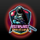 | 90313 | MPLAI | MetaPlanet AI |
|  | 90703 | ORIGEN | Origen DEFI |
|  | 90293 | SHIBCEO | ShibCEO |
|  | 90347 | SYNAPTICAI | Synaptic AI |
|  | 90647 | CCGDS | CCGDS |
|  | 90655 | COINSALE | CoinSale Token |
|  | 90389 | FGPT | Floki GPT |
|  | 90527 | PEACH | Peach Inu (BSC) |
| 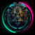 | 90665 | LCEO | LionCEO |
|  | 90437 | KCEO | KabosuCEO |
|  | 90447 | TIMESERIES | Timeseries AI |
|  | 90841 | CORGICEO | CORGI CEO |
|  | 91001 | SHIBOT | Shibot |
|  | 90231 | AIWALLET | AiWallet Token |
|  | 90233 | FINANCEAI | Finance AI |
|  | 90263 | SHFLCN | ShibFalcon |
|  | 90863 | SWIRLX | SwirlTokenX |
|  | 90509 | OPTIMUS AL | Optimus Al (BSC) |
|  | 90935 | DREAMPAD | DreamPad Capital |
|  | 89055 | 1RT | 1Reward Token |
|  | 88931 | CRIMSON | Crimson Network |
|  | 88869 | BLEC | Bless Global Credit |
|  | 89937 | FRAG | Fragmint |
| 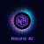 | 90183 | NEURALAI | Neural AI |
|  | 88709 | PONG | Pong Heroes |
| 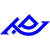 | 88725 | PENNY | Penny Token |
|  | 88789 | DOGRMY | DogeArmy |
|  | 89847 | DIGIS | DigiSwap |
|  | 88793 | CMAI | CoinMatch AI |
|  | 88791 | $DOSA | Dosa |
| 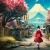 | 90205 | MILKAI | MilkAI |
|  | 87603 | $YOUB | Youbie |
|  | 88591 | A2E | Hey Floki Ai |
|  | 88133 | HOPPYINU | HoppyInu |
|  | 88577 | GYM AI | Gym AI |
|  | 88351 | GO! | NoriGO! |
| 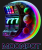 | 88489 | MOONPOT | MoonPot Finance |
|  | 88201 | ASTROAI | AstroAI |
|  | 88453 | GWINK | Genesis Wink |
|  | 87949 | DCO | DCOREUM |
|  | 81343 | RMAI | ROIMA INC |
| 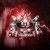 | 79867 | DORD | DeFi Or Die |
|  | 80953 | MAMA | Masterpiece Maker |
| 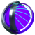 | 81121 | ORL | Orlando Chain |
|  | 79825 | MTSKS | MetaStocks |
|  | 82361 | RKV | RocketVerse |
|  | 81145 | FFS | FiFaSport |
| 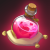 | 81081 | SCE | Slime Royale Cupid Essence |
|  | 86155 | WDF | Wallet Defi |
| 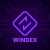 | 81117 | WDEX | Windex |
|  | 79803 | WRB3G | Web3Gold |
|  | 82339 | DOJO COIN | DOJO Coin |
| 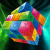 | 81085 | BOXC | BOXCASINO |
|  | 81053 | STKBNB | pSTAKE Staked BNB |
|  | 86465 | KKMA | Koakuma |
|  | 79353 | JKWON | JAIL KWON |
|  | 82317 | FOOTBALL | Football INU |
|  | 79255 | TWITTERX | TwitterX |
|  | 81057 | IFIT | Calo Indoor |
| 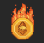 | 80721 | BURNING | EthBurn |
| 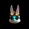 | 80783 | BKM | Bunny King Metaverse |
| 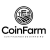 | 86227 | CFARM | CoinFarm |
|  | 86991 | HELENA | Helena Financial |
|  | 79591 | DKN | DoKEN V2 |
|  | 86791 | CUE | CUE Protocol |
|  | 82471 | HOMIECOIN | Homie Wars |
|  | 80143 | GMINESV2 | Gnome Mines Token V2 |
|  | 79657 | CARESV2 | Project CareCoin |
|  | 80467 | SOT | Soccer Crypto |
|  | 82381 | FLN | Falcon |
|  | 85185 | NAMI | Nami Corporation |
| 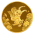 | 82445 | MAORABBIT | MaoRabbit |
|  | 79435 | BIC | Beagle Inu |
| 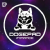 | 82465 | DPF | Dogepad Finance |
|  | 80319 | NOE | NOE GLOBAL |
|  | 79197 | DSD | Dachshund |
|  | 79179 | BOULPIK | Boulpik Token |
|  | 79439 | GSI | Global Innovative Solutions |
|  | 80255 | CBFINU | CBFINU |
|  | 80407 | MIDA | MIDA |
|  | 82647 | FITM | FitMax |
|  | 82447 | BALVEY | Baby Alvey |
| 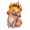 | 79347 | KCC | KingCorgi Chain |
|  | 86547 | I-STABLE | iStable |
| 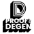 | 80339 | BNB2.0 | Proof of Degen |
|  | 80991 | DGZ | Dogezone |
|  | 79415 | SF | SphynxFi |
|  | 86781 | ETW | ETWInfinity |
|  | 79703 | SANJI | Sanji Inu |
|  | 79759 | GBR | Gabur |
|  | 79727 | TWEP | The Web3 Project |
|  | 82441 | ZIBU | Zibu |
|  | 82719 | LIUX | LIUX |
|  | 82495 | CSPT | CEASports |
| 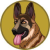 | 82483 | BERGERDOGE | BergerDoge |
|  | 86407 | GBT | Green Block |
|  | 82417 | MTLS | METAL FRIENDS |
| 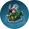 | 79387 | ZSKRAT | ZOMBIE SKRAT |
|  | 80895 | RC | RetroCade |
|  | 80775 | ZOMBIE | Zombie Runner |
|  | 82645 | NETC | Network Capital Token |
|  | 81387 | HOFR | House of Frenchies |
| 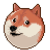 | 80865 | PXDOGE | Pixel Doge |
|  | 81173 | POOGROW | PooGrow |
|  | 79915 | DECODE | Decode Coin |
|  | 80703 | ZVERSUS | Z Versus Project |
|  | 81159 | CRYPTO | Big Crypto Game |
|  | 79909 | SHOD | Shopdi |
|  | 85377 | VRG | Virtual Reality Glasses |
|  | 81331 | CENTRO | CentroFi |
| 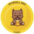 | 80593 | PITI | Pitbull Inu |
|  | 85979 | CVLC2 | CriptoVille Coins 2 |
|  | 82621 | BONY | Bloody Bunny |
| 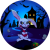 | 80591 | RH31 | Rabbit Halloween |
| 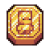 | 81335 | RLTV2 | RLTv2 |
|  | 87071 | VTR | Virtual Trader |
| 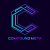 | 85977 | COMA | Compound Meta |
|  | 82617 | $DMC | Domestic collectors |
|  | 80521 | F4H | Fight 4 Hope |
|  | 81297 | XMN | Xmine |
|  | 85315 | YOURWALLET | YourWallet |
| 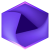 | 87215 | ITUBE | iTube |
|  | 79919 | SOG | Soccer Galaxy |
|  | 80533 | JUMPX | JumpX |
|  | 79559 | RA | Rabona |
|  | 82173 | DECA | DecaSwap |
|  | 80441 | FRZW | FRZSwap |
|  | 79573 | MIC | Microcosm |
| 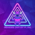 | 81273 | GENF | Genesis Defi |
| 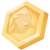 | 81169 | GKEN | Robocock Ultra World |
|  | 81247 | SV | Sportsverse |
|  | 87051 | TRYV | Tryvium |
|  | 86875 | FLOC | Christmas Floki |
|  | 86253 | DYZILLA | DYZilla |
|  | 80181 | KRP | Krakenpad |
|  | 85731 | GEEK | Geek Protocol |
|  | 79621 | MSP | MetaSpets |
|  | 79585 | SHIH-TZU | Shih Tzu Inu |
|  | 80571 | SCROOGE JR | SCROOGE JUNIOR |
|  | 87011 | ODYS | OdysseyWallet |
|  | 86853 | MTWR | MetaWar Token |
|  | 81413 | CFOOT | CarboFoot |
|  | 79411 | HOLO | HOLOCLEAR |
|  | 81405 | KASA | Kasa Central |
| 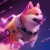 | 87157 | SLAB | ShibAI Labs |
|  | 80603 | NELUM | VICDAO NELUM |
| 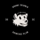 | 85761 | STINK | Drunk Skunks Drinking Club |
|  | 79841 | WTO | Wettok Market |
|  | 79093 | STKK | Streakk |
| 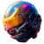 | 78969 | GEFI | Genesis Finance |
|  | 79121 | SCULPT | Sculptor |
|  | 71409 | AITN | Artificial Intelligence Technology Network |
|  | 71309 | REDLUNA | Redluna |
| 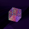 | 79041 | XPERPS | xPERPS |
|  | 78931 | SHARO | CrazySharo |
|  | 79113 | JMZ | Jimizz |
|  | 71405 | INMER | INME Run |
|  | 79101 | CIS | Chihuahua In Space |
|  | 78927 | $LUNAPE | Luna Ape Protocol |
|  | 78899 | SM96 | Safemoon 1996 |
|  | 78947 | GREATDANE | GreatDane |
|  | 71283 | NODY | Nody |
|  | 77285 | MOBY | Moby Dick V2 |
|  | 78881 | QATARGROW | QatarGrow |
|  | 78851 | PINKIE | Pinkie Inu |
|  | 76191 | DUT | Dar Dex |
| 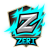 | 72071 | ZERI_V2 | CryptoZerofi V2 |
|  | 71401 | $GRUSH | Gold Rush Finance |
|  | 78885 | PRESALE | Presale.World |
|  | 78939 | $READ | Reach DAO |
|  | 71203 | GCT | Green CycGo |
|  | 71473 | CPLT | Catapult.ac |
|  | 70989 | CZBUSD | CZbusd |
|  | 70733 | GMINES | Gnome Mines |
|  | 78567 | POWA | Powabit |
|  | 78561 | BYP | BrightyPad |
|  | 70771 | MERCE | MetaMerce |
|  | 71133 | AKW | ArkWorld |
|  | 78479 | RISU | Risu |
|  | 71141 | KUY | KUY |
|  | 71607 | SUNEKU | Suneku |
|  | 71153 | STELIA | Stelia |
|  | 71159 | KILLER | Fat Cat Killer |
|  | 77599 | FOXV2 | FoxFinanceV2 |
|  | 78685 | FROGGO | Mutant Froggo |
|  | 70885 | LAEEB | LaEeb |
|  | 70929 | CZBNB | CZbnb |
|  | 70939 | LITE | LiteUSD |
| 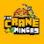 | 70927 | CRANE | Crane Miners |
|  | 71201 | CPAD | Cronospad |
|  | 77635 | ECON | Recession Coin |
|  | 71231 | NBOX | NBOX |
|  | 71235 | EGGPLUS | EggPlus |
| 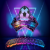 | 77713 | COCA | CYBER SOCCER |
|  | 71225 | MONES | Mones |
|  | 71255 | AFREP | Afrep |
|  | 78617 | QATAR | QAtar |
|  | 78753 | GTI | GTI Token |
|  | 71471 | TWOGE | Twoge Inu |
| 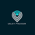 | 71507 | MIFI | Milky Finance |
|  | 71259 | $ADOGE | Arabian Doge |
|  | 70809 | BRZH | Brayzin Heist |
|  | 78333 | MFX | METFX Watch To Earn |
|  | 71497 | TOPG | Tate Token |
|  | 71465 | LOOBR | LooBr |
|  | 71443 | 1AMD | Free Speech |
|  | 70709 | FAWA | Fantasy War |
|  | 70869 | FGI | Frog Inu |
| 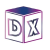 | 78105 | DGS | Deblox |
|  | 70831 | CMQ | Communique |
|  | 71573 | KRAC | Krabots |
|  | 71605 | CSD | Crystal Dust |
|  | 71509 | HEFI | HealthFi App |
|  | 78673 | BABYOKX | BABYOKX (BSC) |
|  | 70321 | MCA | MoveCash |
|  | 69561 | REBASEAPY | RebaseAPY |
|  | 70627 | APAY | AnonPay |
|  | 70629 | AZW | AZ World SocialFi |
|  | 70511 | SOD | Son of Doge |
|  | 69425 | UIM | Universe Island |
|  | 70519 | MBK | MeMeBank |
|  | 70111 | CHD | CharityDAO |
|  | 70521 | DNS | DinoStep |
|  | 69231 | KHAOS | Khaos Finance |
|  | 70095 | RCKC | Rocket Global Coin |
|  | 70641 | SO | Shiny Ore |
|  | 70035 | HBG | HeroBook |
|  | 69185 | ANM | Animverse |
| 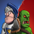 | 69183 | KLH | Crypto Klash |
|  | 69963 | ARTK | Artik |
|  | 68987 | DFW | DAO Farmer DFW |
|  | 69759 | LNDLRD | The Landlord |
|  | 69371 | LZN | Luzion Protocol |
|  | 68965 | CHTS | Creature Hunters |
|  | 70425 | USDEX | USDEX |
|  | 69215 | SSW | Seesaw |
|  | 70423 | KS2 | Kingdom Swap 2.0 |
|  | 70447 | MD3 | MaskDogeV3 |
|  | 70659 | ANTA | Tribalpunk Cryptoverse |
|  | 70675 | SKBR | SkyBridger |
|  | 69995 | DUW | Dreamy Undersea World |
|  | 69911 | BMF | Be Meta Famous |
| 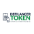 | 70677 | DEFILANCER | Defilancer |
|  | 70387 | RENS | Rens |
|  | 70337 | BNBDRAGON | BnB Dragon |
|  | 70205 | EXOS | Exobots |
|  | 69593 | MOVEY | Movey |
|  | 69695 | MDO | Medano |
| 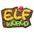 | 69669 | ELFT | Elfworld |
|  | 69675 | PEXO | Plant Exodus |
| 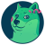 | 67287 | DOGEDEAD | DogeDead |
|  | 66919 | BABYDOGEZILLA | BabyDogeZilla |
|  | 67473 | $SPLUSV2 | SafePlus V2 |
| 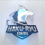 | 68253 | $RYU | Hakuryu |
|  | 67575 | BCITY | Bitcoin City Coin |
|  | 67283 | HEARN | Hearn.fi |
|  | 66963 | BLOS | Blockius |
|  | 66921 | INSTINCT | Instinct |
| 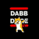 | 68721 | DDOGE | Dabb Doge |
|  | 68837 | DPL | DarePlay |
|  | 68829 | MEG | Magic Elpis Gem |
| 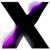 | 68281 | CCAP | CUEX Capital |
|  | 66887 | TEX | IoTeXPad |
| 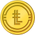 | 68549 | LESLAR | LESLAR Metaverse |
| 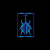 | 68363 | UANG | UangMarket |
|  | 68893 | KLING | Kling |
|  | 67977 | C24 | Clock 24 |
|  | 67959 | FPC | FamilyParty |
|  | 67713 | HYSS | Highest Yield Savings Service |
|  | 67855 | MONDAY | MondayClub |
|  | 68507 | STMAN | Stickman Battleground |
|  | 67851 | CHEESUS | Cheesus |
|  | 68373 | HPW | HappyLand Reward Token |
|  | 66365 | RUYI | Ruyi |
|  | 66315 | BLUC | Bluca |
|  | 66175 | COVDR | COVID-19 Recovery Token |
| 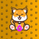 | 66623 | EFLOKI | Easter Floki |
|  | 66203 | KROOK | Krook Coin |
|  | 65917 | EPW | Evoverse Power |
|  | 62841 | KALI | Kalissa |
|  | 64093 | VFT | Value Finance |
|  | 64027 | BINGDWENDWEN | BingDwenDwen |
|  | 64041 | CONC | Concrete Codes |
|  | 64039 | VTT | VesTallyToken |
|  | 64417 | META HOUSE | Meta House |
|  | 64179 | HMRN | Homerun |
| 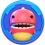 | 64143 | DNL | Dinoland |
|  | 63879 | CLASS | Cyberclassic |
|  | 63869 | 4PLAY | 4PLAY |
| 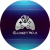 | 63841 | GWAR | Gadget War |
|  | 63825 | KITTENS | Kitten Coin |
|  | 63819 | BABYCATS | Baby Catcoin |
|  | 63993 | GALAXYDOGE | Galaxy Doge |
|  | 64409 | EDAC | EDAC |
| 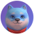 | 62937 | SPLY | ShiPlay |
|  | 64289 | MEMA | Meme Machine |
|  | 62861 | RMTX | RematicEGC |
|  | 63747 | BPM | Baby Pokemoon |
|  | 63541 | TBANK | Tokenbank |
|  | 62899 | MITHRIL | Mithrilverse |
|  | 63545 | MAST | Magic Cube Finance |
|  | 63407 | MMG | Monopoly Millionaire Game |
|  | 63599 | FINO | FINO DAO |
|  | 61223 | PCKT | Pocket |
|  | 60631 | KENSHI | Kenshi |
|  | 60391 | HEDGE | Hedge Finance |
| 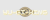 | 60533 | YUGI | Yugi |
| 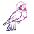 | 60765 | ABZ | AstroBirdz |
|  | 61131 | MAFA | MafaCoin |
|  | 59309 | RASKO | rASKO |
| 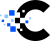 | 59069 | CFLT | Coinflect |
|  | 56355 | SUCCESS | SUCCESS INU |
|  | 56027 | CZF | CZFarm |
|  | 57187 | MARSINU | Mars Inu |
|  | 56923 | KSHIBA | Kawai Shiba |
|  | 57057 | EVCOIN | EverestCoin |
|  | 55363 | MNOP | Memenopoly Money |
| 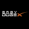 | 56399 | BDOGEX | BabyDogeX |
|  | 50555 | PINKE | PinkElon |
|  | 48747 | PVM | Privateum |
|  | 50019 | CIFI | Citizen Finance |
|  | 46645 | PTE | Peet DeFi |
|  | 47150 | AFI | Aries Financial |
|  | 44173 | MYTV | MyTVchain |
|  | 45532 | GRO | GROWTH DeFi |
|  | 44087 | WXTC | WeChain Coin |
|  | 33453 | WEBN | WEBN token |
| 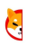 | 86239 | SHIB0.5 | Half Shiba Inu |
|  | 85971 | TIPO | TIPO Token |
|  | 80489 | FTF | Fan Tokens Football |
|  | 81463 | HIV | Hive Vault |
|  | 79013 | CBI | Cyptobit Network |
|  | 70459 | LASEREYES | Laser Eyes |
|  | 71075 | SLAY2EARN | Slay To Earn |
|  | 69767 | MTVP | MultiversePad |
| 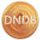 | 63803 | DNDB | DnD Metaverse |
|  | 87243 | SHAG | SHAGGY TOKEN |
| 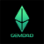 | 82171 | GEMDAO | GemDao |
| 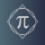 | 77597 | PIFI | PiFinance |
| 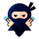 | 68335 | SNJ | Sola Ninja |
|  | 63741 | YNY | Crypto Realms War |
| 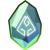 | 86351 | ANIFI | AniFi World |
|  | 80917 | O5O | O5O |
|  | 79451 | DEPI | Decentralized Pirates |
|  | 80325 | 2044 | 2044 Nuclear Apocalypse |
|  | 80443 | AUT | Avenue University Token |
| 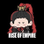 | 71411 | ROEMP | Rise Of Empire |
|  | 58777 | TITANIA | Titania Token |
| 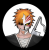 | 55969 | ICHIGO | Ichigo Inu |
|  | 69339 | MAKE | NFTMAKE |
|  | 68141 | CLASH | Clash Of Cars |
|  | 64763 | DEI | DEI Token |
|  | 64377 | HBEE | Hungry Bees |
| 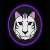 | 61741 | TQUEEN | TigerQueen |
|  | 49813 | ZUZ | ZUZ Protocol |
|  | 45881 | LUA | Lua Token |
| 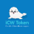 | 89449 | ICW | iCrypto World |
|  | 80459 | CLPS | Cleeps |
|  | 81429 | JUNI | Jackpot Universe |
|  | 80191 | DLA | Diolaunch |
|  | 69841 | BITSU | Bitsubishi |
|  | 67037 | NBNG | Nobunaga |
|  | 69031 | COTK | Colligo |
|  | 66389 | MFAM | Moonwell Apollo |
|  | 49363 | RASTA | Rasta Finance |
|  | 33806 | CLB | Cloudbric |
|  | 48801 | UJENNY | Jenny Metaverse DAO Token |
|  | 44505 | RM | RiverMount |
|  | 44507 | HOMT | HOM Token |
|  | 77819 | GRID | GridPlus [OLD] |
|  | 56799 | IMI | Influencer |
|  | 89423 | FTML | FTMlaunch |
|  | 82051 | IMV | ImminentVerse |
|  | 81655 | POKELON | POKELON |
|  | 77217 | RMG | META Gaming |
|  | 77547 | DRIVECRYPTO | Drive Crypto |
|  | 76829 | BFK | BFK Warzone |
|  | 76899 | SHIBB | BLACK SHIBA INU |
|  | 69531 | IPAY | iPay |
|  | 65549 | SCH | SoccerHub |
|  | 66413 | MBT | Magic Birds Token |
| 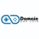 | 60899 | DMN | Domain Coin |
|  | 60357 | MOMO | Momo Protocol |
|  | 56125 | PIKACHU | Pikachu Inu |
|  | 56979 | CMN | Crypto Media Network |
|  | 44825 | MANDI | Mandi Token |
|  | 43221 | FCH | Freecash |
|  | 33017 | EXMR | EXMR FDN |
|  | 81327 | WBDC | BullDoge Chain |
| 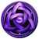 | 85323 | TRINITY | Trinity Swap |
| 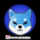 | 80327 | NSHIBA | Nowarshiba |
|  | 70777 | ATG | AstroGrow |
|  | 69671 | MOSHI | Moshiheads |
|  | 69329 | AUM | Atlantis Universe Money |
|  | 57991 | BODO | BoozeDoge |
|  | 36570 | XIRO | Xiropht |
|  | 78497 | MARBLEX7 | MarblePrix |
|  | 64835 | SHUEY | Shuey Rhon Inu |
|  | 47445 | DGCL | DigiCol Token |
| 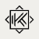 | 90061 | KYLN | Kylon Project |
|  | 86203 | ZOOPAD | ZOOPAD |
| 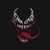 | 80855 | VENO | Veno |
|  | 85851 | VICEDAO | ViceWRLD DAO |
|  | 69539 | PAYGO | PayGo |
|  | 66103 | ALTER | Alter |
|  | 66031 | RBXS | RBXSamurai |
|  | 64897 | SIENNA | Sienna |
|  | 64341 | CHES | Chain Estate DAO |
|  | 64171 | GPO | GoldPesa Option |
|  | 69343 | SUCH | Such Shiba |
|  | 67985 | VOO | VooVoo |
| 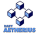 | 61529 | BABYAETH | Baby Aetherius |
|  | 41776 | DEFT | Deft |
|  | 34648 | PHL | placeh |
|  | 36565 | CRUZ | Cruzbit |
|  | 78495 | FOREST | YAKUSHIMA |
|  | 70329 | MOVON | MovingOn Finance |
|  | 44114 | NAN | NanTrade |
|  | 81611 | HPS | Happiness Token |
|  | 79059 | GIOTTO | GIOTTO |
|  | 80019 | INFINITY | Infinity Protocol |
|  | 69485 | ELONHYPE | ElonHype |
|  | 63389 | ALICN | Alicoin |
|  | 58867 | $ISLBYZ | Island Boyz |
|  | 56817 | SQUEEZE | Squeeze Token |
|  | 79771 | WFAC | Fahrenheit Chain |
|  | 79213 | YLGY | SheepAsheep |
|  | 71545 | NBLS | Noblesscoin |
|  | 71207 | FIDLE | Fidlecoin |
|  | 70055 | GRCC | Green Star |
|  | 71285 | GST-ETH | Green Satoshi Token on ETH |
|  | 69863 | ETHDOX | ETHDOX |
|  | 69411 | HCC | Hunter Crypto Coin |
|  | 68527 | METAP | MetapPlay |
|  | 66373 | GMC | GokuMarket Credit |
|  | 67243 | MJACK | MjackSwap |
| 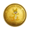 | 62023 | GAR | Kangaroo |
|  | 63195 | SHKG | Shikage |
| 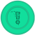 | 63385 | CFA | Coin Fast Alert |
|  | 60453 | HKSM | H-Space Metaverse |
|  | 60303 | TSLA | Tessla Coin |
|  | 57443 | GN | GN |
|  | 56221 | NSTE | NewSolution 2.0 |
|  | 55611 | KDC | Fandom Chain |
|  | 54893 | LIL | Lillion |
|  | 56237 | PVN | Pavecoin |
|  | 55353 | BABYDOGO | Baby Dogo Coin |
|  | 55617 | AGPC | AGPC |
|  | 56199 | ATBFIG | Financial Intelligence Group Token |
|  | 51081 | DID | Didcoin |
|  | 47907 | EOX | EOX |
|  | 79441 | QNI | Qroni |
|  | 79483 | JDB | JDB |
| 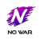 | 71429 | NOWAR | Nowar |
| 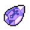 | 70023 | PRSG | Princess Striker Gem |
| 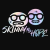 | 69275 | METASH | Meta Skinny&Hope |
|  | 64223 | AOPC | Apocalypse |
|  | 57003 | YARL | Yarloo |
|  | 69601 | GALE | Gale Network |
|  | 66483 | VCE | Vince Chain |
|  | 81189 | MIRROR | Mirror Finance |
|  | 70029 | MKP | MetaKeeper |
| 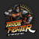 | 56557 | TDF | Trade Fighter |
|  | 42078 | MG | MinerGate Token |
|  | 79355 | TRFX | Triflex |
|  | 78625 | STSR | SatelStar |
|  | 81635 | AGOLP | AlgOil |
|  | 69789 | MBH | Marble Heroes |
| 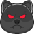 | 63519 | ESI | Evil Shiba Inu |
|  | 49597 | STKR | Staker DAO |
|  | 88841 | LMDA | Lambda Markets |
|  | 82603 | TILL | Tillage |
|  | 80919 | KI | Genopets KI |
|  | 70683 | NABOB | Nabob |
|  | 72669 | $MUU | MUU |
|  | 68815 | SRLY | Rally (Solana) |
|  | 68703 | ACUSD | Wrapped CUSD (Allbridge from Celo) |
|  | 53737 | DEXI | Dexioprotocol |
|  | 81445 | SCI | SCI Coin |
|  | 67933 | HONO | Hono |
|  | 68953 | MKOALA | Koala Token |
| 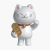 | 69557 | $SCATE | Sincere Cate |
|  | 63953 | DGOLD | Devious Licks Gold |
|  | 87059 | USPC | United States Property Coin |
| 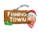 | 66863 | FHTN | Fishing Town |
|  | 60477 | CTZN | Totem |
|  | 61299 | LAUNCH | SuperLauncher DAO |
|  | 60607 | BRAWL | Meta Brawl |
|  | 57297 | CHARIZARD | Charizard Inu |
|  | 90087 | SBONK | SHIBONK |
|  | 77317 | BELKA | Belka |
|  | 79037 | TAZOR | Tazor |
|  | 71377 | DEAR | Dragon Evolution Augmente |
|  | 70021 | OXFI | Oxfinance |
|  | 62061 | KS | Kingdomswap |
|  | 60681 | ORKL | Orakler |
|  | 60549 | NGT | Gold Nugget |
|  | 60003 | NMS | Nemesis DAO |
|  | 58235 | DADDYSHARK | Daddy Shark |
|  | 57009 | POO | POOMOON |
|  | 70791 | POLVEN | Polka Ventures |
|  | 48873 | COPS | Cops Finance |
|  | 82177 | TKRN | Token Runner |
|  | 76937 | SERVE | Metavice |
| 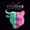 | 76757 | RISQ | RISQ Protocol |
|  | 80861 | $SRV | Survivor |
|  | 67197 | EURONIN | Euronin |
|  | 69177 | OLA | Ola City |
|  | 63863 | MBLOX | MinerBlox |
|  | 51453 | DOOR | DOOR |
|  | 46620 | BAEPAY | BAEPAY |
|  | 44840 | AVC | AVCCOIN |
|  | 79847 | UCON | YouCoin Metaverse |
|  | 81409 | DSOCCER | Dream Soccer |
|  | 79131 | SLRR | Solarr |
|  | 64323 | OURS | Flying Colours |
|  | 65477 | YFBTC | YFBitcoin |
|  | 65403 | PSLIP | Pinkslip Finance |
|  | 69865 | NMEEBITS | The Meebits |
|  | 68161 | SHUNAV2 | Shuna Inuverse |
|  | 63771 | TPG | ThePiggyGarden |
|  | 59383 | DODI | DoubleDice |
|  | 49479 | NBU | Nimbus |
|  | 44080 | LMCH | Latamcash |
|  | 33078 | HDAC | Hdac |
| 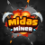 | 80909 | MMI | Midas Miner |
|  | 69617 | SODA | CheeseSoda Token |
|  | 59925 | USNOTA | NOTA |
|  | 52147 | RNDM | Random |
|  | 78259 | BLV3 | Crypto Legions V3 |
| 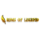 | 77667 | ROL | RimsofLegend |
|  | 80763 | SPOX | Spotrax |
|  | 71603 | XPOP | XPOP |
|  | 66041 | INSURE | InsureDAO |
|  | 56511 | RAINBOWTOKEN | RainbowToken |
|  | 48793 | UPUNK | Unicly CryptoPunks Collection |
|  | 42860 | HEBE | Hebeblock |
|  | 41803 | BITO | BITO Coin |
|  | 82271 | LA´EEB | La´eeb |
|  | 85403 | YY | YinYang |
| 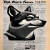 | 86117 | PUSUKE | Pusuke Inu |
|  | 65753 | DJN | Fenix Danjon |
|  | 63597 | ZEG | Zagent Gem |
|  | 56721 | CODI | Coin Discovery |
|  | 87119 | OXAI | OxAI.com |
|  | 69401 | GTFO | DumpBuster |
|  | 64979 | ZWAP | ZilSwap |
|  | 58511 | SOUND | Sound Coin |
|  | 70233 | FBS | Forbitspace |
|  | 67895 | FOSSIL | Fossil |
|  | 66107 | BBY | BabylonDAO |
|  | 42226 | NODE | Whole Network |
|  | 44099 | KYSC | KYSC Token |
|  | 42589 | JUL | Joule |
|  | 42100 | OKNC | Ok Node Community Token |
|  | 33110 | LXT | Litex |
| 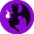 | 67535 | LLTH | Lilith Swap |
|  | 58699 | METAPETS | MetaPets |
|  | 78451 | UNKAI | Unkai |
|  | 70527 | LOCO | LocoMeta |
| 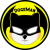 | 58181 | DGMAN | DogeMan |
|  | 71111 | SKELETON | Defiskeletons |
|  | 69209 | DEUX | DeuxPad |
|  | 50621 | ZITI | Ziticoin |
| 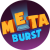 | 80271 | MEBU | Metaburst |
| 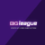 | 69053 | BGLG | Big League |
|  | 68633 | NUME | NumisMe |
|  | 61575 | NINTI | Nintia Estate |
|  | 49559 | CHAR | Charitas |
|  | 78613 | PGALA | pGALA |
|  | 69383 | ELONBANK | ElonBank |
|  | 67641 | COLOS | Chain Colosseum |
|  | 33645 | BHP | BHPCoin |
|  | 32591 | TOPC | TopChain |
|  | 79473 | FLOKICHAIN | Floki Chain |
|  | 80513 | Q2 | Pocketful of Quarters |
|  | 63835 | TREND | UpTrend |
| 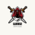 | 81077 | WARZ | Crypto Warz |
|  | 67345 | NXDF | NeXt-DeFi Protocol |
|  | 69927 | CRIME | Crime Gold |
|  | 69317 | RPP | Red Pill |
|  | 70081 | EXALT | Exalt |
|  | 67499 | AKS | Arkarus |
| 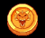 | 69799 | BCW | Bit Castle War |
|  | 56575 | PFY | Portify |
|  | 66489 | LIMC | LimCore |
|  | 58547 | TITANO | Titano |
|  | 36584 | HINT | Hintchain |
|  | 76865 | ELC | eaglecoin |
| 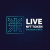 | 63415 | LIVENFT | Live NFT |
|  | 64129 | MGLC | MetaverseMGL |
|  | 62761 | FAST | Fastswap (BSC) |
|  | 54969 | FOOTIE | Footie Plus |
|  | 54789 | PETG | Pet Games |
|  | 50057 | OXO | OXO.Farm |
|  | 50243 | PNIX | PhoenixDefi.Finance |
|  | 53547 | CHIK | Chickenkebab Finance |
|  | 50939 | UEDC | United Emirate Decentralized Coin |
|  | 45553 | TONS | Thisoption |
| 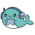 | 59455 | SWHAL | SafeWhale |
|  | 49155 | METEOR | Meteorite Network |
| 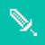 | 45282 | DOTX | DeFi of Thrones |
|  | 42759 | ROAD | ROAD |
| 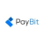 | 82691 | PAYBIT | PayBit |
|  | 50237 | DCTD | DCTDAO |
| 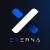 | 69465 | EHX | Eterna Hybrid Exchange |
| 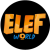 | 60387 | ELEF | ELEF World |
|  | 58673 | RIV2 | RiseUpV2 |
| 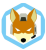 | 50911 | FOXX | Star Foxx |
|  | 45611 | PYLON | Pylon Finance |
|  | 79365 | $APLUS | AMETA |
| 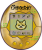 | 69307 | SHIBGOTCHI | SHiBGOTCHi |
|  | 80933 | WOF | World of Farms |
|  | 70525 | PSR | Pandora Spirit |
|  | 65427 | SAFTI | SafuTitano |
|  | 49009 | RELI | Relite Finance |
|  | 76947 | POPDOGE | PopDoge |
|  | 76895 | PEE | MicroPee |
|  | 70819 | SGMT | SuperStep |
|  | 64191 | XSTX | XStorage |
|  | 64347 | HRS | Heres |
| 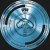 | 60373 | CPRO | Cloud Protocol |
|  | 55013 | CDONK | Club Donkey |
|  | 55145 | CORIS | Corgiswap |
|  | 53563 | MLA | Moola |
|  | 53821 | FWATCH | Foliowatch |
|  | 53681 | DOVE | DoveSwap Finance |
|  | 49551 | YTV | YTV Coin |
|  | 71011 | ENCWTA | Encyclopedia wTa |
|  | 48429 | LOTTO | Lotto |
|  | 45996 | YFOX | YFOX Finance |
|  | 44068 | HAPY | HAPY Coin |
|  | 68989 | $DEFI | BNBDeFi |
|  | 66929 | MLNT | Moon Light Night |
|  | 58881 | ANTEX | Antex |
|  | 58307 | CXRBN | CXRBN Token |
|  | 78353 | DECI | Maximus DECI |
|  | 80433 | DTEVIL | IdleTreasureParty |
|  | 70153 | DLF | Delfino Finance |
|  | 65409 | COLI | Coliquidity |
|  | 47081 | UPXAU | Universal Gold |
|  | 44595 | UPUSD | Universal US Dollar |
|  | 44876 | UPEUR | Universal Euro |
|  | 69991 | PEECOIN | PeeCoin Charts |
|  | 70723 | DCASH | Diabolo |
|  | 66419 | METAGS | MetaGameSpace |
|  | 56789 | ARATA | Arata |
|  | 58757 | IDDX | IndoDEX |
|  | 36429 | USDK | USDK |
|  | 70019 | RLOOP | rLoop |
|  | 50347 | DHOLD | DiamondHold |
|  | 42145 | BGT | BGT |
|  | 41876 | HAZ | Hazza |
|  | 71199 | PRGC | ProtoReality Games |
|  | 62821 | XGT | Xion Finance |
|  | 59181 | BRG.X | Bridge$ |
|  | 49529 | CORA | Corra.Finance |
|  | 80085 | $VERSA | Versatile Finance |
|  | 76549 | BTXN | Exen Coin |
|  | 79015 | QFI | QUESTRA FINANCE |
|  | 68533 | NFTM | Nftime |
|  | 70199 | JINDOGE | Jindoge |
|  | 60673 | MBR | MetaBullRun |
|  | 82147 | SATSALL | ALL BEST ICO SATOSHI |
|  | 77969 | AMPLIFI | AmpliFi |
|  | 71437 | GLAND | Griffin Land |
|  | 71229 | EGOD | egoD |
|  | 77681 | MFY | MetaFooty |
|  | 67231 | HTDF | Orient Walt |
|  | 53935 | PROMISE | Promise |
|  | 47184 | KOBE | Shabu Shabu |
|  | 70715 | M7V2 | M7V2 |
|  | 69427 | TRMT | Tierra Meta |
|  | 61351 | SUPA | SUPA Foundation |
| 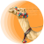 | 60903 | CMLT | CamelToken |
|  | 56893 | PPOLL | PancakePoll |
|  | 56525 | CLION | CryptoLion |
| 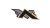 | 60339 | TMDS | Tremendous Coin |
|  | 57751 | ASET | Parasset |
|  | 56463 | UNR | Unirealchain |
|  | 78955 | PFAN | PowerFan |
|  | 69627 | TDLC | The Davis Legacy Coin |
|  | 3698 | DBET | DecentBet |
|  | 33752 | KUN | KUN |
|  | 85385 | $ZKN | zkNFTex |
|  | 80813 | TOKR | Tokerr |
| 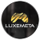 | 79749 | LUXETOKEN | LuxeToken |
|  | 79407 | CNW | CoinWealth |
| 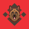 | 79009 | SINU | Shepherd Inu |
| 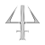 | 78273 | NAAL | Ethernaal |
|  | 78867 | HPN | HyperonChain |
|  | 71061 | PADX | Puzzle And Dragons X |
|  | 68897 | OBLOX | Oceidon Blox |
|  | 67655 | FRMX | FRMx Token |
|  | 67699 | FSK | Farm Skylines |
|  | 64319 | H2E | Hold2Earn |
|  | 62949 | FAM | FAM Token |
|  | 61201 | NSH | NoShit |
|  | 61343 | INUJUMP | Inu Jump and the Temple of Shiba |
|  | 60271 | DCH | DeChart |
|  | 57189 | LUNAPAD | Luna-Pad |
|  | 51957 | NLIFE | Night Life Crypto |
|  | 49145 | ALGOP | AlgoPainter |
|  | 48947 | EULER | Euler Tools |
|  | 86653 | SUPERSTAKE | Superstake |
| 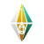 | 81417 | 1ETH | 1ETH |
|  | 69715 | DENTRO | Dentrocoin |
|  | 68255 | PILLS | Morpheus Swap |
|  | 67983 | LORY | Yield Parrot |
|  | 46634 | N0031 | nYFI |
|  | 49573 | SAFEICARUS | SafeIcarus |
|  | 49967 | NCAT | NCAT Token |
|  | 49631 | BAFE | Bafe.io |
|  | 47835 | UME | UME Token |
|  | 47165 | GLOX | Glox Finance |
|  | 63603 | AIRPAY | AirPay |
|  | 50499 | EFT | EFT |
|  | 87019 | OMATIC | Orbit Bridge Klaytn MATIC |
|  | 79673 | VIST | VIST |
|  | 79047 | TRDO | TRONADO |
|  | 70369 | PASHA | Pasha |
|  | 63459 | EB | Endless Battlefield |
|  | 45529 | YFFS | YFFS Finance |
|  | 42774 | CDL | CoinDeal Token |
|  | 49137 | SDFI | StingDefi |
|  | 68409 | KFS G | Kindness For Soul |
|  | 66725 | VAP | Virtus Finance |
|  | 60253 | G.O.A.T | G.O.A.T Token |
|  | 59817 | F11 | First Eleven |
|  | 43034 | UBU | UBU |
|  | 79609 | ESNC | Galaxy Arena Metaverse |
|  | 67089 | GIL | FishingTownGilToken |
|  | 58459 | LDDP | La Doge de Papel |
|  | 32654 | PHI | PHI Token |
|  | 82319 | OXM | OXM Protocol |
|  | 61555 | META CLOTH | Meta Cloth |
|  | 56045 | DEPO | Depo |
| 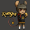 | 79721 | WENTXN | RatBoy BSC |
|  | 79249 | CDOG | Cypherdog Token |
|  | 47002 | $ANRX | AnRKey X |
|  | 54463 | MBF | MoonBear.finance |
|  | 48313 | GOGO | GOGO Finance |
|  | 78595 | LUCKY | Maximus LUCKY |
| 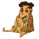 | 63707 | STILTON | Stilton Musk |
|  | 60883 | IMRTL | Immortl |
|  | 69925 | BABYZOROINU | Babyzoro Inu |
|  | 67723 | CGANG | CryptoGangsters |
|  | 66445 | Y-5 | Y-5 FINANCE |
|  | 64881 | WOOFY | Woofy |
|  | 61579 | SHIBARROW | Captain Shibarrow |
|  | 59955 | AJE | Ajeverse |
| 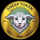 | 56647 | SHEEP | SheepToken |
|  | 55019 | LORD | Overlord |
|  | 49925 | SAFEBANK | SafeBank |
|  | 80039 | MUNI | MUNI |
|  | 77999 | CMERGE | CoinMerge (BEP20) |
| 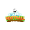 | 69167 | $BALLZ | CryptoFootball |
|  | 57391 | KINGSHIBA | King of Shiba |
|  | 54367 | TENSHI | Tenshi |
|  | 71427 | WOFO | World Football |
|  | 69743 | NOSNITCH | Nosnitches |
|  | 61133 | RC2 | Reward Cycle 2 |
|  | 58861 | DOGEKONGZILLA | DogeKongZilla |
|  | 57387 | ORIO | Boorio |
|  | 80331 | PFT | PayFlow |
|  | 79431 | FACEMETA | Face Meta 2.0 |
|  | 63417 | METAROID | Metaroid NFT |
|  | 58383 | SHN | ShineDAO |
|  | 58329 | FANTOMAPES | Fantom of the Opera Apes |
|  | 68775 | COOOM | Incooom Genesis |
|  | 63539 | BFYC | Bored Floki Yacht Club |
|  | 70149 | GCOOOM | Incooom Genesis Gold |
| 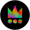 | 68231 | PCOOOM | Incooom Genesis Psychedelic |
|  | 58341 | HOTZILLA | HotZilla |
|  | 32760 | CNN | Content Neutrality Network |
|  | 70555 | $FIT | FitScrypt |
|  | 47200 | STPL | Stream Protocol |
|  | 57237 | TPOS | The Philosophers Stone |
|  | 80853 | FTB | Fit&Beat |
|  | 71263 | WEI | WEI |
|  | 61787 | RKF | FlokiRocket |
| 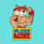 | 66439 | GAINZ | FlokiGainz |
|  | 61965 | FIMI | Fimi Market Inc. |
|  | 78963 | PETT | Pett Network |
|  | 63889 | OFF | Offline |
|  | 61331 | CLEX | Clexchain |
|  | 44861 | EFIN | eFIN |
|  | 43051 | BEENG | BEENG Token |
|  | 43035 | POINT | Point |
|  | 43028 | XSCR | SECURUS |
|  | 36541 | ZDX | Zer-Dex |
|  | 34508 | MIDAS | Midas |
|  | 34744 | X6 | X6coin |
|  | 33407 | SND | SnodeCoin |
|  | 33010 | BTXC | Bettex Coin |
|  | 32864 | TRTT | Trittium |
|  | 79629 | MLX | Metaple Finance |
| 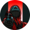 | 58469 | SQM | Squid Moon |
| 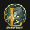 | 61677 | LOZ | League of Zodiacs |
|  | 76437 | BLCT | Bloomzed Loyalty Club Ticket |
|  | 70783 | FBL | Football Battle |
|  | 63579 | JIG | Jigen |
|  | 62915 | FATOSHI | Fat Satoshi |
|  | 60917 | GENCAP | GenCoin Capital |
|  | 60851 | GTR | Ghost Trader |
|  | 57971 | SHIBAW | Shiba Watch |
|  | 54199 | SAFEARN | Safe Earn |
|  | 47699 | YFPI | Yearn Finance Passive Income |
|  | 78399 | BTMC | Bit Miner Chain |
| 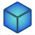 | 70063 | CRND | Crypto Nodes |
|  | 69125 | NAGA | Naga Kingdom |
|  | 62059 | CTRAIN | CryptoTrains |
|  | 61305 | ACCEL | Accel Defi |
| 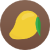 | 53613 | MANGO | Mango Finance |
|  | 63055 | IOTN | IOTEN |
| 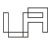 | 60819 | UART | UniArts |
|  | 70793 | METAVIE | Metavie |
|  | 71455 | GLW | GoalW |
|  | 61721 | AVR | AVARA |
|  | 46991 | PIS | Polkainsure Finance |
|  | 63301 | ELVES | Elves Century |
| 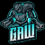 | 82639 | GAW | GameGaw |
|  | 63507 | TENW | TEN Wallet |
|  | 67425 | CORNX | Chaincorn |
| 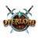 | 66905 | OVL | Overlord Game |
|  | 60929 | EMO | Emocoin |
|  | 46623 | RENBCH | renBCH |
|  | 36603 | TAN | Taklimakan Network |
|  | 58377 | ANONFLOKI | AnonFloki |
|  | 77665 | VAT | Vaquita |
|  | 67401 | BPANDA | Baby Panda |
|  | 61167 | DPK TOKEN | DPK |
| 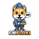 | 61339 | GMFLOKI | GM Floki |
|  | 33914 | QWC | Qwertycoin |
|  | 150 | DYN | Dynamic |
|  | 62751 | ARCX | ARC Governance |
|  | 50765 | MNTT | MoonTrust |
|  | 36422 | UBN | Ubricoin |
|  | 71431 | Y5TT | Y5 Trader |
|  | 71569 | ORYX | OryxFi |
|  | 59789 | $RFG | Refugees Token |
| 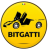 | 51931 | BITGATTI | Bitgatti |
|  | 46756 | TEAT | TEAL |
|  | 45380 | DOOS | DOOS TOKEN |
|  | 45457 | ETHPY | Etherpay |
|  | 64031 | FLAFLO | Flappy Floki |
|  | 81283 | MIKU | Miku |
|  | 54727 | GLMS | Glimpse |
|  | 70247 | DPWK | Dont Play With Kitty |
|  | 70533 | RGLD | Rolaz Gold |
|  | 81035 | SHF | ShibaForest |
|  | 69917 | CXD | CortexDAO |
|  | 70751 | VRYNT | VRYNT |
|  | 70231 | DEIP | DEIP Protocol |
|  | 66051 | MSZ | MegaShibaZilla |
| 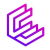 | 71277 | CBITBOX | Bitbox Classic |
|  | 62877 | AF-PRESALEDAO | PresaleDAO |
|  | 59509 | AGFI | AggregatedFinance |
|  | 71113 | YONKŌ | Four Emperors |
|  | 58941 | BBETH | BabyEthereum |
|  | 51789 | SMGM | SMEGMARS |
|  | 69353 | $HORDE | Horde Token |
| 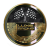 | 64059 | LUXE | LuxeRacing |
|  | 63477 | DO | Do Token |
|  | 61147 | PACK | The Wolf Pack |
|  | 49185 | LEXI | LEXIT |
|  | 34787 | PEPS | PEPS Coin |
|  | 66575 | REDKISHU | Red Kishu |
|  | 67451 | FUMA | Fuma Finance |
|  | 78901 | NBLH | NBLH |
|  | 70563 | AERO-V2 | Aerochain Coin V2 |
|  | 77747 | AETHC | Ankr Reward-Bearing Staked ETH |
|  | 70959 | IGR | Ingress |
|  | 60457 | CWOLF | CryptoWolf |
|  | 46787 | BVL | Bullswap Exchange |
|  | 45367 | OPM | Omega Protocol Money |
|  | 45070 | YFFI | yffi finance |
|  | 44923 | DCP | Discount Percent |
|  | 33478 | INVE | InterValue |
|  | 32913 | LCS | LocalCoinSwap |
|  | 32388 | BANCA | Banca |
|  | 47997 | CHS | CheeseSwap |
|  | 46890 | TWI | Trade.win |
|  | 46345 | YEFIM | Yearn Finance Management |
|  | 44828 | L2P | Lung Protocol |
|  | 42762 | DRGB | Dragonbit |
|  | 42152 | SEAD | SEADEX |
|  | 34615 | GENT | Genesis Token |
|  | 34539 | FXP | FXPay |
|  | 32960 | KWATT | 4NEW |
|  | 80283 | VNES | Vanesse |
|  | 79025 | TOI | Toksi |
|  | 61251 | XLMN | XL-Moon |
|  | 34614 | PLG | Plug |
|  | 33099 | DAC | Davinci Coin |
|  | 32770 | IIC | Intelligent Investment Chain |
|  | 49235 | BNXX | Bitcoinnexx |
|  | 46609 | SERGS | SERGS |
|  | 45190 | NVZN | INVIZION |
|  | 68863 | XBOO | Boo MirrorWorld |
|  | 63661 | FQS | FqSwap |
|  | 70009 | YUZU | YuzuSwap |
|  | 67375 | THS | Theoscoin |
|  | 66273 | FXL | FXWallet |
|  | 56867 | FS | FantomStarter |
|  | 54917 | WIVA | WIVA |
|  | 67521 | PWG | PW-GOLD |
|  | 63915 | MAIR | MetaAir |
|  | 70921 | XECO | X Ecosystem |
|  | 59123 | ZARD | FireZard |
|  | 49507 | PNIXS | Phoenix Defi Finance |
|  | 33541 | HPT | Huobi Pool Token |
|  | 33135 | ACDC | Volt |
|  | 61945 | CROCKET | CryptoRockets |
|  | 61211 | TARP | Totally A Rug Pull |
|  | 70599 | USN | USN |
|  | 70717 | PEM | Pembrock |
|  | 48803 | GERO | GeroWallet |
| 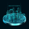 | 68679 | MTOWN | MetaTown |
|  | 68275 | COVID DOGE | Covid Doge |
|  | 66689 | SKYWARD | Skyward Finance |
| 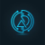 | 60325 | ADEN | Adene |
|  | 59761 | MICROSANTA | Micro Santa Coin |
| 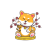 | 56739 | BABYDOGEMM | Baby Doge Money Maker |
|  | 50207 | ELENA | Elena Protocol |
|  | 46994 | BSDS | Basis Dollar Share |
|  | 36547 | AXA | AXA Foundation |
|  | 34605 | LOTO | Lotoblock |
|  | 33568 | MAS | MidasProtocol |
|  | 69497 | BAMB | Bamboonium |
|  | 56963 | SDBY | Sadbaby |
|  | 49853 | POFI | PoFi |
|  | 50395 | XXP | XX Platform |
|  | 50279 | SFN | Strains |
|  | 47016 | SAS | Stand Share |
|  | 45410 | PDAI | Prime DAI |
|  | 45346 | DISTX | DistX |
|  | 44535 | NMP | Neuromorphic.io |
|  | 41555 | HDS | HotDollars Token |
|  | 33647 | CWV | CWV Chain |
|  | 33021 | ACED | AceD |
|  | 32506 | DTH | Dether |
|  | 66055 | WPT | WORLDPET |
|  | 61015 | DBIO | DeBio Network |
|  | 58103 | GLORYD | GloryDoge |
|  | 56595 | ZHT | ZeroHybrid |
|  | 45096 | HALV | Halving Coin |
|  | 44977 | LCG | LCG Energy |
|  | 34616 | SWL | Swiftlance Token |
|  | 33440 | MEDIBIT | MediBit |
|  | 33691 | ENTS | EUNOMIA |
|  | 44932 | QOB | Qobit |
|  | 33443 | DPT | Diamond Platform Token |
|  | 143 | LMC | Lomocoin |
|  | 45 | EXCL | ExclusiveCoin |
|  | 67935 | GUMMY | Gummy Bull Token |
|  | 67199 | FOHO | Foho Coin |
|  | 56489 | NRT | NFT Royal Token |
|  | 51983 | POPE | Crypto Pote Token |
|  | 47711 | HOO | Hoo Token |
|  | 47727 | YOT | PayYoda |
| 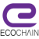 | 44072 | ECOC | Ecochain |
|  | 34579 | RCCC | RCCC |
|  | 34781 | OSC | OasisCity |
|  | 62871 | CAGE | Coinage Finance |
|  | 63509 | RVE | Revive |
|  | 53491 | YFIAG | YearnAgnostic Finance |
|  | 33557 | BBGC | Big Bang Game Coin |
|  | 61665 | POOR | Poor Quack |
|  | 58437 | PO | PlayersOnly |
|  | 57891 | CBA | Cabana Token |
|  | 45982 | BASID | Basid Coin |
|  | 34389 | QDAO | Q DAO Governance token v1.0 |
|  | 32912 | ROCK2 | ICE ROCK MINING |
|  | 60753 | MILLIONS | Floki Millions |
|  | 46934 | ESTI | Easticoin |
|  | 41831 | TYT | Tianya Token |
|  | 32992 | FOXT | Fox Trading |
|  | 63749 | CPLAY | CPLAY Network |
|  | 60617 | METAVEGAS | MetaVegas |
|  | 59663 | YSHIBAINU | Yooshiba Inu |
|  | 60105 | BLG | Blue Gold |
|  | 58911 | FGSPORT | FootBallGo |
|  | 58873 | SHIBIB | Shiba Inu Billionaire |
|  | 57207 | ONEUSD | 1 Dollar |
|  | 50561 | COURT | OptionRoom Governance Token |
|  | 47981 | I9X | i9X Coin |
| 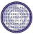 | 42429 | BOOL | Boolean |
|  | 34617 | PBTT | Purple Butterfly Trading |
|  | 34562 | TAVITT | Tavittcoin |
|  | 33883 | SNL | Sport and Leisure |
|  | 32463 | LND | Lendingblock |
|  | 67905 | TART | Tartarus Finance |
|  | 59199 | LLG | Lucid Lands |
|  | 68773 | QUOTH | Quoth |
|  | 68469 | FROSTYFLOKI | Frosty Floki V2 |
| 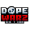 | 59659 | DRUG | DopeWarz |

---

[← Prev](./list12.md) | [Next →](./list14.md)
