# Cryptocurrency list (page: 14)

[← Prev](./list13.md) | [Next →](./list15.md)

| Logo | ID | Symbol | Name |
|:----:|:--:|:------:|:-----|
|  | 13796 | YUGE | YUGE COIN |
|  | 13797 | COME | Community of Meme |
|  | 13798 | EWIF | elonwifcoin |
| 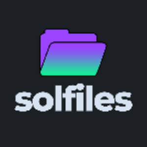 | 13799 | FILES | Solfiles |
| 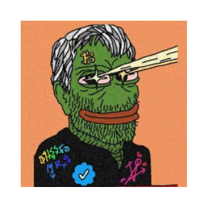 | 13800 | BOMK | BOMK |
| 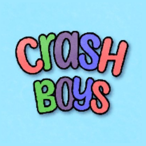 | 13801 | CRASHBOYS | CRASHBOYS |
| 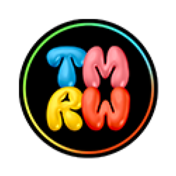 | 13802 | TMRW | TMRW Coin |
| 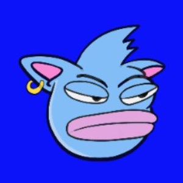 | 13803 | BRATT | Son of Brett (basedbratt.xyz) |
|  | 13804 | EWON | Ewon Mucks |
|  | 13805 | ALDIN | Alaaddin.ai |
| 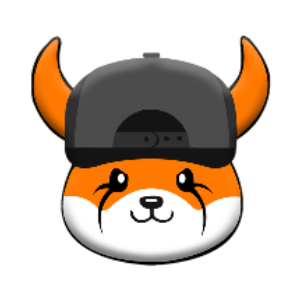 | 13806 | FLINU | FLOKI INU |
| 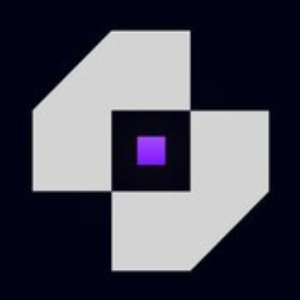 | 13807 | OMNIX | OmniBotX |
|  | 13808 | GLE | Green Life Energy |
| 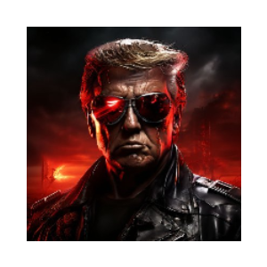 | 13809 | TRUMPTECH | Trump Tech |
| 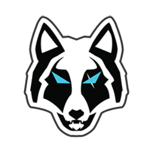 | 13810 | WWD | Wolf Works DAO |
| 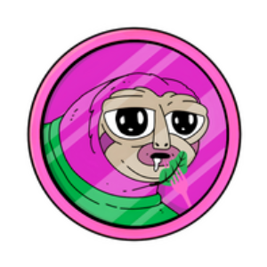 | 13811 | SLERFFORK | SlerfFork |
|  | 13812 | WFO | WoofOracle |
| 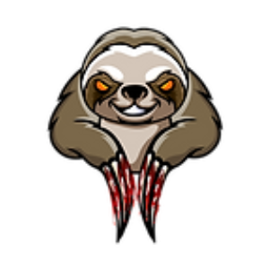 | 13813 | BOKI | BOOK OF KILLER |
| 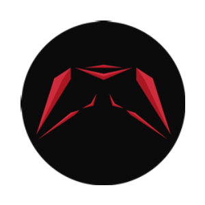 | 13814 | JK | JK Coin |
| 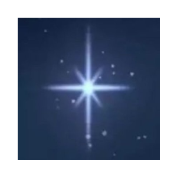 | 13815 | O | Childhoods End |
| 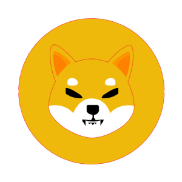 | 13816 | MINO | MINO INU |
|  | 13817 | SHIBK | ShibaKeanu |
|  | 13818 | CRICKETS | Kermit |
|  | 13819 | THINKWAREAI | ThinkwareAI |
| 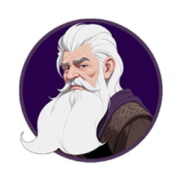 | 13820 | BALIN | Balin Bank |
|  | 13821 | CRYPTODELIVERY | Crypto Delivery |
|  | 13822 | RBLZ | RebelSatoshi |
| 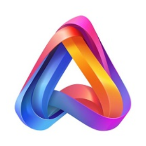 | 13823 | ALME | Alita |
| 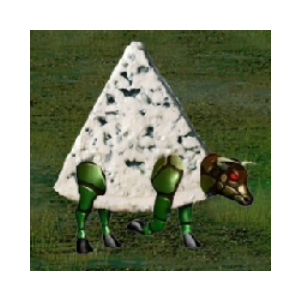 | 13824 | GORGONZOLA | Heroes 3 Foundation |
| 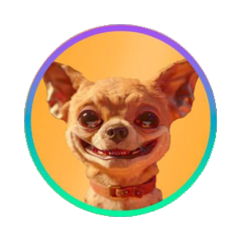 | 13825 | HUMP | Hump |
|  | 13826 | POKERFI | POKERFI |
| 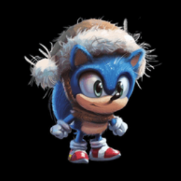 | 13827 | SONICWIF | SonicWifHat |
| 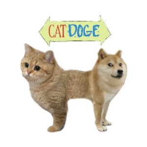 | 13828 | CATDOGE | CAT DOGE |
| 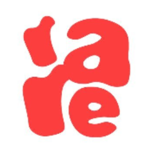 | 13829 | R4RE | R4RE Token |
| 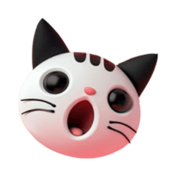 | 13830 | SIU | Siu |
|  | 13831 | OZMPC | Ozempic |
|  | 13832 | SWH | simbawifhat |
| 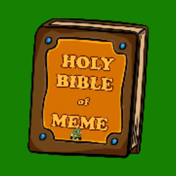 | 13833 | BIBO | Bible of Memes |
| 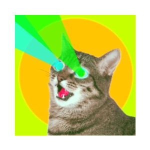 | 13835 | BTCAT | Bitcoin Cat |
| 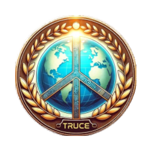 | 13836 | TRUCE | WORLD PEACE PROJECT |
| 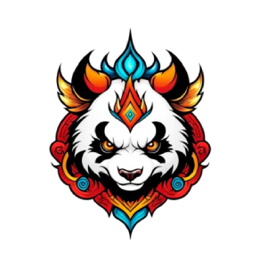 | 13837 | FUBAO | FUBAO |
| 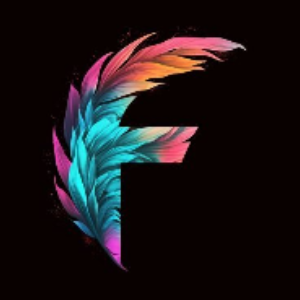 | 13838 | FM | Flowmatic |
| 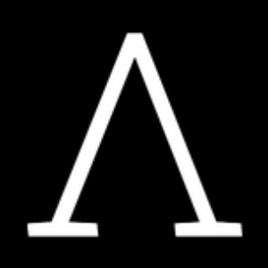 | 13839 | VUZZ | Vuzz AI |
| 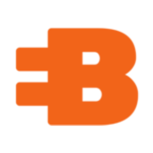 | 13840 | BJ | Blocjerk |
| 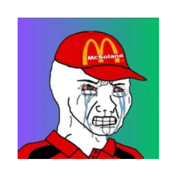 | 13841 | JEET | Jeet |
| 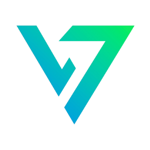 | 13842 | VDZ | Voidz |
| 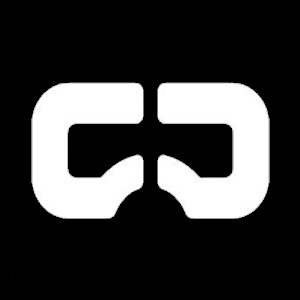 | 13843 | SENSOR | Sensor Protocol |
| 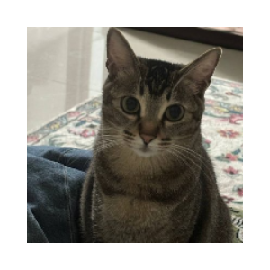 | 13844 | YAOYAO | Yaoyao's Cat |
| 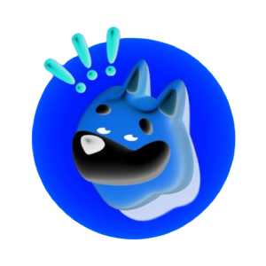 | 13845 | KNOB | KNOB |
| 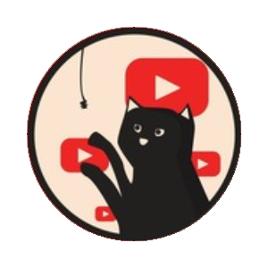 | 13846 | PAJAMAS | The First Youtube Cat |
| 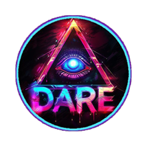 | 13847 | DARE | The Dare |
| 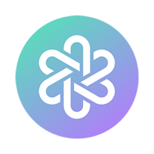 | 13848 | MDAI | MindAI |
| 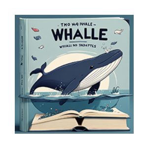 | 13849 | BOWE | Book of Whales |
| 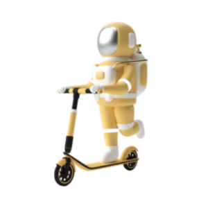 | 13850 | JOOPS | JOOPS |
| 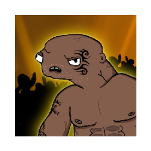 | 13851 | THAVAGE | Mike Tython |
|  | 13852 | MASA | Masa |
| 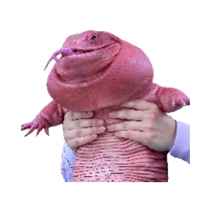 | 13853 | MAGAIBA | Magaiba (www.magaiba.xyz) |
| 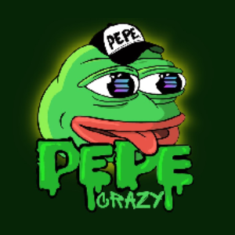 | 13854 | CRAZYPEPE | CrazyPepe |
| 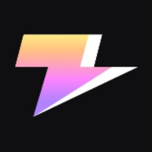 | 13855 | ZEUS | Zeus Network |
|  | 13856 | GUARDAI | GuardAI |
| 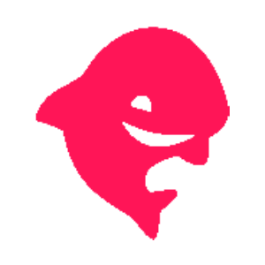 | 13857 | SHARK | Sharky |
| 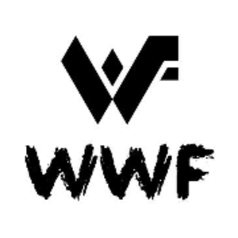 | 13858 | WWF | WWF |
|  | 13859 | JUICE | Juice Finance |
| 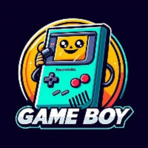 | 13860 | GBOY | GameBoy |
| 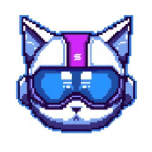 | 13861 | SOLKIT | Solana Kit |
|  | 13862 | PANO | PanoVerse |
|  | 13863 | BCOQ | BLACK COQINU |
| 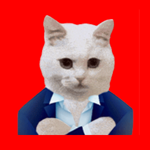 | 13864 | CATELON | CatElonMars |
| 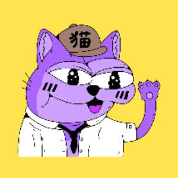 | 13865 | PEKO | Pepe Neko |
| 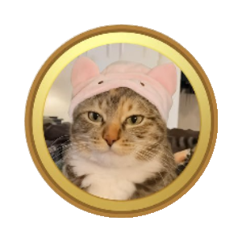 | 13866 | CATHAT | catwifhat |
|  | 13867 | HOCAI | Heroes of Crypto AI |
|  | 13868 | 9DOGS | NINE DOGS |
|  | 13869 | BASEAI | BaseAI |
|  | 13870 | ATECH | AvaxTech |
|  | 13871 | WIFSA | dogwifsaudihat |
|  | 13872 | ELEPEPE | ElephantPepe |
|  | 13873 | MEOWG | MeowGangs |
|  | 13874 | MONKU | Monku |
|  | 13875 | KITTENWIF | KittenWifHat |
|  | 13876 | DEFIDO | DeFido |
|  | 13877 | HMKR | Hitmakr |
|  | 13878 | STATS | Stats |
|  | 13879 | KNFT | KStarNFT |
|  | 13880 | TIPINU | Tip Inu |
|  | 13881 | GEMAI | Next Gem AI |
|  | 13882 | SIUUU | Crustieno Renaldo |
|  | 13883 | BASEDAI | BasedAI |
|  | 13884 | WIFS | dogwifscarf |
|  | 13885 | GPO | GoldPesa Option |
|  | 13886 | O4DX | O4DX |
|  | 13887 | BPINKY | BPINKY |
|  | 13888 | ODGN | OrdiGen |
|  | 13889 | FBG | Fort Block Games |
|  | 13890 | POAI | Port AI |
|  | 13891 | ARCAS | Arcas |
|  | 13892 | PALMY | Palmy |
|  | 13893 | CODEG | CodeGenie |
|  | 13894 | TBANK | TaoBank |
|  | 13895 | SECOND | MetaDOS |
|  | 13896 | OCD | On-Chain Dynamics |
|  | 13897 | BSB | Based Street Bets |
|  | 13898 | ISHI | Ishi |
|  | 13899 | 21X | 21X |
|  | 13900 | BUB | BUBCAT |
|  | 13901 | GROKCAT | Grok Cat |
|  | 13902 | XENDV2 | Xend Real World Asset |
|  | 13903 | MOUTAI | Moutai |
|  | 13904 | SPEEDY | Speedy |
|  | 13905 | BROGG | Brett's Dog (brogg.dog) |
|  | 13906 | JIZZLORD | JizzLord |
|  | 13907 | HASHAI | HashAI |
|  | 13908 | KEYCAT | Keyboard Cat |
|  | 13909 | CHAT | Solchat |
|  | 13910 | SAGA | Saga |
|  | 13911 | WCELL | Wrapped CellMates |
|  | 13912 | SORAPORN | Sora Porn |
|  | 13913 | LIBRAP | Libra Protocol |
|  | 13914 | BSTC | BST Chain |
|  | 13915 | HEMAN | HE-MAN |
|  | 13916 | XRAI | X-Ratio A |
|  | 13917 | BOMES | BOOK OF MEMES |
|  | 13918 | ELECTRON | Electron (Atomicals) |
|  | 13919 | CITI | CITI Fediverse |
|  | 13920 | INP | Ionic Pocket Token |
|  | 13921 | AAZ | ATLAZ |
|  | 13922 | BODO | BOOK OF DOGS |
|  | 13923 | DONALD | DONALD TRUMP |
|  | 13924 | SCFX | Shui CFX |
|  | 13925 | PEUSD | peg-eUSD |
|  | 13926 | ORDI2 | ORDI 2.0 |
|  | 13927 | CRAZYCAT | CRAZY CAT |
|  | 13928 | DEED | Deed (Ordinals) |
|  | 13929 | PEPEW | PEPEPOW |
|  | 13931 | BTNT | BitNautic Token |
|  | 13932 | GND | GND Protoco |
|  | 13933 | UCORE | UnityCore Protocol |
|  | 13934 | PBAR | Pangolin Hedera |
|  | 13935 | SMA | Soma Network |
|  | 13936 | CHOY | Bok Choy |
|  | 13937 | WWEMIX | WWEMIX |
|  | 13938 | WBESC | Wrapped BESC |
|  | 13939 | GICT | GICTrade |
|  | 13941 | ECG | EcoSmart |
|  | 13942 | FEGV1 | FEG Token v1 |
|  | 13943 | USDTZ | USDtez |
|  | 13944 | WETHW | Wrapped EthereumPoW |
|  | 13945 | SCRAPPY | Scrappy |
|  | 13946 | KATYCAT | Katy Perry Fans |
|  | 13947 | SLEX | SLEX Token |
|  | 13948 | MEOWIF | Meowifhat |
|  | 13949 | GOMD | GOMDori |
|  | 13950 | DOGINME | doginme |
|  | 13951 | SOLCEX | SolCex |
|  | 13952 | PEPEBNB | Pepe The Frog |
|  | 13953 | HNX | HeartX Utility Token |
|  | 13954 | BOME2 | Book of Meme 2.0 |
|  | 13955 | DEVVE | Devve |
|  | 13956 | WFUSE | Wrapped Fuse |
|  | 13957 | CROB | Crob Coin |
|  | 13958 | EGGY | EGGY |
|  | 13959 | PDA | PlayDapp |
|  | 13960 | WBONES | Wrapped BONES |
|  | 13961 | LIGMA | Ligma Node |
|  | 13962 | RENT | Rent AI |
|  | 13963 | ETHRIX | Ethrix |
|  | 13964 | XPND | Time Raiders |
|  | 13965 | PUN | Punkko |
|  | 13966 | XGOLD | XGOLD COIN |
|  | 13967 | BRUNE | BitRunes |
|  | 13968 | XAR | Arcana Network |
|  | 13969 | BODA | Based Yoda |
|  | 13970 | SVPN | Shadow Node |
|  | 13971 | LUIS | Tongue Cat |
|  | 13972 | BIR | Birake |
|  | 13973 | KNINE | K9 Finance |
|  | 13974 | WBCH | Wrapped Bitcoin Cash |
|  | 13975 | OBEMA | burek obema |
|  | 13976 | MOW | mouse in a cats world |
|  | 13977 | WLUNC | Wrapped LUNA Classic |
|  | 13978 | XTTB20 | XTblock |
|  | 13979 | NOIS | Nois Network |
|  | 13980 | NITEFEEDER | Nitefeeder |
|  | 13981 | DEEM | iShares MSCI Emerging Markets ETF Defichain |
|  | 13982 | NFE | Edu3Labs |
|  | 13983 | SOMM | Sommelier |
|  | 13984 | UPTOS | UPTOS |
|  | 13985 | MAZZE | Mazze |
|  | 13986 | GAGA | Gaga |
|  | 13987 | POU | Pou |
|  | 13988 | OFE | Ofero |
|  | 13989 | BINU | Blast Inu |
|  | 13990 | ALBEDO | ALBEDO |
|  | 13991 | DPDBC | PDBC Defichain |
|  | 13992 | AABL | Abble |
|  | 13993 | GUAP | Guapcoin |
|  | 13994 | LADYF | Milady Wif Hat |
|  | 13995 | FAND | Fandomdao |
|  | 13996 | SMILEK | Smilek to the Bank |
|  | 13997 | PUNKAI | PunkAI |
|  | 13998 | OCH | Orchai |
|  | 13999 | BRAINERS | Brainers |
|  | 14000 | DVNQ | Vanguard Real Estate Tokenized Stock Defichain |
|  | 14001 | NEURAL | NeuralAI |
|  | 14002 | WBONE | Shibarium Wrapped BONE |
|  | 14003 | BISO | BISOSwap |
|  | 14004 | XRPCHAIN | Ripple Chain |
|  | 14005 | GUUFY | Guufy |
|  | 14006 | MIIDAS | Miidas NFT |
|  | 14007 | BFICGOLD | BFICGOLD |
|  | 14008 | M | MetaVerse-M |
|  | 14009 | RIVUS | RivusDAO |
|  | 14010 | BCUT | bitsCrunch |
|  | 14011 | MCTP | Metacraft |
|  | 14012 | IVPAY | ivendPay |
|  | 14013 | CRBRUS | Cerberus |
|  | 14014 | MINER | MINER |
|  | 14015 | WPKT | Wrapped PKT |
|  | 14016 | RWB | RawBlock |
|  | 14017 | CCAT | Crypto Cat |
|  | 14018 | XRDOGE | XRdoge |
|  | 14019 | TRUMPJRVIP | TrumpJr (trumpjr.vip) |
|  | 14022 | AVM | AVM (Atomicals) |
|  | 14023 | EFT | ETH Fan Token Ecosystem |
|  | 14024 | XTECH | X-TECH |
|  | 14025 | RYU | The Blue Dragon |
|  | 14026 | MOLLY | Molly |
|  | 14027 | TYOGHOUL | TYO GHOUL |
|  | 14028 | YPC | YoungParrot |
|  | 14029 | WPEPE | Wrapped Pepe |
|  | 14030 | BABYBOMEOW | Baby of BOMEOW |
|  | 14031 | AQUACITY | Aquacity |
|  | 14032 | SHNT | Sats Hunters |
|  | 14033 | FTTOKEN | Finance Token |
|  | 14034 | BSWT | BaySwap |
|  | 14035 | NEFTY | NeftyBlocks |
|  | 14036 | BSCAKE | Bunscake |
|  | 14037 | ARCAI | Archive AI |
|  | 14038 | RU | RIFI United |
|  | 14039 | FIA | FIA Protocol |
|  | 14040 | WNOW | WalletNow |
|  | 14041 | CRK | Croking |
|  | 14042 | ZKB | ZKBase |
|  | 14043 | LYZI | Lyzi |
|  | 14044 | BNUSD | Balanced Dollars |
|  | 14045 | ELTG | Graphen |
|  | 14046 | KORA | Kortana |
|  | 14047 | ASSET | iAssets |
|  | 14048 | BG | BunnyPark Game |
|  | 14049 | XALGO | Wrapped ALGO |
|  | 14050 | XLIST | XList |
|  | 14051 | FPI | Frax Price Index |
|  | 14052 | YEPE | Yellow Pepe |
|  | 14053 | MERGE | Merge |
|  | 14054 | AMBO | Sheertopia |
|  | 14055 | BODE | Book of Derp |
|  | 14056 | MUNK | Dramatic Chipmunk |
|  | 14057 | LSR | LaserEyes |
|  | 14059 | BLOO | bloo foster coin |
|  | 14060 | TBCI | tbci |
|  | 14061 | AGII | AGII |
|  | 14062 | CUB | Cub Finance |
|  | 14063 | BANX | Banx.gg |
|  | 14065 | AKREP | Antalyaspor Token |
|  | 14066 | SA | Superalgos |
|  | 14067 | ZKARCH | zkArchive |
|  | 14068 | AZURE | Azure Wallet |
|  | 14069 | SQUIBONK | SQUIBONK |
|  | 14070 | BANANAS | Monkey Peepo |
|  | 14071 | GAUSS | Gauss0x |
|  | 14072 | BOGE | Boge |
|  | 14073 | VLK | Vulkania |
|  | 14074 | SUBF | Super Best Friends |
|  | 14075 | RIOT | Riot Racers |
|  | 14076 | WIK | Wicked Bet |
|  | 14077 | MABA | Make America Based Again |
|  | 14078 | NIRV | Nirvana NIRV |
|  | 14079 | WINU | Walter Inu |
|  | 14080 | BOP | Boring Protocol |
|  | 14081 | THIK | ThikDik |
|  | 14082 | DFSM | DFS MAFIA |
|  | 14083 | FTH | Fintyhub Token |
|  | 14084 | XGRO | Growth DeFi |
|  | 14085 | PVC | PVC Meta |
|  | 14086 | BONKFA | Bonk of America |
|  | 14087 | AUTISM | AUTISM |
|  | 14088 | FLOVI | Flovi inu |
|  | 14089 | SOFTCO | SOFT COQ INU |
|  | 14091 | RENDER | Render Network |
|  | 14092 | GLB | Golden Ball |
|  | 14093 | DEFEND | Blockdefend AI |
|  | 14094 | SNMT | Satoshi Nakamoto Token |
|  | 14095 | FOTTIE | Fottie |
|  | 14096 | SHOKI | Shoki |
|  | 14097 | SFEX | SafeLaunch |
|  | 14098 | QUEEN | Queen of Engrand |
|  | 14099 | KLS | Karlsen |
|  | 14101 | GPU | Node AI |
|  | 14102 | ZILPEPE | ZilPepe |
|  | 14103 | PREAI | Predict Crypto |
|  | 14104 | OSIS | OSIS |
|  | 14105 | CEICAT | CEILING CAT |
|  | 14106 | VIZION | ViZion Protocol |
|  | 14107 | WANKO | WANKO•MANKO•RUNES |
|  | 14108 | SOLARA | Solara |
|  | 14109 | BOLBOL | BOLBOL |
|  | 14110 | ICNX | Icon.X World |
|  | 14111 | OXO | OXO Network |
|  | 14112 | ZEBU | ZEBU |
|  | 14113 | GENZ | GENZ Token |
|  | 14114 | CAESAR | Caesar's Arena |
|  | 14115 | DGEN | The MVP Society |
|  | 14116 | TRUMPCAT | TRUMPCAT |
|  | 14117 | YTS | YetiSwap |
|  | 14118 | XSTUSD | SORA Synthetic USD |
|  | 14119 | MERL | Merlin Chain |
|  | 14120 | MVP | MAGA VP |
|  | 14121 | USTB | Superstate Short Duration U.S. Government Securities Fund |
|  | 14122 | CUM | Cumbackbears |
|  | 14123 | CHURRO | CHURRO-The Jupiter Dog |
|  | 14124 | XUV | XUV Coin |
|  | 14125 | MVERSE | MindVerse |
|  | 14126 | CHEWY | Chewy |
|  | 14127 | MWAVE | MeshWave |
|  | 14128 | BULT | Bullit |
|  | 14129 | NDS | NodeStation AI |
|  | 14130 | SOWA | Sowa AI |
|  | 14131 | ECET | Evercraft Ecotechnologies |
|  | 14132 | ZFLOKI | zkFloki |
|  | 14133 | FGM | Feels Good Man |
|  | 14134 | CATWARRIOR | Cat warrior |
|  | 14135 | FRIES | Soltato FRIES |
|  | 14136 | VATR | Vatra INU |
|  | 14137 | YODE | YodeSwap |
|  | 14138 | AURABAL | Aura BAL |
|  | 14139 | MAGATRUMP | MAGA Trump (magacoin.net) |
|  | 14140 | MEREDITH | Taylor Swift's Cat MEREDITH |
|  | 14141 | USTCW | TerraClassicUSD Wormhole |
|  | 14142 | SAFE | Safe |
|  | 14143 | PEPECAT | PEPE CAT |
|  | 14144 | OPCAT | OPCAT |
|  | 14145 | LUBE | Joe Lube Coin |
|  | 14146 | GPTPLUS | GPTPlus |
|  | 14147 | BABYTROLL | Baby Troll |
|  | 14148 | SWAI | Safe Water AI |
|  | 14149 | BOOMDAO | BOOM DAO |
|  | 14150 | WOS | Wolf Of Solana |
|  | 14151 | LETSGO | Lets Go Brandon |
|  | 14152 | NERDS | NERDS |
|  | 14153 | PHAUNTEM | Phauntem |
|  | 14154 | PEPY | Pepy |
|  | 14155 | TOLO | Tolo Yacoloco |
|  | 14156 | FOFARIO | Fofar (fofar.io) |
|  | 14157 | BOMA | Book of Maga |
|  | 14158 | ALAN | Alan the Alien |
|  | 14159 | XTRACK | Xtrack AI |
|  | 14160 | ALB | Alien Base |
|  | 14161 | JOK | JokInTheBox |
|  | 14162 | MEWSWIFHAT | cats wif hats in a dogs world |
|  | 14163 | KALIS | KALICHAIN |
|  | 14164 | BODOG | Book of Doge |
|  | 14165 | MAGACAT | MAGACAT (magacat.net) |
|  | 14166 | TRYHARDS | TryHards |
|  | 14167 | SOLALA | Solala |
|  | 14169 | AIMR | MeromAI |
|  | 14170 | BCLAT | BOMBOCLAT |
|  | 14171 | KMNO | Kamino |
|  | 14172 | AWP | Ansem Wif Photographer |
|  | 14173 | FXST | FX Stock Token |
|  | 14174 | GRAI | Gravita Protocol |
|  | 14175 | BABYBTC | BABYBTC |
|  | 14176 | REZ | Renzo |
|  | 14177 | CREW | CREW INU |
|  | 14178 | APD | Aptopad |
|  | 14179 | DETENSOR | DeTensor |
|  | 14180 | TWOCAT | TwoTalkingCats |
|  | 14181 | 2MOON | The Moon Metaverse |
|  | 14182 | BZET | Bzetcoin |
|  | 14183 | AXO | Axo |
|  | 14184 | JIZZUS | JIZZUS CHRIST |
|  | 14185 | DONUTS | The Simpsons |
|  | 14186 | DAVINCI | Davincigraph |
|  | 14187 | MNTA | MantaDAO |
|  | 14188 | BNBBONK | BNB BONK |
|  | 14189 | INOVAI | INOVAI |
|  | 14190 | GENOME | GenomesDao |
|  | 14191 | WCAT | Sol Cat Warrior |
|  | 14192 | KIT | Kitsune |
|  | 14193 | OTTERSPACE | Otter Space |
|  | 14194 | SOLNIC | Solnic |
|  | 14195 | TONALD | Tonald Trump |
|  | 14196 | SPONGEBOB | Spongebob Squarepants |
|  | 14197 | BOYSCLUB | Matt Furie's Boys Club |
|  | 14198 | KENKA | KENKA METAVERSE |
|  | 14199 | OXN | 0xNumber |
|  | 14200 | WZEDX | Wrapped Zedxion |
|  | 14201 | TOLYCAT | Toly's Cat |
|  | 14202 | LOE | Legends of Elysium |
|  | 14203 | BUF | Buftoad |
|  | 14204 | FLOKA | FLOKA |
|  | 14205 | WISP | Whisper |
|  | 14206 | BOCA | BookOfPussyCats |
|  | 14207 | PMR | Pomerium Utility Token |
|  | 14208 | BLBY | Badluckbaby |
|  | 14209 | VAMPIRE | VAMPIRE |
|  | 14210 | MBAPEPE | MBAPEPE |
|  | 14211 | WCKB | Wrapped Nervos Network |
|  | 14212 | CATME | ELON’S CAT |
|  | 14213 | CONDO | CONDO |
|  | 14214 | SOLY | Solamander |
|  | 14215 | WFLAMA | WIFLAMA |
|  | 14216 | OGPU | OPEN GPU |
|  | 14217 | HOTKEY | HotKeySwap |
|  | 14218 | SBEFE | BEFE |
|  | 14219 | CATEX | CATEX |
|  | 14220 | CRUIZ | Cruiz |
|  | 14221 | COMEW | Coin In Meme World |
|  | 14222 | WZETA | Wrapped Zeta |
|  | 14223 | RATWIF | RatWifHat |
|  | 14224 | B01 | b0rder1ess |
|  | 14225 | STZETA | ZetaEarn |
|  | 14226 | JELLI | JELLI |
|  | 14227 | MARGA | Margaritis |
|  | 14228 | SHORK | shork |
|  | 14229 | XROOTAI | XRootAI |
|  | 14230 | GTTM | Going To The Moon |
|  | 14231 | GOLDCAT | GOLD CAT |
|  | 14232 | QRO | Querio |
|  | 14233 | MSTETH | Eigenpie mstETH |
|  | 14234 | MTGX | Montage Token |
|  | 14235 | BULLYINGCAT | Bullying Cat |
|  | 14236 | MEMD | MemeDAO |
|  | 14237 | GFOX | Galaxy Fox |
|  | 14238 | LAPTOP | Hunter Biden's Laptop |
|  | 14239 | NEGED | Neged |
|  | 14240 | DOPE | Dopamine App |
|  | 14241 | LOWQ | lowq frends |
|  | 14242 | DVK | Devikins |
|  | 14244 | CHEERS | DICAPRIO CHEERS |
|  | 14245 | DJT | Save America |
|  | 14246 | DUBX | DUBXCOIN |
|  | 14247 | STARTER | Starter.xyz |
|  | 14248 | NUUM | MNet |
|  | 14249 | KAIJU | KAIJUNO8 |
|  | 14250 | OME | o-mee |
|  | 14251 | GARFIELD | Garfield Cat |
|  | 14252 | NSO | NeverSurrenderOne's |
|  | 14253 | WXDC | Wrapped XDC |
|  | 14254 | PRZS | Perezoso |
|  | 14255 | AIRB | BillionAir |
|  | 14256 | PYRV1 | Vulcan Forged v1 |
|  | 14257 | FTHM | Fathom Protocol |
|  | 14258 | SPAD | SolPad |
|  | 14259 | BRAWL | BitBrawl |
|  | 14260 | BABYRWA | BabyRWA |
|  | 14261 | LLT | LILLIUS |
|  | 14262 | DONGO | Dongo AI |
|  | 14263 | TIGRA | Tigra |
|  | 14264 | EQ9 | EQ9 |
|  | 14265 | LBM | Libertum |
|  | 14266 | DPLN | DePlan |
|  | 14267 | TPRO | TPRO Network |
|  | 14268 | NEADRAM | The Ennead |
|  | 14269 | LNDRR | Lendr Network |
|  | 14270 | WKAS | Wrapped Kaspa |
|  | 14271 | RAFF | Ton Raffles |
|  | 14272 | COZY | Cozy Pepe |
|  | 14273 | MASSA | Massa |
|  | 14274 | MSTAR | MerlinStarter |
|  | 14275 | LORGY | Memeolorgy |
|  | 14276 | TGRAM | TG20 TGram |
|  | 14277 | STAY | NFsTay |
|  | 14278 | DCM | Ducky City |
|  | 14279 | BOSOL | Book of Solana |
|  | 14280 | YOM | YOM |
|  | 14281 | XNP | ExenPay Token |
|  | 14282 | UIBT | Unibit |
|  | 14283 | PIA | Olympia AI |
|  | 14284 | PIIN | piin (Ordinals) |
|  | 14285 | ORFY | Ordify |
|  | 14286 | MAJO | Majo |
|  | 14287 | NAZA | NAZA |
|  | 14288 | PEPEWIFHAT | Pepewifhat |
|  | 14289 | XBNB | PhoenixBNB |
|  | 14290 | VCAT | Vibing Cat |
|  | 14291 | AIKEK | AlphaKEK.AI |
|  | 14292 | TEQ | Teq Network |
|  | 14293 | PONCHO | Poncho |
|  | 14294 | WGLMR | Wrapped Moonbeam |
|  | 14295 | MANIA | ScapesMania |
|  | 14296 | SNORT | SNORT |
|  | 14297 | MEMERUNE | MEME•ECONOMICS |
|  | 14298 | BABYSOL | Baby Solana |
|  | 14299 | SYNO | Synonym Finance |
|  | 14300 | LUAUSD | Lumi Finance |
|  | 14301 | PLANE | Paper Plane |
|  | 14302 | NUC | NuCoin |
|  | 14303 | TPU | TensorSpace |
|  | 14304 | SOH | Stohn Coin |
|  | 14305 | RSG | RSG TOKEN |
|  | 14306 | MK | Meme Kombat |
|  | 14307 | SIXPACK | SIXPACK |
|  | 14308 | MEMAGX | Meta Masters Guild Games |
|  | 14309 | TMNG | TMN Global |
|  | 14310 | MOCHICAT | MochiCat |
|  | 14311 | EPEP | Epep |
|  | 14312 | TANPIN | Tanpin |
|  | 14313 | DIRTY | Dirty Street Cats |
|  | 14314 | USH | unshETHing_Token |
|  | 14315 | SHRIMP | SHRIMP |
|  | 14316 | UNIETH | Universal ETH |
|  | 14317 | ZEND | zkLend |
|  | 14318 | EMRLD | The Emerald Company |
|  | 14319 | BORKIE | Borkie |
|  | 14320 | BDROP | BlockDrop |
|  | 14321 | TRUNK | Elephant Money |
|  | 14322 | BD20 | BRC-20 DEX |
|  | 14323 | TADA | Ta-da |
|  | 14324 | NEXUSAI | NexusAI |
|  | 14325 | WELSH | Welshcorgicoin |
|  | 14326 | MEH | meh |
|  | 14327 | CHET | ChetGPT |
|  | 14328 | RDDT | Reddit |
|  | 14329 | WCFX | Wrapped Conflux |
|  | 14330 | INTELLIQUE | KARASOU |
|  | 14331 | ROM | ROMCOIN |
|  | 14332 | LOAF | LOAF CAT |
|  | 14333 | ISME | Root Protocol |
|  | 14334 | XCDOT | xcDOT |
|  | 14335 | SORAI | Sora AI |
|  | 14336 | QAI | QuantixAI |
|  | 14337 | HEGE | Hege |
|  | 14338 | GGMT | GG MetaGame |
|  | 14339 | DICK | adDICKted |
|  | 14340 | GENAI | Gen AI BOT |
|  | 14341 | RTF | Ready to Fight |
|  | 14342 | STBOT | SolTradingBot |
|  | 14343 | BADCAT | Andy’s Alter Ego |
|  | 14344 | FROGO | Frogo |
|  | 14345 | SKO | Sugar Kingdom Odyssey |
|  | 14346 | GIOVE | GIOVE |
|  | 14347 | RMK | KIM YONG EN |
|  | 14348 | APPA | Dappad |
|  | 14349 | SOLBULL | SOLBULL |
|  | 14350 | CYCAT | Chi Yamada Cat |
|  | 14351 | STTON | bemo staked TON |
|  | 14352 | DOGEGROK | Doge Grok |
|  | 14353 | CRYO | CryoDAO |
|  | 14354 | CDCETH | Crypto.com Staked ETH |
|  | 14355 | HMM | HMM |
|  | 14356 | PATEK | Silly Patek |
|  | 14357 | PONGO | Pongo |
|  | 14358 | SHIB1 | Shib1 |
|  | 14359 | KEEMJONG | KEEM JONG UNN |
|  | 14360 | MADPEPE | Mad Pepe |
|  | 14361 | GCAT | Giga Cat on Base |
|  | 14362 | NIPPY | Cat On Catnip |
|  | 14363 | BARRON | Time Traveler |
|  | 14364 | VDT | Vendetta |
|  | 14365 | DOBEN | dark boden |
|  | 14366 | HYCO | HYPERCOMIC |
|  | 14367 | WARPIE | Warpie |
|  | 14368 | KARRAT | KARRAT |
|  | 14369 | PONZI | Ponzi |
|  | 14370 | UDS | Undeads Games |
|  | 14371 | AGG | AGG |
|  | 14372 | SMX | Snapmuse.io |
|  | 14373 | OBICOIN | OBI Real Estate |
|  | 14374 | BENTO | Bento |
|  | 14375 | Y8U | Y8U |
|  | 14376 | TONY | TONY THE DUCK |
|  | 14377 | BOZY | Book of Crazy |
|  | 14378 | ORBIT | Orbit Protocol |
|  | 14379 | FUNGI | Fungi |
|  | 14380 | SSNC | SatoshiSync |
|  | 14381 | IKI | ikipay |
|  | 14382 | CLNX | Coloniume Network |
|  | 14383 | BABYGUMMY | BABY GUMMY |
|  | 14384 | REFLECT | REFLECT |
|  | 14385 | ELGATO | el gato |
|  | 14386 | ERIC | Elon's Pet Fish ERIC |
|  | 14387 | MZERO | MetaZero |
|  | 14388 | CHEF | CoinChef |
|  | 14389 | WUF | WUFFI |
|  | 14390 | SOLGUN | Solgun |
|  | 14391 | POOWEL | Joram Poowel |
|  | 14392 | BRIUN | Briun Armstrung |
|  | 14393 | XRGB | XRGB |
|  | 14394 | GCRE | Gluwa Creditcoin Vesting Token |
|  | 14395 | EGON | EgonCoin |
|  | 14396 | STRUMP | Super Trump |
|  | 14397 | FLUFFYS | Fluffys |
|  | 14398 | AIMARKET | Acria.AI AIMARKET |
|  | 14399 | PAWSTA | dogeatingpasta |
|  | 14400 | WMN | WebMind Network |
|  | 14401 | HARRYPO | HarryPotterObamaPacMan8Inu |
|  | 14402 | KUSUNOKI | Kusunoki Samurai |
|  | 14403 | RSIC | RSIC•GENESIS•RUNE |
|  | 14404 | CARLO | Carlo |
|  | 14405 | PBUX | Playbux |
|  | 14406 | CRGPT | CryptoGPT |
|  | 14407 | MEWING | MEWING |
|  | 14408 | ACTIN | Actinium |
|  | 14409 | AUTHORSHIP | Authorship |
|  | 14410 | BITCOINC | Bitcoin Classic |
|  | 14411 | TOOKER | tooker kurlson |
|  | 14412 | CATA | CATAMOTO |
|  | 14413 | EXVG | Exverse |
|  | 14414 | AVALOX | AVALOX |
|  | 14415 | ARKY | Arky |
|  | 14416 | DOODOO | Doodoo |
|  | 14417 | CATGPT | CatGPT |
|  | 14418 | PMOON | Pookimoon |
|  | 14419 | QUBIC | Qubic |
|  | 14420 | BOBE | BOOK OF BILLIONAIRES |
|  | 14421 | LL | LightLink |
|  | 14422 | BITREWARDS | BitRewards |
|  | 14423 | HAROLD | Harold |
|  | 14424 | KHAI | Kitten Haimer |
|  | 14425 | COMAI | Commune AI |
|  | 14426 | FJO | Fjord Foundry |
|  | 14427 | GOOGLE | Deepmind Ai |
|  | 14428 | THREE | Three Protocol Token |
|  | 14429 | AXM | Axiome |
|  | 14430 | BITSPACE | None |
|  | 14431 | BLOCKN | BlockNet |
|  | 14432 | DLORD | DORK LORD |
|  | 14433 | MERY | Mistery On Cro |
|  | 14434 | BRITT | Britt |
|  | 14435 | CSAS | csas (Ordinals) |
|  | 14436 | LOBO | LOBO•THE•WOLF•PUP |
|  | 14437 | BOBS | Bob's Repair |
|  | 14438 | BTCHD | Bitcoin HD |
|  | 14439 | BTR | BTRIPS |
|  | 14440 | CARTAXI | CarTaxi |
|  | 14441 | DUREV | Povel Durev |
|  | 14442 | JOWNES | Alux Jownes |
|  | 14443 | TONK | Tonk Inu |
|  | 14444 | COINVEST | Coinvest |
|  | 14445 | ANGRYSLERF | ANGRYSLERF |
|  | 14446 | COUNOSBIT | Counos Bit |
|  | 14447 | LABZ | Insane Labz (Sol) |
|  | 14448 | BILLICAT | Billicat |
|  | 14449 | JOGECO | Jogecodog |
|  | 14450 | COUNOSU | Counos U |
|  | 14451 | POPDOG | PopDog |
|  | 14452 | BOBAOPPA | Bobaoppa |
|  | 14453 | TUGOU | TuGou |
|  | 14454 | SRCH | SolSrch |
|  | 14455 | COUNOSH | Counos H |
|  | 14456 | CHUMPC | Chump Change |
|  | 14457 | GPTV | GPTVerse |
|  | 14458 | RGAME | RGAMES |
|  | 14459 | FRIEND | Friend.tech |
|  | 14460 | MICHI | MICHI |
|  | 14461 | FRBK |  FreeBnk |
|  | 14462 | WW3 | WW3 |
|  | 14463 | GUMMY | GUMMY |
|  | 14464 | 1EX | 1ex Trading Board |
|  | 14465 | POKKY | Pokky Cat |
|  | 14466 | XSWAP | XSwap |
|  | 14467 | BOOMER | Boomer |
|  | 14468 | KATT | Katt Daddy |
|  | 14469 | MATAR | MATAR AI |
|  | 14470 | ESE | Eesee |
|  | 14471 | LENARD | Lenard |
|  | 14472 | DOKY | Donkey King |
|  | 14473 | BWLD | Bowled.io |
|  | 14474 | CRYPTOPRO | CryptoProfile |
|  | 14475 | STATOM | Stride Staked ATOM |
|  | 14476 | XEDO | XedoAI |
|  | 14477 | BAYSE | coynbayse |
|  | 14478 | AOC | Alickshundra Occasional-Cortex |
|  | 14479 | GMFI | Golden Magfi |
|  | 14480 | ANDR | Andromeda |
|  | 14481 | DITH | Dither AI |
|  | 14482 | CMINER | ChainMiner |
|  | 14483 | HANK | Hank |
|  | 14484 | VELAR | Velar |
|  | 14485 | DILL | dillwifit |
|  | 14486 | PEEZY | Young Peezy AKA Pepe |
|  | 14487 | ENTS | Ents |
|  | 14488 | ZYPTO | Zypto Token |
|  | 14489 | BNSAI | bonsAI Network |
|  | 14490 | GVL | Greever |
|  | 14491 | POWSCHE | Powsche |
|  | 14492 | PNIC | Phoenic |
|  | 14493 | FECES | FECES |
|  | 14494 | MB4 | Matthew Box 404 |
|  | 14496 | SHIBAZILLA | ShibaZilla2.0 |
|  | 14497 | CDOG | Corn Dog |
|  | 14498 | BNBWHALES | BNB Whales |
|  | 14499 | SOARX | Soarx Coin |
|  | 14500 | WOETH | Wrapped Origin Ether |
|  | 14501 | BPOKO | BabyPoko |
|  | 14502 | POGS | POG |
|  | 14503 | MTSP | Metasphere |
|  | 14504 | POODOGE | Poo Doge |
|  | 14505 | HIMO | Himo World |
|  | 14506 | RPR | The Reaper |
|  | 14507 | GRIMEVO | Grim EVO |
|  | 14508 | HOHOHO | Santa Floki v2.0 |
|  | 14509 | PEEP | Peepo |
|  | 14510 | DANGEL | dAngel Fund |
|  | 14511 | MFERS | MFERS |
|  | 14512 | DTLT | iShares 20+ Year Treasury Bond ETF Defichain  |
|  | 14513 | DVOO | Vanguard S&P 500 ETF Tokenized Stock Defichain |
|  | 14514 | DOGIN | Doginhood |
|  | 14515 | MELON | cocomELON |
|  | 14516 | VIRTU | VIRTUCLOUD |
|  | 14517 | NEURA | Neurahub |
|  | 14518 | ATEC | AnonTech |
|  | 14519 | BABYCAT | Baby Cat Coin |
|  | 14520 | CYM | Cylum Finance |
|  | 14521 | NEONAI | NeonAI |
|  | 14522 | CMPT | Spatial Computing |
|  | 14523 | GUMMIES | GUMMIES |
|  | 14524 | PLENTY | Plenty DeFi |
|  | 14525 | PSSYMONSTR | PSSYMONSTR |
|  | 14526 | EBSO | eBlockStock |
|  | 14527 | MORFEY | Morfey |
|  | 14528 | CMOON | CryptoMoonShot |
|  | 14529 | FLOP | Big Floppa |
|  | 14530 | SULFERC | Stithulf ERC |
|  | 14531 | WCT1 | Wrapped Car Token 1 |
|  | 14532 | FEES | UNIFEES |
|  | 14533 | QUIPU | QuipuSwap Governance Token |
|  | 14534 | CAPA | Cake Panda |
|  | 14535 | CIRRUS | Cirrus |
|  | 14536 | SOLFI | SoliDefi |
|  | 14537 | NODESYNAPSE | NodeSynapse |
|  | 14538 | ZKLK | ZkLock |
|  | 14539 | WSTA | Wrapped Statera |
|  | 14540 | FOUND | ccFound |
|  | 14541 | BYAT | Byat |
|  | 14542 | LANDV1 | Landshare v1 |
|  | 14543 | JUNKIE | Junkie Cats |
|  | 14544 | SYLVE | SYLVESTER |
|  | 14545 | KILLSOLANA | KillSolana |
|  | 14546 | CATBA | CATBA INU |
|  | 14547 | UCM | UCROWDME |
|  | 14548 | INDEPENDENCEDAY | Independence Day |
|  | 14549 | SLEPE | Slepe |
|  | 14550 | XBTC21 | Bitcoin 21 |
|  | 14551 | NEXMS | NexMillionaires |
|  | 14552 | FUTUREAI | Future AI |
|  | 14553 | POSW | PoSW Coin |
|  | 14554 | PEPA | Pepa Inu |
|  | 14555 | DIBC | DIBCOIN |
|  | 14556 | BUND | Bund V2.0 |
|  | 14558 | BOCAT | BOCAT |
|  | 14559 | RBBT | RabbitCoin |
|  | 14560 | ZAO | zkTAO |
|  | 14561 | DSLV | iShares Silver Trust Defichain |
|  | 14562 | PAALV1 | PAAL AI v1 |
|  | 14564 | DANG | Guangdang |
|  | 14565 | FIGHT | Crypto Fight Club |
|  | 14566 | WEBSS | Websser |
|  | 14567 | DAAPL | Apple Tokenized Stock Defichain |
|  | 14568 | PAIRED | PairedWorld |
|  | 14570 | FUSD | Fantom USD |
|  | 14571 | WWAN | Wrapped WAN |
|  | 14572 | POTATO | Potato |
|  | 14573 | 0XG | 0xGpu.ai |
|  | 14574 | KEPT | KeptChain |
|  | 14575 | DYPV1 | Dypius v1 |
|  | 14576 | OPENAI | OpenAI ERC |
|  | 14577 | PLZ | PLUNZ |
|  | 14578 | NBD | Never Back Down |
|  | 14579 | PIGONK | PIGONK |
|  | 14580 | BDCLBSC | BorderCollieBSC |
|  | 14581 | OAT | OAT Network |
|  | 14582 | SRLY | Rally (Solana) |
|  | 14583 | CORNELLA | CORNELLA |
|  | 14584 | PEPEFLOKI | PEPE FLOKI |
|  | 14585 | PUCA | Puss Cat |
|  | 14586 | OTT | Coost |
|  | 14587 | BENK | BENK |
|  | 14588 | SWORD | eZKalibur |
|  | 14589 | VS | veSync |
|  | 14590 | BLING | PLEB DREKE |
|  | 14591 | DRAGU | DRAGU |
|  | 14592 | DEMI | DeMi |
|  | 14593 | SOLNAV | SOLNAV AI |
|  | 14594 | SNIPPEPE | SNIPING PEPE |
|  | 14595 | INDAY | Independence Day |
|  | 14596 | RAFL | RAFL |
|  | 14597 | CRASH | Solana Crash |
|  | 14598 | CINUV1 | CHEEMS INU |
|  | 14599 | SQUOGE | DogeSquatch |
|  | 14600 | BNBBUNNY | BNB BUNNY |
|  | 14601 | WEVMOS | Wrapped Evmos |
|  | 14602 | BASTET | Bastet Goddess |
|  | 14603 | DIGAU | Dignity Gold |
|  | 14604 | MOONS | Sailor Moons |
|  | 14605 | HOM | Homeety |
|  | 14606 | CONAN | Conan |
|  | 14607 | CTEX | Crypto tex |
|  | 14608 | MBD | MBD Financials |
|  | 14609 | SOLAI | Solana AI BNB |
|  | 14610 | PONKEBNB | Ponke BNB |
|  | 14611 | HOMER | Homer Simpson |
|  | 14612 | MINETTE | Vibe Cat |
|  | 14613 | DEDPRZ | DEDPRZ |
|  | 14614 | AAI | AutoAir AI |
|  | 14615 | NALA | Not a lion, a... |
|  | 14616 | SMILY | Smily Trump |
|  | 14617 | 4CZ | FourCZ |
|  | 14618 | KPN | KonnektVPN |
|  | 14619 | DEO | Demeter |
|  | 14620 | BOOE | Book of Ethereum |
|  | 14621 | SOLCAT | SOLCAT |
|  | 14622 | SHOOT | Mars Battle |
|  | 14623 | VOPO | VOPO |
|  | 14624 | DOVU | DOVU |
|  | 14625 | CWA | Chris World Asset |
|  | 14626 | LETIT | Letit |
|  | 14627 | VICS | RoboF |
|  | 14628 | CANDLE | Candle Cat |
|  | 14629 | QWT | QoWatt |
|  | 14630 | SDR | SedraCoin |
|  | 14631 | WASD | WASD Studios |
|  | 14632 | LZM | LoungeM |
|  | 14633 | SNA | SUKUYANA |
|  | 14634 | GENO | GenomeFi |
|  | 14635 | GLORY | SEKAI GLORY |
|  | 14636 | TOMAN | IRR |
|  | 14637 | GRIM | GRIMREAPER |
|  | 14638 | MEMEFI | MemeFi |
|  | 14639 | HIDE | Hide Coin |
|  | 14640 | PIRB | PIRB |
|  | 14641 | VERUM | Verum Coin |
|  | 14642 | KNB | Kronobit Networks Blockchain |
|  | 14643 | WTR | Deepwaters |
|  | 14644 | KUNAI | KunaiKash |
|  | 14645 | MENDI | Mendi Finance |
|  | 14646 | SPOOF | Spoofify |
|  | 14647 | NETT | Netswap |
|  | 14648 | DOGI | dogi |
|  | 14649 | FIERO | Fieres |
|  | 14650 | IDVV1 | Idavoll DAO v1 |
|  | 14651 | B3X | Bnext Token |
|  | 14652 | ROBO | RoboHero |
|  | 14653 | BRS | Broovs Projects |
|  | 14654 | OMN | Omega Network |
|  | 14655 | PEACH | Based Peaches |
|  | 14656 | DAUMEN | Daumenfrosch |
|  | 14657 | NIAO | NIAO |
|  | 14658 | HIM | Human Intelligence Machine |
|  | 14659 | KATCHU | Katchu Coin |
|  | 14660 | MGC | Meta Games Coin |
|  | 14661 | NHI | Non Human Intelligence |
|  | 14662 | MOGGO | MOGGO |
|  | 14663 | SC20 | Shine Chain |
|  | 14664 | PEKA | PEKA |
|  | 14665 | HYPERAI | HyperHash AI |
|  | 14666 | BUL | bul |
|  | 14667 | CHENG | Chengshi |
|  | 14668 | SOPHON | Sophon (Atomicals) |
|  | 14669 | BONG | BonkWifGlass |
|  | 14670 | QUARK | Quark |
|  | 14671 | BAICA | Baica |
|  | 14672 | SOLBET | SOL STREET BETS |
|  | 14673 | RDNTV1 | Radiant Capital v1 |
|  | 14674 | PATTON | Patton |
|  | 14675 | CRODIE | Crodie |
|  | 14676 | GALAXIS | Galaxis |
|  | 14677 | VPS | VPS AI |
|  | 14678 | LOS | Lord Of SOL |
|  | 14679 | KENDU | Kendu Inu |
|  | 14680 | BEERUSCAT | BeerusCat |
|  | 14681 | PEDRO | Pedro The Raccoon |
|  | 14682 | ZDAI | Zydio AI |
|  | 14683 | BOBUKI | Bobuki Neko |
|  | 14684 | GIKO | Giko Cat |
|  | 14685 | TMWH | Tom Wif Hat |
|  | 14686 | ALE | Ailey |
|  | 14687 | VIXV1 | VIXCO v1 |
|  | 14688 | PEPEYE2 | PEPEYE 2.0 |
|  | 14689 | STUCK | mouse in pasta |
|  | 14690 | IMAYC | IMAYC |
|  | 14691 | HOG | Hog |
|  | 14692 | CU | Crypto Unicorns |
|  | 14693 | WMLX | Millix |
|  | 14694 | CHAM | Champion |
|  | 14695 | EMR | Emorya Finance |
|  | 14696 | UBIT | UBIT |
|  | 14697 | EVOC | EVOCPLUS |
|  | 14698 | WNRG | Wrapped-Energi |
|  | 14699 | WIF2 | DogWif2.0 |
|  | 14700 | NESTV1 | Nest Protocol |
|  | 14701 | AMERICA | America |
|  | 14702 | MANYU | Little Manyu |
|  | 14703 | SOUTH | DeepSouth AI |
|  | 14704 | FXD | Fathom Dollar |
|  | 14705 | ICPX | Icrypex token |
|  | 14706 | KAKAXA | KAKAXA |
|  | 14707 | PLUP | PoolUp |
|  | 14708 | FATMICHI | FATMICHI |
|  | 14709 | IMARO | IMARO |
|  | 14710 | HRT | HIRO |
|  | 14711 | GAINSV1 | Gains v1 |
|  | 14712 | AIA | AIA Chain |
|  | 14713 | CROAK | Croakey |
|  | 14714 | NOTINU | NOTCOIN INU |
|  | 14715 | DOOMER | Doomer |
|  | 14716 | BOSHI | Boshi |
|  | 14717 | LAN | Lanify |
|  | 14718 | DURTH | iShares MSCI World ETF Tokenized Stock Defichain |
|  | 14719 | KAF | KAIF Platform |
|  | 14720 | GIA | Gamia |
|  | 14722 | OLEV1 | OpenLeverage v1 |
|  | 14723 | DUCX | DucatusX |
|  | 14724 | MONEYBEE | MONEYBEE |
|  | 14725 | DOGWIFSEAL | dogwifseal |
|  | 14726 | JOC | Speed Star JOC |
|  | 14727 | SBET | SBET |
|  | 14728 | 0NE | Stone |
|  | 14729 | BROWN | BrowniesSwap |
|  | 14730 | SKIPUP | SKI MASK PUP |
|  | 14731 | JIG | Jigen |
|  | 14732 | JOL | Jolofcoin |
|  | 14733 | TAROTV1 | Tarot v1 |
|  | 14734 | AIBCOIN | AIBLOCK |
|  | 14735 | CYBERTRUMP | CyberTrump |
|  | 14736 | XB | XBANKING |
|  | 14737 | DLB | DiemLibre |
|  | 14738 | MOST | MOST Global |
|  | 14739 | PEKINU | PEKI INU |
|  | 14740 | DMZ | DeMon Token |
|  | 14741 | AFR | Afreum |
|  | 14742 | DKT | Duelist King |
|  | 14743 | XM | xMooney |
|  | 14744 | LYR | Lyra |
|  | 14745 | YDA | YadaCoin |
|  | 14746 | QUNT | Quants |
|  | 14747 | AXLW | Axel Wrapped |
|  | 14748 | MNTIS | Mantis |
|  | 14749 | PWC | PixelWorldCoin |
|  | 14750 | PTM | Potentiam |
|  | 14751 | SWIPES | BNDR |
|  | 14752 | XNODE | XNODE |
|  | 14753 | DPAY | Devour |
|  | 14754 | AMI | AMMYI Coin |
|  | 14755 | ESCU | EYESECU AI |
|  | 14756 | ARSW | ArthSwap |
|  | 14757 | EMILY | Emily |
|  | 14758 | OPN | OPEN Ticketing Ecosystem |
|  | 14759 | RPLAY | Replay |
|  | 14761 | SAFELIGHT | SafeLight |
|  | 14762 | FCO | Fanatico |
|  | 14763 | DUEL | GameGPT |
|  | 14764 | SMAK | Smartlink |
|  | 14765 | NGL | Entangle |
|  | 14767 | CHINGON | Mexico Chingon |
|  | 14768 | BTRU | Biblical Truth |
|  | 14769 | EULER | Euler Tools |
|  | 14770 | TRUMPBIDEN | Trump vs Biden |
|  | 14771 | FOXSY | Foxsy AI |
|  | 14772 | NBXC | Nibble |
|  | 14773 | GEMSTON | GEMSTON |
|  | 14774 | OPTA | Opta Global |
|  | 14775 | ABET | Altbet |
|  | 14776 | FREDDY | FREDDY |
|  | 14777 | STARX | STARX TOKEN |
|  | 14778 | XTRM | XTRM COIN |
|  | 14779 | VECT | Vectorium |
|  | 14780 | SPORTS | ZenSports |
|  | 14781 | XFUEL | XFUEL |
|  | 14782 | STKC | Streakk Chain |
|  | 14783 | ESRC | ESR Coin |
|  | 14784 | CPA | CryptoPulse AdBot |
|  | 14785 | NCA | NeuroCrypto Ads |
|  | 14786 | FWH | FigureWifHat |
|  | 14787 | UCR | Ultra Clear |
|  | 14788 | KRS | Kingdom Raids |
|  | 14789 | KELP | KELP |
|  | 14790 | SQUIDGROWV1 | SquidGrow v1 |
|  | 14791 | MVS | Multiverse |
|  | 14792 | BECN | Beacon |
|  | 14793 | DORAV1 | Dora Factory |
|  | 14794 | LOTT | Beauty bakery lott |
|  | 14795 | WIFE | Wifejak |
|  | 14796 | SOX | Nobby Game |
|  | 14797 | SAFEMOO | SafeMoo |
|  | 14798 | XRS | Xrius |
|  | 14799 | MOMO | MOMO 2.0 |
|  | 14800 | FQS | FQSwap V2 |
|  | 14801 | VOLX | VolumeX |
|  | 14802 | ROKM | Rocket Ma |
|  | 14803 | CVN | ConsciousDao |
|  | 14804 | PEPEG | Pepe Girl |
|  | 14806 | ZBCN | Zebec Network |
|  | 14807 | UTYAB | Utya Black |
|  | 14808 | MANEKI | MANEKI |
|  | 14810 | WOKB | Wrapped OKB |
|  | 14811 | SID | Sid |
|  | 14812 | PLANET | PLANET |
|  | 14813 | LNQ | LinqAI |
|  | 14814 | BXN | BlackFort Exchange Network |
|  | 14815 | YAI | Ÿ |

---

[← Prev](./list13.md) | [Next →](./list15.md)
