# Cryptocurrency list \#14

[← Prev](./list13.md) | [Next →](./list15.md)

| Logo | ID | Symbol | Name |
|:----:|:--:|:------:|:-----|
|  | 60657 | $SHARI | Sharity |
|  | 58009 | MCAT | Meta Cat |
|  | 55391 | MEDA | Medacoin |
|  | 46509 | IDALL | IDall |
|  | 70039 | ABNBC | Ankr Reward Bearing Stake BNB |
|  | 60041 | SQC | Squoge Coin |
|  | 59449 | HPTT | Hyper Trust |
|  | 45268 | UBIN | Ubiner |
|  | 44457 | NUVO | Nuvo Cash |
| 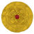 | 45004 | PORUS | PORUS COIN |
|  | 33418 | BOLTT | Boltt Coin  |
| 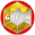 | 76589 | GFNC | GrafenoCoin |
|  | 76525 | DJV | DEJAVE |
|  | 62771 | RHT | Reward Hunters Token |
|  | 59725 | XEEB | Xeebster |
|  | 49367 | HUGO | Hugo Finance |
|  | 48321 | CPZ | CashPay |
|  | 46644 | BKKG | Biokkoin |
|  | 45375 | I9C | i9 Coin |
|  | 42946 | IFX24 | IFX24 |
|  | 36344 | BITTO | BITTO |
|  | 33396 | ENTRC | EnterCoin |
|  | 66733 | HNW | Hobbs Networking |
|  | 60399 | CTAX | Cryptotaxis Token |
|  | 56863 | SHARPEI | Shar Pei |
|  | 67079 | SPW | Spaceship War |
|  | 61353 | GALS | Galaxy Surge |
| 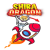 | 59291 | SHIBAD | Shiba Dragon |
|  | 56069 | BUDG | BullDogSwap |
|  | 55433 | DRAP | Doge Strap |
|  | 54651 | YUCT | Yucreat |
|  | 55189 | GNLR | Gods and Legends |
|  | 46984 | REEC | Renewable Electronic Energy Coin |
|  | 44830 | PWRB | PowerBalt |
|  | 33115 | BCV | BitCapitalVendor |
| 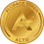 | 69619 | ALTO | Alliance Token |
|  | 58585 | TIPSY | Tipsy |
| 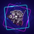 | 59343 | POWERZILLA | PowerZilla |
|  | 59363 | DVILLE | DogeVille |
|  | 48287 | ELYX | Elynet Token |
|  | 44093 | YFR | YouForia |
|  | 64429 | AMPT | Amplify |
| 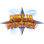 | 57301 | NFS | Ninja Fantasy Token |
| 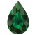 | 56267 | ADMC | Adamant Coin |
|  | 70203 | NEURALINK | Neuralink |
|  | 70395 | ALTA | Alta Finance |
|  | 59319 | PUNKS | Punk Shiba |
|  | 59017 | DOKEN | DoKEN |
|  | 58417 | FROGGIES | Froggies Token |
|  | 58597 | PULSEMOON | PulseMoon |
|  | 44846 | JREX | Jurasaur |
|  | 68525 | HBARP | HbarPad |
|  | 67353 | MATICPO | MATIC (Wormhole) |
|  | 61647 | ITAMCUBE | ITAM CUBE |
|  | 63503 | PARMA | PARMA |
| 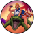 | 60135 | FMAN | Florida Man |
|  | 60597 | B2P | Block2Play |
|  | 59745 | BLH | Blue Horizon |
|  | 63671 | ELONJET | ElonJet |
|  | 64165 | REFLEX | Reflex Finance |
|  | 59733 | MAGF | Magic Forest |
|  | 59797 | BABYWKD | Babywakandainu |
|  | 49971 | SUPDOG | SUPERDOGE |
|  | 76421 | DMME | DMme |
|  | 66949 | RKN | RAKON |
|  | 63969 | GLOWV2 | GlowV2 |
|  | 59185 | OCA$H | Omni Cash |
|  | 44452 | ZCNOX | ZCNOX Coin |
|  | 45014 | ZBK | Zbank Token |
|  | 44930 | OGC | OneGram Coin |
|  | 42681 | WYX | Woyager |
|  | 42120 | UZZ | UZURAS |
|  | 34584 | MIAMI | MIAMI |
|  | 425 | EVR | Everus |
|  | 262 | TIX | Blocktix |
|  | 69109 | DOGEZILLA | DogeZilla |
| 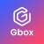 | 68297 | GBOX | GBOX |
|  | 65961 | VERSUS | Versus Farm |
| 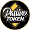 | 59599 | PASSIVE | Passive Token |
|  | 59321 | MINISPORTZ | MiniSportZilla |
|  | 47022 | RZN | Rizen Coin |
|  | 45612 | MKCY | Markaccy |
|  | 36596 | ZUC | ZeuxCoin |
|  | 69631 | MZT | Meta Z |
|  | 61837 | JF | Jswap.Finance |
|  | 60019 | DFSG | DFSocial Gaming |
|  | 59009 | MAZE | NFT MAZE |
|  | 59013 | METAR | MetaRaca |
|  | 50819 | TENDIE | TendieSwap |
|  | 45400 | ITEN | ITEN |
|  | 69073 | NERDY | Nerdy Inu |
|  | 59285 | KIRADOGE | Kiradoge coin |
|  | 34593 | JIC | JoorsChain |
| 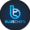 | 34644 | BCHIP | BLUECHIPS Token |
|  | 33088 | OWN | OWNDATA |
|  | 32808 | RTE | Rate3 |
|  | 70963 | CUBIC | Cubics |
|  | 67449 | UNITY | Unity Protocol |
|  | 66853 | COD | Crystal Of Dragon |
|  | 61079 | AGAIN | Again Project |
|  | 59169 | MILLION | Millionaire Maker |
|  | 48037 | EXG | Exgold |
|  | 46364 | DDRST | DigiDinar StableToken |
|  | 44577 | IUT | ITO Utility Token |
|  | 33745 | ITL | Italian Lira |
|  | 33384 | BCASH | BankCoin BCash |
|  | 32936 | NCC | NeuroChain |
|  | 33038 | KIND | Kind Ads Token |
|  | 32905 | ZPR | ZPER |
|  | 32973 | TGAME | Truegame |
|  | 33554 | RC20 | RoboCalls |
|  | 32505 | SXUT | Spectre.ai Utility Token |
|  | 32405 | SXDT | Spectre.ai Dividend Token |
|  | 32643 | DML | Decentralized Machine Learning |
|  | 3769 | DAY | Chronologic |
|  | 71125 | NECO | Neco Fun |
|  | 70479 | HYPERR | HyperRun |
|  | 77271 | CHURCH | Church Dao |
|  | 69417 | MAOE | Meta Age of Empires |
|  | 69641 | MEFI | Metabusiness |
|  | 66579 | QUB | Qubism |
|  | 62893 | BRIBE | BRIBE |
|  | 61311 | IB | Iron Bank |
|  | 60209 | BOOB | BooBank |
|  | 58107 | GYM | GYM Token |
|  | 57181 | MEWTWO | Mewtwo Inu |
|  | 56859 | BLZZ | Blizz Finance |
|  | 57595 | BATMAN | Batman |
|  | 54617 | ALIX | AlinX |
|  | 55109 | RIP | Fantom Doge |
|  | 51229 | STARDUST | Stargazer Protocol |
|  | 52149 | CAVA | Cavapoo |
|  | 51139 | ZABAKU | Zabaku Inu |
|  | 51909 | HTMOON | HTMoon |
|  | 54383 | MICROSHIB | MicroSHIBA |
|  | 49953 | SBGO | Bingo Share |
|  | 49525 | 100X | 100xCoin |
|  | 46691 | FIL6 | FIL6 |
|  | 45639 | PFID | Pofid Dao |
|  | 46278 | TKNT | TKN Token |
|  | 44541 | PAMP | Pamp Network |
|  | 45168 | MYX | MYX Network |
|  | 44568 | TTM | To The Moon |
|  | 44103 | PGO | PengolinCoin |
|  | 44401 | DMCH | DARMA Cash |
|  | 44123 | AOS | AOS |
|  | 43185 | ANJ | ANJ |
|  | 42642 | BHG | Bit Global Payment Ecology |
|  | 42444 | MSN | MSN |
|  | 41815 | BKF | BKEX Finance |
|  | 58433 | BULLD | Bulldoge Inu |
|  | 58557 | BABYMETA | Baby Meta |
|  | 49199 | CROSS | CrossPad |
|  | 3184 | XSH | SHIELD |
|  | 71565 | KELVIN | Kelvin |
|  | 69689 | GLBD | BeglobalDAO |
|  | 69583 | BDS | Big Digital Shares |
|  | 46313 | HIZ | Hiz Finance |
|  | 45262 | ETHSC | EthereumSC |
|  | 44155 | HOMI | HOMIHELP |
|  | 61345 | WBOND | War Bond |
|  | 58817 | GBAG | Giftbag |
|  | 50917 | EXZO | ExzoCoin 2.0 |
|  | 46970 | AETH | ankrETH |
|  | 70351 | $DREAMN | DreamN |
|  | 66775 | MARSSHIB | The Mars Shiba |
|  | 70457 | RD2E | Ride To Earn |
|  | 63761 | CU | Celestial Unity |
|  | 63857 | PFI | Protocol Finance |
|  | 56105 | BANKER | BankerDoge |
|  | 53687 | MTF | Milktea.finance |
|  | 46690 | AAPL | Apple Protocol Token |
|  | 46216 | YFDOT | Yearn Finance DOT |
|  | 45908 | YFBT | Yearn Finance Bit |
|  | 45965 | YFIX | YFIX.finance |
|  | 45033 | DMST | DMST |
|  | 42606 | UVU | CCUniverse |
|  | 33476 | IONC | IONChain |
|  | 33236 | HQT | HyperQuant Token |
|  | 68265 | WEAVE | Weave |
|  | 67063 | PRNTR | PRNTR |
|  | 65557 | SFSHLD | Safe Shield |
|  | 58471 | SSR | Star Ship Royal |
|  | 50129 | BN | Bitnorm |
|  | 45595 | YFILD | YFILEND.FINANCE |
|  | 42990 | ORBYT | ORBYT Token |
|  | 42245 | TYC | TycheCoin |
|  | 42089 | BIXCPRO | BIXCPRO |
|  | 33817 | VGW | VegaWallet Token |
|  | 33606 | JWL | Jewel |
|  | 3070 | PIPL | PiplCoin |
|  | 70147 | DFN | Difo Network |
|  | 68511 | WHB | Wealthy Habits |
|  | 69033 | $BASED | Based Money |
|  | 67161 | YFIC | Yearn Cash |
|  | 67293 | MCS | MCS Token |
|  | 67099 | BCS | Basis Coin Share |
|  | 67333 | CRL | Crypto Rocket Launch |
|  | 65663 | SWYFTT | SWYFT |
|  | 63487 | ROGAN | Rogan |
|  | 63133 | POC | POC Blockchain |
|  | 64017 | VGM | Virtual Gamer |
|  | 63979 | SKYLANDS | SkyLands |
|  | 60587 | WANNA | WannaSwap |
|  | 57589 | DKC | Dukecoin |
|  | 57239 | PID | PIDAO |
|  | 56079 | TRANQ | Tranquil Finance |
|  | 53877 | JAWS | AutoShark |
| 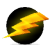 | 53839 | ENERGY | ENERGY Token |
|  | 54845 | WEYU | WEYU |
|  | 50463 | QUAM | Quam Network |
|  | 50581 | MXF | Mixty Finance |
|  | 49777 | SHO | Showcase Token |
|  | 49077 | TFF | Tutti Frutti |
|  | 48353 | VIKING | Viking Swap |
|  | 48171 | SOVI | Sovi Token |
|  | 48275 | VANCII | Vanci Finance |
|  | 47118 | SBDO | bDollar Share |
|  | 47663 | FSXU | FlashX Ultra |
|  | 47178 | CRETH2 | Cream ETH 2 |
|  | 47042 | ACSI | ACryptoSI |
|  | 46292 | PUML | PUML Better Health |
|  | 46343 | DOGDEFI | DogDeFiCoin |
|  | 45052 | TEND | Tendies |
| 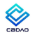 | 45058 | SBREE | CBDAO |
| 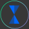 | 45073 | IAB | IAB |
|  | 44723 | IDX | Index Chain |
|  | 44557 | KVA | Kevacoin |
|  | 43096 | BSHA3 | BSHA3 |
|  | 42273 | RRB | Renrenbit |
|  | 36368 | CSOUL | CryptoSoul |
|  | 34621 | GMCI | Game City |
|  | 36442 | URAC | Uranus |
|  | 34586 | GXI | Genexi |
|  | 34619 | DCNT | Decenturion |
|  | 41202 | LUD | Ludos Protocol |
|  | 34581 | JMT | JMTIME |
|  | 36354 | RISK | Global Risk Exchange Token |
|  | 34569 | FML | FormulA |
|  | 36376 | ACTP | Archetypal Network |
|  | 33799 | LQD | Liquidity Network |
|  | 33851 | TCASH | TCASH |
|  | 33431 | BUD | BUDDY |
|  | 33534 | BLOC | Blockcloud |
| 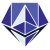 | 33889 | VJC | VENJOCOIN |
|  | 32865 | COU | Couchain |
|  | 33134 | BQT | Blockchain Quotations Index Token |
|  | 32630 | PCL | Peculium |
|  | 33087 | DACC | DACC |
|  | 33092 | INCX | InternationalCryptoX |
|  | 33225 | LFC | Linfinity |
|  | 33060 | EDN | Eden |
|  | 32598 | SS | Sharder |
|  | 11128 | GOT | GoNetwork |
|  | 32367 | ZCO | Zebi |
| 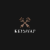 | 77329 | KEYSWAP | KeySwap |
|  | 69887 | GARTS | Glink Arts Share |
|  | 68781 | BNFT | Beast NFT |
|  | 66537 | BEEINU | Bee Inu |
|  | 63705 | BE | Belon DAO |
| 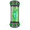 | 61723 | ECTO | Ghost Block |
|  | 58989 | HMZ | Harmonized App |
|  | 58223 | WOLFGIRL | Wolf Girl |
|  | 44964 | TCHTX | ThoreCash |
| 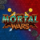 | 68787 | MWT | Mortal Wars |
|  | 64383 | YACHTX | YachtX |
|  | 63435 | LUSHI | Lucky Shinu |
|  | 59385 | MTVX | MTVX |
|  | 57087 | SLYR | RO Slayers |
|  | 71421 | WALKN | WalkN |
|  | 63779 | MEANTAMATO | Mean Tamato |
|  | 61543 | INFLUENCE | Influencer Finance |
|  | 61349 | $SENSEI | Sensei Shib |
|  | 59859 | SOCIN | Soccer Infinity |
|  | 58415 | CERT | CertRise |
|  | 58635 | MAKK | Makk |
|  | 59273 | DXSANTA | Doxxed Santa |
|  | 57939 | BINOM | Binom Protocol |
|  | 70671 | ALGX | Algodex |
|  | 66741 | CRUDE | Crude Token |
|  | 59217 | VODKA | Vodka Token |
|  | 57877 | ADINU | Adventure Inu |
|  | 55973 | TOO | TOO Token |
|  | 55511 | UFF | United Farmers Finance |
|  | 47192 | SECO | Serum Ecosystem Token |
|  | 67377 | GUT | GuitarSwap |
|  | 65261 | DEFI+L | PieDAO DEFI Large Cap |
| 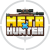 | 64255 | XHUNTER | MetaXHunter |
| 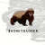 | 60229 | HONEYBADGER | Honey Badger |
| 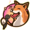 | 51223 | NEWINU | Newinu |
| 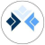 | 45359 | SEMI | Semitoken |
|  | 44076 | IBVOL | 1x Short BTC Implied Volatility Token |
|  | 70567 | M1VERSE | MetaOneVerse |
|  | 65767 | BABYCHEDDA | Baby Chedda |
|  | 63461 | THIS | THIS |
|  | 60179 | MPD | Metapad |
|  | 57901 | GAMEBOX | Gamebox |
|  | 69075 | DK | Dragon Knight |
|  | 65877 | TLT | Trip Leverage Token |
|  | 65589 | SYBC | SYBC Coin |
|  | 63145 | MVG | Mad Viking Games |
|  | 33664 | NPLC | Plus-Coin |
|  | 32954 | DIT | Digital Insurance Token |
|  | 32720 | FXT | FuzeX |
|  | 70155 | UNC | Utility NFT Coin |
|  | 69345 | SHEEBA | SHEEBA |
|  | 66397 | KROOT | K-Root Wallet |
|  | 69367 | CABIN | Cabin |
|  | 61245 | METAWORLD | Meta World |
|  | 58619 | VALK | Valkyrio Token |
| 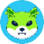 | 58163 | ASHIB | Alien Shiba Inu |
|  | 44999 | SI14 | Si14 |
|  | 70565 | QUROZ | Qfora |
| 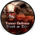 | 61621 | TITANS | Tower Defense Titans |
|  | 61253 | KAZAMA | Kazama Senshi |
|  | 60319 | CMC | CryptoMotorcycle |
|  | 59633 | NFTNDR | NFTinder |
|  | 56899 | INFP | InfinityPad |
|  | 50629 | FOGE | Fat Doge |
|  | 48421 | YTS | YetiSwap |
|  | 64275 | MRLM | MetaRealm |
|  | 64149 | LEVEN | Leven Token |
|  | 58305 | X99 | x99Token |
|  | 53461 | DFIP | DeFi Insurance Protocol |
|  | 46678 | ROCKS | Social Rocket |
|  | 53583 | ALH | AlloHash |
|  | 45248 | ELYA | Elya |
|  | 68929 | LIST | KList Protocol |
|  | 67631 | UCG | Universe Crystal Gene |
|  | 66417 | MNDL | Mandala |
|  | 1369 | CHC | ChainCoin |
|  | 71347 | INES | Inescoin |
|  | 69569 | LUCKYDOGE | LuckyDoge |
|  | 66765 | DINOP | DinoPark |
|  | 71423 | SCOR | SCORCHER |
|  | 65597 | NBX | Netbox Coin |
|  | 65997 | MMDA | Pokerain |
|  | 50353 | MNSTP | Moon Stop |
|  | 49695 | HYD | Hydraledger |
|  | 47935 | KP3RB | Keep3r BSC Network |
|  | 44067 | MDU | MDUKEY |
|  | 43175 | LRG | Largo Coin |
|  | 43059 | XPT | Cryptobuyer Token |
|  | 42442 | PTA | Petrachor |
|  | 33533 | VOLLAR | V-Dimension |
|  | 33553 | QCX | QuickX Protocol |
|  | 33367 | EMRALS | Emrals |
|  | 32423 | ACAT | Alphacat |
|  | 32326 | SPHTX | SophiaTX |
|  | 32516 | CHX | Chainium |
|  | 32324 | ETZ | Ether Zero |
|  | 69667 | SHIBBOO | Shibboo Inu |
|  | 68445 | BIDEN | BIDEN Token |
|  | 67901 | MYK | MyKingdom |
|  | 61141 | LUMOSX | Lumos Metaverse |
|  | 56933 | CASHIO | Cashio Token |
|  | 51583 | LEOS | Leonicorn Swap |
|  | 77279 | TYCOON | Tycoon Zone |
|  | 67483 | PQT | Prediqt |
|  | 64313 | V$ | Valor |
|  | 63743 | TBT | TheBoringToken |
|  | 57515 | LVLUP | LevelUp Gaming |
|  | 54235 | DEXF | Dexfolio |
|  | 47713 | RYIP | RYI Platinum |
|  | 44935 | TCJ | Coinshare |
|  | 77297 | NOTHING | Probably Nothing |
|  | 69915 | AUV | VIIIDA Gold |
|  | 67623 | ARTRINO | Art Rino |
|  | 64175 | CTNT | Cryptonite Token |
|  | 42278 | HUSD | HUSD |
| 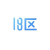 | 41827 | 18C | Block 18 |
|  | 34576 | PORTAL | Portal |
|  | 32797 | EGCC | Engine |
|  | 32618 | VIPS | Vipstar Coin |
|  | 32622 | IDT | InvestDigital |
|  | 33067 | SHE | ShineChain |
|  | 33308 | 404 | 404 |
|  | 32368 | ITC | IoT Chain |
|  | 32586 | MEET | CoinMeet |
|  | 70573 | MT3 | Meta3 |
| 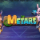 | 69599 | MTSC | Metars |
|  | 70361 | NFCR | NFCore |
|  | 66603 | AQR | Aqar Chain |
|  | 65385 | RVRS | Reverse |
|  | 49637 | GLASS | OurGlass |
|  | 49133 | FRAT | Frat |
|  | 44434 | NDN | NDN Link |
|  | 44451 | MCX | Machi X |
|  | 34572 | KREX | Kronn |
|  | 71435 | QTA | QUOTA |
| 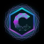 | 64189 | CTCO | Connector Coin |
| 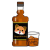 | 60941 | DOGEWHISKY | Dogewhisky |
|  | 45086 | TW | TW Token |
| 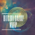 | 45377 | BTCGW | Bitcoin Galaxy Warp |
|  | 44538 | BLNC | Birdlance Coin |
|  | 43030 | NCOV | Coronacoin |
|  | 41888 | TRM | Tranium |
|  | 41556 | C4C | Coin4Cast |
|  | 34736 | FTH | Fitcash |
|  | 33363 | HLIX | Helix |
|  | 298 | DP | Digital Price |
|  | 76615 | HANZO | Hanzo |
|  | 70997 | MOCEANS | Oceans Miner |
|  | 68609 | DGZV | DogZVerse Token |
|  | 67351 | PEACE | WohpeDao |
|  | 66547 | WXDAI | Wrapped XDAI |
|  | 58779 | PGIRL | Panda Girl |
|  | 58795 | SHIBORG | SHIBORG INU |
| 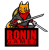 | 56055 | RONINGMZ | Ronin Gamez |
|  | 54539 | $TIME | Madagascar |
|  | 49465 | PATH | PathFund |
|  | 44958 | VELT | VELIC |
|  | 44431 | VAIP | VEHICLE DATA ARTIFICIAL INTELLIGENCE PLATFORM |
|  | 42286 | BNV | BeNative |
|  | 55419 | COOL20 | Cool Cats |
|  | 71265 | APO | ApolloFi |
|  | 71483 | F1T | MetaF1 |
|  | 61689 | DAGO | Dawn Of Gods |
|  | 51493 | TUSK | Tusk Token |
|  | 45559 | LNOT | Livenodes Token |
|  | 41795 | TUDA | Tutor's Diary |
|  | 36404 | LNO | LiveNodes |
|  | 32869 | PROUD | PROUD Money |
|  | 2201 | CRYPT | CryptCoin |
|  | 54897 | BURNDOGE | BurnDoge |
|  | 65999 | PHY | Physis |
|  | 64261 | CYNC | Cyn-C |
|  | 59333 | SUTEKU | Suteku |
| 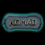 | 70975 | NOMAD | NOMADLAND |
| 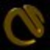 | 68741 | $METAZ | MetaLandz |
|  | 68411 | YETIC | YetiCoin |
|  | 66613 | TAF | TAF Token |
|  | 62961 | CORD | CORD.Finance |
| 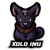 | 59893 | XL | Xolo Inu |
|  | 48225 | UCOIN | Universal Coin |
|  | 56101 | BULLAF | Bullish AF |
| 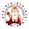 | 63007 | RDOGE | Royal Doge |
|  | 60581 | MAPES | Meta Apes |
|  | 56607 | CACTI | Cacti Club |
|  | 49913 | USDSP | USD Sports |
|  | 42008 | TLR | Taler |
|  | 33183 | CSTL | Castle |
|  | 65431 | PLUT | Plutos Network |
|  | 66407 | BXTB | BXTB Foundation |
|  | 56785 | INSTA | Instaraise |
|  | 66395 | SPMETA | SpaceMeta |
|  | 63877 | NATURE | The Nature Token |
|  | 56443 | SPU | SpacePort Universe |
|  | 32860 | REPO | REPO |
|  | 1320 | MEC | MegaCoin |
|  | 57439 | MPRO | Manager PRO |
|  | 56195 | JED | JEDSTAR |
|  | 69959 | GEMZ | BattleMechs |
|  | 61419 | EXIP | EXIP |
|  | 57455 | WHEEL | Wheelers |
|  | 57929 | FOREVERPUMP | Forever Pump |
|  | 56165 | FTE | Fishy Tank Token |
|  | 70705 | METAGIN | MetaGin |
|  | 69711 | GRUSH | Gold Rush |
|  | 68535 | MDC | Mars DogeCoin |
|  | 63907 | METRA | Metra |
|  | 61181 | BMIC | Bitmic |
|  | 56775 | GUMMIE | Gummy Beans |
|  | 57371 | BMND | Baby Mind |
|  | 64139 | FANV | FanVerse |
|  | 55939 | ADAT | Adadex Tools |
|  | 62105 | SAFEW | SafeWages |
|  | 58967 | WOTG | War of Tribes |
|  | 56685 | KITE | Kite Sync |
|  | 70165 | 5STAR | 5Star |
| 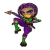 | 61559 | KATSUMI | Katsumi |
|  | 55571 | OZG | Ozagold |
|  | 46326 | YFPRO | YFPRO Finance |
|  | 44835 | ERS | Eros |
|  | 25 | ERC | EuropeCoin |
|  | 66209 | ALKOM | Alpha Kombat |
|  | 63821 | DXW | Dexscrow |
|  | 57499 | HLINK | HydroLink |
|  | 71593 | BLR | Blur Finance |
|  | 69059 | SHINJIZ | Shinji the Zombie Slayer |
|  | 68267 | DCD | DCD Ecosystem |
|  | 61905 | SIW | Stay In Destiny World |
| 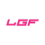 | 59945 | LGF | Let's Go Farming |
|  | 56709 | URG-U | URG University |
|  | 54621 | POLP | PolkaParty |
|  | 50849 | WEXPOLY | WaultSwap Polygon |
|  | 70335 | MYV | Money Versum |
|  | 70383 | BLOCKIFY | Blockify.Games |
|  | 56089 | OTAKU | FOMO Chronicles Manga |
|  | 33917 | XCON | Connect Coin |
|  | 32419 | SHIP | ShipChain |
|  | 3689 | SUR | Suretly |
|  | 2995 | PBT | Primalbase Token |
|  | 3060 | OPT | Opus |
| 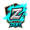 | 67717 | ZERI | CryptoZerofi |
|  | 58949 | SMAC | Smartchem |
|  | 56283 | DOX | Doxxed |
|  | 55953 | IBFR | iBuffer Token |
|  | 52159 | BBND | BeatBind |
|  | 48145 | MPTC | MNPoSTree |
|  | 33866 | BZE | BZEdge |
|  | 34529 | VDL | Vidulum |
|  | 36389 | TSF | Teslafunds |
|  | 33597 | BCEO | bitCEO |
|  | 71211 | BDECO | BdcashProtocol Ecosystem |
|  | 70879 | LIBERA | Libera Financial |
|  | 60743 | SHIBAFI | Shiba Finance |
| 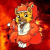 | 59371 | KAIZILLA | Kaizilla |
|  | 58581 | BEMT | BEM |
|  | 53587 | YNI | YEARNYFI NETWORK |
|  | 46337 | YEA | YeaFinance |
|  | 45998 | CYTR | Cyclops Treasure |
|  | 46257 | YFN | Yearn Finance Network |
|  | 46658 | YFIV | Yearn Finance Value |
|  | 46348 | YFOS | YFOS.finance |
|  | 44901 | AFCASH | AFRICUNIA BANK |
|  | 44961 | ZORO | ZoroChain |
|  | 33562 | FXC | Flexacoin |
|  | 33475 | PLTC | PlatonCoin |
|  | 33498 | NZL | Zealium |
|  | 2222 | MNE | Minereum |
|  | 68843 | KNOX | FortKnox |
| 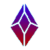 | 57155 | FSDCOIN | FSD Coin |
|  | 71597 | KNGS | Pixel Kings |
|  | 61799 | HDD | HDDcoin |
|  | 57879 | ZENX | Zenith Token |
|  | 57765 | PLUGCN | Plug Chain |
|  | 56551 | ROCKSTAR | Rockstar Doge |
|  | 51083 | VBSC | Votechain |
|  | 54681 | KANA | Kanaloa Network |
|  | 44203 | SUM | Sumcoin |
| 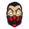 | 57253 | LCDP | La Casa De Papel |
|  | 71249 | ETHICA | Ethica |
|  | 58797 | TACOE | TacoEnergy |
|  | 57275 | HLTH | HLTH Token |
|  | 56701 | VERO | Vero Farm |
|  | 71093 | QAA | Qommodity |
|  | 69573 | SHAH | MetaChess |
|  | 33101 | TOS | ThingsOperatingSystem |
|  | 33077 | UC | YouLive Coin |
|  | 33076 | BUT | BitUP Token |
|  | 32409 | AIDOC | AI Doctor |
|  | 70795 | SOCAP | Social Capitalism |
|  | 63763 | LEON | Leon Token |
|  | 68395 | SAJA | Saja |
|  | 65615 | MYFARMPET | My Farm Pet |
| 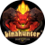 | 67303 | BHUNT | BinaHunter |
| 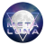 | 64225 | METALUNA | MetaLuna |
|  | 61801 | CONQ | Conqueror |
|  | 50435 | PTD | Pilot |
|  | 44148 | CHND | Cashhand |
|  | 63881 | FTSY | Fantasy |
|  | 57353 | ABCO | AutoBitco Token |
|  | 49809 | BSPAY | Brosispay |
|  | 56579 | BABYFB | Baby Floki Billionaire |
| 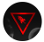 | 55757 | AFFINITY | SafeAffinity |
|  | 44815 | BCHC | BitCherry |
|  | 64203 | COFT | Coin on File Token |
| 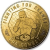 | 63823 | KOACOMBAT | KoaKombat |
| 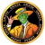 | 60979 | DMASK | The Mask |
|  | 55541 | WDUCX | Wrapped DucatusX |
|  | 50069 | HLO | Helio |
|  | 44736 | HYBN | Hey Bitcoin |
|  | 44718 | ECOS | EcoDollar |
|  | 42252 | AEM | Atheneum |
|  | 34500 | HWI | Hawaii |
|  | 71053 | NXG | Nexa |
|  | 70713 | MOVX | MoveX |
|  | 68901 | MWAR | Moon Warriors |
|  | 61593 | 8FI | Infinity Finance |
|  | 56939 | UPLINK | UpLink |
|  | 57977 | ARMD | Armada |
|  | 56209 | FOREVERFOMO | ForeverFOMO |
|  | 56713 | ECOT | Echo Tech Coin |
|  | 67715 | CSF | Coinsale |
|  | 69039 | KYDC | Know Your Developer |
|  | 59311 | FWG | Fantasy World Gold |
|  | 44869 | RICK | Infinite Ricks |
|  | 33887 | BCZ | Bitcoin CZ |
|  | 33374 | ZLN | ZillionCoin |
|  | 32991 | CMM | Commercium |
|  | 547 | ZNY | BitZeny |
|  | 68339 | UBG | UBG Token |
|  | 59627 | NFTOPIA | NFTOPIA |
|  | 60995 | WIZZY | Wizardium |
|  | 60109 | BTE | BTEcoin |
|  | 32894 | BWX | Blue Whale Token |
|  | 70571 | DIIC | Dii Coin |
|  | 61901 | VPX | VPEX Exchange |
|  | 62031 | TYCHE | TycheLoto |
|  | 58681 | CAF | CarsAutoFinance |
|  | 58101 | BAKEDCAKE | BakedCake Finance |
|  | 47797 | VRAP | VeraSwap |
|  | 33139 | UBC | Ubcoin Market |
|  | 32621 | MRK | MARK.SPACE |
|  | 32862 | BWT | Bittwatt |
|  | 32545 | VZT | Vezt |
|  | 32491 | LALA | LALA World |
|  | 32520 | FDX | FidentiaX |
|  | 32510 | GAT | Gatcoin |
|  | 32490 | XNK | Ink Protocol |
|  | 32662 | TRAK | TrakInvest |
|  | 3993 | DAT | Datum |
|  | 3328 | ITT | Intelligent Trading Foundation |
|  | 2979 | COSS | COSS |
|  | 32121 | WISH | MyWish |
|  | 71055 | CAIRO | Cairo Finance |
|  | 60293 | N2 | Node Squared |
|  | 59407 | SRIRACHA | Sriracha Inu |
|  | 55107 | DAOVC | DAO.vc |
| 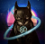 | 71415 | S-CATS | SUPERCATS |
|  | 69813 | DOGECAT | DOGE-CAT |
| 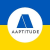 | 69609 | AAPT | AAptitude |
|  | 70289 | BAXIS | BNB Axis |
|  | 68597 | EVOX | Evolution Network |
|  | 68711 | METAALLBI | Metaverse ALL BEST ICO |
|  | 67931 | BITMETA | Bitcoin Metaverse |
|  | 67355 | WEB3ALLBI | Web3 ALL BEST ICO |
|  | 66551 | NFTALLBI | NFT All Best ICO |
|  | 67427 | BNBALLBI | BNB CHAIN ALL BEST ICO |
|  | 61849 | XZAR | South African Tether |
|  | 60935 | BULLDOG | BullDog Coin |
| 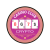 | 55517 | 867 | 867 |
|  | 55079 | ELV | E-leven |
|  | 53717 | G9TRO | g9tro Crowdfunding Platform |
| 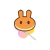 | 53925 | CAKF | PancakeFork Finance |
|  | 51049 | NDSK | Nadeshiko |
|  | 47915 | DEVA | DEVA Token |
|  | 46806 | BST1 | Blueshare Token |
|  | 46788 | FCD | Future-Cash Digital |
|  | 46010 | JVZ | Jiviz |
|  | 46370 | YFIA | YFIA |
|  | 46335 | YYFI | YYFI.Protocol |
|  | 44698 | NOKN | Nokencoin |
|  | 33859 | PAXEX | PAXEX |
|  | 33612 | WXC | WXCOINS |
|  | 69597 | J9BC | J9CASINO |
|  | 70759 | OXP | onXRP |
|  | 69139 | VEKTOR | VEKTOR |
|  | 64219 | CNDL | Candle |
|  | 57415 | BEXT | ByteDex |
|  | 55097 | MASKDOGE | MaskDoge |
|  | 51137 | KBN | Koban |
|  | 48167 | ISAL | Isalcoin |
|  | 43090 | GLOB | Global Reserve System |
|  | 34540 | IMGC | ImageCash |
|  | 11080 | BTDX | Bitcloud |
|  | 3206 | ETG | Ethereum Gold |
|  | 64283 | DOGEX | Doge X |
|  | 59751 | ABU | Abura Farm |
|  | 44913 | RPT | RealPropertyToken |
|  | 45392 | OBIC | OBIC |
|  | 36383 | GPA | Gplay |
|  | 33578 | WCO | Winco |
|  | 60185 | AVAXUP | AvaxUp |
|  | 56589 | L99 | Lucky Unicorn Token |
|  | 71581 | KTI | Kermit Inu |
|  | 68851 | RWD | Rewards |
|  | 71091 | BDTX | Block Duelers |
|  | 71337 | MEGG | Metaegg DeFi |
| 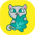 | 67237 | NIP | CatNIP |
|  | 55689 | EZX | EZDex |
|  | 69101 | RSHIB | ROBOT SHIB |
|  | 65121 | CNFT | Communifty |
|  | 63449 | FUFI | FutureFi |
|  | 44720 | NBTC | NEOBITCOIN |
|  | 71583 | KAOYA | KAOYA |
| 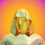 | 67411 | DIVINE | Divine DAO |
|  | 66057 | WSOW | RxSeed Coin |
|  | 63533 | FMB | Farmbit |
| 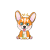 | 64251 | PEACEDOGE | Peace Doge |
|  | 56321 | PLENTY | Plenty DeFi |
|  | 55443 | DAH | Dirham |
|  | 45333 | MAZ | Mazzuma |
| 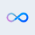 | 70607 | METAXA | Metaxa |
|  | 69737 | OCEANS | Oceans Finance |
| 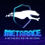 | 67039 | DOG$ | MetaDog Racing |
| 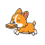 | 64065 | DOLLARDOGE | DollarDoge |
|  | 57261 | MOMMYUSDT | MommyUSDT |
|  | 53631 | SATVGV2 | SaturnV Gold v2 |
|  | 45025 | DCON | DCON |
|  | 41917 | DRCT | DRC Token |
|  | 42323 | IMOS | Intelligent Manufacturing Chain |
|  | 41703 | SMEX | SeamonX |
|  | 36510 | MATO | Matocol Protocol |
|  | 34598 | GOOC | GooCoin |
|  | 36509 | SPG | Super Gold |
|  | 36550 | FRECNX | Freldo |
|  | 34563 | HKDT | HKD Tether |
|  | 33730 | BCAC | Business Credit Alliance Chain |
|  | 33468 | IFOOD | Ifoods Chain |
|  | 33847 | BQQQ | Bitsdaq |
|  | 33306 | 1X2 | 1X2 Coin |
|  | 32927 | CZR | CanonChain |
|  | 32965 | TAC | Traceability Chain |
|  | 33126 | NEWOS | NewsToken |
|  | 33199 | TKT | Twinkle |
|  | 32882 | LKY | Linkey |
|  | 3814 | WIC | Wi Coin |
|  | 69783 | JAMON | JamonSwap |
|  | 56279 | BRTK | BattleRoyaleToken |
|  | 50311 | AZX | AzeusX |
|  | 41678 | ANTR | Antra |
|  | 41970 | SDGO | SanDeGo |
|  | 34659 | VARIUS | VARIUS |
|  | 33487 | WAGE | Digiwage |
|  | 3787 | ECC | ECC |
|  | 67191 | WLF | Warriors Land Fuel |
|  | 55421 | BSFM | BabySafeMoon |
|  | 46699 | VOLTS | Volts.Finance |
|  | 71007 | ALORA | Alora |
|  | 70011 | PHIFIV2 | PhiFi Finance |
|  | 61473 | ONEFOX | Stable FOX |
|  | 59645 | FEEDTK | Feed System |
|  | 58971 | DDT | Dar Dex Token |
|  | 50037 | VNL | Vanilla |
|  | 45099 | MRV | MRV |
|  | 42839 | BYRON | Byron |
|  | 36419 | CVCC | CryptoVerificationCoin |
|  | 33325 | AFRO | Afro |
|  | 33505 | XTA | Italo |
|  | 70639 | MLAND | Mland |
|  | 36561 | ERK | Eureka Coin |
| 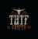 | 63475 | THTF | THTF |
|  | 69015 | CRWD | CrowdHero |
|  | 69889 | VZN | Vincenzo Network |
|  | 60405 | CRAB | Darwinia Crab Network Native Token |
|  | 67095 | FUPS | Feed Pups |
|  | 65325 | DIOS | Dios Finance |
|  | 49359 | DEFY | DefyDefi |
|  | 44827 | LBET | Lemon Bet |
|  | 71511 | $PALS | FlokiMarvin |
|  | 69395 | KLEAR | Klear Finance |
|  | 69113 | FROSTEDCAKE | Frosted Cake |
|  | 67281 | RKTN | RocketToken |
|  | 65255 | CAC | Cryptoids Admin Coin |
|  | 59251 | EGOH | EGOH Finance |
|  | 67407 | BIMP | Bimp Finance |
|  | 66429 | MJR | Major Protocol |
|  | 65561 | BSCWIN | BSCWIN Bulls |
|  | 64807 | BEAN | Bean |
|  | 71059 | FSHR | Fishera |
|  | 69805 | LIFEBIRD | LIFEBIRD |
|  | 59317 | XIRCUS | Xircus |
|  | 44896 | TKM | TOKEMON |
|  | 63647 | FEEL | FeelCoin |
|  | 55907 | PKEX | PolkaEx |
|  | 65841 | NUTSG | NUTS Gaming |
|  | 36536 | HRD | Hoard |
|  | 70299 | MGM | MetaGemMolon |
|  | 66865 | LATTE | LatteSwap |
|  | 49721 | CARBO | CarbonDEFI |
|  | 67529 | PPUNKS | Pumpkin Punks |
|  | 61099 | CJP | Crypto Jackpot |
| 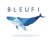 | 61413 | BLEU | BleuFi |
|  | 58697 | REU | REUCOIN |
|  | 54925 | GLYPH | GLYPH Vault (NFTX) |
|  | 64053 | $NODAC | Node Aggregator Capital |
|  | 63401 | XPAD | xPAD |
|  | 33618 | DKPC | DarkPayCoin |
|  | 33117 | ICR | InterCrone |
|  | 33043 | CROAT | CROAT |
|  | 63971 | ARCADE | ArcadeToken |
|  | 63999 | BMM | Big Mouth Monster |
|  | 63573 | SITX | Sport Investing |
|  | 69333 | BAETH | BabyAETH |
| 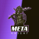 | 60963 | METAKNIGHT | Meta Knight |
| 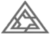 | 45019 | FFF | Force For Fast |
|  | 33069 | USE | Usechain Token |
|  | 32585 | DRG | Dragon Coins |
|  | 65103 | WASP | WanSwap |
|  | 51975 | WHXC | WhiteX Community |
|  | 46789 | LOV | The LoveChain |
|  | 65977 | $NINJADOGE | Ninja Doge |
|  | 63919 | KRIGGER | Krigger |
| 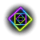 | 50637 | RCUBE | Retro DEFI |
|  | 69899 | MUDRA | Mudra |
|  | 69331 | $HONEY | Honey (Fancy Bears Metaverse) |
|  | 52285 | MAMADOGE | MamaDoge |
|  | 70207 | $DCAP | DCAP |
|  | 61243 | GOMAX | GOMAx |
|  | 55991 | CER | Cerealia |
|  | 45290 | ATTN | ATTN |
|  | 2074 | XLR | Solaris |
| 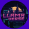 | 69409 | SPIT | Llamaverse |
|  | 60763 | ZATCOIN | ZatCoin |
|  | 65249 | PLE | Plethori |
|  | 45642 | YI12 | Yield Stake Finance |
|  | 36578 | LOL | EMOGI Network |
|  | 33397 | TENA | TENA |
|  | 70579 | 4MOVE | 4MOVE |
|  | 69499 | PIXELSQUID | PixelSQUID |
| 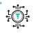 | 69159 | TVG | TVGCOIN |
|  | 67599 | METAWAR | Metawar |
|  | 63269 | MEMEDOGE | Meme Doge Coin |
|  | 55583 | PRZ | Prize Coin |
|  | 68883 | ANCT | Anchor |
|  | 67151 | TRGI | The Real Golden Inu |
|  | 66663 | ILK | INLOCK |
|  | 49935 | ATMN | Antimony |
|  | 67861 | SGOX | Sportemon-Go X |
|  | 62067 | HEADZ | Cryptoheadz |
|  | 60671 | PQD | Phu Quoc Dog |
|  | 60419 | POLYPUG | PolyPug |
|  | 61785 | HEAD | Head Football |
|  | 58825 | RUTC | Rumito |
|  | 57225 | ONEPIECE | ONE PIECE |
|  | 49391 | BNFY | B Non-Fungible Yearn |
|  | 63521 | DOGETAMA | Dogetama |
|  | 61699 | MINITIGER | Mini Tiger |
|  | 54615 | NIFTY | NiftyNFT |
| 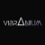 | 67701 | VBN | Vibranium |
|  | 57777 | MFLOKIADA | MiniFlokiADA |
|  | 54413 | BABYDB | BABY DOGE BILLIONAIRE |
|  | 69467 | MERCURY | Mercury Tools |
| 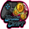 | 69359 | GAMECRYPT | GameCrypt |
|  | 67683 | O1T | Only 1 Token |
| 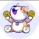 | 66277 | ETHBACK | EtherBack |
|  | 34538 | SWIPP | Swipp |
|  | 68257 | DRUNK | DrunkDoge |
|  | 62003 | IAMVAX | I Am Vaccinated |
|  | 51055 | TTR | Tetherino |
|  | 47176 | YEFI | Yearn Ethereum Finance |
|  | 69501 | IOM | Influencers of the Metaverse |
|  | 65755 | SODV2 | Son of Doge V2 |
|  | 66131 | PBK | Profit Bank |
|  | 66681 | NANODOGE | Nano Doge Token |
|  | 63033 | EUT | Eutaria |
|  | 63757 | LTR | LogiTron |
| 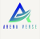 | 61725 | AVERSE | Arenaverse |
|  | 58865 | $FLOGE | Flokidoge |
|  | 62087 | MGXY | Metagalaxy |
|  | 54211 | RSUN | RisingSun |
|  | 70547 | FLVR | Flavors BSC |
|  | 61817 | SHIBAX | Shiba X |
|  | 48057 | ZCOR | Zrocor |
| 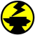 | 45962 | LTFG | Lightforge |
|  | 34629 | DSC | Dreamscape |
|  | 33417 | SPRKL | Sparkle |
|  | 33016 | BTCN | BitcoiNote |
|  | 32945 | DOW | DOWCOIN |
| 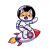 | 56659 | UDOG | United Doge Finance |
|  | 55841 | PRESIDENTDOGE | President Doge |
|  | 54023 | OLYMPUS | OLYMPUS |
|  | 46310 | TLB | The Luxury Coin |
|  | 42243 | SCRIBE | Scribe |
|  | 34650 | XNB | Xeonbit |
|  | 63675 | $CUFFIES | Cuffies |
|  | 58915 | SPOOKYSHIBA | SpookyShiba |
|  | 54239 | ARTEX | Artex |
|  | 49437 | TESLF | Teslafan |
|  | 44856 | SHENG | SHENG |
|  | 68923 | $TREAM | World Stream Finance |
|  | 60589 | LASSO | LassoCoin |
|  | 60323 | CAKEBAKER | CakeBaker |
|  | 59689 | PXBSC | Paradox NFT |
| 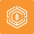 | 55397 | BITBUCKS | BitBucks |
|  | 63663 | MSK | Mishka |
| 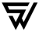 | 50377 | SMARTWORTH | Smartworth |
|  | 61687 | GSK | SNAKE |
|  | 57293 | KALAM | Kalamint |
|  | 64819 | ANN | Annex Finance |
|  | 60867 | OREN | OREN Game |
|  | 61073 | GSG | Gamesta |
|  | 69553 | ZONO | Zonoswap |
|  | 54107 | CUMSTAR | CumStar |
|  | 46308 | NVA | Neeva Defi |
|  | 33332 | AIAS | AIAScoin |
|  | 33672 | IMPL | Impleum |
|  | 33137 | SNO | SaveNode |
|  | 57119 | PANFT | PicArtNFT |
|  | 69683 | SOLUST | solUST |
|  | 68499 | ARYA | Arya Finance |
|  | 67997 | $TRESOR | Tresor Finance |
|  | 59481 | NAUSICAA | Nausicaa-Inu |
|  | 55713 | INVESTEL | Investel |
|  | 49969 | PER | PER Project |
|  | 49885 | HCS | Help Coins |
|  | 33840 | WGP | W Green Pay |
|  | 3749 | BOS | BOScoin |
|  | 56387 | DNF | DNFT Protocol |
|  | 69645 | $ORES | Space Game ORES |
| 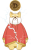 | 59033 | DADDYDB | Daddy Dogeback |
| 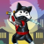 | 66943 | PUPPY | Puppy Token |
|  | 63207 | CHAMPINU | ChampInu |
| 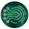 | 34642 | CLC | CaluraCoin |
|  | 68757 | GNSS | Genesis NFT |
|  | 67409 | EGR | Egoras Rights |
|  | 64113 | WPL | WorldPlus |
|  | 69103 | BOOCAKE | BooCake |
|  | 68311 | BIKINI | Bikini Finance |
|  | 48205 | REMIT | Remita Coin |
|  | 47553 | KEBAB | Kebab Token |
|  | 308 | FJC | FujiCoin |
| 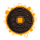 | 66433 | FUJI | Fuji |
| 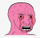 | 58391 | HFSP | Have Fun Staying Poor |
|  | 67261 | GOPX | Game On Players |
| 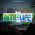 | 68709 | BFL | Battle for Life |
|  | 57747 | SHIBAWITCH | SHIWBAWITCH TOKEN |
|  | 59161 | FLOKIPAD | FlokiPad |
|  | 44693 | ETHP | ETHPlus |
|  | 36544 | ANDES | AndesCoin |
|  | 33055 | NYEX | Nyerium |
| 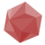 | 33258 | RAGNA | Ragnarok |
|  | 24 | ENRG | EnergyCoin |
|  | 68835 | NHBTC | nHBTC |
|  | 63909 | SVG | SquidVerse3D |
|  | 58447 | CKG | Crystal Kingdoms |
|  | 58419 | SPON | Sponsee |
|  | 32397 | EKT | EDUCare |
|  | 64285 | REEFER | Reefer Token |
|  | 59365 | HOFF | Hoff Coin |
|  | 66589 | ZABU | Zabu Token |
|  | 65147 | SWD | SW DAO |
|  | 61269 | DRONE | Drone |
|  | 68991 | BUSINESSES | VM Tycoons Businesses |
|  | 68383 | SNRW | Santrast |
|  | 66043 | KSHARE | KING Share |
|  | 60141 | FLPD | FlappyDoge |
|  | 59171 | TIMERR | Timerr |
|  | 36371 | HANA | Hanacoin |
|  | 68289 | EVRT | Everest Token |
|  | 67313 | NUGGET | Chicken Nugget Coin |
|  | 63691 | ENH | Enhance V2 |
|  | 49331 | KIMJ | KimJongMoon |
|  | 67581 | MRVR | MetaRoyale |
|  | 59127 | HHNFT | Hodler Heroes NFT |
|  | 57601 | 1NFT | 1NFT |
|  | 59073 | DESIRE | DesireNFT |
|  | 58753 | JUB | Jumbo |
| 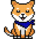 | 57967 | METAINU | Meta Inu |
|  | 54331 | BMARS | Binamars |
|  | 47196 | HITX | Hithotx |
|  | 69257 | ZBTC | Zetta Bitcoin Hashrate Token |
|  | 66735 | BBNANA | BabyBanana |
|  | 46725 | BNKRX | Bankroll Extended Token |
|  | 46912 | VCOIN | TronVegasCoin |
|  | 44973 | FDO | Fiducia |
|  | 45185 | TATM | TRON ATM |
|  | 44852 | TGCT | Tron Game Center Token |
|  | 43036 | EZPAY | EazyPayZa |
|  | 44561 | LVH | LoveHearts |
|  | 44521 | ROCKET | RocketGame |
|  | 42766 | BNKR | Bankroll Network |
|  | 36474 | TWX | TWX |
|  | 32881 | VLU | Valuto |
|  | 31680 | VOT | VoteCoin |
|  | 67755 | XDO | xDollar |
|  | 58457 | FAMY | FarmYield |
|  | 58847 | METAGIRL | Girl Story |
|  | 57543 | DSG | D-Skyscraper |
|  | 69207 | SHISH | Shisha |
|  | 66121 | LOGOS | Logosunaux |
|  | 46768 | CRS | CryptoRewards |
| 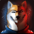 | 57317 | METASHIB | MetaShib Token |
|  | 66275 | MTB | MetaBots |
|  | 63529 | MVV | Mavaverse Token |
|  | 60137 | HYPERSONIC | Hypersonic Finance |
|  | 59469 | HOHOHO | Santa Floki |
|  | 58129 | SCORPFIN | Scorpion Finance |
|  | 49435 | FROGE | Froge Finance |
|  | 2350 | BRO | Bitradio |
|  | 1666 | PHO | Photon |
|  | 67101 | OAK | Octree Finance |
|  | 58001 | PEAKAVAX | Peak Avalanche |
|  | 32551 | SMS | Speed Mining Service |
|  | 68147 | LZP | LZP |
|  | 68831 | UNITYCOM | UnityCom |
|  | 68063 | ELONBALLS | ELONBALLS |
| 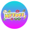 | 68551 | NFTEEZ | NFTeez |
|  | 68333 | PONYO | Ponyo Impact |
|  | 67567 | ASGARDV2 | Asgard DAO V2 |
|  | 67301 | XWIP | Wings Protocol |
|  | 66487 | HONOR | SuperPlayer World |
|  | 66693 | LDF | Lil Doge Floki Token |
|  | 66639 | MEMES | Memes Token |
|  | 67481 | TRE | Green Land |
|  | 66453 | 3WEB | Web 3 Development |
|  | 66471 | ONLEXPA | onLEXpa Token |
|  | 66151 | CTO | Coinversation |
| 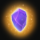 | 65771 | DKMT | Vibranium Dark Matter |
|  | 65659 | COVIDTOKEN | Covid Token |
|  | 63951 | DBQ | DBQuest |
|  | 60737 | MERD | Mermaid |
| 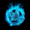 | 60265 | MHG | Meta Hangry Games |
|  | 59337 | SRT | Solidray Finance |
|  | 59075 | RIPR | RISE2PROTOCOL |
|  | 59165 | ALIST | A-List Royale |
| 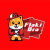 | 58991 | FBRO | FlokiBro |
| 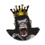 | 58833 | AKONG | AdaKong |
|  | 59475 | SM | SuperMinesweeper |
|  | 58571 | APIDAI | Apidai Network |
|  | 57369 | NOC | New Origin |
|  | 58295 | DOK | DOK Token |
|  | 57797 | DAMN | DAMN Token |
|  | 58385 | MUSHU | Mushu Finance |
| 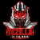 | 57947 | TEZILLA | Tezilla |
|  | 58551 | SACK | Moon Sack |
|  | 58649 | JPT | Jackpot Token |
|  | 58495 | THROPIC | Thropic |

---

[← Prev](./list13.md) | [Next →](./list15.md)
