# Cryptocurrency list (page: 15)

[← Prev](./list14.md) | [Next →](./list16.md)

| Logo | ID | Symbol | Name |
|:----:|:--:|:------:|:-----|
|  | 14816 | CGV | Cogito Finance |
|  | 14817 | STKSTARS | pSTAKE Staked STARS |
|  | 14818 | NOGS | Noggles |
| 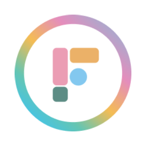 | 14819 | FUNG | Fungify |
| 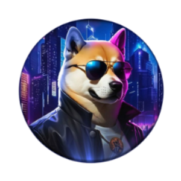 | 14820 | DOGEMOB | DOGEMOB |
| 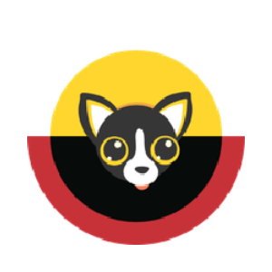 | 14821 | STKHUAHUA | pSTAKE Staked HUAHUA |
|  | 14822 | ORT | Okratech Token |
| 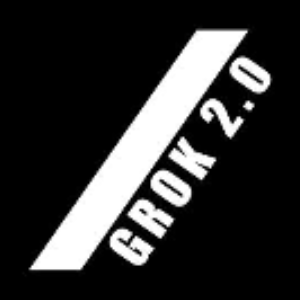 | 14823 | GROK2 | GROK 2.0 |
|  | 14824 | AIRTNT | Tenti |
| 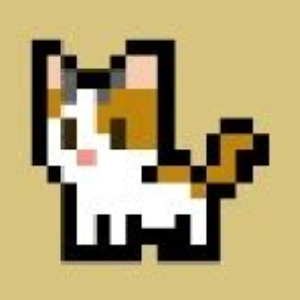 | 14826 | MEWC | Meowcoin |
| 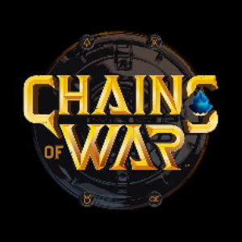 | 14827 | MIRA | Chains of War |
|  | 14828 | CHEEPEPE | CHEEPEPE |
| 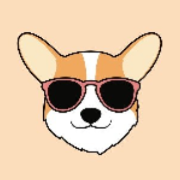 | 14829 | PUPPER | Pupper |
|  | 14830 | BUBBLE | Bubble |
|  | 14831 | WACME | Wrapped Accumulate |
| 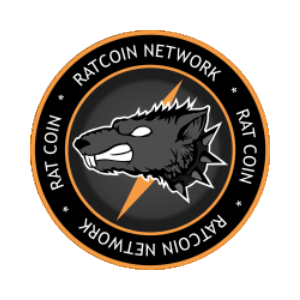 | 14832 | RAT | RatCoin |
| 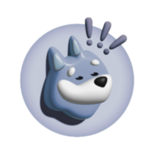 | 14833 | BONKONETH | Bonk On ETH (bonketh.io) |
|  | 14834 | RSRV1 | Reserve Rights  |
| 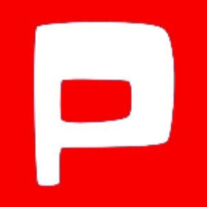 | 14835 | ALPHAPETTO | Alpha Petto Shells |
| 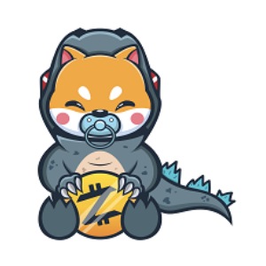 | 14836 | BABYDOGEZILLA | BabyDogeZilla |
| 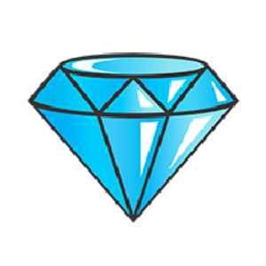 | 14837 | DND | Diamond DND |
| 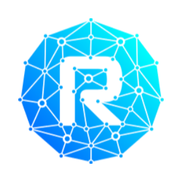 | 14838 | RVL | Revolotto |
| 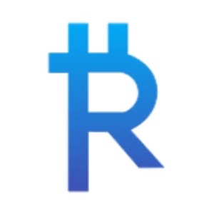 | 14839 | PROPEL | PayRue (Propel) |
| 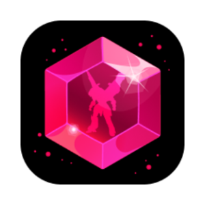 | 14840 | ASTRAFERV1 | Astrafer v1 |
| 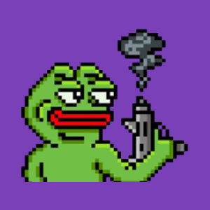 | 14842 | GOME | Game of Memes |
|  | 14843 | HAMMY | SAD HAMSTER |
| 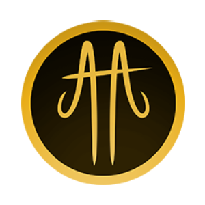 | 14844 | CTA | Cross The Ages |
|  | 14845 | PAIDV1 | PAID Network v1 |
| 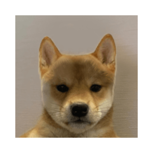 | 14846 | NOHAT | DogWifNoHat |
|  | 14847 | WSDM | Wisdomise AI |
| 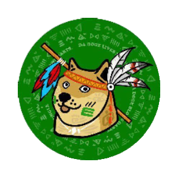 | 14848 | JUNGLE | JUNGLEDOGE |
|  | 14849 | EOSBLACK | eosBLACK |
| 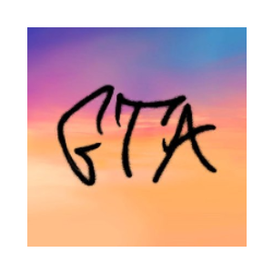 | 14850 | GTA | GTA Token |
| 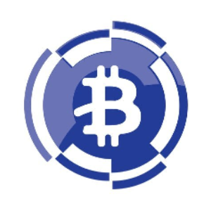 | 14851 | WFBTC | Wrapped Fantom Bitcoin |
| 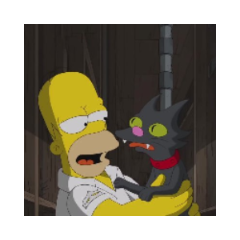 | 14852 | SNOWBALL | Simpson Cat |
|  | 14853 | VSOL | VSolidus |
| 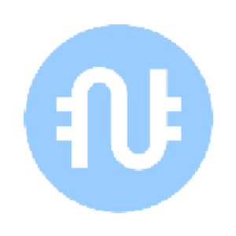 | 14854 | NARS | Num Finance ARS |
|  | 14855 | WUSD | Worldwide USD |
|  | 14856 | STOG | Stooges |
| 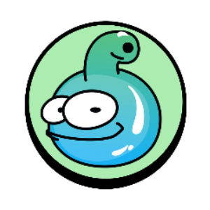 | 14857 | SNORK | Snork |
| 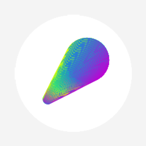 | 14858 | SVL | Slash Vision Labs |
| 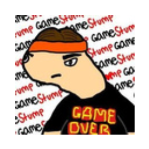 | 14859 | GAMESTUMP | GAMESTUMP |
|  | 14860 | KETAMINE | Ketamine |
| 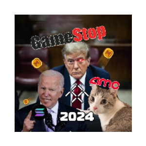 | 14861 | SOLMEME | TrumpFFIEGMEBidenCAT2024AMC |
|  | 14862 | WRKX | NFT Workx |
| 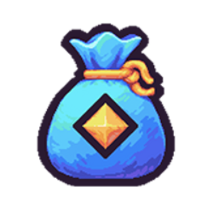 | 14863 | BAG | Bag |
|  | 14864 | QLIX | QLix |
|  | 14865 | PHAME | PHAME |
| 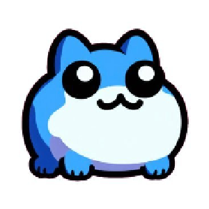 | 14866 | TOBY | toby |
|  | 14867 | MPIX | Megapix |
|  | 14868 | MANORUKA | ManoRuka |
| 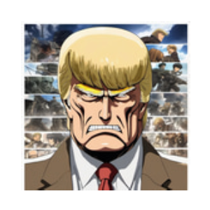 | 14869 | TRUMPTITANS | TrumpTitans |
| 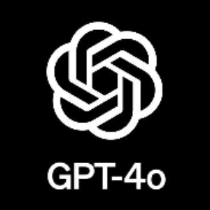 | 14870 | GPT4O | GPT-4o |
| 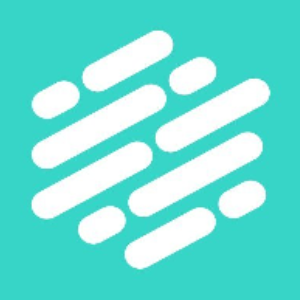 | 14871 | VDA | Verida |
| 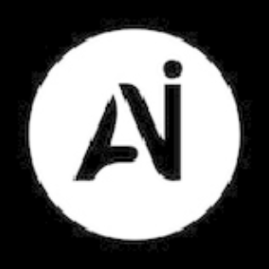 | 14872 | ALPHAAI | Alpha AI |
| 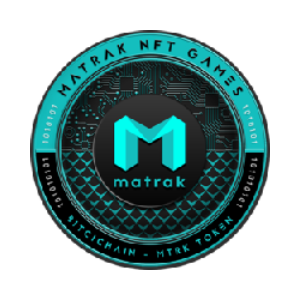 | 14873 | MTRK | Matrak Fan Token |
|  | 14874 | ROXY | ROXY FROG |
|  | 14875 | CATGAME | Cookie Cat Game |
|  | 14876 | GURL | Gently Used Girl |
| 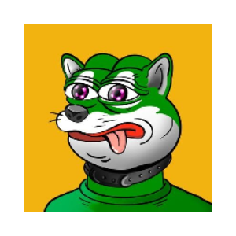 | 14877 | PEPINU | Pepinu |
| 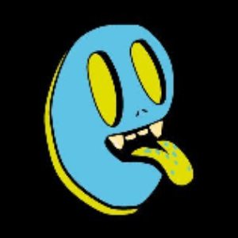 | 14878 | DELI | NFTDeli |
| 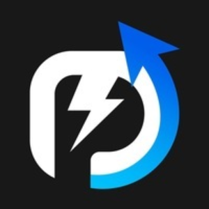 | 14879 | PMT | POWER MARKET |
|  | 14880 | PPFT | Papparico Finance |
|  | 14881 | BETZ | Bet Lounge |
|  | 14882 | IMPCOIN | IMPERIUM |
|  | 14883 | GLDGOV | Gold DAO |
|  | 14884 | GBSK | Gençlerbirliği Fan Token |
|  | 14885 | MXGP | MXGP Fan Token |
| 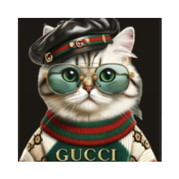 | 14886 | CUCCI | Cat in Gucci |
| 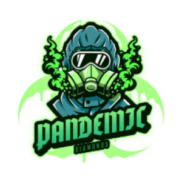 | 14887 | PMD | Pandemic Multiverse |
|  | 14888 | SNG | SINERGIA |
|  | 14889 | REGEN | Regen Network |
| 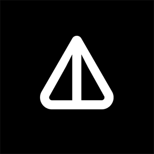 | 14890 | NOT | Notcoin |
| 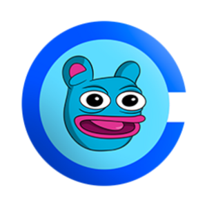 | 14891 | BRETT | Brett Base (basedbrett.com) |
| 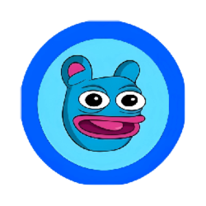 | 14892 | BRETTONETH | Brett (brettoneth.online) |
|  | 14893 | ZENT | Zentry |
| 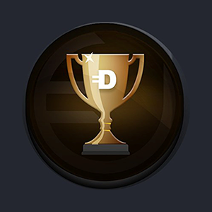 | 14895 | DFSPORTS | Digital Fantasy Sports |
| 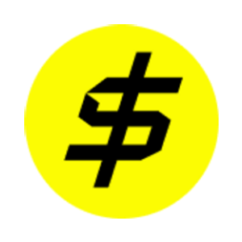 | 14896 | USDBLAST | USDB Blast |
|  | 14897 | TCG | Today's Crypto |
|  | 14898 | SHIN | Shin Chan |
| 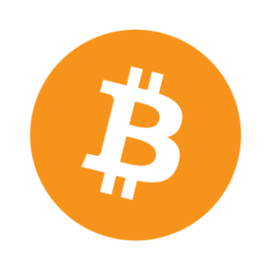 | 14899 | BTCAB | Bitcoin (Avalanche Bridge) |
| 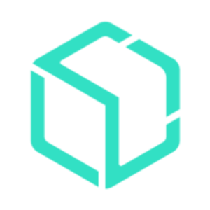 | 14900 | SSVV1 | Blox |
|  | 14901 | BCCOIN | BlackCardCoin |
|  | 14902 | DONK | Don-key |
|  | 14903 | PEPESWAP | PEPE Swap |
|  | 14904 | BREAD | Breadchain Cooperative |
| 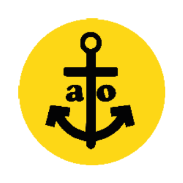 | 14905 | ATO | Atocha Protocol |
|  | 14906 | GST | CoinGhost |
|  | 14907 | SFV2 | ShibaFameV2 |
| 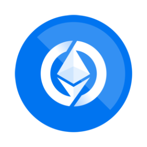 | 14908 | OETHER | Origin Ether |
| 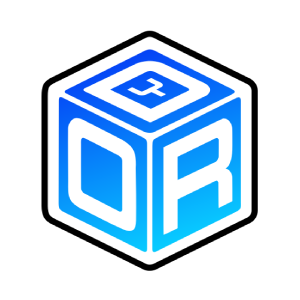 | 14909 | DYOR | DYOR Token |
|  | 14910 | POLO | NftyPlay |
| 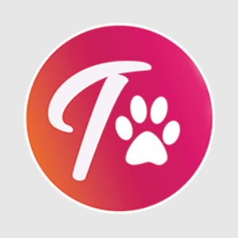 | 14911 | TTF | TurboTrix Finance |
|  | 14912 | SPECT | Spectral |
|  | 14913 | JF | Jswap.Finance |
|  | 14914 | CACAO | Maya Protocol |
|  | 14915 | INET | Ideanet Token |
|  | 14916 | TURBO | Turbo |
|  | 14917 | NTVRK | Netvrk |
|  | 14918 | STSOMM | Stride Staked SOMM |
|  | 14919 | STUMEE | Stride Staked UMEE |
|  | 14920 | AOT | Age of Tanks |
|  | 14921 | PENR | Penrose Finance |
|  | 14922 | OSKDAO | OSK DAO |
|  | 14923 | MATRIX | Matrix Labs |
|  | 14924 | CSWAP | ChainSwap |
|  | 14925 | PNB | Pink BNB |
|  | 14926 | FMA | FLAMA |
|  | 14927 | SOLMATES | SOLMATES |
|  | 14928 | DCK | DexCheck AI |
|  | 14929 | SHARKC | Shark Cat |
|  | 14930 | SEDA | SEDA Token |
|  | 14931 | QTK | QuantCheck |
|  | 14932 | USDPLUS | Overnight.fi USD+ |
|  | 14933 | LOOMV1 | Loom Network v1 |
|  | 14934 | ZACK | Zack Morris |
|  | 14935 | NKYC | NKYC Token |
|  | 14936 | TUBES | TUBES |
|  | 14937 | HIGHER | Higher |
|  | 14938 | MUZKI | Muzki |
|  | 14939 | MIDNIGHT | Midnight |
|  | 14940 | FLIKO | Fliko Uni |
|  | 14941 | CRUMP | Crypto Trump |
|  | 14942 | MONKAS | Monkas |
|  | 14943 | RAFFLES | Degen Raffles |
|  | 14944 | IVEX | IVEX Financial |
|  | 14945 | FALX | FalconX |
|  | 14946 | MELD | MELD |
|  | 14947 | CUFF | Jail Cat |
|  | 14948 | PUFF | Puff The Dragon |
|  | 14949 | DONKE | DONKE |
|  | 14950 | TOBI | MOTO DOG |
|  | 14951 | MOOCAT | MooCat |
|  | 14952 | G8C | ONEG8.ONE |
|  | 14953 | AIGPU | AIGPU Token |
|  | 14954 | MODE | Mode |
|  | 14955 | SVNN | Savanna Haus |
|  | 14956 | ZCHF | Frankencoin |
|  | 14957 | RESCUE | Rescue |
|  | 14958 | KILLA | The Bitcoin Killa |
|  | 14959 | IRON | Iron Fish |
|  | 14960 | SAI | Single Collateral DAI  |
|  | 14961 | DILIGENT | Diligent Pepe |
|  | 14962 | STARRI | starri |
|  | 14963 | ROCCO | Just A Rock |
|  | 14964 | COOCHIE | Cucci |
|  | 14965 | SOLWIF | Solwif |
|  | 14966 | SUISHIB | SuiShiba |
|  | 14967 | MARTIA | Colonize Mars |
|  | 14968 | ANCHOR | AnchorSwap |
|  | 14969 | XTT | XSwap Treasure |
|  | 14970 | PINETWORKDEFI | Pi Network DeFi |
|  | 14971 | BNBOLYMPIC | BNB OLYMPIC |
|  | 14972 | YTJIA | Jia Yueting |
|  | 14973 | MRBASED | MrBased |
|  | 14974 | ASIX | ASIX+ |
|  | 14975 | TEMPLE | TempleDAO |
|  | 14976 | 4WMM | 4-Way Mirror Money |
|  | 14977 | ROARINGCAT | Roaring Kitty |
|  | 14978 | TRUMATIC | TruFin Staked MATIC |
|  | 14979 | BTCDRAGON | BTC Dragon |
|  | 14980 | BAVA | Baklava |
|  | 14981 | HSAI | HealthSci.AI |
|  | 14982 | BABYGME | Baby GameStop |
|  | 14983 | PINU100X | Pi INU 100x |
|  | 14984 | AWK | Awkward Monkey Base |
|  | 14985 | BIGMIKE | Big Mike |
|  | 14986 | RADX | Radx AI |
|  | 14987 | MAUW | MAUW |
|  | 14988 | BBUSD | BounceBit USD |
|  | 14989 | 0XVOX | HashVox AI |
|  | 14990 | XTV | XTV |
|  | 14991 | RPEPE | RoaringPepe |
|  | 14992 | SPL | SocialPal |
|  | 14993 | PRIMEETH | Prime Staked ETH |
|  | 14994 | CTOK | Codyfight |
|  | 14995 | HYPC | HyperCycle |
|  | 14996 | FLEXUSD | flexUSD |
|  | 14997 | SXCH | SolarX |
|  | 14998 | DCI | Decentralized Cloud Infrastructure |
|  | 14999 | APETARDIO | Apetardio |
|  | 15000 | PELF | PELFORT |
|  | 15001 | EGOD | EgodCoin |
|  | 15002 | RS | ReadySwap |
|  | 15003 | DAMOON | Damoon Coin |
|  | 15004 | HLG | Holograph |
|  | 15005 | SKYA | Sekuya Multiverse |
|  | 15006 | WJD | WJD |
|  | 15007 | HIP | HIPPOP |
|  | 15008 | ROSA | Rosa Inu |
|  | 15009 | GSTOP | GameStop (gamestopeth.io) |
|  | 15010 | MAGAPEPE | MAGA PEPE SOL (magapepe.vip) |
|  | 15011 | PAMBI | Pambicoin |
|  | 15012 | RETIK | Retik Finance |
|  | 15013 | BITBEDR | Bitcoin EDenRich |
|  | 15014 | ACHI | achi |
|  | 15015 | TRUMPE | Trump Pepe |
|  | 15016 | PEANIE | Peanie |
|  | 15017 | WAFFLES | Waffles Davincij15's Cat |
|  | 15018 | GROYPER | Groyper |
|  | 15019 | BUBBA | Bubba |
|  | 15020 | OKAYEG | Okayeg |
|  | 15021 | SESE | Simpson Pepe |
|  | 15022 | MUSCAT | MusCat |
|  | 15023 | WEIRDO | Weirdo |
|  | 15024 | LAPI | Lapis Inu |
|  | 15025 | GTRUMP | Giga Trump |
|  | 15026 | BROOT | BROOT |
|  | 15027 | PRESI | Turbo Trump |
|  | 15028 | BONDLYV1 | Bondly Finance |
|  | 15029 | VTRA | E.C. Vitoria Fan Token |
|  | 15030 | ALTR | Altranium |
|  | 15031 | DUELV1 | Duel Network v1 |
|  | 15032 | BTC2XFLI | BTC 2x Flexible Leverage Index |
|  | 15033 | APEXT | ApexToken |
|  | 15034 | PUNK | PunkCity |
|  | 15035 | 0XVPN | 0xVPN.org |
|  | 15036 | PARAG | Paragon Network |
|  | 15037 | PUNKV | Punk Vault (NFTX) |
|  | 15038 | LAINESOL | Laine Staked SOL |
|  | 15039 | ADANA | Adanaspor Fan Token |
|  | 15040 | BDRM | Bodrumspor Fan Token |
|  | 15041 | TMFT | Turkish Motorcycle Federation |
|  | 15042 | FKSK | Fatih Karagümrük SK |
|  | 15043 | SION | FC Sion |
|  | 15044 | IWFT | İstanbul Wild Cats |
|  | 15045 | MCL | McLaren F1 |
|  | 15046 | PLMC | Polimec |
|  | 15047 | TOKERO | TOKERO LevelUP Token |
|  | 15048 | VERO | VEROPAD |
|  | 15049 | FIDU | Fidu |
|  | 15050 | CANNF | CANNFINITY |
|  | 15051 | SHFL | Shuffle |
|  | 15052 | BLACKD | Blackder AI |
|  | 15053 | WIFI | WiFi Map |
|  | 15054 | SYNT | Synthetix Network |
|  | 15055 | DARED | Daredevil Dog |
|  | 15056 | BOBBYM | Bobby Moore |
|  | 15057 | JUSD | JUSD Stable Token |
|  | 15058 | DUCKO | Duck Off Coin |
|  | 15059 | NEARX | Stader NearX |
|  | 15060 | NMT | NetMind Token |
|  | 15061 | TREMP | Doland Tremp |
|  | 15062 | PAC | PacMoon |
|  | 15063 | DMT | Dream Machine Token |
|  | 15064 | YES | YES Money |
|  | 15066 | HARAMBE | Harambe on Solana |
|  | 15067 | BEAN | Bean |
|  | 15068 | FOXY | Foxy |
|  | 15069 | STARS | Stargaze |
|  | 15070 | PENG | Peng |
|  | 15071 | TAI | TARS Protocol |
|  | 15072 | MRXE | Wrapped ETH Metrix |
|  | 15073 | TUSDV1 | True USD v1 |
|  | 15074 | APU | Apu Apustaja |
|  | 15075 | BB | BounceBit |
|  | 15076 | WZRD | Bitcoin Wizards |
|  | 15077 | DOG | DOG•GO•TO•THE•MOON |
|  | 15078 | CHIM | Chimera |
|  | 15079 | QUIL | Wrapped QUIL |
|  | 15080 | FASTV1 | Fastswap v1 |
|  | 15081 | FIRE | Matr1x Fire |
|  | 15082 | MONST | Monstock |
|  | 15083 | RICHOFME | Rich Of Memes |
|  | 15084 | ELONM | ELON MEME |
|  | 15085 | FREEDO | Freedom |
|  | 15086 | STTIA | Stride Staked TIA |
|  | 15087 | HDRO | Hydro Protocol |
|  | 15088 | BTRC | Bitro Coin |
|  | 15089 | GYROS | Gyroscope GYD |
|  | 15090 | VIRTUM | VIRTUMATE |
|  | 15091 | PARAM | Param |
|  | 15092 | ULTRAP | ULTRA Prisma Finance |
|  | 15093 | METAW | MetaWorth |
|  | 15094 | CHOMP | ChompCoin |
|  | 15095 | ROOSTV1 | Roost Coin v1 |
|  | 15096 | ARCADEF | arcadefi |
|  | 15097 | RETARDIO | RETARDIO |
|  | 15099 | BLASTA | BlastAI |
|  | 15100 | BOMBS | Bomb Shelter Inu |
|  | 15101 | HACD | Hacash Diamond |
|  | 15102 | ROBINH | ROBIN HOOD |
|  | 15103 | PEPET | PepeTrump |
|  | 15104 | WSGV1 | Wall Street Games v1 |
|  | 15105 | KELPE | Kelp Earned Points |
|  | 15106 | MEOWM | Meow Meow Coin |
|  | 15107 | MINES | MINESHIELD |
|  | 15108 | FROGB | Frog Bsc |
|  | 15109 | ATHEN | Athenas AI |
|  | 15110 | MONB | MonbaseCoin |
|  | 15111 | DONALDT | Donald The Trump |
|  | 15112 | AIINU | AI INU |
|  | 15113 | SHILLG | Shill Guard Token |
|  | 15114 | LARR | larrywifhat |
|  | 15115 | CHARTA | CHARTAI |
|  | 15116 | STOIC | stoicDAO |
|  | 15117 | ETER | Eternal AI |
|  | 15118 | PALM | PaLM AI |
|  | 15119 | PALMV1 | PaLM AI v1 |
|  | 15120 | OMNIC | OmniCat |
|  | 15121 | SYNC | Syncus |
|  | 15123 | AIT | AIT Protocol |
|  | 15124 | ASTROP | AstroPepeX |
|  | 15125 | ORACUL | Oracul Ai |
|  | 15126 | BOZOH | bozo Hybrid |
|  | 15127 | TBTCV1 | tBTC v1 |
|  | 15128 | ML | Mintlayer |
|  | 15129 | HAP | Happy Train |
|  | 15130 | MARSW | Marswap |
|  | 15131 | FSO | FSociety |
|  | 15132 | ARCHE | Archean |
|  | 15133 | GENIEC | GenieCoin |
|  | 15134 | BEER | BEERCOIN |
|  | 15135 | LUCKYS | LuckyStar |
|  | 15136 | STTAO | Tensorplex Staked TAO |
|  | 15137 | ETHERW | Ether Wars |
|  | 15138 | ICETH | Interest Compounding ETH Index |
|  | 15139 | GIR | Girlfriend |
|  | 15140 | 0LNETWORK | 0L Network |
|  | 15141 | JES | Jesus |
|  | 15142 | TRXS | Staked TRX |
|  | 15143 | CREAML | Creamlands |
|  | 15144 | TOXI | ToxicGarden.finance SEED |
|  | 15145 | ALPHAS | Alpha Shards |
|  | 15146 | FINT | FintraDao |
|  | 15147 | NETRUM | Netrum |
|  | 15148 | NEXAI | NexAI |
|  | 15149 | NAI | Nuklai |
|  | 15150 | PEPEC | Pepe Chain |
|  | 15151 | ECHOD | EchoDEX |
|  | 15152 | ASI | Artificial Superintelligence Alliance |
|  | 15153 | UWU | UwU Lend |
|  | 15154 | KOI | Koi |
|  | 15155 | STON | STON |
|  | 15156 | DEFIK | DeFi Kingdoms JADE |
|  | 15157 | SHRA | Shrapnel |
|  | 15158 | MON | MON Protocol |
|  | 15159 | MODU | Modular Wallet |
|  | 15160 | INTE | InteractWith |
|  | 15161 | SHIBAR | Shibarium Name Service |
|  | 15162 | SECTO | Sector Finance |
|  | 15163 | COINH | Coinhound |
|  | 15164 | AEROT | AEROTYME |
|  | 15165 | PEPIT | Pepito |
|  | 15166 | RUGA | RUGAME |
|  | 15167 | SWY | Swype |
|  | 15168 | BLAC | Blacksmith Token |
|  | 15169 | ZYNE | Zynergy |
|  | 15170 | HONG | HongKongDAO |
|  | 15171 | COSMI | Cosmic FOMO |
|  | 15172 | PEP | Pepechain |
|  | 15173 | WSBC | WSB Coin |
|  | 15174 | MEOWME | MEOW MEOW |
|  | 15175 | SYLV | Sylvester |
|  | 15176 | PRESID | President Ron DeSantis |
|  | 15177 | TRACEA | Trace AI |
|  | 15178 | BAB | Babacoin |
|  | 15179 | LEVERA | LeverageInu |
|  | 15180 | MTGT | MTG Token |
|  | 15181 | AMBR | Ambra |
|  | 15182 | CATVAX | Catvax |
|  | 15183 | TDEFI | Token Teknoloji A.S. Token DeFi |
|  | 15184 | WHISK | Whiskers |
|  | 15185 | APTR | Aperture Finance |
|  | 15186 | ENCR | ENCRYPT |
|  | 15187 | DRBT | DeFi-Robot |
|  | 15188 | JENSEN | Jensen Huang |
|  | 15189 | WBLT | Wrapped BMX Liquidity Token |
|  | 15190 | TKAI | TAIKAI |
|  | 15191 | NDB | NDB |
|  | 15192 | RUSHCMC | RUSHCMC |
|  | 15193 | TERRA | Terraport |
|  | 15194 | RIZOLOL | Rizo |
|  | 15195 | 50C | 50Cent |
|  | 15196 | BOBBY | Kennedy Coin |
|  | 15197 | MPAD | MultiPad |
|  | 15198 | DIFF | Diffusion |
|  | 15199 | DINT | DinarTether |
|  | 15200 | PRTCLE | Particle |
|  | 15201 | RUN | Run |
|  | 15202 | VICT | Victory Impact Coin |
|  | 15203 | SPRX | Sprint Coin |
|  | 15204 | ABN | Antofy |
|  | 15205 | MARTY | Marty Inu |
|  | 15206 | NYANDOGE | NyanDOGE International |
|  | 15207 | ARCAD | Arcadeum |
|  | 15208 | EFCR | EFLANCER |
|  | 15209 | KAID | KAIDEX |
|  | 15210 | CONC | Concentrator |
|  | 15211 | ATROFA | Atrofarm |
|  | 15212 | HERBE | Herbee |
|  | 15213 | LATOM | Liquid ATOM |
|  | 15214 | JYC | Joe-Yo Coin |
|  | 15215 | ULTI | Ultiverse |
|  | 15216 | LOGO | LOGOS |
|  | 15217 | MOTHER | Mother Iggy |
|  | 15218 | BOCAC | BocaChica |
|  | 15220 | JUPSOL | Jupiter Staked SOL |
|  | 15221 | CAROL | CAROLToken |
|  | 15222 | ELFW | ELF Wallet |
|  | 15223 | BRAM | Defibox bRAM |
|  | 15224 | ECL | ECLAT |
|  | 15225 | MAAL | Maal Chain |
|  | 15226 | GMDP | GMD Protocol |
|  | 15228 | PENP | Penpie |
|  | 15229 | MINTP | Public Mint |
|  | 15231 | FINB | Finblox |
|  | 15232 | GATHER | Gather |
|  | 15233 | BITUNE | Bitune |
|  | 15234 | IO | io.net |
|  | 15235 | IZICHAIN | IZIChain |
|  | 15236 | TYPE | TypeAI |
|  | 15237 | EMC | Edge Matrix Computing |
|  | 15238 | DEFI | DeFi |
|  | 15239 | KEXCOIN | KexCoin |
|  | 15240 | COR | Coreto |
|  | 15241 | NEWS | PUBLISH |
|  | 15242 | ATH | Aethir |
|  | 15243 | BBTC | Binance Wrapped BTC (Binance Bridge) |
|  | 15244 | TAIKO | Taiko |
|  | 15245 | SPH | Spheroid Universe |
|  | 15246 | CHON | Chonk The Cat |
|  | 15247 | VEGASI | Vegas Inu Token |
|  | 15248 | SHIBA | Shibaqua |
|  | 15249 | TERR | Terrier |
|  | 15250 | PUUSH | puush da button |
|  | 15251 | SPENT | Espento |
|  | 15252 | LAD | LADA |
|  | 15253 | ZEDD | ZedDex |
|  | 15254 | AIBU | AIBUZZ TOKEN |
|  | 15255 | LAUGHCOIN | Laughcoin |
|  | 15256 | PEPEA | Pepeandybrettlandwolf |
|  | 15257 | IOETH | ioETH |
|  | 15258 | WFTN | Wrapped FTN |
|  | 15259 | BLOCKW | Blockwise |
|  | 15260 | SCAMP | ScamPump |
|  | 15261 | SCHR | Schrodinger |
|  | 15262 | XFI | CrossFi |
|  | 15263 | MAGAHAT | MAGA Coin (magacoin.com) |
|  | 15264 | GAME | GameBuild |
|  | 15265 | BURN | BurnedFi |
|  | 15266 | PROPS | Propbase |
|  | 15267 | ICE | Ice Open Network |
|  | 15268 | BLOCKT | Blocktools |
|  | 15269 | DOGEB | DogeBonk |
|  | 15270 | BOOKIE | BookieBot |
|  | 15271 | CRY | Crypto News Flash AI |
|  | 15272 | POW | PowBlocks |
|  | 15273 | PEPEGOAT | pepeGOAT |
|  | 15274 | OSH | OSHI |
|  | 15275 | ONET | ONE Token |
|  | 15276 | MAXL | Maxi protocol |
|  | 15277 | GME | GameStop (wallstsucks.lol) |
|  | 15278 | ZORKSEES | Zorksees |
|  | 15279 | ZOOA | Zoopia |
|  | 15280 | ZUNUSD | Zunami USD |
|  | 15281 | NAZ | NAZDAQ |
|  | 15282 | TRUM | TrumpBucks |
|  | 15283 | ZPET | Zino Pet |
|  | 15284 | ZLP | ZilPay Wallet |
|  | 15285 | EVRM | Evrmore |
|  | 15286 | COMPU | Compute Network |
|  | 15287 | ELO | ElonPark |
|  | 15288 | RTK | RetaFi |
|  | 15289 | HUHCAT | huhcat |
|  | 15290 | LUXU | Luxury Travel Token |
|  | 15291 | IQG | IQ Global |
|  | 15292 | SORAETH | SORA |
|  | 15293 | ZAPI | Zapicorn |
|  | 15294 | ZIZLE | Zizle |
|  | 15295 | ZIPPYSOL | Zippy Staked SOL |
|  | 15296 | DPLAT | zbyte |
|  | 15297 | ZKDX | ZKDX |
|  | 15298 | ZKGROK | ZKGROK |
|  | 15299 | ZIV4 | Ziv4 Labs |
|  | 15300 | PEPEWO | PEPE World |
|  | 15301 | ALGOW | Algowave |
|  | 15302 | ZIGAP | ZIGAP |
|  | 15303 | CURR | Curry |
|  | 15304 | ZKGUN | zkGUN |
|  | 15305 | BABYT | BABYTRUMP |
|  | 15306 | ZHC | ZHC : Zero Hour Cash |
|  | 15307 | DOGINC | dog in cats world |
|  | 15308 | ZIBU | Zibu |
|  | 15309 | KRY | Krypdraw |
|  | 15310 | ZKE | zkEra Finance |
|  | 15311 | CHUC | CHUCK |
|  | 15312 | CRUD | CRUDE OIL BRENT |
|  | 15313 | WOLFP | Wolfpack Coin |
|  | 15314 | CLAS | Classic USDC |
|  | 15315 | ABD | AB DEFI |
|  | 15316 | PEPEB | PEPEBOMB |
|  | 15317 | PUS | Pussy Cat |
|  | 15318 | UNIXCOIN | UNIX |
|  | 15319 | ZJOE | zJOE |
|  | 15320 | RABB | Rabbit INU |
|  | 15321 | CYB | CYBERTRUCK |
|  | 15322 | ZSH | Ziesha |
|  | 15323 | MANT | Mantle USD |
|  | 15324 | ZESH | Zesh |
|  | 15325 | REDP | Red Ponzi Gud |
|  | 15326 | ZETH | Zethan |
|  | 15327 | BABYBO | BabyBonk |
|  | 15328 | ZKIN | zkInfra |
|  | 15329 | RUM | RUM Pirates of The Arrland Token |
|  | 15330 | CRYPTON | CRYPTON |
|  | 15331 | BABYANDY | Baby Andy (babyandy0x68.com) |
|  | 15332 | ZKEVM | zkEVMChain (BSC) |
|  | 15333 | BEATS | Sol Beats |
|  | 15334 | ZSD | Zephyr Protocol Stable Dollar |
|  | 15335 | WHBTC | Huobi BTC (Portal Bridge) |
|  | 15336 | AIF | AI FREEDOM TOKEN |
|  | 15337 | LKI | Laika AI |
|  | 15338 | UDAO | UDAO |
|  | 15339 | ZIKC | Zik coin |
|  | 15340 | FPEPE | Based Father Pepe |
|  | 15341 | LB | LoveBit |
|  | 15342 | FURIE | Matt Furie |
|  | 15343 | CHIPPY | Chippy |
|  | 15344 | ARTFI | ARTFI |
|  | 15345 | SALMAN | Mohameme Bit Salman |
|  | 15346 | AISCII | AISCII |
|  | 15347 | SPHYNXV1 | Sphynx Token v1 |
|  | 15348 | FLOKEI | FLOKEI |
|  | 15349 | POLAO | Pola On Base |
|  | 15350 | PED | PEDRO |
|  | 15351 | DTJR | Donald Trump Jr. |
|  | 15352 | SBAE | Salt Bae For The People |
|  | 15353 | LILPUMP | lilpump |
|  | 15354 | WAT | Wat |
|  | 15355 | BRIANWIF | Brianwifhat |
|  | 15356 | COK | Cat Own Kimono |
|  | 15357 | SPHYNXV2 | Sphynx Token v2 |
|  | 15358 | LANDWU | LandWu |
|  | 15359 | S315 | SWAP315 |
|  | 15360 | MIXER | TON Mixer |
|  | 15361 | KGB | KGB protocol |
|  | 15362 | MAO | Mao |
|  | 15363 | TANUKI | Tanuki |
|  | 15364 | NORMUS | NORMUS |
|  | 15365 | JENNER | Caitlyn Jenner |
|  | 15366 | ALMC | Awkward Look Monkey Club |
|  | 15367 | CMONK | CRAZY MONKEY |
|  | 15368 | BRCST | BRCStarter |
|  | 15369 | SPHYNXV3 | Sphynx Token v3 |
|  | 15370 | SPHYNXV4 | Sphynx Token v4 |
|  | 15371 | MBTC | Bitcoin (Multichain Bridge) |
|  | 15372 | ZRO | LayerZero |
|  | 15373 | MULTIBTC | Multichain BTC |
|  | 15376 | MARIC | Maricoin |
|  | 15377 | EAVE | EaveAI |
|  | 15378 | MCOIN | MCOIN |
|  | 15379 | SLUMBO | SLUMBO |
|  | 15380 | MEMECUP | Meme Cup |
|  | 15381 | 360NS | 360 NOSCOPE INSTASWAP WALLBANG |
|  | 15382 | FAC | Flying Avocado Cat |
|  | 15383 | NCAT | Neuracat |
|  | 15384 | CHUANPU | Chuan Pu |
|  | 15385 | MAGANOMICS | Maganomics |
|  | 15386 | NSIMPSON | NeuraSimpson |
|  | 15387 | HAWKTUAH | Hawk Tuah |
|  | 15388 | POINT | SportPoint |
|  | 15389 | MBOYS | MoonBoys |
|  | 15390 | ZKX | ZKX |
|  | 15391 | BALT | Brett's cat (baltbase.xyz) |
|  | 15392 | AZUR | Azuro Protocol |
|  | 15393 | FLOCKA | Waka Flocka |
|  | 15394 | FLAPPY | Flappy |
|  | 15395 | TEW | Trump in a memes world |
|  | 15396 | AUSDT | aUSDT |
|  | 15397 | DOPU | DOPU The Dog with A Purpose |
|  | 15398 | PTRUMP | Pepe Trump |
|  | 15399 | REHA | Resistance Hamster |
|  | 15400 | BELUGA | Beluga |
|  | 15401 | LISTA | Lista DAO |
|  | 15402 | PCD |  Phecda |
|  | 15403 | PIZPEPE | Pepe Pizzeria |
|  | 15404 | GIGACHAD | GigaChad |
|  | 15405 | TRAIN | Trump Train |
|  | 15406 | BBRETT | Baby Brett (babybrettonbase.com) |
|  | 15407 | AEROBUD | Aerobud |
|  | 15408 | TRUMPHAT | Trump Hat |
|  | 15409 | PUP | Puppy Coin |
|  | 15410 | RECA | The Resistance Cat |
|  | 15411 | TWIFB | TrumpWifBiden |
|  | 15412 | EGAX | Egochain |
|  | 15413 | GMETRUMP | GME TRUMP |
|  | 15414 | DADDY | Daddy Tate |
|  | 15415 | MOGE | Moge |
|  | 15416 | MUNCHY | Boys Club Munchy |
|  | 15417 | PETOSHI | Petoshi |
|  | 15418 | NWG | NotWifGary |
|  | 15419 | WBTCE | Wrapped Bitcoin (Avalanche Bridge) |
|  | 15420 | DOGER | Robotic Doge |
|  | 15421 | REEE | REEE |
|  | 15422 | BCOINM | Bomb Crypto (MATIC) |
|  | 15423 | PDRIP | Pulse Drip |
|  | 15424 | ICELAND | ICE LAND |
|  | 15425 | EDSE | Eddie Seal |
|  | 15426 | TUTTER | Tutter |
|  | 15427 | 1MDC | 1MDC |
|  | 15428 | LONGSHINE | LongShine |
|  | 15429 | PWBTC | Wrapped Bitcoin (Polygon Portal) |
|  | 15430 | TDAN | TDAN |
|  | 15431 | ZUZU | ZUZU |
|  | 15432 | FKRPRO | FlickerPro |
|  | 15433 | ZUSHI | ZUSHI |
|  | 15434 | PGPT | PrivateAI |
|  | 15435 | GUMSHOOS | GUMSHOOS TRUMP |
|  | 15436 | ICS |  ICPSwap Token |
|  | 15437 | TWBTC | Wrapped Bitcoin (TomoBridge) |
|  | 15438 | OWBTC | Wrapped Bitcoin (Optimism - SuperChain Bridge) |
|  | 15439 | ABWBTC | Wrapped Bitcoin (Arbitrum Bridge) |
|  | 15440 | ZWBTC | Wrapped Bitcoin (ZilBridge) |
|  | 15441 | CHIDO | Chinese Doge Wow |
|  | 15442 | WVTRS | Vitreus |
|  | 15443 | POCAT | Polite Cat |
|  | 15444 | ULD | Unlighted |
|  | 15445 | ANDWU | Chinese Andy |
|  | 15446 | ATOPLUS | ATO+ |
|  | 15447 | SCRAT | Scrat |
|  | 15448 | WEF | DOG WIF CHINESE HAT |
|  | 15449 | MESSU | Loinel Messu |
|  | 15450 | HGEN | HGEN DAO |
|  | 15451 | WHISKEY | WHISKEY |
|  | 15452 | WAGIE | Wagie |
|  | 15453 | TRUMPZ | Trump Zhong |
|  | 15454 | CRWBTC | Wrapped Bitcoin (Cronos Bridge) |
|  | 15455 | QINGWA | ShangXin QingWa |
|  | 15456 | FLOCHI | Flochi |
|  | 15457 | GL | Lemmings |
|  | 15458 | CHRETT | Chinese BRETT (chinesebrettbase.xyz) |
|  | 15459 | LD | Long Dragon |
|  | 15460 | RBRETT | ROARING BRETT (roaring-brett.xyz) |
|  | 15461 | CHADCAT | CHAD CAT |
|  | 15462 | SKING | Solo King |
|  | 15463 | HWBTC | Wrapped Bitcoin (Harmony One Bridge) |
|  | 15464 | TRUMPX | Trump X-Maga |
|  | 15465 | NETA | Negative Tax |
|  | 15466 | SOLLY | Solly |
|  | 15467 | PEPEFC | Pepe FC |
|  | 15468 | JEETOLAX | Jeetolax |
|  | 15469 | BAMBIT | BAMBIT |
|  | 15470 | WEGI | Wegie |
|  | 15471 | BLEPE | Blepe |
|  | 15472 | FNLX | Fignal X |
|  | 15473 | EU24 | EURO2024 |
|  | 15474 | BASEHEROES | Baseheroes |
|  | 15475 | BULEI | Bulei |
|  | 15476 | 1WBTC | Wrapped Bitcoin (Harmony One Bridge - Depegged Token) |
|  | 15477 | DIDID | Didi Duck |
|  | 15478 | DVINCI | Davinci Jeremie |
|  | 15479 | GYR | Gyre Token |
|  | 15480 | UB | UBit Token |
|  | 15481 | LIBERTA | The Libertarian Dog |
|  | 15482 | BABYKABOSU | Baby Kabosu |
|  | 15483 | HRX | HorusLayer |
|  | 15484 | XBLAZE | Trailblaze |
|  | 15485 | BMONEY | B-money |
|  | 15486 | ECI | Euro Cup Inu |
|  | 15487 | WWBTC | Wrapped Bitcoin (Portal Bridge) |
|  | 15488 | ROON | Raccoon |
|  | 15489 | UAHG | UAHg |
|  | 15490 | SCHRODI | Schrödi |
|  | 15491 | TMANIA | Trump Mania |
|  | 15492 | PEPO | Peepo |
|  | 15493 | ALBART | Albärt |
|  | 15494 | SMIDGE | Smidge |
|  | 15495 | MWBTC | Wrapped Bitcoin (Multichain Bridge) |
|  | 15496 | DORKY | Dork Lord |
|  | 15497 | BLACKSALE | Black Sale |
|  | 15498 | RWT | RWT TOKEN |
|  | 15499 | INUGA | INUGAMI |
|  | 15500 | FHB | FHB |
|  | 15501 | SHRUB | Shrub |
|  | 15502 | PEPER | Baby Pepe |
|  | 15503 | DRAGGY | Draggy |
|  | 15504 | BGUY | The Big Guy |
|  | 15505 | DOGH | a dog in a hoodie |
|  | 15506 | HASBIK | Hasbulla |
|  | 15507 | LOCAT | LOVE CAT |
|  | 15508 | MOLLARS | MollarsToken |
|  | 15509 | AMADEUS | AMADEUS |
|  | 15510 | BAREBEARS | BAREBEARS |
|  | 15511 | MAGASHIB | MAGA SHIB |
|  | 15512 | VTRUMP | Vote Trump |
|  | 15513 | MOR | Morpheus |
|  | 15514 | SENK | Senk |
|  | 15515 | TYBENG | TYBENG |
|  | 15516 | BICITY | BiCity AI Projects |
|  | 15517 | DOUG | Doug The Duck |
|  | 15518 | NPTX | NeptuneX |
|  | 15519 | GAMEBUD | GAMEBUD |
|  | 15520 | DOGEVERSE | DogeVerse |
|  | 15521 | MAGAA | MAGA AGAIN (magaa.io) |
|  | 15522 | MAGADOGE | MAGA DOGE |
|  | 15523 | MAGA2024 | MAGA2024 |
|  | 15524 | PHRYGE | PHRYGES |
|  | 15525 | 9MM | Shigure UI |
|  | 15526 | MITTENS | Mittens |
|  | 15527 | FRESCO | Fresco |
|  | 15528 | GMEPEPE | GAMESTOP PEPE |
|  | 15529 | MIXAI | Mixcash AI |
|  | 15530 | BBEER | BABY BEERCOIN |
|  | 15531 | CY97 | Cyclops97 |
|  | 15532 | CAPRI | Caprisun Monkey |
|  | 15533 | SKAI | Skillful AI |
|  | 15534 | PEW | pepe in a memes world |
|  | 15535 | LFGO | Lets Fuckin Go |
|  | 15536 | TUZKI | Tuzki |
|  | 15537 | MTIK | MatikaToken |
|  | 15538 | PESHI | PESHI |
|  | 15539 | QSWAP | Quantum Network |
|  | 15540 | BOSSCOQ | THE COQFATHER |
|  | 15541 | MUC | Multi Universe Central |
|  | 15542 | RGOAT | RealGOAT |
|  | 15543 | FEFE | Fefe |
|  | 15544 | FKBIDEN | Fkbiden |
|  | 15545 | NYXC | Nyxia AI |
|  | 15546 | TODD | TURBO TODD |
|  | 15547 | PIRATE | Pirate Nation |
|  | 15548 | BLOOM | BloomBeans |
|  | 15549 | MAMBA | Mamba |
|  | 15550 | TROG | Trog |
|  | 15551 | SEW | simpson in a memes world |
|  | 15552 | NLK | NuLink |
|  | 15553 | 314DAO | Tonken 314 DAO |
|  | 15554 | AURA | Aura Network |
|  | 15555 | MADA | MilkADA |
|  | 15556 | LOCOM | Locomotir |
|  | 15557 | MALGO | milkALGO |
|  | 15558 | FRENCH | French On Base |
|  | 15559 | MOOLA | Degen Forest |
|  | 15560 | MELLSTROY | MELLSTROY |
|  | 15561 | SKOP | Skulls of Pepe Token |
|  | 15562 | BUCKY | Bucky |
|  | 15563 | TWP | TrumpWifPanda |
|  | 15564 | BABYCRASH | BabyCrash |
|  | 15565 | NEURON | Cerebrum DAO |
|  | 15566 | CHOO | Chooky |
|  | 15567 | CBAB | CreBit |
|  | 15568 | SOLETF | SOL ETF |
|  | 15569 | BIGLEZ | THE BIG LEZ SHOW |
|  | 15570 | MMIP | Memes Make It Possible |
|  | 15571 | ANYONE | ANyONe Protocol |
|  | 15572 | BRAINZ | Brainz Finance |
|  | 15573 | TBD | THE BIG DEBATE |
|  | 15574 | MOMIJI | MAGA Momiji |
|  | 15575 | TARD | Tard |
|  | 15576 | CHWY | CHEWY |
|  | 15577 | DENTX | DENTNet |
|  | 15578 | POLLUK | Jasse Polluk |
|  | 15579 | BURNKING | BurnKing |
|  | 15580 | ANIMEONBASE | Anime (animeonbase.art) |
|  | 15581 | YEEHAW | YEEHAW |
|  | 15582 | WIFB | dogwifball |
|  | 15583 | PEPEMAGA | Trump Pepe |
|  | 15584 | RALLY | Trump Rally |
|  | 15585 | WALTER | walter |
|  | 15586 | NIGI | Nigi |
|  | 15587 | CHED | Giggleched |
|  | 15588 | SNPAD | SNP adverse |
|  | 15589 | CHARTIQ | ChartIQ |
|  | 15590 | CYPEPE | CyPepe |
|  | 15591 | TRUMAGA | TrumpMAGA |
|  | 15592 | SCLASSIC | Solana Classic |
|  | 15593 | JJ | JEJE |
|  | 15594 | APUGURL | APU GURL |
|  | 15595 | WAZ | MikeAI |
|  | 15596 | AIRBTC | AIRBTC |
|  | 15597 | SIMSOL | SimSol |
|  | 15598 | MILLY | milly |
|  | 15599 | WLTH | Common Wealth |
|  | 15600 | IVANKA | IVANKA TRUMP |
|  | 15601 | BAOM | Battle of Memes |
|  | 15602 | BOGGY | Boggy Coin |
|  | 15603 | GROOVE | GROOVE |
|  | 15604 | CHACHA | Chacha |
|  | 15605 | BAHAMAS | Bahamas |
|  | 15606 | TEITEI | TeiTei |
|  | 15607 | NIGELLA | Nigella coin |
|  | 15608 | SELFIE | SelfieDogCoin |
|  | 15609 | MACHO | macho |
|  | 15610 | PRICK | Pickle Rick |
|  | 15611 | NATIX | NATIX Network |
|  | 15612 | BUM | WillyBumBum |
|  | 15613 | XALPHA | XAlpha AI |
|  | 15614 | PEEPEE | Peepee |
|  | 15615 | PEPESOL | PEPE SOL |
|  | 15616 | EMIT | Time Machine NFTs |
|  | 15617 | MOEW | donotfomoew |
|  | 15618 | NXQ | NexQloud |
|  | 15619 | PAPU | Papu Token |
|  | 15620 | CHEEKS | CHEEKS |
|  | 15621 | TRADEBOT | TradeBot |
|  | 15622 | OFF | BlastOff |
|  | 15623 | PCKB | pCKB (via Godwoken Bridge from CKB) |
|  | 15624 | RWBTC | Wrapped Bitcoin (Rainbow Bridge) |
|  | 15625 | IOWBTC | Wrapped Bitcoin (ioTube Bridge) |
|  | 15626 | OMAXV1 | Omax v1 |
|  | 15627 | WSOL | Wrapped SOL (Portal Bridge) |
|  | 15629 | BPSOL | SOL (Binance Bridge) |
|  | 15630 | BPETH | Binance-Peg Ethereum (Binance Bridge) |
|  | 15631 | WXRP | Wrapped XRP |
|  | 15632 | PEOS | EOS (pTokens) |
|  | 15633 | LOVELYV1 | Lovely Inu Finance |
|  | 15634 | LSTV1 | Lovely Swap Token |
|  | 15635 | MARVINB | Marvin on Base |
|  | 15636 | XHP | XHYPE |
|  | 15637 | PONT | Ontology (PolyNetwork) |
|  | 15638 | BCHB | Bitcoin Cash on Base |
|  | 15639 | KOSS | Koss |
|  | 15640 | KINIC | Kinic |
|  | 15641 | JOHNNY | Johnny The Bull |
|  | 15642 | QDFI | Qudefi |
|  | 15643 | JWIF | Jerrywifhat |
|  | 15644 | COFEEE | COFEEE |
|  | 15645 | FROGLIC | Pink Hood Froglicker |
|  | 15646 | DOOGLE | Doogle |
|  | 15647 | GCB | Global Commercial Business |
|  | 15648 | PEPLO | Peplo Escobar |
|  | 15649 | RUTH | RUTH |
|  | 15650 | REDZILLA | REDZILLA COIN |
|  | 15651 | BERNIE | BERNIE SENDERS |
|  | 15652 | DOGGS | Doggensnout |
|  | 15653 | WINSTON | Winston |
|  | 15654 | ZAZZLES | Zazzles |
|  | 15655 | SNOLEX | Snolex |
|  | 15656 | PUNGU | PUNGU |
|  | 15657 | PEME | PEME |
|  | 15658 | EWTB | Energy Web Token Bridged (Energy Web Bridge) |
|  | 15659 | JASON | Jason Derulo |
|  | 15660 | BICHO | bicho |
|  | 15661 | WPCI | Wrapped PCI (Paycoin Bridge) |
|  | 15662 | REXHAT | rexwifhat |
|  | 15663 | BECX | BETHEL |
|  | 15664 | MAXETH | Max on ETH |
|  | 15665 | PEON | Peon |
|  | 15666 | WOCTA | Wrapped OctaSpace (Octa.Space Bridge) |
|  | 15667 | EVIN | Evin Token |
|  | 15668 | MIU | Miu |
|  | 15669 | USDCAT | UpSideDownCat |
|  | 15670 | DORKVADER | DorkVader |
|  | 15671 | CHIPI | chipi |
|  | 15672 | KANG | Kangamoon |
|  | 15673 | LOLLY | Lollipop |
|  | 15674 | LIVESEY | Dr. Livesey |
|  | 15675 | GREMLY | Gremly |
|  | 15676 | CHIRPY | Chirpy Boy |
|  | 15677 | EMTRG | Wrapped Meter Governance (mapped by Meter.io) |
|  | 15678 | KERN | Kernel |
|  | 15679 | RTD | Retard |
|  | 15680 | WZANO | Wrapped Zano (Zano Bridge) |
|  | 15681 | CHNG | Chainge Finance |
|  | 15682 | WEVERV1 | Wrapped Ever v1 |
|  | 15683 | WHNS | Wrapped Handshake (Namebase Bridge) |
|  | 15684 | RPGV1 | Rangers Protocol v1 |
|  | 15685 | XHPV1 | XHYPE v1 |
|  | 15686 | MBILLY | MAMA BILLY |
|  | 15687 | GONDOLA | Gondola |
|  | 15688 | MAWC | Magawincat |
|  | 15689 | DEVE | Develocity Finance |
|  | 15690 | CENS | Censored Ai |
|  | 15691 | XOXNO | XOXNO |
|  | 15692 | DONJR | Don Jr. |
|  | 15693 | GHCV2 | Galaxy Heroes Coin v2 |
|  | 15694 | DWARFY | Dwarfy |
|  | 15695 | JEFFRY | jeffry |
|  | 15696 | JUNIOR | Junior |
|  | 15697 | BUDDY | BUDDY |
|  | 15698 | GHCV3 | Galaxy Heroes Coin v3 |
|  | 15699 | MEMEM | Meme Man |
|  | 15700 | FEE | FEED EVERY GORILLA |
|  | 15701 | WPPC | Wrapped Peercoin (Peercoin Bridge) |
|  | 15702 | FOFARBASE | FOFAR |
|  | 15703 | BASECAT | BASE CAT |
|  | 15704 | DYNAM | Dynamic Crypto Index |
|  | 15705 | GENT | Gentleman |
|  | 15706 | FSNV1 | Fusion v1 |
|  | 15707 | WZNN | Wrapped Zenon (Zenon Bridge) |
|  | 15708 | WOXEN | Wrapped Oxen (wOxen Bridge) |
|  | 15709 | WZNNV1 | Wrapped Zenon (Zenon Bridge) v1 |
|  | 15710 | TOWELI | Towelie |
|  | 15711 | PURPE | Purple Pepe |
|  | 15712 | MELLOW | Mellow Man |
|  | 15713 | NATOR | Pepenator |
|  | 15714 | BANKSY | BANKSY |
|  | 15715 | LANDLORD | LANDLORD RONALD |
|  | 15716 | RIS | Riser |
|  | 15717 | XAGX | Silver Token |
|  | 15718 | OILX | OilX Token |
|  | 15719 | PWR | MaxxChain |
|  | 15720 | EAI | Eagle AI |
|  | 15721 | BPXRP | Binance-Peg XRP Token (Binance Bridge) |
|  | 15722 | HACHIK | Hachiko |
|  | 15723 | EXRP | Synthetic XRP (Energiswap) |
|  | 15724 | BPFIL | Binance-Peg Filecoin (Binance Bridge) |
|  | 15725 | BFIL | Binance Wrapped FIL (Binance Bridge) |
|  | 15726 | REPE | Resistance Pepe |
|  | 15727 | MATT | Matt Furie |
|  | 15728 | MOCA | Moca |
|  | 15729 | BPEOS | Binance-Peg EOS Token (Binance Bridge) |
|  | 15730 | BPFLOW | Binance-Peg FLOW Token (Binance Bridge) |
|  | 15731 | MOLI | Mobile Liquidity |
|  | 15732 | BOAM | BOOK OF AI MEOW |
|  | 15733 | HACH | Hachiko |
|  | 15734 | FIREW | Fire Wolf |
|  | 15735 | WROSE | Wrapped ROSE (wrose.io Bridge) |
|  | 15736 | META | MetaDAO |
|  | 15737 | ANDYBSCVIP | ANDY (andybsc.vip) |
|  | 15738 | BPUSDT | Binance-Peg USDT (Binance Bridge) |
|  | 15739 | FLA | Flappy |
|  | 15740 | RNDRV1 | Render v1 |
|  | 15741 | EROSE | Synthetic Oasis Network (Energiswap) |
|  | 15742 | PONZIO | Ponzio The Cat |
|  | 15743 | TONT | TONKIT |
|  | 15744 | DOLPHY | Dolphy |
|  | 15745 | SYK | Stryke |
|  | 15746 | PAUL | Elephant Penguin |
|  | 15747 | AARK | Aark |
|  | 15748 | BABYTR | BABYTRUMP |
|  | 15749 | BOM | Book Of Matt Furie |
|  | 15750 | MLC | My Lovely Planet |
|  | 15751 | SUPERT | Super Trump |
|  | 15752 | PEPETR | PEPE TREMP |
|  | 15753 | CYBE | Cyberlete |
|  | 15754 | KINET | KinetixFi |
|  | 15755 | HACHIONB | Hachi On Base |
|  | 15756 | MADP | Mad Penguin |
|  | 15757 | BABYM | BabyMAGA |
|  | 15758 | SOLM | SolMix |
|  | 15759 | BPONT | Binance-Peg Ontology (Binance Bridge) |
|  | 15760 | WOJAKC | Wojak Coin |
|  | 15761 | EEWT | Synthetic Energy Web Token (Energiswap) |
|  | 15762 | PENGUI | Penguiana |
|  | 15763 | EUROCUP | EURO CUP INU |
|  | 15764 | BADC | BADCAT |
|  | 15765 | SPY | Smarty Pay |
|  | 15766 | EKSM | Synthetic Kusama (Energiswap) |
|  | 15767 | GNOMY | Gnomy |
|  | 15768 | DUCKY | Ducky Duck |
|  | 15769 | FLUFFY | FLUFFY |
|  | 15770 | MTMS | MTMS Network |
|  | 15771 | OLYMPE | OLYMPÉ |
|  | 15772 | TMAGA | THE MAGA MOVEMENT |
|  | 15773 | TCASH | Trump Cash |
|  | 15774 | MCETH | Ethereum (Multichain Bridge) |
|  | 15775 | TRALA | TRALA |
|  | 15776 | ICL | ICLighthouse DAO |
|  | 15777 | METATR | MetaTrace Utility Token |
|  | 15778 | BIRDO | Bird Dog |
|  | 15779 | COLLEA | Colle AI |
|  | 15780 | FATH | Father Of Meme: Origin |
|  | 15781 | BOOKO | Book of Pets |
|  | 15782 | WHA | WHALES DOGE |
|  | 15783 | KNI | Knights of Cathena |
|  | 15784 | HOR | HorizonDEX |
|  | 15785 | SOLME | Solmedia |
|  | 15786 | BONKONBASE | Bonk on Base (bonkonbase.vip) |
|  | 15787 | QUAN | Quant AI |
|  | 15788 | ROSEC | Rosecoin |
|  | 15789 | MAH | Mahabibi Bin Solman |
|  | 15790 | BASEDS | BasedSwap |
|  | 15791 | BOYSC | Boy's club |
|  | 15792 | BUNNYM | BUNNY MEV BOT |
|  | 15793 | MOONDO | MOON DOGE |
|  | 15794 | FUT | FuturesAI |
|  | 15795 | DIGIT | Digital Asset Rights Token |
|  | 15796 | BOPE | Book of Pepe |
|  | 15797 | THEG | The GameHub |
|  | 15798 | XZK | Mystiko Network |
|  | 15799 | PUBLICMINT | Public Mint |
|  | 15800 | EKTAV1 | Ekta v1 |
|  | 15801 | DAMN | Sol Killer |
|  | 15802 | HFUN | Hold.fun |
|  | 15803 | KRAZY | krazy n.d. |
|  | 15804 | GRANDMA | Grandma |
|  | 15805 | OCO | Owners Casino Online |
|  | 15806 | HTK | Hard To Kill |
|  | 15807 | TRHUB | Tradehub |
|  | 15808 | CLOKI | CATLOKI |
|  | 15809 | TROLLS | trolls in a memes world |
|  | 15810 | GECKY | Gecky |
|  | 15811 | DAVID | David |
|  | 15812 | FIGHTRUMP | FIGHT TRUMP |
|  | 15813 | AIST | Artificial intelligence staking token |
|  | 15814 | ETHERE | Ethereal |
|  | 15815 | CATSY | CAT SYLVESTER |
|  | 15816 | EKTAV2 | Ekta v2 |
|  | 15817 | TRUMPONBASE | TRUMP ON BASE |
|  | 15818 | APO | Apollo Caps ETF |
|  | 15819 | DATAO | Data Ownership Protocol |
|  | 15820 | VTRAD | VTRADING |
|  | 15821 | SELFI | SelfieSteve |
|  | 15822 | TRUMPJ | TRUMPJR |
|  | 15823 | BSCC | BSCCAT |
|  | 15824 | KAB | KABOSU |
|  | 15825 | PAPAT | PAPA Trump |
|  | 15826 | BARS | Banksters Token |
|  | 15827 | NEV | NEVER SURRENDER |

---

[← Prev](./list14.md) | [Next →](./list16.md)
