# Cryptocurrency list \#15

[← Prev](./list14.md)

| Logo | ID | Symbol | Name |
|:----:|:--:|:------:|:-----|
|  | 58037 | SANS | Sans Token |
|  | 57913 | LPDI | Lucky Property Development Invest |
|  | 58637 | DITTOINU | DittoInu |
|  | 58205 | NEVADA | Nevada |
|  | 58073 | BKISHU | Buffed Kishu |
|  | 57429 | SYMBULL | SymBULL |
|  | 56211 | FINS | Fins Token |
|  | 49311 | SG20 | SG20 |
|  | 49157 | BSHIBA | bscShiba |
|  | 47633 | ELX | Energy Ledger |
|  | 46630 | LIBREF | LibreFreelencer |
| 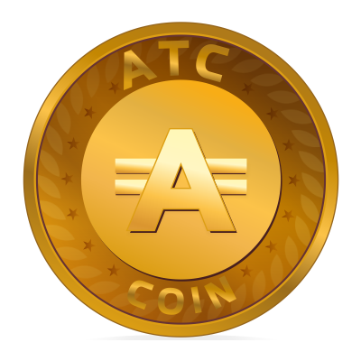 | 33818 | ATCC | ATC Coin |
| 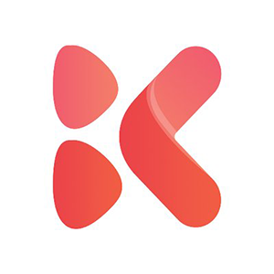 | 33835 | KUE | Kuende |
|  | 33669 | BTCL | BTC Lite |
| 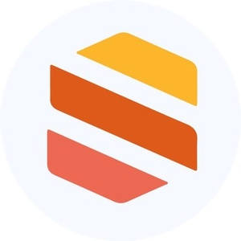 | 33035 | SEM | Semux |
| 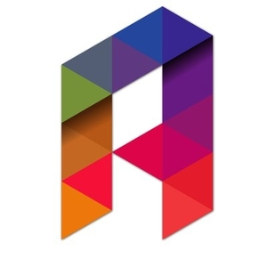 | 33316 | ABS | Absolute |
|  | 31227 | BBR | Boolberry |
|  | 64011 | EPRINT | EverPrinter |
|  | 63719 | PARAGON | Paragon Capital |
| 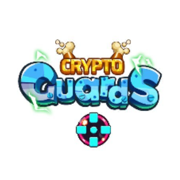 | 60169 | CGAR | CryptoGuards |
|  | 58483 | MS | Monster Slayer |
|  | 49669 | RISKMOON | Riskmoon |
|  | 65723 | GOTHAM | Gotham |
|  | 66427 | PTPA | Pumptopia |
|  | 57665 | CLAW | Cats Claw |
|  | 58837 | UNICAT | Unicat Token |
|  | 46627 | CP3R | Compounder |
| 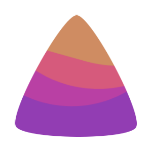 | 46714 | DEGOV | Degov |
| 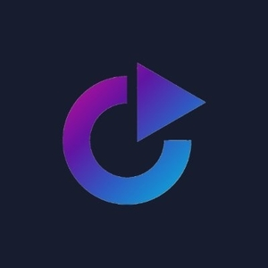 | 47661 | UNDG | UniDexGas |
|  | 47015 | UNL | Unilock.Network |
| 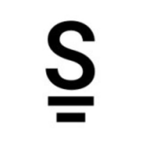 | 46209 | STBZ | Stabilize |
|  | 33809 | VNT | Vanta Network |
| 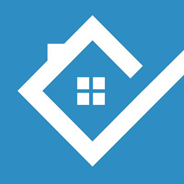 | 48073 | CPROP | CPROP |
| 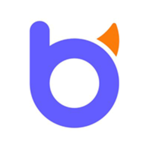 | 33839 | NNB | NNB Token |
| 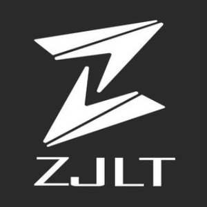 | 33370 | ZJLT | ZJLT Distributed Factoring Network |
|  | 59077 | METABEAN | MetaBean |
|  | 42608 | ALLBI | ALL BEST ICO |
|  | 66947 | OML | Omlira |
|  | 48005 | PSIX | ProperSix |
|  | 36639 | BRAVO | BravoCoin |
| 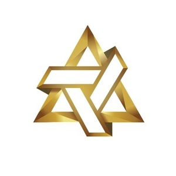 | 67725 | FORCE | MoonForce |
|  | 49879 | PFB | Penny For Bit |
|  | 62887 | POK | Pokmonsters |
|  | 44523 | CMCCOIN | CINE MEDIA CELEBRITY COIN |
| 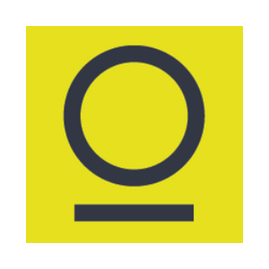 | 32926 | ECOM | Omnitude |
| 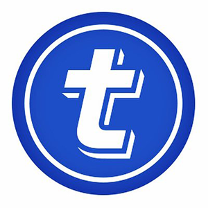 | 32358 | TPAY | TokenPay |
|  | 47621 | AVAL | Avaluse |
|  | 49605 | WTON | Wrapped TON Crystal |
|  | 47793 | BCVT | BitcoinVend |
| 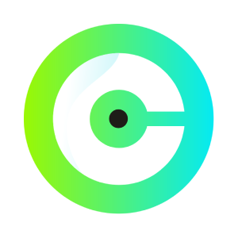 | 54033 | LKT | Locklet |
|  | 66671 | CBUCKS | CRYPTOBUCKS |
|  | 57821 | LYCA | Lyca Island |
|  | 46267 | BNZ | BonezYard |
| 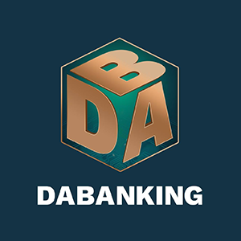 | 36606 | DAB | DABANKING |
|  | 33716 | VOCO | Provoco Token |
|  | 32934 | C2C | C2C System |
|  | 67883 | TWINU | TWINU |
| 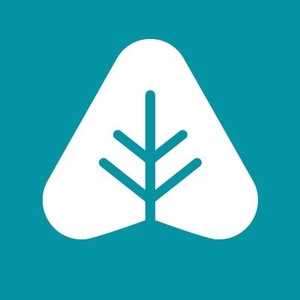 | 44970 | AZU | Azultec |
|  | 58361 | ZC | ZombieCake |
|  | 67837 | DRSL | Dr. Skull |
|  | 64975 | ROBOT | Robot |
|  | 57355 | BUNNYGIRL | BunnyGirl |
|  | 57413 | HYPERRISE | BNB Hyper Rise |
|  | 56251 | CSMC | Cosmic Music |
|  | 55063 | KRZ | Kranz Token |
| 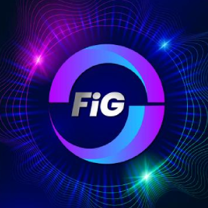 | 55607 | FIG | FlowCom |
|  | 54663 | FLRS | Flourish Coin |
|  | 54967 | ZCON | Zcon Protocol |
| 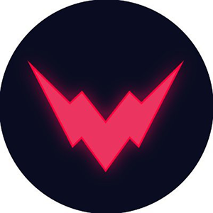 | 45442 | DZI | DeFinition Network |
|  | 36436 | WNL | WinStars.live |
|  | 34585 | VKT | Vankia Chain |
|  | 64211 | NOF | nOFTEN |
|  | 59865 | DW | Dawn Wars |
|  | 48207 | $KING | King Swap |
|  | 33437 | AUNIT | Aunite |
|  | 3029 | NSR | NuShares |
|  | 58525 | FLOKIZ | FlokiZap |
|  | 46989 | UOP | Utopia Genesis Foundation |
| 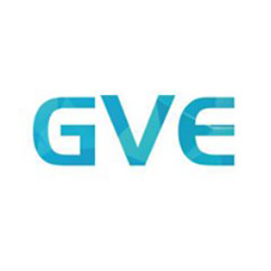 | 33098 | GVE | Globalvillage Ecosystem |
| 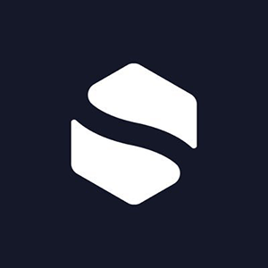 | 32430 | XSN | StakeNet |
| 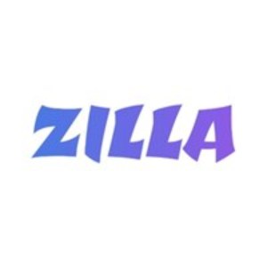 | 32489 | ZLA | Zilla |
|  | 54169 | WIZARD | WIZARD |
|  | 45415 | VESTA | Vesta |
|  | 48405 | BOLC | Boliecoin |
|  | 48319 | EC2 | Employment Coin |
|  | 46237 | KOEL | Koel Coin |
|  | 57521 | ROTTEN | Rotten Floki |
|  | 67083 | MSA | My Shiba Academia |
|  | 44593 | RTK | Ruletka |
|  | 57095 | UNIMOON | Unimoon |
|  | 64345 | $HEYSHIB | Hey Shiba |
|  | 32578 | NUKO | Nekonium |
| 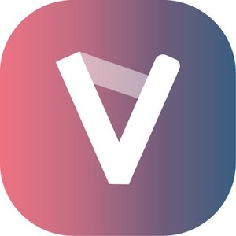 | 33777 | VLD | Vetri |
|  | 59103 | DOGEFANS | Fans of Doge |
|  | 58411 | CTRIBE | CoinTribe |
|  | 56073 | FFT | Futura Finance |
|  | 57839 | OAI | OMNI - People Driven |
|  | 44135 | TEO | Trust Ether ReOrigin |
|  | 42233 | EXOR | Exor |
| 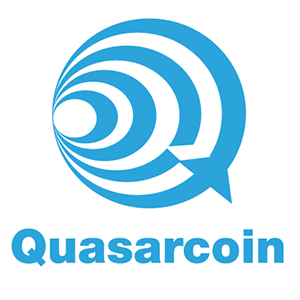 | 33576 | QAC | Quasarcoin |
| 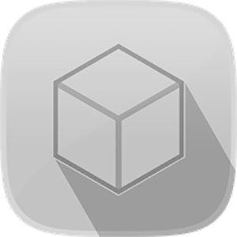 | 126 | SEQ | Sequence |
|  | 59307 | LUNI | Luni |
|  | 33018 | CFL | CryptoFlow |
| 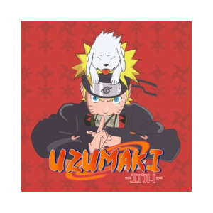 | 68515 | UZUMAKI | Uzumaki Inu |
|  | 57875 | THEROCKS | The Rocks |
| 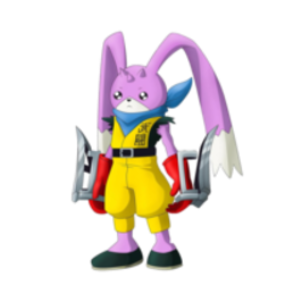 | 57899 | DRB | Dragon Battles |
|  | 64397 | NTXC | Toxic Game NFT |
|  | 59121 | HIPPIE | Hippie Inu |
|  | 59359 | ETGL | EternalGirl |
|  | 58431 | G2 | G2 Crypto Gaming & Lottery |
|  | 57345 | FLOM | Flokimars |
|  | 63641 | CRYB | Cryb |
|  | 58793 | SNIS | Shibonics |
|  | 58613 | HBUSD | HodlBUSD |
|  | 68299 | DOGE0 | DogeZero |
|  | 67787 | POWERINU | PowerInu |
|  | 64215 | SGTS | Sgt.SHIB |
|  | 62013 | MBMX | Metal Backed Money |
|  | 63895 | DOLLY | Dollypad Finance |
|  | 58957 | LANDI | LANDI Token |
|  | 60199 | DTK | DETIK |
|  | 58769 | SHIBACK | SHIBACK |
|  | 57331 | RAYONS | Rayons Energy |
|  | 57533 | FDOGE | First Doge Finance |
|  | 53651 | YETU | Yetucoin |
|  | 45911 | SMDX | SOMIDAX |
|  | 58885 | SHIBAMONK | Shiba Monk |
|  | 59867 | WGIRL | WhaleGirl |
|  | 56873 | KOROMARU | KOROMARU |
|  | 58201 | OLP | Olympia |
|  | 58339 | HADA | HodlADA |
| 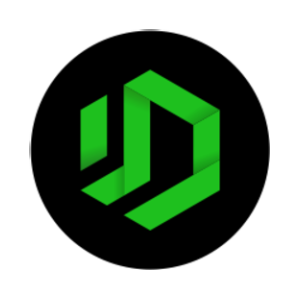 | 57985 | LDX | Londex |
|  | 58453 | HUNGRYDOGE | Hunger Doge |
|  | 55263 | C4G3 | Cage |
|  | 45397 | OBEE | Obee Network |
| 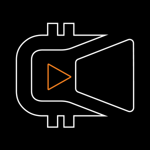 | 45171 | COM | Community Token |
|  | 49449 | OVI | Oviex |
| 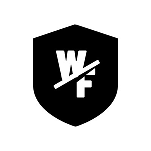 | 45636 | GLDR | GolderGames |
|  | 58505 | HUSKYX | HuskyX |
|  | 57339 | SMX | Somax |
|  | 59793 | DGW | Digiwill |
| 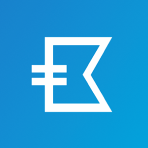 | 34635 | BAK | BaconCoin |
|  | 33619 | XSM | SpectrumCash |
|  | 58747 | SANTASHIB | Santa Shiba |
|  | 57995 | PXU | Phoenix Unity |
|  | 58137 | PROFIT | Profit Bls |
|  | 46790 | LTP | LifetionCoin |
| 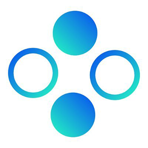 | 45053 | LID | Liquidity Dividends Protocol |
| 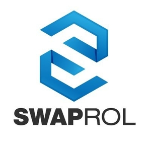 | 53553 | SWPRL | Swaprol |
|  | 54173 | XXT | XXT-Token |
|  | 48979 | LNCHX | LaunchX |
| 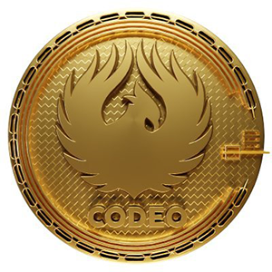 | 44442 | CODEO | CODEO TOKEN |
|  | 42591 | FLG | Folgory Coin |
| 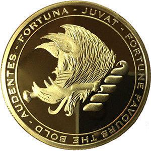 | 33364 | GFUN | GoldFund |
| 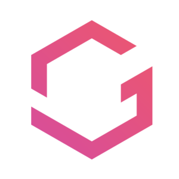 | 33275 | GFN | Game Fanz |
|  | 32432 | MWAT | Restart Energy MWAT |
|  | 61097 | NFTK | NFTWiki |
|  | 57219 | THUNDER | MiniThunder |
|  | 58963 | APEF | ApeFarmer |
|  | 58147 | HDOG | Husky Inu |
|  | 58259 | CFS | CryptoForSpeed |
|  | 58363 | ECCHI | Ecchi Coin |
|  | 49691 | HOGL | HOGL Finance |
|  | 57721 | FIAT | Floki Adventure |
|  | 57993 | WLVR | Wolverine |
| 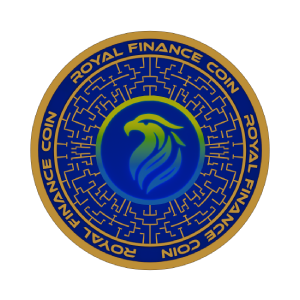 | 58645 | RFC | Royal Flush Coin |
|  | 45276 | YFIS | YFISCURITY |
|  | 32758 | NEC | Nectar |
|  | 58521 | BINOSAURS | Binosaurs |
|  | 45173 | FERA | Fera |
| 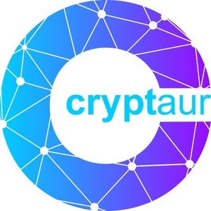 | 32236 | CPT | Cryptaur |
|  | 58079 | SLTN | Skylight |
|  | 54937 | XRI | XRoad Initiative |
|  | 63887 | WVSOL | Wrapped VSolidus |
|  | 58481 | ABAKE | AngryBakery |
|  | 46729 | MTI | MTI Finance |
|  | 46161 | YFIKING | YFIKING FINANCE |
|  | 33787 | GZRO | Gravity |
|  | 56781 | CARS | Crypto Cars World |
|  | 49943 | SVS | Silver Gateway |
|  | 33477 | ESBC | ESBC |
|  | 32986 | METM | MetaMorph |
| 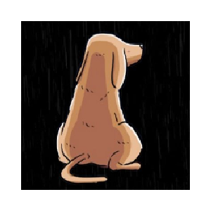 | 59087 | STRAY | Animal Token |
|  | 57303 | ISLAND | Island Doges |
|  | 45220 | LGV | Longevity |
|  | 44211 | TGCO | Thaler Group Company |
| 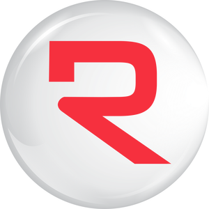 | 32953 | RLX | Relex |
|  | 54469 | PKMON | PolkaMonster |
|  | 34745 | MIC3 | Mousecoin |
|  | 45978 | KRG | Karaganda Token |
| 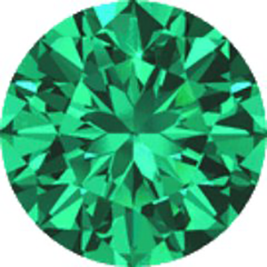 | 1533 | EMD | Emerald Crypto |
| 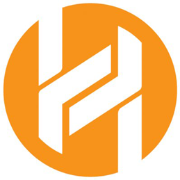 | 59999 | HBC | HBTC Captain Token |
|  | 45660 | TREEP | Treeptoken |
|  | 44957 | VCCO | Vera Cruz Coin |
|  | 55191 | PLENTYCOIN | PlentyCoin |
|  | 33330 | AGLT | AGROLOT |
|  | 33411 | LRM | LRM Coin |
|  | 32652 | BUBO | Budbo |
|  | 2966 | CVCOIN | CVCoin |
|  | 36434 | SPIKE | Spiking |
| 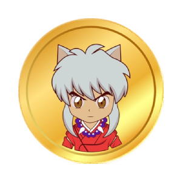 | 57349 | INUYASHA | Inuyasha |
|  | 57309 | KLAYG | KlayGames |
|  | 45474 | GSMT | Graf Token |
|  | 36501 | ALG | Algory |
| 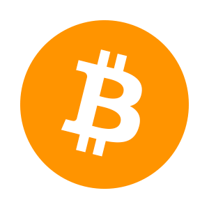 | 33537 | XBX | Bitex Global XBX Coin |
|  | 33803 | LML | Lisk Machine Learning |
| 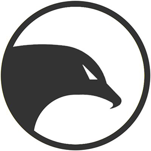 | 33061 | INB | Insight Chain |
|  | 2895 | XAS | Asch |
|  | 33784 | RSTR | Ondori |
| 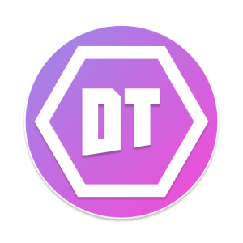 | 33514 | DT | Dragon Token |
| 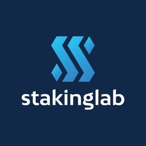 | 33465 | LABX | Stakinglab |
|  | 32755 | BMH | BlockMesh |
|  | 34631 | MRC | Meritcoins |
|  | 48079 | NIA | Nydronia |
|  | 44969 | INSTANTCOIN | INSTANTCOIN |
| 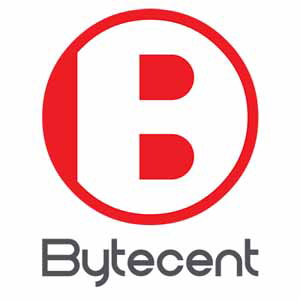 | 50 | BYC | Bytecent |
|  | 34749 | BGX | BitcoinGenX |
|  | 53679 | MELLO | Mello Token |
| 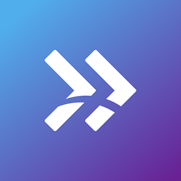 | 33860 | GOS | Gosama |
|  | 34388 | BXK | Bitbook Gambling |
| 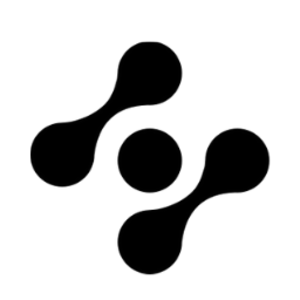 | 33454 | CRD | CryptalDash |
| 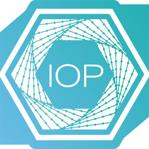 | 136 | IOP | Internet Of People |
| 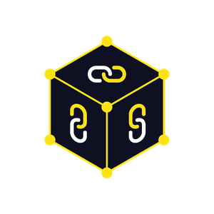 | 33711 | NAT | Natmin |
|  | 32773 | CMCT | Crowd Machine |
| 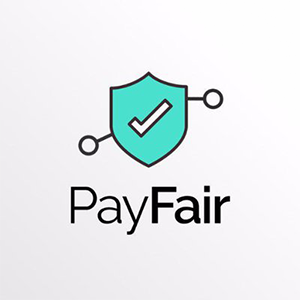 | 32460 | PFR | Payfair |
| 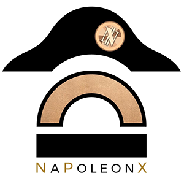 | 32488 | NPX | NaPoleonX |
| 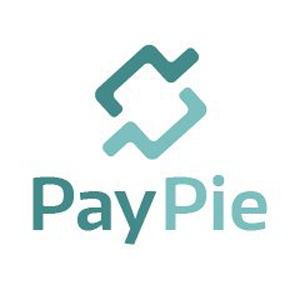 | 2820 | PPP | PayPie |
| 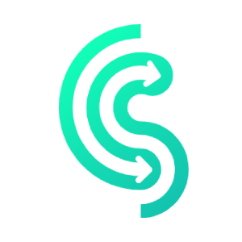 | 53993 | CSS | CoinSwap Space |
|  | 44951 | OAOT | OAOT |
| 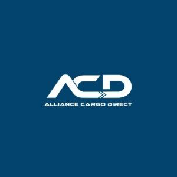 | 42092 | ACD | Alliance Cargo Direct |
|  | 33178 | NUG | Nuggets |
| 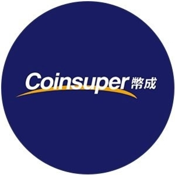 | 33230 | CEN | Coinsuper Ecosystem Network |
|  | 45623 | BADA | Bada |
| 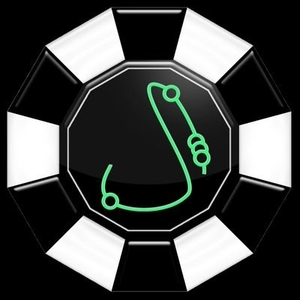 | 46026 | SPKL | SpokLottery |
|  | 36476 | KAOS | KAOSCANDY |
|  | 36471 | CGIZA | CryptoGuyInZA |
|  | 56169 | BLADE | BladeWarrior |
| 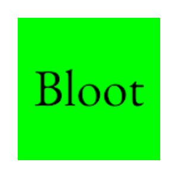 | 54927 | BGLD | Based Gold |
|  | 34559 | TOPB | TOPBTC Token |
| 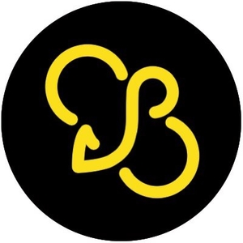 | 33826 | XSC | XSCoin |
| 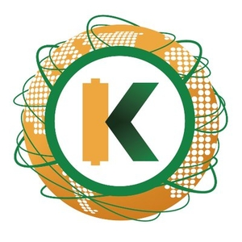 | 33220 | KWH | KWHCoin |
|  | 33571 | DAGT | Digital Asset Guarantee Token |
| 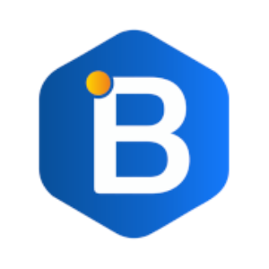 | 32544 | BEZ | Bezop |
|  | 55175 | OKFLY | Okex Fly |
|  | 33670 | MOX | MoX |
|  | 32826 | FSBT | Forty Seven Bank |
|  | 58843 | SHIBAMAKI | Shiba Maki |
|  | 58545 | MADR | Mad Rabbit |
|  | 54753 | DBALL | DrakeBall Token |
|  | 55049 | KILL | MemeKiller |
| 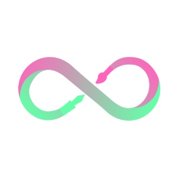 | 50611 | KALLY | Polkally |
|  | 34794 | VCO | Voucher Coin |
|  | 59937 | SMASH | Smash Cash |
| 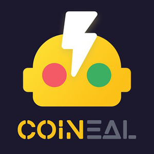 | 33854 | NEAL | Coineal Token |
|  | 45935 | AWX | AurusCOIN |
| 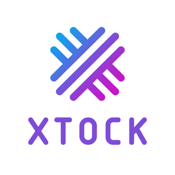 | 36595 | CUST | Custody Token |
|  | 32974 | BTK | Bitcoin Token |
|  | 32512 | HBZ | Helbiz |
|  | 2608 | PIRL | Pirl |
| 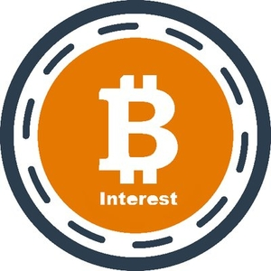 | 32615 | BCI | Bitcoin Interest |
| 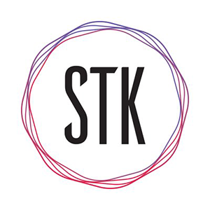 | 10737 | STK | STK |
|  | 54809 | DPACE | DefPace |
| 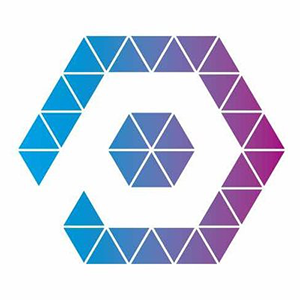 | 33416 | PTN | PalletOne |
|  | 36605 | LOT | Lukki Operating Token |
|  | 32979 | GIC | Giant |
| 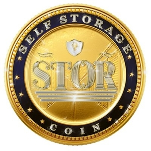 | 33247 | STOR | Self Storage Coin |
|  | 44968 | TRD | Tradecoin |
|  | 32584 | MOAC | MOAC |
|  | 3359 | ELLA | Ellaism |
|  | 54141 | DIAMONDS | Black Diamond |
|  | 34415 | OCUL | Oculor |
| 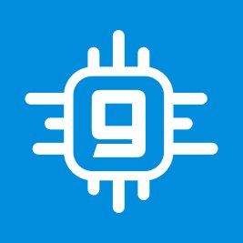 | 32723 | GIN | GINcoin |
|  | 44938 | AUCT | Auct Token |
|  | 32624 | AVH | Animation Vision Cash |
| 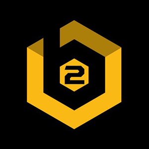 | 33775 | B2G | Bitcoiin |
| 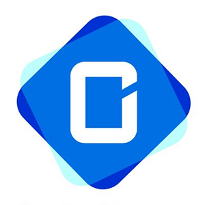 | 32800 | CONI | Coni |
|  | 44910 | TWM | TronWatchMarket |
|  | 33551 | INE | IntelliShare |
| 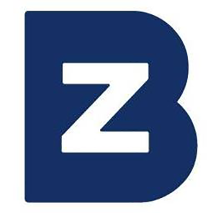 | 32836 | BZ | Bit-Z Token |
|  | 34573 | QOS | QOS Chain |
|  | 44920 | BRF | Bitrace Token |
|  | 33130 | VCT | ValueCyberToken |
|  | 33090 | EDS | Endorsit |
| 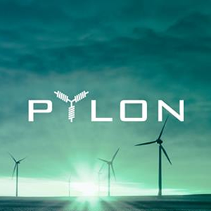 | 32546 | PYLNT | Pylon Network |
| 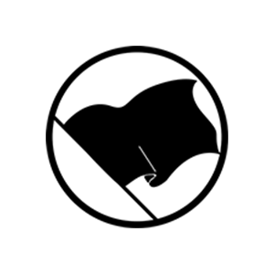 | 10978 | NKC | Nework |
|  | 36539 | CRAD | CRAD CASH |
|  | 34583 | IT | IDC Token |
|  | 32493 | ATN | ATN |
|  | 32449 | PARETO | Pareto Network |
|  | 44990 | BLVR | BELIEVER |
|  | 46470 | CCE | CloudCoin |
| 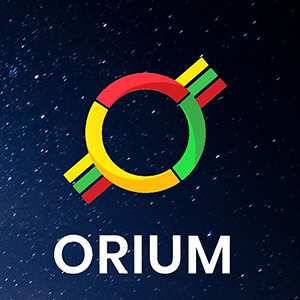 | 33286 | ORM | ORIUM |
|  | 33467 | DEEX | DEEX |
|  | 32613 | HLC | HalalChain |
| 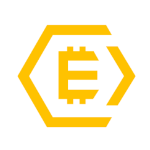 | 46466 | EXN | ExchangeN |
|  | 46504 | CRING | Darwinia Crab Network |
|  | 33652 | ONOT | ONOToken |
|  | 3908 | TEAM | TokenStars |
| 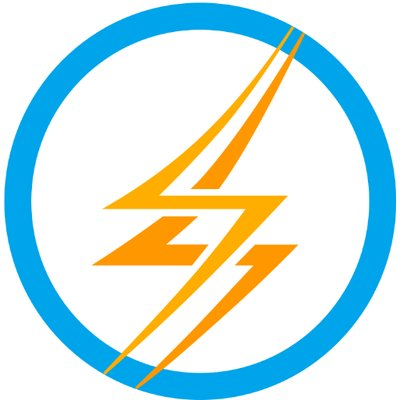 | 32241 | STORM | Storm |
| 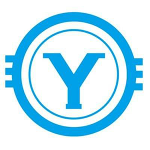 | 36450 | YTA | YottaChain |
|  | 32485 | IDXM | IDEX Membership |
|  | 46547 | STARK | Stark Chain |
|  | 209 | DCT | DECENT |
|  | 42842 | TPC | Trading Pool Coin |
| 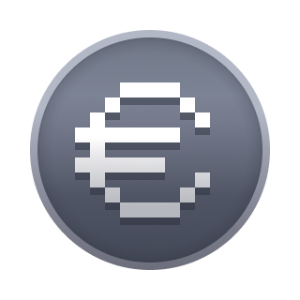 | 43040 | DEURO | DigitalEuro |
|  | 33502 | KKC | Kabberry Coin |
| 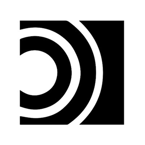 | 33594 | KUBO | KuboCoin |
|  | 33179 | MRI | Mirai |
|  | 3742 | VULC | Vulcano |
| 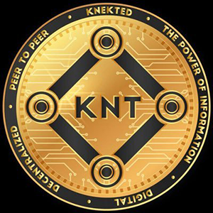 | 32941 | KNT | Kora Network Token |
| 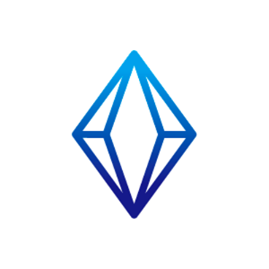 | 33719 | DEX | DEX |
| 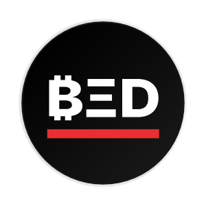 | 48025 | BED | Bit Ecological Digital |
|  | 33510 | SAC | Smart Application Chain |
| 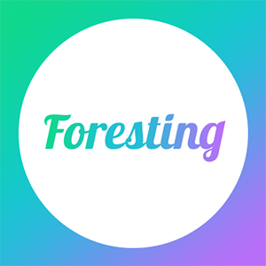 | 33732 | PTON | PTON |
|  | 33897 | SKT | SealBlock Token |
| 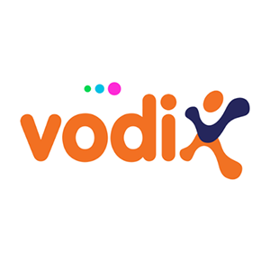 | 33918 | VDX | Vodi X |
|  | 36483 | HCA | Harcomia |
|  | 33848 | SPRK | Sparkster |
| 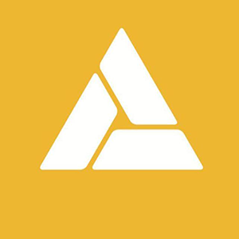 | 43046 | PMGT | Perth Mint Gold Token |
|  | 34557 | LX | LunarX |
|  | 34422 | EAC | EarthCoin |
|  | 45274 | GRAP | Grap Finance |
|  | 33377 | BRC | Baer Chain |
|  | 32628 | BBI | BelugaPay |
| 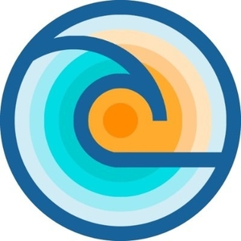 | 43077 | SURF | SurfExUtilityToken |
|  | 46469 | XUNI | UltraNote Infinity |
| 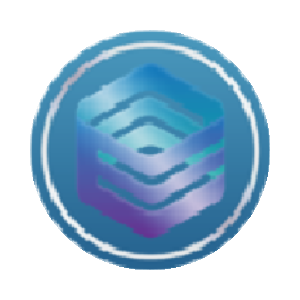 | 42232 | BEFX | Belifex |
| 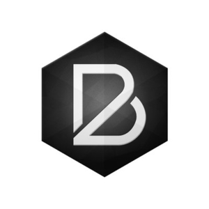 | 34485 | BPC | Bitpark Coin |
| 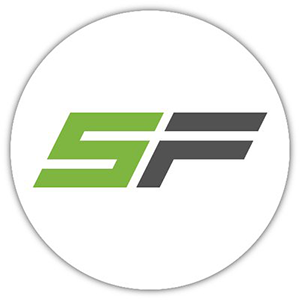 | 33905 | SFT | Safex Token |
| 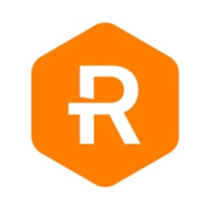 | 3638 | XRC | Rawcoin |
| 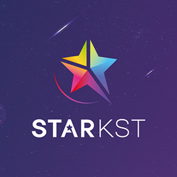 | 32596 | KST | StarCoin |
| 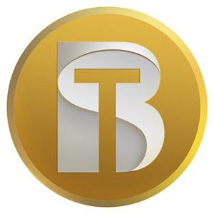 | 32597 | BSTN | BitStation |
|  | 45103 | XAMP | Antiample |
|  | 32907 | NPW | New Power Coin |
| 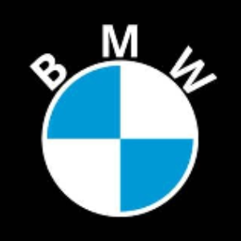 | 45629 | BMW | Make business the World |
| 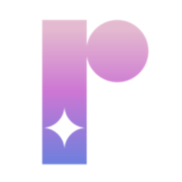 | 32734 | FND | FundRequest |
| 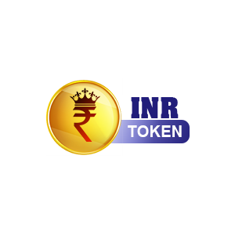 | 44680 | INRT | INRToken |
| 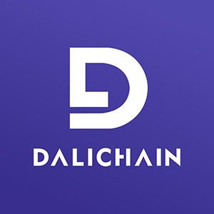 | 34547 | DALI | Dalichain |
|  | 10966 | SSC | SelfSell |
| 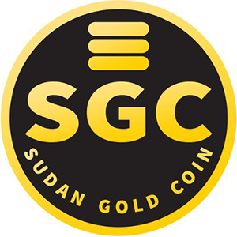 | 34628 | SGC | Stargram Coin |
| 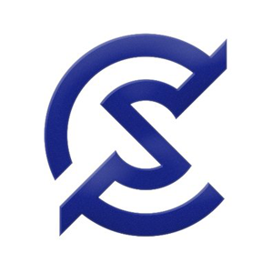 | 32303 | CMS | COMSA [ETH] |
|  | 36651 | MELT | Melt |
|  | 34510 | PMC | Primebank Coin |
|  | 34414 | CLM | Claymore |
|  | 36506 | ROI | ROI Coin |
| 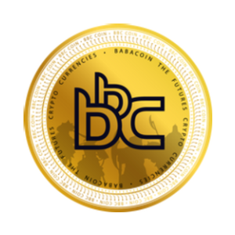 | 42513 | BAB | Basecoin |
|  | 34574 | GGC | GramGold Coin |
| 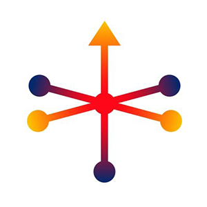 | 33852 | PHV | PATHHIVE  |
|  | 33899 | P2PX | P2P Global Network |
| 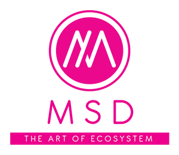 | 3702 | MSD | MSD |
| 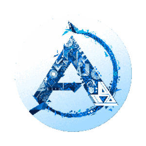 | 34649 | DCA | DCAex |
|  | 33504 | PYX | PyrexCoin |
|  | 33093 | ABDT | Atlantis Blue Digital Token |
|  | 34611 | BUC | Bit Union Coin |
|  | 32930 | LPC | Lightpaycoin |
| 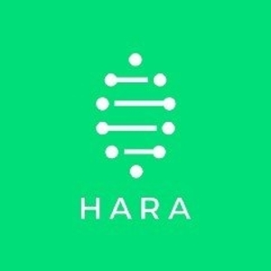 | 41985 | HART | Hara Token |
| 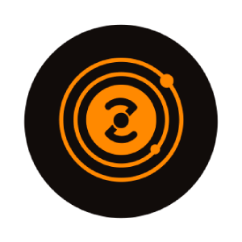 | 33358 | ZKS | ZKS |
| 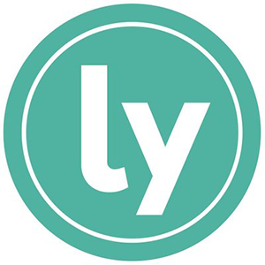 | 34683 | LYFE | Lyfe |
|  | 32978 | CCL | CYCLEAN |
| 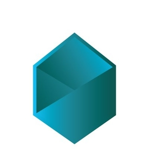 | 32632 | ECH | Etherecash |
| 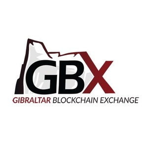 | 32377 | RKT | Rock |
| 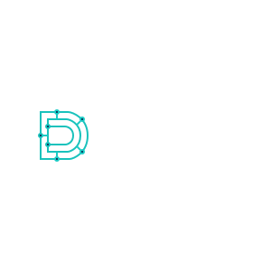 | 36339 | DKKT | DKK Token |
|  | 33598 | APOT | APOT |
|  | 33165 | HRC | Haracoin |
|  | 32256 | STN | Steneum Coin |
| 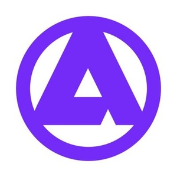 | 32504 | APH | Aphelion |
| 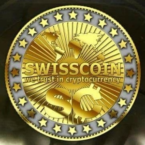 | 3683 | SIC | Swisscoin |
|  | 3915 | GOLF | Golfcoin |
|  | 2963 | BITCNY | bitCNY |
|  | 3672 | SSS | Sharechain |
| 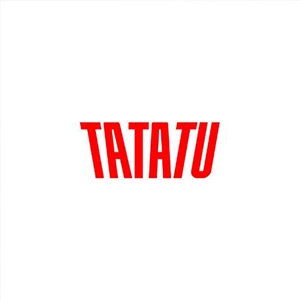 | 32802 | TTU | TaTaTu |

---

[← Prev](./list14.md)
