# Cryptocurrency list (page: 16)

[← Prev](./list15.md) | [Next →](./list17.md)

| Logo | ID | Symbol | Name |
|:----:|:--:|:------:|:-----|
|  | 15828 | MAGAP | MAGA PEPE ETH (magapepe.vip) |
|  | 15829 | CRYPTOJ | Crypto Journey |
| 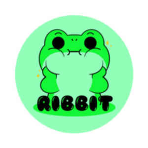 | 15830 | RIBB | Ribbit |
|  | 15831 | GAMET | GAME Token |
|  | 15832 | DSAI | DeSend Ai |
|  | 15833 | UXLINK | UXLINK |
| 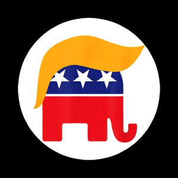 | 15834 | REPUBLICAN | Republican |
| 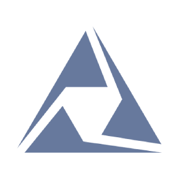 | 15835 | ATRS | Attarius Network |
| 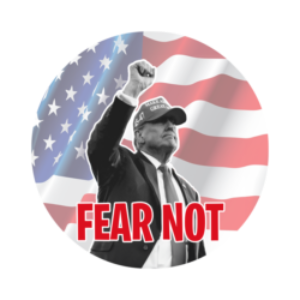 | 15836 | FEARNOT | FEAR NOT |
| 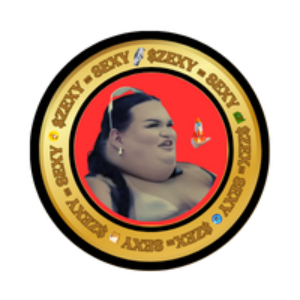 | 15837 | ZEXY | ZEXY |
| 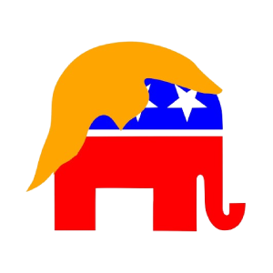 | 15838 | GOP | The Republican Party |
|  | 15839 | VANCE | JD Vance (jdvance.fun) |
| 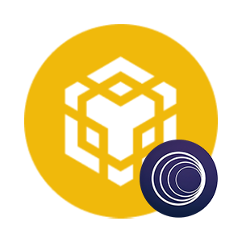 | 15840 | WWBNB | Wrapped BNB (Portal Bridge) |
| 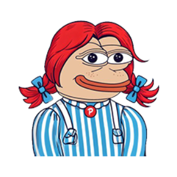 | 15841 | PENDY | Pendy |
| 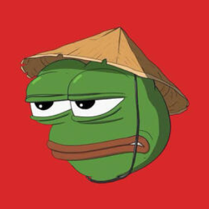 | 15842 | BEIBEI | Chinese BEIBEI |
| 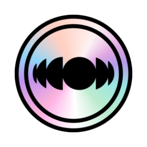 | 15843 | FLUI | Fluidity |
| 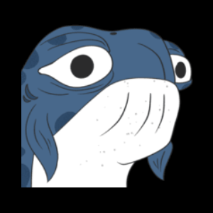 | 15844 | WHAL | WHALEBERT |
| 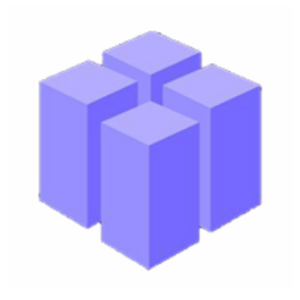 | 15845 | SNAC | SnackboxAI |
|  | 15846 | BABYS | Baby Slerf |
| 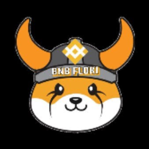 | 15847 | BNBFLOKI | BNB FLOKI |
| 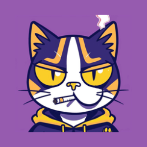 | 15848 | MEO | Meow Of Meme |
| 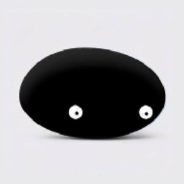 | 15849 | BLACKR | BLACK ROCK |
| 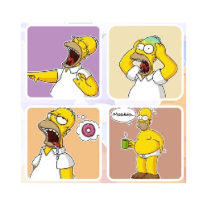 | 15850 | HOMERO | Homer Of Meme |
| 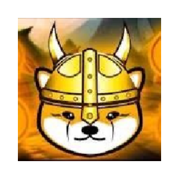 | 15852 | CRAZ | CRAZY FLOKI |
|  | 15853 | ALICEA | Alice AI |
| 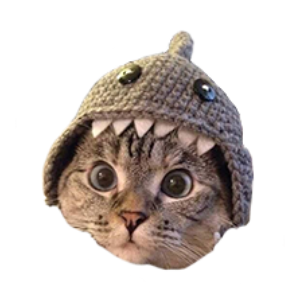 | 15854 | SHAR | Shark Cat |
|  | 15855 | BYT | ByteAI |
|  | 15856 | MBNB | Binance Coin (AnySwap) |
| 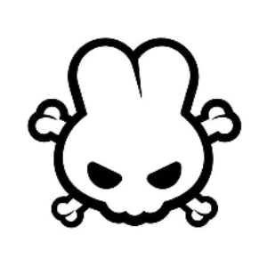 | 15857 | SQU | SquadSwap |
| 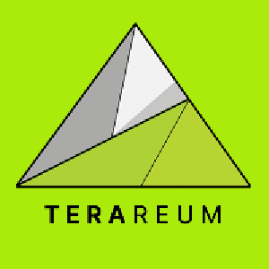 | 15858 | TERAV1 | Terareum v1 |
| 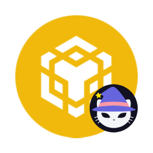 | 15859 | SBNB | Binance Coin (SpookySwap) |
| 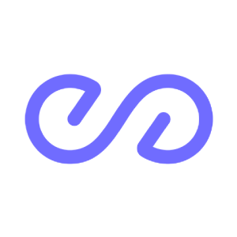 | 15860 | PEAQ | peaq |
| 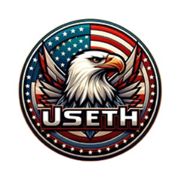 | 15861 | USETH | USETH |
|  | 15862 | TOUCHG | Touch Grass |
|  | 15863 | AUVERSE | AuroraVerse |
| 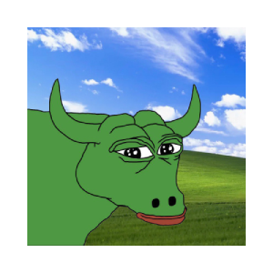 | 15864 | BEEF | PepeBull |
| 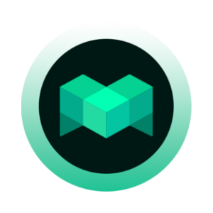 | 15865 | BMTC | Metabit |
|  | 15866 | TORSY | TORSY |
| 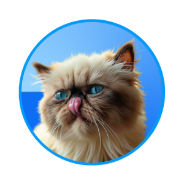 | 15867 | MIGGLES | Mr Miggles |
| 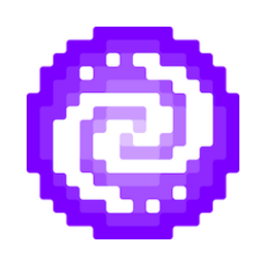 | 15868 | PIXFI | Pixelverse |
| 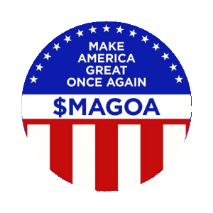 | 15869 | MAGOA | Make America Great Once Again |
| 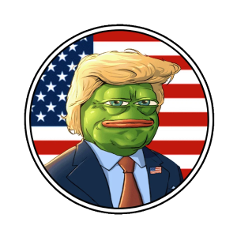 | 15870 | PEGAMAGA | Pepe Maga |
| 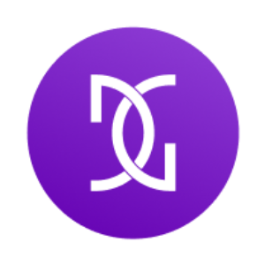 | 15871 | DGTA | Digitra.com Token |
| 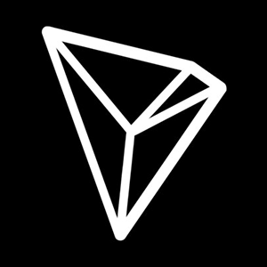 | 15872 | TRXV1 | Tronix v1 |
| 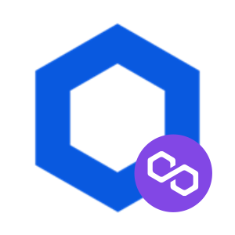 | 15873 | PLINK | Chainlink (Polygon Portal) |
| 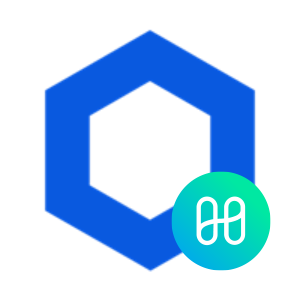 | 15874 | HLINK | Chainlink (Harmony One Bridge) |
| 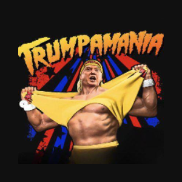 | 15875 | TRUMPAMANIA | TRUMPAMANIA |
| 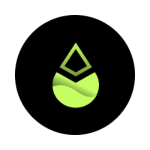 | 15876 | PZETH | pzETH |
| 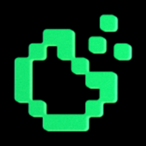 | 15877 | COOKIE | Cookie |
| 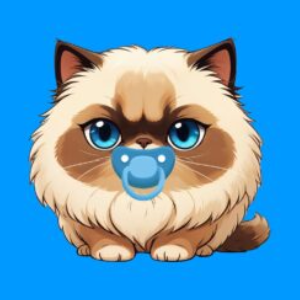 | 15878 | BABYMIGGLES | Baby Miggles |
| 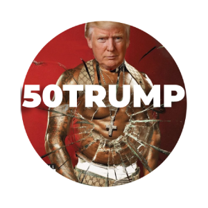 | 15879 | 50TRUMP | 50TRUMP |
| 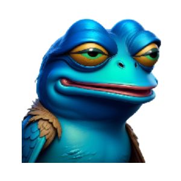 | 15880 | PEBIRD | PEPE BIRD |
| 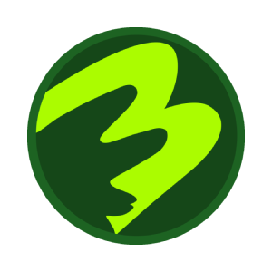 | 15881 | BORPA | Borpa |
|  | 15883 | WYN | Wynn |
|  | 15884 | MAGAN | Maganomics On Solana |
| 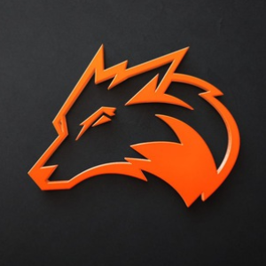 | 15885 | FOXI | Foxify |
| 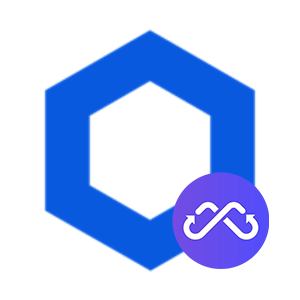 | 15886 | MCLINK | Chainlink (Multichain Bridge) |
| 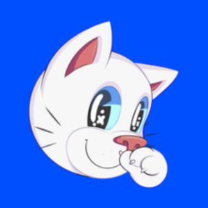 | 15887 | PURRC | Purrcoin |
|  | 15888 | HAR | Harambe Coin |
| 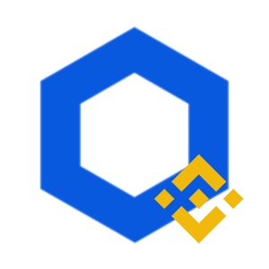 | 15889 | BPLINK | Binance-Peg Chainlink (Binance Bridge) |
| 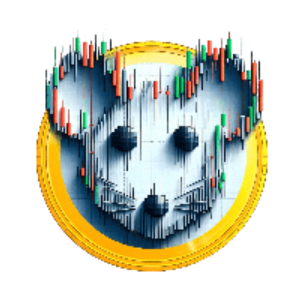 | 15890 | MICK | Mickey Meme |
| 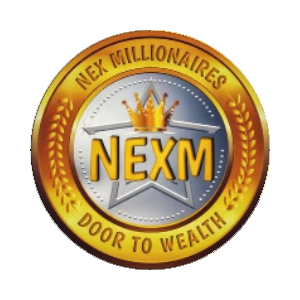 | 15891 | NEXMI | NexMillionaires |
| 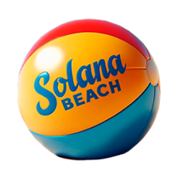 | 15892 | SOLAN | Solana Beach |
| 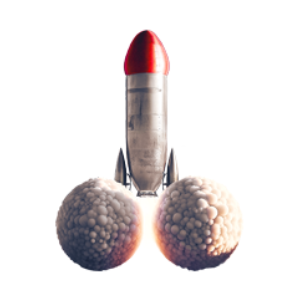 | 15893 | JUS | Just The Tip |
| 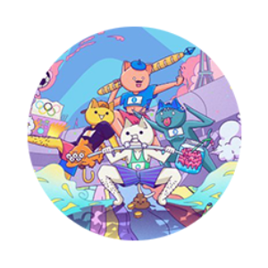 | 15894 | SOLYMPICS | Solympics |
| 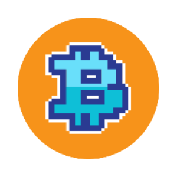 | 15895 | PUMPBTC | pumpBTC |
|  | 15896 | MILKBAG | MILKBAG |
|  | 15897 | A8 | Ancient8 |
|  | 15898 | GIRLS | Girls Club |
|  | 15899 | FIGHTPEPE | FIGHT PEPE |
|  | 15900 | LOCKIN | LOCK IN |
|  | 15901 | CARL | Carl |
|  | 15902 | DOPA | DopaMeme |
|  | 15903 | VALU | Value |
|  | 15904 | DTRUMP | Degen Trump |
|  | 15905 | RIZZ | Rizz |
|  | 15906 | WXM | WeatherXM |
|  | 15907 | DELON | Dark Elon |
|  | 15908 | NFM | NFMart |
|  | 15909 | BILLY | Billy (billysol.lol) |
|  | 15910 | ANDYB | AndyBlast (andyonblast.io) |
|  | 15911 | MONGY | Mongy |
|  | 15912 | SHC | School Hack Coin |
|  | 15913 | WIFCAT | WIFCAT COIN |
|  | 15914 | CATSC | Catscoin |
|  | 15915 | ABLINK | Chainlink (Arbitrum Bridge) |
|  | 15916 | MG8 | Megalink |
|  | 15917 | CATSO | Cats Of Sol |
|  | 15918 | FISHK | Fishkoin |
|  | 15919 | HPLINK | Heco-Peg LINK Token (Heco chain bridge) |
|  | 15920 | TOMC | TOM CAT |
|  | 15921 | LPM | Love Power Market |
|  | 15922 | BANKA | Bank AI |
|  | 15923 | TOPCA | TOP CAT |
|  | 15924 | BPBCH | Binance-Peg Bitcoin Cash (Binance Bridge) |
|  | 15925 | JUIC | Juice |
|  | 15926 | WORL | World Record Banana |
|  | 15927 | EBCH | Bitcoin Cash (Energiswap) |
|  | 15928 | CHUD | Chudjak |
|  | 15930 | STEAMX | Steam Exchange |
|  | 15932 | FU | FU Money |
|  | 15933 | TRUMPS | Trump SOL |
|  | 15934 | COSMICN | Cosmic Network |
|  | 15935 | GHDV1 | Giftedhands v1 |
|  | 15936 | AKIT | Akita Inu |
|  | 15937 | DOGW | DOGWIFHOOD |
|  | 15938 | MEVETH | mevETH |
|  | 15939 | MOONI | MOON INU |
|  | 15940 | BPNEAR | Binance-Peg NEAR Protocol |
|  | 15941 | ENEAR | Near (Energiswap) |
|  | 15942 | RNEAR | Near (Rainbow Bridge) |
|  | 15943 | SVETH | Savvy ETH |
|  | 15944 | KRAV | Krav |
|  | 15945 | MBID | myBID |
|  | 15946 | NSTR | Nostra |
|  | 15947 | ZUN | Zunami Governance Token |
|  | 15948 | PIRATECASHV1 | PirateCash v1 (PirateCash Telegram bot) |
|  | 15949 | GUZUTA | CLYDE |
|  | 15950 | BABYPEIPEI | Baby PeiPei |
|  | 15951 | KLY | Klayr |
|  | 15952 | PUGGY | PUGGY Coin |
|  | 15953 | QTDAO | Quantum DAO |
|  | 15955 | HAWKPTAH | Hawk Ptah |
|  | 15956 | SHU | Shutter |
|  | 15957 | QGOV | Q Protocol |
|  | 15958 | KAMALAHARRIS | KAMALA HARRIS |
|  | 15959 | BALN | Balanced |
|  | 15960 | TWIGGY | Twiggy |
|  | 15961 | MISTE | Mister Miggles |
|  | 15962 | KAMALA | Kamala Harris |
|  | 15963 | BOD | Book of Donald Trump |
|  | 15964 | HOOPS | Hoops |
|  | 15965 | FROK | Frok.ai |
|  | 15966 | PRXYV1 | Proxy v1 |
|  | 15967 | DIGITS | Digits DAO |
|  | 15968 | BLUSD | Boosted LUSD |
|  | 15969 | DABCAT | Dabcat |
|  | 15970 | PAO | South Pao |
|  | 15971 | APEPE | Ape and Pepe |
|  | 15972 | AVAIL | Avail |
|  | 15973 | MOTH | MOTH |
|  | 15974 | NSTK | Unstake |
|  | 15975 | CATSV1 | CatCoin Token v1 |
|  | 15976 | DOGEPEPE | Doge Pepe |
|  | 15977 | REALP | Real Pepe |
|  | 15978 | NEVE | NEVER SURRENDER |
|  | 15979 | KITE | Kite |
|  | 15980 | ATHENA | Athena DexFi |
|  | 15981 | AVEN | Aventis AI |
|  | 15982 | SHIBON | SHIB ON SOLANA |
|  | 15983 | MANIFEST | Manifest |
|  | 15984 | APEXA | Apex AI |
|  | 15985 | SCOTT | Scottish |
|  | 15986 | DETO | Delta Exchange |
|  | 15987 | RYD | RYderOSHI |
|  | 15988 | NTMPI | Neutaro |
|  | 15989 | HAMSTER | Space Hamster |
|  | 15990 | IXO | IXO |
|  | 15991 | BADA | Bad Alien Division |
|  | 15992 | LAWO | Law Of Attraction |
|  | 15993 | DOGBA | DOGBA INU |
|  | 15994 | SIM | Simpson |
|  | 15995 | CRYPTOT | Crypto Trump |
|  | 15996 | BABYG | BabyGME |
|  | 15997 | BAKEDB | Baked Beans Token |
|  | 15998 | TWIF | Tomwifhat |
|  | 15999 | LRDS | BLOCKLORDS |
|  | 16000 | SONOF | Son of Solana |
|  | 16001 | MATTER | AntiMatter |
|  | 16002 | THOLA | Tholana |
|  | 16003 | PLEA | Plearn |
|  | 16004 | MXD | Denarius |
|  | 16005 | GODEX | GUARD OF DECENT |
|  | 16006 | BUYT | Buy the DIP |
|  | 16007 | BERF | BERF |
|  | 16008 | MOONB | Moon Base |
|  | 16009 | LYA | Huralya |
|  | 16010 | TORCH | Hercules Token |
|  | 16011 | HSUSDC | Holdstation USDC |
|  | 16012 | CXT | Covalent X Token |
|  | 16013 | NILE | Nile |
|  | 16014 | LEGION | LEGION |
|  | 16015 | GOOG | Googly Cat |
|  | 16016 | CIRX | Circular Protocol |
|  | 16017 | LUNARLENS | Lunarlens |
|  | 16018 | IJZV1 | iinjaz v1 |
|  | 16019 | JVT | JVault |
|  | 16020 | HEHE | hehe |
|  | 16021 | GURU | Guru Network |
|  | 16022 | PRRR | Cats Are Liquidity |
|  | 16023 | NCOIN | NatronZ |
|  | 16025 | POUW | Pouwifhat |
|  | 16026 | ZKL | zkLink |
|  | 16027 | MINEA | Mine AI |
|  | 16028 | ZORRO | Zorro |
|  | 16029 | RINGA | Ring AI |
|  | 16030 | FAM | Family |
|  | 16031 | REDTH | Red The Mal |
|  | 16032 | SUPERF | SUPER FLOKI |
|  | 16033 | PIRATECASHV2 | PirateCash v2 (PirateCash Telegram bot) |
|  | 16035 | SOLP | SolPets |
|  | 16036 | ZRPY | Zerpaay |
|  | 16037 | ZRS | Zaros |
|  | 16038 | BONKW | bonkwifhat |
|  | 16039 | YYOLO | yYOLO |
|  | 16040 | YNETH | YieldNest Restaked ETH |
|  | 16041 | WEL | Welsh Corgi |
|  | 16042 | SNEED | Sneed |
|  | 16043 | PRIN | Print The Pepe |
|  | 16044 | DANJ | Danjuan Cat |
|  | 16045 | MLEO | LEO Token (Multichain Bridge) |
|  | 16046 | YPRISMA | Yearn yPRISMA |
|  | 16047 | YVYFI | YFI yVault |
|  | 16048 | PUL | PulseTrailerPark |
|  | 16049 | PARAD | Paradox |
|  | 16050 | STAN | Stank Memes |
|  | 16051 | ANYLTC | ANY Litecoin (AnySwap) |
|  | 16052 | YEARN | YearnTogether |
|  | 16053 | PALE | Palette |
|  | 16054 | WTONCOIN | Wrapped The Open Network (Toncoin Bridge) |
|  | 16055 | Y24 | Yield 24 |
|  | 16056 | BASEDR | Based Rabbit |
|  | 16057 | TANUPAD | Tanuki Launchpad |
|  | 16058 | LAFFIN | Laffin Kamala |
|  | 16059 | VNST | VNST Stablecoin |
|  | 16060 | USPEPE | American pepe |
|  | 16061 | GIGACAT | GIGACAT |
|  | 16062 | NEIROLOL | Neiro (neiro.lol) |
|  | 16063 | NPCS | Non-Playable Coin Solana |
|  | 16064 | PARRY | Parry Parrot |
|  | 16065 | SKBDI | Skibidi Toilet |
|  | 16066 | KAMA | Kamala Horris |
|  | 16067 | NEIROLIVE | Neiro (neiro.live) |
|  | 16068 | WANK | Wojak The Wanker |
|  | 16069 | BPADA | Binance-Peg Cardano (Binance Bridge) |
|  | 16070 | TADDY | DADDY TRUMP |
|  | 16071 | SCF | Smoking Chicken Fish (smokingchickenfish.xyz) |
|  | 16072 | MIGGLEI | Migglei |
|  | 16073 | PAYD | PAYD |
|  | 16074 | PHRYGES | The Phryges |
|  | 16075 | BROKE | Broke Again |
|  | 16076 | PUPPET | Puppet |
|  | 16077 | BULLISH | bullish |
|  | 16078 | MAVAX | Avalanche (Multichain Bridge) |
|  | 16079 | BRAINLET | Brainlet |
|  | 16080 | PEPE2024 | Olympic Pepe 2024 |
|  | 16081 | BABYNEIRO | Baby Neiro (babyneiro2024.xyz) |
|  | 16082 | THEB | The Boys Club |
|  | 16083 | FLAKY | FLAKY |
|  | 16084 | SBCH | Smart Bitcoin Cash |
|  | 16085 | BPAVAX | Binance-Peg Avalanche (Binance Bridge) |
|  | 16087 | SBAVAX | Avalanche (Synapse Bridge) |
|  | 16088 | BPSHIB | Binance-Peg Shiba Inu (Binance Bridge) |
|  | 16089 | MXNB | MXNB |
|  | 16090 | SPARKLET | Upland |
|  | 16091 | FOMO | FOMO BULL CLUB |
|  | 16092 | EBSHIB | Shiba Inu (Energi Bridge) |
|  | 16093 | ALBE | ALBETROS |
|  | 16094 | AMER | America |
|  | 16095 | RAR | Rare Pepe |
|  | 16096 | NEWP | New Peon |
|  | 16097 | HARPER | Harper |
|  | 16098 | WSHIB | Wrapped Shiba Inu (Portal Bridge) |
|  | 16099 | HAW | Hawk Tuah |
|  | 16100 | ALA | Alanyaspor Fan Token |
|  | 16101 | DINOS | Dinosaur Inu |
|  | 16102 | BABYD | Baby Dragon |
|  | 16103 | SOLOR | Solordi |
|  | 16104 | ELOND | ELON DOGE |
|  | 16105 | WWMATIC | Wrapped Polygon (Portal Bridge) |
|  | 16106 | ARIT | ArithFi |
|  | 16107 | BABYMU | Baby Musk |
|  | 16109 | RICHR | RichRabbit |
|  | 16110 | SILL | Silly Duck |
|  | 16111 | EMATIC | Polygon (Energi Bridge) |
|  | 16112 | MMATIC | Polygon (Multichain Bridge) |
|  | 16113 | BNBE | BNBEE |
|  | 16114 | OPTIM | Optimus X |
|  | 16115 | ALLC | All Crypto Mechanics |
|  | 16116 | WPAW | Wrapped PAW |
|  | 16117 | NEIROCOIN | Neiro Ethereum (neirocoin.com) |
|  | 16118 | YOUNES | YOUNES |
|  | 16120 | AJUN | Ajuna Network |
|  | 16121 | PAXE | Paxe |
|  | 16122 | BILLI | Billi |
|  | 16123 | SDME | SDME |
|  | 16124 | BTCNOW | Blockchain Technology Co. |
|  | 16125 | WWRY | WeWillRugYou |
|  | 16126 | BUTT | Buttercat |
|  | 16127 | JANI | JANI |
|  | 16128 | DOAI | DOJO Protocol |
|  | 16129 | ZCD | ZChains |
|  | 16130 | KEM | Kem Jeng Un |
|  | 16131 | KETCOIN | KET (ketcoin.vip) |
|  | 16132 | RECORD | Music Protocol |
|  | 16133 | BABYBI | Baby Bitcoin |
|  | 16134 | FIGH | FIGHT FIGHT FIGHT |
|  | 16135 | HILO | HILO |
|  | 16136 | BLUEW | Blue Whale |
|  | 16137 | CATW | Cat wif Hands |
|  | 16138 | SUPERBONK | SUPER BONK (superbonktoken.xyz) |
|  | 16140 | PANDAS | Panda Swap |
|  | 16141 | DUCKC | DuckCoin |
|  | 16142 | APOL | Apollo FTW |
|  | 16143 | ANYETH2 | Ethereum (AnySwap) |
|  | 16144 | ANYETH3 | Ethereum (AnySwap) |
|  | 16145 | GCCO | GCCOIN |
|  | 16146 | ASMO | AS Monaco Fan Token |
|  | 16147 | MINIP | MiniPepe Coin |
|  | 16148 | WALLI | WALLi |
|  | 16149 | JUST | just a cat |
|  | 16150 | ANYETH | ANY Ethereum (AnySwap) |
|  | 16151 | CAP | CAPYBARA |
|  | 16152 | BENI | Beni |
|  | 16153 | ROSEW | RoseWifHat |
|  | 16154 | SELFIEC | Selfie Cat |
|  | 16155 | FWOG | Fwog (fwogsol.xyz) |
|  | 16156 | BABYC | Baby Cat |
|  | 16157 | L3 | Layer3 |
|  | 16158 | MNEE | MNEE USD Stablecoin |
|  | 16159 | CLOA | Cloak |
|  | 16160 | CATINU | CAT INU |
|  | 16161 | STRA | STRAY |
|  | 16162 | CATDOG | Cat-Dog |
|  | 16163 | QUAC | QUACK |
|  | 16164 | THAPT | Thala APT |
|  | 16165 | DOLLAR | Dollar |
|  | 16166 | USDL | Lift Dollar |
|  | 16167 | DOGE2 | Dogecoin 2.0 |
|  | 16168 | FIGHTMAGA | FIGHT MAGA |
|  | 16169 | CAMT | CAMELL |
|  | 16170 | TD | The Big Red |
|  | 16171 | MOXIE | Moxie |
|  | 16172 | PIERRE | sacré bleu |
|  | 16173 | GORPLE | GorplesCoin |
|  | 16174 | ASTROO | Astroon |
|  | 16175 | NUTC | Nutcash |
|  | 16176 | GREE | Green God Candle |
|  | 16178 | CES | swap.coffee |
|  | 16179 | IFBTC | Ignition FBTC |
|  | 16180 | SOLT | Soltalk AI |
|  | 16181 | GINNAN | Ginnan The Cat |
|  | 16182 | TOUR | Tour Billion |
|  | 16183 | LRT | LandRocker |
|  | 16184 | BOPB | BIOPOP |
|  | 16185 | BOOS | Boost Trump Campaign |
|  | 16186 | PWETH | Wrapped Ether (Polygon Portal) |
|  | 16187 | SIMPS | Simpson MAGA |
|  | 16188 | ULTR | ULTRA MAGA |
|  | 16189 | BBCH | Binance Wrapped BCH (Binance Bridge) |
|  | 16190 | WWETH | Wrapped Ether (Portal Bridge) |
|  | 16191 | COO | Cool Cats MILK |
|  | 16192 | CRYPTOAI | CryptoAI |
|  | 16193 | DOPEC | DOPE Coin |
|  | 16194 | AGIL | Agility LSD |
|  | 16195 | NEXG | NexGami |
|  | 16196 | PEPECO | PEPE COIN BSC |
|  | 16197 | ELONMU | Elon Musk |
|  | 16199 | OOFP | OOFP |
|  | 16200 | BTE | Betero |
|  | 16201 | G | Gravity |
|  | 16202 | SNIBBU | Snibbu The Crab |
|  | 16203 | YAWN | YAWN |
|  | 16204 | JUM | Jumoney |
|  | 16205 | SIGMA | SIGMA |
|  | 16206 | IRO | Iro-Chan |
|  | 16207 | CRI | Criptodólar |
|  | 16208 | BOBOT | Bobo The Bear |
|  | 16209 | CATEC | Cate Coin |
|  | 16211 | XROCK | xRocket |
|  | 16213 | CWETH | Wrapped Ether (Cronos Bridge) |
|  | 16214 | PURR | Purr |
|  | 16215 | HARRIS | KAMALA HARRIS |
|  | 16216 | COAI | CodeMong Ai |
|  | 16217 | GOCHU | Gochujangcoin |
|  | 16218 | AVACN | AVACOIN |
|  | 16219 | SBWETH | Wrapped Ether (Synapse Bridge) |
|  | 16220 | BTRFLYV1 | Redacted v1 |
|  | 16221 | RYO | RYO Coin |
|  | 16222 | MAG | Magnify Cash |
|  | 16223 | ITO | Ito-chan |
|  | 16224 | ONIG | Onigiri |
|  | 16225 | ONIGIRI | Onigiri The Cat |
|  | 16226 | GRNV1 | GRN Grid v1 |
|  | 16227 | BWETH | Wrapped Ether (Base - SuperChain Bridge) |
|  | 16228 | GOLDS | Gold Standard |
|  | 16229 | FROSTY | Frosty the Polar Bear |
|  | 16230 | MOYA | MOYA |
|  | 16231 | SHIBEINU | Shibe Inu (shibeinu.io) |
|  | 16232 | BAOBAO | BaoBao |
|  | 16233 | DMAGA | Dark MAGA |
|  | 16234 | TALAHON | Talahon |
|  | 16235 | ANDYBNB | Andy (andybnb.vip) |
|  | 16236 | LOAFCAT | LOAFCAT |
|  | 16237 | BTEV1 | Betero v1 |
|  | 16238 | YAFA | Free Palestine |
|  | 16239 | OWETH | Wrapped Ether (Optimism - SuperChain Bridge) |
|  | 16240 | JLY | Jellyverse |
|  | 16241 | REGI | Resistance Girl |
|  | 16242 | AIRIAN | AIRian |
|  | 16243 | PACK | HashPack |
|  | 16244 | CHITAN | Chitan |
|  | 16245 | CHIB | Chiba Inu |
|  | 16246 | SYNTE | Synternet |
|  | 16247 | KEN | Ken |
|  | 16248 | RIZO | HahaYes |
|  | 16249 | AAVEE | AAVE (Avalanche Bridge) |
|  | 16250 | NOTC | NOT |
|  | 16251 | WETHT | Wrapped Ethereum (wbtc.network) |
|  | 16252 | SILVERSTAND | Silver Standard |
|  | 16253 | MOGT | MOG TRUMP |
|  | 16254 | HARRISV | Harris V Trump |
|  | 16255 | TALA | Baby Tala |
|  | 16256 | GRAM | Gram |
|  | 16257 | WMETIS | Wrapped Metis |
|  | 16258 | ROUTEV1 | Router Protocol |
|  | 16259 | ALN | Aluna |
|  | 16260 | SHOG | SHOG |
|  | 16261 | NFTFI | NFTfi |
|  | 16262 | NOTECANTO | Note |
|  | 16263 | UE | UE Coin |
|  | 16264 | MAX | Matr1x |
|  | 16265 | ALNV1 | Aluna v1 |
|  | 16266 | MPAA | MPAA |
|  | 16267 | WSH | White Yorkshire |
|  | 16268 | N64 | N64 |
|  | 16269 | SLOTHA | Slothana |
|  | 16270 | YUSUF | Yusuf Dikec Meme |
|  | 16271 | MINDC | MindCoin |
|  | 16272 | CBUSDT | Tether (Cronos Bridge) |
|  | 16273 | WIFC | dogwifceo |
|  | 16274 | BOOM | Boomco |
|  | 16275 | OUSDT | Tether (Optimism - SuperChain Bridge) |
|  | 16276 | MUSDT | Tether (Multichain Bridge) |
|  | 16278 | KITEAI | KITEAI |
|  | 16279 | PUSDC | USD Coin (Polygon Portal) |
|  | 16280 | MUSDC | USD Coin (Multichain Bridge) |
|  | 16281 | KITTY | Roaring Kitt |
|  | 16282 | JHH | Jen-Hsun Huang |
|  | 16283 | TVS | TVS |
|  | 16284 | ACL | Auction Light |
|  | 16285 | POPEPE | POPEPE |
|  | 16286 | DODOT | Dodo the Black Swan |
|  | 16287 | BILL | Bill the Bear |
|  | 16288 | FUSDT | Frapped USDT |
|  | 16289 | WHY | WHY |
|  | 16290 | GOODM | Good Morning! |
|  | 16291 | BAKEDTOKEN | Baked |
|  | 16292 | KRAZYKAMALA | KRAZY KAMALA |
|  | 16293 | SKX | SKPANAX |
|  | 16294 | GEF | GemFlow |
|  | 16295 | DCE | Decentra Ecosystem |
|  | 16296 | XGD | X Gold |
|  | 16297 | HYD | HYDRA |
|  | 16298 | WILDCOIN | WILDCOIN |
|  | 16299 | WFDP | WFDP |
|  | 16300 | WEND | Wellnode |
|  | 16301 | TRUMPM | TRUMP MAGA PRESIDENT (magatrumptoken.xyz) |
|  | 16302 | DYNOC | DynoChain |
|  | 16303 | WENIS | WenisCoin |
|  | 16304 | WHC | Whales Club |
|  | 16305 | WHAT | What the Duck |
|  | 16306 | PINS | PINs Network Token |
|  | 16307 | UMM | UMM |
|  | 16308 | SSOL | Solayer SOL |
|  | 16309 | VXR | Vox Royale |
|  | 16310 | BSC | BSC Layer |
|  | 16311 | KITTYINUV1 | Kitty Inu v1 |
|  | 16312 | PEPEOFSOL | Pepe of Solana |
|  | 16313 | GODCAT | GodcatExplodingKittens |
|  | 16314 | POP | Popcoin |
|  | 16315 | ONCH | OnchainPoints.xyz |
|  | 16316 | PODFAST | PodFast |
|  | 16317 | THISISF | This is Fine |
|  | 16318 | WBC | WorldBrain Coin |
|  | 16319 | ASTRO | Astroport |
|  | 16320 | DINERO | Dinero |
|  | 16321 | JSET | Jsetcoin |
|  | 16322 | COCONUT | Coconut |
|  | 16323 | ADOG | America Dog |
|  | 16324 | BALL | Game 5 BALL |
|  | 16325 | ALV1 | ArchLoot v1 |
|  | 16326 | MARU | Maru Dog |
|  | 16327 | MOOBIFI | Staked BIFI |
|  | 16328 | ARTMETIS | Staked Metis Token |
|  | 16329 | STKD | Stkd SCRT |
|  | 16330 | METAVE | Metaverse Convergence |
|  | 16331 | STRONGSOL | Stronghold Staked SOL |
|  | 16332 | ARKYS | Arky Satoshi's Dog |
|  | 16334 | SIMPSO | Simpson Neiro |
|  | 16335 | POOKU | Pooku |
|  | 16336 | NOMNOM | nomnom |
|  | 16337 | HACK | HACK |
|  | 16338 | BABYHARRIS | Baby Harris |
|  | 16339 | BPUSDC | Binance-Peg USD Coin (Binance Bridge) |
|  | 16340 | AGC | Argocoin |
|  | 16341 | CATLIFE | Cat Life |
|  | 16342 | ABUSDC | USD Coin (Arbitrum Bridge) |
|  | 16343 | KAMAL | Kamala Harris |
|  | 16344 | ETHEREUMMEME | Solana Ethereum Meme |
|  | 16345 | BLOGGE | Bloggercube |
|  | 16346 | NOBLE | Noble |
|  | 16347 | CATC | Cat Coin |
|  | 16348 | HEALT | Healthmedi |
|  | 16349 | FIST | Fistbump |
|  | 16350 | JOEB | Joe Biden |
|  | 16351 | DARKT | Dark Trump |
|  | 16352 | REVAL | RevaLink Wallet Token |
|  | 16353 | USDCSO | USD Coin (From Solana - Portal Bridge) |
|  | 16354 | JOKERERC | Joker |
|  | 16355 | SOLTR | SolTrump |
|  | 16356 | SIUU | SIUUU |
|  | 16357 | TOPGP | TOP G PEPE |
|  | 16358 | SPARTAD | SpartaDex |
|  | 16359 | PHRYG | PHRYGES |
|  | 16360 | NUTZ | NUTZ |
|  | 16361 | SOLANAP | Solana Poker |
|  | 16362 | HAMSTERB | HamsterBase |
|  | 16363 | USDCET | USD Coin (From Ethereum - Portal Bridge) |
|  | 16364 | USDCBS | USD Coin (From BSC - Portal Bridge) |
|  | 16365 | USDCPO | USD Coin (PoS) (From Polygon - Portal Bridge) |
|  | 16366 | USDCAV | USD Coin (From Avalanche - Portal Bridge) |
|  | 16367 | USDCEAV | USD.e Coin (From Polygon - Portal Bridge) |
|  | 16368 | BLOCKF | Block Farm Club |
|  | 16369 | BPDOGE | Binance-Peg Dogecoin (Binance Bridge) |
|  | 16370 | BPMATIC | Binance-Peg Polygon (Binance Bridge - Delisted) |
|  | 16371 | STATOK | STA |
|  | 16372 | GORGONZOLAV1 | Heroes 3 Foundation v1 |
|  | 16373 | DOGEZILLAV1 | DogeZilla v1 |
|  | 16374 | NCN | NeurochainAI |
|  | 16375 | LTRBTV1 | Little Rabbit v1 |
|  | 16376 | PANDE | Pande |
|  | 16377 | 99BTC | 99 Bitcoins |
|  | 16378 | NIQAB | NIQAB WORLD ORDER |
|  | 16379 | GOMAV1 | GOMA Finance v1 |
|  | 16380 | RTR | Restore The Republic |
|  | 16381 | GOMAV2 | GOMA Finance v2 |
|  | 16382 | DMCK | Diamond Castle |
|  | 16383 | THETAN | Thetan Coin |
|  | 16384 | DIK | DikDok |
|  | 16385 | MEGAX | Megahex |
|  | 16386 | POOPC | Poopcoin |
|  | 16387 | PIKAM | Pikamoon |
|  | 16388 | SOLXD | Solxdex |
|  | 16389 | SAFEM | SAFEMOON SOLANA |
|  | 16390 | GIMMER | Gimmer |
|  | 16391 | MUNI | Uniswap Protocol Token (Multichain Bridge) |
|  | 16392 | CRAZYB | Crazy Bunny |
|  | 16393 | ORDIN | ORDINAL HODL MEME |
|  | 16394 | LONGM | Long Mao |
|  | 16395 | GEMI | Gemini Inu |
|  | 16396 | PUNI | Uniswap Protocol Token (Polygon Portal) |
|  | 16397 | INSPI | InspireAI |
|  | 16398 | BPUNI | Binance-Peg Uniswap Protocol Token (Binance Bridge) |
|  | 16399 | UNIE | Uniswap Protocol Token (Avalanche Bridge)  |
|  | 16400 | BRAT | Peak Brat |
|  | 16401 | CCDS | CCDS INTERNATIONAL |
|  | 16402 | INVITE | INVITE Token |
|  | 16403 | WALL | Du Rove's Wall |
|  | 16404 | USD0 | Usual |
|  | 16405 | PEPEBSC | Pepe Coin |
|  | 16406 | TOSHKIN | Toshkin Coin |
|  | 16407 | USBT | Universal Blockchain |
|  | 16408 | GMRV1 | GAMER v1 |
|  | 16409 | TIDDIES | TIDDIES |
|  | 16410 | CIG | cig |
|  | 16411 | CHATAI | ChatAI Token |
|  | 16412 | GMRV2 | GAMER v2 |
|  | 16413 | SMKNG | SmonkeyKong |
|  | 16414 | ZAZA | ZAZA |
|  | 16415 | BABYP | BabyPepe |
|  | 16416 | BEMC | BemChain |
|  | 16417 | GIMMERV1 | Gimmer v1 |
|  | 16418 | RINGF | Ring Financial |
|  | 16419 | BCVB | BCV Blue Chip |
|  | 16420 | CBP | CashBackPro |
|  | 16421 | BNBV1 | Binance Coin (Original ERC-20 Version) |
|  | 16422 | BCV | BitCapitalVendor |
|  | 16423 | AQUAGOATV1 | Aqua Goat v1 |
|  | 16424 | BLUEG | Blue Guy |
|  | 16425 | CGAR | CryptoGuards |
|  | 16426 | ARCTICCOIN | ArcticCoin |
|  | 16427 | NEKOARC | Neko Arc |
|  | 16428 | PEGA | PEGA |
|  | 16429 | CLOW | Clown Pepe |
|  | 16430 | DER | Deri Trade |
|  | 16431 | FREET | FreeTrump |
|  | 16432 | GLO | Global Innovation Platform |
|  | 16433 | BOGD | Bogdanoff |
|  | 16434 | ABUNI | Uniswap Protocol Token (Arbitrum Bridge) |
|  | 16435 | SAIY | Saiyan PEPE |
|  | 16436 | SOLAREU | Solareum |
|  | 16437 | RAINCO | Rain Coin |
|  | 16438 | BMWUKONG | Black Myth WuKong |
|  | 16439 | HEM | Hemera |
|  | 16440 | GONG | GONG |
|  | 16441 | OWO | SoMon |
|  | 16442 | BATO | Batonex Token |
|  | 16443 | CODE | Code Token |
|  | 16444 | GUA | GUA |
|  | 16445 | ZYGO | Zygo the frog |
|  | 16446 | GOU | Gou |
|  | 16447 | SATO | Atsuko Sato |
|  | 16448 | KOLT | Kolt |
|  | 16449 | MAOW | MAOW |
|  | 16450 | EURR | StablR Euro |
|  | 16451 | AGETH | Kelp Gain |
|  | 16452 | FNS | FAUNUS |
|  | 16453 | COLON | Colon |
|  | 16454 | SUNDOG | SUNDOG |
|  | 16455 | EGL | The Eagle Of Truth |
|  | 16456 | DLCBTC | DLC.Link |
|  | 16457 | BPTRX | Binance-Peg Tron (Binance Bridge - Delisted) |
|  | 16458 | BABYME | Baby Meme Coin |
|  | 16459 | FTTT | FTT Token |
|  | 16460 | SHITC | Shitcoin |
|  | 16461 | ETHEREM | Etherempires |
|  | 16462 | BTRX | Tron (BitTorrent Bridge) |
|  | 16463 | VENTU | Venture Coin |
|  | 16464 | COINM | CoinMarketPrime |
|  | 16465 | BLOCKB | Block Browser |
|  | 16466 | PICKL | PICKLE |
|  | 16467 | TIPC | Tipcoin |
|  | 16468 | NEWSL | Newsly |
|  | 16469 | MAGN | Magnate Finance |
|  | 16470 | ALPHAG | Alpha Gardeners |
|  | 16471 | BNSV1 | BNS token v1 |
|  | 16472 | CBBCOMMUNITY | cbBTC |
|  | 16473 | SUNPEPE | sunpepe |
|  | 16474 | ZDC | Zodiacs |
|  | 16475 | OMZ | Open Meta City |
|  | 16476 | ZDCV2 | ZodiacsV2 |
|  | 16477 | BOJIV1 | BOJI Token v1 |
|  | 16478 | FFTP | FIGHT FOR THE PEOPLE |
|  | 16479 | KADYROV | Ramzan |
|  | 16480 | DAYOFR | Day Of Rights |
|  | 16481 | BLET | Brainlet |
|  | 16482 | DPOOL | Deadpool Inu |
|  | 16483 | MOGP | MOG PEPE |
|  | 16484 | LABUBU | Labubu |
|  | 16485 | TRANSFER | TransferCoin |
|  | 16486 | MCA | Mcashchain |
|  | 16487 | SEA | StarSharks SEA |
|  | 16488 | CRYPTOS | CryptoSoul |
|  | 16489 | KEYS | KEYS |
|  | 16490 | ARTIF | Artificial Intelligence |
|  | 16491 | CENTA | Centaurify |
|  | 16492 | METACA | MetaCash |
|  | 16493 | UNDE | Undead Finance |
|  | 16494 | FREEDOM | Freedom Protocol Token |
|  | 16495 | METAD | MetaDoge |
|  | 16496 | BPBTT | Binance-Peg BitTorrent |
|  | 16497 | EUD | Eurodom |
|  | 16498 | WALE | Waletoken |
|  | 16499 | ABUL | Abulaba |
|  | 16500 | ORACOLXOR | Oracolxor |
|  | 16501 | STAB | STABLE ASSET |
|  | 16502 | NIFTY | Nifty Wizards Dust |
|  | 16503 | BPLTC | Binance-Peg Litecoin |
|  | 16504 | CTFT | Coin To Fish |
|  | 16505 | JBO | JBOX |
|  | 16506 | OCPR | OC Protocol |
|  | 16507 | ECXX | ECXX |
|  | 16508 | QTCC | Quick Transfer coin |
|  | 16509 | ZOOC | ZOO Crypto World |
|  | 16510 | PDAI | Dai (Polygon Portal) |
|  | 16511 | BPDAI | Binance-Peg Dai (Binance Bridge) |
|  | 16512 | CRYPTER | Crypteriumcoin |
|  | 16513 | MCDAI | Dai (Multichain Bridge) |
|  | 16514 | SPORE | Spore |
|  | 16515 | DAIE | Dai (Avalanche Bridge) |
|  | 16516 | ORKL | Orakler |
|  | 16517 | ODAI | Dai (Optimism - SuperChain Bridge) |
|  | 16518 | PROTEIN | Protein |
|  | 16519 | CBDAI | Dai (Cronos Bridge) |
|  | 16520 | TIEDAN | TieDan |
|  | 16521 | WUKONG | Sun Wukong |
|  | 16522 | ANDYSOL | Andy on SOL (andytokonsolana.com) |
|  | 16523 | XNET | XNET Mobile |
|  | 16524 | SNAKE | snake |
|  | 16525 | 4WIN | 4TRUMP |
|  | 16526 | WDAI | Dai (Portal Bridge) |
|  | 16527 | QUBY | Quby |
|  | 16528 | NEBNB | Neuro BNB |
|  | 16529 | BILLYBSC | BILLY (billybsc.lol) |
|  | 16530 | SCT | SuperCells |
|  | 16531 | VATO | vanitis |
|  | 16532 | TRONP | Donald Tronp |
|  | 16533 | SUNJAK | Sunjak |
|  | 16534 | MUNSUN | MUNSUN |
|  | 16535 | DDMT | Dongdaemun Token |
|  | 16536 | SUNWUKONG | SunWukong |
|  | 16537 | DEPA | Department Of Government Efficiency |
|  | 16538 | AB1INCH | 1inch (Arbitrum Bridge) |
|  | 16539 | OB1INCH | 1INCH Token on xDai (OmniBridge) |
|  | 16540 | BINANCEDOG | Binancedog |
|  | 16541 | EBULL | ETHEREUM IS GOOD |
|  | 16542 | O1INCH | 1inch (Optimism - SuperChain Bridge) |
|  | 16543 | 1INCHE | 1inch (Avalanche Bridge) |
|  | 16544 | TROGE | Troge |
|  | 16545 | SUNLION | SUNLION |
|  | 16546 | E1INCH | 1inch (Energi Bridge) |
|  | 16547 | SOLBO | SolBoss |
|  | 16548 | SWIF | SUNwifHat |
|  | 16549 | BLASTUP | BlastUP |
|  | 16550 | CHEESE | Cheese |
|  | 16551 | RBUNNY | Rocket Bunny |
|  | 16552 | PGN | Paragon |
|  | 16553 | BUNNY | Pancake Bunny |
|  | 16554 | PINK | PINK - The Panther |
|  | 16555 | POPE | PopPepe |
|  | 16556 | POE | Portal Network |
|  | 16557 | PAN | Pankito |
|  | 16558 | TIGER | TIGER |
|  | 16559 | FUKU | FUKU-KUN |
|  | 16560 | BONESV1 | Squirrel Finance |
|  | 16561 | NUTS | Thetanuts Finance |
|  | 16562 | RBXDEFI | RBX |
|  | 16563 | AUSD | AUSD |
|  | 16564 | USSD | Autonomous Secure Dollar |
|  | 16565 | HRSE | The Winners Circle |
|  | 16566 | MIRAI | MIRAI |
|  | 16567 | IVFUN | Invest Zone |
|  | 16568 | CRVE | Curve DAO Token (Avalanche Bridge) |
|  | 16569 | FASTAI | Fast And Ai |
|  | 16570 | 1AXS | Axie Infinity Shards (Harmony One Bridge) |
|  | 16571 | WAXS | Axie Infinity Shards (Portal Bridge) |
|  | 16572 | PUCCA | PUCCA |
|  | 16573 | ETHDOG | Ethereumdog |
|  | 16574 | OBCRV | Curve DAO Token on xDai (OmniBridge) |
|  | 16575 | SR30 | SatsRush |
|  | 16576 | ABCRV | Curve DAO Token (Arbitrum Bridge) |
|  | 16577 | SUNGOU | Sungou |
|  | 16578 | KONET | KONET |
|  | 16579 | BFM | BenefitMine |
|  | 16580 | FUELX | Fuel |
|  | 16581 | MFTM | Fantom (Multichain Bridge) |
|  | 16582 | PSUSHI | Sushi (Polygon Portal) |
|  | 16583 | P1INCH | 1inch (Polygon Portal) |
|  | 16584 | W1INCH | 1inch (Portal Bridge) |
|  | 16585 | BUFFI | Bufficorn |
|  | 16586 | PHEX | HEX (Polygon Portal) |
|  | 16587 | ORDER | Orderly Network |
|  | 16588 | AXON | AxonDAO Governance Token |
|  | 16589 | PMKR | Maker (Polygon Portal) |
|  | 16590 | DUROV | FREE DUROV |
|  | 16591 | BPFTM | Fantom (Binance Bridge) |
|  | 16592 | REBD | REBORN |
|  | 16593 | RREN | REN (Rainbow Bridge) |
|  | 16594 | RSUSHI | Sushi (Rainbow Bridge) |
|  | 16595 | DOCCOM | DOC.COM |
|  | 16596 | OUNI | Uniswap (Optimism - SuperChain Bridge) |
|  | 16597 | MTC | Matrix Chain |
|  | 16598 | MSUSHI | Sushi (Multichain Bridge) |
|  | 16599 | CATCOIN | CatCoin |
|  | 16600 | WUNI | Uniswap Protocol Token (Portal Bridge) |
|  | 16601 | OBUNI | Uniswap on xDai (OmniBridge) |
|  | 16602 | OSUSHI | Sushi (Optimism - SuperChain Bridge) |
|  | 16603 | OBSUSHI | SushiToken on xDai (OmniBridge) |
|  | 16604 | PLAY | Play Token |
|  | 16605 | HPUNI | Heco-Peg Uniswap Protocol Token (Heco chain bridge) |
|  | 16606 | HPFTT | Heco-Peg FTT Token (Heco chain bridge) |
|  | 16607 | ABSUSHI | Sushi (Arbitrum Bridge) |
|  | 16608 | HPGRT | Heco-Peg GRT Token (Heco chain bridge) |
|  | 16609 | BPVET | Binance-Peg VeChain (Binance Bridge) |
|  | 16610 | HPMKR | Heco-Peg MKR Token (Heco chain bridge) |
|  | 16611 | OBYFI | yearn.finance on xDai (OmniBridge) |
|  | 16612 | HPCOMP | Heco-Peg COMP Token (Heco chain bridge) |
|  | 16613 | HPUMA | Heco-Peg UMA Token (Heco chain bridge) |
|  | 16614 | HPNEXO | Heco-Peg NEXO Token (Heco chain bridge) |
|  | 16615 | HPREN | Heco-Peg REN Token (Heco chain bridge) |
|  | 16616 | HPZRX | Heco-Peg ZRX Token (Heco chain bridge) |
|  | 16617 | HPBAT | Heco-Peg BAT Token (Heco chain bridge) |
|  | 16618 | HPOMG | Heco-Peg OMG Token (Heco chain bridge) |
|  | 16619 | HPBNT | Heco-Peg BNT Token (Heco chain bridge) |
|  | 16620 | HPMATIC | Heco-Peg MATIC Token (Heco chain bridge) |
|  | 16621 | HPZKS | Heco-Peg ZKS Token (Heco chain bridge) |
|  | 16622 | ESUSHI | Sushi (Energi Bridge) |
|  | 16623 | HP1INCH | Heco-Peg 1INCH Token (Heco chain bridge) |
|  | 16624 | HPNPXS | Heco-Peg NPXS Token (Heco chain bridge) |
|  | 16625 | HPCRV | Heco-Peg CRV Token (Heco chain bridge) |
|  | 16626 | HPHOT | Heco-Peg HOT Token (Heco chain bridge) |
|  | 16627 | SUSHIE | Sushi (Avalanche Bridge) |
|  | 16628 | HPRSR | Heco-Peg RSR Token (Heco chain bridge) |
|  | 16629 | HPMANA | Heco-Peg MANA Token (Heco chain bridge) |
|  | 16630 | HPACH | Heco-Peg ACH Token (Heco chain bridge) |
|  | 16631 | SUSHIEV1 | Sushi (Deprecated Avalanche Ethereum Bridge) |
|  | 16632 | HPMX | Heco-Peg MX Token (Heco chain bridge) |
|  | 16633 | HPYCC | Heco-Peg YCC Token (Heco chain bridge) |
|  | 16634 | WSUSHI | Sushi (Portal Bridge) |
|  | 16635 | BPSUSHI | Sushi (Binance Bridge) |
|  | 16636 | HPBETH | Heco-Peg BETH Token (Heco chain bridge) |
|  | 16637 | HPUSDT | Heco-Peg USDT Token (Heco chain bridge) |
|  | 16638 | HPHBTC | Heco-Peg HBTC Token (Heco chain bridge) |
|  | 16640 | MCRV | Curve DAO Token (Multichain Bridge) |
|  | 16641 | HBCH | Huobi BCH |
|  | 16642 | HDOT | Huobi DOT |
|  | 16644 | HBSV | Huobi BSV |
|  | 16645 | HLTC | Huobi LTC |
|  | 16646 | ECRV | Curve DAO Token (Energi Bridge) |
|  | 16647 | HXTZ | Huobi XTZ |
|  | 16648 | PCRV | Curve DAO Token (Polygon Portal) |
|  | 16649 | BPATOM | Binance-Peg Cosmos (Binance Bridge) |
|  | 16650 | ALPHAE | AlphaToken (Avalanche Bridge) |
|  | 16651 | CATOM | Cosmos |
|  | 16652 | EATOM | Cosmos (Energiswap) |
|  | 16654 | BATE | Basic Attention Token (Avalanche Bridge) |
|  | 16655 | BUSDE | Binance USD (Avalanche Bridge) |
|  | 16656 | COMPE | Compound Governance Token (Avalanche Bridge) |
|  | 16657 | BPAXS | Binance-Peg Axie Infinity Shards (Binance Bridge) |
|  | 16658 | OAAVE | Aave (Optimism - SuperChain Bridge) |
|  | 16659 | ABAAVE | Aave (Arbitrum Bridge) |
|  | 16660 | HAAVE | Aave (Harmony One Bridge) |
|  | 16661 | 1AAVE | Aave (Harmony One Bridge - Depegged Token) |
|  | 16662 | PAAVE | Aave (Polygon Portal) |
|  | 16663 | EAXS | Axie Infinity Shard (Energi Bridge) |
|  | 16664 | GRTE | The Graph (Avalanche Bridge) |
|  | 16665 | INFRAE | Bware (Avalanche Bridge) |
|  | 16666 | LINKE | Chainlink (Avalanche Bridge) |
|  | 16667 | MKRE | Maker (Avalanche Bridge) |
|  | 16668 | SNXE | Synthetix (Avalanche Bridge) |
|  | 16669 | SHIBE | Shiba Inu (Avalanche Bridge) |
|  | 16670 | WCAKE | PancakeSwap (Portal Bridge) |
|  | 16671 | SWAPE | Trustswap (Avalanche Bridge) |
|  | 16672 | UMAE | UMA (Avalanche Bridge) |
|  | 16673 | WETHE | Wrapped Ether (Avalanche Bridge) |
|  | 16674 | WOOE | WOO (Avalanche Bridge) |
|  | 16675 | LANDWOLFAVAX | LANDWOLF (AVAX) |
|  | 16676 | HUGE | HugeWin |
|  | 16677 | FOFAR | FoFar |
|  | 16678 | GEMS | Gems VIP |
|  | 16679 | ECOMP | Compound Governance Token (Energi Bridge) |
|  | 16680 | MCAAVE | Aave (Multichain Bridge) |
|  | 16681 | WCOMP | Compound Governance Token (Portal Bridge) |
|  | 16682 | PCOMP | Compound Governance Token (Polygon Portal) |
|  | 16683 | DOGS | Dogs |
|  | 16684 | BPCOMP | Binance-Peg Compound Governance Token (Binance Bridge) |
|  | 16685 | ZRXE | 0x (Avalanche Bridge) |
|  | 16686 | ABCOMP | Compound Governance Token (Arbitrum Bridge) |
|  | 16687 | HPAAVE | Heco-Peg AAVE Token (Heco chain bridge) |
|  | 16688 | OBCOMP | Compound on xDai (OmniBridge) |
|  | 16689 | WAAVE | Aave Token (Portal Bridge) |
|  | 16690 | RCOMP | Compound Governance Token (Rainbow Bridge) |
|  | 16691 | OBAAVE | Aave Token on xDai (OmniBridge) |
|  | 16692 | BPAAVE | Binance-Peg Aave Token (Binance Bridge) |
|  | 16693 | BASEPROTOCOL | Base Protocol |
|  | 16694 | OBDAI | Dai Stablecoin on xDai (OmniBridge) |
|  | 16695 | MAAVE | Aave (Metis Bridge) |
|  | 16696 | BPETC | Binance-Peg Ethereum Classic (Binance Bridge) |
|  | 16698 | BPXLM | Binance-Peg Stellar Lumen (Binance Bridge) |
|  | 16699 | EXLM | Stellar Lumen (Energi Bridge) |
|  | 16700 | OZRX | 0x Protocol Token on xDai (OmniBridge) |
|  | 16701 | OAUDIO | Audius on xDai (OmniBridge) |
|  | 16702 | MBAL | Balancer (Multichain Bridge) |
|  | 16703 | 1CRV | Curve DAO Token (Harmony One Bridge) |
|  | 16704 | OUSG | OUSG |
|  | 16705 | HDAI | Dai (From Ethereum - Harmony One Bridge) |
|  | 16706 | PBAT | Basic Attention Token (Polygon Portal) |
|  | 16707 | DEUSD | Elixir deUSD |
|  | 16708 | PATOM | Cosmos (Polygon Portal) |
|  | 16709 | BSCDAI | Dai (From Binance - Harmony One Bridge) |
|  | 16710 | USD3 | Web 3 Dollar |
|  | 16711 | ARBDAI | Dai (From Arbitrum - Harmony One Bridge) |
|  | 16712 | 1DAI | Dai Stablecoin (Harmony One Bridge - Depegged Token) |
|  | 16713 | EUTBL | Spiko EU T-Bills Money Market Fund |
|  | 16714 | RDAI | Dai (Rainbow Bridge) |
|  | 16715 | WFTT | FTX Token (Portal Bridge) |
|  | 16716 | HPHDOT | Heco-Peg HDOT Token (Heco chain bridge) |
|  | 16717 | MYFI | yearn.finance (Multichain Bridge) |
|  | 16718 | WETC | Wrapped Ethereum Classic |
|  | 16719 | POX | Monkey Pox |
|  | 16720 | APES | APES |
|  | 16721 | EKUBO | Ekubo Protocol |
|  | 16722 | HWETC | HebeBlock Wrapped ETC (HebeSwap) |
|  | 16723 | SOLVBTC | Solv BTC |
|  | 16724 | QGOLD | Quorium |
|  | 16725 | WHGRT | The Graph (Portal Bridge) |
|  | 16726 | MSNX | Synthetix (Multichain Bridge) |
|  | 16727 | WAUDIO | Audius (Portal Bridge) |
|  | 16728 | CAT | Simon's Cat |
|  | 16729 | SWBTC | Swell Restaked BTC |
|  | 16731 | BPEGLD | Binance-Peg MultiversX (Binance Bridge) |
|  | 16732 | KAVAV1 | Kava v1 (Binance Launchpad) |
|  | 16733 | WSAND | The Sandbox (Portal Bridge) |
|  | 16734 | WLDO | Lido DAO (Portal Bridge) |
|  | 16735 | BPZIL | Zilliqa (Binance Bridge) |
|  | 16736 | MUNCAT | MUNCAT |
|  | 16737 | ABLDO | Lido DAO (Arbitrum Bridge) |
|  | 16738 | OLDO | Lido DAO (Optimism - SuperChain Bridge) |
|  | 16739 | PLDO | Lido DAO (Polygon Portal) |
|  | 16740 | KEROSENE | Kerosene |
|  | 16741 | EZIL | Zilliqa (Energi Bridge) |
|  | 16742 | BPBAT | Binance-Peg Basic Attention Token (Binance Bridge) |
|  | 16743 | WBAT | Basic Attention Token (Portal Bridge) |
|  | 16744 | EBAT | Basic Attention Token (Energi Bridge) |
|  | 16745 | ZTK | Zefi |
|  | 16746 | VISTA | Ethervista |
|  | 16747 | YFIE | yearn.finance (Avalanche Bridge) |
|  | 16748 | STUFF | STUFF.io |
|  | 16749 | CYDX | CyberDEX |
|  | 16750 | RBDAI | Dai (Relay Chain Bridge) |
|  | 16751 | ABDAI | Dai (Arbitrum Bridge) |
|  | 16752 | NST | Ninja Squad Token |
|  | 16753 | NATI | IlluminatiCoin |
|  | 16754 | ZKCRO | Cronos zkEVM CRO |
|  | 16755 | SFLR | Sceptre Staked FLR |
|  | 16756 | KDAI | Klaytn Dai (Orbit Bridge) |
|  | 16757 | USR | Resolv USR |
|  | 16758 | FXUSD | f(x) Protocol fxUSD |
|  | 16759 | SUNCAT | Suncat |
|  | 16760 | JEST | Jester |
|  | 16761 | MONOPOLY | Meta Monopoly |
|  | 16762 | DATOM | Drop Staked ATOM |
|  | 16763 | OBUSDT | Tether (Orbit Bridge) |
|  | 16764 | RFRM | Reform DAO |
|  | 16765 | OBWBTC | Wrapped BTC (Orbit Bridge) |
|  | 16766 | EEFI | Elastic Finance Token |
|  | 16767 | GKAPPA | Golden Kappa |
|  | 16768 | SUPEROETHB | Super OETH |
|  | 16769 | 21BTC | 21.co Wrapped BTC |
|  | 16770 | BPDOT | Binance-Peg Polkadot Token (Binance Bridge) |
|  | 16771 | SUSX | Savings USX |
|  | 16772 | MLDO | Lido DAO (Multichain Bridge) |
|  | 16773 | RLINK | Chainlink (Rainbow Bridge) |
|  | 16774 | LTD | Living the Dream |
|  | 16775 | EZRX | 0x (Energi Bridge) |
|  | 16776 | LCR | Lucro |
|  | 16777 | OBLINK | ChainLink Token on xDai (OmniBridge) |
|  | 16778 | BPYFI | Binance-Peg yearn.finance (Binance Bridge) |
|  | 16779 | PYFI | yearn.finance (Polygon Portal) |
|  | 16780 | WYFI | yearn.finance (Portal Bridge) |
|  | 16781 | EYFI | yearn.finance (Energi Bridge) |
|  | 16782 | RYFI | yearn.finance (Rainbow Bridge) |
|  | 16783 | WHLUNC | Terra Classic (Portal Bridge) |
|  | 16784 | ABGRT | The Graph (Arbitrum Bridge) |
|  | 16785 | USTBL | Spiko US T-Bills Money Market Fund |
|  | 16786 | EGRT | The Graph (Energi Bridge) |
|  | 16787 | PUFFY | Puffy |
|  | 16788 | PGRT | The Graph (Polygon Portal) |
|  | 16789 | BPMKR | Binance-Peg Maker (Binance Bridge) |
|  | 16790 | LZUSDC | LayerZero Bridged USDC (Fantom) |
|  | 16791 | WAAC | Wrapped AyeAyeCoin |
|  | 16792 | VIKITA | VIKITA |
|  | 16793 | RSNX | Synthetix (Rainbow Bridge) |
|  | 16794 | ESNX | Synthetix (Energi Bridge) |
|  | 16795 | DOMO | Dony Montana |
|  | 16796 | BLUB | BLUB |
|  | 16797 | OSNX | Synthetix (Optimism - SuperChain Bridge) |
|  | 16798 | DASIA | DASIA |
|  | 16799 | WSNX | Synthetix (Portal Bridge) |
|  | 16800 | HPSNX | Heco-Peg SNX Token (Heco chain bridge) |
|  | 16801 | HUBSOL | SolanaHub staked SOL |
|  | 16802 | PSNX | Synthetix (Polygon Portal) |
|  | 16803 | ADE | AADex Finance |
|  | 16804 | BPSNX | Binance-Peg Synthetix Network Token (Binance Bridge) |
|  | 16805 | OLINK | Chainlink (Optimism - SuperChain Bridge) |
|  | 16806 | TSRM | Serum (TomoBridge) |
|  | 16807 | ESRM | Serum (Energi Bridge) |
|  | 16808 | MLINK | Chainlink (Metis Bridge) |
|  | 16809 | SRMSO | Serum (From Solana - Portal Bridge) |
|  | 16810 | PIXL | PIXL |
|  | 16811 | SRMET |  Serum (From Ethereum - Portal Bridge) |
|  | 16812 | SCROLL | Scroll Network |
|  | 16813 | STFLOW | Increment Staked FLOW |
|  | 16814 | BBSOL | Bybit Staked SOL |
|  | 16815 | BPBAL | Balancer (Binance Bridge) |
|  | 16816 | RBAL | Balancer (Rainbow Bridge) |
|  | 16817 | OBBAL | Balancer on xDai (OmniBridge) |
|  | 16818 | HPBAL | Heco-Peg BAL Token (Heco chain bridge) |
|  | 16819 | OBREN | Republic Token on xDai (OmniBridge) |
|  | 16820 | KITTE | Kittekoin |
|  | 16821 | ECHZ | Chiliz (Energi Bridge) |
|  | 16822 | WCHZ | Chiliz (Portal Bridge) |
|  | 16823 | VUSD | Virtual USD |
|  | 16824 | 1INCHEV1 | 1inch (Deprecated Avalanche Ethereum Bridge) |
|  | 16825 | AAVEEV1 | Aave (Deprecated Avalanche Ethereum Bridge) |
|  | 16826 | 1SUSHI | Sushi (Harmony One Bridge - Depegged Token) |
|  | 16827 | BATEV1 | Basic Attention Token (Deprecated Avalanche Ethereum Bridge) |
|  | 16828 | HSUSHI | Sushi (Harmony One Bridge) |
|  | 16829 | BUSDEV1 | Binance USD (Deprecated Avalanche Ethereum Bridge) |
|  | 16830 | COMPEV1 | Compound Governance Token (Deprecated Avalanche Ethereum Bridge) |
|  | 16831 | PNICV1 | Phoenic v1 |
|  | 16832 | DAIEV1 | Dai (Deprecated Avalanche Ethereum Bridge) |
|  | 16833 | BSUSHI | Sushi (Base - SuperChain Bridge) |
|  | 16834 | WOOPV1 | Woonkly Power |
|  | 16835 | GRTEV1 | The Graph (Deprecated Avalanche Ethereum Bridge) |
|  | 16836 | LINKEV1 | Chainlink (Deprecated Avalanche Ethereum Bridge) |
|  | 16838 | SNXEV1 | Synthetix (Deprecated Avalanche Ethereum Bridge) |
|  | 16840 | UMAEV1 | UMA (Deprecated Avalanche Ethereum Bridge) |
|  | 16841 | UNIEV1 | Uniswap Protocol Token (Deprecated Avalanche Ethereum Bridge) |
|  | 16842 | USDTEV1 | Tether (Deprecated Avalanche Ethereum Bridge) |
|  | 16843 | WBTCEV1 | Wrapped Bitcoin (Deprecated Avalanche Ethereum Bridge) |
|  | 16844 | WETHEV1 | Wrapped Ether (Deprecated Avalanche Ethereum Bridge) |
|  | 16845 | YFIEV1 | yearn.finance (Deprecated Avalanche Ethereum Bridge) |
|  | 16846 | ABWETH | Wrapped Ether (Arbitrum Bridge) |
|  | 16847 | LCI | LOVECHAIN |
|  | 16848 | CEC | Counterfire Economic Coin |
|  | 16849 | LUCI | LUCI |
|  | 16850 | BWULL | Bwull |
|  | 16851 | INFI | Infinet |

---

[← Prev](./list15.md) | [Next →](./list17.md)
