# Cryptocurrency list (page: 17)

[← Prev](./list16.md) | [Next →](./list18.md)

| Logo | ID | Symbol | Name |
|:----:|:--:|:------:|:-----|
| 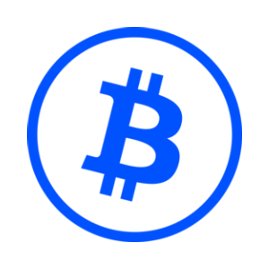 | 16852 | CBBTC | Coinbase Wrapped BTC |
| 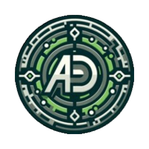 | 16853 | ABDS | ABDS Token |
| 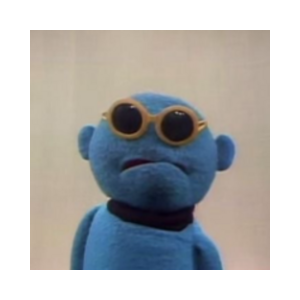 | 16854 | GUGU | gugu |
|  | 16855 | BNSOL | Binance Staked SOL |
|  | 16856 | DEDA | DedaCoin |
|  | 16857 | JOSE | Jose |
| 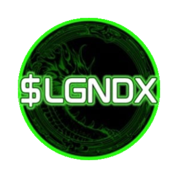 | 16858 | LGNDX | LegendX |
|  | 16859 | SQGROW | SquidGrow |
| 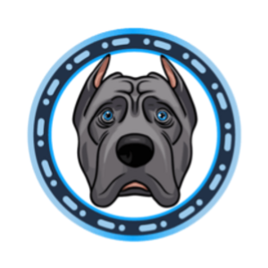 | 16860 | CORSI | Cane Corso |
| 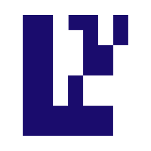 | 16861 | EIGEN | EigenLayer |
|  | 16862 | DEGOD | degod |
| 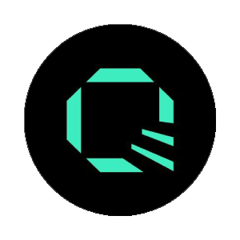 | 16863 | QTLX | Quantlytica |
| 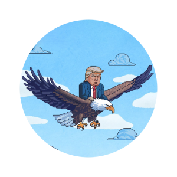 | 16864 | WLFI | World Liberty Financial |
| 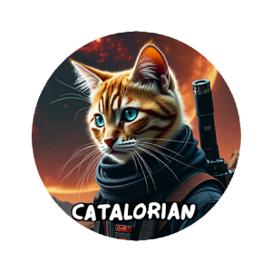 | 16865 | CATALORIAN | CATALORIAN |
| 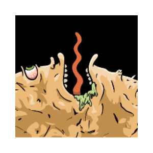 | 16866 | LICKER | LICKER |
| 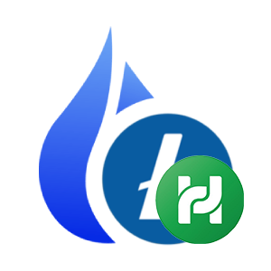 | 16867 | HPHLTC | Heco-Peg HLTC Token (Heco chain bridge) |
| 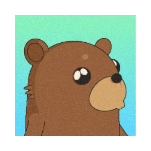 | 16868 | DEEBO | Deebo the Bear |
| 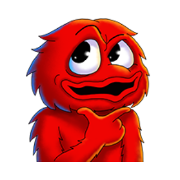 | 16869 | BL00P | BLOOP |
|  | 16870 | NEIREI | NeiRei |
| 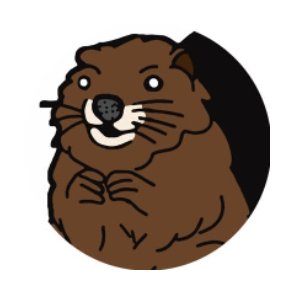 | 16871 | BOBER | BOBER |
| 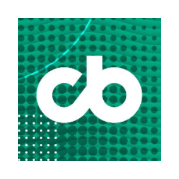 | 16872 | CBPAY | COINBAR PAY |
|  | 16873 | STOC | STO Cash |
| 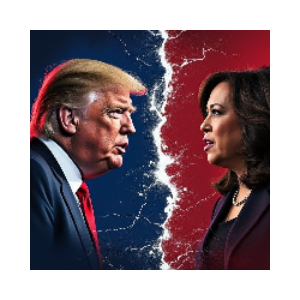 | 16874 | THD | Trump Harris Debate |
|  | 16875 | KPK | ParkCoin |
|  | 16876 | PEPAY | PEPAY |
| 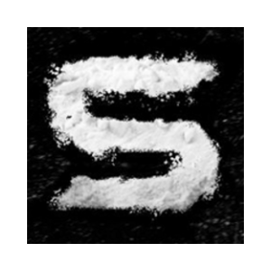 | 16877 | EKOC | Coke |
| 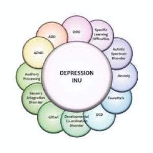 | 16878 | DEPINU | Depression Inu |
| 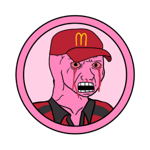 | 16879 | BROKIE | Brokie |
|  | 16880 | INRX | INRx |
|  | 16881 | DWOG | DWOG THE DOG |
| 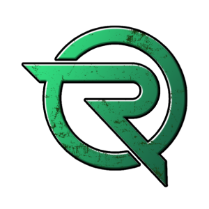 | 16882 | RUNNER | Runner |
| 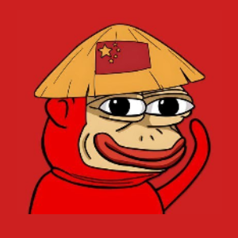 | 16883 | PONKEI | Chinese Ponkei the Original |
| 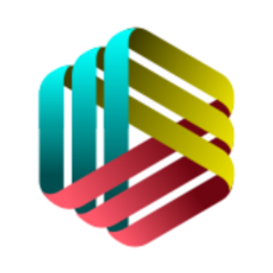 | 16884 | WEPC | World Earn & Play Community |
| 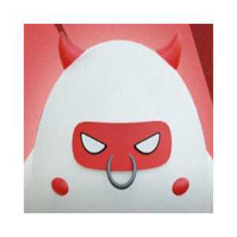 | 16885 | TBULL | Tron Bull |
| 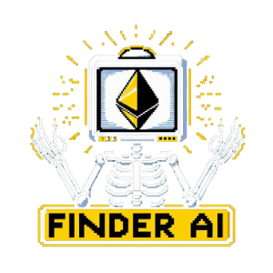 | 16886 | FINDER | Finder AI |
| 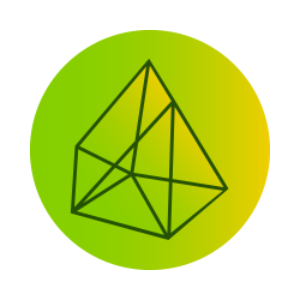 | 16887 | WYZ | WYZth |
| 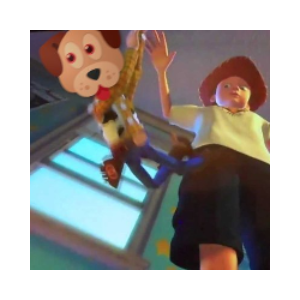 | 16888 | DCHEWY | Drop Chewy |
| 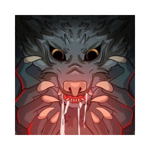 | 16889 | DWOLF | Dark Wolf |
| 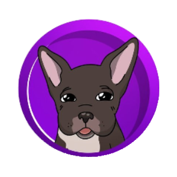 | 16890 | TROLLICTO | TROLLI CTO |
|  | 16891 | GIGS | Climate101 |
| 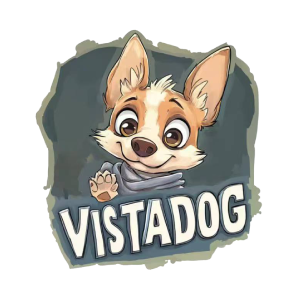 | 16892 | VISTADOG | VISTADOG |
| 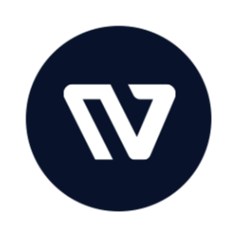 | 16893 | WIGL | Wigl |
|  | 16894 | SVTS | Syncvault |
| 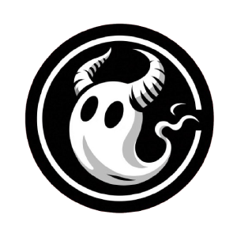 | 16895 | GGB | GGEBI |
| 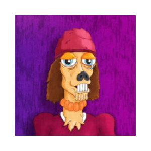 | 16896 | FLEA | FLEABONE |
| 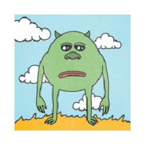 | 16897 | BRUH | Bruh |
| 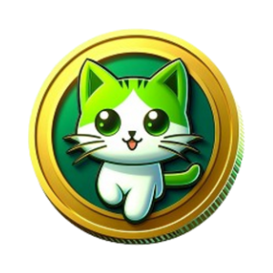 | 16898 | KTR | Kitty Run |
| 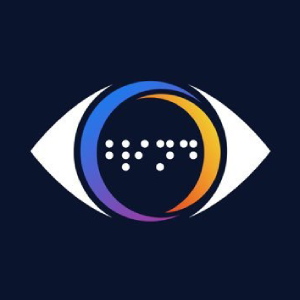 | 16899 | BLIND | Blindsight |
| 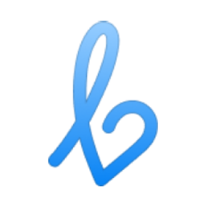 | 16900 | LFIT | LFIT |
| 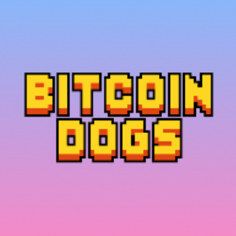 | 16901 | 0DOG | Bitcoin Dogs |
| 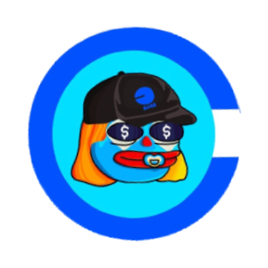 | 16902 | BRETARDIO | Bretardio |
|  | 16903 | LIQUIDIUM | LIQUIDIUM•TOKEN |
| 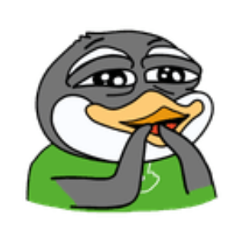 | 16904 | PACO | Paco |
| 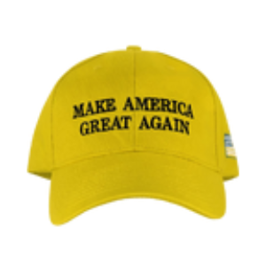 | 16905 | SUNMAGA | SunMaga |
| 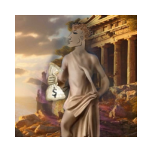 | 16906 | FAPTAX | Faptax |
| 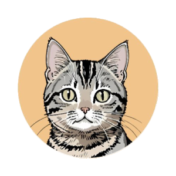 | 16907 | TSUJI | Tsutsuji |
|  | 16908 | TMPL | TMPL |
| 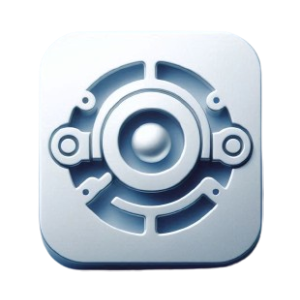 | 16909 | ISEC | IntelliSecure Systems |
|  | 16910 | CHEFDOTFUN | Chefdotfun |
|  | 16911 | SHARP | Sharp |
|  | 16912 | SODAL | Sodality Coin |
| 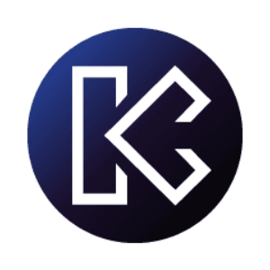 | 16913 | KAGE | Kage Network |
| 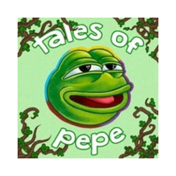 | 16914 | TALES | Tales of Pepe |
| 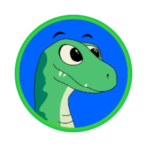 | 16915 | PHIL | Philtoken |
| 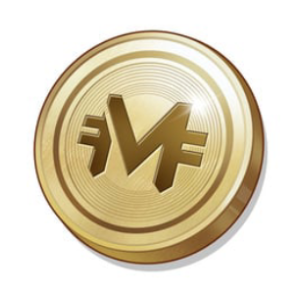 | 16916 | MAK | MetaCene |
| 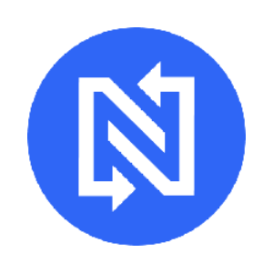 | 16917 | NOMOX | NOMOEX Token |
|  | 16918 | SUNPUMP | To The Sun |
|  | 16919 | MICRODOGE | MicroDoge |
| 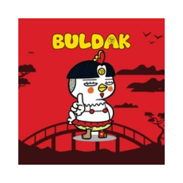 | 16920 | BULDAK | Buldak |
| 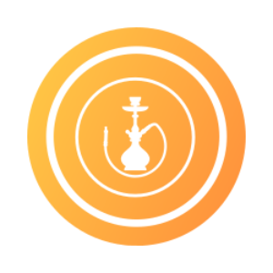 | 16921 | SHISHA | Shisha Coin |
|  | 16922 | FLUFFI | Fluffington |
|  | 16923 | BTCBRV1 | Bitcoin BR v1 |
|  | 16924 | JAGO | Jagotrack |
|  | 16925 | EURI | Eurite |
|  | 16926 | TRUMPBASE | MAGA (magatrumponbase.tech) |
|  | 16927 | SUNNED | SUNNED |
|  | 16928 | FREEPAVEL | Free Pavel |
|  | 16929 | EZPZ | Eazy Peazy |
|  | 16930 | OMIX | Omix |
|  | 16931 | YUCHEN | Sun Yuchen |
|  | 16932 | CATGOKU | Catgoku |
|  | 16933 | NFTSTYLE | NFTStyle |
|  | 16934 | KORC | King of Referral Coin |
|  | 16935 | WEEBS | Weebs |
|  | 16936 | VOIP | Voip Finance |
|  | 16937 | YORI | YORI |
|  | 16938 | WIWI | Wiggly Willy |
|  | 16939 | VENKO | VENKO |
|  | 16940 | TOPI | Topi Meme |
|  | 16941 | SUNGOAT | SUNGOAT |
|  | 16942 | LASOL | LamaSol |
|  | 16943 | TRONDOG | TronDog |
|  | 16944 | LOLO | Lolo |
|  | 16945 | HOMS | Heroes of memes |
|  | 16946 | INRXV1 | INRx v1 |
|  | 16947 | TBEER | TRON BEER |
|  | 16948 | LAZYCAT | LAZYCAT |
|  | 16949 | BPETHW | Binance-Peg EthereumPoW (Binance Bridge) |
|  | 16950 | EURCVV1 | EUR CoinVertible v1 |
|  | 16951 | TRITON | Triton |
|  | 16952 | ALMAN | Alman |
|  | 16953 | MWD | MEW WOOF DAO |
|  | 16954 | AUKI | Auki Labs |
|  | 16955 | SWGT | SmartWorld Global |
|  | 16956 | EALPHA | Stella (Energi Bridge) |
|  | 16957 | YIDO | Yidocy Plus |
|  | 16958 | EARLY | Early Risers |
|  | 16959 | BCAI | Bright Crypto Ai |
|  | 16960 | SUNNEIRO | SunNeiro |
|  | 16961 | NACHO | Nacho the 𐤊at |
|  | 16962 | ESTX | Stacks (Energi Bridge) |
|  | 16963 | RINTARO | Rintaro |
|  | 16964 | MOODENGSPACE | MOO DENG (moodeng.space) |
|  | 16965 | EHBAR | Hedera Hashgraph (Energi Bridge) |
|  | 16966 | I3D | i3D Protocol |
|  | 16967 | BPINJ | Injective Protocol (Binance Bridge) |
|  | 16968 | BABYWLFI | Baby WLFI |
|  | 16969 | CZKING | CZKING |
|  | 16970 | COCO | COCO COIN |
|  | 16971 | CATGIRL | Catgirl |
|  | 16972 | GIGA | Gigachad (gigachadsolana.com) |
|  | 16973 | KASPER | Kasper the ghost of Kaspa |
|  | 16974 | KASBOT | KASBOT THE GUARDIAN OF 𐤊ASPA |
|  | 16975 | BPXTZ | Binance-Peg Tezos (Binance Bridge) |
|  | 16976 | USDS | Sky Dollar |
|  | 16977 | GHOAD | GhoadCoin |
|  | 16978 | SKY | SKY Governance Token |
|  | 16979 | SOMPS | SompsOnKas |
|  | 16980 | ALEO | Aleo |
|  | 16981 | SILVERKRC | Silver KRC-20 |
|  | 16982 | JOPER | Joker Pepe |
|  | 16983 | FAH | Falcons |
|  | 16984 | ETHETA | Theta Network (Energi Bridge) |
|  | 16985 | NOTAI | NOTAI |
|  | 16986 | SUKI | SUKI |
|  | 16987 | NEILUO | CHINESE NEIRO |
|  | 16988 | NOOOO | NOOOO |
|  | 16989 | TRUMPSFIGHT | TrumpsFight |
|  | 16990 | AGENT | AgentLayer |
|  | 16991 | MOVEUSD | MoveMoney USD |
|  | 16992 | BPZEC | Binance-Peg ZCash (Binance Bridge) |
|  | 16993 | HMTTV1 | Hype Meme Token v1 |
|  | 16994 | BPBAND | Binance-Peg Band Protocol (Binance Bridge) |
|  | 16995 | BPYFII | Binance-Peg DFI.money (Binance Bridge) |
|  | 16996 | RUNEVM | RUNEVM |
|  | 16997 | BPELF | Binance-Peg aelf (Binance Bridge) |
|  | 16998 | TORA | TORA NEKO |
|  | 16999 | RUGPULL | Captain Rug Pull |
|  | 17000 | MISHA | Vitalik's Dog |
|  | 17001 | BURG | Burger |
|  | 17002 | BPTCT | Binance-Peg TokenClub (Binance Bridge) |
|  | 17003 | BLUESC | BluesCrypto |
|  | 17004 | BPBEL | Binance-Peg Bella Protocol (Binance Bridge) |
|  | 17005 | MKL | Merkle Trade |
|  | 17006 | MAKEA | Make America Healthy Again |
|  | 17007 | BPSAND | The Sandbox (Binance Bridge) |
|  | 17008 | PROLIFIC | Prolific Game Studio |
|  | 17009 | EHNT | Helium (Energi Bridge) |
|  | 17010 | MOGC | MOG CAT |
|  | 17011 | SCHRO | Schrodinger |
|  | 17012 | BPAPE | Ape (Binance Bridge) |
|  | 17013 | JIN | JinPeng |
|  | 17014 | WPYTH | Pyth Network (Portal Bridge) |
|  | 17015 | DOGG | Doggo |
|  | 17016 | BPWAVES | Waves (Binance Bridge) |
|  | 17017 | CRYPTOB | Crypto Burger |
|  | 17018 | BPJASMY | JasmyCoin (Binance Bridge) |
|  | 17019 | ADASTRA | Ad Astra |
|  | 17020 | PETE | PETE |
|  | 17021 | SIO | SAINO |
|  | 17022 | CHEW | CHEWY |
|  | 17023 | EQNT | Quant (Energi Bridge) |
|  | 17024 | AKITAI | AKITA INU |
|  | 17025 | BOMET | BOME TRUMP |
|  | 17026 | BPMANA | Decentraland (Binance Bridge) |
|  | 17027 | VANF | Van Fwogh |
|  | 17028 | SMARTH | SmartHub |
|  | 17029 | HEWE | Health & Wealth |
|  | 17030 | BABYCATE | BabyCate |
|  | 17031 | AGURI | Aguri-Chan |
|  | 17032 | WHGT | GateToken (Portal Bridge) |
|  | 17033 | UFOP | UFOPepe |
|  | 17034 | BPMBL | MovieBloc (Binance Bridge) |
|  | 17035 | BELL | Bellscoin |
|  | 17036 | CHIE | Chief Pepe Officer |
|  | 17037 | ENEO | NEO (Energi Bridge) |
|  | 17038 | TRUMPMA | TRUMP MAGA SUPER |
|  | 17039 | LIE | it’s all a lie |
|  | 17040 | BPPEOPLE | ConstitutionDAO (Binance Bridge) |
|  | 17041 | WUK | WUKONG |
|  | 17042 | LETS | Let's WIN This |
|  | 17043 | TURB | TurboX |
|  | 17044 | MEN | METAHUB FINANCE |
|  | 17045 | ERUNE | Thorchain (Energi Bridge) |
|  | 17046 | BPLRC | Loopring (Binance Bridge) |
|  | 17047 | SEXYP | SEXY PEPE |
|  | 17048 | CASHLY | Cashly |
|  | 17049 | BPOGN | Origin Protocol (Binance Bridge) |
|  | 17050 | KASPY | KASPY |
|  | 17051 | BPGLMR | Moonbeam (Binance Bridge) |
|  | 17052 | PEPEKRC20 | PEPE KRC20 |
|  | 17053 | BPFIRO | Binance-Peg Firo (Binance Bridge) |
|  | 17054 | YORAN | YORAN THE CAVALIER |
|  | 17055 | DALMA | Dalma Inu |
|  | 17056 | KASHIN | KASHIN |
|  | 17057 | KPAW | KasPaw |
|  | 17058 | YONNY | YONNY |
|  | 17059 | KCATS | KASPA CATS |
|  | 17060 | BPUSDP | Binance-Peg Pax Dollar (Binance Bridge) |
|  | 17061 | EBTT | BitTorrent (Energi Bridge) |
|  | 17062 | BPIOTX | Binance-Peg IoTeX Network (Binance Bridge) |
|  | 17063 | CERBER | CERBEROGE |
|  | 17064 | SATAN | MrBeast's Cat |
|  | 17065 | LOGX | LogX Network |
|  | 17066 | MDOGE | First Dog In Mars |
|  | 17067 | MOODENGWIF | MOODENGWIF |
|  | 17068 | SCUBA | Scuba Dog |
|  | 17069 | CLISBNB | clisBNB |
|  | 17070 | UNCN | Unseen |
|  | 17071 | AUSDD | USDD (Arbitrum Bridge) |
|  | 17072 | SOCIAL | Phavercoin |
|  | 17073 | MINID | Mini Donald |
|  | 17074 | RUSDD | USDD (Rainbow Bridge) |
|  | 17075 | BASEDP | Based Pepe |
|  | 17076 | MCOI | MCOIN |
|  | 17077 | BPPERL | Perlin |
|  | 17078 | SOLANAS | Solana Swap |
|  | 17079 | METACLOUD | Metacloud |
|  | 17080 | CFN | Cockfight Network |
|  | 17081 | CATI | Catizen |
|  | 17082 | GMMT | Giant Mammoth |
|  | 17083 | SYNCG | SyncGPT |
|  | 17084 | BPIOTA | MIOTA (Binance Bridge) |
|  | 17085 | BPIDEX | Binance-Peg IDEX (Binance Bridge) |
|  | 17086 | BPKMD | Binance-Peg Komodo (Binance Bridge) |
|  | 17087 | GOODMO | Good Morning |
|  | 17088 | BPBNT | Binance-Peg Bancor Network Token (Binance Bridge) |
|  | 17089 | COREC | CoreConnect |
|  | 17090 | DIAB | Diablo IV Solana |
|  | 17091 | DOGSS | DOGS SOL |
|  | 17092 | PUSS | PussFi |
|  | 17093 | 4DOGE | 4DOGE |
|  | 17094 | BPCTSI | Binance-Peg Cartesi (Binance Bridge) |
|  | 17095 | ANDYMAN | ANDYMAN (andymancto.com) |
|  | 17096 | BPBLZ | Binance-Peg Bluzelle (Binance Bridge) |
|  | 17097 | TZU | Sun Tzu |
|  | 17098 | CRAZYT | CRAZY TRUMP |
|  | 17099 | BPOAX | Oax (Binance Bridge) |
|  | 17100 | BULLI | Bullish On Ethereum |
|  | 17101 | ELONGATE | ElonGate |
|  | 17102 | MADH | Madhouse |
|  | 17103 | HOMERB | Homer BSC |
|  | 17104 | MRM | Mr Mint |
|  | 17105 | SUNN | Sunny on Tron |
|  | 17106 | TRUMPA | TRUMP AI |
|  | 17107 | NEIRO | Neiro (neiroeth.io) |
|  | 17108 | CSW | Crosswalk |
|  | 17109 | LMF | Lamas Finance |
|  | 17110 | BNBD | BNBDOG |
|  | 17111 | CATE | Cate on ETH |
|  | 17112 | HARR | HARRIS DOGS |
|  | 17113 | JUSTI | Justin MEME |
|  | 17114 | ALPHAF | Alpha Fi |
|  | 17115 | MILA | MILADY MEME TOKEN |
|  | 17116 | BPCOTI | Binance-Peg COTI (Binance Bridge) |
|  | 17117 | TRONI | Tron Inu |
|  | 17118 | SPORTSP | SportsPie |
|  | 17119 | DOGSSO | DOGS Solana |
|  | 17120 | BPTRU | TrueFi (Binance Bridge) |
|  | 17121 | BLM | Blombard |
|  | 17122 | DOGY | Dogy |
|  | 17123 | BPCELR | Binance-Peg Celer Network (Binance Bridge) |
|  | 17124 | BINANCED | BinanceDog On Sol |
|  | 17125 | BPKSM | Kusama (Binance Bridge) |
|  | 17126 | RUBB | Rubber Ducky Cult |
|  | 17127 | ELONTRUMP | ELON TRUMP |
|  | 17128 | TRUMPF | Trump Fight |
|  | 17129 | MARCUS | Marcus Cesar Inu |
|  | 17130 | SAV | Save America |
|  | 17131 | HMSTR | Hamster Kombat |
|  | 17132 | ATLA | Atleta Network |
|  | 17133 | RLUSD | Ripple USD |
|  | 17134 | BDAI | Dai (Base - SuperChain Bridge) |
|  | 17135 | VOLBOOST | VolBoost |
|  | 17136 | BELLE | Isabelle |
|  | 17137 | BASEX | Base Terminal |
|  | 17138 | CATCOINV1 | CatCoin Cash v1 |
|  | 17139 | XRPEPE | XRPEPE |
|  | 17140 | PUGWIF | PUGWIFHAT |
|  | 17141 | FLAY | Flayer |
|  | 17142 | GAMBI | Gambi Fi |
|  | 17143 | AXOL | Axol |
|  | 17144 | SNIFT | StarryNift |
|  | 17145 | MOONBIX | MOONBIX MEME |
|  | 17146 | ESTEE | Kaga No Fuuka Go Sapporo Kagasou |
|  | 17147 | BATMAN | BATMAN |
|  | 17148 | CHAI | Chroma AI |
|  | 17149 | ZHOA | Chengpang Zhoa |
|  | 17150 | GIGGLE | Giggle Academy |
|  | 17151 | AKOBI | AKOBI |
|  | 17152 | BOF | Balls of Fate |
|  | 17153 | SAGE | Ceremonies AI |
|  | 17154 | BPOM | Binance-Peg MANTRA (Binance Bridge) |
|  | 17155 | BPPERP | Perpetual Protocol (Binance Bridge) |
|  | 17156 | PESTO | Pesto the Baby King Penguin |
|  | 17157 | S | Sonic |
|  | 17158 | SANCHO | Sancho |
|  | 17159 | TSLT | Tamkin |
|  | 17160 | SEIYAN | Seiyan Token |
|  | 17161 | AARDY | Baby Aardvark |
|  | 17162 | BPPHA | Binance-Peg Phala Network (Binance Bridge) |
|  | 17163 | KINGO | King of memes |
|  | 17164 | ELONMA | ELON MARS |
|  | 17165 | MSC | Matrix SmartChain |
|  | 17166 | NEIROONB | Neiro on Base |
|  | 17167 | CHUMP | Donald J Chump |
|  | 17168 | GHE | GHETTO PEPE |
|  | 17169 | WEEX | WEEX Token |
|  | 17170 | DEXC | DexCoyote Legends |
|  | 17171 | JOULE | Joule |
|  | 17172 | SIMPSONF | Simpson FUKU |
|  | 17173 | MOREGEN | MoreGen FreeMoon |
|  | 17174 | WSTORV1 | StorageChain v1 |
|  | 17175 | POOC | Poo Chi |
|  | 17176 | KITTYS | KITTY Sol |
|  | 17177 | GAMEST | GameStop Coin (gamestopcoin.net) |
|  | 17178 | COINB | Coinbidex |
|  | 17179 | BIDZV1 | BIDZ Coin v1 |
|  | 17180 | KOAI | KOI |
|  | 17181 | DONAL | Donald Pump |
|  | 17182 | SLF | Self Chain |
|  | 17183 | SIMPSONP | Simpson Predictions |
|  | 17184 | UNIO | Unio Coin |
|  | 17185 | NEIROC | Neirocoin (neirocoin.club) |
|  | 17186 | RDOG | Repost Dog |
|  | 17187 | TERMINUS | Terminus |
|  | 17188 | DOGEI | Dogei |
|  | 17189 | SUPR | SuperDapp |
|  | 17190 | 3AC | THREE ARROWZ CAPITEL |
|  | 17191 | TERRY | Terry The Disgruntled Turtle |
|  | 17192 | PEEPOBASE | Peepo (peepobase.org) |
|  | 17193 | KAIK | KAI KEN |
|  | 17194 | ZEUSPEPES | Zeus |
|  | 17195 | RFC | Royal Finance Coin |
|  | 17196 | OGM | OG Mickey |
|  | 17197 | ETHEREUMP | ETHEREUMPLUS |
|  | 17198 | GAMIN | Gaming Stars |
|  | 17199 | TONST | Ton Stars |
|  | 17200 | QUE | Queen Of Memes |
|  | 17201 | ECELO | Celo (Energi Bridge) |
|  | 17202 | SNGT | SNG Token |
|  | 17203 | WHCELO | Celo (Portal Bridge) |
|  | 17204 | ZERO | ZeroLend |
|  | 17205 | MOGUT | Mogutou |
|  | 17206 | FLAREF | FlareFoxInu |
|  | 17207 | SHIR | SHIRO |
|  | 17208 | REPUB | Republican |
|  | 17209 | TAKE | Take America Back |
|  | 17210 | INSE | INSECT |
|  | 17211 | LBR | Lybra Finance |
|  | 17212 | SPURD | Spurdo Spärde |
|  | 17213 | LBRV1 | Lybra Finance v1 |
|  | 17214 | AMERI | AMERICAN EAGLE |
|  | 17215 | NOTDOG | NOTDOG |
|  | 17216 | WIBE | Wibegram |
|  | 17217 | BOYS | BOYSCLUB (boysclubonbase.com) |
|  | 17218 | BBONK | BitBonk |
|  | 17219 | GEEK | De:Lithe Last Memories |
|  | 17220 | MCTO | McToken |
|  | 17221 | TOKUD | Tokuda |
|  | 17222 | WHWAVAX | Wrapped AVAX (Portal Bridge) |
|  | 17223 | LOLATHECAT | Lola |
|  | 17224 | WHWFTM | Wrapped Fantom (Portal Bridge) |
|  | 17225 | SOLER | Solerium |
|  | 17226 | WHWGLMR | Wrapped Moonbeam (Portal Bridge) |
|  | 17227 | BETFI | Betfin |
|  | 17228 | EARLYF | EarlyFans |
|  | 17229 | COREK | Core Keeper |
|  | 17230 | GAMESTOP | GameStop (gamestop-coin.vip) |
|  | 17231 | SHIBS | Shibsol |
|  | 17232 | TATES | Tate Stop |
|  | 17233 | PUPPETH | Puppeth |
|  | 17234 | NRN | Neuron |
|  | 17235 | PUPU | Pepe's Dog |
|  | 17236 | KAMLA | KAMALAMA (kamalama.org) |
|  | 17237 | SPARK | Sparklife |
|  | 17238 | SLUGDENG | SLUG DENG |
|  | 17239 | TIMES | DARKTIMES |
|  | 17240 | GILOEX | Gilo |
|  | 17241 | CRAI | Cryptify AI |
|  | 17242 | SUIB | Suiba Inu |
|  | 17243 | LAY3R | AutoLayer |
|  | 17244 | BOMBO | BOMBO |
|  | 17245 | CATSON | Catson |
|  | 17246 | MTLS | eMetals |
|  | 17247 | WTE | Wonder Energy Technology |
|  | 17248 | FOMON | FOMO Network |
|  | 17249 | VIBEA | Vibe AI |
|  | 17250 | HELI | Helion |
|  | 17251 | SHINOB | Shinobi |
|  | 17252 | TTTU | T-Project |
|  | 17253 | TRUMPC | TrumpCat |
|  | 17254 | KINGOF | King Of Memes |
|  | 17255 | BOOKOF | BOOK OF NOTHING |
|  | 17256 | INDIAN | Indian Call Center |
|  | 17257 | LOULOU | LOULOU |
|  | 17258 | POCHITA | Pochita |
|  | 17259 | CLOUD | Cloud |
|  | 17260 | SOBULL | SoBULL |
|  | 17261 | PLEBONBASE | PLEB |
|  | 17262 | BASEDCOPE | COPE |
|  | 17263 | PALMPV1 | PalmPay v1 |
|  | 17264 | DOGEIN | Doge In Glasses |
|  | 17265 | FTON | Fanton |
|  | 17266 | DONT | Donald Trump (dont.cash) |
|  | 17267 | BABYDENG | Baby Moo Deng |
|  | 17268 | STATOKEN | STA |
|  | 17269 | MOBIU | Mobius Money |
|  | 17270 | LILY | LILY-The Gold Digger |
|  | 17271 | MOBYONBASE | Moby |
|  | 17272 | CRYPTONITE | Cryptonite |
|  | 17273 | MOBYONBASEV1 | Moby v1 |
|  | 17274 | TF47 | Trump Force 47 |
|  | 17275 | AVENT | Aventa |
|  | 17276 | SASHA | SASHA CAT |
|  | 17277 | TIF | This Is Fine |
|  | 17278 | VODCAT | VODKA CAT |
|  | 17279 | SUIMAN | Suiman |
|  | 17280 | MAWA | Kumala Herris |
|  | 17281 | TDM | TDM |
|  | 17282 | SUITE | Suite |
|  | 17283 | ARMY | Army of Fortune Coin |
|  | 17284 | TAOP | TaoPad |
|  | 17285 | ADASOL | Solana Ada |
|  | 17286 | THEAICOIN | AI |
|  | 17287 | SPAC | SPACE DOGE |
|  | 17288 | KINGD | Kingdom of Ants |
|  | 17289 | XV | XV |
|  | 17290 | BKOK | BKOK FinTech |
|  | 17291 | CSI | CSI888 |
|  | 17292 | DEDI | Dedium |
|  | 17293 | DXY | US Degen Index 6900 |
|  | 17294 | ICBX | ICB Network |
|  | 17295 | WABU | Warrenbuffett |
|  | 17296 | TAXI | Robotaxi |
|  | 17297 | LEPER | Leper |
|  | 17298 | AIRDROP | AIRDROP2049 |
|  | 17299 | ADAM | Adam Back |
|  | 17300 | SOFAC | SofaCat |
|  | 17301 | HUSBY | HUSBY |
|  | 17302 | SELFT | SelfToken |
|  | 17303 | BANKER | BankerCoinAda |
|  | 17304 | MNBR | MN Bridge |
|  | 17305 | RINT | Rin Tin Tin |
|  | 17306 | BONKEA | Bonk Earn |
|  | 17307 | CRYPTOH | CryptoHunterTrading |
|  | 17308 | DISTR | Distributed Autonomous Organization |
|  | 17309 | OLAF | Olaf Token |
|  | 17310 | MCAKE | EasyCake |
|  | 17311 | FETS | FE TECH |
|  | 17312 | BLUEN | Blue Norva |
|  | 17313 | CRIS | CristianoRonaldoSpeedSmurf7Siu |
|  | 17314 | ABGRTV1 | The Graph v1 (Arbitrum Bridge) |
|  | 17315 | SPUNK | PUNK - SpacePunksClub |
|  | 17316 | RABBI | Len "rabbi" Sassaman |
|  | 17317 | CONTROL | Control Token |
|  | 17318 | SEAGULL | SEAGULL SAM |
|  | 17319 | TRNGUY | Tron Guy Project |
|  | 17320 | CYBERA | Cyber Arena |
|  | 17321 | MILOP | MILO Project |
|  | 17322 | FIONA | Fiona |
|  | 17323 | FIONABSC | Fiona |
|  | 17324 | TURBOB | Turbo Browser |
|  | 17325 | YOURMOM | YOUR MOM DOG |
|  | 17326 | WAP | Wet Ass Pussy |
|  | 17327 | HAWKCITY | Hawk |
|  | 17328 | FREAK | Freakoff |
|  | 17329 | X7 | X7 |
|  | 17330 | ABE | ABE |
|  | 17331 | FOXXY | FOXXY |
|  | 17332 | SUIJAK | Suijak |
|  | 17333 | TYLER | Tyler |
|  | 17334 | PETERTODD | Peter Todd |
|  | 17335 | OGLG | OGLONG |
|  | 17336 | KIDEN | RoboKiden |
|  | 17337 | CARV | CARV |
|  | 17338 | GLIESE | GlieseCoin |
|  | 17339 | IFOR | iFortune |
|  | 17340 | OZONEC | Ozonechain |
|  | 17341 | MIRT | MIR Token |
|  | 17342 | SHAD | Shadowswap Finance |
|  | 17343 | BLACKST | Black Stallion |
|  | 17344 | ICEC | IceCream |
|  | 17345 | HERME | Hermes DAO |
|  | 17346 | CATABSC | CATA BSC |
|  | 17347 | MIZ | Mizar |
|  | 17348 | STOREP | Storepay |
|  | 17349 | DOGLAI | Doglaikacoin |
|  | 17350 | BUNNI | Bunni |
|  | 17351 | COFFEE | COFFEE |
|  | 17352 | CHEESEBALL | Cheeseball the Wizard |
|  | 17353 | ROBOTAXI | ROBOTAXI |
|  | 17354 | BOBFUN | BOB |
|  | 17355 | AIR | Altair |
|  | 17356 | KOMA | Koma Inu (komabnb.com) |
|  | 17357 | KLAUS | Klaus |
|  | 17358 | EVERV | EverValue Coin |
|  | 17359 | TWURTLE | twurtle the turtle |
|  | 17360 | EATH | Eartherium |
|  | 17361 | CPTN | Captain Max |
|  | 17362 | TRUMPCA | Trump Card |
|  | 17363 | BITCO | Bitcoin Black Credit Card |
|  | 17364 | EGY | Egypt Cat |
|  | 17365 | CRYPTOR | CRYPTORG |
|  | 17366 | AQUA | Aquarius |
|  | 17367 | WHI | White Boy Summer |
|  | 17368 | OHNO | Oh no |
|  | 17369 | NINJ | Ninja Protocol |
|  | 17370 | DOGGYCOIN | DOGGY |
|  | 17371 | WORKE | Worken |
|  | 17372 | ASHS | AshSwap |
|  | 17373 | NASDAQ420 | Nasdaq420 |
|  | 17374 | CATCO | CatCoin |
|  | 17375 | TAD | Tadpole |
|  | 17376 | MIHARU | Smiling Dolphin |
|  | 17377 | MAGNET6900 | MAGNET6900 |
|  | 17378 | JOYCAT | JoyCat Coin |
|  | 17379 | FRATT | Frogg and Ratt |
|  | 17380 | NEIROH | NeiroWifHat |
|  | 17381 | BRETTSUI | Brett (brettsui.com) |
|  | 17382 | TGW | The Green World |
|  | 17383 | DIDDY | DIDDY |
|  | 17384 | FROP | Popo The Frog |
|  | 17385 | NINJACAT | NinjaCat |
|  | 17386 | NEINEI | Chinese Neiro |
|  | 17387 | GOGLZ | GOGGLES |
|  | 17388 | EDOG | EDOG |
|  | 17389 | MOCK | Mock Capital |
|  | 17390 | GAMEF | Game Fantasy Token |
|  | 17391 | KITTYSOL | Kitty Solana |
|  | 17392 | NETCOINV1 | Netcoincapital v1 |
|  | 17393 | GOAT | Goatseus Maximus |
|  | 17394 | LIFET | LifeTime |
|  | 17395 | VIX7 | VIX777 |
|  | 17396 | ROBOTA | TAXI |
|  | 17397 | TRKX | Trakx |
|  | 17398 | MAGAC | MAGA CAT |
|  | 17399 | TRUMP2 | Trump2024 |
|  | 17400 | SQUIDW | Squidward Coin |
|  | 17401 | ROCKYCOIN | ROCKY |
|  | 17402 | CTT | Castweet |
|  | 17403 | DOLAN | Dolan Duck |
|  | 17404 | NODIDDY | NODIDDY |
|  | 17405 | SUILAMA | Suilama |
|  | 17406 | KARA | KarateCat |
|  | 17407 | METAA | META ARENA |
|  | 17408 | GAMECO | Game.com |
|  | 17409 | FOMOSOL | FOMOSolana |
|  | 17410 | SQUIDV1 | Squid Game v1 |
|  | 17411 | DDRO | D-Drops |
|  | 17412 | PROSP | Prospective |
|  | 17413 | OPCA | OP_CAT(BIP-420) |
|  | 17414 | SIMPSONT | Simpson Trump |
|  | 17415 | BASEVE | Base Velocimeter |
|  | 17416 | ARBP | ARB Protocol |
|  | 17417 | HUE | Huebel Bolt |
|  | 17418 | PENJ | Penjamin Blinkerton |
|  | 17419 | MBANK | MetaBank |
|  | 17420 | POPOETH | POPO |
|  | 17421 | MAGASOL | MAGA (magasolana.wtf) |
|  | 17422 | OMNIAV1 | OmniaVerse v1 |
|  | 17423 | BASESWAPX | BaseX |
|  | 17424 | PEPESOLCTO | Pepe (pepesolcto.vip) |
|  | 17425 | SHROO | Shroomates |
|  | 17426 | PE | Pe |
|  | 17427 | MUES | MuesliSwap MILK |
|  | 17428 | ATMCOIN | ATM |
|  | 17429 | MEMESQUAD | Meme Squad |
|  | 17430 | SUPERCAT | SUPERCAT |
|  | 17431 | PHEN | Phenx |
|  | 17432 | DOVIS | Dovish Finance |
|  | 17433 | METATI | Metatime Coin |
|  | 17434 | PREC | Precipitate.AI |
|  | 17435 | HEL | Hello Puppy |
|  | 17436 | NEWC | New Cat |
|  | 17437 | MEDUSA | MEDUSA |
|  | 17438 | MOJI | Moji |
|  | 17439 | MEDU | Medusa |
|  | 17440 | UTHX | Utherverse |
|  | 17441 | COCAINE | THE GOOD STUFF |
|  | 17442 | EVAI | EVA Intelligence |
|  | 17443 | AIMET | AI Metaverse |
|  | 17444 | PUFFER | Puffer |
|  | 17445 | BITE | Bitether |
|  | 17446 | NETK | Netkoin |
|  | 17447 | TOURI | Tourist Token |
|  | 17448 | APOLL | Apollon Limassol |
|  | 17449 | 3ULLV1 | Playa3ull Games v1 |
|  | 17450 | MOONW | moonwolf.io |
|  | 17451 | BERRYS | BerrySwap |
|  | 17452 | PIKACRYPTO | Pika |
|  | 17453 | DOGK | Dagknight Dog |
|  | 17454 | ROGER | ROGER |
|  | 17455 | GLMV1 | Golem Network Token v1 |
|  | 17456 | BITV | Bitvolt |
|  | 17457 | SPEE | SpeedCash |
|  | 17458 | EGLM | Golem Network Token (Energi Bridge) |
|  | 17459 | 4P | 4P FOUR |
|  | 17460 | SHOPN | ShopNEXT |
|  | 17461 | IXIR | IXIR |
|  | 17462 | FUTUR | Future Token |
|  | 17463 | POPCO | Popcorn |
|  | 17464 | BONKBNB | Bonk BNB (bonkbnb.com) |
|  | 17465 | SHARKI | Sharki |
|  | 17466 | DOGEFATHER | Dogefather |
|  | 17467 | ESPL | ESPL ARENA |
|  | 17468 | HEA | Healium |
|  | 17469 | ARNC | Arnoya classic |
|  | 17470 | WBONK | BONK (Portal Bridge) |
|  | 17471 | DARKMAGACOIN | DARK MAGA (darkmagacoin.com) |
|  | 17472 | REVOL | Revolution |
|  | 17473 | USA | Based USA |
|  | 17474 | DOTF | Dot Finance |
|  | 17475 | USDMA | USD mars |
|  | 17476 | GREENH | Greenheart CBD |
|  | 17477 | BULLF | BULL FINANCE |
|  | 17478 | GTCC | GTC COIN |
|  | 17479 | DBR | deBridge |
|  | 17480 | CGPU | CloudGPU |
|  | 17481 | SANIN | Sanin |
|  | 17482 | DRAGONX | DragonX |
|  | 17483 | PIKE | Pike Token |
|  | 17484 | RINO | Rino |
|  | 17485 | MINGO | Mingo |
|  | 17486 | LUMIA | Lumia |
|  | 17487 | TRUMPSB | TrumpsBags |
|  | 17488 | KINK | Kinka |
|  | 17489 | XTREMEV | Xtremeverse |
|  | 17490 | ANI | Anime Token |
|  | 17491 | EQUAL | Equalizer DEX |
|  | 17492 | MOODENG | Moo Deng (moodengsol.com) |
|  | 17493 | TRUMP3 | Trump MP3 |
|  | 17494 | NEIROINU | Neiro Inu |
|  | 17495 | OHNOGG | OHNO (ohno.gg) |
|  | 17496 | BTCBASE | Bitcoin on Base |
|  | 17497 | EORN | Orion (Energi Bridge) |
|  | 17498 | CLASH | Clashub |
|  | 17499 | WPAY | WPAY |
|  | 17500 | PAPERBASE | Paper |
|  | 17501 | BTC70000 | BTC 70000 |
|  | 17502 | GOLDN | GoLondon |
|  | 17503 | GOATAI | GOAT AI |
|  | 17504 | PBB | PEPE BUT BLUE |
|  | 17505 | TUA | Atua AI |
|  | 17506 | MEI | Mei Solutions |
|  | 17507 | BSK | BTCSKR |
|  | 17508 | SILV | Silver Surfer Solana |
|  | 17509 | WOT | World Of Trump |
|  | 17510 | MININEIRO | Mini Neiro |
|  | 17511 | EBFIL | FileCoin (Energi Bridge) |
|  | 17512 | LUNAB | Luna by Virtuals |
|  | 17513 | ARCADEN | ArcadeNetwork |
|  | 17514 | NIFTYL | Nifty League |
|  | 17515 | COJ | Cojam |
|  | 17516 | BABYMO | Baby Moon Floki |
|  | 17517 | THEC | The CocktailBar |
|  | 17518 | AIDA | Ai-Da robot |
|  | 17519 | BABYCZHAO | Baby Czhao |
|  | 17520 | GEME | GEME |
|  | 17521 | INSURANCE | insurance |
|  | 17522 | BTMT | BITmarkets Token |
|  | 17523 | KONAN | Konan of Kaspa |
|  | 17524 | FBOMB | fBomb |
|  | 17525 | P | PUPS•WORLD•PEACE |
|  | 17526 | FBOMBV1 | fBomb v1 |
|  | 17527 | PEENO | Peeno |
|  | 17528 | TENS | TensorScan |
|  | 17529 | SENTI | Sentinel Bot Ai |
|  | 17530 | ORANGE | Annoying Orange |
|  | 17531 | JANET | Janet |
|  | 17532 | PONK | PONK |
|  | 17533 | CADAI | CADAI |
|  | 17534 | DIAMONDINU | Diamond |
|  | 17535 | ELMOCOIN | Elmo |
|  | 17536 | NEVANETWORK | Neva |
|  | 17537 | ABCM | ABCMETA |
|  | 17538 | WIFEAR | TRUMP WIF EAR |
|  | 17539 | KHEOWZOO | khaokheowzoo |
|  | 17540 | GNON | Numogram |
|  | 17541 | PHUN | PHUNWARE |
|  | 17542 | SMIDGEETH | Smidge (smidgeeth.vip) |
|  | 17543 | THES | The Standard Protocol (USDS) |
|  | 17544 | MAND | Mandala Exchange Token |
|  | 17545 | BANKC | Bankcoin |
|  | 17546 | LYDI | Lydia Finance |
|  | 17547 | COPIO | Copiosa Coin |
|  | 17548 | MINTE | Minter HUB |
|  | 17549 | BELLS | Bellscoin |
|  | 17550 | WOLT | Wolt |
|  | 17551 | STONEDE | Stone DeFi |
|  | 17552 | BSCST | Starter |
|  | 17553 | VIST | VISTA |
|  | 17554 | GITH | GitHub's Mascot Octocat |
|  | 17555 | WHYCAT | WhyCat |
|  | 17556 | BABYHIPPO | BABY HIPPO |
|  | 17557 | BOPPY | BOPPY |
|  | 17558 | SHOGGOTHAI | Shoggoth (Shoggoth AI) |
|  | 17559 | MD | MetaDeck |
|  | 17560 | OPENW | OpenWorld |
|  | 17561 | SENTR | Sentre Protocol |
|  | 17562 | THEF | The Flash Currency |
|  | 17563 | UMID | Umi Digital |
|  | 17564 | FARME | Farmers Only |
|  | 17565 | CRYPTOBL | CryptoBlades Kingdoms |
|  | 17566 | BLOXT | Blox Token |
|  | 17567 | TRAIMP | TRUMP AI |
|  | 17568 | TAOTOOLS | TAOTools |
|  | 17569 | FLAVIA | Flavia Is Online |
|  | 17570 | BARTKRC | BART Token |
|  | 17571 | TXC | TEXITcoin |
|  | 17572 | BZE | BeeZee |
|  | 17573 | BIGFOOT | BigFoot Town |
|  | 17574 | DAK | dak |
|  | 17575 | OSCAR | OSCAR |
|  | 17576 | PICOLO | PICOLO |
|  | 17577 | FARTCOIN | Fartcoin |
|  | 17578 | SLOP | Slop |
|  | 17579 | SWORLD | Seedworld |
|  | 17580 | OMNIA | OMNIA Protocol |
|  | 17581 | CD20 | CoinDesk 20 Index |
|  | 17582 | MEMESAI | Memes AI |
|  | 17583 | OBSI | Obsidium |
|  | 17584 | SWIS | Swiss Cash Coin |
|  | 17585 | DEVI | DEVITA |
|  | 17586 | IPU | iPulse |
|  | 17587 | GETLIT | LIT |
|  | 17588 | MONSTE | Monster |
|  | 17589 | ZYNC | ZynCoin |
|  | 17590 | THUN | Thunder Brawl |
|  | 17591 | DTEC | Dtec |
|  | 17592 | WRAY | Raydium (Portal Bridge) |
|  | 17593 | TRUMP47 | 47th President of the United States |
|  | 17594 | FNXAI | Finanx AI |
|  | 17595 | GOATSE | GOATSE |
|  | 17596 | LMQ | Lightning McQueen |
|  | 17597 | SEP | Smart Energy Pay |
|  | 17598 | LBTC | Lombard Staked BTC |
|  | 17599 | CLAP | Clap Cat |
|  | 17600 | AINA | Ainastasia |
|  | 17601 | CHANG | Chang |
|  | 17602 | DEEPG | Deep Gold |
|  | 17603 | KYRA | KYRA |
|  | 17604 | GDOG | GDOG |
|  | 17605 | KINGNEIRO | King Neiro |
|  | 17606 | DEEPCLOUD | DeepCloud AI |
|  | 17607 | EZEIGEN | Restaked EIGEN |
|  | 17608 | BASEDV1 | Based Money v1 |
|  | 17609 | PTRB | Tellor Tributes (Polygon Portal) |
|  | 17610 | OBTRB | Tellor Tributes from Mainnet (OmniBridge) |
|  | 17611 | GRASS | Grass |
|  | 17612 | BARY | Bary |
|  | 17613 | POUPE | Poupe |
|  | 17614 | TITS | We Love Tits |
|  | 17615 | PDJT | President Donald J. Trump |
|  | 17616 | SHIKOKU | Mikawa Inu |
|  | 17617 | TORO | Toro Inoue |
|  | 17618 | MEIZHU | GUANGZHOU ZOO NEW BABY PANDA |
|  | 17619 | OTRB | Tellor Tributes (Optimism - SuperChain Bridge) |
|  | 17620 | CRIPPL | Wheelchair Cat |
|  | 17621 | ALPACAS | Bitcoin Mascot |
|  | 17622 | IGT | Infinitar |
|  | 17623 | BROZ | Brozinkerbell |
|  | 17624 | MEGAD | Mega Dice Casino |
|  | 17625 | HOOT | HOOT |
|  | 17626 | BRIAN | Brian Arm Strong |
|  | 17627 | SUMMIT | Summit |
|  | 17628 | SCARCITY | SCARCITY |
|  | 17629 | BITTON | Bitton |
|  | 17630 | LRT2 | LRT Squared |
|  | 17631 | TALENT | Talent Protocol |
|  | 17632 | TRUMPVANCE | Trump Vance 2024 |
|  | 17633 | BRIL | Brilliantcrypto |
|  | 17634 | SUIMON | Sui Monster |
|  | 17635 | LIO | Lio |
|  | 17636 | SMETX | SpecialMetalX |
|  | 17637 | BABYGOAT | Baby Goat |
|  | 17638 | CHILDAI | Singularity's Child gonzoai |
|  | 17639 | PNUT | Peanut the Squirrel |
|  | 17640 | GLAZE | Glaze |
|  | 17641 | PATRIOT | Patriot |
|  | 17642 | OGGIE | Oggie |
|  | 17643 | SUMI | SUMI |
|  | 17644 | BENDER | BENDER |
|  | 17645 | OCADA | OCADA.AI |
|  | 17646 | MONDO | mondo |
|  | 17647 | TRUMPMAGA | President Trump MAGA |
|  | 17648 | PLYR | PLYR L1 |
|  | 17649 | BRO | Bro the cat |
|  | 17650 | HOPPY | Hoppy |
|  | 17651 | BENJI | Basenji |
|  | 17652 | DEEP | DeepBook Protocol |
|  | 17653 | NPC | Non-Playable Coin |
|  | 17654 | BDC | BILLION•DOLLAR•CAT |
|  | 17655 | BITSERIAL | BitSerial |
|  | 17656 | TOOBIGTORIG | Too Big To Rig |
|  | 17657 | BSE | base season |
|  | 17658 | NAYM | NAYM |
|  | 17659 | LEMX | LEMON |
|  | 17660 | ANZENUSD | Anzen Finance |
|  | 17661 | TRUFV1ERC20 | Truflation v1 ERC-20 |
|  | 17662 | BEAST | MrBeast |
|  | 17663 | KENOBI | Obi PNut Kenobi |
|  | 17664 | SUWI | suwi |
|  | 17665 | SAY | SAY Coin |
|  | 17666 | YLAY | Yelay |
|  | 17667 | MAGPAC | MAGA Meme PAC |
|  | 17668 | BANGY | BANGY |
|  | 17669 | THECAT | THECAT |
|  | 17670 | CATANA | Catana |
|  | 17671 | TRUMPCATS | Trump Golden Cat |
|  | 17672 | BASECOIN | BASECOIN |
|  | 17673 | BGBV1 | Bitget Token v1 |
|  | 17674 | OOM | OomerBot |
|  | 17675 | USDTBASE | USDT (Base) |
|  | 17676 | XGP | XGP |
|  | 17677 | RUSSELL | Russell |
|  | 17678 | OKANE | OKANE |
|  | 17679 | BWEN | Baby Wen |
|  | 17680 | RECT | ReflectionAI |
|  | 17681 | TERMINAL | Book Terminal of Truths |
|  | 17682 | WELLV1 | Moonwell v1 |
|  | 17683 | CTO | BaseCTO |
|  | 17684 | WWELL | Moonwell (Portal Bridge) |
|  | 17685 | BARIO | Based Mario |
|  | 17686 | BLUFF | BluffCat |
|  | 17687 | ABLE | Able Finance |
|  | 17688 | BABYPOPCAT | Baby PopCat |
|  | 17689 | DAGS | Dagcoin |
|  | 17690 | WICKED | Wicked |
|  | 17691 | PAPO | PAPO NINJA |
|  | 17692 | APEDEV | The dev is an Ape |
|  | 17693 | BEEG | Beeg Blue Whale |
|  | 17694 | ANSOM | Ansom |
|  | 17695 | ACSI | ACryptoSI |
|  | 17696 | NAKAV1 | Nakamoto Games v1 |
|  | 17697 | BBYDEV | The Dev is a Baby |
|  | 17698 | SINK | Let that sink in |
|  | 17699 | KS | kittyspin |
|  | 17700 | HBARBARIAN | HBARbarian |
|  | 17701 | MMULTI | Multichain (via Multichain Cross-Chain Router) |
|  | 17702 | ANTT | Antara Token |
|  | 17703 | PAWPAW | PawPaw |
|  | 17704 | LQT | Lifty |
|  | 17705 | ARCA | Legend of Arcadia |
|  | 17706 | SWELL | Swell Network |
|  | 17707 | LEOCOIN | LEO |
|  | 17708 | FAS | fast construction coin |
|  | 17709 | PLATA | Plata Network |
|  | 17710 | UNIT0 | UNIT0 |
|  | 17711 | PNUTRUMP | Peanut Trump |
|  | 17712 | ROSS | Ross Ulbricht |
|  | 17713 | TOPCAT | Topcat |
|  | 17714 | COD | Chief of Deswamp |
|  | 17715 | KUNDALINI | Kundalini is a real girl |
|  | 17716 | CBL | Credbull |
|  | 17717 | SIKA | SikaSwap |
|  | 17718 | TUX | Tux The Penguin |
|  | 17719 | PCW | Power Crypto World |
|  | 17720 | FUG | FUG |
|  | 17721 | SOK | shoki |
|  | 17722 | HMU | hit meeee upp |
|  | 17723 | MSPC | MeowSpace |
|  | 17724 | DOGEPR | DOGE PRESIDENT |
|  | 17725 | BERT | Bertram The Pomeranian |
|  | 17726 | BANDIT | Bandit on Base |
|  | 17727 | MRSMIGGLES | Mrs Miggles |
|  | 17728 | VYPER | VYPER.WIN |
|  | 17729 | SWANSOL | Black Swan (blackswan-sol.com) |
|  | 17730 | KPOPFUN | KPOP (kpop.fun) |
|  | 17731 | CZ | CHANGPENG ZHAO (changpengzhao.club) |
|  | 17732 | HONKLER | Honkler |
|  | 17733 | MOONBI | Moonbix |
|  | 17734 | WAVL | Wrapped Aston Villa (Kayen) |
|  | 17735 | LENS | Len Sassaman (len-sassaman.vip) |
|  | 17736 | GMETHERFRENS | GM |
|  | 17737 | CRYPTOPAL | Pal |
|  | 17738 | SLAVI | Slavi Coin |
|  | 17739 | FYDO | Fly Doge |
|  | 17740 | KOLANA | KOLANA |
|  | 17741 | JDO | JINDO |
|  | 17742 | JETCAT | Jetcat |
|  | 17743 | KRYP | Krypto Trump |
|  | 17744 | TERM | Terminal of Simpson |
|  | 17745 | NIH | Nihao coin |
|  | 17746 | WINB | WINBIT CASINO |
|  | 17747 | WAFC | Wrapped Arsenal FC (Kayen) |
|  | 17748 | SCROLLY | Scrolly the map |
|  | 17749 | OPSV1 | Octopus Protocol |
|  | 17750 | POPGOAT | Goatseus Poppimus |
|  | 17751 | NIKO | NikolAI |
|  | 17752 | AIPO | Aipocalypto |
|  | 17753 | WPOR | Wrapped Portugal National Team |
|  | 17754 | PHMN | POSTHUMAN |
|  | 17755 | DRAKO | Drako |
|  | 17756 | OPSV2 | Octopus Protocol v2 |
|  | 17758 | GAY | GAY |
|  | 17759 | EIQT | IQ Prediction |
|  | 17760 | BGSOL | Bitget SOL Staking |
|  | 17761 | WINNIE | Winnie the Poodle |
|  | 17762 | VXDEFI | vXDEFI |
|  | 17763 | WMM | Weird Medieval Memes |
|  | 17764 | SHEGEN | Aiwithdaddyissues |
|  | 17765 | YUKIE | Yukie |
|  | 17766 | DIONEV1 | Dione v1 |
|  | 17767 | SNAPCAT | Snapcat |
|  | 17768 | SPINT | Spintria |
|  | 17769 | HAPPY | Happy Cat |
|  | 17770 | STRAT | Strategic Hub for Innovation in Blockchain |
|  | 17771 | GOLDE | GOLDEN AGE |
|  | 17772 | SFRAX | Staked FRAX |
|  | 17773 | ACEO | Ace of Pentacles |
|  | 17774 | ALTER | Alter |
|  | 17775 | OLD | Old Trump |
|  | 17776 | TRUMPER | Trump Era |
|  | 17777 | RIOV1 | Realio Network |
|  | 17778 | EADX | EADX Token |
|  | 17779 | DANNY | Degen Danny |
|  | 17780 | SAMMY | Samoyed |
|  | 17781 | BASEDHOPPY | Based Hoppy (basedhoppy.vip) |
|  | 17782 | FTD | 42DAO |
|  | 17783 | AFSUI | Aftermath Staked SUI |
|  | 17784 | PEANUT | #1 Tiktok Squirrel |
|  | 17785 | BRETTGOLD | Brett Gold |
|  | 17786 | NOODS | Noods |
|  | 17787 | CRYPTOEM | Crypto Emperor Trump |
|  | 17788 | BAKSO | Disney Sumatran Tiger |
|  | 17789 | FACTORY | ChainFactory |
|  | 17790 | PEAN | Peanut the Squirrel (peanut-token.xyz) |
|  | 17791 | ATHCAT | ATH CAT |
|  | 17792 | GOTTI | Gotti Token |
|  | 17793 | CTRL | Ctrl Wallet |
|  | 17794 | BNY | TaskBunny |
|  | 17795 | CODA | CODA |
|  | 17796 | DSTNY | Destinys Chicken |
|  | 17797 | ALASKA | Alaska |
|  | 17798 | SAD | SadCat |
|  | 17799 | MAKEE | Make Ethereum Great Again |
|  | 17800 | EUROP | Europa Coin |
|  | 17801 | MUA | MUA DAO |
|  | 17803 | HEROI | Heroic Saga Shiba |
|  | 17804 | VITALI | Vitalik's Casper |
|  | 17805 | KARAT | KARAT Galaxy |
|  | 17806 | LUCE | Luce |
|  | 17807 | FINAN | FINANCIAL TRANSACTION SYSTEM |
|  | 17808 | USACOIN | American Coin |
|  | 17810 | GROGGO | Groggo By Matt Furie |
|  | 17811 | INA | pepeinatux |
|  | 17812 | JOMA | Joma |
|  | 17813 | MEOWETH | Meow |
|  | 17814 | CRYPTOF | CryptoFarmers |
|  | 17815 | MINOCOINCTO | MINO |
|  | 17816 | MBAG | MoonBag |
|  | 17817 | CHIEFD | Chief D.O.G.E |
|  | 17819 | ALIENPEP | Alien Pepe |
|  | 17820 | EBAND | Band Protocol (Energi Bridge) |
|  | 17821 | SPITT | Hawk Ttuuaahh |
|  | 17822 | LAPUPU | Lapupu |
|  | 17823 | SENSOV1 | SENSO v1 |
|  | 17824 | SWAGGY | swaggy |
|  | 17825 | SALL | Sallar |
|  | 17826 | TKN | Token Name Service |
|  | 17827 | CULOETH | CULO |
|  | 17828 | ETHB | ETHEREUM ON BASE |
|  | 17829 | CMETH | Mantle Restaked Ether |
|  | 17830 | PEANU | PEANUT INU |
|  | 17831 | HAGGIS | New Born Haggis Pygmy Hippo |
|  | 17832 | SKG888 | Safu & Kek Gigafundz 888 |
|  | 17833 | MAYO | Mr Mayonnaise the Cat |
|  | 17834 | BMS | BMS COIN |
|  | 17835 | X | X Empire |
|  | 17836 | COMC | ComCrica Token |
|  | 17837 | SWAGT | Swag Token |
|  | 17838 | NGTG | NUGGET TRAP |
|  | 17839 | BABYPNUT | Baby Pnut |
|  | 17840 | NOOB | Blast Royale |
|  | 17841 | MAGACA | MAGA CAT |
|  | 17842 | APEFUN | Ape |
|  | 17843 | ANAT | Anatolia Token |
|  | 17844 | SPACED | SPACE DRAGON |
|  | 17845 | CHEYENNE | Cheyenne |
|  | 17846 | MIKE | Mike |
|  | 17847 | XTRUMP | X TRUMP |
|  | 17848 | HANAETHCTO | HANA |
|  | 17849 | HMMM | hmmm |
|  | 17850 | AAX | Academic Labs |
|  | 17851 | JAV | Javsphere |
|  | 17852 | CTB | Content Bitcoin |
|  | 17853 | DARAM | Daram |
|  | 17854 | VG | Viu Ganhou |
|  | 17855 | HND | Hundred Finance |

---

[← Prev](./list16.md) | [Next →](./list18.md)
