[← Prev](./list17.md) | [Next →](./list19.md)

| Logo | ID | Symbol | Name |
|:----:|:--:|:------:|:-----|
| 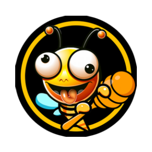 | 17856 | NCTR | Nectar |
| 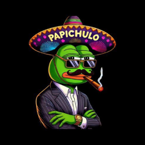 | 17858 | CHULO | Papichulo |
|  | 17859 | CRTAI | CRT AI Network |
| 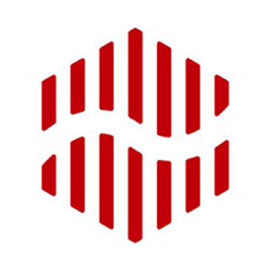 | 17860 | PHX | Red Pulse Phoenix |
|  | 17861 | GOMV1 | GoMoney v1 |
| 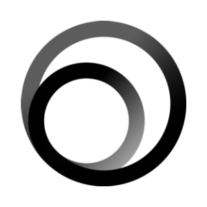 | 17862 | OSMI | OSMI |
|  | 17863 | BCAPV1 | Blockchain Capital |
| 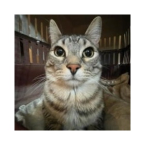 | 17864 | ZAZU | Zazu |
| 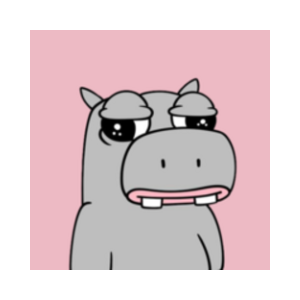 | 17865 | PIPO | Pipo |
| 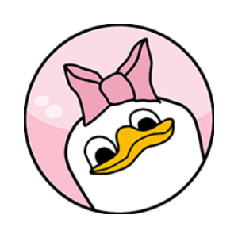 | 17866 | DESY | Desy Duk |
| 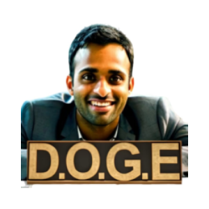 | 17867 | VIVEK | Head of D.O.G.E |
| 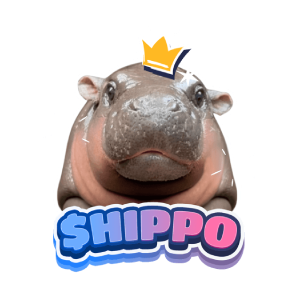 | 17868 | HIPPO | sudeng |
|  | 17869 | ORMO | Ormolus |
| 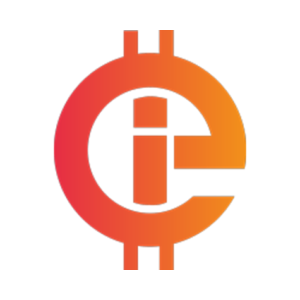 | 17871 | INFINI | Infinity Economics |
|  | 17872 | ROCKETCOIN | RocketCoin |
| 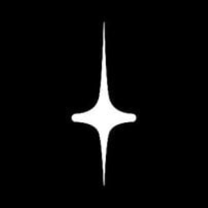 | 17873 | INCEPT | Incept |
| 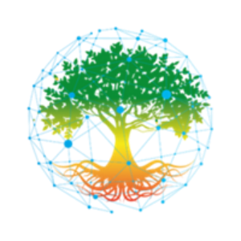 | 17874 | GVRV1 | Grove v1 |
| 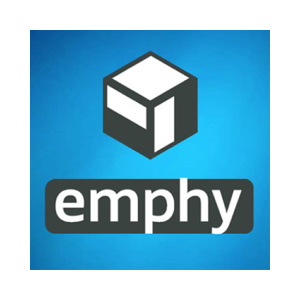 | 17875 | EMPH | Emphy |
|  | 17876 | IKIGAI | Ikigai |
| 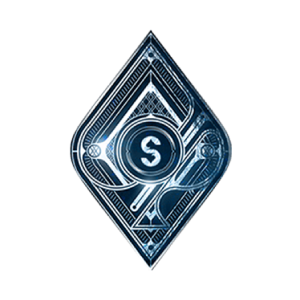 | 17877 | SP8DE | Sp8de |
|  | 17878 | SYRUP | Syrup |
| 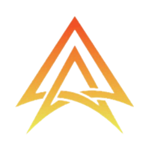 | 17879 | ACCN | Accelerator Network |
| 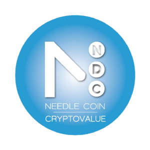 | 17880 | NDLC | NeedleCoin |
|  | 17881 | NEWBV1 | Newbium v1 |
| 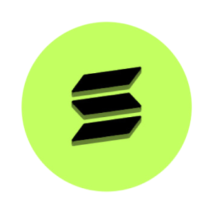 | 17882 | EZSOL | Renzo Restaked SOL |
|  | 17883 | NAWS | NAWS.AI |
| 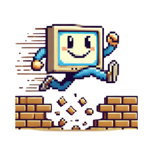 | 17884 | CHATTY | ChatGPT's Mascot |
| 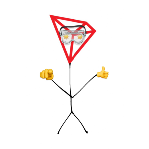 | 17885 | SUNTRON | TRON MASCOT |
| 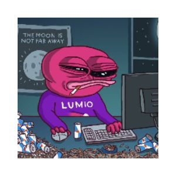 | 17886 | LUMIO | Solana Mascot |
| 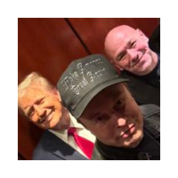 | 17887 | THREEMUSKETEERS | The Three Musketeers |
| 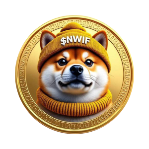 | 17888 | NWIF | neirowifhat |
|  | 17889 | BINK | Big Dog Fink |
|  | 17890 | CHINAU | Chinau |
|  | 17891 | SCRM | Scorum Coin |
| 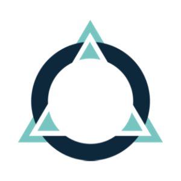 | 17892 | NIOXV2 | Autonio v2 |
| 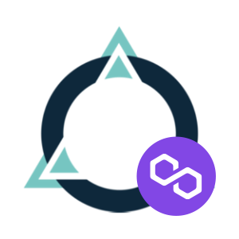 | 17893 | PNIOX | Autonio (Polygon Portal) |
|  | 17894 | USYC | Hashnote USYC |
| 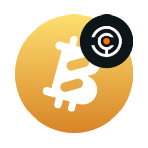 | 17895 | SOLVBTCBBN |  SolvBTC Babylon |
| 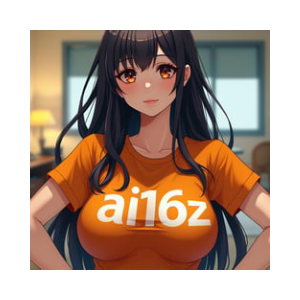 | 17896 | AI16Z | ai16z |
| 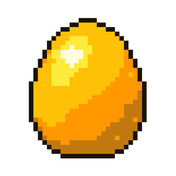 | 17897 | PEGG | PokPok Golden Egg |
|  | 17898 | INVC | Invacio |
| 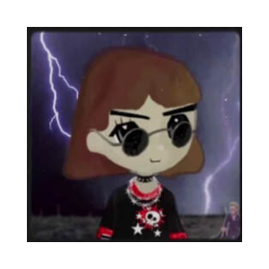 | 17899 | REMILIA | Remilia |
| 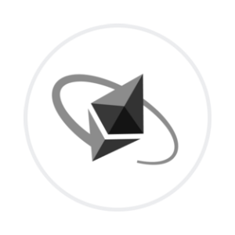 | 17900 | INETH | Inception Restaked ETH |
| 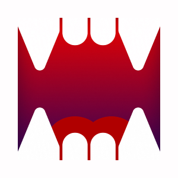 | 17901 | VIDEO | Videocoin by Drakula |
| 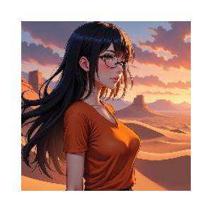 | 17902 | ELIZA | Eliza (elizawakesup.ai) |
| 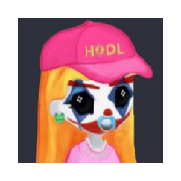 | 17903 | RETARDIA | RETARDIA |
| 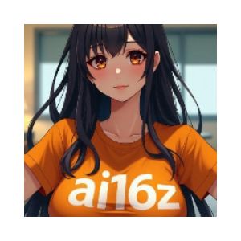 | 17904 | ELIZ | Eliza (ai16zeliza) |
|  | 17905 | AMERIC | American True Hero |
| 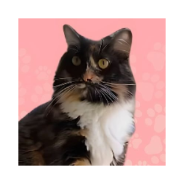 | 17906 | CHLOE | Pnut's Sister |
| 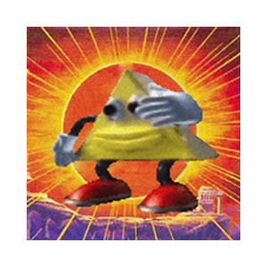 | 17907 | TRIANGLE | dancing triangle |
|  | 17908 | BOWSER | Bowser |
|  | 17909 | WENJ | Enjin Coin (Portal Bridge) |
| 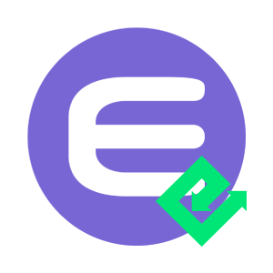 | 17910 | EENJ | Enjin Coin (Energi Bridge) |
| 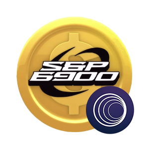 | 17911 | WSPX | SPX6900 (Portal Bridge) |
|  | 17912 | ENJV1 | Enjin Coin v1 |
| 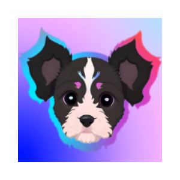 | 17913 | MYRE | Myre |
|  | 17914 | MOTI | Motion |
| 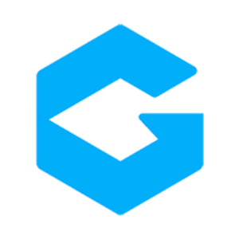 | 17915 | GTK | GoToken |
|  | 17916 | RPX | Red Pulse Token |
| 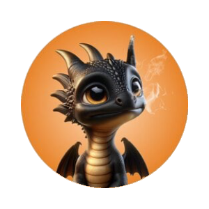 | 17917 | PUFFV1 | Puff The Dragon v1 |
|  | 17918 | PHOENIX | Phoenix Finance |
| 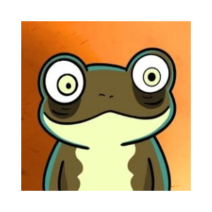 | 17919 | MAJOR | Major Frog |
| 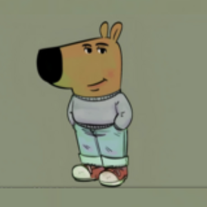 | 17920 | CHILLGUY | Chill Guy |
|  | 17921 | CYPHER | CYPHER•GENESIS (Runes) |
| 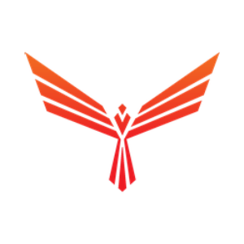 | 17922 | PHBV1 | Red Pulse Phoenix Binance |
| 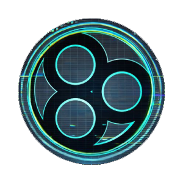 | 17923 | PROJECT89 | Project89 |
| 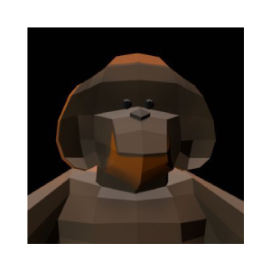 | 17924 | FOREST | FOREST |
| 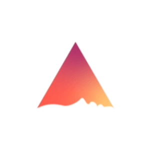 | 17925 | WEHMND | Wrapped eHMND |
| 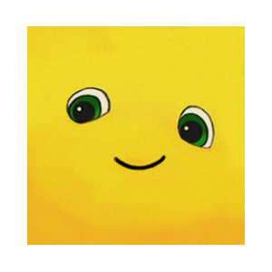 | 17926 | NAILONG | Nailong |
|  | 17927 | UMJA | Umoja |
| 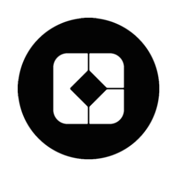 | 17928 | DCD | DecideAI |
|  | 17929 | MSFT | Microsoft 6900 |
|  | 17930 | ELONIA | Elonia Trump |
|  | 17931 | BWB | Bitget Wallet Token |
| 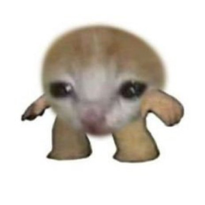 | 17932 | MINI | mini |
| 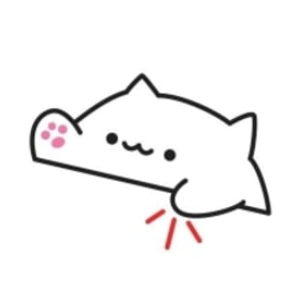 | 17933 | BONGO | BONGO CAT |
|  | 17934 | PIPPIN | pippin |
|  | 17935 | SSUI | Spring Staked SUI |
|  | 17936 | PUGDOG | PUGDOG |
|  | 17952 | MORPHO | Morpho |
|  | 17953 | GOOMPY | Goompy by Matt Furie |
|  | 17954 | EFR | End Federal Reserve |
|  | 17955 | DVL | Develad |
|  | 17956 | NUGGET | Gegagedigedagedago |
|  | 17957 | CUUT | CUTTLEFISHY |
|  | 17958 | LAOS | LAOS Network |
|  | 17959 | GOUT | GOUT |
|  | 17960 | ACT | Act I The AI Prophecy |
|  | 17961 | SEKOIA | sekoia by Virtuals |
|  | 17962 | AIXBT | aixbt by Virtuals |
|  | 17963 | HISS | Snake of Solana |
|  | 17964 | JDAI | Dai (TON Bridge) |
|  | 17965 | VERTAI | Vertical AI |
|  | 17966 | JWBTC | Wrapped Bitcoin (TON Bridge) |
|  | 17967 | FAML | FAML |
|  | 17968 | DDBAM | Didi Bam Bam |
|  | 17969 | AIFUN | AI Agent Layer |
|  | 17970 | PNUTS | Pnuts for squirrel |
|  | 17971 | FROX | Frox |
|  | 17972 | CURLY | Curly |
|  | 17973 | JUSDC | USD Coin (TON Bridge) |
|  | 17974 | TRUAPT | TruFin Staked APT |
|  | 17975 | MOGCO | Mog Coin (mogcoinspl.com) |
|  | 17976 | MARSO | Marso.Tech |
|  | 17977 | BARSIK | Hasbulla's Cat |
|  | 17978 | MCDULL | McDull |
|  | 17979 | CHAOS | chaos and disorder |
|  | 17980 | LUMOS | Lumos |
|  | 17981 | XMW | Morphware |
|  | 17982 | COPA | COCO PARK |
|  | 17983 | SIRIUS | first reply |
|  | 17984 | NML | No Mans Land |
|  | 17985 | AIMAGA | Presidentexe |
|  | 17986 | MCEN | Main Character Energy |
|  | 17987 | ANVL | Anvil |
|  | 17988 | SUSDX | Staked USDX |
|  | 17989 | VVAIFU | Dasha |
|  | 17990 | WATC | WATCoin |
|  | 17991 | MBLV1 | MovieBloc v1 |
|  | 17992 | ZEREBRO | Zerebro |
|  | 17993 | TYKE | Tyke The Elephant |
|  | 17994 | DCHEFSOL | Degen Chef |
|  | 17995 | SLAP | CatSlap |
|  | 17996 | GIZMO | GIZMO•IMAGINARY• KITTEN (Runes) |
|  | 17997 | KNU | Keanu |
|  | 17998 | ZENQ | Zenqira |
|  | 17999 | DADDYCHILL | Daddy Chill |
|  | 18000 | HELA | Science Cult Mascot |
|  | 18001 | ERIF | RSK Infrastructure Framework (Energi Bridge) |
|  | 18002 | WAWA | Wawa Cat |
|  | 18003 | SCIHUB | sci-hub |
|  | 18004 | BTCACT | BITCOIN Act |
|  | 18005 | DESCI | DeSci Meme |
|  | 18006 | KANGO | KANGO |
|  | 18007 | PIM | PIM |
|  | 18008 | LESTER | Litecoin Mascot |
|  | 18010 | AICELL | AICell |
|  | 18011 | TYPUS | Typus |
|  | 18012 | EURQ | Quantoz EURQ |
|  | 18013 | AVB | Autonomous Virtual Beings |
|  | 18014 | PMANA | Decentraland (Polygon Portal) |
|  | 18015 | WMANA | Decentraland (Portal Bridge) |
|  | 18016 | TRUTHFI | TruthFi |
|  | 18017 | OBMANA | Decentraland MANA on xDai (OmniBridge) |
|  | 18018 | XING | Xing Xing |
|  | 18019 | XAUM | Matrixdock Gold |
|  | 18020 | SOLVBTCCORE | SolvBTC Core |
|  | 18021 | SHIBADOG | Shiba San |
|  | 18022 | REWARD | Rewardable |
|  | 18023 | SENDOR | Sendor |
|  | 18024 | KAAI | KanzzAI |
|  | 18025 | DAETA | DÆTA |
|  | 18026 | PNUTDOGE | PNUT DOGE |
|  | 18027 | DSTAG | deadstag |
|  | 18028 | OL | Open Loot |
|  | 18029 | BUENO | Bueno |
|  | 18030 | MERLIN | Oldest Raccoon |
|  | 18031 | ZAPO | Zapo AI |
|  | 18032 | LILB | Lil Brett |
|  | 18033 | PUMPFUNBAN | Pump Fun Ban |
|  | 18034 | CLANKER | tokenbot |
|  | 18036 | COBY | Coby |
|  | 18037 | NAVAL | NAVAL AI |
|  | 18038 | SUSDA | sUSDa |
|  | 18039 | TROPPY | TROPPY |
|  | 18040 | BONKEY | Bonkey |
|  | 18041 | LOOPIN | LooPIN Network |
|  | 18042 | BNOM | BitNomad |
|  | 18043 | CULTUR | Cultur |
|  | 18045 | ASPIRIN | Aspirin |
|  | 18046 | BABYSHIRO | Baby Shiro Neko |
|  | 18047 | SOLITO | SOLITO |
|  | 18048 | EURTV1 | Euro Tether v1 Ethereum Contract |
|  | 18049 | SCRVUSD | Savings crvUSD |
|  | 18050 | DOGECAST | Dogecast |
|  | 18051 | KOTARO | KOTARO |
|  | 18052 | UNFK | UNFK |
|  | 18053 | TYSON | Mike Tyson |
|  | 18054 | RAGDOLL | Ragdoll |
|  | 18055 | TRUMPDAO | TRUMP DAO |
|  | 18056 | MLP | Matrix Layer Protocol |
|  | 18057 | USUAL | Usual |
|  | 18058 | WDYDX | dYdX (Portal Bridge) |
|  | 18059 | PAPE | ApeCoin |
|  | 18061 | CENTS | Centience |
|  | 18062 | FLOWER | FlowerAI |
|  | 18063 | SSSSS | Snake wif Hat |
|  | 18064 | STIX | STIX |
|  | 18065 | NFNT | NFINITY AI |
|  | 18066 | BSDETH | Based ETH |
|  | 18067 | TGRASS | Top Grass Club |
|  | 18068 | GOLFI | Golf is Boring |
|  | 18069 | CATBAL | Catbal |
|  | 18070 | GOLDCOINETH | Gold |
|  | 18071 | GENECTO | Gene |
|  | 18072 | GLP1 | GLP1 |
|  | 18073 | BASEDCHILL | Based Chill Guy |
|  | 18074 | STARSHIPONSOL | Starship |
|  | 18075 | ICECR | Ice Cream Sandwich |
|  | 18076 | UTKV1 | Utrust |
|  | 18077 | DOGEM | Doge Matrix |
|  | 18078 | DOGEFA | DOGEFATHER |
|  | 18079 | SOOTCASE | I like my sootcase |
|  | 18080 | SENSUS | Sensus |
|  | 18081 | GLORP | Glorp |
|  | 18082 | SATORI | Satori Network |
|  | 18083 | BULLY | Dolos The Bully |
|  | 18084 | CRISPR | CRISPR |
|  | 18085 | DJI | Doge Jones Industrial Average |
|  | 18086 | KAILY | Kailith |
|  | 18087 | BANANAF | Banana For Scale |
|  | 18088 | BLUEBUTT | BLUE BUTT CHEESE |
|  | 18089 | MOAI | MOAI |
|  | 18090 | NEARK | NearKat |
|  | 18091 | WHINE | keep whining |
|  | 18092 | EPENDLE | Equilibria Pendle |
|  | 18093 | MPENDLE | Pendle (Multichain Bridge) |
|  | 18094 | WENS | Ethereum Name Service (Portal Bridge) |
|  | 18095 | MCFX | Conflux Network (Multichain Bridge) |
|  | 18096 | RVLTV1 | Revolt 2 Earn v1 |
|  | 18097 | DKP | Dragginz |
|  | 18098 | XAND | Xandeum |
|  | 18099 | EBTC | Ether.fi Staked BTC |
|  | 18100 | LCAT | Lion Cat |
|  | 18101 | DCF | Decentralized Finance |
|  | 18102 | ELONRWA | ElonRWA |
|  | 18103 | WMT | World Mobile Token v1 |
|  | 18104 | YOUSIM | YouSim |
|  | 18105 | VITARNA | VitaRNA |
|  | 18106 | WYAC | Woman Yelling At Cat |
|  | 18107 | THRUST | Thruster |
|  | 18108 | ROPIRITO | Ropirito |
|  | 18109 | RCGE | RCGE |
|  | 18110 | LFDOG | lifedog |
|  | 18111 | IMMORTAL | IMMORTAL.COM |
|  | 18112 | KAPPY | Kappy |
|  | 18113 | LESLIE | Leslie |
|  | 18114 | MBIFI | Beefy (Multichain Bridge) |
|  | 18115 | MONET | Claude Monet Memeory Coin |
|  | 18116 | JANRO | Janro The Rat |
|  | 18117 | STNK | Stonks |
|  | 18118 | DOBUY | Just do buy |
|  | 18119 | VITAMINS | Vitamins |
|  | 18120 | WERK | Werk Family |
|  | 18121 | ZON | Zon Token |
|  | 18122 | STEEL | SteelCoin |
|  | 18123 | RIZZMAS | Rizzmas |
|  | 18124 | RLP | Resolv RLP |
|  | 18125 | YBR | YieldBricks |
|  | 18126 | VSTR | Vestra DAO |
|  | 18127 | KYSOL | Kyros Restaked SOL |
|  | 18128 | UTON | uTON |
|  | 18129 | ATR | Artrade |
|  | 18130 | WELON | WrappedElon |
|  | 18131 | WWELON | WrappedElon (Portal Bridge) |
|  | 18132 | QUASAR | Quasar |
|  | 18133 | MORI | MEMENTO•MORI (Runes) |
|  | 18134 | OPUS | Opus |
|  | 18135 | ZFI | Zyfi |
|  | 18136 | ATRV1 | Artrade v1 |
|  | 18137 | QMV | Qumva Network |
|  | 18138 | CONVO | Prefrontal Cortex Convo Agent by Virtuals |
|  | 18139 | MOODENGVIP | MOO DENG (moodeng.vip) |
|  | 18140 | FASTUSD | Sei fastUSD |
|  | 18141 | VY | Valinity |
|  | 18142 | BUBBLES | BUBBLES |
|  | 18143 | RTBL | Rolling T-bill |
|  | 18144 | ERSR | Reserve Rights |
|  | 18145 | GUAN | Guanciale by Virtuals |
|  | 18146 | OBRSR | Reserve Rights on xDai (OmniBridge) |
|  | 18147 | QUDEFI | Qudefi |
|  | 18148 | YEETI | YEETI 液体 |
|  | 18149 | INCO | InfinitiCoin |
|  | 18150 | SANTAHAT | SANTA HAT |
|  | 18151 | AMORE | Amocucinare |
|  | 18152 | LTAI | LibertAI |
|  | 18154 | ARCINTEL | Arc |
|  | 18155 | DEGATE | DeGate |
|  | 18156 | STAU | STAU |
|  | 18157 | TETH | Treehouse ETH |
|  | 18158 | ABTC | aBTC |
|  | 18159 | STBTC | Lorenzo stBTC |
|  | 18160 | GAMA | GAMA Coin |
|  | 18161 | TREE | Tree |
|  | 18162 | ETNY | Ethernity |
|  | 18163 | STARDOGE | StarDOGE |
|  | 18164 | MUNDI | Salvator Mundi |
|  | 18165 | DEGENAI | Degen Spartan AI |
|  | 18166 | BERG | Bloxberg |
|  | 18167 | BAN | Comedian |
|  | 18168 | XION | XION |
|  | 18169 | WBAN | Wrapped Banano |
|  | 18170 | CD80 | CoinDesk 80 Index |
|  | 18171 | CD100 | CoinDesk 100 Index |
|  | 18172 | JFP | JUSTICE FOR PEANUT |
|  | 18173 | LSD | Pontem Liquidswap |
|  | 18174 | SHIRO | Shiro Neko |
|  | 18175 | GUS | Gus |
|  | 18176 | DGV1 | Decentral Games v1 |
|  | 18177 | NOKUV1 | NOKU Master token v1 |
|  | 18178 | AGENTFUN | AgentFun.AI |
|  | 18179 | XMOON | r/CryptoCurrency Moons v1 |
|  | 18180 | AKUMA | Akuma Inu |
|  | 18181 | SKICAT | SKI MASK CAT |
|  | 18182 | AVAV1 | AVA v1 |
|  | 18183 | ARTHERA | Arthera |
|  | 18184 | LANDW | LandWolf (thereallandwolf.com) |
|  | 18185 | AVIA | None |
|  | 18186 | GLS | Glacier |
|  | 18187 | SUIAI | SUI Agents |
|  | 18188 | RURI | Ruri - Truth Terminal's Crush |
|  | 18189 | SSDX | SpunkySDX |
|  | 18190 | DELAY | DegenLayer |
|  | 18191 | F | SynFutures |
|  | 18192 | HYPEV1 | Hype v1 |
|  | 18193 | 1GUY | 1GUY |
|  | 18194 | HERMY | Hermy The Stallion |
|  | 18195 | CDMEME | CoinDesk Memecoin Index |
|  | 18196 | OPSECV1 | OpSec v1 |
|  | 18197 | TOSHIV1 | Toshi v1 |
|  | 18198 | SKI | Ski Mask Dog |
|  | 18199 | HYPE | Hyperliquid |
|  | 18200 | ME | Magic Eden |
|  | 18201 | NIGHT | Midnight |
|  | 18202 | ZEX | Zeta |
|  | 18203 | SOSWAP | Solana Swap |
|  | 18204 | GRIFFAIN | GRIFFAIN |
|  | 18205 | MONKY | Wise Monkey |
|  | 18206 | FRED | First Convicted Raccon Fred |
|  | 18207 | PENGU | Pudgy Penguins |
|  | 18208 | TRACKEDBIO | TrackedBio |
|  | 18209 | ELYS | Elys Network |
|  | 18210 | YUKO | YUKO |
|  | 18211 | FLOPPA | Floppa Cat |
|  | 18212 | TDC | Tidecoin |
|  | 18213 | WART | Warthog |
|  | 18214 | BUBV1 | BUBCAT v1 |
|  | 18215 | VMANTA | Bifrost Voucher MANTA |
|  | 18216 | RONNIE | Ronnie |
|  | 18217 | METADOGEV1 | MetaDoge V1 |
|  | 18218 | SYNK | Synk |
|  | 18219 | SYNDOG | Synthesizer Dog |
|  | 18220 | POZO | Pozo Coin |
|  | 18221 | BOBLS | Boblles |
|  | 18222 | PBTCV1 | pTokens BTC v1 |
|  | 18223 | SUSDS | Savings USDS |
|  | 18224 | WGALA | Gala (Portal Bridge) |
|  | 18225 | PEPU | Pepe Unchained |
|  | 18226 | M3M3 | M3M3 |
|  | 18227 | STEAKUSDC | Steakhouse USDC Morpho Vault |
|  | 18228 | LINGO | Lingo |
|  | 18229 | GRIFT | ORBIT |
|  | 18230 | FXN | FXN |
|  | 18231 | TAXLESSTRUMP | MAGA TAXLESS |
|  | 18232 | AAAHHM | Plankton in Pain |
|  | 18233 | ZLDAV1 | ZELDA v1 |
|  | 18234 | MOVE | Movement |
|  | 18235 | DROP | DROP |
|  | 18236 | CHEEMS | Cheems (cheems.pet) |
|  | 18237 | PONCH | Ponchiqs |
|  | 18238 | SOPH | Sophon |
|  | 18239 | KWEEN | KWEEN |
|  | 18240 | TMAI | Token Metrics AI |
|  | 18241 | MOODENGSBS | Moo Deng (moodeng.sbs) |
|  | 18242 | SOVRN | Sovrun |
|  | 18243 | MOODENGBNB | MOODENG (moodengbnb.com) |
|  | 18244 | MOOMOO | MOO MOO |
|  | 18245 | DRUGS | Big Pharmai |
|  | 18246 | TARDI | Tardi |
|  | 18247 | KIBAV1 | Kiba Inu v1 |
|  | 18248 | PARTY | Party |
|  | 18249 | CHEEMSV1 | Cheems (cheems.pet) v1 |
|  | 18250 | MOCHI | Mochi |
|  | 18251 | TOMO | Tomo Cat |
|  | 18254 | VANA | Vana |
|  | 18255 | RBNT | Redbelly Network |
|  | 18256 | SUPRA | Supra |
|  | 18257 | FLOKIV1 | Floki v1 |
|  | 18258 | FLOKIV2 | Floki v2 |
|  | 18259 | FLOKIV3 | Floki v3 |
|  | 18260 | TEVA | Tevaera |
|  | 18261 | NFAIV1 | Not Financial Advice v1 |
|  | 18262 | MUNIDX | UniDex (Multichain Bridge) |
|  | 18263 | UNIDXV1 | UniDex v1 |
|  | 18264 | UFD | Unicorn Fart Dust |
|  | 18265 | WOULD | would |
|  | 18266 | SDM | Shieldeum |
|  | 18267 | NS | SuiNS Token |
|  | 18268 | SCA | Scallop |
|  | 18269 | RSVV1 | Reserve v1 |
|  | 18270 | MFXS | Frax Share (Multichain Bridge) |
|  | 18271 | FAI | Freysa AI |
|  | 18272 | MFRAX | Frax (Multichain Bridge) |
|  | 18273 | EGO | Paysenger EGO |
|  | 18274 | SUIDEPIN | Sui DePIN |
|  | 18275 | L1 | Lamina1 |
|  | 18276 | KIKIF | Kiki Flaminki |
|  | 18277 | HUMV1 | Humanscape v1 |
|  | 18278 | BASEDTURBO | Based Turbo |
|  | 18279 | JNFTC | Jumbo Blockchain |
|  | 18280 | PNCT | PolySwarm (Polygon Portal) |
|  | 18281 | ESTEEM | Steem (Energi Bridge) |
|  | 18282 | SWARMS | Swarms |
|  | 18283 | HSK | HashKey Platform Token |
|  | 18284 | SIMBA | SIMBA The Sloth |
|  | 18285 | TIMI | This Is My Iguana |
|  | 18286 | MADCOIN | MAD |
|  | 18287 | INKCHAIN | Ink |
|  | 18288 | SDEUSD | Staked deUSD |
|  | 18289 | DYDXV1 | dYdX v1 |
|  | 18290 | SMOK | Smoking Chicken Fish (smokingchickenfisheth.com) |
|  | 18291 | SONEIUM | Soneium |
|  | 18292 | ELX | Elixir Network |
|  | 18293 | UNICHAIN | Unichain Mainnet |
|  | 18294 | GINU | Green Shiba Inu |
|  | 18295 | WPUSSY | Pussy Financial (Portal Bridge) |
|  | 18296 | USUALX | USUALx |
|  | 18297 | RIFA | Rifampicin |
|  | 18298 | BPWRX | Binance-Peg wazirx token (Binance Bridge - Delisted) |
|  | 18299 | PWRX | WazirX (Polygon Portal) |
|  | 18300 | EWRX | WazirX (Energiswap) |
|  | 18301 | BWRX | Binance Wrapped WRX (Binance Bridge - Delisted) |
|  | 18302 | CHEERSONBASE | CHEERS |
|  | 18303 | WSTUSR | Resolv wstUSR |
|  | 18304 | MLG | 360noscope420blazeit |
|  | 18305 | YNE | yesnoerror |
|  | 18306 | LUFFYV1 | Luffy v1 |
|  | 18307 | WKIBSHI | KiboShib (Portal Bridge) |
|  | 18308 | KEKIUS | Kekius Maximus (kekiusmaximus.vip) |
|  | 18309 | LLM | Large Language Model Based |
|  | 18310 | HTERM | Hiero Terminal |
|  | 18311 | KUDAI | Kudai |
|  | 18312 | IDRISS | IDRISS |
|  | 18313 | HENLO | Henlo |
|  | 18314 | CLUSTR | Clustr Labs |
|  | 18315 | DIGIMON | Digimon |
|  | 18316 | CATG | Crypto Agent Trading |
|  | 18317 | BPGAL | Galxe (Binance Bridge - Delisted) |
|  | 18318 | KEVIN | Kevin (kevinonbase.xyz) |
|  | 18319 | PYTHIA | Pythia |
|  | 18320 | BPOCEAN | Ocean Protocol (Binance Bridge - Delisted) |
|  | 18321 | BPSCRT | Secret (Binance Bridge) |
|  | 18322 | BPTUSD | Binance-Peg TrueUSD Token (Binance Bridge - Delisted) |
|  | 18323 | BPWIN | WINkLink (Binance Bridge) |
|  | 18324 | DRV | Derive |
|  | 18325 | BPSUN | Sun Token (Binance Bridge) |
|  | 18326 | BPJST | JUST (Binance Bridge) |
|  | 18327 | KEVINTOKENME | KEVIN (kevintoken.me) |
|  | 18328 | BPNFT | Binance-Peg APENFT Token (Binance Bridge) |
|  | 18329 | BPKNC | Binance-Peg Kyber Network Crystal Token (Binance Bridge) |
|  | 18330 | BPTORN | Binance-Peg TornadoCash Token (Binance Bridge) |
|  | 18331 | BPSLP | Binance-Peg Smooth Love Potion (Binance Bridge) |
|  | 18332 | ESLP | Smooth Love Potion (Energiswap) |
|  | 18333 | SYNTH | SYNTHR |
|  | 18334 | BPBCHA | Binance-Peg Bitcoin Cash ABC (Binance Bridge Delisted) |
|  | 18335 | BPXEC | eCash (Binance Bridge) |
|  | 18336 | BPYGG | Yield Guild Games (Binance Bridge) |
|  | 18337 | BPILV | Illuvium (Binance Bridge) |
|  | 18338 | BPGMT | STEPN (Binance Bridge) |
|  | 18339 | BPFXS | Frax Share (Binance Bridge) |
|  | 18340 | BPELON | Dogelon Mars (Binance Bridge) |
|  | 18341 | BPLOOKS | LooksRare (Binance Bridge) |
|  | 18342 | USD1 | Currency One USD |
|  | 18343 | DEFAI | DeFAI |
|  | 18344 | ACOLYT | Acolyte by Virtuals |
|  | 18345 | KOII | Koii |
|  | 18346 | SENTAI | SentAI |
|  | 18347 | BPBUSD | Binance-Peg BUSD Token (Binance Bridge) |
|  | 18348 | JEWELRY | Jewelry Token |
|  | 18349 | ANEX | AstroNexus |
|  | 18350 | SNAI | SwarmNode.ai |
|  | 18351 | LIHUA | LIHUA |
|  | 18352 | BOTIFY | BOTIFY |
|  | 18353 | SPERG | Bloomsperg Terminal |
|  | 18354 | HENG | HengCoin |
|  | 18355 | HENLOV1 | Henlo v1 |
|  | 18356 | AIOS | INT OS |
|  | 18357 | MB28 | MBridge28 |
|  | 18358 | FUEGO | FUEGO |
|  | 18359 | DUCKAI | Duck AI |
|  | 18360 | 1000X | 1000x by Virtuals |
|  | 18361 | FUEL | Fuel Network |
|  | 18362 | LAVA | Lava Network |
|  | 18363 | BIO | Bio Protocol |
|  | 18364 | BTORO | Bitoro Network |
|  | 18365 | CHATOSHI | chAtoshI |
|  | 18366 | BRP | BananaRepublic |
|  | 18367 | WULFY | Wulfy |
|  | 18368 | PLANT | Plant |
|  | 18369 | AIVIA | AI Virtual Agents |
|  | 18370 | SOIL | Soil |
|  | 18371 | SOLV | Solv Protocol |
|  | 18372 | EVAV1 | Evadore v1 |
|  | 18373 | MATES | MATES |
|  | 18374 | RVFV1 | Rocket Vault RocketX |
|  | 18375 | RENTA | Renta Network |
|  | 18376 | SYMP | Sympson AI |
|  | 18377 | RVFV2 | RocketX exchange v2 |
|  | 18378 | AGIXBT | AGIXBT by Virtuals |
|  | 18379 | MELANIA | Melania Meme |
|  | 18380 | TRUMP | OFFICIAL TRUMP |
|  | 18381 | SQD | SQD |
|  | 18382 | HLO | Halo |
|  | 18383 | LIMBO | Limbo |
|  | 18385 | TELEPORT | Teleport System Token |
|  | 18386 | PUMPTRUMP | PUMP TRUMP |
|  | 18387 | ARC | AI Rig Complex |
|  | 18388 | ZKEX | zkExchange |
|  | 18389 | HLOV1 | Halo v1 |
|  | 18390 | METAIVERSE | MetAIverse |
|  | 18391 | YILONGMA | Chinese Elon Musk |
|  | 18392 | PPCOIN | Project Plutus |
|  | 18393 | LEGEND | Legend |
|  | 18394 | YILONG | Yi Long Ma |
|  | 18395 | BDOGITO | BullDogito |
|  | 18396 | WTORG | TORG (Portal Bridge) |
|  | 18397 | PTORG | TORG (Polygon Portal) |
|  | 18398 | OBTORG | TORG on xDai (OmniBridge) |
|  | 18399 | MTORG | TORG (Multichain Bridge) |
|  | 18400 | PTUSD | True USD (Polygon Portal) |
|  | 18401 | MTUSD | True USD (Multichain Bridge) |
|  | 18402 | TRUMPJR | OFFICIAL TRUMP JR (trumpjrcoinsol.com) |
|  | 18403 | AILAYER | AILayer |
|  | 18404 | CTUSD | True USD (Cronos Bridge) |
|  | 18405 | PEIPEI | PeiPei (peipeicoin.vip) |
|  | 18406 | PTEL | Telcoin (Polygon Portal) |
|  | 18407 | BNFT | APENFT (BitTorrent Bridge) |
|  | 18408 | AIC | AI Companions |
|  | 18409 | LUX | Lux Token |
|  | 18410 | ETWT | Trust Wallet Token (Energi Bridge) |
|  | 18411 | MDUELN | Duel Network (Multichain Bridge) |
|  | 18412 | MWEMIX | WEMIX (Multichain Bridge) |
|  | 18413 | BFWOG | Based Fwog (basedfwog.info) |
|  | 18414 | CROWWITH | crow with knife |
|  | 18415 | PLUME | Plume |
|  | 18416 | POTUS | President Trump |
|  | 18417 | MBABYDOGE | BABYDOGE |
|  | 18418 | SONIC | Sonic SVM |
|  | 18419 | MCROWWITH | crow with knife |
|  | 18420 | SRGD | None |
|  | 18421 | MISTCOIN | MistCoin |
|  | 18422 | MOJOB | Mojo on Base (mojoonbase.org) |
|  | 18423 | SHOGGOTH | Shoggoth (shoggoth.monster) |
|  | 18424 | BABYNEIROB | Baby Neiro (baby-neiro.io) |
|  | 18425 | WMC | Wrapped MistCoin |
|  | 18426 | VOID | Nothing |
|  | 18427 | THEVOID | The Void |
|  | 18428 | EDASH | Dash (Energi Bridge) |
|  | 18429 | BERASTONE | StakeStone Berachain Vault Token |
|  | 18430 | INDX | CryptoIndex |
|  | 18431 | GPRO | GoldPro |
|  | 18432 | MSUPER | SuperVerse (Multichain Bridge) |
|  | 18433 | TJRM | Tajir Tech Hub |
|  | 18434 | PSUPER | SuperVerse (Polygon Portal) |
|  | 18435 | EHOT | Holo (Energi Bridge) |
|  | 18436 | OBHOT | HoloToken on xDai (OmniBridge) |
|  | 18437 | YUSD | YieldFi yToken |
|  | 18438 | VINE | Vine Coin |
|  | 18439 | ZBUV1 | ZEEBU v1 |
|  | 18440 | WKEYDAO | WebKey DAO |
|  | 18441 | BOBL2 | BOB Hybrid L2 |
|  | 18442 | OSOL | OSOL |
|  | 18443 | BITLAYER | Bitlayer |
|  | 18444 | REG | RealToken Ecosystem Governance |
|  | 18445 | SOSO | SoSoValue |
|  | 18446 | L1X | Layer One X |
|  | 18447 | VVV | Venice Token |
|  | 18448 | MAGA47 | MAGA 47 |
|  | 18449 | FLOCKE | Flockerz |
|  | 18450 | FARTBOY | Fartboy |
|  | 18451 | TAXAD | TAXAD |
|  | 18452 | PASTERNAK | Ben Pasternak |
|  | 18453 | MDOGS | Money Dogs |
|  | 18454 | MXNA | Machina |
|  | 18455 | JFOX | JuniperFox AI |
|  | 18456 | YULI | Yuliverse |
|  | 18457 | D | Dar Open Network |
|  | 18458 | TICO | Tico |
|  | 18459 | CRYPTOJESUS | Crypto Jesus Trump |
|  | 18460 | DCOIN | Dogcoin |
|  | 18461 | J | Jambo |
|  | 18462 | AIMONICA | Aimonica Brands |
|  | 18463 | SOLVBTCENA | SolvBTC Ethena |
|  | 18464 | SOLVBTCJUP | SolvBTC Jupiter |
|  | 18465 | SWAN | Swan Chain |
|  | 18466 | KIKI | KIKICat |
|  | 18467 | BULLIEVERSE | Bullieverse |
|  | 18468 | MAXAIAGENT | MAX |
|  | 18469 | NC | Nodecoin |
|  | 18470 | SEND | Suilend |
|  | 18471 | UBC | Universal Basic Compute |
|  | 18472 | EFFECT | Effect AI |
|  | 18473 | EAFIN | EAFIN |
|  | 18474 | JELLYJELLY | Jelly-My-Jelly |
|  | 18475 | N3 | Network3 |
|  | 18476 | KAPPA | Kappa |
|  | 18477 | MEMDEX | Memdex100 |
|  | 18478 | RIFT | RIFT AI |
|  | 18479 | ELON4AFD | Elon for AfD |
|  | 18480 | QWEN | Qwen AI |
|  | 18481 | EDWIN | Edwin |
|  | 18482 | PINEYE | PinEye |
|  | 18483 | NIBBLES | Nibbles |
|  | 18484 | CAIV | CARVIS |
|  | 18485 | BAHIA | Esporte Clube Bahia Fan Token |
|  | 18486 | ONDOAI | Ondo DeFAI |
|  | 18487 | LEGIT | LEGIT |
|  | 18488 | EVAL | Chromia's EVAL by Virtuals |
|  | 18489 | BEATAI | eBeat AI |
|  | 18490 | AGIALPHA | AGI ALPHA AGENT |
|  | 18491 | BIGFACTS | BIGFACTS |
|  | 18492 | AINTI | AIntivirus |
|  | 18493 | DEEPSEEK | Global DePIN Chain |
|  | 18494 | KEIRA | Keira |
|  | 18495 | DOGECAUCUS | Doge Caucus |
|  | 18496 | ANDYBSC | Andy BSC (andytoken.com) |
|  | 18497 | KARUM | Karum Coin |
|  | 18498 | OBABYTRUMP | Official Baby Trump |
|  | 18500 | GROK3 | Grok 3 |
|  | 18501 | USTREAM | Ustream Coin |
|  | 18502 | SUIRWA | Sui RWA |
|  | 18503 | CONCHO | Sapo Concho |
|  | 18504 | MINTO | The AI Mascot |
|  | 18505 | COINAI | Coinbase AI Agent |
|  | 18506 | SNAKT | Sna-King Trump |
|  | 18507 | CVPA | Voxels |
|  | 18508 | CHINA | China Coin |
|  | 18509 | AMERICAI | AMERICA AI Agent |
|  | 18510 | STARGATEAI | Stargate AI Agent |
|  | 18511 | A2I | Arcana AI |
|  | 18513 | BAMF | BAMF |
|  | 18514 | JELLYAI | jelly ai agent |
|  | 18515 | SPACEM | Spacem Token |
|  | 18516 | ALON | Alon |
|  | 18517 | SUAI | SuiAI |
|  | 18518 | LTP | Listapie |
|  | 18519 | ICECREAM | IceCream AI |
|  | 18520 | ENRON | Enron |
|  | 18521 | DOGEAI | DOGEai |
|  | 18522 | TECK | Technet |
|  | 18523 | DEX223 | DEX223 |
|  | 18524 | TRUMPAI | Trump Maga AI |
|  | 18525 | RAWDOG | RawDog |
|  | 18526 | ABWEETH | Wrapped eETH (Arbitrum Bridge) |
|  | 18527 | PUTIN | Putin Meme |
|  | 18528 | BUNKER | BunkerCoin |
|  | 18529 | JAE | JaeCoin |
|  | 18530 | SWRX | SwissRx Coin |
|  | 18531 | PILLAR | PillarFi |
|  | 18532 | BOBY | BOBY |
|  | 18533 | POTUS47 | Trump Coin |
|  | 18534 | DOGETF | DOGE ETF |
|  | 18536 | EMYC | E Money |
|  | 18537 | STOCK | Digital Asset Stockpile |
|  | 18538 | BTCN | Bitcorn |
|  | 18539 | MWH | Melania Wif Hat |
|  | 18540 | HCAT | Hover Cat |
|  | 18541 | GGGG | Good Game Gary Gensler |
|  | 18542 | AVAXAI | AIvalanche DeFAI Agents |
|  | 18543 | OMEGAX | Ome‎gaX He‎alth |
|  | 18544 | BLUE | Bluefin |
|  | 18545 | RAI | Reploy |
|  | 18546 | WOLF | Landwolf 0x67 |
|  | 18547 | LOFI | LOFI (lofitheyeti.com) |
|  | 18548 | BITZ | MARBITZ |
|  | 18549 | BERA | Berachain |
|  | 18550 | FRIC | Fric |
|  | 18551 | BUTTHOLE | Butthole Coin |
|  | 18552 | BULL | Tron Bull |
|  | 18553 | ASKAI | ASKAI |
|  | 18554 | FARTAI | Fart AI |
|  | 18555 | SHY | Shytoshi Kusama |
|  | 18556 | REKTV3 | REKT v3 (rekt.game) |
|  | 18557 | DAGESTAN | Dagestan And Forget |
|  | 18558 | PWOG | Purple Fwog |
|  | 18559 | PHAR | Pharaoh |
|  | 18560 | BTCAI | BTC AI Agent |
|  | 18561 | GROKAI | Grok AI Agent |
|  | 18562 | PUMPIT | BOGDANOFF |
|  | 18563 | ISSOU | Risitas |
|  | 18564 | LGG | Let's Go Gambling |
|  | 18565 | OFT | ONFA |
|  | 18566 | CATTON | Catton AI |
|  | 18567 | STUPID | StupidCoin |
|  | 18568 | BEENZ | BEENZ |
|  | 18569 | JAILSTOOL | Stool Prisondente |
|  | 18570 | CHORUZ | Choruz AI |
|  | 18571 | NEXEA | NEXEA |
|  | 18572 | TEX | Terrax |
|  | 18573 | YEAI | YE AI Agent |
|  | 18574 | JAI | Japanese Akita Inu |
|  | 18575 | TSTS | Test |
|  | 18576 | YE | Kanye West |
|  | 18577 | MUSKAI | Musk AI Agent |
|  | 18578 | ALGERIA | Algeria |
|  | 18579 | 69MINUTES | 69 Minutes |
|  | 18580 | BTMETA | BTCASH |
|  | 18581 | FSTR | Fourth Star |
|  | 18582 | FTXAI | FTX AI Agent |
|  | 18583 | DARK | Dark Frontiers |
|  | 18584 | BOLTAI | Bolt AI |
|  | 18585 | NAZIELON | NAZI ELON |
|  | 18586 | CHILLAX | Chillax |
|  | 18587 | CLEAR | Everclear |
|  | 18588 | BSOP | Bsop |
|  | 18589 | INTRO | 1INTRO |
|  | 18590 | GOKU | Goku Super Saiyan (saiyanarmy.win) |
|  | 18591 | PIN | PinLink |
|  | 18592 | CLBTC | clBTC |
|  | 18593 | B3 | B3 |
|  | 18594 | PTGC | The Grays Currency |
|  | 18595 | USDDV1 | USDD v1 |
|  | 18596 | USDT0 | USDT0 |
|  | 18597 | EXPERT | EXPERT_MONEY |
|  | 18598 | WLSC | WESTLAND SMART CITY |
|  | 18599 | GOHOME | GOHOME |
|  | 18600 | HARRYBOLZ | Harry Bolz |
|  | 18601 | BIGBALLS | Edward Coristine |
|  | 18602 | HEU | Heurist AI |
|  | 18603 | ANIME | Animecoin |
|  | 18604 | SKITTEN | Ski Mask Kitten |
|  | 18605 | PICA | Picasso |
|  | 18606 | CAPTAINBNB | CaptainBNB |
|  | 18607 | G7 | Game7 |
|  | 18608 | DEVAI | DEV AI |
|  | 18609 | RZUSD | RZUSD |
|  | 18611 | SKINUT | Skimask Pnut |
|  | 18612 | FAFO | FAFO |
|  | 18613 | CZDOG | CZ Dog |
|  | 18614 | SIXP | Sixpack Miner |
|  | 18615 | HEROESAI | HEROES AI |
|  | 18616 | BOOG | BOOG base |
|  | 18617 | ANITA | Anita AI |
|  | 18618 | BOBMARLEY | Bob Marley Meme |
|  | 18619 | BROCCOLI | CZ'S Dog (broccoli.gg) |
|  | 18620 | CGAI | GDAI Agent |
|  | 18621 | BERAETH | Berachain Staked ETH |
|  | 18622 | ANLOG | Analog |
|  | 18623 | FABIENNE | Fabienne |
|  | 18624 | BROCCOL | Broccoli (broccolibsc.com) |
|  | 18625 | FARTDEV | Fart Dev |
|  | 18626 | NINA | NINA |
|  | 18627 | BORGY | BORGY |
|  | 18628 | SOLFUN | SolFun |
|  | 18629 | KIMIAI | Kimi AI Agent |
|  | 18630 | GRTV1 | The Graph v1 |
|  | 18631 | ESM | EL SALVADOR MEME |
|  | 18632 | POLLY | Polynetica |
|  | 18633 | MWETH | Moonwell Flagship ETH (Morpho Vault) |
|  | 18634 | BABYBROC | Baby Broccoli (babybroccolibnb.com) |
|  | 18635 | BHCV1 | Billion Happiness v1 |
|  | 18636 | DOGPU | DogeGPU |
|  | 18637 | GMRT | Gamertag Token |
|  | 18638 | FIUSD | Sygnum FIUSD Liquidity Fund |
|  | 18639 | PIUU | PIXIU |
|  | 18640 | BOMT | Baby One More Time |
|  | 18641 | MPIN | PinLink (Multichain Bridge) |
|  | 18642 | USDW | USD DWIN |
|  | 18643 | BUTTCOIN | BUTTCOIN |
|  | 18644 | RAMON | Ramon |
|  | 18645 | PIDOGE | Pi Network Doge |
|  | 18646 | PIAI | Pi Network AI |
|  | 18647 | TIND | Tinder Swindler |
|  | 18648 | SIREN | siren |
|  | 18649 | SAAS | SaaSGo |
|  | 18650 | A47 | AGENDA 47 |
|  | 18651 | KIP | KIP |
|  | 18652 | DEXEV1 | DeXe v1 |
|  | 18653 | HOUND | BaseHoundBot by Virtuals |
|  | 18654 | JAIHOZ | Jaihoz by Virtuals |
|  | 18655 | TBR | Tuebor |
|  | 18656 | ROUGE | Rouge Studio |
|  | 18657 | VOLTX | VolatilityX |
|  | 18658 | UTHR | Utherverse Xaeon |
|  | 18659 | H1DR4 | H1DR4 by Virtuals |
|  | 18660 | 1HUB | 1HubAI |
|  | 18661 | BABYKEKIUS | Baby Kekius Maximus |
|  | 18662 | APEMAN | APEMAN |
|  | 18663 | WOKIE | Wokie Plumpkin by Virtuals |
|  | 18664 | MANDY | MANDY COIN |
|  | 18666 | TAPS | TapSwap |
|  | 18667 | ZHOUKING | ZhouKing |
|  | 18668 | DAKU | Der Daku |
|  | 18669 | BNBAI | BNB Agents |
|  | 18670 | MAGABRO | M.A.G.A. Bro |
|  | 18671 | HULEZHI | HU LE ZHI |
|  | 18672 | MOGULV1 | Mogul Productions v1 |
|  | 18673 | FULLSEND | Fullsend Community Coin |
|  | 18674 | BNBXBT | BNBXBT |
|  | 18675 | MRB | MoonRabbits |
|  | 18676 | TIKTOK | Tiktok |
|  | 18677 | AI23T | 23 Turtles |
|  | 18678 | BGSC | BugsCoin |
|  | 18679 | HOODRAT | Hoodrat Coin |
|  | 18680 | 3RDEYE | 3rd Eye |
|  | 18681 | MXNBC | Rekt Burgundy by Virtuals |
|  | 18682 | KOGIN | Kogin by Virtuals |
|  | 18683 | GENZAI | GENZAI |
|  | 18684 | GUDTEK | ai16zterminalfartARCzereLLMswarm |
|  | 18685 | AI69SAKURA | Sakura |
|  | 18686 | REDNOTE | RedNote Xiaohongshu |
|  | 18687 | HEI | Heima |
|  | 18688 | WEPE | Wall Street Pepe |
|  | 18689 | OI | O Intelligence Coin |
|  | 18690 | BNBPRINTER | BNBPrinter |
|  | 18691 | XAIGAME | xAI Game Studio |
|  | 18692 | AAAI | AAAI_agent by Virtuals |
|  | 18693 | SPROUT | Sprout |
|  | 18694 | BABYSNAKE | Baby Snake BSC |
|  | 18695 | TXAI | TrumpX Ai |
|  | 18696 | ETHR | Ethereal |
|  | 18697 | FLSH | FlashWash |
|  | 18698 | ISLAND | ISLAND Token |
|  | 18699 | JYAI | Jerry The Turtle By Matt Furie |
|  | 18700 | HVLO | Hivello |
|  | 18701 | PHRZ | Pharaohs |
|  | 18702 | AIWS | AIWS |
|  | 18703 | BROCCOLIVIP | Broccoli (broccoli.vip) |
|  | 18704 | BROCCOLICZ | Broccoli (broccoli_cz) |
|  | 18705 | CZBROCCOLI | Cz Broccoli (czbroccoli.xyz) |
|  | 18706 | BBROCCOLI | Baby Broccoli (czdog.site) |
|  | 18707 | BROCCOLIBNB | BROCCOLI (broccolibnb.xyz) |
|  | 18708 | AI21X | ai21x |
|  | 18709 | DEEPSEARCH | Grok 3 DeepSearch |
|  | 18710 | WBERA | Wrapped Bera |
|  | 18711 | HINAGI | Hinagi |
|  | 18712 | CGX | Forkast |
|  | 18713 | DEEPSEEKR1 | DeepSeek R1 (deepseekr1.club) |
|  | 18714 | BABYBROCCOLI | BabyBroccoli (babybroccoli.live) |
|  | 18715 | TRUMPPROJECT | Trump Project 2025 |
|  | 18716 | SHIROSOL | Shiro Neko (shirosol.online) |
|  | 18717 | VICE | VICE Token |
|  | 18718 | ADRI | AdRise |
|  | 18719 | REXBT | rexbt by VIRTUALS |
|  | 18720 | BGR | Bitgrit |
|  | 18721 | OGC | OGCommunity |
|  | 18722 | PAPPLE | Pineapple |
|  | 18723 | SERAPH | Seraph |
|  | 18724 | BIBI2025 | Bibi |
|  | 18725 | MANYUDOG | MANYU |
|  | 18726 | UNITREEDOG | Unitree AI Robot Dog |
|  | 18727 | FROC | Based Froc |
|  | 18728 | LGNS | Longinus |
|  | 18729 | AICRYPTOKEN | AI Crypto Token |
|  | 18730 | BADAI | BAD Coin |
|  | 18731 | ORIGINA | Original Gangsters |
|  | 18732 | AUTONO | Autonomi |
|  | 18733 | KAITO | KAITO |
|  | 18734 | DNOW | DuelNow |
|  | 18735 | OIIAOIIA | spinning cat |
|  | 18736 | XHUNT | CryptoHunter World |
|  | 18737 | UNITREEAI | Unitree G1 AI |
|  | 18738 | SHIBAW | Shiba $Wing |
|  | 18739 | MISSK | Miss Kaka |
|  | 18740 | DEE | Deep AI |
|  | 18741 | TSTAI | Test AI |
|  | 18742 | GFM | GoFundMeme |
|  | 18743 | LEI | Leia Games |
|  | 18744 | NES | Nest AI |
|  | 18745 | LIBRA | Libra |
|  | 18746 | GIGAG | GIGAGEEK |
|  | 18747 | BABYBROCCOL | Baby Broccoli (baby-broccoli.com) |
|  | 18748 | RIZ | Rivalz Network |
|  | 18749 | FPIBANK | FPIBANK |
|  | 18750 | TST | Test |
|  | 18751 | NEZHA | NEZHA (nezhabsc.xyz) |
|  | 18752 | SHELL | MyShell |
|  | 18753 | LAYER | Solayer |
|  | 18754 | UPP | Sentinel Protocol |
|  | 18755 | ESOL | Earn Solana |
|  | 18756 | CTOAI | ClustroAI |
|  | 18757 | HKU5 | New Coronavirus |
|  | 18758 | ORACLER | Oracler |
|  | 18759 | RELIGN | RELIGN |
|  | 18760 | PEE | peecoin |
|  | 18761 | REWARDS | Solana Rewards |
|  | 18762 | ONTACT | OnTact |
|  | 18763 | NEWERASOL | New Era AI |
|  | 18764 | THE369 | The 369 code |
|  | 18765 | THEFACE | FACE |
|  | 18766 | THEDOGE | The Dogefather |
|  | 18767 | TRUT | Truth |
|  | 18768 | JAPAN | Japan Open Chain |
|  | 18769 | DOGEDI | Doge Dividends |
|  | 18770 | KAIM | Kai Meme |
|  | 18771 | OFFIC | OFFICIAL SIMPSON |
|  | 18772 | MOMO2025 | momo |
|  | 18773 | FLOTUS47 | Melania Trump |
|  | 18774 | GRIND | Self Improving |
|  | 18775 | BRAI | Brain Frog |
|  | 18776 | DONALDP | Donald Pump |
|  | 18777 | MAYILONG | Yi long ma |
|  | 18778 | VILADY | Vitalik Milady |
|  | 18779 | TOROSOL | Toro |
|  | 18780 | BOOF | Boofus by Virtuals |
|  | 18781 | AITRUMP | AITRUMP |
|  | 18782 | DOGUN | Dogun |
|  | 18783 | WAGM | WAGMI |
|  | 18784 | VITALIK | OFFICIAL VITALIK |
|  | 18785 | FAFOSOL | Fafo |
|  | 18786 | BBDOGITO | BabyBullDogito |
|  | 18787 | GTY | G-Agents AI |
|  | 18788 | ASTRALAB | Astra Labs |
|  | 18789 | FARTING | Farting Unicorn By Elon Musk |
|  | 18790 | YZY | Yeezy |
|  | 18791 | NIMBUS | Nimbus AI |
|  | 18792 | LESTE | LESTER by Virtuals |
|  | 18793 | DATAB | Databot |
|  | 18794 | SKAIN | SKAINET |
|  | 18795 | CPXTB | Coin Prediction Tool On Base |
|  | 18796 | KEKARMY | Kek |
|  | 18797 | VZ | Vault Zero |
|  | 18798 | WIRE | 717ai by Virtuals |
|  | 18799 | GIGABRAIN | Gigabrain by virtuals |
|  | 18800 | CROW | cr0w by Virtuals |
|  | 18801 | AWARE | ChainAware.ai |
|  | 18802 | REMMETA | Real Estate Metaverse |
|  | 18803 | CAMINO | Camino Network |
|  | 18804 | YEET | Yeet |
|  | 18805 | MIDLE | Midle |
|  | 18806 | TIMEFUN | timefun |
|  | 18807 | PIQ | IQ (Polygon Portal) |
|  | 18808 | BANANACHARITY | BANANA |
|  | 18809 | ABIQ | IQ (Arbitrum Bridge) |
|  | 18810 | MAGAF | MAGA FRENS |
|  | 18811 | TRUMPCATF | Trump Cat Family |
|  | 18812 | BEARIN | Bear in Bathrobe |
|  | 18813 | TREB | Treble |
|  | 18814 | CRYPTOBR | Crypto Bro |
|  | 18815 | BUILT | Built Different |
|  | 18816 | ROBI | Robin Rug |
|  | 18817 | GODC | Godcoin |
|  | 18818 | UUC | USA Unity Coin |
|  | 18819 | SIDELINED | Sidelined? |
|  | 18820 | WVZ | Vault Zero (Portal Bridge) |
|  | 18821 | BONDX | BondX |
|  | 18822 | EEFS | Eefs |
|  | 18823 | INDUSTRIAL | Industrial |
|  | 18824 | OFFICI | OFFICIAL BARRON |
|  | 18825 | SHARKYSH | Sharky Sharkx |
|  | 18826 | METABRAW | Metabrawl |
|  | 18827 | OFFICIA | Official Elon Coin (official-elon.xyz) |
|  | 18828 | YODA | YODA |
|  | 18829 | AKASHA | Akasha by Bloomverse |
|  | 18830 | REGE | Regent of the North Winds |
|  | 18831 | IMMIGRATION | Immigration Customs Enforcement |
|  | 18832 | GRAND | Grand Theft Ape |
|  | 18833 | NITROFROG | Nitro |
|  | 18834 | OASI | Oasis Metaverse |
|  | 18835 | MRST | Mars Token |
|  | 18836 | PI | Pi Network |
|  | 18837 | AIAGENT | Aiagent.app |
|  | 18838 | LCSH | LC SHIB |
|  | 18839 | PUMPY | WOW MOON LAMBO PUMPPPPPPY |
|  | 18840 | ALICEW | Alice Weidel |
|  | 18841 | AUTOMATIC | Automatic Treasury Machine |
|  | 18842 | OPTIO | Optio |
|  | 18843 | ALIBABAAI | Alibaba AI Agent |
|  | 18844 | MIAO | MIAOCoin |
|  | 18845 | BGCI | Bloomberg Galaxy Crypto Index |
|  | 18846 | CGTV2 | Curio Gas Token |
|  | 18847 | CAPYBARA | Capybara |
|  | 18848 | FINVESTA | Finvesta |
|  | 18849 | DUK | DUKE COIN |
|  | 18850 | RYAN | OFFICIAL RYAN |
|  | 18851 | AIXT | AIXTerminal |
|  | 18852 | BDCA | BitDCA |
|  | 18853 | BROCCO | Broccoli (firstbroccoli.com) |
|  | 18854 | HTN | Hoosat Network |
|  | 18855 | IP | Story |
|  | 18856 | PURPLEBTC | Purple Bitcoin |
|  | 18857 | AIMXV1 | Aimedis v1 |
|  | 18858 | EURRV1 | StablR Euro v1 |
|  | 18859 | CHPD | Chirppad |
|  | 18860 | STAR10 | Ronaldinho Coin |
|  | 18861 | USDR | StablR USD |
|  | 18862 | ROP | Redemption Of Pets |
|  | 18863 | 101M | 101M |
|  | 18864 | LLD | Liberland dollar |
|  | 18865 | FRENC | Frencoin |
|  | 18866 | DOGONB | Dog on Base |
|  | 18867 | CRYPTOAGENT | CRYPTO AGENT TRUMP |
|  | 18868 | SSR | SOL Strategic Reserve |
|  | 18869 | MOZA | Mozaic Token |
|  | 18870 | BULLBEAR | BullBear AI |
|  | 18871 | JOBSEEK | JobSeek AI |
|  | 18872 | XPI | XPi |
|  | 18873 | COLLAT | Collaterize |
|  | 18874 | YTC | Yachtscoin |
|  | 18875 | MEMHASH | Memhash |
|  | 18876 | AIVA | AI Voice Agents |
|  | 18877 | ORA | ORA Coin |
|  | 18878 | TAOBOT | tao.bot |
|  | 18879 | NEUR | neur.sh |
|  | 18880 | BSEN | Baby Sen by Sentio |
|  | 18881 | UNISD | unified Stable Dollar |
|  | 18882 | INFR | infraX |
|  | 18883 | REALUSDV2 | Real USD v2 |
|  | 18884 | GROW | Grow Token |
|  | 18885 | VECTOR | VectorChat.ai |

---

[← Prev](./list17.md) | [Next →](./list19.md)
