# Cryptocurrency list

### page: 19

[← Prev](./list18.md)

| Logo | ID | Symbol | Name |
|:----:|:--:|:------:|:-----|
|  | 18886 | AIEPK | EpiK Protocol |
| 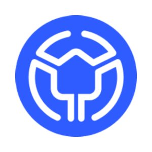 | 18887 | REALUSDV1 | Real USD v1 |
|  | 18888 | FLOURI | Flourishing AI |
| 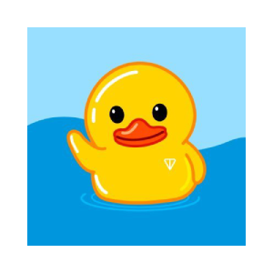 | 18889 | UTYA | Utya |
|  | 18890 | TRAI | Trackgood AI |
| 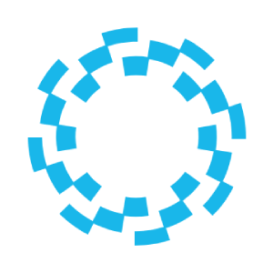 | 18891 | BALANCE | Balance AI |
| 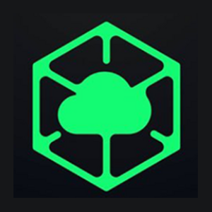 | 18892 | SUD | Sudo Labs |
|  | 18893 | HERAF | Hera Finance |
|  | 18894 | YELP | Yelpro |
|  | 18895 | NORDO | Greenland Rare Bear |
|  | 18896 | GPS | GoPlus Security |
|  | 18897 | UNISDV1 | uniswap State Dollar |
|  | 18898 | PWEASE | Pwease |
|  | 18899 | FUCKTRUMP | FUCK TRUMP |
| 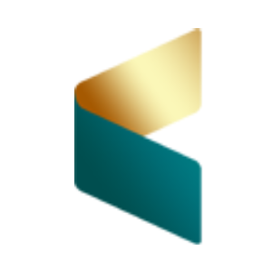 | 18900 | REALESTATE | RealEstate |
|  | 18901 | BTCSR | BTC Strategic Reserve |
| 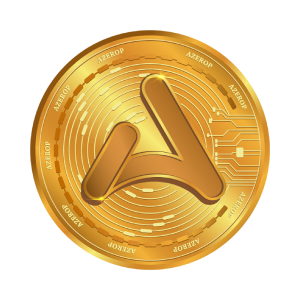 | 18902 | AZER | Azerop |
| 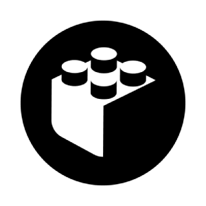 | 18904 | BUIL | BUILD |
| 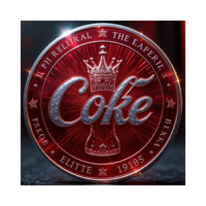 | 18905 | COKEONS | Coke on Sol |
| 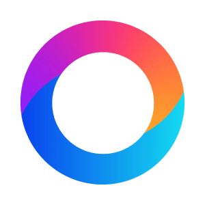 | 18906 | OCNEST | OcNest AI |
|  | 18908 | HOGONSOLANA | HOG |
|  | 18910 | RAME | Ramen |
| 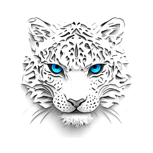 | 18911 | SNO | Snow Leopard |
|  | 18912 | AGEN | Agent Krasnov |
| 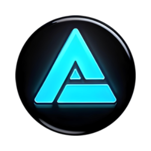 | 18913 | AIREVOLUTION | AI Revolution Coin |
| 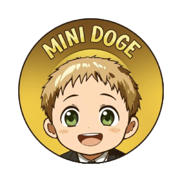 | 18915 | MINIDO | MiniDoge |
| 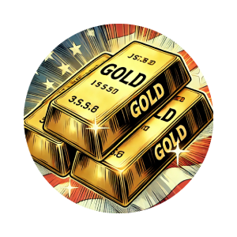 | 18916 | FORTKNOX | Fort Knox |
|  | 18917 | CEREB | Cerebrum |
| 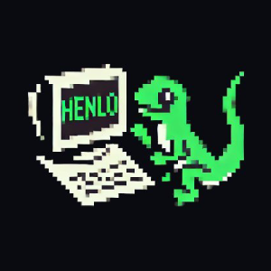 | 18919 | HENL | henlo |
|  | 18920 | PURP | Purple Platform io |
|  | 18921 | HOLDON4 | HoldOn4DearLife |
| 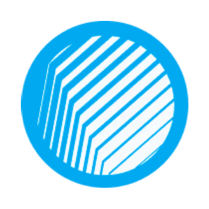 | 18922 | ASF | Asymmetry Finance Token |
| 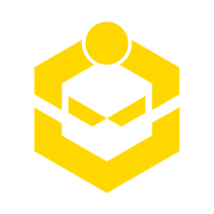 | 18923 | SHDX | Shido DEX |
|  | 18924 | VATAN | Vatan Token |
|  | 18925 | RIDECHAIN | Ride Chain Coin |
| 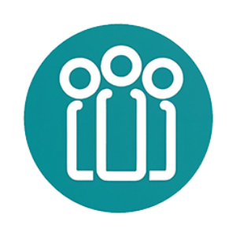 | 18926 | AKAL | AKA Liberty |
| 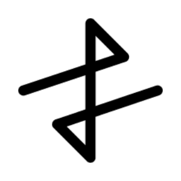 | 18927 | AP3X | Apex token |
| 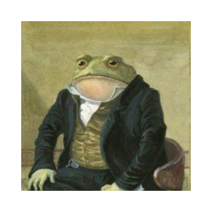 | 18928 | PEPEMUSK | PepeMusk |
|  | 18929 | REACT | Reactive Network |
| 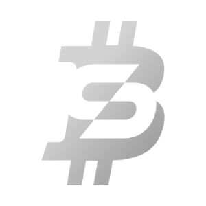 | 18930 | BSAI | Bitcoin Silver AI |
| 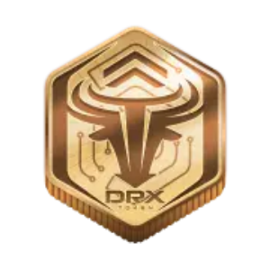 | 18931 | DRX | DRX Token |
|  | 18932 | EARNB | Earn BTC |
|  | 18933 | SOLANATREASURY | Solana Treasury Machine |
| 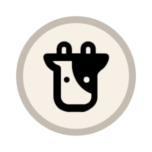 | 18934 | BIFIV1 | Beefy v1 |
| 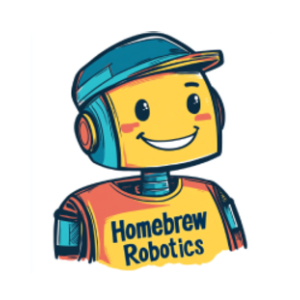 | 18935 | HOMEBREW | Homebrew Robotics Club |
|  | 18936 | USDN | Neutral AI |
| 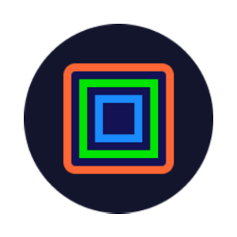 | 18937 | CORTEX | Cortex Protocol |
|  | 18938 | USDQ | Quantoz USDQ |
| 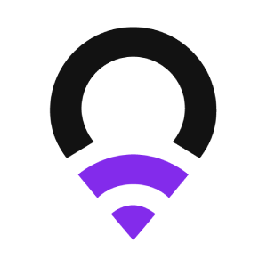 | 18939 | ROAM | Roam Token |
| 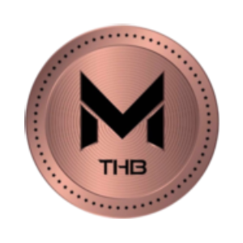 | 18940 | MTHB | MTHAIBAHT |
| 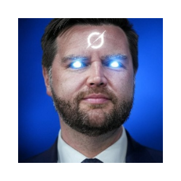 | 18941 | GROKVANCE | GROK VANCE |
| 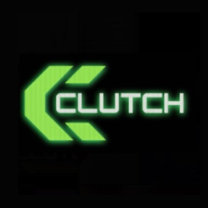 | 18942 | CLUTCH | Clutch |
|  | 18943 | MANUSAI | Manus AI Agent |
|  | 18944 | DPIN | DPIN |
| 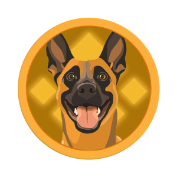 | 18946 | BROCC | Broccoli (broccoliaab.com) |
| 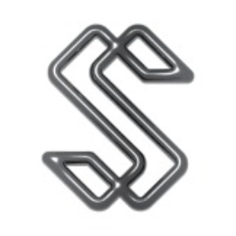 | 18947 | SILVERNOV | Silvernova Token |
|  | 18948 | CARROT | Carrot by Puffer |
| 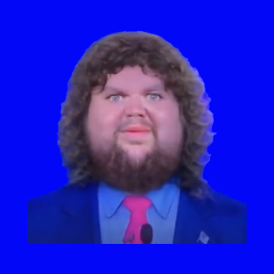 | 18949 | 3DVANCE | 3D Vance |
| 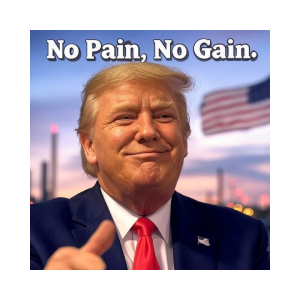 | 18950 | NOPAIN | No Pain No Gain |
| 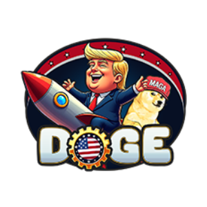 | 18951 | TRUMPDOGECOIN | DOGE (trumpdogecoin.org) |
|  | 18952 | MERG | Merge Token |
| 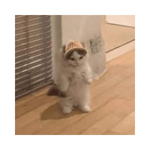 | 18953 | DANCING | Dancing Michi |
|  | 18954 | NVG8 | Navigate |
| 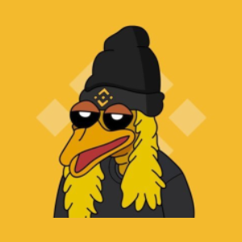 | 18955 | BIRDD | BIRD DOG |
| 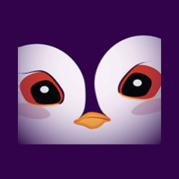 | 18956 | PENGUIN | Penguin (emperor.so) |
|  | 18957 | WBAI | Wrapped Balance AI |
| 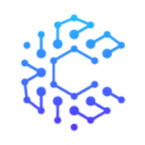 | 18959 | CRYPTOA | CryptoAI |
|  | 18960 | WREACT | Wrapped REACT |
| 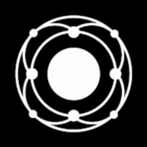 | 18962 | MND | Mind |
| 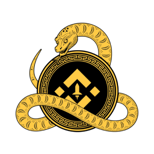 | 18963 | SNAKEMOON | Snakemoon |
|  | 18964 | VANCEMEME | Vance Meme (vancememe.club) |
|  | 18965 | JDV | JD Vance (jdvance.meme) |
| 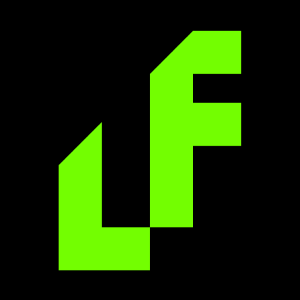 | 18966 | LF | LF |
| 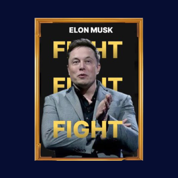 | 18967 | OFFI | Official Elon Coin (elonofficial.xyz) |
| 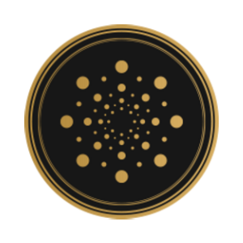 | 18968 | MAGNE | Magnetix |
|  | 18969 | BTRUMP | Baron Trump |
|  | 18970 | XOXO | XO Protocol |
|  | 18971 | SLT | Salute |
|  | 18972 | SSEV1 | Soroosh Smart Ecosystem v1 |
| 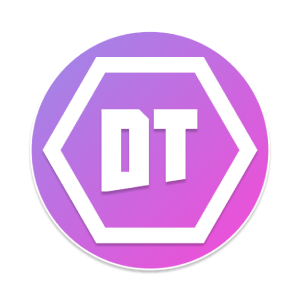 | 18973 | DT | Drift Zone |
|  | 18974 | VYVO | Vyvo AI |
| 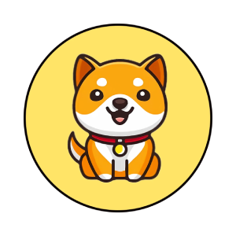 | 18975 | BABYDOGE2 | Baby Doge 2.0 |
|  | 18976 | RICHIE | Richie2.0 |
| 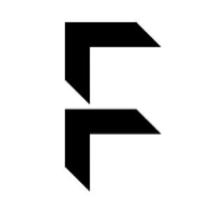 | 18977 | FLOCK | FLock.io |
| 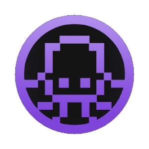 | 18978 | OCTO | OctonetAI |
|  | 18979 | HINT | Hive Intelligence |
|  | 18980 | VIDTV1 | VIDT Datalink |
|  | 18981 | SLC | Silencio |
| 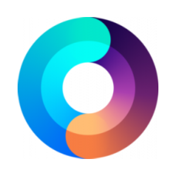 | 18982 | BUNNIV1 | Timeless |
|  | 18983 | NODE | NodelyAI |
| 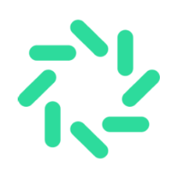 | 18984 | VIA | Octavia AI |
|  | 18985 | TRUMPTESLA | Trump Tesla |
|  | 18986 | OIK | Space Nation |
| 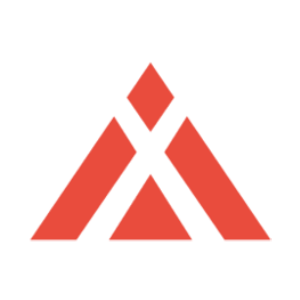 | 18987 | SYMM | Symmio |
| 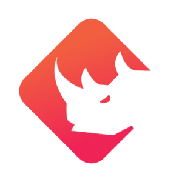 | 18988 | BNXV1 | BinaryX v1 |
|  | 18989 | WINX | WinX.io |
|  | 18990 | DISTRIBUTE | DISTRIBUTE |
|  | 18991 | COCORO | Cocoro (cocorobnb.meme) |
|  | 18993 | COCOR | Cocoro (cocorosolana.xyz) |
|  | 18994 | BROC | Broccoli (broc.wtf) |
|  | 18995 | DEERSEIZED | Deer Seized by US Government |
|  | 18996 | POPG | POPG |
|  | 18997 | ATMBSC | ATM |
|  | 18999 | POKEMO | Pokemon (pokemon2025.xyz) |
|  | 19000 | AIV | AIVeronica |
|  | 19001 | STITCH | Stitch |
|  | 19002 | BGEO | BGEO |
|  | 19003 | ADAI | Aave Interest bearing DAI |
|  | 19004 | LILO | Lilo |
|  | 19005 | DDM | DDM Deutsche Mark |
|  | 19006 | VPT | Veritas Protocol |
|  | 19007 | DOPEX | DOPE |
|  | 19008 | MUBARAK | mubarak |
|  | 19009 | DSHELL | DiamondShell |
|  | 19010 | FRXUSD | Frax USD |
|  | 19011 | SFRXUSD | Staked Frax USD |
|  | 19012 | TOOTHLESS | Toothless |
|  | 19014 | 1OZT | Tala |
|  | 19015 | PELL | PELL Network Token |
|  | 19016 | DAIWO | D.A.I.Wo |
|  | 19017 | TAXP | Taxpad |
|  | 19018 | MEMEA | MEME AI |
|  | 19019 | MANTI | Mantis |
|  | 19020 | AMR | Amero |
|  | 19021 | SHRX | Sherex |
|  | 19022 | DAVINC | DaVinci Protocol |
|  | 19023 | NOEL | AskNoel |
|  | 19024 | LABZBASE | Insane Labz (Base) |
|  | 19026 | ASIXDEV | ASIX |
|  | 19028 | ARACOIN | Ara |
|  | 19029 | BASEDALF | Based Alf |
|  | 19030 | SHREK | Shrek |
|  | 19032 | WEHODL | HODL |
|  | 19034 | GAMEBYV | GAME by Virtuals |
|  | 19035 | BUILDON | Build On BNB |
|  | 19036 | CUSDO | Compounding Open Dollar |
|  | 19037 | KTA | Keeta |
|  | 19038 | DOODI | Doodipals |
|  | 19039 | BUI | Build forward |
|  | 19040 | FISHW | Fishwar |
|  | 19041 | DRIP | Metadrip |
|  | 19043 | BOBTHE | Bob The Builder |
|  | 19044 | BLUEBASE | Blue |
|  | 19045 | DICKBUTT | Dickbutt |
|  | 19046 | LUM | Luminous |
|  | 19047 | ODOS | Odos |
|  | 19048 | SHORT | Bermuda Shorts |
|  | 19049 | BNBAICLUB | BNB AI Agent |
|  | 19050 | MNSRY | Mansory |
|  | 19051 | WNKV1 | The Winkyverse v1 |
|  | 19052 | WTFO | WTF Opossum |
|  | 19053 | SFAGRO | SFAGRO |
|  | 19054 | TRDX | Trendix |
|  | 19055 | FLOCO | flocoin |
|  | 19056 | IBERA | Infrared Bera |
|  | 19057 | COINLION | CoinLion |
|  | 19058 | SFMV2 | SafeMoon v2 |
|  | 19059 | LION | Loaded Lions |
|  | 19060 | CAI | Chasm |
|  | 19061 | TTM | Tradetomato |
|  | 19062 | KET | yellow ket (ketboard.xyz) |
|  | 19063 | ATN | ATHENE NETWORK |
|  | 19064 | USDA | USDa |
|  | 19065 | RED | RedStone |
|  | 19066 | SSE | Solana Social Explorer |
|  | 19067 | FORMNET | Form |
|  | 19068 | TRIP | Trip |
|  | 19069 | GRAB | GRABWAY |
|  | 19070 | RX | RealtyX |
|  | 19071 | AO | AO |
|  | 19072 | BUBB | Bubb |
|  | 19073 | CORXB | CorionX BSC |
|  | 19074 | BARAKATUH | Barakatuh |
|  | 19075 | LEGAL | LegalX |
|  | 19076 | HYPERSKIDS | HYPERSKIDS |
|  | 19077 | GLUE | Glue |
|  | 19078 | SAMS | Samsara.Build |
|  | 19079 | PATLU | Patlu |
|  | 19080 | ZEDXIONV1 | Zedxion v1 |
|  | 19081 | PIGLET | PIGLET |
|  | 19082 | BOMBLOONG | Bombloong |
|  | 19083 | ROUTINE | Morning Routine |
|  | 19084 | TITCOIN | titcoin |
|  | 19085 | QUQ | quq |
|  | 19086 | AGNT | iAgent Protocol |
|  | 19087 | NIL | Nillion |
|  | 19088 | TEMM | TEM MARKET |
|  | 19089 | MSURE | inSure (Multichain Bridge) |
|  | 19090 | PSURE | inSure (Polygon Portal) |
|  | 19091 | LISAS | Lisa Simpson |
|  | 19093 | HOMERS | Homer |
|  | 19095 | SPONG | Spongebob |
|  | 19096 | MODERN | Bitcoin Modern |
|  | 19097 | CRYPTAL | CrypTalk |
|  | 19098 | CTH | Changcoin |
|  | 19099 | WCTH | Wrapped CTH Token |
|  | 19100 | ASBNB | Astherus Staked BNB |
|  | 19101 | PARTI | PARTI Token |
|  | 19102 | BUIDL | BlackRock USD Institutional Digital Liquidity Fund |
|  | 19103 | BUIDLI | BlackRock USD Institutional Digital Liquidity Fund - I Class |
|  | 19104 | MUBARAKAH | Mubarakah (mubarakah.cn) |
|  | 19105 | MUB | Mubarak on Base (mubarakonbase.com) |
|  | 19106 | BABYMUB | Baby Mubarak |
|  | 19107 | PBUSD | Binance USD (Polygon Portal) |
|  | 19109 | MUBA | mubarak (mubarakcz.club) |
|  | 19110 | GINI | Kalp |
|  | 19111 | OFFICIALUSA | Official USA Token |
|  | 19112 | MBUSD | Binance USD (Multichain Bridge) |
|  | 19113 | DOYOUR | Do Your Own Research |
|  | 19114 | LVLUSD | Level USD |
|  | 19115 | QUSDT | Tether (Qom.One Bridge) |
|  | 19116 | SPEED | IShowSpeed |
|  | 19117 | SYRUPUSDC | SyrupUSDC |
|  | 19118 | ACRED | Apollo Diversified Credit Securitize Fund |
|  | 19119 | PUNDIAI | Pundi AI |
|  | 19120 | NFPV1 | Token NFPrompt Token v1 |
|  | 19121 | BANANAS31 | Banana For Scale |
|  | 19122 | QUAI | Quai Network |
|  | 19123 | IMGN | IMGN Labs |
|  | 19124 | BYB | BiorBank |
|  | 19125 | WFRAGSOL | Wrapped fragSOL |
|  | 19126 | REUSDC | Relend USDC |
|  | 19127 | GHIBLI | Ghiblification |
|  | 19128 | DOGEMARS | DOGE TO MARS |
|  | 19129 | SHAREV1 | Seigniorage Shares v1 |
|  | 19130 | XP | Xphere |
|  | 19131 | FORM | Four |
|  | 19132 | BOX | DeBoxToken |
|  | 19133 | BUT | Bucket Token |
|  | 19134 | FOUR | 4 |
|  | 19135 | AFT | AIFlow Token |
|  | 19136 | BNBCARD | BNB Card |
|  | 19137 | B3TR | VeBetterDAO |
|  | 19138 | MT | Mint Token |
|  | 19139 | GHIBLIDOGE | Ghibli Doge |
|  | 19140 | AIP | AI Protocol |
|  | 19141 | XBX | CoinDesk Bitcoin Price Index  |
|  | 19142 | ETX | CoinDesk Ether Price Index |
|  | 19143 | AICE | Aicean |
|  | 19144 | ANNE | ANNE |
|  | 19145 | GHIBLIELON | Ghibli Elon |
|  | 19148 | DUCKV1 | COL |
|  | 19149 | BR | Bedrock |
|  | 19150 | GHHS | GHHS Healthcare |
|  | 19152 | MUBAR | mubarak (mubarakcoin.link) |
|  | 19153 | BBQ | BBQ COIN |
|  | 19154 | ABSIMPSON | abstract simpson |
|  | 19155 | AVERY | Avery Games |
|  | 19156 | MOSS | MOSS |
|  | 19157 | GHIBLIAI | Ghibli AI Agent |
|  | 19158 | DNAPEPE | DNA PEPE |
|  | 19159 | RNAPEPE | RNA PEPE |
|  | 19160 | SHRI | Shrimp Paste |
|  | 19161 | MALOU | MALOU Token |
|  | 19162 | PEPEDNA | PEPE DNA |
|  | 19163 | TUPE | Turtle Pepe |
|  | 19164 | WORKIE | Workie |
|  | 19165 | DUSTY | Dusty |
|  | 19166 | BABYKOMA | Baby Koma |
|  | 19167 | KNUT | Knut From Zoo |
|  | 19168 | DUCAT | Ducat |
|  | 19169 | IONP | Ion Power Token |
|  | 19170 | CRAZE | Craze |
|  | 19171 | VTRV | VitraVerse |
|  | 19172 | DZA | DZA |
|  | 19173 | BABYPENGU | BABY PENGU |
|  | 19174 | CALLS | OnlyCalls by Virtuals |
|  | 19175 | BOHRV1 | BOHR v1 |
|  | 19176 | VAIN | Vainguard by Virtuals |
|  | 19177 | LOKY | Loky by Virtuals |
|  | 19178 | OLYN | Olyn by Virtuals |
|  | 19179 | PMILLI | Million (Polygon Portal) |
|  | 19180 | ARQX | ARQx AI |
|  | 19181 | SAAD | Saad Boi |
|  | 19182 | BAKENEKO | BAKENEKO |
|  | 19183 | SYRAX | Syrax AI |
|  | 19184 | UNIBTC | uniBTC |
|  | 19185 | MMILLI | Million (Multichain Bridge) |
|  | 19186 | WMILLI | Million (Portal Bridge) |
|  | 19187 | B2 | B² Network |
|  | 19188 | COLS | Cointel |
|  | 19189 | RAMV1 | Ramifi Protocol v1 |
|  | 19190 | RETAR | Retard Finder Coin |
|  | 19191 | DEURO | DecentralizedEURO |
|  | 19192 | ROBOCOIN | First Bitcoin ATM |
|  | 19193 | ALEXIUS | Alexius Maximus |
|  | 19194 | AVRK | Avarik Saga |
|  | 19195 | GHI | Ghibli HeYi |
|  | 19196 | BINA | Binance Mascort Dog |
|  | 19197 | AITHER | Aither Protocol |
|  | 19198 | HOPECOIN | Hopecoin |
|  | 19199 | ZKGPT | ZKGPT |
|  | 19200 | HNTV1 | Helium v1 |
|  | 19201 | DRAGONZ | Dragonz Land |
|  | 19202 | SNOR | SNOR |
|  | 19203 | POLLEN | Beraborrow |
|  | 19204 | GHIB | GhibliCZ |
|  | 19205 | AIRENE | AIRENE by Virtuals |
|  | 19206 | PEAGUY | The Pea Guy by Virtuals |
|  | 19207 | XTER | Xterio |
|  | 19208 | SHRUBIUS | Shrubius Maximus |
|  | 19209 | PNDN | Pandana |
|  | 19210 | SLVLUSD | Staked Level USD |
|  | 19211 | SIMPSONAI | Simpson AI Agent |
|  | 19212 | DATBOI | Dat Boi |
|  | 19213 | DIGGAI | DIGGER AI |
|  | 19214 | CSUSDL | Coinshift USDL Morpho Vault |
|  | 19215 | MEMEX | Meme Index |
|  | 19216 | AETHRA | Aethra AI |
|  | 19217 | X33 | Shadow Liquid Staking Token |
|  | 19218 | SLAYER | ThreatSlayerAI by Virtuals |
|  | 19219 | STHYPE | Staked HYPE |
|  | 19220 | DRPXBT | Hunter by Virtuals |
|  | 19221 | BNKR | BankrCoin |
|  | 19223 | STSHIP | StarShip |
|  | 19224 | ASUSDF | Astherus Staked USDF |
|  | 19225 | TSO | Thesirion |
|  | 19226 | CORN | Corn |
|  | 19227 | IBGT | Infrared BGT |
|  | 19228 | GASP | GASP |
|  | 19229 | EPIC | Epic Chain |
|  | 19230 | DLC | DeepLink |
|  | 19231 | DOLLY | DOLLY |
|  | 19232 | ELVIS | ELVIS |
|  | 19233 | WAL | WAL Token |
|  | 19234 | HODLV2 | HODL |
|  | 19235 | HODLV1 | HODL v1 |
|  | 19236 | SHONG | Shong Inu |
|  | 19237 | MNEMO | Mnemonics |
|  | 19238 | FISH2 | FISH2 |
|  | 19239 | IMGX10 | IMGx10 |
|  | 19240 | DIGI | Digicoin |
|  | 19241 | BABYLON | Babylon |
|  | 19242 | BIKE | White Bike |
|  | 19243 | GHIBL | Ghibli Zao |
|  | 19244 | BNBETF | BNB ETF |
|  | 19245 | NYS | node.sys |
|  | 19247 | PUMPB | Pump |
|  | 19248 | K | Kinto |
|  | 19249 | PERCY | Percy Verence |
|  | 19250 | DOGEIUS | DOGEIUS |
|  | 19251 | OPERATOR | OpenAI Agent |
|  | 19252 | TUT | Tutorial |
|  | 19253 | ABTUSD | True USD (Arbitrum Bridge) |
|  | 19254 | BMT | Bubblemaps |
|  | 19255 | OTUSD | True USD (Optimism - SuperChain Bridge) |
|  | 19256 | USDGLOBI | Globiance USD Stablecoin |
|  | 19257 | USDG | Global Dollar |
|  | 19258 | USDGV1 | USDG v1 |
|  | 19259 | DPINO | DarkPino |
|  | 19260 | REMUS | REMUS |
|  | 19261 | RWAECO | RWA Ecosystem |
|  | 19262 | NVB | NovaBank |
|  | 19264 | BOOGIE | Boogie |
|  | 19265 | APTM | Apertum |
|  | 19266 | SOLVEX | SOLVEX |
|  | 19267 | REDX | REDX |
|  | 19268 | GLDS | Glades |
|  | 19269 | TRUMPG | TRUMP GROK |
|  | 19270 | GUN | GUNZ |
|  | 19271 | BRAINROT | AI Brainrot |
|  | 19272 | MAXIMUSA | Kekius Maximusa |
|  | 19273 | CHADETTE | Chadette |
|  | 19274 | FAIR3 | Fair and Free |
|  | 19275 | TTT | TRUMPETTOKEN |
|  | 19276 | VADER | VaderAI |
|  | 19277 | MCD | McDonald's Job Application |
|  | 19278 | PROMPT | Wayfinder |
|  | 19279 | KILO | KiloEx |
|  | 19280 | AVAAI | Ava AI |
|  | 19281 | ALCH | Alchemist AI |
|  | 19282 | AEGS | Aegisum |
|  | 19283 | DUOLINGOAI | DUOLINGO AI |
|  | 19284 | TRUMPI | TRUMP IP |
|  | 19285 | PALCOIN | Palcoin Ventures |
|  | 19286 | BDSM | BTC DOGE SOL MOON |
|  | 19287 | FARTIMUS | Fartimus Prime |
|  | 19288 | LOGOS | LOGOSAI |
|  | 19289 | ENVOY | Envoy A.I |
|  | 19290 | ALCHEMYV2 | Alchemy |
|  | 19291 | BLIFFY | BLIFFY |
|  | 19292 | LPENGU | Lil Pudgys |
|  | 19293 | WEBSIM | The Css God by Virtuals |
|  | 19294 | BIGJIM | BIG JIM |
|  | 19295 | FRGB | Pepe's Frogbar |
|  | 19296 | CORA | Cora by Virtuals |
|  | 19297 | NOMAI | nomAI by Virtuals |
|  | 19298 | LUCIC | Lucidum Coin |
|  | 19299 | ESIM | EvoSimGame |
|  | 19300 | ALIENS | Aliens |
|  | 19301 | KERNEL | KernelDAO |
|  | 19302 | MORTY | Morty |
|  | 19303 | LONGEVITY | longevity |
|  | 19304 | DEEPSEEKAI | DeepSeek AI Agent (deepseek2025.xyz) |
|  | 19305 | DEEPS | DeepSeek AI (deepseekai.vip) |
|  | 19306 | CD20SPOT | CoinDesk 20 Spot Index |
|  | 19307 | DEEPSE | DeepSeek AI Assistant (deepseekai.club) |
|  | 19308 | PALCOINV1 | PALCOIN Venture Capital v1 |
|  | 19311 | DEEPSEE | DeepSeek AI (deepseekaibnb.com) |
|  | 19312 | LVVA | Levva Protocol Token |
|  | 19314 | COCOROERC | COCORO (cocoroerc.com) |
|  | 19315 | SOLEY | Soley |
|  | 19316 | BULLSEYE | bulls-eye |
|  | 19317 | KLKSYNC | KLK Sync Protocol |
|  | 19318 | KULA | Kula |
|  | 19319 | FHE | MindNetwork FHE Token |
|  | 19320 | IAOMIN | Yao Ming |
|  | 19321 | JARVIS | Jarvis AI |
|  | 19322 | BDTC | BDTCOIN |
|  | 19323 | WCT | WalletConnect |
|  | 19324 | PPOM | MANTRA (Polygon Portal) |
|  | 19325 | GMUBARAK | Ghibli Mubarak |
|  | 19326 | AQA | AQA Token |
|  | 19327 | BINAN | Binance Mascot |
|  | 19329 | TOADCOIN | TOAD |
|  | 19330 | WIOTA | wIOTA |
|  | 19331 | RWA | RWA Inc. |
|  | 19332 | NUMI | NUMINE Token |

---

[← Prev](./list18.md)
