# Cryptocurrency list

### page: 2

[← Prev](../list.md) | [Next →](./list3.md)

| Logo | ID | Symbol | Name |
|:----:|:--:|:------:|:-----|
|  | 1026 | PHNX | PhoenixDAO |
|  | 1027 | BAR | FC Barcelona Fan Token |
|  | 1028 | BITCI | Bitcicoin |
|  | 1029 | ROUTE | Router Protocol |
|  | 1030 | 1ECO | 1eco |
|  | 1031 | DG | Decentral Games |
| 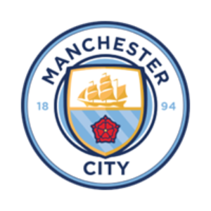 | 1032 | CITY | Manchester City Fan Token |
|  | 1033 | POOLXT | Proof of Liquidity |
| 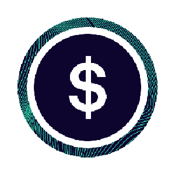 | 1034 | SUSD | sUSD |
| 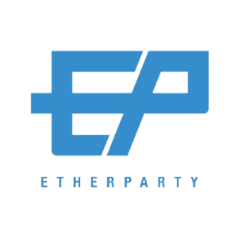 | 1035 | ETHER | Etherparty |
| 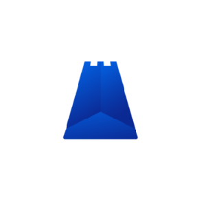 | 1036 | SHX | Stronghold Token |
| 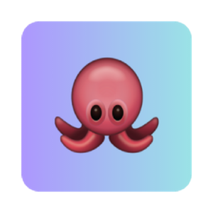 | 1037 | OCTOF | OctoFi |
|  | 1038 | CRA | Crabada |
|  | 1039 | RATING | DPRating |
| 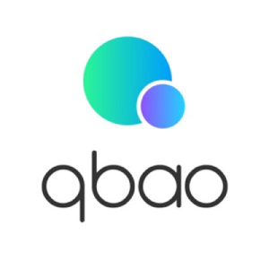 | 1040 | QBAO | Qbao |
| 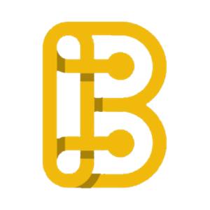 | 1041 | BSCPAD | BSCPAD |
| 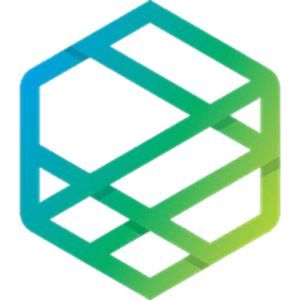 | 1042 | ZPT | Zeepin |
|  | 1043 | RMRK | RMRK.app |
|  | 1044 | TPT | Token Pocket |
|  | 1045 | KILT | KILT Protocol |
| 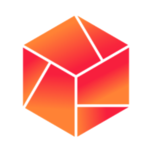 | 1046 | SAITO | Saito |
| 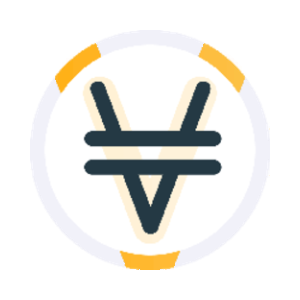 | 1047 | VXVS | Venus XVS |
|  | 1048 | BNANA | Chimpion |
|  | 1049 | MEV | MEVerse |
|  | 1050 | PIT | Pitbull |
| 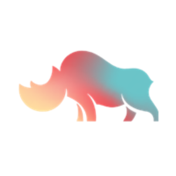 | 1051 | DVF | Rhino.fi |
|  | 1052 | YLD | YIELD App |
|  | 1054 | HDAO | Hkd.com Dao |
|  | 1055 | NMC | Namecoin |
|  | 1056 | BIDR | Binance IDR Stable Coin |
|  | 1057 | TOKE | Tokemak |
| 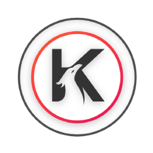 | 1058 | KAR | Karura |
|  | 1059 | MET | Metronome |
| 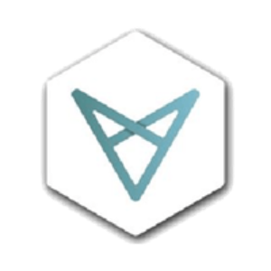 | 1060 | VXV | Vectorspace AI |
|  | 1061 | RCN | Ripio Credit Network |
|  | 1062 | PDEX | Polkadex |
| 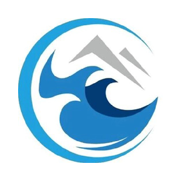 | 1063 | CPC | CPChain |
| 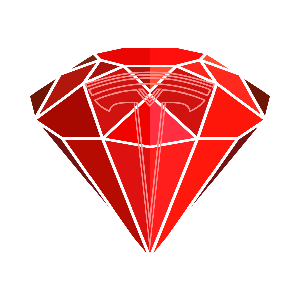 | 1064 | BTRS | Bitball Treasure |
| 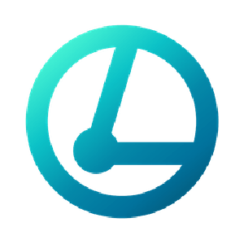 | 1065 | LBXC | LUX BIO EXCHANGE COIN |
|  | 1066 | DAX | DAEX |
| 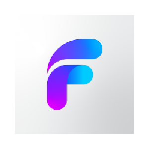 | 1067 | FEG | FEG Token |
|  | 1068 | VBIT | Valobit |
| 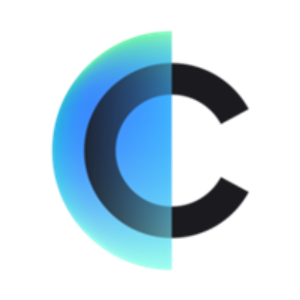 | 1069 | CPOOL | Clearpool |
| 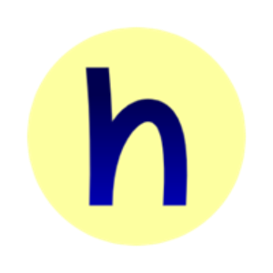 | 1070 | HOPR | HOPR |
|  | 1071 | STOS | Stratos |
| 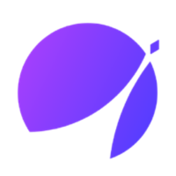 | 1072 | APX | ApolloX |
|  | 1073 | BOO | Spookyswap |
| 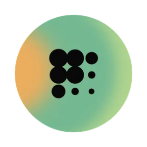 | 1074 | PROS | Prosper |
| 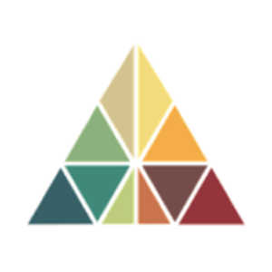 | 1075 | BLCT | Bloomzed Loyalty Club Ticket |
|  | 1076 | ABONDV1 | ApeSwap |
| 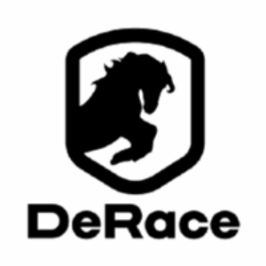 | 1077 | DERC | DeRace |
|  | 1078 | ATOLO | RIZON |
|  | 1079 | CRTS | Cratos |
| 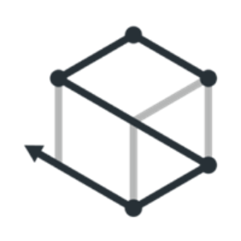 | 1080 | STAT | STAT |
| 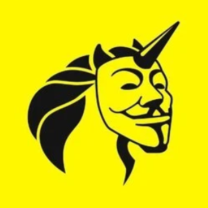 | 1081 | HAPI | HAPI |
|  | 1082 | URUS | Urus Token |
| 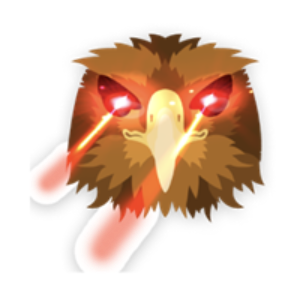 | 1083 | QOM | Shiba Predator |
| 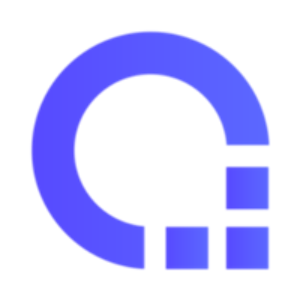 | 1084 | ALIT | Alitas |
|  | 1085 | IHF | Invictus Hyperion Fund |
| 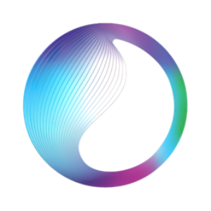 | 1086 | SDAO | SingularityDAO |
| 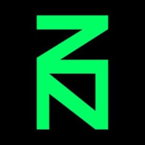 | 1087 | ZNN | Zenon |
|  | 1088 | OXEN | Oxen |
|  | 1089 | PPC | PeerCoin |
| 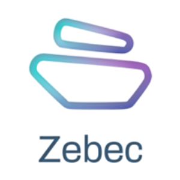 | 1091 | ZBC | Zebec Protocol |
| 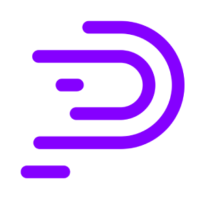 | 1092 | NCT | PolySwarm |
| 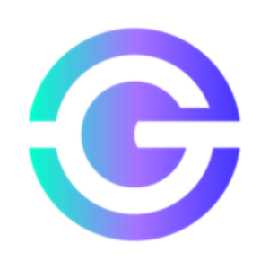 | 1093 | GXA | Galaxia |
| 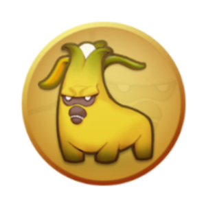 | 1094 | PEEL | Meta Apes |
|  | 1095 | RISE | EverRise |
| 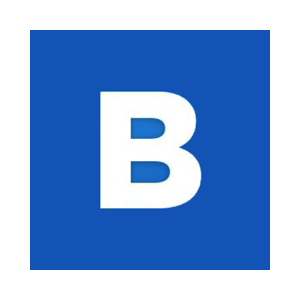 | 1096 | BTSE | BTSE Token |
|  | 1097 | MANC | Mancium |
| 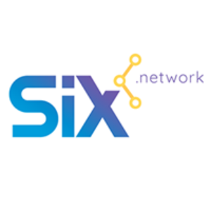 | 1098 | SIX | SIX Network |
| 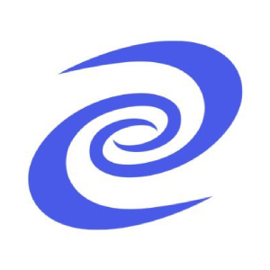 | 1099 | DPR | Deeper Network |
|  | 1100 | MWC | MimbleWimbleCoin |
| 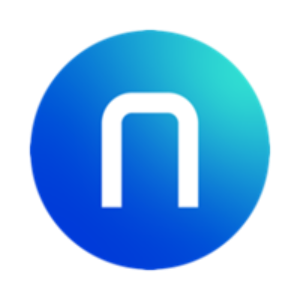 | 1101 | PTU | Pintu Token |
|  | 1102 | BABY | BabySwap |
| 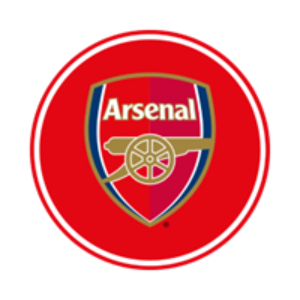 | 1103 | AFC | Arsenal Fan Token |
| 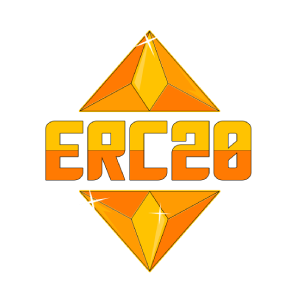 | 1104 | ERC20 | ERC20 |
| 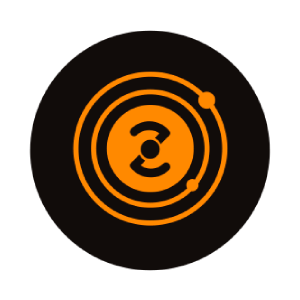 | 1105 | ZKS | ZKSpace |
| 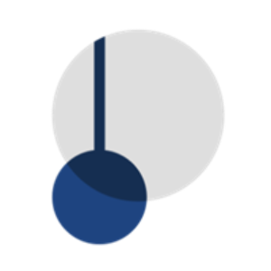 | 1106 | PENDLE | Pendle |
|  | 1107 | VALOR | Valor Token |
|  | 1108 | GMAT | GoWithMi |
|  | 1109 | PLIAN | Plian |
|  | 1110 | ECTE | EurocoinToken |
|  | 1111 | JUV | Juventus Fan Token |
|  | 1112 | DACXI | Dacxi |
| 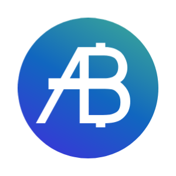 | 1113 | NEW | Newton Project |
| 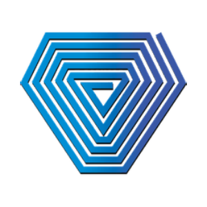 | 1114 | FUND | Unification |
| 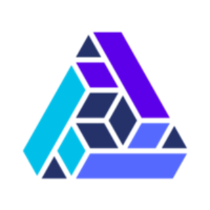 | 1115 | THETRANSFERTOKEN | The Transfer Token |
| 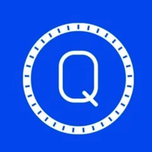 | 1116 | QASH | QASH |
|  | 1117 | IDRT | Rupiah Token |
| 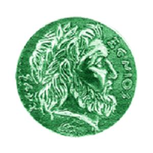 | 1118 | XNC | Xenios |
| 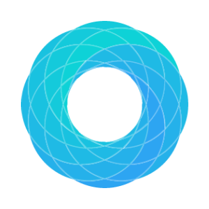 | 1119 | OBSR | Observer |
|  | 1120 | MVC | MileVerse |
|  | 1121 | PALLA | Pallapay |
|  | 1122 | ADP | Adappter Token |
|  | 1123 | HOGE | Hoge Finance |
| 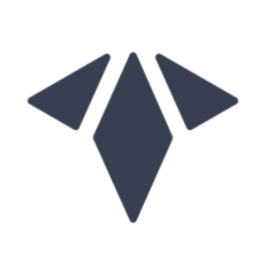 | 1124 | RAE | Receive Access Ecosystem |
|  | 1125 | QRL | Quantum Resistant Ledger |
|  | 1126 | GRID | Grid+ |
| 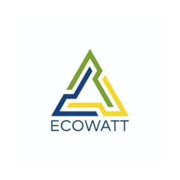 | 1127 | ECOW | Ecowatt |
| 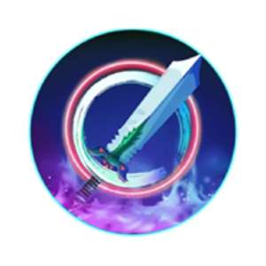 | 1128 | MCRT | MagicCraft |
|  | 1129 | KDAG | King DAG |
|  | 1130 | LSS | Lossless |
|  | 1131 | PZM | Prizm |
|  | 1132 | MOBI | Mobius |
|  | 1133 | SPA | Sperax |
|  | 1134 | SOC | All Sports X |
|  | 1135 | UNCX | UniCrypt |
|  | 1136 | BTC2 | Bitcoin 2 |
|  | 1137 | QTCON | Quiztok |
|  | 1138 | VINU | Vita Inu |
|  | 1139 | SOMA | Soma |
|  | 1140 | XDEFI | XDEFI |
|  | 1141 | CIV | Civilization |
|  | 1142 | TAMA | Tamadoge |
|  | 1143 | INNBC | Innovative Bioresearch Coin |
|  | 1144 | BNTY | Bounty0x |
|  | 1145 | BASIC | BASIC |
|  | 1146 | TAAS |  Token as a Service |
|  | 1147 | ES | Era Swap Token |
|  | 1148 | TEMCO | TEMCO |
|  | 1149 | XEP | Electra Protocol |
|  | 1150 | PETRODOLLAR | PetroDollar |
|  | 1151 | SOCKS | Unisocks |
|  | 1152 | OST | OST |
|  | 1153 | MSOL | Marinade Staked SOL |
|  | 1154 | LTX | Lattice Token |
|  | 1155 | RDD | Reddcoin |
|  | 1156 | TREEB | Retreeb |
|  | 1157 | INTER | Inter Milan Fan Token |
|  | 1158 | BANANO | Banano |
|  | 1159 | DIO | Decimated |
|  | 1160 | IHC | Inflation Hedging Coin |
|  | 1161 | TNC | TNC Coin |
|  | 1162 | GOVI | Govi |
|  | 1163 | GUP | Guppy |
|  | 1164 | POSI | Position Token |
|  | 1165 | POKT | Pocket Network |
|  | 1166 | GOC | GoCrypto |
|  | 1167 | XMC | Monero Classic |
|  | 1168 | SHPING | Shping Coin |
|  | 1169 | XCHNG | Chainge Finance |
|  | 1170 | NXS | Nexus |
|  | 1171 | WNCG | Wrapped NCG |
|  | 1172 | EVY | EveryCoin |
|  | 1173 | NUM | Numbers Protocol |
|  | 1174 | CLD | Cloud |
|  | 1175 | NAKA | Nakamoto Games |
|  | 1176 | BAAS | BaaSid |
|  | 1177 | PEAK | PEAKDEFI |
|  | 1178 | PEARL | Pearl Finance |
|  | 1179 | EMRX | Emirex Token |
|  | 1180 | FCL | Fractal |
|  | 1181 | ASTA | ASTA |
|  | 1182 | VEX | Vexanium |
|  | 1183 | ARIA20 | Arianee |
|  | 1184 | FRTS | Fruits |
|  | 1185 | CELOUSD | Celo Dollar |
|  | 1186 | GTH | Global Human Trust |
|  | 1187 | CAJ | Cajutel |
|  | 1188 | XTP | Tap |
|  | 1189 | EPICCASH | Epic Cash |
|  | 1190 | OVR | Ovr |
|  | 1191 | EOSDAC | eosDAC |
|  | 1192 | WISE | Wise Token |
|  | 1193 | BIOT | Bio Passport |
|  | 1194 | VBG | Vibing |
|  | 1195 | ZEE | ZeroSwap |
|  | 1196 | AWC | Atomic Wallet Coin |
|  | 1197 | MNTP | GoldMint |
|  | 1198 | THG | Thetan Arena |
|  | 1199 | VRM | Verium |
|  | 1200 | XPX | ProximaX |
|  | 1201 | PCX | ChainX |
|  | 1202 | CRON | Cryptocean |
|  | 1203 | VEE | BLOCKv |
|  | 1204 | TRV | TrustVerse |
|  | 1205 | SCP | ScPrime |
|  | 1206 | CLOAK | CloakCoin |
|  | 1207 | BRG | Bridge Oracle |
|  | 1208 | PPY | Peerplays |
|  | 1209 | WAXL | Wrapped Axelar |
|  | 1210 | LBK | LBK |
|  | 1211 | INSTAR | Insights Network |
|  | 1212 | FSW | Falconswap |
|  | 1213 | DIME | DimeCoin |
|  | 1214 | TSHP | 12Ships |
|  | 1215 | KSHIB | Kilo Shiba Inu |
|  | 1216 | ASK |  Permission Coin |
|  | 1217 | ETH2 | Eth 2.0 Staking by Pool-X |
|  | 1218 | VDAI | Venus DAI |
|  | 1219 | MOF | Molecular Future (TRC20) |
|  | 1220 | FOAM | Foam |
|  | 1221 | BUX | BUX |
|  | 1222 | ACX | Across Protocol |
|  | 1223 | RONIN | Ronin |
|  | 1224 | AURY | Aurory |
|  | 1225 | CCT | Carbon Credit |
|  | 1226 | APIX | APIX |
|  | 1227 | YEE | Yeeco |
|  | 1228 | MINTME | MintMe.com Coin |
|  | 1229 | ASR | AS Roma Fan Token |
|  | 1231 | ARG | Argentine Football Association Fan Token |
|  | 1232 | HIBS | Hiblocks |
|  | 1233 | VRT | Venus Reward Token |
|  | 1234 | ZASH | ZIMBOCASH |
|  | 1235 | MEDAMON | Medamon |
|  | 1236 | FRA | Findora |
|  | 1237 | MOD | Modefi |
|  | 1238 | BEZ | Bezop |
|  | 1239 | JETCOIN | Jetcoin |
|  | 1240 | JET | Jet Protocol |
|  | 1241 | CUBE | Somnium Space CUBEs |
|  | 1242 | CUBENETWORK | Cube Network |
|  | 1243 | TRECENTO | Trecento Blockchain Capital |
|  | 1244 | MOGUL | Mogul Productions |
|  | 1245 | TBC | Ten Best Coins |
|  | 1246 | BITCRATIC | Bitcratic Token |
|  | 1247 | BCT | Toucan Protocol: Base Carbon Tonne |
|  | 1248 | STARLAUNCH | StarLaunch |
|  | 1249 | BITAIR | Bitair |
|  | 1250 | BTCA | BITCOIN ADDITIONAL |
|  | 1251 | GET | Guaranteed Entrance Token |
|  | 1252 | ASSARA | ASSARA |
|  | 1253 | HVN |  Hiveterminal Token |
|  | 1254 | ASSA | AssaPlay |
|  | 1255 | BONK | BONK |
|  | 1256 | NSBT | Neutrino Token |
|  | 1257 | REAP | ReapChain |
|  | 1258 | SNET | Snetwork |
|  | 1259 | EQUAD | Quadrant Protocol |
|  | 1260 | ATP | Atlas Protocol |
|  | 1261 | BULLIONFX | BullionFX |
|  | 1262 | 8X8 | 8X8 Protocol |
|  | 1263 | XPN | PANTHEON X |
|  | 1264 | COUNOS | Counos Coin |
|  | 1265 | CCA | Commodity Circulation Accelerator |
|  | 1266 | TACHYON | Tachyon Protocol |
|  | 1267 | NFTLOOT | NFTLootBox |
|  | 1268 | IPX | InpulseX |
|  | 1269 | SAKE | SakeToken |
|  | 1270 | LEVERJ | Leverj |
|  | 1271 | BCDN | BlockCDN |
|  | 1272 | LEV | Levante U.D. Fan Token |
|  | 1273 | ISR | Insureum |
|  | 1274 | QTF | Quantfury |
|  | 1275 | AZUM | Azuma Coin |
|  | 1276 | CDX | CDX Network |
|  | 1277 | SFI | Saffron.finance |
|  | 1278 | SDUSD | SDUSD |
|  | 1279 | GOD | Bitcoin God |
|  | 1280 | PHIGOLD | PhiGold Coin |
|  | 1281 | PGX | Pegaxy Stone |
|  | 1282 | TIPS | FedoraCoin |
|  | 1283 | KRUGERCOIN | KrugerCoin |
|  | 1284 | XAYA | XAYA |
|  | 1285 | WWDOGE | https://dogechain.dog/ |
|  | 1286 | DC | Dogechain |
|  | 1287 | AWX | AurusX |
|  | 1288 | CNHT | Tether CNH |
|  | 1289 | PROB | ProBit Token |
|  | 1290 | FCT | FirmaChain |
|  | 1291 | SWASH | Swash |
|  | 1292 | XDAI | xDai |
|  | 1293 | SOP | SoPay |
|  | 1295 | GULF | GulfCoin |
|  | 1296 | ORAI | Oraichain Token |
|  | 1297 | BFT | BnkToTheFuture |
|  | 1298 | MINX | InnovaMinex |
|  | 1299 | NAX | NextDAO |
|  | 1300 | ADEL | Akropolis Delphi |
|  | 1301 | BTCV | Bitcoin Vault |
|  | 1302 | SENC | Sentinel Chain |
|  | 1303 | LEMO | LemoChain |
|  | 1304 | MDS | MediShares |
|  | 1305 | NYZO | Nyzo |
|  | 1306 | CBX | CropBytes |
|  | 1307 | ZCN | Züs |
|  | 1308 | MYST | Mysterium |
|  | 1309 | SBTC | Super Bitcoin |
|  | 1310 | RAINI | Rainicorn |
|  | 1311 | EVZ | Electric Vehicle Zone |
|  | 1312 | DIGG | DIGG |
|  | 1313 | SESSIA | Sessia |
|  | 1314 | NAP | Napoli Fan Token |
|  | 1315 | EDGEW | Edgeware |
|  | 1316 | SOV | Sovryn |
|  | 1317 | EL | ELYSIA |
|  | 1318 | CNS | Centric Cash |
|  | 1319 | MASQ | MASQ |
|  | 1320 | TOWN | Town Star |
|  | 1321 | NOW | ChangeNOW |
|  | 1322 | GSE | GSENetwork |
|  | 1323 | VR | Victoria |
|  | 1324 | MINIS | Mini |
|  | 1325 | KMA | Calamari Network |
|  | 1326 | INK |  Ink |
|  | 1327 | COFI | CoinFi |
|  | 1328 | UPUNK | Unicly CryptoPunks Collection |
|  | 1329 | BTO | Bottos |
|  | 1330 | SHILL | SHILL Token |
|  | 1331 | BCX | BitcoinX |
|  | 1332 | ALU | Altura |
|  | 1333 | NBOT | Naka Bodhi Token |
|  | 1334 | TEN | Tokenomy |
|  | 1335 | NEER | MNet Pioneer |
|  | 1336 | VIVID | Vivid Coin |
|  | 1337 | GARD | Hashgard |
|  | 1338 | POA | Poa Network |
|  | 1339 | MIRC | MIR COIN |
|  | 1340 | IHT | I-House Token |
|  | 1341 | IPAD | Infinity Pad |
|  | 1342 | HSC | HashCoin |
|  | 1343 | CBG | Chainbing |
|  | 1344 | LRN | Loopring [NEO] |
|  | 1345 | SHFT | Shyft Network |
|  | 1346 | GR | GROM |
|  | 1347 | MIS | Mithril Share |
|  | 1348 | AYA | Aryacoin |
|  | 1349 | BSEND | BitSend |
|  | 1350 | POOLZ | Poolz Finance |
|  | 1351 | PLG | Pledgecamp |
|  | 1352 | NBC | Niobium |
|  | 1353 | WWY | WeWay |
|  | 1354 | DEX | DEX |
|  | 1355 | TRA | Trabzonspor Fan Token |
|  | 1356 | YOYOW | Yoyow |
|  | 1357 | HYDRO | Hydro |
|  | 1358 | EPIK | EPIK Token |
|  | 1359 | YFL | YF Link |
|  | 1360 | RGT | Rari Governance Token |
|  | 1361 | VIAC | Viacoin |
|  | 1362 | POLA | Polaris Share |
|  | 1363 | MNE | Minereum |
|  | 1364 | TGAME | TrueGame |
|  | 1365 | DOBO | DogeBonk |
|  | 1366 | YOC | YoCoin |
|  | 1367 | OG | OG Fan Token |
|  | 1368 | XDN | DigitalNote |
|  | 1369 | DFYN | Dfyn Network |
|  | 1370 | SNTR | Silent Notary |
|  | 1371 | MANDOX | MandoX |
|  | 1372 | BITCNY | bitCNY |
|  | 1373 | VEMP | vEmpire DDAO |
|  | 1374 | FWC | Qatar 2022 |
|  | 1375 | TABOO | Taboo Token |
|  | 1376 | XCHF | CryptoFranc |
|  | 1377 | TKP | TOKPIE |
|  | 1378 | EXM | EXMO Coin |
|  | 1379 | PACP | PAC Protocol |
|  | 1380 | AGRS | Agoras: Currency of Tau |
|  | 1381 | GHX | GamerCoin |
|  | 1382 | EMERCOIN | EmerCoin |
|  | 1383 | MEETONE | MEET.ONE |
|  | 1384 | WRLD | NFT Worlds |
|  | 1385 | MIM | Magic Internet Money |
|  | 1386 | FB | Fenerbahçe Token |
|  | 1387 | ARMOR | ARMOR |
|  | 1388 | VIDYA | Vidya |
|  | 1389 | WOOP | Woonkly |
|  | 1390 | KROM | Kromatika |
|  | 1391 | NGC | NagaCoin |
|  | 1392 | VLINK | Venus LINK |
|  | 1393 | PASS | Blockpass |
|  | 1394 | ETP | Metaverse |
|  | 1395 | HOO | Hoo |
|  | 1396 | MORE | More Coin |
|  | 1397 | PANTOS | Pantos |
|  | 1398 | CNRG | CryptoEnergy |
|  | 1399 | DVP | Decentralized Vulnerability Platform |
|  | 1400 | ILC | ILCOIN |
|  | 1401 | GMM | Gamium |
|  | 1402 | TIFI | TiFi Token |
|  | 1403 | XFTC | Offshift |
|  | 1404 | CARD | Cardstack |
|  | 1405 | MEMETIC | Memetic |
|  | 1406 | SRN | SirinLabs |
|  | 1407 | DVPN | Sentinel |
|  | 1408 | VIEW | Viewly |
|  | 1409 | PIGEONC | Pigeoncoin |
|  | 1410 | 1WO | 1World |
|  | 1411 | EMC2 | Einsteinium |
|  | 1412 | ZAIF | Zaif Token |
|  | 1413 | LBL | LABEL Foundation |
|  | 1414 | BNK | Bankera |
|  | 1415 | CODY | Coindy |
|  | 1416 | DFL | DeFi Land |
|  | 1417 | INV | Inverse Finance |
|  | 1418 | KASTA | Kasta |
|  | 1419 | CATT | Catex |
|  | 1420 | DEV | Deviant Coin |
|  | 1421 | TOMS | TomTomCoin |
|  | 1422 | UFOCOIN | Uniform Fiscal Object |
|  | 1423 | STRX | StrikeX |
|  | 1424 | THC | The Hempcoin |
|  | 1425 | SIDUS | Sidus |
|  | 1426 | EGEM | EtherGem |
|  | 1427 | CUMMIES | CumRocket |
|  | 1428 | NAV | NavCoin |
|  | 1429 | WFX | WebFlix |
|  | 1430 | UTNP | UniversaUniversa |
|  | 1431 | JGN | Juggernaut |
|  | 1432 | SAN | Santiment |
|  | 1433 | VOISE | Universa |
|  | 1434 | RVLT | Revolt 2 Earn |
|  | 1435 | OTO | OTOCASH |
|  | 1436 | IDX | Index Chain |
|  | 1437 | SEER | SEER |
|  | 1438 | CIRUS | Cirus |
|  | 1439 | XCP | CounterParty |
|  | 1440 | CMP | Caduceus |
|  | 1441 | XAUR | Xaurum |
|  | 1442 | FTC | FeatherCoin |
|  | 1443 | DFA | DeFine |
|  | 1444 | PINKCOIN | PinkCoin |
|  | 1445 | ATRI | Atari Token |
|  | 1446 | NBT | NanoByte |
|  | 1447 | AXPR | aXpire |
|  | 1448 | CHEX | Chintai |
|  | 1449 | WSI | WeSendit |
|  | 1450 | CUNI | Compound Uni |
|  | 1451 | FUR | Furio |
|  | 1453 | BYTRADE | ByTrade Token |
|  | 1454 | BOMBM | Bomb Money |
|  | 1455 | BOLT | Bolt |
|  | 1456 | UPCG | Upcomings |
|  | 1457 | MOOV | dotmoovs |
|  | 1458 | MITX | Morpheus Labs |
|  | 1459 | DGX | Digix Gold token |
|  | 1460 | ETHAX | ETHAX |
|  | 1461 | CSC | CasinoCoin |
|  | 1462 | SLIM | Solanium |
|  | 1463 | SAFEMOON | SafeMoon |
|  | 1464 | COSP | Cosplay Token |
|  | 1465 | MINT | Mint Club |
|  | 1466 | AURO | Aurora |
|  | 1467 | MTH | Monetha |
|  | 1468 | CUSDT | cUSDT |
|  | 1469 | OGV | Origin Dollar Governance |
|  | 1470 | HTML | HTML Coin |
|  | 1471 | ITGR | Integral |
|  | 1472 | OK |  OKCash |
|  | 1473 | NVT | NerveNetwork |
|  | 1474 | AUC | Auctus |
|  | 1475 | PAYP | PayPeer |
|  | 1476 | RST | REGA Risk Sharing Token |
|  | 1477 | HAM | Hamster |
|  | 1478 | POR | Portugal National Team Fan Token |
|  | 1479 | EGG | Goose Finance |
|  | 1480 | GAMB | GAMB |
|  | 1481 | LVG | Leverage Coin |
|  | 1482 | DAPPT | Dapp Token |
|  | 1483 | PTOY | Patientory |
|  | 1484 | PMA | PumaPay |
|  | 1485 | EXP | Expanse |
|  | 1486 | JOB | Jobchain |
|  | 1487 | BID | Bidao |
|  | 1488 | SOLA | Sola |
|  | 1489 | 4ART | 4ART Coin |
|  | 1490 | CPAY | CryptoPay |
|  | 1491 | BNS | BNS |
|  | 1492 | BTCZ | BitcoinZ |
|  | 1493 | APPC | AppCoins |
|  | 1494 | ERO | Eroscoin |
|  | 1495 | INXT | Internxt |
|  | 1496 | RRT | Recovery Right Token |
|  | 1497 | POT | PotCoin |
|  | 1498 | BLK | BlackCoin |
|  | 1499 | USDSTABLY | Stably USD |
|  | 1500 | MAPS | MAPS |
|  | 1501 | MENGO | Flamengo Fan Token |
|  | 1502 | AMON | AmonD |
|  | 1503 | X42 | X42 Protocol |
|  | 1504 | XBC | BitcoinPlus |
|  | 1505 | CARBON | Carboncoin |
|  | 1506 | DTEP | DECOIN |
|  | 1507 | VRS | Veros |
|  | 1508 | ATL | ATLANT |
|  | 1509 | GMEE | GAMEE |
|  | 1510 | SMART | SmartCash |
|  | 1511 | GEO |  GeoCoin |
|  | 1512 | RAVEN | Raven Protocol |
|  | 1513 | ARCX | ARC Governance |
|  | 1514 | OXB | Oxbull Tech |
|  | 1515 | MBC | MicroBitcoin |
|  | 1516 | GENE | Genopets |
|  | 1517 | UBQ | Ubiq |
|  | 1518 | BEND | BendDao |
|  | 1519 | YOVI | YobitVirtualCoin |
|  | 1520 | OOE | OpenOcean |
|  | 1521 | POET |  Po.et |
|  | 1522 | DAV | DAV |
|  | 1523 | MSB | Misbloc |
|  | 1524 | SAFECOIN | SafeCoin |
|  | 1525 | DERI | Deri Protocol |
|  | 1526 | CRM | Creamcoin |
|  | 1527 | WASH |  WashingtonCoin |
|  | 1528 | GMCOIN | GMCoin |
|  | 1529 | LCC | LitecoinCash |
|  | 1530 | GREENPOWER | GreenPower |
|  | 1531 | XFC | Football Coin |
|  | 1532 | ETHO | The Etho Protocol |
|  | 1533 | HEDGE |  Hedgecoin |
|  | 1535 | PRISM | Prism |
|  | 1536 | PHT | Photon Token |
|  | 1537 | GLCH | Glitch |
|  | 1538 | IDLE | Idle |
|  | 1539 | BLP | BullPerks |
|  | 1540 | PROPSPROJECT | Props |
|  | 1541 | LITH | Lithium Finance |
|  | 1542 | UUU | U Network |
|  | 1543 | NFTART | NFT Art Finance |
|  | 1544 | ING | Iungo |
|  | 1545 | SYM | SymVerse |
|  | 1546 | BOTTO | Botto |
|  | 1547 | HEROC | HEROcoin |
|  | 1548 | SPIRIT | SpiritSwap |
|  | 1549 | NYAN | NyanCoin |
|  | 1550 | XENDV1 | Xend Finance |
|  | 1551 | BNC | Bifrost Native Coin |
|  | 1553 | COLX | ColossusCoinXT |
|  | 1554 | PXP | PointPay |
|  | 1555 | SGB | Songbird |
|  | 1556 | SNTVT | Sentivate |
|  | 1557 | OOKS | Onooks |
|  | 1558 | BDP | Big Data Protocol |
|  | 1559 | MYTOKEN | MyToken |
|  | 1560 | BETU | Betu |
|  | 1561 | EDG | Edgeless |
|  | 1562 | RDN | Raiden Network Token |
|  | 1563 | SKYCOIN | Skycoin |
|  | 1564 | NII | nahmii |
|  | 1565 | ESS | Essentia |
|  | 1566 | BEZOGE | Bezoge Earth |
|  | 1567 | SPC | SpaceChain ERC20 |
|  | 1568 | SMARTSHARE | Smartshare |
|  | 1569 | MONOLITH | Monolith |
|  | 1570 | STAKE | STAKE |
|  | 1571 | IDIA | Impossible Finance Launchpad |
|  | 1572 | TAU | Lamden Tau |
|  | 1573 | CREDIT | Credit |
|  | 1574 | BITCOINP | Bitcoin Private |
|  | 1575 | CRW | Crown Coin |
|  | 1576 | DGD | Digix DAO |
|  | 1577 | K21 | K21 |
|  | 1578 | GHOST | GhostbyMcAfee |
|  | 1579 | CND | Cindicator |
|  | 1580 | SPHR | Sphere Coin |
|  | 1581 | MPRO | MediumProject |
|  | 1582 | YEC | Ycash |
|  | 1583 | PIRATECASH | PirateCash |
|  | 1584 | ROCO | ROCO FINANCE |
|  | 1585 | PNY | Peony Coin |
|  | 1586 | BRWL | Blockchain Brawlers |
|  | 1587 | TAN | Taklimakan |
|  | 1588 | XLT | Nexalt |
|  | 1589 | RPD | Rapids |
|  | 1590 | LIFE | Life Crypto |
|  | 1591 | SPF | SportyCo |
|  | 1592 | CANN | CannabisCoin |
|  | 1593 | HYPERS | HyperSpace |
|  | 1594 | STACK | StackOS |
|  | 1595 | GIO | Graviocoin |
|  | 1596 | EOSDT | EOSDT |
|  | 1597 | LDC | LeadCoin |
|  | 1598 | DYN | Dynamic |
|  | 1599 | VDG | VeriDocGlobal |
|  | 1600 | PTP | Platypus Finance |
|  | 1601 | VIBE | VIBEHub |
|  | 1602 | GPX | GPEX |
|  | 1603 | ZET2 | Zeta2Coin |
|  | 1605 | DSLA | DSLA Protocol |
|  | 1606 | BOLI | BolivarCoin |
|  | 1607 | TDFB | TDFB |
|  | 1608 | VCF | Valencia CF Fan Token |
|  | 1609 | BCA | Bitcoin Atom |
|  | 1610 | GLQ | GraphLinq Protocol |
|  | 1611 | MIB | Mobile Integrated Blockchain |
|  | 1612 | LTCP | LitecoinPro |
|  | 1613 | VDOT | Venus DOT |
|  | 1614 | COAL | BitCoal |
|  | 1615 | KMON | Kryptomon |
|  | 1616 | CONV | Convergence |
|  | 1617 | NHT | Neighbourhoods |
|  | 1618 | VSXP | Venus SXP |
|  | 1619 | PMON | Polkamon |
|  | 1620 | MBN | Mobilian Coin |
|  | 1621 | ZOC | 01coin |
|  | 1622 | TARA | Taraxa |
|  | 1623 | CUSDC | Compound USD Coin |
|  | 1624 | GRIMM | Grimm |
|  | 1625 | CDAI | Compound Dai |
|  | 1626 | DDIM | DuckDaoDime |
|  | 1627 | FLR | Flare |
|  | 1628 | MSU | MetaSoccer |
|  | 1629 | SN | SpaceN |
|  | 1630 | SKEB | Skeb |
|  | 1631 | RTH | Rotharium |
|  | 1632 | ELG | EscoinToken |
|  | 1633 | ETHPAD | ETHPad |
|  | 1634 | SMI | SafeMoon Inu |
|  | 1635 | DEFIT | Digital Fitness |
|  | 1636 | ROWAN | Sifchain |
|  | 1637 | TOWER | Tower |
|  | 1638 | SIN | Sinverse |
|  | 1639 | CVXCRV | Convex CRV |
|  | 1640 | TAROT | Tarot |
|  | 1641 | PRIMATE | Primate |
|  | 1642 | AZERO | Aleph Zero |
|  | 1643 | IDV | Idavoll DAO |
|  | 1644 | ALUSD | Alchemix USD |
|  | 1645 | MAHA | MahaDAO |
|  | 1646 | RAZOR | Razor Network |
|  | 1647 | CTCN | Contracoin |
|  | 1648 | BELT | Belt |
|  | 1649 | SYN | Synapse |
|  | 1650 | GFARM2 | Gains V2 |
|  | 1651 | XIDO | Xido Finance |
|  | 1652 | GNS | Gains Network |
|  | 1653 | 10SET | Tenset |
|  | 1654 | DCN | Dentacoin |
|  | 1655 | PLTC | PlatonCoin |
|  | 1656 | CDL | CoinDeal Token |
|  | 1657 | STSOL | Lido Staked SOL |
|  | 1658 | FCD | FreshCut Diamond |
|  | 1659 | PLEX | PLEX |
|  | 1660 | TRIX | TriumphX |
|  | 1661 | JUNO | JUNO |
|  | 1662 | THN | Throne |
|  | 1663 | NRV | Nerve Finance |
|  | 1664 | GOZ | Göztepe S.K. Fan Token |
|  | 1665 | XSUSHI | xSUSHI |
|  | 1666 | ERSDL | UnFederalReserve |
|  | 1667 | BMEX | BitMEX |
|  | 1668 | KRIPTO | Kripto |
|  | 1669 | DPX | Dopex |
|  | 1670 | 0XBTC | 0xBitcoin |
|  | 1671 | BOR | BoringDAO |
|  | 1672 | TSUKA | Dejitaru Tsuka |
|  | 1673 | DOME | Everdome |
|  | 1674 | PALMP | PalmPay |
|  | 1675 | IBEUR | Iron Bank EURO |
|  | 1676 | SX | SX Network |
|  | 1677 | FLEX | FLEX Coin |
|  | 1678 | GMTT | Gomining Token |
|  | 1679 | LOIS | Lois Token |
|  | 1680 | RDPX | Dopex Rebate Token |
|  | 1681 | ATT | Attila |
|  | 1682 | MIMATIC | MAI |
|  | 1683 | TUNE | Bitune |
|  | 1684 | KONO | Konomi Network |
|  | 1685 | FOLD | Manifold Finance |
|  | 1686 | EOSC | EOSForce |
|  | 1687 | ITAMCUBE | CUBE |
|  | 1688 | DECENTRALG | Decentral Games ICE |
|  | 1689 | LNR | Lunar |
|  | 1690 | HXRO | Hxro |
|  | 1691 | FRP | Fame Reward Plus |
|  | 1692 | AXN | Axion |
|  | 1693 | BPTC | Business Platform Tomato Coin |
|  | 1695 | RDNT | Radiant Capital |
|  | 1696 | XEN | XEN Crypto |
|  | 1697 | EDGT | Edgecoin |
|  | 1698 | CATECOIN | CateCoin |
|  | 1699 | X2Y2 | X2Y2 |
|  | 1700 | WMATIC | Wrapped Matic |
|  | 1701 | MONI | Monsta Infinite |
|  | 1703 | LEASH | Doge Killer |
|  | 1704 | WFTM | Wrapped Fantom |
|  | 1705 | ZIG | Zignaly |
|  | 1706 | MTD | Minted |
|  | 1707 | CBETH | Coinbase Wrapped Staked ETH |
|  | 1708 | BTRFLY | Redacted |
|  | 1709 | WSTETH | Lido wstETH |
|  | 1710 | CBAT | Compound Basic Attention Token |
|  | 1711 | PLT | Poollotto.finance |
|  | 1712 | NFTN | NFTNetwork |
|  | 1713 | U | Unidef |
|  | 1714 | XTUSD | XT Stablecoin XTUSD |
|  | 1715 | EGC | EverGrowCoin |
|  | 1716 | XT | XT.com Token |
|  | 1717 | GBEX | Globiance Exchange |
|  | 1718 | DOLA | Dola |
|  | 1719 | RIDE | Holoride |
|  | 1720 | COOP | The Coop Network |
|  | 1721 | SWISE | StakeWise |
|  | 1722 | FINE | Refinable |
|  | 1723 | CAW | A Hunters Dream |
|  | 1724 | LEND | EthLend |
|  | 1725 | WAVAX | Wrapped AVAX |
|  | 1726 | GCME | GoCryptoMe |
|  | 1727 | DMTR | Dimitra |
|  | 1728 | USDCE | USD Coin (Avalanche Bridge) |
|  | 1729 | GALAXY | GalaxyCoin |
|  | 1730 | WBT | WhiteBIT Coin |
|  | 1731 | BZRX | bZx Protocol |
|  | 1732 | STMATIC | Lido Staked Matic |
|  | 1733 | CNX | Cryptonex |
|  | 1734 | SHIT | I will poop it NFT |
|  | 1736 | AUDT | Auditchain |
|  | 1737 | AUD | Australian dollar |
|  | 1738 | ANV | Aniverse |
|  | 1739 | SOON | Soonaverse |
|  | 1740 | ZEDXION | Zedxion |
|  | 1741 | MEL | MELX |
|  | 1742 | AGEUR | agEUR |
|  | 1745 | DEBT | The Debt Box |
|  | 1746 | WLKN | Walken |
|  | 1747 | AZIT | Azit |
|  | 1748 | EUR | Euro |
|  | 1749 | PRIMAL | PRIMAL |
|  | 1750 | KATA | Katana Inu |
|  | 1751 | WALV | Alvey Chain |
|  | 1752 | JPEG | JPEG'd |
|  | 1753 | CBC | CBC.network |
|  | 1754 | GRV | GroveCoin |
|  | 1755 | KINE | Kine Protocol |
|  | 1756 | GGT | Goat Gang |
|  | 1758 | SPRT | Sportium |
|  | 1760 | WEGLD | Wrapped EGLD  |
|  | 1761 | ARW | Arowana Token |
|  | 1762 | PKOIN | Pocketcoin |
|  | 1763 | TRG | The Rug Game |
|  | 1764 | PRB | Paribu Net |
|  | 1765 | FON | INOFI |
|  | 1766 | BOBC | Bobcoin |
|  | 1767 | RINGX | RING X PLATFORM |
|  | 1768 | QUINT | Quint |
|  | 1769 | TBCC | TBCC |
|  | 1770 | GAMI | GAMI World |
|  | 1771 | TOMI | tomiNet |
|  | 1772 | OMAX | Omax |
|  | 1773 | RUSH | RUSH COIN |
|  | 1774 | BPLC | BlackPearl Token |
|  | 1775 | JONES | Jones DAO |
|  | 1776 | QMALL | Qmall |
|  | 1777 | BGVT | Bit Game Verse Token |
|  | 1778 | BERRY | Berry |
|  | 1779 | CGO | Comtech Gold |
|  | 1780 | WCRO | Wrapped CRO |
|  | 1781 | LING | Lingose |
|  | 1782 | WE | WeBuy |
|  | 1783 | OCT |  Octopus Network |
|  | 1784 | DUST | DUST Protocol |
|  | 1785 | MARSH | Unmarshal |
|  | 1786 | LYO | LYO Credit |
|  | 1787 | ZCX | Unizen |
|  | 1789 | AGLA | Angola |
|  | 1790 | MAKI | MakiSwap |
|  | 1791 | KON | KonPay |
|  | 1792 | SKEY | Skey Network |
|  | 1793 | METAGEAR | MetaGear |
|  | 1795 | EGX | Enegra |
|  | 1796 | LIKE | Only1 |
|  | 1797 | FT | Fracton Protocol |
|  | 1798 | USDZ | Zedxion USDZ |
|  | 1799 | SQUIDGROW | SquidGrow |
|  | 1800 | YDF | Yieldification |
|  | 1801 | DRAC | DRAC Network |
|  | 1802 | DOSE | DOSE |
|  | 1803 | KOM | Kommunitas |
|  | 1804 | ORBR | Orbler |
|  | 1805 | GQ | Galactic Quadrant |
|  | 1806 | GM | GM |
|  | 1807 | DPET | My DeFi Pet |
|  | 1808 | FDT | Frutti Dino |
|  | 1809 | DIAMO | Diamond Launch |
|  | 1810 | DFD | DefiDollar DAO |
|  | 1811 | AGN | Agnus Ai |
|  | 1812 | IRT | Infinity Rocket |
|  | 1813 | MMPRO | Market Making Pro |
|  | 1815 | POM | Proof Of Memes |
|  | 1816 | TOR | TOR |
|  | 1817 | CRVFRAX | Curve.fi FRAX/USDC |
|  | 1818 | OAS | Oasis City |
|  | 1819 | ARX | ARCS |
|  | 1820 | USDTE | Tether (Avalanche Bridge) |
|  | 1821 | 1EARTH | EarthFund |
|  | 1822 | DEUS | DEUS Finance |
|  | 1823 | RAIL | Railgun |
|  | 1824 | LOVELY | Lovely Finance |
|  | 1825 | SCREAM | Scream |
|  | 1826 | YOUC | yOUcash |
|  | 1827 | LUNG | LunaGens |
|  | 1828 | DFX | DFX Finance |
|  | 1829 | ACEN | Acent |
|  | 1830 | PRNT | Prime Numbers |
|  | 1831 | BREED | BreederDAO |
|  | 1832 | NABOX | Nabox |
|  | 1833 | DEXO | DEXO |
|  | 1834 | TARI | Tari World |
|  | 1835 | MTRM | Materium |
|  | 1836 | PUSH | Push Protocol |
|  | 1837 | INTL | Intelly |
|  | 1838 | TONIC | Tectonic |
|  | 1839 | XOLO | Xoloitzcuintli |
|  | 1840 | DOGENFT | The Doge NFT |
|  | 1841 | SHI | Shirtum |
|  | 1842 | STEMX | STEMX |
|  | 1843 | NETVR | Netvrk |
|  | 1844 | COLA | Cola |
|  | 1845 | GHNY | Grizzly Honey |
|  | 1846 | THOR | THORSwap |
|  | 1847 | ONSTON | Onston |
|  | 1848 | CAN | Channels |
|  | 1849 | UNDEAD | Undead Blocks |
|  | 1850 | BEETS | Beethoven X |
|  | 1851 | MCONTENT | MContent |
|  | 1852 | LPOOL | Launchpool |
|  | 1853 | PLI | Plugin |
|  | 1854 | FYN | Affyn |
|  | 1855 | HOTCROSS | Hot Cross |
|  | 1856 | B2M | Bit2Me |
|  | 1858 | YETI | Yeti Finance |
|  | 1859 | RVST | Revest Finance |
|  | 1860 | STRNGR | Stronger |
|  | 1861 | THALES | Thales |
|  | 1862 | DEL | Decimal |
|  | 1863 | NRFB | NuriFootBall |
|  | 1864 | NFTB | NFTb |
|  | 1866 | F9 | Falcon Nine |
|  | 1867 | IOI | IOI |
|  | 1868 | MILO | Milo Inu |
|  | 1869 | IMGNAI | Image Generation AI |
|  | 1871 | WASTED | WastedLands |
|  | 1872 | BSCS | BSC Station |
|  | 1873 | PLCU | PLC Ultima |
|  | 1874 | VPAD | VLaunch |
|  | 1875 | P2PS | P2P Solutions Foundation |
|  | 1876 | MEDIA | Media Network |
|  | 1877 | DUSD | Decentralized USD |
|  | 1878 | SIS | Symbiosis |
|  | 1879 | WELT | Fabwelt |
|  | 1880 | ERTHA | Ertha |
|  | 1881 | SQUAD | Superpower Squad |
|  | 1882 | ZED | ZED Token |
|  | 1883 | AKITA | Akita Inu |
|  | 1884 | GVC | Global Virtual Coin |
|  | 1885 | YESW | Yes World |
|  | 1886 | XELS | XELS |
|  | 1887 | STND | Standard Protocol |
|  | 1888 | SWP | Kava Swap |
|  | 1889 | GAMMA | Gamma Strategies |
|  | 1890 | NFTD | NFTrade |
|  | 1891 | JEWEL | DeFi Kingdoms |
|  | 1892 | VITA | VitaDAO |
|  | 1893 | CPET | Chain Pet |
|  | 1894 | DAFI | Dafi Protocol |
|  | 1895 | BRKL | Brokoli Token |
|  | 1896 | DREAMS | Dreams Quest |
|  | 1897 | PRMX | PREMA |
|  | 1898 | LVL | Level |
|  | 1901 | CFC | CoinField Coin |
|  | 1902 | ALD | AladdinDAO |
|  | 1903 | OBX | OpenBlox |
|  | 1904 | TAVA | ALTAVA |
|  | 1905 | HIENS3 | hiENS3 |
|  | 1906 | HTB | Hotbit |
|  | 1907 | XCUR | Curate |
|  | 1908 | LUNR | Lunr |
|  | 1909 | HIDOODLES | hiDOODLES |
|  | 1910 | MOVEZ | MoveZ |
|  | 1911 | XDATA | Streamr XDATA |
|  | 1912 | MEPAD | MemePad |
|  | 1913 | CHEQ | CHEQD Network |
|  | 1914 | ZILLIONXO | Zillion Aakar XO |
|  | 1915 | ILA | Infinite Launch |
|  | 1916 | FEAR | Fear |
|  | 1917 | RIO | Realio Network |
|  | 1918 | SAVAX | BENQI Liquid Staked AVAX |
|  | 1919 | APEX | ApeX Protocol |
|  | 1920 | ANW | Anchor Neural World |
|  | 1921 | CHERRY | CherrySwap |
|  | 1922 | AZY | Amazy |
|  | 1923 | FROYO | Froyo Games |
|  | 1924 | DIFX | Digital Financial Exchange |
|  | 1925 | GDDY | Giddy |
|  | 1926 | MIST | Mist |
|  | 1928 | OSQTH | Opyn Squeeth |
|  | 1929 | ENTR | EnterDAO |
|  | 1930 | SANSHU | Sanshu Inu |
|  | 1931 | PWAR | PolkaWar |
|  | 1932 | MAYP | Maya Preferred |
|  | 1933 | KNCL | Kyber Network Crystal Legacy |
|  | 1934 | MICRO | Micromines |
|  | 1935 | UIP | UnlimitedIP |
|  | 1936 | HBIT | HashBit |
|  | 1938 | MNST | MoonStarter |
|  | 1939 | HELLO | HELLO |
|  | 1940 | PLASTIK | Plastiks |
|  | 1941 | SML | Saltmarble |
|  | 1942 | PULI | Puli |
|  | 1943 | SSS | StarSharks |
|  | 1944 | GCOIN | Galaxy Fight Club |
|  | 1945 | CVTX | Carrieverse |
|  | 1946 | LIME | iMe Lab |
|  | 1947 | BTXN | BTXN |
|  | 1948 | SENATE | SENATE |
|  | 1949 | RBIF | Robo Inu Finance |
|  | 1950 | KSC | KStarCoin |
|  | 1952 | GALEON | Galeon |
|  | 1953 | TXA | Project TXA |
|  | 1954 | ABIC | Arabic |
|  | 1955 | POLX | Polylastic |
|  | 1956 | MUTE | Mute |
|  | 1957 | 00 | ZER0ZER0 |
|  | 1958 | MNDE | Marinade |
|  | 1959 | HIFI | Hifi Finance |
|  | 1960 | CONTENTBOX | ContentBox |
|  | 1961 | UMAMI | Umami |
|  | 1962 | BIGSB | BigShortBets |
|  | 1963 | WAG | WagyuSwap |
|  | 1964 | CMUMAMI | Compounded Marinated UMAMI |
|  | 1965 | FUTURE | FutureCoin |
|  | 1966 | ELAN | Elan |
|  | 1967 | FPIS | Frax Price Index Share |
|  | 1968 | LORDS | LORDS |
|  | 1969 | RLB | Rollbit Coin |
|  | 1970 | GRN | GRN Grid |
|  | 1971 | VELA | Vela Token |
|  | 1972 | REALM | Realm |
|  | 1973 | HIVALHALLA | hiVALHALLA |
|  | 1974 | MMY | Mummy Finance |
|  | 1975 | SG | SocialGood |
|  | 1976 | SPO | Spores Network |
|  | 1977 | VIX | VIXCO |
|  | 1978 | ONI | ONINO |
|  | 1979 | ATOZ | Race Kingdom |
|  | 1980 | WALLET | Ambire Wallet |
|  | 1981 | KICK | Kick |
|  | 1982 | TALK | Talken |
|  | 1983 | EQX | EQIFi |
|  | 1984 | BLXM | bloXmove |
|  | 1985 | HDRN | Hedron |
|  | 1986 | DUELN | Duel Network |
|  | 1987 | HIFIDENZA | hiFIDENZA |
|  | 1988 | BFR | Buffer Token |
|  | 1989 | MARS4 | MARS4 |
|  | 1990 | RVP | Revolution Populi |
|  | 1991 | TCR | Tracer DAO |
|  | 1992 | KAWA | Kawakami |
|  | 1993 | AMPLIFI | AmpliFi |
|  | 1994 | DOGBOSS | Dog Boss |
|  | 1995 | HBB | Hubble |
|  | 1996 | KYSR | Kayserispor |
|  | 1997 | EPK | EpiK Protocol |
|  | 1998 | PURE | Puriever |
|  | 1999 | FLAME | FireStarter |
|  | 2000 | ETHF | EthereumFair |
|  | 2001 | KRRX | Kyrrex |
|  | 2002 | MEGALAND | Metagalaxy Land |
|  | 2003 | MOTG | MetaOctagon |
|  | 2004 | RAIN | Rainmaker Games |
|  | 2005 | FEN | First Ever NFT |
|  | 2007 | MBASE | Minebase |
|  | 2008 | LDN | Ludena Protocol |
|  | 2009 | GGCM | Gold Guaranteed Coin |
|  | 2010 | FILDA | Filda |
|  | 2011 | PACOCA | Pacoca |
|  | 2012 | 3CRV | LP 3pool Curve |
|  | 2013 | LACE | Lovelace World |
|  | 2014 | CANTO | CANTO |
|  | 2015 | NSURE | Nsure Network |
|  | 2017 | BEUR | Bonq Euro |
|  | 2018 | FRIN | Fringe Finance |
|  | 2019 | PREMIA | Premia |
|  | 2020 | KENSHI | Kenshi |
|  | 2021 | TOMB | Tomb |
|  | 2022 | SNS | Synesis One |
|  | 2023 | GEIST | Geist Finance |
|  | 2024 | NEURONI | Neuroni AI |
|  | 2025 | UMB | Umbrella Network |
|  | 2026 | VXT | Voxto Amplify |
|  | 2027 | HEC | Hector Network |
|  | 2028 | AREA | Areon Network |
|  | 2029 | PSWAP | Polkaswap |
|  | 2030 | DOGGO | DOGGO |
|  | 2031 | EDAIN | Edain |
|  | 2032 | WAMPL | Wrapped Ampleforth |
|  | 2033 | DIVER | Divergence Protocol |
|  | 2034 | ANML | Animal Concerts |
|  | 2035 | NEWO | New Order |
|  | 2036 | AIMX | Aimedis |
|  | 2037 | IXT | iXledger |
|  | 2038 | PARI | Paribus |
|  | 2039 | CELEB | CELEBPLUS |
|  | 2040 | BMON | Binamon |
|  | 2041 | LAVAX | LavaX Labs |
|  | 2043 | UXD | UXD Stablecoin |
|  | 2044 | BLUESPARROW | BlueSparrow |
|  | 2045 | CRETA | Creta World |
|  | 2046 | FABRIC | MetaFabric |
|  | 2047 | UNB | Unbound Finance |
|  | 2048 | NYA | Nya |
|  | 2049 | XWG | X World Games |
|  | 2050 | PILOT | Unipilot |
|  | 2051 | BMAX | BMAX |
|  | 2052 | PLOT | PlotX |
|  | 2053 | YETIUSD | YUSD Stablecoin |
|  | 2054 | STEP | Step Finance |

---

[← Prev](../list.md) | [Next →](./list3.md)
