# Cryptocurrency list (page: 3)

[← Prev](./list2.md) | [Next →](./list4.md)

| Logo | ID | Symbol | Name |
|:----:|:--:|:------:|:-----|
| 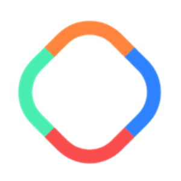 | 2055 | VISION | VisionGame |
| 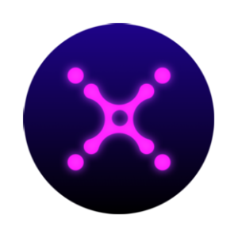 | 2056 | XETA | Xana |
|  | 2057 | EVU | Evulus Token |
| 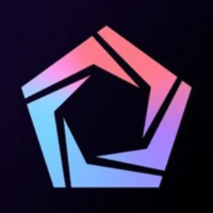 | 2058 | ELT | Element Black |
| 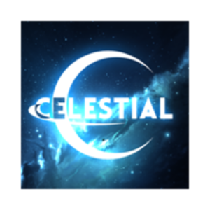 | 2059 | CELT | Celestial |
|  | 2060 | NFAI | Not Financial Advice |
|  | 2061 | LEZ | Peoplez |
|  | 2062 | LITE | Lite USD |
|  | 2063 | AUCO | Advanced United Continent |
|  | 2064 | CNC | ChinaCoin |
|  | 2065 | PICAARTMONEY | PicaArtMoney |
| 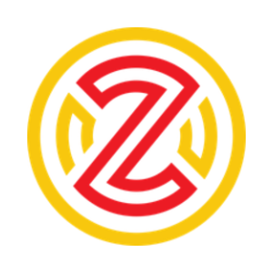 | 2066 | ZLW | Zelwin |
|  | 2067 | AIRI | aiRight |
| 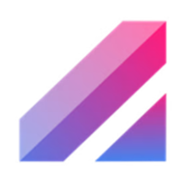 | 2068 | OLE | OpenLeverage |
|  | 2069 | GRAIL | Camelot Token |
|  | 2071 | REGENT | REGENT COIN |
| 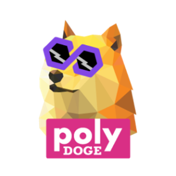 | 2072 | POLYDOGE | PolyDoge |
|  | 2073 | HADES | Hades |
|  | 2075 | MDAO | MarsDAO |
| 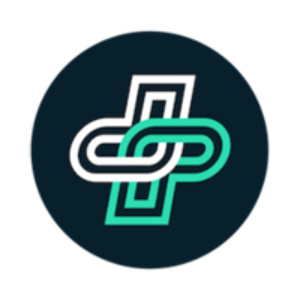 | 2076 | PUMLX | PUMLx |
|  | 2077 | ODYS | OdysseyWallet |
| 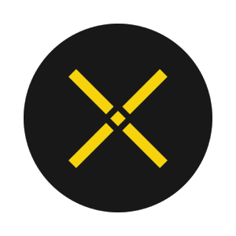 | 2078 | NPXS | Pundi X [OLD] |
|  | 2079 | ISLAMI | ISLAMICOIN |
| 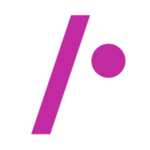 | 2081 | EPAN | Paypolitan Token |
| 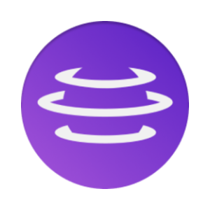 | 2082 | AURAF | Aura Finance |
| 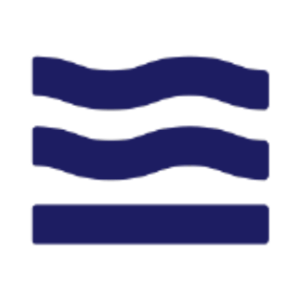 | 2083 | TIDAL | Tidal Finance |
|  | 2084 | WOMBAT | Wombat |
| 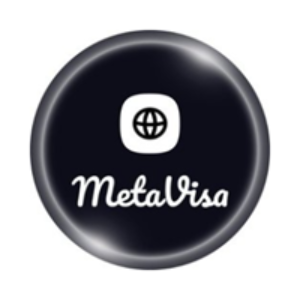 | 2085 | MESA | MetaVisa |
|  | 2086 | XFUND | xFund |
| 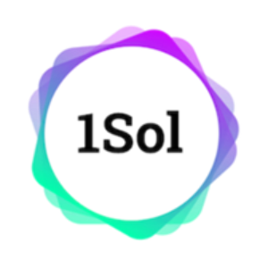 | 2087 | 1SOL | 1Sol |
| 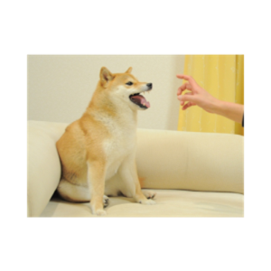 | 2088 | NFD | Feisty Doge NFT |
|  | 2089 | MGG | MetaGaming Guild |
|  | 2090 | HYVE | Hyve |
|  | 2091 | HAO | HistoryDAO |
|  | 2092 | BORING | BoringDAO |
|  | 2093 | FWCL | Legends |
| 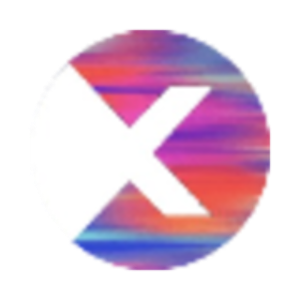 | 2094 | METAX | MetaverseX |
|  | 2095 | COPI | Cornucopias |
| 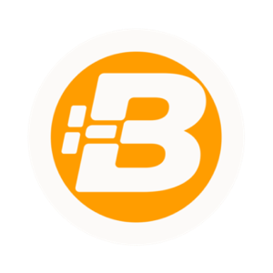 | 2096 | BTX | BitCore |
| 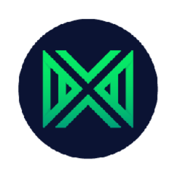 | 2097 | MMXN | Moneta Digital |
|  | 2098 | EJS | Enjinstarter |
| 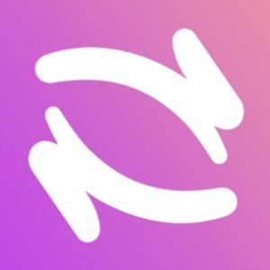 | 2099 | HOP | Hop Protocol |
| 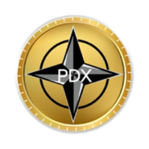 | 2100 | PDX | PDX Coin |
| 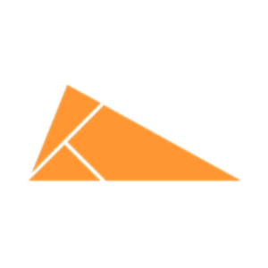 | 2101 | KSP | KlaySwap Protocol |
| 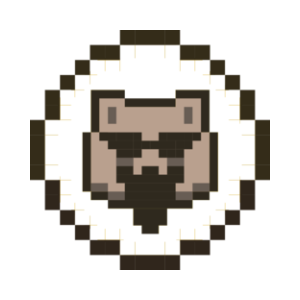 | 2102 | WMX | Wombex |
|  | 2103 | LABS | LABS Group |
|  | 2104 | FORMATION | Formation FI |
|  | 2106 | SILO | Silo Finance |
|  | 2107 | HAN | HanChain |
|  | 2108 | GYMNET | Gym Network |
|  | 2109 | UMX | UniMex Network |
|  | 2110 | TCC | The ChampCoin |
| 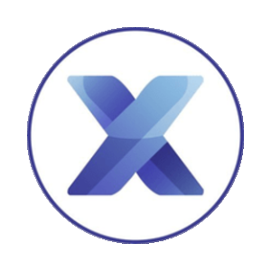 | 2111 | TRMX | TourismX Token |
|  | 2112 | STORE | Bit Store |
|  | 2113 | BBF | Bubblefong |
| 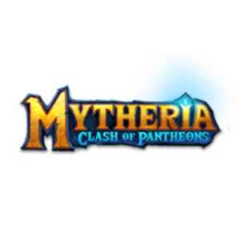 | 2114 | MYRA | Mytheria |
|  | 2115 | HOOP | Chibi Dinos |
|  | 2116 | REVOAI | revoAI |
| 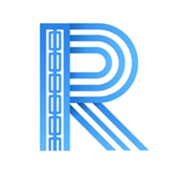 | 2117 | ROAD | ROAD |
| 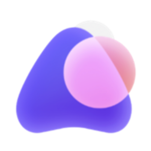 | 2118 | ASTO | Altered State Token |
|  | 2119 | SIENNA | Sienna |
| 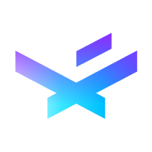 | 2120 | XNL | Chronicle |
|  | 2121 | PAW | PAWSWAP |
| 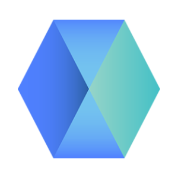 | 2122 | DEC | Decentr |
|  | 2123 | WAM | Wam |
| 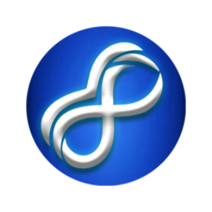 | 2124 | IBAT | Battle Infinity |
| 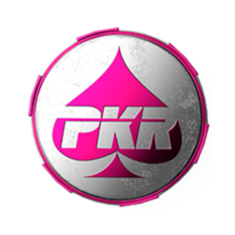 | 2125 | POLKER | Polker |
|  | 2126 | LUFFYOLD | Luffy |
|  | 2127 | WSB | WallStreetBets DApp |
| 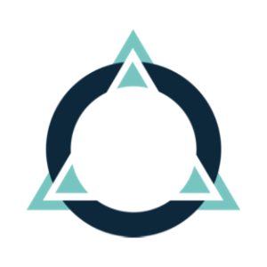 | 2128 | NIOX | Autonio |
|  | 2129 | ZYB | Zyberswap |
| 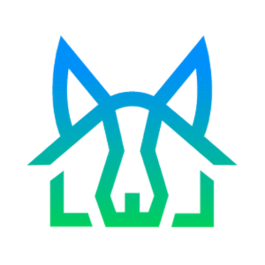 | 2130 | SRLTY | SaitaRealty |
|  | 2131 | NPT | Neopin |
| 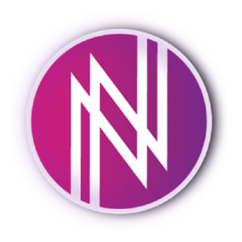 | 2132 | NFTY | NFTY |
| 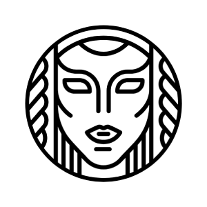 | 2133 | IDNA | Idena |
| 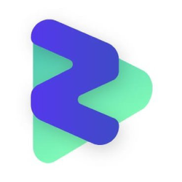 | 2136 | ZIK | Ziktalk |
| 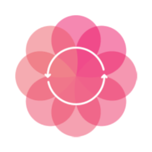 | 2137 | ROSN | Roseon Finance |
| 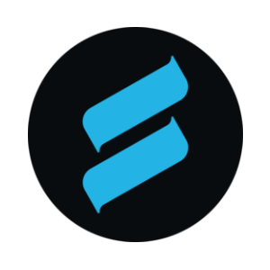 | 2138 | SPOOL | Spool DAO |
| 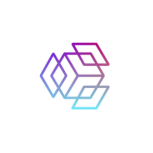 | 2139 | UNIDX | UniDex |
| 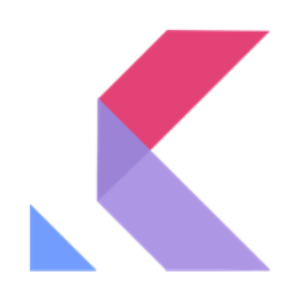 | 2140 | KOL | Kollect |
| 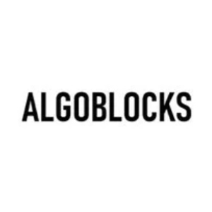 | 2141 | ALGOBLK | AlgoBlocks |
| 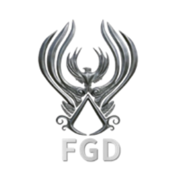 | 2142 | FGD | Freedom God DAO |
| 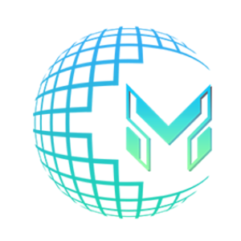 | 2143 | METAV | MetaVPad |
|  | 2144 | DST | Double Swap Token |
|  | 2145 | GOLDF | Gold Fever |
| 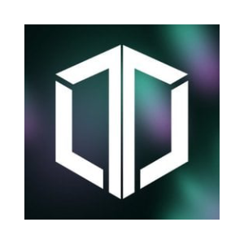 | 2146 | TPAD | TrustPad |
| 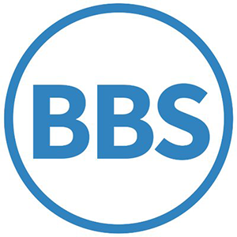 | 2147 | BBST | BBSCoin |
|  | 2148 | LOKR | Lokr |
|  | 2149 | SUPREMEFINANCE | Hype |
|  | 2150 | JIZZ | JizzRocket |
| 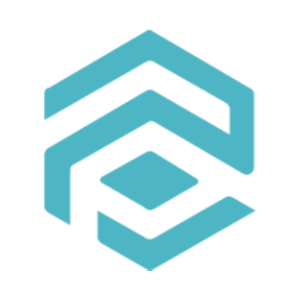 | 2151 | TRADE | Polytrade |
|  | 2152 | GMPD | GamesPad |
|  | 2153 | ECOX | ECOx |
| 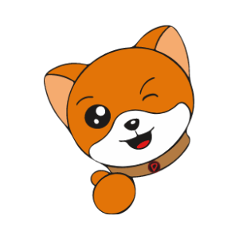 | 2154 | DOGECOLA | DogeCola |
|  | 2155 | PDT | ParagonsDAO |
|  | 2156 | ULX | ULTRON |
|  | 2157 | LOCG | LOCGame |
| 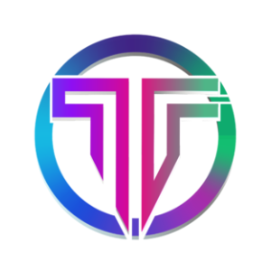 | 2158 | HAKA | TribeOne |
| 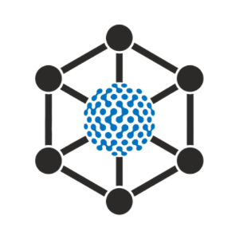 | 2159 | IDEA | Ideaology |
|  | 2160 | ZUSD | ZUSD |
|  | 2161 | MMIT | MangoMan Intelligent |
|  | 2162 | 3ULL | Playa3ull Games |
|  | 2163 | UPO | UpOnly |
|  | 2164 | CWEB | Coinweb |
|  | 2166 | SATA | Signata |
|  | 2167 | ELU | Elumia |
|  | 2168 | HEART | Humans |
|  | 2169 | ZPAY | ZoidPay |
| 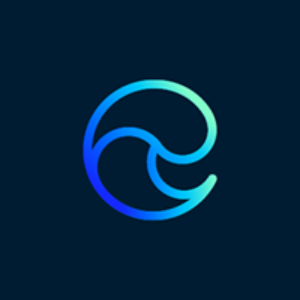 | 2170 | EC | Echoin |
| 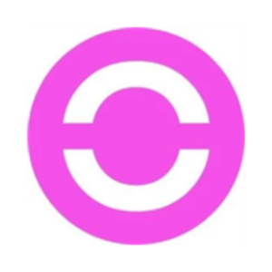 | 2171 | FRR | Frontrow |
|  | 2172 | QUARTZ | Sandclock |
|  | 2174 | MINDS | Minds |
|  | 2175 | HIOD | hiOD |
|  | 2176 | EDDA | EDDASwap |
|  | 2177 | DROPS | Drops |
|  | 2178 | IPV | IPVERSE (ETH) |
|  | 2179 | FODL | Fodl Finance |
|  | 2180 | RETH2 | rETH2 |
|  | 2181 | ZYRO | Zyro |
|  | 2182 | CHRP | Chirpley |
|  | 2183 | SKET | Sketch coin |
|  | 2184 | COW | CoW Protocol |
|  | 2185 | SHIDO | Shido |
|  | 2186 | LZ | LaunchZone |
|  | 2187 | HAWK | Hawksight |
|  | 2188 | BALPHA | bAlpha |
|  | 2189 | ARBINU | ArbInu |
|  | 2191 | CREDI | Credefi |
|  | 2192 | BHC | Billion Happiness |
|  | 2193 | WAS | Wasder |
|  | 2194 | CPH | Cypherium |
|  | 2195 | BDOT | Binance Wrapped DOT (Binance Bridge) |
|  | 2197 | WBX | WiBX |
|  | 2198 | NIFT | Niftify |
|  | 2199 | DRB | Digimon Rabbit |
|  | 2200 | MOH | Medal of Honour |
|  | 2201 | DBX | DBX |
|  | 2202 | WANA | Wanaka Farm |
|  | 2204 | RBLS | Rebel Bots |
|  | 2205 | AVL | Aston Villa Fan Token |
|  | 2206 | NITRO | Nitro League |
|  | 2207 | PETH | pETH |
|  | 2208 | FOTA | Fight Of The Ages |
|  | 2209 | AIDOGEMINI | AI DogeMini |
|  | 2210 | IONX | Charged Particles |
|  | 2211 | GGG | Good Games Guild |
|  | 2212 | UNIX | UniX |
|  | 2213 | WMOVR | Wrapped Moonriver |
|  | 2214 | FACEDAO | FaceDAO |
|  | 2215 | VRH | Versailles Heroes |
|  | 2216 | MNG | Moon Nation Game |
|  | 2217 | FLOOR | FloorDAO |
|  | 2218 | MNTL | AssetMantle |
|  | 2219 | SONNE | Sonne Finance |
|  | 2220 | LMDA | Lambda Markets |
|  | 2221 | RYOMA | Ryoma |
|  | 2222 | THEP | The Protocol |
|  | 2223 | FINA | Defina Finance |
|  | 2224 | ETHM | Ethereum Meta |
|  | 2225 | NORD | Nord Finance |
|  | 2227 | XIV | Planet Inverse |
|  | 2228 | MRI | Marshall Inu |
|  | 2229 | SLG | Land Of Conquest |
|  | 2230 | BBANK | blockbank |
|  | 2231 | SYNR | MOBLAND |
|  | 2232 | RELAY | Relay Chain |
|  | 2233 | OLAND | Oceanland |
|  | 2234 | FLASH | Flashstake |
|  | 2235 | TRIBL | Tribal Token |
|  | 2236 | ZINU | Zombie Inu |
|  | 2237 | BTP | Bitpaid |
|  | 2238 | MEER | Qitmeer Network |
|  | 2241 | ECOIN | Ecoin |
|  | 2242 | SQUA | Square Token |
|  | 2243 | ZKBOB | BOB |
|  | 2244 | ANGLE | ANGLE |
|  | 2245 | MCB | MUX Protocol |
|  | 2247 | RIA | aRIA Currency |
|  | 2248 | MMF | MMFinance (Cronos) |
|  | 2249 | CATAI | Catgirl AI |
|  | 2251 | OXAI | OxAI.com |
|  | 2252 | OPENDAO | OpenDAO |
|  | 2254 | TAPT | Tortuga Staked Aptos |
|  | 2255 | MUSICAI | MusicAI |
|  | 2256 | DBL | Doubloon |
|  | 2257 | ESCROW | Cryptegrity DAO |
|  | 2258 | TFLOW | TradeFlow |
|  | 2259 | KNDM | Kingdom |
|  | 2260 | FMB | FREEMOON BINANCE |
|  | 2261 | PANDO | Pando |
|  | 2262 | STABLZ | Stablz |
|  | 2264 | WEMIXUSD | WEMIX |
|  | 2265 | FCON | SpaceFalcon |
|  | 2266 | EVOAI | EvolveAI |
|  | 2267 | SHIK | Shikoku |
|  | 2268 | ARNM | Arenum |
|  | 2269 | OJA | Ojamu |
|  | 2270 | CMCX | CORE MultiChain |
|  | 2271 | REDLC | Redlight Chain |
|  | 2273 | TDX | Tidex |
|  | 2274 | AFD | Animal Farm Dogs |
|  | 2275 | TYRANT | Fable Of The Dragon |
|  | 2276 | ASY | ASYAGRO |
|  | 2277 | PSL | Pastel |
|  | 2278 | QLINDO | QLINDO |
|  | 2279 | FISTBUMP | FistBump |
|  | 2280 | BTON | Blockton |
|  | 2281 | MULTIV | Multiverse |
|  | 2282 | APW | APWine |
|  | 2283 | RBC | Rubic |
|  | 2284 | TAKI | Taki |
|  | 2285 | MVD | Metavault |
|  | 2286 | ODDZ | Oddz |
|  | 2287 | TOSDIS | TosDis |
|  | 2288 | UNIC | Unicly |
|  | 2289 | ADAX | ADAX |
|  | 2292 | JMPT | JumpToken |
|  | 2293 | RVF | RocketX exchange |
|  | 2294 | REVU | Revuto |
|  | 2295 | ZZ | ZigZag |
|  | 2296 | UPI | Pawtocol |
|  | 2297 | KWENTA | Kwenta |
|  | 2298 | VXL | Voxel X Network |
|  | 2299 | COC | Coin of the champions |
|  | 2300 | NGM | e-Money |
|  | 2301 | SPILLWAYS | SpillWays |
|  | 2302 | CGS | Crypto Gladiator Shards |
|  | 2303 | MVX | Metavault Trade |
|  | 2304 | ISHND | StrongHands Finance |
|  | 2305 | CRWNY | Crowny Token |
|  | 2306 | GSTS | Gunstar Metaverse |
|  | 2307 | BIRD | Bird.Money |
|  | 2308 | JRT | Jarvis Reward Token |
|  | 2309 | CLS | Coldstack |
|  | 2310 | FJT | Fuji FJT |
|  | 2311 | BXMI | Bxmi Token |
|  | 2312 | PLY | Aurigami |
|  | 2313 | PRARE | Polkarare |
|  | 2314 | XTAG | xHashtag |
|  | 2315 | FIU | beFITTER |
|  | 2316 | BETS | BetSwirl |
|  | 2317 | PRDS | Brise Paradise |
|  | 2318 | AMA | MrWeb |
|  | 2319 | MOON | r/CryptoCurrency Moons |
|  | 2320 | UDO | Unido |
|  | 2321 | OBOT | Obortech |
|  | 2322 | CNFI | Connect Financial |
|  | 2323 | SVS | GivingToServices SVS |
|  | 2324 | PORT | Port Finance |
|  | 2325 | BLUR | Blur |
|  | 2326 | VENT | Vent Finance |
|  | 2327 | LQDR | LiquidDriver |
|  | 2328 | FER | Ferro |
|  | 2329 | LUFC | Leeds United Fan Token |
|  | 2330 | LUNAT | Lunatics |
|  | 2331 | AAG | AAG Ventures |
|  | 2332 | BLANK | Blank Token |
|  | 2333 | BOMB | BOMB |
|  | 2335 | SIPHER | Sipher |
|  | 2336 | BANK | Float Protocol |
|  | 2337 | CLY | Colony |
|  | 2338 | KLO | Kalao |
|  | 2340 | KLEE | KleeKai |
|  | 2341 | FURU | Furucombo |
|  | 2342 | PAR | Parachute |
|  | 2345 | SARCO | Sarcophagus |
|  | 2346 | XMX | XMax |
|  | 2347 | CYCE | Crypto Carbon Energy |
|  | 2348 | RADAR | DappRadar |
|  | 2349 | SFD | SafeDeal |
|  | 2350 | DMLG | Demole |
|  | 2351 | DEXTF | Domani Protocol |
|  | 2352 | KLP | Kulupu |
|  | 2353 | EUROE | EUROe Stablecoin |
|  | 2354 | AMKT | Alongside Crypto Market Index |
|  | 2355 | HDX | HydraDX |
|  | 2356 | GFT | Gifto |
|  | 2358 | MADOG | MarvelDoge |
|  | 2359 | VHC | Vault Hill City |
|  | 2360 | RAIDER | Crypto Raiders |
|  | 2361 | JULD | JulSwap |
|  | 2362 | SI | Siren |
|  | 2363 | ACS | Access Protocol |
|  | 2364 | ASTRA | Astra Protocol |
|  | 2365 | SNFTS | Seedify NFT Space |
|  | 2366 | EGGS | Eggs |
|  | 2367 | TROVE | Arbitrove Governance Token |
|  | 2368 | DHX | DataHighway |
|  | 2369 | SUDO | sudoswap |
|  | 2370 | IGU | IguVerse IGU |
|  | 2371 | CSIX | Carbon Browser |
|  | 2373 | GXE | XENO Governance |
|  | 2374 | ROG | ROGin AI |
|  | 2375 | CC | CloudChat |
|  | 2376 | DSQ | Dsquared.finance |
|  | 2377 | BISKIT | Biskit Protocol |
|  | 2378 | POLLUX | Pollux Coin |
|  | 2379 | KNK | Kineko |
|  | 2380 | SHIBARMY | Shib Army |
|  | 2381 | CHEEL | Cheelee |
|  | 2382 | IGUP | IguVerse |
|  | 2383 | SHARKY | Sharky Swap |
|  | 2384 | GOHM | Governance OHM |
|  | 2385 | BLT | Blocto Token |
|  | 2386 | D3D | D3D Social |
|  | 2387 | BTTY | Bitcointry Token |
|  | 2388 | RANKER | RankerDao |
|  | 2389 | EVED | Evedo |
|  | 2390 | FEVR | RealFevr |
|  | 2391 | SHIB05 | Half Shiba Inu |
|  | 2392 | XOT | Okuru |
|  | 2393 | REF | Ref Finance |
|  | 2394 | RDT | Ridotto |
|  | 2395 | MEE | Medieval Empires |
|  | 2396 | BLOCK | Blockasset |
|  | 2397 | EZ | EasyFi V2 |
|  | 2398 | RITE | ritestream |
|  | 2399 | METAL | Metal Blockchain |
|  | 2400 | CALI | CaliCoin |
|  | 2401 | COLLAB | Collab.Land |
|  | 2402 | SLIZ | SolidLizard |
|  | 2403 | FNDZ | FNDZ Token |
|  | 2404 | OPX | OPX Finance |
|  | 2405 | STAI | StereoAI |
|  | 2406 | METANO | Metano |
|  | 2407 | GOMT | GoMeat |
|  | 2408 | CSTR | CoreStarter |
|  | 2409 | MGPT | MotoGP Fan Token |
|  | 2410 | BASE | Base Chain |
|  | 2411 | EKTA | Ekta |
|  | 2412 | BSTY | GlobalBoost-Y |
|  | 2413 | TRACE | Trace Network Labs |
|  | 2414 | AART | ALL.ART |
|  | 2415 | MASS | MASS |
|  | 2416 | BTSG | BitSong |
|  | 2417 | MOFI | MobiFi |
|  | 2418 | APRIL | April |
|  | 2420 | RAZE | Raze Network |
|  | 2421 | NINO | Ninneko |
|  | 2423 | KALM | KALM |
|  | 2424 | UGAS | Ultrain |
|  | 2425 | WNDR | Wonderman Nation |
|  | 2426 | AME | AME Chain |
|  | 2427 | DBI | Don't Buy Inu |
|  | 2428 | NOTE | Notional Finance |
|  | 2429 | XIL | Xillion |
|  | 2430 | VOW | Vow |
|  | 2431 | KAKI | Doge KaKi |
|  | 2432 | BNBTIGER | BNBTiger |
|  | 2433 | CLEG | Chain of Legends |
|  | 2434 | NUX | Peanut |
|  | 2435 | FLOKICEO | FLOKI CEO |
|  | 2436 | RENA | Warena |
|  | 2437 | SHEESHA | Sheesha Finance |
|  | 2438 | EGAME | Every Game |
|  | 2439 | GAMES | Gamestarter |
|  | 2441 | IQN | IQeon |
|  | 2442 | CLH | ClearDAO |
|  | 2443 | GRAV | Graviton |
|  | 2444 | MVDA10 | MVIS® Digital Assets 10 Index |
|  | 2445 | DOGCOIN | Dogcoin |
|  | 2447 | CARMIN | Carmin |
|  | 2448 | CEO | CEO |
|  | 2449 | BALTO | Balto Token |
|  | 2450 | GART | Griffin Art |
|  | 2451 | 1ART | OneArt |
|  | 2452 | ETHA | ETHA Lend |
|  | 2453 | STATER | Stater |
|  | 2454 | WQT | Work Quest |
|  | 2455 | VOLTV1 | Volt Inu v1 |
|  | 2456 | VERA | Vera |
|  | 2457 | WNK | The Winkyverse |
|  | 2458 | PEPES | McPepe's |
|  | 2460 | QANX | QANplatform |
|  | 2461 | ORD | ordinex |
|  | 2462 | AIPAD | AIPAD |
|  | 2463 | SHIRYOINU | Shiryo |
|  | 2464 | ALLIN | All in |
|  | 2465 | TRTL | TurtleCoin |
|  | 2466 | AG | AGAME |
|  | 2467 | MTS | Metastrike |
|  | 2468 | TFI | TrustFi Network |
|  | 2469 | PLUTUS | PlutusDAO |
|  | 2470 | KART | Dragon Kart |
|  | 2471 | BRN | BRN Metaverse |
|  | 2472 | SMTY | Smoothy |
|  | 2473 | BPX | Black Phoenix |
|  | 2474 | ZMT | Zipmex |
|  | 2475 | HNTR | Hunter |
|  | 2476 | DEHUB | DeHub |
|  | 2477 | ATS | Atlas DEX |
|  | 2478 | LKC | Lucky Coin |
|  | 2479 | OKS | Oikos |
|  | 2480 | AAC | Double-A Chain |
|  | 2481 | HOICHI | Hoichi |
|  | 2482 | PEL | Propel Token |
|  | 2483 | EPILLO | Epillo |
|  | 2484 | KINGSHIB | King Shiba |
|  | 2485 | SAO | Sator |
|  | 2486 | KOINETWORK | Koi Network |
|  | 2487 | BFIC | Bficoin |
|  | 2488 | MPI | MetaPioneers |
|  | 2489 | IXS | IX Swap |
|  | 2490 | CPO | Cryptopolis |
|  | 2491 | YAE | Cryptonovae |
|  | 2492 | OMNILAYER | Omni |
|  | 2493 | SPACEPI | SpacePi |
|  | 2494 | RFT | Rangers Fan Token |
|  | 2495 | WAXE | WAXE |
|  | 2496 | OCC | OccamFi |
|  | 2497 | COOHA | CoolHash |
|  | 2499 | NCASH | Nucleus Vision |
|  | 2501 | ARCONA | Arcona |
|  | 2502 | DIONE | Dione |
|  | 2503 | TCNH | TrueCNH |
|  | 2504 | ANJI | Anji |
|  | 2505 | BOT | Bot Planet |
|  | 2506 | LISUSD | lisUSD |
|  | 2507 | ZPTC | Zeptacoin |
|  | 2508 | MCOINNETWORK | mCoin |
|  | 2509 | BABYTK | Baby Tiger King |
|  | 2510 | SHIBAY | Shiba Inu Pay |
|  | 2511 | OLY | Olyverse |
|  | 2512 | XRPAYNET | XRPayNet |
|  | 2513 | HE | Heroes & Empires |
|  | 2514 | NAFT | Nafter |
|  | 2515 | MVI | Metaverse Index |
|  | 2516 | ZLK | Zenlink Network |
|  | 2517 | PKT | PKT |
|  | 2518 | APY | APY.Finance |
|  | 2519 | OPIUM | Opium |
|  | 2520 | NEPT | Metanept |
|  | 2521 | CBYTE | CBYTE |
|  | 2522 | OHO | OHO |
|  | 2523 | UTED | United |
|  | 2524 | LFG | Gamerse |
|  | 2525 | GODE | Gode Chain |
|  | 2526 | F2C | Ftribe Fighters |
|  | 2527 | XKI | https://foundation.ki/en |
|  | 2528 | PBTC35A | pBTC35A |
|  | 2529 | VAB | Vabble |
|  | 2530 | BCMC | Blockchain Monster Hunt |
|  | 2531 | L-BTC | Liquid Bitcoin |
|  | 2532 | MMAPS | MapMetrics |
|  | 2533 | AUDD | Australian Digital Dollar |
|  | 2534 | ATD | A2DAO |
|  | 2535 | BSX | Basilisk |
|  | 2536 | CONSENTIUM | Consentium |
|  | 2537 | CSM | Crust Shadow |
|  | 2538 | MMC | Monopoly Millionaire Control |
|  | 2539 | CRBN | Carbon |
|  | 2540 | SKILL | CryptoBlades |
|  | 2541 | DRCT | Ally Direct |
|  | 2542 | STBU | Stobox |
|  | 2543 | TOK | Tokenplace |
|  | 2544 | FANC | fanC |
|  | 2546 | REALTRACT | RealTract |
|  | 2548 | ALPH | Alephium |
|  | 2549 | ODOGE | Ordinal Doge |
|  | 2550 | SPHRI | Spherium |
|  | 2552 | DOKE | Doke Inu |
|  | 2553 | ATOR | ATOR Protocol |
|  | 2554 | EEUR | e-Money EUR |
|  | 2555 | TRIBEX | Tribe Token |
|  | 2556 | MILK2 | Spaceswap MILK2 |
|  | 2557 | FNZ | Fanzee |
|  | 2558 | LINU | Luna Inu |
|  | 2559 | VRO | VeraOne |
|  | 2560 | PINU | Piccolo Inu |
|  | 2561 | NMX | Nominex |
|  | 2562 | FTRB | Faith Tribe |
|  | 2563 | REVA | Revault Network |
|  | 2564 | TPY | Thrupenny |
|  | 2565 | SQUID | Squid Game |
|  | 2566 | DOGPAD | DogPad Finance |
|  | 2567 | XDAG | Dagger |
|  | 2568 | XLN | LunaOne |
|  | 2569 | SBG | SB Group |
|  | 2570 | DNXC | DinoX |
|  | 2571 | HMQ | Humaniq |
|  | 2572 | AICH | AIChain |
|  | 2573 | DRIV | DRIVEZ |
|  | 2574 | KENNEL | Kennel Locker |
|  | 2575 | KDG | Kingdom Game 4.0 |
|  | 2576 | LED | Ledgis |
|  | 2577 | FLUT | Flute |
|  | 2578 | PLSPAD | PulsePad |
|  | 2579 | XWIN | xWIN Finance |
|  | 2580 | CYMI | CryptMi |
|  | 2581 | BAC | Basis Cash |
|  | 2582 | PATH | PathDAO |
|  | 2583 | WEBAI | Web Ai |
|  | 2584 | GUILD | BlockchainSpace |
|  | 2585 | TEER | Integritee |
|  | 2586 | PARMA | PARMA Fan Token |
|  | 2587 | PLCUC | PLC Ultima Classic |
|  | 2588 | MNY | MoonieNFT |
|  | 2590 | NCDT | Nuco.Cloud |
|  | 2591 | MNZ | Menzy |
|  | 2592 | DTR | Dotori |
|  | 2593 | KTON | Darwinia Commitment Token |
|  | 2594 | LAND | Landshare |
|  | 2595 | JADE | Jade Protocol |
|  | 2596 | ERR | Coinerr |
|  | 2597 | COVER | Cover Protocol |
|  | 2598 | SUNNY | Sunny Aggregator |
|  | 2599 | MSWAP | MoneySwap |
|  | 2600 | IOV | Starname |
|  | 2601 | KOIN | Koinos |
|  | 2602 | SLICE | Tranche Finance |
|  | 2603 | URQA | UREEQA |
|  | 2604 | ZORA | Zoracles |
|  | 2605 | SWFL | Swapfolio |
|  | 2606 | SYNCN | Sync Network |
|  | 2607 | RDX | Redux Protocol |
|  | 2608 | AXIS | Axis DeFi |
|  | 2609 | QRX | QuiverX |
|  | 2610 | FORTHB | ForthBox |
|  | 2611 | FBX | Finance Blocks |
|  | 2612 | RBIS | ArbiSmart |
|  | 2613 | CPD | CoinsPaid |
|  | 2614 | FARA | FaraLand |
|  | 2615 | RTM | Raptoreum |
|  | 2616 | RIN | Aldrin |
|  | 2617 | FLZ | Fellaz |
|  | 2618 | ROA | ROA CORE |
|  | 2620 | HUSL | The HUSL |
|  | 2621 | FCTR | FactorDAO |
|  | 2622 | WARP | WarpCoin |
|  | 2623 | SALE | DxSale Network |
|  | 2624 | XPLA | XPLA |
|  | 2625 | BXX | Baanx |
|  | 2626 | ENTC | EnterButton |
|  | 2627 | ASIA | Asia Coin |
|  | 2628 | OPTI | Optimus AI |
|  | 2629 | NXRA | AllianceBlock Nexera |
|  | 2630 | HUMAI | Humanoid AI |
|  | 2631 | NCR | Neos Credits |
|  | 2632 | VRX | Verox |
|  | 2634 | MEMAG | Meta Masters Guild |
|  | 2635 | TSX | TradeStars |
|  | 2636 | NEXA | Nexa |
|  | 2637 | RCH | Rich |
|  | 2638 | LQR | Laqira Protocol |
|  | 2639 | SPARTA | Spartan Protocol |
|  | 2640 | CVXFXS | Convex FXS |
|  | 2641 | KINT | Kintsugi |
|  | 2642 | TAUM | Orbitau Taureum |
|  | 2643 | FTN | Fasttoken |
|  | 2645 | COOK | Cook |
|  | 2646 | STKK | Streakk |
|  | 2647 | SAVANTAI | Savant AI |
|  | 2648 | LARIX | Larix |
|  | 2649 | ASAN | ASAN VERSE |
|  | 2650 | PARADOX | The Paradox Metaverse |
|  | 2651 | MUDOL2 | Hero Blaze: Three Kingdoms |
|  | 2652 | VERSE | Verse |
|  | 2653 | CMOS | CoinMerge OS |
|  | 2655 | BUMP | Bumper |
|  | 2656 | MODA | MODA DAO |
|  | 2658 | SCNSOL | Socean Staked Sol |
|  | 2659 | CHLI | ChilliSwap |
|  | 2660 | SAMA | Moonsama |
|  | 2661 | CROWDWIZ | Crowdwiz |
|  | 2663 | ANYETH1 | Wrapped Ether (AnySwap) |
|  | 2664 | TDFY | Tidefi |
|  | 2665 | ARTEQ | artèQ |
|  | 2666 | NITROG | Nitro |
|  | 2667 | BODYP | Body Profile |
|  | 2668 | CREATIVE | Creative Token |
|  | 2669 | ZB | ZB |
|  | 2671 | AAT | Agricultural Trade Chain |
|  | 2672 | FYP | FlypMe |
|  | 2673 | ACAT | Alphacat |
|  | 2675 | DLT | Agrello Delta |
|  | 2676 | ADK | Aidos Kuneen |
|  | 2677 | AEON | AEON |
|  | 2678 | FLP | Gameflip |
|  | 2679 | XRC | xRhodium |
|  | 2680 | BTU | BTU Protocol |
|  | 2681 | BCPT | BlockMason Credit Protocol |
|  | 2682 | AIDOC | AI Doctor |
|  | 2684 | B21 | B21 |
|  | 2685 | PLR | Pillar |
|  | 2686 | EKO | EchoLink |
|  | 2687 | DATX | DATx |
|  | 2688 | SUBS | Substratum Network |
|  | 2689 | BANCA | BANCA |
|  | 2690 | BDG | BitDegree |
|  | 2691 | IQC | IQ.cash |
|  | 2692 | BMH | BlockMesh |
|  | 2693 | IPL | VouchForMe |
|  | 2694 | EVX | Everex |
|  | 2695 | BOXT | BOX Token |
|  | 2696 | MESH | MeshBox |
|  | 2697 | BRD | Bread |
|  | 2698 | XUC | Exchange Union |
|  | 2699 | DGTX | Digitex Token |
|  | 2700 | TKY | THEKEY Token |
|  | 2701 | BITUPTOKEN | BitUP Token |
|  | 2702 | DACC | Decentralized Accessible Content Chain |
|  | 2703 | C20 | Crypto20 |
|  | 2704 | GOT | ParkinGo |
|  | 2705 | CMCT | Crowd Machine |
|  | 2706 | EKT | EDUCare |
|  | 2707 | ITC | IoT Chain |
|  | 2708 | NHBTC | NEST Protocol |
|  | 2709 | CNN | Content Neutrality Network |
|  | 2710 | CSP | Caspian |
|  | 2711 | BLOC | Blockcloud |
|  | 2712 | CURE | Curecoin |
|  | 2713 | YEED | Yggdrash |
|  | 2714 | DPIE | DeFiPie |
|  | 2715 | ZLA | Zilla |
|  | 2716 | CV | CarVertical |
|  | 2717 | CXO | CargoX |
|  | 2719 | DMAR | DMarket |
|  | 2720 | YO | Yobit Token |
|  | 2721 | DRT | DomRaider |
|  | 2722 | ECOCH | ECOChain |
|  | 2723 | ECOM | Omnitude |
|  | 2724 | EDUCOIN | EduCoin |
|  | 2725 | ELAMA | Elamachain |
|  | 2726 | XSR | Xensor |
|  | 2727 | CRYPTOBUYER | Cryptobuyer |
|  | 2728 | VERIC | VeriCoin |
|  | 2729 | ENG | Enigma |
|  | 2730 | ERK | Eureka Coin |
|  | 2731 | VNT | VNT Chain |
|  | 2732 | ESD | Empty Set Dollar |
|  | 2733 | USE | Usechain Token |
|  | 2735 | URAC | Uranus |
|  | 2736 | EXCL | Exclusive Coin |
|  | 2737 | UOP | Utopia Genesis Foundation |
|  | 2738 | UBTC | UnitedBitcoin |
|  | 2739 | FAT | Fatcoin |
|  | 2740 | FXT | FuzeX |
|  | 2741 | TYC | Tycoon |
|  | 2742 | FYZ | Fyooz |
|  | 2743 | TRYB | BiLira |
|  | 2744 | GCC | GuccioneCoin |
|  | 2745 | TRIO | Tripio |
|  | 2746 | GDT | Globe Derivative Exchange |
|  | 2747 | TOS | ThingsOperatingSystem |
|  | 2748 | GSC | Global Social Chain |
|  | 2749 | TEM | Temtum |
|  | 2750 | GSTC | GSTCOIN |
|  | 2752 | SWM | Swarm Fund |
|  | 2753 | SPI | Shopping.io |
|  | 2754 | SLS | SaluS |
|  | 2755 | HRD | Hoard Token |
|  | 2756 | IDH | IndaHash |
|  | 2757 | IIC | Intelligent Investment Chain |
|  | 2758 | SIG | Signal |
|  | 2759 | SIB | SibCoin |
|  | 2760 | SHIP | ShipChain |
|  | 2761 | SCC | StockChain Coin |
|  | 2762 | REX | Imbrex |
|  | 2763 | REPO | Repo Coin |
|  | 2765 | LEVL | Levolution |
|  | 2766 | RAISE | Raise Token |
|  | 2767 | LNKC | Linker Coin |
|  | 2768 | LOL | EMOGI Network |
|  | 2769 | LUA | LuaSwap |
|  | 2770 | PLF | PlayFuel |
|  | 2771 | PLAI | Plair |
|  | 2772 | PITCH | PITCH |
|  | 2774 | ODE | ODEM |
|  | 2775 | ALLMEE | All.me |
|  | 2776 | NYN | NYNJA |
|  | 2777 | NTK | Neurotoken |
|  | 2778 | NNB | NNB Token |
|  | 2779 | NLG | Gulden |
|  | 2780 | METAC | Metacoin |
|  | 2781 | NCC | NeuroChain |
|  | 2782 | MUE | MonetaryUnit |
|  | 2783 | MEX | MEX |
|  | 2784 | MTX | Matryx |
|  | 2785 | KINGSWAP | KingSwap |
|  | 2786 | SYBTC | sBTC |
|  | 2787 | KINGF | King Finance |
|  | 2788 | OMC | Omchain |
|  | 2789 | HYPER | HyperChainX |
|  | 2790 | AETHERV2 | AetherV2 |
|  | 2791 | DAMEX | DAMEX |
|  | 2793 | FINU | Formula Inu |
|  | 2794 | ALPHAC | Alpha Coin |
|  | 2795 | JP | JP |
|  | 2796 | MARLEY | Marley Token |
|  | 2797 | SUI | Sui |
|  | 2798 | FAST | Fastswap |
|  | 2799 | MDXH | Mdex (HECO) |
|  | 2800 | PARAW | Para (PARA) |
|  | 2801 | NIFTSY | Envelop |
|  | 2802 | DHR | DeHR Network |
|  | 2803 | DARA | Immutable |
|  | 2804 | CSTC | CryptosTribe |
|  | 2805 | RON | Romanian leu |
|  | 2832 | UGX | Ugandan shilling |
|  | 2833 | UAH | Ukrainian hryvnia |
|  | 2834 | AED | United Arab Emirates dirham |
|  | 2835 | AFN | Afghan afghani |
|  | 2837 | ALL | Albanian lek |
|  | 2838 | DZD | Algerian dinar |
|  | 2840 | AOA | Angolan kwanza |
|  | 2841 | XCD | East Caribbean Dollar |
|  | 2842 | ARS | Argentine peso |
|  | 2843 | AMD | Armenian dram |
|  | 2844 | AWG | Aruban florin |
|  | 2846 | AZN | Azerbaijani manat |
|  | 2847 | BSD | Bahamian dollar |
|  | 2848 | BHD | Bahraini Dinar |
|  | 2849 | BDT | Bangladeshi taka |
|  | 2850 | BBD | Barbados dollar |
|  | 2851 | BYN | Belarusian ruble |
|  | 2852 | BZD | Belize dollar |
|  | 2853 | XOF | CFA Franc BCEAO |
|  | 2854 | BMD | Bermudian dollar |
|  | 2855 | BTN | Bhutanese ngultrum |
|  | 2858 | BAM | Bosnia and Herzegovina convertible mark |
|  | 2859 | BWP | Botswana pula |
|  | 2860 | NOK | Norwegian krone |
|  | 2861 | BRL | Brazilian real |
|  | 2862 | BND | Brunei Dollar |
|  | 2863 | BGN | Bulgarian lev |
|  | 2864 | BIF | Burundian franc |
|  | 2865 | KHR | Cambodian riel |
|  | 2866 | XAF | CFA Franc BEAC |
|  | 2867 | CAD | Canadian dollar |
|  | 2868 | CVE | Cabo Verde Escudo |
|  | 2869 | KYD | Cayman Islands dollar |
|  | 2870 | CLF | Unidad de Fomento |
|  | 2871 | CLP | Chilean peso |
|  | 2872 | CNY | Renminbi Yuan |
|  | 2873 | COP | Colombian peso |
|  | 2875 | KMF | Comorian franc |
|  | 2876 | CDF | Congolese franc |
|  | 2877 | NZD | New Zealand Dollar |
|  | 2878 | CRC | Costa Rican colon |
|  | 2879 | HRK | Croatian Kuna |
|  | 2880 | CUP | Cuban peso |
|  | 2881 | ANG | Netherlands Antillean Guilder |
|  | 2882 | CZK | Czech koruna |
|  | 2883 | DKK | Danish Krone |
|  | 2884 | DJF | Djiboutian franc |
|  | 2886 | EGP | Egyptian pound |
|  | 2887 | SVC | Salvadoran colón |
|  | 2889 | ETB | Ethiopian birr |
|  | 2890 | FKP | Falkland Islands pound |
|  | 2891 | FJD | Fiji dollar |
|  | 2892 | XPF | Change franc Pacifique |
|  | 2894 | GEL | Georgian lari |
|  | 2895 | GHS | Ghanaian cedi |
|  | 2896 | GIP | Gibraltar pound |
|  | 2897 | GTQ | Guatemalan quetzal |
|  | 2899 | GNF | Guinean franc |
|  | 2900 | GYD | Guyanese dollar |
|  | 2901 | HTG | Haitian gourde |
|  | 2902 | HNL | Honduran lempira |
|  | 2903 | HKD | Hong Kong dollar |
|  | 2904 | HUF | Hungarian forint |
|  | 2905 | ISK | Icelandic króna |
|  | 2906 | INR | Indian rupee |
|  | 2907 | IDR | Indonesian rupiah |
|  | 2908 | IRR | Iranian rial |
|  | 2909 | IQD | Iraqi dinar |
|  | 2910 | ILS | Israeli new shekel |
|  | 2911 | JMD | Jamaican dollar |
|  | 2912 | JPY | Japanese yen |
|  | 2913 | JOD | Jordanian dinar |
|  | 2914 | KZT | Kazakhstani tenge |
|  | 2915 | KES | Kenyan shilling |
|  | 2916 | KPW | North Korean won |
|  | 2917 | KRW | South Korean won |
|  | 2918 | KWD | Kuwaiti dinar |
|  | 2919 | KGS | Kyrgyzstani som |
|  | 2920 | LAK | Lao kip |
|  | 2921 | LBP | Lebanese pound |
|  | 2922 | LSL | Lesotho loti |
|  | 2923 | LRD | Liberian dollar |
|  | 2924 | LYD | Libyan dinar |
|  | 2925 | CHF | Swiss franc |
|  | 2926 | MOP | Macanese pataca |
|  | 2927 | MKD | Macedonian denar |
|  | 2928 | MGA | Malagasy ariary |
|  | 2929 | MWK | Malawian kwacha |
|  | 2930 | MYR | Malaysian ringgit |
|  | 2931 | MVR | Maldivian rufiyaa |
|  | 2932 | MRU | Mauritanian ouguiya |
|  | 2933 | MUR | Mauritian rupee |
|  | 2934 | MXN | Mexican peso |
|  | 2935 | MDL | Moldovan leu |
|  | 2936 | MNT | Mongolian tögrög |
|  | 2937 | MAD | Moroccan dirham |
|  | 2938 | MZN | Mozambican metical |
|  | 2939 | MMK | Myanmar kyat |
|  | 2940 | ZAR | South African rand |
|  | 2941 | NAD | Namibian dollar |
|  | 2942 | NPR | Nepalese rupee |
|  | 2943 | NIO | Córdoba oro |
|  | 2944 | NGN | Nigerian naira |
|  | 2945 | OMR | Omani rial |
|  | 2947 | PAB | Panamanian balboa |
|  | 2948 | PGK | Papua New Guinean kina |
|  | 2949 | PYG | Paraguayan guaraní |
|  | 2950 | PEN | Peruvian sol |
|  | 2951 | PHP | Philippine peso |
|  | 2952 | PLN | Polish złoty |
|  | 2953 | QAR | Qatari riyal |
|  | 2955 | RUB | Russian ruble |
|  | 2957 | RWF | Rwandan franc |
|  | 2958 | SHP | Saint Helena pound |
|  | 2959 | WST | Samoan tala |
|  | 2960 | STN | São Tomé and Príncipe Dobra |
|  | 2961 | SAR | Saudi riyal |
|  | 2962 | RSD | Serbian dinar |
|  | 2963 | SCR | Seychelles rupee |
|  | 2964 | SLL | Sierra Leonean leone |
|  | 2965 | SGD | Singapore dollar |
|  | 2970 | SDG | Sudanese pound |
|  | 2971 | SRD | Surinamese dollar |
|  | 2972 | SZL | Swazi lilangeni |
|  | 2973 | SEK | Swedish krona |
|  | 2976 | SYP | Syrian pound |
|  | 2977 | TWD | New Taiwan dollar |
|  | 2978 | TJS | Tajikistani somoni |
|  | 2979 | TZS | Tanzanian shilling |
|  | 2980 | THB | Thai baht |
|  | 2981 | TOP | Tongan paʻanga |
|  | 2982 | TTD | Trinidad and Tobago dollar |
|  | 2983 | TND | Tunisian dinar |
|  | 2984 | TRY | Turkish lira |
|  | 2985 | TMT | Turkmenistan manat |
|  | 2989 | UYU | Uruguayan peso |
|  | 2990 | UZS | Uzbekistan sum |
|  | 2991 | VUV | Vanuatu vatu |
|  | 2992 | VEF | Venezuelan bolívar fuerte |
|  | 2993 | VES | Bolívar soberano |
|  | 2994 | VND | Vietnamese đồng |
|  | 2995 | YER | Yemeni rial |
|  | 2996 | ZMW | Zambian kwacha |
|  | 2997 | ZWL | Zimbabwean dollar |
|  | 2999 | IDXS | In-Dex Sale |
|  | 3000 | FIDLE | Fidlecoin |
|  | 3001 | XACT | XactToken |
|  | 3002 | BOOST | BitBoost |
|  | 3003 | DOGECEO | Doge CEO |
|  | 3004 | G1X | GoldFinX |
|  | 3005 | CRADLE | Cradle of Sins |
|  | 3006 | OCTA | OctaSpace |
|  | 3007 | OPENGO | OPEN Governance Token |
|  | 3008 | MONG | MongCoin |
|  | 3010 | PEPE | Pepe (pepe.vip) |
|  | 3011 | APRICOT | Apricot Finance |
|  | 3012 | FUNDREQUEST | FundRequest |
|  | 3013 | SEI | Sei |
|  | 3014 | FND | Rare FND |
|  | 3015 | KARATE | Karate Combat |
|  | 3018 | PLS | Pulsechain |
|  | 3019 | STFX | STFX |
|  | 3020 | WSBABY | Wall Street Baby |
|  | 3021 | CGPT | ChainGPT |
|  | 3022 | KLC | Kilocoin |
|  | 3023 | KPL | Kepple |
|  | 3029 | SSP | South Sudanese pound |
|  | 3030 | PKR | Pakistani rupee |
|  | 3031 | SOS | Somali shilling |
|  | 3032 | BOB | Boliviano |
|  | 3033 | DOP | Dominican peso |
|  | 3034 | ERN | Eritrean nakfa |
|  | 3036 | DIMO | DIMO |
|  | 3037 | PANDOP | PandoProject |
|  | 3038 | MEED | Meeds DAO |
|  | 3039 | VNM | Venom |
|  | 3040 | PET | Hello Pets |
|  | 3041 | PLQ | Planq |
|  | 3042 | EYE | MEDIA EYE |
|  | 3043 | METFI | MetFi |
|  | 3044 | PRIME | Echelon Prime |
|  | 3045 | HOSKY | Hosky |
|  | 3046 | SNEK | Snek |
|  | 3047 | PETT | Pett Network |
|  | 3048 | BOBT | BOB Token |
|  | 3049 | PORTU | Portuma |
|  | 3051 | WOMB | Wombat Exchange |
|  | 3052 | NTO | Neton |
|  | 3053 | SHERA | Shera Tokens |
|  | 3054 | GENIE | The Genie |
|  | 3055 | CIC | Crazy Internet Coin |
|  | 3056 | CAPRICOIN | CapriCoin |
|  | 3057 | CPS | Cryptostone |
|  | 3058 | DIG | DIEGO |
|  | 3059 | EXCHANGEN | ExchangeN |
|  | 3060 | EXN | Exeno |
|  | 3061 | CAPTAINPLANET | Captain Planet |
|  | 3062 | CTP | Ctomorrow Platform |
|  | 3063 | WELLTOKEN | Well |
|  | 3064 | WELL | Moonwell |
|  | 3065 | HALO | Halo Coin |
|  | 3066 | PRX | Parex |
|  | 3067 | ID | SPACE |
|  | 3068 | PRP | Pepe Prime |
|  | 3069 | RETH | Rocket Pool ETH |
|  | 3070 | IMPT | IMPT |
|  | 3071 | LAELAPS | Laelaps |
|  | 3072 | MOOX | Moox Protocol |
|  | 3073 | RXD | Radiant |
|  | 3074 | STEPR | Step |
|  | 3075 | WOID | WORLD ID |
|  | 3076 | KITA | KITA INU |
|  | 3077 | GIGX | GigXCoin |
|  | 3078 | LADYS | Milady Meme Coin |
|  | 3079 | BIG | Big Eyes |
|  | 3080 | 4CHAN | 4Chan |
|  | 3081 | SGO | SafuuGO |
|  | 3082 | VCORE | VCORE |
|  | 3083 | REDDIT | Reddit |
|  | 3084 | FERC | FairERC20 |
|  | 3085 | EML | EML Protocol |
|  | 3086 | MESSI | MESSI COIN |
|  | 3088 | RHINO | RHINO |
|  | 3089 | BEAI | BeNFT Solutions |
|  | 3090 | STEWIE | Stewie Coin |
|  | 3091 | UWUCOIN | uwu |
|  | 3092 | UNLEASH | UnleashClub |
|  | 3093 | STRAY | Stray Dog |
|  | 3094 | KUSA | Kusa Inu |
|  | 3095 | BULLS | Bull Coin |
|  | 3096 | FXY | Floxypay |
|  | 3097 | SCAM | Scam Coin |
|  | 3098 | AIXERC | AI-X |
|  | 3099 | LITHO | Lithosphere |
|  | 3100 | PAAL | PAAL AI |
|  | 3101 | GPBP | Genius Playboy Billionaire Philanthropist |
|  | 3102 | HOBO | HOBO THE BEAR |
|  | 3103 | QUANT | Quant Finance |
|  | 3104 | 9GAG | 9GAG |
|  | 3105 | SHS | SHEESH |
|  | 3107 | FUMO | Alien Milady Fumo |
|  | 3108 | ALINK | Aave LINK v1 |
|  | 3109 | AUSDC | Aave USDC v1 |
|  | 3110 | AKNC | Aave KNC v1 |
|  | 3111 | KUJI |  Kujira |
|  | 3112 | PEPE2 | Pepe 2.0 |
|  | 3113 | 420CHAN | 420chan |
|  | 3114 | TOX | INTOverse |
|  | 3115 | POKEMON | Pokemon (pokemonmoon.xyz) |
|  | 3116 | MAV | Maverick Protocol |
|  | 3117 | FAKE | FAKE COIN |
|  | 3118 | MIRACLE | MIRACLE |
|  | 3119 | AETH | Aave ETH |
|  | 3120 | WPLS | Wrapped Pulse |
|  | 3121 | MONG20 | Mongoose 2.0 |
|  | 3122 | PINO | Pinocchu |
|  | 3123 | RAP | Philosoraptor |
|  | 3124 | JARED | Jared From Subway |
|  | 3125 | SELF | SELFCrypto |
|  | 3126 | BAD | Bad Idea AI |
|  | 3127 | AIDOG | AiDoge |
|  | 3128 | DEEZ | DEEZ NUTS |
|  | 3129 | HZM | HZM Coin |
|  | 3130 | VELOD | Velodrome Finance |
|  | 3131 | WOOO | wooonen |
|  | 3132 | MAGICF | MagicFox |
|  | 3133 | SHROOMFOX | Magic Shroom |
|  | 3134 | LM | LeisureMeta |
|  | 3135 | YUDI | Yudi |
|  | 3136 | ZZZ | zzz.finance |
|  | 3161 | DOGE20 | Doge 2.0 |
|  | 3162 | BAMBOO | Bamboo DeFi |
|  | 3163 | GAYPEPE | Gay Pepe |
|  | 3164 | PEEPA | Peepa |
|  | 3165 | MMAI | MetamonkeyAi |
|  | 3166 | MTB | MetaBridge |
|  | 3171 | FOXV2 | FoxFinanceV2 |
|  | 3172 | ETHX | Stader ETHx |
|  | 3173 | MONKEYS | Monkeys Token |
|  | 3175 | GHO | GHO |
|  | 3176 | STLE | Saint Ligne |
|  | 3177 | VNXAU | VNX Gold |
|  | 3182 | ACQ | Acquire.Fi |
|  | 3196 | COMBO | COMBO |
|  | 3197 | WLD | Worldcoin |
|  | 3198 | MOG | Mog Coin |
|  | 3204 | QUICK | Quickswap |
|  | 3211 | LUK | Luniverse |
|  | 3212 | MANTLE | Mantle |
|  | 3213 | ARKM | Arkham |
|  | 3230 | DBEAR | DBear Coin |
|  | 3231 | LSETH | Liquid Staked ETH |
|  | 3232 | PYUSD | PayPal USD |
|  | 3233 | COREUM | Coreum |
|  | 3234 | CORE | Core |
|  | 3235 | BROCK | Bitrock |
|  | 3236 | PLSX | PulseX |
|  | 3237 | BBFT | Block Busters Tech Token |
|  | 3238 | CRVUSD | crvUSD |
|  | 3239 | COSS | COS |
|  | 3240 | KING | KING |
|  | 3241 | BZR | Bazaars |

---

[← Prev](./list2.md) | [Next →](./list4.md)
