# Cryptocurrency list \#3

[← Prev](./list2.md) | [Next →](./list4.md)

| Logo | ID | Symbol | Name |
|:----:|:--:|:------:|:-----|
|  | 32910 | ABL | Airbloc |
| 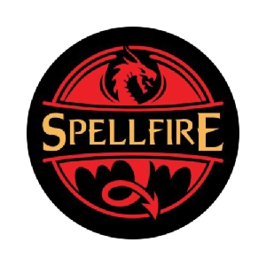 | 62091 | SPELLFIRE | Spellfire |
|  | 150203 | AVAXAI | AIvalanche DeFAI Agents |
| 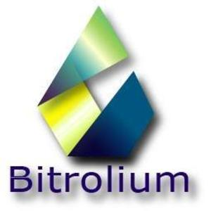 | 65239 | BTL | Bitlocus |
|  | 111567 | DCK | DexCheck |
| 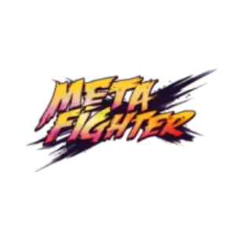 | 69117 | MF | MetaFighter |
| 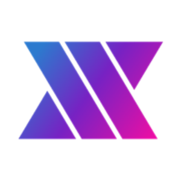 | 59219 | XTAG | xHashtag |
| 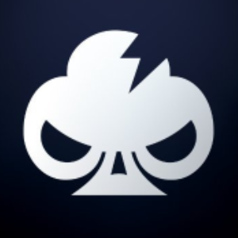 | 111579 | WIK | WickedBet Casino |
|  | 68107 | PERC | Perion |
| 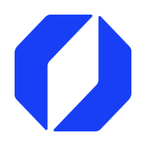 | 136437 | NCN | NeurochainAI |
|  | 112375 | 5IRE | 5ire |
| 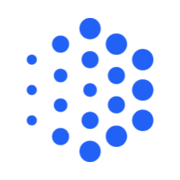 | 122003 | OXY | Oxygen |
| 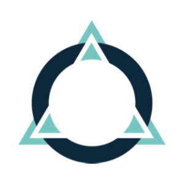 | 3028 | NIOX | Autonio |
|  | 121911 | ORT | Okratech Token |
| 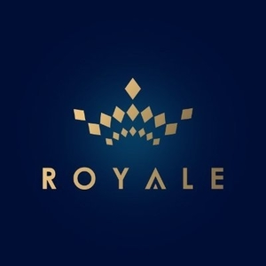 | 47521 | ROYA | Royale |
| 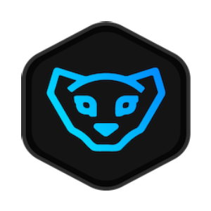 | 65163 | CUB | Cub Finance |
| 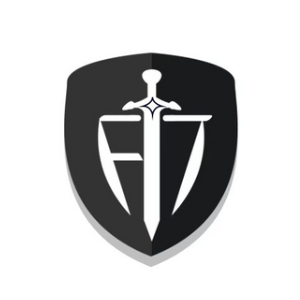 | 49733 | FOC | TheForce Trade |
|  | 86567 | ALLIN | All In |
|  | 59995 | KTN | Kattana |
|  | 62677 | NRV | Nerve Finance |
| 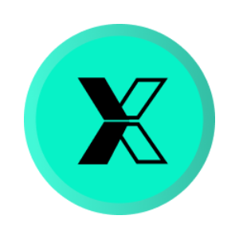 | 136349 | LOGX | LogX Network |
|  | 125391 | GARBAGE | Garbage |
|  | 60027 | DIS | TosDis |
| 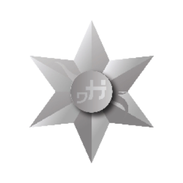 | 111627 | HOSHI | Dejitaru Hoshi |
|  | 60341 | SENATE | SENATE |
| 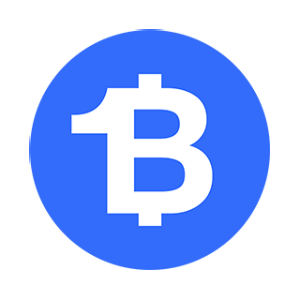 | 62831 | OBS | Obsidium |
|  | 126263 | $MEMES | Memecoindao |
| 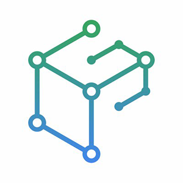 | 122067 | GXT | Gem Exchange and Trading |
|  | 62779 | RABBIT | Rabbit Finance |
| 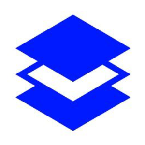 | 126801 | SLN | Smart Layer Network |
| 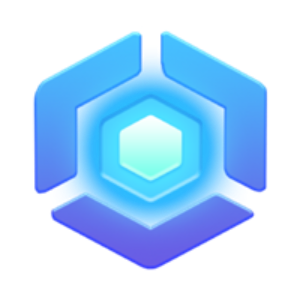 | 56501 | THG | Thetan Arena |
|  | 64861 | MPH | 88mph |
|  | 49219 | OLIVE | Olive Cash |
|  | 121977 | BANK | Float Protocol (Bank) |
|  | 162137 | OMALLEY | OMalley |
| 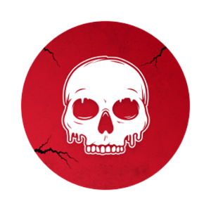 | 77879 | UNDEAD | Undead Blocks |
| 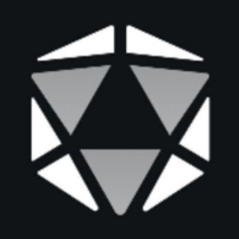 | 111491 | BROCK | Bitrock |
| 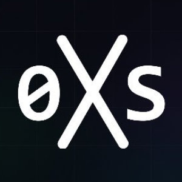 | 65059 | OXS | Oxbull Solana |
|  | 79493 | HAN | HanChain |
|  | 59943 | PEL | Propel Token |
| 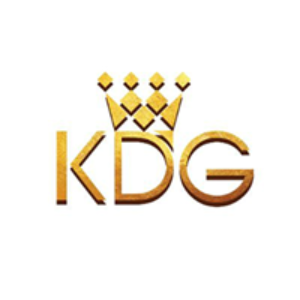 | 44062 | KDG | Kingdom Game 4.0 |
| 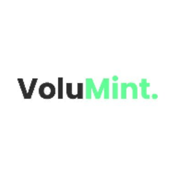 | 121777 | VMINT | Volumint |
|  | 67141 | BRIDGE | Cross-Chain Bridge |
| 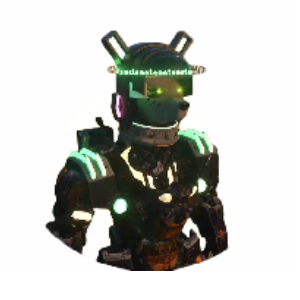 | 56887 | METADOGE | Meta Doge |
|  | 155085 | AWS | Agentwood |
| 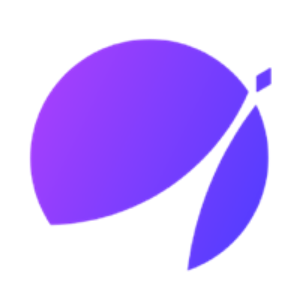 | 77811 | APX | ApolloX |
|  | 55913 | MDF | MatrixETF |
|  | 54047 | FEVR | RealFevr |
| 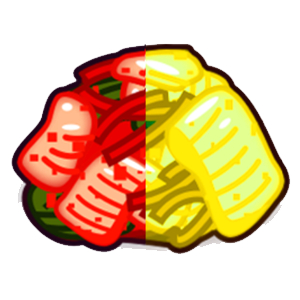 | 45610 | KIMCHI | KIMCHI.finance |
|  | 165731 | ETAN | Etarn |
| 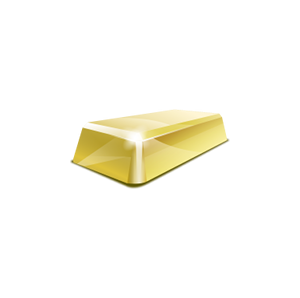 | 47302 | BTB | Bitball |
|  | 162049 | SIMON | Simon the Gator |
|  | 48245 | UDO | Unido |
|  | 42565 | VERA | VERA |
| 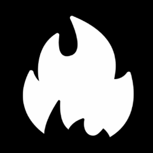 | 56177 | FLAME | FireStarter |
|  | 147091 | AIPUMP | aiPump |
|  | 34489 | SLM | Slimcoin |
|  | 59227 | UNIX | UniX |
|  | 71493 | DKUMA | KumaDex Token |
|  | 77901 | LING | Lingose |
| 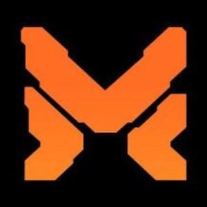 | 147867 | FIRE | Matr1x Fire |
| 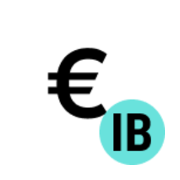 | 64755 | IBEUR | Iron Bank EURO |
|  | 57109 | GGG | Good Games Guild |
|  | 161987 | TAKER | Taker |
|  | 111503 | HYPR | Hypr Network |
| 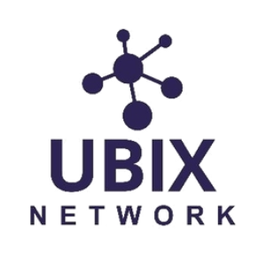 | 46727 | UBX | UBIX Network |
|  | 54781 | CBG | Chainbing |
| 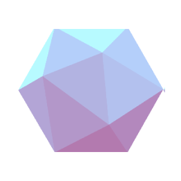 | 47509 | COMBO | Furucombo |
|  | 50805 | LED | Ledgis |
|  | 47543 | SOTA | SOTA Finance |
|  | 71073 | CPS | Cryptostone |
|  | 46330 | ZEE | ZeroSwap |
|  | 65567 | $MANGA | Manga Token |
| 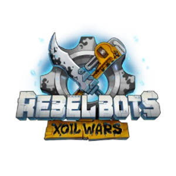 | 64953 | RBLS | Rebel Bots |
| 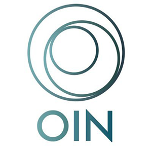 | 45525 | OIN | OIN Finance |
|  | 2956 | EDC | EDC Blockchain |
| 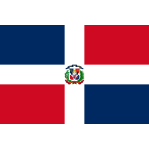 | 49049 | DOP | Drops Ownership Power |
| 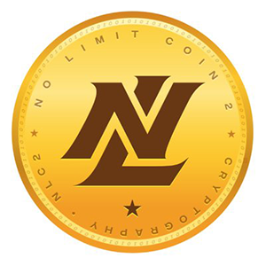 | 71273 | NLC | Nelore Coin |
|  | 48229 | ARGON | Argon |
|  | 78075 | DON | Don-key |
|  | 64967 | LITH | Lithium Finance |
|  | 125445 | DRA | Dracarys Token |
| 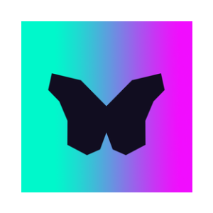 | 111767 | GFLY | BattleFly |
| 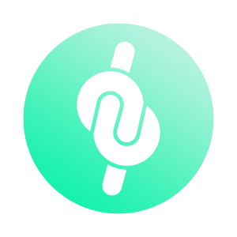 | 65661 | ROPE | Rope Token |
| 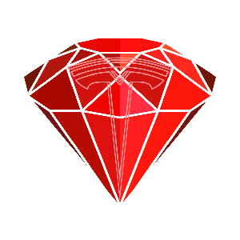 | 42124 | BTRS | Bitball Treasure |
| 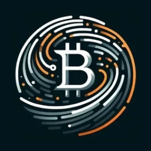 | 45528 | BOOST | Boosted Finance |
| 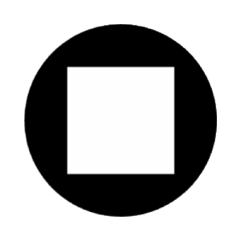 | 47785 | BLANK | Blank |
|  | 62749 | APRT | Apricot |
|  | 44138 | ISLA | Insula |
| 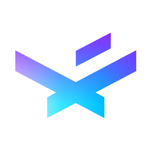 | 56271 | XNL | Chronicle |
|  | 79551 | LODE | LODE Token |
|  | 56163 | MOWA | Moniwar |
| 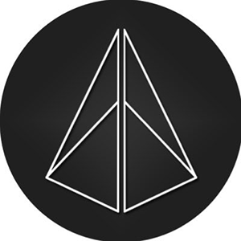 | 45231 | LGCY | LGCY Network |
| 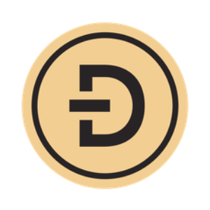 | 97355 | WDOGE | Wrapped Dogecoin |
|  | 56493 | SYP | Sypool |
|  | 100447 | UW3S | Utility Web3Shot |
|  | 46589 | ALPA | Alpaca |
| 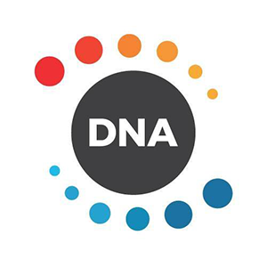 | 147837 | DNA | Muhdo Hub |
| 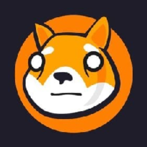 | 111449 | SHIA | Shiba Saga |
| 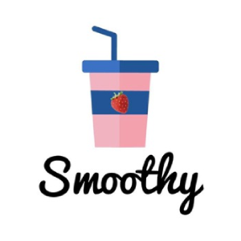 | 49015 | SMTY | Smoothy |
|  | 47009 | NDR | Node Runners |
|  | 49653 | KALM | Kalmar |
| 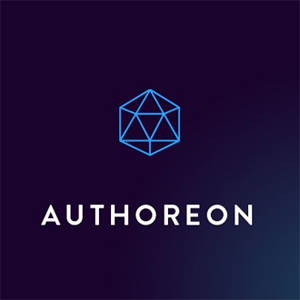 | 80493 | AUTH | Authencity |
| 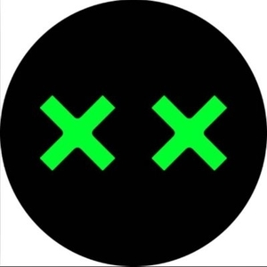 | 45137 | MXX | Multiplier |
| 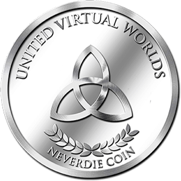 | 161519 | NDC | NDC |
| 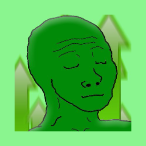 | 96741 | WOJAK | Wojak |
|  | 82545 | SGTV2 | SharedStake Governance v2 |
| 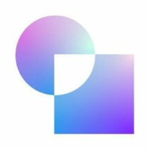 | 111747 | W3S | Web3Shot |
|  | 43068 | PBTC | pTokens BTC |
| 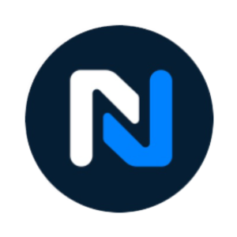 | 56677 | NSDX | NASDEX Token |
|  | 78239 | MCRN | MacaronSwap |
|  | 45191 | DDIM | DuckDaoDime |
| 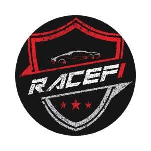 | 60629 | RACEFI | RaceFi |
| 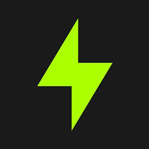 | 45892 | PTF | PowerTrade Fuel |
|  | 121863 | UNICE | UNICE |
|  | 50783 | EPK | EpiK Protocol |
| 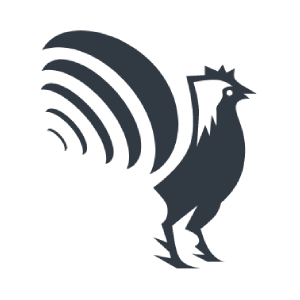 | 49061 | EGGP | Eggplant Finance |
|  | 51979 | BLS | blocsport.one |
| 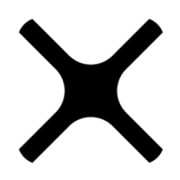 | 60203 | SOLX | Soldex |
| 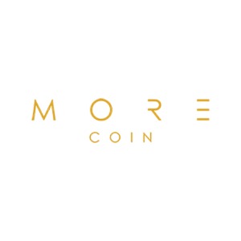 | 161617 | MORE | Moonveil |
| 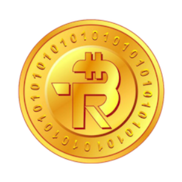 | 65483 | BITE | DragonBite |
| 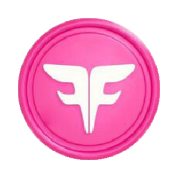 | 126887 | FANX | FrontFanz |
|  | 68755 | ZYN | Zynecoin |
|  | 42935 | CPR | CIPHER |
| 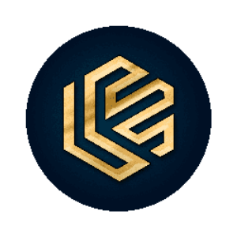 | 127397 | LOE | Legends of Elysium |
|  | 165105 | MRLN | Project Merlin |
|  | 69479 | GDDY | Giddy |
|  | 50959 | CPOO | Cockapoo |
|  | 60301 | MGOD | MetaGods |
| 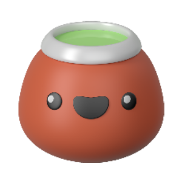 | 54595 | MATE | Mate |
|  | 50933 | BSL | BSClaunch |
| 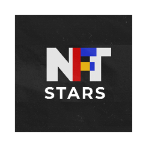 | 50871 | NFTS | NFT Stars |
| 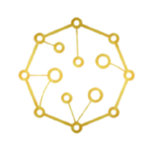 | 49031 | AFEN | AFEN Blockchain |
| 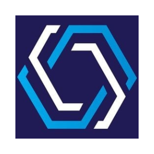 | 53743 | KFT | Knit Finance |
| 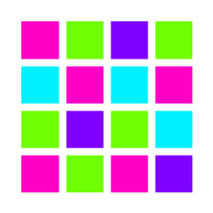 | 49901 | 1MIL | 1MillionNFTs |
|  | 158781 | SHM | Shardeum |
| 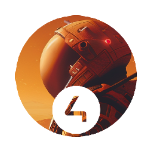 | 127537 | SHOOT | Mars Battle |
|  | 69559 | AFIT | Actifit |
|  | 56869 | TOON | Pontoon |
|  | 70553 | DEXSHARE | dexSHARE |
| 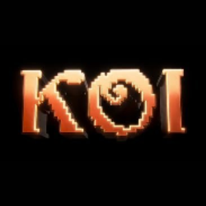 | 141417 | KOAI | KOI |
|  | 65471 | KURO | Kurobi |
|  | 122017 | SHRED | ShredN |
|  | 50371 | TRR | Terran Coin |
| 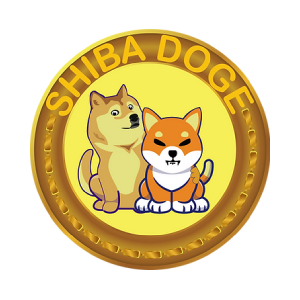 | 64785 | SHIBDOGE | ShibaDoge |
| 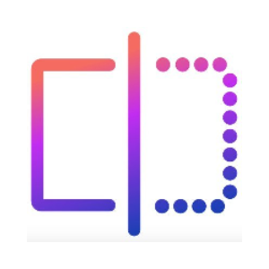 | 122707 | RVM | Realvirm |
| 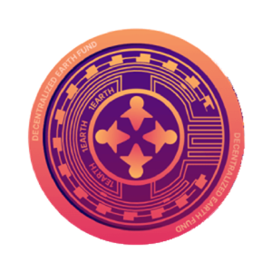 | 59101 | 1EARTH | EarthFund |
|  | 42621 | INNBC | Innovative Bioresearch |
| 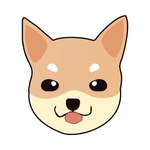 | 50719 | HOKK | Hokkaidu Inu |
|  | 349 | WDC | Worldcoin |
|  | 49211 | LEASH | Leash |
| 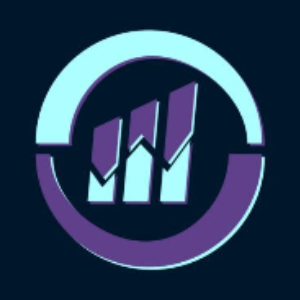 | 82511 | VXT | Voxto Amplify |
|  | 99381 | DOGE2.0 | Doge 2.0 |
| 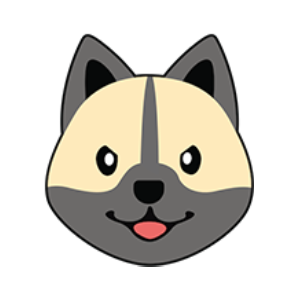 | 99395 | GATSBY | Gatsby Inu |
|  | 82581 | ABEL | Abel finance |
|  | 71393 | TGR | Tegro |
| 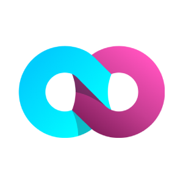 | 80439 | LOOP | LoopNetwork |
|  | 98717 | ASCEND | Ascension Protocol |
| 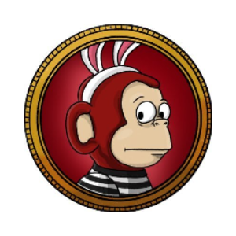 | 98625 | DUMMY | DUMMY |
|  | 98923 | FERC | FairERC20 |
|  | 71407 | MDR | Mudra MDR |
|  | 99781 | TOOLS | Blocktools |
| 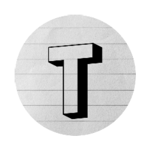 | 99729 | TEST | Test |
| 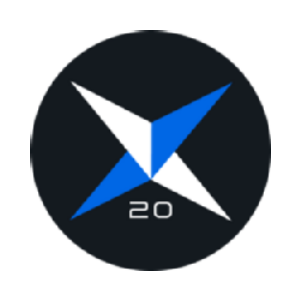 | 100045 | XRP20 | XRP20 |
| 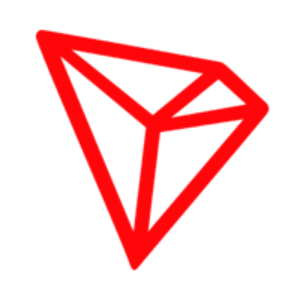 | 100033 | WTRX | Wrapped Tron |
| 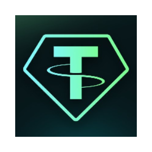 | 100023 | WSTUSDT | Wrapped Staked Tether |
| 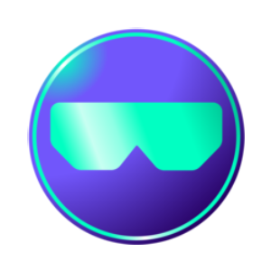 | 99489 | LEE | Love Earn Enjoy |
| 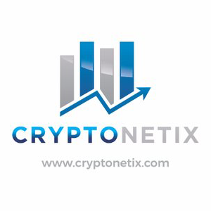 | 82477 | CIX | Centurion Invest |
| 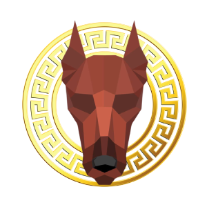 | 99473 | LAELAPS | Laelaps |
|  | 99461 | HOICHI | Hoichi |
| 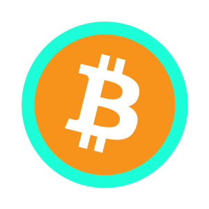 | 99431 | GOBTC | goBTC |
|  | 99425 | GENSX | Genius X |
|  | 71343 | WRT | WingRiders |
|  | 99413 | FXD | Fathom Dollar |
|  | 99603 | NONE | None Trading |
|  | 99583 | MOE | MOE |
|  | 71311 | XTUSD | XT Stablecoin XTUSD |
|  | 82733 | TRG | The Rug Game |
|  | 96929 | HAHA | Hasaki |
| 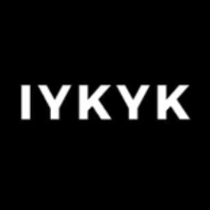 | 96865 | IYKYK | IYKYK |
|  | 96879 | PEEPO | PEEPO |
|  | 97219 | SFIN | Songbird Finance |
| 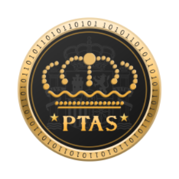 | 97167 | PTAS | La Peseta |
| 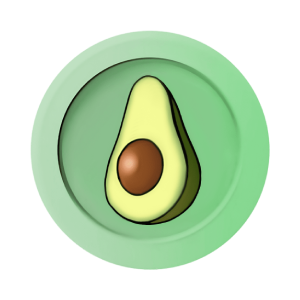 | 97047 | GUAC | Guacamole |
|  | 97121 | RIBBIT | Ribbit |
|  | 97123 | FRTC | FART COIN |
| 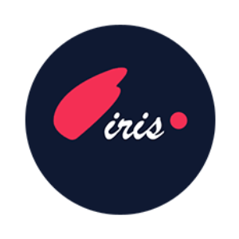 | 71517 | IRISTOKEN | Iris Ecosystem |
|  | 96521 | RENQ | Renq Finance |
| 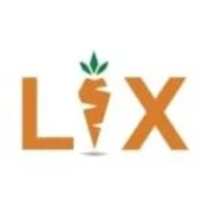 | 96595 | LIXX | Libra Incentix |
| 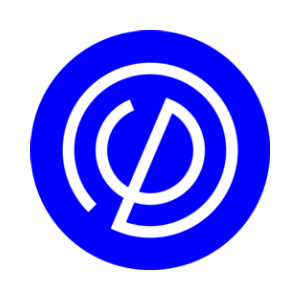 | 71577 | PMG | PMG Coin |
|  | 82681 | FRONK | Fronk |
|  | 97781 | PAYU | Platform of meme coins |
|  | 97757 | AIA | AiAkita |
| 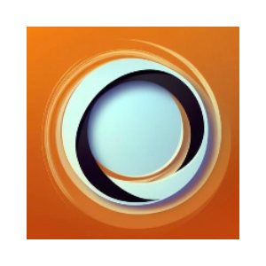 | 98603 | MAJO | Majo |
|  | 98295 | NIHAO | NiHao |
| 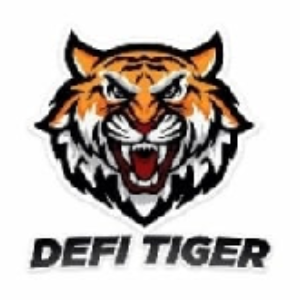 | 82727 | DTG | Defi Tiger |
| 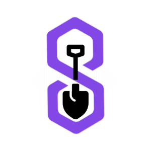 | 80379 | SPADE | PolygonFarm Finance |
| 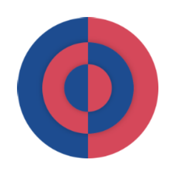 | 97277 | JSM | Joseon Mun |
| 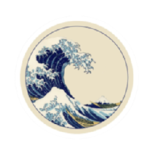 | 71489 | OKINAMI | Kanagawa Nami |
|  | 97567 | SATOX | Satoxcoin |
| 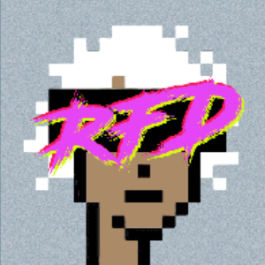 | 97587 | RFD | RefundCoin |
|  | 71475 | KUKU | panKUKU |
|  | 82713 | D2T | Dash 2 Trade |
| 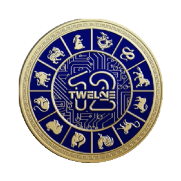 | 97467 | TWELVE | TWELVE ZODIAC |
| 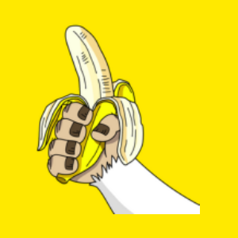 | 97521 | AGB | Apes Go Bananas |
| 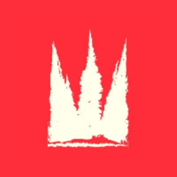 | 82291 | PRIMAL | PRIMAL |
| 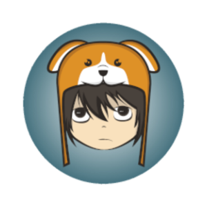 | 112159 | L | L |
| 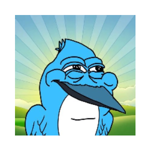 | 112131 | JAY | Jaypeggers |
|  | 112129 | SOLANA | BarbieCrashBandicootRFK88 |
| 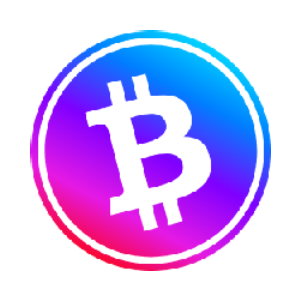 | 112127 | PLSB | PulseBitcoin |
|  | 112105 | $BULL | Bull Market |
| 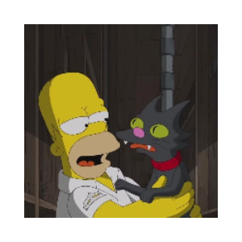 | 70865 | SNOWBALL | Snowball Token |
| 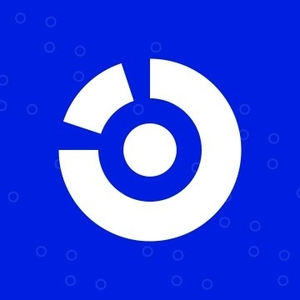 | 81065 | WATT | WATTTON |
| 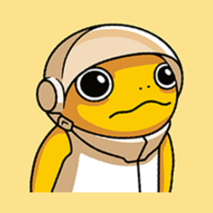 | 70755 | TURBO | Turbo Wallet |
|  | 80769 | RVLX | RevivalX |
| 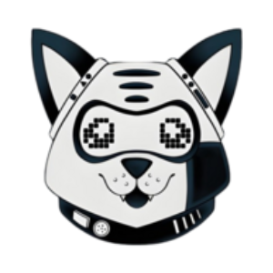 | 112651 | GELO | Grok Elo |
| 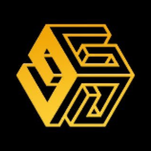 | 112643 | GETA | Getaverse |
| 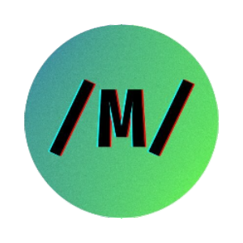 | 112611 | MOROS | MOROS NET |
|  | 80875 | TERRAFORM | Terraform DAO |
| 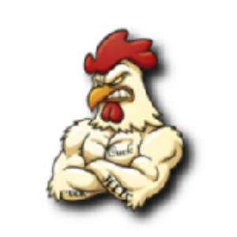 | 112239 | CUCK | Cuckadoodledoo |
|  | 80907 | DCHF | DeFi Franc |
|  | 112291 | IVY | Ivy Live |
|  | 112355 | OXL | 0x Leverage |
| 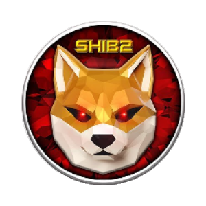 | 112307 | SHIB2 | SHIB2 |
|  | 112317 | SMILEY | Smiley Coin |
|  | 80581 | USHI | Ushi |
|  | 71071 | MAV | Massive Protocol |
|  | 71049 | S2K | Sports 2K75 |
|  | 71251 | XRX | Rex |
|  | 71241 | BMAX | BMAX |
|  | 70889 | QTO | Qtoken |
|  | 80695 | OMEN | Augury Finance |
| 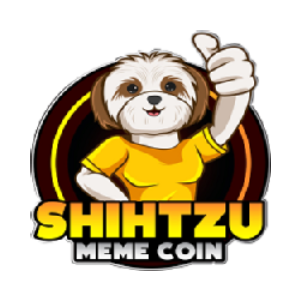 | 80663 | STZU | Shihtzu Exchange |
| 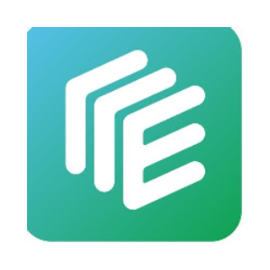 | 81225 | EDAT | EnviDa |
| 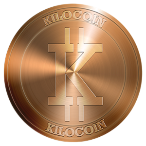 | 101601 | KLC | KalyChain |
|  | 100311 | NUON | Nuon |
|  | 100331 | OGZ | OGzClub |
| 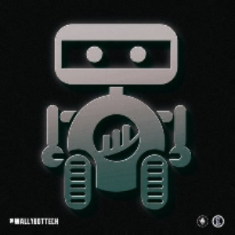 | 100347 | WALLY | Wally Bot |
|  | 80605 | GOLD8 | GOLD8 |
|  | 102141 | PEPECHAIN | PEPE Chain |
| 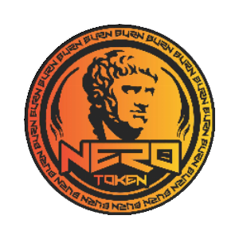 | 102427 | NERO | Nero Token |
|  | 78385 | SOETH | Wrapped Ethereum (Sollet) |
| 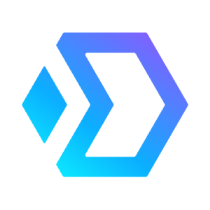 | 78389 | DXT | Dexit Network |
| 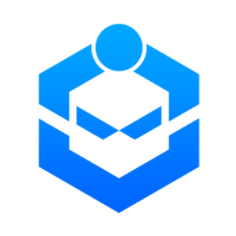 | 78447 | SHIDO | Shido |
| 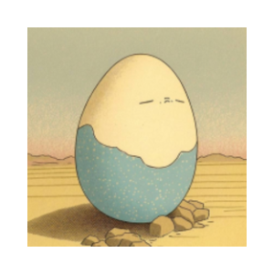 | 86817 | EGGS | Eggs |
| 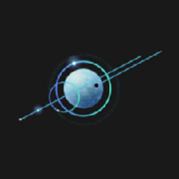 | 79631 | UVT | UvToken |
|  | 78403 | QLINDO | QLINDO |
|  | 89923 | VMT | Vemate |
|  | 78747 | NDEFI | Polly DeFi Nest |
|  | 86993 | HKC | HelpKidz Coin |
| 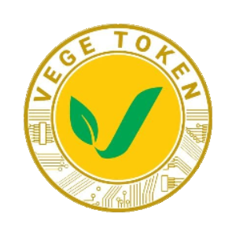 | 90103 | VEGE | Vege Token |
|  | 90277 | MSHD | MASHIDA |
| 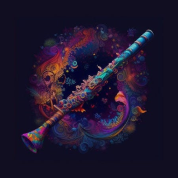 | 90247 | FLUT | Flute |
| 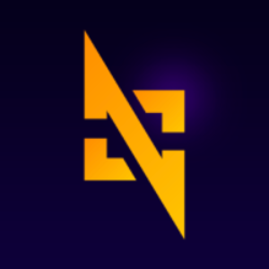 | 90223 | ORD | ordinex |
|  | 86467 | GATE | GATENet |
| 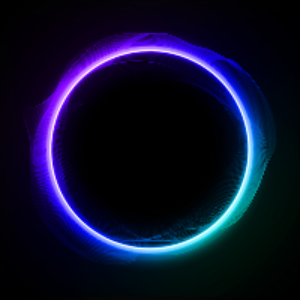 | 90189 | OZONE | Ozonechain |
|  | 90365 | MDUS | MEDIEUS |
| 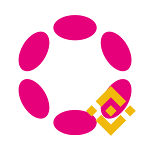 | 86409 | BDOT | BabyDot |
|  | 90317 | DOGECEO | Doge CEO |
|  | 86611 | TEXAN | Texan |
|  | 88181 | FATCAT | FAT CAT |
| 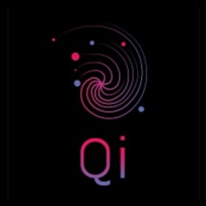 | 79175 | QIE | QI Blockchain |
|  | 79233 | $HMT | Humanize |
| 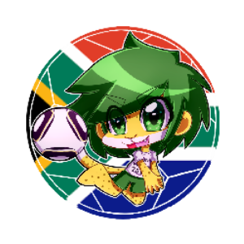 | 79071 | ZAFI | ZakumiFi |
| 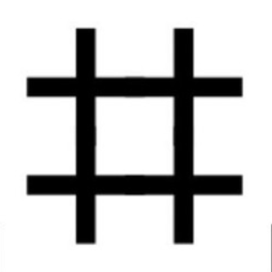 | 88899 | PRINTS | FingerprintsDAO |
|  | 79339 | B3X | Bnext B3X |
|  | 88501 | SAFO | SAFEONE CHAIN |
|  | 79313 | SUNC | Sunrise |
| 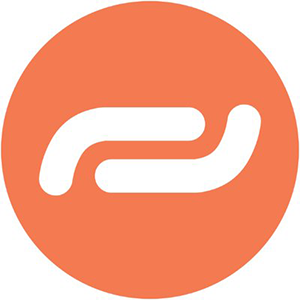 | 89477 | MART | Artmeta |
|  | 89749 | ROCKETFI | RocketFi |
| 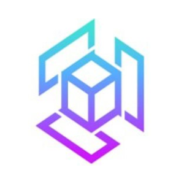 | 79509 | PRTG | Pre-Retogeum |
| 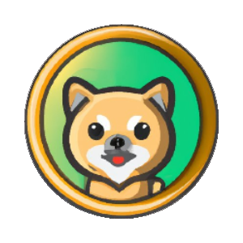 | 87179 | CHILI | CHILI |
|  | 79527 | BSR | BinStarter |
| 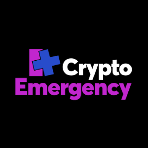 | 79535 | CEM | Crypto Emergency |
|  | 86363 | JIZZ | JizzRocket |
|  | 94753 | YUKKY | YUKKY |
|  | 94703 | EURE | Monerium EUR emoney |
|  | 94687 | LARRY | Larry |
|  | 94633 | KEKO | Keko |
| 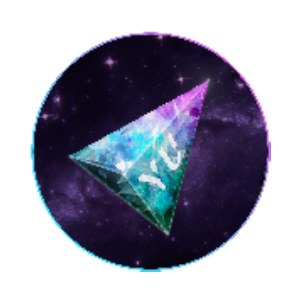 | 94951 | YU | BountyKinds YU |
|  | 94939 | BIAO | Biaocoin |
|  | 94935 | BEEP | BEEP Coin |
| 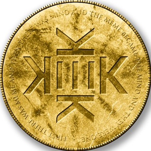 | 85313 | KEK | KeKChain |
|  | 85283 | SMPC | SMPCOIN |
| 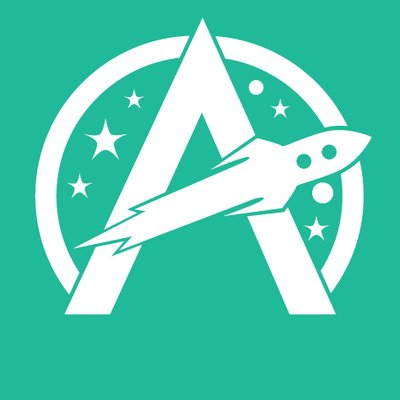 | 80063 | AMT | Amateras |
|  | 94885 | STBL | AlgoStable |
|  | 94895 | ALIF | AliF Coin |
| 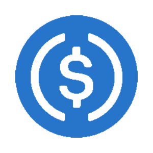 | 85545 | AXLUSDC | Axelar USDC |
| 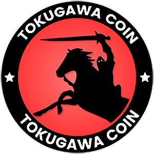 | 94411 | TOKU | Toku |
|  | 94407 | $TOAD | Toad Killer |
|  | 85517 | JP | JP |
| 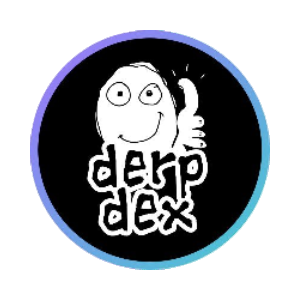 | 94561 | DERP | Derp Coin |
|  | 94557 | DELREY | Delrey Inu |
| 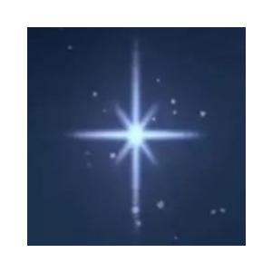 | 85381 | O | Childhoods End |
|  | 94529 | HONK | Clown Pepe |
|  | 95639 | YACHT | YachtingVerse |
| 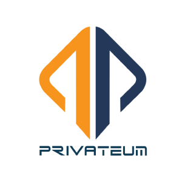 | 76607 | PRI | PRIVATEUM INITIATIVE |
| 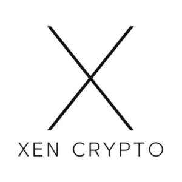 | 96059 | XEN | XEN Crypto |
| 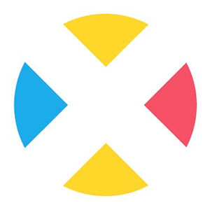 | 96055 | ZIX | Coinzix |
| 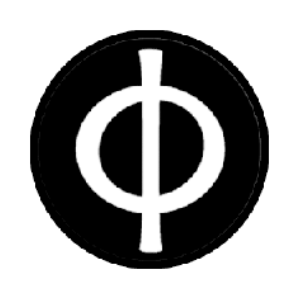 | 123889 | STATE | New World Order |
|  | 95067 | GEKE | Geke |
|  | 95009 | DAOP | Dao Space |
|  | 95041 | FLUID | FluidFi |
|  | 95533 | BMEX | BitMEX Token |
|  | 95311 | SAFEMARS | Safemars |
|  | 90955 | METFI | MetFi |
| 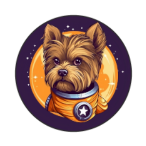 | 90855 | HOBBES | Hobbes |
| 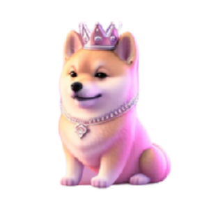 | 86197 | SHIL | Shila Inu |
|  | 79877 | PYQ | PolyQuity |
|  | 90671 | LOGT | Lord of Dragons |
|  | 90669 | LSD | Liquid Staking Derivative |
|  | 90569 | OTK | Octokn |
|  | 90529 | PIGE | Pige |
|  | 90813 | MGKL | MAGIKAL.ai |
|  | 90795 | MLXC | Marvellex Classic |
|  | 90727 | PEPA | Pepa Inu |
|  | 90763 | ZNX | ZENEX |
| 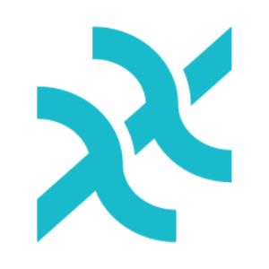 | 94135 | XX | XX Network |
|  | 94219 | WPE | OPES (Wrapped PE) |
|  | 94345 | RICHARD | Richard |
| 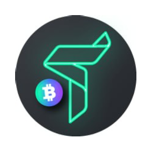 | 85729 | BTAF | BTAF token |
|  | 79999 | CPFC | Crystal Palace FC Fan Token |
| 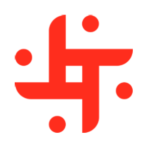 | 94243 | REIGN | Reign of Terror |
| 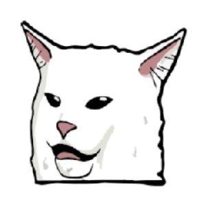 | 94281 | SMUDGE | Smudge Lord |
| 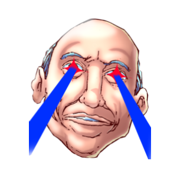 | 93907 | GENSLR | Good Gensler |
| 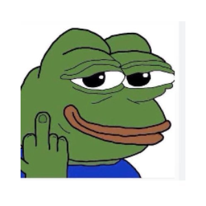 | 93891 | FKPEPE | Fuck Pepe |
|  | 93885 | FFE | Forbidden Fruit Energy |
|  | 93911 | GALGO | Governance Algo |
|  | 93883 | FONZY | Fonzy |
|  | 93953 | KABOSU INU | Kabosu Inu |
| 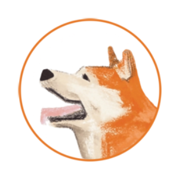 | 93917 | HACHI | Hachi |
| 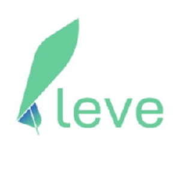 | 79953 | LEVE | Leve Invest |
|  | 138965 | XGD | XGold |
|  | 138577 | EUD | Eurodom |
| 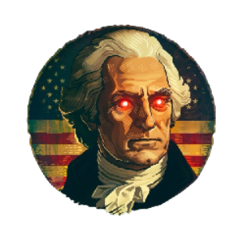 | 138831 | AMERICA | America |
|  | 141537 | FAML | FAML |
| 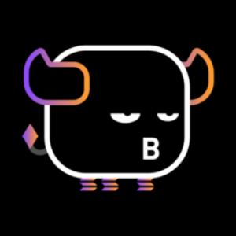 | 141541 | BBSOL | Bybit Staked SOL |
|  | 141549 | NAWS | NAWS.AI |
| 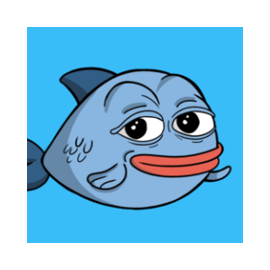 | 141553 | BLUB | BLUB |
| 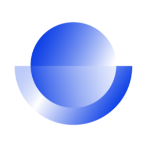 | 141555 | RECT | ReflectionAI |
|  | 141577 | WPAY | WPAY |
| 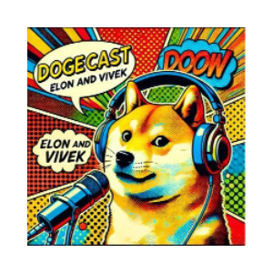 | 141601 | DOGECAST | Dogecast |
| 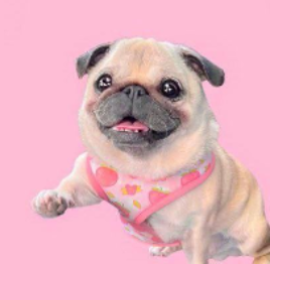 | 141611 | LOULOU | LOULOU |
|  | 141613 | STIX | STIX |
| 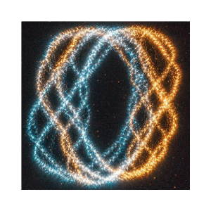 | 141481 | LUM | Luminous |
|  | 141471 | HGG | Hedera Guild Game |
|  | 141519 | PLPA | Palapa |
| 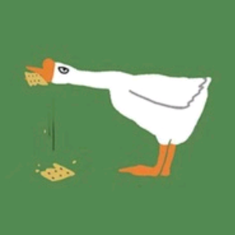 | 141507 | DARAM | DARAM AI |
|  | 141509 | LYK | LayerK |
| 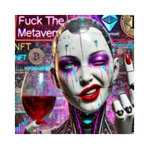 | 141511 | SHEGEN | Fi - Ai With Daddy Issues |
| 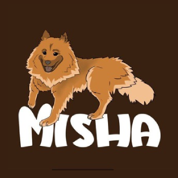 | 137935 | MISHA | Vitalik's Dog |
|  | 136837 | GUA | GUA |
| 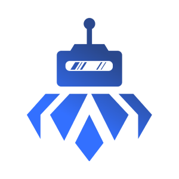 | 136843 | HEM | Hemera |
| 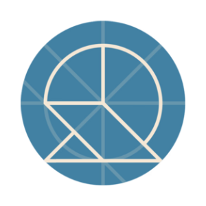 | 136853 | USR | Resolv USR |
| 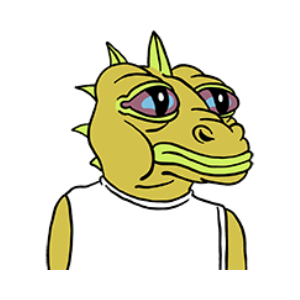 | 136917 | GECKY | Gecky |
| 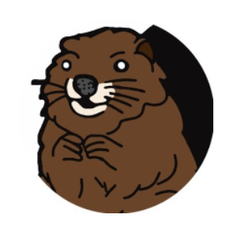 | 136665 | BOBER | BOBER |
|  | 136667 | AUKI | Auki Labs |
|  | 136677 | SAL | SalmonSwap |
|  | 136703 | CHATAI | ChatAI Token |
| 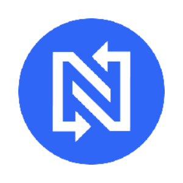 | 136709 | NOMOX | NOMOEX Token |
| 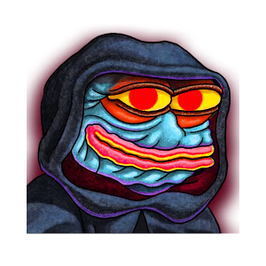 | 136711 | DORKY | Dork Lord |
|  | 136719 | LFIT | LFIT |
| 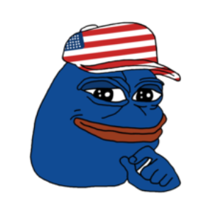 | 136725 | USPEPE | American pepe |
|  | 137575 | P3NGUIN | SpacePenguin |
| 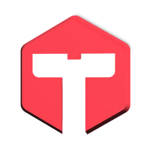 | 137601 | TRALA | TRALA |
| 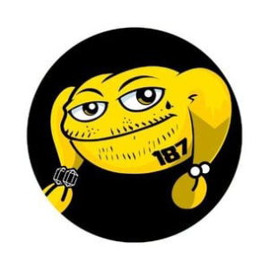 | 137635 | KRAZY | krazy n.d. |
| 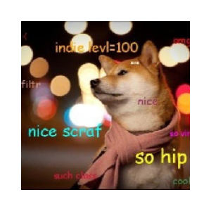 | 137735 | SUKI | SUKI |
| 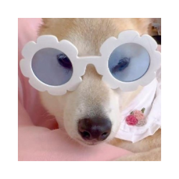 | 137031 | IRO | Iro-Chan |
| 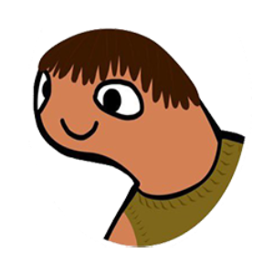 | 137095 | PLEB | Plebz |
|  | 137105 | SHEI | SheiShei |
| 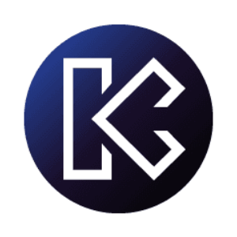 | 137123 | KAGE | Kage Network |
|  | 137131 | $CODE | Code Token |
|  | 137137 | BALL | Game 5 BALL |
| 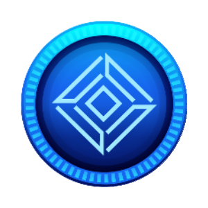 | 137143 | COAI | CodeMong Ai |
| 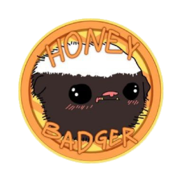 | 137321 | HOBA | Honey Badger |
| 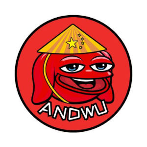 | 137335 | ANDWU | Chinese Andy |
| 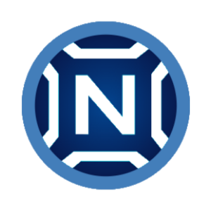 | 136635 | NRN | Neuron |
| 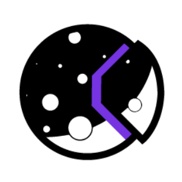 | 143313 | MOONED | MoonEdge |
| 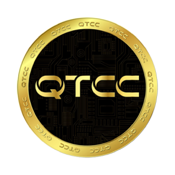 | 143929 | QTCC | Quick Transfer coin |
|  | 142377 | NXQ | NexQloud |
| 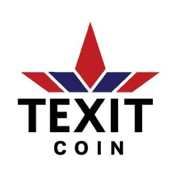 | 142435 | TXC | TEXITcoin |
|  | 142457 | FROP | Popo The Frog |
| 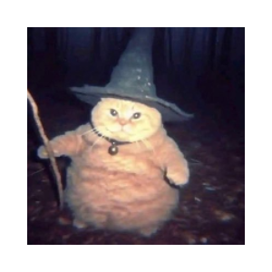 | 142617 | CHEESEBALL | Cheeseball the Wizard |
| 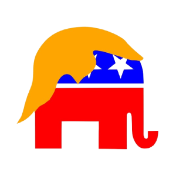 | 142641 | GOP | The Republican Party |
|  | 144509 | L1 | Lamina1 |
| 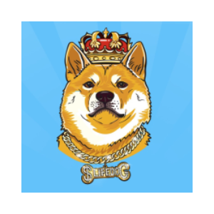 | 144527 | LFDOG | lifedog |
| 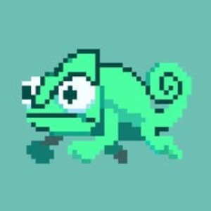 | 144529 | KANGO | KANGO |
|  | 144541 | PFROG | Peace Frog |
|  | 144553 | XSAT | exSat Network |
| 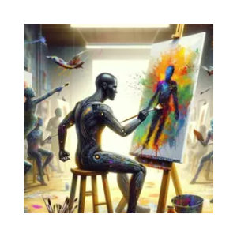 | 144631 | AVB | Autonomous Virtual Beings |
|  | 144651 | VTRADING | Vtrading |
| 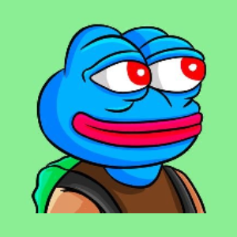 | 141773 | GROGGO | Groggo By Matt Furie |
| 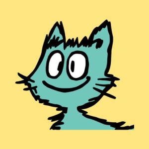 | 141787 | KASPY | Kaspy |
|  | 141791 | KASPER | Kasper the Ghost of Kaspa |
| 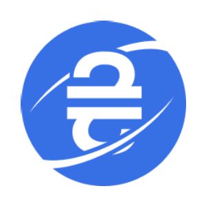 | 141797 | UAHG | UAHg |
| 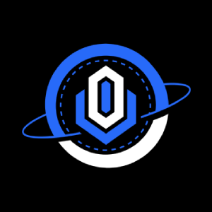 | 141799 | AAX | Academic Labs |
| 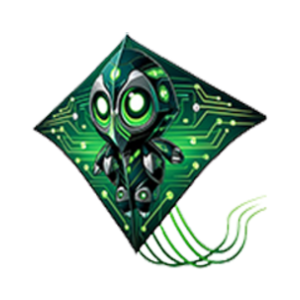 | 141811 | KITEAI | KiteAI |
|  | 141817 | PDJT | President Donald J. Trump |
| 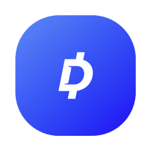 | 141829 | DAGS | Dagcoin |
| 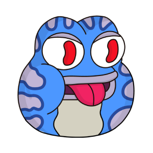 | 141759 | TROPPY | TROPPY |
|  | 141673 | CULTUR | Cultur |
| 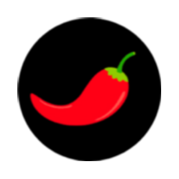 | 141695 | PEPPER | PEPPER |
|  | 141701 | LVLY | Lyvely |
| 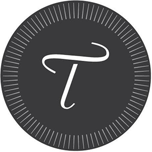 | 141717 | TIG | The Innovation Game |
| 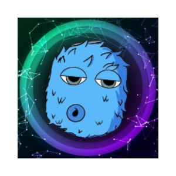 | 141719 | SENDOR | Sendor |
|  | 142083 | SPX2.0 | SPX6900 2.0 |
|  | 142159 | YLAY | Yelay |
|  | 142165 | GOOMPY | Goompy by Matt Furie |
| 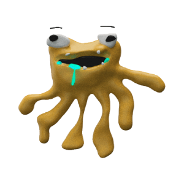 | 141845 | CUUT | CUTTLEFISHY |
|  | 141849 | MAXETH | Max on ETH |
|  | 141855 | BABYHIPPO | BABY HIPPO |
| 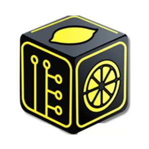 | 141863 | LEMX | LEMON |
|  | 141871 | D.O.G.E | Department Of Government Efficiency |
| 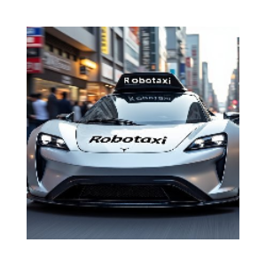 | 141927 | ROBOTAXI | TAXI |
| 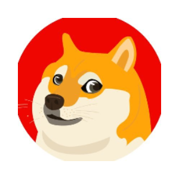 | 141931 | CHIB | Chiba |
| 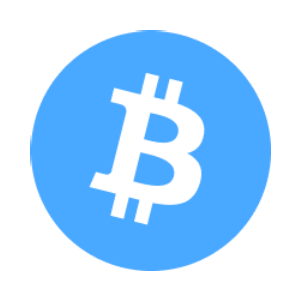 | 131875 | LB | LoveBit |
| 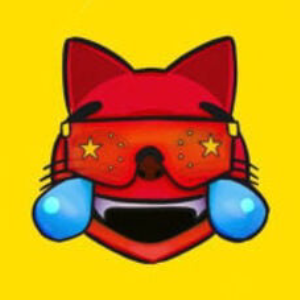 | 132067 | MOGE | Moge |
| 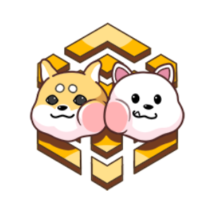 | 131799 | PME | pco metaverse |
| 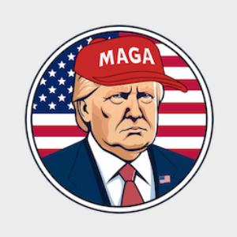 | 131813 | MAGATRUMP | MAGA Trump |
| 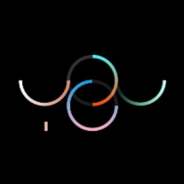 | 131823 | Y8U | Y8U |
|  | 131707 | MOLLARS | MollarsToken |
|  | 132609 | FRESCO | Fresco |
|  | 132633 | CYPEPE | CyPepe |
| 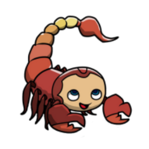 | 132849 | FEFE | Fefe |
| 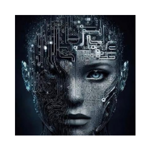 | 132505 | RADX | Radx AI |
| 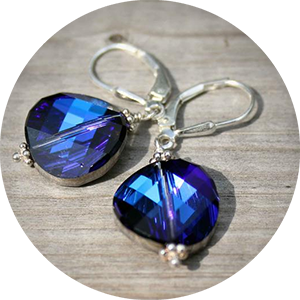 | 132085 | MARV | Marv |
| 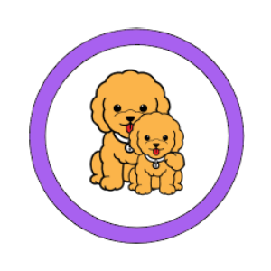 | 132149 | PINU100X | Pi INU 100x |
|  | 132161 | TRIO | TRIO (OrdinalsBot) |
| 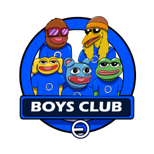 | 132177 | BOYS | Boys Club |
|  | 132193 | MOGU | Mogutou |
|  | 132261 | JUSD | JUSD Stable Token |
|  | 132287 | WTEC | World Trade Exhibition Center |
| 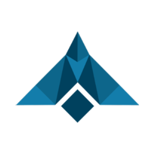 | 132381 | SNPAD | SNP adverse |
|  | 132415 | GIOVE | GIOVE |
|  | 132425 | SISC | Shirushi Coin |
| 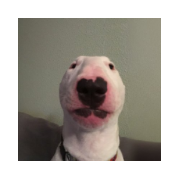 | 131705 | WALTER | walter |
|  | 131497 | PEW | pepe in a memes world |
| 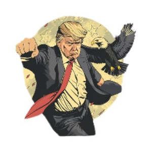 | 131475 | DJT | TrumpCoin |
|  | 131501 | ROSA | Rosa Inu |
| 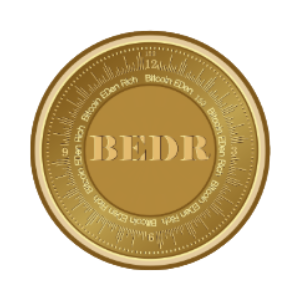 | 131503 | BITBEDR | Bitcoin EDenRich |
| 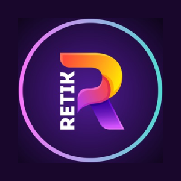 | 131521 | RETIK | Retik Finance |
| 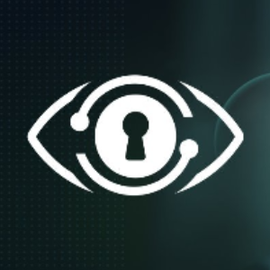 | 131549 | PGPT | PrivateAI |
| 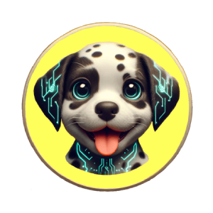 | 131245 | PONGO | Pongo |
|  | 131297 | IKI | ikipay |
| 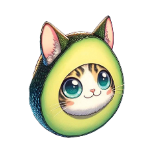 | 131553 | FAC | Flying Avocado Cat |
|  | 131657 | TUZKI | Tuzki |
| 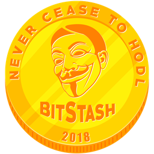 | 131643 | STASH | STASH INU |
|  | 131651 | UDAO | UDAO |
| 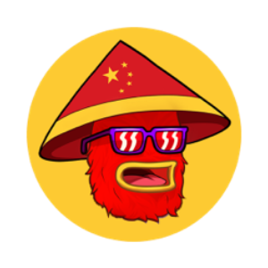 | 131665 | LANDWU | LandWu |
| 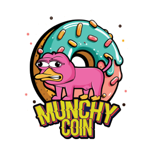 | 131633 | MUNCHY | Boys Club Munchy |
| 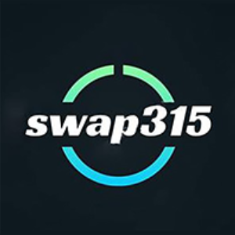 | 131689 | S315 | SWAP315 |
| 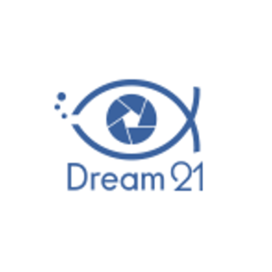 | 131635 | DMC | Datamall Coin |
|  | 131571 | ZCHF | Frankencoin |
|  | 131585 | TRUNK | Elephant Money TRUNK |
| 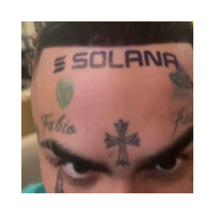 | 131619 | LILPUMP | lilpump |
|  | 132941 | QLIX | QLix |
| 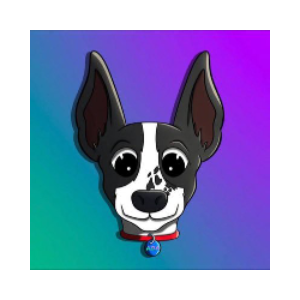 | 136383 | ADASOL | Ada |
| 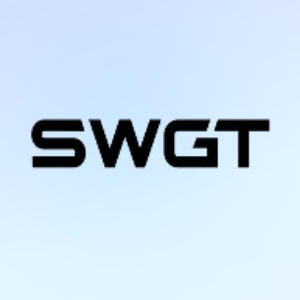 | 136393 | SWGT | SmartWorld Global |
| 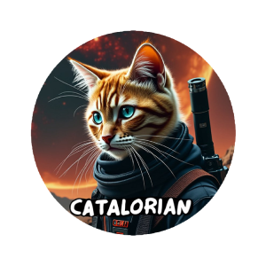 | 136397 | CATALORIAN | Catalorian |
| 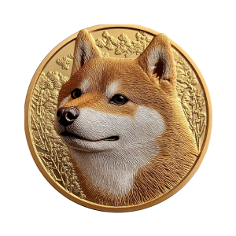 | 136401 | AGURI | Aguri-Chan |
|  | 136421 | INVITE | INVITE Token |
| 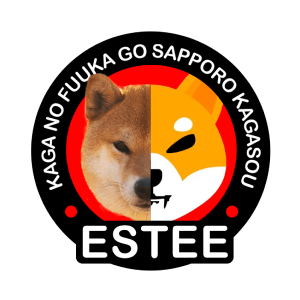 | 136423 | ESTEE | Kaga No Fuuka Go Sapporo Kagasou |
|  | 136323 | 1MBABYDOGE | Baby Doge Coin |
|  | 136425 | PINS | PINs Network Token |
| 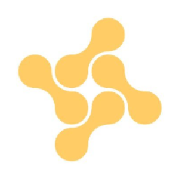 | 136441 | UMM | UMM |
|  | 136549 | MELLOW | Matt Furie's Mellow Man |
|  | 136577 | ANDYMAN | ANDYMAN |
|  | 136581 | SVTS | Syncvault |
|  | 136609 | HARAMBEAI | Harambe AI |
|  | 136621 | HEWE | Health & Wealth |
|  | 136535 | LAB | The Professor |
| 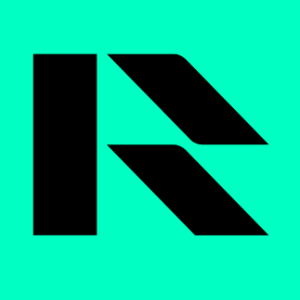 | 136483 | RFRM | Reform DAO |
| 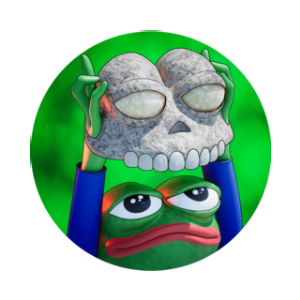 | 136445 | SKOP | Skulls of Pepe Token |
|  | 136451 | TOWELI | Towelie |
| 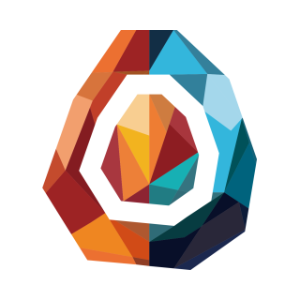 | 136485 | CFN | Cockfight Network |
| 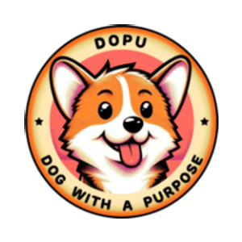 | 136507 | DOPU | DOPU The Dog with A Purpose |
| 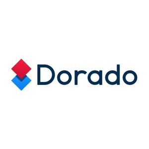 | 133987 | DOR | DoragonLand |
| 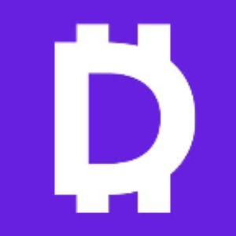 | 134067 | DLB | DiemLibre |
| 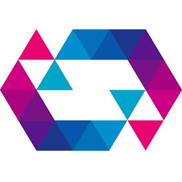 | 134157 | CHT | CyberHarbor |
| 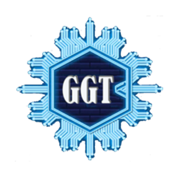 | 133049 | GGT | GameGuru |
| 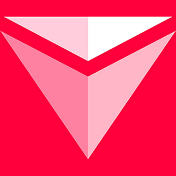 | 133151 | TKC | The Kingdom Coin |
| 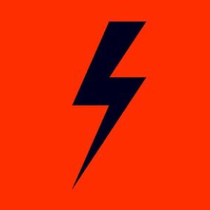 | 133209 | NIGHT | Midnight |
|  | 133671 | FLOKICASH | Floki Cash |
| 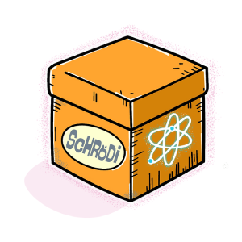 | 133217 | SCHRODI | Schrödi |
|  | 133641 | MFG | Smart MFG |
|  | 135613 | FEARNOT | FEAR NOT |
| 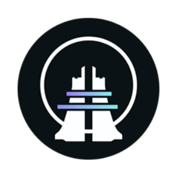 | 135705 | RIS | Riser |
| 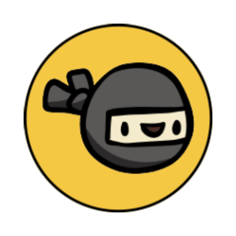 | 135713 | NST | Ninja Squad Token |
| 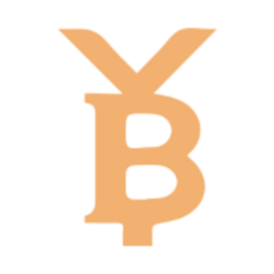 | 135839 | BTY | Bityuan |
| 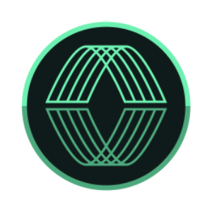 | 135415 | WVTRS | Vitreus |
| 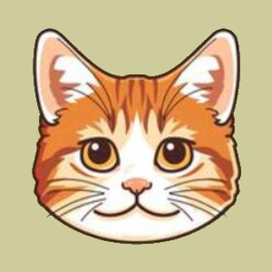 | 135329 | ZAZZLES | Zazzles |
| 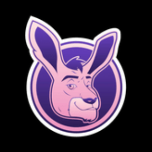 | 135331 | KANG | Kangamoon |
| 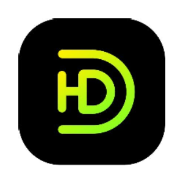 | 135339 | HGEN | HGEN DAO |
| 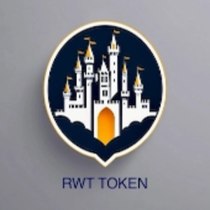 | 135357 | RWT | RWT TOKEN |
|  | 159097 | BNX | BinaryX [Old] |
|  | 158983 | WOOLLY | Miniature Woolly Mammoth |
|  | 159005 | 1R0R | R0AR |
|  | 159083 | GORTH | Gorth |
|  | 159289 | TDE | Trader |
|  | 161133 | PTEK | PropTech |
| 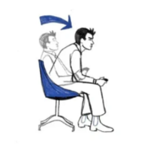 | 158725 | LOCKIN | LOCK IN |
|  | 158745 | GIZA | Giza |
|  | 158789 | NAIIVE | Naiive |
|  | 158929 | BBOB | BabyBuilder |
|  | 158809 | GRAY | Gradient |
| 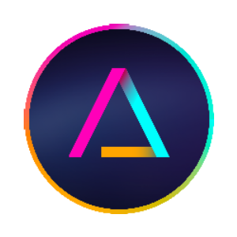 | 158817 | KDX | Kodexa |
|  | 158851 | PAPARAZZI | Paparazzi Token |
|  | 158857 | SNPT | SNPIT TOKEN |
|  | 158891 | MIH | MINE COIN |
|  | 158717 | DUPE | Dupe |
|  | 161683 | KNCH | KAANCH NETWORK |
|  | 161689 | STOC | STO CHAIN |
|  | 161691 | TICS | Qubetics |
|  | 161633 | BJC | BJustCoin |
|  | 161751 | CHILLHOUSE | Chill House |
|  | 161765 | INI | InitVerse |
|  | 161769 | BTCBULL | Bitcoin Bull |
| 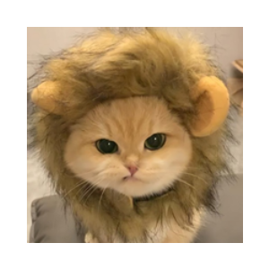 | 161777 | NALA | Nala |
| 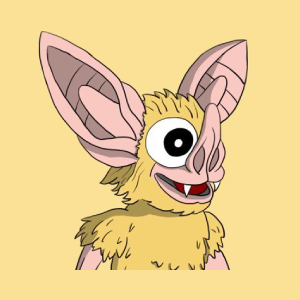 | 161597 | HOODRAT | Hoodrat |
|  | 161163 | A7A5 | A7A5 |
| 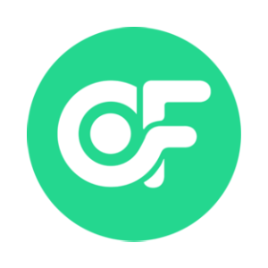 | 161529 | OFT | ONFA |
|  | 161541 | BRP | BananaRepublic |
| 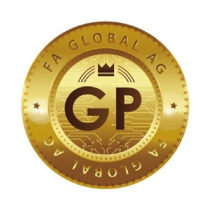 | 161543 | XGP | XGP |
| 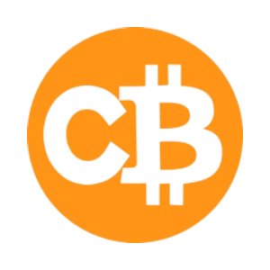 | 161545 | CTB | Content Bitcoin |
| 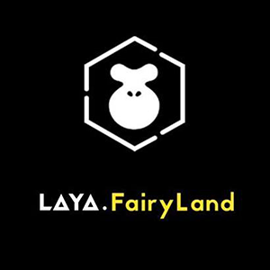 | 161547 | FLDT | FluidTokens |
|  | 161561 | MANIA | ScapesMania |
|  | 158723 | FDS | Foodie Squirrel |
|  | 151783 | ARMY | XRP ARMY |
|  | 151795 | MNTX | Minutes Network Token |
|  | 151803 | JOC | Japan Open Chain |
|  | 151909 | LUCIC | Lucidum Coin |
| 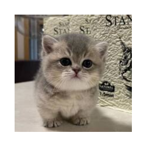 | 151583 | MIU | Miu |
|  | 151565 | BDTC | BDTCOIN |
|  | 151617 | D223 | DEX223 |
|  | 152309 | FLAT | Flat Earth |
|  | 158699 | YBDBD | Yabba Dabba Doo! |
| 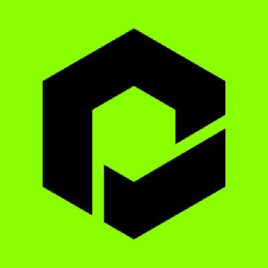 | 152323 | POPG | POPG |
| 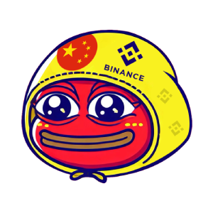 | 153165 | BABYPEIPEI | Baby PeiPei |
|  | 151537 | B3TR | VeBetterDAO |
|  | 165163 | IFO | Identified Flying Objects |
|  | 165177 | MDDC | Medodo Coin |
|  | 165183 | FTMX | FUCK THE MATRIX |
|  | 165269 | QACE | Qace Dynamics |
|  | 165161 | ABSTER | Abster |
| 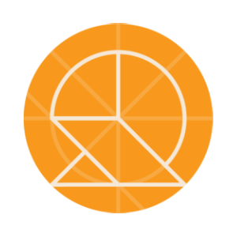 | 164789 | RLP | Resolv Liquidity Pool |
|  | 164791 | MOANER | Moaner by Matt Furie |
|  | 165023 | SLIPPY | Slippy |
|  | 165119 | VLR | Velora |
|  | 165149 | IXFI | IXFI |
|  | 165123 | DRESS | DRESSdio |
|  | 165127 | XDOG | XDOG |
|  | 165131 | AI3 | Autonomys Network |
|  | 165133 | MISSION | MISSION PAWSIBLE |
|  | 165137 | EMDR | Modulr |
|  | 165139 | ORGO | Orgo |
|  | 165145 | $JOBIESS | JobIess |
|  | 172299 | FLK | Fleek |
|  | 172305 | ANIMUS | Animus |
|  | 172313 | DOP2 | Data Ownership Protocol 2 |
|  | 172321 | ZIB | Ziba |
|  | 172333 | NUMMUS | Nummus Aeternitas |
|  | 168671 | NOICE | noice |
|  | 166129 | BET | Betfin |
|  | 166025 | DGMA | DaGama World |
|  | 166043 | MCQ | Mecha Conquest |
|  | 166045 | TENGE | TENGE TENGE |
|  | 166047 | CES | Whalebit |
|  | 166063 | ASTHERUS | Astherus |
|  | 166149 | COINDEPO | COINDEPO |
|  | 166531 | TTAJ | TTAJ |
| 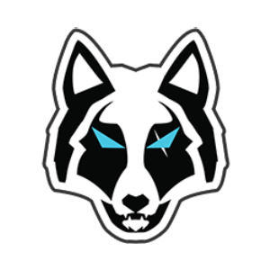 | 166939 | WWD | Wolf Works DAO |
|  | 167429 | TRHUB | Tradehub |
|  | 167491 | UNCN | Unseen |
|  | 168321 | ANOA | ANOA |
|  | 168337 | FELY | Felysyum |
|  | 162291 | DRDR | DRDR |
|  | 162303 | PUNCHI | Punchimals |
|  | 162273 | AU79 | AU79 |
| 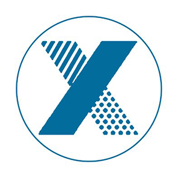 | 162385 | XPL | Plasma |
|  | 162401 | TUTC | TUTUT COIN |
|  | 162405 | FUSAKA | Fusaka |
|  | 162409 | PECH | PEPECASH (pepecash.live) |
|  | 162285 | MARSMI | Mars Meme Inc |
|  | 162267 | CTM | c8ntinuum |
|  | 162213 | ATLA | Atleta Network |
|  | 162217 | FROGGIE | Froggie |
|  | 162239 | ALKIMI | Alkimi |
|  | 162259 | XSPA | XSPA |
|  | 162431 | WWB | Wowbit |
|  | 162491 | BOMET | BOMET |
|  | 164657 | WLAI | Weblume AI |
|  | 162953 | OIL | CRUDE OIL BRENT (Zedcex) |
|  | 163067 | HOODOG | Hoodog |
|  | 164215 | MEDXT | Medxt |
| 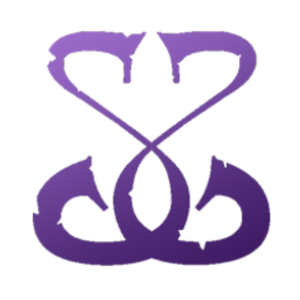 | 164365 | CRADLE | Cradle |
|  | 164539 | ATOS | Atoshi |
|  | 162889 | ATHX | Athena DexFi |
|  | 162497 | LEARN | Brainedge |
|  | 162515 | RBR | Robora |
|  | 162519 | ICECREAM | IceCream AI |
| 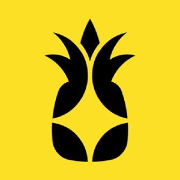 | 162535 | PAPPLE | Pineapple |
|  | 162549 | ASETQU | AsetQu |
| 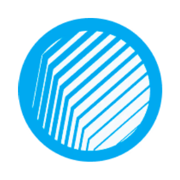 | 162559 | ASF | Asymmetry Finance |
|  | 162577 | LUMINT | Lumint |
|  | 162615 | WXTM | Wrapped MinoTari |
|  | 162663 | TOKABU | Tokabu |
| 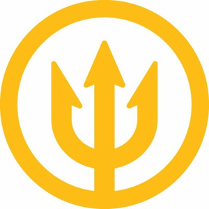 | 162701 | TRN | t3rn |
|  | 162723 | XU3O8 | xU3O8 |
|  | 162749 | BOSSBURGER | Boss Burger |
|  | 146843 | LMI | Lockheed Martin Inu |
|  | 146849 | NEURO | NeuroWeb |
|  | 146919 | SAFU | SAFU |
|  | 146943 | DEBOX | DeBox Cloud |
|  | 146677 | NIKEPIG | NikePig |
|  | 146637 | BBSNEK | BabySNEK |
|  | 146641 | GO4 | GameOnForge |
| 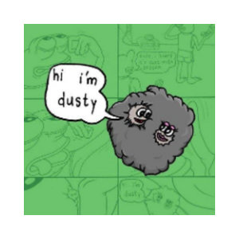 | 146649 | DUSTY | DUSTY |
|  | 146675 | TOKI | Toki |
| 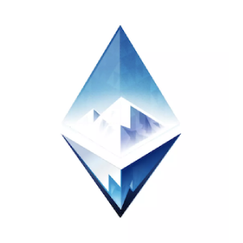 | 146695 | WMC | Wrapped MistCoin |
|  | 146707 | A1X | AI Nexus |
|  | 147193 | CPAI | Moontax |
|  | 147161 | XMONEY | X Money |
|  | 147211 | APEMAN | APEMAN |
|  | 147233 | PADRE | Padre |
| 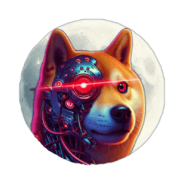 | 146985 | DOGER | Robotic Doge |
| 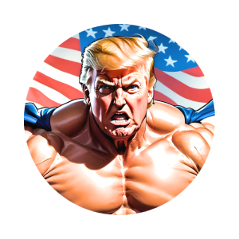 | 147107 | PUMPTRUMP | PUMP TRUMP |
|  | 147119 | TCAPY | TonCapy |
|  | 146259 | HANEP | HANePlatform |
|  | 146077 | DOI | Doichain |
|  | 146337 | EIOB | EIOB |
|  | 146463 | IFAI | InfluxAI Token |
| 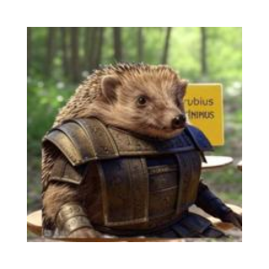 | 146623 | SHRUBIUS | Shrubius Maximus |
|  | 146575 | QF | Quantum Fusion Network |
|  | 146587 | BBA | BBAChain |
|  | 146503 | SIMMI | Simmi |
|  | 146513 | RZ | RZcoin |
|  | 146523 | 4EVER | 4EVERLAND |
|  | 146541 | GUAN | Guanciale by Virtuals |
|  | 151527 | REACT | Reactive Network |
|  | 150613 | GAG | GAG Token |
|  | 150873 | BRICS | BRICS Chain |
| 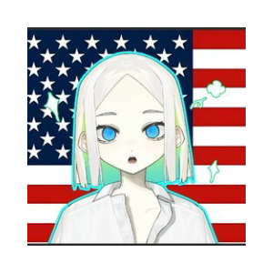 | 150915 | AVAAI | AVA AI |
| 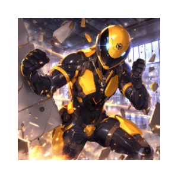 | 150919 | CAPTAINBNB | CaptainBNB |
| 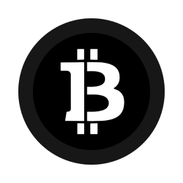 | 150939 | BADAI | BAD Coin |
|  | 150941 | XOXO | XO Protocol |
| 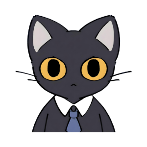 | 150973 | HINAGI | Hinagi |
|  | 150987 | SIXP | Sixpack Miner |
|  | 150103 | STAU | STAU |
|  | 150233 | HQ | Metaverse HQ |
| 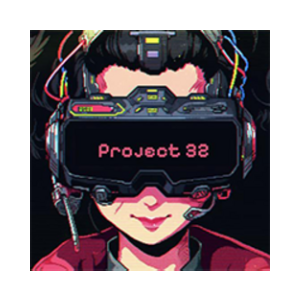 | 150257 | 32 | Project 32 |
| 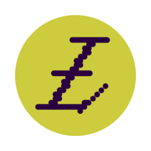 | 151459 | LVVA | Levva Protocol |
|  | 151461 | COLLAT | Collaterize |
|  | 151435 | TDCCP | TakeDownCCP |
|  | 151493 | PELL | Pell Network |
|  | 151497 | VCITY | Vcitychain |
|  | 151501 | KULA | KULA |
| 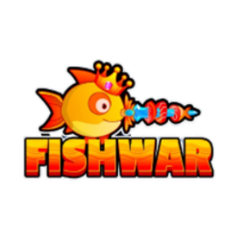 | 151503 | FISHW | Fishwar |
|  | 151505 | STOOS | STO Operating System |
|  | 151517 | AQA | AQA |
|  | 147945 | MRSOON | TON Station |
|  | 148081 | PILLAR | PillarFi |
|  | 148085 | XSEED | MXS Games |
| 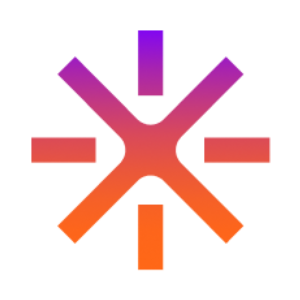 | 148087 | L1X | Layer One X |
| 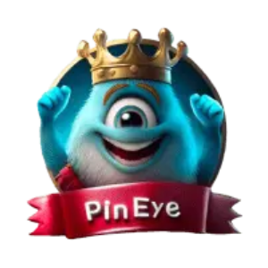 | 148143 | PINEYE | PinEye |
|  | 148147 | MXNA | Dark Machine |
|  | 147283 | XETRA | Xetra AI |
| 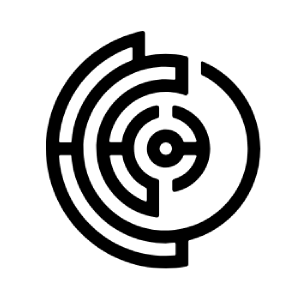 | 147307 | EFFECT | Effect AI [New] |
| 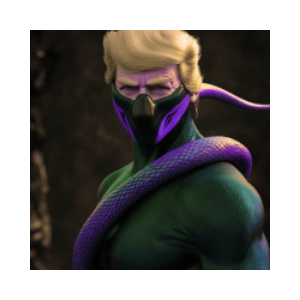 | 148175 | SNAKT | Sna-King Trump |
|  | 149949 | LLD | Liberland LLD |
|  | 149753 | BATCH | Batching.AI |
|  | 149785 | APRA | Apraemio |
| 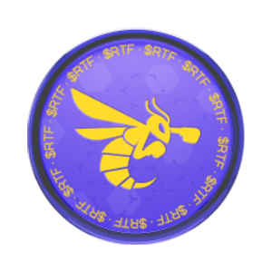 | 149899 | RTF | Ready to Fight |
| 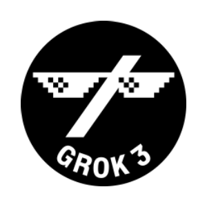 | 148185 | GROK3 | Grok 3 |
|  | 148319 | IVT | ivault |
| 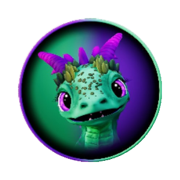 | 122289 | DRAGY | Dragy |
|  | 122299 | USTC | Terra Classic USD (Wormhole) |
| 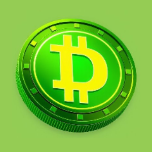 | 122307 | DIGI | Digiverse |
| 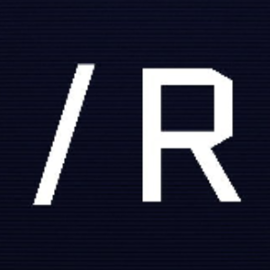 | 122317 | REACH | /Reach |
| 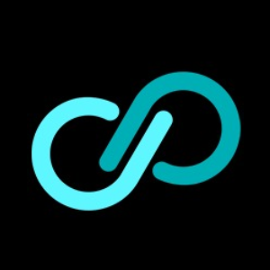 | 122337 | SPOL | Sociapol |
|  | 122345 | RSTK | Restake Finance |
|  | 122355 | WELL | Moonwell |
| 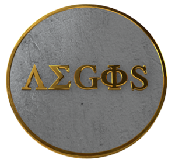 | 122283 | AEGIS | Aegis Ai |
|  | 122363 | EGX | Enegra (EGX) |
| 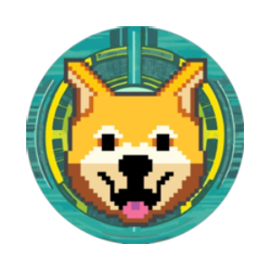 | 122227 | ZUZALU | Zuzalu Inu |
| 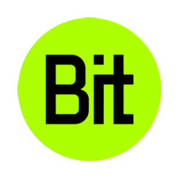 | 122211 | BIT | Biconomy Exchange Token |
|  | 122215 | PEAS | Peapods Finance |
|  | 122241 | VPR | VaporFund |
| 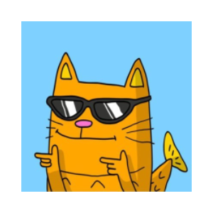 | 122257 | CATFISH | Catfish |
| 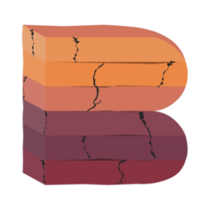 | 122263 | ROCK | Rock Dao |
|  | 122265 | PT | Phemex Token |
|  | 122499 | GXE | XENO Governance |
|  | 122477 | MATCH | Matching Game |
|  | 122507 | NEOX | Neoxa |
|  | 122509 | MMT | MyMetaTrader |
| 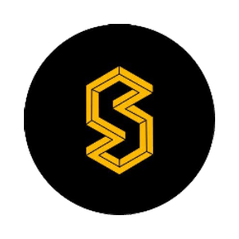 | 122521 | BNBX | Stader BNBx |
| 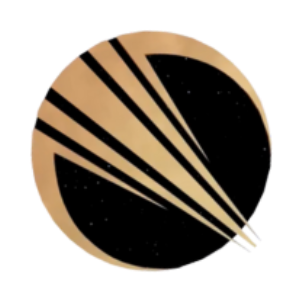 | 122525 | GMTO | Game Meteor Coin |
|  | 122409 | KNDX | Kondux |
|  | 122119 | WBT | WhiteBIT Coin |
| 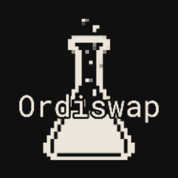 | 122135 | ORDS | Ordiswap |
| 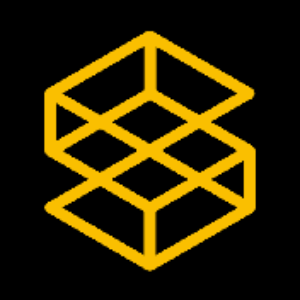 | 122139 | SAVM | SatoshiVM |
| 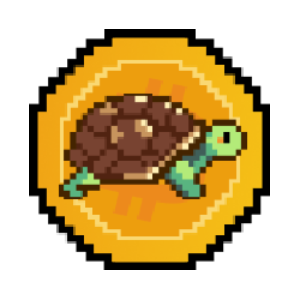 | 122159 | TURT | TurtSat |
| 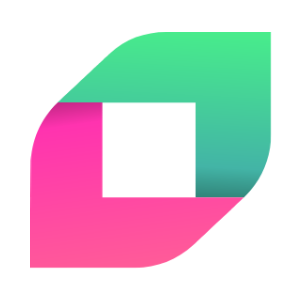 | 122161 | FLIP | Chainflip |
| 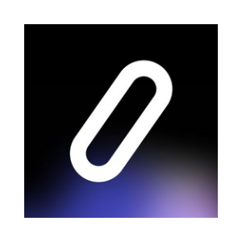 | 122169 | ZERO | Analysoor |
| 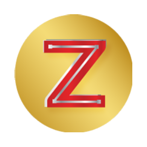 | 122189 | ZETRIX | Zetrix |
|  | 122117 | WBS | Websea |
|  | 122099 | 1CAT | Bitcoin Cats |
|  | 122089 | HTX | HTX |
|  | 122097 | RATS | rats (Ordinals) |
| 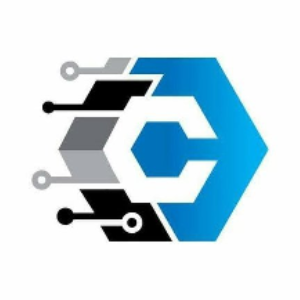 | 122531 | CCASH | C-cash |
| 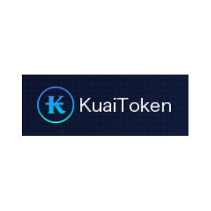 | 122535 | KT | KingdomX |
| 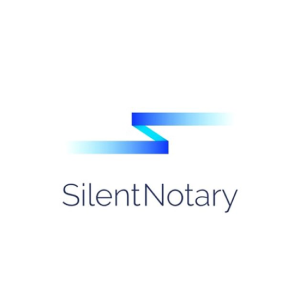 | 122999 | SNTR | Sentre Protocol |
| 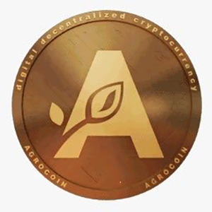 | 122983 | AGRO | Agro Global |
|  | 123013 | UCJL | Utility Cjournal |
| 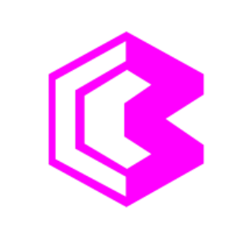 | 123031 | BLES | Blind Boxes |
| 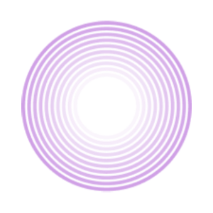 | 122951 | OPN | Open Source Network |
|  | 123035 | MEMD | MemeDAO |
| 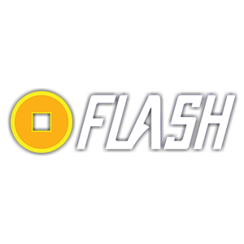 | 122885 | MEGA | Megaton Finance |
| 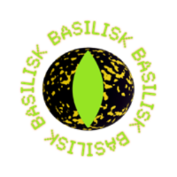 | 122897 | BSX | Basilisk |
| 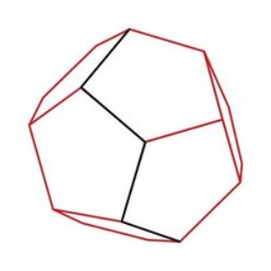 | 122925 | RBD | Rubidium |
| 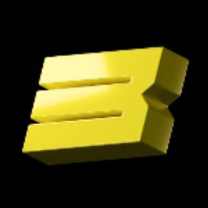 | 122937 | BXBT | BoxBet |
|  | 122941 | FWB | Friends With Benefits Pro |
|  | 123037 | GDT | Globe Derivative Exchange |
|  | 122875 | TANGYUAN | TangYuan |
|  | 123177 | 喵喵喵喵喵 | 喵喵喵喵喵 |
|  | 123143 | OPENAI ERC | OpenAI ERC |
| 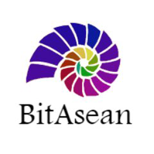 | 123147 | BAS | Basis Share |
|  | 123167 | PUNK | Punk Vault (NFTX) |
| 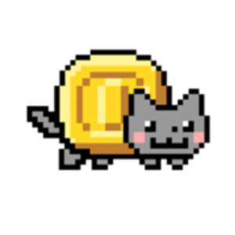 | 123189 | NYAN | NYAN Meme Coin |
|  | 123221 | CSR | CSR |
|  | 123051 | ORBT | Orbitt Pro |
|  | 123071 | MILEI | MILEI Token |
| 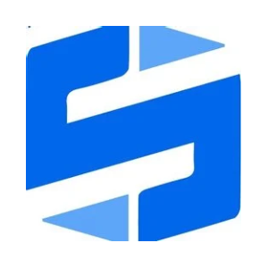 | 123097 | ALITA | ALITA |
| 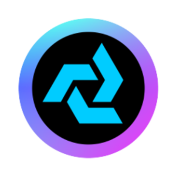 | 122639 | METO | Metafluence |
| 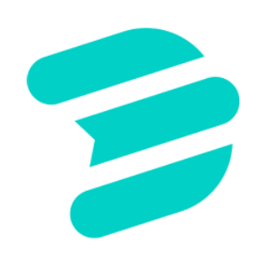 | 122619 | EDUM | EDUM |
|  | 122631 | UNMD | Utility Nexusmind |
|  | 122659 | BCAT | BilliCat |
|  | 122663 | KIRBY | Blue Kirby |
|  | 122561 | HDX | HydraDX |
|  | 122595 | FPS | Web3War |
|  | 122575 | VT | Virtual Tourist |
| 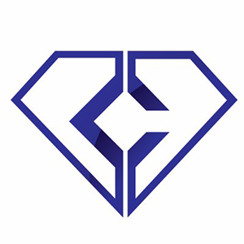 | 122665 | CARAT | Alaska Gold Rush |
|  | 122779 | AJNA | Ajna Protocol |
| 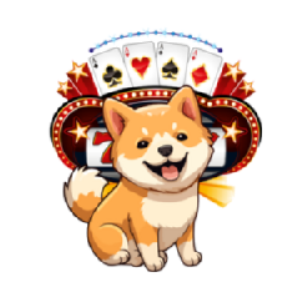 | 122791 | CASINU | Casinu Inu |
|  | 122833 | LOFI | LOFI |
|  | 122855 | WEB | Web-x-ai |
| 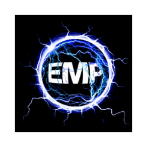 | 122693 | EMP | Empyreal Exchange |
|  | 122695 | TUCKER | TUCKER CARLSON |
| 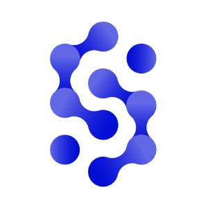 | 122715 | SCT | SuperCells Token |
| 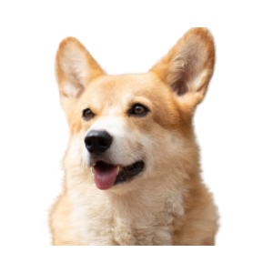 | 122725 | BNBDOG | BNB DOG INU |
|  | 122727 | PSI | TridentDAO |
|  | 113265 | BS9000 | BabySmurf9000 |
| 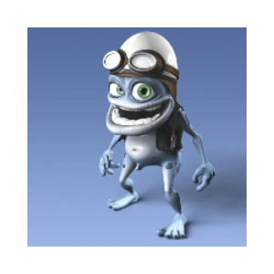 | 113311 | CRAZY | Crazy Frog |
| 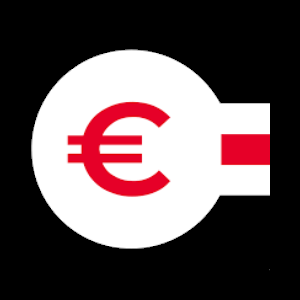 | 113197 | EURCV | Societe Generale-FORGE EURCV |
|  | 113121 | SSE | Soroosh Smart Ecosystem |
|  | 113563 | ONIC | Trade Bionic |
|  | 113369 | DYL | Dyl |
| 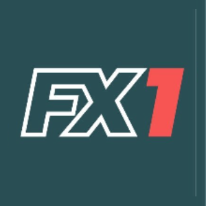 | 113409 | FXI | FX1Sports |
|  | 113431 | GVC | Global Virtual Coin |
|  | 112791 | LEEROY | LEEROY JENKINS |
|  | 112763 | JTT | Justus |
|  | 112891 | WBAN | Wrapped Banano |
|  | 112707 | JFIN | JFIN Coin |
|  | 112667 | HYDT | HYDT |
| 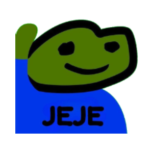 | 112711 | JJ | Jjmoji |
|  | 112881 | ! | WOW |
|  | 113039 | PBMC | PBM Coin |
|  | 113061 | DRN | Play To Create |
|  | 113071 | RTIME | RecTime |
|  | 113097 | SRDS | Sardis Network |
|  | 112977 | NESS | Ness Lab |
|  | 113619 | SPURS | Tottenham Hotspur FC Fan Token |
| 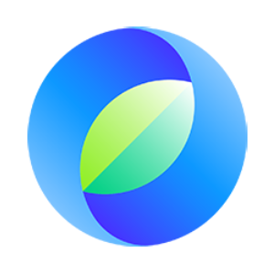 | 115333 | ECOTERRA | ecoterra |
| 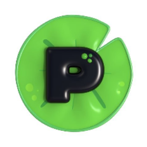 | 115341 | PNDC | Pond Coin |
|  | 114673 | CREPE | Crepe Coin |
|  | 115163 | UNLEASH | UnleashClub |
|  | 114947 | AXT | Avante |
|  | 115065 | PVC | PVC Meta |
|  | 115151 | WDYM | What Do You Meme |
|  | 115579 | XAH | Xahau |
|  | 115557 | MMX | MMX |
| 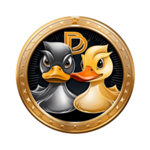 | 115627 | DD | DuckDAO |
| 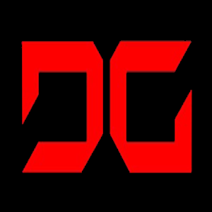 | 115629 | DEGA | Dega |
|  | 115401 | FOG | FOGNET |
| 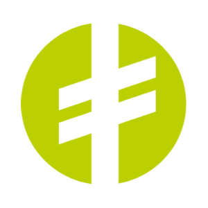 | 114267 | TRYC | TRYC |
|  | 113747 | QGOLD | Quorium |
|  | 113765 | BSG | Baby Squid Game |
| 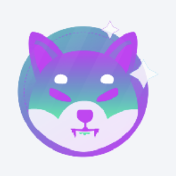 | 113779 | SSHIB | Solana Shib  |
|  | 113803 | BTC20 | Bitcoin20 |
|  | 113805 | BTC2.0 | Bitcoin 2.0 |
| 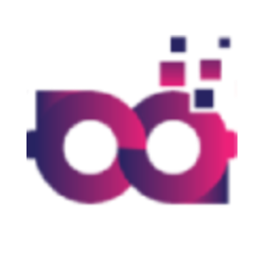 | 113641 | MZM | MetaZooMee |
|  | 113667 | ƎԀƎԀ | Pepe Inverted |
|  | 113971 | TZU | Sun Tzu |
|  | 113833 | OGSM | OG SMINEM |
|  | 113879 | PLB | Paladeum |
| 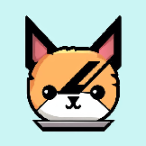 | 113903 | FIDO | Fido |
| 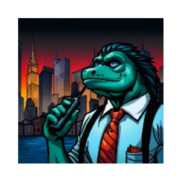 | 113931 | GEKKO | GEKKO |
| 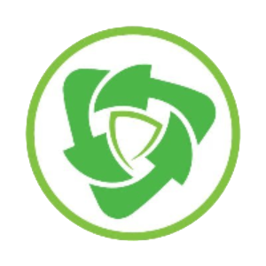 | 113949 | PTH | PlasticHero |
|  | 127541 | SOPHON | Sophon (Atomicals) |
|  | 127535 | FRGX | FRGX Finance |
| 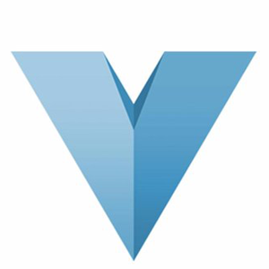 | 127567 | VSX | Versus-X |
| 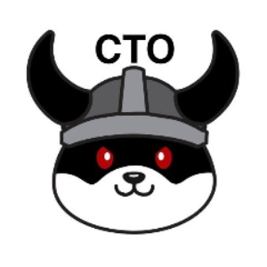 | 127587 | FLOVI | Flovi inu |
| 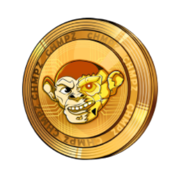 | 127429 | CHMPZ | Chimpzee |
| 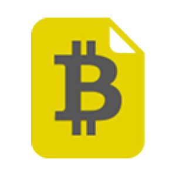 | 127437 | BTCF | BITCOIN FUTURE |
|  | 127455 | TATSU | Taτsu |
| 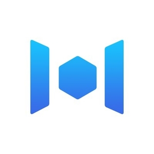 | 127775 | XIN | Mixin |
| 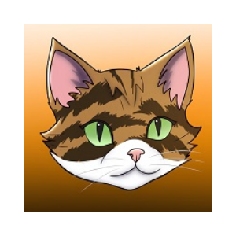 | 127641 | TIGRA | Tigra |
|  | 127643 | FGM | Feels Good Man |
|  | 127655 | ZKHIVE | zkHive |
| 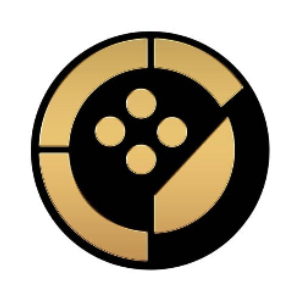 | 127689 | CRGPT | CryptoGPT |
| 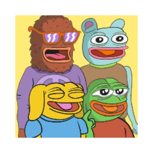 | 127705 | BOYSCLUB | Boy's club |
| 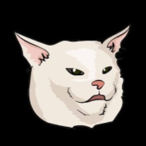 | 127179 | LMEOW | lmeow |
|  | 127181 | O4DX | OrangeDX |
| 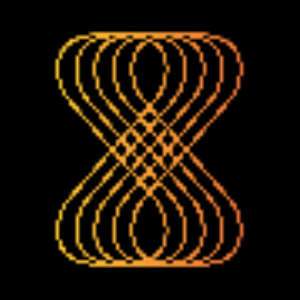 | 127185 | VELAR | Velar |
| 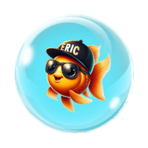 | 127193 | ERIC | Elon's Pet Fish ERIC |
| 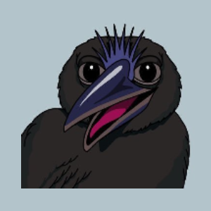 | 127229 | NITEFEEDER | Nitefeeder |
|  | 127165 | BRUNE | BitRunes |
|  | 127093 | TRUF | Truflation |
| 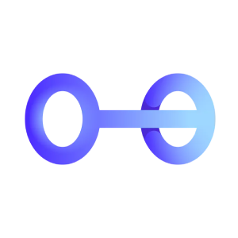 | 127107 | AIUS | Arbius |
| 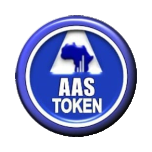 | 127163 | AAST | AASToken |
| 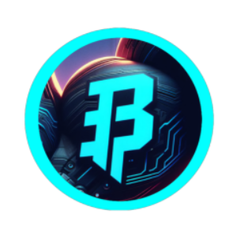 | 127137 | BICS | Biceps |
| 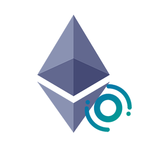 | 127321 | OETH | Origin Ether |
| 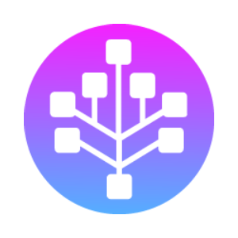 | 127335 | SDR | SedraCoin |
|  | 127381 | RABI | Rabi |
| 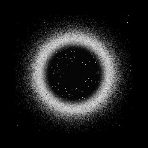 | 127307 | DITH | Dither AI |
| 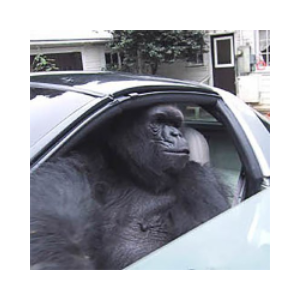 | 127259 | GIAC | Gorilla In A Coupe |
| 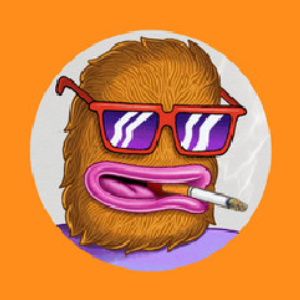 | 127273 | LANDWOLF | LANDWOLF |
|  | 127281 | GAGA | Gaga (Pepe) |
| 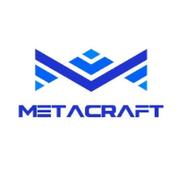 | 127297 | MCTP | Metacraft |
| 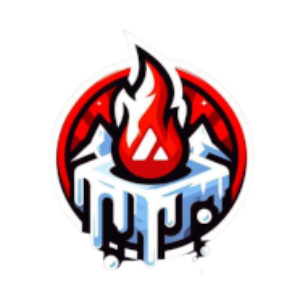 | 130355 | NOCHILL | AVAX HAS NO CHILL |
|  | 130337 | BOBE | BOOK OF BILLIONAIRES |
|  | 130339 | SGR | Schrodinger |
|  | 130311 | GRAM | Gram |
|  | 130283 | REDO | Resistance Dog |
| 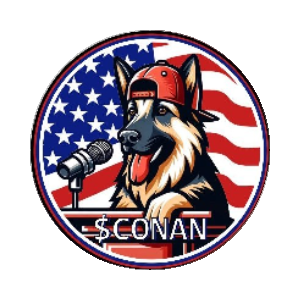 | 130295 | CONAN | Conan |
| 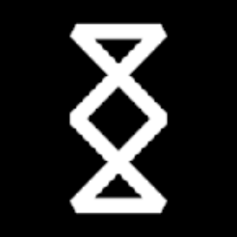 | 130301 | SMH | Spacemesh |
| 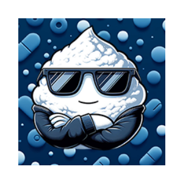 | 131043 | KETAMINE | Ketamine |
|  | 131023 | GMFI | Golden Magfi |
| 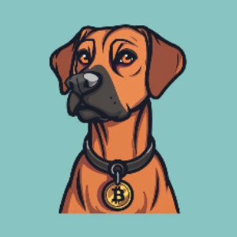 | 131059 | ARKY | Arky |
| 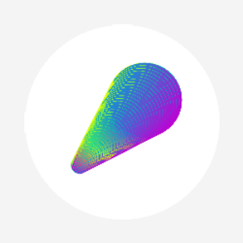 | 131091 | SVL | Slash Vision Labs |
| 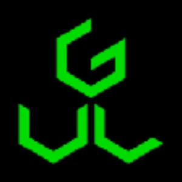 | 131103 | GVL | Greever |
|  | 130457 | FTW | Apollo FTW |
|  | 130497 | SOARX | Soarx Coin |
| 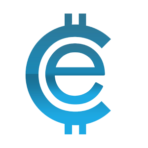 | 127865 | EARTH | PaleBlueDot |
| 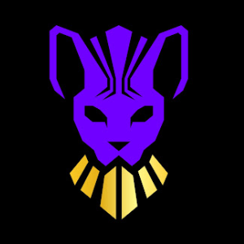 | 128089 | SPHYNX | Sphynx Labs |
|  | 128109 | BOPE | Book of Pepe |
| 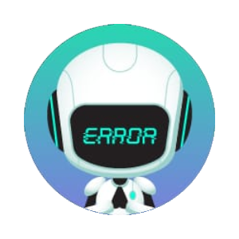 | 128117 | AII | Artificial Idiot |
|  | 128187 | GCOTI | COTI Governance Token |
|  | 127881 | PEPY | Pepy |
|  | 127977 | DOLZ | DOLZ |
| 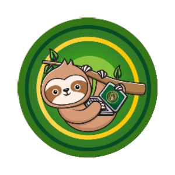 | 128017 | PRZS | Perezoso |
| 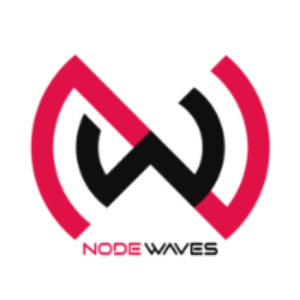 | 128025 | NWS | Nodewaves |
|  | 128841 | ETHI | Ethical Finance |
| 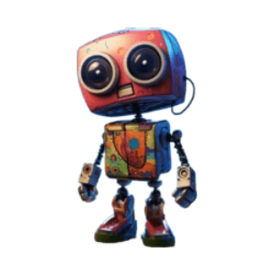 | 129005 | JFIVE | Jonny Five |
| 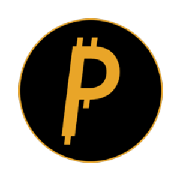 | 128233 | PREME | PREME Token |
|  | 128375 | PEPINU | PepInu |
| 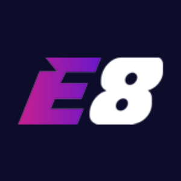 | 124345 | E8 | Energy8 |
| 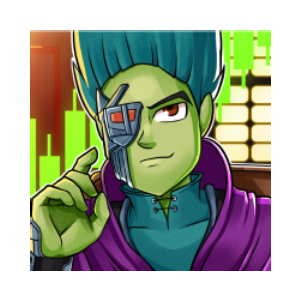 | 124307 | YOBASE | All Your Base |
|  | 124339 | XPHX | PhoenixCo Token |
| 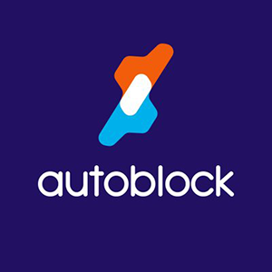 | 124349 | ATC | Atlantis Coin |
|  | 123975 | KERMIT | Kermit |
| 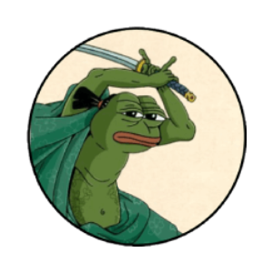 | 124053 | PEPURAI | PEPURAI |
| 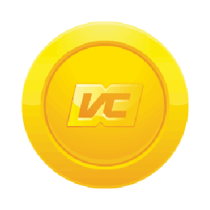 | 124845 | VCG | VCGamers |
| 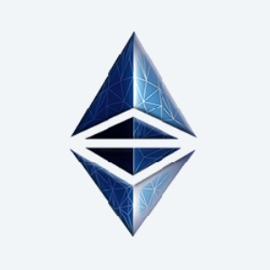 | 125041 | ETPOS | EtherPOS |
| 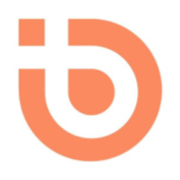 | 124809 | BRIGHT | Bright Union |
|  | 124667 | GLR | GalleryCoin |
|  | 124767 | CLT | CoinLoan |
|  | 123283 | FUFU | Fufu Token |
|  | 123303 | DBX | DBX |
|  | 123325 | INTERN | Interns |
|  | 123811 | ANI | Anime Token |
|  | 123863 | BABYMYRO | Baby Myro |
| 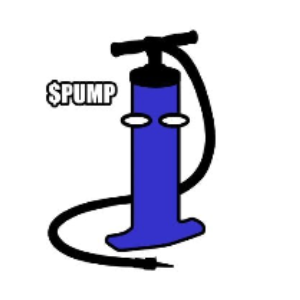 | 123903 | PUMP | 2024PUMP |
|  | 123739 | XV | XV |
| 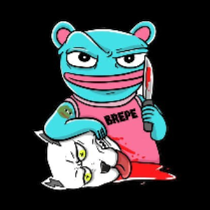 | 123647 | BREPE | BREPE |
|  | 123725 | ORE | Open Rights Exchange |
|  | 126561 | MACHINA | Church of the Machina |
| 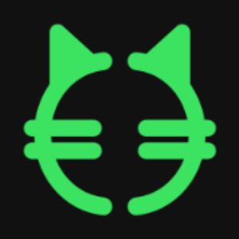 | 126215 | TANPIN | TanPin |
|  | 126983 | SMOLE | smolecoin |
| 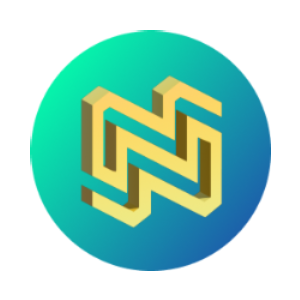 | 126989 | WMN | WebMind Network |
|  | 127007 | NAI | Nuklai |
| 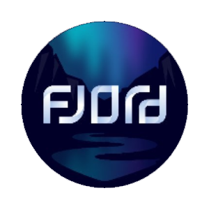 | 127011 | FJO | Fjord Foundry |
| 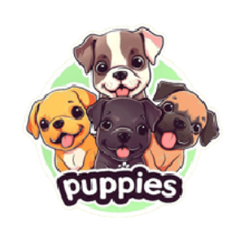 | 127029 | PUPPIES | I love puppies |
| 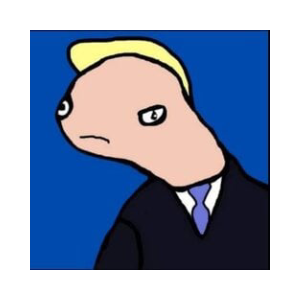 | 127057 | TREMP | Doland Tremp |
|  | 126971 | HUGE | HugeWin |
|  | 126697 | $JONES | $JONES |
| 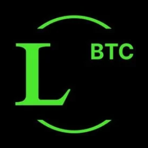 | 126759 | LIGO | Ligo (Ordinals) |
|  | 125525 | AISIG | AISignal |
| 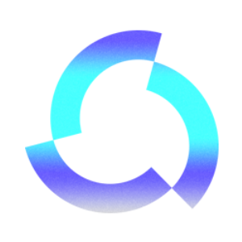 | 125615 | CRYO | CryoDAO |
|  | 126011 | SUP | SAKURA UNITED PLATFORM |
|  | 126035 | $SHADOW | Shadowladys DN404 |
|  | 125767 | BABYTROLL | Baby Troll |
|  | 125785 | BDE | Big Defi Energy |
|  | 125837 | ETHINU | Ethereum Inu |
|  | 125929 | VDO | ValiDAO |
|  | 46751 | BCHA | Bitcoin Cash ABC |
|  | 47074 | BDO | bDollar |
| 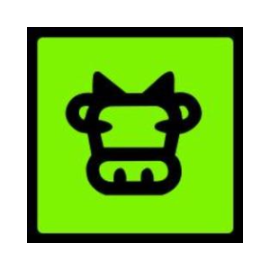 | 47050 | FAR | Farmland Protocol |
|  | 46987 | N3RDZ | N3RD Finance |
|  | 46641 | YFIM | Yfi.mobi |
| 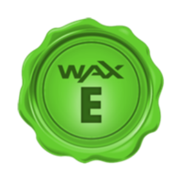 | 47169 | WAXE | WAXE |
| 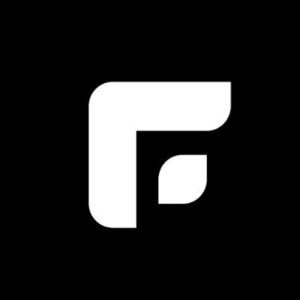 | 48335 | FEY | Feyorra |
|  | 48381 | BAMBOO | BambooDeFi |
|  | 48139 | PANDO | Pando |
|  | 48251 | WSCRT | Secret (ERC20) |
|  | 47949 | XLS | Elis |
|  | 47771 | RICE | RiceSwap |
| 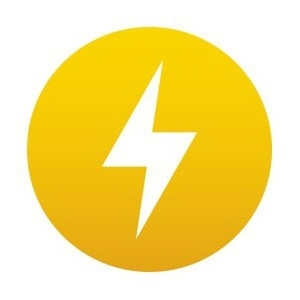 | 47777 | ELCASH | Electric Cash |
| 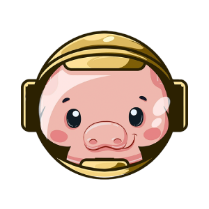 | 47815 | PIG | Pig Finance |
| 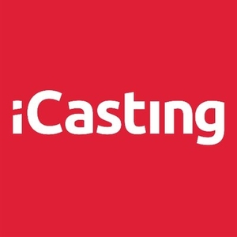 | 47851 | TLNT | Talent Coin |
| 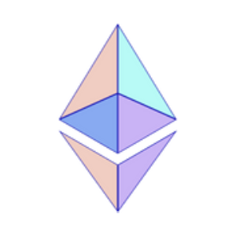 | 47873 | BETH | Binance ETH staking |
| 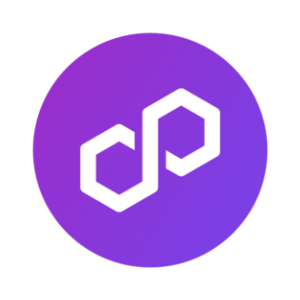 | 44873 | POL | Proof Of Liquidity |
| 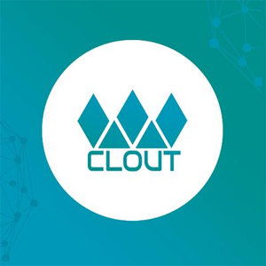 | 44726 | CLOUT | BLOCKCLOUT |
|  | 44936 | TCZ | Tracize |
|  | 44707 | STONK | STONK |
|  | 44694 | CBP | CashBackPro |
| 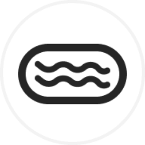 | 45630 | JFI | JackPool.finance |
|  | 45394 | YOK | YOKcoin |
| 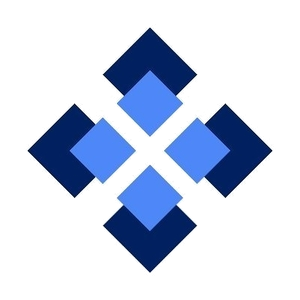 | 46047 | RFUEL | RioDeFi |
|  | 45931 | EMTRG | Meter Governance mapped by Meter.io |
|  | 45040 | BNS | BNS Token |
| 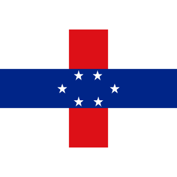 | 45214 | ANG | Aureus Nummus Gold |
|  | 53847 | CYS | Cyclos |
|  | 53957 | TFI | TrustFi Network |
| 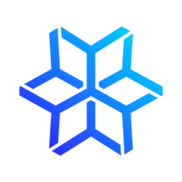 | 53961 | FLURRY | Flurry Finance |
| 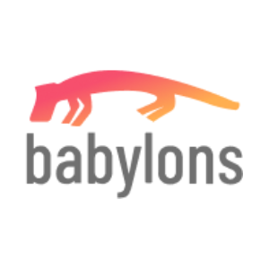 | 54003 | BABI | Babylons |
| 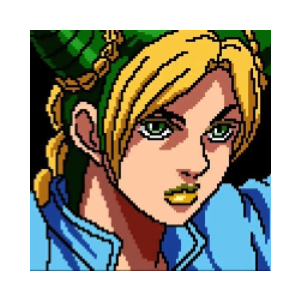 | 54295 | JOJO | JOJO |
| 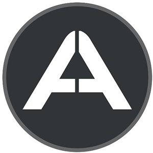 | 54305 | ARENA | Arena Token |
|  | 54073 | USELESS | Useless |
| 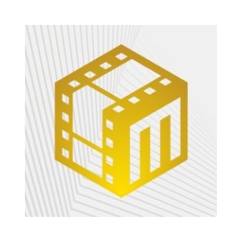 | 54163 | MCONTENT | MContent |
|  | 53523 | XUSD | XUSD Stable |
|  | 54409 | SBR | Saber |
| 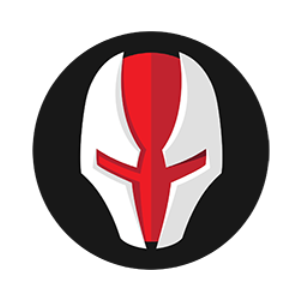 | 51841 | KOJI | Koji |
|  | 51811 | TDOGE | τDoge |
|  | 51813 | PAPADOGE | Papa Doge |
|  | 51851 | GAMESAFE | Gamesafe |
|  | 52041 | MOONLIGHT | Moonlight Token |
|  | 55577 | XLON | Excelon |
|  | 55429 | YOCO | YocoinYOCO |
|  | 55527 | EVDC | Electric Vehicle Direct Currency |
| 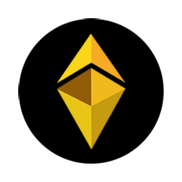 | 55087 | EVERETH | EverETH |
|  | 54627 | VICS | RoboFi |
|  | 54633 | 1DOGE | 1Doge |
|  | 54687 | WANA | Wanaka Farm |
| 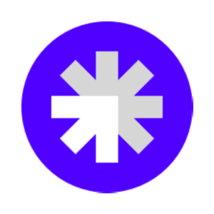 | 54731 | NORA | SnowCrash Token |
| 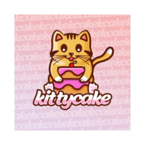 | 54425 | KCAKE | KittyCake |
|  | 54451 | DXCT | DNAxCAT Token |
| 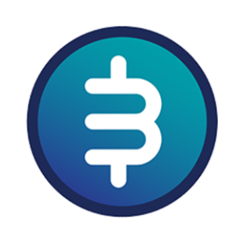 | 54481 | BUMN | BUMooN |
|  | 54491 | POTS | Moonpot |
| 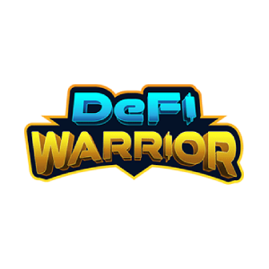 | 54971 | FIWA | DeFi Warrior (FIWA) |
| 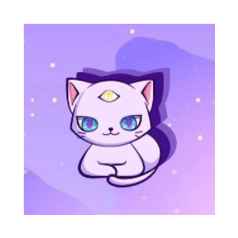 | 55015 | COPYCAT | Copycat Finance |
|  | 55031 | BALA | Shambala |
|  | 51581 | XLD | Stellar Diamond |
|  | 49739 | MOONARCH | Moonarch |
|  | 49773 | JSHIBA | Jomon Shiba |
| 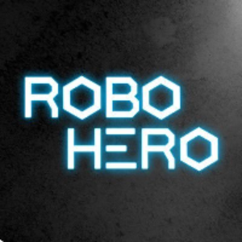 | 49799 | ROBO | Robo Token |
|  | 49819 | UPBNB | upBNB |
| 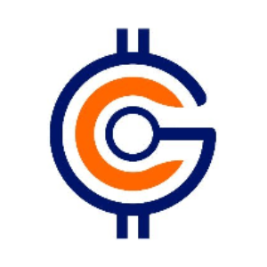 | 49621 | GICT | GICTrade |
|  | 49713 | GATOR | GatorSwap |
|  | 49707 | XBLZD | Blizzard |
|  | 50157 | SAHU | Sakhalin Husky |
|  | 50165 | SANSHU | Sanshu Inu |
| 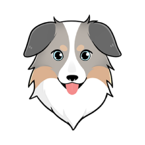 | 50209 | ASS | Australian Safe Shepherd |
|  | 50213 | MEPAD | MemePad |
|  | 50227 | SGB | SubGame |
|  | 49261 | WCX | WeCoOwn |
| 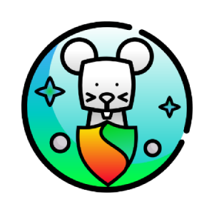 | 49347 | SMRAT | Secured MoonRat Token |
|  | 49355 | GFCE | GFORCE |
| 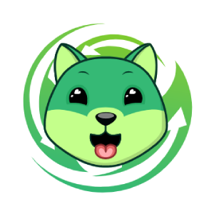 | 49149 | GINU | Green Shiba Inu |
| 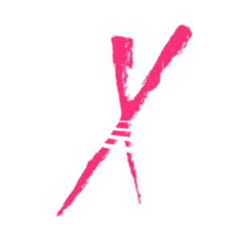 | 49151 | XFIT | Xfit |
|  | 49521 | RENA | Renascent Finance |
| 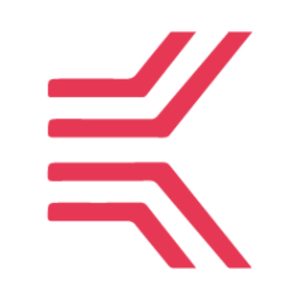 | 49539 | KEL | KelVPN |
| 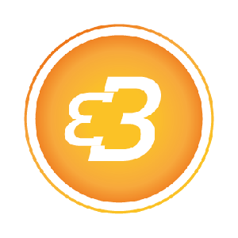 | 49491 | BTCBAM | BitcoinBam |
| 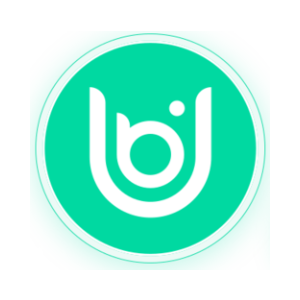 | 49603 | UBI | Universal Basic Income |
|  | 49403 | MELODY | Melody |
|  | 49451 | KFI | Klever Finance |
|  | 49455 | POOCOIN | PooCoin |
|  | 51135 | FRTS | Fruits |
|  | 51065 | OW | OWGaming |
| 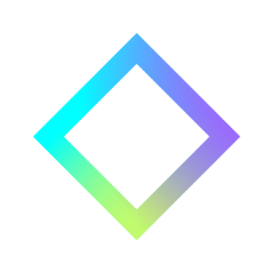 | 50965 | NIIFI | NiiFi |
|  | 50983 | JIGSAW | Jigsaw |
|  | 51013 | BWC | BongWeedCoin |
|  | 51235 | DADDYDOGE | Daddy Doge |
|  | 51279 | SMARS | Safemars Protocol |
|  | 51349 | SFMS | SafeMoon Swap |
|  | 51371 | MOMMYDOGE | Mommy Doge |
|  | 50433 | TCGCOIN | TCGCoin |
|  | 50407 | BONFIRE | Bonfire |
| 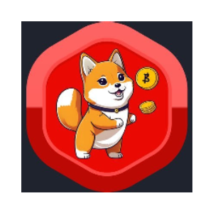 | 50417 | FETCH | MoonRetriever |
| 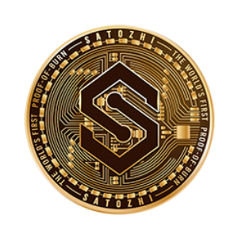 | 50425 | SATOZ | Satozhi |
|  | 50469 | LPL | LinkPool |
|  | 50487 | BASHTANK | Baby Shark Tank |
| 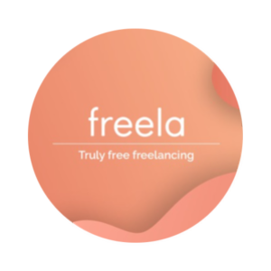 | 50359 | FREL | Freela |
| 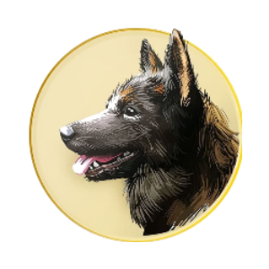 | 50265 | SHIBAKEN | Shibaken Finance |
|  | 50329 | ULTRA | UltraSafe |
|  | 50769 | ELEPHANT | Elephant Money |
|  | 50693 | HUA | Chihuahua |
| 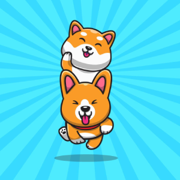 | 50685 | COSHI | CoShi Inu |
|  | 50567 | CHEE | Cheecoin |
| 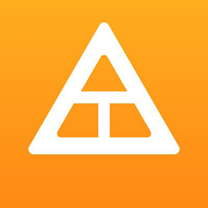 | 32855 | AT | AWARE |
|  | 33365 | FSCC | Fisco |

---

[← Prev](./list2.md) | [Next →](./list4.md)
