# Cryptocurrency list \#4

[← Prev](./list3.md) | [Next →](./list5.md)

| Logo | ID | Symbol | Name |
|:----:|:--:|:------:|:-----|
|  | 3242 | FDUSD | First Digital USD |
|  | 3243 | ELS | Ethlas |
|  | 3244 | GRIMACE | Grimace |
| 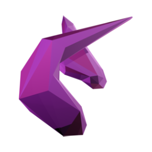 | 3245 | UNIBOT | Unibot |
|  | 3249 | EDU | Open Campus |
|  | 3250 | BBDC | Block Beats Network |
| 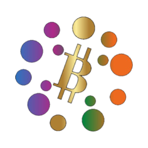 | 3251 | BDCC | BITICA COIN |
|  | 3252 | STONE | Stone Token |
|  | 3253 | OX | Open Exchange Token |
|  | 3254 | CYBER | CyberConnect |
|  | 3255 | TSUGT | Captain Tsubasa |
| 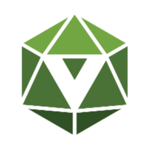 | 3256 | VCNT | ViciCoin |
|  | 3257 | VEXT | Veloce |
| 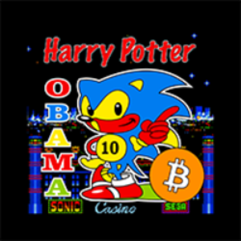 | 3258 | HARRYP | HarryPotterObamaSonic10Inu (ETH) |
| 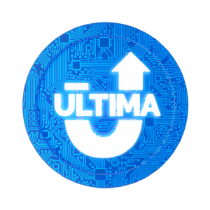 | 3259 | ULTIMA | Ultima |
|  | 3260 | SMARTB | Smart Coin |
|  | 3261 | TOPIA | Hytopia |
|  | 3262 | WSM | Wall Street Memes |
| 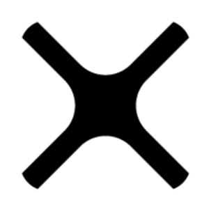 | 3263 | SOLX | SolarX |
| 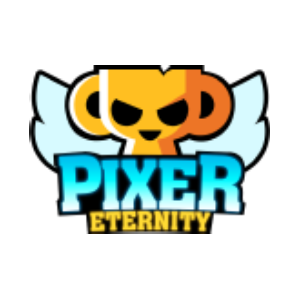 | 3264 | PXT | Pixer Eternity |
| 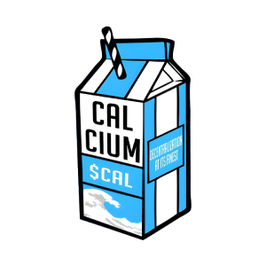 | 3265 | CAL | Calcium |
|  | 3266 | MMVG | MEMEVENGERS |
| 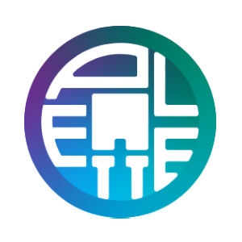 | 3267 | PALET | Palette |
|  | 3268 | BRITTO | Britto |
|  | 3269 | BJK | Beşiktaş |
| 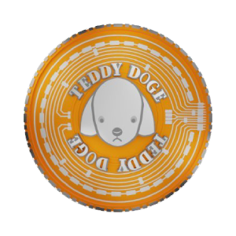 | 3270 | TEDDY | Teddy Doge v2 |
|  | 3271 | TEDDYV1 | Teddy Doge |
|  | 3272 | SUNDAE | Sundae the Dog |
|  | 3273 | LIXX | Libra Incentix |
| 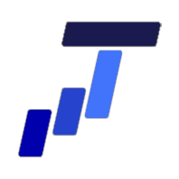 | 3274 | TEE | Guarantee |
|  | 3275 | BIGTIME | Big Time |
| 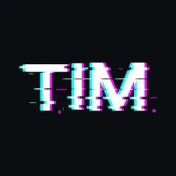 | 3276 | TIM | TIMTIM GAMES |
|  | 3277 | SAIL | SAIL |
| 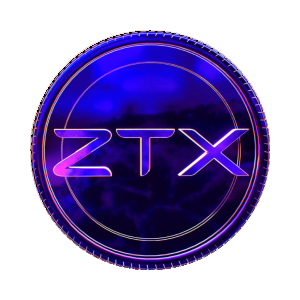 | 3278 | ZTX | ZTX |
|  | 3280 | JOECOIN | Joe Coin |
|  | 3281 | THEBLOX | The Blox Project |
|  | 3282 | STRD | Stride |
| 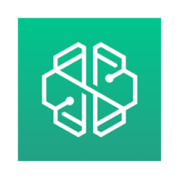 | 3283 | BORG | SwissBorg |
|  | 3284 | RVC | Revenue Coin |
| 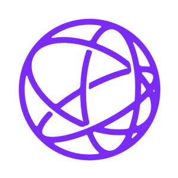 | 3285 | TIA | Celestia |
|  | 3286 | NTRN | Neutron |
|  | 3293 | NEUTRON | Neutron |
|  | 3294 | ZWAP | ZilSwap |
|  | 3297 | ZYR | Zyrri |
|  | 3300 | ZUC | Zeux |
| 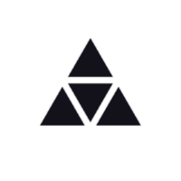 | 3306 | ZUZUAI | ZUZUAI |
|  | 3307 | ZIRVE | Zirve Coin |
|  | 3308 | ZEROEX | 0.exchange |
|  | 3309 | DANK | DarkKush |
|  | 3310 | GIVE | GiveCoin |
|  | 3311 | CETI | CETUS Coin |
|  | 3312 | DARKTOKEN | DarkToken |
|  | 3313 | YBC | YbCoin |
|  | 3314 | PRC | ProsperCoin |
|  | 3315 | NXTI | NXTI |
|  | 3316 | SUP | Supcoin |
|  | 3317 | XDP | DogeParty |
|  | 3319 | ACOIN | ACoin |
|  | 3322 | BET | BetaCoin |
|  | 3323 | BEANC | BeanCash |
|  | 3324 | BOST | BoostCoin |
|  | 3325 | DGC | DigiCoin |
|  | 3326 | LIMX | LimeCoinX |
|  | 3328 | CACH | Cachecoin |
|  | 3329 | KOBO | KoboCoin |
|  | 3330 | SPR | Spreadcoin |
|  | 3331 | CHASH | CleverHash |
|  | 3332 | INSANITY | Insanity Coin |
|  | 3334 | AC | Asia Coin |
|  | 3335 | ALF | AlphaCoin |
|  | 3336 | AMERICANCOIN | AmericanCoin |
|  | 3337 | AEROCOIN | Aero Coin |
|  | 3338 | AEGIS | Aegis |
|  | 3340 | ANNC | AnonCoin |
|  | 3341 | ARI | AriCoin |
|  | 3342 | ARCHCOIN | ArchCoin |
|  | 3343 | AURORAC | Aurora Coin |
|  | 3344 | AXR | AXRON |
| 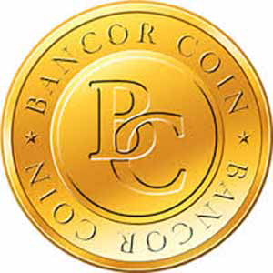 | 3345 | BNCR | BancorCoin |
|  | 3346 | BLU | BlueCoin |
|  | 3347 | XMY | MyriadCoin |
|  | 3348 | BQC | BQCoin |
|  | 3349 | ZET | ZetaCoin |
|  | 3350 | SXC | SexCoin |
|  | 3351 | QTL | Quatloo |
| 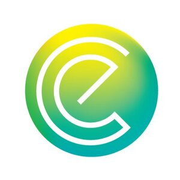 | 3352 | ENRG | EnergyCoin |
| 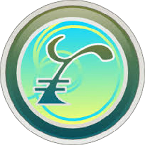 | 3353 | RIC | Riecoin |
| 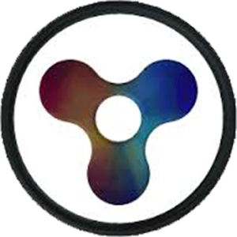 | 3354 | QRK | QuarkCoin |
| 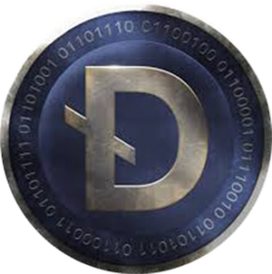 | 3355 | DRK | DarkCoin |
| 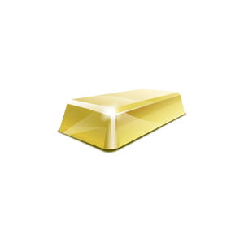 | 3356 | BTB | BitBar |
|  | 3357 | BTCD | BitcoinDark |
| 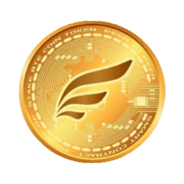 | 3359 | BTECOIN | BTEcoin |
|  | 3360 | BTMK | BitMark |
|  | 3361 | BUK | CryptoBuk |
|  | 3362 | CAIX | CAIx |
|  | 3363 | CASH | CashCoin |
|  | 3364 | CAT1 | Catcoin |
|  | 3365 | CCN | CannaCoin |
|  | 3366 | CIN | CinderCoin |
| 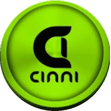 | 3367 | CINNI | CINNICOIN |
|  | 3368 | CXC | CheckCoin |
|  | 3369 | CMC | CosmosCoin |
|  | 3370 | CLAM | CLAMS |
|  | 3371 | CLR | CopperLark |
|  | 3372 | CNL | ConcealCoin |
|  | 3373 | COMM | Community Coin |
|  | 3374 | COOL | CoolCoin |
|  | 3375 | CRACK | CrackCoin |
|  | 3376 | CRYPT | CryptCoin |
|  | 3377 | DEM | eMark |
|  | 3378 | CRAIG | CraigsCoin |
|  | 3379 | DIAM | Diamond |
|  | 3380 | DRKC | DarkCash |
|  | 3381 | DEVCOIN | DevCoin |
|  | 3382 | DSB | DarkShibe |
|  | 3383 | ELC | Elacoin |
|  | 3384 | EFL | E-Gulden |
|  | 3385 | EAC | EarthCoin |
|  | 3386 | EMD | Emerald |
|  | 3387 | EXECOIN | ExeCoin |
|  | 3388 | EZC | EZCoin |
|  | 3389 | FFC | FireflyCoin |
|  | 3390 | FC2 | Fuel2Coin |
|  | 3391 | FLAP | Flappy Coin |
|  | 3392 | FLUTTERCOIN | FlutterCoin |
|  | 3393 | FIBRE | FIBRE |
|  | 3394 | FRAC | FractalCoin |
|  | 3395 | FRC | FireRoosterCoin |
|  | 3396 | FRK | Franko |
|  | 3397 | GB1 | GreenBacks |
|  | 3398 | GDC | GrandCoin |
|  | 3399 | GLC | GoldCoin |
|  | 3400 | GLX | GalaxyCoin |
|  | 3401 | GLYPH | GlyphCoin |
|  | 3402 | GML | GameLeagueCoin |
|  | 3403 | GUE | GuerillaCoin |
|  | 3404 | HAL | Halcyon |
|  | 3405 | HBN | HoboNickels |
|  | 3406 | HYP | Hyperstake |
|  | 3407 | HUC | HunterCoin |
|  | 3408 | HVC | HeavyCoin |
|  | 3409 | IFC | Infinite Coin |
|  | 3410 | ICB | IceBergCoin |
|  | 3411 | IOC | IOCoin |
|  | 3412 | IXC | IXcoin |
|  | 3413 | JBS | JumBucks Coin |
|  | 3414 | JKC | JunkCoin |
|  | 3415 | JUDGE | JudgeCoin |
|  | 3416 | KDC | Klondike Coin |
|  | 3418 | KEYC | KeyCoin |
|  | 3420 | LK7 | Lucky7Coin |
|  | 3421 | LKY | LuckyCoin |
|  | 3422 | LIGHTSPEED | LightSpeedCoin |
|  | 3423 | LTB | Litebar |
|  | 3424 | LXC | LibrexCoin |
|  | 3425 | LTCD | LitecoinDark |
|  | 3426 | MAXCOIN | MaxCoin |
|  | 3427 | LTCX | LitecoinX |
|  | 3428 | MEC | MegaCoin |
|  | 3429 | LYC | LycanCoin |
|  | 3430 | MEDIT | MediterraneanCoin |
|  | 3431 | MINERALS | Minerals Coin |
|  | 3432 | MN | Cryptsy Mining Contract |
|  | 3433 | MINC | MinCoin |
|  | 3434 | MRY | MurrayCoin |
|  | 3436 | MZC | MazaCoin |
|  | 3437 | NAN | NanoToken |
|  | 3438 | NAUT | Nautilus Coin |
|  | 3439 | NYBBLE | Nybble |
|  | 3441 | NET | NetCoin |
|  | 3442 | NRB | NoirBits |
|  | 3443 | NOBL | NobleCoin |
|  | 3444 | NMB | Nimbus Coin |
|  | 3445 | NRS | NoirShares |
|  | 3446 | NVC | NovaCoin |
| 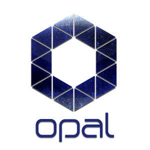 | 3447 | OPAL | OpalCoin |
|  | 3448 | ORBITCOIN | Orbitcoin |
|  | 3449 | OSC | OpenSourceCoin |
|  | 3450 | POINTS | Cryptsy Points |
|  | 3451 | PSEUD | PseudoCash |
|  | 3452 | PHS | PhilosophersStone |
|  | 3454 | PYC | PayCoin |
|  | 3455 | PXC | PhoenixCoin |
|  | 3456 | RPC | RonPaulCoin |
|  | 3457 | RT2 | RotoCoin |
|  | 3458 | RZR | RazorCoin |
|  | 3459 | RIPO | RipOffCoin |
|  | 3460 | RYC | RoyalCoin |
|  | 3461 | SAT2 | Saturn2Coin |
|  | 3462 | SBCCHAIN | StableCoin |
|  | 3463 | SDC | ShadowCash |
|  | 3464 | SFR | SaffronCoin |
|  | 3465 | SHADE | ShadeCoin |
|  | 3466 | SHLD | ShieldCoin |
|  | 3467 | SMC | SmartCoin |
|  | 3468 | SOLE | SoleCoin |
|  | 3469 | SILK | SilkCoin |
|  | 3470 | SPAIN | SpainCoin |
|  | 3471 | SPT | Spots |
|  | 3472 | SRC | SecureCoin |
|  | 3473 | SSVCOIN | SSVCoin |
|  | 3474 | SUPERC | SuperCoin |
|  | 3475 | SWIFT | BitSwift |
|  | 3477 | TES | TeslaCoin |
|  | 3478 | TAK | TakCoin |
|  | 3479 | TGC | TigerCoin |
|  | 3480 | TIT | TittieCoin |
| 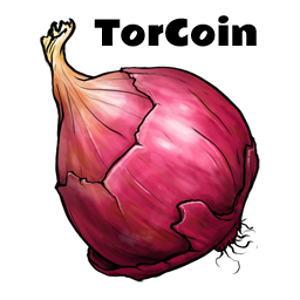 | 3481 | TORCOIN | TorCoin |
|  | 3482 | TRC | TerraCoin |
|  | 3483 | TITC | TitCoin |
|  | 3484 | ULTC | Umbrella |
|  | 3485 | URO | UroCoin |
|  | 3486 | UNOB | Unobtanium |
|  | 3487 | UNITARYSTATUS | UnitaryStatus Dollar |
|  | 3488 | UTC | UltraCoin |
|  | 3489 | UTIL | Utility Coin |
|  | 3490 | VDO | VidioCoin |
|  | 3491 | VOOT | VootCoin |
|  | 3492 | WC | WhiteCoin |
| 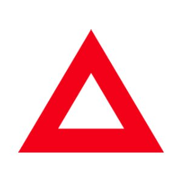 | 3493 | XAI | Xai |
|  | 3494 | WDC | WorldCoin |
|  | 3495 | XBS | Bitstake |
|  | 3496 | XBOT | SocialXbotCoin |
|  | 3497 | XC | X11 Coin |
|  | 3498 | XCR | Crypti |
|  | 3499 | XCSH | Xcash |
|  | 3500 | XJO | JouleCoin |
|  | 3501 | XLB | LibertyCoin |
|  | 3502 | XPY | PayCoin |
|  | 3503 | XPM | PrimeCoin |
|  | 3504 | XXX | XXXCoin |
|  | 3505 | XST | StealthCoin |
|  | 3506 | YAC | YAcCoin |
|  | 3507 | ZCC | ZCC Coin |
|  | 3509 | EKN | Elektron |
|  | 3510 | XAUC | XauCoin |
|  | 3511 | TMC | TimesCoin |
|  | 3512 | START | StartCoin |
|  | 3513 | USNBT | NuBits |
| 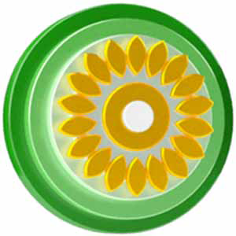 | 3515 | SMBR | Sembro Token |
|  | 3516 | BIGCOIN | BigCoin |
|  | 3517 | SJCX | StorjCoin |
|  | 3518 | 007 | 007 coin |
|  | 3519 | NSR | NuShares |
|  | 3521 | SOLARFARM | SolarFarm |
|  | 3522 | TEK | TekCoin |
|  | 3523 | BAY | BitBay |
|  | 3524 | XVC | Vcash |
|  | 3525 | SLING | Sling Coin |
|  | 3526 | CRAVE | CraveCoin |
|  | 3527 | XSI | Stability Shares |
|  | 3528 | BYC | ByteCent |
|  | 3530 | GRC | GridCoin |
|  | 3531 | GEMZ | Gemz Social |
|  | 3532 | KTK | KryptCoin |
|  | 3533 | HZ | Horizon |
|  | 3534 | FAIR | FairCoin |
|  | 3535 | QORA | QoraCoin |
|  | 3536 | PTC | PesetaCoin |
|  | 3537 | RBY | RubyCoin |
|  | 3538 | XTC | TileCoin |
|  | 3539 | KORE | Kore |
|  | 3540 | SSD | Sonic Screw Driver Coin |
|  | 3541 | WBB | Wild Beast Coin |
|  | 3542 | DNOTES | Dnotes |
|  | 3544 | FLO | Flo |
|  | 3545 | 8BIT | 8BIT Coin |
|  | 3546 | MMXIV | MaieutiCoin |
|  | 3547 | STV | Sativa Coin |
|  | 3548 | EBS | EbolaShare |
|  | 3549 | AM | AeroMe |
|  | 3550 | XMG | Coin Magi |
|  | 3552 | AMBER | AmberCoin |
|  | 3553 | NKT | NakomotoDark |
|  | 3554 | JOINCOIN | JoinCoin |
|  | 3555 | ABY | ArtByte |
|  | 3556 | GHOSTCOIN | GhostCoin |
|  | 3558 | MASTERTRADER | MasterTraderCoin |
| 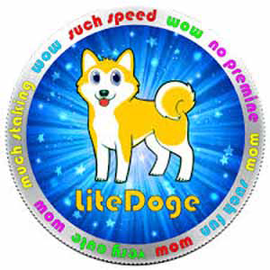 | 3559 | LDOGE | LiteDoge |
|  | 3560 | TRI | Triangles Coin |
|  | 3561 | BBR | Boolberry |
|  | 3562 | SWARM | SwarmCoin |
|  | 3563 | BTCRY | BitCrystal |
|  | 3564 | BCR | BitCredit |
|  | 3565 | XPB | Pebble Coin |
|  | 3566 | FLDC | Folding Coin |
|  | 3567 | XDQ | Dirac Coin |
|  | 3568 | SLR | SolarCoin |
|  | 3569 | TRK | TruckCoin |
|  | 3570 | SMAC | Social Media Coin |
|  | 3571 | UIS | Unitus |
|  | 3572 | CYP | CypherPunkCoin |
|  | 3573 | ASN | Ascension Coin |
|  | 3574 | GSM | GSM Coin |
|  | 3575 | OC | OrangeCoin |
|  | 3576 | NXTTY | NXTTY |
|  | 3577 | FSC | FriendshipCoin |
|  | 3578 | QBK | QuBuck Coin |
|  | 3579 | MARYJ | MaryJane Coin |
|  | 3580 | BLC | BlakeCoin |
| 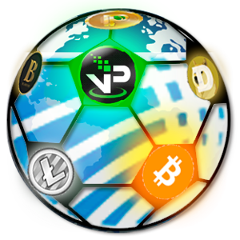 | 3581 | VPN | VPNCoin |
|  | 3582 | BITS | BitstarCoin |
|  | 3583 | LTBC | LTBCoin |
|  | 3584 | GIG | GigaCoin |
|  | 3585 | NEOS | NeosCoin |
|  | 3586 | VTR | Vtorrent |
|  | 3587 | GRE | GreenCoin |
|  | 3588 | BOOMCOIN | BOOM Coin |
|  | 3589 | CHILD | ChildCoin |
|  | 3590 | XG | XG Sports |
|  | 3591 | ROS | ROS Coin |
|  | 3592 | INSTAMINE | Instamine Nuggets |
|  | 3593 | UNAT | Unattanium |
|  | 3594 | SLM | SlimCoin |
|  | 3595 | GAIAPLATFORM | GAIA Platform |
|  | 3596 | TRUST | TrustPlus |
|  | 3597 | FCN | FantomCoin |
|  | 3598 | GMC | Gridmaster |
|  | 3600 | CONS | ConSpiracy Coin |
|  | 3602 | MASTERCOIN | MasterCoin |
|  | 3603 | EGGC | EggCoin |
|  | 3604 | C2 | Coin.2 |
|  | 3605 | RBR | Ribbit Rewards |
|  | 3606 | CAM | Camcoin |
|  | 3607 | GSX | GlowShares |
|  | 3608 | XQN | Quotient |
|  | 3609 | ICASH | ICASH |
|  | 3610 | NODET | Node |
|  | 3611 | BTMI | BitMiles |
|  | 3612 | EVENT | Event Token |
|  | 3613 | 1CR | 1Credit |
|  | 3614 | MRS | Metars Genesis |
|  | 3615 | VIOR | ViorCoin |
|  | 3616 | XCO | XCoin |
|  | 3617 | VMC | VirtualMining Coin |
|  | 3618 | VIRAL | Viral Coin |
|  | 3619 | EQM | Equilibrium Coin |
|  | 3620 | ISL | IslaCoin |
|  | 3621 | QSLV | Quicksilver coin |
| 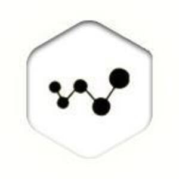 | 3622 | XWT | World Trade Funds |
|  | 3623 | SKB | SkullBuzz |
| 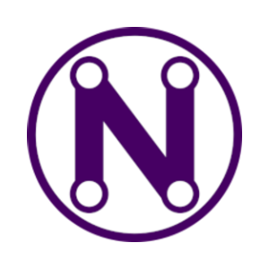 | 3624 | XNA | Neurai |
|  | 3625 | FCS | CryptoFocus |
|  | 3626 | GAM | Gambit coin |
|  | 3627 | CESC | Crypto Escudo |
|  | 3628 | TWLV | Twelve Coin |
|  | 3629 | EAGS | EagsCoin |
|  | 3630 | MULTIWALLET | MultiWallet Coin |
|  | 3631 | ADC | AudioCoin |
|  | 3632 | XMS | Megastake |
|  | 3633 | MARS | MarsCoin |
|  | 3634 | SIGU | Singular |
|  | 3636 | DCC | DarkCrave |
|  | 3637 | M1 | SupplyShock |
|  | 3638 | DB | DarkBit |
|  | 3639 | EDGE | EDGE |
| 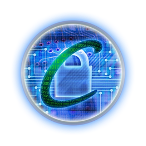 | 3640 | CRYPTOOFFICIAL | Crypto |
|  | 3641 | BITL | BitLux |
|  | 3642 | GLOBE | Global |
|  | 3643 | FUTC | FutCoin |
|  | 3644 | TAM | TamaGucci |
|  | 3645 | CREVA | Creva Coin |
|  | 3646 | MRP | MorpheusCoin |
|  | 3647 | XFRC | Forever Coin |
|  | 3648 | NANAS | BananaBits |
|  | 3649 | LOG | Wood Coin |
|  | 3650 | ACP | Anarchists Prime |
|  | 3652 | XCE | Cerium |
|  | 3653 | BOWSC | BowsCoin |
|  | 3654 | DRKT | DarkTron |
| 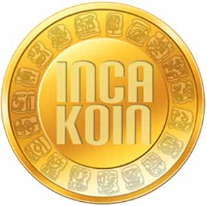 | 3655 | NKA | IncaKoin |
|  | 3656 | VERSA | Versa Token |
|  | 3657 | DRZ | Droidz |
|  | 3658 | EPY | Empyrean |
|  | 3659 | CHA | Charity Coin |
|  | 3660 | PIGGYCOIN | Piggy Coin |
|  | 3661 | SQL | Squall Coin |
|  | 3662 | GENSTAKE | Genstake |
|  | 3663 | XPH | PharmaCoin |
|  | 3664 | GRM | GridMaster |
|  | 3665 | LTS | Litestar Coin |
|  | 3666 | QTZ | Quartz |
|  | 3667 | BITZBIZ | Bitz Coin |
|  | 3668 | GOLDPIECES | GoldPieces |
|  | 3669 | MCN | MonetaVerde |
|  | 3670 | CIRC | CryptoCircuits |
|  | 3671 | MIL | Milllionaire Coin |
|  | 3672 | DUB | DubCoin |
|  | 3673 | QCN | Quazar Coin |
|  | 3674 | SONG | Song Coin |
|  | 3675 | XSEED | BitSeeds |
|  | 3676 | CREDITS | Credits |
|  | 3677 | AXIOM | Axiom Coin |
|  | 3678 | CHIP | Chip |
|  | 3679 | SPEC | SpecCoin |
|  | 3681 | UNC | UnCoin |
|  | 3682 | SPRTS | Sprouts |
|  | 3683 | ZNY | BitZeny |
|  | 3685 | DIGS | Diggits |
|  | 3686 | HNC | Hellenic Coin |
|  | 3687 | SNRG | Synergy |
|  | 3688 | SMLY | SmileyCoin |
|  | 3689 | SPINC | SpinCoin |
|  | 3690 | GCR | Global Currency Reserve |
|  | 3691 | MAPC | MapCoin |
|  | 3692 | CON | Paycon |
| 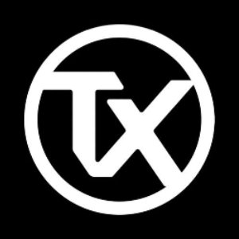 | 3693 | TX | Tradix |
|  | 3694 | BTQ | BitQuark |
|  | 3695 | MI | XiaoMiCoin |
|  | 3696 | RBT | Rimbit |
|  | 3697 | GHOUL | Ghoul Coin |
|  | 3699 | PXI | Prime-X1 |
|  | 3700 | AMS | Amsterdam Coin |
|  | 3701 | CLUB | ClubCoin |
|  | 3702 | BLITZ | BlitzCoin |
|  | 3703 | PKB | ParkByte |
|  | 3704 | LYB | LyraBar |
|  | 3705 | BHIRE | BitHIRE |
|  | 3706 | EVERGREEN | EverGreenCoin |
|  | 3707 | MINDCOIN | MindCoin |
|  | 3708 | I0C | I0coin |
|  | 3709 | OBITS | Obits Coin |
|  | 3710 | CRB | Creditbit |
|  | 3711 | DOGED | DogeCoinDark |
|  | 3712 | VNL | Vanilla Coin |
|  | 3713 | NAS2 | Nas2Coin |
|  | 3716 | BTA | Bata |
| 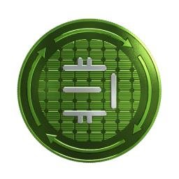 | 3717 | EDRC | EDRCoin |
| 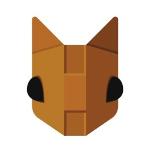 | 3718 | HODLC | HOdlcoin |
|  | 3719 | HTC | Hitcoin |
|  | 3720 | KARMA | Karmacoin |
|  | 3721 | PAK | Pakcoin |
| 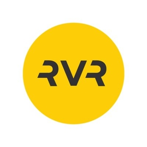 | 3722 | RVR | Revolution VR |
|  | 3723 | GAMECRED | GameCredits |
|  | 3724 | DBIC | DubaiCoin |
|  | 3725 | XHI | HiCoin |
|  | 3727 | BIOS | BiosCrypto |
|  | 3728 | SPOTS | Spots |
|  | 3729 | CAB | CabbageUnit |
|  | 3730 | DSH | Dashcoin |
|  | 3731 | PWRC | PWR Coin |
|  | 3732 | RCX | RedCrowCoin |
|  | 3733 | PRM | PrismChain |
|  | 3734 | TRUMPCOIN | TrumpCoin |
|  | 3735 | CARPE | CarpeDiemCoin |
|  | 3736 | RBIES | Rubies |
|  | 3737 | GBT | GameBetCoin |
| 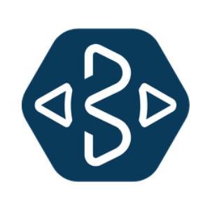 | 3738 | BCY | BitCrystals |
|  | 3739 | BLRY | BillaryCoin |
|  | 3740 | DOTC | Dotcoin |
|  | 3741 | DNET | Darknet |
|  | 3742 | SCOT | Scotcoin |
|  | 3743 | SHF | Shift |
|  | 3745 | CREED | Thecreed |
|  | 3747 | POST | PostCoin |
|  | 3748 | INFX | Influxcoin |
|  | 3749 | ETHS | EthereumScrypt |
|  | 3750 | NUMBERS | NumbersCoin |
|  | 3751 | PHALA | Phalanx |
| 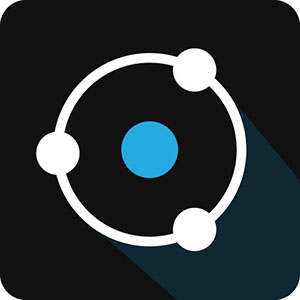 | 3752 | ION | Ionomy |
|  | 3753 | GOST | SoulCoin |
|  | 3754 | OLDSF | OldSafeCoin |
|  | 3755 | GROWNCOIN | GrownCoin |
|  | 3756 | UNITY | SuperNET |
|  | 3757 | SSTC | SunShotCoin |
|  | 3758 | NETC | NetworkCoin |
|  | 3759 | GPUCOIN | GPU Coin |
|  | 3760 | TAGR | Think And Get Rich Coin |
|  | 3761 | HMP | HempCoin |
|  | 3762 | GAP | Gapcoin |
| 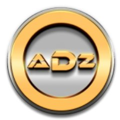 | 3763 | ADZ | Adzcoin |
|  | 3764 | IVZ | InvisibleCoin |
|  | 3765 | MYC | MayaCoin |
|  | 3766 | VTA | VirtaCoin |
|  | 3767 | SOILCOIN | SoilCoin |
|  | 3768 | DIGIC | DigiCube |
|  | 3770 | VPRC | VapersCoin |
|  | 3771 | APC | AlpaCoin |
|  | 3772 | STEPS | Steps |
|  | 3773 | DBTC | DebitCoin |
|  | 3774 | UNIT | Universal Currency |
|  | 3775 | MOIN | MoinCoin |
|  | 3776 | ERC | EuropeCoin |
| 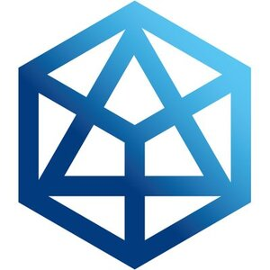 | 3777 | AIB | AdvancedInternetBlock |
|  | 3778 | BERN | BERNcash |
|  | 3779 | BIGUP | BigUp |
|  | 3780 | XRE | RevolverCoin |
|  | 3781 | KR | Krypton |
|  | 3784 | ANTI | Anti Bitcoin |
|  | 3785 | BRK | BreakoutCoin |
|  | 3786 | MNM | Mineum |
|  | 3787 | ZEIT | ZeitCoin |
|  | 3789 | ADCN | Asiadigicoin |
|  | 3790 | 2GIVE | 2GiveCoin |
|  | 3791 | CGA | Cryptographic Anomaly |
|  | 3792 | NEBU | Nebuchadnezzar |
|  | 3793 | SWING | SwingCoin |
|  | 3794 | AEC | AcesCoin |
|  | 3795 | ADNT | Aiden |
|  | 3796 | FRN | Francs |
| 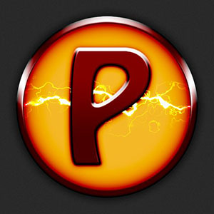 | 3797 | PULSE | Pulse |
|  | 3798 | N7 | Number7 |
|  | 3799 | CYG | Cygnus |
|  | 3800 | LGBTQ | LGBTQoin |
|  | 3801 | UTH | Uther |
|  | 3802 | SPM | Supreme |
|  | 3804 | MOJO | Mojocoin |
| 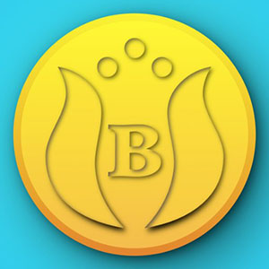 | 3805 | BELA | BelaCoin |
|  | 3806 | CLUD | CludCoin |
|  | 3807 | FLYCOIN | FlyCoin |
|  | 3808 | HVCO | High Voltage Coin |
|  | 3809 | GREXIT | GrexitCoin |
|  | 3810 | GIZ | GIZMOcoin |
|  | 3811 | DEUR | DigiEuro |
|  | 3812 | TUR | Turron |
|  | 3813 | LEMON | LemonCoin |
|  | 3814 | STS | STRESScoin |
|  | 3815 | DISK | Dark Lisk |
|  | 3816 | NEVA | NevaCoin |
|  | 3817 | CYT | Cryptokenz |
|  | 3818 | FUZZ | Fuzzballs |
|  | 3819 | NKC | Nukecoinz |
|  | 3820 | SECRT | SecretCoin |
| 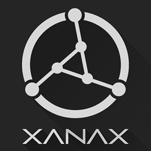 | 3821 | XNX | XanaxCoin |
|  | 3823 | STHR | Stakerush |
|  | 3824 | DBG | Digital Bullion Gold |
|  | 3825 | BONESCOIN | BonesCoin |
|  | 3826 | WMCOIN | WMCoin |
|  | 3828 | GOTX | GothicCoin |
|  | 3829 | FLVR | FlavorCoin |
|  | 3831 | PBC | PabyosiCoin |
|  | 3832 | OBSCURE | Obscurebay |
|  | 3833 | EXIT | ExitCoin |
|  | 3834 | EDC | EducoinV |
|  | 3835 | CKC | Clockcoin |
|  | 3836 | VIP | VIP Tokens |
|  | 3837 | CLINT | Clinton |
|  | 3838 | ZOOM | ZoomCoin |
|  | 3839 | NXE | NXEcoin |
|  | 3840 | DRACO | DT Token |
|  | 3841 | ORLY | OrlyCoin |
|  | 3842 | KUBOS | KubosCoin |
|  | 3843 | INCP | InceptionCoin |
|  | 3844 | SAK | SharkCoin |
|  | 3845 | EVIL | EvilCoin |
|  | 3846 | OMA | OmegaCoin |
|  | 3847 | COX | CobraCoin |
|  | 3849 | DESTINY | Destiny |
|  | 3850 | BIT16 | 16BitCoin |
|  | 3851 | CMTC | CometCoin |
|  | 3852 | PDC | Project Decorum |
|  | 3853 | BON | BonPekeao |
|  | 3854 | SPACECOIN | SpaceCoin |
|  | 3855 | CHESSCOIN | ChessCoin |
|  | 3856 | LQD | Liquid |
|  | 3857 | REE | ReeCoin |
|  | 3858 | MARV | Marvelous |
|  | 3859 | XDE2 | XDE II |
|  | 3860 | VEC2 | VectorCoin 2.0 |
|  | 3861 | LIR | Let it Ride |
|  | 3862 | GSY | GenesysCoin |
|  | 3863 | TRTK | TrollTokens |
|  | 3864 | MMNXT | MMNXT |
|  | 3865 | SCRPT | ScryptCoin |
|  | 3866 | SPCIE | Specie |
|  | 3867 | STEEMSBD | Steem Dollars |
|  | 3868 | PUT | PUTinCoin |
|  | 3869 | DLISK | Dlisk |
|  | 3870 | CJ | CryptoJacks |
|  | 3871 | IBANK | iBankCoin |
|  | 3872 | KRAK | Kraken |
|  | 3873 | VOYA | Voyacoin |
|  | 3874 | ENTER | EnterCoin |
|  | 3875 | WRLGC | World Gold Coin |
|  | 3876 | BM | BitMoon |
|  | 3877 | FRWC | Frankywillcoin |
|  | 3878 | PSILOC | Psilocybin |
|  | 3880 | RUST | RustCoin |
|  | 3881 | NZC | NewZealandCoin |
|  | 3882 | SNGLS | SingularDTV |
|  | 3883 | BFX | BitFinex Tokens |
|  | 3884 | UNIQ | Uniqredit |
|  | 3885 | XPOKE | PokeChain |
|  | 3886 | CRX | ChronosCoin |
|  | 3887 | MUDRA | MudraCoin |
|  | 3888 | CNMT | Coinomat |
|  | 3889 | DCT | Decent |
|  | 3890 | PIZZACOIN | PizzaCoin |
|  | 3891 | LUTETIUM | Lutetium Coin |
|  | 3892 | HEAT | Heat Ledger |
|  | 3893 | EXB | ExaByte (EXB) |
|  | 3895 | ICN | Iconomi |
|  | 3896 | RBIT | ReturnBit |
|  | 3897 | WINGS | Wings DAO |
|  | 3898 | DCS. | deCLOUDs |
|  | 3899 | GB | GoldBlocks |
|  | 3900 | SYNX | Syndicate |
| 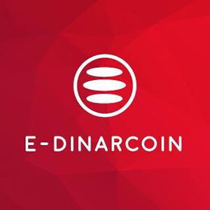 | 3901 | EDR | E-Dinar Coin |
|  | 3902 | MASSCOIN | Mass Coin |
|  | 3903 | WAY | WayCoin |
|  | 3904 | JWL | Jewels |
|  | 3905 | TAB | MollyCoin |
|  | 3906 | TRIG | Trigger |
|  | 3907 | BITUSD | bitUSD |
|  | 3908 | ATMC | Autumncoin |
|  | 3909 | STO | Save The Ocean |
|  | 3911 | SNS1 | Sense |
|  | 3912 | BTD | Bitcloud |
|  | 3913 | TOT | TotCoin |
|  | 3914 | CARTERCOIN | CarterCoin |
|  | 3916 | FTP | FuturePoints |
|  | 3917 | MDC | MedicCoin |
|  | 3918 | CVNC | CovenCoin |
|  | 3919 | KRB | Karbo |
|  | 3920 | TELL | Tellurion |
|  | 3921 | BLOCKPAY | BlockPay |
|  | 3922 | ENE | EneCoin |
|  | 3923 | BXT | BitTokens |
|  | 3924 | MST | MustangCoin |
|  | 3925 | GOON | Goonies |
|  | 3926 | ZYD | ZayedCoin |
| 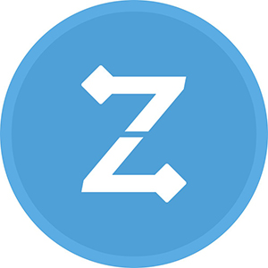 | 3928 | ZNE | ZoneCoin |
|  | 3929 | VLT | Veltor |
|  | 3930 | DICKCOIN | DickCoin |
|  | 3931 | DGDC | DarkGold |
|  | 3932 | TODAY | TodayCoin |
|  | 3933 | 1ST | FirstBlood |
|  | 3934 | ROOTCOIN | RootCoin |
|  | 3935 | GPL | Gold Pressed Latinum |
|  | 3936 | DOPECOIN | DopeCoin |
| 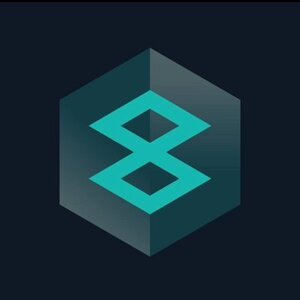 | 3937 | B3COIN | B3 Coin |
|  | 3938 | PIO | Pioneershares |
| 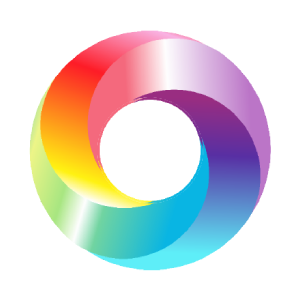 | 3939 | PROUD | PROUD Money |
|  | 3940 | SMSR | Samsara Coin |
|  | 3941 | RING1 | RingCoin |
|  | 3942 | UBIQ | Ubiqoin |
|  | 3945 | ARM | Armory Coin |
|  | 3946 | ERB | ERBCoin |
|  | 3947 | FONZ | FonzieCoin |
|  | 3948 | LAZ | Lazarus |
|  | 3949 | BTCR | BitCurrency |
|  | 3950 | FCTC | FaucetCoin |
|  | 3951 | SANDG | Save and Gain |
|  | 3952 | STEAMPUNK | SteamPunk |
|  | 3953 | MOOND | Dark Moon |
|  | 3954 | SEN | Sentaro |
|  | 3955 | SLK | Silk |
|  | 3956 | SCN | Swiscoin |
| 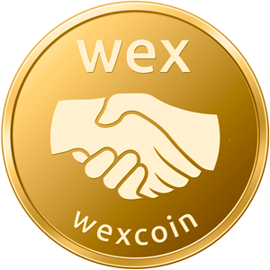 | 3957 | WEXCOIN | Wexcoin |
|  | 3958 | LTH | Lathaan |
|  | 3959 | BRONZ | BitBronze |
|  | 3960 | SH | Shilling |
|  | 3961 | BUZZ | BuzzCoin |
|  | 3962 | MG | Mind Gene |
|  | 3963 | CBIT | CryptBit |
|  | 3964 | PSI | PSIcoin |
|  | 3965 | XPO | Opair |
|  | 3966 | NLC | NoLimitCoin |
|  | 3967 | FIT | Fitcoin |
|  | 3968 | XBTS | Beats |
|  | 3969 | PESOBIT | PesoBit |
|  | 3970 | INCH | Inchain |
|  | 3971 | PINKX | PantherCoin |
|  | 3972 | FIRECOIN | FireCoin |
|  | 3973 | UNF | Unfed Coin |
|  | 3974 | SPORT | SportsCoin |
|  | 3975 | UCOIN | U |
|  | 3976 | NTC | NineElevenTruthCoin |
|  | 3977 | EGOCOIN | EGOcoin |
|  | 3979 | RCOINEU | RCoin |
|  | 3980 | X2 | X2Coin |
|  | 3981 | MYCELIUM | Mycelium Token |
|  | 3982 | GBRC | GBR Coin |
|  | 3983 | UPCOIN | UPcoin |
|  | 3984 | BBCC | BaseballCardCoin |
|  | 3985 | HALLO | Halloween Coin |
|  | 3986 | OCTOCOIN | Octocoin |
|  | 3987 | EMIGR | EmiratesGoldCoin |
|  | 3988 | BIGHAN | BighanCoin |
|  | 3989 | CRAFTCOIN | Craftcoin |
|  | 3990 | OLYMP | OlympCoin |
|  | 3991 | DELIGHTPAY | DelightPay |
|  | 3993 | HKG | Hacker Gold |
|  | 3994 | ANTC | AntiLitecoin |
|  | 3995 | JOBS | JobsCoin |
|  | 3996 | DGORE | DogeGoreCoin |
|  | 3997 | TETRA | Tetra |
|  | 3998 | FJC | FujiCoin |
|  | 3999 | RMS | Resumeo Shares |
|  | 4000 | VAPOR | Vaporcoin |
|  | 4001 | SDP | SydPakCoin |
|  | 4003 | LEA | LeaCoin |
|  | 4004 | CALC | CaliphCoin |
|  | 4005 | PREM | Premium |
|  | 4006 | CF | Californium |
|  | 4007 | CRNK | CrankCoin |
|  | 4008 | VTY | Victoriouscoin |
|  | 4010 | SFE | Safecoin |
|  | 4011 | BS | BlackShadowCoin |
|  | 4012 | CRAB | CrabCoin |
|  | 4014 | JIF | JiffyCoin |
|  | 4015 | HILL | President Clinton |
|  | 4016 | FOREX | ForexCoin |
|  | 4017 | MONETA | Moneta |
|  | 4018 | ECLIP | Eclipse |
|  | 4019 | HCC | HappyCreatorCoin |
|  | 4020 | RUBIT | Rublebit |
|  | 4021 | VERTEX | Vertex |
|  | 4022 | BRAIN | BrainCoin |
|  | 4023 | KRC | KRCoin |
|  | 4024 | ROYAL | RoyalCoin |
|  | 4025 | ZUR | Zurcoin |
|  | 4026 | LFC | BigLifeCoin |
|  | 4027 | NUBIS | NubisCoin |
|  | 4028 | TENNET | Tennet |
|  | 4029 | PEC | PeaceCoin |
|  | 4030 | 32BIT | 32Bitcoin |
|  | 4031 | TEAM | TeamUP |
|  | 4032 | GNJ | GanjaCoin V2 |
|  | 4033 | SCRYPTTOKEN | ScryptToken |
|  | 4034 | LANA | LanaCoin |
|  | 4035 | ELE | Elementrem |
|  | 4036 | AND | AndromedaCoin |
|  | 4037 | EQUALCOIN | EqualCoin |
|  | 4038 | SWEET | SweetStake |
|  | 4039 | 2BACCO | 2BACCO Coin |
|  | 4040 | DKC | DarkKnightCoin |
|  | 4041 | CHOOF | ChoofCoin |
|  | 4042 | ZCL | ZClassic |
|  | 4043 | CSH | CashOut |
|  | 4044 | RYCN | RoyalCoin 2.0 |
|  | 4045 | PCS | Pabyosi Coin |
|  | 4046 | NBIT | NetBit |
|  | 4047 | WINE | WineCoin |
|  | 4048 | DARCRUS | Darcrus |
|  | 4049 | IFLT | InflationCoin |
|  | 4050 | ZECD | ZCashDarkCoin |
|  | 4051 | ZXT | Zcrypt |
|  | 4052 | TESLA | TeslaCoilCoin |
|  | 4053 | LUCKY | LuckyBlocks |
|  | 4054 | VSL | vSlice |
|  | 4055 | TPG | Troll Payment |
|  | 4056 | LEOC | LEOcoin |
|  | 4057 | CBD | CBD Crystals |
|  | 4058 | POSEX | PosEx |
|  | 4059 | MIDN | Midnight |
|  | 4060 | INSANE | InsaneCoin |
|  | 4061 | ARCADECITY | Arcade City |
|  | 4063 | BASH | LuckChain |
|  | 4064 | FAMEC | FameCoin |
|  | 4065 | LIV | LiviaCoin |
|  | 4066 | MEGA | MegaFlash |
|  | 4067 | SP | Sex Pistols |
|  | 4068 | ALC | Arab League Coin |
|  | 4069 | DOGETH | EtherDoge |
|  | 4070 | HUSH | Hush |
|  | 4071 | BTLC | BitLuckCoin |
|  | 4072 | DRM8 | Dream8Coin |
|  | 4073 | EBZ | Ebitz |
|  | 4075 | DRS | Digital Rupees |
|  | 4076 | FGZ | Free Game Zone |
|  | 4077 | BOSONC | BosonCoin |
|  | 4078 | ATX | ArtexCoin |
|  | 4079 | PNC | PlatiniumCoin |
|  | 4080 | BRDD | BeardDollars |
|  | 4081 | BIPC | BipCoin |
|  | 4082 | EMBER | EmberCoin |
|  | 4083 | BTTF | Coin to the Future |
|  | 4084 | DLR | DollarOnline |
|  | 4085 | CSMIC | Cosmic |
|  | 4086 | FIRST | FirstCoin |
|  | 4087 | SCASH | SpaceCash |
|  | 4088 | JIO | JIO Token |
|  | 4089 | IW | iWallet |
|  | 4090 | JNS | Janus |
|  | 4091 | TRICK | TrickyCoin |
|  | 4092 | DCRE | DeltaCredits |
|  | 4093 | FRE | FreeCoin |
|  | 4094 | PLNC | PLNCoin |
|  | 4095 | NPCC | NPCcoin |
|  | 4096 | DGMS | Digigems |
|  | 4097 | ICOB | Icobid |
|  | 4098 | ARCO | AquariusCoin |
|  | 4099 | KURT | Kurrent |
|  | 4100 | ENT | Eternity |
|  | 4101 | XCRE | Creatio |
|  | 4102 | SSC | SecretsCoin |
|  | 4103 | UR | UR |
|  | 4104 | MTLM3 | Metal Music v3 |
|  | 4105 | ODNT | Old Dogs New Tricks |
|  | 4106 | EUC | Eurocoin |
|  | 4107 | CCXC | CoolDarkCoin |
|  | 4108 | BCF | BitcoinFast |
|  | 4109 | SEEDS | SeedShares |
|  | 4110 | TKS | Tokes |
|  | 4111 | XSN | StakeNet |
|  | 4112 | BITCONNECT | BitConnect Coin |
|  | 4113 | SHORTY | ShortyCoin |
|  | 4114 | PCM | Procom |
|  | 4115 | CORAL | CoralPay |
|  | 4116 | KC | Kernalcoin |
|  | 4117 | BAMITCOIN | Bamit |
|  | 4118 | MONEY | MoneyCoin |
|  | 4119 | BSTAR | Blackstar |
|  | 4120 | HSP | Horse Power |
|  | 4121 | HZT | HazMatCoin |
|  | 4122 | NXC | Nexium |
|  | 4123 | CRSP | CryptoSpots |
|  | 4124 | XSPT | PoolStamp |
|  | 4125 | CCRB | CryptoCarbon |
|  | 4126 | INCNT | Incent |
|  | 4127 | ICON | Iconic |
|  | 4128 | ACN | AvonCoin |
|  | 4129 | NIC | NewInvestCoin |
|  | 4130 | XNG | Enigma |
|  | 4131 | XCI | Cannabis Industry Coin |
|  | 4132 | LOOK | LookCoin |
|  | 4133 | BITON | Biton Coin |
|  | 4134 | MMXVI | MMXVI |
|  | 4135 | LOCO | Loco |
|  | 4136 | TRST | TrustCoin |
|  | 4137 | WOP | WorldPay |
|  | 4138 | CQST | ConquestCoin |
|  | 4139 | IMPS | Impulse Coin |
|  | 4140 | IN | InCoin |
|  | 4141 | CHIEF | TheChiefCoin |
|  | 4142 | GOATCOIN | Goat |
|  | 4143 | RC | Russiacoin |
|  | 4144 | ANAL | AnalCoin |
|  | 4145 | PND | PandaCoin |
|  | 4146 | PX | PXcoin |
|  | 4147 | ECAD | Canada eCoin |
|  | 4148 | OPTION | OptionCoin |
|  | 4149 | AV | Avatar Coin |
|  | 4150 | UNITS | GameUnits |
|  | 4151 | LIMITEDCOIN | Limited Coin |
|  | 4152 | HEEL | HeelCoin |
|  | 4153 | GAKH | GAKHcoin |
|  | 4154 | SHIFT | Shift |
|  | 4155 | GAIN | Gainfy |
|  | 4156 | S8C | S88 Coin |
|  | 4157 | DRA | DraculaCoin |
|  | 4158 | ASAFE2 | Allsafe |
|  | 4159 | LTCR | LiteCreed |
|  | 4160 | QBC | Quebecoin |
|  | 4161 | ASTRAL | Astral |
|  | 4162 | XPRO | ProCoin |
|  | 4163 | GIFT | GiftNet |
|  | 4164 | VIDZ | PureVidz |
|  | 4165 | INC | Incrementum |
|  | 4166 | PTA | PentaCoin |
|  | 4167 | ZLQ | ZLiteQubit |
|  | 4168 | ACID | AcidCoin |
|  | 4169 | RNC | ReturnCoin |
|  | 4170 | RADI | RadicalCoin |
|  | 4171 | GOLOS | Golos |
|  | 4172 | PASC | Pascal Coin |
|  | 4173 | TWIST | TwisterCoin |
|  | 4174 | DETH | DarkEther |
|  | 4175 | YESCOIN | YesCoin |
|  | 4176 | UXC | Unixcoin |
|  | 4184 | YAYCOIN | YAYcoin |
|  | 4185 | LENIN | LeninCoin |
|  | 4186 | MRSA | MrsaCoin |
|  | 4187 | OS76 | OsmiumCoin |
|  | 4188 | BOSS | BitBoss |
|  | 4189 | CRPS | CryptoPennies |
|  | 4190 | BIC | Bikercoins |
|  | 4191 | MOTO | Motocoin |
|  | 4193 | NTCC | NeptuneClassic |
|  | 4194 | HXX | HexxCoin |
|  | 4195 | SPKTR | Ghost Coin |
|  | 4196 | SEL | SelenCoin |
|  | 4197 | MAC | MachineCoin |
|  | 4198 | XGB | GoldenBird |
|  | 4199 | NOO | Noocoin |
|  | 4200 | CHAO | 23 Skidoo |
|  | 4201 | YMC | YamahaCoin |
|  | 4202 | JOKERCOIN | JokerCoin |
|  | 4203 | GBIT | GravityBit |
|  | 4204 | TEC | TeCoin |
|  | 4205 | CNO | Coino |
|  | 4206 | WEALTH | WealthCoin |
|  | 4207 | KED | Klingon Empire Darsek |
|  | 4208 | IOP | Internet of People |
|  | 4209 | XSPEC | Spectre |
|  | 4210 | PEPECASH | Pepe Cash |
|  | 4211 | KUSH | KushCoin |
|  | 4212 | CLICK | Clickcoin |
|  | 4213 | ERY | Eryllium |
|  | 4214 | PRES | President Trump |
|  | 4215 | BTZ | BitzCoin |
|  | 4216 | OPES | Opes |
|  | 4217 | WAVESCOMM | Waves Community Token |
|  | 4218 | RATIO | Ratio |
|  | 4219 | NICEC | NiceCoin |
|  | 4220 | SMF | SmurfCoin |
|  | 4221 | TECH | TechCoin |
|  | 4222 | CWXT | CryptoWorldXToken |
|  | 4223 | CIR | CircuitCoin |
|  | 4224 | LEPEN | LePenCoin |
|  | 4225 | ROUND | RoundCoin |
|  | 4226 | MARI | MarijuanaCoin |
|  | 4227 | MARX | MarxCoin |
|  | 4228 | TAT | Tatiana Coin |
|  | 4229 | HAZE | HazeCoin |
|  | 4230 | NRC | Neurocoin |
|  | 4231 | IMPCH | Impeach |
|  | 4232 | TIC | TrueInvestmentCoin |
|  | 4233 | NUKE | NukeCoin |
|  | 4234 | EOC | EveryonesCoin |
|  | 4235 | SFC | Solarflarecoin |
|  | 4236 | PARANOIA | ParanoiaCoin |
|  | 4237 | JANE | JaneCoin |
|  | 4238 | MASTERMINT | MasterMint |
|  | 4239 | CTL | Citadel |
|  | 4240 | NDOGE | NinjaDoge |
|  | 4241 | ZILBERCOIN | Zilbercoin |
|  | 4242 | FRST | FirstCoin |
|  | 4243 | ALEXANDRITE | Alexandrite |
|  | 4244 | OROCOIN | OroCoin |
|  | 4245 | TBCX | TrashBurn |
|  | 4246 | MCAR | MasterCar |
|  | 4247 | THS | TechShares |
|  | 4248 | ACES | AcesCoin |
|  | 4249 | UAEC | United Arab Emirates Coin |
|  | 4250 | EA | EagleCoin |
|  | 4251 | PIE | Persistent Information Exchange |
|  | 4253 | WISC | WisdomCoin |
|  | 4254 | BVC | BeaverCoin |
|  | 4255 | CREA | CreativeChain |
|  | 4256 | FIND | FindCoin |
|  | 4257 | STALIN | StalinCoin |
|  | 4258 | MLITE | MeLite |
|  | 4259 | TSE | TattooCoin |
|  | 4260 | VAULTCOIN | VaultCoin |
|  | 4261 | BIOB | BioBar |
|  | 4262 | SWT | Swarm City Token |
|  | 4263 | BCU | Bitcoin Unlimited |
|  | 4264 | PASL | Pascal Lite |
|  | 4265 | BCC | Bitcoin Core |
|  | 4266 | ZER | Zero |
|  | 4267 | CDN | Canada eCoin |
|  | 4268 | TPAY (1) | TrollPlay |
|  | 4269 | NETKO | Netko |
|  | 4270 | ZOI | Zoin |
|  | 4271 | HONEYCOIN | Honey |
|  | 4272 | MUSICOIN | Musicoin |
|  | 4273 | VEG | BitVegan |
|  | 4274 | DTB | Databits |
|  | 4275 | MBIT | Mbitbooks |
|  | 4276 | MGO | MobileGo |
|  | 4277 | BESTC | BestChain |
|  | 4278 | B@ | BankCoin |
|  | 4279 | CHC | ChainCoin |
|  | 4280 | ZENI | Zennies |
|  | 4281 | PLANETCOIN | PlanetCoin |
|  | 4282 | DUCKD | DuckDuckCoin |
|  | 4283 | BNRTX | BnrtxCoin |
|  | 4284 | BSTK | BattleStake |
|  | 4285 | RNS | RenosCoin |
|  | 4286 | DBIX | DubaiCoin |
|  | 4287 | KAYI | Kayı |
|  | 4288 | AMIS | AMIS |
|  | 4289 | XVP | VirtacoinPlus |
|  | 4290 | BOAT | Doubloon |
|  | 4291 | TAJ | TajCoin |
|  | 4292 | IMPACT | Impact |
|  | 4293 | CJC | CryptoJournal |
|  | 4294 | AMY | Amygws |
|  | 4295 | QUBITICA | Cubits |
|  | 4297 | XVE | The Vegan Initiative |
|  | 4298 | EB3 | EB3coin |
|  | 4299 | FAZZ | FazzCoin |
|  | 4300 | APTCOIN | Aptcoin |
|  | 4301 | BLAZR | BlazerCoin |
|  | 4302 | ARPAC | ArpaCoin |
|  | 4304 | ECO | ECOcoin |
|  | 4305 | UNIVRS | Universe |
|  | 4306 | XLR | Solaris |
|  | 4307 | DARKCOIN | Dark |
|  | 4308 | DON | DonationCoin |
|  | 4309 | MER | Mercury |
|  | 4310 | WGO | WavesGO |
|  | 4311 | ATMOS | Novusphere |
|  | 4312 | INPAY | InPay |
|  | 4314 | ETT | EncryptoTel |
|  | 4315 | VISIO | Visio |
|  | 4316 | HPC | HappyCoin |
|  | 4317 | COINONAT | Coinonat |
|  | 4318 | EMPC | EmporiumCoin |
|  | 4319 | LGD | Legends Cryptocurrency |
|  | 4320 | BUCKS | SwagBucks |
|  | 4321 | XBY | XTRABYTES |
|  | 4322 | MCRN | MacronCoin |
|  | 4323 | LUN | Lunyr |
|  | 4324 | CONDENSATE | Condensate |
|  | 4325 | IEC | IvugeoEvolutionCoin |
|  | 4326 | WSX | WeAreSatoshi |
|  | 4327 | IMS | Independent Money System |

---

[← Prev](./list3.md) | [Next →](./list5.md)
