# Cryptocurrency list \#4

[← Prev](./list3.md) | [Next →](./list5.md)

| Logo | ID | Symbol | Name |
|:----:|:--:|:------:|:-----|
|  | 33103 | UCN | UChain |
|  | 33125 | BIFI | Bitcoin File |
|  | 2753 | CNX | Cryptonex |
| 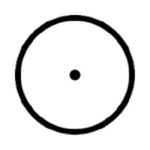 | 2828 | CND | Cindicator |
| 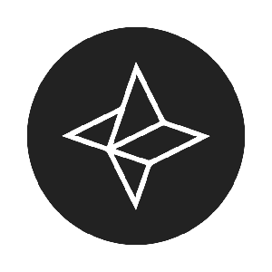 | 2885 | NAS | Nebulas Token |
|  | 194 | PTOY | Patientory |
| 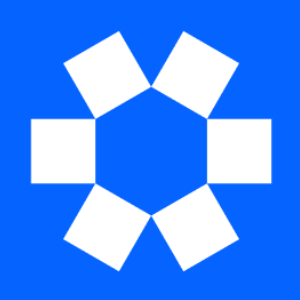 | 86 | OMNI | OMNI |
| 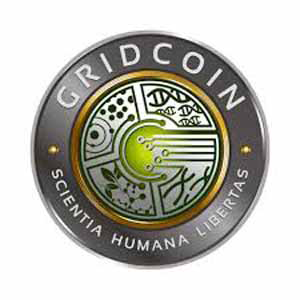 | 66 | GRC | GridCoin |
| 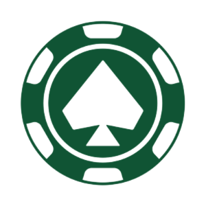 | 1686 | CSC | CasinoCoin |
|  | 1317 | MARS | Marscoin |
| 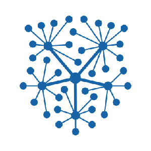 | 548 | ZSC | Zeusshield |
| 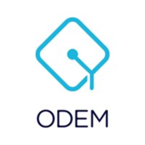 | 32412 | ODE | ODEM |
| 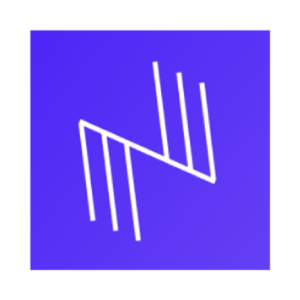 | 10916 | NBOT | Bodhi |
|  | 41692 | SUN | Sunny Coin |
|  | 41837 | DOGZ | Dogz |
| 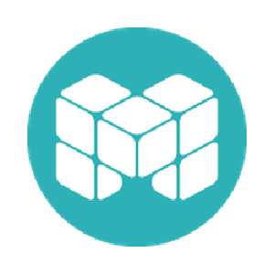 | 41794 | MCH | Meconcash |
|  | 42025 | SHR | ShareToken |
| 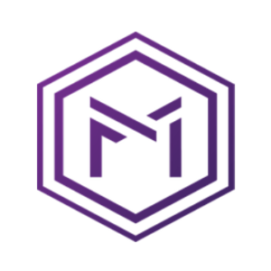 | 42046 | MODEX | Modex |
|  | 42072 | U | Ucoin |
|  | 36575 | GT | Gatechain Token |
|  | 36589 | YO | Yobit Token |
|  | 41477 | HTL | Hotelium |
|  | 41357 | SHUF | Shuffle Monster |
|  | 43069 | P2PS | P2P solutions foundation |
|  | 43137 | MLK | MiL.k |
| 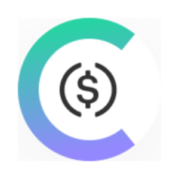 | 44036 | CUSDC | Compound USD Coin |
| 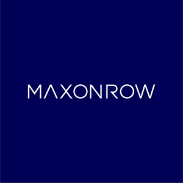 | 42428 | MXW | Maxonrow |
| 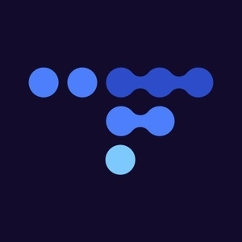 | 42495 | TFT | ThreeFold Token |
| 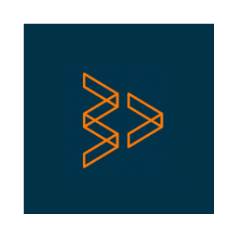 | 42425 | BCNT | Bincentive |
|  | 42557 | GCZ | GlobalChainZ |
| 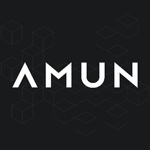 | 42625 | ETH3S | ETH3S |
|  | 34392 | USDQ | USDQ |
|  | 33771 | ECOREAL | Ecoreal Estate |
|  | 33563 | BIA | Bilaxy Token |
|  | 34700 | EVRAZ | EVRAZ |
| 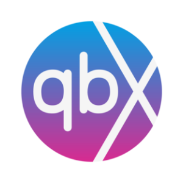 | 36435 | QBX | qiibee |
| 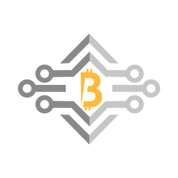 | 34548 | BTP | Bitcoin Pay |
| 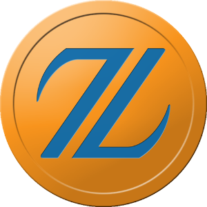 | 34597 | ZAIF | Zaif Token |
| 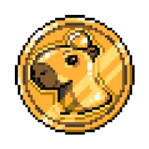 | 66563 | CAPY | Capybara |
| 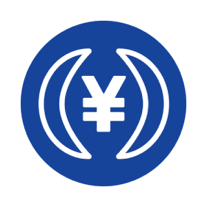 | 66791 | JPYC | JPY Coin |
|  | 66669 | SFEX | SafeLaunch |
|  | 66117 | SQUID | Squid Game |
| 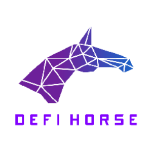 | 66125 | DFH | DeFiHorse |
| 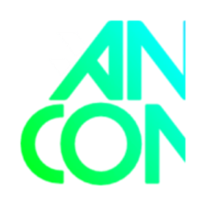 | 66469 | ANML | Animal Concerts |
|  | 66371 | QTC | Qitcoin |
| 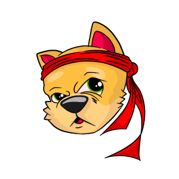 | 66375 | INU | Hachiko Inu Token |
|  | 66383 | WEAR | MetaWear |
| 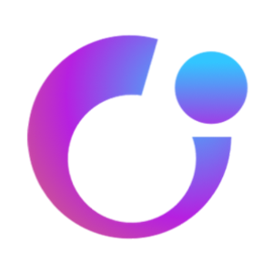 | 66873 | CTR | Creator Platform |
|  | 66075 | IFARM | iFARM |
|  | 67629 | C | Carbon Coin |
| 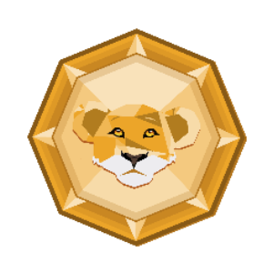 | 67651 | POLYCUB | PolyCub |
|  | 67657 | CYBRRRDOGE | CyberDoge |
| 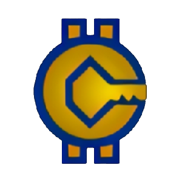 | 67491 | CRYN | CRYN |
|  | 67553 | VENTION | Vention |
|  | 67565 | INFTEE | Infinitee |
| 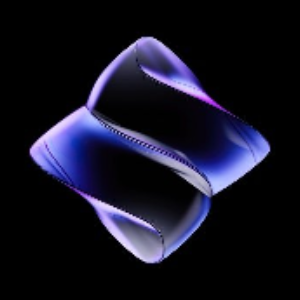 | 67589 | SEDA | SEDA |
|  | 66879 | WAVAX | Wrapped AVAX |
|  | 67027 | CANDYLAD | Candylad |
| 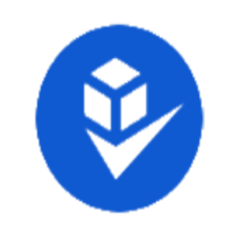 | 66975 | VBNT | Bancor Governance Token |
|  | 67025 | ELOIN | Eloin |
| 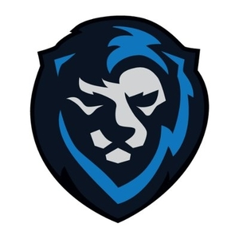 | 67033 | KNG | Kanga Exchange |
| 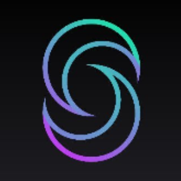 | 66935 | SOLPAD | Solpad Finance |
| 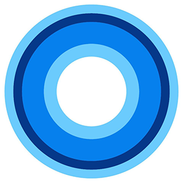 | 66941 | USDH | USDH |
|  | 67069 | LYPTUS | Lyptus Token |
|  | 67229 | $KEI | Keisuke Inu |
| 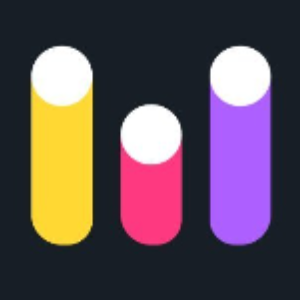 | 67255 | MSG | MsgSender |
| 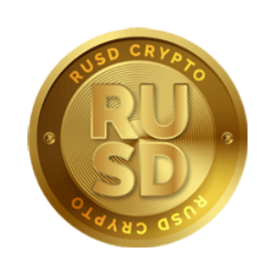 | 67113 | RUSD | rUSD |
|  | 67165 | NUC | NuCoin |
| 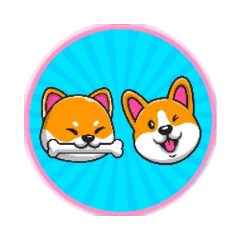 | 67129 | SHICO | ShibaCorgi |
|  | 67137 | HARE | Hare Token [OLD] |
| 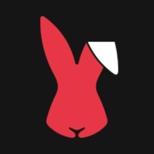 | 66071 | RBX | RBX Token |
|  | 64361 | HARAMBE | Harambe |
|  | 64357 | DTNG | DTNG |
|  | 64277 | METAN | Metan Evolutions |
|  | 64281 | DGMV | DigiMetaverse |
| 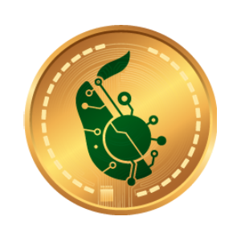 | 63967 | AVDO | AvocadoCoin |
| 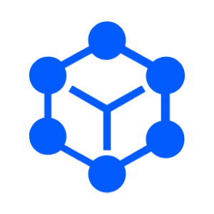 | 63901 | GCME | GoCryptoMe |
|  | 64193 | YASHA | Yasha Dao |
| 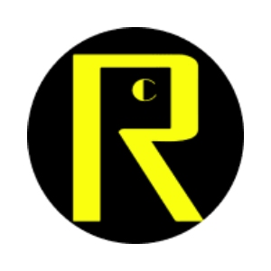 | 65725 | RND | The RandomDAO |
|  | 65775 | EIFI | EIFI Finance |
|  | 65807 | BMBO | Bamboo Coin |
| 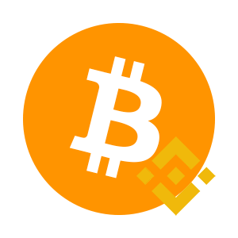 | 65651 | BTCB | BitcoinBrand |
|  | 65705 | MARVIN | Marvin Inu |
|  | 65837 | BABYPIG | Baby Pig Token |
|  | 65991 | AURUM | Raider Aurum |
| 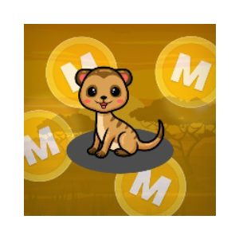 | 65873 | MONGOOSE | Mongoose |
| 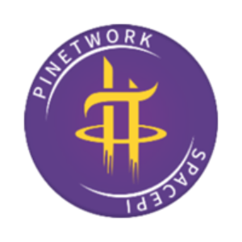 | 65933 | SPACEPI | SpacePi |
| 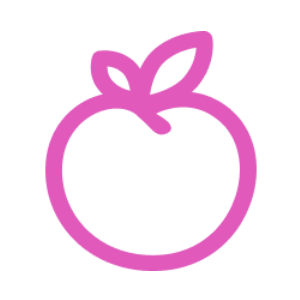 | 65937 | SYA | SYA x Flooz |
|  | 65953 | PNDR | Pandora Protocol |
|  | 69691 | CE | Crypto Excellence |
|  | 69647 | EV | Evai |
| 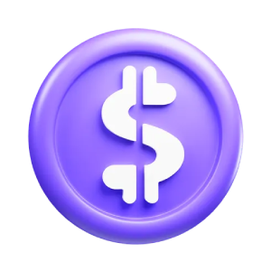 | 69735 | USDR | USD Reserve |
|  | 69587 | LETSGO | Lets Go Brandon |
|  | 69629 | SUMMER | Summer |
|  | 69635 | HOTMOON | HotMoon |
| 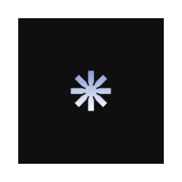 | 69843 | SER | Secretum |
|  | 69849 | WINTER | Winter |
|  | 69893 | ZOOSHI | Zooshi |
| 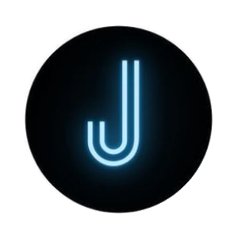 | 69895 | JTS | Jetset |
|  | 69797 | SCCN | Succession |
|  | 69815 | SPRING | Spring |
| 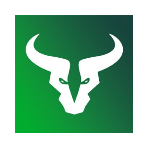 | 69341 | 3ULL | Playa3ull Games |
| 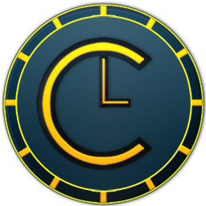 | 69289 | CKC | ChikinCoin |
|  | 69281 | GOATS | GOATS |
| 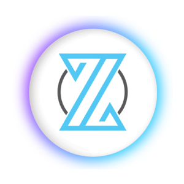 | 69313 | ZENC | Zenc Coin |
|  | 69513 | CREAMY | Creamy |
| 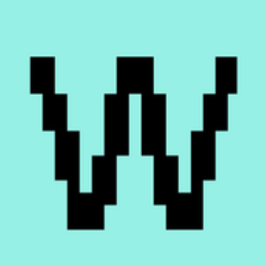 | 69529 | WAL | The Wasted Lands |
|  | 69547 | PHENIX | Phenix |
| 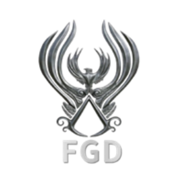 | 69421 | FGD | Freedom God DAO |
|  | 69483 | VELON | Viking Elon |
| 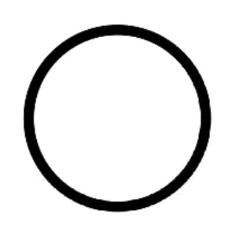 | 70667 | ASSET | iAssets |
|  | 70687 | NEUY | NEUY |
|  | 70707 | VIZSLASWAP | VizslaSwap |
| 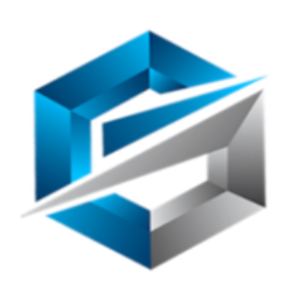 | 70637 | USDZ | Zedxion USDZ |
| 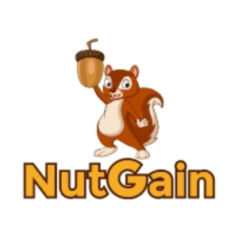 | 70349 | NUTGV2 | NUTGAIN |
|  | 69905 | FAKT | Medifakt |
|  | 70043 | $FORGE | Blocksmith Labs Forge |
|  | 69907 | AUTUMN | Autumn |
|  | 69979 | YKS | YourKiss |
|  | 70287 | MM72 | MM72 |
|  | 70121 | ACR | Acreage Coin |
| 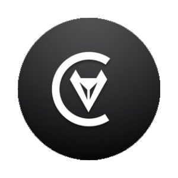 | 70173 | ZEUM | Colizeum |
|  | 70193 | DAOSOL | daoSOL |
|  | 69249 | FIST | Fistbump |
|  | 68169 | SHINJI | Shinji Inu |
|  | 68209 | TYV | TYV |
|  | 68349 | LSWAP | LoopSwap |
|  | 67821 | NOONE | No One |
|  | 67877 | RUPEE | HyruleSwap |
|  | 67711 | USD1 | Psyche |
|  | 67735 | ABEY | Abey |
|  | 68007 | FUM | FUMoney |
| 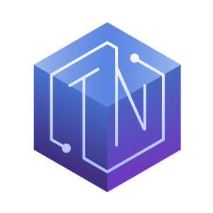 | 68023 | TRUSTNFT | TrustNFT |
| 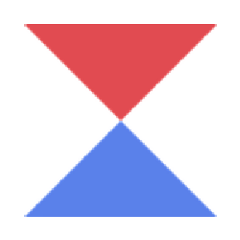 | 68055 | WX | Waves Exchange |
|  | 68981 | GETH | Guarded Ether |
| 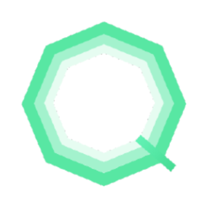 | 69213 | MEER | Qitmeer Network |
| 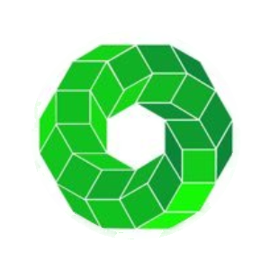 | 69221 | ESG | ESG |
|  | 68583 | $EFB | ETHFan Burn |
|  | 68607 | PROT | ProStarter |
|  | 68565 | CHECOIN | CheCoin |
|  | 58227 | GBD | Great Bounty Dealer |
| 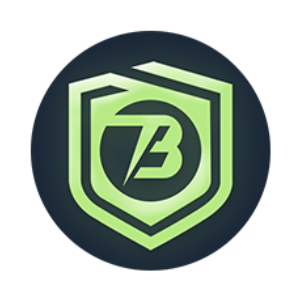 | 58217 | BODAV2 | BODA Token |
|  | 58199 | SHIBGF | SHIBGF |
|  | 58369 | YCT | Youclout |
|  | 57773 | CWAR | Cryowar Token |
|  | 57651 | KITTY DINGER | Schrodinger |
| 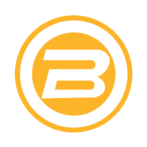 | 58013 | NMBTC | NanoMeter Bitcoin |
|  | 58057 | WKD | Wakanda Inu |
|  | 57969 | GODZ | Godzilla |
|  | 58893 | HWL | Howl City |
|  | 59067 | RIDGE | Ridge |
| 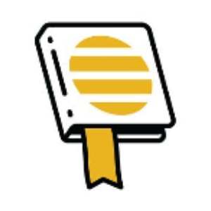 | 58583 | PAGE | Page |
|  | 58875 | KLTR | Kollector |
|  | 58851 | GEMIT | GEMIT.app |
| 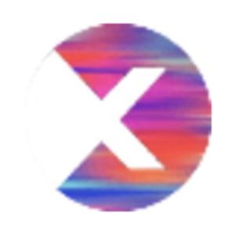 | 56383 | METAX | MetaverseX |
|  | 56439 | SCX | Scarcity |
|  | 56329 | XDOGE | Xdoge |
|  | 56597 | BITANT | BitANT |
|  | 56453 | POKERFI | PokerFi |
| 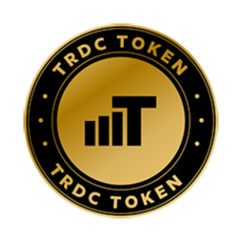 | 56513 | TRDC | Traders Coin |
| 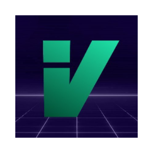 | 56547 | VETTER | Vetter Token |
|  | 55821 | F9 | Falcon Nine |
| 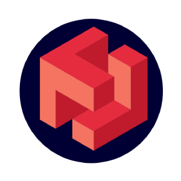 | 55707 | IBG | iBG Token |
| 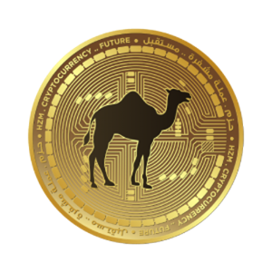 | 55773 | HZM | HZM Coin |
|  | 55799 | ANB | Angryb |
| 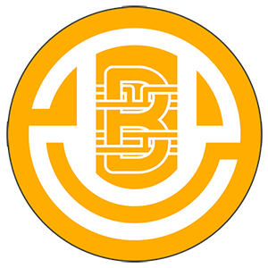 | 55813 | BOSS | Boss |
|  | 56149 | LARIX | Larix |
|  | 56111 | WOJ | Wojak Finance |
|  | 56035 | ZMBE | RugZombie |
|  | 56061 | DCIP | Decentralized Community Investment Protocol |
|  | 57295 | BLUESPARROW | BlueSparrow Token |
| 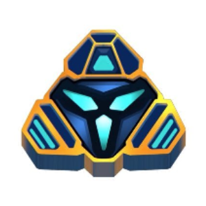 | 57519 | MECH | Mech Master |
|  | 57539 | TAUR | Marnotaur |
|  | 57567 | GINZA | Ginza Network |
| 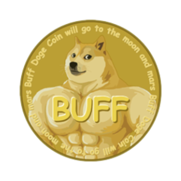 | 57467 | DOGECOIN | Buff Doge Coin |
|  | 57079 | GORGEOUS | Gorgeous |
|  | 56969 | ERW | ZeLoop Eco Reward |
| 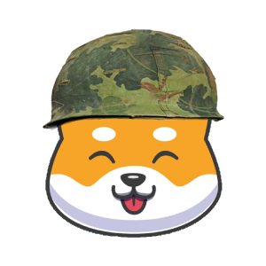 | 57055 | SHIBARMY | Shib Army |
| 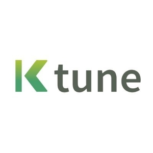 | 61671 | KTT | K-Tune |
| 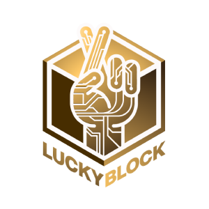 | 62001 | LBLOCK | Lucky Block |
|  | 61271 | BTTOLD | BitTorrent [OLD] |
| 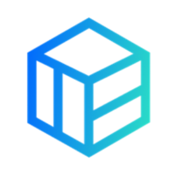 | 61517 | TBCC | TBCC |
| 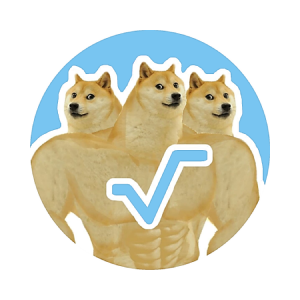 | 61561 | DOGECUBE | DogeCube |
|  | 61359 | MOONEY | Moon DAO |
| 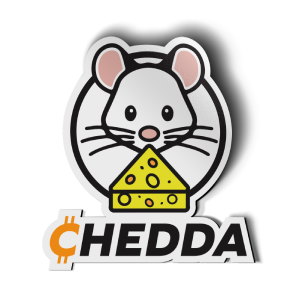 | 61361 | CHEDDA | Chedda |
| 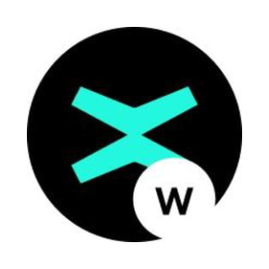 | 61385 | WEGLD | Wrapped Elrond |
| 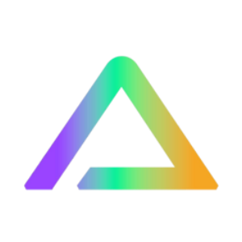 | 61409 | DRIP | Drip Network |
|  | 61421 | INUS | MultiPlanetary Inus |
|  | 62049 | METANIA | MetaniaGames |
|  | 61081 | XMT | MetalSwap |
|  | 63483 | WTLOS | Wrapped Telos |
|  | 63711 | JUSTICE | AssangeDAO |
| 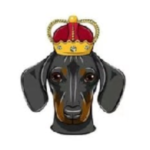 | 63679 | DOGEKING | DogeKing |
|  | 63751 | NEXM | Nexum |
|  | 63595 | SOCA | Socaverse |
| 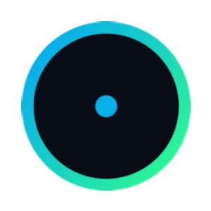 | 62913 | LSR | LaserEyes |
|  | 62919 | NEWB | NewB.Farm |
| 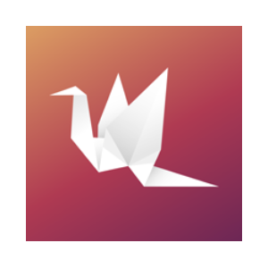 | 62855 | KTO | Kounotori |
| 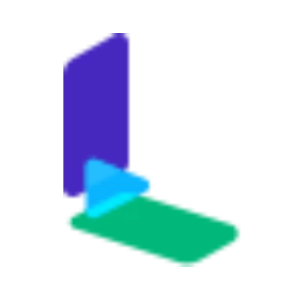 | 62065 | LENDA | Lenda |
|  | 63257 | ELP | The Everlasting Parachain |
| 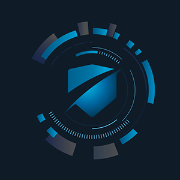 | 63223 | BRAND | BrandPad Finance |
|  | 63047 | SPY | Smarty Pay |
| 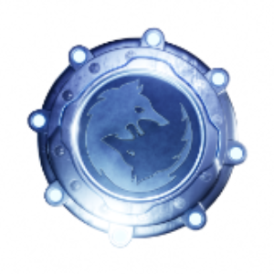 | 63079 | GUARD | Guardian Token |
|  | 59855 | EGAME | Every Game |
| 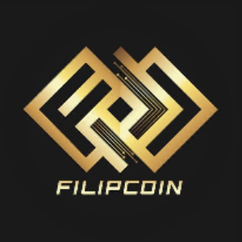 | 59905 | FCP | Filipcoin |
|  | 59911 | TREKS | PlayTreks |
|  | 59941 | STRM | Instrumental Finance |
| 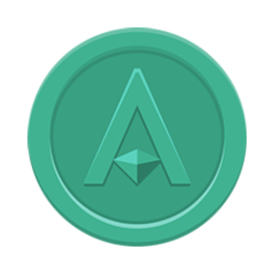 | 59849 | ARKER | Arker |
|  | 59805 | GELDF | GELD Finance |
| 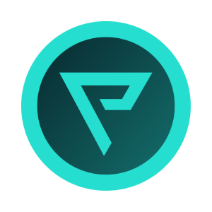 | 60103 | PKN | Poken |
| 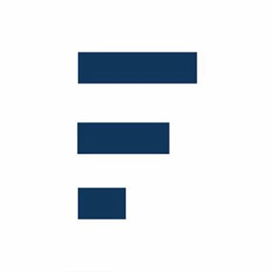 | 60117 | CRF | Crafting Finance |
|  | 60131 | KORI | Kori Inu |
|  | 60065 | LINKS | Links |
| 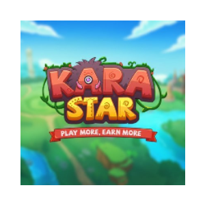 | 59535 | UMY | KaraStar UMY |
| 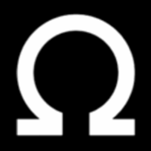 | 59557 | GOHM | Governance OHM |
|  | 60797 | DSHARE | Dibs Share |
| 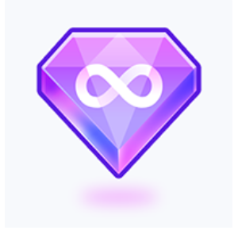 | 60677 | SUPE | Supe Infinity |
|  | 61035 | MRHB | MarhabaDeFi |
| 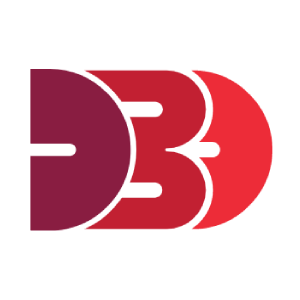 | 60235 | DBD | Day By Day |
| 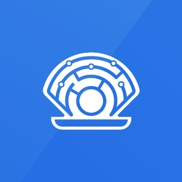 | 60475 | SHL | Shelling |
| 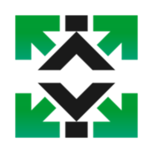 | 60383 | KRRX | Kyrrex |
|  | 60421 | KPC | KEEPs Coin |
| 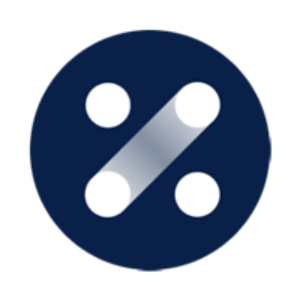 | 65895 | XNO | Xeno Token |
|  | 158411 | USDF | Falcon USD |
| 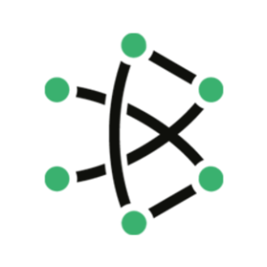 | 91177 | BZR | Bazaars |
| 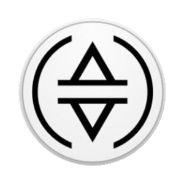 | 127063 | SUSDE | Ethena Staked USDe |
| 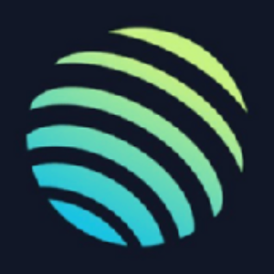 | 122093 | JLP | Jupiter Perps LP |
| 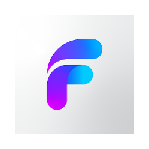 | 47491 | FEG | FEG Token |
| 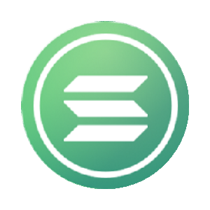 | 80447 | JITOSOL | Jito Staked SOL |
|  | 44863 | RNDR | Render Token |
|  | 45027 | CNS | Centric Cash |
| 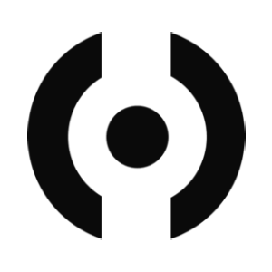 | 32776 | OPEN | Open Platform |
|  | 56831 | MSOL | Marinade staked SOL |
| 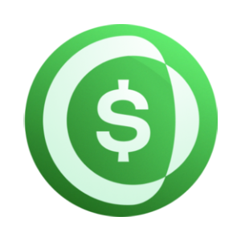 | 161837 | USD0 | Usual USD |
| 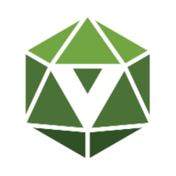 | 111425 | VCNT | ViciCoin |
|  | 44705 | NXM | NXM |
| 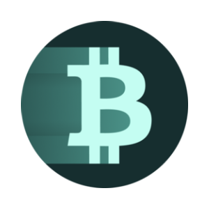 | 2389 | LBTC | Lightning Bitcoin |
| 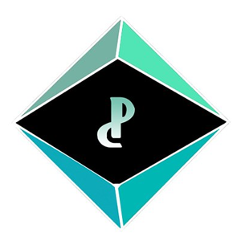 | 80497 | PLC | PlatinCoin |
|  | 12377 | MKR | Maker |
| 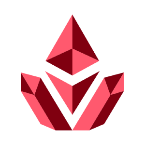 | 113497 | METH | Mantle Staked Ether |
|  | 90547 | KAG | Kinesis Silver |
| 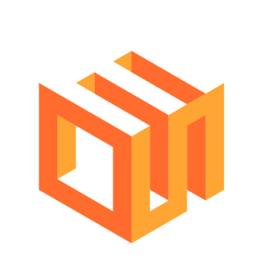 | 2679 | EOS | EOS |
| 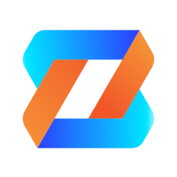 | 112093 | ZBU | Zeebu |
| 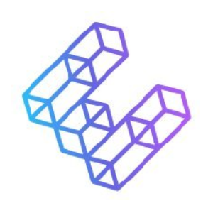 | 126777 | WEETH | Wrapped eETH |
| 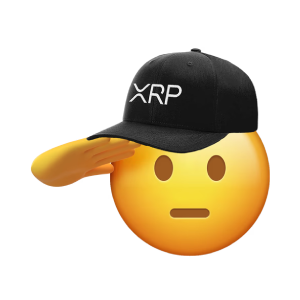 | 161467 | SLT | SLT |
|  | 32483 | CXO | CargoX |
|  | 33561 | BOTX | botXcoin |
| 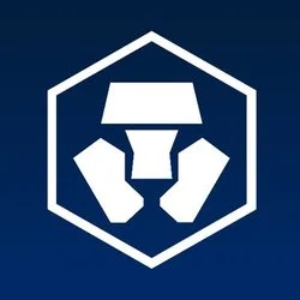 | 81143 | WCRO | Wrapped CRO |
| 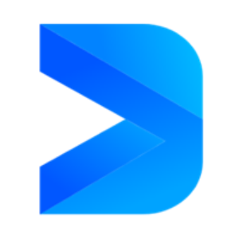 | 64687 | DESO | Decentralized Social |
|  | 47807 | ADCO | Advertise Coin |
| 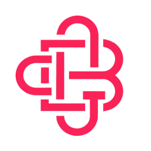 | 135363 | GCB | Global Commercial Business |
|  | 64905 | STRX | StrikeX |
|  | 165323 | RUJI | Rujira |
|  | 100439 | MRS | Metars Genesis |
| 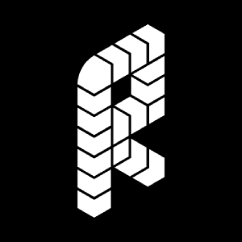 | 70747 | ROG | ROGin AI |
|  | 44035 | TKX | Tokenize Xchange |
|  | 64851 | LON | Tokenlon |
|  | 64749 | KOGE | BNB48 Club Token |
|  | 77761 | ADS | Adshares |
|  | 161873 | YUSD | Aegis YUSD |
| 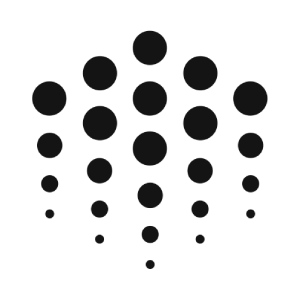 | 33558 | OCEAN | Ocean Protocol |
|  | 33441 | NOW | NOW Token |
|  | 48571 | UST | TerraUSD |
| 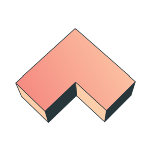 | 58441 | AGEUR | agEUR |
| 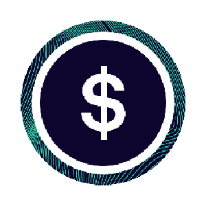 | 33582 | SUSD | sUSD |
|  | 122829 | USDY | Ondo US Dollar Yield |
|  | 112395 | AEUR | Anchored Coins AEUR |
|  | 150267 | PMX | Primex Finance |
| 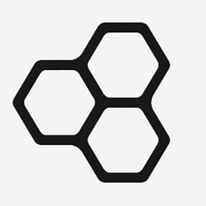 | 151135 | CUSD | Celo Dollar |
| 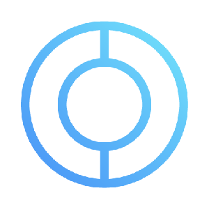 | 47461 | CUDOS | Cudos |
| 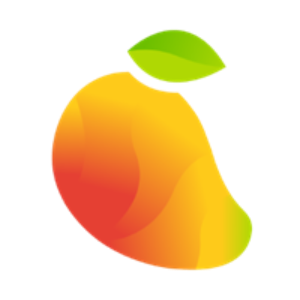 | 54397 | MNGO | Mango Markets |
|  | 48745 | OHM | Olympus |
| 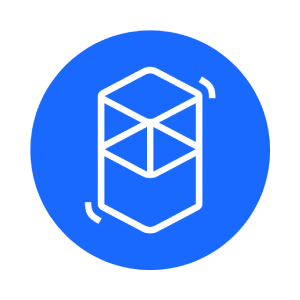 | 66995 | WFTM | Wrapped Fantom |
|  | 34409 | AMPL | Ampleforth |
| 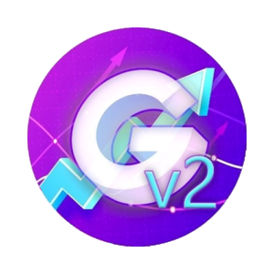 | 47547 | GFARM2 | Gains V2 |
| 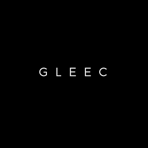 | 42913 | GLEEC | Gleec Coin |
| 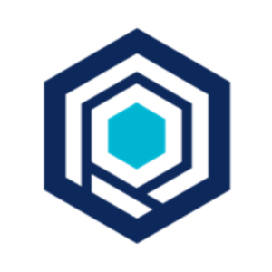 | 46199 | RAMP | RAMP |
|  | 58695 | JSOL | JPool |
| 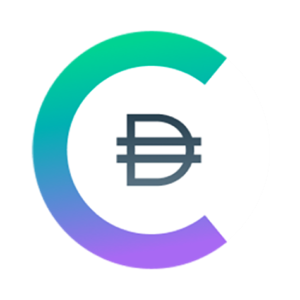 | 44034 | CDAI | Compound Dai |
|  | 64699 | MIMATIC | MAI |
| 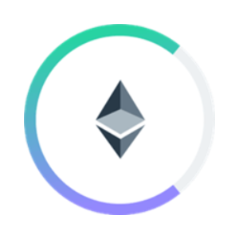 | 43123 | CETH | Compound Ether |
|  | 142101 | XAUM | Matrixdock Gold |
|  | 47409 | BSCX | BSCEX |
|  | 56833 | SLND | Solend |
| 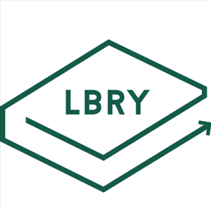 | 115 | LBC | LBRY Credits |
| 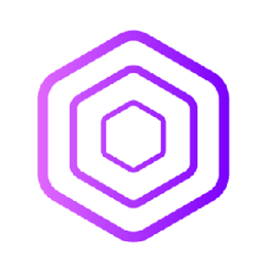 | 36412 | AKRO | Akropolis  |
|  | 127293 | MOCHI | Mochi (New) |
| 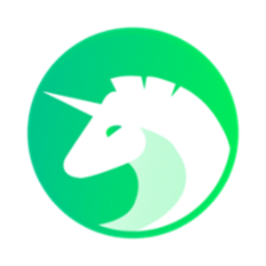 | 46263 | UNCX | UniCrypt |
| 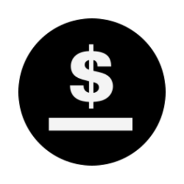 | 64781 | MUSD | mStable USD |
| 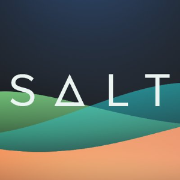 | 260 | SALT | Salt |
| 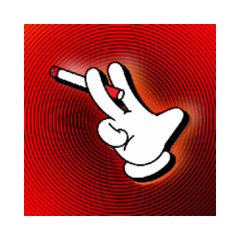 | 98749 | CIG | Cigarette |
| 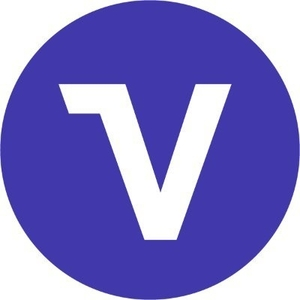 | 47399 | VSP | Vesper Finance |
| 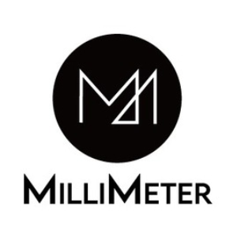 | 62721 | MM | Million |
|  | 122243 | WPOKT | wrapped POKT |
| 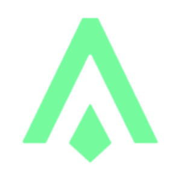 | 147787 | ASTRA | AstraAI |
|  | 165435 | QKA | Qkacoin |
|  | 32811 | ABYSS | The Abyss |
|  | 45080 | BLY | Blocery |
| 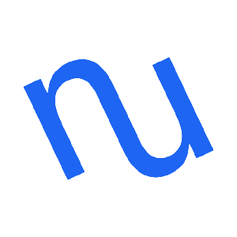 | 46175 | NU | NuCypher |
|  | 121865 | SPC | SpaceChain |
|  | 47537 | CNFI | Connect Financial |
| 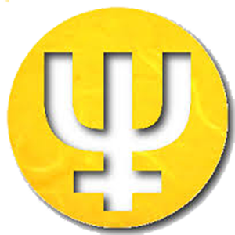 | 351 | XPM | Primecoin |
| 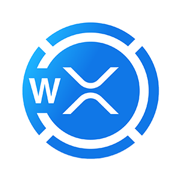 | 69981 | WXRP | Wrapped XRP |
|  | 45278 | YUSRA | YUSRA |
|  | 55515 | PINKSALE | PinkSale |
|  | 131777 | MGP | Magpie |
|  | 64805 | NWC | Newscrypto Coin |
|  | 55239 | HANU | Hanu Yokia |
|  | 147917 | UFO | UFO Gaming |
| 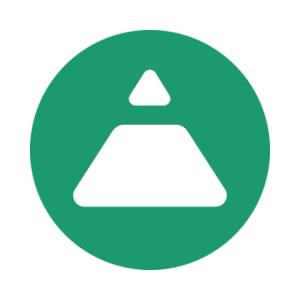 | 59967 | FEI | Fei USD |
| 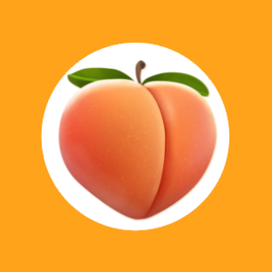 | 81147 | PORNROCKET | PornRocket |
| 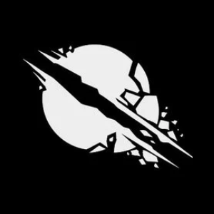 | 113771 | SHRAP | Shrapnel |
| 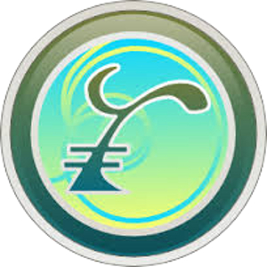 | 3077 | RIC | Riecoin |
| 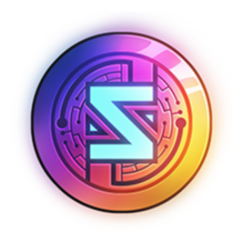 | 59809 | SIPHER | Sipher |
| 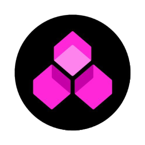 | 62957 | BLOK | Bloktopia |
|  | 42858 | TRYB | BiLira |
|  | 62975 | PLT | Poollotto.finance |
| 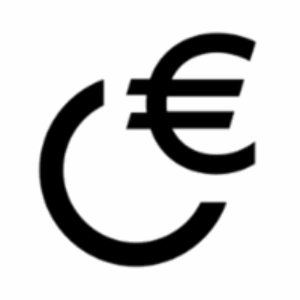 | 50829 | CEUR | Celo Euro |
| 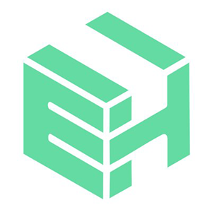 | 47625 | ETHIX | EthicHub |
|  | 130427 | VERUM | Verum Coin |
|  | 45177 | HAKKA | Hakka.Finance |
|  | 68985 | KOMPETE | Kompete |
| 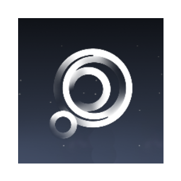 | 100103 | PLXY | Plxyer |
| 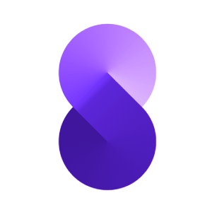 | 64725 | SURE | inSure DeFi |
|  | 32106 | VEE | BLOCKv |
| 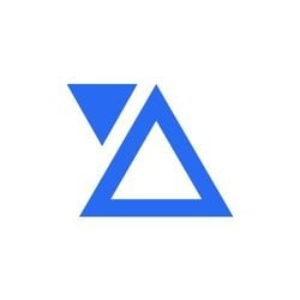 | 58275 | PSP | ParaSwap |
|  | 43231 | SOCKS | Unisocks |
|  | 279 | BSTY | GlobalBoost-Y |
| 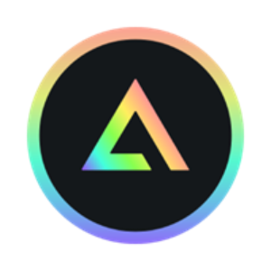 | 64987 | PRISM | Prism |
|  | 44789 | MCB | MCDex |
| 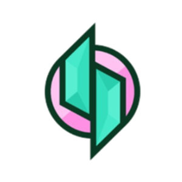 | 45348 | SWFL | Swapfolio |
| 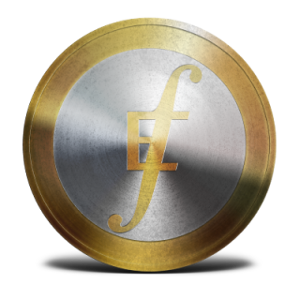 | 14 | EFL | e-Gulden |
| 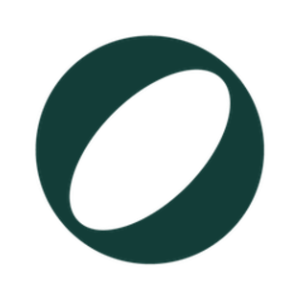 | 113433 | USDGLO | Glo Dollar |
| 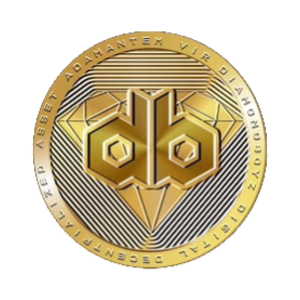 | 55715 | DBZ | Diamond Boyz Coin |
| 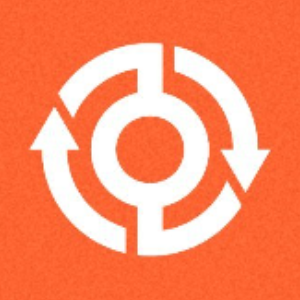 | 122935 | OZK | OrdiZK |
| 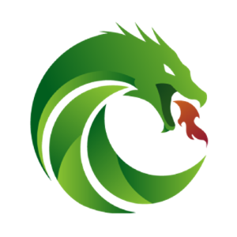 | 122041 | JADE | Jade Currency |
|  | 65661 | ROPE | Rope Token |
| 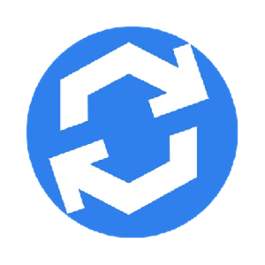 | 45063 | YFL | YF Link |
| 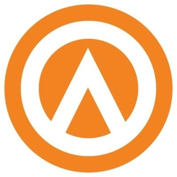 | 46174 | ALIAS | Alias |
| 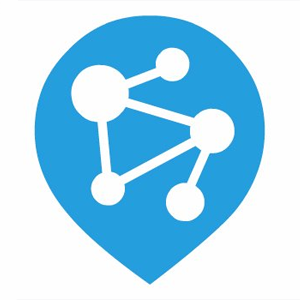 | 122615 | HBT | Hebeto |
| 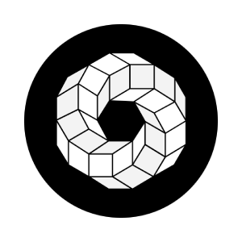 | 45225 | CVP | PowerPool Concentrated Voting Power |
|  | 94813 | HYPC | HyperCycle |
| 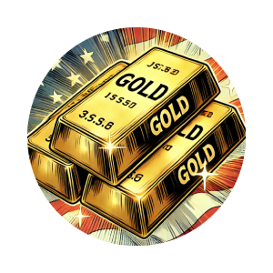 | 164479 | FORTKNOX | Fort Knox |
| 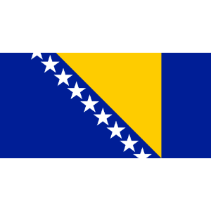 | 123587 | BAM | Bambi |
|  | 141269 | SWORLD | Seedworld |
| 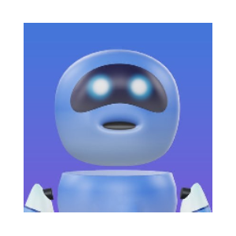 | 123687 | TRUTH | TruthGPT |
|  | 44167 | NOAHP | Noah Platinum |
| 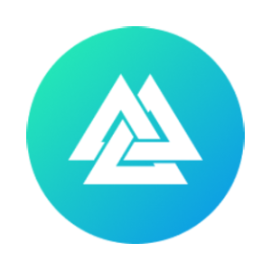 | 122837 | ASG | Nekoverse: City of Greed Anima Spirit Gem |
|  | 66829 | $WOOD | Mindfolk Wood |
|  | 99441 | $HARAM | Haram |
| 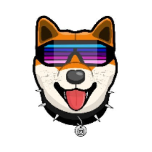 | 68925 | DGLN | Dogelana |
| 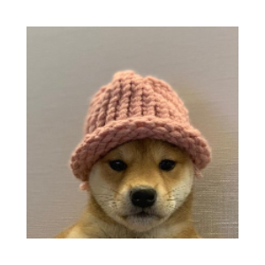 | 122397 | DOGWIFHAT | dogwifhat |
|  | 94567 | DARUMA | Daruma |
|  | 128309 | NTD | Neural Tensor Dynamics |
|  | 78489 | LAIKA | Laika |
| 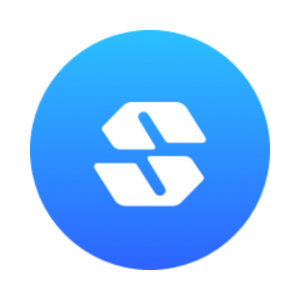 | 58513 | TP | Token Swap |
|  | 159507 | BNBULL | BNBULL |
| 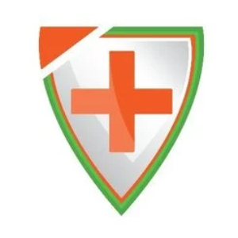 | 68439 | SAFUU | SAFUU |
|  | 50071 | COLD | Cold Finance |
|  | 51025 | TABOO | Taboo Token |
| 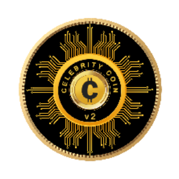 | 59719 | CCV2 | CryptoCart V2 |
|  | 165193 | DOGENARII | Dogenarii |
| 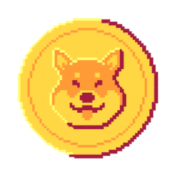 | 49555 | TAMA | Tama Finance |
|  | 45285 | LIEN | lien |
|  | 71313 | AZY | Amazy |
|  | 146885 | GOR | Gold Reserve |
|  | 141913 | RINO | Rino |
| 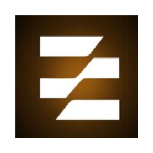 | 130331 | BD20 | BRC-20 DEX |
| 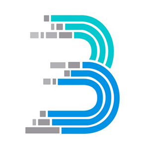 | 78671 | BIN | Binemon |
| 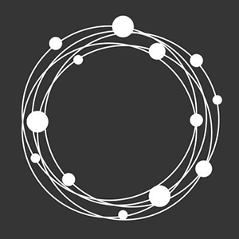 | 50497 | WOMI | Wrapped ECOMI |
|  | 51277 | PUP | Pupper |
| 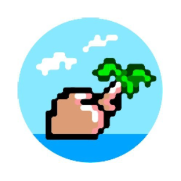 | 124997 | GOOCH | Gooch |
|  | 57557 | DKEY | DKEY Bank |
|  | 94971 | CHECKS | Checks Token |
|  | 85689 | OHMI | One Hundred Million Inu |
|  | 50899 | CATBREAD | CatBread |
|  | 58961 | FLUF | Fluffy Coin |
|  | 127859 | HMKR | Hitmakr |
|  | 11028 | GO | GoChain |
| 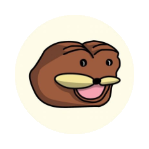 | 115355 | SPURDO | spurdo |
|  | 125963 | MONKE | Monke |
|  | 65307 | ARGO | ArGoApp |
|  | 31410 | DIVI | Divi |
|  | 54185 | CRUSADER | Crusaders of Crypto |
| 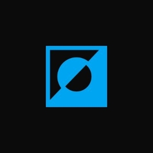 | 46694 | RFI | reflect.finance |
| 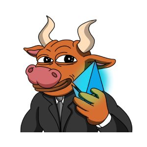 | 136219 | EBULL | ETHEREUM IS GOOD |
|  | 162795 | ZKAI | ZKCrypt AI |
|  | 69833 | REDFEG | RedFeg |
|  | 48939 | PINKM | PinkMoon |
| 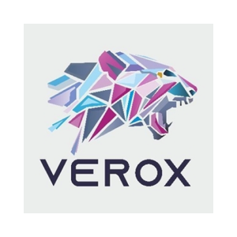 | 47475 | VRX | Verox |
|  | 121723 | SILLY | Silly Dragon |
|  | 80057 | KOI | The Dragon Gate |
|  | 123363 | CHOW | CHOW CHOW |
| 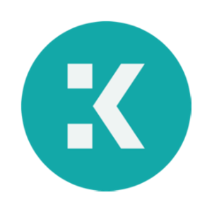 | 48091 | KINE | Kine Protocol |
|  | 122371 | LINU | Luna Inu |
|  | 80619 | HNTR | Hunter |
| 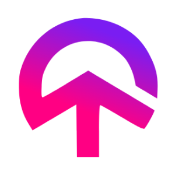 | 82729 | TOMI | tomiNet |
|  | 45596 | NUTS | Squirrel Finance |
|  | 55339 | MONS | Monsters Clan |
| 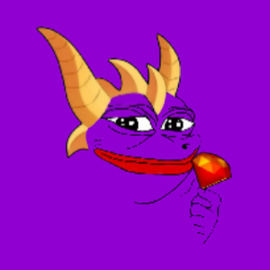 | 122165 | SPYRO | SPYRO |
|  | 45925 | CXN | CXN Network |
|  | 58019 | WINRY | Winry Inu |
| 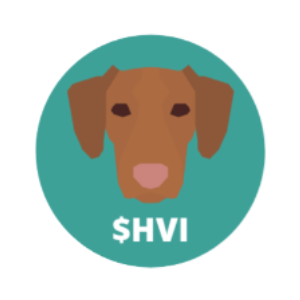 | 67059 | HVI | Hungarian Vizsla Inu |
| 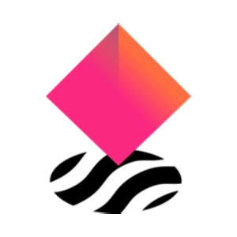 | 47164 | NFTX | NFTX |
|  | 93999 | MERC | Liquid Mercury |
|  | 52281 | MOONRISE | MoonRise |
|  | 67073 | DASS | DashSports |
|  | 50895 | IONX | Charged Particles |
| 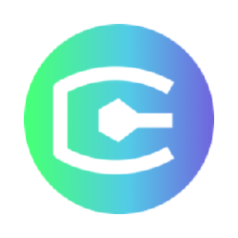 | 99837 | ARCHIVE | Chainback |
|  | 50467 | RNB | Rentible |
|  | 77877 | WAIT | Hourglass |
|  | 49319 | XBN | Elastic BNB |
| 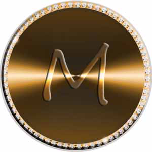 | 52249 | MIL | Military Finance |
| 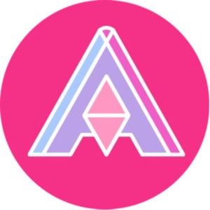 | 46636 | AZUKI | Azuki |
| 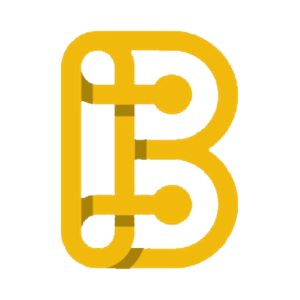 | 47429 | BSCPAD | BSCPAD |
| 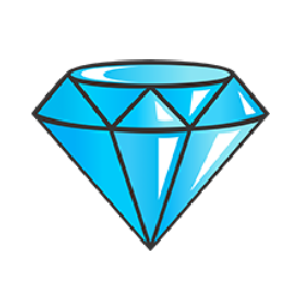 | 49811 | DND | DungeonSwap |
|  | 99669 | SHIB2.0 | Shib2.0 |
| 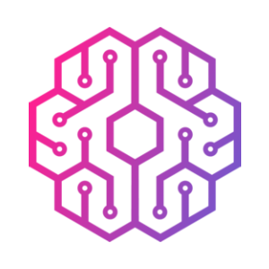 | 131851 | SKAI | Skillful AI |
|  | 162001 | MSIA | Messiah |
|  | 32789 | ZCN | 0chain |
| 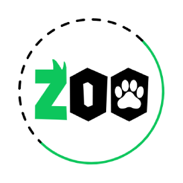 | 50393 | ZOOT | Zoo Token |
| 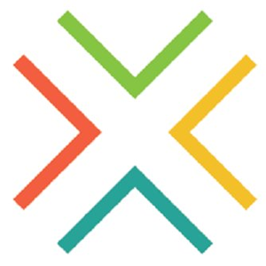 | 123219 | PIX | Pixie |
|  | 67843 | PUPDOGE | Pup Doge |
| 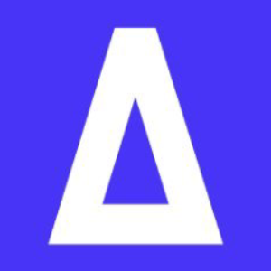 | 100159 | TI | Titanium22 |
| 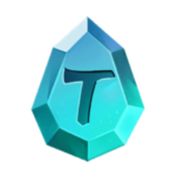 | 123747 | TOTEM | DragonMaster |
|  | 49647 | TULIP | SolFarm |
|  | 94657 | LITT | LitLab Games |
| 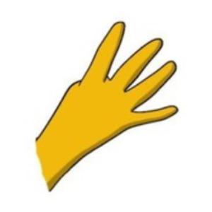 | 42032 | FOUR | The 4th Pillar |
|  | 55805 | BZN | Benzene |
| 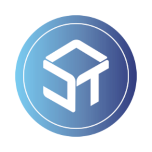 | 61813 | SQUA | Square Token |
| 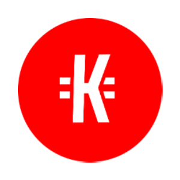 | 65105 | KKO | Kineko |
| 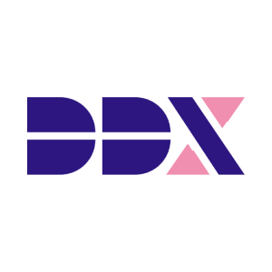 | 165839 | DDX | DerivaDAO |
|  | 128161 | WFO | WoofOracle |
|  | 99315 | PACHA | Kay Pacha |
|  | 90929 | BISC | Bidao Smart Chain |
|  | 48305 | ARNXM | Armor NXM |
|  | 57359 | HMOON | HELLMOON |
|  | 67139 | FNK | Fnk.com |
| 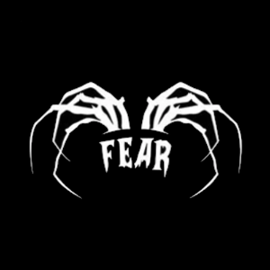 | 49905 | FEAR | Fear |
| 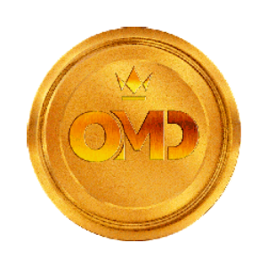 | 124397 | OMD | OneMillionDollars |
| 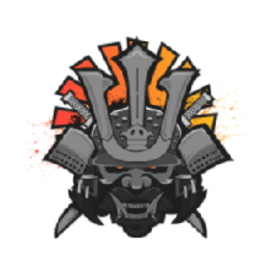 | 67993 | KUSUNOKI | Kusunoki Samurai |
|  | 67107 | SMOON | SaylorMoon |
|  | 49067 | WHEAT | Wheat Token |
|  | 111819 | GAI | Generaitiv |
|  | 124503 | GROKMOON | Grok Moon |
|  | 162503 | SILENTIS | Silentis |
| 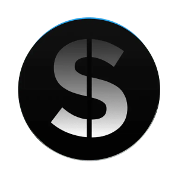 | 1825 | SPACE | SpaceCoin |
| 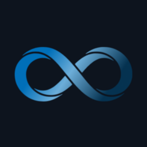 | 142115 | NFNT | NFINITY AI |
|  | 49801 | PEECH | Peach Finance |
| 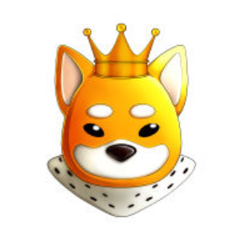 | 123723 | KINGBONK | King Bonk |
|  | 49337 | KAIINU | Kai Inu |
|  | 49309 | TYPH | Typhoon Network |
| 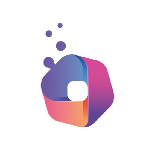 | 343 | UNO | Unobtanium |
| 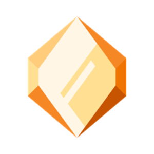 | 32821 | FLP | FLIP |
| 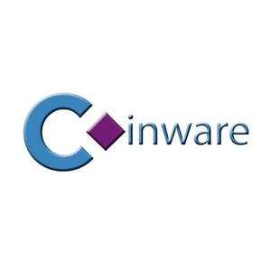 | 62753 | CWT | CrossWallet |
| 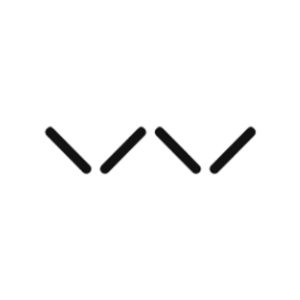 | 62933 | WWY | WeWay |
| 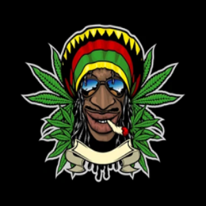 | 151053 | BOBMARLEY | Bob Marley Meme |
|  | 53759 | BUNI | Bunicorn |
| 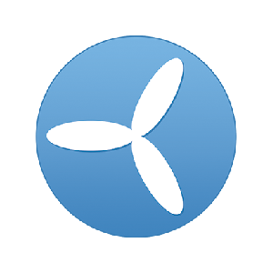 | 121925 | TONE | TE-FOOD |
| 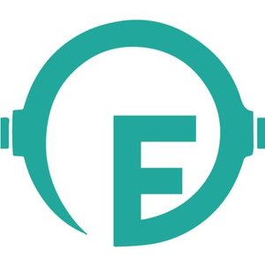 | 32474 | FTX | FintruX Network |
|  | 49505 | NFTFY | Nftfy |
|  | 52269 | SHI | Shirtum |
|  | 48375 | POODL | Poodl Token |
| 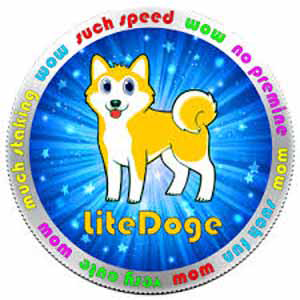 | 1294 | LDOGE | LiteDoge |
| 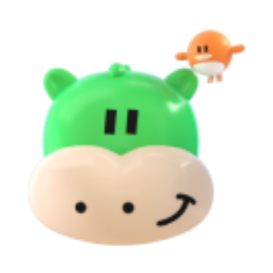 | 79079 | HPO | Hippo Wallet |
| 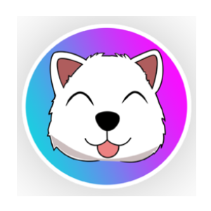 | 51417 | XIASI | Xiasi Inu |
| 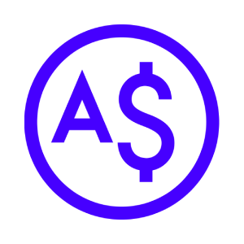 | 113817 | AUDD | Novatti Australian Digital Dollar |
|  | 113823 | N | nsurance |
|  | 160509 | OGGIE | Oggie |
|  | 121775 | STWEMIX | Staked WEMIX |
|  | 111961 | OSEAN | Osean |
| 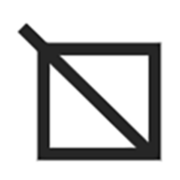 | 49445 | UMBR | Umbria Network |
|  | 69145 | VALAS | Valas Finance |
| 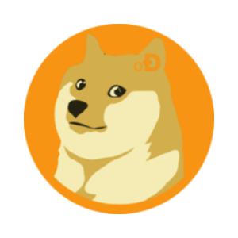 | 113871 | ODOGE | Ordinal Doge |
| 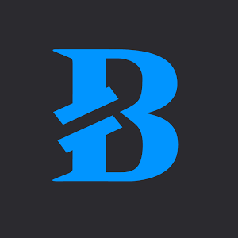 | 82665 | BCB | Blockchain Bets |
| 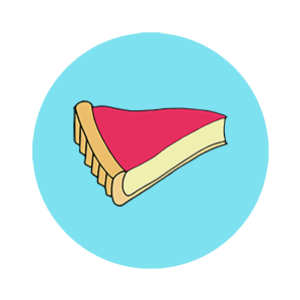 | 50699 | CCAKE | CheesecakeSwap |
|  | 147863 | MAX | Matr1x |
| 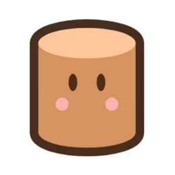 | 51035 | PACOCA | Pacoca |
| 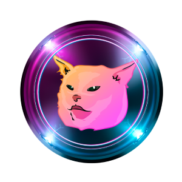 | 50151 | PUSSY | Pussy Financial |
|  | 63963 | DXLM | Doge Lumens |
|  | 141999 | CSI | CSI888 |
| 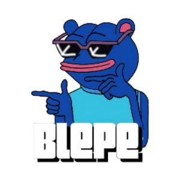 | 132807 | BLEPE | Blepe |
| 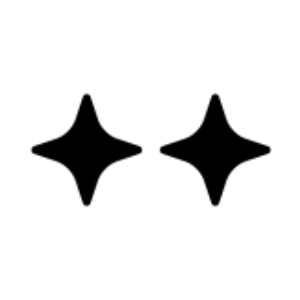 | 146469 | AIAGENT | Casper AI |
| 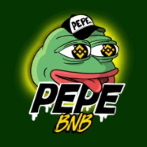 | 133725 | PEPEBNB | Pepe The Frog |
|  | 68061 | DUET | Duet Protocol |
| 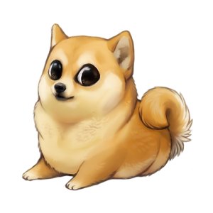 | 136223 | BABYNEIRO | Baby Neiro Token |
| 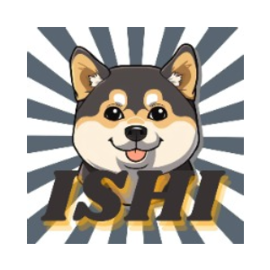 | 127799 | ISHI | Ishi |
|  | 136923 | GNOMY | Gnomy |
| 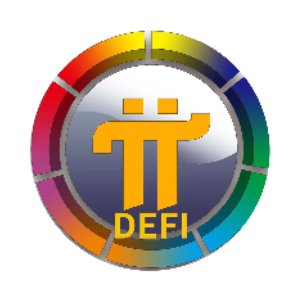 | 69201 | PINETWORKDEFI | Pi Network DeFi |
| 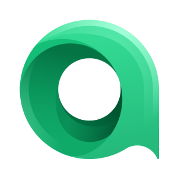 | 49613 | ALM | Allium Finance |
|  | 71413 | LUNAT | Lunatics |
|  | 136929 | APUGURL | APU GURL |
| 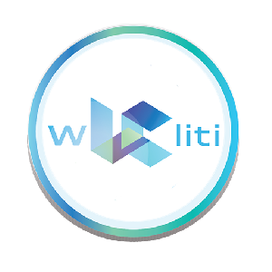 | 51209 | WLITI | wLITI |
|  | 134255 | PEEPA | Peepa |
| 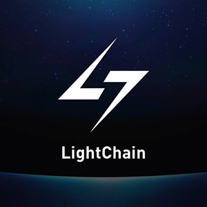 | 78907 | LIGHT | Light Defi |
|  | 131459 | DOM | Ancient Kingdom |
|  | 33228 | HC | HyperCash |
| 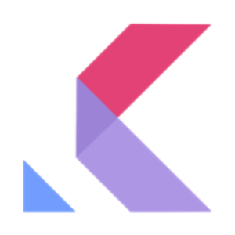 | 56121 | KOL | Kollect |
|  | 66707 | PYRAM | Pyram Token |
| 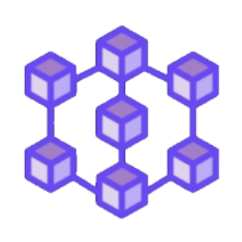 | 113119 | SOR | Sorcery Finance |
| 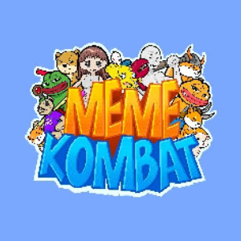 | 127861 | MK | Meme Kombat |
|  | 51207 | JEJUDOGE | Jejudoge |
| 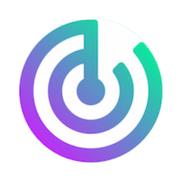 | 58689 | SONAR | SonarWatch |
|  | 112607 | LISA | Mona Token |
|  | 69591 | SHINJIRO | Shinjiro |
|  | 64815 | XKI | KI |
|  | 65155 | ROGE | Rogue Doge |
| 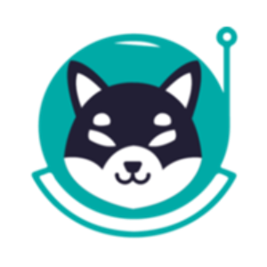 | 51263 | SMI | SafeMoon Inu |
|  | 50271 | HSHIBA | HuskyShiba |
|  | 80031 | SRC | Simracer Coin |
| 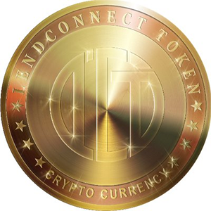 | 78857 | LCT | Local Traders |
| 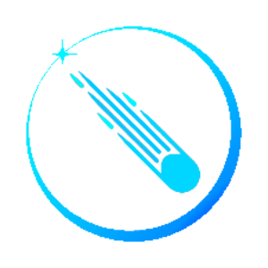 | 94429 | AEVUM | Aevum |
|  | 112547 | $CLIPPY | Clippy AI |
|  | 113475 | LP | Liquid Protocol |
|  | 48751 | WEX | WaultSwap |
|  | 88491 | FLTH | Liberty Square Filth |
|  | 46639 | AXN | Axion |
|  | 49039 | MOMA | Mochi Market |
| 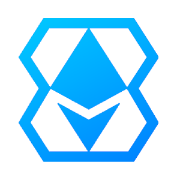 | 68379 | BANKETH | BankEth |
|  | 55069 | XPNET | XP NETWORK |
| 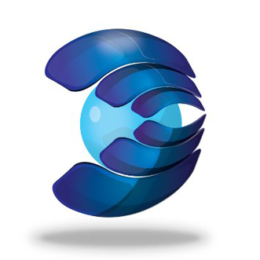 | 86719 | PRL | The Parallel |
|  | 141547 | XMW | Morphware |
|  | 77889 | SKEB | Skeb |
| 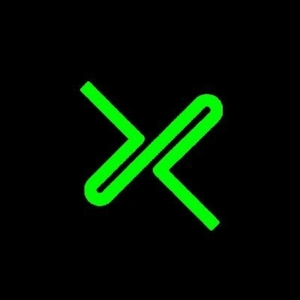 | 47116 | XED | Exeedme |
| 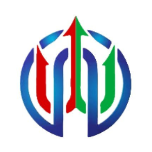 | 96731 | SELLC | Sell Token |
| 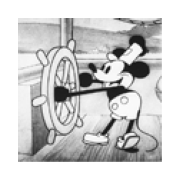 | 122515 | MICKEY | Steamboat Willie |
|  | 51315 | ATYNE | Aerotyne |
| 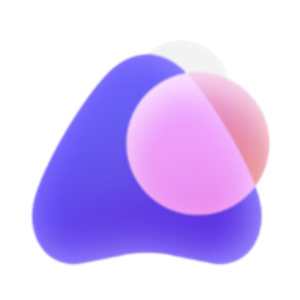 | 69795 | ASTO | Altered State Machine |
| 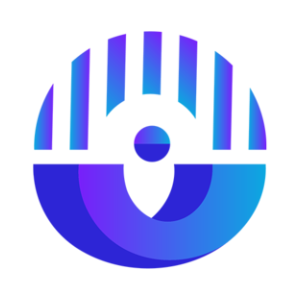 | 70229 | HTO | Heavenland HTO |
|  | 65049 | XTT-B20 | XTblock Token |
| 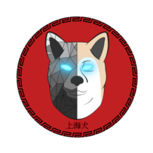 | 94377 | SHANG | Shanghai Inu |
| 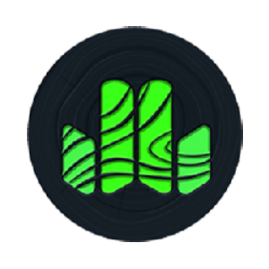 | 115419 | JNGL | Jungle Labz |
| 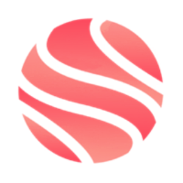 | 54871 | CIRUS | Cirus Foundation |
| 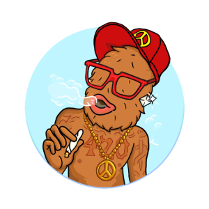 | 131679 | ICELAND | ICE LAND |
| 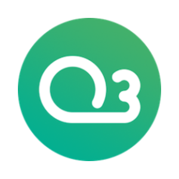 | 49289 | O3 | O3 Swap |
|  | 151263 | VATAN | Vatan |
| 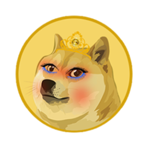 | 54767 | WIFEDOGE | Wifedoge |
|  | 51733 | GABECOIN | Gabecoin |
|  | 111749 | GRUMPYCAT | Grumpy Cat |
|  | 71149 | CHIZ | Sewer Rat Social Club CHIZ Token |
|  | 49383 | ATD | A2DAO |
|  | 56787 | EQ | Equilibrium |
|  | 153277 | FIONA | Fiona |
|  | 65541 | GAJ | Gaj Finance |
|  | 47003 | BAO | Bao Finance |
|  | 53593 | DENA | Decentralized Nations |
| 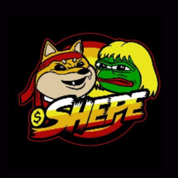 | 113101 | SHEPE | Shiba V Pepe |
|  | 52057 | MOLA | MoonLana |
| 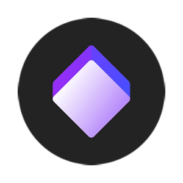 | 56477 | NFTT | NFT Tech |
|  | 69475 | KTE | Kyte.One |
|  | 162313 | XBO | $XBO Token |
|  | 51541 | SAFEBULL | SafeBull |
|  | 51205 | CATGE | Catge Coin |
| 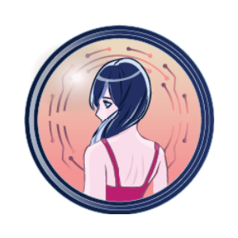 | 99577 | WFAI | WaifuAI |
|  | 63095 | WRLD | NFT Worlds |
| 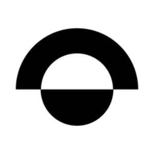 | 88993 | CAI | CryptoAI |
| 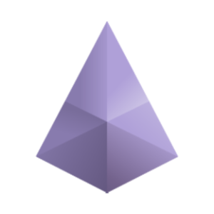 | 85001 | SWISE | StakeWise |
|  | 162261 | MHRD | MacroHard |
| 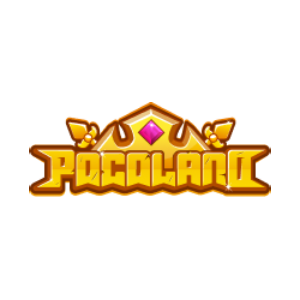 | 54975 | POCO | Pocoland |
|  | 44166 | 2KEY | 2key |
|  | 54089 | CHAINCADE | ChainCade |
|  | 136753 | BABYCATE | BabyCate |
| 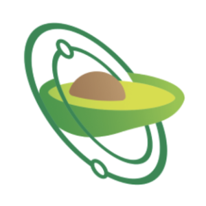 | 64899 | AVG | Avocado DAO |
| 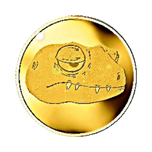 | 122563 | GECKO | Gecko Coin |
|  | 49687 | YOOSHI | YooShi |
| 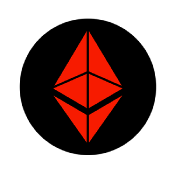 | 50727 | EMAX | EthereumMax |
| 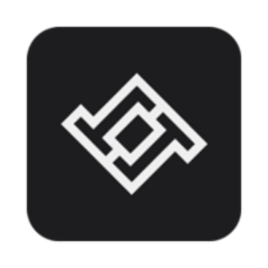 | 50879 | LSS | Lossless |
|  | 64425 | TINC | Tiny Coin |
|  | 80209 | SUZUME | Shita-kiri Suzume |
|  | 57749 | STEMX | STEMX |
|  | 51677 | SHUSKY | Siberian Husky |
| 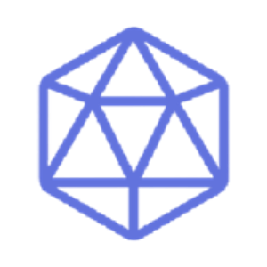 | 68685 | HDRN | Hedron |
| 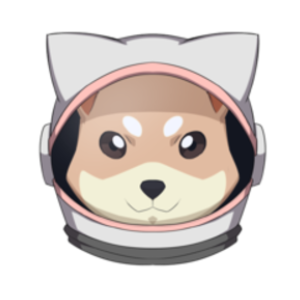 | 49697 | TKINU | Tsuki Inu |
| 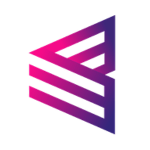 | 45361 | LEAD | Lead Token |
|  | 51921 | BABYBNB | BabyBNB |
|  | 32438 | BERRY | Rentberry |
| 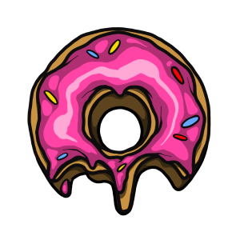 | 49979 | MUNCH | Munch Token |
| 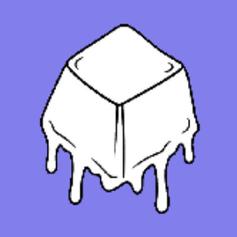 | 128197 | HOTKEY | HotKeySwap |
|  | 49793 | DOGEMOON | Dogemoon |
|  | 162149 | ∑ | ∑ |
|  | 46201 | BOR | BoringDAO |
|  | 122735 | WOJAK2.69 | Wojak 2.69 |
|  | 122603 | PAPER | Dope Wars Paper |
|  | 51121 | ELONONE | AstroElon |
| 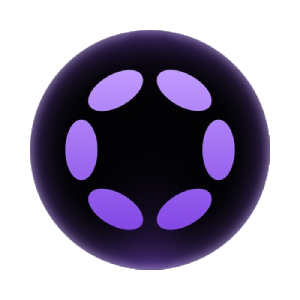 | 65819 | POLLY | Polly Finance |
|  | 45887 | OCTO | OctoFi |
| 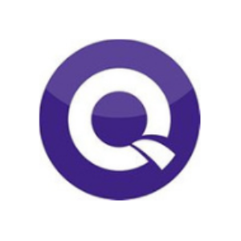 | 51389 | QDX | Quidax |
| 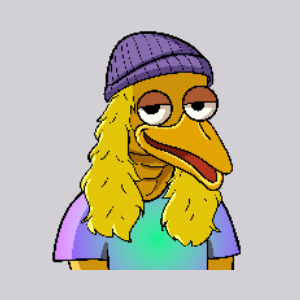 | 131565 | BIRDDOG | Bird Dog |
| 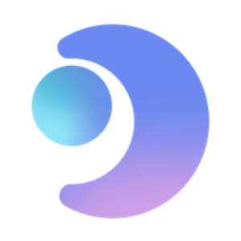 | 80625 | OCAVU | Ocavu Network |
|  | 49711 | SHIBSC | SHIBA BSC |
| 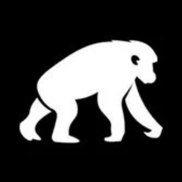 | 125317 | BPT | BlackPool |
|  | 112733 | IDE | Ide.x.ai |
| 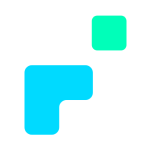 | 67913 | IF | Impossible Finance |
| 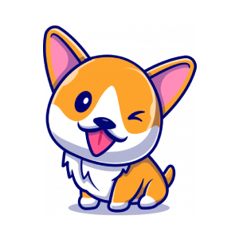 | 51233 | MINIDOGE | MiniDOGE |
|  | 68573 | BANA | Shibana |
|  | 60981 | CINO | Cino Games |
| 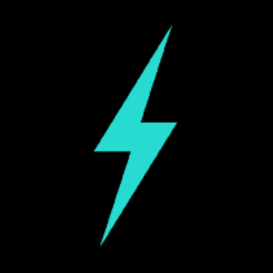 | 121901 | XRUNE | Thorstarter |
|  | 55925 | WFAIR | Wallfair |
|  | 69973 | HAWK | Hawksight |
| 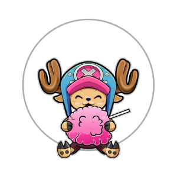 | 56755 | CHOPPER | Chopper Inu |
| 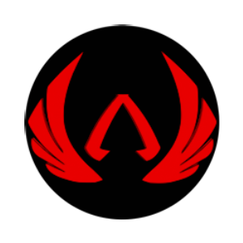 | 57695 | ARCHA | ArchAngel Token |
|  | 32240 | SRN | SIRIN LABS Token |
|  | 125855 | GUY | Family Guy |
|  | 56385 | JEWEL | DeFi Kingdoms |
|  | 58119 | CBUNNY | Crazy Bunny Equity Token |
| 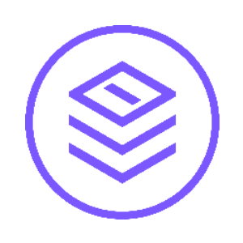 | 111667 | OS | Ethereans |
| 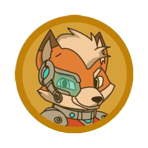 | 127895 | GFOX | Galaxy Fox |
|  | 51725 | KRAKBABY | BabyKraken |
| 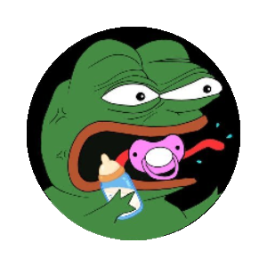 | 96757 | BABYPEPE | BabyPepe |
| 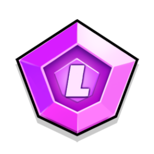 | 60817 | LUS | Luna Rush |
| 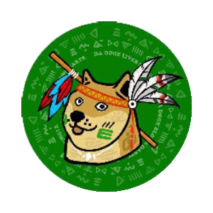 | 67307 | JUNGLE | Jungle |
|  | 51905 | SUSHIBA | Sushiba |
| 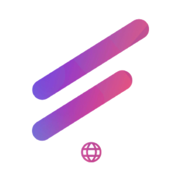 | 58627 | WELT | Fabwelt |
|  | 146601 | AICM | AI Crypto Marketplace |
|  | 112869 | WIGGER | Wigger |
| 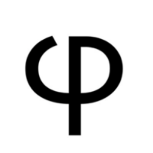 | 47182 | GRPL | GRPL Finance |
|  | 59979 | EPS | Ellipsis |
| 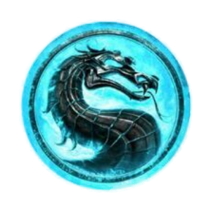 | 96669 | DRAGONKING | DragonKing |
| 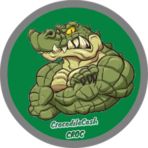 | 100245 | CROC | CrocBot |
| 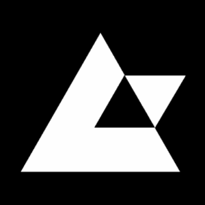 | 32467 | AUC | Auctus |
|  | 46191 | YAX | yAxis |
| 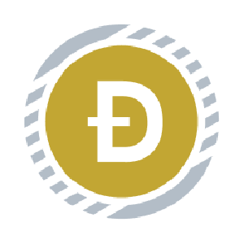 | 47583 | RENDOGE | renDOGE |
|  | 128145 | WASD | WASD Studios |
| 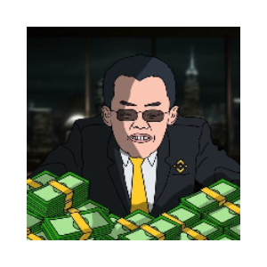 | 126559 | CZ | Changpeng Zhao |
|  | 78047 | 3AIR | 3air |
|  | 93915 | GRAI | Grai |
|  | 42411 | ARCONA | Arcona |
|  | 46993 | XVIX | XVIX |
|  | 113763 | REDDIT | Reddit |
|  | 51291 | BABYDOGECASH | Baby Doge Cash |
|  | 50853 | HUNNY | Pancake Hunny |
|  | 52071 | STOPELON | StopElon |
| 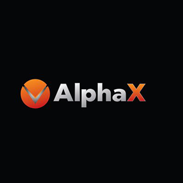 | 121903 | AX | AurusX |
|  | 93855 | DOKE | Doke Inu |
| 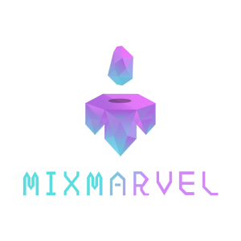 | 36577 | MIX | MixMarvel |
|  | 164625 | DAWAE | DaWae |
|  | 51803 | SHIKO | Shikoku Inu |
|  | 55865 | RBN | Ribbon Finance |
|  | 44495 | PHNX | PhoenixDAO |
|  | 55883 | DIVER | Divergence Protocol |
| 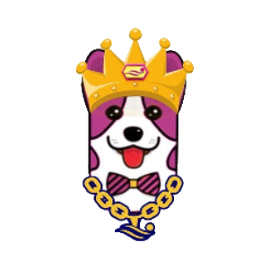 | 50913 | CORGIB | The Corgi of PolkaBridge |
|  | 310 | GB | Goldblocks |
| 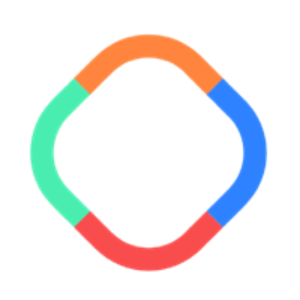 | 65207 | VISION | APY.vision |
|  | 159033 | BIRDEI | Birdei |
|  | 123815 | LAMBO | $LAMBO |
|  | 99213 | PISS | Pisscoin |
|  | 88887 | ADVT | Advantis |
|  | 131897 | SHIBK | ShibaKeanu |
| 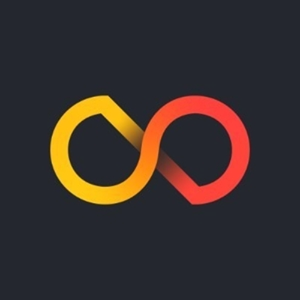 | 47417 | LPOOL | Launchpool |
|  | 147279 | SHIFU | Shifu |
|  | 49495 | YUMMY | Yummy |
| 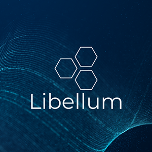 | 134065 | LIB | Librium Tech |
|  | 85959 | IM | Internet Money |
| 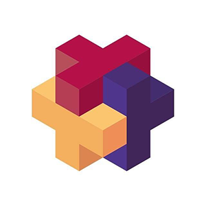 | 44152 | ITAM | ITAM Games |
| 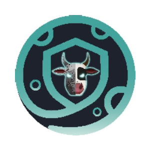 | 113087 | SAFEMOO | SafeMoo |
|  | 77805 | YVE-CRVDAO | veCRV-DAO yVault |
|  | 129149 | SORADOGE | Sora Doge |
| 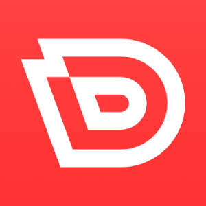 | 150967 | DNOW | DuelNow |
| 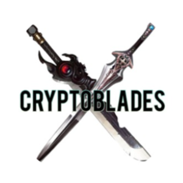 | 63181 | SKILL | CryptoBlades |
| 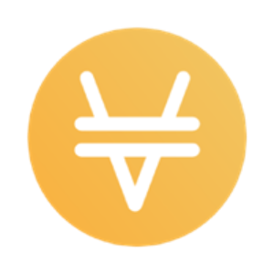 | 50691 | VRT | Venus Reward Token |
|  | 87307 | ITP | Interport Token |
|  | 123027 | FLRBRG | Floor Cheese Burger |
|  | 69853 | EVMOS | Evmos |
| 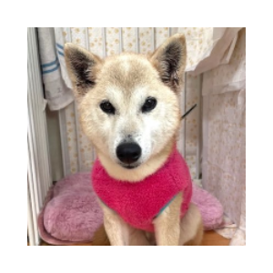 | 161581 | ITO | ITO |
|  | 146831 | ODDS] | OddsNotify |
|  | 63753 | HARE PLUS | Hare Plus |
| 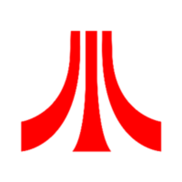 | 46584 | ATRI | Atari |
|  | 48083 | GGTK | GG Token |
|  | 65783 | BABYCAKE | Baby Cake |
| 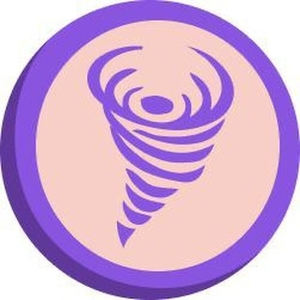 | 65929 | TRDL | Strudel Finance |
|  | 71439 | YDF | Yieldification |
| 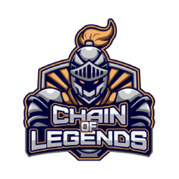 | 71195 | CLEG | Chain of Legends |
|  | 123681 | GROKGIRL | Grok Girl |
| 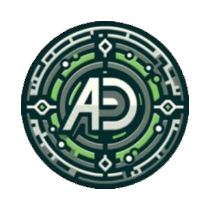 | 136479 | ABDS | ABDS Token |
|  | 136277 | BUFFI | Bufficorn |
|  | 64801 | HI | hi Dollar |
|  | 112279 | COF | Cryptoforce |
|  | 165181 | PEK | Pek |
|  | 42004 | AZ | Azbit |
|  | 50257 | PLUG | PL^Gnet |
|  | 115229 | LYUM | Layerium |
|  | 64713 | YOSHI | Yoshi.exchange |
| 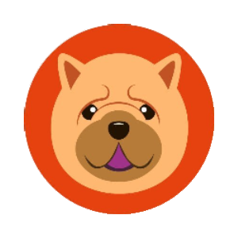 | 55945 | LUCHOW | LunaChow |
| 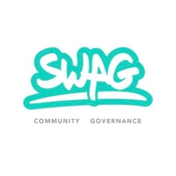 | 65251 | SWAG | SWAG Finance |
|  | 66961 | SEA | StarSharks SEA |
|  | 50241 | PSWAP | PorkSwap |
|  | 50649 | SHEESHA | Sheesha Finance |
| 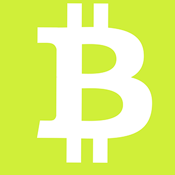 | 42190 | BSOV | BitcoinSoV |
|  | 123395 | MOLLY | Molly |
|  | 69693 | PRIMATE | Primate |
| 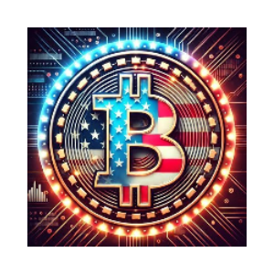 | 141903 | BTCACT | BITCOIN Act |
|  | 52125 | GHOSTFACE | Ghostface |
| 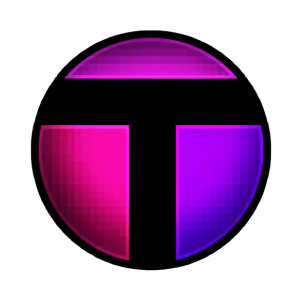 | 68673 | TINY | Tiny Colony |
| 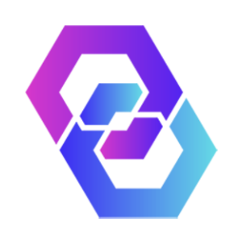 | 55903 | BNPL | BNPL Pay |
| 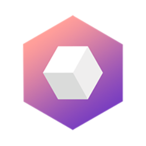 | 44415 | LYXE | LUKSO Token |
| 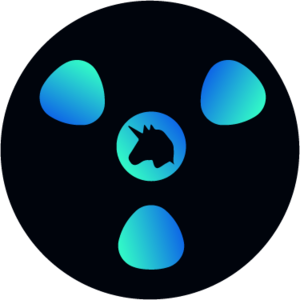 | 46281 | UNISTAKE | Unistake |
|  | 71419 | XPRO | XPROJECT |
| 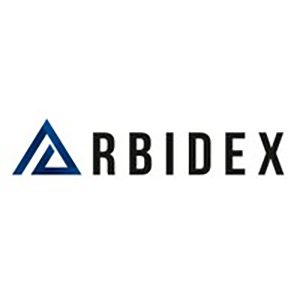 | 33097 | ABX | Arbidex |
| 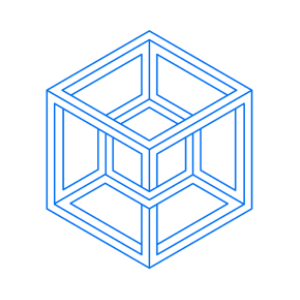 | 50223 | MOAR | Moar Finance |
|  | 59563 | GZLR | Guzzler |
| 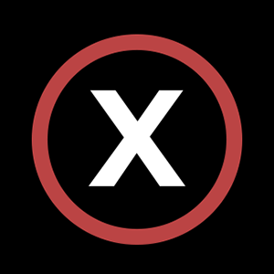 | 42722 | XIO | XIO |
|  | 113397 | FROG CEO | FROG CEO |
|  | 141659 | $MICRO | Micro GPT |
|  | 55207 | SOKU | SokuSwap |
|  | 60887 | BLI | Bali Token |
|  | 49595 | REVT | Revolt |
|  | 62 | XCP | Counterparty |
|  | 58509 | FOXGIRL | FoxGirl |
|  | 58997 | KUJI | Kujira |
|  | 46631 | DTUBE | Dtube Coin |
| 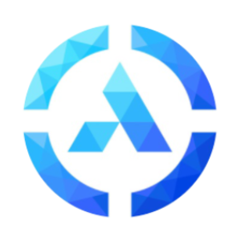 | 50873 | AIRI | aiRight |
|  | 42445 | EBSP | EBSP Token |
| 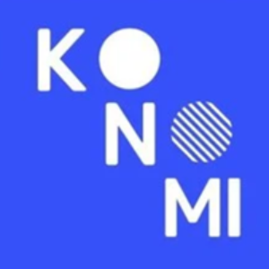 | 48333 | KONO | Konomi Network |
| 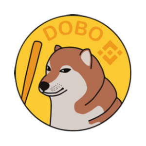 | 56569 | DOBO | Dogebonk |
|  | 71063 | REV3L | REV3AL |
|  | 111451 | $VAULT | VaultTech |
|  | 64829 | YLD | YIELD App |
| 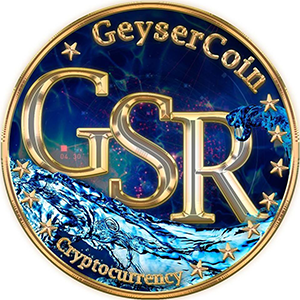 | 3658 | GSR | GeyserCoin |
|  | 121857 | ASTRO | AstroSwap |
|  | 65355 | FLOOF | FLOOF |
| 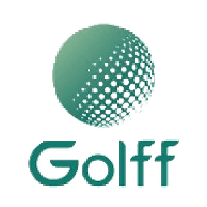 | 45578 | GOF | Golff |
| 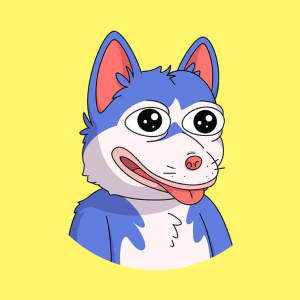 | 143051 | WOLT | Wolt |
|  | 54589 | DARA | Immutable |
|  | 164701 | BBBTC | Big Back Bitcoin |
|  | 49929 | NFTPUNK | NFTPunk.Finance |
|  | 59209 | CPRX | Crypto Perx |
| 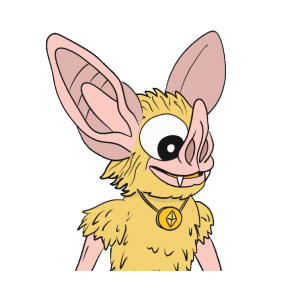 | 131597 | FLAPPY | Flappy |
|  | 42862 | DZAR | Digital Rand |
| 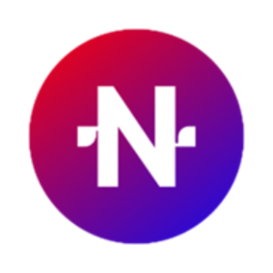 | 49833 | NFTART | NFT Art Finance |
|  | 57501 | ALTB | Altbase |
| 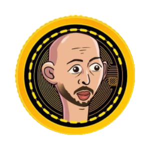 | 123135 | DORK | DORK |
|  | 51011 | LEOPARD | Leopard |
|  | 63297 | JACY | JACY |
| 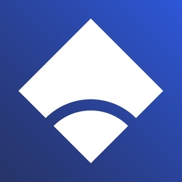 | 2410 | MYB | MyBit Token |
|  | 69503 | ENRX | Enrex |
| 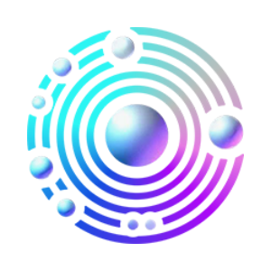 | 142433 | KYRA | KYRA |
|  | 51029 | TRUBGR | TruBadger |
| 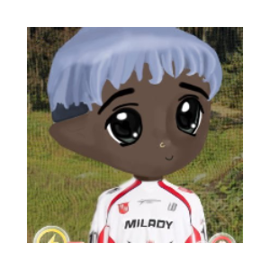 | 96787 | MEMEME | MEMEME |
|  | 56633 | ASIA | Asia Coin |
|  | 56861 | SANTA | Santa Coin |
|  | 96611 | SWITCH | Switch |
|  | 94757 | YUNA | Yuna |
|  | 44042 | STAKE | xDAI Stake |
|  | 99907 | GRP | Grape |
|  | 61281 | FLX | Reflexer Ungovernance Token |
| 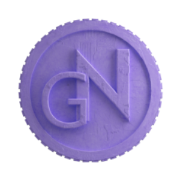 | 65987 | GNFT | GNFT |
|  | 94857 | TATE | TATE |
|  | 51489 | KAREN | KarenCoin |
| 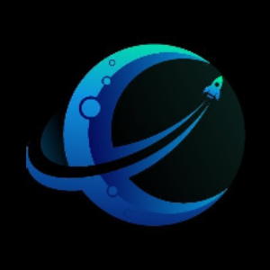 | 99563 | EVERMOON | EverMoon ERC |
| 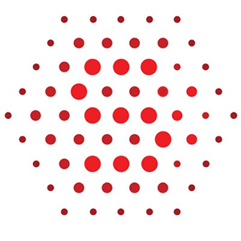 | 32508 | SPD | SPINDLE |
| 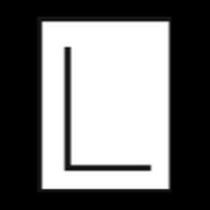 | 133909 | LC | LuckyChip |
|  | 63035 | PANDA | HashPanda |
|  | 94677 | MAZI | MaziMatic |
|  | 78395 | MOPS | Mops |
| 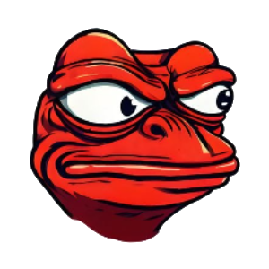 | 131145 | MADPEPE | Mad Pepe |
|  | 136263 | AGX | AGIX |
| 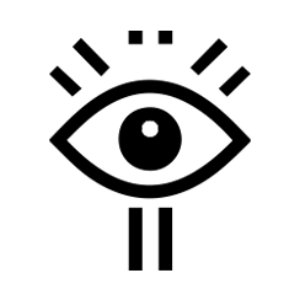 | 127239 | YAI | Ÿ |
| 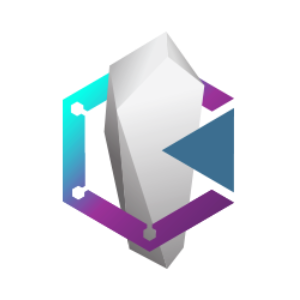 | 69435 | 0NE | Civfund Stone |
|  | 56657 | QUID | Quid Ika |
|  | 126411 | OCP404 | OnChain Pepe 404 |
| 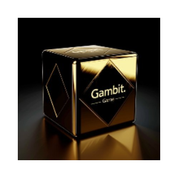 | 128795 | GAMBIT | Gambit |
|  | 67881 | BABYADA | Baby ADA |
| 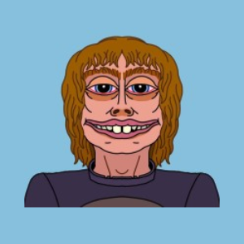 | 135627 | MATT | Matt Furie |
| 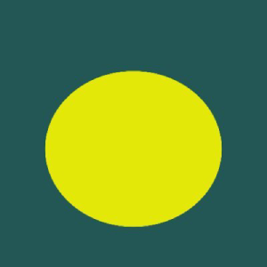 | 127123 | EVERY | Everyworld |
| 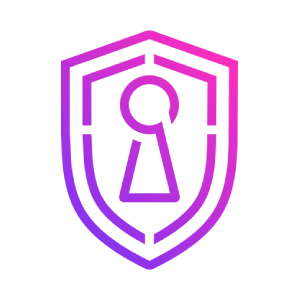 | 77907 | SHA | Safe Haven |
|  | 51923 | BOXER | Boxer Inu |
| 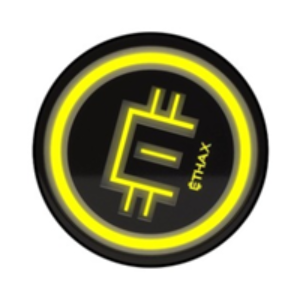 | 70211 | ETHAX | ETHAX |
| 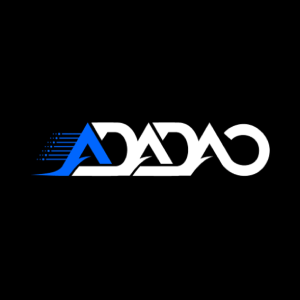 | 80989 | ADAO | ADADao |
|  | 142557 | SMIDGE | Smidge |
| 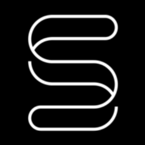 | 48717 | BTCST | BTC Standard Hashrate Token |
|  | 54091 | AINU | Ainu Token |
| 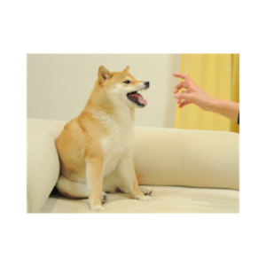 | 60005 | NFD | Feisty Doge NFT |
| 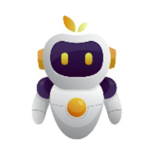 | 132997 | AP | AppleSwap AI |
|  | 45932 | KIRO | Kirobo |
|  | 55513 | RIN | Aldrin |
|  | 113145 | ADULT | Adult Playground |
| 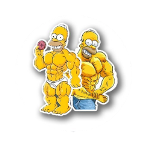 | 97191 | SIMPSON | Homer |
| 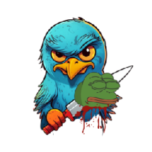 | 99527 | DEDE | Dede |
| 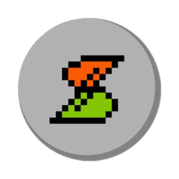 | 115619 | BSSB | BitStable |
| 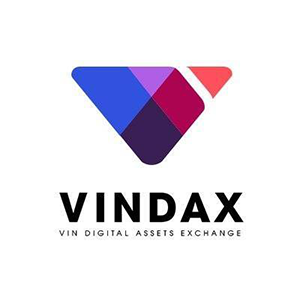 | 34723 | VD | Bitcoin Card |
| 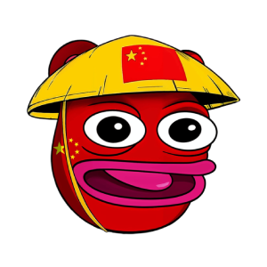 | 131591 | BULEI | Bulei |
| 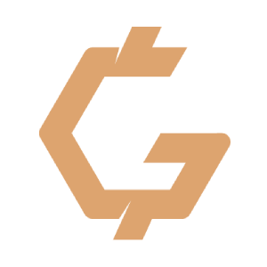 | 49639 | GOL | GogolCoin |
| 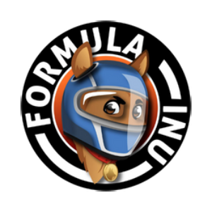 | 123299 | FINU | Formula Inu |
| 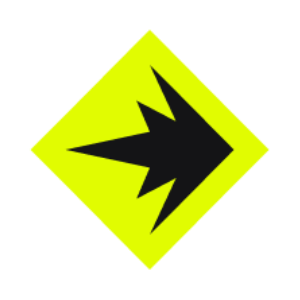 | 122605 | KAP | KAP Games |
| 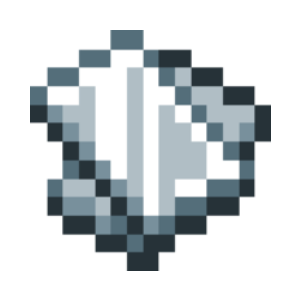 | 65703 | SCRAP | Scrap |
| 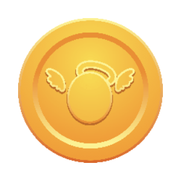 | 65295 | GRAPE | Grape Protocol |
|  | 65699 | COSMIC | CosmicSwap |
|  | 133111 | FLAG | Flag Network |
|  | 56849 | 1ART | ArtWallet |
| 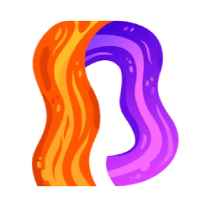 | 45357 | BACON | BaconSwap |
|  | 85021 | FER | Ferro |
| 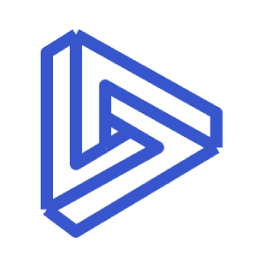 | 47643 | DERI | Deri Protocol |
|  | 136175 | MONOPOLY | Meta Monopoly |
|  | 80431 | $INR | Inery |
|  | 60181 | AQUAGOAT | Aqua Goat |
| 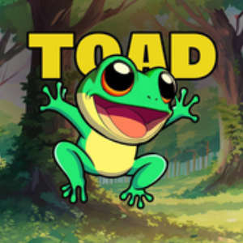 | 89027 | TOAD | LuckyToad |
| 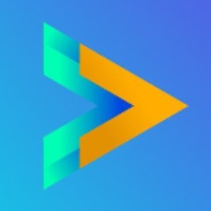 | 61295 | VERVE | Verve |
|  | 77929 | MOD | Modefi |
| 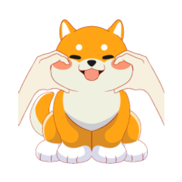 | 54275 | BABYSHIBAINU | Baby Shiba Inu |
|  | 67365 | PYD | PolyQuity Dollar |
|  | 53675 | BCMC1 | BeforeCoinMarketCap |
|  | 45071 | PRQ | PARSIQ |
|  | 68963 | BRICKS | MyBricks |
| 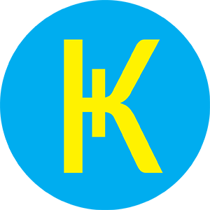 | 1721 | KRB | Karbo |
|  | 113291 | TOONS | City Boys |
|  | 144525 | $TOMO | Tomo Cat |
| 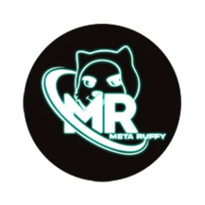 | 63569 | MR | Meta Ruffy |
|  | 126329 | XALPHA | XALPHA.AI |
|  | 52101 | BABYDOGE | Save Baby Doge |
|  | 94711 | MURATIAI | MuratiAI |
| 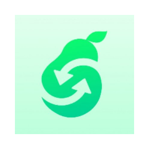 | 65641 | PEAR | Pear |
| 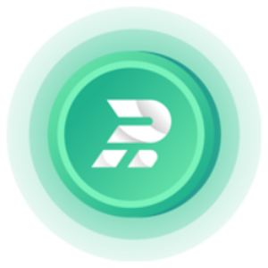 | 58603 | REFLECTO | Reflecto |
| 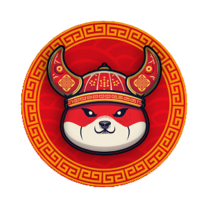 | 132751 | FLOCHI | Flochi |
| 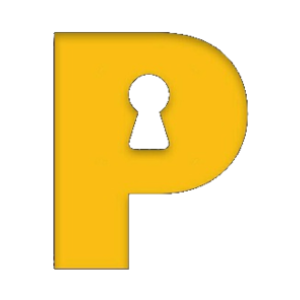 | 49911 | BPRIVA | Privapp Network |
|  | 71391 | ANARCHY | Anarchy |
| 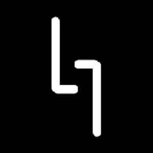 | 111519 | LILA | LiquidLayer |
| 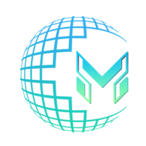 | 59717 | METAV | MetaVPad |
| 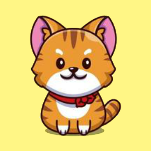 | 95549 | BABYKITTY | BabyKitty |
| 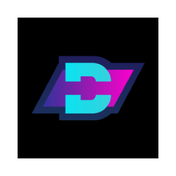 | 59953 | DEVT | DeHorizon |
|  | 64301 | NIOB | NIOB |
|  | 2976 | LA | LAToken |
|  | 67475 | CHEERS | CheersLand |
| 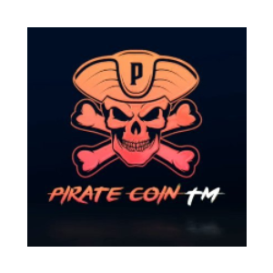 | 63065 | PIRATECOIN | PirateCoin |
|  | 127833 | DONGO | Dongo AI |
| 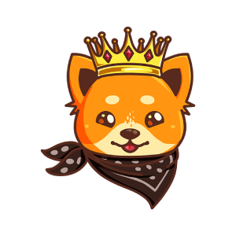 | 51271 | KDOGE | KingDoge |
|  | 56273 | WJXN | Jax.Network |
| 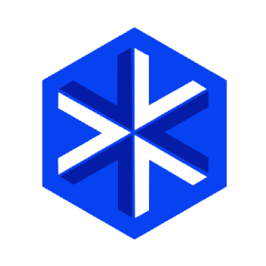 | 47421 | ROOM | OptionRoom |
|  | 51543 | SHIBACASH | ShibaCash |
|  | 55265 | PROGE | Protector Roge |
|  | 56807 | HUDI | Hudi |
|  | 61241 | METAMUSK | Musk Metaverse |
| 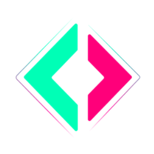 | 133929 | LSC | Last Survivor |
|  | 50049 | SAFERMOON | SAFERMOON |
|  | 58353 | ZADA | Zada |
| 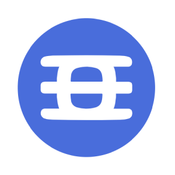 | 53627 | EFI | Efinity Token |
| 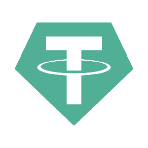 | 64709 | EURT | Euro Tether |
|  | 95029 | ESCO | Esco Coin |
| 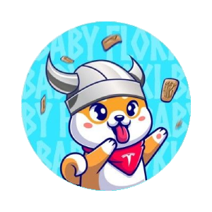 | 68895 | BABYFLOKI | Baby Floki |
| 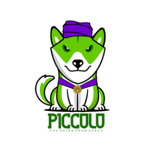 | 57453 | PINU | Piccolo Inu |
| 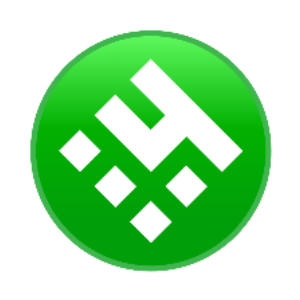 | 96527 | 4TOKEN | Ignore Fud |
|  | 50493 | GAZE | GazeTV |
| 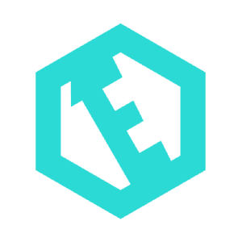 | 61207 | ERTHA | Ertha |
|  | 51535 | PINKPANDA | Pink Panda |
| 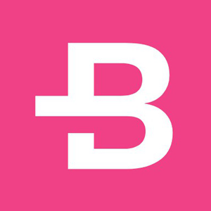 | 2694 | BCN | Bytecoin |
| 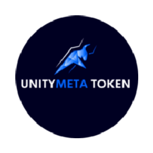 | 100397 | UMT | UnityMeta Token |
| 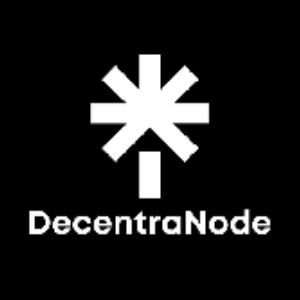 | 128543 | DNODE | DecentraNode |
|  | 147301 | HXAI | Healix AI |
|  | 47014 | WG0 | Wrapped Gen-0 CryptoKitties |
|  | 70331 | GOLDY | DeFi Land Gold |
|  | 51155 | POLYBUNNY | Pancake Bunny Polygon |
|  | 61991 | DFSM | DFS MAFIA |
|  | 51615 | GREATAPE | Great Ape |
|  | 50125 | BLOSM | BlossomCoin |
|  | 45522 | TXL | Tixl [NEW] |
| 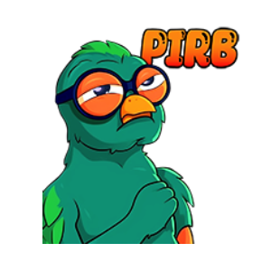 | 111773 | PIRB | PIRB |
| 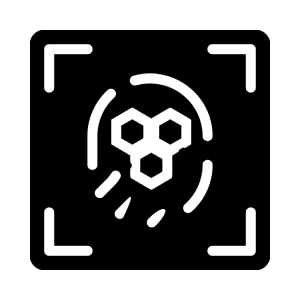 | 44844 | LOCK | Meridian Network |
|  | 100303 | NAVYSEAL | Navy seal |
| 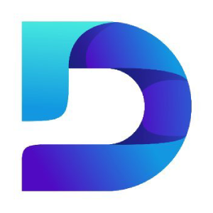 | 56903 | CAVE | Crypto Cavemen |
| 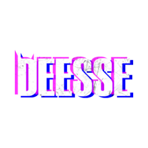 | 65191 | LOVE | UkraineDAO Flag NFT |
|  | 113665 | PEPEG | Pepe Girl |
| 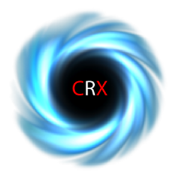 | 131411 | CRX | CryptEx |
|  | 112819 | USDEBT | USDEBT |
| 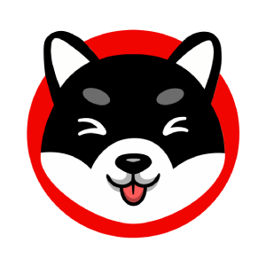 | 55691 | MINISHIB | miniSHIB Token |
|  | 79211 | PRP | Perpetuum Coin |
| 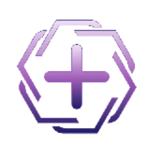 | 127361 | GPTPLUS | GPTPlus |
| 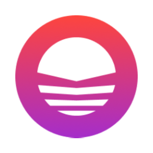 | 46986 | PPAY | Plasma Finance |
|  | 128819 | OPX | Optimus X |
|  | 64945 | APW | APWine |
|  | 1810 | GAP | Gapcoin |
|  | 60295 | CHICKS | SolChicks Token |
|  | 66515 | TKNFY | Tokenfy |
| 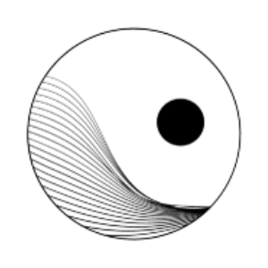 | 49493 | GS | Genesis Shards |
|  | 49375 | STARS | Mogul Productions |
|  | 86073 | PINA | Meme Dollar |
| 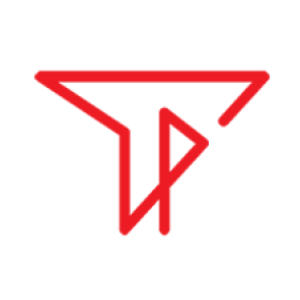 | 50837 | TRONPAD | TRONPAD |
| 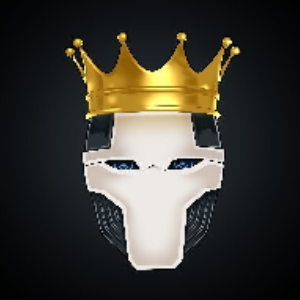 | 133669 | KINGGROK | King Grok |
|  | 85637 | HKBY | Huckleberry Inu |
| 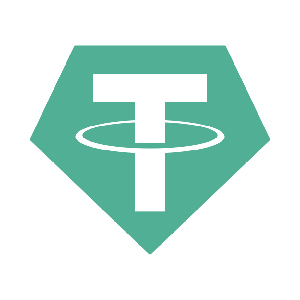 | 70801 | MXNT | Mexican Peso Tether |
| 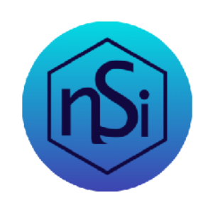 | 57319 | NSI | nSights |
|  | 49467 | $SSHIBA | Super Shiba |
| 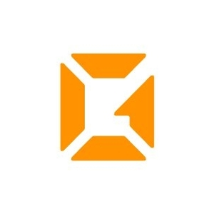 | 112635 | GBE | Gambex |
|  | 6 | RDD | ReddCoin |
| 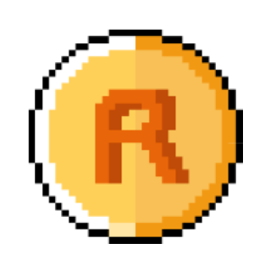 | 50051 | DEGENR | Degenerate Money |
| 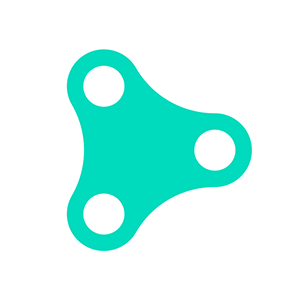 | 79235 | SPIN | Spintop |
|  | 55781 | XAGC | AgroCash X |
| 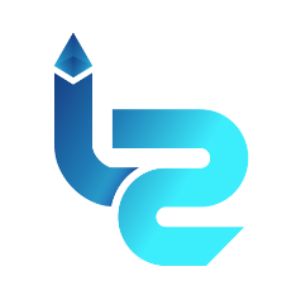 | 93981 | L2DAO | Layer2DAO |
|  | 56591 | STICKY | FlyPaper |
|  | 51553 | HID | Hypersign Identity Token |
|  | 57291 | MONONOKE-INU | Mononoke Inu |
|  | 127081 | GROKCAT | Grok Cat |
|  | 69713 | SBSH | Safe Baby Shiba |
|  | 58211 | PPAD | PlayPad |
| 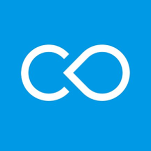 | 95291 | CFI | CyberFi Token |
|  | 51797 | CASHDOG | CashDog |
|  | 78649 | BFHT | BeFaster Holder Token |
| 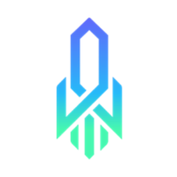 | 61997 | FCON | SpaceFalcon |
|  | 56323 | BLEO | BEP20 LEO |
| 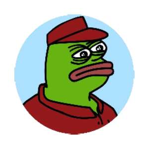 | 87265 | PEPES | McPepe's |
|  | 52039 | BNU | ByteNext |
| 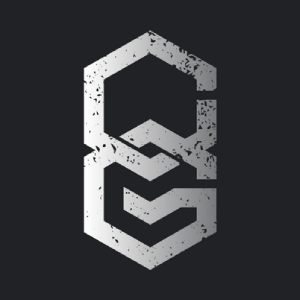 | 48379 | CGG | Chain Guardians |
| 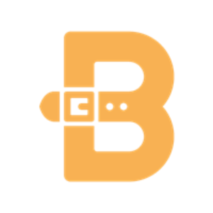 | 48759 | BELT | Belt |
|  | 68631 | ELONGD | Elongate Deluxe |
| 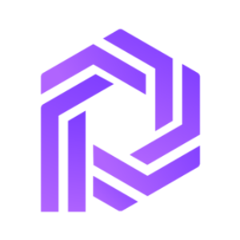 | 65475 | PSOL | Parasol Finance |
| 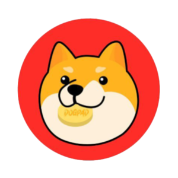 | 85759 | DOGPAD | DogPad Finance |
| 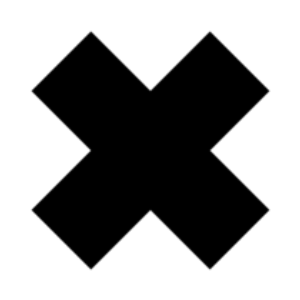 | 41297 | ASH | Ash |
| 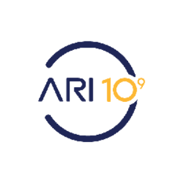 | 58095 | ARI10 | Ari10 |
|  | 56365 | RICKMORTYDOXX | RickMortyDoxx |
|  | 42523 | EXRT | EXRT Network |
|  | 48165 | WOWS | Wolves of Wall Street |
|  | 63515 | POCHI | Pochi Inu |
|  | 89279 | LAB V2 | Little Angry Bunny v2 |
| 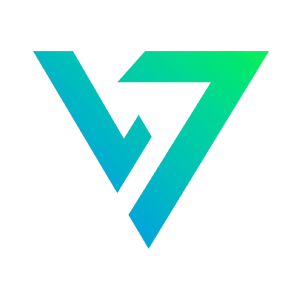 | 128149 | VDZ | Voidz |
| 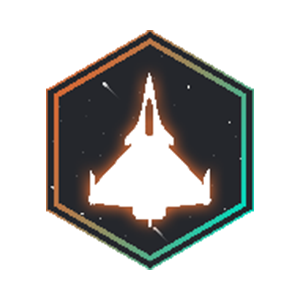 | 65153 | WARS | MetaWars |
|  | 69291 | WTPOKT | Wrapped ThunderPOKT |
| 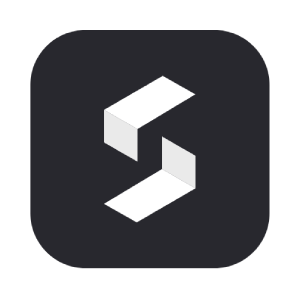 | 66983 | WSIENNA | Sienna [ERC-20] |
|  | 111779 | RISITA | Risitas |
|  | 123195 | LINKFI | LinkFi |
| 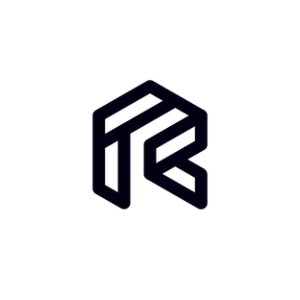 | 48739 | FINE | Refinable |
| 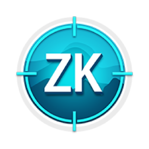 | 65151 | ZUKI | Zuki Moba |
| 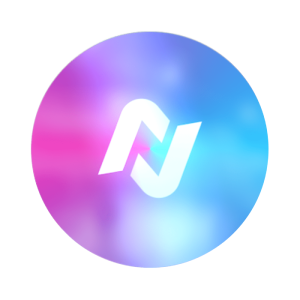 | 46196 | NSURE | Nsure Network |
|  | 55193 | SAUNA | SaunaFinance Token |
| 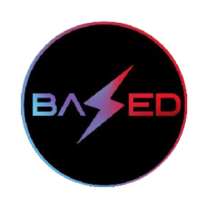 | 111545 | BAZED | Bazed Games |
|  | 59155 | TKG | Takamaka Green Coin |
|  | 123965 | FOOX | Foox |
|  | 54161 | KABY | Kaby Arena |
|  | 112383 | ALTD | Altitude |
|  | 68767 | SEACHAIN | SeaChain |
|  | 45455 | DOGEFI | DogeFi |
| 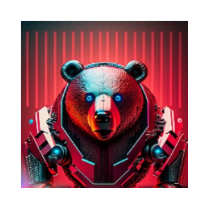 | 127339 | BAI | Balance AI |
| 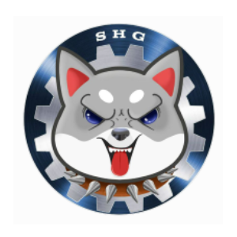 | 63221 | SHG | Shib Generating |
| 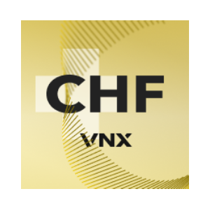 | 90871 | VCHF | VNX Swiss Franc |
|  | 44548 | FRM | Ferrum Network |
|  | 47525 | PBR | PolkaBridge |
| 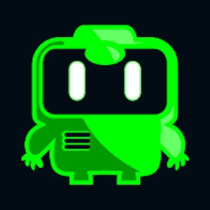 | 112153 | CAKEBOT | CakeBot |
| 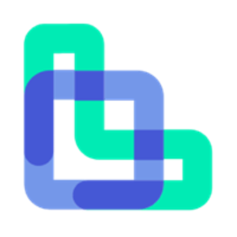 | 77937 | LIFE | Life Crypto |
| 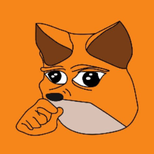 | 94605 | FOXE | FOXE |
|  | 52113 | SAYAN | Saiyan Inu |
| 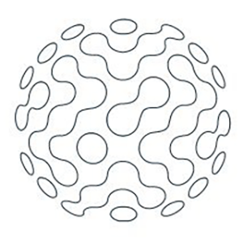 | 133449 | HUB | Minter HUB |
|  | 112659 | HOLE | Hole Guys |
| 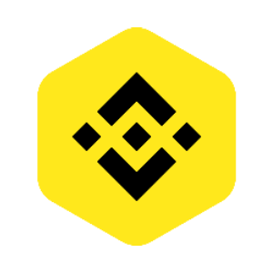 | 82431 | ANKRBNB | Ankr Staked BNB |
| 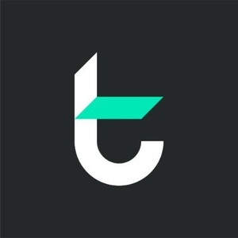 | 46265 | TOMOE | TomoChain ERC-20 |
| 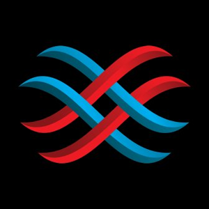 | 66713 | RUBY | Ruby Play Network |
|  | 48809 | MEDIA | Media Network |
|  | 66495 | GXP | Game X Change Potion |
|  | 50775 | VIAGRA | Viagra Token |
|  | 44700 | BZRX | bZx Protocol |
| 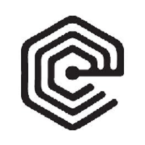 | 115511 | ELMT | Element |
|  | 56909 | FOLO | Follow Token |
| 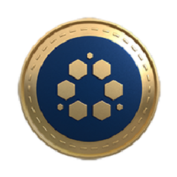 | 56955 | ADACASH | ADAcash |
|  | 66233 | MBIRD | Moonbird |
|  | 51273 | MKAT | MoonKat Finance |
|  | 57105 | SHKOOBY | SHKOOBY INU |
|  | 63639 | DOGE-1 | Doge-1 Mission to the moon |
|  | 33050 | FNTB | Fintab |
|  | 79067 | LVM | LakeViewMeta |
| 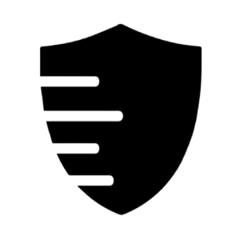 | 46578 | COVER | COVER Protocol |
| 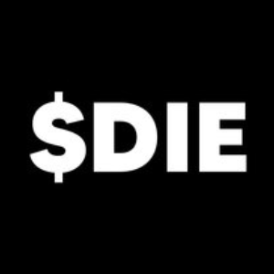 | 78477 | DIE | Die Protocol |
| 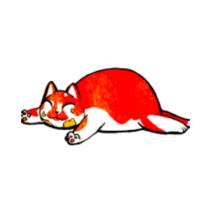 | 65523 | CHONK | Chonk |
| 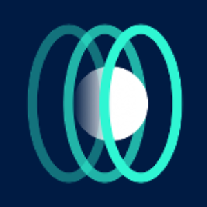 | 77857 | PORTX | ChainPort |
| 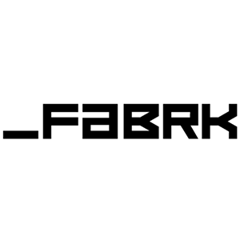 | 78345 | FAB | Fabric |
| 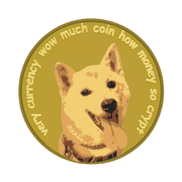 | 54639 | DOGE2 | Dogecoin 2.0 |
| 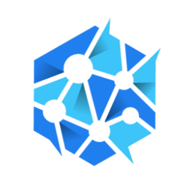 | 43086 | BPLC | BlackPearl Token |
| 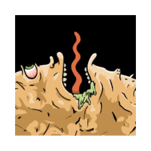 | 137001 | LICKER | LICKER |
| 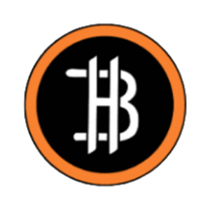 | 46230 | BHC | BillionHappiness |
| 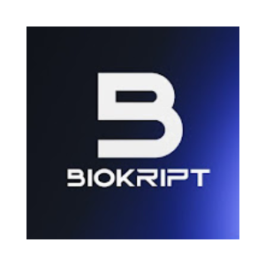 | 100215 | BKPT | Biokript |
|  | 69955 | PLD | Plutonian DAO |
|  | 113869 | ORDIBOT | OrdiBot |
|  | 51491 | KAWAII | kawaiINU |
| 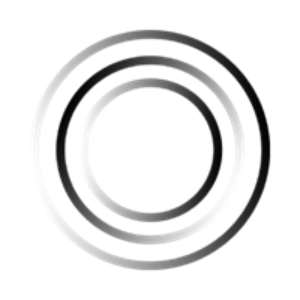 | 46225 | RGT | Rari Governance Token |
| 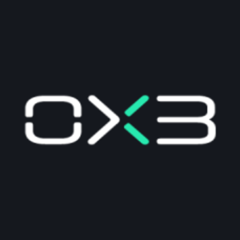 | 48081 | OXB | Oxbull Tech |
|  | 71085 | STIMA | STIMA |
|  | 51387 | CRAZYTIME | CrazyTime |
|  | 77995 | CRAMER | Cramer Coin |
|  | 65573 | OCP | Omni Consumer Protocol |
|  | 169561 | LLYX | Eli Lilly xStock |
| 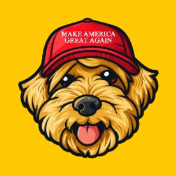 | 131015 | PATTON | Patton |
|  | 63183 | RVC | Revenue Coin |
|  | 55229 | IPAD | Infinity Pad |
| 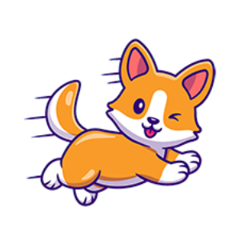 | 67121 | HINA | Hina Inu |
|  | 47435 | BMXX | Multiplier (BSC) |
| 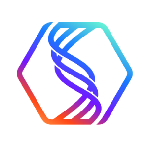 | 66839 | SCY | Synchrony |
|  | 85567 | SHARK | Baby Shark |
| 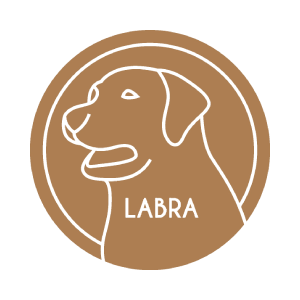 | 66533 | LABRA | LabraCoin |
|  | 85037 | $RAINI | Raini |
| 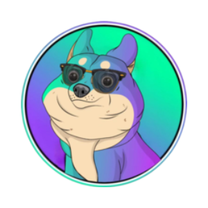 | 47691 | DOGY | DogeYield |
| 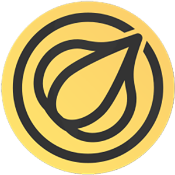 | 32570 | GRLC | Garlicoin |
|  | 52123 | TREES | Safetrees |
|  | 48837 | TIDAL | Tidal Finance |
| 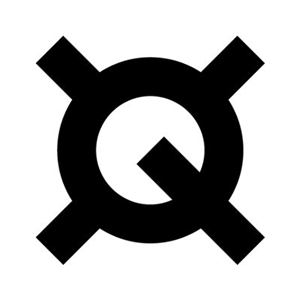 | 12307 | QSP | Quantstamp |
| 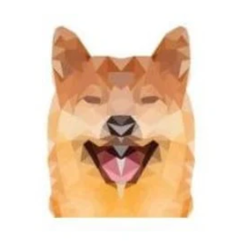 | 66835 | DUKE | Duke Inu Token |
|  | 122213 | LENDS | Lends |
| 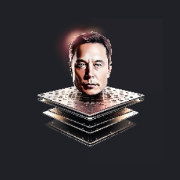 | 51655 | DOJO | DOJO |
| 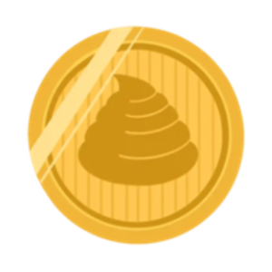 | 70069 | SHIT | ShitCoin |
|  | 61637 | ISKY | Infinity Skies |
| 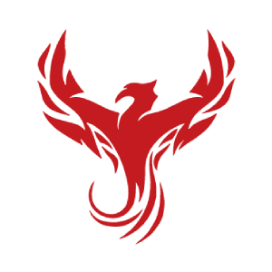 | 59543 | IMPACTXP | ImpactXP |
| 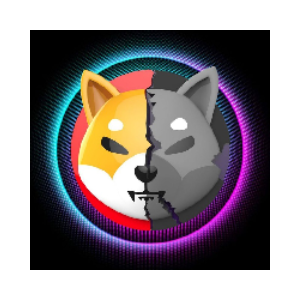 | 67317 | SHIBKILLER | ShibKiller |
| 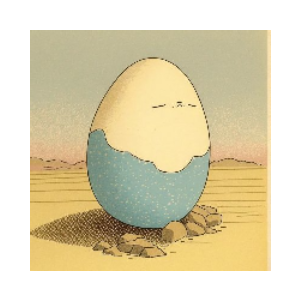 | 96487 | AEGGS | aEGGS |
|  | 49473 | BBANK | BlockBank |
|  | 63313 | JPEGS | IlliquidDAO |
|  | 98889 | CGV | Cogito Protocol |

---

[← Prev](./list3.md) | [Next →](./list5.md)
