[← Prev](./list4.md) | [Next →](./list6.md)

| Logo | ID | Symbol | Name |
|:----:|:--:|:------:|:-----|
|  | 4328 | ECN | E-Coin |
|  | 4329 | CNT | Centurion |
|  | 4330 | ARGUS | ArgusCoin |
|  | 4331 | LMC | LomoCoin |
|  | 4332 | BTCS | Bitcoin Scrypt |
|  | 4333 | PROC | ProCurrency |
|  | 4335 | XGR | GoldReserve |
|  | 4336 | BENJIROLLS | BenjiRolls |
|  | 4337 | DUO | ParallelCoin |
| 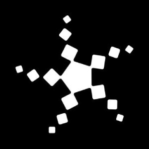 | 4338 | BCAP | Blockchain Capital |
|  | 4339 | RIPTO | RiptoBuX |
|  | 4340 | GRW | GrowthCoin |
|  | 4341 | MILOCOIN | MiloCoin |
|  | 4342 | MRT | MinersReward |
|  | 4343 | OLV | OldV |
|  | 4344 | IOU | IOU1 |
| 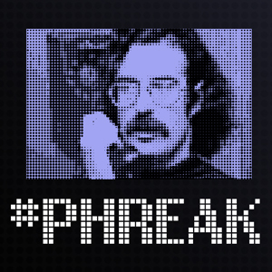 | 4345 | PHR | Phreak |
|  | 4346 | PUPA | PupaCoin |
|  | 4347 | RICECOIN | RiceCoin |
|  | 4348 | XCT | C-Bits |
|  | 4349 | DEA | Degas Coin |
|  | 4350 | ZSE | ZSEcoin |
| 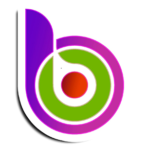 | 4351 | BITOK | BitOKX |
|  | 4352 | CTIC | Coinmatic |
|  | 4353 | TAPPINGCOIN | TappingCoin |
| 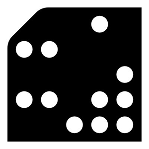 | 4354 | PBT | Primalbase |
|  | 4355 | MUU | MilkCoin |
|  | 4356 | INF | Infinium |
|  | 4357 | HTML5 | HTML5 Coin |
|  | 4358 | ETHEROLL | Etheroll |
|  | 4360 | USC | Ultimate Secure Cash |
|  | 4361 | DUX | DuxCoin |
|  | 4362 | XPS | PoisonIvyCoin |
|  | 4363 | INSN | Insane Coin |
|  | 4364 | EQT | EquiTrader |
|  | 4365 | MNTC | Manet Coin |
|  | 4366 | HAMS | HamsterCoin |
|  | 4367 | F16 | F16Coin |
|  | 4368 | NEF | NefariousCoin |
| 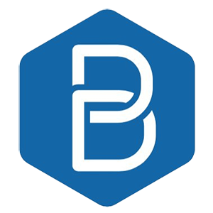 | 4369 | BOS | BOScoin |
|  | 4370 | QWARK | Qwark |
|  | 4371 | ADL | Adelphoi |
|  | 4373 | ZRC | ZrCoin |
|  | 4375 | ESP | Espers |
| 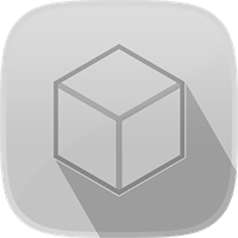 | 4376 | SEQ | Sequence |
|  | 4377 | MCAP | MCAP |
|  | 4378 | CFI | Cofound.it |
| 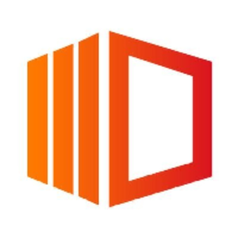 | 4380 | STA | STOA Network |
| 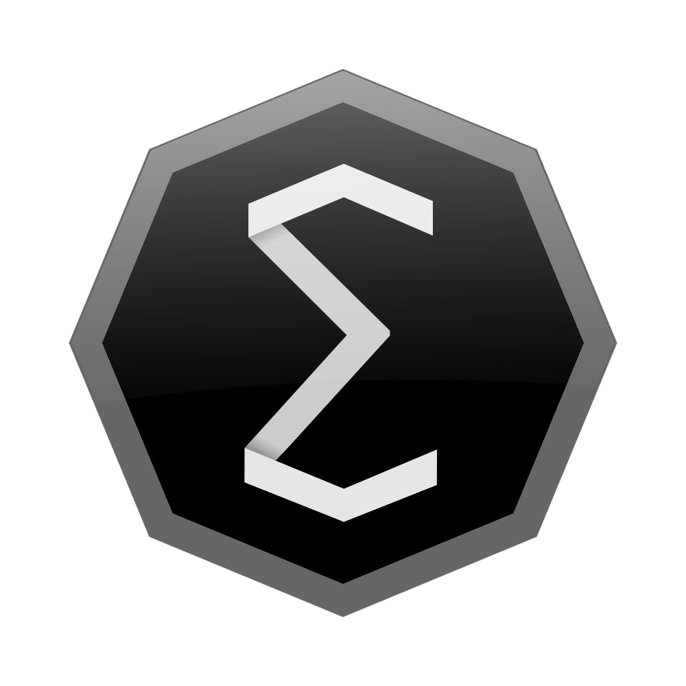 | 4381 | EFYT | Ergo |
|  | 4382 | TFL | True Flip Lottery |
|  | 4383 | ECOB | EcoBit |
|  | 4384 | QAU | Quantum |
|  | 4385 | PLBT | Polybius |
|  | 4387 | AHOO | Ahoolee |
|  | 4388 | ATB | ATB coin |
|  | 4389 | CHAN | ChanCoin |
|  | 4390 | TIX | Blocktix |
|  | 4391 | RVT | Rivetz |
|  | 4392 | HRB | Harbour DAO |
|  | 4394 | 8BT | 8 Circuit Studios |
|  | 4395 | SUR | Suretly |
|  | 4396 | PING | CryptoPing |
|  | 4397 | MIV | MakeItViral |
| 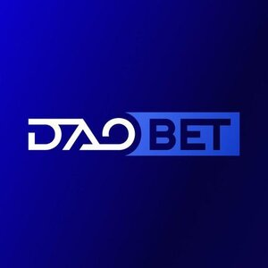 | 4398 | DAOB | DAOBet |
|  | 4399 | XEL | Elastic |
|  | 4400 | WGR | Wagerr |
|  | 4402 | NVST | NVO |
|  | 4403 | FUNC | FunCoin |
|  | 4404 | PQT | PAquarium |
|  | 4405 | WTT | Giga Watt |
| 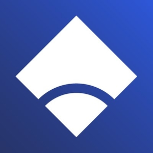 | 4406 | MYB | MyBit |
| 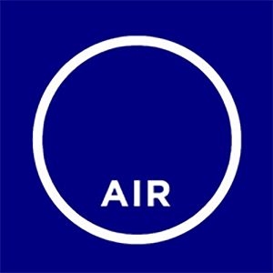 | 4407 | XID | Sphere Air |
| 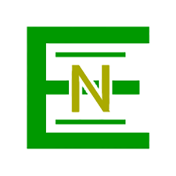 | 4408 | EEC | EnLedger |
|  | 4409 | STARBASE | Starbase |
|  | 4410 | XRL | Rialto.AI |
|  | 4411 | CORION | Corion |
|  | 4412 | MBI | Monster Byte Inc |
|  | 4413 | OROC | Orocrypt |
|  | 4414 | DDF | Digital Developers Fund |
|  | 4415 | GGS | Gilgam |
|  | 4416 | DIM | DIMCOIN |
|  | 4417 | ENCRYPG | EncrypGen |
|  | 4418 | DCY | Dinastycoin |
|  | 4419 | DENARIUS | Denarius |
|  | 4420 | DP | DigitalPrice |
|  | 4421 | CFT | CryptoForecast |
|  | 4422 | VUC | Virta Unique Coin |
|  | 4423 | BTPL | Bitcoin Planet |
|  | 4424 | UNIFY | Unify |
|  | 4425 | IPC | ImperialCoin |
|  | 4426 | BRIT | BritCoin |
|  | 4427 | SOCC | SocialCoin |
|  | 4428 | AMMO | Ammo Rewards |
|  | 4429 | IML | IMMLA |
|  | 4430 | STU | BitJob |
|  | 4431 | GUNS | GeoFunders |
|  | 4432 | IFT | InvestFeed |
|  | 4433 | BCAT | BitClave |
|  | 4434 | SYC | SynchroCoin |
|  | 4436 | IND | Indorse |
|  | 4438 | TRIBETOKEN | TribeToken |
|  | 4439 | TNT | Tierion |
| 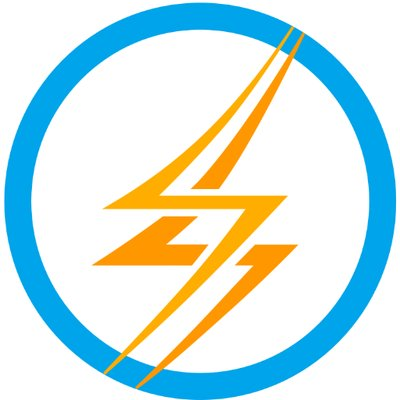 | 4440 | STORM | Storm |
|  | 4441 | UNIKRN | UnikoinGold |
|  | 4442 | NPX | Napoleon X |
|  | 4443 | AIX | Aigang |
| 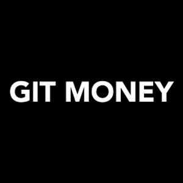 | 4445 | GIT | Git Money |
| 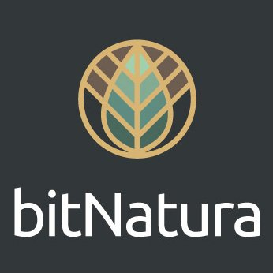 | 4446 | BN | BitNatura |
|  | 4447 | SCORE | Scorecoin |
| 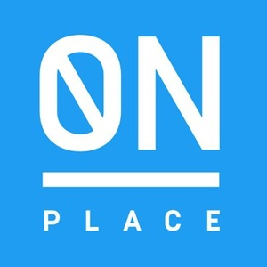 | 4448 | OPL | OnPlace |
|  | 4449 | EQB | Equibit |
|  | 4450 | OTX | Octanox |
|  | 4451 | ETBS | EthBits |
|  | 4452 | CVCOIN | Crypviser |
|  | 4453 | DRP | DCORP |
|  | 4454 | BOGCOIN | Bogcoin |
|  | 4455 | NDC | NeverDie |
|  | 4456 | ADT | AdToken |
|  | 4457 | UET | Useless Ethereum Token |
|  | 4459 | DAS | DAS |
|  | 4460 | XCJ | CoinJob |
|  | 4461 | ROOTS | RootProject |
|  | 4462 | RKC | Royal Kingdom Coin |
|  | 4463 | NLC2 | NoLimitCoin |
| 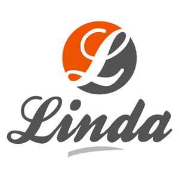 | 4464 | LINDA | Metrix |
|  | 4465 | KING93 | King93 |
|  | 4466 | SPN | Spoon |
|  | 4467 | ANCP | Anacrypt |
|  | 4468 | CABS | CryptoABS |
|  | 4469 | RCC | Reality Clash |
|  | 4470 | SNK | Sosnovkino |
|  | 4471 | ZNT | OpenZen |
|  | 4472 | BITSD | Bits Digit |
|  | 4473 | OPT | Opus |
|  | 4474 | XLC | LeviarCoin |
| 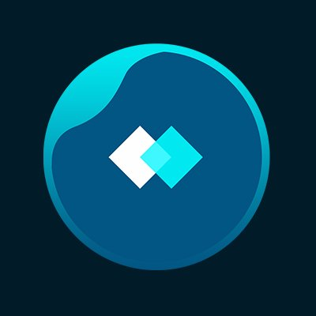 | 4475 | SKIN | Skincoin |
| 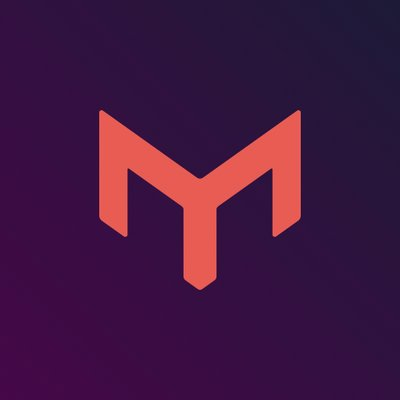 | 4476 | MSP | Mothership |
|  | 4477 | HIRE | HireMatch |
|  | 4479 | REAL | REAL |
|  | 4480 | WLK | Wolk |
|  | 4481 | DFBT | DentalFix |
|  | 4482 | EQ | Equilibrium Games |
|  | 4483 | ONION | DeepOnion |
| 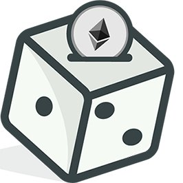 | 4484 | IDICE | iDice |
|  | 4485 | GCN | gCn Coin |
|  | 4486 | ICOO | ICO OpenLedger |
|  | 4487 | TME | Timereum |
|  | 4488 | SIGT | Signatum |
|  | 4489 | ONX | Onix |
|  | 4490 | COE | CoEval |
|  | 4491 | ARENA | Arena |
|  | 4492 | WINK | Wink |
|  | 4493 | DGPT | DigiPulse |
|  | 4494 | CSNO | BitDice |
|  | 4495 | SOLARDAO | Solar DAO |
|  | 4496 | KENCOIN | Kencoin |
|  | 4497 | COREG | Core Group Asset |
|  | 4498 | QVT | Qvolta |
|  | 4499 | AUT | Autoria |
|  | 4500 | TIE | Ties Network |
|  | 4502 | WNET | Wavesnode.net |
| 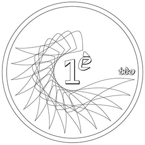 | 4503 | TEIOS | Mill of Blood |
|  | 4504 | ETERNALC | Eternal Coin |
|  | 4505 | ENTRP | Hut34 Project |
|  | 4506 | GRWI | Growers International |
| 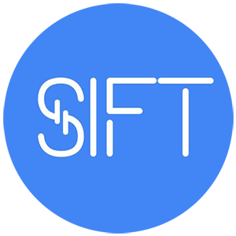 | 4508 | SIFT | Smart Investment Fund Token |
|  | 4509 | CCC | CCCoin |
|  | 4510 | UMC | Umbrella Coin |
|  | 4511 | BMXT | Bitmxittz |
|  | 4512 | OCL | Oceanlab |
|  | 4513 | BENJACOIN | Benjacoin |
|  | 4514 | TOM | Tomahawkcoin |
|  | 4515 | SMNX | SMNX |
|  | 4516 | XAS | Asch |
|  | 4517 | MRV | Macroverse |
|  | 4518 | MBRS | Embers |
| 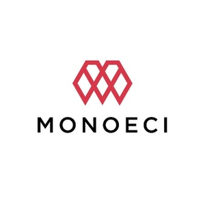 | 4519 | XMCC | Monoeci |
|  | 4520 | PGL | Prospectors |
|  | 4521 | AUTH | Authoreon |
|  | 4523 | PIX | Lampix |
|  | 4524 | LNC | BlockLancer |
|  | 4525 | DTCT | DetectorToken |
|  | 4526 | CENTRA | Centra |
|  | 4527 | PRG | Paragon |
|  | 4528 | CMPCO | CampusCoin |
| 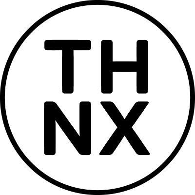 | 4529 | THNX | ThankYou |
|  | 4530 | WORM | HealthyWorm |
|  | 4531 | FUCK | Fuck Token |
|  | 4532 | VRD | Veredictum |
|  | 4533 | IWT | IwToken |
| 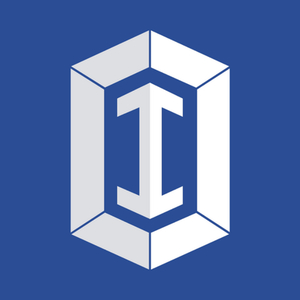 | 4534 | ITT | Intelligent Trading |
|  | 4535 | JDC | JustDatingSite |
| 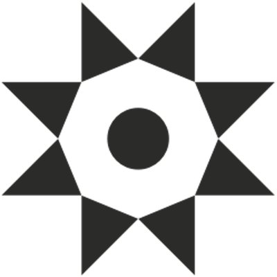 | 4536 | HGT | Hello Gold |
|  | 4537 | MEDI | MediBond |
|  | 4538 | LTA | Litra |
| 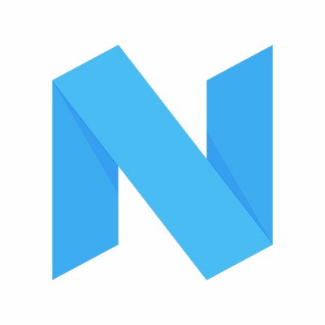 | 4539 | NIMFA | Nimfamoney |
|  | 4540 | KEX | Kira Network |
|  | 4541 | COB | Cobinhood |
|  | 4542 | MLS | CPROP |
| 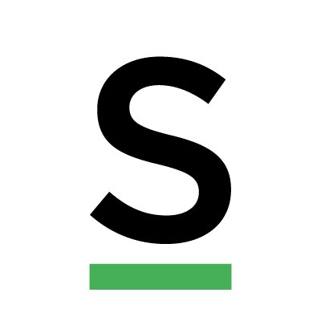 | 4543 | SCOR | Scorista |
|  | 4544 | MINEX | Minex |
|  | 4545 | BITRADIO | Bitradio |
|  | 4548 | DRAFTC | Draftcoin |
|  | 4549 | SOJ | Sojourn Coin |
|  | 4550 | SQP | SqPay |
|  | 4551 | HDG | Hedge Token |
|  | 4552 | STCN | Stakecoin |
|  | 4553 | RIYA | Etheriya |
|  | 4554 | LNK | Ethereum.Link |
|  | 4556 | ALTOCAR | AltoCar |
|  | 4558 | BLX | Blockchain Index |
|  | 4559 | BKX | BANKEX |
|  | 4560 | BOU | Boulle |
| 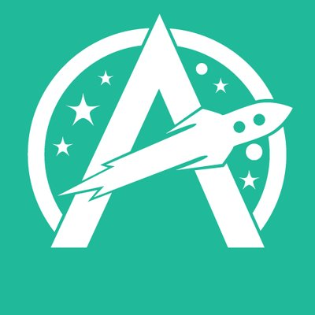 | 4561 | AMT | Acumen |
|  | 4562 | GIM | Gimli |
|  | 4564 | NYC | NewYorkCoin |
|  | 4565 | LITEBTC | LiteBitcoin |
|  | 4566 | FRAZ | FrazCoin |
|  | 4567 | EMT | EasyMine |
|  | 4568 | HBT | Hubii Network |
|  | 4569 | KRONE | Kronecoin |
|  | 4570 | AVALON | Avalon |
| 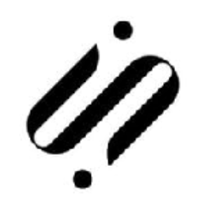 | 4571 | SRT | Smart Reward Toke |
|  | 4572 | BT | BuildTeam |
|  | 4573 | ACC | AdCoin |
|  | 4575 | LINX | Linx |
|  | 4577 | XCXT | CoinonatX |
|  | 4578 | BLAS | BlakeStar |
|  | 4579 | GOOD | GoodCoin |
|  | 4580 | SCL | Sociall |
|  | 4581 | TRVL | TRVL |
| 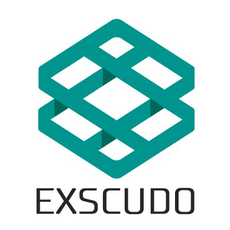 | 4582 | EON | Exscudo |
|  | 4583 | CRTM | Cryptum |
|  | 4584 | PRIX | Privatix |
| 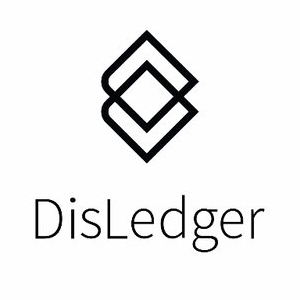 | 4585 | DCL | DisLedger |
| 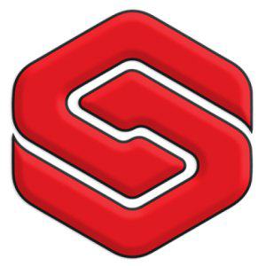 | 4586 | SFX | Soferox |
| 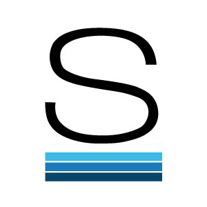 | 4587 | STB | Stable |
| 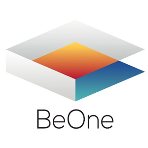 | 4588 | B1 | BeOne |
|  | 4590 | WRC | Worldcore |
|  | 4591 | BRX | Breakout Stake |
|  | 4593 | UCASH | U.CASH |
| 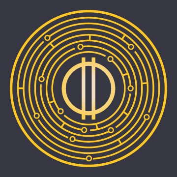 | 4594 | ORME | Ormeus Coin |
|  | 4595 | WRTCOIN | WRTcoin |
|  | 4598 | CRYSTALCLEAR | Crystal Clear Token |
|  | 4599 | ABC | AB-Chain |
|  | 4600 | ARNA | ARNA Panacea |
|  | 4601 | BMC | Blackmoon Crypto |
|  | 4602 | SKRT | Skrilla Token |
|  | 4603 | 3DES | 3DES |
|  | 4604 | PYN | Paycent |
|  | 4605 | KAPU | Kapu |
|  | 4606 | SENSE | Sense Token |
|  | 4607 | FC | Facecoin |
|  | 4608 | EVC | Eventchain |
|  | 4609 | DOCAINEURON | Doc.ai Neuron |
|  | 4610 | WIZ | Crowdwiz |
|  | 4611 | ATKN | A-Token |
|  | 4612 | RUSTBITS | Rustbits |
|  | 4613 | ETHD | Ethereum Dark |
|  | 4614 | SUMO | Sumokoin |
|  | 4615 | 8S | Elite 888 |
|  | 4616 | TKT | Crypto Tickets |
|  | 4617 | ART | Maecenas |
|  | 4618 | RHEA | Rhea |
|  | 4619 | DTT | DreamTeam Token |
|  | 4620 | SNOV | Snovio |
|  | 4621 | MTN | TrackNetToken |
|  | 4622 | STOCKBET | StockBet |
| 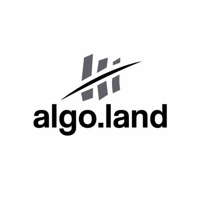 | 4623 | PLM1 | Algo.Land |
|  | 4626 | SND | Sandcoin |
|  | 4627 | EXPERIENCE | Experience Points |
|  | 4628 | HSR | Hshare |
|  | 4629 | GLA | Gladius |
|  | 4630 | ODN | Obsidian |
|  | 4632 | EZM | EZMarket |
|  | 4633 | CLEARPOLL | ClearPoll |
|  | 4634 | MTK | Moya Token |
|  | 4635 | GJC | Global Jobcoin |
|  | 4636 | MAT | MiniApps |
|  | 4637 | WIC | Wi Coin |
|  | 4638 | WAND | WandX |
|  | 4639 | WEB | Webcoin |
|  | 4640 | ELIX | Elixir |
|  | 4641 | EBITCOIN | eBitcoin |
| 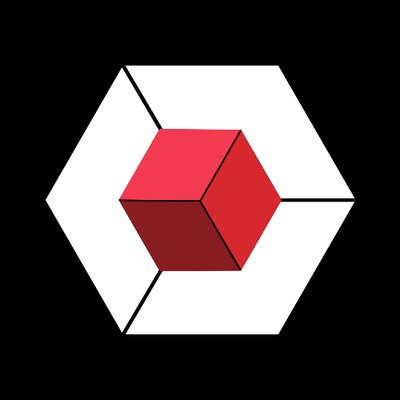 | 4642 | HAC | Hackspace Capital |
|  | 4643 | REC | Regalcoin |
|  | 4644 | OPP | Opporty |
| 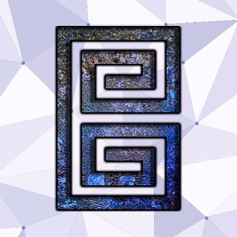 | 4645 | BIS | Bismuth |
|  | 4646 | VSX | Vsync |
|  | 4647 | EARTH | Earth Token |
|  | 4648 | ROCK2 | Ice Rock Mining |
|  | 4649 | WISH | WishFinance |
|  | 4650 | GRFT | Graft Blockchain |
|  | 4651 | PPP | PayPie |
|  | 4652 | CZC | Crazy Coin |
|  | 4653 | CIX | Cryptonetix |
|  | 4654 | GUESS | Peerguess |
|  | 4655 | CANYA | CanYaCoin |
|  | 4656 | ERT | Esports.com |
|  | 4658 | TRIPPKI | Trippki |
|  | 4659 | JVY | Javvy |
|  | 4660 | FLIK | FLiK |
|  | 4661 | MULTIBOT | Multibot |
|  | 4662 | ALIS | ALISmedia |
|  | 4664 | ARBI | Arbi |
|  | 4665 | DAT | Datum |
|  | 4666 | ROK | Rockchain |
|  | 4667 | ARNX | Aeron |
| 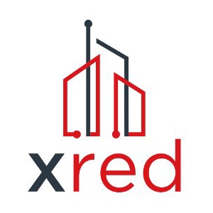 | 4668 | XRED | X Real Estate Development |
|  | 4669 | DAY | Chronologic |
| 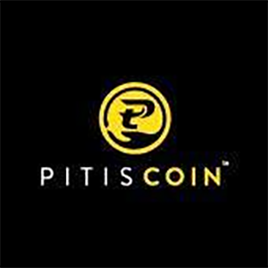 | 4670 | PTS | Pitis Coin |
|  | 4672 | HXT | HextraCoin |
|  | 4673 | TZC | TrezarCoin |
|  | 4674 | NTM | NetM |
|  | 4675 | MCI | Musiconomi |
|  | 4676 | AIRTOKEN | AirToken |
|  | 4677 | ATCC | ATC Coin |
|  | 4678 | KOLION | Kolion |
|  | 4679 | WILDC | Wild Crypto |
|  | 4680 | ELTC2 | eLTC |
|  | 4681 | ILCT | ILCoin Token |
|  | 4682 | RYZ | Anryze |
|  | 4684 | ELM | Elements |
| 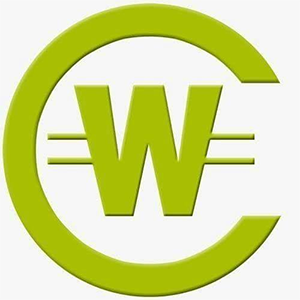 | 4685 | WNC | WesterCoin |
|  | 4686 | TER | TerraNovaCoin |
|  | 4687 | XCS | CybCSec Coin |
|  | 4688 | BQ | Bitqy |
|  | 4689 | CAV | Caviar |
|  | 4690 | CLOUT | Clout |
|  | 4692 | EVR | Everus |
|  | 4693 | TOA | TOA Coin |
|  | 4694 | VIVO | VIVO Coin |
|  | 4696 | AURS | Aureus |
|  | 4697 | CAG | Change |
|  | 4698 | ECHT | e-Chat |
|  | 4699 | RGC | RG Coin |
|  | 4700 | EBET | EthBet |
|  | 4702 | BITCM | Bitcomo |
| 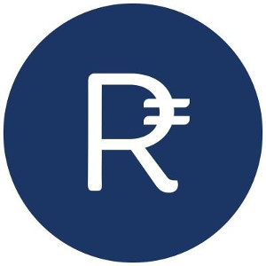 | 4703 | RUP | Rupee |
|  | 4704 | WHL | WhaleCoin |
|  | 4705 | UP | UpToken |
|  | 4706 | WOMEN | WomenCoin |
|  | 4707 | MAY | Theresa May Coin |
|  | 4708 | ETG | Ethereum Gold |
|  | 4709 | EDDIE | Eddie coin |
|  | 4710 | NAMO | NamoCoin |
|  | 4711 | GAT | GATCOIN |
| 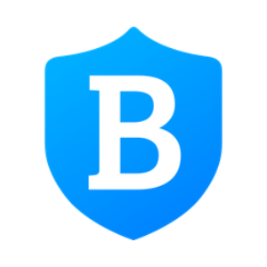 | 4712 | BLUEPROTOCOL | Blue Protocol |
|  | 4713 | WYR | Wyrify |
|  | 4714 | FLLW | Follow Coin |
|  | 4715 | VZT | Vezt |
|  | 4717 | LUXCOIN | LUXCoin |
| 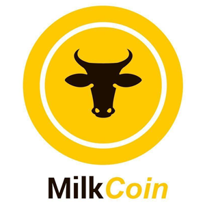 | 4718 | MLCN | MilkCoin |
|  | 4719 | ECASH | Ethereum Cash |
|  | 4720 | PIRL | Pirl |
|  | 4721 | WPR | WePower |
|  | 4722 | ODMC | ODMCoin |
|  | 4723 | BROTHER | BROTHER |
|  | 4725 | TKR | CryptoInsight |
|  | 4726 | ELITE | EthereumLite |
|  | 4727 | XIOS | Xios |
|  | 4728 | DOV | DOVU |
|  | 4729 | REA | Realisto |
|  | 4730 | AVE | Avesta |
|  | 4731 | XNN | Xenon |
|  | 4732 | BTDX | Bitcloud 2.0 |
|  | 4736 | BT2 | Bitcoin SegWit2X |
|  | 4737 | BT1 | Bitfinex Bitcoin Future |
|  | 4738 | JCR | Jincor |
|  | 4740 | EBST | eBoost |
|  | 4741 | KEK | KekCoin |
|  | 4742 | BLHC | BlackholeCoin |
|  | 4743 | AID | AidCoin |
|  | 4744 | ALTCOM | AltCommunity Coin |
|  | 4745 | DTC | Datacoin |
|  | 4746 | UGT | ugChain |
|  | 4747 | OTN | Open Trading Network |
|  | 4748 | POS | PoSToken |
|  | 4749 | NEOG | NEO Gold |
| 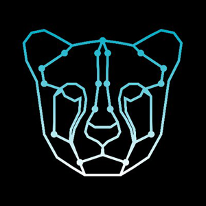 | 4750 | REBL | Rebellious |
|  | 4751 | TRCT | Tracto |
|  | 4752 | UKG | UnikoinGold |
|  | 4753 | XNS | Insolar |
|  | 4754 | BTCRED | Bitcoin Red |
|  | 4755 | CPEX | CoinPulseToken |
|  | 4756 | JTX | Project J |
|  | 4757 | NEU | Neumark |
|  | 4758 | AXT | AIX |
|  | 4759 | RDNN | Raiden Network |
|  | 4760 | BDR | BlueDragon |
|  | 4761 | RUPX | Rupaya |
|  | 4763 | DUTCH | Dutch Coin |
|  | 4764 | TIO | Trade.io |
|  | 4765 | HNCN | Huncoin |
| 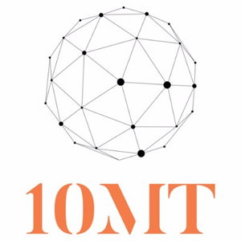 | 4766 | 10MT | 10mtoken |
|  | 4767 | MADC | MadCoin |
|  | 4768 | PURA | Pura |
| 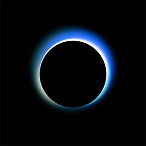 | 4769 | HST | Decision Token |
|  | 4770 | INN | Innova |
|  | 4771 | CMS | COMSA |
|  | 4772 | BDL | Bitdeal |
|  | 4773 | XBL | Billionaire Token |
|  | 4774 | ZEPH | Zephyr Protocol |
|  | 4775 | ATFS | ATFS Project |
|  | 4776 | BTCREV | Bitcoin Revolution |
|  | 4777 | GES | Galaxy eSolutions |
|  | 4778 | PHORE | Phore |
|  | 4779 | LCASH | LitecoinCash |
|  | 4780 | CFD | Confido |
|  | 4781 | SPHTX | SophiaTX |
|  | 4782 | PLC | PlusCoin |
|  | 4783 | WSC | WiserCoin |
|  | 4784 | DBET | Decent.bet |
|  | 4785 | LIFETOKEN | LIFE |
|  | 4786 | XGOX | Go! |
|  | 4787 | NEWB | Newbium |
| 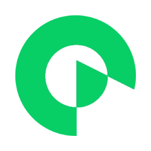 | 4788 | IQT | IQ Protocol |
|  | 4789 | RMC | Russian Mining Coin |
|  | 4790 | CREDO | Credo |
|  | 4791 | MSR | Masari |
|  | 4792 | CJT | ConnectJob Token |
|  | 4794 | EVN | Envion |
|  | 4795 | BPL | BlockPool |
|  | 4796 | ELLA | Ellaism |
|  | 4798 | DRXNE | Droxne |
|  | 4799 | SKR | Sakuracoin |
|  | 4800 | GVT | Genesis Vision |
|  | 4801 | XPTX | PlatinumBAR |
|  | 4802 | ASTRONAUT | Astronaut |
| 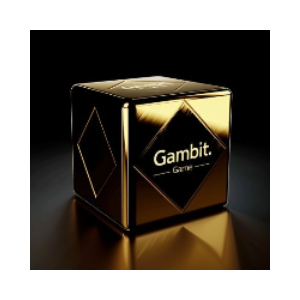 | 4803 | GAMBIT | Gambit |
|  | 4804 | ETK | Energi Token |
|  | 4806 | SOAR | Soarcoin |
|  | 4807 | ISH | Interstellar Holdings |
|  | 4808 | EXY | Experty |
|  | 4809 | MNX | MinexCoin |
|  | 4810 | CRDS | Credits |
|  | 4811 | VIU | Viuly |
|  | 4814 | DUBER | Düber |
|  | 4815 | STAC | STAC |
|  | 4816 | RIPT | RiptideCoin |
|  | 4817 | GBX | GoByte |
|  | 4818 | BITBOOST | BitBoost |
|  | 4819 | CSTL | Castle |
|  | 4821 | ICC | Insta Cash Coin |
|  | 4822 | JNT | Jibrel Network Token |
|  | 4823 | XLQ | Alqo |
|  | 4824 | KNGN | KingN Coin |
|  | 4825 | TRIA | Triaconta |
|  | 4826 | PBL | Publica |
|  | 4827 | MAGNETWORK | Magnet |
|  | 4828 | STEX | STEX |
|  | 4829 | UFR | Upfiring |
|  | 4830 | LOCI | LociCoin |
|  | 4831 | LAB | Labrys |
|  | 4832 | DEB | Debitum Token |
|  | 4833 | FRD | Farad |
|  | 4834 | FLIXX | Flixxo |
|  | 4835 | PFR | PayFair |
|  | 4836 | ECA | Electra |
|  | 4837 | LTG | LiteCoin Gold |
|  | 4838 | LDM | Ludum token |
|  | 4839 | STP | StashPay |
|  | 4840 | SPANK | SpankChain |
|  | 4841 | AERM | Aerium |
|  | 4842 | PLX | PlexCoin |
|  | 4843 | NIOXV1 | Autonio v1 |
|  | 4844 | ETHERBTC | EtherBTC |
|  | 4845 | FOOD | FoodCoin |
|  | 4846 | VOT | Votecoin |
|  | 4848 | XSH | SHIELD |
|  | 4850 | GEA | Goldea |
|  | 4851 | BCO | BridgeCoin |
|  | 4852 | DSR | Desire |
|  | 4853 | PRL | Oyster Pearl |
|  | 4854 | ONG | SoMee.Social |
|  | 4855 | BTCM | BTCMoon |
|  | 4856 | ETBT | Ethereum Black |
|  | 4857 | ZCG | ZCashGOLD |
|  | 4858 | MUT | Mutual Coin |
|  | 4859 | CNBC | Cash & Back Coin |
|  | 4860 | DIVX | Divi Exchange Token |
|  | 4862 | RHOC | RChain |
|  | 4863 | ARCD | Arcade City |
|  | 4864 | RFL | RAFL |
|  | 4865 | XUN | UltraNote |
|  | 4866 | ELTCOIN | ELTCOIN |
|  | 4867 | GRX | Gold Reward Token |
|  | 4868 | RLX | Relex |
|  | 4869 | CWV | CryptoWave |
|  | 4870 | SOCIALSEND | Social Send |
|  | 4871 | NRO | Neuro |
|  | 4872 | GLT | GlobalToken |
|  | 4873 | X8X | X8Currency |
|  | 4874 | DAXX | DaxxCoin |
|  | 4875 | BWK | Bulwark |
|  | 4876 | FNT | FinTab |
|  | 4877 | XMRG | Monero Gold |
|  | 4878 | BTCE | EthereumBitcoin |
|  | 4879 | BOXY | BoxyCoin |
|  | 4880 | EGAS | ETHGAS |
|  | 4881 | DPP | Digital Assets Power Play |
|  | 4882 | TGT | TargetCoin |
|  | 4883 | XDCE | XinFin Coin |
|  | 4884 | BMCHAIN | BMChain |
|  | 4885 | BITONE | BITONE |
|  | 4887 | MTRC | ModuleTrade |
|  | 4888 | PCN | PeepCoin |
|  | 4889 | STH | SmartHoldem |
|  | 4890 | PYP | PayPro |
|  | 4891 | CRED | Verify |
|  | 4892 | KLKS | Kalkulus |
|  | 4893 | AC3 | AC3 |
|  | 4894 | CHIPS | CHIPS |
|  | 4895 | HKN | Hacken |
|  | 4896 | LOC | LockTrip |
|  | 4897 | B2B | B2B |
|  | 4899 | LTHN | Lethean |
|  | 4900 | LTCU | LiteCoin Ultra |
|  | 4901 | GER | GermanCoin |
|  | 4902 | ETF | EthereumFog |
|  | 4903 | BTCX | BitcoinX |
|  | 4905 | BANNER | BannerCoin |
|  | 4906 | STRAKS | Straks |
|  | 4908 | CCOS | CrowdCoinage |
|  | 4909 | HAT | Hawala.Exchange |
|  | 4910 | VLR | Valorem |
|  | 4912 | ZP | Zen Protocol |
|  | 4913 | POPULARCOIN | PopularCoin |
|  | 4914 | PNX | PhantomX |
|  | 4915 | BAS | BitAsean |
|  | 4916 | UTT | United Traders Token |
|  | 4917 | AMM | MicroMoney |
|  | 4918 | HBC | HomeBlockCoin |
|  | 4919 | XCPO | Copico |
|  | 4920 | NMS | Numus |
|  | 4921 | PHO | Photon |
|  | 4922 | HION | Handelion |
|  | 4923 | XTRA | ExtraCredit |
|  | 4924 | NTWK | Network Token |
|  | 4925 | SUCR | Sucre |
|  | 4926 | SMARTBI | SmartBillions |
|  | 4927 | ACCO | Accolade |
|  | 4928 | BTH | Bytether |
|  | 4929 | TOKU | TokugawaCoin |
|  | 4930 | EREAL | eREAL |
|  | 4931 | CPN | CompuCoin |
|  | 4932 | XFT | Fantasy Cash |
|  | 4933 | OMGC | OmiseGO Classic |
|  | 4934 | Q2C | QubitCoin |
|  | 4935 | BLOOMT | Bloom Token |
|  | 4936 | TDS | TokenDesk |
|  | 4937 | ORE | Galactrum |
|  | 4938 | SPK | SparksPay |
|  | 4939 | GOA | GoaCoin |
|  | 4940 | FLS1 | Fuloos Coin |
|  | 4941 | WAGE | Digiwage |
|  | 4942 | GUNCOIN | Guncoin |
|  | 4943 | DFS | DFSCoin |
|  | 4945 | FLOT | FireLotto |
|  | 4946 | CL | CoinLancer |
|  | 4947 | SHND | StrongHands |
|  | 4948 | AUA | ArubaCoin |
|  | 4949 | DNN | DNN Token |
|  | 4950 | SAGACOIN | SagaCoin |
|  | 4951 | IRL | IrishCoin |
|  | 4952 | BODHI | Bodhi Network |
|  | 4953 | TROLL | Trollcoin |
|  | 4954 | FORCEC | Force Coin |
|  | 4955 | SUGAR | Sugar Exchange |
|  | 4956 | LCP | Litecoin Plus |
|  | 4957 | GAMEC | Game |
|  | 4958 | IETH | iEthereum |
|  | 4959 | SDRN | Sanderon |
|  | 4960 | KBR | Kubera Coin |
|  | 4961 | MONK | Monkey Project |
|  | 4962 | SET | Setcoin |
|  | 4963 | JINN | Jinn |
|  | 4964 | MGN | MagnaCoin |
|  | 4965 | KZC | KZCash |
|  | 4966 | GNR | Gainer |
|  | 4967 | BRC | BrightCoin |
|  | 4968 | LWF | Local World Forwarders |
|  | 4969 | WCG | World Crypto Gold |
|  | 4970 | GAMEX | GameX |
|  | 4971 | LCK | Luckbox |
|  | 4972 | MFG | SyncFab |
|  | 4973 | BHIVE | Hive |
|  | 4974 | ETL | EtherLite |
|  | 4975 | DRG | Dragon Coin |
|  | 4978 | ONL | On.Live |
|  | 4979 | ZAP | Zap |
|  | 4980 | ECC | ECC |
|  | 4981 | LCT | LendConnect |
|  | 4982 | ET4 | Eticket4 |
|  | 4983 | VESTARIN | Vestarin |
|  | 4984 | EBC | EBCoin |
|  | 4985 | CPY | COPYTRACK |
|  | 4986 | PCOIN | Pioneer Coin |
|  | 4987 | BLN | Bolenum |
|  | 4988 | SFU | Saifu |
|  | 4989 | EDT | EtherDelta |
|  | 4990 | LUC | Play 2 Live |
|  | 4991 | CYDER | Cyder Coin |
|  | 4992 | SRNT | Serenity |
|  | 4993 | MULTIGAMES | MultiGames |
|  | 4994 | DOC | Doc Coin |
|  | 4995 | ARCT | ArbitrageCT |
|  | 4996 | IMVR | ImmVRse |
|  | 4997 | ITZ | Interzone |
|  | 4998 | XBP | Black Pearl Coin |
|  | 4999 | EXRN | EXRNchain |
|  | 5000 | TRINI | Trinity Network Credit |
|  | 5001 | FSBT | Forty Seven Bank |
|  | 5002 | CFTY | Crafty |
|  | 5003 | MCU | MediChain |
|  | 5005 | PRPS | Purpose |
|  | 5006 | CBT | CommerceBlock Token |
|  | 5007 | DUBI | Decentralized Universal Basic Income |
|  | 5008 | LGO | Legolas Exchange |
|  | 5009 | SGN | Signals Network |
|  | 5010 | DTX | DataBroker DAO |
|  | 5011 | MOT | Olympus Labs |
|  | 5012 | QUN | QunQun |
|  | 5013 | HORSE | Ethorse |
|  | 5014 | SGL | Sigil |
|  | 5015 | SAF | Safinus |
|  | 5016 | GRLC | Garlicoin |
|  | 5017 | REPUX | Repux |
|  | 5018 | JOYTOKEN | JoyToken |
|  | 5022 | BTW | BitWhite |
|  | 5023 | SENT | Sentinel |
|  | 5024 | EVE | Devery |
|  | 5026 | PYLNT | Pylon Network |
|  | 5027 | OPC | OP Coin |
|  | 5028 | CROAT | Croat |
|  | 5029 | SPEND | Spend |
|  | 5030 | SXDT | SPECTRE Dividend Token |
|  | 5031 | SXUT | SPECTRE Utility Token |
|  | 5032 | VALORBIT | Valorbit |
|  | 5033 | MZX | Mosaic Token |
|  | 5035 | Q1S | Quantum1Net |
|  | 5036 | XTO | Tao |
|  | 5037 | TPAY | TokenPay |
|  | 5038 | WT | WeToken |
|  | 5039 | SISA | Strategic Investments in Significant Areas |
|  | 5040 | INDIA | India Coin |
|  | 5041 | CUZ | Cool Cousin |
|  | 5042 | HLC | HalalChain |
|  | 5043 | BETR | BetterBetting |
|  | 5044 | STK | STK Token |
|  | 5046 | LHCOIN | LHCrypto |
|  | 5047 | HGS | HashGains |
|  | 5048 | RCT | RealChain |
|  | 5049 | HALAL | Halal |
|  | 5050 | CVNG | Crave-NG |
|  | 5051 | EBIT | eBit |
|  | 5052 | EQUI | EQUI Token |
|  | 5053 | GMR | GAMER |
|  | 5054 | HHEM | Healthureum |
|  | 5055 | MCT1717 | 1717 Masonic Commemorative Token |
|  | 5056 | CWIS | Crypto Wisdom Coin |
|  | 5058 | GRO | Gron Digital |
|  | 5059 | TLG | TLGCoin |
|  | 5060 | WOBTC | WorldBTC |
|  | 5061 | EOT | EOT Token |
|  | 5062 | ETZ | EtherZero |
|  | 5063 | EFIC | FIC Network |
|  | 5064 | HBY | Herby Token |
|  | 5065 | DNO | Denaro |
|  | 5066 | MKF | Mankind First |
|  | 5067 | CROC | Crocodile Cash |
|  | 5068 | HBZ | Helbiz |
|  | 5069 | DRPU | DRP Utility |
|  | 5070 | DOR | Dorado |
|  | 5072 | PRFT | Proof Suite Token |
|  | 5073 | PARETO | Pareto Network Token |
|  | 5074 | ECE | eCoinonline |
|  | 5075 | HOWL12 | HOWL |
|  | 5076 | ETHG | EtherGold |
|  | 5078 | LTGO | Litecoin Golden |
|  | 5079 | IQB | Intelligence Quotient Benefit |
|  | 5081 | DTRC | Datarius |
|  | 5082 | SONO | SONO |
|  | 5083 | BEE | Bee Token |
|  | 5084 | MUN | MUNcoin |
|  | 5085 | TIG | Tigereum |
|  | 5086 | LYK | Loyakk Vega |
|  | 5087 | FBF | FreelaBit |
|  | 5088 | NYX | NYXCOIN |
|  | 5089 | MMM | Mavrodi Coin |
|  | 5091 | DATAWALLET | DataWallet |
|  | 5092 | KHC | KHcoin |
|  | 5094 | ESMS | EThereum SMS |
|  | 5095 | SAT | Satisfaction Token |
|  | 5096 | CRL | Cryptelo Coin |
|  | 5097 | ORI | Origami |
|  | 5098 | USX | USX Quantum |
|  | 5099 | LGR | Logarithm |
|  | 5100 | B2X | SegWit2x |
|  | 5101 | GFX | GraphicsCoin |
|  | 5102 | EXMR | eXMR Monero |
|  | 5104 | UETL | Useless Eth Token Lite |
|  | 5105 | NBR | Niobio Cash |
|  | 5106 | ARY | Block Array |
|  | 5107 | RAVELOUS | Ravelous |
|  | 5108 | ILT | iOlite |
|  | 5109 | SCOOBY | Scooby coin |
|  | 5111 | CEFS | CryptopiaFeeShares |
|  | 5112 | BUN | BunnyCoin |
|  | 5113 | SKULL | Pirate Blocks |
|  | 5114 | CECF | Coupecoin Fusion |
|  | 5115 | BSR | BitSoar Coin |
|  | 5116 | TRDT | Trident |
|  | 5117 | AKCHE | Akche project |
|  | 5118 | XBTY | Bounty |
|  | 5119 | JC | JesusCoin |
|  | 5120 | SKC | Skeincoin |
|  | 5121 | JEW | Shekel |
|  | 5122 | ERIS | Eristica |
|  | 5123 | MWAT | RED MegaWatt |
|  | 5124 | DIX | DIX Asset |
|  | 5125 | KRM | Karma |
|  | 5126 | CDY | Bitcoin Candy |
|  | 5127 | CRDNC | Credence Coin |
|  | 5128 | BTCF | BitcoinFile |
|  | 5129 | ADBL | Adblurb |
|  | 5130 | CADN | Content and AD Network |
|  | 5131 | BTF | Blockchain Traded Fund |
|  | 5132 | SHOW | ShowCoin |
|  | 5133 | STARC | StarChain |
|  | 5134 | NEC | Nectar |
|  | 5135 | ALTCOIN | ALTcoin |
|  | 5136 | STQ | Storiqa Token |
|  | 5138 | CXP | Caixa Pay |
|  | 5139 | FDX | fidentiaX |
|  | 5141 | KREDS | KREDS |
|  | 5142 | EQL | EQUAL |
|  | 5143 | GAI | GraphGrail AI |
|  | 5144 | VULC | Vulcano |
|  | 5145 | XSC | CrowdstartCoin |
|  | 5147 | DADI | Edge |
|  | 5148 | MGGT | Maggie Token |
|  | 5149 | TOKC | Tokyo Coin |
|  | 5150 | UNRC | UniversalRoyalCoin |
|  | 5151 | BBP | BiblePay |
|  | 5153 | HYS | Heiss Shares |
|  | 5155 | NOX | NITRO |
|  | 5156 | LCWP | LiteCoinW Plus |
|  | 5157 | ADI | Aditus |
|  | 5160 | VVI | VV Coin |
|  | 5161 | RETN | RETN Token |
|  | 5162 | ANKORUS | Ankorus Token |
|  | 5163 | WYV | Project Wyvern Token |
|  | 5164 | BTCQ | Bitcoin Quick |
|  | 5165 | HLP | Purpose Coin |
|  | 5166 | IVC | Investy Coin |
|  | 5167 | VIN | VinChain |
|  | 5168 | PTR | Petro |
|  | 5169 | WEED | WeedBucks |
|  | 5170 | LTCRED | Litecoin Red |
|  | 5172 | VANY | Vanywhere |
|  | 5173 | NOXB | Noxbox |
|  | 5174 | SPC.QRC | SpaceChain (QRC-20) |
|  | 5175 | BITFLIP | BitFlip |
|  | 5176 | RENTBE | Rentberry |
|  | 5177 | CLIN | Clinicoin |
|  | 5178 | ENK | Enkidu |
|  | 5179 | ALX | ALAX |
|  | 5180 | DTH | Dether |
|  | 5181 | LOTTO | LottoCoin |
|  | 5182 | FUNK | Cypherfunks Coin |
|  | 5183 | LEAF | LeafCoin |
|  | 5184 | CLN | Colu Local Network |
|  | 5185 | BITCAR | BitCar |
|  | 5186 | BEETLE | BeetleCoin |
|  | 5187 | ORYX | OryxCoin |
|  | 5188 | DGM | DigiMoney |
|  | 5189 | BASHC | BashCoin |
|  | 5190 | DIGIF | DigiFel |
|  | 5191 | CBS | Cerberus |
|  | 5192 | MNTS | Mint |
|  | 5193 | TERN | Ternio |
|  | 5194 | PROOF | PROVER |
|  | 5195 | SVD | savedroid |
|  | 5196 | REDBUX | redBUX |
|  | 5197 | BTCH | Bitcoin Hush |
|  | 5198 | LIZ | Lizus Payment |
|  | 5199 | CIF | Crypto Improvement Fund |
|  | 5200 | SPD | Stipend |
|  | 5201 | RPUT | Robin8 Profile Utility Token |
|  | 5202 | FILL | Fillit |
|  | 5203 | OTP | OTPPAY |
|  | 5205 | RMT | SureRemit |
|  | 5206 | XNK | Ink Protocol |
|  | 5208 | CEDEX | CEDEX Coin |
|  | 5209 | PUSHI | Pushi |
|  | 5210 | BINS | Bitsense |
|  | 5211 | POKER | PokerCoin |
|  | 5212 | AXYS | Axys |
|  | 5213 | EVENC | EvenCoin |
|  | 5214 | BOLD | Bold |
|  | 5215 | EXTN | Extensive Coin |
|  | 5216 | ETS | ETH Share |
|  | 5217 | GOFF | Gift Off Token |
|  | 5218 | LIPC | LIpcoin |
|  | 5219 | HELL | HELL COIN |
|  | 5220 | ELP | Ellerium |
|  | 5221 | ELI | Eligma |
|  | 5222 | RKT | Rock Token |
|  | 5223 | CO2 | CO2 Token |
|  | 5224 | INVOX | Invox Finance |
|  | 5225 | VELOXPROJECT | Velox |
|  | 5226 | ACTN | Action Coin |
|  | 5227 | LTCH | Litecoin Cash |
|  | 5229 | HMST | Hamster Marketplace Token |
|  | 5230 | USCOIN | USCoin |
|  | 5232 | KIND | Kind Ads |
|  | 5233 | ELIC | Elicoin |
|  | 5234 | CURI | Curium |
|  | 5235 | MOAT | Mother Of All Tokens |
|  | 5236 | BBI | BelugaPay |
|  | 5237 | STAMP | Stampify |
|  | 5238 | ENTRC | ENTER COIN |
|  | 5239 | BTCGO | BitcoinGo |
|  | 5241 | KNW | Knowledge |
|  | 5242 | PGC | Pegascoin |
|  | 5244 | SQOIN | StasyQ |
|  | 5245 | PKC | Pikciochain |
|  | 5246 | TBAR | Titanium BAR |
|  | 5248 | CPL | CoinPlace Token |
|  | 5249 | TUBE | BitTube |
|  | 5250 | CHG | Charg Coin |
|  | 5251 | OMX | Project Shivom |
|  | 5252 | TRCK | Truckcoin |
|  | 5254 | MBM | MobileBridge Momentum |
|  | 5255 | W3C | W3Coin |
|  | 5256 | DIN | Dinero |
|  | 5257 | PSD | Poseidon |
|  | 5258 | LELE | Lelecoin |
|  | 5259 | J8T | JET8 |
|  | 5261 | DROPIL | Dropil |
|  | 5262 | AKA | Akroma |
|  | 5263 | LCS | LocalCoinSwap |
|  | 5264 | LALA | LaLa World |
|  | 5265 | XAO | Alloy Project |
|  | 5266 | LEDU | Education Ecosystem |
|  | 5267 | FOXT | Fox Trading |
|  | 5268 | ROX | Robotina |
|  | 5269 | ETKN | EasyToken |
|  | 5270 | ADM | Adamant |
|  | 5271 | AMBT | AMBT Token |
|  | 5272 | BTRM | Betrium Token |
|  | 5273 | PROD | Darenta |
|  | 5274 | MANNA | Manna |
|  | 5275 | EPRX | eProxy |
|  | 5276 | HMC | Hi Mutual Society |
|  | 5277 | ZIX | ZIX Token |
|  | 5278 | ORGT | Organic Token |
|  | 5279 | BOTC | BotChain |
|  | 5280 | OKOIN | OKOIN |
|  | 5281 | VIT | Vice Industry Token |
|  | 5282 | SERA | Seraph |
|  | 5284 | AET | AfterEther |
|  | 5285 | REDN | Reden |
|  | 5286 | GEN | DAOstack |
|  | 5287 | TLP | TulipCoin |
|  | 5289 | BBN | BBNCOIN |
|  | 5290 | PAVO | Pavocoin |
|  | 5291 | TDZ | Tradelize |
|  | 5292 | BUBO | Budbo |
|  | 5293 | USOAMIC | USOAMIC |
|  | 5294 | IPSX | IP Exchange |
|  | 5295 | FLUZ | FluzFluz |
|  | 5296 | MIO | Miner One token |
|  | 5298 | AICRYPTO | AI Crypto |
|  | 5299 | BNN | Banyan Network |
|  | 5301 | PAS | Passive Coin |
|  | 5302 | FNO | Fonero |
|  | 5303 | XSG | Snowgem |
|  | 5304 | CVTC | CavatCoin |
|  | 5305 | PLMT | Pallium |
|  | 5306 | LACC | LastCrypto Token |
|  | 5307 | NEXTEX | Next.exchange Token |
|  | 5308 | RNTB | BitRent |
|  | 5309 | XCLR | ClearCoin |
|  | 5311 | FDZ | Friendz |
|  | 5312 | LIONT | Lion Token |
|  | 5313 | VTN | Voltroon |
|  | 5314 | MASP | Market.space |
|  | 5316 | UCN | UC Coin |
|  | 5317 | HUR | Hurify |
|  | 5318 | BRIA | Briacoin |
|  | 5319 | IC | Ignition |
|  | 5320 | LATX | LatiumX |
|  | 5321 | ROI | ROIcoin |
|  | 5322 | ETHPR | Ethereum Premium |
|  | 5323 | MNB | MoneyBag |
|  | 5324 | ACHC | AchieveCoin |
|  | 5325 | BTL | Bitrolium |
|  | 5326 | GOALBON | Goal Bonanza |
|  | 5327 | BEX | BEX token |
|  | 5328 | HOLD | HOLD |
|  | 5329 | RAC | RAcoin |
|  | 5330 | EZT | EZToken |
|  | 5331 | VICTORIUM | Victorium |
|  | 5332 | XCM | CoinMetro |
|  | 5333 | NFN | Nafen |
|  | 5334 | WIIX | Wiix |
|  | 5335 | BCI | Bitcoin Interest |
|  | 5336 | MEDIC | MedicCoin |
|  | 5337 | BBCT | TraDove B2BCoin |
|  | 5338 | KWH | KWHCoin |
|  | 5339 | VLD | Valid |
|  | 5340 | FTX | FintruX |
|  | 5341 | GSI | Globex SCI |
|  | 5342 | ALPS | Alpenschillling |
|  | 5343 | FLMC | FOLM coin |
|  | 5344 | ZEL | Zelcash |
|  | 5345 | BITG | Bitcoin Green |
|  | 5346 | BKC | Balkancoin |
|  | 5347 | LYS | Lightyears |
|  | 5349 | CHT | Countinghouse Fund |
|  | 5350 | GREEN | GreenX |
|  | 5351 | ABJ | Abjcoin |
|  | 5352 | E₹ | eRupee |
|  | 5353 | FTW | FutureWorks |
|  | 5354 | ARTE | Artemine |
|  | 5355 | ANIMECOIN | Animecoin |
|  | 5356 | PROFITHUNTERS | Profit Hunters Coin |
|  | 5357 | STL | Stellite |
|  | 5358 | NOKU | NOKU Master token |
|  | 5359 | UBCOIN | Ubcoin |
|  | 5361 | PAT | PATRON |
|  | 5362 | LIGER | Ligercoin |
|  | 5363 | CHFN | NOKU CHF |
|  | 5364 | EURN | NOKU EUR |
|  | 5365 | LEU | CryptoLEU |
|  | 5366 | SWC | Scanetchain Token |
|  | 5367 | ORST | ORS SA |
|  | 5368 | SEM | Semux |
|  | 5369 | WCO | WhiteMoney |
|  | 5370 | DARX | Bitdaric |
|  | 5371 | BBK | BitBlocks |
|  | 5373 | UWC | Uwezocoin |
|  | 5374 | CPX | Apex Token |
|  | 5375 | EQC | Ethereum Qchain Token |
|  | 5376 | TPI | The International Payment |
|  | 5377 | XQC | XEM Qchain |
|  | 5379 | ADH | Adhive |
|  | 5380 | LIF | Winding Tree |
|  | 5381 | LND | Lendingblock |
|  | 5382 | MNRB | MoneyRebel |
|  | 5383 | FTO | FuturoCoin |
|  | 5384 | VEGI | Veggiecoin |
|  | 5385 | CARE | Carebit |
|  | 5386 | NZL | Zealium |
|  | 5387 | TBT | T-BOT |
|  | 5388 | OAK | Acorn Collective |
|  | 5390 | DML | Decentralized Machine Learning |
|  | 5391 | MOS | MOS Coin |
|  | 5392 | TBX | Tokenbox |
|  | 5393 | WCOIN | WCoin |
|  | 5394 | PENTA | Penta |
|  | 5395 | CHARM | Charm Coin |
|  | 5396 | PROTON | Proton |
|  | 5397 | CRS | Cryptoreal |
|  | 5398 | DEAL | iDealCash |
|  | 5399 | JUMP | Jumpcoin |
|  | 5400 | ZCO | Zebi Coin |
|  | 5401 | TRAXIA | Traxia Membership Token |
|  | 5403 | SS | Sharder |
|  | 5404 | IFX | Infinex |
|  | 5406 | CHX | Own |
|  | 5407 | XMO | Monero Original |
|  | 5408 | ETCH | etch |
|  | 5410 | PCL | Peculium |
|  | 5411 | BSN | Boson Coin |
|  | 5412 | APH | Aphelion |
|  | 5413 | NBAI | Nebula AI |
|  | 5414 | TUTELLUS | Tutellus |
|  | 5415 | PCT | PerksCoin |
|  | 5416 | NOAH | NOAHCOIN |
|  | 5417 | PAL | PolicyPal Network |
|  | 5418 | BETT | Bettium |
|  | 5419 | ENU | Enumivo |
|  | 5420 | BFDT | Befund |
|  | 5421 | CTKN | Curaizon |
|  | 5422 | RUBY | Rubius |
|  | 5423 | KEP | Kepler |
|  | 5424 | YUM | Yumerium |
|  | 5425 | DESI | DESI |
|  | 5426 | FNP | FlipNpik |
|  | 5427 | VLUX | VLUX |
|  | 5429 | SSH | StreamSpace |
|  | 5430 | XBI | Bitcoin Incognito |
|  | 5431 | MRK | MARK.SPACE |
|  | 5432 | FRV | Fitrova |
|  | 5433 | RTB | AB-CHAIN |
|  | 5434 | WINS | WinStars |
|  | 5435 | XES | Proxeus |

---

[← Prev](./list4.md) | [Next →](./list6.md)
