# Cryptocurrency list \#5

[← Prev](./list4.md) | [Next →](./list6.md)

| Logo | ID | Symbol | Name |
|:----:|:--:|:------:|:-----|
|  | 122519 | MTS | Metastrike |
|  | 123007 | SAUDIBONK | Saudi Bonk |
| 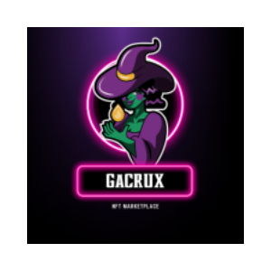 | 71097 | RUX | RunBlox |
|  | 59293 | ASPO | ASPO World |
| 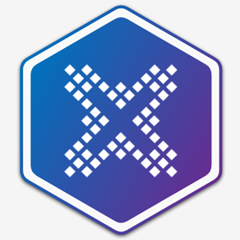 | 213 | ADT | adToken |
| 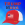 | 136713 | $TRUMAGA | TrumpMAGA |
| 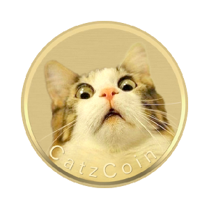 | 66661 | CATZ | CatzCoin |
|  | 68951 | MMETA | Duckie Land Multi Metaverse |
| 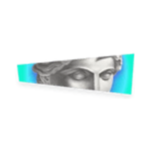 | 61903 | OSQTH | Opyn Squeeth |
| 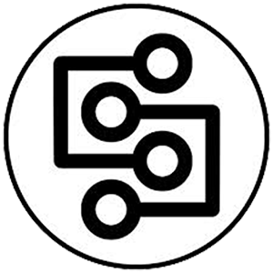 | 295 | DGC | DigitalCoin |
|  | 69515 | RIFICO | Rin Finance Coin |
|  | 65569 | SACT | srnArtGallery |
|  | 32819 | 0XBTC | 0xBitcoin |
|  | 54523 | NBM | NFTBlackMarket |
|  | 49095 | SISHI | Sishi Finance |
| 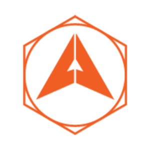 | 50559 | APRIL | April |
|  | 54941 | ABLE | Able Finance |
| 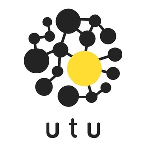 | 46214 | UTU | UTU Coin |
| 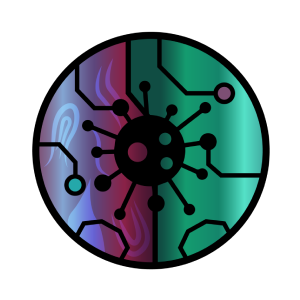 | 59369 | SSG | Surviving Soldiers |
|  | 47463 | SI | Siren |
|  | 57169 | DOFI | Doge Floki Coin |
| 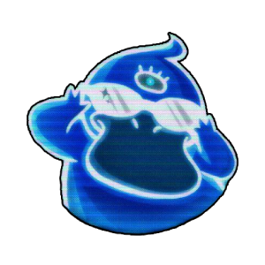 | 98727 | FINALE | Ben's Finale |
| 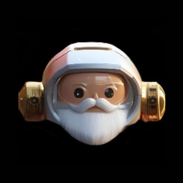 | 113093 | SANTAGROK | Santa Grok |
|  | 133655 | REAU | Vira-lata Finance |
|  | 47425 | RAZOR | Razor Network |
|  | 58527 | OCCT | Official Crypto Cowboy Token |
| 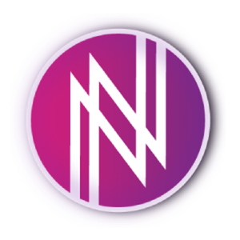 | 56333 | NFTY | NFTY Token |
| 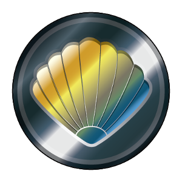 | 71 | CLAM | CLAMs |
|  | 48875 | PKF | PolkaFoundry |
| 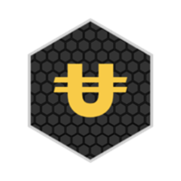 | 54995 | BETU | BetU |
| 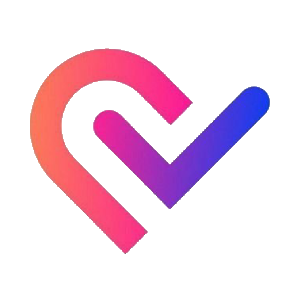 | 54881 | STORY | Story |
|  | 161991 | LN | Lnfi Network |
|  | 50537 | GROW | Growing.fi |
| 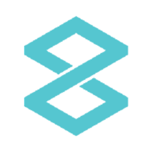 | 65203 | 8PAY | 8Pay |
| 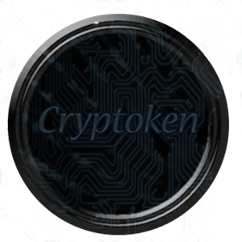 | 42364 | CYT | Cryptokenz |
| 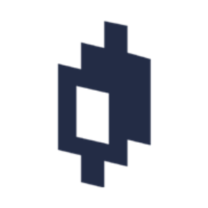 | 33739 | MIR | MIR COIN |
|  | 49223 | CHIHUA | Chihua Token |
|  | 68803 | X2 | X2 |
|  | 51353 | MMP | Moon Maker Protocol |
|  | 57135 | APP | Dappsy |
|  | 50745 | MOOCHII | Moochii |
|  | 41284 | EVZ | Electric Vehicle Zone |
|  | 136191 | YAWN | Yawn's World |
|  | 99423 | GENIE | GenieBot |
| 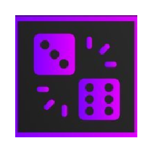 | 68415 | RXCG | RXCGames |
|  | 68665 | HEPA | Hepa Finance |
| 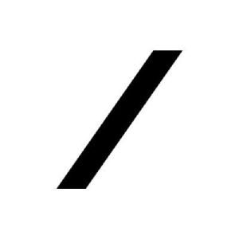 | 112179 | GRAVITAS | Gravitas |
|  | 93995 | LIQD | Liquid Finance |
| 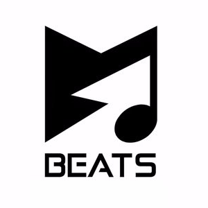 | 1972 | XBTS | BeatCoin |
|  | 33154 | BUNNY | BunnyToken |
|  | 33471 | WEBD | WebDollar |
| 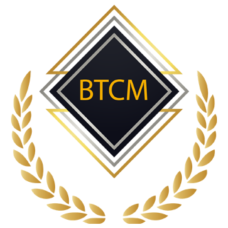 | 3776 | BTCM | BTCMoon |
|  | 1853 | MST | Mustangcoin |
| 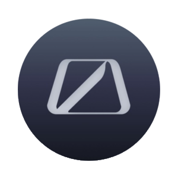 | 32318 | OCC | Octoin Coin |
|  | 12 | XMY | Myriad |
| 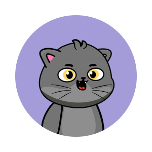 | 142281 | CURLY | Curly |
| 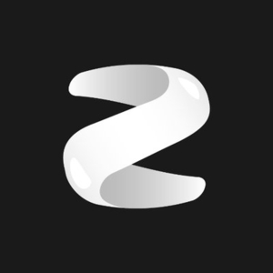 | 32732 | ZIPT | Zippie |
|  | 129721 | GENO | GenomeFi |
| 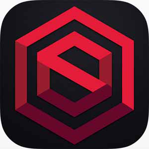 | 34440 | SDC | ShadowCash |
|  | 32447 | $PAC | PACcoin |
|  | 44220 | DIMI | Diminutive Coin |
| 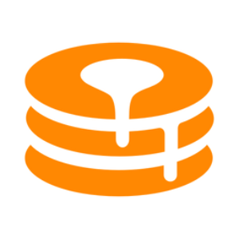 | 64705 | MPL | Maple |
|  | 46978 | TVK | Terra Virtua Kolect |
|  | 3310 | HMC | HarmonyCoin |
| 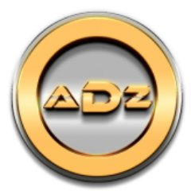 | 3129 | ADZ | Adzcoin |
| 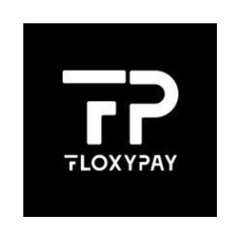 | 99375 | FXY | Floxypay |
| 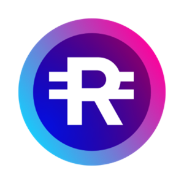 | 34435 | RIDE | Ride My Car |
| 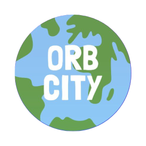 | 1217 | ORB | OrbitCoin |
|  | 121899 | JOB | Jobchain |
|  | 1510 | STV | Sativacoin |
| 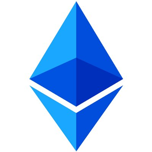 | 3774 | ELITE | Ethereum Lite |
| 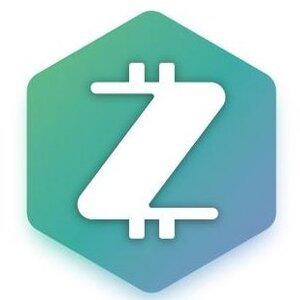 | 1253 | ZEIT | ZeitCoin |
| 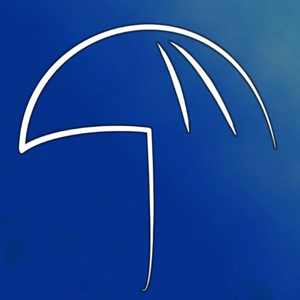 | 36377 | UMC | Unity Matrix Commons |
|  | 1724 | XJO | JouleCoin |
| 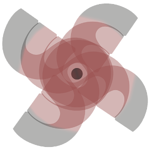 | 76 | SNRG | Synergy |
| 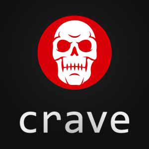 | 2139 | CRAVE | Crave |
|  | 1233 | MOTO | MotoCoin |
| 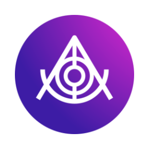 | 47507 | ALN | Aluna |
|  | 49407 | SFM | SFMoney |
| 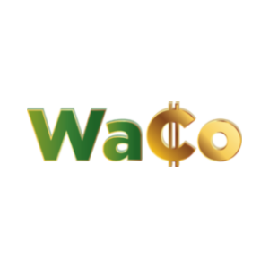 | 56527 | WACO | Waste Digital Coin |
| 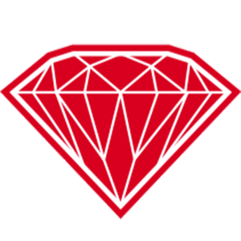 | 496 | RBIES | Rubies |
| 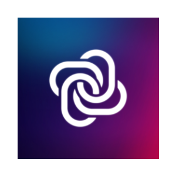 | 48051 | PAID | PAID Network |
|  | 85901 | EPC | ExperienceCoin |
|  | 3528 | DBTC | Debitcoin |
| 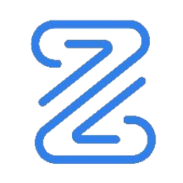 | 59839 | ZENITH | Zenith Chain |
|  | 34451 | SH | Shilling |
| 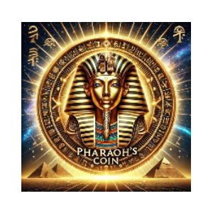 | 150959 | PHRZ | Pharaohs |
| 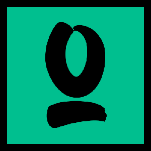 | 36614 | SHORTY | Shorty |
| 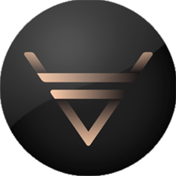 | 34705 | VLS | Veles |
| 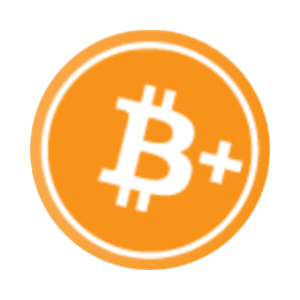 | 1639 | XBC | Bitcoin Plus |
| 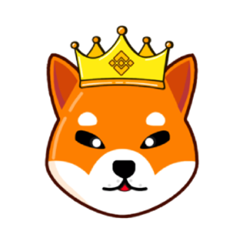 | 65093 | KINGSHIB | King Shiba |
|  | 42010 | JOYS | JOYS |
|  | 66715 | HEROES | Dehero Community Token |
| 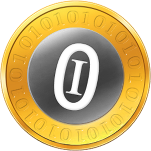 | 1334 | I0C | I0Coin |
|  | 48101 | SWOP | Swop |
| 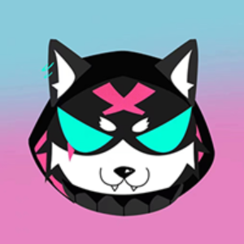 | 3584 | MILO | MiloCoin |
|  | 75 | OK | OkCash |
| 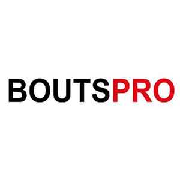 | 32746 | BOUTS | BoutsPro |
|  | 59271 | SEG | Solar Energy |
|  | 49033 | MOFI | MobiFi |
|  | 32903 | RTH | Rotharium |
|  | 63929 | RANKER | RankerDao |
| 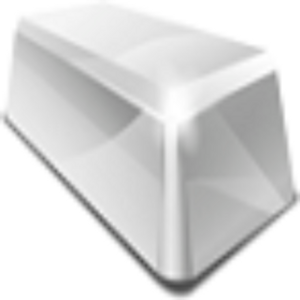 | 36369 | LTB | LiteBar |
|  | 45114 | SNN | SeChain |
| 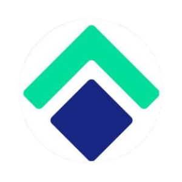 | 47523 | NORD | Nord Finance |
|  | 34452 | URC | Unrealcoin |
| 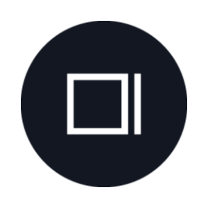 | 62823 | OKS | Oikos |
|  | 41694 | FSHN | Fashion Coin |
| 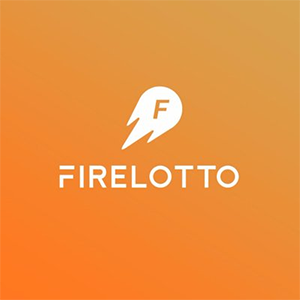 | 32976 | FLOT | Fire Lotto |
| 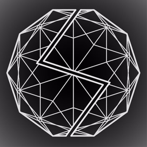 | 122 | SYNX | Syndicate |
|  | 3269 | BTCR | Bitcurrency |
|  | 61601 | STORE | Bit Store |
|  | 1250 | PXC | PhoenixCoin |
|  | 60997 | NYT | New Year Token |
| 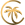 | 55599 | CISLA | Crypto Island |
| 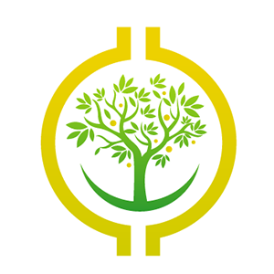 | 44719 | RWN | Rowan Token |
| 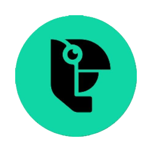 | 130999 | GPTV | GPTVerse |
|  | 2404 | CNNC | Cannation |
|  | 514 | TRC | TerraCoin |
| 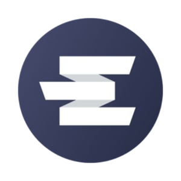 | 47527 | ETHA | ETHA Lend |
| 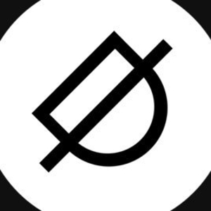 | 126361 | ZAI | ZAIHO |
| 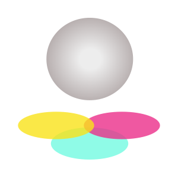 | 121803 | SPH | Spheroid Universe |
| 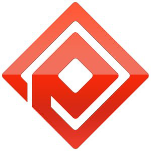 | 2261 | XPTX | PlatinumBar |
|  | 36361 | CV2 | Colossuscoin V2 |
|  | 34431 | UNITS | GameUnits |
| 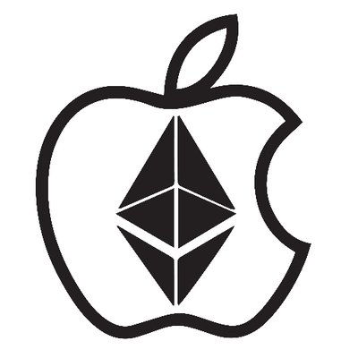 | 3273 | IETH | iEthereum |
|  | 76735 | HPNS | Happiness |
| 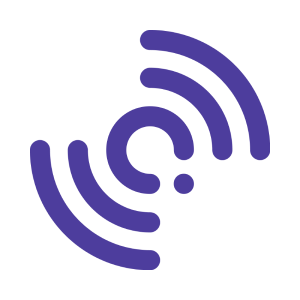 | 32379 | QLC | QLINK |
|  | 42921 | BUX | BUXCOIN |
| 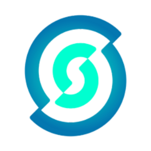 | 126515 | SC20 | Shine Chain |
| 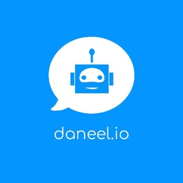 | 125551 | DAN | Dastra Network |
|  | 3361 | TALK | BTCtalkcoin |
| 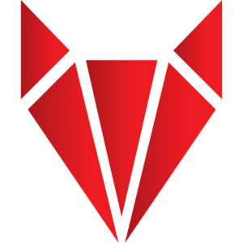 | 33856 | RFOX | RedFOX Labs |
|  | 1930 | KOBO | KoboCoin |
|  | 49965 | CLU | CluCoin |
| 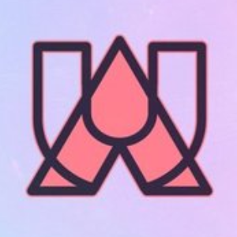 | 51439 | TOKAU | Tokyo AU |
| 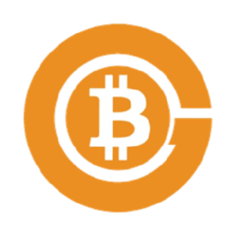 | 32305 | GOD | Bitcoin God |
|  | 69545 | YFIH2 | H2Finance |
|  | 79829 | PURE | Puriever |
| 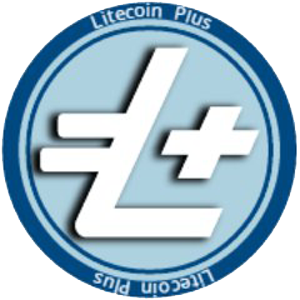 | 2638 | LCP | Litecoin Plus |
| 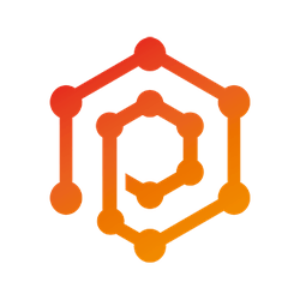 | 2890 | PST | Primas |
|  | 287 | CDN | Canada eCoin |
| 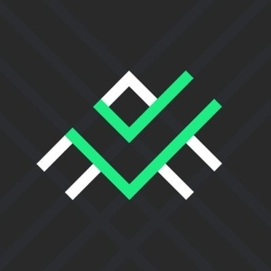 | 34441 | VAL | Valorbit |
| 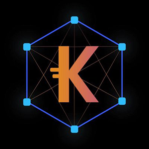 | 41236 | KMX | KIMEX |
| 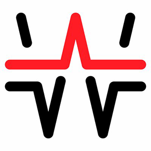 | 44550 | WTT | Giga Watt Token |
|  | 40 | CANN | CannabisCoin |
|  | 36613 | PHS | Philosopher Stones |
| 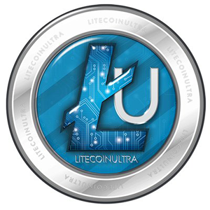 | 2392 | LTCU | LiteCoin Ultra |
|  | 81287 | ZHC | ZHC : Zero Hour Cash |
|  | 60931 | HSF | Hillstone |
|  | 80837 | HAL | Halcyon |
| 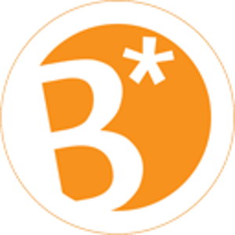 | 2117 | BITS | Bitstar |
| 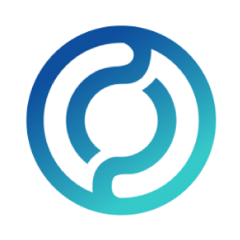 | 55519 | SHON | ShonToken |
| 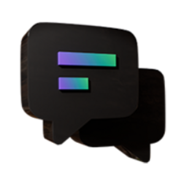 | 11127 | CHAT | ChatCoin |
| 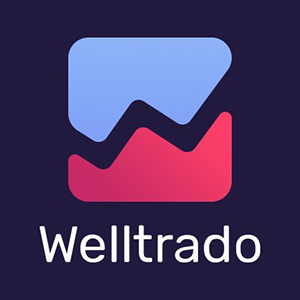 | 85885 | WTL | Welltrado |
|  | 34483 | DISK | DarkLisk |
| 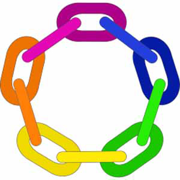 | 1571 | UIS | Unitus |
| 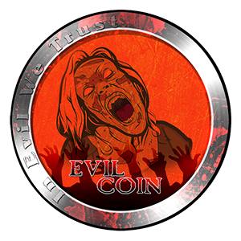 | 1556 | EVIL | Evil Coin |
|  | 2921 | GVT | Genesis Vision Token |
| 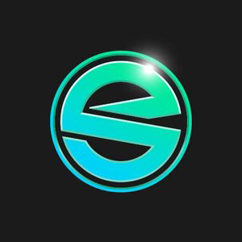 | 33366 | ERT | Eristica |
| 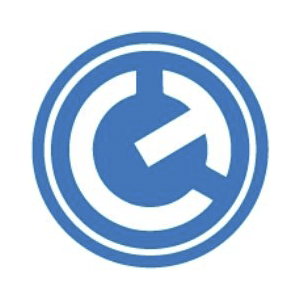 | 32745 | TNS | Transcodium |
| 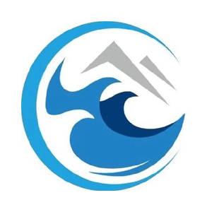 | 78 | CPC | CapriCoin |
| 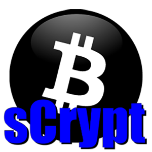 | 384 | BTCS | Bitcoin Scrypt |
|  | 1788 | POST | PostCoin |
| 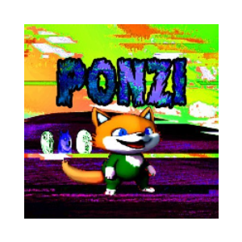 | 3536 | PONZI | PonziCoin |
|  | 51003 | MNST | MoonStarter |
|  | 42324 | AGRI | AgriNovusCoin |
|  | 42065 | BITZ | bitz |
| 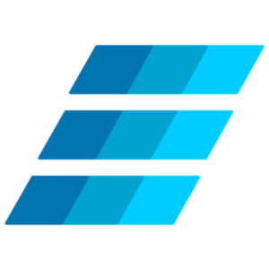 | 11 | EMC2 | Einsteinium |
| 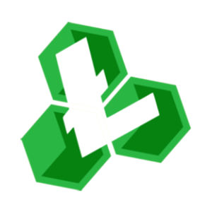 | 32355 | LCC | Litecoin Cash |
| 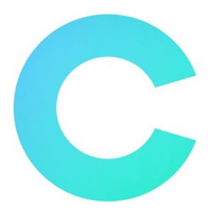 | 88687 | CAG | Change |
| 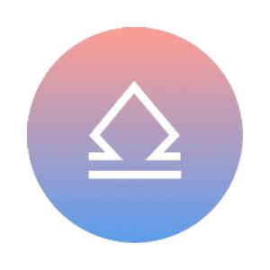 | 41408 | LBR | LIBER COIN |
|  | 41961 | SWAT | SWTCoin |
|  | 49139 | TSX | TradeStars |
| 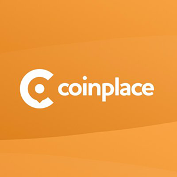 | 137179 | CPL | CATERPILLAR |
|  | 3685 | UKG | Unikoin Gold |
|  | 1166 | SXC | Sexcoin |
| 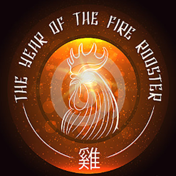 | 2005 | FRC | Freicoin |
| 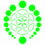 | 33036 | BTI | Bitcoin Instant |
| 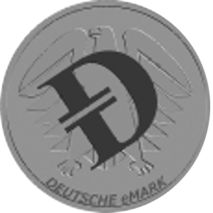 | 1302 | DEM | Deutsche eMark |
| 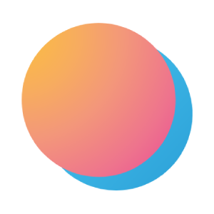 | 60707 | OOKI | Ooki |
|  | 3580 | WBB | Wild Beast Block |
|  | 41348 | TERC | TronEuropeRewardCoin |
| 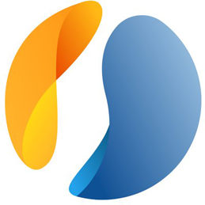 | 34565 | BTH | Bitcoin Hot |
| 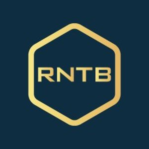 | 32325 | RNTB | BitRent |
| 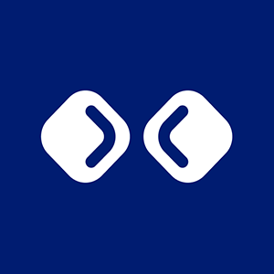 | 52239 | BRTR | Barter |
| 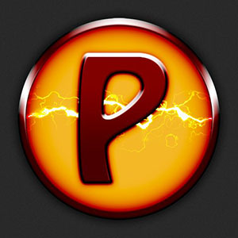 | 34445 | PULSE | Pulse |
| 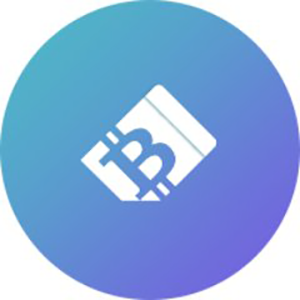 | 42028 | BTV | Bitvote |
| 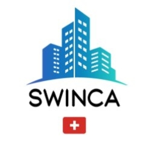 | 70291 | SWI | Swinca |
| 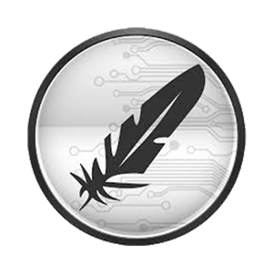 | 5 | FTC | Feathercoin |
| 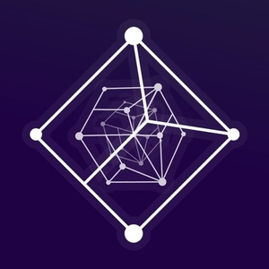 | 34531 | YCE | MYCE |
| 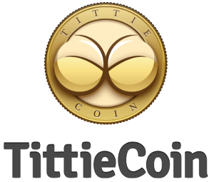 | 1204 | TIT | TitCoin |
| 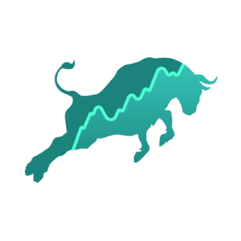 | 52075 | BLP | BullPerks |
|  | 32387 | EVN | Envion |
| 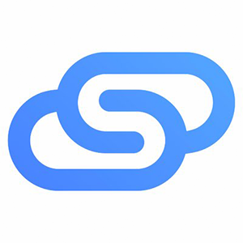 | 2578 | SCL | Sociall |
|  | 45416 | OAP | OpenAlexa Protocol |
|  | 61031 | MEAN | Meanfi |
|  | 54283 | DNXC | DinoX |
|  | 45469 | JCC | junca Cash |
|  | 1680 | ARG | Argentum |
| 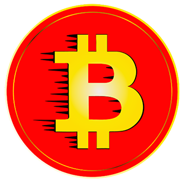 | 78731 | BCF | Bitcoin Fast |
| 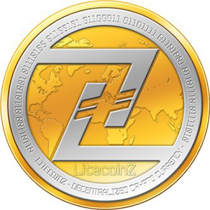 | 34708 | LTZ | LitecoinZ |
| 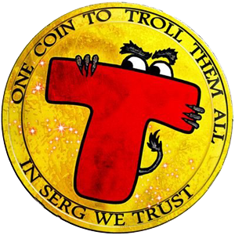 | 341 | TROLL | Trollcoin |
|  | 32571 | MANNA | Manna |
|  | 43025 | SPL | Simplicity |
|  | 38 | PINK | PinkCoin |
|  | 45461 | FOXD | Foxdcoin |
|  | 42244 | SSF | Safe SeaFood Coin |
|  | 64035 | FREED | Freedomcoin |
| 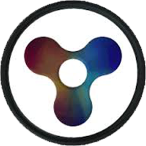 | 1551 | QRK | Quark |
|  | 3073 | NYC | NewYorkCoin |
|  | 54733 | DLEGENDS | My DeFi Legends |
| 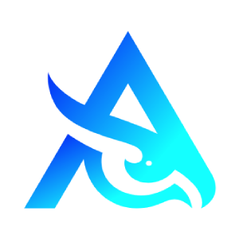 | 69009 | EAI | Edain |
| 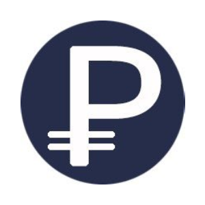 | 3602 | PEX | PosEx |
| 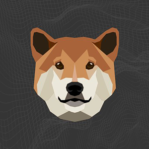 | 33785 | DOGEC | DogeCash |
|  | 41260 | VECO | Veco |
| 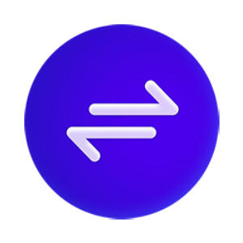 | 34443 | SPEX | SproutsExtreme |
|  | 113629 | UPRO | Ultrapro |
| 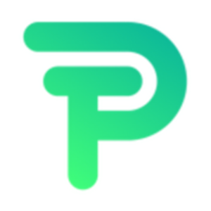 | 54479 | POSI | Position Exchange |
| 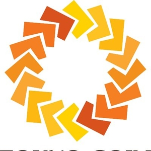 | 11282 | TOKC | TOKYO |
| 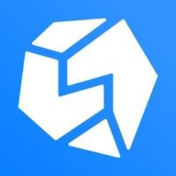 | 46747 | STON | Ston |
| 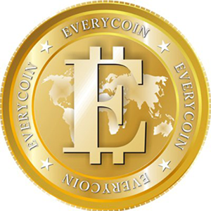 | 33663 | EVY | EveryCoin  |
|  | 67685 | BBF | Bubblefong |
| 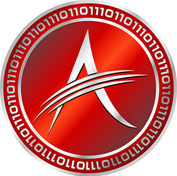 | 49 | ABY | ArtByte |
|  | 32782 | LBA | Libra Credit |
| 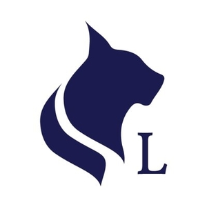 | 32981 | LYNX | Lynx |
|  | 53691 | GOLDUCK | Golden Duck |
| 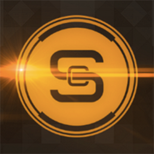 | 1539 | SWING | Swing |
|  | 49933 | SOBA | SOBA Token |
| 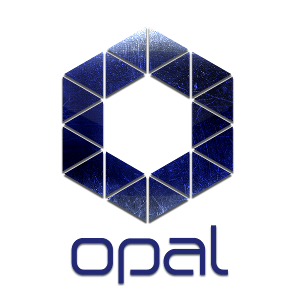 | 1798 | OPAL | Opal |
|  | 41959 | SHRM | Shrooms |
| 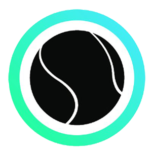 | 42174 | BTRM | Betrium |
|  | 34471 | MONETA | Moneta |
| 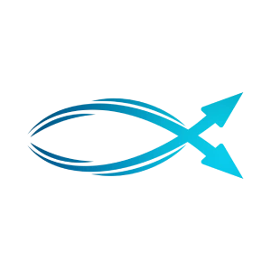 | 60729 | R1 | Recast1 |
| 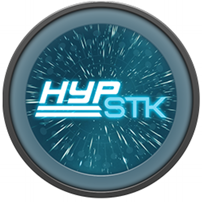 | 1299 | HYP | HyperStake |
|  | 68175 | RFX | Reflex |
|  | 60011 | 1337 | 1337 |
|  | 70657 | ISTEP | iSTEP |
| 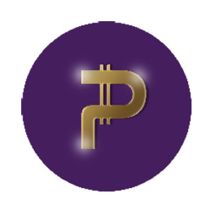 | 60425 | PRCH | Power Cash |
| 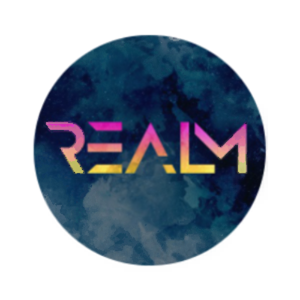 | 55169 | REALM | Realm |
|  | 71045 | CKU | Cryptoku |
|  | 51189 | RNBW | Rainbow Token |
|  | 126239 | FOAT | Forever Aid Token |
|  | 50289 | WENLAMBO | Wenlambo |
| 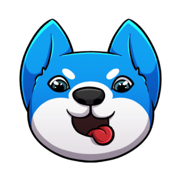 | 123405 | SHIBA | BitShiba |
| 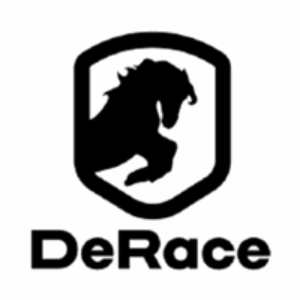 | 54011 | DERC | DeRace |
| 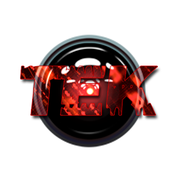 | 1397 | TEK | TEKcoin |
| 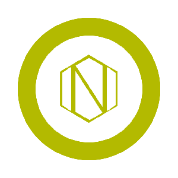 | 32458 | NEU | Neumark |
|  | 58631 | SBAR | Selfbar |
|  | 18 | GRS | Groestlcoin |
| 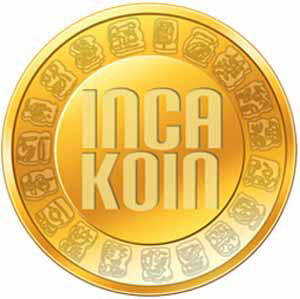 | 1357 | NKA | Incakoin |
| 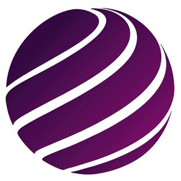 | 56295 | GEC | Green Energy Coin |
|  | 3622 | SCS | Speedcash |
|  | 1355 | SJW | SJWCoin |
|  | 1346 | DUO | Parallelcoin |
| 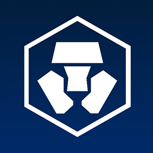 | 211 | MCO | Crypto.com |
|  | 1340 | XPD | PetroDollar |
| 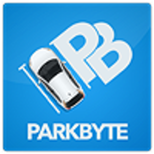 | 77 | PKB | ParkByte |
| 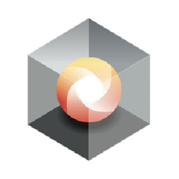 | 84 | EXP | Expanse |
|  | 58761 | JAIHO | Jaiho Crypto |
| 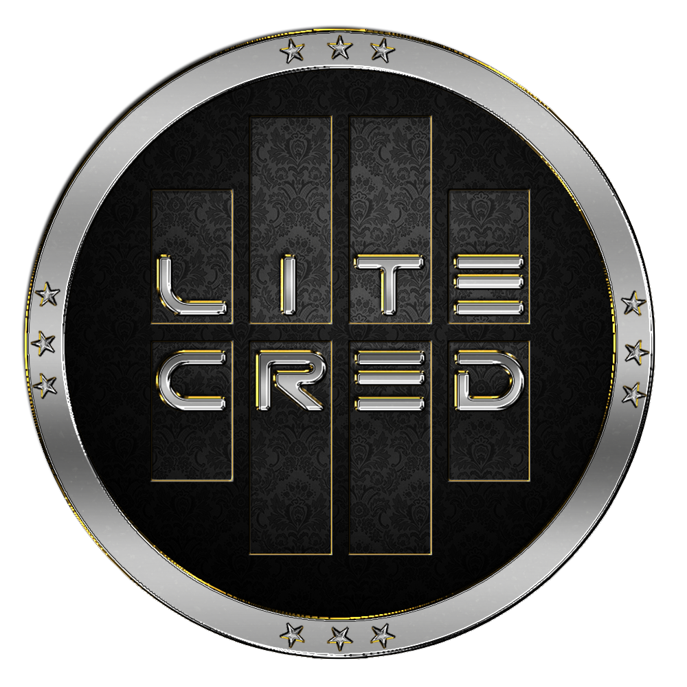 | 460 | LTCR | Litecred |
|  | 58607 | PLACE | PlaceWar Governance Token |
|  | 79929 | GAU | Gamer Arena |
|  | 87211 | IMGNAI | Image Generation AI |
|  | 58421 | WHIVE | Whive |
|  | 1323 | SAK | SharkCoin |
| 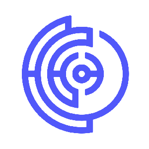 | 32469 | EFX | Effect.AI |
|  | 97 | SLS | SaluS |
|  | 57743 | MFLATE | Memeflate |
| 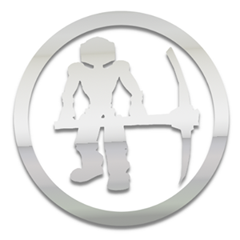 | 1712 | MNM | Mineum |
|  | 1648 | FRN | Francs |
| 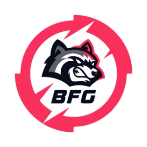 | 54251 | BFG | BETFURY |
|  | 69237 | DCCT | DocuChain |
|  | 1630 | FUZZ | FuzzBalls |
| 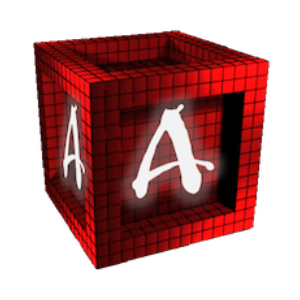 | 46586 | ASP | Aspire |
|  | 67885 | VICA | ViCA Token |
|  | 61955 | LOAN | Proton Loan |
| 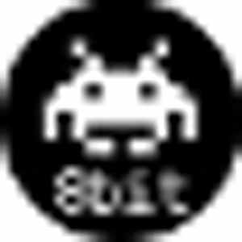 | 1289 | 8BIT | 8Bit |
| 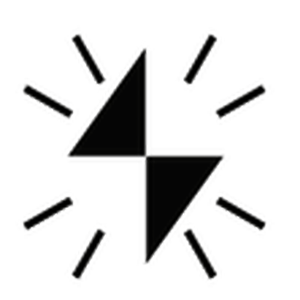 | 3102 | PING | CryptoPing |
|  | 50613 | PDEX | Polkadex |
| 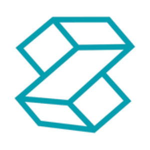 | 121785 | ZKB | ZKBase |
|  | 64811 | GYEN | GYEN |
| 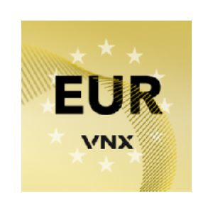 | 87989 | VEUR | VNX EURO |
| 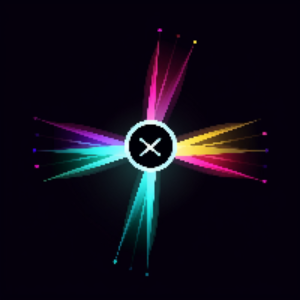 | 113915 | FLUXB | Fluxbot |
|  | 59213 | KEYS | Keys Token |
| 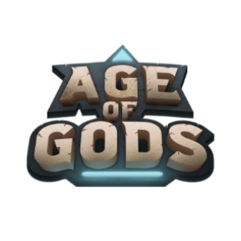 | 32989 | AOG | smARTOFGIVING |
| 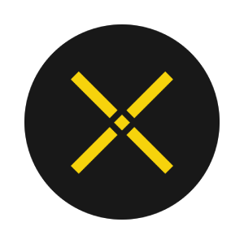 | 32342 | NPXS | Pundi X |
|  | 34446 | MTLMC3 | Metal Music Coin |
|  | 56577 | KODI | KODI |
|  | 2788 | ATB | ATBCoin |
| 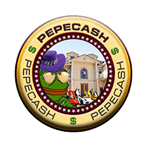 | 2843 | PEPECASH | Pepe Cash |
|  | 2898 | PLBT | Polybius |
| 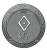 | 59819 | SIF | Sif |
|  | 60087 | DV | Dreamverse |
|  | 60057 | MNTG | Monetas |
| 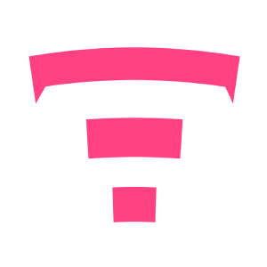 | 2830 | TNT | Tierion |
|  | 10785 | COV | Covesting |
| 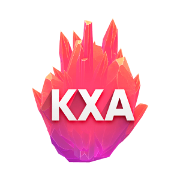 | 59607 | KXA | Kryxivia Game |
|  | 60791 | CHER | Cherry Network |
|  | 2790 | SUB | Substratum |
|  | 60809 | TR3 | Tr3zor |
|  | 60667 | PHAE | Phaeton |
| 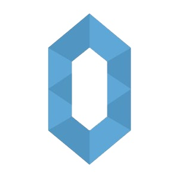 | 3079 | IND | Indorse Token |
|  | 44685 | ORN | Orion Protocol |
| 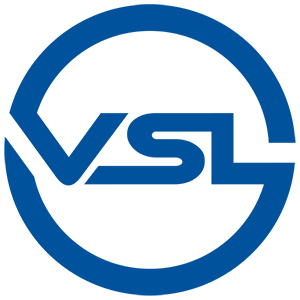 | 3053 | VSL | vSlice |
| 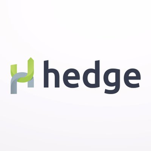 | 3038 | HDG | Hedge |
|  | 3037 | TFL | TrueFlip |
|  | 2950 | GCC | GuccioneCoin |
| 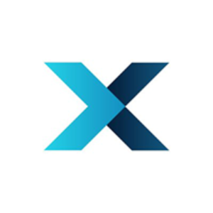 | 2946 | IXT | iXledger |
| 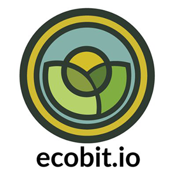 | 2219 | ECOB | EcoBit |
|  | 2204 | DCY | DinastyCoin |
| 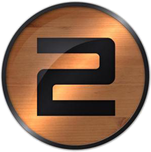 | 2148 | C2 | Coin2.1 |
|  | 60943 | CONJ | Conjee |
| 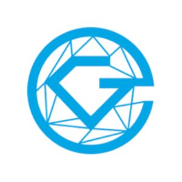 | 33875 | GTN | GlitzKoin |
|  | 2106 | ECO | ECOcoin |
| 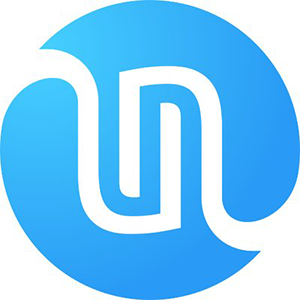 | 2240 | UNIFY | Unify |
| 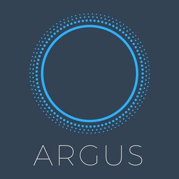 | 2032 | ARGUS | Argus |
|  | 19 | NLG | Gulden |
| 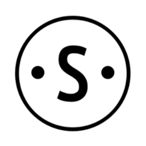 | 2866 | SAN | Santiment Network Token |
|  | 32376 | UTK | UTRUST |
|  | 114 | RISE | Rise |
| 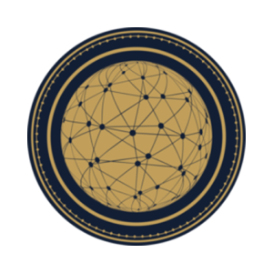 | 111 | DGD | DigixDAO |
|  | 56561 | EBSO | eBlockStock |
| 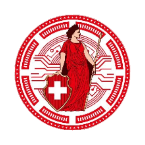 | 56517 | DSFR | Digital Swiss Franc |
|  | 55843 | QBU | Quannabu |
| 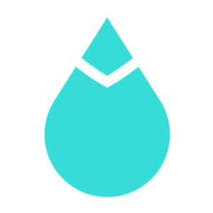 | 168 | GUP | Matchpool |
|  | 71425 | SQUIDGROW | SquidGrow |
|  | 55817 | PLOCK | PancakeLock |
| 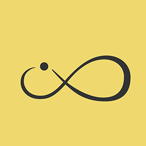 | 146 | SWT | Swarm City |
|  | 56009 | SSB | SatoshiStreetBets |
|  | 32320 | SENT | Sentinel |
|  | 141 | SIB | Siberian Chervonets |
|  | 154261 | AKIO | Akio |
|  | 53525 | OOKS | Onooks |
|  | 57483 | GNP | Genie Protocol |
| 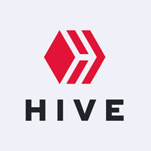 | 44131 | HBD | Hive Dollar |
| 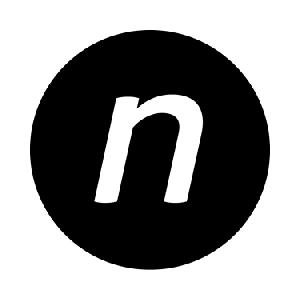 | 44270 | NEST | Nest |
|  | 44697 | HDI | HEIDI |
| 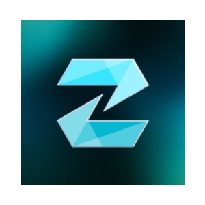 | 141261 | ZKML | zKML |
| 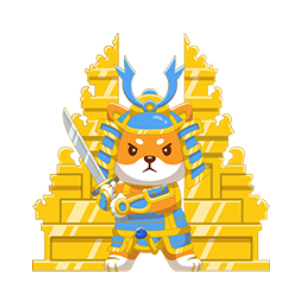 | 57131 | SHIBEMP | Shiba Inu Empire |
| 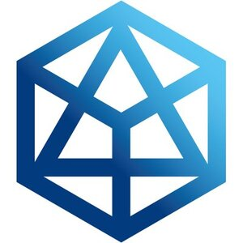 | 364 | AIB | Advanced Internet Blocks |
|  | 61969 | SINGLE | Single Finance |
|  | 61983 | WELUPS | Welups Blockchain |
| 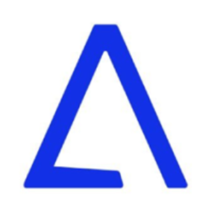 | 2879 | DLT | Agrello |
| 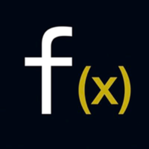 | 33630 | FX | Function X |
| 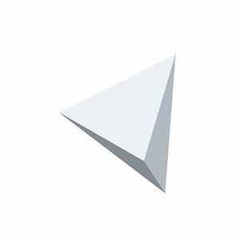 | 2871 | XRL | Rialto |
|  | 63469 | LIBERO | Libero Financial |
|  | 63421 | BLOVELY | Baby Lovely Inu |
|  | 63555 | METADOGEV2 | MetaDoge V2 |
| 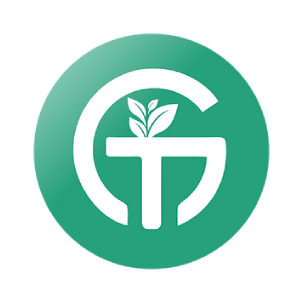 | 156 | GNT | Golem |
|  | 3500 | ISL | IslaCoin |
| 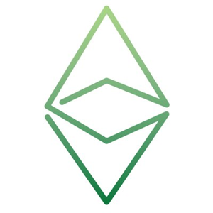 | 3262 | ECASH | Ethereum Cash |
| 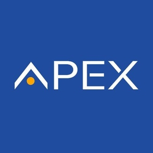 | 32352 | CPX | Apex |
| 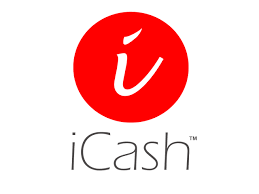 | 42246 | ICASH | iCash |
| 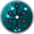 | 42835 | NODC | NodeCoin |
|  | 42798 | AXAI | Axai |
|  | 42778 | DES | Destiny |
| 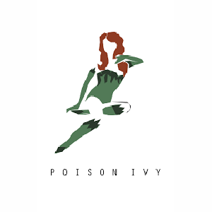 | 67395 | XPS | Xpansion Game |
|  | 42705 | FOREX | FOREXCOIN |
|  | 42777 | RSGP | RSGPcoin |
| 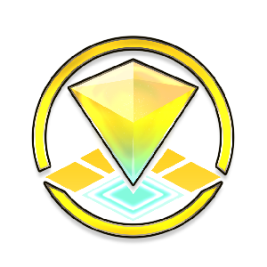 | 42553 | PSB | Pesobit |
|  | 111537 | PMPY | Prometheum Prodigy |
|  | 67513 | SHIBELON | ShibElon |
| 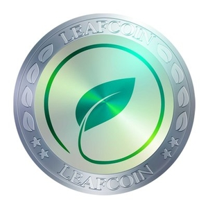 | 42355 | LEAF | Leafcoin |
| 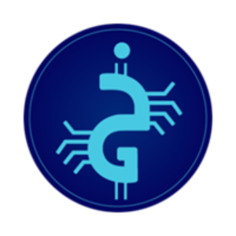 | 71043 | GULF | GulfCoin |
|  | 42312 | LBXC | LUX BIO EXCHANGE COIN |
|  | 114745 | IOT | Helium IOT |
| 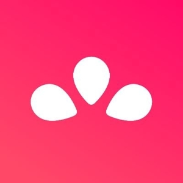 | 42285 | LVN | LivenPay |
| 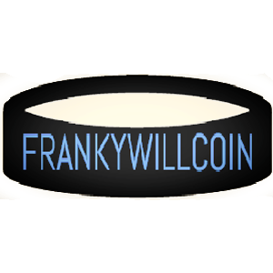 | 42515 | FRWC | FrankyWillCoin |
| 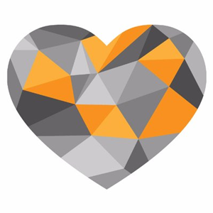 | 42607 | JDC | JD Coin |
| 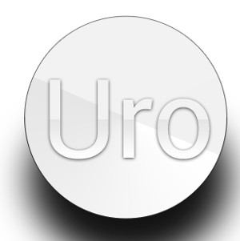 | 42502 | URO | Uro |
|  | 42500 | FRK | Franko |
|  | 33313 | ABST | Abitshadow Token |
|  | 44096 | MVR | Mavro |
| 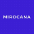 | 42916 | MIRO | Mirocana |
| 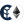 | 43091 | ETHBNT | ETHBNT Relay |
| 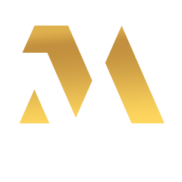 | 67277 | MSC | MetaSwap |
| 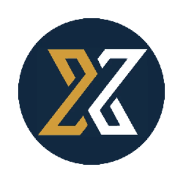 | 111531 | XPE | Xpense |
|  | 43083 | CIRQ | Cirquity |
| 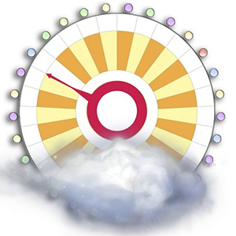 | 36492 | BASH | LuckChain |
| 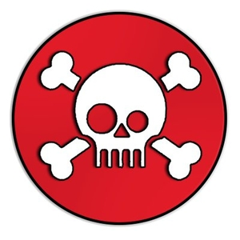 | 42241 | SKULL | Pirate Blocks |
|  | 32767 | SWTH | Switcheo |
| 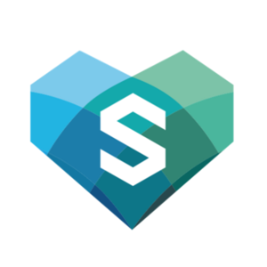 | 41290 | SYM | SymVerse |
|  | 41270 | BLRY | BillaryCoin |
|  | 67389 | SNE | StrongNode |
|  | 36494 | FAZZ | Fazzcoin |
|  | 64231 | KFL | Kaafila |
| 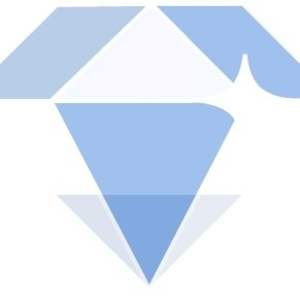 | 34711 | SKRP | Skraps |
| 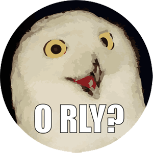 | 34453 | ORLY | Orlycoin |
|  | 34454 | XOC | Xonecoin |
| 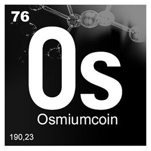 | 34456 | OS76 | OsmiumCoin |
| 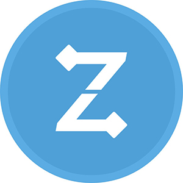 | 34437 | ZNE | Zonecoin |
| 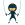 | 34463 | PRIMU | Primulon |
|  | 34436 | STEPS | Steps |
|  | 34465 | DASHS | Dashs |
|  | 34546 | BF | Bitforex |
|  | 34541 | SEDO | SEDO POW TOKEN |
|  | 34473 | VOYA | Voyacoin |
| 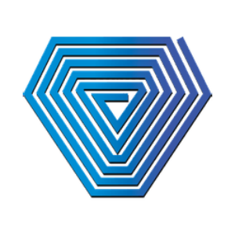 | 34607 | FUND | FUNDChains |
| 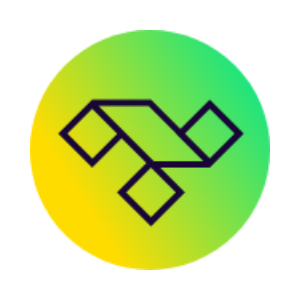 | 36421 | BRZ | Brazilian Digital Token |
|  | 34679 | NTM | NetM |
| 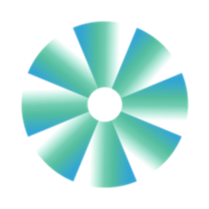 | 147611 | JET | Satoshi Airline |
| 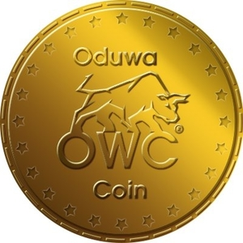 | 33690 | OWC | ODUWA |
| 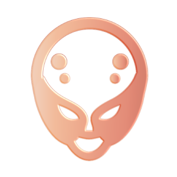 | 66331 | D11 | DeFi11 |
|  | 34798 | WAY | WayGuide |
| 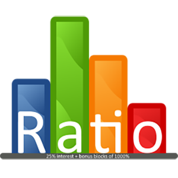 | 66219 | RATIO | Ratio Protocol |
|  | 36490 | HTC | HitCoin |
|  | 34434 | DLISK | DAPPSTER |
| 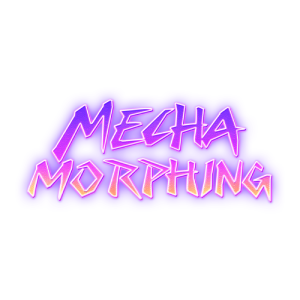 | 66243 | MAPE | Mecha Morphing |
| 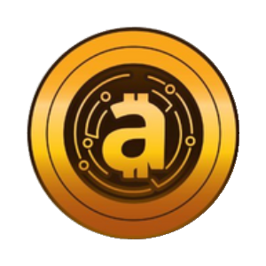 | 66305 | ADR | Adroverse |
| 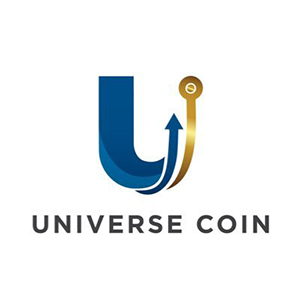 | 66145 | UNIS | Universe Coin |
|  | 34433 | YAC | Yacoin |
| 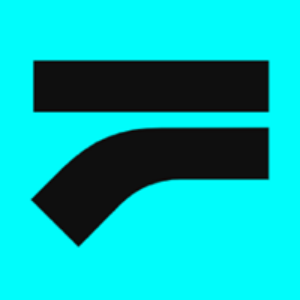 | 34430 | FLY | Flycoin |
| 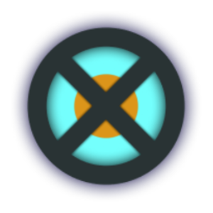 | 34428 | EVO | Evotion |
| 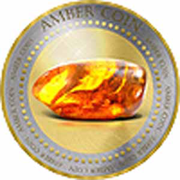 | 34424 | AMBER | AmberCoin |
|  | 33865 | LVL | LevelApp Token |
| 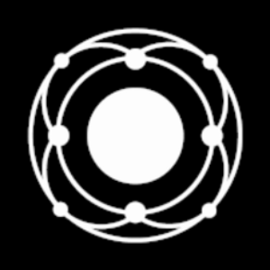 | 36491 | MND | MindCoin |
|  | 66441 | INDI | IndiGG |
| 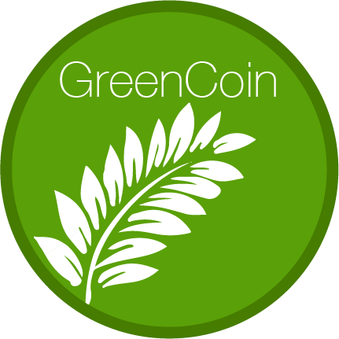 | 34423 | GRE | Greencoin |
|  | 64321 | QIN | QUINCOIN |
| 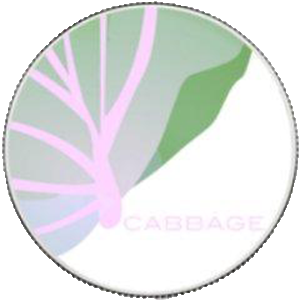 | 3576 | CAB | Cabbage |
| 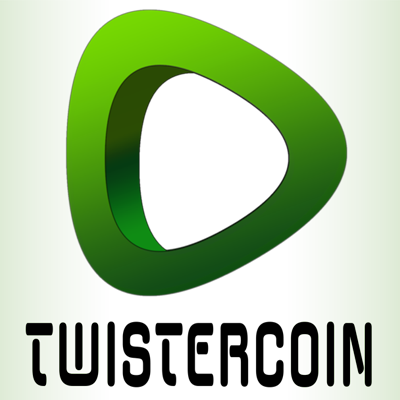 | 10757 | TWIST | TWIST |
| 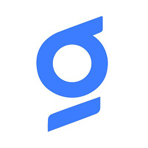 | 3864 | GAIN | UGAIN |
| 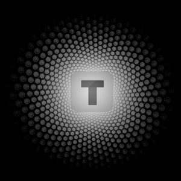 | 3850 | TELL | Tellurion |
| 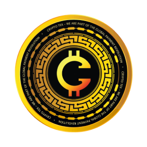 | 69897 | CTEX | Crypto Tex |
|  | 154287 | JETT | JETT CRYPTO |
|  | 3842 | EGG | EggCoin |
|  | 3838 | AXIOM | Axiom |
|  | 70403 | ARTL | ARTL |
|  | 3765 | ASN | Aseancoin |
|  | 3762 | CCT | Crystal Clear  |
|  | 3750 | BLAZR | BlazerCoin |
| 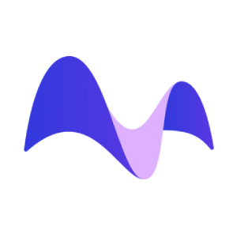 | 3922 | SHELL | ShellCoin |
|  | 3937 | OMC | Omicron |
|  | 70697 | CVSHOT | CVSHOTS |
|  | 3935 | RICHX | RichCoin |
| 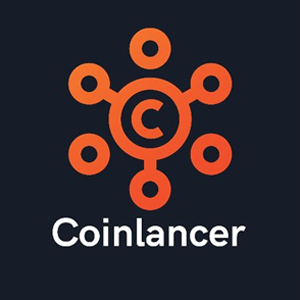 | 4037 | CL | Coinlancer |
|  | 3902 | HYPER | Hyper |
| 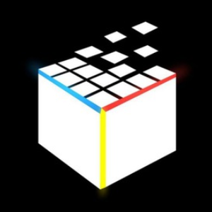 | 3410 | CUBE | DigiCube |
|  | 3343 | METAL | MetalCoin |
|  | 3311 | NANOX | Project-X |
| 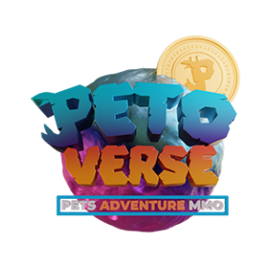 | 70005 | PETO | Petoverse |
|  | 3411 | XPY | PayCoin |
| 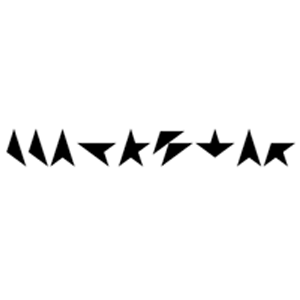 | 34447 | BSTAR | Blackstar |
| 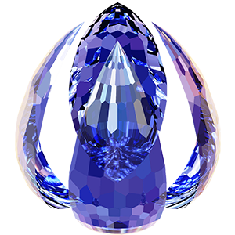 | 3191 | ELE | Elementrem |
|  | 3166 | TAG | TagCoin |
|  | 3447 | ZUR | Zurcoin |
| 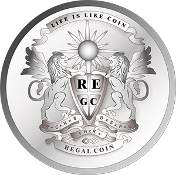 | 3669 | REC | Regalcoin |
|  | 151193 | K | Kinto |
| 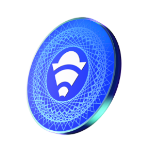 | 70113 | XDEN | Xiden |
|  | 3620 | HVCO | High Voltage |
|  | 3618 | BIOB | BioBar |
|  | 3895 | PRM | PrismChain |
|  | 69 | MUE | MonetaryUnit |
| 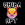 | 63927 | SHIBANFT | ShibaNFT |
|  | 147263 | LGCT | Legacy Token |
|  | 41463 | GENES | GENES Chain |
|  | 50297 | WOOP | Woonkly Power |
| 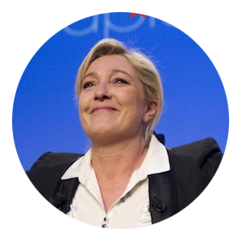 | 36497 | LEPEN | LePen |
| 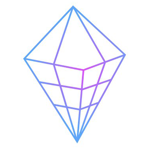 | 42117 | SRNT | Serenity |
| 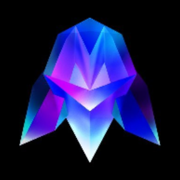 | 64001 | RIM | MetaRim |
| 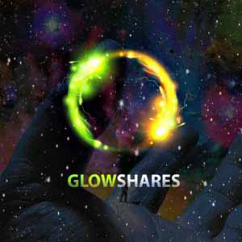 | 42074 | GSX | GlowShares |
| 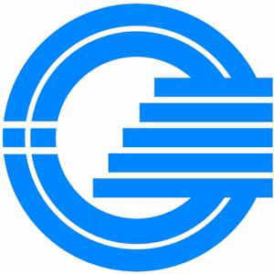 | 42073 | GSM | GSMcoin |
|  | 42070 | KASHH | Kashhcoin |
| 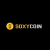 | 64181 | SOXY | SOXYCOIN |
|  | 42069 | MAPC | MapCoin |
| 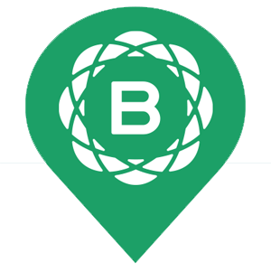 | 42068 | XBS | BitStake |
| 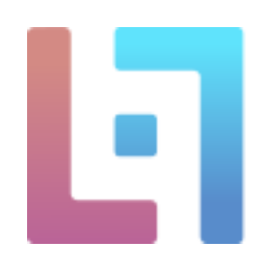 | 64063 | LFT | Lifetime |
|  | 42225 | IDRT | Rupiah Token |
|  | 42066 | XCE | Cerium |
| 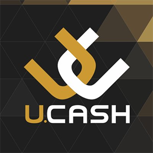 | 32517 | UCASH | U.CASH |
| 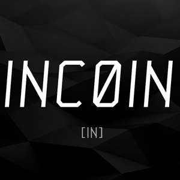 | 41949 | IN | InCoin |
|  | 144749 | XAR | Arcana Network |
| 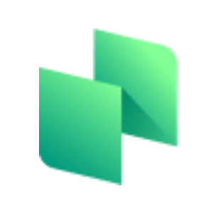 | 69461 | EGS | EdgeSwap |
|  | 69779 | FTP | Fountain Protocol |
|  | 41752 | BPTN | Bit Public Talent Network |
|  | 44046 | RSV | Reserve |
|  | 41757 | TVT | TVT |
|  | 42040 | TAGR | TAGRcoin |
|  | 41647 | CNC | CONEX COIN |
|  | 45340 | SWRV | Swerve |
|  | 42139 | LHCOIN | LHCoin |
|  | 42071 | BTCU | BitcoinUltra |
| 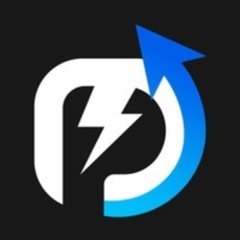 | 42052 | PMT | DAO PlayMarket 2.0 |
|  | 42053 | REE | ReeCoin |
| 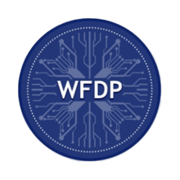 | 63795 | WFDP | WFDP |
|  | 65919 | FWC | Qatar 2022 |
|  | 1978 | MARX | MarxCoin |
|  | 45156 | GFL | Golden Fleece Token |
|  | 1918 | POSW | PoSWallet |
| 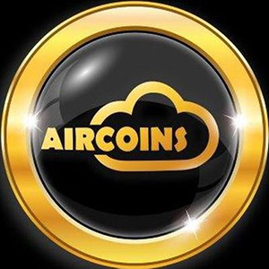 | 42191 | AIRX | Aircoins |
|  | 70887 | JW | Jasan Wellness |
|  | 59039 | LACE | Lovelace World |
|  | 86865 | ECHT | e-Chat |
|  | 79667 | AVO | Avoteo |
|  | 89975 | EQ9 | EQ9 |
| 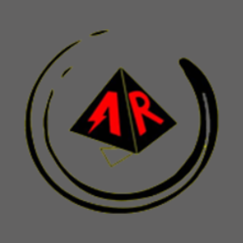 | 79587 | ARNC | Arnoya classic |
|  | 79809 | SERG | Seiren Games Network |
|  | 3890 | WINK | Wink |
| 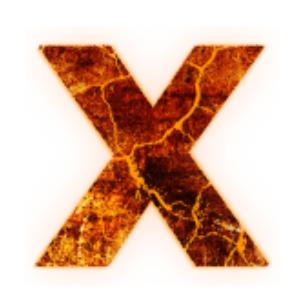 | 79395 | XLIST | XList |
| 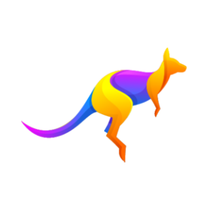 | 81281 | KRU | Kingaru |
|  | 79385 | CBT | Community Business Token |
| 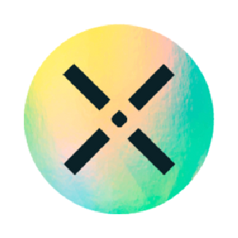 | 48897 | SHOPX | Splyt |
|  | 89489 | INTL | Intelly |
| 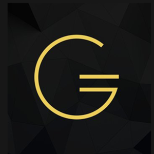 | 32301 | MNTP | GoldMint |
| 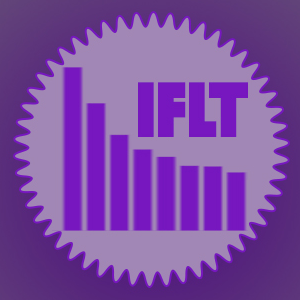 | 2318 | IFLT | InflationCoin |
| 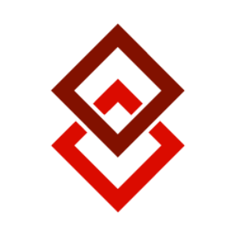 | 42537 | DEXA | DEXA COIN |
| 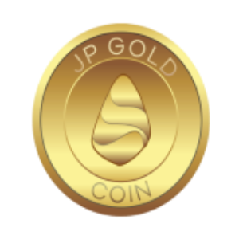 | 79007 | JPGC | JPGoldCoin |
|  | 45583 | UBXT | UpBots |
|  | 76925 | INDIA | India Coin |
| 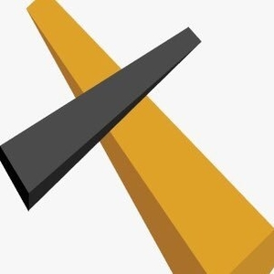 | 41553 | XLAB | XCELTOKEN PLUS |
|  | 80539 | CRB | CRB Coin |
|  | 46597 | ORO | ORO |
| 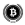 | 80405 | BITWALLET | Bitcoin E-wallet |
| 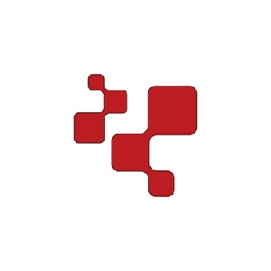 | 42097 | RPZX | Rapidz |
| 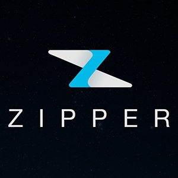 | 32784 | ZIP | ZIP |
|  | 2044 | MOJO | MojoCoin |
| 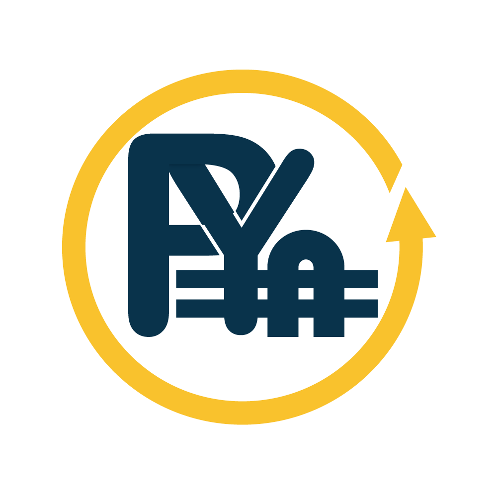 | 33635 | PYN | PAYCENT |
| 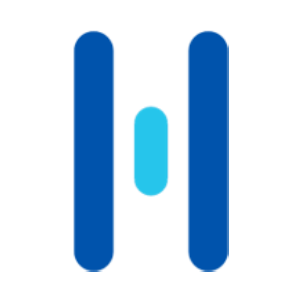 | 51097 | HTZ | Hertz Network |
| 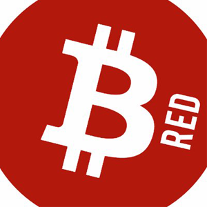 | 3237 | BTCRED | Bitcoin Red |
| 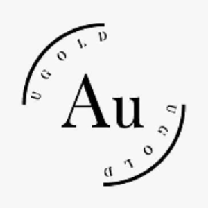 | 98007 | UGOLD | UGOLD Inc. |
| 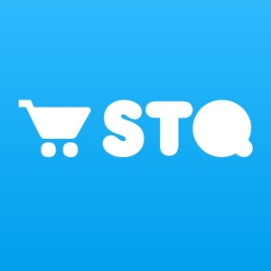 | 32443 | STQ | Storiqa |
|  | 70825 | CUBT | CubToken |
|  | 80501 | FLIKS | Film Coin |
|  | 70829 | VALI | Valimarket |
|  | 80849 | LGC | LiveGreen Coin |
|  | 80851 | LIO | Leonidasbilic |
| 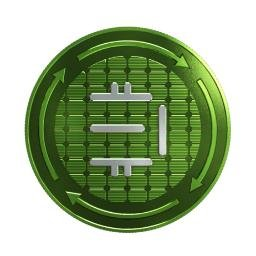 | 1655 | EDRC | EDRcoin |
|  | 70739 | VSOL | VSolidus |
|  | 32765 | LUC | Level Up Coin |
|  | 112371 | NXTU | 4 Next Unicorn |
| 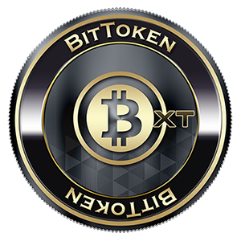 | 34426 | BXT | BitTokens |
| 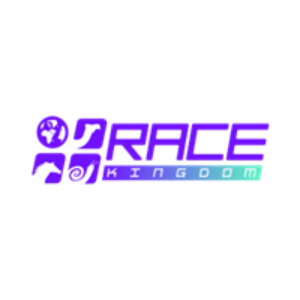 | 71257 | ATOZ | Race Kingdom |
|  | 3122 | INPAY | InPay |
|  | 94975 | MPWR | Empower |
|  | 32997 | ELY | Elysian |
| 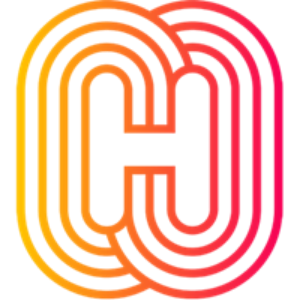 | 32515 | HQX | HOQU |
|  | 142137 | UAS | United Africa Shilling |
| 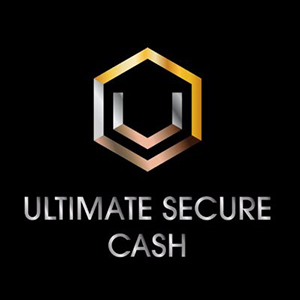 | 3356 | USC | Ultimate Secure Cash |
|  | 132021 | FURIE | Matt Furie |
| 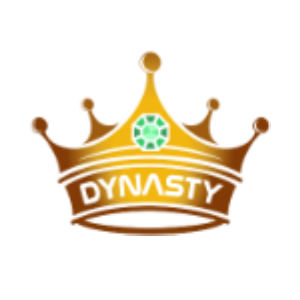 | 131801 | DNY | Dynasty Coin |
| 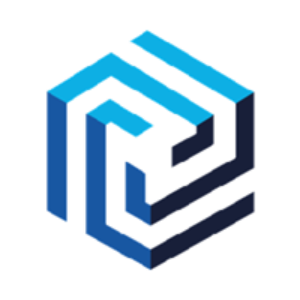 | 32928 | NBC | Niobium Coin |
|  | 111989 | CPRC | CryptoPawCoin |
|  | 131179 | GIA | Gamia |
| 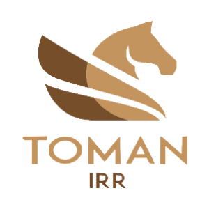 | 131209 | TOMAN | IRR |
| 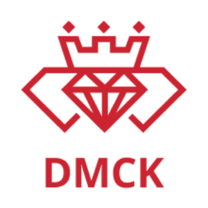 | 136417 | DMCK | Diamond Castle |
| 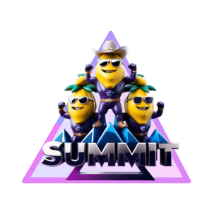 | 141841 | SUMMIT | Summit |
|  | 46988 | CTI | ClinTex CTi |
|  | 32311 | CRED | Verify |
|  | 49825 | ROSN | Roseon Finance |
|  | 53945 | DCB | Decubate |
|  | 158733 | BRAD | Brad |
|  | 158833 | AIX9 | AthenaX9 |
| 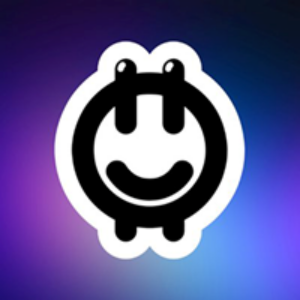 | 42485 | WOM | WOM Token |
|  | 161671 | ONF | Oracle Finance Network |
|  | 161643 | ARABCLUB | The Arab Club Token |
|  | 1467 | BOLI | BolivarCoin |
| 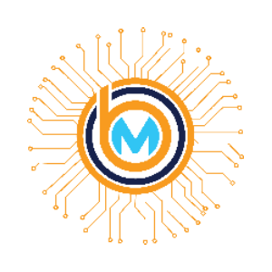 | 141815 | BFM | BenefitMine |
| 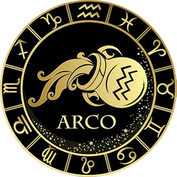 | 1910 | ARCO | AquariusCoin |
|  | 32538 | ING | Iungo |
| 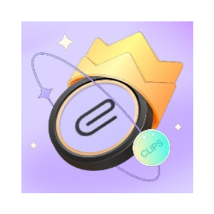 | 94527 | CLIPS | Clips |
| 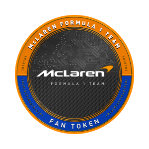 | 80495 | MCL | McLaren F1 Fan Token |
| 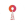 | 76573 | SPRINK | SPRINK |
| 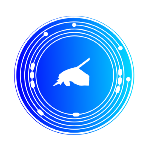 | 96141 | JOT | Jot Art |
|  | 95935 | ZILLIONXO | ZILLION AAKAR XO |
| 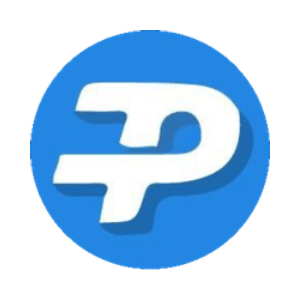 | 95183 | HPY | Hyper Pay |
|  | 126959 | MASA | Masa |
|  | 58117 | FALCX | FalconX |
| 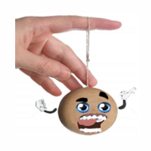 | 77671 | JYC | Joe-Yo Coin |
|  | 141757 | GHOAD | GHOAD |
| 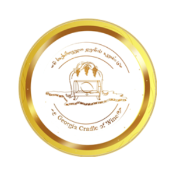 | 137847 | GCW | GCWine |
| 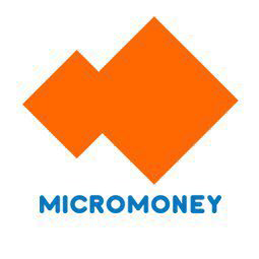 | 11287 | AMM | MicroMoney |
| 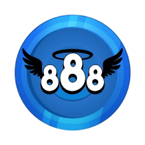 | 1742 | 888 | OctoCoin |
| 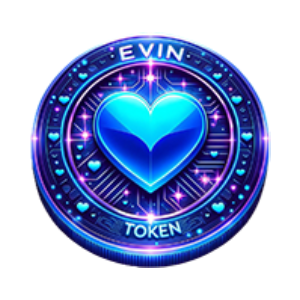 | 136733 | EVIN | Evin Token |
|  | 137475 | GGB | GGEBI |
|  | 2917 | KICK | KickToken |
|  | 32898 | BOX | ContentBox |
| 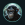 | 145107 | KOBA | KOBA |
|  | 142339 | JOULE | Joule |
| 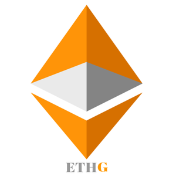 | 97065 | ETHG | Ethereum Gold |
| 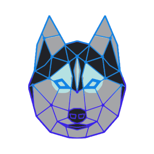 | 82469 | CADINU | Canadian Inuit Dog(NEW) |
|  | 151819 | EAFIN | EAFIN |
|  | 33827 | EXR | EXSERION |
|  | 49013 | L3P | Lepricon |
|  | 1608 | RPC | RonPaulCoin |
| 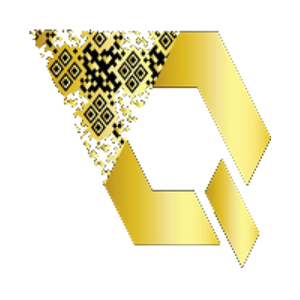 | 57381 | QRT | Qrkita Token |
|  | 81 | GCR | Global Currency Reserve |
| 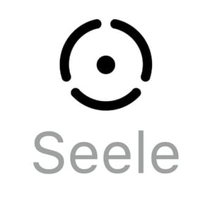 | 32764 | SEELE | Seele |
|  | 41215 | BM | Bitcomo |
| 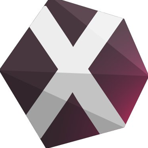 | 42229 | XIOS | Xios |
|  | 32917 | UT | Ulord |
| 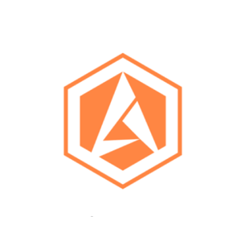 | 60689 | RBIS | ArbiSmart Token |
|  | 32810 | HUR | Hurify |
|  | 3822 | BUB | Bubble |
| 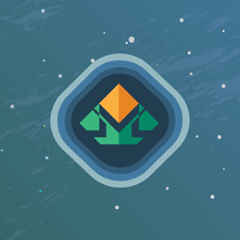 | 67493 | MIT | Galaxy Blitz |
| 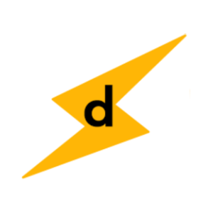 | 49685 | DFND | dFund |
| 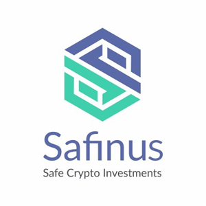 | 50887 | SAF | SafCoin |
|  | 145699 | GSLAM | GramSlams |
|  | 56783 | ANCHOR | AnchorSwap |
| 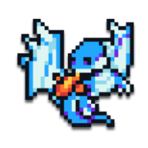 | 1412 | GP | GoldPieces |
| 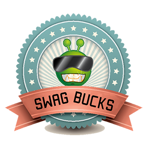 | 36365 | BUCKS | SwagBucks |
| 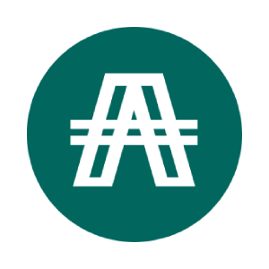 | 58323 | AOK | AOK |
|  | 1645 | ACOIN | ACoin |
|  | 3885 | QBC | Quebecoin |
|  | 3298 | VEC2 | VectorAI |
|  | 89235 | LZM | LoungeM |
| 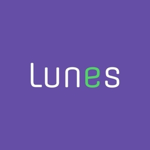 | 33273 | LUNES | LUNES |
| 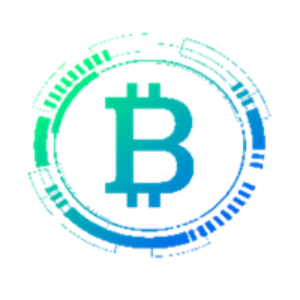 | 32323 | BTCA | Bitair |
| 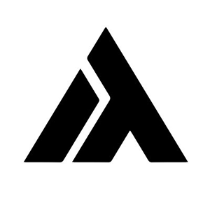 | 33910 | TERA | TERA |
|  | 266 | VIB | Viberate |
|  | 60909 | FRF | France REV Finance |
|  | 61297 | HE | Heroes & Empires |
|  | 33668 | MODX | MODEL-X-coin |
| 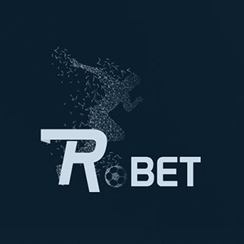 | 33758 | ROBET | RoBET |
|  | 44677 | UPI | Pawtocol |
|  | 149423 | ZOLA | The Baby Cheetah |
| 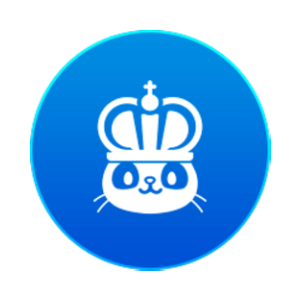 | 49035 | BCUG | Blockchain Cuties Universe Governance |
|  | 62795 | AVXT | Avaxtars |
|  | 2002 | KUSH | KushCoin |
|  | 32769 | PAT | Patron |
| 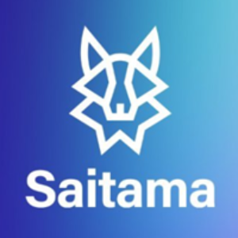 | 52047 | SAITAMA | Saitama Inu |
|  | 64919 | VENT | Vent Finance |
| 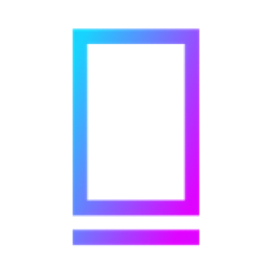 | 50883 | NFTB | NFTb |
| 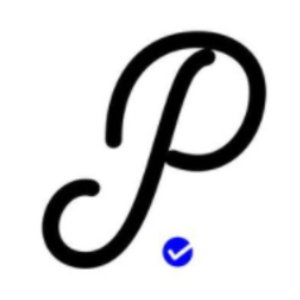 | 3055 | POLL | ClearPoll |
|  | 36381 | INFX | Influxcoin |
| 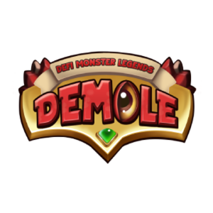 | 56159 | DMLG | Demole |
|  | 70619 | MGPT | MotoGP Fan Token |
|  | 34733 | CATT | Catex Token |
|  | 50999 | IOI | IOI Token |
|  | 41264 | FAITH | FaithCoin |
| 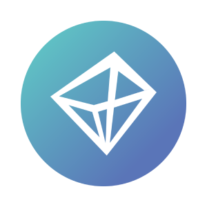 | 34735 | CREDIT | CREDIT |
| 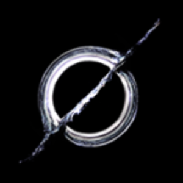 | 63127 | SGLY | Singularity |
| 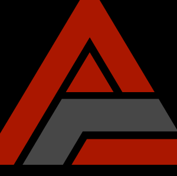 | 3817 | AMS | AmsterdamCoin |
| 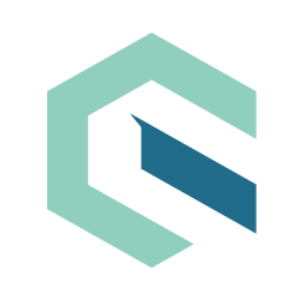 | 41742 | QQQ | Poseidon Network |
| 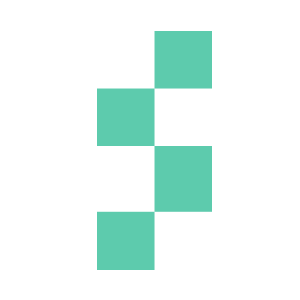 | 77927 | FST | Futureswap |
|  | 33031 | MFTU | Mainstream For The Underground |
| 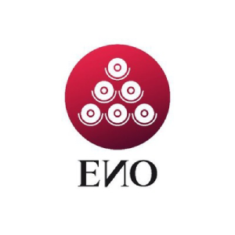 | 71365 | ENO | ENO |
|  | 71389 | EGO | EGO |
|  | 36350 | TORQ | TORQ Coin |
|  | 98739 | TURN | Big Turn |
| 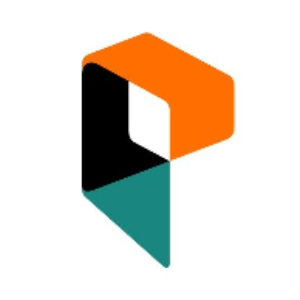 | 98679 | XPLL | ParallelChain |
|  | 48905 | RAZE | Raze Network |
| 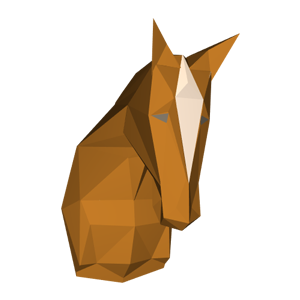 | 32531 | HORSE | Ethorse |
| 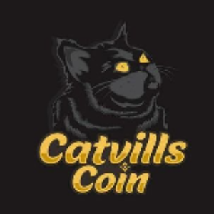 | 82395 | CATVILLS | Catvills Coin |
|  | 82323 | KXP | KodexPay |
|  | 82331 | BITRA | Bitratoken |
| 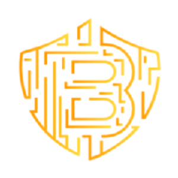 | 71339 | BEMD | Betterment Digital |
| 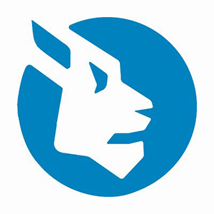 | 44014 | IOWN | iOWN |
|  | 32313 | GUESS | Peerguess |
| 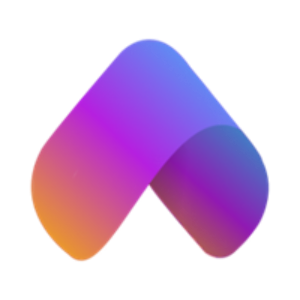 | 54369 | DFA | Define |
| 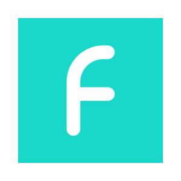 | 59989 | FOR | ForTube |
|  | 32482 | SIG | Spectiv |
|  | 33793 | TYPE | Typerium |
|  | 51685 | HBIT | HashBit |
| 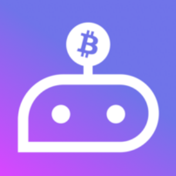 | 33269 | GPT | GoPower |
| 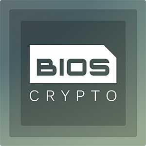 | 34450 | BIOS | BiosCrypto |
| 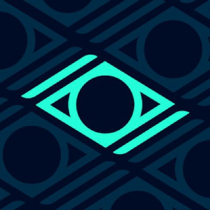 | 33701 | WIT | WITChain |
|  | 41229 | VGR | Voyager |
| 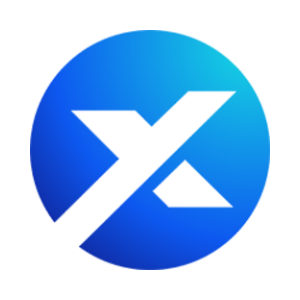 | 60089 | XY | XY Finance |
|  | 47541 | SHDC | SHD Cash |
|  | 48590 | LUNA | Luna Coin |
| 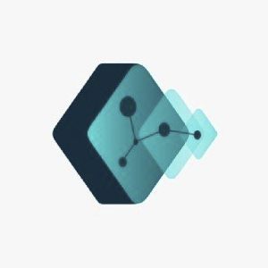 | 44681 | CRDT | CRDT |
| 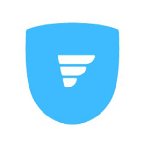 | 45331 | CAID | ClearAid |
| 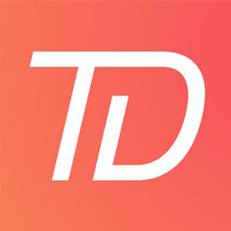 | 32640 | TDS | TokenDesk |
| 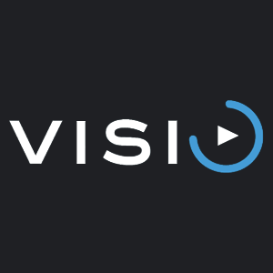 | 3082 | VISIO | Visio |
| 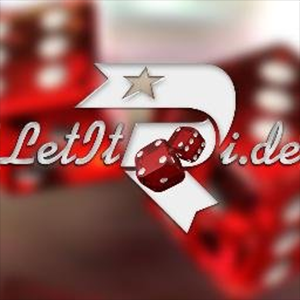 | 3610 | LIR | LetItRide |
|  | 45155 | DTCN | Datocoin |
|  | 61293 | CLH | ClearDAO |
|  | 3645 | SANDG | Save and Gain |
| 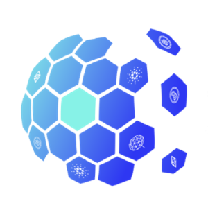 | 65321 | SPHRI | Spherium |
|  | 49955 | PALG | PalGold |
|  | 80265 | GOLC | GOLCOIN |
|  | 58707 | ONSTON | Onston |
| 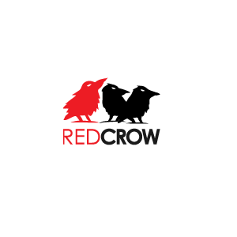 | 151847 | RCX | RecycleX |
| 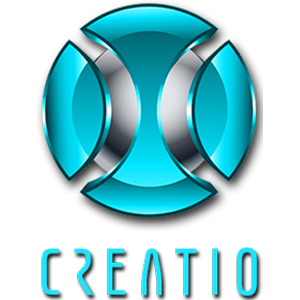 | 1915 | XCRE | Creatio |
|  | 2614 | ONION | DeepOnion |
| 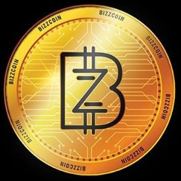 | 44165 | BIZZ | BIZZCOIN |
|  | 44674 | AENS | AEN Smart Token |
|  | 44530 | GLEX | GLEX |
|  | 44520 | CNG | CNG Casino |
| 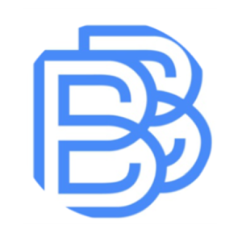 | 44559 | BBT | BitBoost |
|  | 45425 | PEARL | Pearl Finance |
|  | 46016 | QHC | QChi Chain |
|  | 111397 | VRTX | Vertex Protocol |
|  | 45157 | TDH | TrustedHealth |
|  | 44223 | WBX | WiBX |
|  | 45158 | VVI | VV Coin |
|  | 45048 | FTEC | FTEC |
| 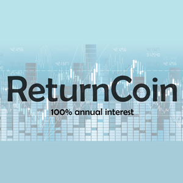 | 45221 | RNC | RenewCash |
| 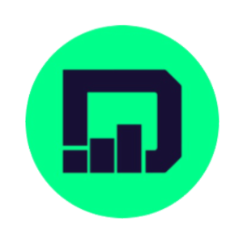 | 53873 | DAISY | Daisy Launch Pad |
| 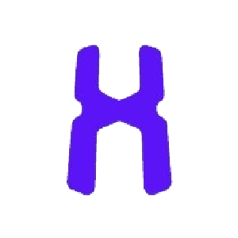 | 53887 | HMT | Human |
|  | 53915 | EQX | EQIFI |
| 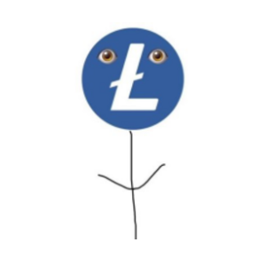 | 144639 | LESTER | Litecoin Mascot |
|  | 61119 | MOOND | MoonsDust |
|  | 2864 | MTH | Monetha |
| 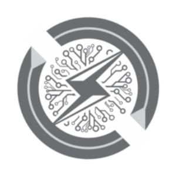 | 58029 | SILVA | Silva Token |
| 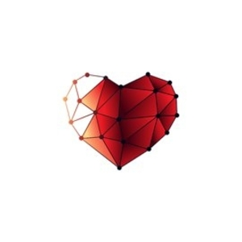 | 44450 | HEAL | Etheal |
|  | 32554 | LATX | LatiumX |
| 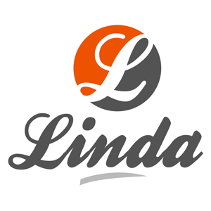 | 454 | LINDA | Linda |
|  | 125203 | TERRA | TERRABYTE AI |
|  | 46002 | VALUE | Value Liquidity |
| 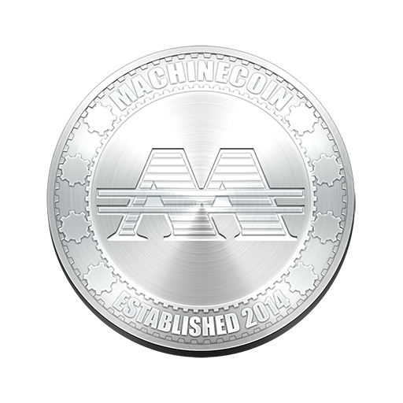 | 125953 | MAC | Meta Art Connection |
| 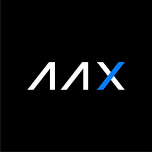 | 44185 | AAB | AAX Token |
| 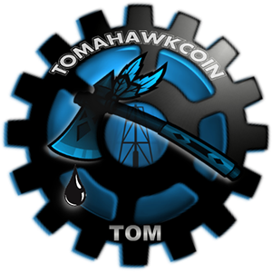 | 46918 | TOM | TOM Finance |
|  | 3141 | MAO | Mao Zedong |
| 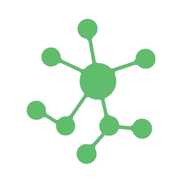 | 46319 | GHD | Giftedhands |
|  | 65079 | RELAY | Relay Token |
|  | 161869 | YALA | Yala |
|  | 44921 | BZO | Bizomni |
| 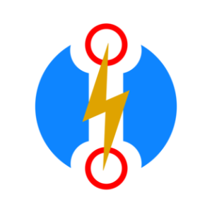 | 48107 | IJC | IjasCoin |
| 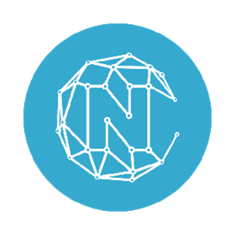 | 32344 | NCASH | Nucleus Vision |
| 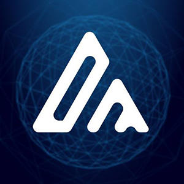 | 47987 | DMX | Dymmax |
|  | 44812 | AMZ | AmazonaCoin |
|  | 44879 | GMR | Gimmer |
|  | 44963 | MONEY | MoneyCoin |
| 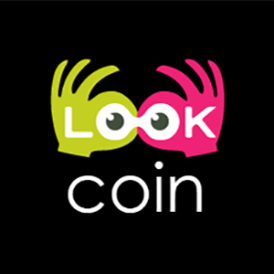 | 44948 | LOOK | LookRev |
| 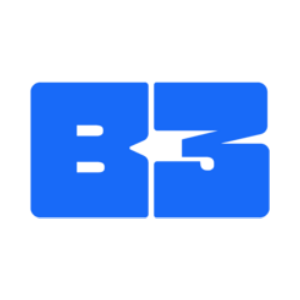 | 44914 | B3 | B3 Coin |
| 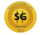 | 44944 | GELD | SGelderGER |
|  | 54393 | DOGO | DogemonGo |
|  | 51775 | GMY | Gameology |
|  | 125475 | IRBIS | Snow Leopard - IRBIS |
|  | 32942 | CYFM | CyberFM |
|  | 96909 | WEFI | WeFi |
| 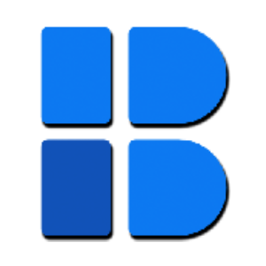 | 111511 | BLOCX | BLOCX. |
|  | 32374 | CRPT | Crypterium |
|  | 50715 | HVE2 | Uhive |
| 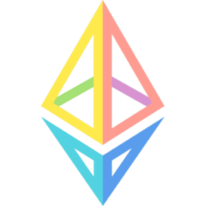 | 50589 | ETH2 | Eth 2.0 Staking by Pool-X |
| 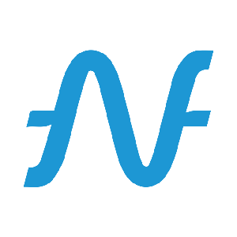 | 3020 | SNC | SunContract |
| 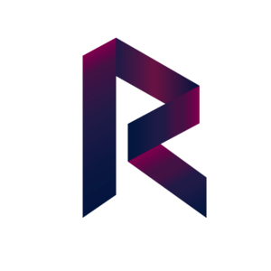 | 495 | REV | Revain |
|  | 32854 | FTO | FuturoCoin |
|  | 33439 | WPP | WPP TOKEN |
|  | 471 | NLC2 | NoLimitCoin |
|  | 33107 | WIKI | Wiki Token |
|  | 2288 | MGO | MobileGo |
| 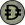 | 2374 | DALC | DALECOIN |
|  | 2380 | IFT | investFeed |
|  | 2440 | CRM | Cream |
|  | 2590 | OTN | Open Trading Network |
| 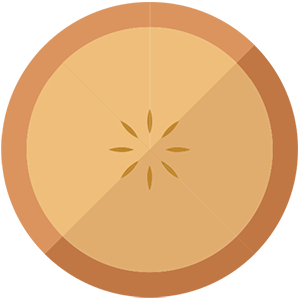 | 2273 | PIE | PieCoin |
|  | 164599 | ARCOS | ArcadiaOS |
| 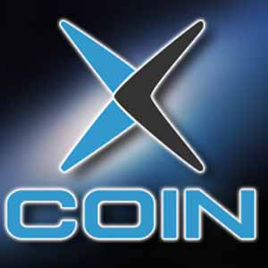 | 2252 | XCO | X-Coin |
|  | 146761 | BAKENEKO | BAKENEKO |
|  | 1899 | KURT | Kurrent |
| 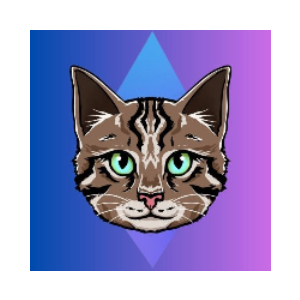 | 127371 | HEMULE | Hemule |
|  | 147931 | PAW | PAW |
|  | 32297 | HKN | Hacken |
|  | 133039 | PIZZA | Bitcoin Pizza Day |
| 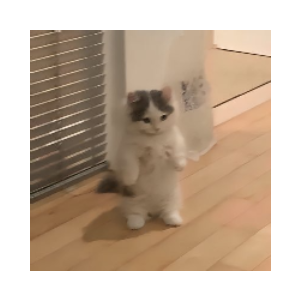 | 135313 | MICHI | Michi |
|  | 121895 | PMON | Polychain Monsters |
|  | 55121 | CRIC | Cricket Foundation |
|  | 122095 | DMAIL | DMAIL Network |
|  | 112749 | JARED | Jared From Subway |
|  | 51661 | YSOY | YSOY Chain |
| 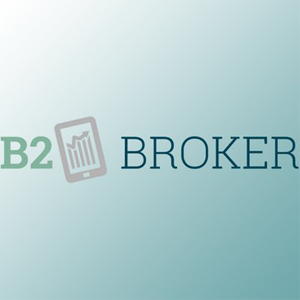 | 10708 | B2B | B2BX |
|  | 113081 | SACA | Sacabambaspis |
| 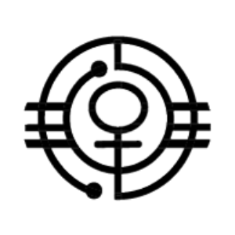 | 91081 | EVEAI | Eve AI |
|  | 42739 | UCX | UCX |
| 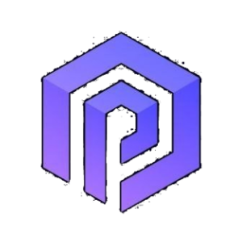 | 69003 | POLYPAD | PolyPad |
| 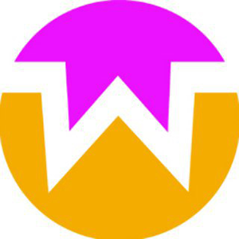 | 36551 | WOW | Wownero |
|  | 68353 | LIFT | Uplift |
|  | 69755 | TIFI | TiFi |
| 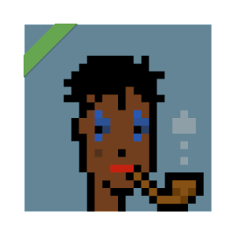 | 67743 | DDDD | People's Punk |
| 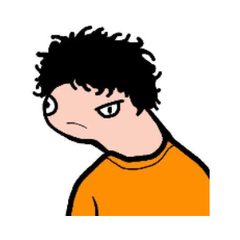 | 65609 | SBF | SteakBank Finance |
| 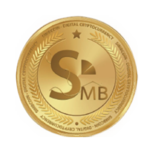 | 51967 | SMBSWAP | SimbCoin Swap |
| 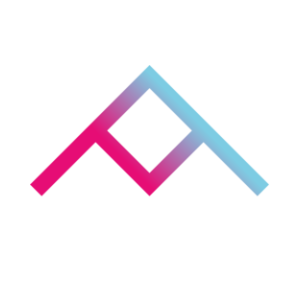 | 61967 | ARTEM | Artem |
|  | 78019 | UNB | Unbound Finance |
|  | 55495 | LTD | LiveTrade Token |
|  | 63451 | QMALL | Qmall |
|  | 144791 | BAMA | Bitbama |
|  | 51787 | CARMA | Carma Coin |
|  | 54697 | MMS | Minimals |
|  | 49689 | WOLFY | WOLFY |
|  | 54921 | DAW | Deswap |
|  | 48045 | TRDG | Tardigrades Finance |
| 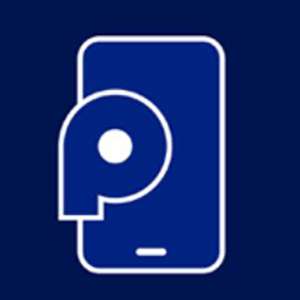 | 55011 | PHM | Phantom Protocol |
|  | 46303 | SHAKE | SHAKE |
| 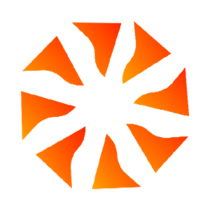 | 54911 | SUNNY | Sunny Aggregator |
|  | 46687 | WBIND | Wrapped BIND |
|  | 47437 | MATTER | AntiMatter |
| 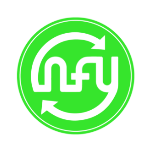 | 46328 | NFY | Non-Fungible Yearn |
|  | 45885 | DOUGH | PieDAO DOUGH v2 |
| 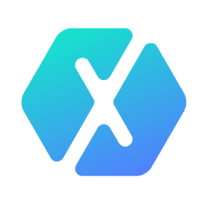 | 36574 | PERL | Perlin |
|  | 416 | ECN | E-Coin |
|  | 141257 | EUSD | Electronic USD |
| 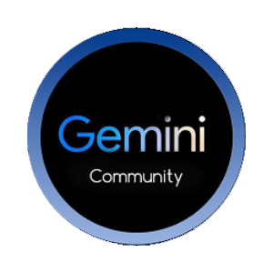 | 123341 | GEMINI | Gemini AI |
|  | 49291 | PARA | Paralink Network |
| 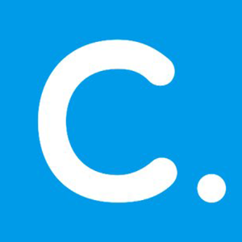 | 32528 | CPAY | Cryptopay |
|  | 122567 | XOX | XOX Labs |
|  | 113425 | GDAG | GhostDAG.org |
|  | 125613 | GRIMACE | Grimace |
| 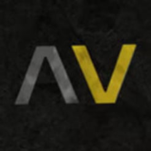 | 99449 | HAVOC | havoc |
|  | 126473 | NGY | NAGAYA |
| 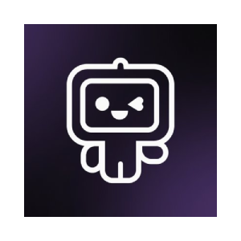 | 151593 | DAIWO | D.A.I.Wo |
|  | 94833 | SU | Smol Su |
|  | 70347 | BLITZ | Blitz Labs |
|  | 68365 | SUNDER | Sunder Goverance Token |
| 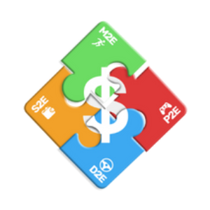 | 66539 | IRENA | IRENA Green Energy |
| 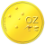 | 41199 | OZC | Ozziecoin |
|  | 65187 | GDOGE | Golden Doge |
|  | 148269 | LUMO | Lumo-8B-Instruct |
| 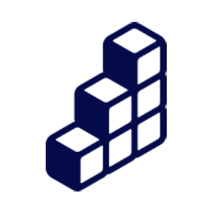 | 58999 | TEMP | Tempus |
| 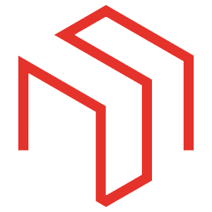 | 3757 | TIE | Ties.DB |
| 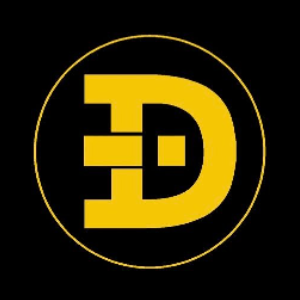 | 122443 | DOGI | dogi |
|  | 46329 | YFMB | YFMoonBeam |
| 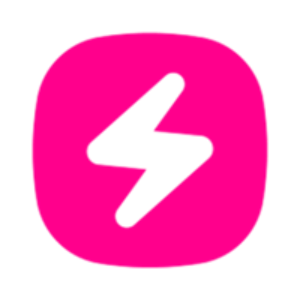 | 121623 | FTN | Fasttoken |
|  | 46542 | L2 | Leverj Gluon |
| 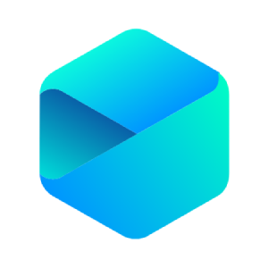 | 33361 | IQN | IQeon |
| 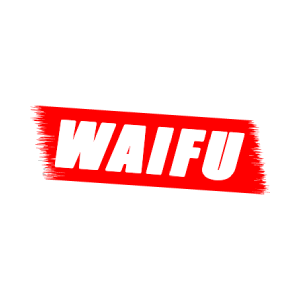 | 45089 | WAIF | Waifu Token |
|  | 165771 | ROVR | ROVR Network |
| 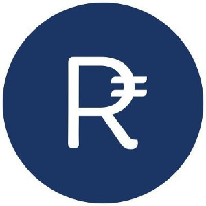 | 2533 | RUP | Rupee |
| 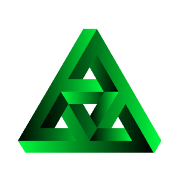 | 146803 | CRAZE | Craze |
|  | 32940 | LIF | Winding Tree |
| 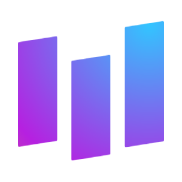 | 123055 | MIMO | Mimo Governance Token |
| 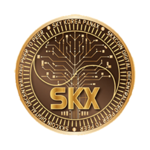 | 136625 | SKX | SKPANAX |
| 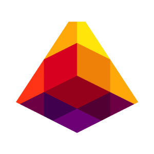 | 151245 | LAVA | Vulcan Forged (LAVA) |
|  | 136235 | WIWI | Wiggly Willy |
|  | 136591 | NEIREI | NeiRei |
|  | 48303 | PCNT | Playcent |
| 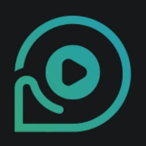 | 122657 | DMCC | DiscoverFeed |
|  | 131187 | HYPERAI | HyperHash AI |
|  | 122661 | EMOJI | MOMOJI |
| 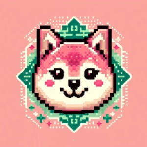 | 122751 | SHEB | SHEBOSHIS |
|  | 125155 | MEGABOT | Megabot |
| 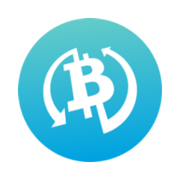 | 63161 | UBXS | UBXS Token |
|  | 122573 | CZOL | Czolana |
|  | 123733 | EGT | Elon GOAT |
| 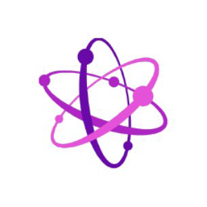 | 122857 | DEB | Andus Chain |
|  | 113651 | PTKN | Panda |
| 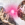 | 100285 | GYOSHI | GYOSHI |
|  | 122861 | MOONKIZE | MoonKize |
|  | 122677 | ICG | Invest Club Global |
|  | 100143 | TAIL | Tail |
| 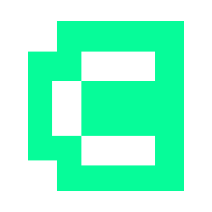 | 77745 | CANTO | CANTO |
|  | 47567 | PRCY | PRCY Coin |
|  | 122239 | AINN | AINN |
|  | 69197 | INFLEX | Inflex Finance |
|  | 141449 | ELIZA | Eliza (ai16zeliza) |
| 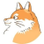 | 59709 | SHIBLI | Studio Shibli |
|  | 58467 | FIREROCKET | FireRocket |
| 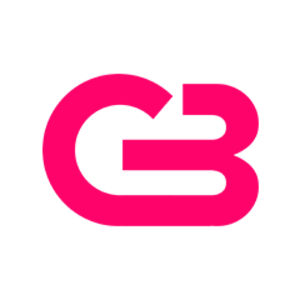 | 69803 | GBEX | Globiance Exchange |
| 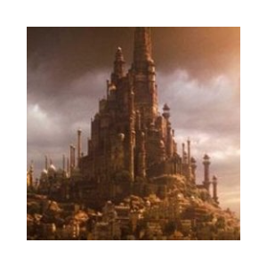 | 58359 | THECITADEL | The Citadel |
| 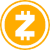 | 162859 | ZD | Zarraz Dollar |
|  | 151611 | DST | DAYSTARTER |
| 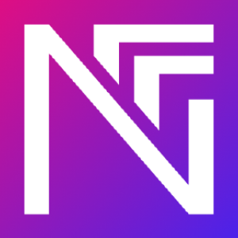 | 50903 | N1 | NFTify |
|  | 48065 | MUTE | Mute |
|  | 151631 | SHONG | Shong Inu |
| 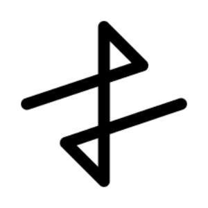 | 152269 | AP3X | Apex Fusion |
|  | 163973 | TRUMP47 | 47th President of the United States |
| 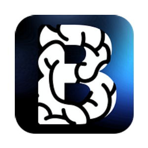 | 127303 | BRAINERS | Brainers |
|  | 158701 | TQ | TonQuestion |
|  | 153941 | ANNE | ANNE |
|  | 123163 | GROK2.0 | GROK 2.0 |
| 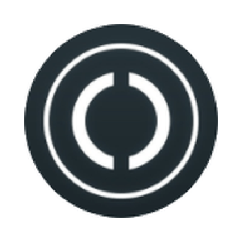 | 10682 | OCN | Odyssey |
| 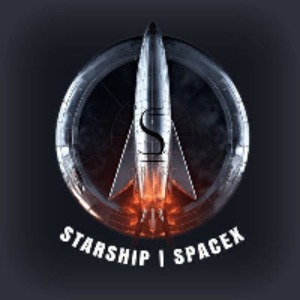 | 113227 | SSHIP | StarShip ERC20 |
| 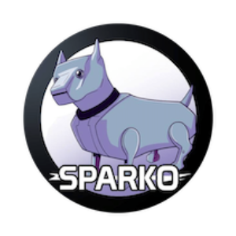 | 113209 | SPARKO | Sparko |
|  | 112137 | PANO | PanoVerse |
|  | 122001 | SAKE | SakeToken |
|  | 63359 | RCH | Rich |
| 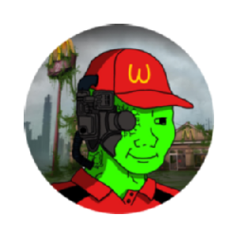 | 111789 | WAGIEBOT | Wagie Bot |
|  | 150955 | BGR | Bitgrit |
| 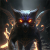 | 94375 | SHADOWCATS | Shadowcats |
|  | 3119 | INXT | Internxt |
|  | 64989 | VERSE | Shibaverse |
|  | 162537 | RECON | RECON |
| 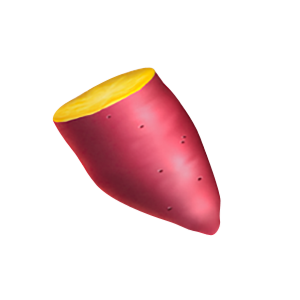 | 60013 | YAM | YAM |
|  | 50601 | NAUT | Astronaut |
|  | 81497 | ZEBI | Zebi Token |
|  | 146859 | MDTI | MEDITOC |
| 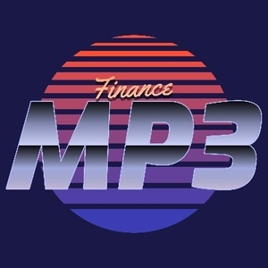 | 48231 | MP3 | MP3 |
|  | 46640 | GDAO | Governor DAO |
| 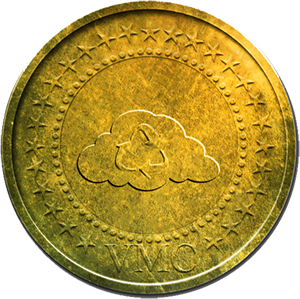 | 147197 | VMC | VMS Classic |
| 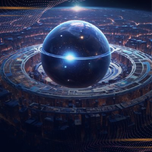 | 144885 | ASI | Sender AI |
| 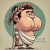 | 146565 | GLUTEU | Gluteus Maximus by Virtuals |
|  | 48727 | NMX | Nominex |
| 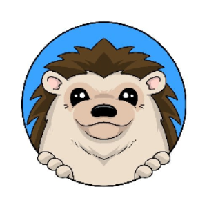 | 141495 | RIZO | HahaYes |
| 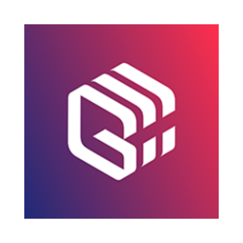 | 78113 | GFT | Game Fantasy |
|  | 125617 | GROK1.5 | Grok1.5 |
|  | 113329 | DMIND | DecentraMind |
|  | 146511 | KANDO | KANDO AI |
| 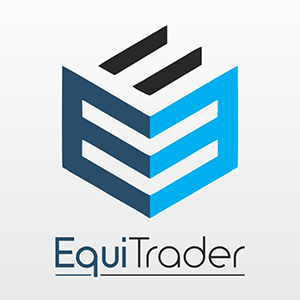 | 2488 | EQT | EquiTrader |
|  | 113759 | RKR | Reaktor |
|  | 112273 | MONIE | Infiblue World |
|  | 3101 | MXT | MarteXcoin |
| 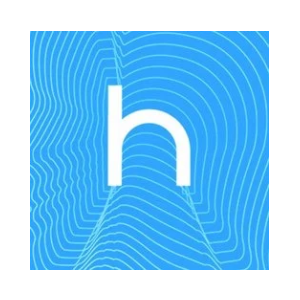 | 178 | HMQ | Humaniq |
| 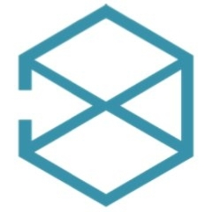 | 111525 | PNP | Penpie |
|  | 32395 | CVT | CyberVein |
|  | 71039 | RAMA | Ramestta |
|  | 69239 | AUDT | Auditchain |
|  | 130493 | DTBX | Dotblox |
| 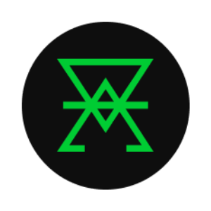 | 64767 | KLIMA | Klima DAO |
| 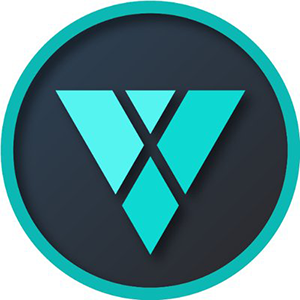 | 531 | XBY | XtraBYtes |
|  | 57871 | CHIRO | Chihiro Inu |
| 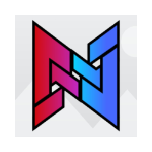 | 127931 | NCO | Nexacore |
| 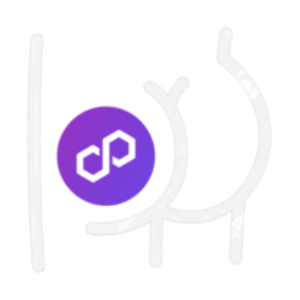 | 127991 | CULO | CULO |
|  | 50335 | SAFEZONE | SafeZone |
|  | 32400 | LET | LinkEye |
|  | 49963 | VPP | Virtue Poker Points |
| 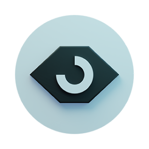 | 47937 | BOG | Bogged Finance |
|  | 141565 | SEKOIA | sekoia by Virtuals |
| 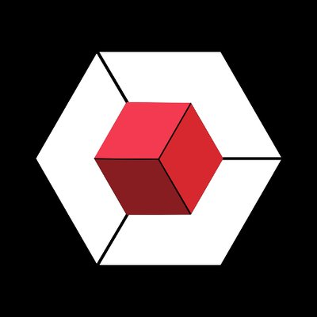 | 2509 | HAC | Hackspace Capital |
| 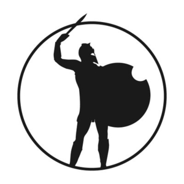 | 166287 | IRC | IRIS Chain |
| 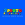 | 165167 | SPRSTR | SprotoStrategy |
| 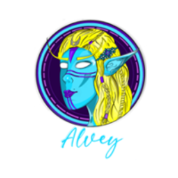 | 78429 | WALV | Alvey Chain |
|  | 124099 | FXST | FX Stock Token |
| 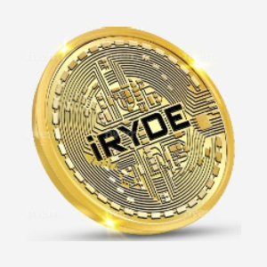 | 130239 | IRYDE | iRYDE COIN |
|  | 146471 | LUIGI | Luigi Mangione |
|  | 130401 | PREAI | Predict Crypto |
| 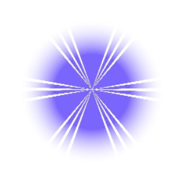 | 123871 | HOL | Hololoot |
| 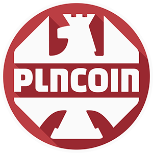 | 124731 | PLNC | PLNcoin |
| 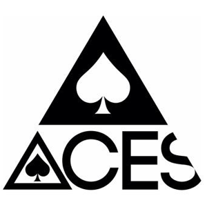 | 124735 | ACES | Aces |
|  | 94601 | FOFO | FOFO Token |
|  | 66329 | WIPE | WipeMyAss |
|  | 127187 | YOURAI | YOUR AI |
| 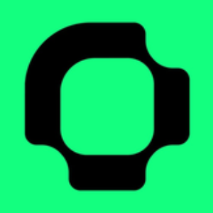 | 65335 | OASIS | ProjectOasis |
| 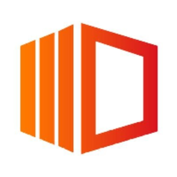 | 123385 | STA | STA |
| 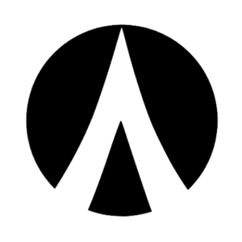 | 2332 | DCN | Dentacoin |
|  | 65711 | IMPACTX | ImpactX |
|  | 123779 | BBL | BlockBlend |
|  | 49461 | POP! | POP |
|  | 47871 | IDV | Idavoll Network |
|  | 50319 | MBONK | megaBonk |
|  | 169159 | CROTCH | CROTCH |
|  | 162561 | RSP | Reality Spiral |
| 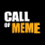 | 164751 | COMMS | CallofMeme |
| 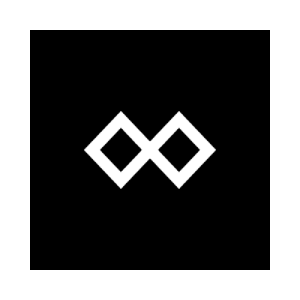 | 217 | PAY | TenX Pay |
|  | 150901 | BNBXBT | BNBXBT |
|  | 141819 | WXM | WeatherXM |
| 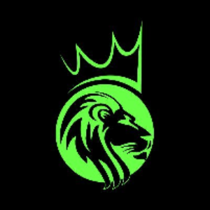 | 127275 | BFICGOLD | BFICGOLD |
|  | 136225 | BL00P | BLOOP |
|  | 76389 | ARCT | ArbitrageCT |
|  | 126675 | HIGHER | HIgher IMO |
| 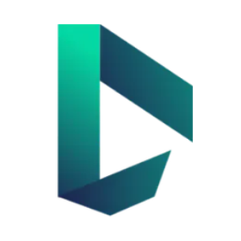 | 71327 | BDY | Buddy DAO |
|  | 3157 | HPC | Happycoin |
| 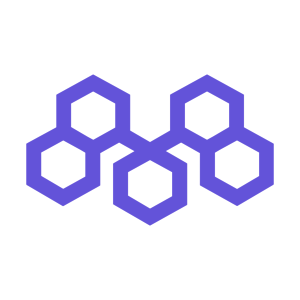 | 32727 | MITX | Morpheus Labs |
|  | 68145 | NEKI | Maneki-neko |
|  | 65765 | CBET | CBET Token |
|  | 169247 | KROAK | Kroak on Kaspa |
| 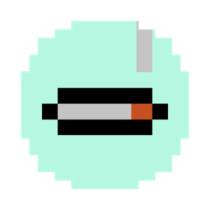 | 64761 | JPEG | JPEG'd |
| 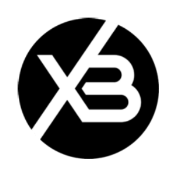 | 112917 | XB | XBANKING |
|  | 63021 | FLOKIPUP | Floki Pup |
| 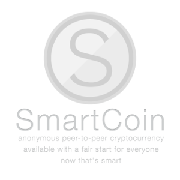 | 1715 | SMC | SmartCoin |
| 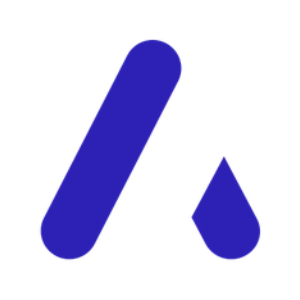 | 3103 | ATL | ATLANT |
|  | 57037 | CHEFCAKE | ChefCake |
|  | 56767 | NEZUKO | Nezuko Inu |
| 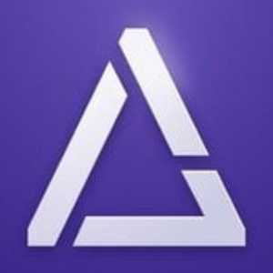 | 126349 | TKAI | TAIKAI |
| 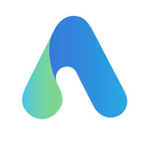 | 115103 | ALV | Alvey Chain |
|  | 55351 | GRPFT | Grapefruit Coin |
| 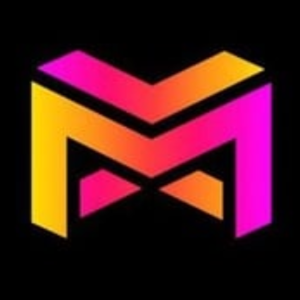 | 49255 | MEL | Melalie |
|  | 2860 | TCC | The ChampCoin |
|  | 49839 | BSCCROP | BSCCrop |
|  | 1225 | CBX | Bullion |
| 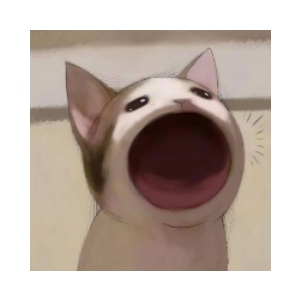 | 137417 | POPO | Popo |
| 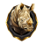 | 125237 | WHRH | White Rhinoceros |
| 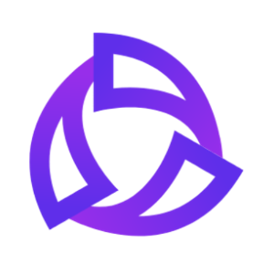 | 81709 | REVA | Revault Network |
|  | 127313 | TYBG | Base God |
|  | 65749 | SMCW | Space Misfits |
|  | 1954 | VIDZ | PureVidz |
| 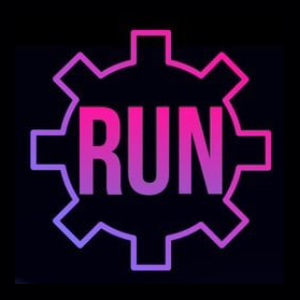 | 59909 | RUN | Run |
| 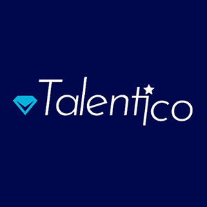 | 114043 | TAL | TalentIDO |
|  | 114135 | ADVB | Adverb |
|  | 55457 | FAVE | Favecoin |
| 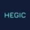 | 48361 | RHEGIC2 | rHEGIC2 |
| 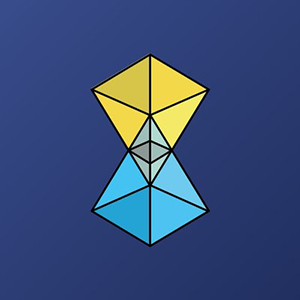 | 33679 | SAT | Social Activity Token |
|  | 47601 | BSCV | Bscview |
|  | 113905 | FIERO | Fiero |
| 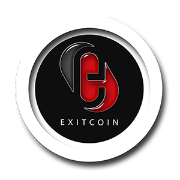 | 127601 | EXIT | EXIT Designer Token |
|  | 131533 | SALMAN | Mohameme Bit Salman |
|  | 127687 | CAVADA | Cavada |
|  | 124851 | DREAM | Dream |
|  | 93903 | GENW | Gen Wealth |
| 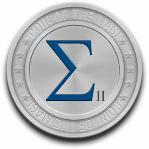 | 51 | XMG | Magi |
| 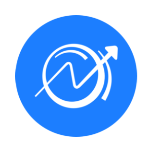 | 48849 | ODDZ | Oddz |
|  | 94275 | SERP | Shibarium Perpetuals |
| 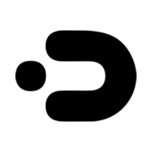 | 80735 | DDAO | DeFi Hunters DAO |
| 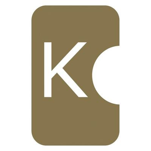 | 32847 | KBC | Karatgold Coin |
| 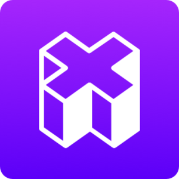 | 62767 | XTK | xToken |
|  | 54195 | WITCH | Witch Token |
|  | 47148 | MSWAP | MoneySwap |
| 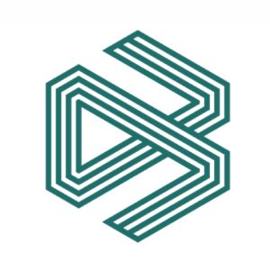 | 47138 | B21 | B21 |
|  | 46593 | YFD | YfDFI Finance |
|  | 158463 | AVM | Agent Virtual Machine |
| 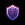 | 112971 | NAAI | NeoAudit AI |
|  | 99507 | MEMBOT | Membot |
| 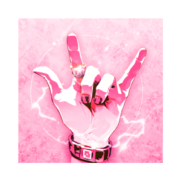 | 98697 | PARTY | Pool Partyyy |
| 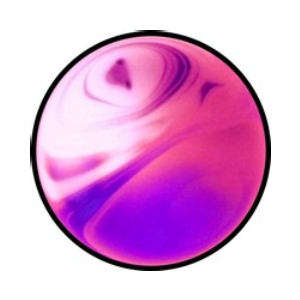 | 94171 | NERF | Neural Radiance Field |
| 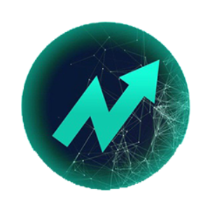 | 86131 | TUF | TUF Token |
|  | 64023 | SHIBTAMA | Shibtama |
|  | 63635 | UMEE | Umee |
|  | 59443 | DOGEZ | DogeZilla Token |
|  | 50445 | PUBE | Pube Finance |
|  | 164589 | CMX | CMX Agent |
|  | 162389 | DILDO | Green Dildo Coin |
|  | 138927 | PTC | Patriots Coin |
|  | 127031 | WIFSA | dogwifsaudihat |
| 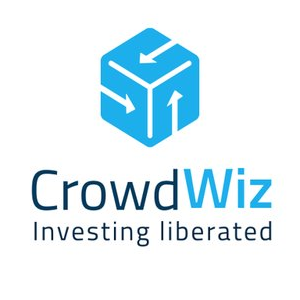 | 79153 | WIZ | BlueWizard |
| 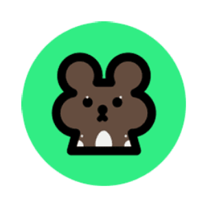 | 80115 | QUO | Quoll Finance |
| 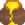 | 68419 | HONEYD | Honey Deluxe |
|  | 66113 | CMD | Comodo Coin |
|  | 66617 | CIA | CIA |
| 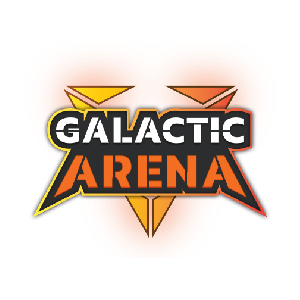 | 58145 | GAN | Galactic Arena: The NFTverse |

---

[← Prev](./list4.md) | [Next →](./list6.md)
