[← Prev](./list5.md) | [Next →](./list7.md)

| Logo | ID | Symbol | Name |
|:----:|:--:|:------:|:-----|
| 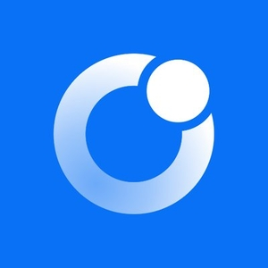 | 5436 | HYDROG | Hydrogen |
| 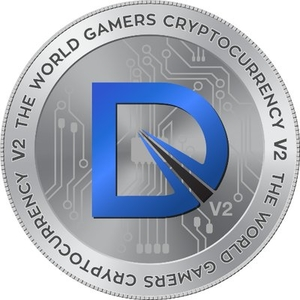 | 5437 | DXC | DixiCoin |
|  | 5438 | OWD | Owlstand |
|  | 5439 | CHBR | CryptoHub |
|  | 5440 | ELLI | ElliotCoin |
| 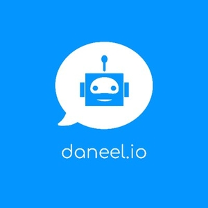 | 5442 | DAN | Daneel |
| 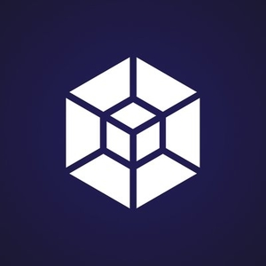 | 5443 | CSEN | Sentient Coin |
| 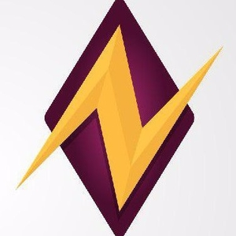 | 5444 | FTOKEN | Flash Token |
|  | 5445 | LIVE | Live Stars |
|  | 5446 | GBG | Golos Gold |
| 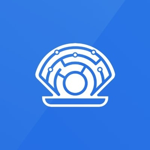 | 5447 | SHL | Oyster Shell |
|  | 5448 | KEC | KEYCO |
| 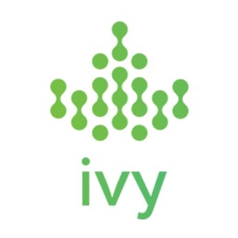 | 5449 | IVY | IvyKoin |
| 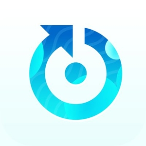 | 5450 | AMN | Amon |
|  | 5451 | HYDROP | Hydro Protocol |
| 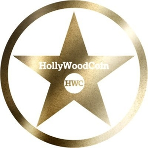 | 5452 | HWC | HollyWoodCoin |
|  | 5453 | BITGOLD | bitGold |
|  | 5454 | SABR | SABR Coin |
|  | 5455 | BITSILVER | bitSilver |
| 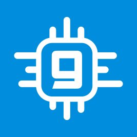 | 5456 | GIN | GINcoin |
| 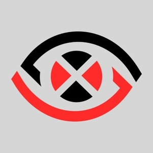 | 5458 | NLX | Nullex |
|  | 5459 | FACE | Faceter |
|  | 5461 | ACAD  | Academy Token |
| 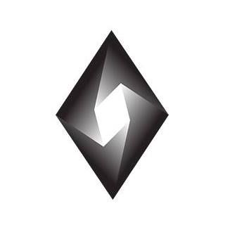 | 5462 | SMQ | Simdaq |
| 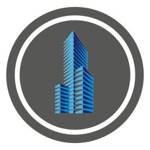 | 5463 | RLD | RealLand Token |
| 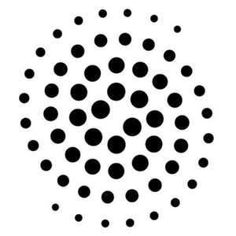 | 5464 | STM | Streamity |
| 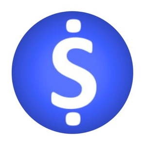 | 5465 | BSM | BITSUM |
| 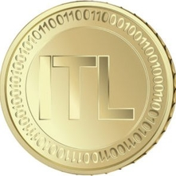 | 5466 | ITL | Italian Lira |
| 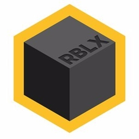 | 5467 | RBLX | Rublix |
| 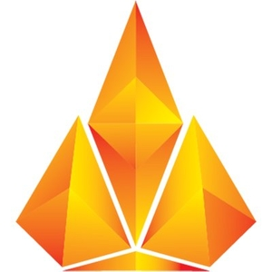 | 5468 | BALI | BALI COIN |
|  | 5469 | ITM | Intimate |
|  | 5470 | AITT | AITrading |
|  | 5472 | UCT | Ubique Chain Of Things |
| 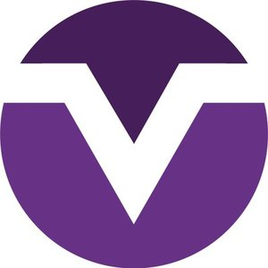 | 5473 | XMV | MoneroV |
|  | 5474 | ELY | Elysian |
| 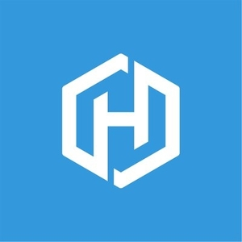 | 5475 | HER | Hero Node |
|  | 5476 | WTCOIN | Worldtelevisioncoin |
| 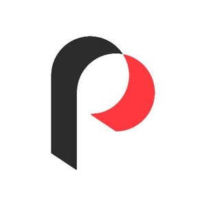 | 5477 | PARLAY | Parlay |
|  | 5478 | SLX | Slate |
| 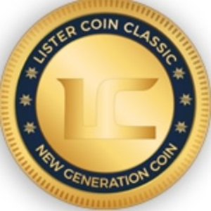 | 5479 | LTCC | Listerclassic Coin |
|  | 5480 | TFC | The Freedom Coin |
| 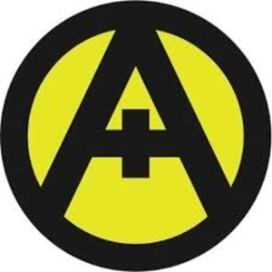 | 5481 | AMX | Amero |
|  | 5482 | XBB | BrickBlock |
| 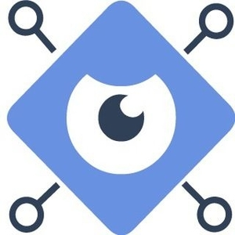 | 5484 | IBT | IcoBay |
| 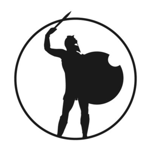 | 5485 | IRC | IRONCOIN |
|  | 5486 | PLATC | PlatinCoin |
|  | 5487 | OIO | Online |
| 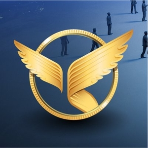 | 5488 | ANGL | Angel Token |
| 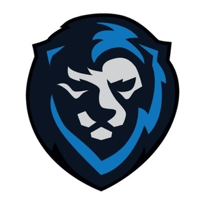 | 5489 | KNG | BetKings |
| 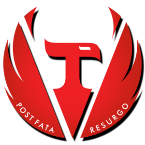 | 5490 | REDV | Redvolution |
| 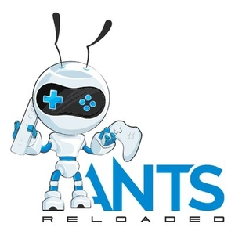 | 5491 | ANTS | ANTS Reloaded |
|  | 5492 | VDOC | Duty of Care Token |
|  | 5493 | RR | Revizor Coin |
| 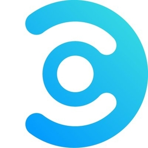 | 5494 | CMM | Commercium |
| 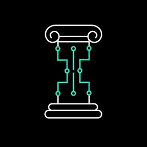 | 5496 | COG | Cognitio |
|  | 5497 | WYS | Wysker |
| 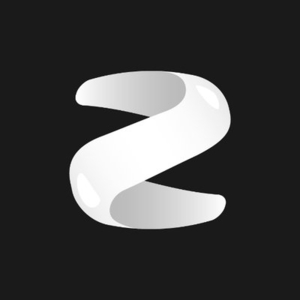 | 5498 | ZIPT | Zippie |
| 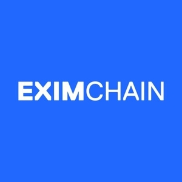 | 5499 | EXC | Eximchain |
| 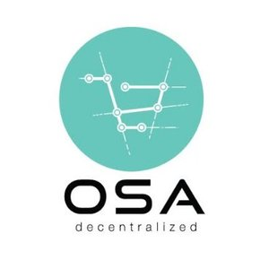 | 5500 | OSA | OSA token |
|  | 5501 | MUSEUM | Marquise Museum |
|  | 5502 | SCS | Solcasino Token |
|  | 5503 | BEN | Ben |
|  | 5504 | BCIO | Blockchain.io |
|  | 5505 | BMK | Benchmark |
| 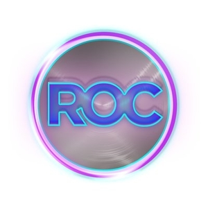 | 5506 | ROC | Rasputin Online Coin |
|  | 5507 | INFO | INFO Coin |
|  | 5508 | MMC2 | Market Maker |
| 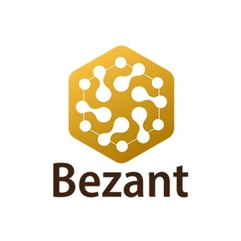 | 5509 | BZNT | Bezant |
| 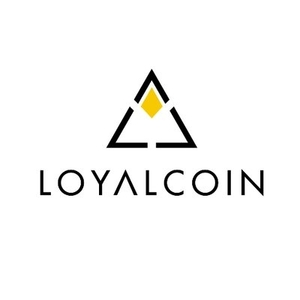 | 5510 | LYL | LoyalCoin |
| 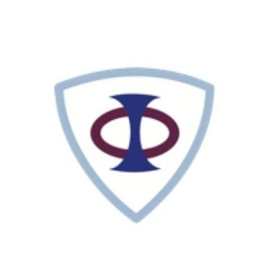 | 5511 | PHI | PHI Token |
| 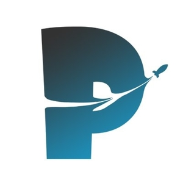 | 5512 | PMNT | Paymon |
|  | 5513 | BNTN | Blocnation |
|  | 5514 | HYT | HoryouToken |
| 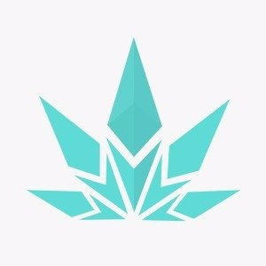 | 5515 | GRMD | GreenMed |
| 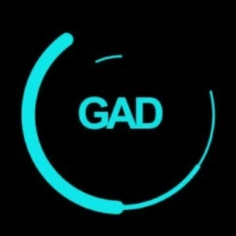 | 5516 | GAD | Gadcoin |
|  | 5517 | NCP | Newton Coin |
|  | 5518 | STAX | Staxcoin |
| 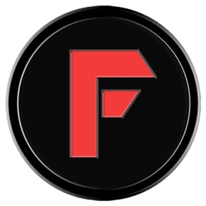 | 5519 | FOPA | Fopacoin |
|  | 5520 | MPT1 | Media Protocol Token |
|  | 5521 | MRN | Mercoin |
|  | 5523 | OOT | Utrum |
| 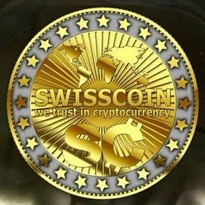 | 5524 | SIC | Swisscoin |
| 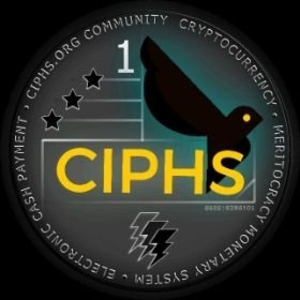 | 5525 | CIPHS | CIPHS |
|  | 5526 | EXCC | ExchangeCoin |
|  | 5527 | ALG | Algory |
| 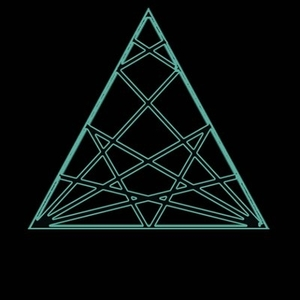 | 5528 | REL | Reliance |
| 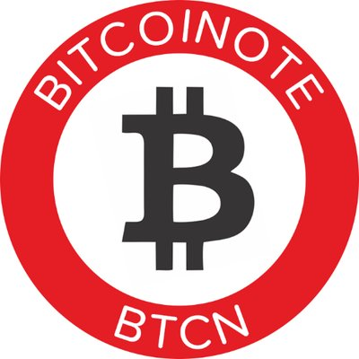 | 5529 | BITCOINOTE | BitcoiNote |
|  | 5530 | APIS | APIS |
|  | 5531 | EJAC | EJA Coin |
| 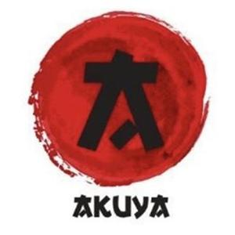 | 5532 | AKY | Akuya Coin |
| 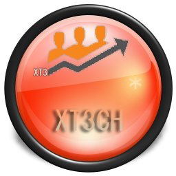 | 5533 | XT3 | Xt3ch |
|  | 5534 | FINV | Investment Fund Token |
|  | 5535 | MGD | MassGrid |
| 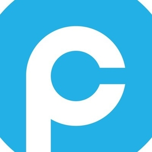 | 5536 | PLURA | PluraCoin |
| 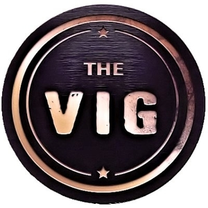 | 5537 | VIG | TheVig |
|  | 5538 | SCX | Swachhcoin |
|  | 5539 | NWCN | NowCoin |
|  | 5540 | EMAR | EmaratCoin |
|  | 5542 | XCC | CIRCLE COIN |
|  | 5543 | ICST | ICST |
|  | 5545 | ROE | Rover Coin |
|  | 5546 | DKD | Dekado |
|  | 5547 | LYNX | Lynx |
|  | 5548 | TLX | Telex |
|  | 5549 | POSQ | Poseidon Quark |
|  | 5550 | OCX | Original Crypto Coin |
|  | 5551 | YCE | MYCE |
|  | 5552 | STOR | Self Storage Coin |
|  | 5553 | ARO | Arionum |
|  | 5554 | BWS | BitcoinWSpectrum |
|  | 5555 | BTCC | Bitcoin Core |
|  | 5556 | BPC | Big Profit Coin |
|  | 5557 | GOLF | GolfCoin |
|  | 5558 | ORACLECHAIN | OracleChain |
|  | 5559 | XCEL | XcelTrip |
|  | 5560 | ECH | EthereCash |
|  | 5561 | XMN | Motion |
|  | 5562 | PLUS1 | PlusOneCoin |
|  | 5563 | COI | Coinnec |
|  | 5564 | SAP | Methuselah |
|  | 5565 | CANDY | UnicornGo Candy |
|  | 5566 | CTG | City Tycoon Games |
|  | 5567 | AXE | Axe |
|  | 5568 | SHARD | ShardCoin |
|  | 5569 | XN | Nodium |
|  | 5570 | GMCN | GambleCoin |
|  | 5571 | TRVC | Trivechain |
|  | 5572 | BSHN | Bitnewcoin |
|  | 5573 | MART (1) | MartCoin |
|  | 5574 | TOU | Tourist Coin |
|  | 5576 | KRX | RAVN Korrax |
|  | 5578 | B2C | BitClassic |
|  | 5579 | BITX | BitScreener |
|  | 5580 | SKRB | Sakura Bloom |
|  | 5581 | ONZ | Onz Coin |
|  | 5582 | DTEM | Dystem |
|  | 5584 | OOW | OPP Open WiFi |
|  | 5585 | HLDC | HeldCoin |
|  | 5586 | APR | APR Coin |
|  | 5587 | EXT | Exsolution |
|  | 5588 | INO | Ino Coin |
|  | 5589 | TIP | Tip Blockchain |
|  | 5590 | RCPT | ReceiptCoin |
|  | 5591 | ARCHI | Archicoin |
|  | 5592 | TRN | Ternion |
|  | 5593 | SOUND | Inmusik |
|  | 5594 | X0Z | Crypt0z |
|  | 5596 | HB | HeartBout |
|  | 5597 | TRW | Triwer |
|  | 5598 | GIC | Giant |
|  | 5600 | EPH | Euphoria |
|  | 5602 | BGL | Buglab |
|  | 5603 | NN | Neodium Network |
|  | 5605 | ZMN | ZMINE |
|  | 5606 | ATHE | Atheios |
|  | 5607 | ABS | Absolute Coin |
|  | 5608 | VITAE | Vitae |
|  | 5610 | 0XDIARY | The 0xDiary Token |
|  | 5611 | XET | Eternal Token |
|  | 5612 | TDP | TrueDeck |
|  | 5615 | XGS | GenesisX |
|  | 5617 | WORX | Worx |
|  | 5618 | BIM | BitminerCoin |
|  | 5619 | DOW | DowCoin |
|  | 5620 | HEXC | HexCoin |
|  | 5621 | EMN | Eminent Token |
|  | 5622 | PYT | Payther |
|  | 5623 | BITXOXO | Bitxoxo |
|  | 5624 | TPC | TPCash |
|  | 5625 | DEI | Deimos |
|  | 5626 | OYS | Oyster Platform |
|  | 5627 | WEBC | Webchain |
|  | 5628 | JEX | JEX Token |
|  | 5629 | ILK | Inlock |
|  | 5630 | RYOCURRENCY | Ryo |
|  | 5631 | MUSDCOIN | MUSDcoin |
|  | 5632 | MIC | Mindexcoin |
|  | 5633 | URALS | Urals Coin |
|  | 5634 | QWC | Qwertycoin |
|  | 5635 | WAB | WABnetwork |
|  | 5637 | DACASH | DACash |
|  | 5638 | ARE | ARENON |
|  | 5639 | EUNO | EUNO |
|  | 5640 | KAAS | KAASY.AI |
|  | 5641 | MMO | MMOCoin |
|  | 5642 | DASC | DasCoin |
|  | 5643 | MEDX | MEDX TOKEN |
|  | 5644 | PGTS | Puregold token |
|  | 5645 | SLST | SmartLands |
|  | 5646 | ZINC | ZINC |
|  | 5647 | KBC | Karatgold coin |
|  | 5648 | KETAN | Ketan |
|  | 5649 | INSURC | InsurChain Coin |
|  | 5650 | FIN | Finom FIN Token |
|  | 5651 | NIX | NIX |
|  | 5652 | RPM | Render Payment |
|  | 5653 | NOM | Finom NOM Token |
|  | 5654 | ITA | Italocoin |
|  | 5655 | XSTC | Safe Trade Coin |
|  | 5656 | U42 | You42 |
|  | 5657 | EGCC | Engine |
|  | 5658 | FREC | Freyrchain |
|  | 5662 | XIN | Mixin |
|  | 5663 | CBRT | Cybereits Token |
|  | 5664 | BOE | Bodhi |
|  | 5665 | MEET | CoinMeet |
|  | 5666 | RTE | Rate3 |
|  | 5667 | CAR | CarBlock |
|  | 5668 | CPT | Cryptaur |
|  | 5669 | PCO | Pecunio |
|  | 5670 | XPST | PokerSports |
|  | 5671 | CONI | CoinBene |
|  | 5672 | SCRL | Scroll |
|  | 5673 | MCV | MCV Token |
|  | 5674 | XPAT | Bitnation Pangea |
|  | 5675 | MBLC | Mont Blanc |
|  | 5676 | DIW | DIWtoken |
|  | 5677 | IDXM | IDEX Membership |
|  | 5678 | JOINT | Joint Ventures |
|  | 5679 | CCO | Ccore |
|  | 5680 | ATMI | Atonomi |
|  | 5681 | TKA | Tokia |
|  | 5682 | GETX | Guaranteed Ethurance Token Extra |
|  | 5683 | BWT | Bittwatt |
|  | 5684 | LST | Lendroid Support Token |
|  | 5685 | EMV | Ethereum Movie Venture |
|  | 5686 | ESZ | ESZCoin |
|  | 5687 | TRAK | TrakInvest |
|  | 5688 | BTRN | Biotron |
|  | 5689 | ZXC | Oxcert |
|  | 5690 | VME | TrueVett |
|  | 5691 | BBO | Bigbom |
|  | 5692 | PERU | PeruCoin |
|  | 5693 | YUP | Crowdholding |
|  | 5694 | SNIP | LyrnAI |
|  | 5695 | XDNA | XDNA |
|  | 5696 | SAL | SalPay |
|  | 5697 | THRT | ThriveToken |
|  | 5698 | SKRP | Skraps |
|  | 5700 | AVH | Animation Vision Cash |
|  | 5701 | XBTUSD | BitMEX Bitcoin Futures |
|  | 5702 | BSTN | BitStation |
|  | 5703 | NANJ | NANJCOIN |
|  | 5704 | EJOY | EjoyCoin |
|  | 5705 | PAXEX | PAXEX |
|  | 5706 | DWS | DWS |
|  | 5707 | DIT | Ditcoin |
|  | 5708 | AZART | Azart |
|  | 5709 | TTU | TaTaTu |
|  | 5710 | RDC | Ordocoin |
|  | 5711 | AOP | Averopay |
|  | 5712 | XAP | Apollon |
|  | 5713 | INTO | Influ Token |
|  | 5714 | AIMS | HighCastle Token |
|  | 5715 | TSC | ThunderStake |
|  | 5716 | SPLB | SimpleBank |
|  | 5717 | CMZ | CRYPTOMAGZ |
|  | 5718 | CNET | ContractNet |
|  | 5720 | NOBS | No BS Crypto |
|  | 5721 | HMN | Harvest Masternode Coin |
|  | 5722 | JSE | JSEcoin |
|  | 5723 | HMD | Homelend |
|  | 5724 | MHP | MedicoHealth |
|  | 5725 | IMGZ | Imigize |
|  | 5726 | IAM | IAME Identity |
|  | 5727 | URB | Urbit Data |
|  | 5728 | CHART | BetOnChart |
|  | 5729 | WHEN | WHEN Token |
|  | 5730 | SFT | SportsFix |
|  | 5732 | BLKS | Blockshipping |
|  | 5733 | ITR | INTRO |
|  | 5734 | CHE | Cache |
|  | 5736 | QUA | Quantum Tech |
|  | 5737 | MEM | Memority |
|  | 5738 | RONALDINHO | Ronaldinho Soccer Coin |
|  | 5739 | ENTRY | ENTRY |
|  | 5740 | AWORK | Aworker |
|  | 5741 | PHTC | Photochain |
|  | 5742 | ORGA | Organicco |
|  | 5744 | IDAP | IDAP |
|  | 5745 | HEAL | Etheal |
|  | 5746 | SHPT | Shipit |
|  | 5747 | OFCR | CryptoPolice |
|  | 5748 | TERAWATT | Terawatt |
|  | 5749 | RBDT | RoBust Defense Token |
|  | 5751 | PRLPAY | PearlPay |
|  | 5752 | SKYFT | SKYFchain |
|  | 5753 | STRY | STRYKZ |
|  | 5754 | FAN | Fan360 |
|  | 5755 | NBOX | Unboxed |
|  | 5756 | GIGT | GigTricks |
|  | 5757 | BUD | Buddy |
|  | 5758 | ARR | ARROUND |
|  | 5759 | DBCCOIN | Datablockchain |
|  | 5760 | SPOT | Spotcoin |
|  | 5761 | K2G | Kasko2go |
|  | 5762 | PAKKA | NextPakk |
|  | 5763 | VTUUR | VTUUR |
|  | 5764 | ETHERINC | EtherInc |
|  | 5765 | FRECNX | FreldoCoinX |
|  | 5766 | LAX | LAPO |
|  | 5768 | LPC | Little Phil |
|  | 5769 | BOOSTO | BOOSTO |
|  | 5770 | PTI | Paytomat |
|  | 5771 | DYNO | DYNO |
|  | 5772 | MFX | MFChain |
|  | 5773 | NOIZ | NOIZ |
|  | 5774 | SPIKE | Spiking |
|  | 5775 | RAWG | RAWG |
|  | 5776 | MNR | Monoreto |
|  | 5777 | YBD | YellowBetter |
|  | 5779 | BDB | Big Data Block |
|  | 5780 | PSK | Pool of Stake |
|  | 5781 | OPET | ÕpetFoundation |
|  | 5782 | KVT | Kinesis Velocity Token |
|  | 5783 | WPT | Worldopoly |
|  | 5784 | COT | CoTrader |
|  | 5785 | ABELE | Abele |
|  | 5786 | PRIV | PRiVCY |
|  | 5787 | ARBT | ARBITRAGE |
|  | 5788 | ST | Scienceroot |
|  | 5789 | TILLBILLY | TillBilly |
|  | 5790 | WBBC | Wibcoin |
|  | 5791 | WPP | Green Energy Token |
|  | 5792 | XDT | Dataeum |
|  | 5793 | SOCIALLT | Social Lending Network |
|  | 5794 | HDAC | Hdac |
|  | 5795 | CCCX | Clipper Coin Capital |
|  | 5796 | AEN | Aenco |
|  | 5797 | SOLID | Solidified |
|  | 5798 | VANIG | VANIG |
|  | 5799 | AIRE | Tokenaire |
|  | 5800 | GMA | Goldchip Mining Asset |
|  | 5801 | WMB | WatermelonBlock |
|  | 5802 | MVU | meVu |
|  | 5803 | GLDR | WAR FIELD |
|  | 5804 | TLNT | Talent Token |
|  | 5805 | IMU | imusify |
|  | 5807 | TRT | TuurnT |
|  | 5808 | CST | Casper API |
|  | 5810 | OLM | Olam |
|  | 5811 | URT | Universal Recognition Token |
|  | 5813 | QCX | QuickX Protocol |
|  | 5814 | DIP | Etherisc |
|  | 5816 | OICOIN | Osmium Investment Coin |
|  | 5817 | REDC | RedCab |
|  | 5818 | TTV | TV-TWO |
|  | 5819 | EXPR | Expercoin |
|  | 5820 | IDM | IDM |
|  | 5821 | DTN | Datareum |
|  | 5822 | SIDT | SID Token |
|  | 5823 | CDPT | Creditor Data Platform |
|  | 5824 | CRGO | CargoCoin |
|  | 5825 | LANE | LaneAxis |
|  | 5826 | QRP | Cryptics |
|  | 5827 | TIIM | TriipMiles |
|  | 5828 | BNR | BiNeuro |
|  | 5829 | ZCC1 | ZeroCarbon |
|  | 5830 | KRP | Kryptoin |
|  | 5831 | AMLT | AMLT |
|  | 5832 | BZ | Bit-Z |
|  | 5833 | PRA | ProChain |
|  | 5834 | HGO | HireGo |
|  | 5835 | TCOIN | Talenthon |
|  | 5837 | VLP | Volpo |
|  | 5838 | ZIP | Zipper |
|  | 5840 | BOUTS | BoutsPro |
|  | 5841 | EST | ESports Chain |
|  | 5842 | MODEX | Modex |
|  | 5843 | OGT | One Game |
|  | 5844 | NPER | NPER |
|  | 5845 | XCG | Xchange |
|  | 5846 | ATON | Further Network |
|  | 5847 | PCH | POPCHAIN |
|  | 5848 | BOONS | BOONSCoin |
|  | 5849 | WITCOIN | Witcoin |
|  | 5850 | OPU | Opu Coin |
|  | 5851 | ETALON | Etalon |
|  | 5852 | ZPR | ZPER |
|  | 5854 | TICS | CargoConX |
|  | 5856 | ESTATE | AgentMile |
|  | 5857 | RRC | Recycling Regeneration Chain |
|  | 5859 | QNTU | Quanta |
|  | 5860 | BLV | Blockvest |
|  | 5861 | IG | IG Token |
|  | 5862 | FML | FormulA |
|  | 5863 | TLU | Irene Energy |
|  | 5864 | PSM | Prasm |
|  | 5866 | NMH | Namahe |
|  | 5867 | AUDC | Aussie Digital |
|  | 5868 | KST | StarKST |
|  | 5869 | PBLK | PayBlock |
|  | 5870 | PAX | PAX Token |
|  | 5871 | KVANTOR | Kvantor |
|  | 5872 | LIGHT | LightChain |
|  | 5873 | GPPT | Pluto Project Coin |
|  | 5874 | COSM | CosmoChain |
|  | 5875 | SGC | Sudan Gold Coin |
|  | 5876 | PAPUSHA | Papusha |
|  | 5877 | LNL | LunarLink |
|  | 5878 | NEX | Nash Exchange |
|  | 5879 | VERNAM | Vernam |
|  | 5880 | BRNX | Bronix |
|  | 5881 | ET | ENDO |
|  | 5882 | XGH | Golden Hash |
|  | 5883 | SRCOIN | SRCoin |
|  | 5884 | MMTM | Momentum |
|  | 5885 | FXP | FXPay |
|  | 5886 | DICEM | DICE Money |
|  | 5887 | HRO | HEROIC.com |
|  | 5888 | BSCH | BitSchool |
|  | 5889 | PESA | Credible |
|  | 5890 | TRVR | Trivver |
|  | 5891 | CLPX | Chynge.net |
|  | 5893 | GLN | Galion Token |
|  | 5894 | AUK | Aukcecoin |
|  | 5895 | PCCM | Poseidon Chain |
|  | 5896 | PLAN | Plancoin |
|  | 5897 | UTS | UTEMIS |
|  | 5898 | TRAID | Traid |
|  | 5899 | EVERLIFE | EverLife.AI |
|  | 5900 | BNTE | Bountie |
|  | 5901 | FUNDZ | FundFantasy |
|  | 5902 | LYNK | Lynked.World |
|  | 5903 | CCL | CyClean |
|  | 5904 | TCX | T-Coin |
|  | 5905 | HLD | HyperLending |
|  | 5906 | NUSD | Nomin USD |
|  | 5908 | VEEN | LIVEEN |
|  | 5909 | BEC | Beauty Chain |
|  | 5910 | MIODIO | MIODIOCOIN |
|  | 5911 | MOV | MovieCoin |
|  | 5912 | LTPC | Lightpaycoin |
|  | 5913 | BTV | Bitvote |
|  | 5914 | SGP | SGPay |
|  | 5915 | CNAB | Cannabium |
|  | 5916 | HANA | Hanacoin |
|  | 5917 | URP | Universal Reward Protocol |
|  | 5918 | SHE | Shine Chain |
|  | 5919 | IVN | IVN Security |
|  | 5920 | ZAT | ZatGo |
|  | 5921 | ROBET | RoBet |
|  | 5922 | IMT | MoneyToken |
|  | 5923 | CRYP | CrypticCoin |
|  | 5924 | BTXC | Bettex coin |
|  | 5925 | ETE | EXTRADECOIN |
|  | 5926 | DAPS | DAPS Coin |
|  | 5927 | NHCT | Nano Healthcare Token |
|  | 5928 | AZ | Azbit |
|  | 5929 | SWA | Swace |
|  | 5930 | IAG | IAGON |
|  | 5931 | STRS | STARS |
|  | 5932 | USDCT | USDCT |
|  | 5933 | MTCMN | MTC Mesh |
|  | 5934 | ZEST | ZestCoin |
|  | 5935 | MOAC | MOAC |
|  | 5936 | HLM | Helium |
|  | 5937 | BENZ | Eagle Project |
|  | 5939 | NRVE | Narrative |
|  | 5940 | BIP | Minter |
|  | 5941 | XCASH | X-CASH |
|  | 5942 | RMESH | RightMesh |
|  | 5943 | HAND | ShowHand |
|  | 5944 | ABCC | ABCC Token |
|  | 5945 | GBXT | Globitex Token |
|  | 5946 | BASIS | Basis |
|  | 5947 | SGA | SAGA |
|  | 5948 | JIB | Jibbit |
|  | 5949 | PHM | Phomeum |
|  | 5950 | CUSD | Carbon |
|  | 5951 | PMTN | Peer Mountain |
|  | 5952 | KUSD | Kowala |
|  | 5953 | VEOT | Viewo |
|  | 5954 | VEST | VestChain |
|  | 5955 | GGR | GGRocket |
|  | 5956 | TIGERC | TigerCash |
|  | 5957 | DEPO | Depository Network |
|  | 5958 | METM | MetaMorph |
|  | 5959 | MENLO | Menlo One |
|  | 5960 | TVA | Terra Virtua |
|  | 5961 | ARAW | Araw |
|  | 5962 | BRAZ | Brazio |
|  | 5963 | IZX | IZX |
|  | 5964 | TALAO | Talao |
|  | 5965 | HQT | HyperQuant |
|  | 5966 | NBAR | NOBAR |
|  | 5967 | W12 | W12 Protocol |
|  | 5968 | KBX | KuBitX |
|  | 5969 | BHPC | BHPCash |
|  | 5970 | MYDFS | MyDFS |
|  | 5971 | M2O | M2O Token |
|  | 5972 | VTOS | VTOS |
|  | 5973 | WGD | WRIO Internet OS |
|  | 5974 | PRJ | ProjectCoin |
|  | 5975 | SLY | SELFLLERY |
|  | 5976 | UEC | United Emirates Coin |
|  | 5977 | MOLK | Mobilink Token |
|  | 5978 | BEAT | BEAT Token |
|  | 5979 | MSD | MSD |
|  | 5980 | SEALN | Seal Network |
|  | 5981 | GBO | Gabro.io |
|  | 5982 | SEED | Superbloom |
|  | 5983 | DFT | DigiFinexToken |
|  | 5984 | FRND | Friend |
|  | 5985 | NWP | NWPSolution |
|  | 5986 | EVOS | EVOS |
|  | 5987 | ANON | ANON |
|  | 5988 | DEEX | DEEX |
|  | 5989 | LTZ | Litecoinz |
|  | 5990 | TBL | Tombola |
|  | 5991 | MTZ | Monetizr |
|  | 5992 | BXY | Beaxy |
|  | 5993 | ESN | Ethersocial |
|  | 5994 | KUE | Kuende |
|  | 5995 | BETHER | Bethereum |
|  | 5996 | H3O | Hydrominer |
|  | 5997 | WTL | Welltrado |
|  | 5998 | HIH | HiHealth |
|  | 5999 | ANGEL | Crypto Angel |
|  | 6000 | GXT | Game Protocol |
|  | 6001 | AIM | Aimedis |
|  | 6002 | TWISTR | TWIST |
|  | 6003 | CXA | CryptovationX |
|  | 6004 | HNY | BitFence |
|  | 6005 | BITTO | BITTO |
|  | 6006 | QEY | AQwire |
|  | 6007 | VNX | VisionX |
|  | 6008 | UMK | UMKA |
|  | 6009 | WMK | Wemark |
|  | 6010 | OJX | Ojooo |
|  | 6011 | BBKS | Brickblock |
|  | 6012 | LQDN | Liquidity Network |
|  | 6013 | BIOC | BioCrypt |
|  | 6014 | FOREXCOIN | FOREXCOIN |
|  | 6015 | CPLO | Cpollo |
|  | 6016 | RIPAX | RipaEx |
|  | 6017 | HETA | HetaChain |
|  | 6018 | CIX100 | Cryptoindex 100 |
|  | 6019 | FIH | Fidelity House |
|  | 6020 | ADAB | Adab Solutions |
|  | 6021 | MOBU | MOBU |
|  | 6022 | NVDX | Nodvix |
|  | 6023 | TAL | Talentico |
|  | 6024 | COVEX | CoVEX |
|  | 6025 | F2K | Farm2Kitchen |
|  | 6026 | QOBI | Qobit |
|  | 6027 | GTX | GALLACTIC |
|  | 6028 | LK | Liker |
|  | 6029 | BVO | BRAVO Pay |
|  | 6030 | VENA | Vena Network |
|  | 6031 | CDRX | CDRX |
|  | 6032 | ELES | Elements Estates |
|  | 6033 | CRF | CrowdForce |
|  | 6034 | GEON | Geon |
|  | 6036 | TZO | TANZŌ |
|  | 6037 | WLME | Wellmee |
|  | 6038 | AWT | WhatsOnPic |
|  | 6039 | INVX | Investx |
|  | 6040 | ABXC | AutoBay |
|  | 6041 | LINKC | LINKCHAIN |
|  | 6042 | BETF | Betform |
|  | 6043 | BRAINSPACE | Brain Space |
|  | 6044 | NMK | Namek |
|  | 6045 | FORK | Gastro Advisor Token |
|  | 6046 | OUT | Netscouters |
|  | 6047 | BCHABC | Bitcoin ABC (Futures) |
|  | 6048 | RAINC  | RainCheck |
|  | 6049 | MYO | Mycro |
|  | 6050 | ORET | ORET Token |
|  | 6051 | IOVT | IOV |
|  | 6052 | QUIZ | Quizando |
|  | 6053 | UTL | Utile Network |
|  | 6054 | SEC | SecureCryptoPayments |
|  | 6055 | CYRS | Cyrus Token |
|  | 6056 | JOYS | JOYS |
|  | 6057 | DACH | DACH Coin |
|  | 6058 | MNVM | Novam |
|  | 6059 | PLTX | PlutusX |
|  | 6060 | BTMG | Bitcademy Football |
|  | 6061 | LUMA | LUMA Token |
|  | 6062 | BRIK | BrikBit |
|  | 6064 | BTZN | Bitzon |
|  | 6065 | CLRTY | Clarity |
|  | 6066 | COING | Coingrid |
|  | 6067 | ATHK | AntiHACK.me |
|  | 6068 | NAVIB | Navibration |
|  | 6069 | ARTP | ArtPro |
|  | 6070 | PLEO | Empleos |
|  | 6071 | EGDC | EasyGuide |
|  | 6072 | GDX | Gamedex |
|  | 6073 | ENTT | Presale Ventures |
|  | 6074 | RWD | Reward Vision |
|  | 6075 | STKR | Stackr |
|  | 6076 | AURUM | Aurum |
|  | 6077 | WRL | WHIRL |
|  | 6078 | CRWD | CRWD Network |
|  | 6079 | GTR | Gturbo |
|  | 6080 | TAURI | Extauri |
|  | 6081 | ENCN | EndChain |
|  | 6082 | HXC | HexanCoin |
|  | 6083 | OPEX | Optherium Token |
|  | 6084 | SKYM | SkyMap |
|  | 6085 | SCIA | Stem Cell |
|  | 6086 | TXP | Trade Pharma Network |
|  | 6087 | NZE | Nagezeni |
|  | 6088 | WTXH | WTX HUB |
|  | 6089 | GPSTOKEN | GPS Token |
|  | 6090 | BBG | BigBang |
|  | 6091 | EQY | Eqwity |
|  | 6092 | FIELD | Fieldcoin |
|  | 6093 | HUB | Tresorio HUB |
|  | 6094 | SHKG | SharkGate |
|  | 6095 | TENZ | Tenzorum |
|  | 6096 | TWC | Twilight |
|  | 6097 | WUG | WatchUGot |
|  | 6098 | CTW | Citowise |
|  | 6099 | CRV1 | Cravy |
|  | 6100 | NAM | Namacoin |
|  | 6101 | CAND | Canlead |
|  | 6102 | XIM | Impresso |
|  | 6103 | CARAT | Carats Token |
|  | 6104 | 2TF | 2TF |
|  | 6105 | BZKY | Bizkey |
|  | 6106 | TCJ | Coinshare |
|  | 6107 | ZILLA | ChainZilla |
|  | 6108 | PPOVR | POVR |
|  | 6109 | XNT | Exenium |
|  | 6110 | DN8 | Pldgr |
|  | 6111 | MAEP | Maester Protocol |
|  | 6112 | LX | Moonlight |
|  | 6113 | AWAX | AWAX |
|  | 6114 | TKD | Tokedo |
|  | 6115 | VAR | VARcrypt |
|  | 6117 | VTAG | veriTAG Token |
|  | 6118 | BBOS | Blackbox Foundation |
|  | 6119 | BFEX | BFEX |
|  | 6120 | HUS | HUSSY |
|  | 6121 | MENU | MenuBuzz |
|  | 6122 | APXT | ApolloX |
|  | 6123 | IDORU | Vip2Fan |
|  | 6124 | BONA | Bonafi |
|  | 6125 | HCN | HotCoin |
|  | 6126 | HLDY | HOLIDAY |
|  | 6127 | HORUS | HorusPay |
|  | 6128 | BLACK | BLACKHOLE PROTOCOL |
|  | 6129 | IOTW | IOTW |
|  | 6130 | EMPR | empowr |
|  | 6131 | MPAY | Menapay |
|  | 6132 | AGM | Argoneum |
|  | 6133 | MTCN | Multiven |
|  | 6134 | PTO | Patentico |
|  | 6135 | VIDI | Vidion |
|  | 6136 | GREENT | Greentoken |
|  | 6137 | AS | AmaStar |
|  | 6138 | DLPT | Deliverers Power Token |
|  | 6139 | OSF | One Solution |
|  | 6141 | RPB | Republia |
|  | 6142 | MIT | MiMiner |
|  | 6143 | DYNCOIN | Dyncoin |
|  | 6144 | PSF | Prime Shipping Foundation |
|  | 6145 | LITION | Lition |
|  | 6146 | VANM | VANM |
|  | 6147 | MZG | Moozicore |
|  | 6148 | VIAZ | Viaz |
|  | 6149 | BTZC | BeatzCoin |
|  | 6150 | RF | Raido Financial |
|  | 6151 | ARMS | 2Acoin |
|  | 6152 | ECR | EcoVerse |
|  | 6153 | MPXT | Myplacex |
|  | 6154 | STIPS | Stips |
|  | 6155 | PGF7T | PGF500 |
|  | 6156 | IDAC  | IDAC |
|  | 6159 | SPON | Instant Sponsor Token |
|  | 6160 | TECO | TerraEcoCoin |
|  | 6161 | DLXV | Delta-X |
|  | 6162 | OCEANT | Poseidon Foundation |
|  | 6163 | GOALS | UnitedFans |
|  | 6164 | ETHIX | EthicHub |
|  | 6165 | CP | CrowdPrecision |
|  | 6166 | CHK | Chek |
|  | 6167 | TTB | TrustaBit |
|  | 6168 | OASC | Oasis City |
|  | 6169 | HYPERIONX | HyperionX |
|  | 6170 | VLTX | Volentix |
|  | 6171 | GDL | GodlyCoin |
|  | 6172 | PRPT | Purple Token |
|  | 6173 | LNT | Litenett |
|  | 6174 | FTRC | FutureCoin |
|  | 6175 | HBX | Hyperbridge |
|  | 6176 | LAO | LC Token |
|  | 6177 | SRX | Solarex |
|  | 6178 | DAILY | Coindaily |
|  | 6179 | TBRS | Tiberius |
|  | 6180 | COGEN | Cogenero |
|  | 6181 | GOVT | The Government Network |
|  | 6182 | MAZC | MyMazzu |
|  | 6183 | SREUR | SocialRemit |
|  | 6184 | TGTC | Tokensgate |
|  | 6185 | PLNX | Planumex |
|  | 6186 | IPT | Crypt-ON |
|  | 6187 | SRXIO | Securix |
|  | 6188 | GZB | Gigzi |
|  | 6189 | GGPRO | GGPro |
|  | 6190 | IGTT | IGT |
|  | 6191 | IFUM | Infleum |
|  | 6192 | ATC | AutoBlock |
|  | 6193 | DOOH | Bidooh |
|  | 6194 | NVOY | Envoy |
|  | 6195 | IOUX | IOU |
|  | 6196 | BQTX | BQT |
|  | 6197 | CYBR | CYBR |
|  | 6198 | LLG | Loligo |
|  | 6199 | LUCRE | Lucre |
|  | 6200 | SNPC | SnapCoin |
|  | 6201 | VTM | Victorieum |
|  | 6202 | NRX | Neironix |
|  | 6203 | BCNA | BitCanna |
|  | 6204 | BXM | Bixtrim |
|  | 6205 | CCI | Cyber Capital Invest |
|  | 6206 | CINX | CINDX |
|  | 6207 | RDS | Reger Diamond |
|  | 6208 | CCIN | Cryptocoin Insurance |
|  | 6209 | GMS | Gemstra |
|  | 6210 | SGAT | SGAT |
|  | 6211 | SILK TOKEN | SilkChain |
|  | 6212 | BITM | BitMoney |
|  | 6213 | FIII | Fiii |
|  | 6214 | TCHN | Tachain |
|  | 6215 | ICHN | i-chain |
|  | 6216 | AENT | AEN |
|  | 6217 | LVX | Level01 |
|  | 6218 | LYFE | Lyfe |
|  | 6219 | REMCO | Remco |
|  | 6220 | GEMA | Gemera |
|  | 6221 | SATT | SaTT |
|  | 6222 | SCH | Sia Cash Coin |
|  | 6224 | VTEX | Vertex |
|  | 6225 | SRV | ServAdvisor |
|  | 6227 | AER | Aeryus |
|  | 6228 | AIBB | AiBB |
|  | 6229 | ASQT | ASQ Protocol |
|  | 6230 | AXC | autoXchange |
|  | 6231 | BLKD | Blinked |
|  | 6232 | CYS | BlooCYS |
|  | 6233 | ATTR | Attrace |
|  | 6234 | CTY | Connecty |
|  | 6235 | BC | Beverage.cash |
|  | 6236 | DDL | Donocle |
|  | 6237 | EZX | EZ Exchange |
|  | 6238 | BOLTT | BolttCoin |
|  | 6239 | COY | Coin Analyst |
|  | 6240 | FNL | Finlocale |
|  | 6241 | CSQ | cosquare |
|  | 6242 | B2G | Bitcoiin2Gen |
|  | 6243 | HBE | healthbank |
|  | 6244 | HV | HighVibe.Network |
|  | 6245 | ICT | Intrachain |
|  | 6246 | CPROP | CPROP |
|  | 6247 | KRATOS | KRATOS |
|  | 6248 | MOOLYA | moolyacoin |
|  | 6249 | CREV | CryptoRevolution |
|  | 6250 | PON | Ponder |
|  | 6251 | LABORCRYPTO | LaborCrypto |
|  | 6252 | VAD | Varanida |
|  | 6253 | IDC | IdealCoin |
|  | 6254 | KUBO | KUBO |
|  | 6255 | XBASE | ETERBASE |
|  | 6256 | EMX | EMX |
|  | 6257 | FABA | Faba Invest |
|  | 6258 | LEN | Liqnet |
|  | 6259 | GC | Gric Coin |
|  | 6260 | LQ8 | Liquid8 |
|  | 6261 | LIB | Libellum |
|  | 6262 | INFLR | Inflr |
|  | 6263 | PERMIAN | Permian |
|  | 6264 | PETL | Petlife |
|  | 6265 | SMILO | Smilo |
|  | 6266 | XDMC | MPCX |
|  | 6268 | PPS | PopulStay |
|  | 6269 | TREX | TreeBlock |
|  | 6271 | VIV | ViValid |
|  | 6272 | AUX | Auxilium |
|  | 6273 | VRF | Verifier |
|  | 6274 | LYQD | eLYQD |
|  | 6275 | COMBOX | ComBox |
|  | 6277 | SMOKE | Smoke |
|  | 6278 | NOSN | nOS |
|  | 6279 | EDN | EdenChain |
|  | 6280 | DT1 | Dollar Token 1 |
|  | 6281 | JMC | Junson Ming Chan Coin |
|  | 6282 | STACS | STACS Token |
|  | 6283 | FREDE | FREDEnergy |
|  | 6284 | ENGT | Engagement Token |
|  | 6285 | CNCT | CONNECT |
|  | 6286 | TEAMT | TokenStars TEAM Token |
|  | 6287 | VRTY | Verity |
|  | 6288 | ZND | Zenad |
|  | 6289 | SYNCO | Synco |
|  | 6290 | 3XD | 3DChain |
|  | 6291 | FPC | Futurepia |
|  | 6292 | VERIF | Verifier |
|  | 6293 | 77G | GraphenTech |
|  | 6294 | NGIN | Ngin |
|  | 6295 | HIDU | H-Education World |
|  | 6296 | KOTO | Koto |
|  | 6297 | GENX | Genesis Network |
|  | 6298 | VTL | Vertical |
|  | 6299 | SECI | Seci |
|  | 6300 | SPRTZ | SpritzCoin |
|  | 6301 | C25 | C25 Coin |
|  | 6302 | STASH | BitStash |
|  | 6303 | LYN | LYNCHPIN Token |
|  | 6304 | HERB | HerbCoin |
|  | 6305 | AQUAC | Aquachain |
|  | 6306 | XQR | Qredit |
|  | 6307 | URX | URANIUMX |
|  | 6308 | HASH | Hashbon |
|  | 6309 | MTEL | MEDoctor |
|  | 6310 | KSYS | K-Systems |
|  | 6311 | MTT | MulTra |
|  | 6312 | MITC | MusicLife |
|  | 6313 | BLAKEBTC | BlakeBitcoin |
|  | 6314 | UMO | Universal Molecule |
|  | 6315 | MUST | MUST Protocol |
|  | 6316 | TIOX | Trade Token X |
|  | 6317 | NAITECH | NAi |
|  | 6318 | XNB | Xeonbit |
|  | 6319 | XRN | Saronite |
|  | 6320 | BXC | BtcEX |
|  | 6321 | ONAM | ONAM |
|  | 6322 | EXO | Exosis |
|  | 6323 | BIH | BitHostCoin |
|  | 6324 | BLTG | Block-Logic |
|  | 6325 | AGVC | AgaveCoin |
|  | 6326 | ASGC | ASG |
|  | 6327 | CJR | Conjure |
|  | 6328 | MIMI | MIMI Money |
|  | 6329 | EKD27 | Ekd27 |
|  | 6330 | PXG | PlayGame |
|  | 6331 | ORM | ORIUM |
|  | 6332 | TRET | Tourist Review |
|  | 6333 | TIMICOIN | Timicoin |
|  | 6334 | BREWERY | Brewery Consortium Coin |
|  | 6335 | NRP | Neural Protocol |
|  | 6336 | CEN | Coinsuper Ecosystem Network |
|  | 6337 | UNX | UNEOX |
|  | 6338 | OWC | Oduwa |
|  | 6339 | WOWX | WOWX |
|  | 6340 | THO | Athero |
|  | 6341 | TOSS | PROOF OF TOSS |
|  | 6342 | KMX | KiMex |
|  | 6343 | SKILLC | Skillchain |
|  | 6344 | SUNEX | The Sun Exchange |
|  | 6345 | XRBT | Xtribe |
|  | 6346 | XBOND | Bitacium |
|  | 6347 | ALUX | Alux Bank |
|  | 6348 | BOSE | Bitbose |
|  | 6349 | GBE | Godbex |
|  | 6350 | HRBE | Harambee Token |
|  | 6351 | PINMO | Pinmo |
|  | 6352 | MLT | MILC Media Licensing Token |
|  | 6353 | SCOP | Scopuly |
|  | 6354 | OXY2 | Cryptoxygen |
|  | 6355 | BMG | Borneo |
|  | 6356 | BPN | beepnow |
|  | 6357 | FAIRC | Faireum Token |
|  | 6358 | DYC | Dycoin |
|  | 6359 | FTR | FactR |
|  | 6360 | RWE | Real-World Evidence |
|  | 6361 | TASH | Smart Trip Platform |
|  | 6362 | TRAVEL | Travelvee |
|  | 6364 | TXM | TMONEY |
|  | 6365 | AUPC | Authpaper |
|  | 6366 | COSX | Cosmecoin |
|  | 6367 | HART | HARA |
|  | 6368 | DNTX | DNAtix |
|  | 6369 | KSS | Krosscoin |
|  | 6370 | BRIX | OpenBrix |
|  | 6371 | MIBO | miBoodle |
|  | 6372 | NZO | NonZero |
|  | 6373 | LIPS | LipChain |
|  | 6374 | PTT | Pink Taxi Token |
|  | 6375 | XRK | RecordsKeeper |
|  | 6376 | XRF | Sarf |
|  | 6377 | RMOB | RewardMob |
|  | 6378 | VRX TOKEN | VIARIUM |
|  | 6379 | POD | Smart League |
|  | 6380 | SUAPP | SUT |
|  | 6381 | WDX | WeiDex |
|  | 6382 | TRIGID | TrigID |
|  | 6383 | WHO | Truwho |
|  | 6384 | AIOT | AIOT Token |
|  | 6385 | AMOS | Amos |
|  | 6386 | KRO | Betoken |
|  | 6387 | ESWITCH | ShareMeAll |
|  | 6388 | XBANK | Bancryp |
|  | 6389 | CAID | ClearAid |
|  | 6390 | GUAR | Guarium |
|  | 6391 | LTE | Local Token Exchange |
|  | 6392 | HLX | Helix3 |
|  | 6394 | BTCUS | Bitcoinus |
|  | 6395 | RAYS | Rays Network |
|  | 6396 | MCT | Master Contract Token |
|  | 6397 | MOL | Molecule |
|  | 6398 | NEXXO | Nexxo |
|  | 6399 | REME | REME-Coin |
|  | 6400 | QNTR | Quantor |
|  | 6401 | RENC | RENC |
|  | 6402 | TLT | Travelertoken |
|  | 6403 | USAT | USAT |
|  | 6404 | EMOT | Sentigraph.io |
|  | 6405 | VTRD | VTradeExchange |
|  | 6406 | GALI | Galilel |
|  | 6407 | VOLAIR | VolAir |
|  | 6408 | BGG | BGG Token |
|  | 6409 | ERE | Erecoin |
|  | 6410 | APS | APRES |
|  | 6411 | FFUEL | getFIFO |
|  | 6412 | PTNX | Platin |
|  | 6413 | NSP | NOMAD.space |
|  | 6414 | BITEX | BiteX |
|  | 6415 | SNCOIN | ScientificCoin |
|  | 6417 | TTN | TITA Project |
|  | 6418 | FLC | Fieldcoin |
|  | 6419 | BWT2 | Bitwin 2.0 |
|  | 6420 | OATH | OATH Protocol |
|  | 6421 | SBA | simplyBrand |
|  | 6422 | DXG | DexAge |
|  | 6423 | EXTP | TradePlace |
|  | 6425 | XCZ | XCOYNZ |
|  | 6426 | XRM | Aerum |
|  | 6427 | CBUK | CurveBlock |
|  | 6428 | HIX | HELIX Orange |
|  | 6429 | CCOIN | Creditcoin |
|  | 6430 | TGN | TerraGreen |
|  | 6431 | COGS | Cogmento |
|  | 6432 | APZ | Alprockz |
|  | 6433 | ICHX | IceChain |
|  | 6434 | FORCE | TriForce Tokens |
|  | 6435 | QUSD | QUSD |
|  | 6437 | PVP | PVPChain |
|  | 6438 | EMANATE | EMANATE |
|  | 6439 | RAIZER | RAIZER |
|  | 6440 | DAYTA | Dayta |
|  | 6441 | CHFT | CustomCoin |
|  | 6442 | CWT | Coinware |
|  | 6443 | AQU | aQuest |
|  | 6444 | CXG | Coinxes |
|  | 6445 | ORV | Orvium |
|  | 6446 | MAI | Mindsync |
|  | 6447 | VNTY | VENOTY |
|  | 6448 | BITHER | Bither |
|  | 6449 | FFCT | FortFC |
|  | 6450 | KLK | Klickzie |
|  | 6451 | ARQ | ArQmA |
|  | 6452 | LVN | LivenPay |
|  | 6453 | AZU | Azultec |
|  | 6454 | WU | WULET |
|  | 6455 | FFM | Files.fm Library |
|  | 6456 | DRF | Drife |
|  | 6457 | GTIB | Global Trust Coin |
|  | 6458 | CR | CryptoRiyal |
|  | 6459 | VEO | Amoveo |
|  | 6460 | DLA | Dolla |
|  | 6461 | BB1 | Bitbond |
|  | 6462 | DAGT | Digital Asset Guarantee Token |
|  | 6463 | AFO | AllForOneBusiness |
|  | 6464 | GVE | Globalvillage Ecosystem |
|  | 6465 | IDT | InvestDigital |
|  | 6466 | KUV | Kuverit |
|  | 6468 | ENCX | Encrybit |
|  | 6469 | VALID | Validator Token |
|  | 6470 | TYM | Tryvium |
|  | 6471 | VENUS | VenusEnergy |
|  | 6472 | HYGH | HYGH |
|  | 6473 | ALCE | Alcedo |
|  | 6474 | MNC | MainCoin |
|  | 6475 | NODIS | Nodis |
|  | 6476 | ALP | Alphacon |
|  | 6477 | HVE | UHIVE |
|  | 6478 | XR | Gofind XR |
|  | 6479 | EMU | eMusic |
|  | 6480 | GAMESTARS | Game Stars |
|  | 6481 | APOD | AirPod |
|  | 6482 | NRM | Neuromachine |
|  | 6483 | AX | AlphaX |
|  | 6484 | GGC | Gingr |
|  | 6485 | CLDX | Cloverdex |
|  | 6486 | LABX | Stakinglab |
|  | 6487 | CWEX | Crypto Wine Exchange |
|  | 6488 | AGT | AGATE |
|  | 6489 | ENVIENTA | Envienta |
|  | 6490 | GEP | Gaia |
|  | 6491 | FANZ | FanChain |
|  | 6492 | CSPN | Crypto Sports |
|  | 6493 | CCH | Coinchase |
|  | 6494 | IZA | Inzura |
|  | 6495 | GBA | Geeba |
|  | 6496 | ITU | iTrue |
|  | 6497 | XOV | XOVBank |

---

[← Prev](./list5.md) | [Next →](./list7.md)
