# Cryptocurrency list \#6

[← Prev](./list5.md) | [Next →](./list7.md)

| Logo | ID | Symbol | Name |
|:----:|:--:|:------:|:-----|
| 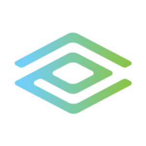 | 56505 | EVRY | Evrynet |
|  | 55299 | ENVIRO | Enviro |
| 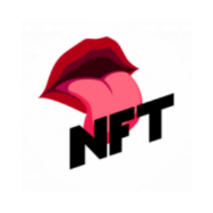 | 51217 | TASTE | TasteNFT |
|  | 46212 | PPBLZ | Pepemon Pepeballs |
| 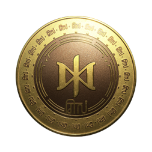 | 151553 | GINI | KALP Network |
|  | 154399 | GRPH | Soul Graph |
|  | 161215 | UA1 | UA1 |
|  | 151843 | ARIO | AR.IO Network |
| 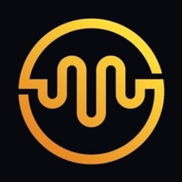 | 136651 | MNEE | MNEE |
| 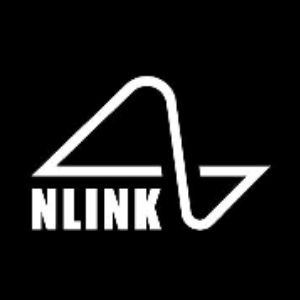 | 115525 | NLINK | Neuralink |
|  | 95281 | POP | POP Network Token |
|  | 96017 | STRD | Stride |
|  | 79329 | SHIRD | Shibird |
| 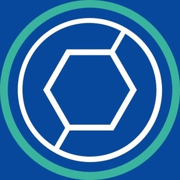 | 65129 | FIN | DeFiner |
| 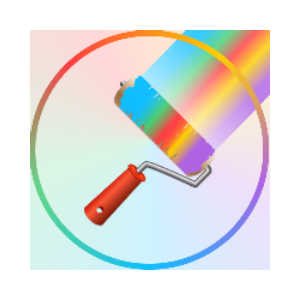 | 64965 | BRUSH | Paint Swap |
|  | 64955 | DPS | DEEPSPACE |
|  | 60107 | NSUR | NSUR Coin |
|  | 60489 | DKS | DarkShield |
| 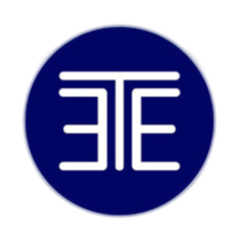 | 59237 | TEER | Integritee |
|  | 56667 | AMAS | Amasa |
|  | 49681 | UPSHIB | upShib |
| 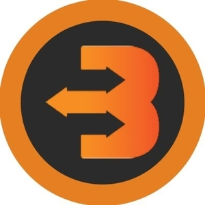 | 47671 | BITT | BITToken |
|  | 47685 | AVS | AlgoVest |
|  | 46599 | GYSR | Geyser |
|  | 45470 | IPR | I-PRO TOKEN |
|  | 45230 | DGVC | DegenVC |
|  | 44820 | TMH | TrusMarketHub Token |
|  | 164571 | QU3 | QU3 AI |
| 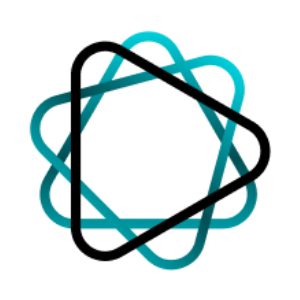 | 147191 | RENTA | Renta Network |
|  | 131877 | JENNER | Caitlyn Jenner (ETH) |
| 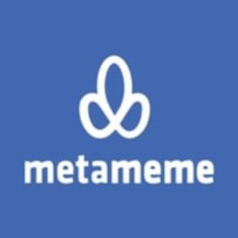 | 123399 | METAMEME | met a meta metameme |
|  | 122475 | PAI | Purple AI |
|  | 47593 | TAP | Tapmydata |
|  | 48151 | EDDA | EDDASwap |
|  | 44860 | UNIUSD | UniDollar |
|  | 142241 | KAAI | KanzzAI |
| 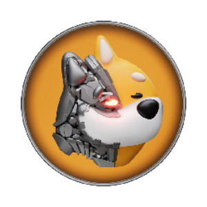 | 128201 | CYBONK | CYBONK |
| 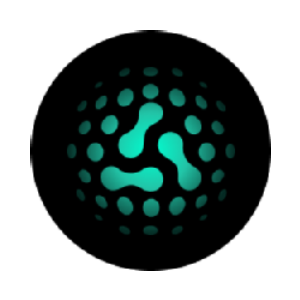 | 121881 | AKI | Aki Network |
| 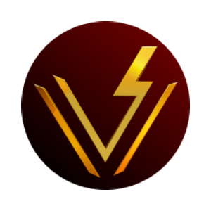 | 112841 | VOLTA | Volta Club |
|  | 112059 | ETHFAI | ETHforestAI |
|  | 80793 | RDF | ReadFi |
|  | 80253 | AC | ACoconut |
|  | 71329 | WALLPHY | Wallphy |
|  | 66351 | NLA | No Limit Ape |
| 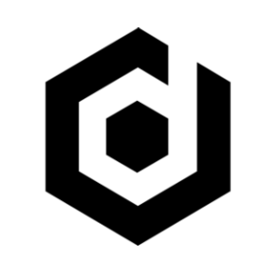 | 65257 | DRC | Dracula |
| 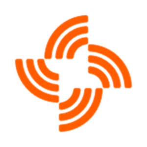 | 64797 | XDATA | Streamr XDATA |
| 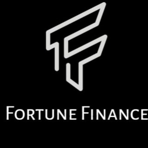 | 58787 | FORTUNE | Fortune |
|  | 57285 | HELLSING | Hellsing Inu |
| 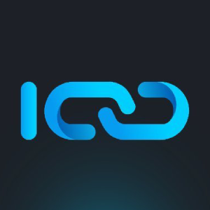 | 55897 | HND | Hundred Finance |
|  | 45554 | XMM | Momentum |
|  | 144337 | CMETH | Mantle Restaked Ether |
| 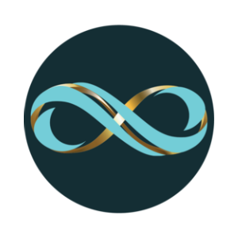 | 144579 | INCO | InfinitiCoin |
| 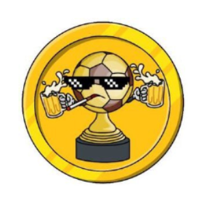 | 132205 | MEMECUP | Meme Cup |
|  | 112503 | BONKI | BONK Inu |
| 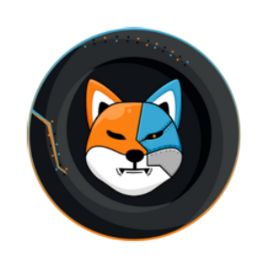 | 90325 | DOGAI | Dogai |
|  | 71119 | HULK | Hulk Inu |
| 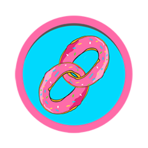 | 67595 | DONA | DONA |
| 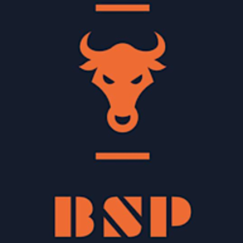 | 62895 | BSP | BallSwap |
|  | 55589 | BBOXER | Baby Boxer |
|  | 57085 | PN | Probably Nothing |
| 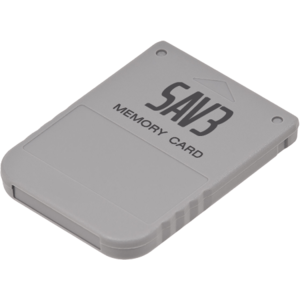 | 46595 | SAV3 | SAV3 |
| 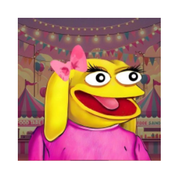 | 154769 | SANDY | Sandy Codex |
|  | 146799 | ERC AI | Euruka Tech |
|  | 100443 | W$C | World$tateCoin |
|  | 112301 | SEAM | Seamless Protocol |
| 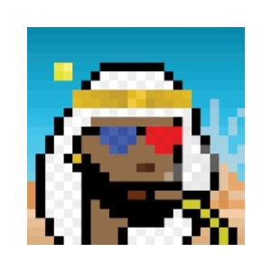 | 99025 | HABIBI | The Habibiz |
|  | 91073 | XROW | XROW |
| 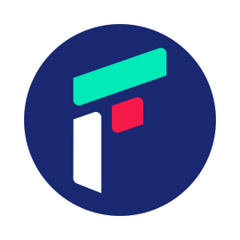 | 82365 | FNCY | FNCY |
|  | 87053 | GYOKUTO | Tsuki no usagi |
|  | 48169 | SKLAY | sKLAY |
|  | 48135 | EROWAN | Sifchain |
|  | 132275 | DROPS | Drops |
|  | 86883 | GOLD 1 | Teh Golden One |
| 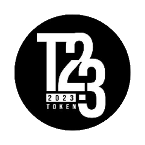 | 82611 | T23 | T23 |
|  | 65041 | VOICE | Voice Token |
|  | 61989 | BWJ | Baby WOJ |
|  | 59637 | SMHDOGE | SuperMegaHyperDoge |
| 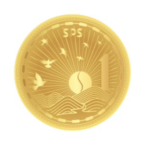 | 168755 | SPARK | Illusion of Life |
|  | 127373 | RDDT | Reddit |
|  | 126487 | OPY | OPYx |
| 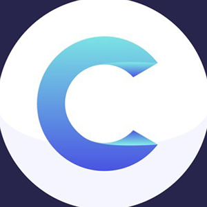 | 124795 | CHE | CherrySwap |
| 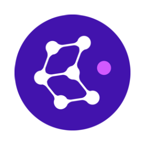 | 122315 | CAU | Canxium |
| 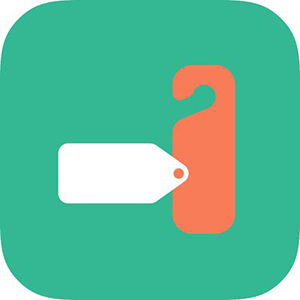 | 122361 | AWT | Abyss World |
|  | 95505 | SSGTX | SafeSwap |
| 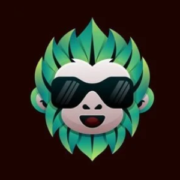 | 96445 | DZOO | Degen Zoo |
| 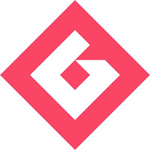 | 88445 | GDX | Gridex |
| 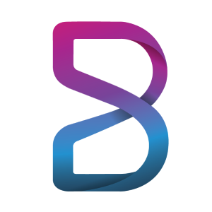 | 81793 | BIVE | BIZVERSE |
| 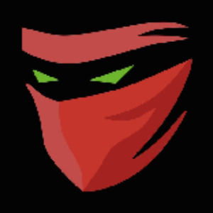 | 82069 | SHINO | ShinobiVerse |
| 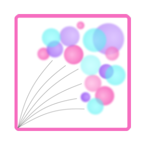 | 79477 | XGLI | Glitter Finance |
|  | 79713 | PIGGY | Piggy |
| 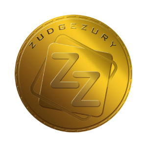 | 79459 | ZZC | ZudgeZury |
| 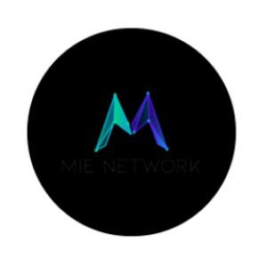 | 69563 | MIE | MIE Network |
| 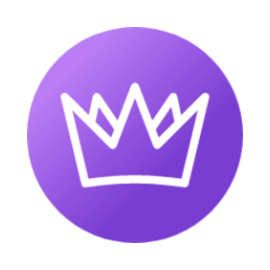 | 70037 | NUMI | Numitor |
|  | 69565 | LYO | LYO Credit |
| 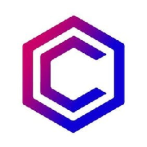 | 70077 | ELTG | Graphen |
|  | 69577 | PRDS | Brise Paradise |
| 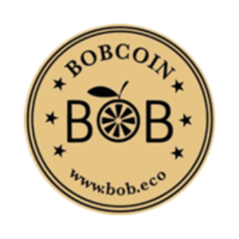 | 68111 | BOBC | Bobcoin |
|  | 68269 | NVM | Novem Pro |
| 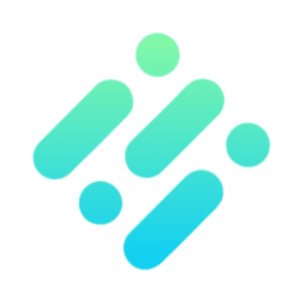 | 66501 | PICO | PicoGo |
|  | 65095 | MAKI | MakiSwap |
|  | 66007 | HDV | Hydraverse |
|  | 65437 | XIV | Project Inverse |
| 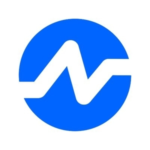 | 65201 | ZEFU | Zenfuse |
| 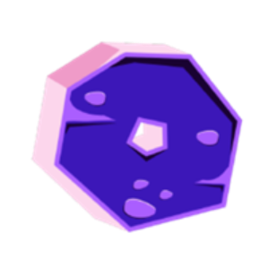 | 64821 | SOFI | RAI Finance |
|  | 64339 | MYT | Mytrade |
|  | 63433 | PLCU | PLC Ultima |
|  | 64047 | RADR | CoinRadr |
| 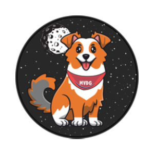 | 63947 | MVDG | MetaVerse Dog |
| 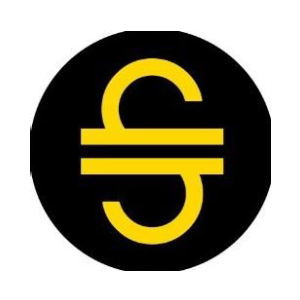 | 61693 | SHIBIC | Shiba Inu Classic |
|  | 62757 | KIAN | Porta |
| 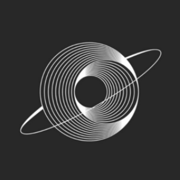 | 58373 | CIND | Cindrum |
|  | 57183 | CHLT | Chellitcoin |
| 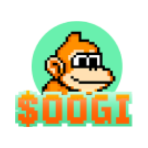 | 56897 | OOGI | OOGI |
| 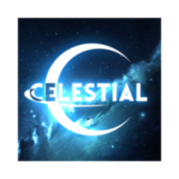 | 55905 | CELT | Celestial |
| 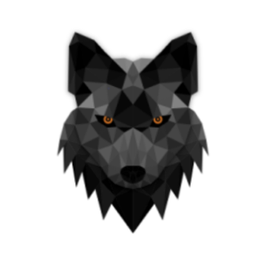 | 55921 | KAINET | KAINET |
|  | 51793 | DS | DeStorage |
|  | 53721 | UPR | Upfire |
|  | 53473 | UNW | UniWorld |
| 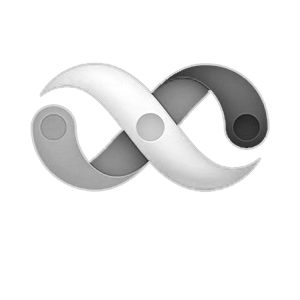 | 51633 | ETL | EtherLite |
| 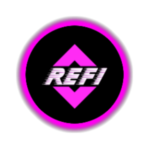 | 49745 | REFI | Realfinance Network |
| 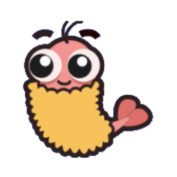 | 49389 | PIPI | Pippi Finance |
| 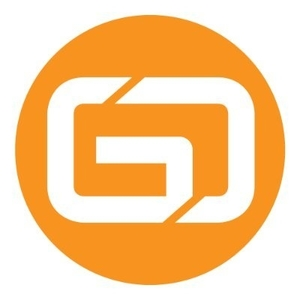 | 47725 | GERA | Gera Coin |
|  | 48443 | HBO | Hash Bridge Oracle |
|  | 48817 | WAULTX | Wault |
|  | 48401 | LHB | Lendhub |
|  | 48359 | OKT | OKT Chain |
| 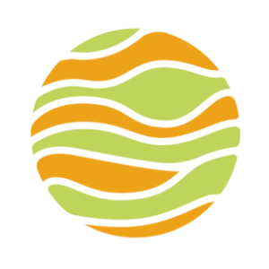 | 48907 | TWIN | Twinci |
|  | 47443 | SX | SportX |
|  | 47181 | UCAP | Unicap.Finance |
|  | 47040 | PLEX | PLEX |
|  | 45753 | MARO | Maro |
|  | 45633 | UMI | UMI |
| 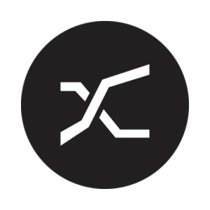 | 45130 | KLP | Kulupu |
| 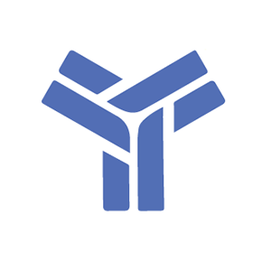 | 34499 | LKN | LinkCoin Token |
| 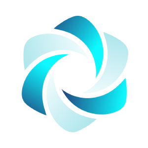 | 32357 | HPB | High Performance Blockchain |
| 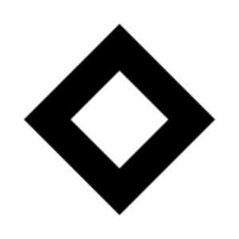 | 32420 | TAU | Lamden |
| 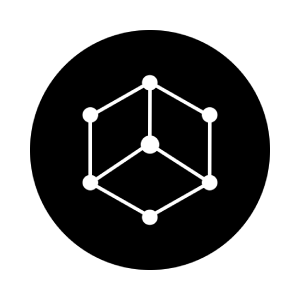 | 32369 | BIX | Bibox Token |
|  | 32774 | MT | MyToken |
|  | 32861 | ESS | Essentia |
|  | 10799 | FSN | Fusion |
| 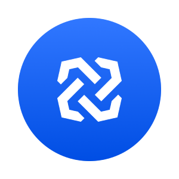 | 2482 | BTM | Bytom |
|  | 147049 | CULTEL | Cultel |
|  | 126341 | YUGE | Yuge Meme |
|  | 112521 | C21 | Carbon21 |
| 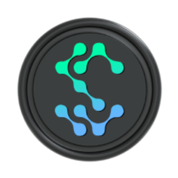 | 82215 | SHAN | Shanum |
|  | 79913 | SWU | Smart World Union |
| 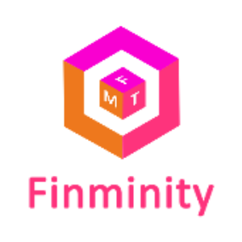 | 49401 | FMT | Finminity |
|  | 446 | ILC | ILCoin |
|  | 162009 | COA | Alliance Games |
| 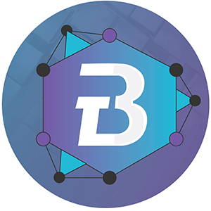 | 124091 | BART | Bart Simpson Coin |
| 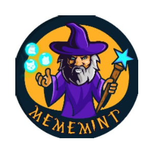 | 122359 | MEMEMINT | MEME MINT |
|  | 123109 | $WOLF | Wolf of Wall Street |
|  | 112785 | JIJI | KURONEKO |
| 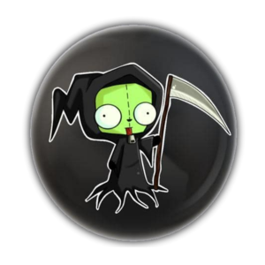 | 94241 | R34P | R34P |
|  | 60127 | OPTCM | Optimus |
| 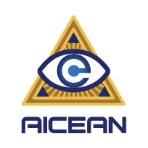 | 151491 | AICE | Aicean |
|  | 94731 | WSBC | WSB Classic |
|  | 80731 | KAERI | Kaeri |
|  | 68875 | GENIUS | Genius Coin |
|  | 63249 | BURD | tudaBirds |
|  | 33324 | AFIN | Afin Coin |
|  | 148059 | EXS | Ex Sports |
| 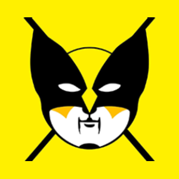 | 126633 | WOLVERINU | Wolverinu |
| 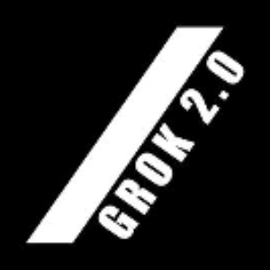 | 115523 | GROK2 | GROK 2.0 |
|  | 113687 | PROMPTIDE | PromptIDE |
| 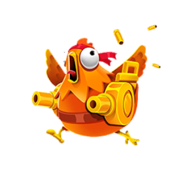 | 71299 | GSTS | Gunstar Metaverse |
|  | 70851 | STILT | Stilton |
| 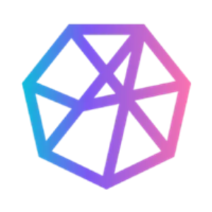 | 47431 | POOLZ | Poolz Finance |
|  | 46291 | LIMIT | LimitSwap |
|  | 70625 | LSTAR | Learning Star |
| 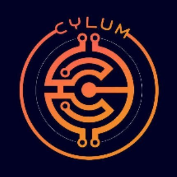 | 68885 | CYM | Cylum Finance |
|  | 66723 | SUPD | Support Doge |
| 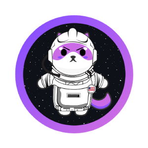 | 55367 | DAWGS | SpaceDawgs |
|  | 56379 | BITD | 8Bit Doge |
|  | 49287 | ARTX | ARTX |
|  | 11016 | LOC | LockTrip |
|  | 154919 | DEER | DEER TOKEN |
|  | 112341 | 0X1 | 0x1.tools: AI Multi-tool |
|  | 112875 | WSKR | Wiskers |
|  | 79463 | DACT | Decentralized Activism |
|  | 78755 | WACME | Wrapped Accumulate |
|  | 65363 | .ALPHA | .Alpha |
| 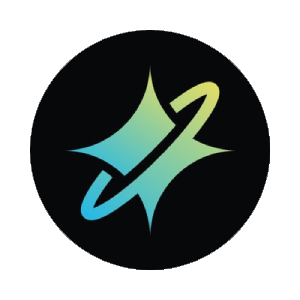 | 61425 | MAXR | Max Revive |
| 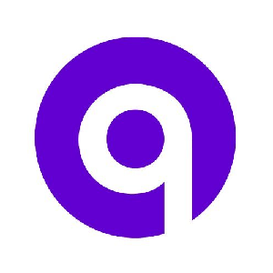 | 58677 | QUIDD | Quidd |
|  | 47032 | BPP | Bitpower |
|  | 128869 | DIBBLE | Dibbles |
| 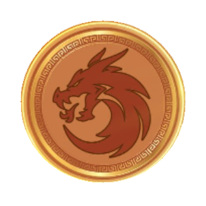 | 123501 | YOD | Year of the Dragon |
|  | 111799 | BLAZEX | BlazeX |
| 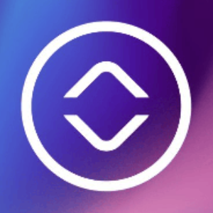 | 111455 | HILO | HILO |
|  | 112315 | TOILET | Skibidi Toilet |
|  | 99463 | $HOLA | Hola Token |
|  | 66161 | FOOT | BIGFOOT |
| 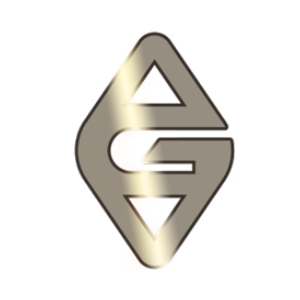 | 60835 | AGV | Astra Guild Ventures |
|  | 54127 | $BABYDOGEINU | BABY DOGE INU |
|  | 50215 | ROY | Royal Protocol |
| 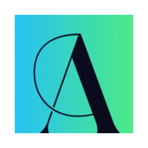 | 147277 | AETHRA | Aethra AI |
|  | 122895 | AFB | A Fund Baby |
| 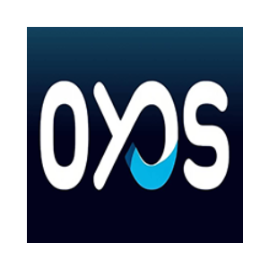 | 122903 | 0XOS | 0xOS AI |
|  | 81403 | SPILLWAYS | Spillways |
| 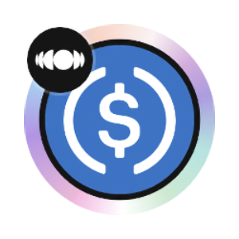 | 86967 | FUSDC | Fluid USDC |
|  | 46607 | KP4R | Keep4r |
|  | 46259 | ERSDL | UnFederalReserve |
|  | 161209 | TEUSD | TeUSD |
|  | 146615 | OVER | OverProtocol |
|  | 141457 | KIMA | Kima Network |
|  | 113391 | F3 | Friend3 |
|  | 98833 | ARBYS | Arbys |
|  | 86785 | SYRANT | Fable Of The Shiba |
|  | 85743 | IDOODLES | IDOODLES |
| 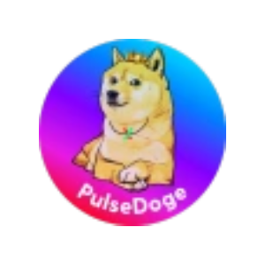 | 69739 | PLSD | PulseDogecoin |
|  | 57565 | ABIC | Arabic |
|  | 138887 | PHRYGE | PhrygeETH |
|  | 113713 | REVHUB | Revhub |
|  | 67085 | VNLA | Vanilla Network |
| 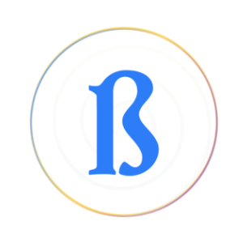 | 49571 | CBSN | BlockSwap Network |
| 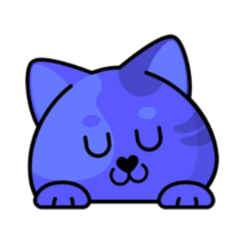 | 78387 | UWU | UwU Lend |
| 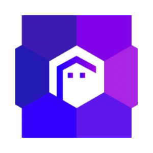 | 69137 | RUUF | RuufCoin |
|  | 66199 | FLESH | Flesh Token |
|  | 58169 | INUBIS | Inubis |
| 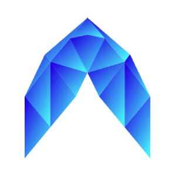 | 65387 | ADD | Add.xyz (NEW) |
|  | 48967 | COMFI | CompliFi |
| 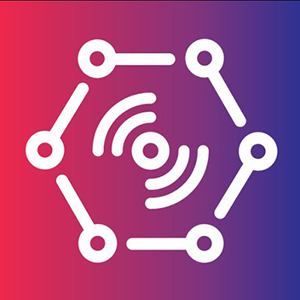 | 32837 | DTX | DaTa eXchange |
|  | 162383 | SCALR | Scalr |
|  | 146413 | NEOS | Neos.ai |
|  | 89699 | MNZ | Menzy |
| 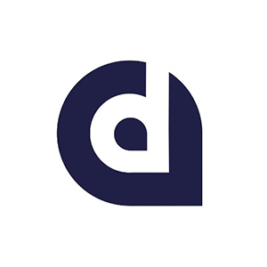 | 34404 | DAPP | LiquidApps |
|  | 162395 | LUNARBITS | Lunarbits |
|  | 69665 | ELM | Elements |
| 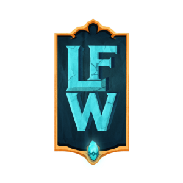 | 58243 | LFW | Legend of Fantasy War |
| 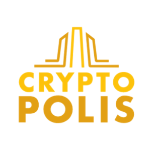 | 56289 | CPO | Cryptopolis |
|  | 165169 | $IPAX | Icopax |
|  | 135327 | RUNI | Runesterminal |
|  | 136351 | SNIFT | StarryNift |
| 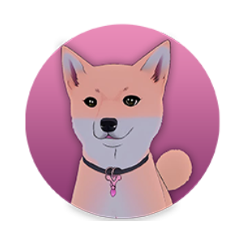 | 129729 | LESBIAN | Lesbian Inu |
| 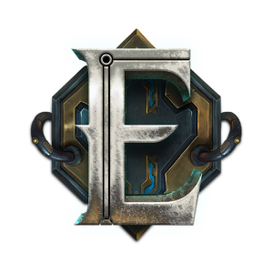 | 130959 | FURY | Engines of Fury |
| 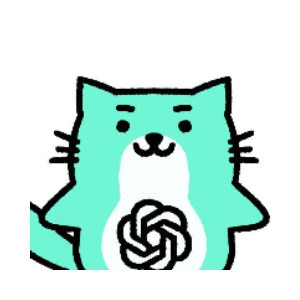 | 130991 | CATGPT | CatGPT |
|  | 115465 | DOGE-1SAT | DOGE-1SATELLITE |
|  | 121801 | SELO | SELO+ |
|  | 98713 | ΑAI | alphAI |
|  | 99965 | NOLO | YoloNolo |
|  | 66811 | MOOLAH | Block Creatures |
|  | 133783 | CRHT | CryptHub |
|  | 125097 | DIVA | DIVA Protocol |
| 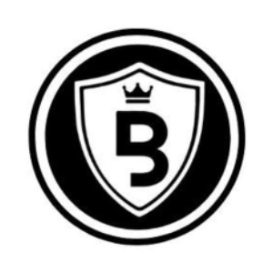 | 113951 | BESA | Besa Gaming Company |
| 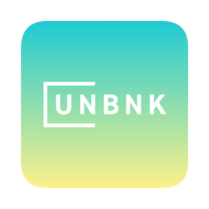 | 86417 | UNBNK | Unbanked |
| 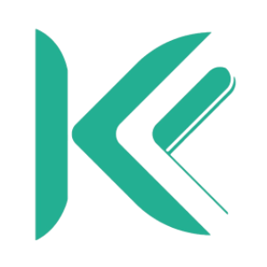 | 54037 | KCCPAD | KCCPAD |
|  | 51299 | VANITY | Vanity |
|  | 149985 | ORNG | ORANGE |
| 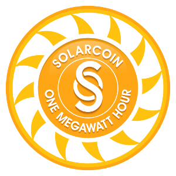 | 125297 | SLR | Solarcoin |
| 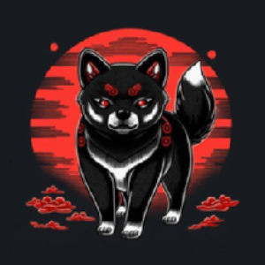 | 94249 | RINIA | Rinia Inu |
|  | 88851 | GFAL | Games for a living |
|  | 67349 | FROGEX | FrogeX |
|  | 144237 | FNS | FAUNUS |
|  | 56299 | WELD | Weld |
|  | 51911 | SAINT | Saint Token |
| 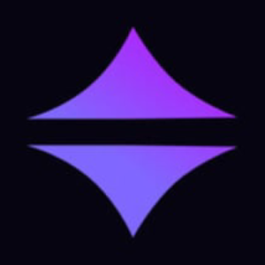 | 48351 | INFI | Insured Finance |
| 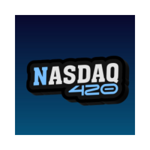 | 142093 | NASDAQ420 | Nasdaq420 |
| 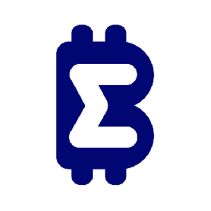 | 124253 | MBC | Mad Bears Club |
|  | 122551 | SHEZMU | Shezmu |
| 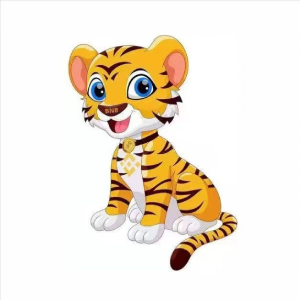 | 85953 | BNBTIGER | BNBTiger |
|  | 58953 | SHIBAMON | Shibamon |
|  | 49699 | SAFENAMI | SafeNami |
|  | 162257 | IXORA | IXORAPAD |
|  | 162377 | THINK | Think Protocol |
| 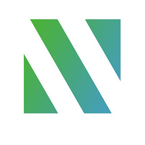 | 165517 | NAM | Namada |
|  | 158703 | BOXCAT | BOXCAT |
| 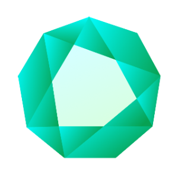 | 151363 | SYNTH | SYNTHR |
| 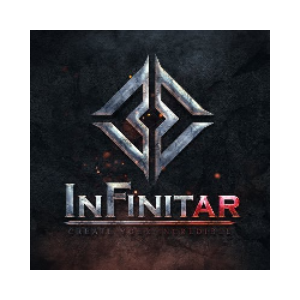 | 161491 | IGT | Infinitar |
| 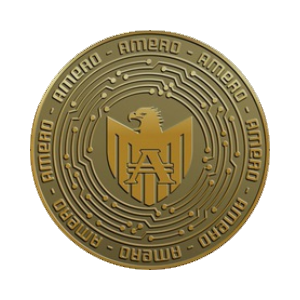 | 161527 | AMR | Advanced Mortgage & Reserve |
| 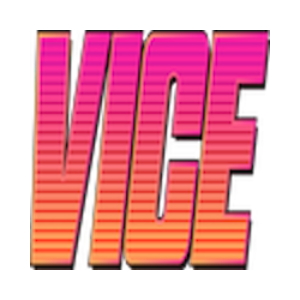 | 161483 | VICE | VICE Token |
|  | 161539 | CEC | Counter Fire |
|  | 158855 | VELAAI | VELAAI |
| 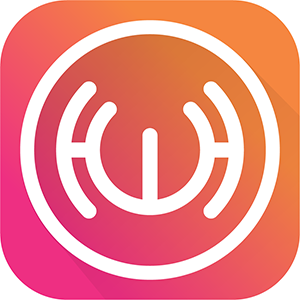 | 151205 | HAT | Top Hat |
|  | 150181 | BEES | BEE Launchpad |
|  | 161749 | SARM | Stella Armada |
| 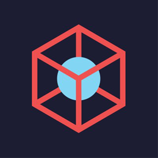 | 151579 | ZP | Web3PVZ |
|  | 150565 | SUGARB | SugarBlock |
|  | 155065 | HENAI | HenjinAI |
| 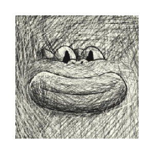 | 151251 | BUBB | Bubb |
|  | 150921 | G7 | Game7 |
| 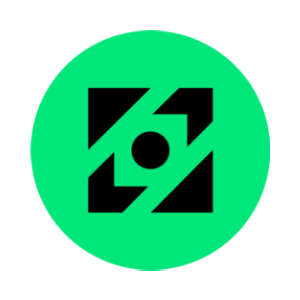 | 151343 | CGX | Forkast |
|  | 151753 | MNEMO | Mnemonics |
|  | 158583 | BFTOKEN | BOSS FIGHTERS |
| 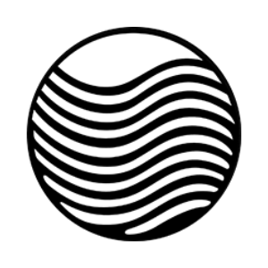 | 148037 | ONDOAI | Ondo DeFAI |
|  | 149841 | FROKAI | FrokAI |
|  | 148423 | GROWAI | SocialGrowAI |
| 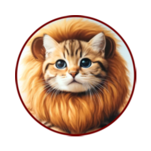 | 148267 | LCAT | Lion Cat |
| 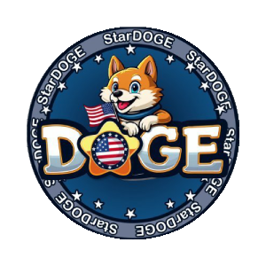 | 148325 | STARDOGE | StarDOGE |
|  | 149991 | NEXD | Nexade |
|  | 147797 | FOMO | FOMO (fomo.fund) |
| 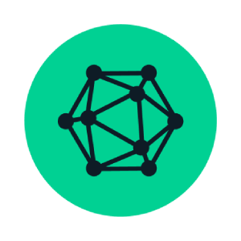 | 148145 | N3 | Network3 |
|  | 147841 | MOZ | Lumoz |
|  | 148997 | 1ON8 | Little Dragon |
| 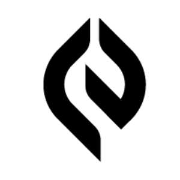 | 146737 | ELYS | Elys Network |
|  | 148953 | HIVP | HiveSwap |
| 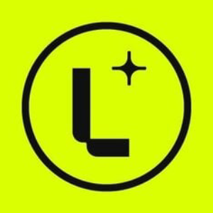 | 147195 | LEGEND | Legend |
| 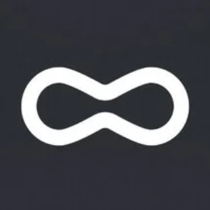 | 147749 | NGL | Entangle |
|  | 150037 | WNE | Winee3 |
|  | 150029 | BDIN | BendDAO BDIN (Ordinals) |
|  | 147087 | PUMPAI | PUMPAI |
|  | 148049 | MIDLE | Midle |
|  | 147903 | KOKO | Koala AI |
| 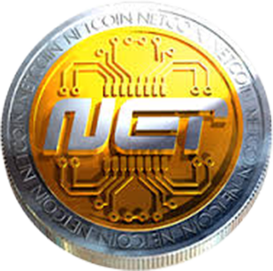 | 149729 | NET | LayerNet |
|  | 149857 | ESCC | EOS Stable Coin |
| 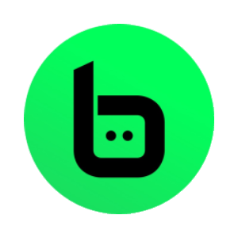 | 147129 | BOTIFY | BOTIFY |
|  | 148045 | YULI | Yuliverse |
| 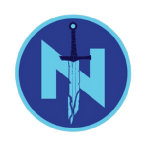 | 149983 | NEXG | NexGami |
|  | 147133 | CATGOLD | Cat Gold Miner |
|  | 141979 | NAYM | NAYM |
| 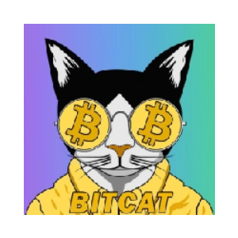 | 142965 | BITCAT | Bitcat |
|  | 144585 | CELA | Cellula |
|  | 144729 | AKUMA | Akuma Inu |
|  | 141941 | SAY | SAY Coin |
|  | 144797 | BUZ | Buz Economy |
|  | 144677 | MG8 | Megalink |
| 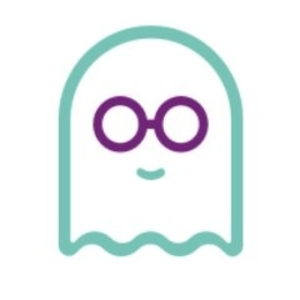 | 146091 | CST | Crypto Samurai |
|  | 141737 | DEGOD | Degods |
| 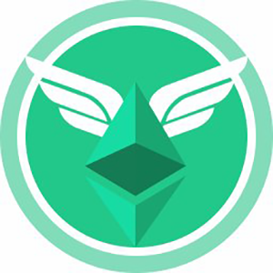 | 141697 | KRO | Kroma |
|  | 145031 | EMBER | Ember Sword |
|  | 141691 | NOOB | Blast Royale |
|  | 141767 | SATX | SatoshiDEX |
|  | 144511 | PLENA | Plena Finance |
|  | 146127 | EEG | EEG |
| 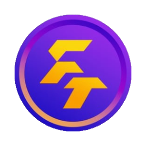 | 141649 | FTON | Fanton |
| 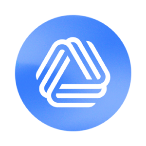 | 142539 | LAY3R | AutoLayer |
| 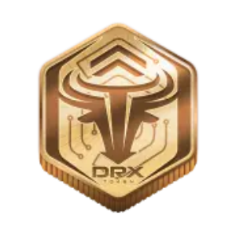 | 146551 | DRX | DoctorX |
| 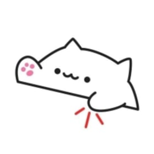 | 141545 | BONGO | Bongo Cat |
| 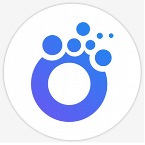 | 146531 | TOMA | Tomarket |
| 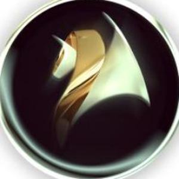 | 141529 | PGC | PiggyPiggy |
|  | 141337 | UNIO | Unio Coin |
| 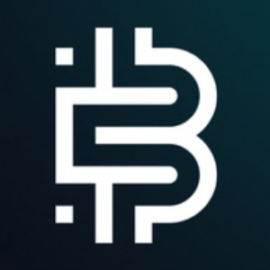 | 141333 | CBL | Credbull |
| 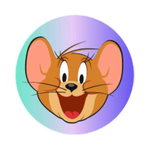 | 141521 | JERRY | jerry |
|  | 141485 | GOUT | GOUT |
| 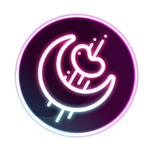 | 141513 | BEANS | SUNBEANS |
|  | 146549 | KOS | Kontos |
|  | 145309 | FYDE | Fyde |
|  | 145315 | ARROW | Arrow Token |
|  | 146509 | AVERY | Avery Games |
| 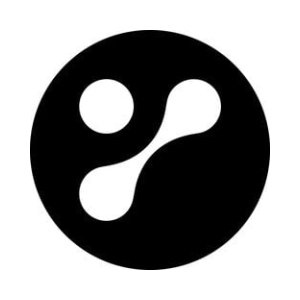 | 137767 | NFTFI | NFTfi |
|  | 146489 | SQ3 | Squad3 |
|  | 145341 | MIRX | Mirada AI |
|  | 141627 | GODL | RoOLZ |
| 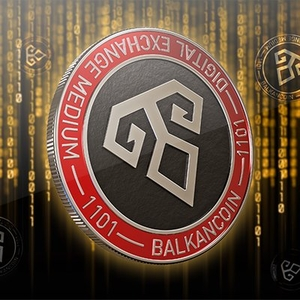 | 145941 | BKC | FACTS |
| 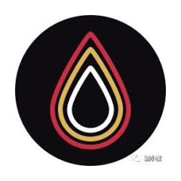 | 142383 | DRINK | Degen Distillery |
|  | 146539 | E4C | E4C |
| 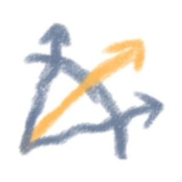 | 143523 | 3AC | THREE ARROWZ CAPITEL |
|  | 146303 | GLIZZY | GLIZZY |
|  | 146535 | TMAI | Token Metrics AI |
| 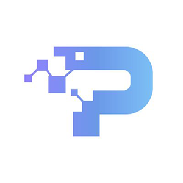 | 136505 | PCH | Pichi FInance |
| 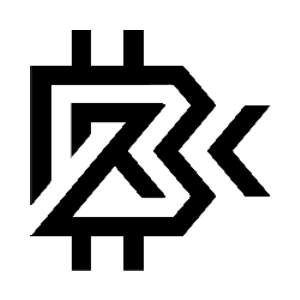 | 132131 | BRCST | BRCStarter |
| 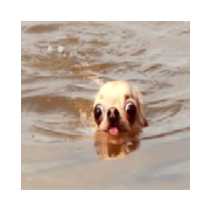 | 136589 | WATER | Waterfall |
|  | 136399 | AGENT | AgentLayer |
| 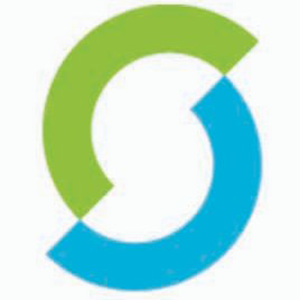 | 132095 | SPOT | Defispot |
|  | 136325 | EGP | Eigenpie |
| 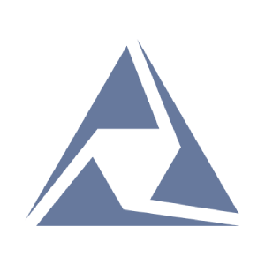 | 136551 | ATRS | Attarius Network |
|  | 136173 | SOCIAL | Phavercoin |
| 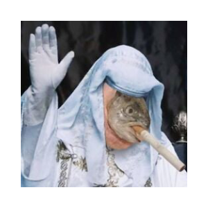 | 136343 | SCF | Smoking Chicken Fish |
| 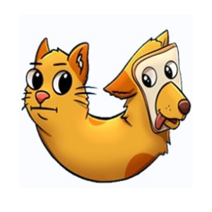 | 136187 | CATDOG | CatDog |
|  | 136327 | USBT | Universal Blockchain |
|  | 131817 | WLTH | Common Wealth |
| 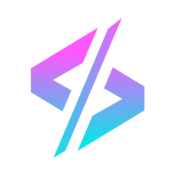 | 131809 | CTOK | Codyfight |
|  | 136019 | DOAI | DOJO Protocol |
|  | 134649 | HDRO | Hydro Protocol |
|  | 136727 | BASEX | Base Terminal |
|  | 136517 | TRUMPCOIN | MAGA: Fight for Trump |
| 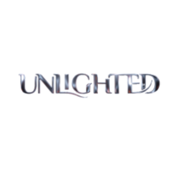 | 135279 | ULD | Unlighted |
|  | 135647 | NFM | NFMart |
|  | 136803 | ABYS | Trinity Of The Fabled |
|  | 136863 | LAZYCAT | LAZYCAT |
| 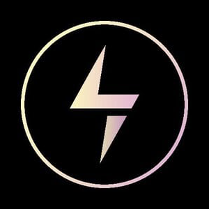 | 136879 | ACL | Auction Light |
|  | 137097 | MUC | Multi Universe Central |
| 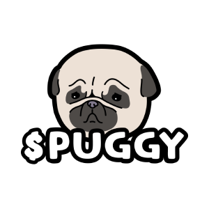 | 136663 | PUGGY | PUGGY Coin |
|  | 137195 | GEF | GemFlow |
|  | 131203 | LLT | LILLIUS |
| 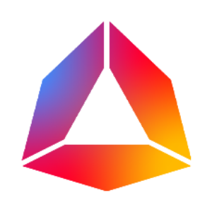 | 127691 | ANDR | Andromeda |
| 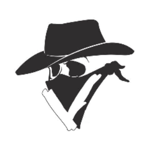 | 127343 | VDT | Vendetta |
|  | 127319 | BWLD | Bowled.io |
|  | 127365 | SSNC | SatoshiSync |
|  | 127287 | PATEX | Patex |
|  | 127479 | ISME | Root Protocol |
| 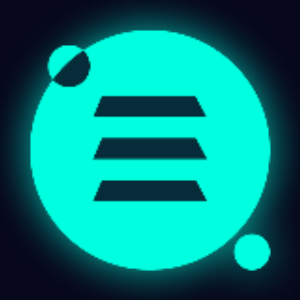 | 130299 | EXVG | Exverse |
| 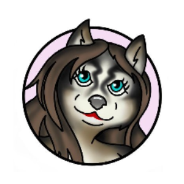 | 130373 | WANKO | WANKO•MANKO•RUNES |
| 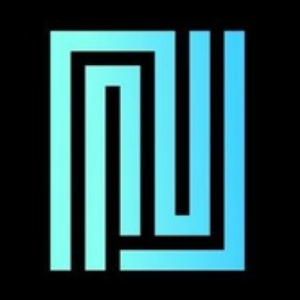 | 131525 | NLK | NuLink |
| 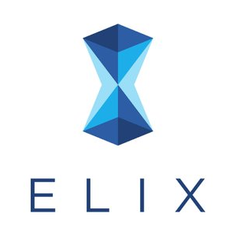 | 131351 | ELIX | Elixir Games |
| 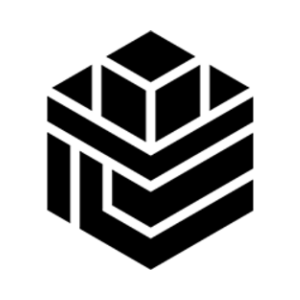 | 131491 | PARAM | Param |
| 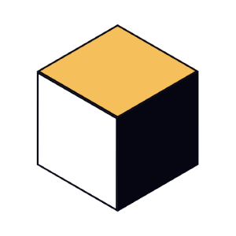 | 127975 | BONUS | BonusBlock |
| 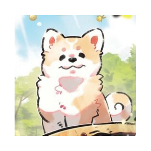 | 131379 | PETOSHI | Petoshi |
| 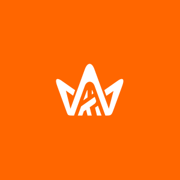 | 131685 | KIM | Kim Exchange |
| 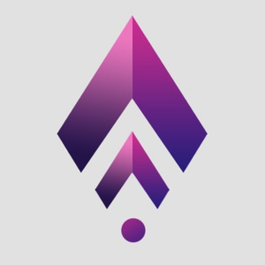 | 131453 | TIP | SugarBounce |
|  | 131695 | HLG | Holograph |
| 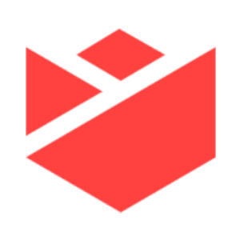 | 131613 | NSTR | Nostra |
| 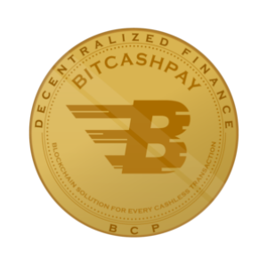 | 131489 | BCP | Block Chain People |
|  | 125895 | TAPROOT | Taproot |
|  | 126147 | OLV | OLIVE |
|  | 126423 | OSKY | OpenSky Finance |
|  | 127209 | ORBK | Ordibank |
|  | 127231 | GEMAI | Next Gem AI |
|  | 125333 | SS20 | SHELL |
|  | 127129 | GOMD | GOMDori |
|  | 127149 | WUF | WUFFI |
| 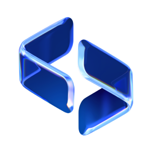 | 127161 | SEAT | Seamans Token |
| 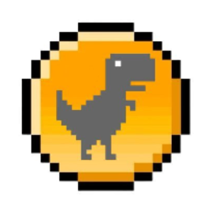 | 127247 | TX20 | Trex20 |
| 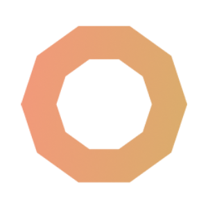 | 127257 | ORFY | Ordify |
|  | 127267 | PUNKAI | PunkAI |
|  | 124797 | MER | Mercurial Finance |
|  | 127235 | LADYF | Milady Wif Hat |
| 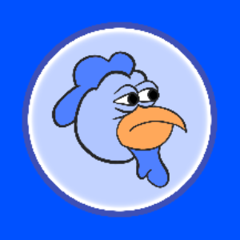 | 127025 | ROOST | Roost Coin |
|  | 127035 | MEMERUNE | MEME•ECONOMICS |
|  | 126863 | DOGEMOB | DOGEMOB |
| 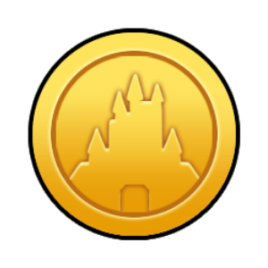 | 126855 | COBE | Castle of Blackwater |
| 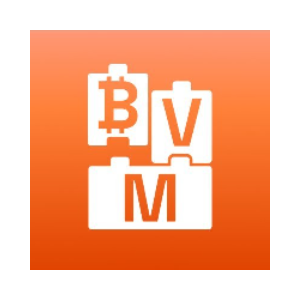 | 126967 | BVM | BVM |
|  | 127047 | RGAME | RGAMES |
|  | 127041 | AVALOX | AVALOX |
| 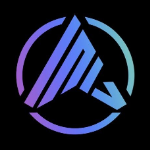 | 126817 | CATCH | SpaceCatch |
| 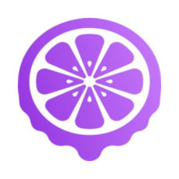 | 127009 | JUICE | Juice Finance |
| 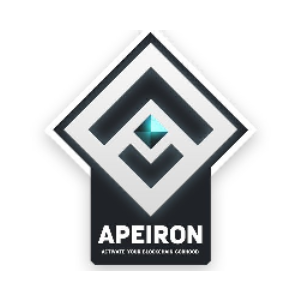 | 126981 | APRS | Apeiron |
| 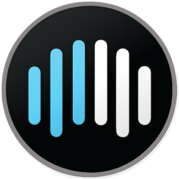 | 122947 | TXT | Taxa Token |
|  | 122555 | BABYELON | Baby Elon |
| 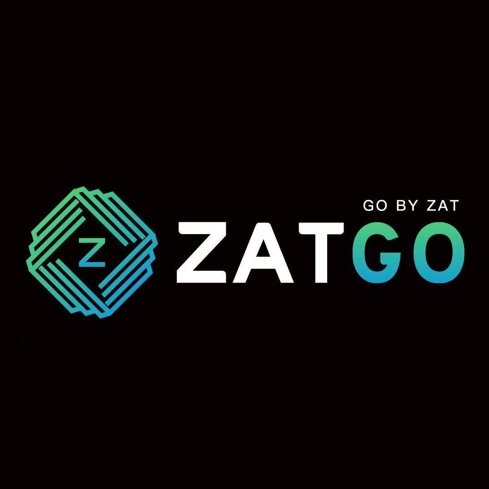 | 123019 | ZAT | zkApes |
| 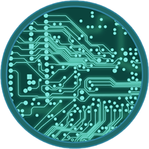 | 123011 | CIR | CircleSwap |
|  | 122991 | WAR | WeStarter |
|  | 123137 | BRT | Bikerush |
| 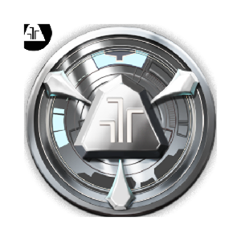 | 123165 | MINE | SpaceMine |
| 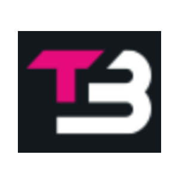 | 123187 | TBE | TrustBase |
|  | 123125 | MOT | Mobius Finance |
| 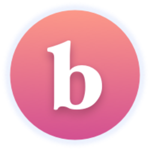 | 123057 | BAGS | Basis Gold Share |
| 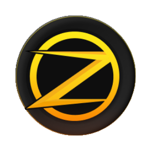 | 123085 | ZONE | ZONE |
| 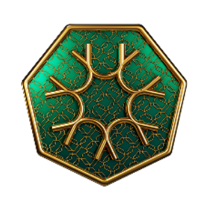 | 123087 | FORA | UFORIKA |
| 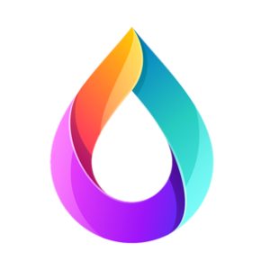 | 123099 | LIQ | LIQ Protocol |
|  | 122431 | GROKCEO | GROK CEO |
|  | 122827 | INSC | INSC (Ordinals) |
| 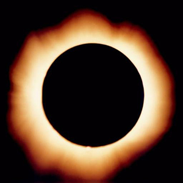 | 122749 | ECLIP | Eclipse Fi |
| 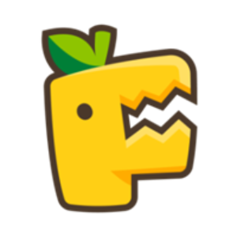 | 122447 | FDT | Frutti Dino |
|  | 122433 | CKP | Cakepie |
| 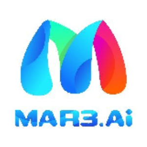 | 122349 | MAR3 | Mar3 AI |
|  | 122419 | PET | Hello Pets |
|  | 122391 | BNSX | BNSx (Ordinals) |
|  | 122389 | MYTH | Mythos |
|  | 122529 | SMILE | Smile Coin |
| 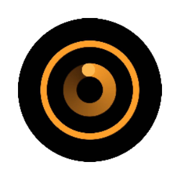 | 122313 | RDEX | Orders.Exchange |
| 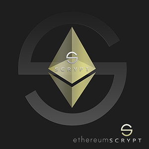 | 122229 | ETHS | Ethscriptions |
|  | 123259 | CYCON | CONUN |
| 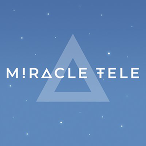 | 123829 | TELE | Telefy |
|  | 122249 | PRX | Parex |
| 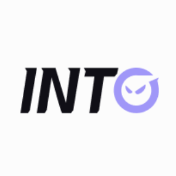 | 122147 | TOX | INTOverse |
| 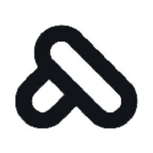 | 113977 | ATEM | Atem Network |
|  | 113491 | MBLK | Magical Blocks |
| 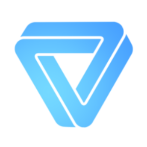 | 121841 | VV | Virtual Versions |
|  | 113573 | ITRUMP | Trump Cards Fraction Token |
| 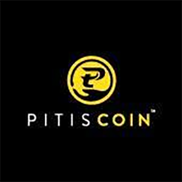 | 121719 | PTS | Petals |
|  | 122085 | CARE | CareCoin |
| 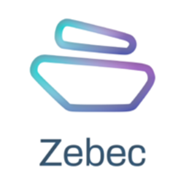 | 121705 | ZBC | Zebec |
|  | 122155 | MICE | Mice (Ordinals) |
| 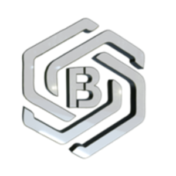 | 121955 | FBX | Finblox |
|  | 122027 | AD | ADreward |
|  | 113923 | GAYPEPE | Gay Pepe |
|  | 115423 | TSUGT | Captain Tsubasa |
|  | 121819 | BLT | Blocto Token |
| 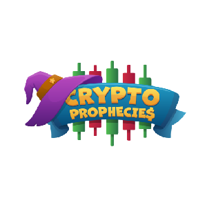 | 122021 | TCP | The Crypto Prophecies |
| 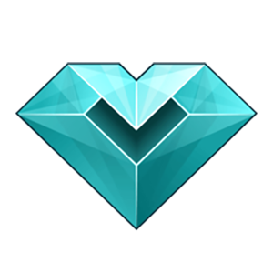 | 122007 | CRP | CropperFinance |
| 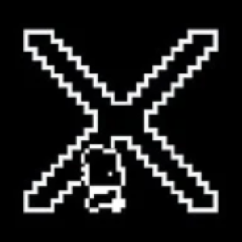 | 122157 | XPET | xPET tech |
|  | 113035 | PSUB | Payment Swap Utility Board |
| 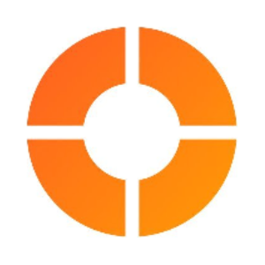 | 111845 | RAFT | Raft |
| 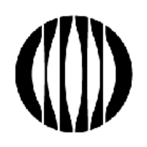 | 112339 | OME | O-MEE |
|  | 112741 | IQT | IQ Protocol |
|  | 112761 | JPG | JPG |
|  | 112403 | AKV | Akiverse Governance Token |
|  | 111539 | RPK | RepubliK |
|  | 112399 | AISWAP | AISwap |
| 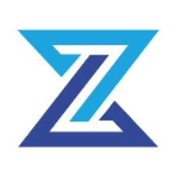 | 111647 | ZELIX | ZELIX |
| 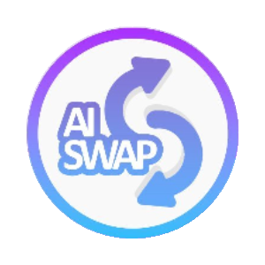 | 111689 | AIS | AISociety |
| 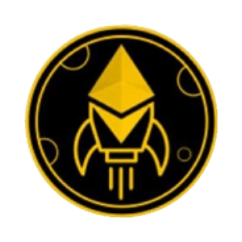 | 113161 | SAFEREUM | SAFEREUM |
| 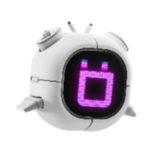 | 111603 | CHAPZ | Chappyz |
| 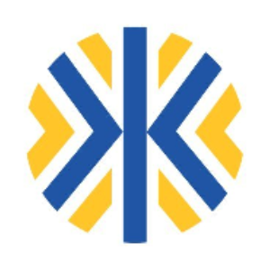 | 111751 | KNJ | Kunji Finance |
|  | 111719 | NERD | NerdBot |
| 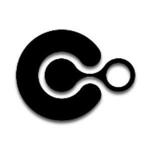 | 111541 | CSAS | Comsats |
| 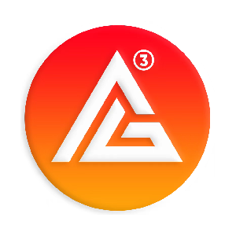 | 113245 | AG | Aradenean Gold |
| 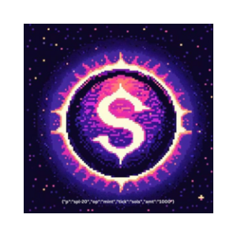 | 113203 | SOLS | sols |
| 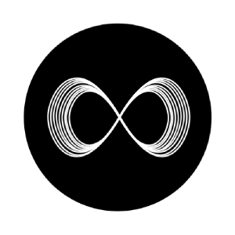 | 111565 | SSWP | Suiswap |
| 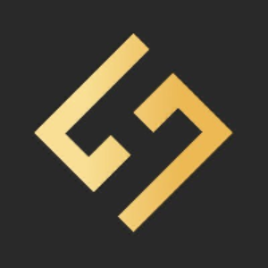 | 111561 | HMX | HMX |
| 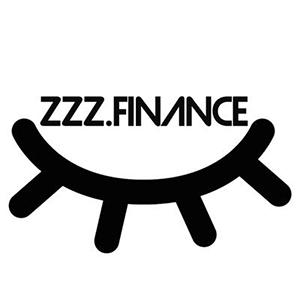 | 96601 | ZZZ | GoSleep |
| 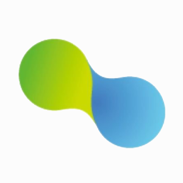 | 100291 | EML | EML Protocol |
|  | 96313 | SHARBI | SHARBI |
| 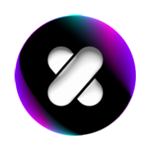 | 98563 | HXA | HXAcoin |
| 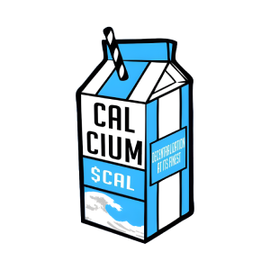 | 96301 | CAL | FitBurn |
|  | 96281 | HADES | Hadeswap |
|  | 97459 | BISO | BISOSwap |
| 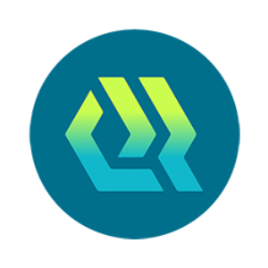 | 97463 | QWAN | The QWAN |
| 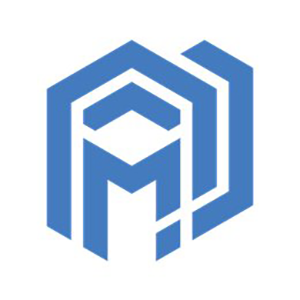 | 96891 | AIBB | BullBear AI |
|  | 96653 | SOULS | The Unfettered |
|  | 95487 | ICONS | SportsIcon |
|  | 96503 | ACN | Acorn Protocol |
|  | 95081 | MAF | MetaMAFIA |
| 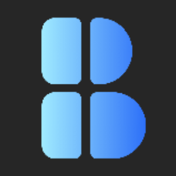 | 99115 | BIOP | Biop |
| 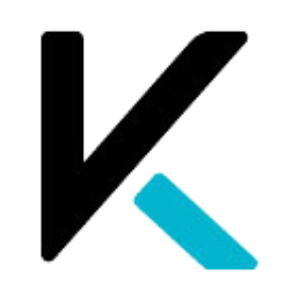 | 97021 | KNFT | KStarNFT |
|  | 99471 | SEILOR | Kryptonite |
|  | 97155 | PEPEBRC | PEPEBRC |
|  | 96513 | RLTM | Reality Metaverse |
|  | 97057 | AIE | A.I.Earn |
|  | 95745 | SPUME | Spume Protocol |
| 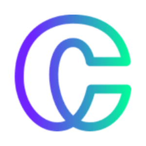 | 94989 | IP3 | Cripco |
|  | 96335 | FNZ | Fanzee |
| 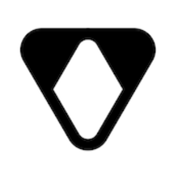 | 97005 | TENET | TENET |
|  | 96327 | SAKAI | Sakai Vault |
| 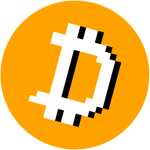 | 95297 | DIGG | DIGG |
| 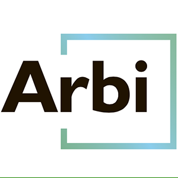 | 94457 | ARBI | ArbiPad |
| 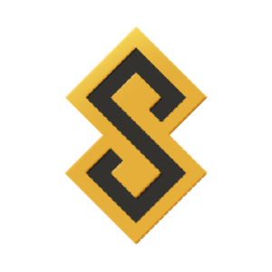 | 90891 | SFTY | Stella Fantasy Token |
| 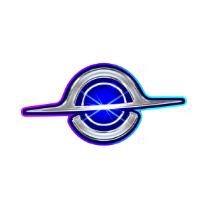 | 90219 | MPI | Metapioneers |
|  | 89777 | MOTG | MetaOctagon |
| 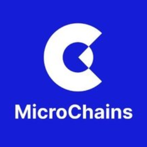 | 89789 | MCG | MicroChains Gov Token |
| 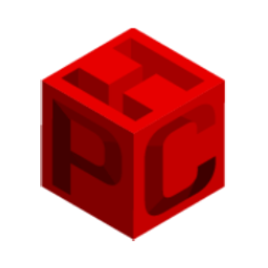 | 89989 | HYCO | HYPERCOMIC |
| 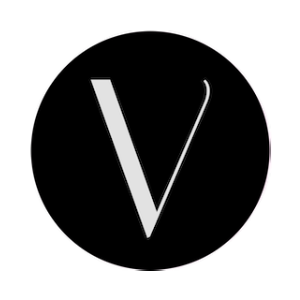 | 94779 | VMPX | VMPX |
| 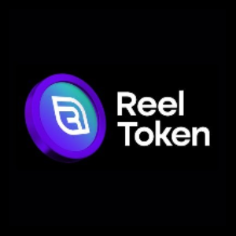 | 91175 | REELT | Reel Token |
| 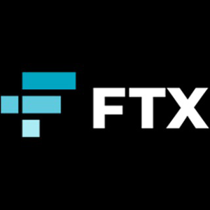 | 94927 | BEAR | Bear Inu |
|  | 94449 | AGLA | Angola |
|  | 94423 | 3KM | 3 Kingdoms Multiverse |
|  | 94073 | WISTA | Wistaverse |
|  | 85635 | IAZUKI | IAzuki |
|  | 82377 | AIRTNT | Airtnt |
|  | 86497 | IMAYC | IMAYC |
| 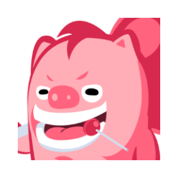 | 86001 | MOO | MooMonster |
| 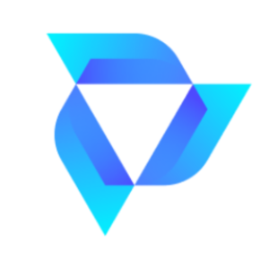 | 85027 | VELA | Vela Token |
|  | 85105 | SQUAD | Superpower Squad |
| 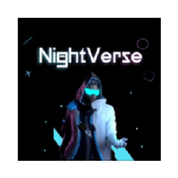 | 88345 | NVG | NightVerse Game |
|  | 88233 | BS | Black Stallion |
|  | 85177 | MOVEZ | MoveZ |
| 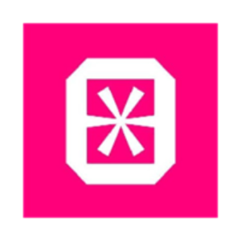 | 81275 | TAPT | Tortuga Staked Aptos |
| 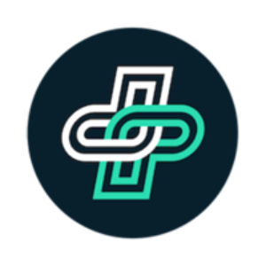 | 80565 | PUMLX | PUMLx |
|  | 78371 | PIAS | PIAS |
| 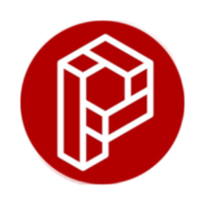 | 78381 | PRMX | PREMA |
| 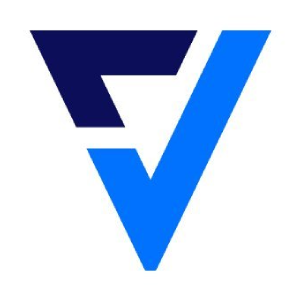 | 79021 | VTS | Veritise |
| 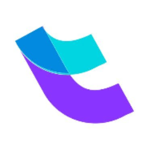 | 79991 | VP | Vortex Protocol |
| 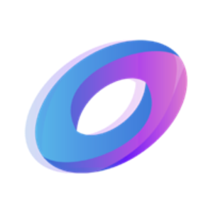 | 78819 | EPX | Ellipsis X |
| 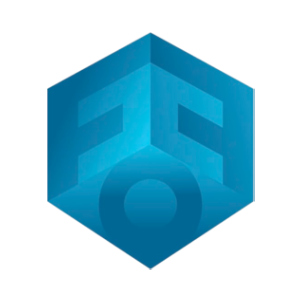 | 79183 | FOF | Future Of Fintech |
| 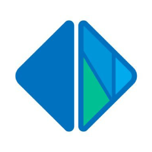 | 80749 | ITEM | ITEMVERSE |
| 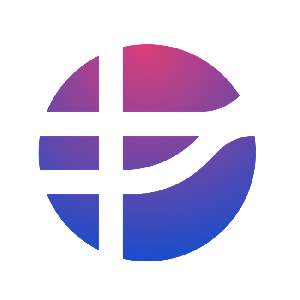 | 80985 | PSY | PsyOptions |
| 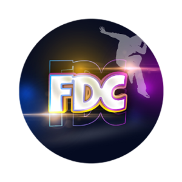 | 78379 | FDC | Fidance |
|  | 79437 | FROG | FrogSwap |
|  | 80099 | DRAC | DRAC Network |
|  | 78911 | SRG | Street Runner |
|  | 71247 | FIU | beFITTER |
| 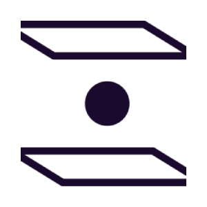 | 71087 | INTR | Interlay |
|  | 77793 | ECOX | ECOx |
|  | 78079 | FPFT | Peruvian National Football Team Fan Token |
|  | 77967 | SN | SpaceN |
| 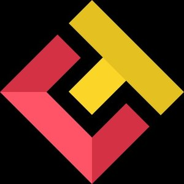 | 78027 | XET | Xfinite Entertainment |
|  | 71115 | DEBT | The Debt Box |
|  | 71289 | OGV | Origin Dollar Governance |
| 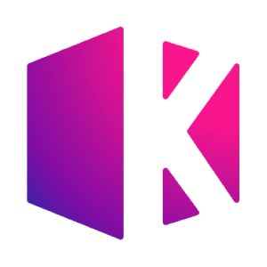 | 71543 | KUBE | KubeCoin |
|  | 71505 | CTY | CUSTODIY |
|  | 71301 | KLAP | Klap Finance |
|  | 70273 | STEPG | STEPG |
| 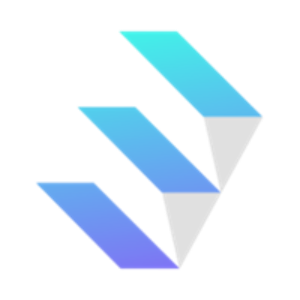 | 70923 | TARI | Tari World |
| 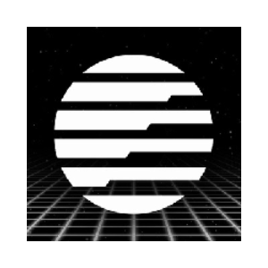 | 70841 | ZTG | Zeitgeist |
| 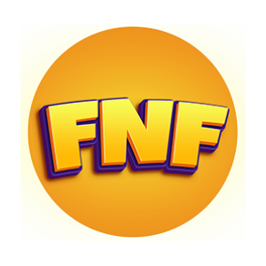 | 70615 | FNF | FunFi |
|  | 69957 | VTG | Victory Gem |
|  | 70909 | OLAND | OceanLand |
|  | 69709 | TAKI | Taki |
|  | 70805 | ARSW | ArthSwap |
|  | 70695 | AQDC | Aquanee |
| 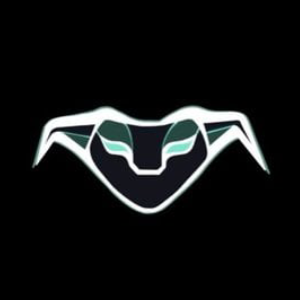 | 69463 | ASW | AdaSwap |
| 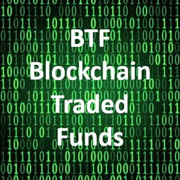 | 68935 | BTF | Bitcoin Faith |
| 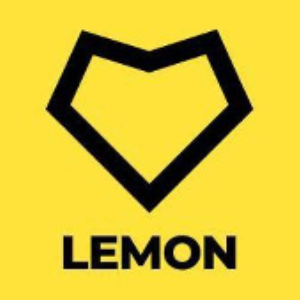 | 68927 | LEMN | Lemon Token |
| 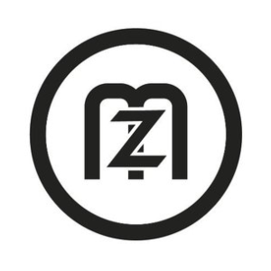 | 68493 | METAG | MetagamZ |
|  | 69025 | BOUNTIE | Bountie Hunter |
|  | 69373 | BLIN | Blin Metaverse |
|  | 69519 | LGX | Legion Network |
|  | 66861 | GGM | Monster Galaxy |
| 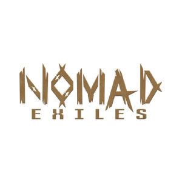 | 66479 | PRIDE | Nomad Exiles |
|  | 67453 | POPK | POPKON |
|  | 67995 | SPAY | SpaceY 2025 |
| 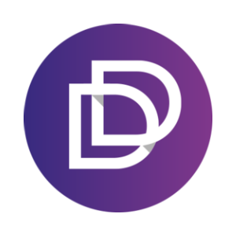 | 67621 | DOGA | Dogami |
| 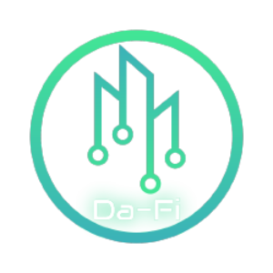 | 65421 | PNL | True PNL |
| 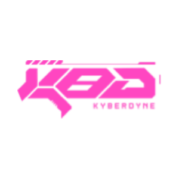 | 65791 | KBD | Kyberdyne |
| 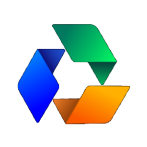 | 66217 | XNFT | xNFT Protocol |
| 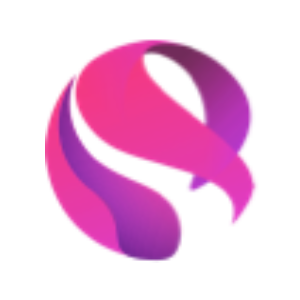 | 65507 | SKYRIM | Skyrim Finance |
|  | 66237 | MGG | MetaGaming Guild |
|  | 64957 | THALES | Thales |
| 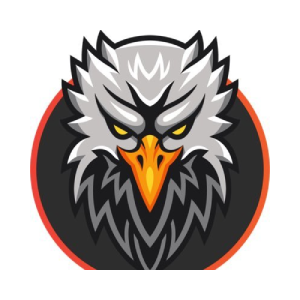 | 66097 | FALCONS | Falcon Swaps |
| 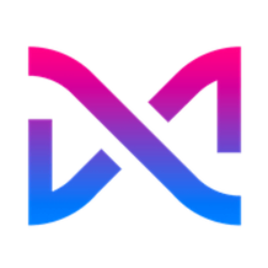 | 65709 | KNOT | Karmaverse |
|  | 64949 | REVO | Revomon |
| 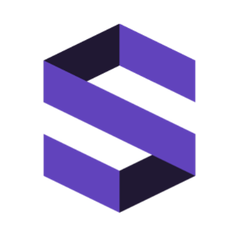 | 65015 | STND | Standard Protocol |
| 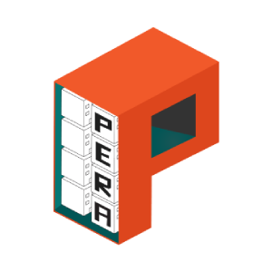 | 65391 | PERA | Pera Finance |
|  | 65681 | EZ | EasyFi V2 |
| 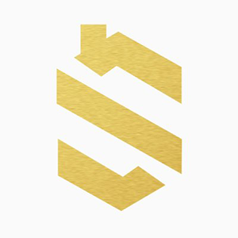 | 65247 | SNK | Snook |
|  | 65701 | EVA | Evanesco Network |
|  | 65181 | XIL | ProjectX |
| 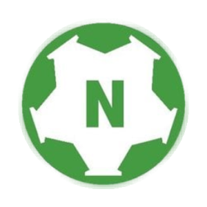 | 63349 | NRFB | NuriFootBall |
|  | 63605 | NXD | Nexus Dubai |
|  | 61329 | SHARE | Seigniorage Shares |
| 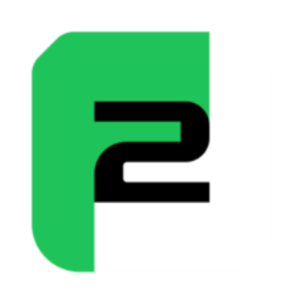 | 61055 | F2C | Ftribe Fighters |
|  | 60423 | KFC | Chicken |
|  | 60695 | UNQ | UNQ |
| 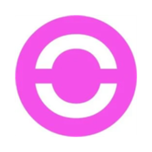 | 60241 | FRR | Front Row |
| 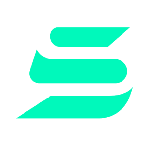 | 60001 | SNY | Synthetify Token |
|  | 59833 | NVIR | NvirWorld |
| 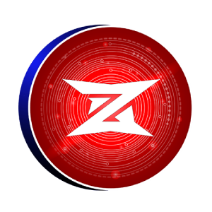 | 60285 | STZ | 99Starz |
|  | 60125 | MSU | MetaSoccer |
|  | 60473 | AAG | AAG Ventures |
| 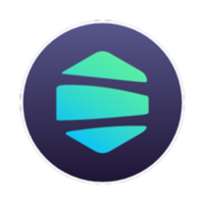 | 59243 | ATOLO | Rizon |
|  | 59223 | KILT | KILT Protocol |
| 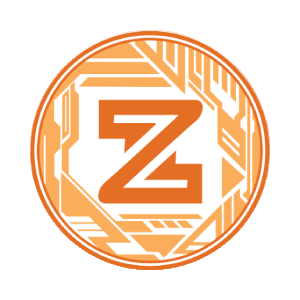 | 59679 | ZODI | Zodium |
|  | 59221 | PAF | Pacific |
| 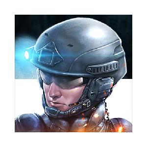 | 59051 | KBOX | The Killbox Game |
|  | 59367 | MGA | Metagame Arena |
| 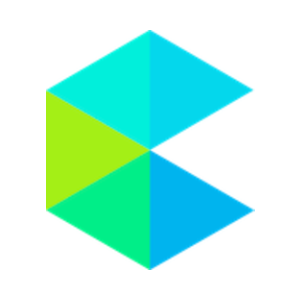 | 59493 | CRE8 | Creaticles |
|  | 58651 | DANA | Ardana |
|  | 59097 | ZLK | Zenlink Network Token |
|  | 58541 | NBP | NFTBomb |
| 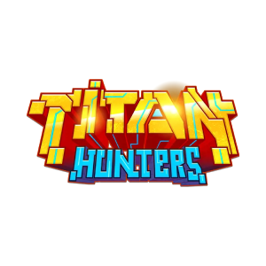 | 58577 | TITA | Titan Hunters |
| 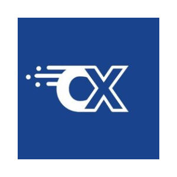 | 58349 | XPRESS | CryptoXpress |
| 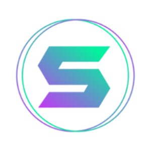 | 57099 | SOLR | SolRazr |
|  | 57771 | YIN | YIN Finance |
| 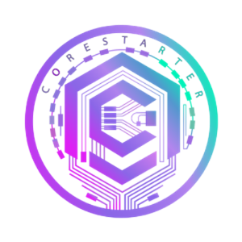 | 57769 | CSTR | CoreStarter |
| 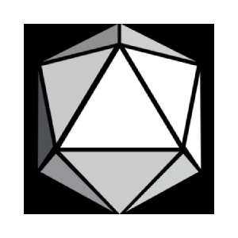 | 57775 | DAL | DAOLaunch |
|  | 58141 | KART | Dragon Kart Token |
| 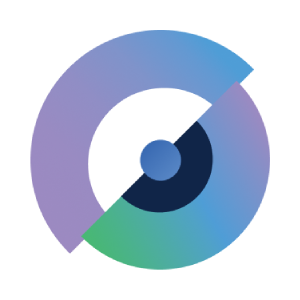 | 58035 | BAKED | Baked Token |
|  | 57811 | ZAM | Zam.io |
| 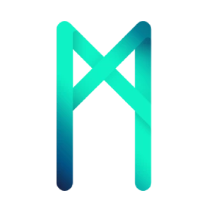 | 57249 | MIMIR | Mimir Token |
|  | 55885 | STRP | Strips Finance |
| 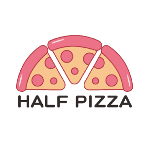 | 55759 | PIZA | Half Pizza |
| 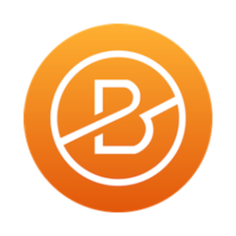 | 56473 | BCMC | Blockchain Monster Hunt |
| 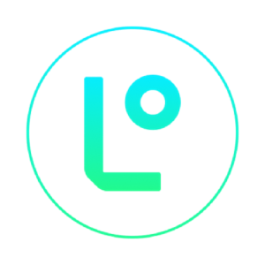 | 56327 | LUNR | Lunr Token |
|  | 55159 | LUFFY | LUFFY INU |
|  | 56081 | SHOE | ShoeFy |
| 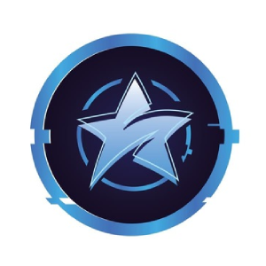 | 56143 | SRP | Starpunk |
|  | 56441 | TTK | The Three Kingdoms |
| 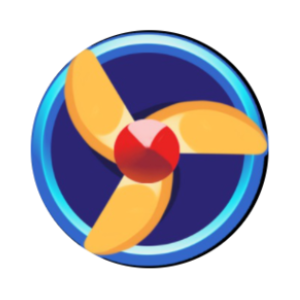 | 56175 | CPAN | CryptoPlanes |
|  | 56065 | KWS | Knight War Spirits |
|  | 55869 | RMRK | RMRK |
|  | 51373 | OPA | Option Panda Platform |
|  | 54457 | BORING | BoringDAO |
|  | 51463 | OPS | Octopus Protocol |
| 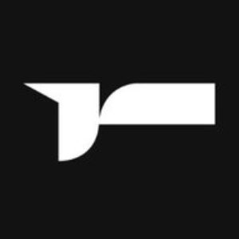 | 54049 | THN | Throne |
|  | 54647 | HIBIKI | Hibiki Finance |
|  | 54605 | MNY | Moonie NFT |
| 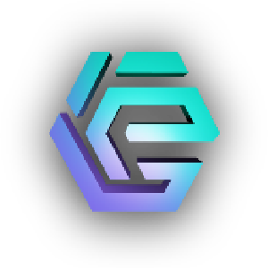 | 52077 | EMPIRE | Empire Token |
| 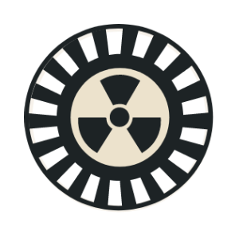 | 51899 | GENS | Genshiro |
| 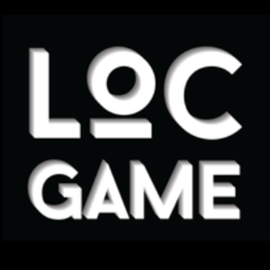 | 51891 | LOCG | LOCGame |
| 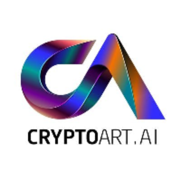 | 54231 | CART | CryptoArt.Ai |
| 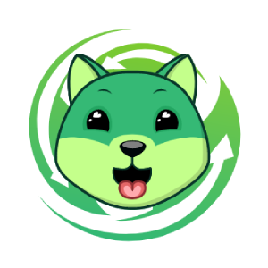 | 53901 | GINUX | Green Shiba Inu (new) |
|  | 53783 | KAR | Karura |
| 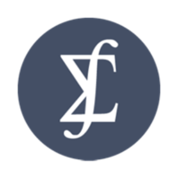 | 53895 | ITGR | Integral |
|  | 49909 | KOMBAT | Crypto Kombat |
|  | 50117 | LEMD | Lemond |
| 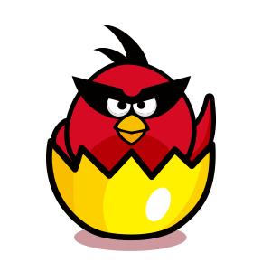 | 50993 | DEK | DekBox |
| 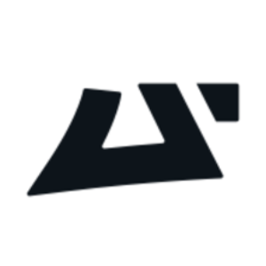 | 50251 | WAS | Wasder |
|  | 49683 | BXH | BXH Token |
|  | 49661 | MTDR | Matador Token |
| 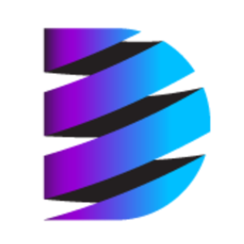 | 50355 | DHX | DataHighway |
| 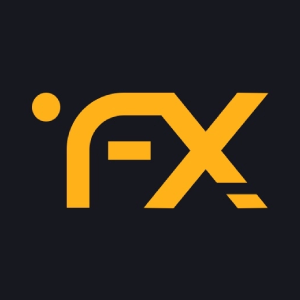 | 50763 | YFX | Your Futures Exchange |
|  | 51165 | PERI | PERI Finance |
|  | 50595 | ALPHR | Alphr |
|  | 50857 | CHNG | Chainge Finance |
| 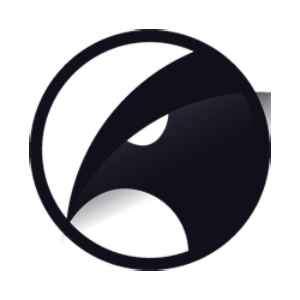 | 50571 | ORAO | ORAO Network |
| 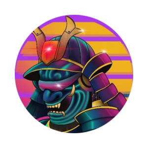 | 49345 | DDOS | disBalancer |
| 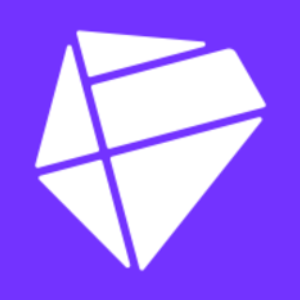 | 48655 | FRA | Findora |
| 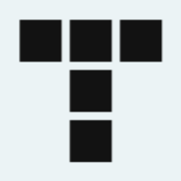 | 49019 | TOTM | TotemFi |
| 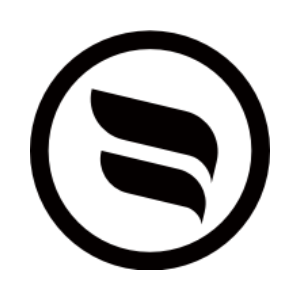 | 48417 | DOWS | Shadows |
|  | 48765 | CONV | Convergence |
| 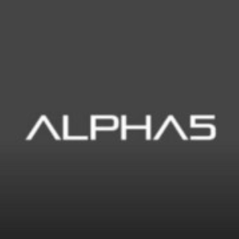 | 48211 | A5T | Alpha5 |
|  | 49469 | MRCH | MerchDAO |
|  | 48919 | KPAD | KickPad |
|  | 48851 | XEND | Xend Finance |
| 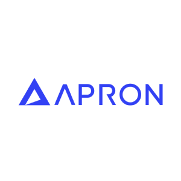 | 49411 | APN | Apron |
| 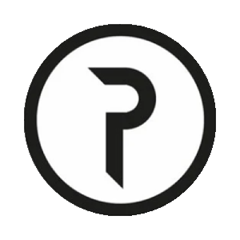 | 48121 | PSL | Pastel |
| 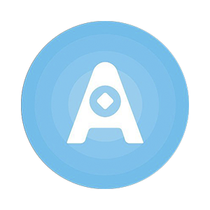 | 48895 | ARES | Ares Protocol |
|  | 48343 | EHASH | EHash |
| 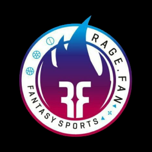 | 49023 | RAGE | Rage.Fan |
| 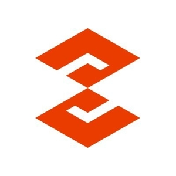 | 46304 | SFG | S.Finance |
| 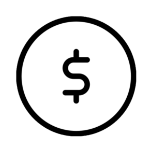 | 47001 | ONC | One Cash |
|  | 47379 | KYL | Kylin Network |
| 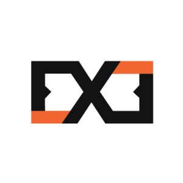 | 47415 | FXF | Finxflo |
| 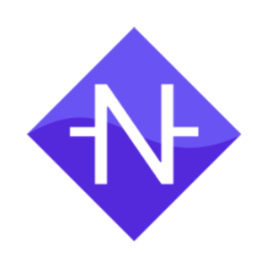 | 46814 | NSBT | Neutrino Token |
|  | 46967 | MIS | Mithril Share |
| 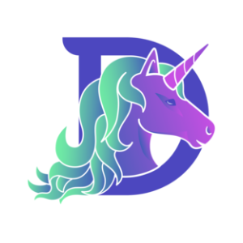 | 47377 | JULD | JulSwap |
| 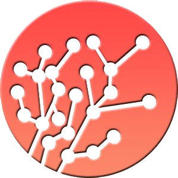 | 46761 | CORAL | Coral Swap |
|  | 46977 | MAHA | MahaDAO |
|  | 47955 | SLNV2 | SLNV2 |
|  | 47078 | VIDYX | VidyX |
|  | 47393 | ZMT | Zipmex Token |
|  | 47144 | ONS | One Share |
|  | 47753 | LABS | LABS Group |
| 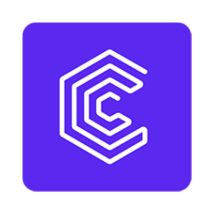 | 46998 | CRBN | Carbon |
| 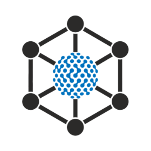 | 47559 | IDEA | Ideaology |
| 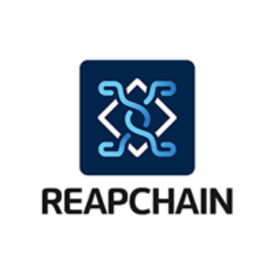 | 46485 | REAP | ReapChain |
| 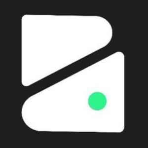 | 47863 | XMARK | xMARK |
| 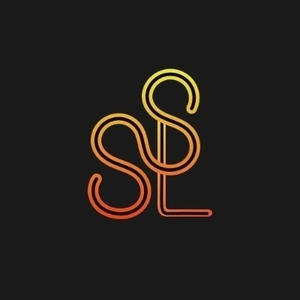 | 46269 | SSL | Sergey Save Link |
|  | 47020 | XCUR | Curate |
|  | 46576 | HARD | HARD Protocol |
|  | 47653 | OLY | Olyseum |
|  | 45007 | ETHDOWN | Binance Ethereum Short |
|  | 45002 | ETHUP | Binance Ethereum Long |
|  | 45266 | MQL | MiraQle |
| 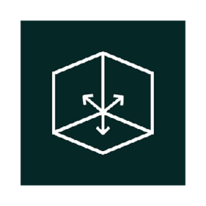 | 45298 | AXIS | Axis DeFi |
|  | 45151 | MINI | MiniSwap |
|  | 45347 | AGS | Aegis |
| 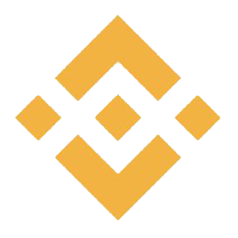 | 45752 | LINKDOWN | LINKDOWN |
| 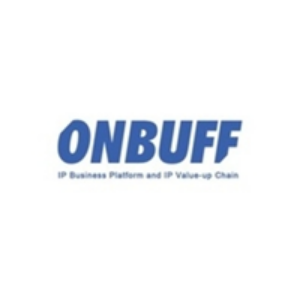 | 45270 | ONIT | ONBUFF |
|  | 45343 | YFBETA | yfBeta |
|  | 45342 | ADEL | Akropolis Delphi |
| 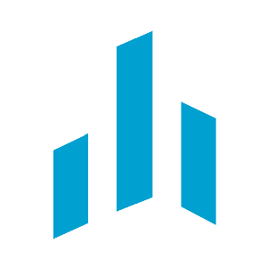 | 45520 | DHT | dHedge DAO |
| 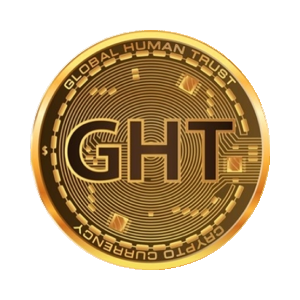 | 45531 | GTH | Gather |
| 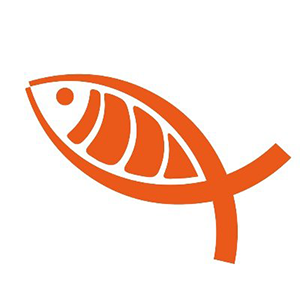 | 45341 | SASHIMI | Sashimi |
|  | 45242 | BUY | Burency |
| 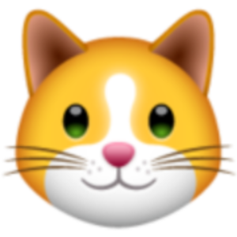 | 45631 | KIF | KittenFinance |
|  | 44989 | BIDR | Binance IDR |
|  | 44684 | WGRT | WaykiChain Governance Coin |
|  | 44802 | LOON | Loon Network |
| 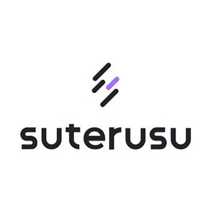 | 42420 | SUTER | Suterusu |
|  | 42569 | ALY | Ally |
|  | 42704 | NAX | NextDAO |
| 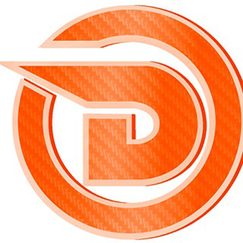 | 42309 | DILI | D Community |
|  | 41636 | DVP | Decentralized Vulnerability Platform |
|  | 41609 | QTCON | Quiztok |
| 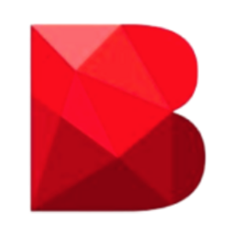 | 36431 | BOOM | BOOM |
|  | 36415 | GMAT | GoWithMi |
|  | 36576 | VIDY | VIDY |
|  | 34713 | NYZO | Nyzo |
|  | 36433 | SERO | Super Zero |
|  | 36454 | PCX | ChainX |
| 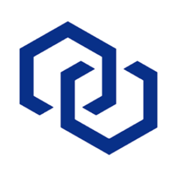 | 36593 | TSHP | 12Ships |
|  | 33810 | VIDT | V-ID |
| 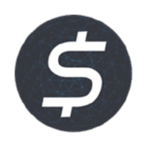 | 33573 | SNET | Snetwork |
| 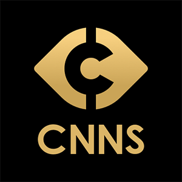 | 33881 | CNNS | CNNS |
| 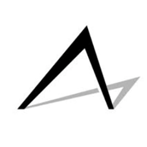 | 33564 | ATP | Atlas Protocol |
|  | 33572 | PLA | PlayChip |
|  | 33765 | LAMB | Lambda |
|  | 33873 | STPT | STPT |
|  | 32768 | INSUR | InsurChain |
| 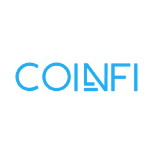 | 32480 | COFI | CoinFi |
| 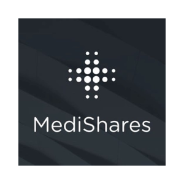 | 32383 | MDS | MediShares |
| 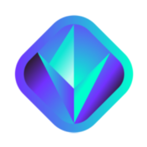 | 32602 | GEM | Gems  |
|  | 33132 | LEMO | LemoChain |
|  | 32407 | MTN | Medicalchain |
|  | 32478 | BNTY | Bounty0x |
|  | 32403 | SENC | Sentinel Chain |
| 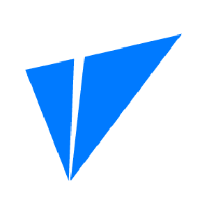 | 32889 | VITE | VITE |
|  | 32396 | LYM | Lympo |
| 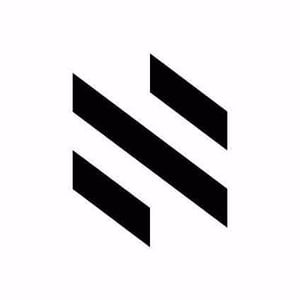 | 32781 | SKM | Skrumble Network |
|  | 33104 | GARD | Hashgard |
| 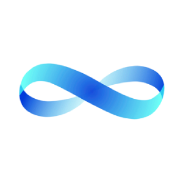 | 32392 | MOBI | Mobius |
|  | 32384 | TNC | Trinity Network Credit |
| 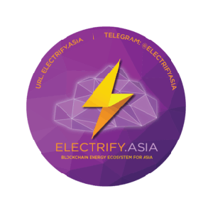 | 32378 | ELEC | Electrify.Asia |
|  | 32843 | HSC | HashCoin |
|  | 33065 | HIT | HitChain |
|  | 33071 | DX | DxChain Token |
| 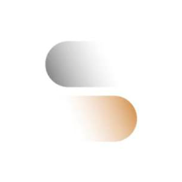 | 33070 | SOP | SoPay |
| 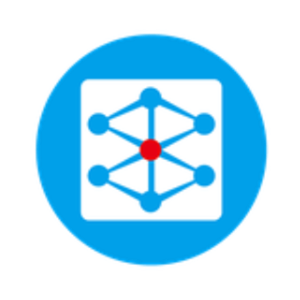 | 32625 | BCDN | BlockCDN |
|  | 33089 | GSE | GSENetwork |
|  | 32592 | XMC | Monero Classic |
| 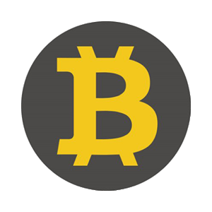 | 32600 | BCX | BitcoinX |
|  | 32796 | FTI | FansTime |
| 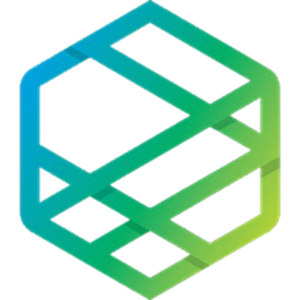 | 32414 | ZPT | Zeepin |
|  | 2929 | OAX | OAX |
| 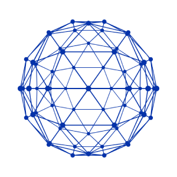 | 32338 | WICC | WaykiChain |
|  | 2870 | TIPS | FedoraCoin |
|  | 2784 | SNM | SONM |
|  | 2816 | MDA | Moeda Loyalty Points |
| 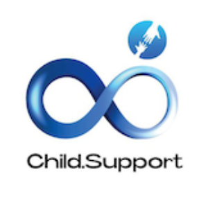 | 10815 | CS | Credits |
| 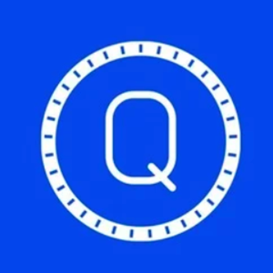 | 10689 | QASH | QASH |
| 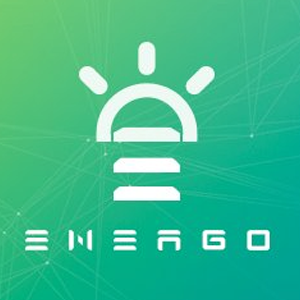 | 12324 | TSL | Energo |
| 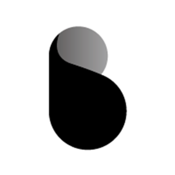 | 32346 | BTO | Bottos |
| 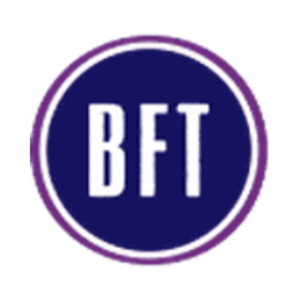 | 32343 | BFT | BnkToTheFuture |
| 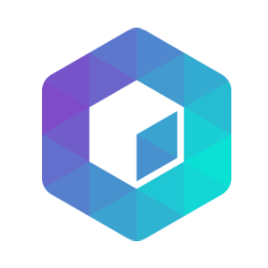 | 2476 | NEBL | Neblio |
|  | 2718 | WTC | Walton |
| 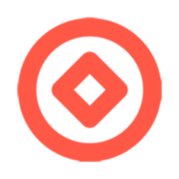 | 32231 | WABI | WaBi |
|  | 32230 | OST | Simple Token |
|  | 32227 | GTO | Gifto |
|  | 12366 | INK | Ink |
|  | 32366 | IHT | IHT Real Estate Protocol |
| 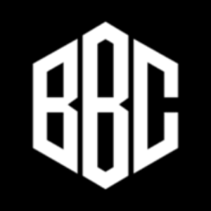 | 3649 | BBC | TraDove B2BCoin |
| 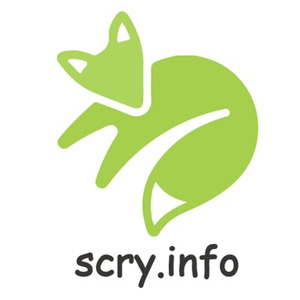 | 32353 | DDD | Scry.info |
| 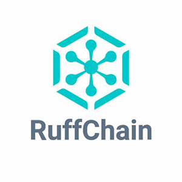 | 32349 | RUFF | Ruff |
| 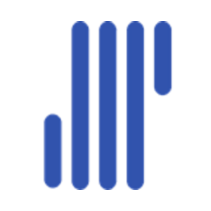 | 3717 | DPY | Delphy |
|  | 2811 | AMB | Ambrosus |
|  | 1745 | QBT | Qbao |
|  | 264 | RCN | Ripio Credit Network |
|  | 1542 | MINT | Mintcoin |
| 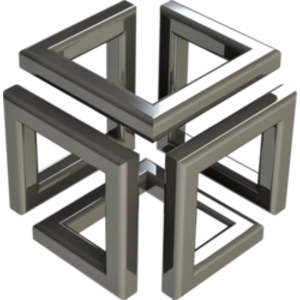 | 60 | COVAL | Circuits of Value |
|  | 161943 | UI | UIUI |
|  | 115207 | OUT | Outter Finance |
|  | 66973 | LTRBT | Little Rabbit |
| 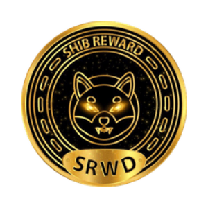 | 60523 | SRWD | ShibRWD |
| 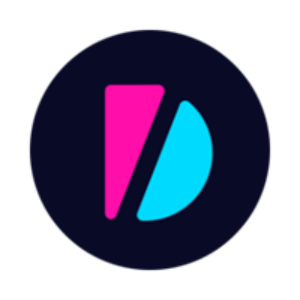 | 54147 | IDIA | Impossible Decentralized Incubator Access |
|  | 51483 | TRAVEL | Travel Care |
|  | 54113 | AIRT | AirNFTs |
|  | 54059 | WSPP | Wolf Safe Poor People |
| 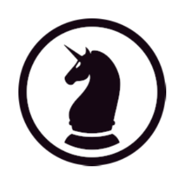 | 46246 | IFUND | Unifund |
|  | 33886 | GRN | GreenPower |
| 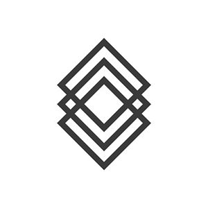 | 10838 | GEN | DAOstack |
| 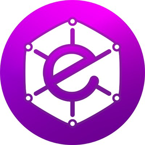 | 3408 | ECA | Electra |
|  | 165067 | VALYR | Valyr |
| 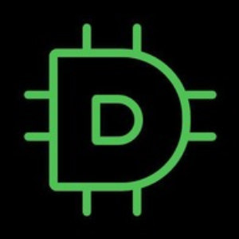 | 127983 | DLY | Daily Finance |
|  | 122581 | JEFF | JEFF |
|  | 80897 | INNIT | InnitForTheTECH |
|  | 77919 | SDL | Saddle Finance |
|  | 55641 | BBFEG | Babyfeg |
|  | 45213 | FTS | FTS Coin |
|  | 44895 | SPRX | Sprint |
|  | 44443 | VRTN | VINYL RECORDS TOKEN |
|  | 36661 | MNG | Mangocoin |
| 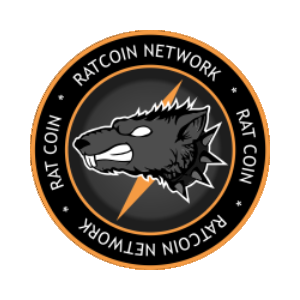 | 34694 | RAT | RATCOIN |
|  | 34790 | HATCH | Hatch |
| 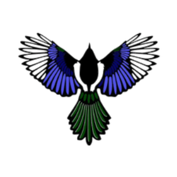 | 34731 | RITO | RITO |
| 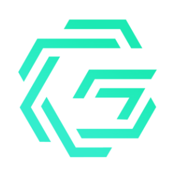 | 34767 | GENIX | Genix |
|  | 34764 | AUS | Australia Cash |
| 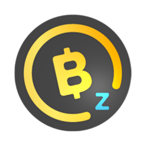 | 385 | BTCZ | BitcoinZ |
|  | 168785 | V2EX | V2EX |
|  | 162625 | NXA | Nexa (nexaagent.xyz) |
|  | 168599 | CJL | CJournal |
| 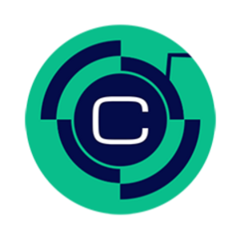 | 136435 | CIRX | Circular Protocol |
| 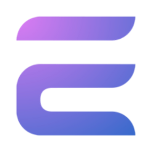 | 115417 | EDLC | Edelcoin |
| 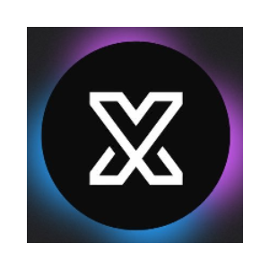 | 113515 | VRL | VIRTUAL X |
|  | 61923 | FROYO | Froyo Games |
|  | 59099 | MITTEN | Mittens |
|  | 56347 | CDZ | CDzExchange |
|  | 51473 | MOMAT | Moma Protocol |
|  | 49579 | KRYPTO | Kryptobellion |
|  | 49207 | QWLA | Qawalla Token |
| 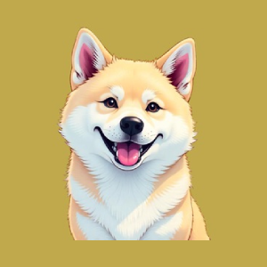 | 141861 | NEIROINU | Neiro Inu |
|  | 125469 | KARMA | Karma DAO |
|  | 112483 | BLF | BlackLatexFist |
|  | 69697 | CMSN | The Commission |
| 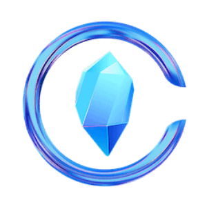 | 69451 | SHARDS | SolChicks Shards |
|  | 66541 | VPK | Vulture Peak |
|  | 57955 | BERSERK | Berserk Inu |
| 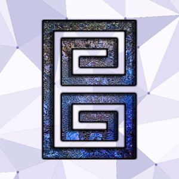 | 2551 | BIS | Bismuth |
|  | 112187 | GROC | Grok Chain |
| 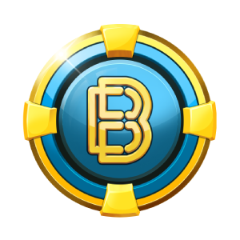 | 59093 | BEM | Bemil Coin |
|  | 135295 | PEPER | Baby Pepe |
| 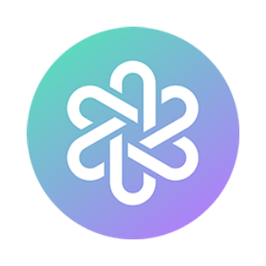 | 126859 | MDAI | MindAI |
|  | 70367 | SHIBCAKE | SHIB CAKE |
|  | 67727 | BURN1COIN | Burn1Coin |
|  | 65447 | BCPAY | BCPAY FinTech |
|  | 46739 | TAD | Tadpole |
| 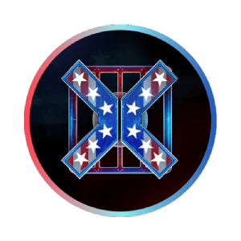 | 153919 | LEGAL | LegalX |
|  | 62735 | WGC | Green Climate World |
| 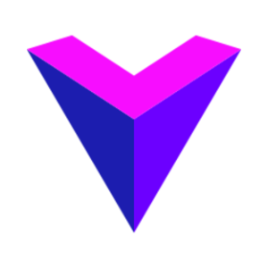 | 59845 | VXL | Voxel X Network |
|  | 51653 | SAVEANIMAL | SaveAnimal |
|  | 151573 | RX | RealtyX |
| 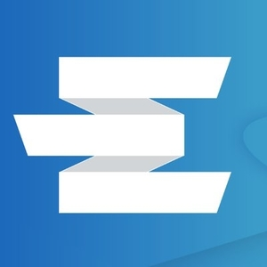 | 131461 | ERA | Era Token (Era7) |
| 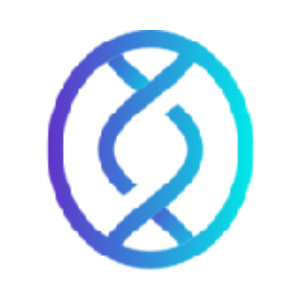 | 100297 | MDI | Medicle |
|  | 54177 | $CRDN | Cardence.io |
| 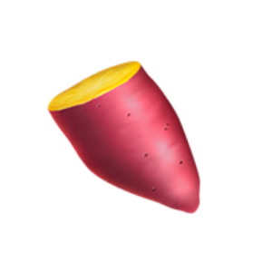 | 45283 | YAMV2 | YAMv2 |
|  | 162595 | SARA | Pulsara |
| 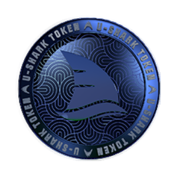 | 125873 | USHARK | uShark Token |
|  | 123315 | KAU | Gold |
|  | 49107 | WQT | Work Quest |
|  | 161151 | LUDUS | Ludus |
|  | 164747 | HUSHR | hushr |
| 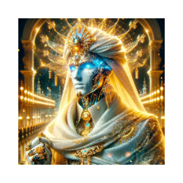 | 161877 | AGIALPHA | AGI ALPHA AGENT |
| 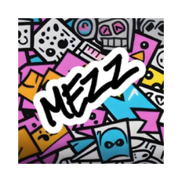 | 94691 | MEZZ | MEZZ |
|  | 93921 | TSANGNYON | HERUKA TSANGNYON |
|  | 78523 | WER1 | Protectors of the Realm |
|  | 55313 | YARD | Solyard Finance |
|  | 51619 | NASA | Not Another Shit Altcoin |
|  | 46652 | MVEDA | MedicalVeda |
|  | 149751 | BJR | BiJiRi |
|  | 138933 | HFUN | Hold.fun |
|  | 142431 | CANDLE | Candle Cat |
|  | 65199 | WASABI | WasabiX |
|  | 49815 | SCORGI | SpaceCorgi |
| 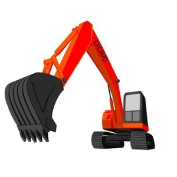 | 48009 | CAVO | Excavo Finance |
| 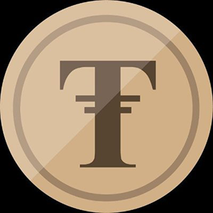 | 45607 | TRBT | Tribute |
| 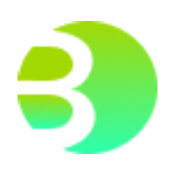 | 135283 | BECX | BETHEL |
| 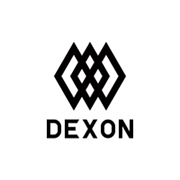 | 91079 | DXN | DBXen |
|  | 78475 | SHIWA | Shiwa |
|  | 168789 | BRACKY | BRACKY |
|  | 151637 | STICK | Stick |
| 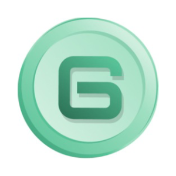 | 148623 | GRAB | GRABWAY |
|  | 146749 | BABYFWOG | Baby Fwog |
|  | 141793 | SINK | Let that sink in |
| 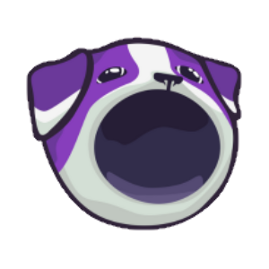 | 136355 | POPDOG | PopDog |
| 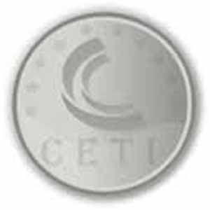 | 127289 | CETI | Tao Ceτi |
|  | 113029 | PRB | Paribu Net |
|  | 100437 | BTC.B | Bitcoin Avalanche Bridged (BTC.b) |
|  | 85223 | TXAG | tSILVER |
| 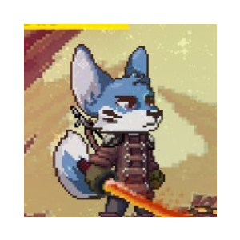 | 67941 | SOULO | SouloCoin |
| 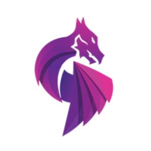 | 49205 | ARIX | Arix |
|  | 47477 | PRT | Portion |
|  | 147251 | JAE | JaeCoin |
| 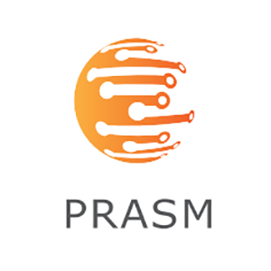 | 126443 | PSM | Possum |
|  | 99065 | FUNCH | FUNCH |
|  | 71501 | DBNB | DecentraBNB |
|  | 61433 | NERVE | NerveFlux |
|  | 115589 | STACKS | STACKS |
|  | 54081 | TCUB | Tiger Cub |
|  | 122703 | PAXU | Pax Unitas |
| 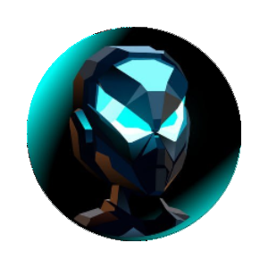 | 112921 | XCEPT | XCeption |
|  | 70779 | $FUR | Furio |
|  | 49499 | SARCO | Sarcophagus |
| 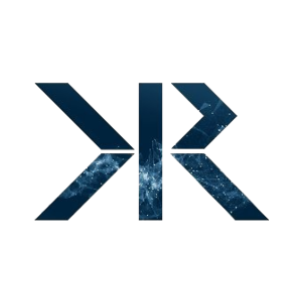 | 57209 | KRN | KRYZA Network |
|  | 54557 | SAFUYIELD | SafuYield Protocol |
| 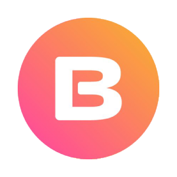 | 32225 | BRD | Bread |
|  | 97321 | PEPEXL | PepeXL |
| 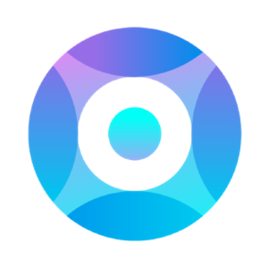 | 59737 | CLY | Colony |
|  | 52165 | KISSMYMOON | KissMyMoon |
| 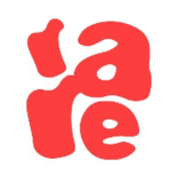 | 128163 | R4RE | R4RE Token |
| 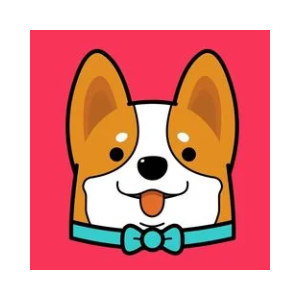 | 88917 | KAKI | Doge KaKi |
| 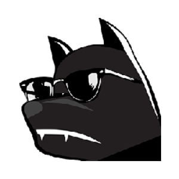 | 64101 | FATHER | DogeFather Token |
|  | 58855 | COINSCOPE | Coinscope |
| 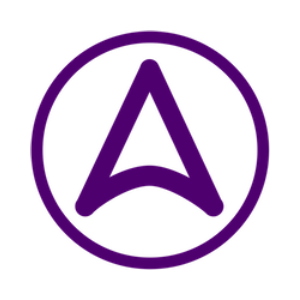 | 53611 | ARRO | Arro Social |
|  | 151929 | MIMIKO | MIMIKO |
| 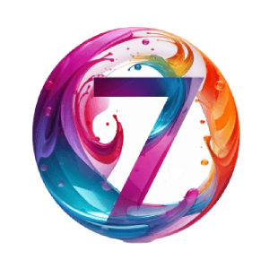 | 115463 | 7 | Lucky7 |
| 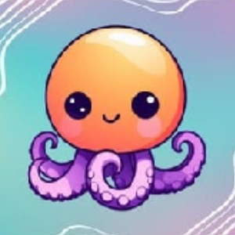 | 112117 | OTSEA | OTSea |
|  | 98445 | JNX | Janex |
|  | 88239 | BOWL | BOWL SHIBARIUM |
| 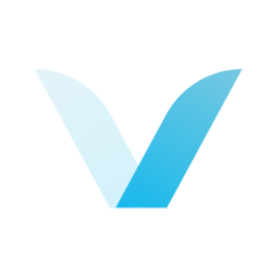 | 101361 | VIX | VIXCO |
| 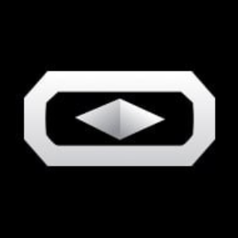 | 111521 | AIMBOT | AimBot |
| 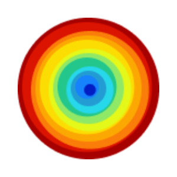 | 65957 | YVBOOST | Yearn Compounding veCRV yVault |
|  | 161693 | VULPEFI | Vulpe Finance |
| 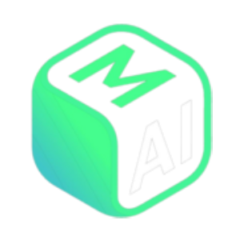 | 129387 | MODAI | Modai |
|  | 123331 | BBCG | BBC Gold Coin |
|  | 65221 | SLCL | Solcial |
|  | 123645 | SDX | Steakd |
|  | 69937 | TRYON | Stellar Invictus |
|  | 161853 | LAUNCHCOIN | Launch Coin on Believe |
|  | 150263 | TECK | Technet |
| 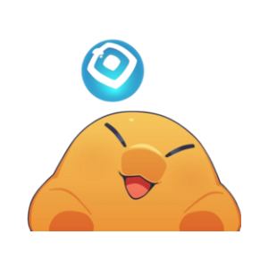 | 151231 | DOODI | Doodipals |
|  | 158961 | NAIT | NodeAI |
|  | 146475 | LOU | Lou |
| 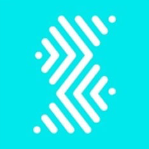 | 141267 | STUFF | STUFF.io |
|  | 127597 | OBICOIN | OBI Real Estate |
|  | 130967 | GALAXIS | Galaxis |
| 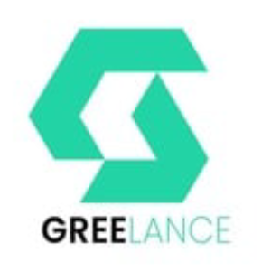 | 122449 | GRL | Greelance |
|  | 122273 | WELSH | Welshcorgicoin |
|  | 113183 | SES | Sesterce |
|  | 70611 | SHAZU | Shazu |
| 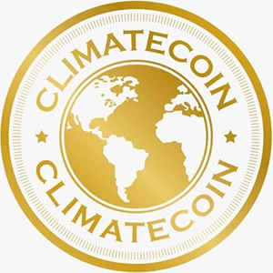 | 63321 | CO2 | Collective |
|  | 51297 | PAMPTHER | Pampther |
|  | 45893 | $ROPE | Rope |
| 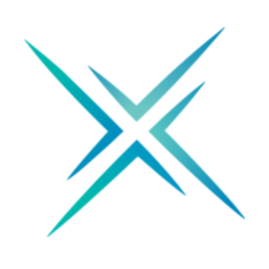 | 165721 | OPENX | OpenxAI Network |
| 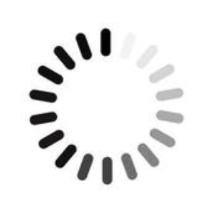 | 131151 | AXLW | Axel Wrapped |
| 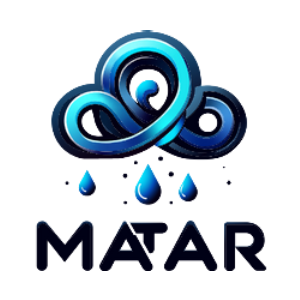 | 130977 | MATAR | MATAR AI |
| 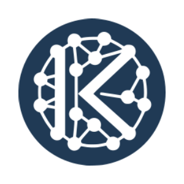 | 125257 | KLS | Karlsen |
|  | 122879 | RIB | Ribus |
|  | 115325 | MTHN | MTH Network |
|  | 95075 | HEEL | Good Dog |
| 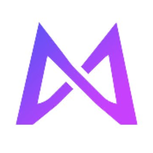 | 91047 | WMLX | Wrapped Millix |
| 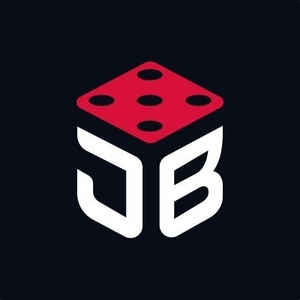 | 88959 | WINR | WINR Protocol |
| 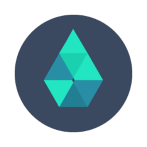 | 42018 | BDP | BidiPass |
| 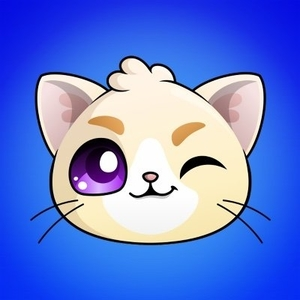 | 42083 | CUTE | Blockchain Cuties Universe |
|  | 32340 | CENNZ | Centrality |
|  | 141551 | FNXAI | Finanx AI |
| 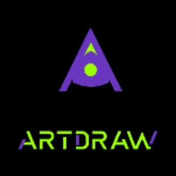 | 115479 | ARTDRAW | ArtDraw |
| 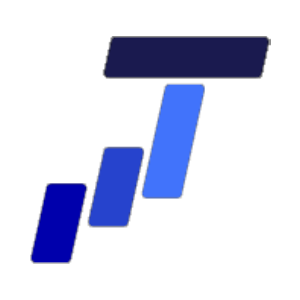 | 112657 | TEE | Guarantee |
|  | 99833 | CREDA | CreDA |
| 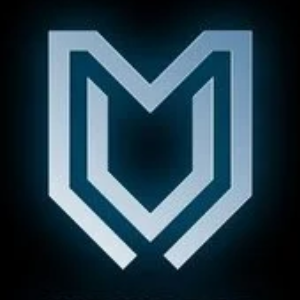 | 55167 | ULTI | Ulti Arena |
|  | 153283 | NEIROH | NeiroWifHat |
| 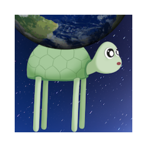 | 141375 | TWURTLE | twurtle the turtle |
| 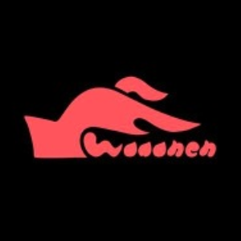 | 100367 | WOOO | Wooonen |
| 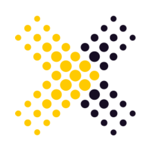 | 80049 | WORK | The Employment Commons Work |
|  | 65415 | $GENE | GenomesDAO |
| 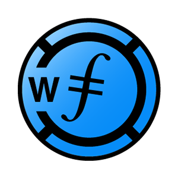 | 65521 | WFIL | Wrapped Filecoin |
| 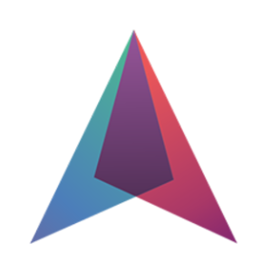 | 65583 | MPAD | MultiPad |
|  | 57045 | URUB | Urubit |
|  | 55979 | WPKT | Wrapped PKT |
|  | 51877 | VACAY | Vacay |
| 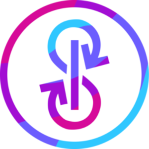 | 47151 | YPIE | PieDAO Yearn Ecosystem Pie |
|  | 112193 | GROQ | GROQ |
|  | 70737 | PMR | Pomerium |
|  | 60039 | MEGALAND | Metagalaxy Land |
|  | 54675 | CERES | Ceres |
| 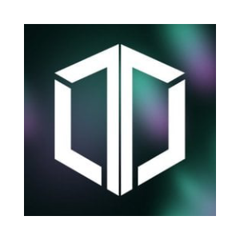 | 49985 | TPAD | TrustPad |
|  | 166179 | IRWA | IncomRWA |
|  | 146947 | CNDY | SUGARVERSE |
| 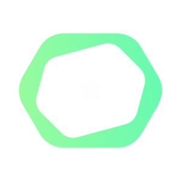 | 146753 | YBR | YieldBricks |
| 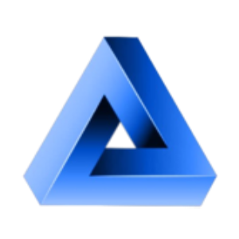 | 144557 | EDX | edeXa |
| 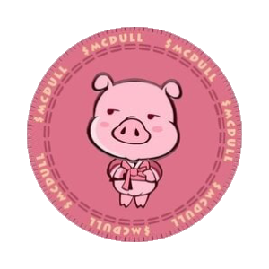 | 141235 | MCDULL | McDull |
| 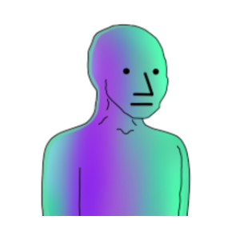 | 136045 | NPCS | Non-Playable Coin Solana |
|  | 132771 | BLOOM | BloomBeans |
| 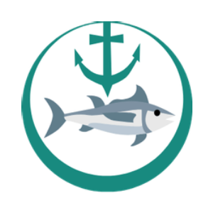 | 124763 | TUNA | TUNACOIN |
|  | 112633 | NEWM | NEWM |
| 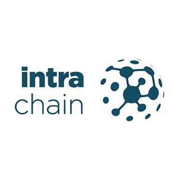 | 112677 | ICT | ICTech |
|  | 86011 | VB | Very Banking |
| 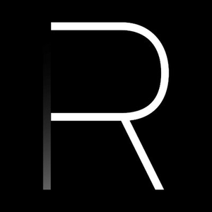 | 89389 | KRX | KRYZA Exchange |
|  | 127675 | $TD | The Big Red |
|  | 122223 | MELD | MELD |
|  | 99249 | SXS | SphereSXS |
|  | 59991 | SILO | Silo Finance |
|  | 49001 | YAE | Cryptonovae |
| 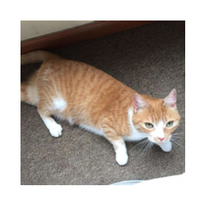 | 144697 | WAFFLES | Waffles |
| 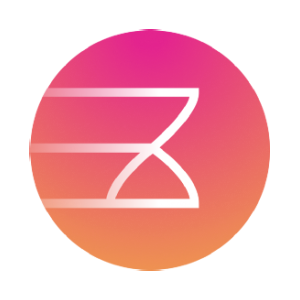 | 136579 | CTF | CryptoTradingFund |
| 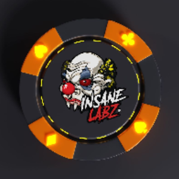 | 141335 | LABZ | Insane Labz |
| 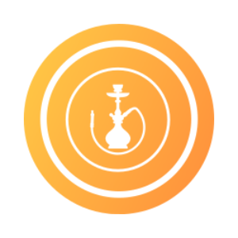 | 136975 | SHISHA | Shisha Coin |
|  | 130327 | ORACLE | Oracle AI |
| 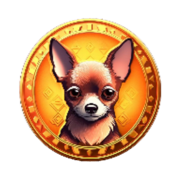 | 126655 | YOLO | YOLO |
|  | 127753 | AXM | AXM token |
| 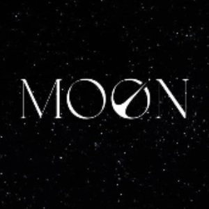 | 127751 | 2MOON | The Moon Metaverse |
| 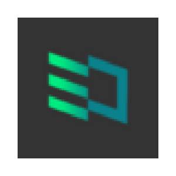 | 113141 | P3D | 3DPass |
|  | 97203 | SUIP | SuiPad |
| 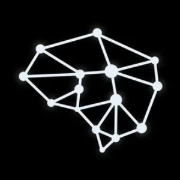 | 96261 | AIPAD | AIPAD |
|  | 78235 | CHRP | Chirpley |
|  | 71033 | MBP | Mobipad |
|  | 63745 | FUTURE | FutureCoin |
|  | 59313 | KMA | Calamari Network |
|  | 162343 | HAIO | HAiO |
|  | 163055 | AIAF | AI Agent Factory |
| 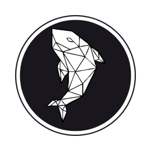 | 131559 | FISH | TON FISH MEMECOIN |

---

[← Prev](./list5.md) | [Next →](./list7.md)
