# Cryptocurrency list (page: 7)

[← Prev](./list6.md) | [Next →](./list8.md)

| Logo | ID | Symbol | Name |
|:----:|:--:|:------:|:-----|
|  | 6499 | CUR | Cura Network |
| 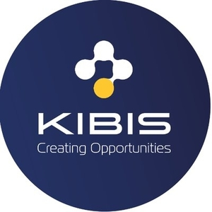 | 6500 | KIBIS | KIBIS |
|  | 6501 | VOGOV | VogoV |
|  | 6502 | SPKZ | Spokkz |
|  | 6503 | ERA | ETHA |
|  | 6504 | MAKE | MAKE |
|  | 6505 | SCRIBE | Scribe Network |
|  | 6506 | INXM | InMax |
|  | 6507 | LYTX | LYTIX |
|  | 6508 | SQUEEZER | Squeezer |
|  | 6509 | GNC | Greencoin |
| 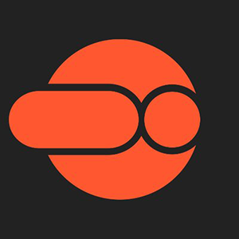 | 6510 | WVR | Weave |
|  | 6511 | WHN | Windhan Energy |
| 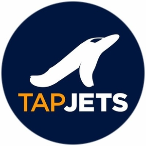 | 6512 | TJA | TapJets |
|  | 6513 | INBIT | PrepayWay |
|  | 6514 | SIACLASSIC | SiaClassic |
| 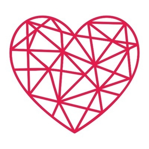 | 6515 | LAC | LOVE Air Coffee |
|  | 6516 | LIC | Ligercoin |
| 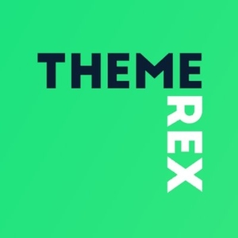 | 6517 | XOS | Excalibur OS |
| 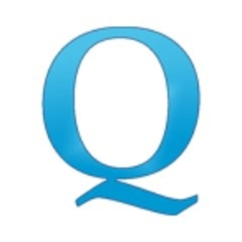 | 6518 | QCP | Crypto Potential |
| 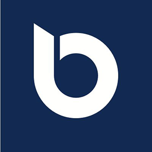 | 6519 | BWL | Bitwala Token |
| 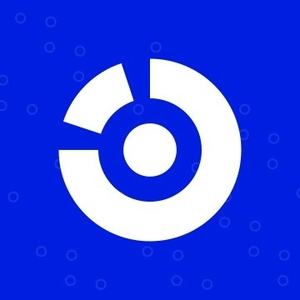 | 6520 | WATT | WorkChain.io |
| 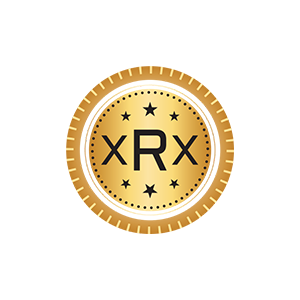 | 6521 | XRX | Global Property Register |
|  | 6522 | PARQ | PARQ |
|  | 6523 | TFF | TheFaustFlick |
| 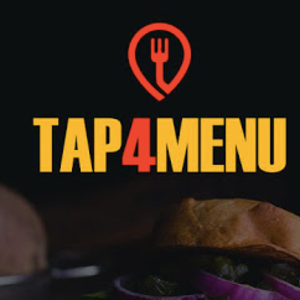 | 6524 | T4M | Tap4.Menu |
|  | 6525 | ELOC | eLocations |
|  | 6526 | IZZY | Izzy |
| 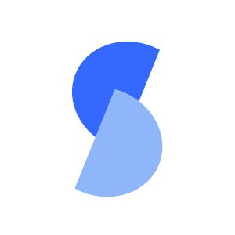 | 6527 | SONT | Sonata.ai |
|  | 6528 | LUNES | Lunes |
| 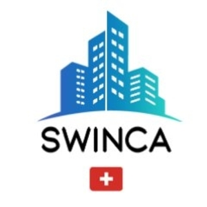 | 6529 | SWI | Swinca |
|  | 6530 | EDEXA | edeXa Security Token |
|  | 6531 | ANTE | ANTE |
|  | 6532 | PPI | Primpy |
|  | 6533 | TRXDICE | TRONdice |
|  | 6534 | AFTT | Africa Trading Chain |
|  | 6535 | TRXWIN | TronWin |
| 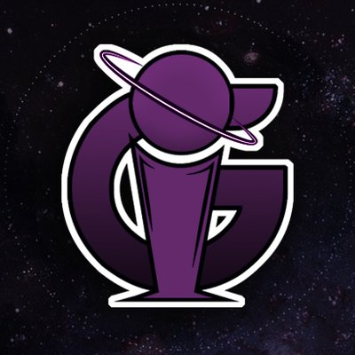 | 6536 | IGG | IG Gold |
|  | 6537 | TWJ | TronWeeklyJournal |
|  | 6538 | MIG | Migranet |
|  | 6539 | IPUX | IPUX |
|  | 6540 | PCC | PCORE |
|  | 6541 | BWN | BitWings |
|  | 6542 | DARB | Darb Token |
|  | 6543 | SLICEC | SLICE |
|  | 6544 | CFUN | CFun |
|  | 6545 | MBTX | MinedBlock |
| 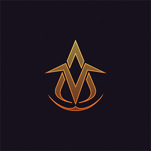 | 6546 | VDS | Vollar |
|  | 6547 | 2GT | 2GETHER |
| 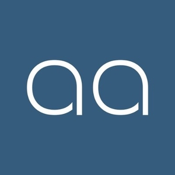 | 6548 | AAS | aassio |
|  | 6549 | BUY | Burency |
|  | 6550 | DXN | DEXON |
| 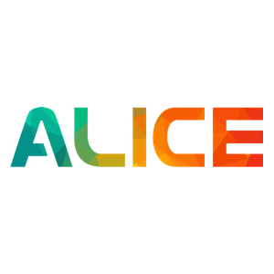 | 6551 | LWA | Leap With Alice |
|  | 6552 | AFCT | Allforcrypto |
| 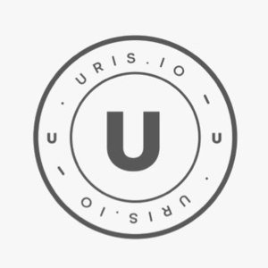 | 6554 | URIS | Uris |
|  | 6555 | QCO | Qravity |
| 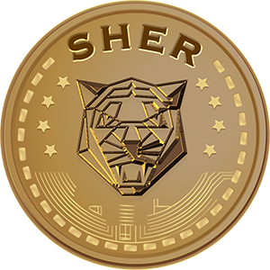 | 6556 | SHER | Shercoin |
| 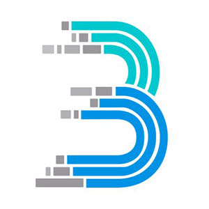 | 6557 | BIN | BINCOIN |
|  | 6558 | MCRC | MyCreditChain |
| 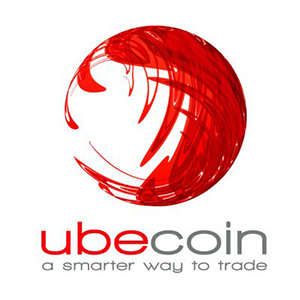 | 6559 | UBE | Ubecoin |
|  | 6560 | ETGP | Ethereum Gold Project |
|  | 6561 | ISG | ISG |
|  | 6562 | GFCS | Global Funeral Care |
|  | 6563 | GEC | Geco.one |
|  | 6565 | ADUX | Adult X Token |
| 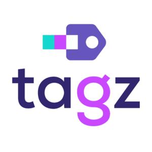 | 6566 | TAGZ | TAGZ |
| 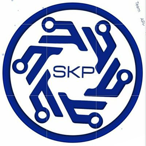 | 6567 | SKP | Skelpy |
|  | 6568 | REINDEER | Reindeer |
|  | 6569 | AGRO | Bit Agro |
|  | 6570 | HCXP | HCX PAY |
| 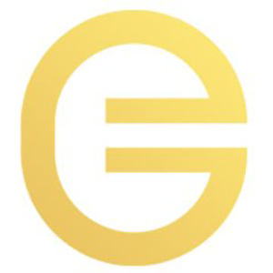 | 6571 | XGN | Golden Currency |
|  | 6572 | EUCX | EUCX |
| 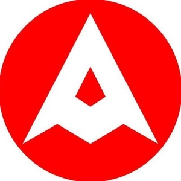 | 6573 | AML | AMANPURI |
|  | 6574 | IX | X-Block |
|  | 6575 | GOREC | GoRecruit |
| 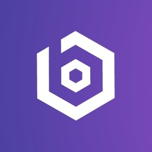 | 6576 | B66 | Block66 |
|  | 6577 | MYTV | MyTVchain |
|  | 6578 | ALIC | AliCoin |
|  | 6579 | DHC | dClinic |
| 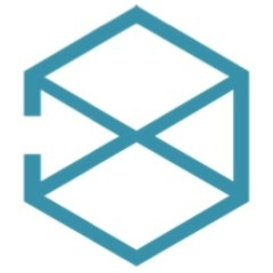 | 6580 | PNP | LogisticsX |
|  | 6581 | PRY | PRIMARY |
|  | 6582 | MXM | Maximine |
|  | 6583 | BCNX | BCNEX |
|  | 6584 | SWG | Swirge |
|  | 6585 | BYTS | Bytus |
|  | 6586 | ZEROB | ZeroBank |
|  | 6587 | GESE | Gese |
|  | 6588 | TTC | TTC PROTOCOL |
|  | 6589 | GIF | Gift Token |
|  | 6590 | DEVX | Developeo |
| 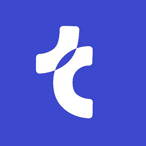 | 6591 | TMB | Teambrella |
|  | 6592 | XPL | Exclusive Platform |
|  | 6594 | MTSH | Mitoshi |
| 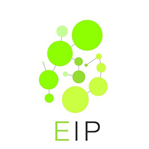 | 6595 | EMI | EIPlatform |
|  | 6596 | HTER | Biogen |
|  | 6597 | PPR | Papyrus |
| 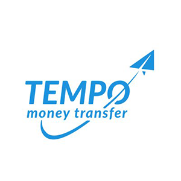 | 6598 | TEMPO | Tempo |
|  | 6599 | HBRS | HubrisOne |
|  | 6600 | REW | Review.Network |
| 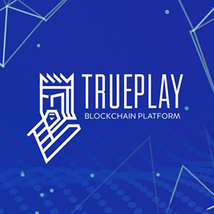 | 6601 | TPLAY | TruePlay |
|  | 6602 | GYM | Gym Rewards |
|  | 6603 | DAGO | Dago Mining |
| 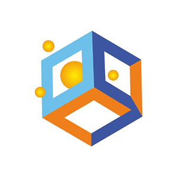 | 6604 | SPORTG | SportGift |
|  | 6605 | AES | Artis Aes Evolution |
|  | 6606 | CRES | Cresio |
|  | 6607 | AIBK | AIB Utility Token |
| 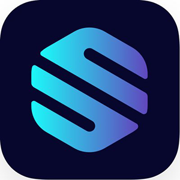 | 6608 | STE | Streamex |
|  | 6609 | TELE | Miracle Tele |
|  | 6610 | OILD | OilWellCoin |
| 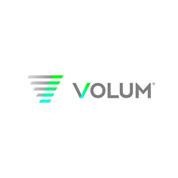 | 6611 | VLM | Volum |
| 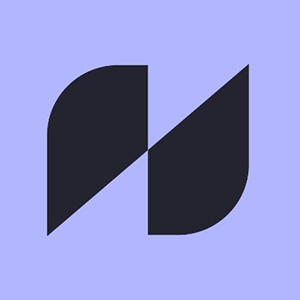 | 6612 | UDOO | Howdoo |
|  | 6613 | CTLX | Cash Telex |
| 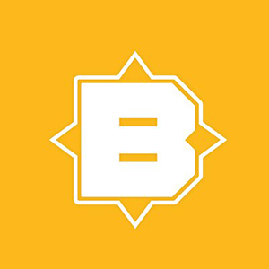 | 6614 | BTNY | Bitney |
| 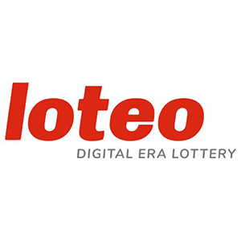 | 6615 | LOTEU | Loteo |
|  | 6616 | RVO | AhrvoDEEX |
|  | 6617 | LOTES | Loteo |
|  | 6618 | USDX | USDX Stablecoin |
| 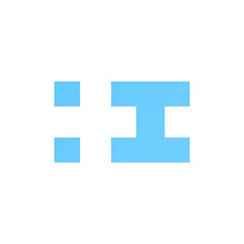 | 6619 | IRYO | Iryo |
|  | 6620 | KBT | Kartblock |
| 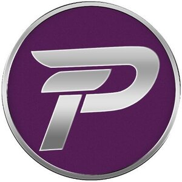 | 6621 | PLAT | Platinum |
|  | 6622 | LHT | LHT Coin |
|  | 6623 | NSD | Nasdacoin |
|  | 6624 | NYCREC | NYCREC |
|  | 6625 | FBB | FilmBusinessBuster |
|  | 6626 | BSAFE | BlockSafe |
| 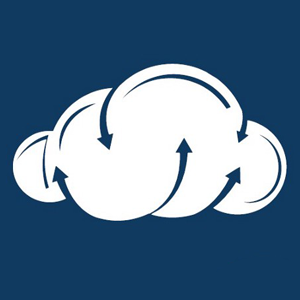 | 6627 | TCST | TCST Coin |
|  | 6628 | HET | HavEther |
|  | 6629 | DBTN | Universa Native token |
|  | 6630 | DARC | Konstellation |
|  | 6631 | MAPR | Maya Preferred 223 |
|  | 6632 | THR | Thorecoin |
|  | 6633 | CMA | Crypto Market Ads |
|  | 6634 | BDLR | GOVEARN |
|  | 6635 | PBET | PBET |
|  | 6636 | PUX | pukkamex |
|  | 6638 | SST | AllSesame |
| 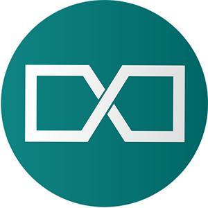 | 6639 | XLP | Loopex |
| 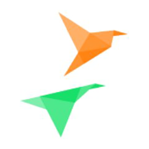 | 6640 | XCB | Crypto Birds |
|  | 6641 | RSF | Royal Sting |
| 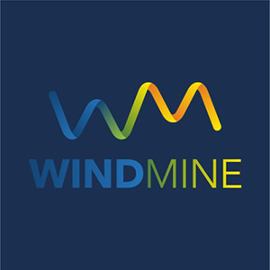 | 6642 | WMD | WindMine |
| 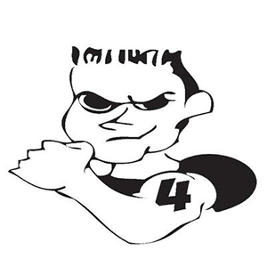 | 6643 | TOYKEN | Toyken |
| 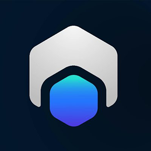 | 6644 | XAL | AuxChips |
|  | 6645 | TAS | TARUSH |
|  | 6646 | COVA | COVA |
|  | 6647 | UNTD | YOUnited |
|  | 6648 | FXC | Flexacoin |
|  | 6649 | GEX | Gexan |
|  | 6650 | VDL | Vidulum |
|  | 6652 | TMN | TranslateMe |
|  | 6653 | ASST | AssetStream |
|  | 6654 | MART | Monart |
| 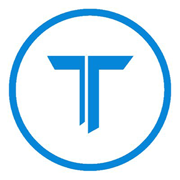 | 6655 | TC | Titan Coin |
|  | 6656 | GNTO | GoldeNugget Token |
| 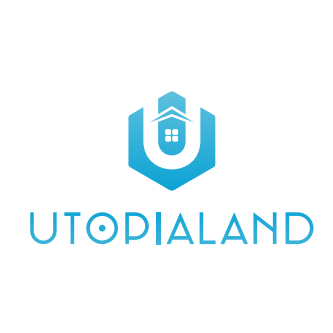 | 6657 | UTPL | Utopialand |
|  | 6658 | GDR | Guider.Travel |
|  | 6659 | LMXC | LimonX |
|  | 6660 | LNX | Lunox Token |
|  | 6661 | ORIGIN | Origin Foundation |
|  | 6662 | TXT | TuneTrade |
|  | 6663 | SCONE | Sportcash One |
| 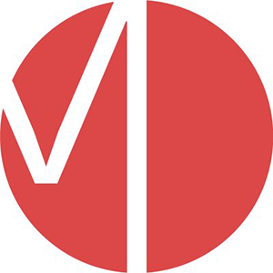 | 6664 | MAR | Martian Network |
|  | 6665 | OWNDATA | OWNDATA |
|  | 6666 | VLS | Veles |
|  | 6667 | AWR | Award |
|  | 6668 | QQQ | Poseidon Network |
| 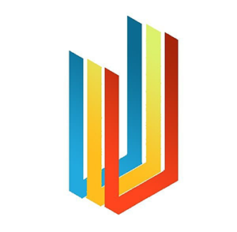 | 6669 | UVU | CCUniverse |
| 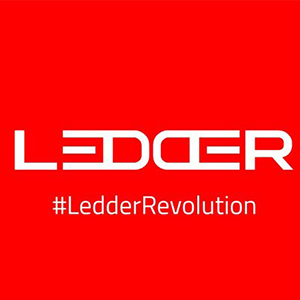 | 6670 | ULED | Ledder |
|  | 6671 | KOZ | Kozjin |
|  | 6672 | SMAT | Smathium |
|  | 6673 | BLOCKSTAMP | BlockStamp |
|  | 6674 | BUSDC | BUSD |
|  | 6675 | BACOIN | BACoin |
|  | 6676 | CRYPTOBLAST | BLAST |
|  | 6677 | VCN | VeganNation |
|  | 6678 | FILM | Filmpass |
|  | 6679 | PRDX | ParamountDax Token |
|  | 6680 | LUT | Cinemadrom |
|  | 6681 | VDX | Vodi X |
|  | 6683 | CKUSD | CKUSD |
|  | 6684 | CTPT | Contents Protocol |
|  | 6685 | ESBC | ESBC |
|  | 6686 | GRAYLL | GRAYLL |
|  | 6687 | SERV | Serve |
|  | 6688 | PTON | Foresting |
|  | 6689 | DPN | DIPNET |
|  | 6690 | THEMIS | Themis |
| 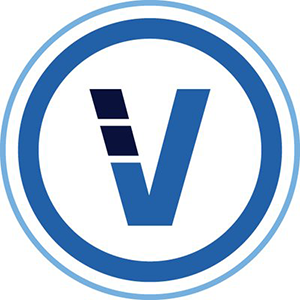 | 6691 | VBK | VeriBlock |
|  | 6692 | BWX | Blue Whale |
|  | 6693 | VOSTOK | Vostok |
|  | 6694 | WIB | Wibson |
|  | 6695 | BOXX | Blockparty |
|  | 6696 | UT | Ulord |
|  | 6697 | BU | BUMO |
|  | 6698 | WINT | WinToken |
|  | 6699 | OGO | Origo |
|  | 6700 | DVT | DeVault |
|  | 6701 | BRYLL | Bryllite |
|  | 6702 | SPENDC | SpendCoin |
|  | 6703 | BKNS | BlockState |
|  | 6704 | INB | Insight Chain |
|  | 6705 | BIHU | Key |
|  | 6706 | 1SG | 1SG |
|  | 6707 | KT | Kuai Token |
|  | 6708 | INE | IntelliShare |
|  | 6709 | ARTF | Artfinity Token |
|  | 6710 | AT | AWARE |
|  | 6711 | UOS | UOS |
|  | 6712 | ELD | Electrum Dark |
|  | 6713 | UND | United Network Distribution |
|  | 6714 | PEOSONE | pEOS |
|  | 6715 | VIPS | Vipstar Coin |
|  | 6716 | LINANET | Lina |
|  | 6717 | BBGC | BigBang Game |
|  | 6718 | INFC | Influence Chain |
|  | 6719 | NPXSXEM | Pundi X NEM |
|  | 6720 | WGP | W Green Pay |
|  | 6722 | ANDC | Android chain |
|  | 6723 | USCC | USC |
|  | 6724 | WEGEN | WeGen Platform |
|  | 6725 | FUNDC | FUNDChains |
|  | 6726 | OCTOIN | Octoin Coin |
|  | 6727 | USDQSTABLE | USDQ Stablecoin |
|  | 6728 | WWB | Wowbit |
|  | 6729 | VANT | Vanta Network |
|  | 6730 | IONC | IONChain |
|  | 6731 | CNUS | CoinUs |
|  | 6732 | SDA | SDChain |
|  | 6733 | SMARTUP | Smartup |
|  | 6734 | HYN | Hyperion |
|  | 6735 | JCT | Japan Content Token |
|  | 6736 | DOS | DOS Network |
|  | 6737 | DIEM | Facebook Diem |
|  | 6738 | DLO | Delio |
|  | 6739 | DUOT | DUO Network |
|  | 6740 | OCE | OceanEX Token |
|  | 6741 | AIRX | Aircoins |
|  | 6742 | B91 | B91 |
|  | 6743 | AIDT | AIDUS TOKEN |
|  | 6744 | AILINK | AiLink Token |
|  | 6745 | CLB | Cloudbric |
|  | 6746 | CZR | CanonChain |
|  | 6747 | DELTAC | DeltaChain |
|  | 6748 | KNT | Knekted |
|  | 6749 | KWATT | 4New |
|  | 6750 | MAS | Midas Protocol |
|  | 6751 | REDT | Red |
|  | 6752 | UCH | UChain |
|  | 6753 | PRS | PressOne |
|  | 6754 | EHRT | Eight Hours Token |
|  | 6755 | TERA | TERA |
|  | 6756 | VOCO | Provoco |
|  | 6757 | TNS | Transcodium |
|  | 6758 | TYPERIUM | Typerium |
|  | 6759 | CYL | Crystal Token |
|  | 6760 | HLT | HyperLoot |
|  | 6761 | E2C | Electronic Energy Coin |
|  | 6762 | TAC | Traceability Chain |
|  | 6763 | TENX | TenX Token |
|  | 6764 | SLV | Silverway |
|  | 6765 | EKG | Ekon Gold |
|  | 6766 | ONOT | ONO |
|  | 6767 | PHV | PATHHIVE |
|  | 6768 | BITRUE | Bitrue Coin |
|  | 6769 | CYCON | CONUN |
|  | 6770 | SWAPS | SWAPS Network |
|  | 6771 | FNB | FNB protocol |
|  | 6772 | ACDC | Volt |
|  | 6773 | ADN | Aladdin |
|  | 6774 | NTY | Nexty |
|  | 6775 | ADRX | Adrenaline Chain |
|  | 6776 | MESG | MESG |
|  | 6777 | UPX | uPlexa |
|  | 6778 | 1IRST | 1irstcoin |
|  | 6779 | TRTT | Trittium |
|  | 6780 | TCH | Thorecash |
|  | 6781 | ABX | Arbidex |
|  | 6782 | NUT | Native Utility Token |
|  | 6783 | MONT | Monarch Token |
|  | 6784 | TN | TurtleNetwork |
|  | 6785 | PBQ | PUBLIQ |
|  | 6786 | ZDR | Zloadr |
|  | 6787 | DOCT | DocTailor |
|  | 6788 | TCHAIN | Tchain |
|  | 6789 | XRTC | Retailcoin |
|  | 6790 | VOL | Volume Network |
|  | 6791 | BSOV | BitcoinSoV |
|  | 6793 | NAT | Natmin |
|  | 6794 | BCAC | Business Credit Alliance Chain |
|  | 6795 | XD | Data Transaction Token |
|  | 6796 | BQQQ | Bitsdaq Token |
|  | 6797 | COZP | COZPlus |
|  | 6798 | OGOD | GOTOGOD |
|  | 6799 | FOIN | Foin |
|  | 6800 | GOLDENG | Golden Goose |
|  | 6801 | YTA | YottaChain |
|  | 6802 | LXT | LITEX |
|  | 6803 | IMG | ImageCoin |
|  | 6804 | DPT | Diamond Platform Token |
|  | 6805 | TRAT | Tratok |
|  | 6806 | OPNN | Opennity |
|  | 6807 | SINS | SafeInsure |
|  | 6808 | PC | Promotion Coin |
|  | 6809 | DXR | DEXTER |
|  | 6810 | BXK | Bitbook Gambling |
|  | 6811 | GOS | Gosama |
|  | 6812 | DEFILAB | Defi |
|  | 6813 | KNOW | KNOW |
|  | 6814 | XPC | eXPerience Chain |
|  | 6815 | ACD | Alliance Cargo Direct |
|  | 6816 | BENZI | Ben Zi Token |
|  | 6817 | BGBP | Binance GBP Stable Coin |
|  | 6818 | BXA | Blockchain Exchange Alliance |
|  | 6819 | CBNT | Create Breaking News Together |
|  | 6820 | DWC | Digital Wallet |
|  | 6821 | ELAC | ELA Coin |
|  | 6822 | ETSC | ​Ether star blockchain |
|  | 6823 | FMEX | FMex |
|  | 6824 | FTK | FToken |
|  | 6825 | GE | GEchain |
|  | 6826 | INFT | Infinito |
|  | 6827 | ITOC | ITOChain |
|  | 6828 | JCB | Wine Chain |
|  | 6829 | LHD | LitecoinHD |
|  | 6830 | LKN | LinkCoin Token |
|  | 6831 | MMT | Master MIX Token |
|  | 6832 | LPK | Kripton |
|  | 6833 | PIB | Pibble |
|  | 6834 | PROT | PROT |
|  | 6835 | QQBC | QQBC IPFS BLOCKCHAIN |
|  | 6836 | SPIN | SPIN Protocol |
|  | 6837 | TCNX | Tercet Network |
|  | 6838 | THX | Thorenext |
|  | 6839 | THEX | Thore Exchange |
|  | 6840 | TCHTRX | ThoreCashTRX |
|  | 6841 | UAT | UltrAlpha |
|  | 6842 | UENC | UniversalEnergyChain |
|  | 6843 | USDSB | USDSB |
|  | 6844 | WLO | WOLLO |
|  | 6845 | NDAU | ndau |
|  | 6846 | XENOVERSE | Xenoverse |
|  | 6847 | ETM | En-Tan-Mo |
|  | 6848 | AMIO | Amino Network |
|  | 6849 | FAB | FABRK Token |
|  | 6850 | VD | VinDax Coin |
|  | 6851 | STREAM | STREAMIT COIN |
|  | 6852 | LTK | LinkToken |
|  | 6853 | BPRO | BitCloud Pro |
|  | 6854 | CVCC | CryptoVerificationCoin |
|  | 6855 | TOL | Tolar |
|  | 6856 | EVT | EveriToken |
|  | 6857 | NTBC | Note Blockchain |
|  | 6858 | ATNIO | ATN |
|  | 6859 | NASH | NeoWorld Cash |
|  | 6860 | QCH | QChi |
|  | 6861 | CUST | Custody Token |
|  | 6862 | FO | FIBOS |
|  | 6863 | SON | Simone |
|  | 6864 | BKBT | BeeKan |
|  | 6865 | BLOCM | BLOC.MONEY |
|  | 6866 | BQT | Blockchain Quotations Index Token |
|  | 6867 | WSD | White Standard |
|  | 6868 | SDS | Alchemint Standards |
|  | 6869 | ZT | ZTCoin |
|  | 6870 | GOM | Gomics |
|  | 6871 | OF | OFCOIN |
|  | 6872 | FLETA | FLETA |
|  | 6873 | CBM | CryptoBonusMiles |
|  | 6874 | IZI | Izumi Finance |
|  | 6875 | UC | YouLive Coin |
|  | 6876 | TOSC | T.OS |
|  | 6877 | OVC | OVCODE |
|  | 6878 | MCC | Magic Cube Coin |
|  | 6879 | MEXC | MEXC Token |
|  | 6880 | HVNT | HiveNet Token |
|  | 6881 | NSS | NSS Coin |
|  | 6882 | TRP | Tronipay |
|  | 6883 | MB | MineBee |
|  | 6884 | MB8 | MB8 Coin |
|  | 6885 | CENT | CENTERCOIN |
|  | 6886 | HSN | Hyper Speed Network |
|  | 6887 | ZUM | ZumCoin |
|  | 6888 | PIPL | PiplCoin |
|  | 6889 | VNDC | VNDC |
|  | 6890 | DDAM | DDAM |
|  | 6891 | MOGU | Mogu |
|  | 6892 | CXCELL | CAPITAL X CELL |
|  | 6893 | BGONE | BigONE Token |
|  | 6894 | DEQ | Dequant |
|  | 6895 | FLAS | Flas Exchange Token |
|  | 6896 | BCB | BCB Blockchain |
|  | 6897 | DMS | Documentchain |
|  | 6898 | GSTT | GSTT |
|  | 6899 | TREEC | TreeCoin |
|  | 6900 | RONCOIN | RON |
|  | 6901 | SCTK | SharesChain |
|  | 6902 | SINX | SINX Token |
|  | 6903 | HAZ | Hazza |
|  | 6904 | AIPE | AI Prediction Ecosystem |
|  | 6905 | MISS | MISS |
|  | 6906 | BTY | Bityuan |
|  | 6907 | DKKT | DKK Token |
|  | 6908 | CSAC | Credit Safe Application Chain |
|  | 6909 | DMC | Dream21 |
|  | 6910 | KISC | Kaiser |
|  | 6911 | VBT | VB Token |
|  | 6912 | G50 | G50 |
|  | 6913 | SEOS | Smart Eye Operating System |
|  | 6914 | ODC | Overseas Direct Certification |
|  | 6915 | GALT | Galtcoin |
|  | 6917 | LTBTC | Lightning Bitcoin |
|  | 6918 | TENA | Tena |
|  | 6919 | UNICORN | UNICORN Token |
|  | 6920 | SPLA | SmartPlay |
|  | 6921 | PRCM | Precium |
|  | 6922 | EONC | Dimension |
|  | 6923 | BFCH | Big Fun Chain |
|  | 6924 | CBFT | CoinBene Future Token |
|  | 6925 | TRDS | Traders Token |
|  | 6926 | ETHPLO | ETHplode |
|  | 6927 | YAP | Yap Stone |
|  | 6928 | LKU | Lukiu |
|  | 6929 | LINKA | LINKA |
|  | 6930 | ZVC | ZVCHAIN |
|  | 6931 | OROX | Cointorox |
|  | 6932 | ACU | Aitheon |
|  | 6933 | WIX | Wixlar |
|  | 6934 | OLXA | OLXA |
|  | 6935 | BRZE | Breezecoin |
|  | 6936 | S4F | S4FE |
|  | 6937 | BIPX | Bispex |
|  | 6938 | ECOREAL | Ecoreal Estate |
|  | 6939 | BCZERO | Buggyra Coin Zero |
|  | 6940 | BOK | Blockium |
|  | 6941 | TEP | Tepleton |
|  | 6942 | TSR | Tesra |
|  | 6943 | HNB | HashNet BitEco |
|  | 6944 | CAITOKEN | Cai Token |
|  | 6945 | FLG | Folgory Coin |
|  | 6946 | DILI | D Community |
|  | 6947 | 7E | 7ELEVEN |
|  | 6948 | XTX | Xtock |
|  | 6949 | LOBS | Lobstex |
|  | 6950 | BUXCOIN | Buxcoin |
|  | 6951 | MGX | MargiX |
|  | 6952 | SOVE | Soverain |
|  | 6953 | BCS | Business Credit Substitute |
|  | 6954 | THP | TurboHigh Performance |
|  | 6955 | TKC | TurkeyChain |
|  | 6956 | LT | Loctite Assets Token |
|  | 6957 | MSN | Manson Coin |
|  | 6958 | W1 | W1 |
|  | 6959 | OFBC | OneFinBank Coin |
|  | 6960 | CB | COINBIG |
|  | 6961 | DRINK | DrinkChain |
|  | 6962 | TRADECHAIN | Trade Chain |
|  | 6963 | SNL | Sport and Leisure |
|  | 6964 | GLOS | GLOS |
|  | 6965 | SEAIO | Second Exchange Alliance |
|  | 6966 | CBE | The Chain of Business Entertainment |
|  | 6967 | DZCC | DZCC |
|  | 6968 | TRCB | TRCB Chain |
|  | 6969 | UIN | Alliance Chain |
|  | 6970 | MPLUS | M+Plus |
|  | 6971 | WOW | Wownero |
|  | 6972 | FBN | Five balance |
|  | 6973 | GKI | GKi |
|  | 6974 | PTN | PalletOneToken |
|  | 6975 | TDE | Trade Ecology Token |
|  | 6976 | ECP | ECP+ Technology |
|  | 6977 | NACRE | Nacreous Coin |
|  | 6978 | XBG | BitGrin |
|  | 6979 | PP | ProducePay Chain |
|  | 6980 | UNIS | Universe Coin |
|  | 6981 | SCAP | SafeCapital |
|  | 6982 | DYNMT | Dynamite |
|  | 6983 | FN | Filenet |
|  | 6984 | MDM | Medium |
|  | 6985 | DFP | Digital Fund Coin |
|  | 6986 | GTSE | Global Tourism Sharing Ecology |
|  | 6987 | AMAL | AMAL |
|  | 6988 | RES | Resistance |
|  | 6989 | API | Application Programming Interface |
|  | 6990 | BIUT | Bit Trust System |
|  | 6991 | PSC | PSC Token |
|  | 6992 | MLGC | Marshal Lion Group Coin |
|  | 6993 | DMTC | Demeter Chain |
|  | 6994 | DAMO | Coinzen |
|  | 6995 | TFBX | Truefeedback Token |
|  | 6996 | XSPC | SpectreSecurityCoin |
|  | 6997 | USDGV2 | USDG (acashcorp.com) |
|  | 6998 | DGLD | Digital Gold |
|  | 6999 | LVIP | Limitless VIP |
|  | 7000 | CHARS | CHARS |
|  | 7001 | TYT | Tianya Token |
|  | 7002 | NVL | Nevula |
|  | 7004 | CSAI | Compound SAI |
|  | 7006 | CREP | Compound Augur |
|  | 7007 | CZRX | Compound 0x |
|  | 7008 | CWBTC | Compound Wrapped BTC |
|  | 7009 | BTCK | Bitcoin Turbo Koin |
|  | 7010 | FCQ | Fortem Capital |
|  | 7011 | DAVP | Davion |
|  | 7012 | CUT | CUTcoin |
|  | 7013 | BTCPR | Bitcoin Pro |
|  | 7014 | LTBX | Litbinex Coin |
|  | 7015 | BEAR | 3X Short Bitcoin |
|  | 7016 | RKN | RAKON |
|  | 7017 | HTDF | Orient Walt |
|  | 7018 | KSH | Kahsh |
|  | 7019 | NESTREE | Nestree |
|  | 7020 | KRT | TerraKRW |
|  | 7021 | N8V | NativeCoin |
|  | 7022 | EBK | Ebakus |
|  | 7023 | PEG | PegNet |
|  | 7024 | BNP | BenePit |
|  | 7025 | BLTV | BLTV Token |
|  | 7026 | RRB | Renrenbit |
|  | 7027 | TUDA | Tutor's Diary |
|  | 7028 | WIKI | Wiki Token |
|  | 7029 | HINTCH | Hintchain |
|  | 7030 | BNA | BananaTok |
|  | 7031 | AXIAL | AXiaL |
|  | 7032 | SPOK | Spock |
|  | 7033 | ALY | Ally |
|  | 7034 | USDH | HonestCoin |
|  | 7035 | GARK | Game Ark |
|  | 7036 | IDHUB | IDHUB |
|  | 7037 | IOEX | ioeX |
|  | 7038 | DLX | DAppLinks |
|  | 7039 | BIKI | BIKI |
|  | 7040 | DALI | Dalichain |
|  | 7041 | FLDT | FairyLand |
|  | 7042 | TCO | ThinkCoin |
|  | 7043 | ETY | Ethereum Cloud |
|  | 7044 | VEIL | VEIL |
|  | 7045 | MKEY | MEDIKEY |
|  | 7046 | BTBL | Bitball |
|  | 7047 | TAUC | Taurus Coin |
|  | 7048 | GIB | Bible Coin |
|  | 7049 | SCDS | Shrine Cloud Storage Network |
|  | 7050 | ECT | SuperEdge |
|  | 7051 | SENNO | SENNO |
|  | 7052 | BEP | Blucon |
|  | 7053 | GIX | GoldFinX |
|  | 7054 | GANA | GANA |
|  | 7055 | KAL | Kaleido |
|  | 7056 | NEWOS | NewsToken |
|  | 7057 | TSF | Teslafunds |
|  | 7058 | FNK | FunKeyPay |
|  | 7059 | AIDUS | AIDUS Token |
|  | 7060 | STEEP | SteepCoin |
|  | 7061 | YTN | YENTEN |
|  | 7062 | SCRIV | SCRIV |
|  | 7063 | AREPA | Arepacoin |
|  | 7064 | CHEESECOIN | Cheesecoin |
|  | 7065 | PEPS | PEPS Coin |
|  | 7066 | NEETCOIN | Neetcoin |
|  | 7067 | OMEGA | OMEGA |
|  | 7068 | BZL | BZLCoin |
|  | 7069 | CRANEPAY | Cranepay |
|  | 7070 | GSR | GeyserCoin |
|  | 7071 | VARIUS | Varius |
|  | 7072 | AGET | Agetron |
|  | 7073 | ZCR | ZCore |
|  | 7074 | ALWAYS | Always Evolving |
|  | 7075 | NAH | Strayacoin |
|  | 7076 | DXO | Dextro |
|  | 7077 | GOSS | GOSSIP-Coin |
|  | 7078 | NYEX | Nyerium |
|  | 7079 | TELOS | Teloscoin |
|  | 7080 | SIERRA | Sierracoin |
|  | 7081 | PENGCOIN | PENG |
|  | 7082 | NOR | Noir |
|  | 7083 | KTS | Klimatas |
|  | 7084 | MERI | Merebel |
|  | 7085 | BITCOINV | BitcoinV |
|  | 7086 | XWP | Swap |
|  | 7087 | CSNP | CrowdSale Network |
|  | 7088 | CALL | Global Crypto Alliance |
|  | 7089 | MOCO | MoCo |
|  | 7090 | WBET | Wavesbet |
|  | 7091 | ARMR | ARMR |
|  | 7092 | HNTQ | Helium |
|  | 7093 | XSD | SounDAC |
|  | 7094 | DIVO | DIVO Token |
|  | 7095 | WCC | Wincash Coin |
|  | 7096 | WLF | Wolfs Group |
|  | 7097 | CNB | Coinsbit Token |
|  | 7098 | CTAG | CTAGtoken |
|  | 7099 | CWN | CryptoWorldNews |
|  | 7100 | BLINK | BlockMason Link |
|  | 7101 | JUL | Joule |
|  | 7102 | NCOV | CoronaCoin |
|  | 7103 | ETHBULL | 3X Long Ethereum Token |
|  | 7104 | EER | Ethereum eRush |
|  | 7105 | USDACC | USDA |
|  | 7106 | DBY | Dobuy |
|  | 7107 | BCZ | Bitcoin CZ |
|  | 7108 | KAM | BitKAM |
|  | 7109 | EBASE | EURBASE |
|  | 7110 | SWYFTT | SWYFT |
|  | 7111 | DOGZ | Dogz |
|  | 7112 | WPX | Wallet Plus X |
|  | 7113 | POCC | POC Chain |
|  | 7114 | GFUN | GoldFund |
|  | 7115 | CVA | Crypto Village Accelerator |
|  | 7116 | JMT | JMTIME |
|  | 7117 | URBC | UrbanCasH |
|  | 7118 | ABA | EcoBall |
|  | 7119 | DSC | Dash Cash |
|  | 7120 | DAPP | LiquidApps |
|  | 7121 | AMDC | Allmedi Coin |
|  | 7122 | NNC | NEO Name Credit |
|  | 7123 | CCTN | Connectchain |
|  | 7124 | TWEE | TWEEBAA |
|  | 7125 | KBOT | Korbot |
|  | 7126 | EOSBULL | 3X Long EOS Token |
|  | 7127 | ETHBEAR | 3X Short Ethereum Token |
|  | 7128 | XRPBULL | 3X Long XRP Token |
|  | 7129 | EOSBEAR | 3X Short EOS Token |
|  | 7130 | EUSD | Egoras Dollar |
|  | 7131 | XRPBEAR | 3X Short XRP Token |
|  | 7132 | ALLBI | ALL BEST ICO |
|  | 7133 | ETR | Electric Token |
|  | 7134 | XLA | Scala |
|  | 7135 | FK | FK Coin |
|  | 7136 | BIRDCHAIN | Birdchain |
|  | 7137 | AUNIT | Aunit |
|  | 7138 | BNBBULL | 3X Long BNB Token |
|  | 7139 | BNBBEAR | 3X Short BNB Token |
|  | 7140 | ODX | ODX Token |
|  | 7141 | XHT | HollaEx |
|  | 7142 | INS | Insolar |
|  | 7143 | GOLOSBLOCKCHAIN | Golos Blockchain |
|  | 7144 | TRXBULL | 3X Long TRX Token |
|  | 7145 | TRXBEAR | 3X Short TRX Token |
|  | 7146 | LTCBULL | 3X Long Litecoin Token |
|  | 7147 | LTCBEAR | 3X Short Litecoin Token |
|  | 7148 | AAB | AAX Token |
|  | 7149 | BKRW | Binance KRW |
|  | 7150 | FRSP | Forkspot |
|  | 7151 | ANCT | Anchor |
|  | 7152 | ALV | Allive |
|  | 7153 | QC | Qcash |
|  | 7154 | GZE | GazeCoin |
|  | 7155 | DACS | Dacsee |
|  | 7156 | CIM | COINCOME |
|  | 7157 | UPUSD | Universal US Dollar |
|  | 7158 | UPT | Universal Protocol Token |
|  | 7159 | UPEUR | Universal Euro |
|  | 7160 | THX! | Thx! |
|  | 7161 | HOTT | HOT Token |
|  | 7162 | MZK | Muzika Network |
|  | 7163 | QUROZ | Qfora |
|  | 7164 | VNXLU | VNX Exchange |
|  | 7165 | AIN | AI Network |
|  | 7166 | PORTALTOKEN | PortalToken |
|  | 7167 | 300F | 300FIT |
|  | 7168 | BTCHG | 1X Short Bitcoin Token |
|  | 7169 | HKDX | eToro Hong Kong Dollar |
|  | 7170 | CNYX | eToro Chinese Yuan |
|  | 7171 | NZDX | eToro New Zealand Dollar |
|  | 7172 | EURX | eToro Euro |
|  | 7173 | GBPX | eToro Pound Sterling |
|  | 7174 | CHFX | eToro Swiss Franc |
|  | 7175 | CADX | eToro Canadian Dollar |
|  | 7176 | USDEX | eToro US Dollar |
|  | 7177 | AUDX | eToro Australian Dollar |
|  | 7178 | JPYX | eToro Japanese Yen |
|  | 7179 | GOLDX | eToro Gold |
|  | 7180 | TRYX | eToro Turkish Lira |
|  | 7181 | ZARX | eToro South African Rand |
|  | 7182 | SGDX | eToro Singapore Dollar |
|  | 7183 | RUBX | eToro Russian Ruble |
|  | 7184 | EXCHBEAR | 3X Short Exchange Token Index Token |
|  | 7185 | EXCHBULL | 3X Long Exchange Token Index Token |
|  | 7186 | ALTBEAR | 3X Short Altcoin Index Token |
|  | 7187 | ALTBULL | 3X Long Altcoin Index Token |
|  | 7188 | POLNX | eToro Polish Zloty |
|  | 7190 | BCHC | BitCherry |
|  | 7191 | SLVX | eToro Silver |
|  | 7192 | KIM | King Money |
|  | 7193 | LMCH | Latamcash |
|  | 7194 | CBUCKS | CRYPTOBUCKS |
|  | 7195 | SNB | SynchroBitcoin |
|  | 7196 | LAR | LinkArt |
|  | 7197 | EUCOIN | EU Coin |
|  | 7198 | BSVBULL | 3X Long Bitcoin SV Token |
|  | 7199 | QBZ | QUEENBEE |
|  | 7200 | BSVBEAR | 3X Short Bitcoin SV Token |
|  | 7201 | FF1 | Two Prime FF1 Token |
|  | 7202 | BCHBULL | 3X Long Bitcoin Cash Token |
|  | 7203 | BCHBEAR | 3X Short Bitcoin Cash Token |
|  | 7204 | ISIKC | Isiklar Coin |
|  | 7205 | ZFL | Zuflo Coin |
|  | 7206 | IZER | IZEROIUM |
|  | 7207 | XXA | Ixinium |
|  | 7208 | IBVOL | 1x Short BTC Implied Volatility Token |
|  | 7209 | BVOL | 1x Long BTC Implied Volatility Token |
|  | 7210 | SATX | SatoExchange Token |
|  | 7211 | UFOC | Unknown Fair Object |
|  | 7212 | PXL | PIXEL |
|  | 7213 | BONO | Bonorum Coin |
|  | 7214 | WADS | AdsByWiFi |
|  | 7215 | ALATOKEN | ALA |
|  | 7218 | BTCSHORT | Amun Short Bitcoin Token |
|  | 7219 | BTCT | Bitcoin Token |
|  | 7220 | NEWSTOKENS | NewsTokens |
|  | 7221 | RHP | Rhypton Club |
|  | 7222 | DUC | DucatusCoin |
|  | 7223 | ADAIV1 | Aave Interest bearing DAI v1 |
|  | 7224 | ZNZ | ZENZO |
|  | 7225 | ICH | IdeaChain |
|  | 7226 | GLEEC | Gleec Coin |
|  | 7227 | LRG | Largo Coin |
|  | 7228 | RVX | Rivex |
|  | 7230 | WET | WeShow Token |
|  | 7231 | ANJ | Aragon Court |
|  | 7232 | ETHBN | EtherBone |
|  | 7233 | 2LC | 2local |
|  | 7234 | CWR | Cowrium |
|  | 7236 | IBS | Irbis Network |
|  | 7237 | DGN | Diagon |
|  | 7238 | QI1 | Quantum Intelligence |
|  | 7239 | PXS | Proximus |
|  | 7240 | TRNSC | Transmutecoin |
|  | 7241 | GDIGIT | GoldDigitStandart |
|  | 7242 | CTE | Crypto Tron |
|  | 7243 | LLION | Lydian Lion |
|  | 7244 | SOW | Seed of World |
|  | 7245 | SI14 | Si14 |
|  | 7246 | PWON | Personal Wager |
|  | 7247 | SKFT | Sphinks Token |
|  | 7248 | NFTM | NFTMart Token |
|  | 7249 | TUNEZ | Tunez |
|  | 7250 | SONA | Social Chains |
|  | 7251 | BRAND | BrandProtect |
|  | 7252 | NTZ | Notarised |
|  | 7253 | ENC | Encores Token |
|  | 7254 | CNR | Centric |
|  | 7255 | SETI | Sapien Wallet |
|  | 7256 | WSLT | White Stripe Lottery |
|  | 7257 | SDAT | SDATokens |
|  | 7258 | IGCH | IG-Crypto Holding |
|  | 7259 | PXB | PixelBit |
|  | 7260 | RACH | RachelX |
|  | 7261 | ILLUMINAT | Illuminat |
|  | 7262 | SETS | Sensitrust |
|  | 7263 | JACS | JACS |
|  | 7264 | RWN | Rowan Token |
|  | 7265 | FUCO | Futbol Coin |
|  | 7266 | WRZ | Weriz |
|  | 7267 | ITAM | ITAM Games |
|  | 7268 | WOONK | Woonkly |
|  | 7269 | ESH | Switch |
|  | 7270 | DNA | Metaverse |
|  | 7271 | CPI | Crypto Price Index |
|  | 7272 | JUI | Juiice |
|  | 7273 | 1GOLD | 1rstGold |
|  | 7274 | NDN | NDN Link |
|  | 7275 | CGLD | Celo Gold |
|  | 7276 | XIO | XIO |
|  | 7277 | BIZZ | BIZZCOIN |
|  | 7278 | 1UP | Uptrennd |
|  | 7279 | AFFC | Affil Coin |
|  | 7280 | BBDT | BBD Token |
|  | 7281 | GLDY | Buzzshow |
|  | 7285 | TERADYNE | Teradyne |
|  | 7287 | TRIPAD | TripAdvisor, Inc. |
|  | 7337 | VI | Vid |
|  | 7341 | MXW | Maxonrow |
|  | 7342 | SDT | TerraSDT |
|  | 7343 | DDK | DDKoin |
|  | 7344 | MTXLT | Tixl |
|  | 7345 | LQBTC | Liquid Bitcoin |
|  | 7347 | UTI | Unicorn Technology International |
|  | 7396 | VOO.CUR | Vanguard S&P 500 ETF |
|  | 7397 | ICPT.CUR | Intercept Pharmaceuticals, Inc. |
|  | 7398 | FB.CUR | Facebook |
|  | 7399 | EXEL.CUR | Exelixis, Inc. |
|  | 7400 | QRVO.CUR | Qorvo, Inc. |
|  | 7401 | OAS.CUR | Oasis Petroleum |
|  | 7402 | CSCO.CUR | Cisco Systems |
|  | 7403 | PTON.CUR | Peloton Interactive Inc |
|  | 7404 | IT40.CUR | FTSE Borsa Italiana Index 40 |
|  | 7405 | GPRO.CUR | GoPro Inc |
|  | 7406 | MNK.CUR | Mallinckrodt |
|  | 7407 | WB.CUR | Weibo Corporation |
|  | 7408 | FP.CUR | Total |
|  | 7409 | GWPH.CUR | GW Pharmaceuticals PLC |
|  | 7410 | NTES.CUR | NetEase, Inc. |
|  | 7411 | MSFT.CUR | Microsoft |
|  | 7412 | SHOP.CUR | Shopify Cl A Sub Vtg |
|  | 7413 | WBA.CUR | Walgreen Boots Alliance |
|  | 7414 | LLY.CUR | Eli Lilly & Co |
|  | 7415 | IFX.CUR | Infineon Technologies AG |
|  | 7416 | GD.CUR | General Dynamics |
|  | 7417 | NKTR.CUR | Nektar Therapeutics |
|  | 7418 | GE.CUR | General Electric Co |
|  | 7419 | MOMO.CUR | Momo Inc. |
|  | 7420 | BIG.CUR | Big Lots |
|  | 7422 | WATT.CUR | Energous Corporation |
|  | 7423 | ALLY.CUR | Ally Financial |
|  | 7424 | AGN.CUR | Allergan |
|  | 7425 | SWKS.CUR | Skyworks Solutions, Inc. |
|  | 7426 | CAD.CUR | Canadian Dollar |
|  | 7427 | AFP.CUR | Air France-Klm |
|  | 7428 | GT.CUR | The Goodyear Tire & Rubber Company |
|  | 7429 | DVX | Derivex |
|  | 7430 | AZBI | AZBI CORE |
|  | 7431 | 3FT | ThreeFold Token |
|  | 7432 | TMUS.CUR | T-Mobile US, Inc. |
|  | 7433 | BZUN.CUR | Baozun Inc. |
|  | 7435 | XEC.CUR | Cimarex Energy |
|  | 7436 | PEP.CUR | Pepsico |
|  | 7437 | TEVA.CUR | Teva Pharma Ind Adr Rep 1 |
|  | 7438 | BIDU.CUR | Baidu, Inc. |
|  | 7439 | ISRG.CUR | Intuitive Surgical, Inc. |
|  | 7440 | PFE.CUR | Pfizer Inc |
|  | 7441 | COMM.CUR | CommScope Holding Company, Inc. |
|  | 7442 | 522.CUR | ASM Pacific Technology Limited |
|  | 7443 | VOW3.CUR | Volkswagen AG |
|  | 7444 | SBER.CUR | Sberbank of Russia GDR |
|  | 7445 | IRBT.CUR | iRobot Corporation |
|  | 7446 | SBUX.CUR | Starbucks Corp |
|  | 7447 | DLTR.CUR | Dollar Tree, Inc. |
|  | 7449 | OGZD.CUR | Gazprom PJSC ADR |
|  | 7450 | IP.CUR | International Paper |
|  | 7451 | ALNY.CUR | Alnylam Pharmaceuticals, Inc. |
|  | 7452 | AIR.CUR | Delta Air Lines |
|  | 7453 | SMG.CUR | The Scotts Miracle-Gro Company |
|  | 7454 | MAC.CUR | Macerich |
|  | 7456 | FVRR.CUR | Fiverr International Ltd |
|  | 7457 | JKS.CUR | JinkoSolar Holding Co., Ltd. |
|  | 7458 | FSLR.CUR | First Solar Inc |
|  | 7459 | RNX | ROONEX |
|  | 7460 | KVI | KVI Chain |
|  | 7461 | DRM | DoDreamChain |
|  | 7462 | LINKBULL | 3X Long Chainlink Token |
|  | 7463 | LINKBEAR | 3X Short Chainlink Token |
|  | 7464 | PAXGBEAR | 3X Short PAX Gold Token |
|  | 7465 | PAXGBULL | 3X Long PAX Gold Token |
|  | 7466 | PAXGHALF | 0.5X Long PAX Gold Token |
|  | 7467 | MHLX | HelixNetwork |
|  | 7468 | SPICE | Spice |
|  | 7469 | ALCHEMYV1 | Alchemy |
|  | 7470 | GGOLD | GramGold Coin |
|  | 7471 | SODA | SODA Coin |
|  | 7472 | GILD.CUR | Gilead Sciences |
|  | 7473 | RAD.CUR | Rite Aid |
|  | 7474 | UAA.CUR | Under Armour Cl A |
|  | 7475 | APA.CUR | Apache |
|  | 7476 | GRMN.CUR | Garmin Ltd. |
|  | 7477 | MGM.CUR | MGM Resorts International |
|  | 7478 | WORK.CUR | Slack Technologies Inc |
|  | 7479 | LYFT.CUR | LYFT |
|  | 7480 | MCHP.CUR | Microchip Technology Incorporated |
|  | 7481 | ADNT.CUR | Adient |
|  | 7482 | MRVL.CUR | Marvell Technology Group Ltd. |
|  | 7483 | MRK.CUR | Merck & Co Inc |
|  | 7484 | US500.CUR | S&P 500 |
|  | 7485 | NDA.CUR | Aurubis AG |
|  | 7486 | SNE.CUR | Sony Corporation |
|  | 7487 | CNX.CUR | Consol Energy |
|  | 7488 | WFC.CUR | Wells Fargo & Co |
|  | 7489 | VNET.CUR | 21Vianet Group, Inc. |
|  | 7490 | QCOM.CUR | QUALCOMM Inc |
|  | 7491 | SP35.CUR | Spain 35 |
|  | 7492 | US30.CUR | Dow Jones 30 |
|  | 7493 | TPX.CUR | Tempur Sealy International |
|  | 7494 | FDX.CUR | Fedex |
|  | 7495 | TWLO.CUR | Twilio Cl A |
|  | 7496 | NFLX.CUR | Netflix |
|  | 7497 | KO.CUR | Coca-Cola |
|  | 7498 | RMD.CUR | Resmed |
|  | 7499 | BTC3L | Amun Bitcoin 3x Daily Long |
|  | 7501 | DAI.CUR | Daimler AG |
|  | 7502 | BTC3S | Amun Bitcoin 3x Daily Short |
|  | 7503 | BMW.CUR | BMW AG |
|  | 7504 | ETH3L | Amun Ether 3x Daily Long |
|  | 7505 | DAL.CUR | Delta Air Lines |
|  | 7506 | MCD.CUR | McDonald's |
|  | 7507 | ETH3S | Amun Ether 3x Daily Short |
|  | 7508 | MATICBULL | 3X Long Matic Token |
|  | 7509 | ADABULL | 3X Long Cardano Token |
|  | 7510 | ADABEAR | 3X Short Cardano Token |
|  | 7511 | MATICBEAR | 3X Short Matic Token |
|  | 7512 | ATOMBULL | 3X Long Cosmos Token |
|  | 7513 | ATOMBEAR | 3X Short Cosmos Token |
|  | 7514 | ALGOBULL | 3X Long Algorand Token |
|  | 7515 | KNCBULL | 3X Long Kyber Network Token |
|  | 7516 | THETABULL | 3X Long Theta Network Token |
|  | 7517 | ALGOBEAR | 3X Short Algorand Token |
|  | 7518 | BEARSHIT | 3X Short Shitcoin Index Token |
|  | 7519 | KNCBEAR | 3X Short Kyber Network Token |
|  | 7520 | ETCBULL | 3X Long Ethereum Classic Token |
|  | 7521 | ETCBEAR | 3X Short Ethereum Classic Token |
|  | 7522 | TOMOBEAR | 3X Short TomoChain Token |
|  | 7523 | DRGNBEAR | 3X Short Dragon Index Token |
|  | 7524 | TOMOBULL | 3X Long TomoChain Token |
|  | 7525 | DRGNBULL | 3X Long Dragon Index Token |
|  | 7526 | THETABEAR | 3X Short Theta Network Token |
|  | 7527 | MIDBEAR | 3X Short Midcap Index Token |
|  | 7528 | MIDBULL | 3X Long Midcap Index Token |
|  | 7529 | BTMXBEAR | 3X Short BitMax Token Token |
|  | 7530 | OKBBULL | 3X Long OKB Token |
|  | 7531 | OKBBEAR | 3X Short OKB Token |
|  | 7532 | BTMXBULL | 3X Long BitMax Token Token |
|  | 7533 | LEOBULL | 3X Long LEO Token |
|  | 7534 | LEOBEAR | 3X Short LEO Token |
|  | 7535 | HTBULL | 3X Long Huobi Token Token |
|  | 7536 | HTBEAR | 3X Short Huobi Token Token |
|  | 7537 | DOGEBULL | 3X Long Dogecoin Token |
|  | 7538 | DOGEBEAR | 3X Short Dogecoin Token |
|  | 7539 | PRIVBULL | 3X Long Privacy Index Token |
|  | 7540 | PRIVBEAR | 3X Short Privacy Index Token |
|  | 7541 | USDTBULL | 3X Long Tether Token |
|  | 7542 | USDTBEAR | 3X Short Tether Token |
|  | 7543 | WDAY.CUR | Workday Inc |
|  | 7544 | SNAP.CUR | Snap |
|  | 7545 | HMI.CUR | Huami Corporation |
|  | 7546 | 241.CUR | Alibaba Health Information Technology Limited |
|  | 7547 | XLV.CUR | Health Care Select Sector SPDR Fund |
|  | 7548 | VLDY | Validity |
|  | 7549 | PYPL.CUR | PayPal Holdings |
|  | 7550 | SSA.CUR | Sistema PJSFC GDR |
|  | 7551 | UBER.CUR | Uber Technologies Inc |
|  | 7552 | WGRT | WaykiChain Governance Coin |
|  | 7555 | NEM.CUR | Newmont Mining |
|  | 7556 | CPB.CUR | Campbell Soup |
|  | 7557 | LB.CUR | L Brands |
|  | 7558 | ADPT.CUR | Adaptive Biotechnologies Corporation |
|  | 7559 | ETL.CUR | Eutelsat Communications |
|  | 7560 | NET.CUR | Cloudflare Inc. |
|  | 7562 | AMUN.CUR | Amundi |
|  | 7563 | TTWO.CUR | Take-Two Interactive Software, Inc. |
|  | 7564 | BMRN.CUR | BioMarin Pharmaceutical Inc |
|  | 7566 | PLATINUM.CUR | Platinum Spot |
|  | 7567 | EDF.CUR | Edf |
|  | 7568 | NCLH.CUR | Norwegian Cruise Line Holdings Ltd. |
|  | 7569 | BNTX.CUR | Biontech SE |
|  | 7570 | OCFT.CUR | OneConnect |
|  | 7571 | CBK.CUR | Commerzbank AG |
|  | 7572 | EXPE.CUR | Expedia Inc |
|  | 7573 | JNJ.CUR | Johnson & Johnson |
|  | 7574 | JPM.CUR | JPMorgan Chase |
|  | 7575 | PTEN.CUR | Patterson-UTI Energy, Inc. |
|  | 7576 | TRI.CUR | Thomson Reuters |
|  | 7577 | VGT.CUR | Vanguard Information Technology ETF |
|  | 7578 | BIIB.CUR | Biogen Inc. |
|  | 7579 | STLD.CUR | Steel Dynamics, Inc. |
|  | 7580 | GLPG.CUR | Galapagos NV |
|  | 7582 | SAGE.CUR | Sage Therapeutics, Inc. |
|  | 7583 | DBK.CUR | Deutsche Bank AG |
|  | 7584 | ADBE.CUR | Adobe Systems Inc |
|  | 7585 | LKOD.CUR | Lukoil PJSC ADR |
|  | 7586 | ARNC.CUR | Arconic |
|  | 7587 | EBAY.CUR | eBay |
|  | 7588 | ORCL.CUR | Oracle |
|  | 7589 | PALLADIUM.CUR | Palladium Spot |
|  | 7590 | LX.CUR | LexinFintech Holdings Ltd. |
|  | 7591 | CAG.CUR | Conagra Brands Inc |
|  | 7592 | 1COV.CUR | Covestro AG |
|  | 7593 | SPN.CUR | Superi Ener Svcs |
|  | 7595 | CTLT.CUR | Catalent Inc |
|  | 7596 | MJ.CUR | ETFMG Alternative Harvest ETF |
|  | 7597 | MU.CUR | Micron Technology, Inc. |
|  | 7598 | DBX.CUR | DropBox |
|  | 7599 | AMD.CUR | Advanced Micro Devices Inc |
|  | 7600 | XLNX.CUR | Xilinx, Inc. |
|  | 7601 | MC.CUR | Lvmh Moet Hennessy Louis Vuitton Se |
|  | 7602 | MA.CUR | Mastercard Inc |
|  | 7603 | FTCH.CUR | Farfetch Ltd |
|  | 7604 | OHL.CUR | Obrascón Huarte Lain, S.A. |
|  | 7605 | RNO.CUR | Renault Par |
|  | 7606 | TRIP.CUR | TripAdvisor, Inc. |
|  | 7607 | TER.CUR | Teradyne |
|  | 7608 | EDO | Eidoo |
|  | 7609 | CACHEGOLD | CACHE Gold |
|  | 7610 | D4RK | DarkPayCoin |
|  | 7611 | BTCDOWN | BTCDOWN |
|  | 7612 | BTCUP | BTCUP |
|  | 7613 | CODEO | Codeo Token |
|  | 7614 | IDK | IDK |
|  | 7615 | PAMP | PAMP Network |
|  | 7616 | MP | Membership Placeholders |
|  | 7617 | LUCY | Lucy |
|  | 7618 | PAZZI | Paparazzi |
|  | 7619 | SILKR | SilkRoadCoin |
|  | 7620 | LACCOIN | LocalAgro |
|  | 7621 | CCOMM | Crypto Commonwealth |
|  | 7622 | VARC | VARC |
|  | 7623 | CRD | CRD Token |
|  | 7624 | TRCL | Treecle |
|  | 7625 | EFK | ReFork |
|  | 7626 | INNOU | Innou |
|  | 7627 | TRADE1 | Smart Trade Coin |
|  | 7628 | CVS | CoinVisa |
|  | 7630 | JUR | Jur |
|  | 7631 | OZP | OZAPHYRE |

---

[← Prev](./list6.md) | [Next →](./list8.md)
