# Cryptocurrency list \#7

[← Prev](./list6.md) | [Next →](./list8.md)

| Logo | ID | Symbol | Name |
|:----:|:--:|:------:|:-----|
|  | 121927 | CSM | Crust Shadow |
|  | 90513 | ORBN | Orbeon Protocol |
| 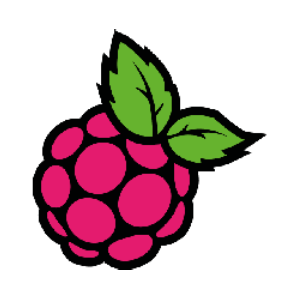 | 60483 | MLNK | Malinka |
|  | 50023 | LEAN | Lean |
|  | 164739 | $NQAI | NodeQAI |
|  | 68691 | SSD | SecretWorld |
|  | 51807 | MNRY | Moonery |
|  | 48435 | AAPX | AMPnet |
|  | 41675 | FLEX | FLEX Coin |
| 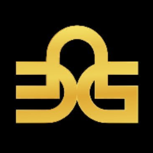 | 125157 | EAG | Emerging Assets Group |
| 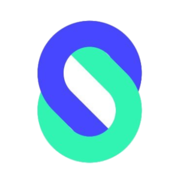 | 123233 | SHD | Shade Protocol |
|  | 115641 | MMSS | MMSS |
|  | 114049 | TRCON | TERATTO |
|  | 162033 | @G | Graphite Network |
|  | 64991 | VRN | Varen |
| 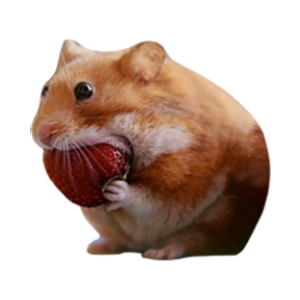 | 141265 | NOMNOM | nomnom |
|  | 165959 | PRICELESS | Priceless |
|  | 166111 | TMX | TMX |
|  | 165977 | PANDU | Pandu Pandas |
|  | 136151 | QGOV | Q Protocol |
|  | 127495 | GOOGLE | Deepmind Ai |
|  | 126149 | BABY SHIBA | BabyShiba |
|  | 126047 | SEIYAN | SEIYAN |
| 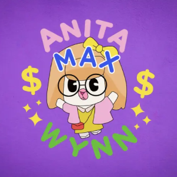 | 122177 | WYNN | Anita Max Wynn |
|  | 122607 | FINC | Finceptor |
| 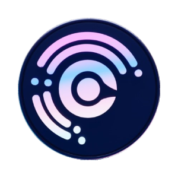 | 111499 | OFN | Openfabric AI |
| 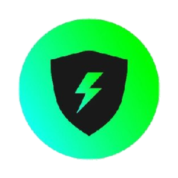 | 69525 | JOLT | Joltify |
|  | 65339 | GLINK | GemLink |
|  | 133701 | RESCUE | Rescue |
|  | 70523 | PUFFS | Crypto Puffs |
| 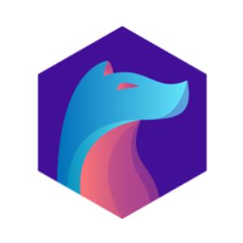 | 63543 | DOGEP | Doge Protocol |
|  | 165665 | USDCV | USD CoinVertible |
|  | 163079 | MPDAO | Meta Pool |
| 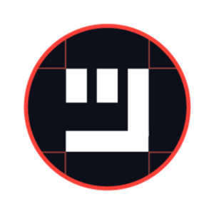 | 165757 | MTD | Minted |
|  | 163535 | JOTCHUA | Perro Dinero |
| 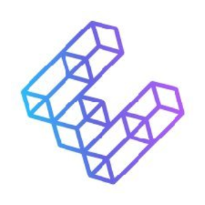 | 164819 | EETH | ether.fi Staked ETH |
|  | 151511 | DESCI | SUI Desci Agents |
| 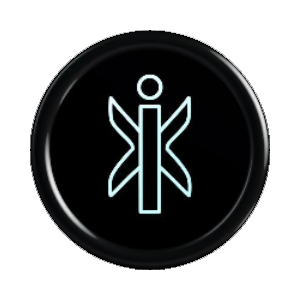 | 122699 | ITX | Intellix |
|  | 65159 | SOLAPE | SOLAPE Token |
|  | 60409 | CHMB | Chumbi Valley |
|  | 50755 | BULK | Bulk Network |
|  | 162709 | POLLEN | Beraborrow |
| 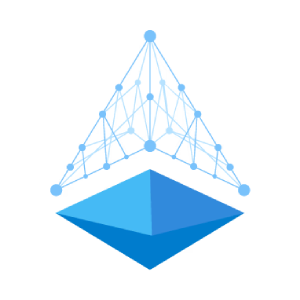 | 141377 | EVAI | EVA Intelligence |
| 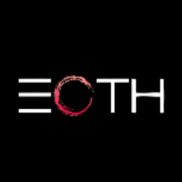 | 123579 | EOTH | Echo Of The Horizon |
|  | 66095 | EVERSAFU | EverSAFU |
|  | 146709 | ALOR | Algorix |
|  | 121847 | ABOND | ApeBond |
|  | 66023 | METAQ | MetaQ |
|  | 165995 | SP | Smart Pocket |
|  | 158735 | FITCOIN | Fitted |
|  | 146629 | KOLZ | KOLZ |
|  | 146435 | ASTROS | ASTROS |
|  | 122059 | ARCH | Archimedes Finance |
|  | 97431 | AA | A3S Protocol |
|  | 69247 | UPO | UpOnly Token |
| 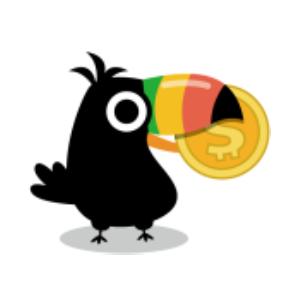 | 136419 | SIO | SAINO |
| 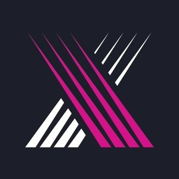 | 128487 | EXT | EXATECH PoAI Blockchain |
|  | 57713 | SPLINK | Space Link |
|  | 46606 | NYAN-2 | Nyan V2 |
|  | 100013 | WOICH | Wrapped Ordichains |
|  | 56033 | TSCT | Transient |
| 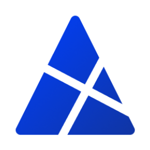 | 42393 | AXEL | AXEL |
|  | 151623 | MARIO | MarioNawfal on X |
|  | 151707 | PUGG | Pugg |
| 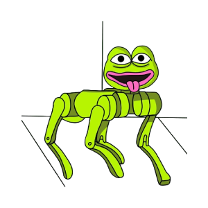 | 151217 | BRAT | Brat |
|  | 158579 | OLIVIA | AIGOV |
| 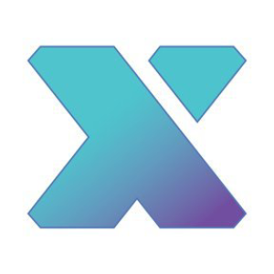 | 151585 | AXGT | AxonDAO Governance Token |
|  | 147735 | KIKI | KIKICat |
|  | 146805 | BOSSUS | Boss US |
|  | 147165 | STORAGENT | STORAGENT |
|  | 147177 | SUGR | Sugar |
| 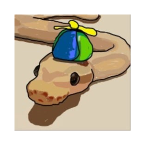 | 144753 | SSSSS | Snake wif Hat |
| 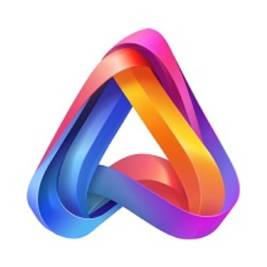 | 144113 | ALME | Alita |
|  | 141663 | ROSS | Ross Ulbricht |
|  | 123513 | TIGRES | Tigres Fan Token |
|  | 115551 | EIM | Expert Infra |
|  | 111861 | ZENI | Edoverse Zeni |
|  | 70437 | ZGD | ZambesiGold |
|  | 63511 | FENOMY | Fenomy |
|  | 45133 | JUI | JUIICE |
| 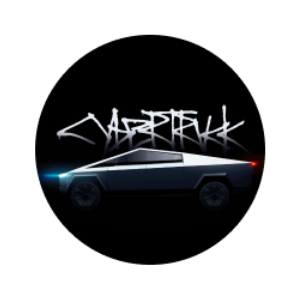 | 124263 | CYBERTRUCK | CYBERTRUCK |
|  | 50597 | STBB | Stabilize BSC |
| 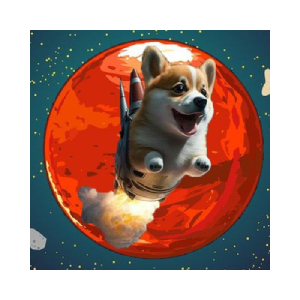 | 164235 | MDOGE | MDOGE |
|  | 130237 | HECT | Hectic Turkey |
|  | 64911 | ELK | Elk Finance |
|  | 172289 | XCL | Xcellar |
|  | 158505 | ASRR | Assisterr AI |
| 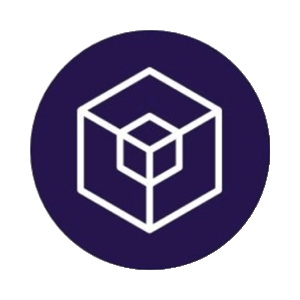 | 147869 | KOIN | Koinos |
|  | 146871 | $OPTION | Options AI |
|  | 77625 | KLEVA | KLEVA Protocol |
|  | 70947 | FLZ | Fellaz |
|  | 63729 | TALE | Tales Of Chain |
|  | 148677 | BARRY | Barry the badger |
|  | 146479 | AURK | Aurk AI |
|  | 112069 | MOMO V2 | Momo v2 |
|  | 69437 | MANC | Mancium |
|  | 67761 | ADAL | Adalend |
|  | 55587 | BOXERDOGE | BoxerDOGE |
|  | 166013 | OMFG | Omnipair |
| 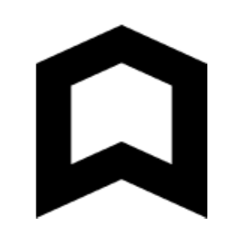 | 150211 | AINTI | AIntivirus |
|  | 151453 | TRENCHER | Trencher |
| 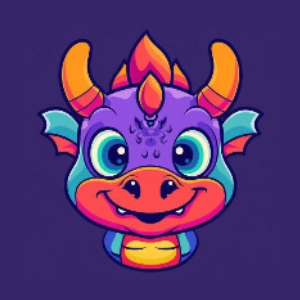 | 127795 | LOONG | PlumpyDragons |
|  | 94827 | SIGIL | Sigil Finance |
|  | 61279 | PDT | ParagonsDAO |
|  | 136907 | LBM | Libertum |
|  | 131165 | SWIPES | BNDR |
|  | 112845 | VXAI | Vortex AI |
|  | 150183 | STAN | STAN |
|  | 151213 | FRIC | Fric |
| 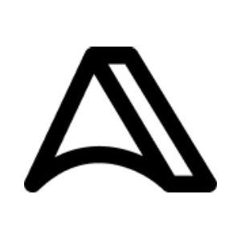 | 130451 | DIKO | Arkadiko Finance |
|  | 123477 | ETI | Etica |
|  | 126827 | INDY | Indigo Protocol |
|  | 125891 | AZEE | SurrealVerse |
|  | 98831 | BUCK | Arbucks |
|  | 64673 | USDN | Neutrino USD |
|  | 50791 | JDI | JDI Token |
|  | 113793 | AW3 | Anon Web3 |
|  | 67637 | BABYTRUMP | Baby Trump |
|  | 57957 | UV | UnityVentures |
|  | 46251 | YLAB | Yearn-finance Infrastructure Labs |
|  | 67019 | MSHIBA | Meta Shiba |
|  | 59241 | $KRAUSE | KRAUSE |
| 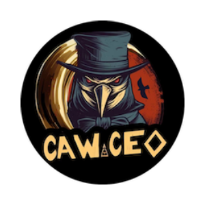 | 94513 | CAWCEO | Caw CEO |
|  | 99795 | CHAMPZ | Champignons of Arborethia |
|  | 78571 | STREAMERINU | Streamer Inu |
|  | 80205 | BOC | BOCOIN |
| 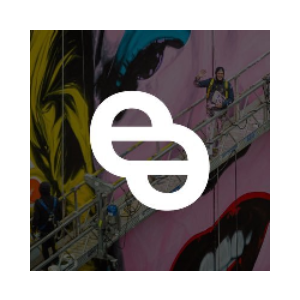 | 69253 | STREETH | STREETH |
|  | 55717 | BISWAP | Biswap Token |
|  | 161531 | GIB | gib |
|  | 162271 | OPAD | OpenPad AI |
|  | 154837 | BURT | Burt |
|  | 151473 | DMCP | DeMCP |
|  | 147111 | SUAI | SuiAI |
|  | 145457 | RETRO | RetroCraft |
|  | 144741 | $ELON | Elon |
|  | 63273 | ABP | Asset Backed Protocol |
|  | 42601 | OURO | Ouroboros |
| 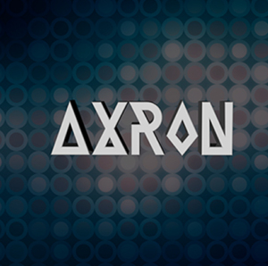 | 158737 | AXR | Axelrod by Virtuals |
|  | 151987 | BGEO | BGEO(Bitcoin Global Eternal Oasis) |
| 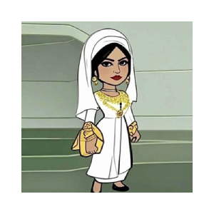 | 151281 | MUBARAKAH | Mubarakah |
|  | 122297 | FMC | Fimarkcoin |
| 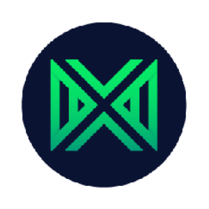 | 95803 | MMXN | Moneta Digital |
|  | 66633 | ERP | Entropyfi |
|  | 33608 | HEDG | HedgeTrade |
|  | 151191 | $1 | just buy $1 worth of this coin |
| 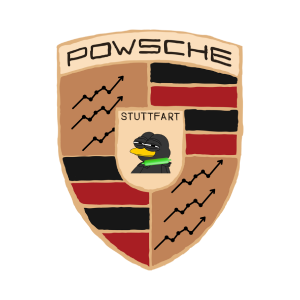 | 141287 | POWSCHE | Powsche |
|  | 126565 | CODA | CODA |
|  | 126607 | PEEN | Frog Wif Peen |
|  | 124447 | DHS | Dhahab Sports |
| 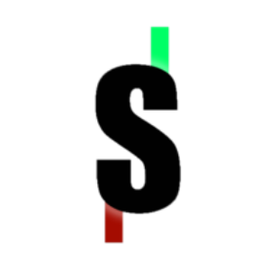 | 123997 | SHS | SHEESH |
|  | 124869 | GWP | Gateway Protocol |
| 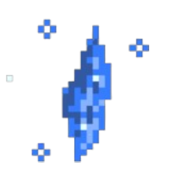 | 122993 | ZBIT | zbit |
|  | 122839 | GSYS | Genesys |
|  | 122145 | VRC | Virtual Coin |
|  | 114747 | COLT | Collateral Network |
| 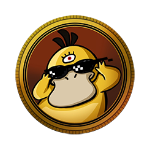 | 114853 | PSYOP | PSYOP |
| 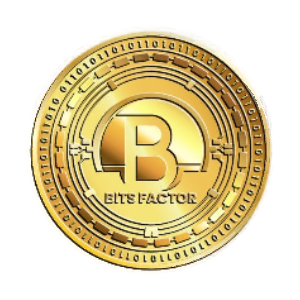 | 115513 | BFTC | BITS FACTOR |
|  | 112287 | IUCN | IUCN Coin |
|  | 112271 | CSTV2 | CRYPTO STREET V2 |
|  | 102507 | SPAI | SpaceAI |
|  | 112955 | MOVO | Movo Smart Chain |
|  | 112269 | INAE | iNAE |
| 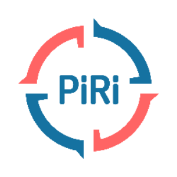 | 101695 | PIRI | Pirichain |
|  | 101563 | VMS | Vehicle Mining System |
| 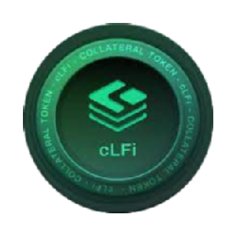 | 112141 | CLFI | cLFi |
|  | 112077 | BBDC | Block Beats Network |
|  | 113289 | CIRI | CIRI Coin |
| 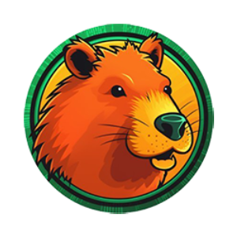 | 97359 | BARA | Capybara |
|  | 96217 | FGHT | Fight Out |
|  | 96641 | SHIBL | ShibLa |
| 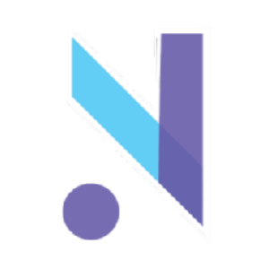 | 96821 | NRK | Nordek |
| 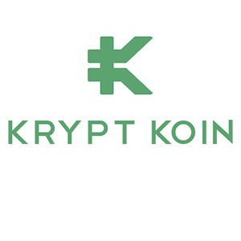 | 96495 | KTK | KTK project |
| 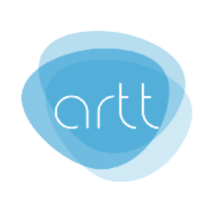 | 97143 | ARTT | ARTT Network |
|  | 95711 | TMON | Two Monkey Juice Bar |
|  | 96567 | BVV | Blockchain Valley Virtual |
|  | 96729 | MONTE | Monte |
|  | 94207 | OHMS | OHMS |
|  | 98077 | OXBT | OXBT |
| 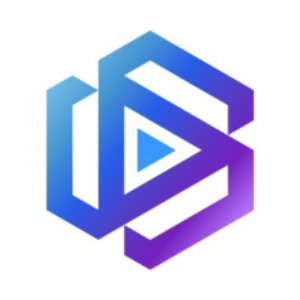 | 96279 | BISKIT | Biskit Protocol |
| 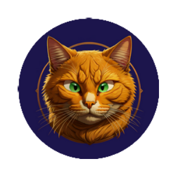 | 97109 | GLI | GLI TOKEN |
|  | 97253 | NALS | NALS |
|  | 94593 | ELMO | ElmoERC |
|  | 97597 | AIONE | AiONE |
|  | 94515 | CBSL | CeBioLabs |
|  | 88991 | BTCVB | BitcoinVB |
| 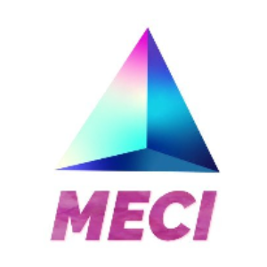 | 90115 | MECI | Meta Game City |
| 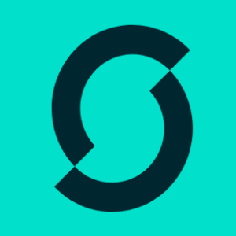 | 78377 | SMR | Shimmer |
| 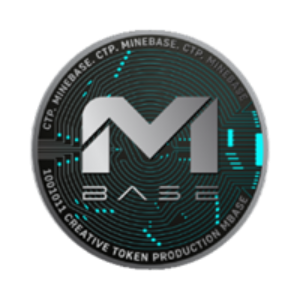 | 79763 | MBASE | Minebase |
| 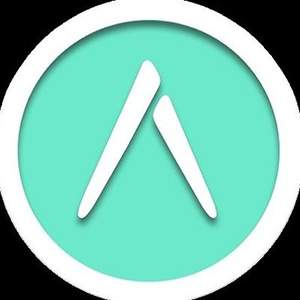 | 80277 | CCOIN | Crypteriumcoin |
| 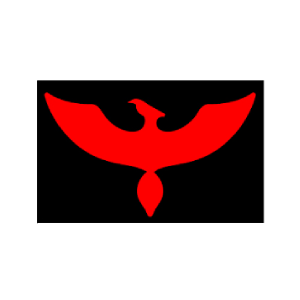 | 79549 | IXP | IMPACTXPRIME |
| 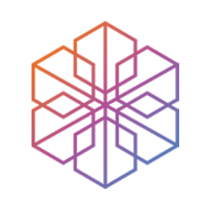 | 81267 | MTRX | Metarix |
|  | 70341 | SLEEPEE | SleepFuture |
| 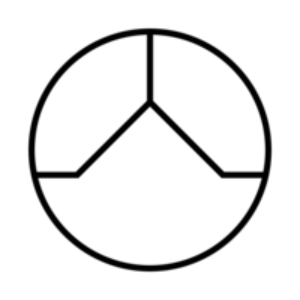 | 67339 | UXP | UXD Protocol Token |
| 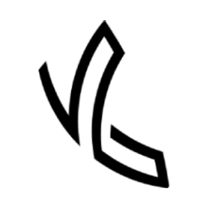 | 63141 | BKR | Balkari Token |
| 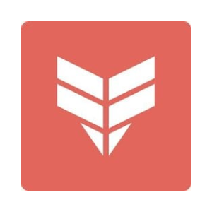 | 61263 | EXFI | Flare Finance |
|  | 61109 | CALO | Calo App |
|  | 60567 | H3RO3S | H3RO3S |
|  | 56369 | UUSD | Youves uUSD |
|  | 54655 | KSHIB | Kaiken Shiba |
|  | 55919 | KWT | Kawaii Islands |
|  | 52135 | DACXI | Dacxi |
| 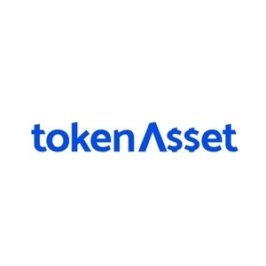 | 48293 | NTB | TokenAsset |
| 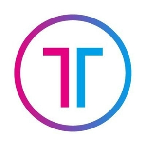 | 47887 | TMCN | Timecoin Protocol |
|  | 47045 | G999 | G999 |
| 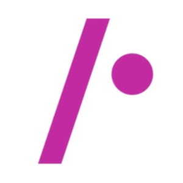 | 46715 | EPAN | Paypolitan Token |
|  | 46271 | MILK2 | MILK2 |
| 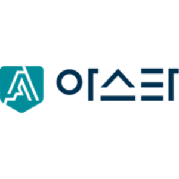 | 44083 | ASTA | ASTA |
|  | 45140 | EFK | EFK Token |
| 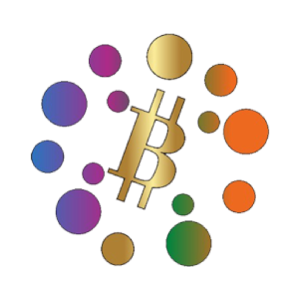 | 45085 | BDCC | BITICA COIN |
|  | 44111 | YOUC | YOUcash |
|  | 44160 | FZY | Frenzy |
|  | 42843 | CDEX | Codex |
| 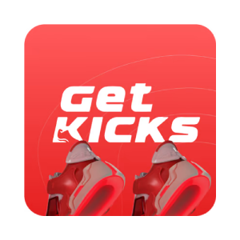 | 36607 | KICKS | Sessia |
| 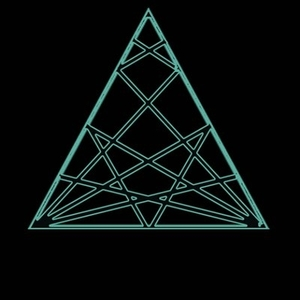 | 41220 | REL | RELEASE |
| 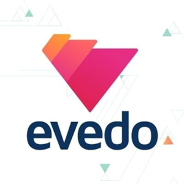 | 33836 | EVED | Evedo |
|  | 34501 | EXCC | ExchangeCoin |
|  | 34703 | TKP | TOKPIE |
|  | 33322 | ADF | Ad Flex Token |
| 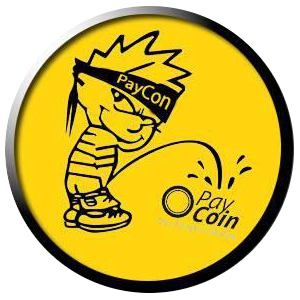 | 33414 | CON | CONUN |
| 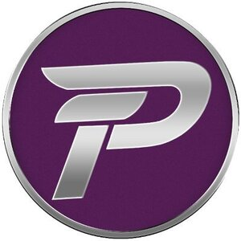 | 33756 | PLAT | BitGuild PLAT |
|  | 33812 | ISR | Insureum |
|  | 32257 | CAPP | Cappasity |
|  | 168639 | NBASIS | Nest Basis Vault |
|  | 161951 | PRIVIX | Privix |
|  | 154431 | ITALIANROT | Italian Brainrot |
| 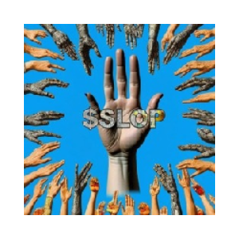 | 141341 | SLOP | Slop |
|  | 81285 | GABX | Gabx Finance |
|  | 78343 | BTCD | Bitdollars |
|  | 69831 | SIDD | Siddcoin |
| 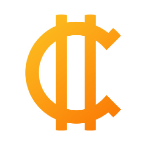 | 69673 | CHB | Charactbit |
|  | 68579 | SUPS | Supremacy |
|  | 68325 | HIMA | Himalayan Cat Coin |
|  | 60793 | NYXT | Nyx Token |
|  | 59133 | CBBN | CBBN Token |
| 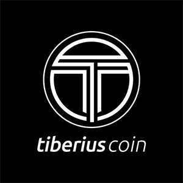 | 55671 | TCX | Tron Connect |
|  | 55379 | MMM7 | MMMLUCKUP7 |
|  | 51761 | RKG | Rap Keo Group |
|  | 49547 | ALR | Alacrity |
|  | 45211 | BNTX | Bintex Futures |
|  | 151445 | OIK | Space Nation |
|  | 165403 | SKORAI | SKOR AI |
| 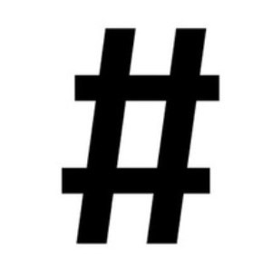 | 151287 | MEMHASH | Memhash |
| 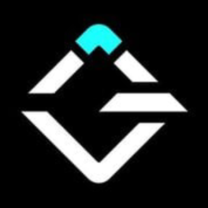 | 145009 | LRT | LandRocker |
| 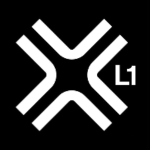 | 131389 | SXCH | SolarX |
| 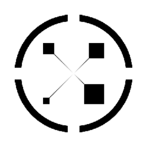 | 125301 | ORAIX | OraiDEX |
| 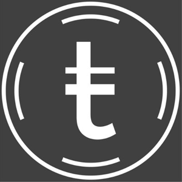 | 77943 | TGT | THORWallet DEX |
| 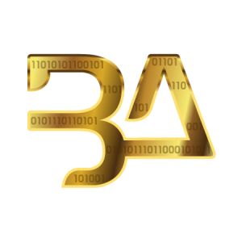 | 70987 | TBAC | BlockAura |
| 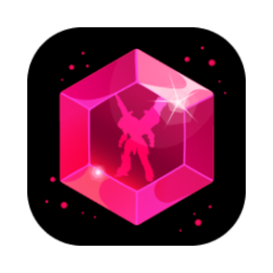 | 77785 | ASTRAFER | Astrafer |
| 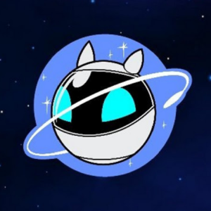 | 61165 | WNK | The Winkyverse |
|  | 45334 | XLT | Nexalt |
|  | 146561 | MORPHAI | Morph AI |
|  | 111607 | DETF | Decentralized ETF |
|  | 67325 | MRUN | Metarun |
|  | 65649 | EDAO | ElonDoge DAO |
| 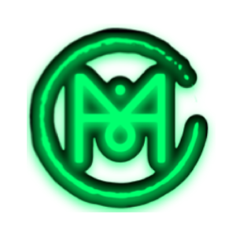 | 124209 | M | MetaVerse-M |
|  | 66619 | VIVAION | Vivaion |
| 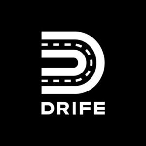 | 54103 | DRF | DRIFE |
| 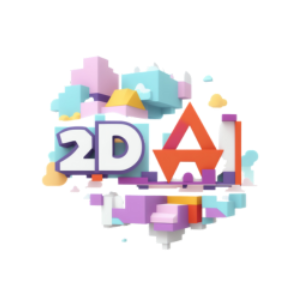 | 94419 | 2DAI | 2DAI.io |
|  | 62885 | POW | Metahero Universe |
|  | 49617 | ELONGATE | ElonGate |
|  | 165605 | POLYFACTS | Polyfactual |
|  | 165633 | BAGWORK | Bagwork |
|  | 147901 | DOLAN | Dolan Duck |
| 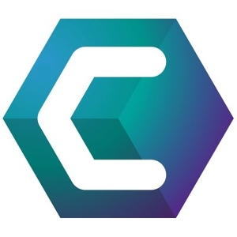 | 151171 | CAR | Central African Republic Meme |
| 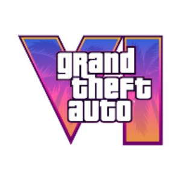 | 124121 | GTAVI | GTAVI |
| 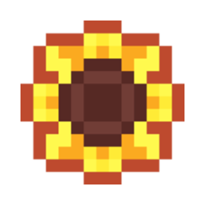 | 122585 | SFL | Shuffle |
| 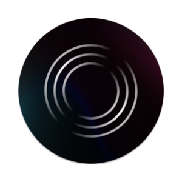 | 85355 | STABLZ | Stablz |
| 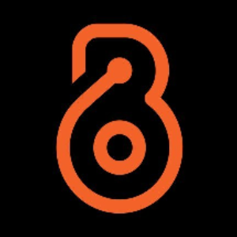 | 54741 | BOP | Boring Protocol |
|  | 51241 | HPPOT | Healing Potion |
| 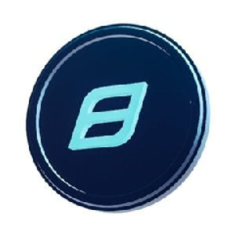 | 111855 | SALD | Salad |
|  | 78519 | MATSUSWAP | MatsuSwap |
|  | 89395 | MTVT | Metaverser |
|  | 80159 | ULX | ULTRON |
|  | 71353 | WOMBAT | Wombat |
| 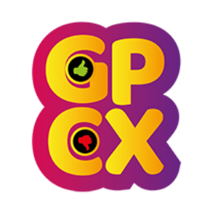 | 69793 | GPCX | Good Person Coin |
|  | 55061 | MGT | Megatech |
|  | 47141 | LOOT | NFTLootBox |
|  | 165707 | DL | Dill |
|  | 158979 | XNPCS | NPCS AI |
|  | 81017 | JEN | JEN COIN |
| 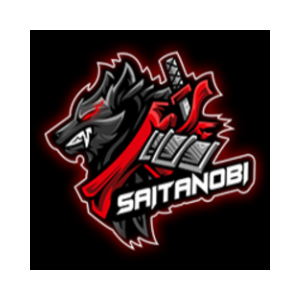 | 68457 | SAITANOBI | Saitanobi |
|  | 66341 | FOXY | Foxy Equilibrium |
|  | 161177 | SKYOPS | Skyops |
| 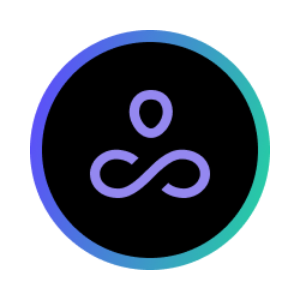 | 136481 | GURU | Guru Network |
| 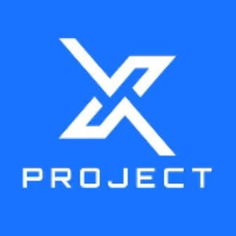 | 122459 | XERS | X Project |
|  | 112149 | KREST | Krest |
|  | 113567 | TRADEX | TradeX AI |
| 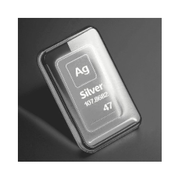 | 113187 | SILVER | SILVER |
|  | 152273 | FORKY | Forky |
|  | 153959 | ND7 | Nexdol |
| 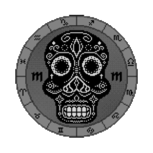 | 150397 | MORI | MEMENTO•MORI (Runes) |
| 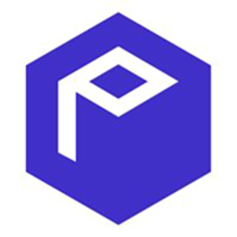 | 42136 | PROB | Probit Token |
|  | 162801 | BABYMANYU | Baby Manyu |
| 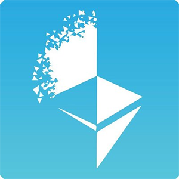 | 111745 | ETF | ETF The Token |
|  | 78553 | DAMM | dAMM |
| 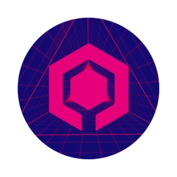 | 64977 | PNODE | Pinknode |
|  | 53761 | FOOTBALLSTARS | Football Stars |
|  | 161687 | GGX | GG3 |
| 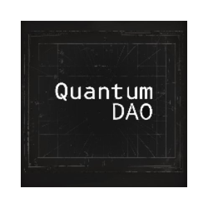 | 138947 | QTDAO | Quantum DAO |
| 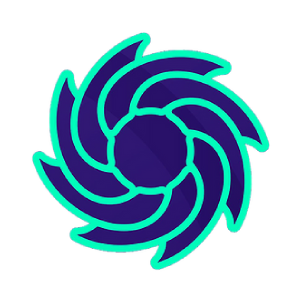 | 126629 | WHIRL | Whirl |
| 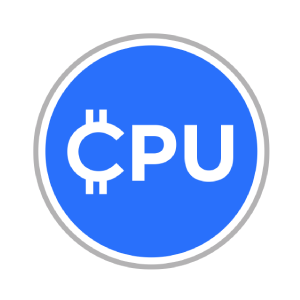 | 123317 | CPU | CPUcoin |
| 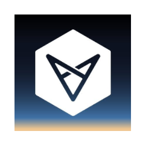 | 113509 | SBIO | Vector Space Biosciences, Inc. |
| 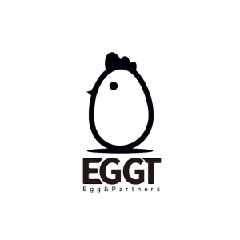 | 96041 | EGGT | Egg N Partners |
|  | 65099 | XTP | Tap |
| 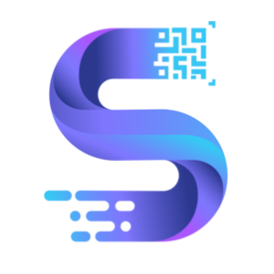 | 58253 | SMARTNFT | SmartNFT |
| 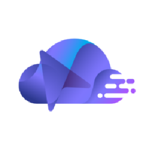 | 56421 | LOX | Lox Network |
|  | 57433 | SMARTLOX | SmartLOX |
| 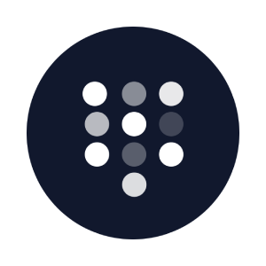 | 49029 | FEED | Feed Token |
|  | 46198 | DOKI | Doki Doki Finance |
|  | 42748 | APM | apM Coin |
|  | 41427 | AMON | AmonD |
|  | 4028 | IGNIS | Ignis |
|  | 141609 | RTR | Restore The Republic |
|  | 131931 | MERY | Mistery On Cro |
|  | 127079 | GNUS | GENIUS TOKEN & NFT COLLECTIONS |
| 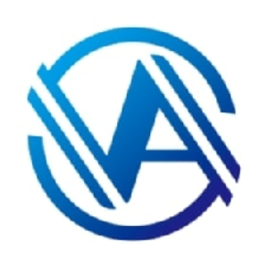 | 123413 | NAC | Nirvana Chain |
| 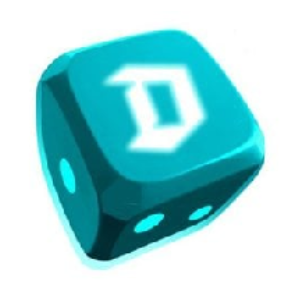 | 121869 | DICE | Klaydice |
|  | 68495 | METAUFO | MetaUFO |
| 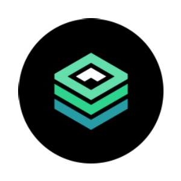 | 145051 | VPS | VPS Ai |
| 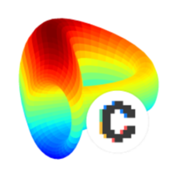 | 64683 | CVXCRV | Convex CRV |
| 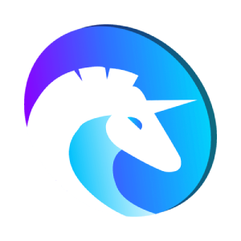 | 46742 | UNCL | UNCL |
|  | 122645 | SECT | SECTBOT |
| 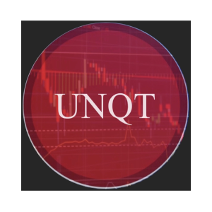 | 65137 | UNQT | Unique Utility Token |
| 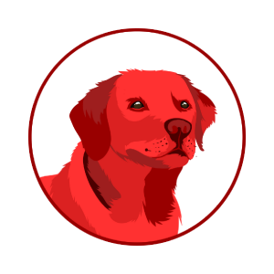 | 60429 | CLIFF | Clifford Inu |
|  | 151077 | FROC | Based Froc |
| 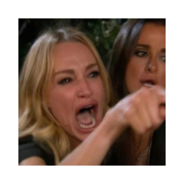 | 147239 | WYAC | Woman Yelling At Cat |
|  | 134639 | QUIL | Wrapped QUIL |
|  | 136387 | DMAGA | Dark MAGA |
|  | 113531 | W3N | Web3 No Value |
|  | 168967 | PKIN | Pumpkin |
| 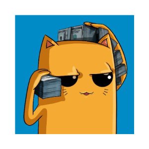 | 151457 | KET | yellow ket |
|  | 146633 | TRAX | TRAX |
| 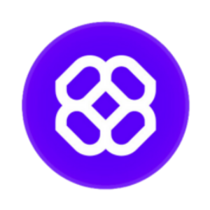 | 135341 | NIGELLA | Nigella Coin |
| 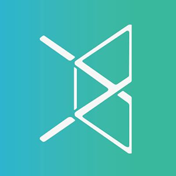 | 136965 | IX | illumineX |
|  | 88893 | BABYCEO | Baby Doge CEO |
|  | 66885 | CANU | Cannumo |
| 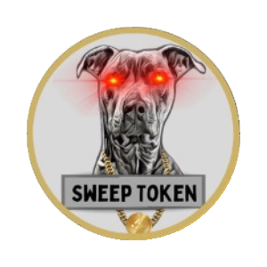 | 66711 | SWEEP | Sweep Capital |
|  | 45964 | FNSP | Finswap |
|  | 130987 | TOOKER | tooker kurlson |
| 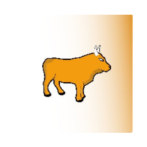 | 123223 | RDO | Rodeo Finance |
| 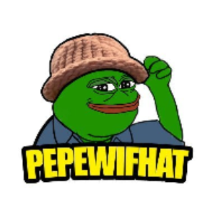 | 63271 | PIF | Play It Forward DAO |
| 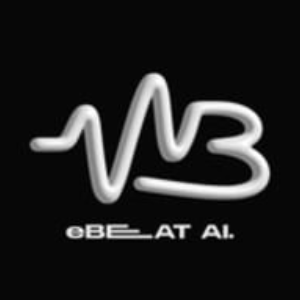 | 164407 | BEATAI | eBeat AI |
|  | 94587 | EDFI | EdFi |
|  | 122417 | NINJA | Dog Wif Nunchucks |
|  | 69271 | SUNDAE | SundaeSwap |
| 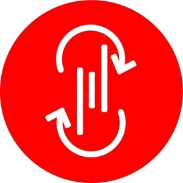 | 45883 | YFIII | Dify.Finance |
| 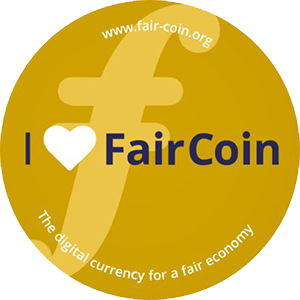 | 168917 | FAIR | Faircaster |
|  | 161757 | STARTUP | Startup |
| 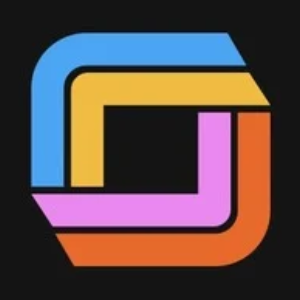 | 142145 | FLAY | Flayer |
|  | 122553 | SILK | SILK |
| 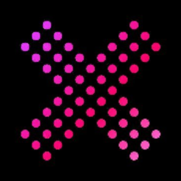 | 112123 | XGPT | X-GPT |
| 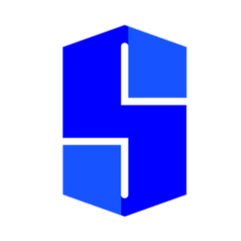 | 54581 | SANA | Storage Area Network Anywhere |
| 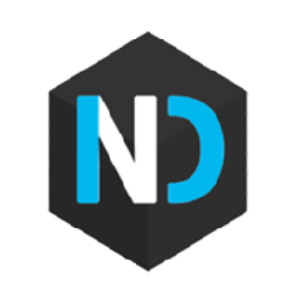 | 52083 | NADA | Nothing |
|  | 50707 | ZEFI | ZCore Finance |
|  | 45909 | KCAL | Phantasma Energy |
| 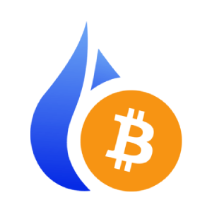 | 45431 | HBTC | Huobi BTC |
| 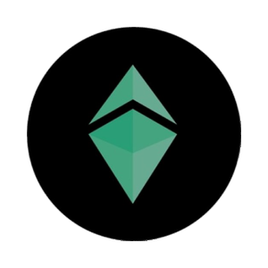 | 33406 | ETHM | Ethereum Meta |
|  | 162551 | GLUE | Glue |
|  | 126549 | OWO | One World Coin |
|  | 98847 | DGRN | Degrain |
| 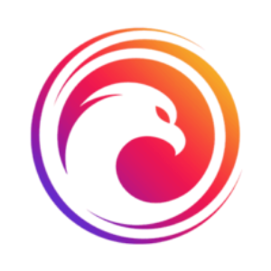 | 85803 | SENSI | Sensi |
|  | 79513 | EDEL | Coin Edelweis |
|  | 70833 | LILLI | Lapislazuli |
|  | 71279 | TUTL | Tutela |
|  | 66933 | STARX | STARX Token |
|  | 64969 | BONTE | Bontecoin |
|  | 66123 | KYAN | Kyanite |
| 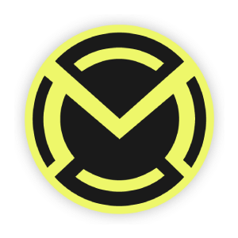 | 63351 | MOBIC | Mobility Coin |
|  | 61151 | NYR | New Year Resolution |
| 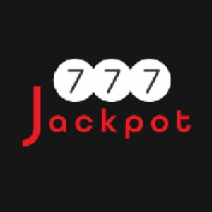 | 60015 | 777 | Jackpot |
| 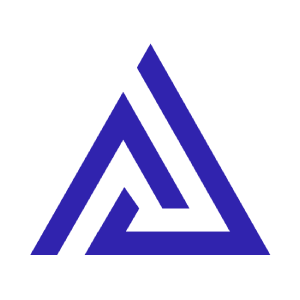 | 53919 | APAD | Anypad |
|  | 55277 | SUV | Suvereno |
|  | 45993 | UCR | Ultra Clear |
|  | 46004 | SFD | SAFE DEAL |
|  | 42969 | XBTX | Bitcoin Subsidium |
| 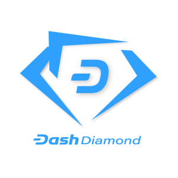 | 42454 | DASHD | Dash Diamond |
| 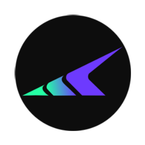 | 42949 | AZR | Aezora |
|  | 42394 | ESK | Eska |
|  | 41700 | MERGE | Merge |
|  | 41213 | FLS | Flits |
|  | 33127 | BIR | Birake |
|  | 161941 | HPX | HyperChainX |
|  | 154517 | SOONX | SoonChain |
| 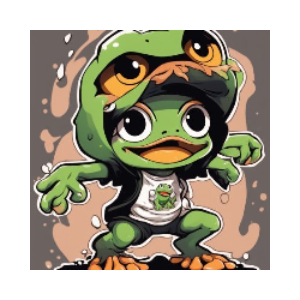 | 136531 | ZYGO | Zygo the frog |
|  | 112759 | JOVJOU | JovJou |
|  | 89641 | THOL | AngelBlock |
| 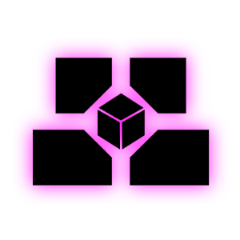 | 68371 | BPAD | BlokPad |
| 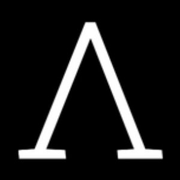 | 126299 | VUZZ | VuzzMind |
| 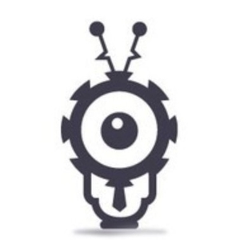 | 45291 | XIOT | Xiotri |
|  | 141493 | USD0++ | USD0 Liquid Bond |
|  | 131719 | PAPU | Papu Token |
|  | 111867 | PUBLX | PUBLC |
|  | 99779 | BGPT | BlockGPT |
|  | 45227 | UNIFI | Unifi |
| 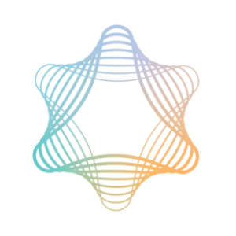 | 121713 | AURA | Aura Finance |
| 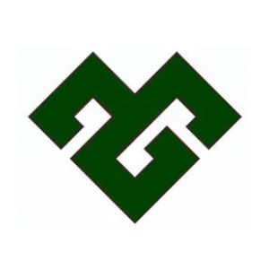 | 89881 | 2GCC | 2G CARBON COIN |
|  | 80219 | VOLR | Volare Network |
| 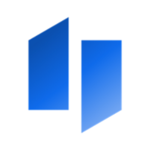 | 46983 | IDLE | IDLE |
| 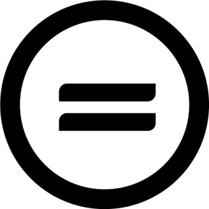 | 164087 | CNCT | BIG Ecosystem |
| 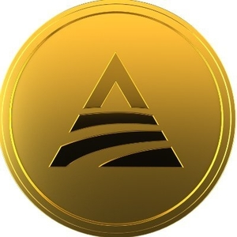 | 46685 | AUSCM | Auric Network |
|  | 45403 | PRDX | Predix Network |
|  | 145139 | TRISIG | Tri Sigma |
| 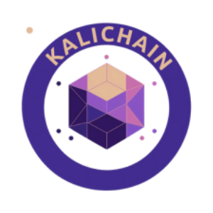 | 131751 | KALIS | KALICHAIN |
|  | 123265 | BUMP | Bumper |
| 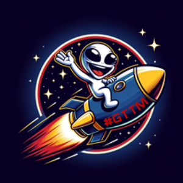 | 127777 | GTTM | Going To The Moon |
|  | 44912 | MUSEUM | Marquise Museum |
|  | 146693 | CPAL | Chainpal AI |
|  | 113337 | DESME | DeSME |
| 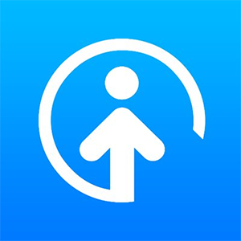 | 89867 | OPP | Open Proprietary Protocol |
|  | 88203 | OLEA | Athena Returns Olea |
| 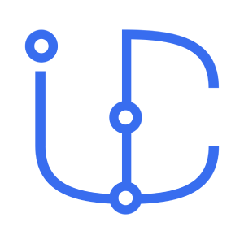 | 71015 | ICOM | iCommunity |
|  | 41680 | TEM | Temtum |
|  | 147203 | LAK3 | LAKE |
|  | 100091 | PENGY | Pengy |
|  | 67661 | SEEDED | Seeded Network |
|  | 122057 | SHACK | Shackleford |
| 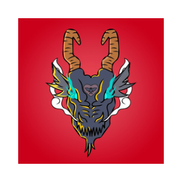 | 78461 | TYRANT | Fable Of The Dragon |
|  | 50089 | KNOCKERS | Australian Kelpie |
|  | 168577 | AIDAUSDC | Gaib AI Dollar Alpha USDC |
|  | 134637 | USD+ | Overnight.fi USD+ |
|  | 136179 | SKBDI | Skibidi Toilet |
| 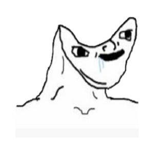 | 136155 | BRAINLET | Brainlet |
|  | 70115 | KMT | FiveKM KMT |
| 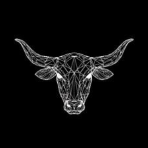 | 147259 | ZKGPT | ZKGPT |
| 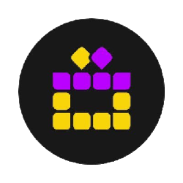 | 66901 | PURSE | Pundi X PURSE |
|  | 50025 | JIND | Jindo Inu |
|  | 161959 | EDWIN | Edwin |
|  | 162249 | FARTLESS | FARTLESS COIN |
|  | 165153 | DISCO | Disco By Matt Furie |
| 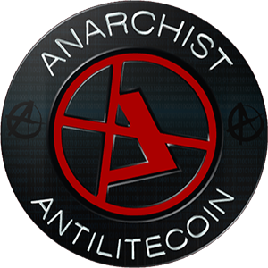 | 115659 | ANTC | Kingdom of Ants |
|  | 112863 | WARPED | Warped Games |
|  | 70647 | LUNCH | LunchDAO |
|  | 162929 | BABYBOSS | Baby Boss |
|  | 99727 | TESO | TeSo |
| 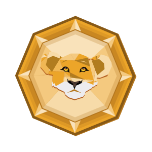 | 79579 | PHBD | Polygon HBD |
| 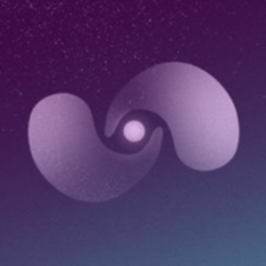 | 68185 | PRNT | Prime Numbers |
|  | 154743 | KEIRO | KEIRO |
|  | 151541 | $GOLD | $GOLD |
| 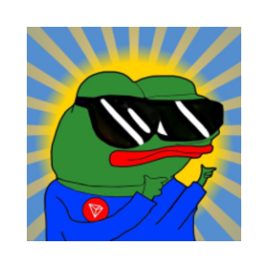 | 136253 | SUNPEPE | sunpepe |
|  | 50859 | BLKC | BlackHat Coin |
|  | 164699 | ZARO | Zaro Coin |
|  | 112377 | 5MC | 5mc |
|  | 57153 | TOTORO | Totoro Inu |
|  | 168695 | BRLA | BRLA Digital BRLA |
|  | 78445 | XMU | Mushe |
|  | 65043 | ABR | Allbridge |
| 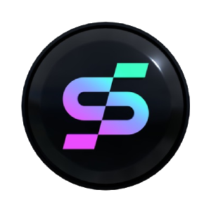 | 60231 | SOLCASH | SOLCash |
|  | 46702 | WLEO | Wrapped LEO |
|  | 70003 | DOGGER | Dogger |
| 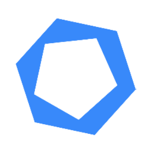 | 63905 | BSPT | Blocksport |
|  | 56585 | DKKS | Daikokuten Sama |
|  | 169007 | KOLSCAN | kolscan |
|  | 162465 | GPTON | GPTON |
|  | 159405 | STABUL | Stabull Finance |
|  | 162073 | RAIIN | Raiinmaker |
|  | 166037 | AEA | AlphaExchangeAI |
|  | 162829 | SUPERGROK | SuperGrok |
| 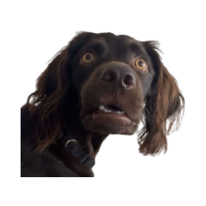 | 158747 | BUDDY | Creator Buddy |
|  | 152217 | ANITA | Anita AI |
| 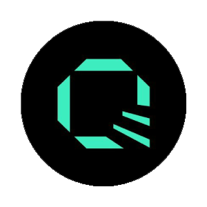 | 136533 | QTLX | Quantlytica |
| 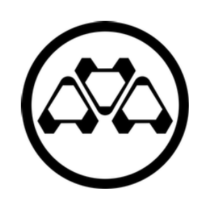 | 77007 | MECHA | Mechanium |
|  | 77507 | NMKR | NMKR |
|  | 57147 | DKT | Duelist King |
|  | 32844 | UPP | Sentinel Protocol |
|  | 165965 | 赵长娥 | 赵长娥 |
|  | 161881 | BURN | Burnedfi |
|  | 172295 | WBULL | Wall St. Bull |
|  | 172343 | YBNB | Yellow BNB |
|  | 166217 | TIMELESS | Timeless |
|  | 172347 | $MMDAO | MMDAO |
|  | 161947 | NDQ | Nasdaq666 |
|  | 135683 | MOLI | Mobile Liquidity |
| 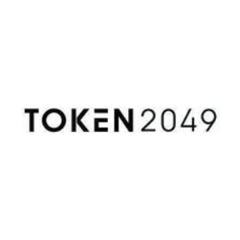 | 124199 | 2049 | TOKEN 2049 |
|  | 123383 | BULL | Bull Token |
| 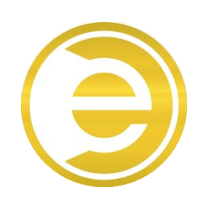 | 122571 | ECOIN | Ecoin Finance |
| 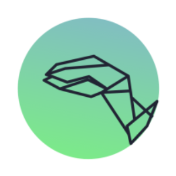 | 76611 | RPTR | Raptor Finance |
| 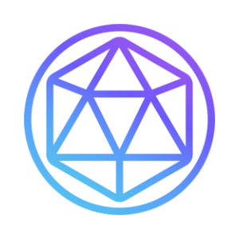 | 78365 | ICSA | Icosa |
|  | 111727 | FRIEND | Friend Room |
|  | 71433 | GLXY | Astrals GLXY |
|  | 50085 | EDOGE | Elon Doge Token |
| 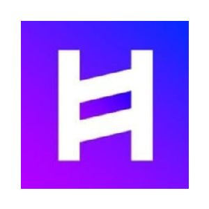 | 132189 | HSUITE | HbarSuite |
| 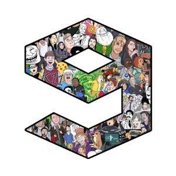 | 124533 | 9GAG | 9GAG |
|  | 113609 | TICKR | Tickr |
|  | 81037 | FUNEX | Funex |
|  | 63505 | SAITOKI | Saitoki Inu |
|  | 60021 | UNT | Unity Network |
|  | 43134 | GST2 | Gastoken |
| 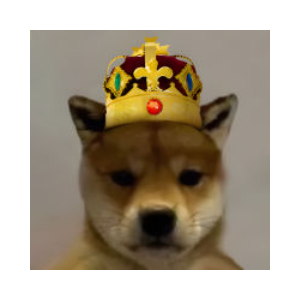 | 144079 | KINGWIF | King WIF |
| 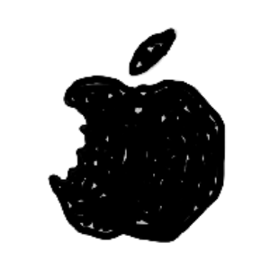 | 127223 | AABL | Abble |
|  | 122353 | PYI | PYRIN |
| 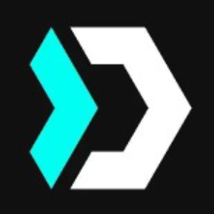 | 115575 | DEXNET | DexNet |
| 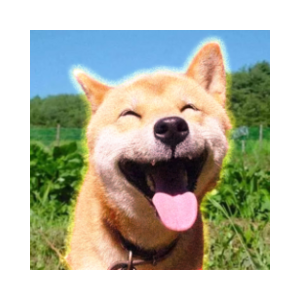 | 78471 | MARU | marumaruNFT |
| 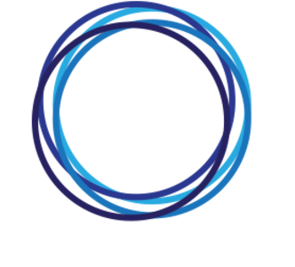 | 59029 | XCC | Chives Coin |
| 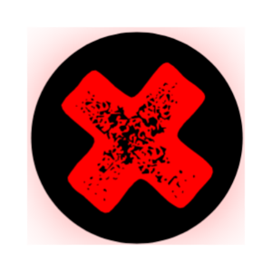 | 58139 | BEETS | Beethoven X |
|  | 151091 | UUC | USA Unity Coin |
|  | 161965 | TOTAKEKE | Dark Cheems |
|  | 144701 | SOLARIS | Solaris AI |
|  | 146769 | $STAR | Sponstar |
|  | 146855 | TRRUE | TRRUE |
| 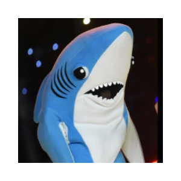 | 142031 | SHORK | Shork |
| 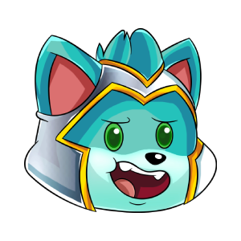 | 141307 | DOGK | Dagknight Dog |
| 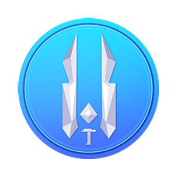 | 123077 | BVT | BovineVerse Token |
| 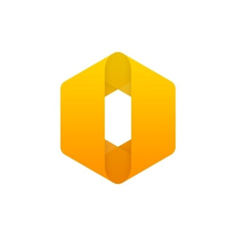 | 65513 | SOLA | SOLA Token |
|  | 59985 | SWP | Kava Swap |
|  | 60705 | PHONON | Phonon DAO |
| 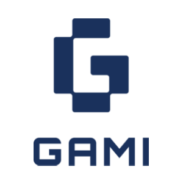 | 58301 | GAMI | GAMI World |
| 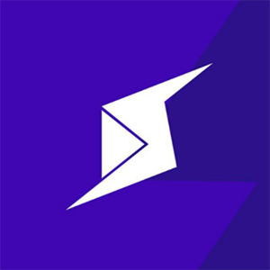 | 33724 | BOLT | BOLT |
|  | 147179 | BDOGITO | BullDogito |
| 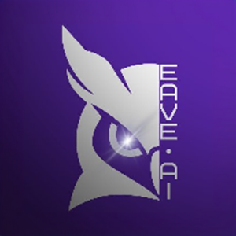 | 136939 | EAVE | EaveAI |
|  | 130961 | HAMMY | SAD HAMSTER |
|  | 125817 | AMPERE | AmpereChain |
|  | 63721 | SYNR | MOBLAND |
| 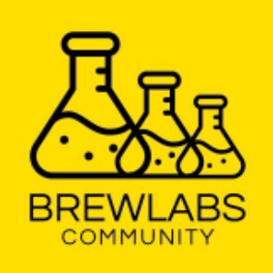 | 60949 | BREWLABS | Brewlabs |
|  | 57597 | CATCHY | Catchy |
|  | 52115 | NAFTY | Nafty |
|  | 51715 | GDILDO | Green Dildo Finance |
|  | 146741 | PROPHT | PROPHET |
| 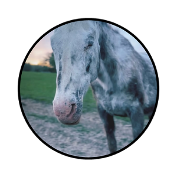 | 141487 | CHEYENNE | Cheyenne |
| 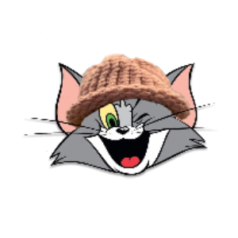 | 132463 | TWIF | Tomwifhat |
|  | 127253 | FAND | Fandomdao |
|  | 126835 | TES | Titan Trading Platform |
|  | 127113 | GGMT | GG MetaGame |
| 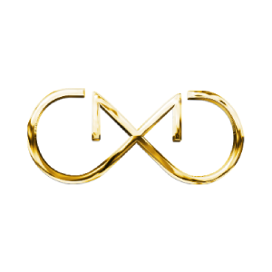 | 124127 | MDB | Million Dollar Baby |
| 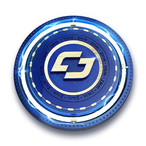 | 97831 | WNZ | Winnerz |
|  | 63307 | MILF | MILF Finance |
|  | 55695 | FATCAKE | FatCake |
|  | 56311 | DANGERMOON | DangerMoon |
| 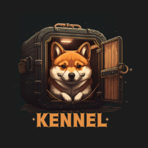 | 49087 | KENNEL | Token Kennel |
|  | 146553 | OMIRA | Omira |
|  | 69537 | BABYBUSD | BabyBUSD |
|  | 63015 | CARROT | Carrot Token |
| 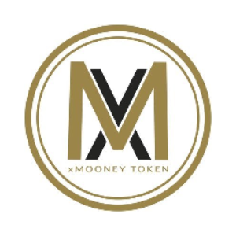 | 58555 | XM | xMooney |
|  | 114011 | XVR | Xover |
|  | 67133 | DINK | Dink Doink |
|  | 51935 | GRIMEX | SpaceGrime |
| 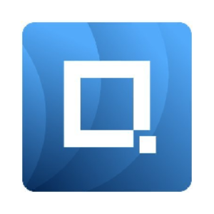 | 168965 | QUANT | Gen Z Quant |
| 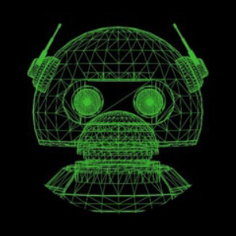 | 151307 | MOSS | MOSS AI |
| 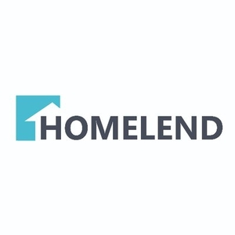 | 138231 | HMD | Healthmedi |
|  | 123595 | CGT | Curio Governance |
| 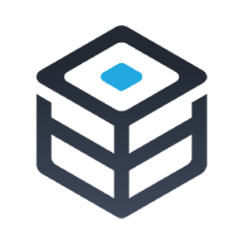 | 113643 | MELB | Minelab |
|  | 99217 | PITQC | Pitquidity Capital |
|  | 94369 | SVQ | Seven-Q |
| 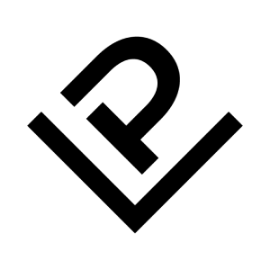 | 68983 | LPY | LeisurePay |
| 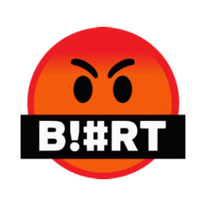 | 68799 | BLURT | Blurt |
|  | 51887 | HDFL | Hyper Deflate |
|  | 50907 | LQT | Liquidifty |
|  | 49339 | PAPEL | Papel Token |
|  | 46917 | SWISS | swiss.finance |
| 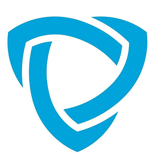 | 45460 | UCO | Uniris |
|  | 46482 | HBDC | happy birthday coin |
| 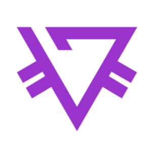 | 2906 | PZM | PRIZM |
|  | 123215 | FREN | Frencoin |
|  | 77581 | SPKY | SpookyShiba |
| 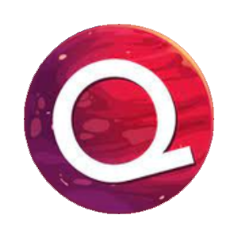 | 71357 | QDT | Quadrans |
|  | 68471 | DBUY | Doont Buy |
|  | 146571 | GATTO | Madonna del Gatto |
| 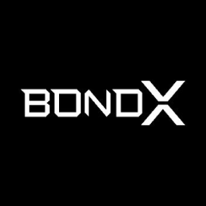 | 151079 | BONDX | BONDX |
|  | 125923 | ALEA | Alea |
|  | 99345 | ECHOES | Echoes |
|  | 63203 | SUNI | StarbaseUniverse |
| 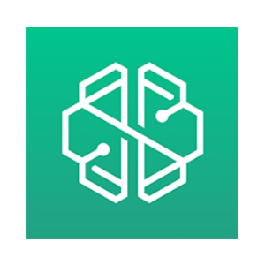 | 148131 | BORG | SwissBorg |
|  | 123553 | MANE | MANE |
| 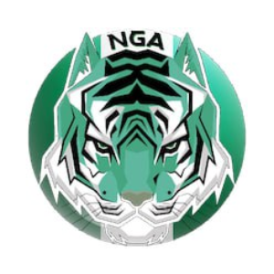 | 90503 | NGA | NGATiger |
|  | 86543 | SHEN | Shen |
|  | 80975 | WAIFU | Waifu |
|  | 69037 | FUSII | Fusible |
| 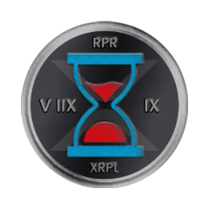 | 65897 | RPR | The Reaper |
|  | 57393 | ETHFIN | Ethernal Finance |
|  | 36452 | NOIA | NOIA Network |
| 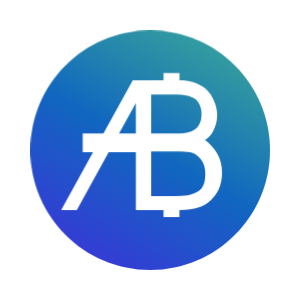 | 33823 | NEW | Newton |
| 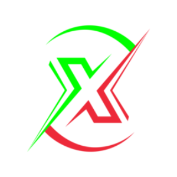 | 33654 | HXRO | Hxro |
|  | 112491 | BNBKING | BNBKinG |
| 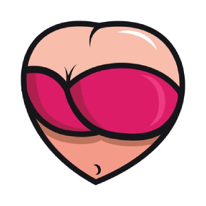 | 66751 | TITS | TitsV2 |
|  | 151601 | DEFIANT | Defiant |
|  | 154435 | H1 | Haven1 |
|  | 161537 | BBTC | Baby Bitcoin |
|  | 146609 | QUILL | Ink Finance |
|  | 136655 | AJUN | Ajuna Network |
|  | 133167 | CNHT | Tether CNHt |
| 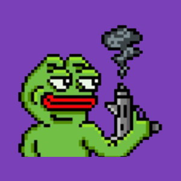 | 131035 | GOME | Game of Memes |
| 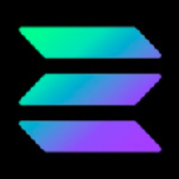 | 121793 | ANALOS | analoS |
| 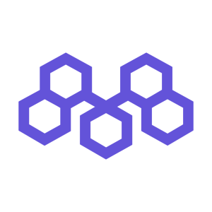 | 115577 | MIND | Morpheus Labs |
| 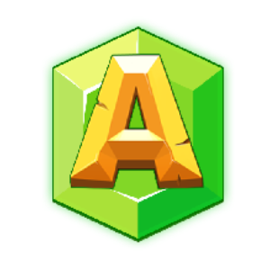 | 122641 | AFG | Army of Fortune Gem |
| 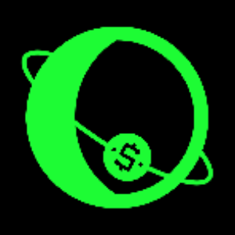 | 70089 | DMOON | DragonMoon |
|  | 69319 | BOFB | bofb |
|  | 51625 | NOTSAFEMOON | NotSafeMoon |
| 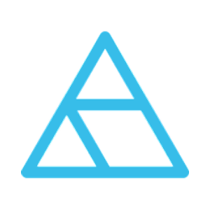 | 32890 | KAN | BitKan |
|  | 3162 | HNC | Helleniccoin |
| 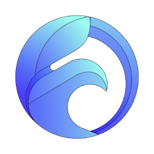 | 151705 | NYS | node.sys |
|  | 151451 | FAT | Fat Fella |
|  | 141255 | $URO | Urolithin A |
| 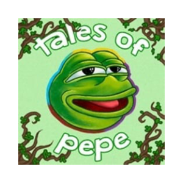 | 137961 | TALES | Tales of Pepe |
|  | 123787 | VITRA | Vitra Studios |
|  | 57807 | PULSEDOGE | PulseDoge |
|  | 51963 | BABYKISHU | Baby Kishu |
| 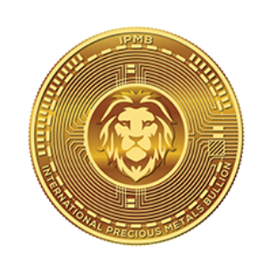 | 112739 | IPMB | IPMB |
|  | 113465 | KRILL | Krill |
|  | 94627 | JOY | Joystick |
|  | 59167 | WTW | Watchtower |
| 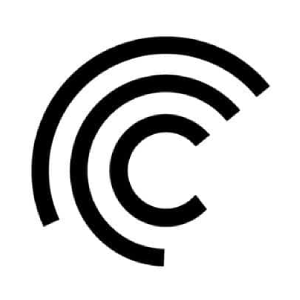 | 54109 | WCFG | Wrapped Centrifuge |
| 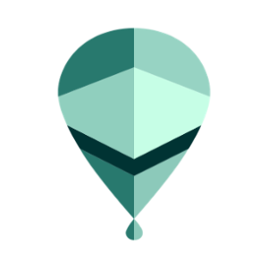 | 50461 | ELAND | Etherland |
| 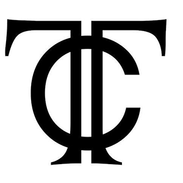 | 151543 | TAT | Tell A Tale |
|  | 135631 | DEVE | Develocity Finance |
| 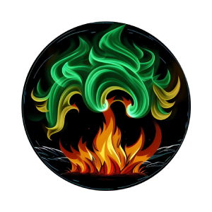 | 112195 | GBURN | GBURN |
|  | 69923 | DOOGEE | Doogee |
|  | 158759 | GIGGLES | Giggles |
|  | 158465 | JANITOR | Janitor |
| 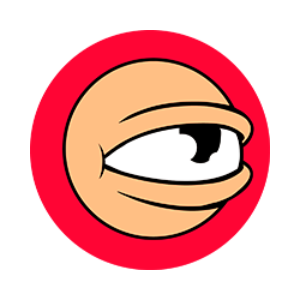 | 141409 | GOB | Goons of Balatroon |
|  | 77841 | MNTL | AssetMantle |
|  | 69141 | INDSHIB | Indian Shiba Inu |
|  | 67285 | SHINE | ShineMine |
|  | 154361 | JOS | JuliaOS |
|  | 131655 | HOM | Homeety |
| 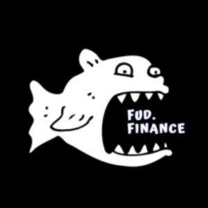 | 67697 | FUD | FUDcoin Official |
| 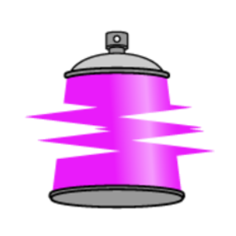 | 47427 | PAINT | MurAll |
| 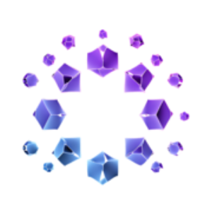 | 127803 | DFNDR | Defender Bot |
|  | 123015 | EMAID | MaidSafeCoin |
|  | 113131 | $STACK | STACKER AI |
| 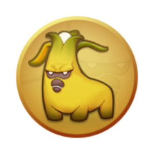 | 77829 | PEEL | Meta Apes PEEL |
| 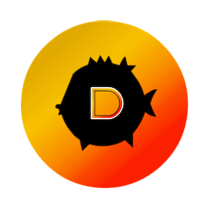 | 43245 | DYT | DoYourTip |
|  | 172311 | GBNB | GOLD BNB |
|  | 154371 | AGIXT | AGiXT |
|  | 158769 | FAFO | FAFO |
|  | 150379 | TETSUO | Tetsuo Coin |
|  | 124029 | BABYX | Baby X |
|  | 94591 | $ELEV | Elevate Token |
| 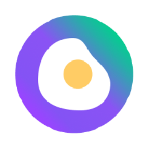 | 67719 | SSU | SunnySideUp |
|  | 58337 | FALAFEL | Falafel |
|  | 162335 | BABYWLFI | Baby World Liberty Financial |
| 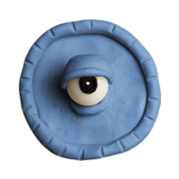 | 151551 | CLAY | Clayton |
| 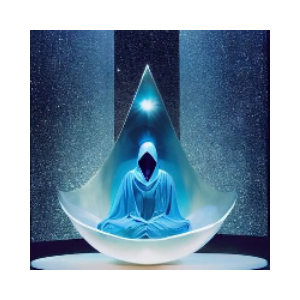 | 148385 | SHY | Shytoshi Kusama |
| 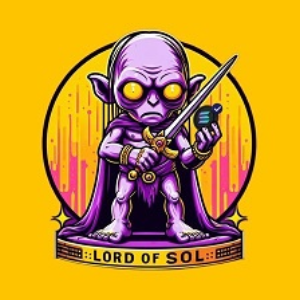 | 131009 | LOS | Lord Of SOL |
|  | 113723 | ROYALSHIBA | Royal Shiba |
|  | 86851 | TRUST | TrustVibes |
|  | 147591 | USDJ | USDJ |
| 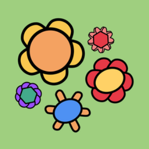 | 144501 | FLOWER | FlowerAI |
| 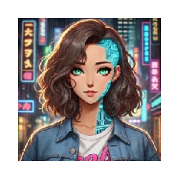 | 141353 | FLAVIA | Flavia Is Online |
|  | 141387 | NVDA | NVIDIA |
| 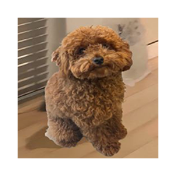 | 131677 | MACHO | macho |
| 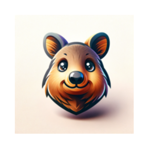 | 123999 | XQUOK | XQUOK |
| 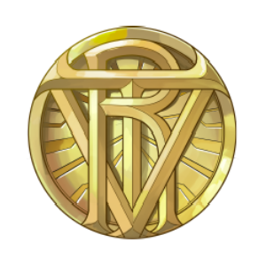 | 71291 | TRIVIA | Trivians |
|  | 65601 | BISON | BiShares |
|  | 154403 | WQOM | Wrapped QOM |
|  | 150039 | BOPB | BIOPOP |
| 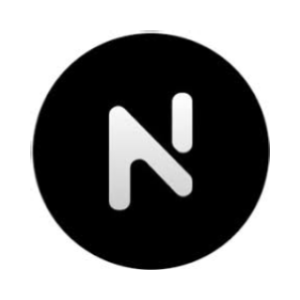 | 147073 | NEUR | neur.sh |
|  | 123271 | UBSN | Silent Notary |
|  | 78993 | LCMG | ElysiumG |
| 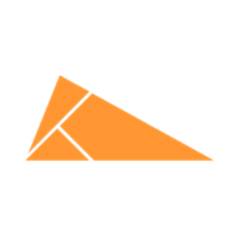 | 66309 | KSP | KlaySwap Protocol |
|  | 60061 | LBL | LABEL Foundation |
|  | 48997 | OBOT | Obortech |
| 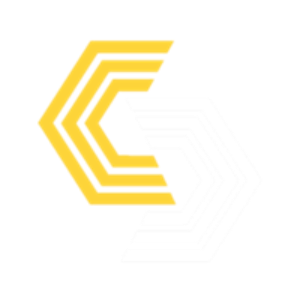 | 43132 | CTCN | Contracoin |
|  | 78483 | DINERO | Dinerobet |
| 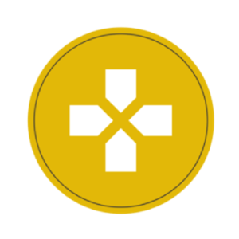 | 60873 | QUA | Quasacoin |
|  | 55933 | VIRES | Vires Finance |
|  | 50523 | SHILD | Shield Network |
|  | 141907 | SGM | SRCGAME |
| 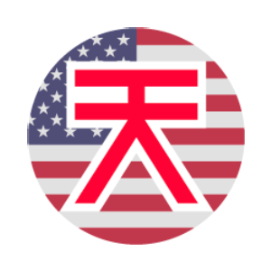 | 94293 | XSTUSD | SORA Synthetic USD |
| 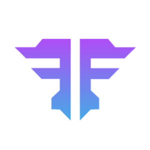 | 68959 | FRNT | Final Frontier |
|  | 50325 | HOME | Home Coin |
|  | 123429 | FROGGY | Froggy |
| 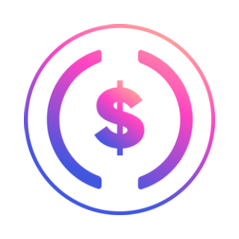 | 136475 | DEUSD | Elixir deUSD |
| 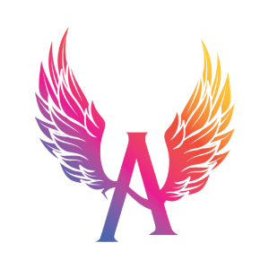 | 49103 | ALLEY | NFT Alley |
|  | 165121 | JET2 | Jet2Holidays |
|  | 162297 | P1 | PEPE ONE |
| 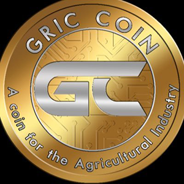 | 121949 | GC | GrabCoinClub |
|  | 94151 | ZEXI | Zexicon |
|  | 82397 | WAHED | WAHED PROJECTS LTD |
|  | 70773 | BLID | Bolide |
|  | 70845 | 7PXS | 7Pixels |
|  | 69961 | CAST | Castello Coin |
|  | 57497 | TOWN | Town Star |
| 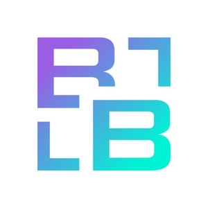 | 44038 | BBK | Bitblocks |
|  | 41469 | SCV | Super CoinView Token |
| 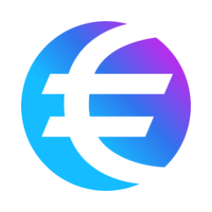 | 147609 | EURS | STASIS EURO |
| 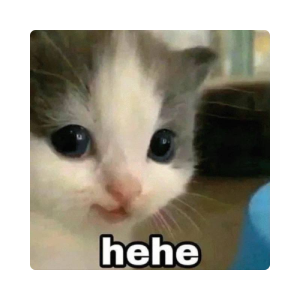 | 136363 | HEHE | hehe |
| 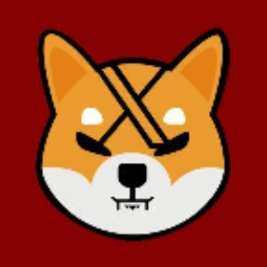 | 123935 | XSHIB | XSHIB |
| 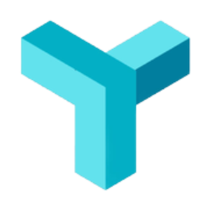 | 48291 | YCO | Y Coin |
|  | 33549 | ZEON | ZEON |
|  | 169057 | STREAMER | StreamerCoin |
|  | 158587 | KBBB | KILL BIG BEAUTIFUL BILL |
|  | 146455 | FURM | Furmula |
|  | 148279 | DTF | believe in something |
| 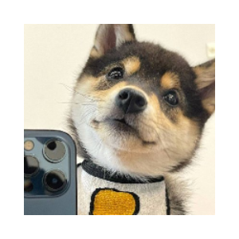 | 141313 | MANYU | littlemanyu |
| 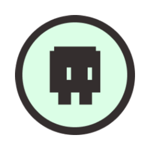 | 130329 | FP | Forgotten Playland |
| 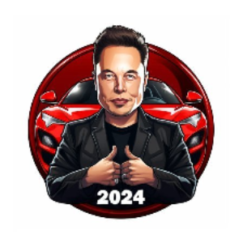 | 123415 | ELON2024 | ELON 2024(BSC) |
|  | 99751 | THUG | Thug Life |
|  | 88323 | :ZKT: | ZkTsunami |
|  | 85829 | SEAN | Starfish Finance |
| 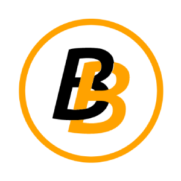 | 54309 | BTBS | BitBase Token |
|  | 52055 | SAIL | SAIL |
|  | 86807 | PZ | Paradigm Zero |
|  | 67667 | ADMONKEY | AdMonkey |
|  | 57591 | $MLNX | MELONx |
|  | 146029 | SQRB | SQRBIT |
|  | 149087 | VIOLET | Violet |
| 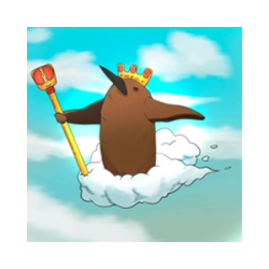 | 141319 | PESTO | Pesto the Baby King Penguin |
|  | 136415 | JHH | Jen-Hsun Huang |
| 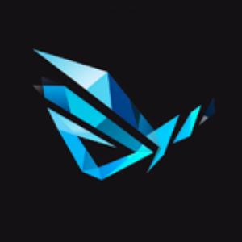 | 128927 | HOSTAI | Host AI |
| 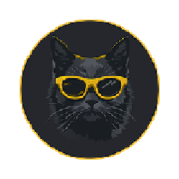 | 131609 | CATA | CATAMOTO |
| 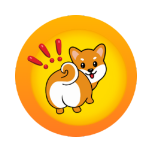 | 127489 | BYAT | Byat |
| 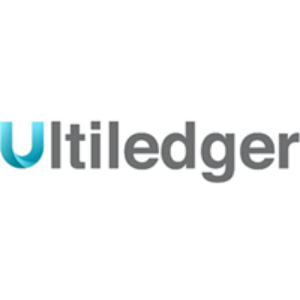 | 123473 | ULT | Shardus |
| 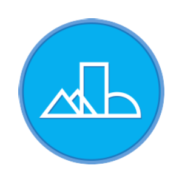 | 124185 | EZY | EzyStayz |
|  | 113699 | RADA | RADA Foundation |
|  | 102625 | TQRT | TokoQrt |
| 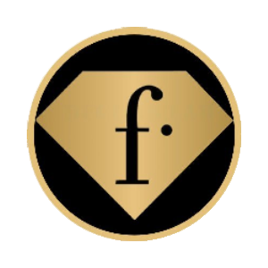 | 98523 | FTVT | FashionTV Token |
| 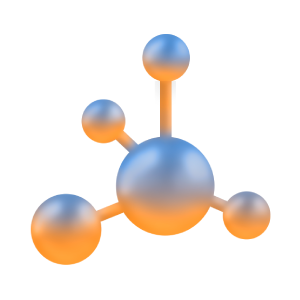 | 90015 | METANO | Metano |
| 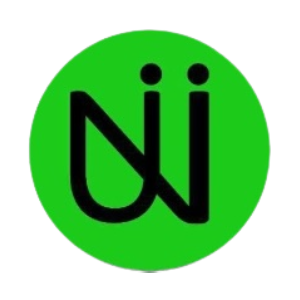 | 90681 | UNS | UNS Token |
|  | 80317 | MEH | meh |
|  | 79557 | RXT | RIMAUNANGIS |
| 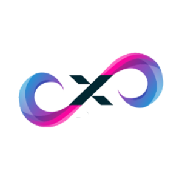 | 70531 | XSPECTAR | xSPECTAR |
| 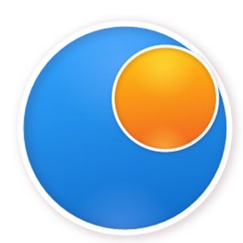 | 67633 | XXA | Ixinium |
| 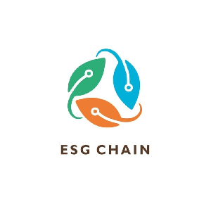 | 63123 | ESGC | ESG Chain |
|  | 60993 | NHT | Neighbourhoods |
|  | 60035 | CSPD | CasperPad |
|  | 59355 | CGU | Crypto Gaming United |
|  | 61089 | EVU | Evulus |
|  | 55385 | GZX | GreenZoneX |
|  | 54573 | YDR | YDragon |
|  | 54497 | KPHI | Kephi Gallery |
| 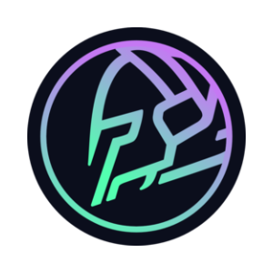 | 51689 | SPWN | Bitspawn |
| 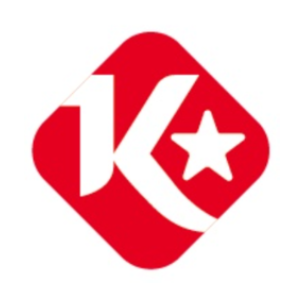 | 51111 | KPOP | KPOP Coin |
|  | 50825 | YLDY | Yieldly |
|  | 48235 | ZUPI | Zupi Coin |
|  | 47891 | LAND | LandBox |
| 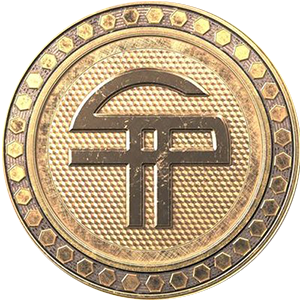 | 46027 | SATT | SaTT |
|  | 45258 | LIBFX | Libfx |
|  | 45138 | UCM | UCROWDME |
| 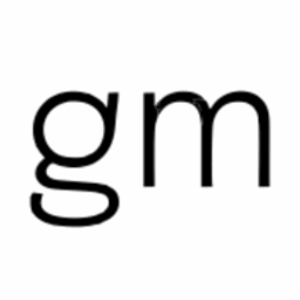 | 44578 | GM | GMcoin |
|  | 42476 | PORTE | Porte Token |
| 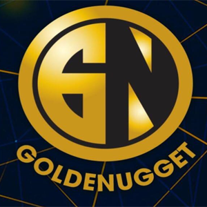 | 42683 | GNTO | GoldeNugget |
|  | 42205 | QMC | QMCoin |
| 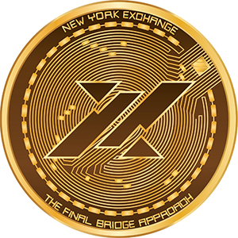 | 36609 | NYE | NewYork Exchange |
|  | 41474 | HG | Hygenercoin |
|  | 33574 | XCASH | X-CASH |
| 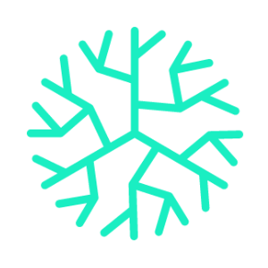 | 33800 | KAT | Kambria |
| 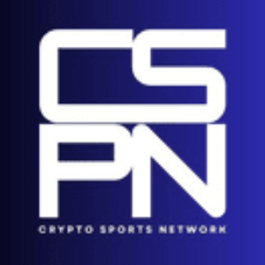 | 33398 | CSPN | Crypto Sports |
| 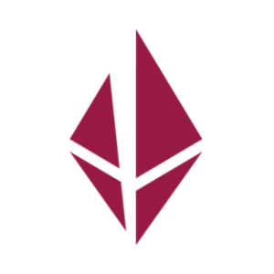 | 33408 | ETHO | Ether-1 |
| 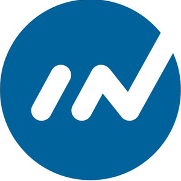 | 2635 | INN | Innova |
|  | 143103 | BABYMAGA | Baby Maga |
|  | 141233 | $RIF | Rifampicin |
|  | 94161 | VETME | VetMe |
| 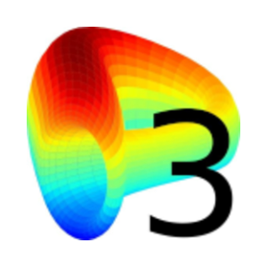 | 78463 | 3CRV | LP 3pool Curve |
|  | 51511 | ALIA | Xanalia |
|  | 165159 | MOONCAT | Mooncat |
|  | 143207 | BABYGOAT | Baby Goat |
|  | 130479 | ZILPEPE | ZilPepe |
| 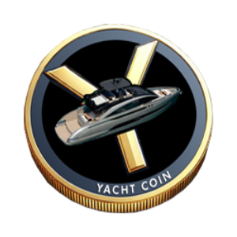 | 151237 | YTC | YachtsCoin |
|  | 158877 | ORCAI | ORCA |
|  | 131781 | MAGAPEPE | MAGA PEPE (SOL) |
|  | 115639 | DOVI | Dovi(Ordinals) |
|  | 122415 | RAKE | Rake Coin |
|  | 113347 | ELON2.0 | Dogelon Mars 2.0 |
|  | 111555 | HIPP | El Hippo |
|  | 70295 | XODEX | Xodex |
|  | 45182 | AMIS | AMIS |
|  | 130031 | DAVE | DAVE |
| 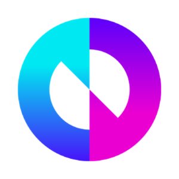 | 123465 | DFX | DFX Finance |
|  | 78065 | MILK | Milkshake Swap |
|  | 65303 | UFARM | UniFarm |
|  | 49447 | EVNY | EVNY Token |
|  | 49233 | PLUTO | PlutoPepe |
|  | 128431 | BETZ | Bet Lounge |
|  | 76871 | FJB | Freedom. Jobs. Business. |
|  | 68433 | COBAN | COBAN |
|  | 150367 | GYAT | GYAT Coin |
|  | 147153 | DICKBUTT | Dickbutt |
| 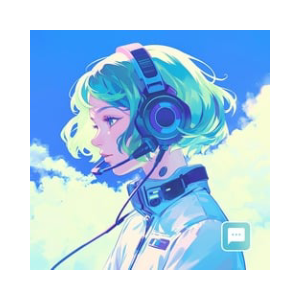 | 144667 | CONVO | Prefrontal Cortex Convo Agent by Virtuals |
|  | 113577 | TXN | TXN Club |
|  | 114107 | CEP | CEREAL |
|  | 46468 | LBC15 | Saliamonas Banaitis |
|  | 161677 | INFOFI | WAGMI HUB |
|  | 162361 | TOG | Telgather Games |
| 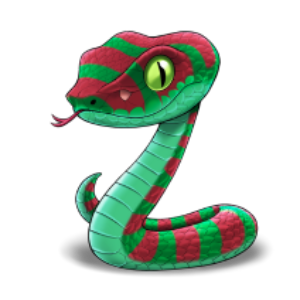 | 162263 | SNAKES | Blue Snakes |
| 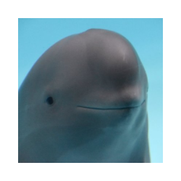 | 141657 | MIHARU | smiling dolphin |
|  | 99771 | FUMO | Alien Milady Fumo |
| 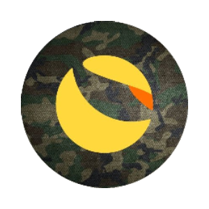 | 98005 | LUNCARMY | LUNCARMY |
| 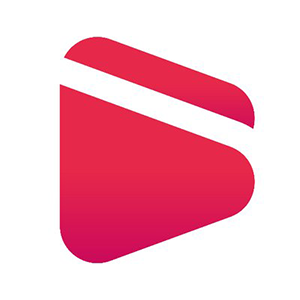 | 89767 | BEAT | MetaBeat |
|  | 86931 | $EARN | EverEarn ETH |
|  | 61399 | MJT | MojitoSwap |
|  | 32385 | NGC | NAGA |
|  | 143573 | BABY CZHAO | Baby Czhao |
|  | 143085 | CGPU | CloudGPU |
|  | 134651 | $THREE | THREE |
| 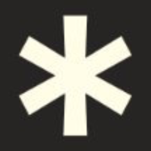 | 122143 | ASTX | Asterix Labs |
|  | 113907 | FIFI | FIFI |
| 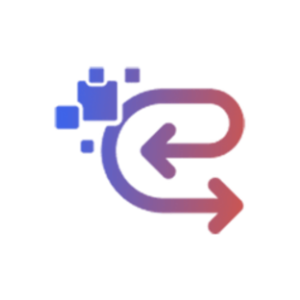 | 65893 | COREDAO | coreDAO |
|  | 142743 | TAOTOOLS | TAOTools |
| 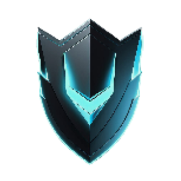 | 127943 | PALAI | PaladinAI |
|  | 85227 | BOXA | BOXA |
|  | 59731 | SIMPLI | Simpli Finance |
|  | 48987 | NRCH | EnreachDAO |
|  | 161441 | JEETS | I'm a Jeet |
|  | 158839 | LAY | Loomlay |
| 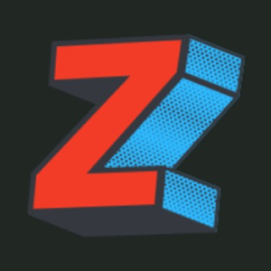 | 144581 | ZON | Zon Token |
| 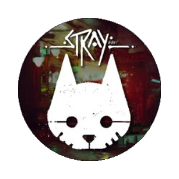 | 143083 | STRA | Sentra |
|  | 145171 | SHATS | Shitcats |
|  | 141869 | ZENQ | Zenqira |
|  | 146829 | RPLS | Ripples |
|  | 125181 | CATBOY | Catboy |
| 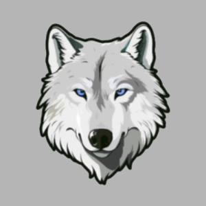 | 112551 | YAMA | YAMA Inu |
|  | 95947 | GGP | Geegoopuzzle |
|  | 102145 | SWIM | SWIM - Spread Wisdom |
|  | 95625 | FAF | Fairface |
|  | 80197 | RSFT | ROYAL SMART FUTURE TOKEN |
|  | 56107 | CMCX | CORE MultiChain |
|  | 55499 | QIQ | QoinIQ |
|  | 53949 | BSCGIRL | Binance Smart Chain Girl |
|  | 51149 | RYOSHI | Ryoshi Token |
| 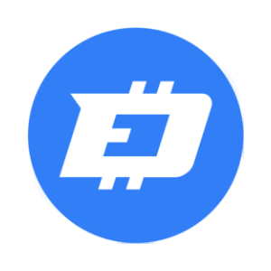 | 50171 | DEFIT | Digital Fitness |
| 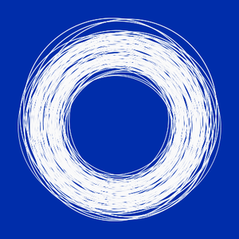 | 45995 | DUCATO | Ducato Protocol Token |
| 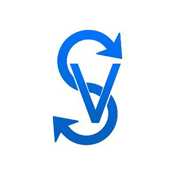 | 45224 | YFV | YFValue |
| 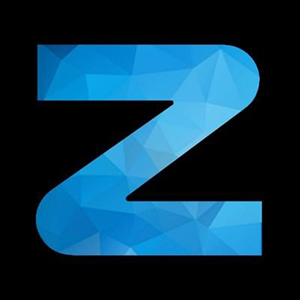 | 45382 | ZDEX | Zeedex |
| 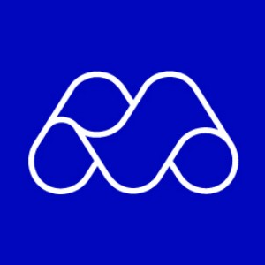 | 44874 | MNS | Monnos |
| 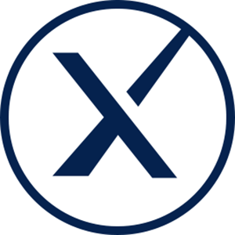 | 44506 | XANK | Xank |
|  | 41532 | TMED | MDsquare |
|  | 146363 | PELO | PepElon |
|  | 136167 | NYA | Nya |
| 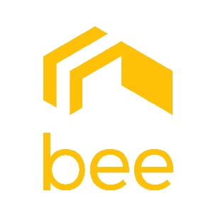 | 138369 | BEE | BNBEE |
| 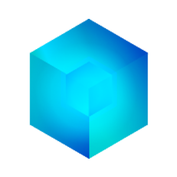 | 132573 | UNSHETH | unshETH Ether |
|  | 133019 | VOLTZ | Voltz |
|  | 131579 | LISUSD | lisUSD |
|  | 131617 | OVN | Overnight |
|  | 134485 | SLISBNB | Lista Staked BNB |
| 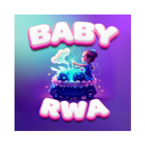 | 127749 | BABYRWA | BabyRWA |
|  | 131945 | USDT.Z | Tether USD Bridged ZED20 |
|  | 134605 | WPI | Wrapped Pi |
| 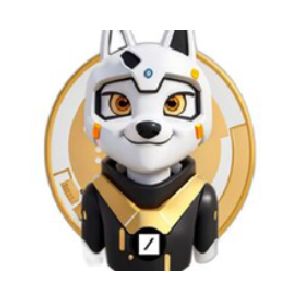 | 130313 | DOGEGROK | Doge Grok |
|  | 70265 | MEMELON | Meme Elon Doge Floki |
| 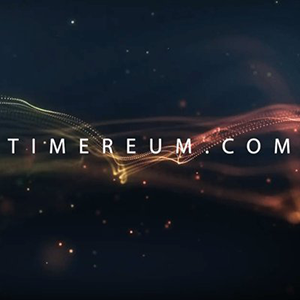 | 46767 | TME | TAMA EGG NiftyGotchi |
| 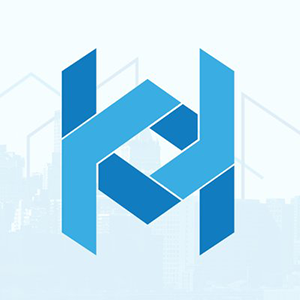 | 33705 | HBX | HashBX  |
| 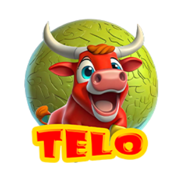 | 134401 | TELO | Telo Meme Coin |
|  | 133281 | ZILLA | DogeZilla |
|  | 112935 | XFBOT | XFather Bot |
|  | 67889 | A4 | A4 Finance |
| 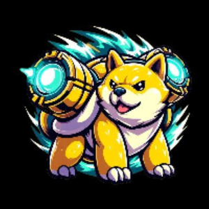 | 60953 | BINU | Bully Inu |
|  | 33412 | MMO | MMOCoin |
|  | 112613 | MORRA | Morra |
| 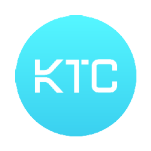 | 131711 | KTC | KTX.Finance |
|  | 68625 | STMATIC | Lido Staked Matic |
| 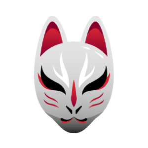 | 49231 | NEKO | Neko Network |
|  | 46622 | ETGF | ETG Finance |
|  | 151979 | KLEIN | KLEIN TOKEN |
|  | 148419 | JAIL | JailbreakMe |
|  | 144647 | WORM | Deep Worm |
| 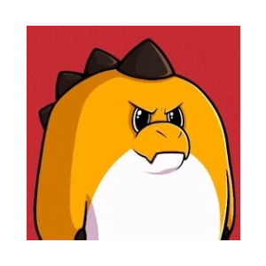 | 146487 | M3M3 | M3M3 |
| 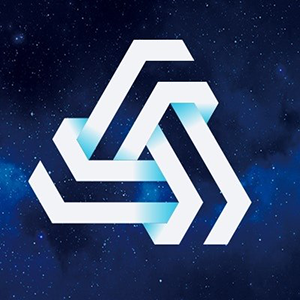 | 145047 | CB | Cheeseball |
|  | 131745 | SPEED | real fast |
|  | 131529 | ZACK | Zack Morris |
| 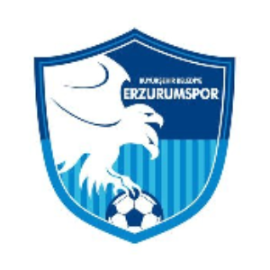 | 128725 | ERZ | Erzurumspor Token |
|  | 126823 | COINYE | Coinye West |
|  | 112299 | SCOIN | Sdrive.app |
| 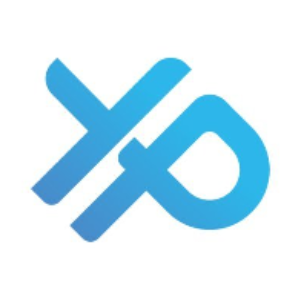 | 76775 | XNP | XNP |
| 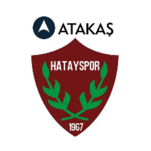 | 69429 | HATAY | Hatayspor Token |
|  | 70769 | DSK | Darüşşafaka Sports Club |
|  | 69259 | URFA | Sanliurfaspor Token |
|  | 69819 | TUZLA | Tuzlaspor Token |
| 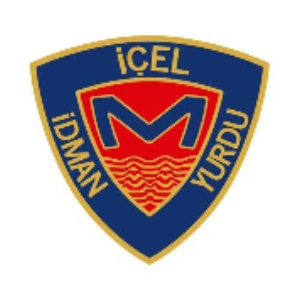 | 70585 | MIY | Icel Idman Yurdu |
| 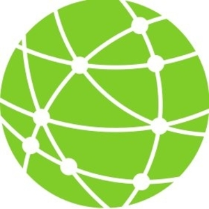 | 69297 | BLKS | Balıkesirspor Token |
| 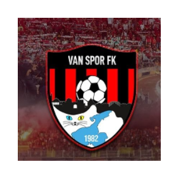 | 69181 | VAN | Vanspor Token |
|  | 70587 | DUZCE | Duzce |
|  | 69481 | YMS | Yeni Malatyaspor Token |
|  | 68661 | AKREP | Antalyaspor |
|  | 68083 | SIV | Sivasspor |
|  | 68277 | DEMIR | Adana Demirspor |
|  | 68903 | RIZE | Rizespor Token |
|  | 68857 | SKRY | Sakaryaspor |
| 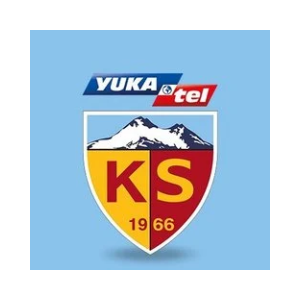 | 65875 | KYSR | Kayserispor |
|  | 65847 | DIYAR | Diyarbekirspor |
|  | 50951 | SWAPP | Swapp |
| 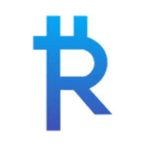 | 41696 | PROPEL | PayRue |
|  | 161999 | UPTOP | UPTOP |
|  | 162287 | EMMM | emmm |
| 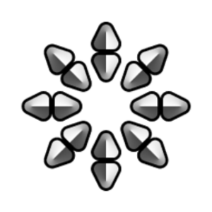 | 147121 | CLUSTR | Clustr Labs |
| 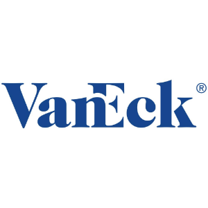 | 131381 | HODL | HODL |
|  | 131637 | CHOMP | ChompCoin |
|  | 86885 | EUROE | EUROe Stablecoin |
| 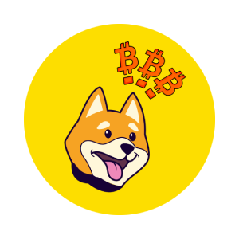 | 142111 | BBONK | BitBonk |
|  | 123539 | JBOT | JACKBOT |
|  | 55795 | WNYC | Wrapped NewYorkCoin |
|  | 47162 | VVT | VersoView |
|  | 165111 | USDUT | Unstable Tether |
| 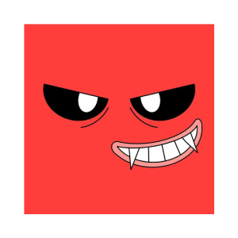 | 162915 | LUCI | LUCI |
|  | 161549 | MSM | MusmeCoin |
|  | 141259 | GOGLZ | GOGGLES |
|  | 136629 | RFL | Reflect |
|  | 127563 | WAGMI | Wagmi |
| 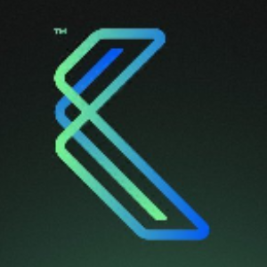 | 130361 | KPN | KonnektVPN |
|  | 85921 | TXAU | tGOLD |
|  | 70901 | DSP | Delio DSP |
|  | 68119 | LICO | Liquid Collectibles |
|  | 68309 | TAKO | Tako Token |
|  | 161713 | PLMS | Polemos |
|  | 67087 | MUS | Musashi Finance |
|  | 51023 | MOONMINER | MoonMiner |
|  | 161985 | MARIE | Marie Rose |
|  | 94257 | ROSX | Roseon |
| 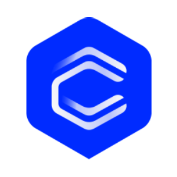 | 85817 | COR | COR Token |
|  | 65329 | MATRIX | Matrix Labs |
|  | 142715 | BABY NEIRO | BABY NEIRO |
| 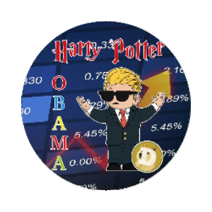 | 122731 | STONKS | HarryPotterObamaWallStreetBets10Inu |
| 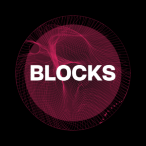 | 58051 | BLOCKS | BLOCKS |
| 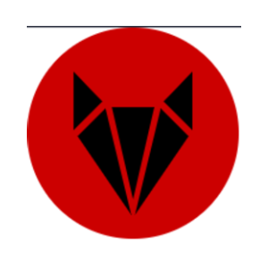 | 48853 | VFOX | VFOX |
|  | 68871 | LEP | Leprechaun Finance |
| 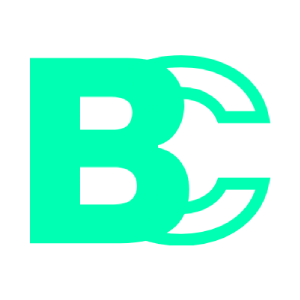 | 158517 | BUNKER | BunkerCoin |
|  | 162039 | BOATKID | Pacu Jalur |
| 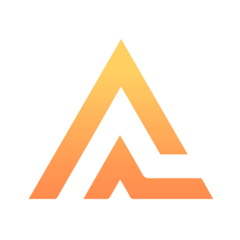 | 79843 | AU | AutoCrypto |
|  | 55271 | SSTX | Silver Stonks |
|  | 136685 | CHEF | Chefdotfun |
|  | 126117 | BABYGROKCE | BabyGrokCEO |
| 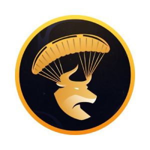 | 113985 | SYBL | Sybulls |
|  | 127577 | SUBF | Super Best Friends |
|  | 165089 | STRSZN | Stream SZN |
|  | 165373 | GVNR | GVNR |
| 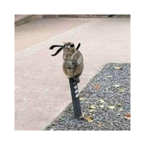 | 141483 | CATANA | Catana |
|  | 63305 | R3FI | Recharge Finance |
|  | 59511 | $WEAPON | Megaweapon |
| 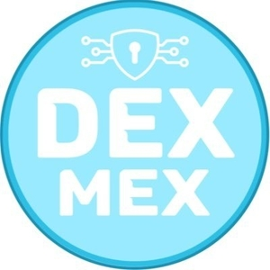 | 48329 | DEXM | Dexmex |
| 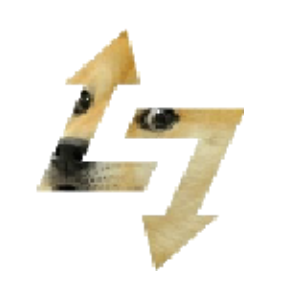 | 46293 | DOGES | Dogeswap |
|  | 3680 | ADK | Aidos Kuneen |
|  | 162295 | BSTR | BigStrategy Inc |
|  | 150361 | INCA | INCASWAP |
| 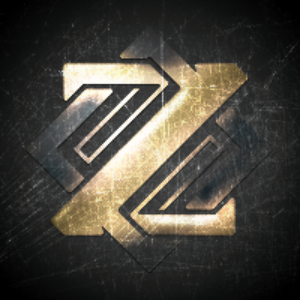 | 121751 | NETZ | MainnetZ |
|  | 68753 | SOLPAY | SolPay Finance |
| 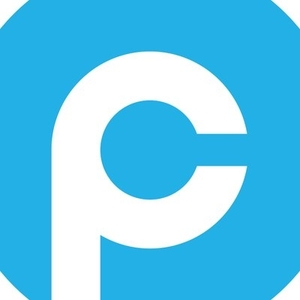 | 33166 | PLURA | PluraCoin |
|  | 64415 | FONE | Fone |
| 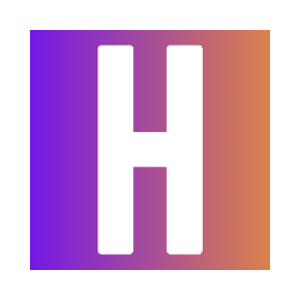 | 141995 | HUSBY | HUSBY |
|  | 48015 | SAFEMOON | SafeMoon |
|  | 113917 | FBOX | Foreverbox |
| 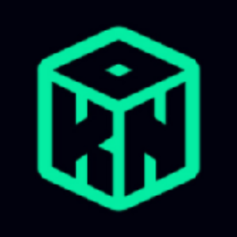 | 112337 | 0KN | 0 Knowledge Network |
|  | 165129 | XVM | VOLT |
|  | 99843 | CHAP | Chappie |
|  | 148363 | CITADAIL | Griffain New Hedge Fund |
|  | 148671 | KDAO | Kaspa DAO |
| 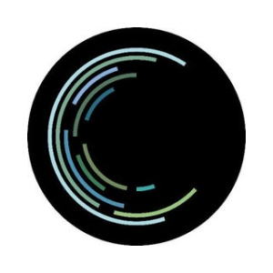 | 122673 | WEC | Whole Earth Coin |
| 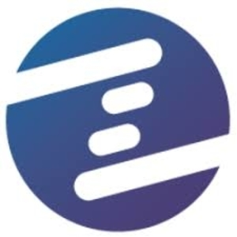 | 123243 | IZE | Galvan |
| 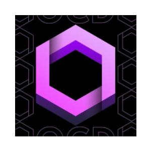 | 111635 | OCD | On-Chain Dynamics |
|  | 86979 | BMDA | Bermuda |
| 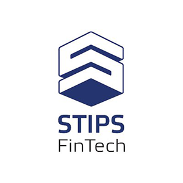 | 81515 | STIPS | STIPS |
| 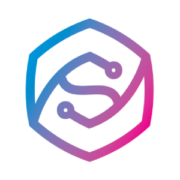 | 69885 | MISA | Sangkara |
| 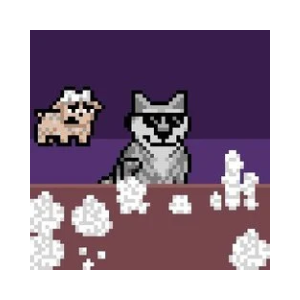 | 59157 | WOOL | Wolf Game Wool |
| 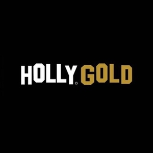 | 48227 | HGOLD | HollyGold |
| 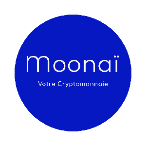 | 48331 | MOOI | Moonaï |
|  | 46325 | YFDT | Yearn Finance Diamond Token |
| 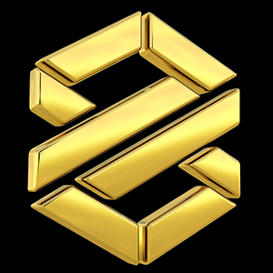 | 43117 | SNB | SynchroBitcoin |
| 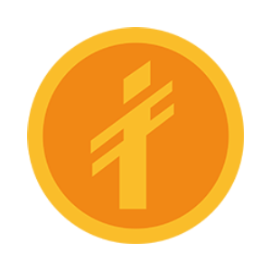 | 44730 | INTX | intexcoin |
|  | 36656 | CHI | XAYA |
|  | 33658 | VEIL | Veil |
|  | 154611 | FULLSEND | Fullsend Community Coin |
| 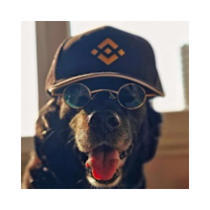 | 136413 | BINANCEDOG | Binancedog |
| 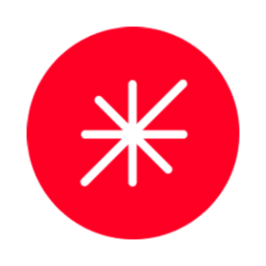 | 128333 | GAMMA | Gamma |
| 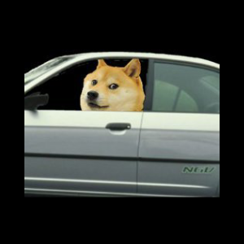 | 122221 | USEDCAR | A Gently Used 2001 Honda Civic |
|  | 68233 | FICO | Fish Crypto |
| 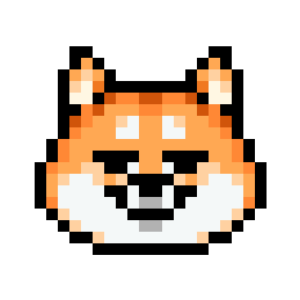 | 56843 | DOE | Dogs Of Elon |
|  | 161737 | COTS | Children Of The Sky |
| 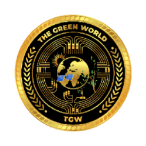 | 142335 | TGW | The Green World |
|  | 131003 | BOOMER | Boomer |
|  | 113033 | PASTA | Pastafarian |
|  | 63019 | WPC | WePiggy Coin |
|  | 33902 | GNY | GNY |
| 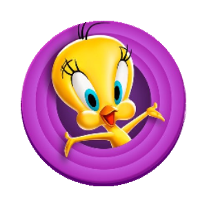 | 123237 | TWEETY | Tweety |
|  | 113537 | WOJAK 2.0 | Wojak 2.0 Coin |
|  | 165445 | PNKSTR | PunkStrategy |
|  | 151535 | HYPERSKIDS | $HYPERSKIDS |
|  | 147265 | ARNOLD | Arnold |
|  | 127269 | OCH | Orchai |
|  | 127519 | EMRLD | The Emerald Company |
|  | 124587 | DMA | Dragoma |
|  | 125517 | AIH | AIHub |
| 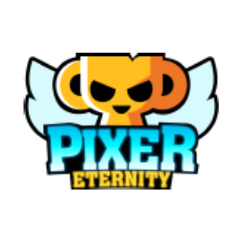 | 122071 | PXT | Pixer Eternity |
| 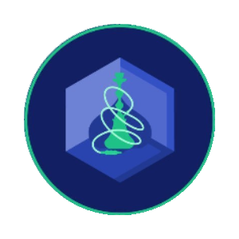 | 95569 | MSHEESHA | Sheesha Finance Polygon |
|  | 95423 | SAFLE | Safle |
| 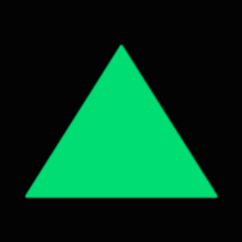 | 85073 | STFX | STFX |
|  | 68381 | CBD | Greenheart CBD |
| 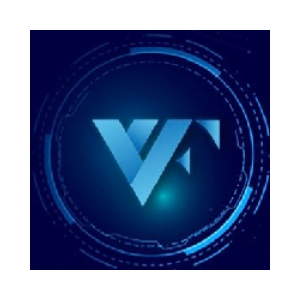 | 57031 | WFT | Windfall Token |
|  | 113285 | BIBI2.0 | BIBI2.0 |
|  | 95143 | VNLNK | Vinlink |
| 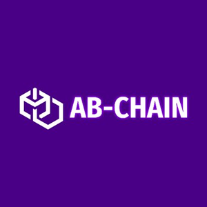 | 142887 | ABC | Angry Bulls Club |
| 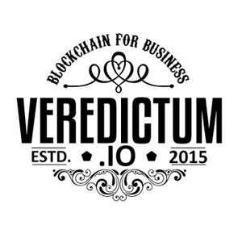 | 113511 | VRD | Viridis Network |
|  | 55849 | SOLAR | Solarmoon |
| 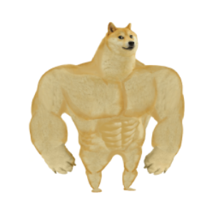 | 68769 | SWOLE | Swole Doge |
|  | 61085 | BTOP | BotopiaFinance |
| 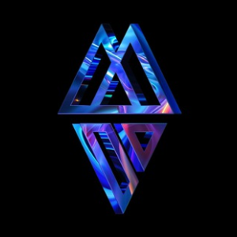 | 136759 | RUNEVM | RUNEVM |
|  | 113799 | BARB | Baby Arbitrum |
|  | 99407 | EVILPEPE | Evil Pepe |
|  | 68749 | MNTO | Minato |
| 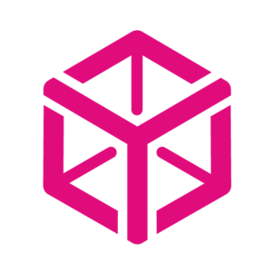 | 56665 | OJA | Ojamu |
| 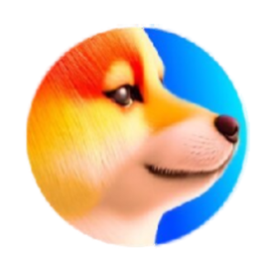 | 111987 | CRVY | Curve Inu |
| 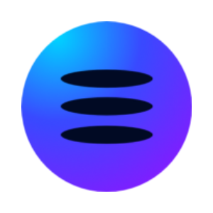 | 49227 | EQZ | Equalizer |
|  | 162369 | CSTAR | Coinstar |
| 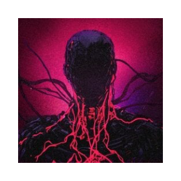 | 147117 | ACOLYT | Acolyte by Virtuals |
| 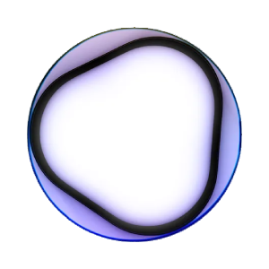 | 148197 | OSOL | OSOL |
|  | 146813 | RIPPLE | XRP589 |
|  | 141943 | AUSDT | aUSDT |
|  | 90283 | CEO | CEO |
|  | 56663 | DOGUS | Dogus |
|  | 148447 | FATHA | Slopfather |
| 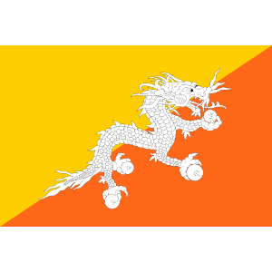 | 125393 | BTN | Bitnet |
| 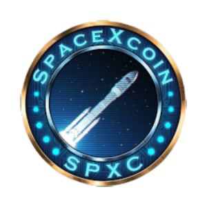 | 82419 | SPXC | SpaceXCoin |
| 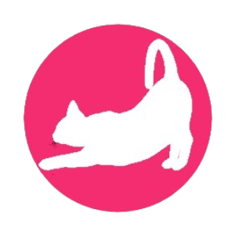 | 137495 | CATLIFE | Cat Life |
| 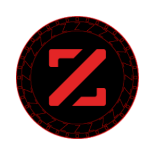 | 136023 | ZCD | ZChains |

---

[← Prev](./list6.md) | [Next →](./list8.md)
