[← Prev](./list7.md) | [Next →](./list9.md)

| Logo | ID | Symbol | Name |
|:----:|:--:|:------:|:-----|
|  | 7632 | SAC1 | Sable Coin |
| 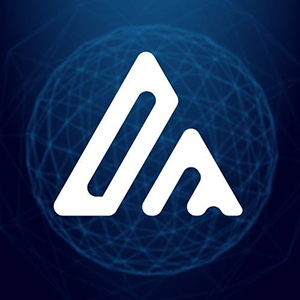 | 7633 | DMX | Digital Money |
|  | 7634 | BKS | Barkis Network |
|  | 7635 | CCXX | CounosX |
|  | 7636 | BPS | BitcoinPoS |
|  | 7637 | RAKU | RAKUN |
|  | 7638 | DMCH | DARMA Cash |
|  | 7639 | PLAAS | PLAAS FARMERS TOKEN |
|  | 7640 | NEAL | Coineal Token |
|  | 7641 | AMATEN | Amaten |
| 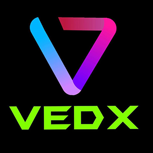 | 7642 | VEDX | VEDX TOKEN |
|  | 7643 | UFC | Union Fair Coin |
|  | 7644 | BRTR | Barter |
|  | 7645 | TOTHEMOON | To The Moon |
|  | 7646 | ETHUP | ETHUP |
|  | 7647 | ETHDOWN | ETHDOWN |
|  | 7648 | LINKDOWN | LINKDOWN |
|  | 7649 | LINKUP | LINKUP |
|  | 7650 | ADADOWN | ADADOWN |
|  | 7651 | ADAUP | ADAUP |
|  | 7652 | FXF | Finxflo |
|  | 7653 | XANK | Xank |
| 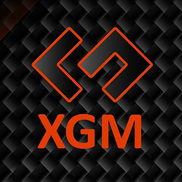 | 7654 | XGM | Defis |
|  | 7655 | 4THPILLAR | 4th Pillar Four Token |
|  | 7656 | STONK | STONK |
|  | 7657 | NEXBT | Native XBTPro Exchange Token |
|  | 7658 | DEMOS | DEMOS |
|  | 7659 | UHP | Ulgen Hash Power |
|  | 7660 | HYBN | Hey Bitcoin |
|  | 7661 | UCOT | Ubique Chain Of Things |
|  | 7662 | IMST | Imsmart |
|  | 7663 | UBU | UBU |
|  | 7664 | GEODB | GeoDB |
|  | 7665 | DDRT | DigiDinar Token |
|  | 7666 | HOMI | HOMIHELP |
|  | 7667 | TEND | Tendies |
|  | 7668 | MDU | MDUKEY |
|  | 7669 | XAMP | Antiample |
|  | 7670 | FOCV | FOCV |
|  | 7671 | INRT | INRToken |
|  | 7672 | UNITRADE | UniTrade |
|  | 7673 | LIDER | Lider Token |
|  | 7674 | FEX | FEX Token |
|  | 7675 | AOS | AOS |
|  | 7676 | AICO | AICON |
|  | 7677 | ETHP | ETHPlus |
|  | 7678 | FLS | Flits |
|  | 7679 | LID | Liquidity Dividends Protocol |
|  | 7680 | BULLC | BuySell |
|  | 7681 | RMPL | RMPL |
|  | 7682 | MGP | MangoChain |
|  | 7683 | JT | Jubi Token |
|  | 7684 | BREE | CBDAO |
|  | 7685 | CORX | CorionX |
|  | 7686 | PERX | PeerEx Network |
|  | 7688 | BNBUP | Long BNB with Up to 3x Leverage |
|  | 7689 | BNBDOWN | Short BNB with Up to 3x Leverage |
|  | 7692 | YFV | YFValue |
|  | 7693 | CAPT | Bitcoin Captain |
|  | 7694 | GHT | Global Human Trust |
|  | 7695 | MXX | Multiplier |
|  | 7696 | ETHV | Ethverse |
| 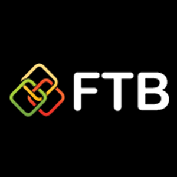 | 7697 | FTBX | Free Tool Box |
|  | 7698 | BRDG | Bridge Protocol |
|  | 7699 | BART | BarterTrade |
|  | 7700 | DZI | DeFinition |
|  | 7701 | XIOT | Xiotri |
|  | 7702 | HPX | HUPAYX |
|  | 7703 | SHB | SkyHub Coin |
| 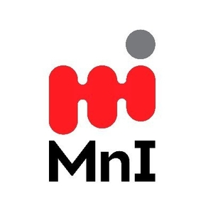 | 7704 | MANDI | Mandi Token |
|  | 7705 | RWS | Robonomics Web Services |
| 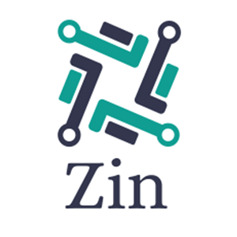 | 7706 | ZIN | Zin Finance |
|  | 7707 | ZPAE | ZelaaPayAE |
|  | 7708 | HAKKA | Hakka Finance |
| 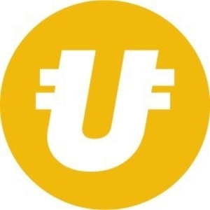 | 7709 | UNT | Uni Token |
|  | 7710 | USDF | FolgoryUSD |
|  | 7711 | STOP | SatoPay |
|  | 7712 | HEARTN | Heart Number |
|  | 7713 | DGVC | DegenVC |
|  | 7714 | PDF | Port of DeFi Network |
|  | 7715 | RUG | Rug |
|  | 7716 | CVPT | Concentrated Voting Power |
|  | 7717 | CATX | CAT.trade Protocol |
|  | 7718 | NEWTON | Newtonium |
|  | 7719 | DFIO | DeFi Omega |
| 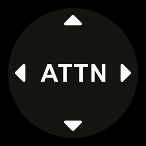 | 7721 | ATTN | ATTN |
|  | 7722 | QQQF | Standard Crypto Fund |
|  | 7723 | LIBFX | Libfx |
|  | 7724 | FME | FME |
|  | 7725 | BASED | Based Money |
|  | 7726 | YFFI | yffi finance |
|  | 7727 | SCRYPTA | Scrypta |
| 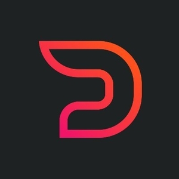 | 7728 | DISTX | DistX |
|  | 7729 | STATERA | Statera |
|  | 7730 | DEXG | Dextoken Governance |
|  | 7732 | CHAIN | Chain Games |
|  | 7733 | OIN | OIN Finance |
| 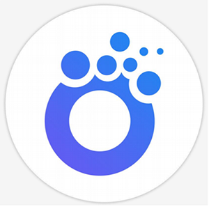 | 7734 | TOMA | TomaInfo |
|  | 7735 | SLINK | Soft Link |
|  | 7736 | UNIFI | Unifi |
|  | 7737 | DACC2 | DACC2 |
|  | 7738 | YFIVE | YFIVE FINANCE |
|  | 7739 | BAST | Bast |
|  | 7740 | YFIEXCHANGE | YFIEXCHANGE.FINANCE |
|  | 7741 | OPTC | Open Predict Token |
|  | 7742 | RELVT | Relevant |
|  | 7744 | TLN | Trustlines Network |
|  | 7745 | KARMAD | Karma DAO |
|  | 7746 | CORNFIELDFARM | CORN |
|  | 7747 | SALMON | Salmon |
|  | 7748 | QOOB | QOOBER |
|  | 7749 | MEDICO | Mediconnect |
|  | 7750 | SEEDV | Seed Venture |
|  | 7751 | LGOT | LGO Token |
|  | 7752 | BTCAS | BitcoinAsia |
|  | 7753 | SUNOLD | Sun Token |
|  | 7754 | EOSUP | EOSUP |
|  | 7755 | EOSDOWN | EOSDOWN |
|  | 7756 | TRXDOWN | TRXDOWN |
|  | 7757 | TRXUP | TRXUP |
|  | 7758 | XRPUP | XRPUP |
|  | 7759 | XRPDOWN | XRPDOWN |
|  | 7760 | DOTUP | DOTUP |
|  | 7761 | POWER | UniPower |
|  | 7762 | DOTDOWN | DOTDOWN |
|  | 7763 | UMI | Universal Money Instrument |
|  | 7764 | LTCUP | LTCUP |
|  | 7765 | LTCDOWN | LTCDOWN |
|  | 7766 | CRT | Carr.Finance |
|  | 7767 | YSAFE | yieldfarming.insure |
| 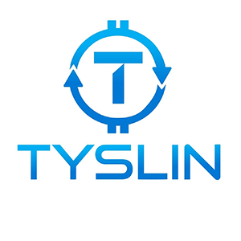 | 7768 | TYSC | Tyslin |
|  | 7769 | UNDB | unibot.cash |
|  | 7770 | YFFC | yffc.finance |
|  | 7772 | ZDEX | Zeedex |
|  | 7773 | YFARM | YFARM Token |
|  | 7774 | KATANA | Katana Finance |
|  | 7775 | ANK | AlphaLink |
|  | 7776 | CNYT | CNY Tether |
|  | 7777 | TRUMPWIN | Trump Wins Token |
|  | 7778 | TRUMPLOSE | Trump Loses Token |
|  | 7779 | HYBRID | Hybrid Bank Cash |
|  | 7780 | PFID | Pofid Dao |
|  | 7781 | CHADS | CHADS VC |
|  | 7782 | DBOX | DefiBox |
|  | 7783 | VYBE | Vybe |
|  | 7784 | TRBT | Tribute |
|  | 7785 | SUSHIBEAR | 3X Short Sushi Token |
|  | 7786 | UNISWAPBULL | 3X Long Uniswap Index Token |
|  | 7787 | XETH | Xplosive Ethereum |
|  | 7788 | ETHPY | Etherpay |
|  | 7789 | JIAOZI | Jiaozi |
| 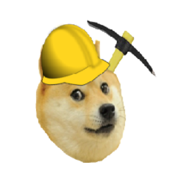 | 7790 | BONES | Moonshots Farm |
|  | 7791 | XSTAR | StarCurve |
|  | 7792 | YFFII | YFFII Finance |
|  | 7793 | WNRZ | WinPlay |
|  | 7794 | PRINT | Printer.Finance |
|  | 7795 | SUSHIBULL | 3X Long Sushi Token |
|  | 7796 | UNISWAPBEAR | 3X Short Uniswap Index Token |
|  | 7797 | ARDX | ArdCoin |
|  | 7798 | HTA | Historia |
|  | 7799 | CR8 | Crazy8Token |
|  | 7800 | CRDT | CRDT |
|  | 7801 | BCEO | bitCEO |
|  | 7802 | ON | OFIN Token |
|  | 7803 | BAK | BaconCoin |
|  | 7804 | DVS | Davies |
|  | 7805 | EVCC | Eco Value Coin |
|  | 7806 | QAC | Quasarcoin |
|  | 7807 | LOT | Lukki Operating Token |
|  | 7808 | DSCP | Dreamscape |
|  | 7809 | RC20 | RoboCalls |
|  | 7810 | SCFIV2 | Semi Centralized Finance |
|  | 7811 | DOGEC | DogeCash |
|  | 7812 | BITC | BitCash |
|  | 7813 | DIC | Daikicoin |
|  | 7814 | TOC | TouchCon |
|  | 7815 | CHVF | Chives Finance |
|  | 7816 | UCO | Uniris |
|  | 7817 | CHI | Chi Gastoken |
| 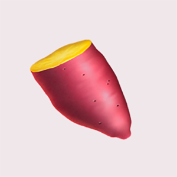 | 7818 | YAMV1 | YAM v1 |
|  | 7819 | ROT | Rotten |
|  | 7820 | YSR | Ystar |
|  | 7821 | DAB | DABANKING |
|  | 7822 | KASSIAHOME | Kassia Home |
|  | 7823 | YFF | YFF.Finance |
|  | 7824 | MEXP | MOJI Experience Points |
|  | 7825 | DTOP | DTOP Token |
|  | 7826 | GPKR | Gold Poker |
|  | 7827 | MFC | MFCoin |
| 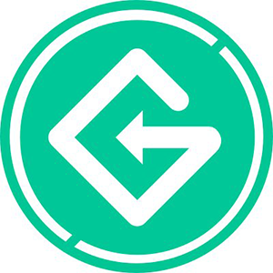 | 7828 | GETP | GET Protocol |
|  | 7829 | SPRKL | Sparkle Loyalty |
|  | 7830 | SBE | Sombe |
|  | 7831 | LMY | Lunch Money |
|  | 7832 | YFBETA | yfBeta |
|  | 7833 | DCASH | Diabolo |
|  | 7834 | PTF | PowerTrade Fuel |
|  | 7835 | AVAXIOU | Avalanche IOU |
| 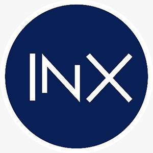 | 7836 | INXTOKEN | INX Token |
|  | 7837 | ROPELOL | Rope |
|  | 7838 | AGS | Aegis |
|  | 7839 | ISDT | ISTARDUST |
|  | 7840 | BASID | Basid Coin |
|  | 7841 | YFBT | Yearn Finance Bit |
|  | 7842 | BWF | Beowulf |
|  | 7843 | FAME | Fame |
|  | 7844 | UFFYI | Unlimited FiscusFYI |
|  | 7845 | FFYI | Fiscus FYI |
|  | 7846 | FAG | PoorFag |
|  | 7847 | NIN | Next Innovation |
| 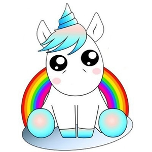 | 7848 | UNII | UNII Finance |
|  | 7849 | PJM | Pajama.Finance |
| 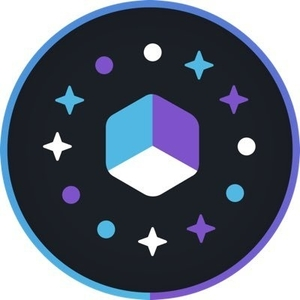 | 7850 | PGT | Polyient Games Governance Token |
|  | 7851 | XFINANCE | Xfinance |
|  | 7852 | HOTN | HotNow |
|  | 7853 | DAOVC | DAO.VC |
|  | 7854 | HLPT | HLP Token |
|  | 7855 | DICETRX | TRONbetDice |
|  | 7856 | KOMP | Kompass |
|  | 7857 | TOMOE | TomoChain ERC20 |
|  | 7858 | XSP | XSwap |
|  | 7859 | YFIII | Dify.Finance |
|  | 7861 | UNIUP | UNIUP |
|  | 7862 | ECELL | Consensus Cell Network |
|  | 7863 | UNIDOWN | UNIDOWN |
|  | 7864 | KIF | KittenFinance |
|  | 7865 | DUN | Dune |
|  | 7866 | UCA | UCA Coin |
|  | 7867 | DDR | Digi Dinar |
|  | 7868 | CUTE | Blockchain Cuties Universe |
|  | 7869 | SYBC | SYB Coin |
| 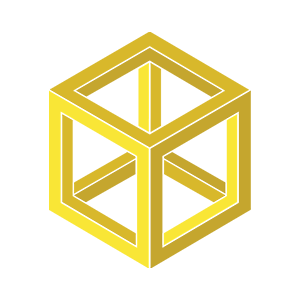 | 7870 | USG | USGold |
|  | 7871 | SEAL | Seal Finance |
|  | 7872 | BTTR | BitTiger |
|  | 7873 | OWL | OWL Token |
| 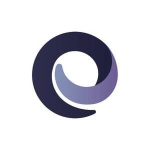 | 7874 | IMBTC | The Tokenized Bitcoin |
| 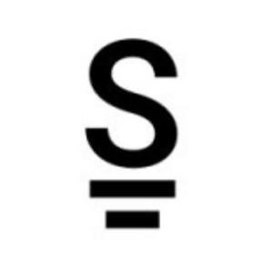 | 7875 | STBZ | Stabilize |
|  | 7877 | ZEFU | Zenfuse |
|  | 7878 | SXPUP | SXPUP |
|  | 7880 | SXPDOWN | SXPDOWN |
| 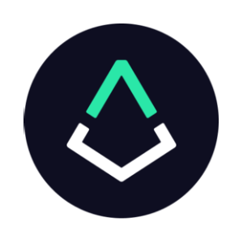 | 7881 | REPV2 | Augur |
|  | 7882 | STARP | Star Pacific Coin |
|  | 7883 | FILUP | FILUP |
|  | 7884 | FILDOWN | FILDOWN |
|  | 7887 | NICE | Nice |
|  | 7888 | UBXT | UpBots |
|  | 7889 | LCG | LCG |
|  | 7890 | SWAG | SWAG Finance |
|  | 7891 | HEDGESHIT | 1X Short Shitcoin Index Token |
|  | 7892 | HTHALF | 0.5X Long Huobi Token Token |
|  | 7893 | HTHEDGE | 1X Short Huobi Token Token |
|  | 7894 | HALFSHIT | 0.5X Long Shitcoin Index Token |
|  | 7895 | HALF | 0.5X Long Bitcoin Token |
|  | 7896 | EXCHHEDGE | 1X Short Exchange Token Index Token |
|  | 7897 | EXCHHALF | 0.5X Long Exchange Token Index Token |
|  | 7898 | ETHHEDGE | 1X Short Ethereum Token |
|  | 7899 | ETCHEDGE | 1X Short Ethereum Classic Token |
|  | 7900 | ETHHALF | 0.5X Long Ethereum Token |
|  | 7901 | EOSHEDGE | 1X Short EOS Token |
|  | 7902 | ETCHALF | 0.5X Long Ethereum Classic Token |
|  | 7903 | EOSHALF | 0.5X Long EOS Token |
|  | 7904 | DRGNHALF | 0.5X Long Dragon Index Token |
|  | 7905 | DRGNHEDGE | 1X Short Dragon Index Token |
|  | 7906 | DOGEHEDGE | 1X Short Dogecoin Token |
|  | 7907 | DOGEHALF | 0.5X Long Dogecoin Token |
|  | 7908 | DMGBULL | 3X Long DMM Governance Token |
|  | 7909 | DEFIHEDGE | 1X Short DeFi Index Token |
|  | 7910 | DMGBEAR | 3X Short DMM Governance Token |
|  | 7911 | DEFIHALF | 0.5X Long DeFi Index Token |
|  | 7912 | DEFIBULL | 3X Long DeFi Index Token |
|  | 7913 | DEFIBEAR | 3X Short DeFi Index Token |
|  | 7914 | CUSDTHEDGE | 1X Short Compound USDT Token |
|  | 7915 | CUSDTHALF | 0.5X Long Compound USDT Token |
|  | 7916 | CUSDTBULL | 3X Long Compound USDT Token |
|  | 7917 | COMPHALF | 0.5X Long Compound Token Token |
|  | 7918 | CUSDTBEAR | 3X Short Compound USDT Token |
|  | 7919 | COMPHEDGE | 1X Short Compound Token Token |
|  | 7920 | COMPBULL | 3X Long Compound Token Token |
|  | 7921 | BTMXHEDGE | 1X Short BitMax Token Token |
|  | 7922 | COMPBEAR | 3X Short Compound Token Token |
|  | 7923 | BULLSHIT | 3X Long Shitcoin Index Token |
|  | 7924 | BTMXHALF | 0.5X Long BitMax Token Token |
|  | 7925 | BSVHEDGE | 1X Short Bitcoin SV Token |
|  | 7926 | BSVHALF | 0.5X Long Bitcoin SV Token |
|  | 7927 | BNBHEDGE | 1X Short BNB Token |
|  | 7928 | BNBHALF | 0.5X Long BNB Token |
|  | 7929 | BCHHEDGE | 1X Short Bitcoin Cash Token |
|  | 7930 | BCHHALF | 0.5X Long Bitcoin Cash Token |
|  | 7931 | BALHALF | 0.5X Long Balancer Token |
|  | 7932 | BALBULL | 3X Long Balancer Token |
|  | 7933 | BALHEDGE | 1X Short Balancer Token |
|  | 7934 | BALBEAR | 3X Short Balancer Token |
|  | 7935 | ATOMHEDGE | 1X Short Cosmos Token |
|  | 7936 | ATOMHALF | 0.5X Long Cosmos Token |
|  | 7937 | ALTHEDGE | 1X Short Altcoin Index Token |
|  | 7938 | ALTHALF | 0.5X Long Altcoin Index Token |
|  | 7939 | ALGOHEDGE | 1X Short Algorand Token |
|  | 7940 | ALGOHALF | 0.5X Long Algorand Token |
|  | 7941 | ADAHALF | 0.5X Long Cardano Token |
|  | 7942 | ADAHEDGE | 1X Short Cardano Token |
|  | 7943 | SPEEDCOIN | Speed Coin |
|  | 7944 | TRYBBULL | 3X Long BiLira Token |
|  | 7945 | TRYBBEAR | 3X Short BiLira Token |
|  | 7946 | TRXHEDGE | 1X Short TRX Token |
|  | 7947 | TOMOHEDGE | 1X Short TomoChain Token |
|  | 7948 | TRXHALF | 0.5X Long TRX Token |
|  | 7949 | TOMOHALF | 0.5X Long TomoChain Token |
|  | 7950 | TRYBHALF | 0.5X Long BiLira Token |
|  | 7951 | THETAHEDGE | 1X Short Theta Network Token |
|  | 7952 | SXPHEDGE | 1X Short Swipe Token |
|  | 7953 | VETBEAR | 3X Short VeChain Token |
|  | 7954 | TRYBHEDGE | 1X Short BiLira Token |
|  | 7955 | SXPHALF | 0.5X Long Swipe Token |
|  | 7956 | USDTHALF | 0.5X Long Tether Token |
|  | 7957 | SXPBULL | 3X Long Swipe Token |
|  | 7958 | SXPBEAR | 3X Short Swipe Token |
|  | 7959 | PRIVHEDGE | 1X Short Privacy Index Token |
|  | 7960 | OKBHEDGE | 1X Short OKB Token |
|  | 7961 | PRIVHALF | 0.5X Long Privacy Index Token |
|  | 7962 | PAXGHEDGE | 1X Short PAX Gold Token |
|  | 7963 | OKBHALF | 0.5X Long OKB Token |
|  | 7964 | MKRBEAR | 3X Short Maker Token |
|  | 7965 | MKRBULL | 3X Long Maker Token |
|  | 7966 | MIDHEDGE | 1X Short Midcap Index Token |
|  | 7967 | MIDHALF | 0.5X Long Midcap Index Token |
|  | 7968 | MATICHEDGE | 1X Short Matic Token |
|  | 7969 | MATICHALF | 0.5X Long Matic Token |
|  | 7970 | LTCHEDGE | 1X Short Litecoin Token |
|  | 7971 | LTCHALF | 0.5X Long Litecoin Token |
|  | 7972 | LINKHEDGE | 1X Short Chainlink Token |
|  | 7973 | LINKHALF | 0.5X Long Chainlink Token |
|  | 7974 | LEOHALF | 0.5X Long LEO Token |
|  | 7975 | LEOHEDGE | 1X Short LEO Token |
|  | 7976 | KNCHEDGE | 1X Short Kyber Network Token |
|  | 7977 | KNCHALF | 0.5X Long Kyber Network Token |
|  | 7978 | HEARTBOUT | HeartBout Pay |
|  | 7979 | CAMP | Camp |
|  | 7980 | DIGITAL | Digital Reserve Currency |
|  | 7981 | WINR | JustBet |
|  | 7984 | XRPHEDGE | 1X Short XRP Token |
|  | 7985 | XRPHALF | 0.5X Long XRP Token |
|  | 7986 | XAUTHEDGE | 1X Short Tether Gold Token |
|  | 7987 | XAUTHALF | 0.5X Long Tether Gold Token |
|  | 7988 | XAUTBULL | 3X Long Tether Gold Token |
|  | 7989 | XAUTBEAR | 3X Short Tether Gold Token |
|  | 7990 | VETBULL | 3X Long VeChain Token |
|  | 7991 | PRIA | PRIA |
|  | 7992 | VETHEDGE | 1X Short VeChain Token |
|  | 7993 | DAM | Datamine |
|  | 7994 | AKN | Akoin |
|  | 7995 | RUC | Rush |
|  | 7996 | AXIAV3 | Axia |
|  | 7997 | WON | WeBlock |
| 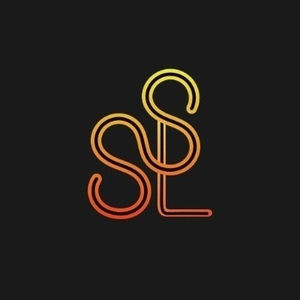 | 7998 | SSL | Sergey Save Link |
|  | 7999 | STPL | Stream Protocol |
|  | 8000 | IBP | Innovation Blockchain Payment |
|  | 8001 | CCOMP | cCOMP |
|  | 8002 | AG8 | ATROMG8 |
| 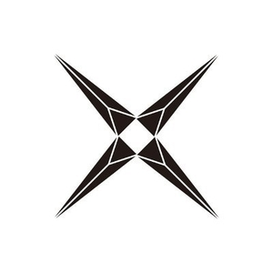 | 8003 | COFIX | CoFIX |
|  | 8004 | BCHUP | BCHUP |
|  | 8005 | BCHDOWN | BCHDOWN |
|  | 8006 | DUCATO | Ducato Protocol Token |
| 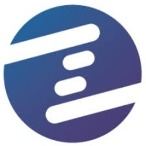 | 8007 | IZE | IZE |
|  | 8008 | ECU | ECOSC |
|  | 8009 | CNTR | Centaur |
| 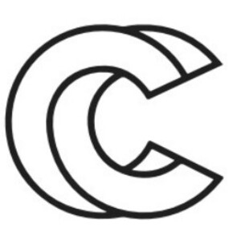 | 8010 | CIPHC | Cipher Core Token |
|  | 8011 | BHAO | Bithao |
|  | 8012 | SURF | Surf.Finance |
|  | 8013 | N0031 | nYFI |
|  | 8014 | PTERIA | Pteria |
|  | 8015 | SUP8EME | SUP8EME Token |
|  | 8016 | KP4R | Keep4r |
|  | 8017 | AUSCM | Auric Network |
|  | 8018 | HD | HubDao |
|  | 8019 | MOONDAY | Moonday Finance |
|  | 8020 | XFYI | XCredit |
|  | 8021 | ELAD | ELAD Network |
|  | 8022 | ENOKIFIN | Enoki Finance |
|  | 8023 | XAT | ShareAt |
|  | 8024 | BOOB | BooBank |
|  | 8025 | GBK | Goldblock |
|  | 8026 | XDOT | DotBased |
|  | 8027 | YYFI | YYFI.Protocol |
|  | 8028 | DFGL | DeFi Gold |
|  | 8029 | NVA | Neeva Defi |
|  | 8030 | BLOODY | Bloody Token |
|  | 8031 | LEX | Elxis |
|  | 8032 | SYNLEV | SynLev |
| 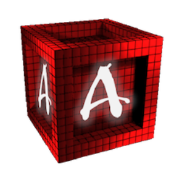 | 8033 | ASP | Aspire |
|  | 8034 | YSEC | Yearn Secure |
|  | 8035 | SMPL | SMPL Foundation |
|  | 8036 | DOGDEFI | DogDeFiCoin |
|  | 8037 | SPKL | SpokLottery |
|  | 8038 | SMARTCREDIT | SmartCredit Token |
|  | 8039 | JEM | Jem |
| 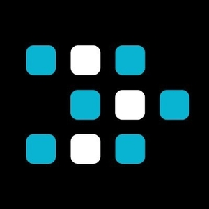 | 8040 | TESSLA | Tessla Coin |
|  | 8041 | WCCX | Wrapped Conceal |
|  | 8042 | NAMI | Tsunami finance |
|  | 8043 | FNX | FinNexus |
|  | 8044 | USDTHEDGE | 1X Short Tether Token |
|  | 8045 | UTU | UTU Protocol |
|  | 8046 | BITF | Bit Financial |
|  | 8049 | TSLA | Tesla FTX |
|  | 8050 | I9C | i9 Coin |
|  | 8051 | XCF | Cenfura Token |
|  | 8052 | BILI | Bilibili Inc FTX |
|  | 8054 | GOOGL | Alphabet FTX |
|  | 8055 | NFLX | Netflix FTX |
|  | 8056 | FBFTX | Facebook FTX |
|  | 8057 | AMZN | Amazon FTX |
|  | 8058 | BIONT | BioNTech FTX |
|  | 8059 | PFE | Pfizer FTX |
|  | 8060 | SAV3 | SAV3 |
|  | 8061 | BYND | Beyond Meat Inc FTX |
|  | 8062 | BABA | Alibaba FTX |
| 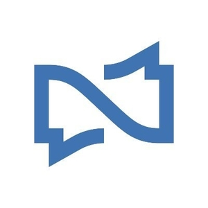 | 8063 | WIS | Experty Wisdom Token |
|  | 8064 | GASPCOIN | gAsp |
|  | 8065 | IDEFI | Inverse DeFi Index |
| 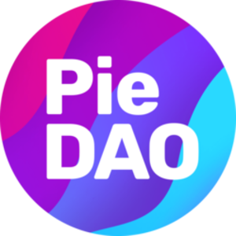 | 8066 | DOUGH | PieDAO v2 (DOUGH) |
| 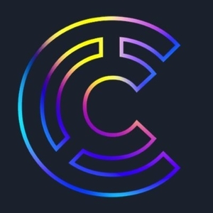 | 8067 | BIND | Compendia |
| 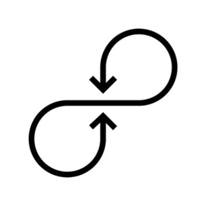 | 8068 | OROP | ORO |
|  | 8069 | WBIND | Wrapped BIND |
|  | 8070 | KFC | Chicken |
| 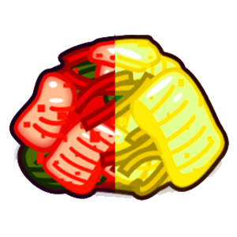 | 8071 | KIMCHI | KIMCHI.finance |
|  | 8072 | SUPERTX | SuperTX |
|  | 8073 | MTR | Meter Stable |
|  | 8074 | MPH | Morpher |
| 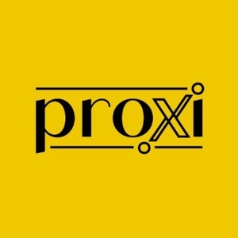 | 8075 | PROXI | PROXI |
| 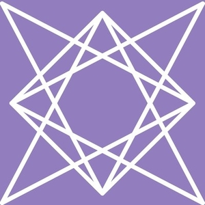 | 8076 | XRIBA | Xriba |
|  | 8077 | ETHY | Ethereum Yield |
|  | 8078 | BNF | BonFi |
| 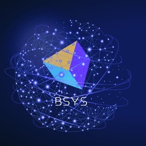 | 8079 | BSYS | BSYS |
|  | 8080 | MTTCOIN | Money of Tommorow, Today |
| 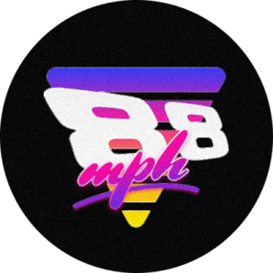 | 8081 | 88MPH | 88mph |
|  | 8082 | MW | MasterWin Coin |
| 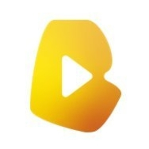 | 8083 | BMP | Brother Music Platform |
|  | 8084 | HSS | Hashshare |
|  | 8085 | YFPRO | YFPRO Finance |
|  | 8086 | CCE | CloudCoin |
|  | 8087 | GBCR | Gold BCR |
|  | 8088 | RPZX | Rapidz |
|  | 8089 | ZLOT | zLOT Finance |
| 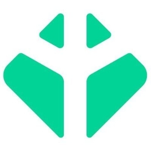 | 8090 | TESTA | Testa |
|  | 8091 | NVZN | INVIZION |
|  | 8092 | BITWORLD | Bit World Token |
|  | 8093 | FR | Freedom Reserve |
|  | 8094 | WUST | Wrapped UST Token |
|  | 8095 | AAPL | Apple FTX |
|  | 8096 | BFI | BitDefi |
| 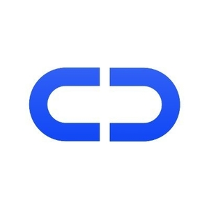 | 8097 | INDA | Inda |
| 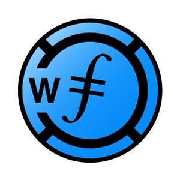 | 8098 | WFIL | Wrapped FIlecoin |
| 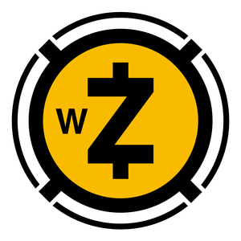 | 8099 | WZEC | Wrapped Zcash |
| 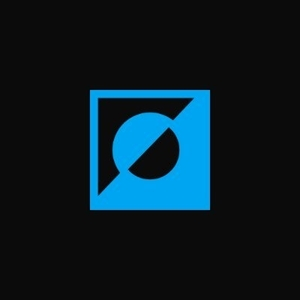 | 8100 | RFI | reflect.finance |
| 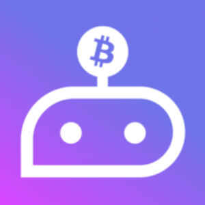 | 8101 | GPT | QnA3.AI |
| 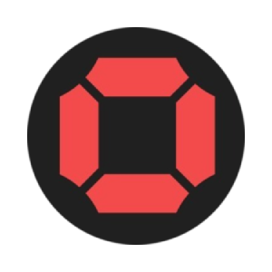 | 8102 | BONDED | Bonded Finance |
|  | 8103 | DEFLCT | Deflect |
| 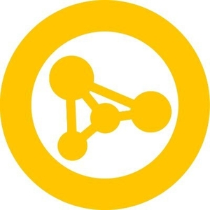 | 8104 | CRYPTOE | Cryptoenter LION token |
| 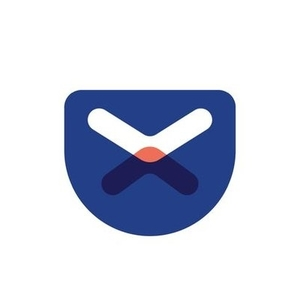 | 8106 | POCKET | XPocket |
|  | 8107 | GZIL | governance ZIL |
|  | 8108 | NFXC | NFX Coin |
|  | 8109 | KVNT | KVANT |
|  | 8110 | 2BASED | 2Based Finance |
|  | 8111 | COINDEFI | Coin |
|  | 8112 | BVND | Binance VND |
|  | 8113 | UNN | UNION Protocol Governance Token |
|  | 8114 | R34P | R34P |
|  | 8115 | $ANRX | AnRKey X |
|  | 8116 | YVS | YVS.Finance |
| 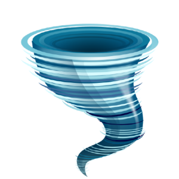 | 8117 | TCORE | TornadoCORE |
|  | 8118 | DXF | Dexfin |
| 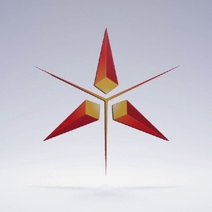 | 8119 | XETH-G | xETH-G |
|  | 8120 | PYRK | Pyrk |
|  | 8121 | TBB | Trade Butler Bot |
|  | 8122 | DYP | Dypius |
|  | 8123 | WCELO | Wrapped Celo |
|  | 8124 | WCUSD | Wrapped Celo Dollar |
|  | 8125 | SPDR | SpiderDAO |
|  | 8126 | KCH | Keep Calm and Hodl |
| 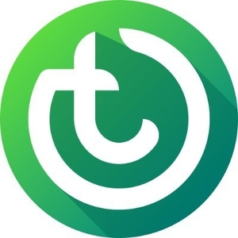 | 8127 | TLO | Talleo |
|  | 8128 | PYLON | Pylon Finance |
|  | 8129 | DSD | Dynamic Set Dollar |
|  | 8130 | WIFICOIN | Wifi Coin |
|  | 8131 | ONS | One Share |
|  | 8132 | COVEROLD | Cover Protocol (old) |
|  | 8133 | DGCL | DigiCol Token |
|  | 8134 | PIS | Polkainsure Finance |
|  | 8135 | MCP | My Crypto Play |
|  | 8136 | BAO | Bao Finance |
|  | 8137 | TSD | True Seigniorage Dollar |
|  | 8138 | CKEK | CryptoKek |
|  | 8139 | SAS | Stand Share |
|  | 8140 | KOBE | Shabu Shabu |
|  | 8141 | ZAI | Zero Collateral Dai |
| 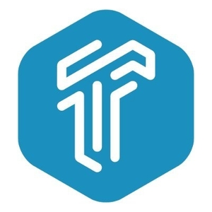 | 8142 | TIFT | True Investment Finance |
|  | 8143 | DNS | BitDNS |
|  | 8144 | SBDO | bDollar Share |
|  | 8145 | WHITE | Whiteheart |
|  | 8146 | DFSOCIAL | DefiSocial |
|  | 8147 | IGI | Igi |
|  | 8148 | MERIDIAN | Meridian Network LOCK |
|  | 8149 | RCOIN | ArCoin |
|  | 8150 | DVC | DragonVein |
|  | 8151 | GUSDT | Global Utility Smart Digital Token |
|  | 8152 | FORTUNE | Fortune |
|  | 8153 | XDEF2 | Xdef Finance |
|  | 8154 | IBETH | Interest Bearing ETH |
|  | 8155 | BRI | Baroin |
|  | 8157 | DAIQ | Daiquilibrium |
|  | 8158 | EAURIC | Eauric |
|  | 8159 | VKF | VKF Platform |
|  | 8160 | YETU | Yetucoin |
|  | 8161 | TERN.ETH | Ternio ERC20 |
|  | 8162 | DOOM | 10X Short Bitcoin Token |
|  | 8163 | BNBDOOM | 10X Short BNB Token |
|  | 8164 | BCHDOOM | 10X Short Bitcoin Cash Token |
|  | 8165 | ETHDOOM | 10X Short Ethereum Token |
|  | 8166 | LTCDOOM | 10X Short Litecoin Token |
|  | 8167 | OKBDOOM | 10X Short OKB Token |
|  | 8168 | QARK | QANplatform |
|  | 8170 | HGOLD | HollyGold |
|  | 8171 | DSTR | Dynamic Supply Tracker |
|  | 8172 | XLMDOWN | XLMDOWN |
|  | 8173 | XLMUP | XLMUP |
|  | 8174 | SUSHIDOWN | SUSHIDOWN |
|  | 8175 | SUSHIUP | SUSHIUP |
|  | 8176 | AAVEDOWN | AAVEDOWN |
|  | 8177 | AAVEUP | AAVEUP |
|  | 8178 | XLMBULL | 3X Long Stellar Token |
|  | 8179 | THETAHALF | 0.5X Long Theta Network Token |
|  | 8180 | XLMBEAR | 3X Short Stellar Token |
|  | 8181 | KCAL | Phantasma Energy |
|  | 8182 | BAGS | Basis Gold Share |
|  | 8183 | PUSD | PegsUSD |
|  | 8184 | GERA | Gera Coin |
|  | 8185 | HELMET | Helmet Insure |
|  | 8186 | YFTE | YFTether |
|  | 8187 | ARTH | ARTH |
|  | 8188 | SBS | StaysBASE |
|  | 8189 | YOP | Yield Optimization Platform & Protocol |
|  | 8190 | ROYA | Royale |
|  | 8191 | RIGEL | Rigel Finance |
|  | 8192 | PEGS | PegShares |
|  | 8193 | NDX | Indexed Finance |
|  | 8194 | CSX | Coinstox |
|  | 8196 | DLPD | DLP Duck Token |
|  | 8197 | DEFI5 | DEFI Top 5 Tokens Index |
|  | 8198 | YFO | YFIONE |
|  | 8199 | USDFL | USDFreeLiquidity |
|  | 8200 | CURRY | CurrySwap |
|  | 8201 | FL | Freeliquid |
|  | 8202 | NTB | TokenAsset |
|  | 8203 | INSUREDFIN | Insured Finance |
|  | 8204 | BSGS | Basis Gold Share |
|  | 8205 | NIF | Unifty |
|  | 8206 | ENERGYLEDGER | Energy Ledger |
|  | 8207 | PHOON | Typhoon Cash |
|  | 8208 | CVR | Polkacover |
|  | 8209 | CAVO | Excavo Finance |
|  | 8210 | UNDG | UniDexGas |
|  | 8211 | CC10 | Cryptocurrency Top 10 Tokens Index |
|  | 8212 | ARNXM | Armor NXM |
|  | 8213 | SNOW | Snowswap |
|  | 8214 | DUELERS | Block Duelers |
|  | 8215 | BTNYX | BitOnyx Token |
|  | 8216 | FEY | Feyorra |
|  | 8217 | HH | Holyheld |
|  | 8218 | DBUND | DarkBundles |
|  | 8219 | R3FI | r3fi.finance |
|  | 8220 | DOGEYIELD | DogeYield |
|  | 8221 | NAYUTA | Nayuta Coin |
|  | 8222 | TROP | Interop |
|  | 8223 | POC | POC Blockchain |
|  | 8224 | NAWA | Narwhale.finance |
|  | 8227 | EOX | EXTRA ORDINARY |
|  | 8228 | QFI | QFinance |
|  | 8229 | YPIE | PieDAO Yearn Ecosystem Pie |
|  | 8230 | YFDAI | YfDAI.finance |
|  | 8231 | BIXB | BIXBCOIN |
|  | 8232 | TKMN | Tokemon |
|  | 8233 | U8D | Universal Dollar |
|  | 8234 | PGU | Polyient Games Unity |
|  | 8235 | WSCRT | Secret ERC20 |
|  | 8237 | FAMILY | The Bitcoin Family |
|  | 8238 | KHM | Kohima |
|  | 8239 | GASG | Gasgains |
|  | 8240 | LDFI | LenDeFi Token |
|  | 8241 | KBTC | Klondike BTC |
|  | 8242 | KLON | Klondike Finance |
|  | 8243 | KBOND | Klondike Bond |
|  | 8244 | IMPULSE | IMPULSE by FDR |
|  | 8245 | MYID | My Identity Coin |
|  | 8246 | VBX | VIBEXXX |
|  | 8247 | SGOLD | SpaceGold |
|  | 8248 | TMCN | TimeCoinProtocol |
|  | 8249 | XLAB | Xceltoken Plus |
|  | 8250 | ALH | AlloHash |
|  | 8251 | BNIX | BNIX Token |
|  | 8253 | BXF | BlackFort Token |
|  | 8254 | EASYF | EasyFeedback |
|  | 8255 | IPDN | IPDnetwork |
|  | 8256 | AYTO | Anyon Token |
|  | 8257 | DCX | DeCEX |
|  | 8258 | KWIK | KwikSwap |
|  | 8259 | CLIQ | DefiCliq |
|  | 8260 | TRS | TORUS Token |
|  | 8262 | CARR | Carnomaly |
|  | 8263 | AXNT | Axentro |
|  | 8264 | IRONBSC | Iron BSC |
|  | 8265 | COINSL | CoinsLoot |
|  | 8266 | MDH | Telemedicoin |
|  | 8267 | VAIOT | VAIOT |
|  | 8268 | JUN | Jun "M" Coin |
|  | 8269 | CIVIT | Civitas Protocol |
|  | 8270 | WORLD | World Token |
|  | 8271 | TRDL | Strudel Finance |
|  | 8272 | GOGO | GOGO Finance |
|  | 8273 | REST | Restore |
|  | 8274 | CARROTSWAP | CarrotSwap |
|  | 8275 | BBND | BeatBind Token |
|  | 8276 | SWPRL | Swaprol |
|  | 8277 | DVG | DAOventures |
|  | 8278 | CGTV1 | Curio Governance |
|  | 8279 | BFLY | Butterfly Protocol |
|  | 8281 | PMEER | Qitmeer |
|  | 8282 | FARMING | Farming Bad |
|  | 8284 | RGP | Rigel Protocol |
|  | 8285 | ATHER | Ather |
|  | 8286 | MP3 | MP3 |
|  | 8287 | DEFLA | Defla |
|  | 8289 | ALIAS | Alias |
|  | 8290 | SVX | Savix |
|  | 8291 | XGT | Xion Finance |
|  | 8292 | HFI | Holder Finance |
|  | 8293 | WP | White Pigeon |
|  | 8294 | TFT | The Famous Token |
|  | 8295 | CTASK | CryptoTask |
|  | 8296 | RPT | Rug Proof |
|  | 8297 | NFTXHI | NFTX Hashmasks Index |
|  | 8298 | KTT | K-Tune |
|  | 8299 | OUR | Our Pay |
|  | 8300 | SOAK | Soak Token |
|  | 8301 | FAIRUM | Fairum |
|  | 8302 | RISEP | Rise Protocol |
|  | 8303 | UNISTAKE | Unistake |
|  | 8304 | TANK | ThinkTank |
|  | 8305 | FDR | French Digital Reserve |
|  | 8306 | SGT | SharedStake Governance Token |
|  | 8307 | BDAY | Birthday Cake |
|  | 8308 | B20 | B20 |
|  | 8309 | BRY | Berry Data |
|  | 8310 | BREW | CafeSwap Token |
|  | 8311 | PRVS | Previse |
|  | 8312 | MFI | Marginswap |
|  | 8313 | DDS | DDS.Store |
|  | 8314 | DEXM | Dexmex |
|  | 8315 | FYZNFT | Fyooz NFT |
|  | 8316 | PBASE | Polkabase |
|  | 8317 | SKLAY | sKLAY |
|  | 8318 | SINE | Sinelock |
|  | 8319 | LHB | Lendhub |
|  | 8320 | STAKEDETH | StakeHound Staked Ether |
|  | 8321 | QISWAP | QiSwap |
|  | 8322 | BITT | BiTToken |
|  | 8323 | SLNV2 | SLNV2 |
|  | 8324 | ELCASH | Electric Cash |
|  | 8325 | HBO | Hash Bridge Oracle |
|  | 8326 | DOKI | Doki Doki Finance |
|  | 8327 | SEEN | SEEN |
|  | 8328 | AZUKI | Azuki |
|  | 8329 | NUA | Neulaut Token |
|  | 8330 | NAMEC | Name Change Token |
|  | 8331 | VIKING | Viking Swap |
|  | 8332 | SOTA | SOTA Finance |
|  | 8333 | WAULT | Wault Finance |
|  | 8334 | ALOHA | Aloha |
|  | 8335 | BSP | BallSwap |
|  | 8337 | XTK | xToken |
|  | 8338 | HPETH | Heco-Peg ETH Token (Heco chain bridge) |
|  | 8339 | PPBLZ | Pepemon Pepeballs |
|  | 8340 | NDR | Node Runners |
|  | 8341 | CHONK | Chonk |
|  | 8342 | WOA | Wrapped Origin Axie |
|  | 8343 | WAIF | Waifu Token |
|  | 8344 | UNIQUE | Unique One |
|  | 8345 | MBONK | megaBonk |
|  | 8346 | WVG0 | Wrapped Virgin Gen-0 CryptoKittties |
|  | 8347 | COKE | Cocaine Cowboy Shards |
|  | 8348 | DYT | DoYourTip |
|  | 8349 | RSIN | Roketsin |
|  | 8350 | RECOM | Recom |
|  | 8351 | BMXX | Multiplier |
|  | 8352 | DWZ | DeFi Wizard |
|  | 8353 | EGGP | EGG Protocol |
|  | 8354 | VKNF | VKENAF |
|  | 8355 | FONT | Font |
|  | 8356 | MLA | Moola |
|  | 8357 | DOWS | Shadows |
|  | 8358 | SIGUSD | SigmaUSD |
|  | 8359 | HFIL | Huobi Fil |
|  | 8360 | STUDENTC | Student Coin |
|  | 8361 | VNFT | Very Nifty |
|  | 8362 | SIGRSV | SigmaRSV |
|  | 8363 | DEGOV | Degov |
|  | 8364 | DEBASE | Debase |
|  | 8365 | BINTEX | Bintex Futures |
|  | 8366 | ALPA | Alpaca |
|  | 8367 | EHASH | EHash |
|  | 8368 | DEOR | Decentralized Oracle |
|  | 8369 | AVAL | Avaluse |
|  | 8370 | FOTO | Unique Photo |
|  | 8371 | AAPX | AMPnet |
|  | 8372 | REHAB | NFT Rehab |
|  | 8373 | CHOW | Chow Chow Finance |
|  | 8374 | VSD | Value Set Dollar |
|  | 8375 | IFUND | Unifund |
|  | 8376 | TOOLS | TOOLS |
|  | 8377 | ARGON | Argon |
|  | 8378 | WATCH | Yieldwatch |
|  | 8379 | VRAP | VeraSwap |
|  | 8380 | GSPI | GSPI |
|  | 8381 | PCNT | Playcent |
|  | 8382 | WHIRL | Whirl Finance |
|  | 8383 | DIESEL | Diesel |
|  | 8384 | SLME | Slime Finance |
|  | 8385 | NFTL | NFTL Token |
|  | 8386 | CTF | CyberTime Finance |
|  | 8387 | TANGO | keyTango |
|  | 8389 | BCP | BitcashPay |
|  | 8390 | MCAT20 | Wrapped Moon Cats |
|  | 8391 | UNO | UnoRe |
|  | 8392 | EVRICE | Evrice |
|  | 8393 | B26 | B26 Finance |
|  | 8394 | JULB | JustLiquidity Binance |
|  | 8395 | GRUMPY | Grumpy Finance |
|  | 8396 | VISR | Visor |
|  | 8397 | DUK+ | Dukascoin |
|  | 8398 | SCAT | Sad Cat Token |
|  | 8399 | BSCV | Bscview |
|  | 8400 | L3P | Lepricon |
|  | 8401 | ELAND | Etherland |
|  | 8402 | QUAM | Quam Network |
|  | 8403 | BRICK | Brickchain FInance |
|  | 8404 | PKF | PolkaFoundry |
|  | 8405 | NFTP | NFT |
|  | 8406 | NFY | Non-Fungible Yearn |
|  | 8407 | ANDX | Arrano |
|  | 8408 | CCAKE | CheeseCake Swap |
|  | 8410 | FMG | FM Gallery |
|  | 8411 | ADD | ADD.xyz |
|  | 8412 | ICAP | ICAP Token |
|  | 8413 | WOWS | Wolves of Wall Street |
|  | 8414 | VOICE | Voice Token |
|  | 8415 | SCB | Space Cow Boy |
|  | 8416 | BLES | Blind Boxes |
|  | 8417 | ZUT | Zero Utility Token |
|  | 8418 | DELTA | Delta Financial |
|  | 8419 | NFTI | NFT Index |
|  | 8420 | CASHT | Cash Tech |
|  | 8421 | BLZD | Blizzard.money |
|  | 8422 | LAS | LNAsolution Coin |
|  | 8423 | SIGNAT | SignatureChain |
|  | 8424 | RUGZ | pulltherug.finance |
|  | 8425 | FUD | FUD.finance |
|  | 8426 | ETNA | ETNA Network |
|  | 8427 | SAFEBTC | SafeBTC |
|  | 8428 | BITSZ | Bitsz |
|  | 8429 | KPAD | KickPad |
|  | 8430 | AUROS | AurusGOLD |
|  | 8431 | AWS | AurusSILVER |
|  | 8432 | CUE | CUE Protocol |
|  | 8433 | MORA | Meliora |
|  | 8434 | POLAR | Polaris |
|  | 8435 | MRCH | MerchDAO |
|  | 8436 | HAUS | DAOhaus |
|  | 8437 | COPE | Cope |
|  | 8438 | UDT | Unlock Protocol |
|  | 8439 | WXDAI | Wrapped XDAI |
|  | 8440 | MARK | Benchmark Protocol |
|  | 8441 | CBDC | CannaBCoin |
|  | 8442 | POPSICLE | Popsicle Finance |
|  | 8443 | SHOPX | SHOPX |
|  | 8444 | METI | Metis |
|  | 8445 | MTHD | Method Finance |
|  | 8446 | XBE | XBE Token |
|  | 8447 | ALCHE | Alchemist |
|  | 8448 | ROPE | Rope Token |
|  | 8449 | COVIR | COVIR |
|  | 8450 | TRDG | Tardigrades Finance |
|  | 8451 | ARNO | ARNO |
|  | 8452 | 8PAY | 8Pay |
|  | 8453 | MCAU | Meld Gold |
|  | 8454 | BDPI | Interest Bearing Defi Pulse Index |
|  | 8455 | CARDS | Cardstarter |
|  | 8456 | TOTM | Totem |
|  | 8457 | KTN | Kattana |
|  | 8458 | OCTI | Oction |
|  | 8459 | TCAP | Total Crypto Market Cap |
|  | 8460 | CPCOIN | CPCoin |
|  | 8461 | TRO | Trodl |
|  | 8462 | SOGE | Space Hoge |
|  | 8463 | UBA | Unbox.Art |
|  | 8464 | COM | Coliseum |
|  | 8465 | PFL | Professional Fighters League Fan Token |
|  | 8466 | MTLX | Mettalex |
|  | 8467 | BONDAPPETIT | BondAppetit |
|  | 8468 | SOBA | SOBA Token |
|  | 8469 | REVO | Revomon |
|  | 8470 | EQZ | Equalizer |
|  | 8471 | SEPA | Secure Pad |
|  | 8472 | DFY | Defi For You |
|  | 8473 | FMT | Finminity |
|  | 8474 | CWDV1 | Linkflow |
|  | 8475 | CODEX | CODEX Finance |
|  | 8476 | GAINS | Gains |
|  | 8477 | WOMI | Wrapped ECOMI |
|  | 8478 | VNTW | Value Network Token |
|  | 8479 | SPMK | Space Monkey |
|  | 8480 | BSKT | BasketCoin |
|  | 8481 | WXTZ | Wrapped Tezos |
|  | 8482 | FROGE | Froge Finance |
|  | 8483 | ARTEON | Arteon |
|  | 8484 | CLVA | Clever DeFi |
|  | 8485 | SHD | ShardingDAO |
|  | 8486 | KYTE | Kambria Yield Tuning Engine |
|  | 8487 | COIN | Coinbase Tokenized Stock on FTX |
|  | 8488 | GS | Genesis Shards |
|  | 8489 | DDOS | disBalancer |
|  | 8490 | KXUSD | kxUSD |
|  | 8491 | MUNCH | Munch Token |
|  | 8492 | WANATHA | Wrapped ANATHA |
|  | 8493 | NAME | PolkaDomain |
|  | 8494 | CYC | Cyclone Protocol |
|  | 8495 | DOGIRA | Dogira |
|  | 8496 | BCMC1 | BeforeCoinMarketCap |
|  | 8497 | DXH | Daxhund |
|  | 8498 | BDOG | Bulldog Token |
|  | 8499 | HUSKY | Husky |
|  | 8500 | CHS | Chainsquare |
|  | 8501 | STOGE | Stoner Doge Finance |
|  | 8502 | PNGN | SpacePenguin |
|  | 8503 | APN | Apron |
|  | 8504 | SYL | XSL Labs |
|  | 8505 | SBGO | Bingo Share |
|  | 8506 | XFIT | Xfit |
|  | 8507 | DART | dART Insurance |
|  | 8508 | GOL | GogolCoin |
|  | 8509 | LANDB | LandBox |
|  | 8510 | KEL | KelVPN |
|  | 8511 | ANS | ANS Crypto Coin |
|  | 8512 | DAIN | Dain Token |
|  | 8513 | METEOR | Meteorite Network |
|  | 8514 | EQO | EQUOS Origin |
|  | 8515 | GETH | Guarded Ether |
|  | 8516 | DAFT | DaftCoin |
|  | 8517 | UMBR | Umbria Network |
|  | 8518 | LABRA | LabraCoin |
|  | 8519 | CBSN | BlockSwap Network |
|  | 8520 | SDX | SwapDEX |
|  | 8521 | SUNI | SUNI |
|  | 8522 | FOXD | Foxdcoin |
|  | 8524 | VCK | 28VCK |
|  | 8525 | GAZE | GazeTV |
|  | 8526 | TOKEN | TokenFi |
|  | 8527 | LLAND | Lyfe Land |
|  | 8528 | SAFEMARS | Safemars |
|  | 8529 | FASTMOON | FastMoon |
|  | 8530 | LEMD | Lemond |
|  | 8531 | FOXF | Fox Finance |
|  | 8532 | HOKK | Hokkaidu Inu |
|  | 8533 | MOMA | Mochi Market |
|  | 8534 | GASTRO | GastroCoin |
|  | 8535 | MUSK | Musk |
|  | 8536 | C3 | Charli3 |
|  | 8537 | COPS | Cops Finance |
|  | 8538 | PYE | CreamPYE |
|  | 8539 | TOZ | Tozex |
|  | 8540 | ALPHR | Alphr |
|  | 8541 | ERROR | 484 Fund |
|  | 8542 | ENX | ENEX |
|  | 8543 | SHO | Showcase Token |
|  | 8544 | MOAR | Moar Finance |
|  | 8545 | CFXQ | CFX Quantum |
|  | 8546 | KFI | Klever Finance |
|  | 8547 | EMB | Overline Emblem |
|  | 8548 | PIPI | Pippi Finance |
|  | 8549 | ARA | Ara Token |
|  | 8550 | DSCVR | DSCVR.Finance |
|  | 8551 | POP! | POP |
|  | 8552 | RNB | Rentible |
|  | 8553 | SOKU | Soku Swap |
|  | 8554 | VSPACEX | vSpaceX |
|  | 8555 | KOKO | KokoSwap |
|  | 8556 | PUSSY | Pussy Financial |
|  | 8557 | ARES | Ares Protocol |
|  | 8558 | ORAO | ORAO Network |
|  | 8559 | COSHI | CoShi Inu |
|  | 8560 | YVBOOST | Yearn Compounding veCRV yVault |
|  | 8561 | PEKC | Peacock Coin |
|  | 8562 | PLE | Plethori |
|  | 8563 | COMFI | CompliFi |
|  | 8564 | MYL | MyLottoCoin |
|  | 8565 | OIL | Oiler |
|  | 8566 | COMB | Combo |
|  | 8567 | ZJLT | ZJLT Distributed Factoring Network |
|  | 8568 | ZEP | Zeppelin Dao |
|  | 8569 | UBI | Universal Basic Income |
|  | 8570 | LOWB | Loser Coin |
|  | 8571 | DFND | dFund |
|  | 8572 | SHIH | Shih Tzu |
|  | 8573 | BIFIF | BiFi |
|  | 8574 | COCK | Shibacock |
|  | 8575 | JINDOGE | Jindoge |
|  | 8576 | RAIF | RAI Finance |
|  | 8577 | WOOFY | Woofy |
|  | 8578 | ARGO | ArGoApp |
|  | 8579 | SHOKK | Shikokuaido |
|  | 8580 | WAR | WeStarter |
|  | 8581 | KKO | Kineko |
|  | 8582 | CSS | CoinSwap Token |
|  | 8583 | ETH2X-FLI | ETH 2x Flexible Leverage Index |
|  | 8584 | PHIBA | Papa Shiba |
|  | 8585 | EMAX | EthereumMax |
|  | 8586 | DOGEDAO | DogeDao |
|  | 8587 | PNODE | Pinknode |
|  | 8588 | HNZO | Hanzo Inu |
|  | 8589 | SHIBAL | Shiba Launch |
|  | 8590 | GARUDA | GarudaSwap |
|  | 8591 | WSDOGE | Doge of Woof Street |
|  | 8592 | FOGE | Fat Doge |
|  | 8593 | MALLY | Malamute Finance |
|  | 8594 | EROTICA | Erotica |
|  | 8595 | ELONGD | Elongate Deluxe |
|  | 8596 | PAND | Panda Finance |
|  | 8597 | CYBERD | Cyber Doge |
|  | 8598 | CHIWAWA | Chiwawa |
|  | 8599 | DUCK | Unit Protocol |
|  | 8600 | GERO | GeroWallet |
|  | 8601 | WILC | Wrapped ILCOIN |
|  | 8602 | EMON | Ethermon |
|  | 8603 | LOCC | Low Orbit Crypto Cannon |
|  | 8604 | BIST | Bistroo |
|  | 8605 | CHIHUA | Chihua Token |
|  | 8606 | CORGI | Corgi Inu |
|  | 8607 | CLU | CluCoin |
|  | 8608 | MFS | Moonbase File System |
|  | 8609 | YFX | Your Futures Exchange |
|  | 8610 | USHIBA | American Shiba |
|  | 8611 | LUNE | Luneko |
|  | 8612 | MGUL | Mogul Coin |
|  | 8613 | DOGACOIN | DogaCoin |
|  | 8614 | TKINU | Tsuki Inu |
|  | 8615 | DEFT | DeFi Factory Token |
|  | 8616 | ZOOT | Zoo Token |
|  | 8617 | KEI | Keisuke Inu |
|  | 8618 | KALLY | Polkally |
|  | 8619 | NOA | NOA PLAY |
|  | 8620 | FFA | Cryptofifa |
|  | 8621 | BSL | BankSocial |
|  | 8622 | PIZZA | PizzaSwap |
|  | 8623 | CHINU | Chubby Inu |
|  | 8624 | SRA | CryptoSara |
|  | 8625 | PNL | True PNL |
|  | 8626 | ZCOR | Zrocor |
|  | 8627 | USDAP | Bond Appetite USD |
|  | 8628 | UPCO2 | Universal Carbon |
|  | 8629 | CAIZ | Caizcoin |
|  | 8630 | BLKC | BlackHat Coin |
|  | 8631 | ELONONE | AstroElon |
|  | 8632 | DEK | DekBox |
|  | 8633 | HINA | Hina Inu |
|  | 8634 | CARBONGEMS | Carbon GEMS |
|  | 8635 | JEJUDOGE | Jejudoge |
|  | 8636 | ARTDECO | ARTDECO |
|  | 8637 | OPS | Octopus Protocol |
|  | 8638 | WDR | Wider Coin |
|  | 8639 | N1 | NFTify |
|  | 8640 | FIRU | Firulais Finance |
|  | 8641 | LESS | Less Network |
|  | 8642 | NIIFI | NiiFi |
|  | 8643 | MYOBU | Myōbu |
|  | 8644 | KDOGE | KingDoge |
|  | 8646 | TINKU | TinkuCoin |
|  | 8647 | CAVA | Cavapoo |
|  | 8648 | SAFEHAMSTERS | SafeHamsters |
|  | 8649 | PUGL | PugLife |
|  | 8650 | YUANG | Yuang Coin |
|  | 8651 | SSGT | Safeswap |
|  | 8652 | SCOIN | ShinCoin |
|  | 8653 | BUFFDOGE | Buff Doge |
|  | 8654 | MOZ | Mozik |
|  | 8655 | BIDCOM | Bidcommerce |
|  | 8656 | BKING | King Arthur |
|  | 8657 | RD | RocketDoge |
|  | 8658 | HID | Hypersign Identity Token |
|  | 8659 | KGO | Kiwigo |
|  | 8660 | QUARASHI | Quarashi Network |
|  | 8661 | BUGG | Bugg Inu |
|  | 8662 | GNBT | Genebank Token |
|  | 8663 | PDOG | Polkadog |
|  | 8664 | VBSC | Votechain |
|  | 8665 | KEYFI | KeyFi |

---

[← Prev](./list7.md) | [Next →](./list9.md)
