# Cryptocurrency list \#8

[← Prev](./list7.md) | [Next →](./list9.md)

| Logo | ID | Symbol | Name |
|:----:|:--:|:------:|:-----|
| 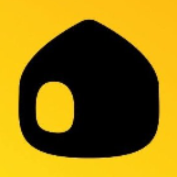 | 127379 | FRBK | FreeBnk |
|  | 102771 | MINAR | Miner Arena |
|  | 161753 | DEGE | DegeCoin |
|  | 151197 | LIBRA | LIBRA |
|  | 158753 | NOODLE | Noodle |
|  | 159037 | PAWSE | PAWSE |
|  | 151297 | QUQ | Quq |
| 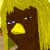 | 158471 | XAVIER | Xavier: Renegade Angel |
|  | 147063 | WS | Wrapped Sonic |
| 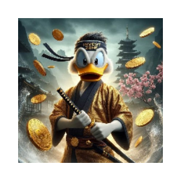 | 136181 | IVFUN | Invest Zone |
|  | 122849 | CBY | Carbify |
|  | 58131 | UPS | UPFI Network |
| 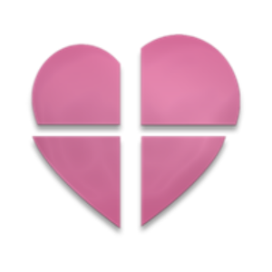 | 56375 | LOVELY | Lovely Inu finance |
|  | 63499 | LY | Lilly Finance |
|  | 131785 | C4E | C4E |
|  | 65989 | MTCL | MaticLaunch |
|  | 62005 | IJZ | iinjaz |
| 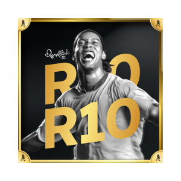 | 151367 | STAR10 | Ronaldinho Coin |
| 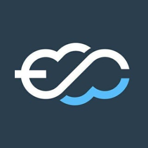 | 114173 | ECLD | Ethernity CLOUD |
| 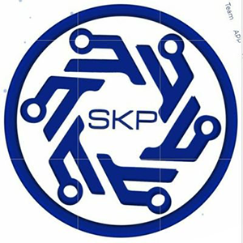 | 122039 | SKP | SKYPlay |
| 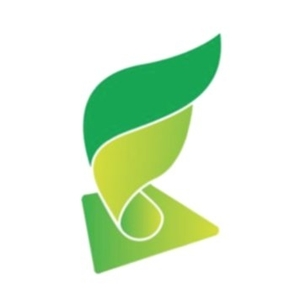 | 122175 | FLC | Floor Protocol |
|  | 112057 | ABN | Antofy |
| 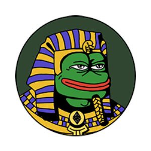 | 97105 | KEKE | KEK |
| 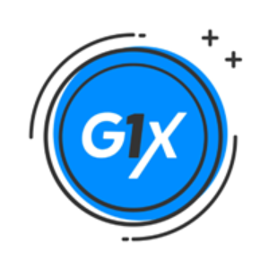 | 89193 | G1X | GoldFinX |
| 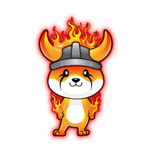 | 77333 | BFLOKI | Burn Floki |
|  | 48383 | LBY | Libonomy |
| 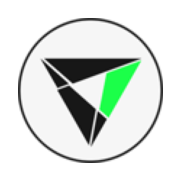 | 138163 | AIST | Artificial intelligence staking token |
| 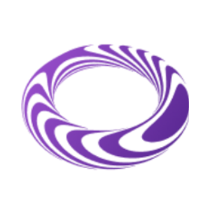 | 135299 | QDFI | Qudefi |
|  | 78627 | METI | Meetin Token |
| 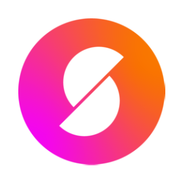 | 69521 | SMTF | SmartFi |
| 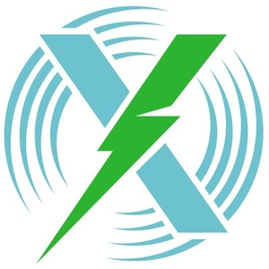 | 65453 | GREEN | Greeneum Network |
|  | 61763 | ZAMZAM | ZAMZAM |
|  | 58579 | MNDCC | Mondo Community Coin |
| 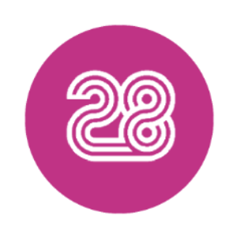 | 57073 | VCK | 28VCK |
| 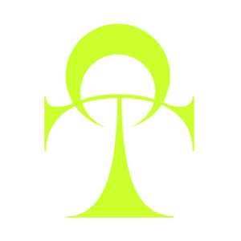 | 54915 | THEOS | Theos |
| 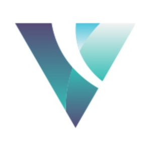 | 54829 | VNDT | Vendit |
| 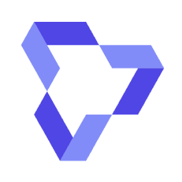 | 54535 | TXA | Project TXA |
|  | 53561 | VKNF | VKENAF |
|  | 51779 | PAYB | Paybswap |
| 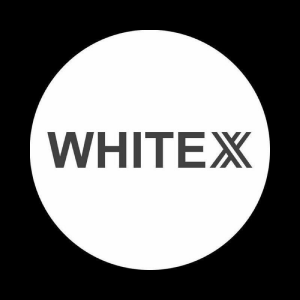 | 50287 | WHX | WhiteX |
|  | 50893 | SOMEE | SoMee.Social |
|  | 44982 | TSK | Tasuki |
|  | 43162 | PGPAY | PGPay |
|  | 112803 | LINQ | Linq |
| 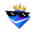 | 78491 | ETH2.0 | Proof Of Memes - Ethereum |
| 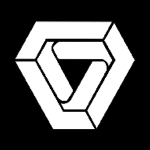 | 115427 | CYBA | CYBRIA |
| 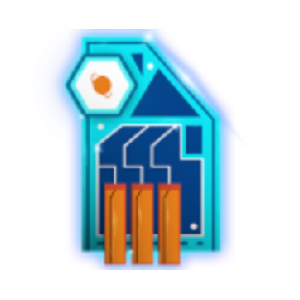 | 66253 | SCK | Space Corsair Key |
| 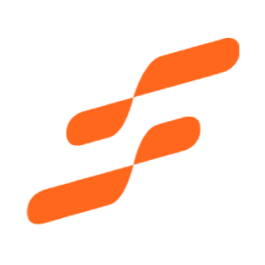 | 48085 | FCL | Fractal |
| 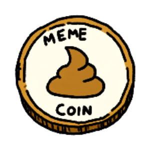 | 127103 | DOODOO | Doodoo |
| 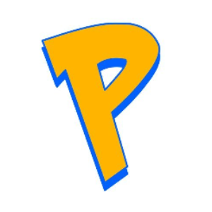 | 127697 | POKO | POKOMON |
|  | 90959 | MEVFREE | MEVFree |
|  | 62977 | RICH | RichCity |
|  | 59669 | UMAD | MADworld |
| 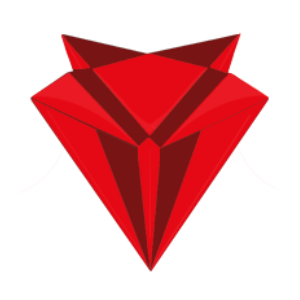 | 33483 | TRXC | TRONCLASSIC |
| 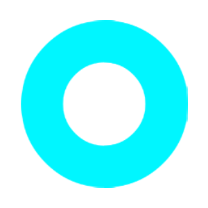 | 141563 | ORA | ORA |
|  | 137205 | WEEBS | Weebs |
|  | 131303 | OPTA | Opta Global |
|  | 49213 | MMON | Mammon |
|  | 137819 | $TRITON | Triton |
| 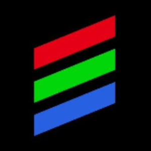 | 127359 | XRGB | XRGB |
|  | 45992 | KSEED | Kush Finance |
|  | 144623 | WATC | WATCoin |
| 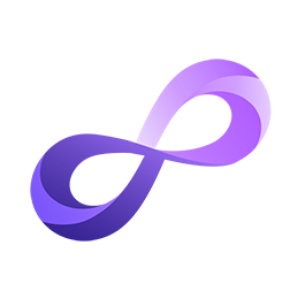 | 131561 | TUBES | TUBES |
|  | 59703 | PLASTIK | Plastiks |
|  | 50273 | UDT | Unlock Protocol |
| 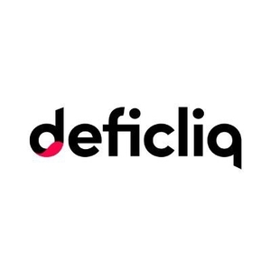 | 46603 | CLIQ | DefiCliq |
| 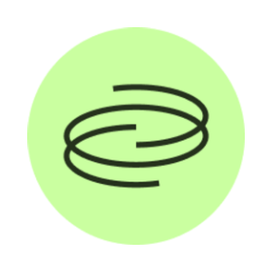 | 131857 | PLMC | Polimec |
|  | 71281 | OSEA | Omnisea |
| 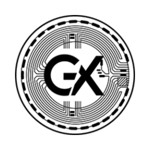 | 70787 | IUX | GeniuX |
|  | 67383 | CBU | Banque Universal |
| 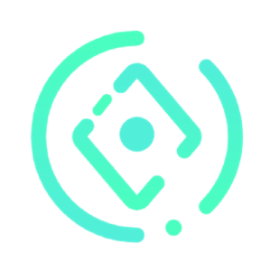 | 56445 | NIFTSY | Envelop (Niftsy) |
| 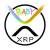 | 51941 | BBYXRP | BabyXrp |
| 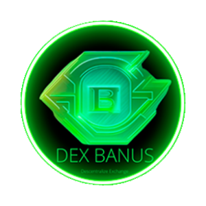 | 112431 | BANUS | Banus Finance |
| 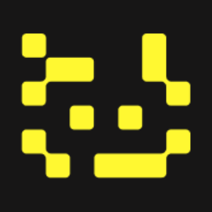 | 148613 | BNBAI | BNB Agents |
| 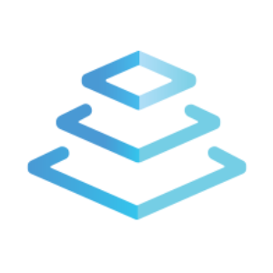 | 131063 | ICPX | Icrypex token |
|  | 136659 | OILX | OilX Token |
|  | 135689 | XAGX | Silver Token |
| 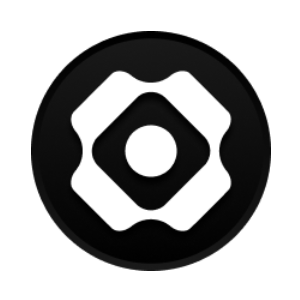 | 112827 | USDM | USD Mars |
|  | 80685 | BSAFU | BlockSafu |
| 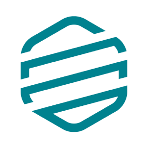 | 76817 | KVERSE | Keeps Coin |
| 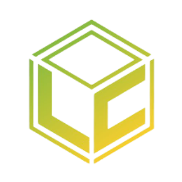 | 65805 | LEMC | LemonChain |
| 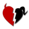 | 58125 | HIDEOUS | Hideous Finance |
|  | 56077 | GOTEM | gotEM |
| 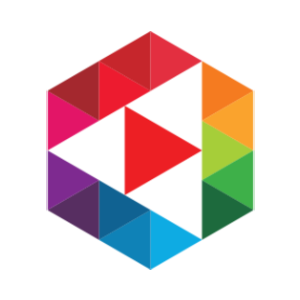 | 50687 | DAPPX | dAppstore |
|  | 50881 | MELO | Melo Token |
| 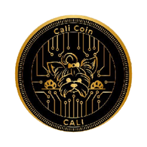 | 49071 | CALI | CaliCoin |
| 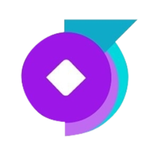 | 46613 | BNF | BonFi |
| 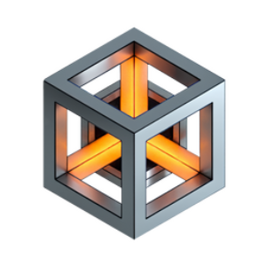 | 125239 | AIPG | AI Power Grid |
| 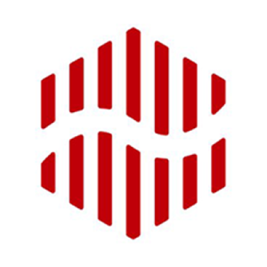 | 65487 | PHX | Phoenix Token |
| 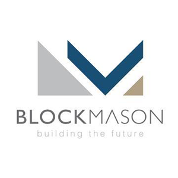 | 36428 | BLINK | Blockmason Link |
|  | 151683 | CGAI | GDAI Agent |
|  | 54249 | $ADS | Alkimi |
|  | 154573 | SHROOMY | Shroomy |
|  | 150229 | DOGEN | DOGEN |
| 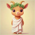 | 149069 | TOGA | TOGA |
|  | 141293 | CRAI | Cryptify AI |
|  | 136489 | OMZ | Open Meta City |
|  | 127251 | MAZZE | Mazze |
| 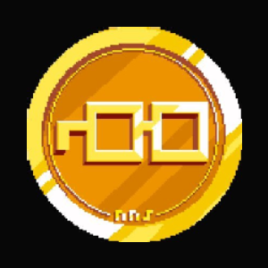 | 130269 | NOGS | Noggles |
| 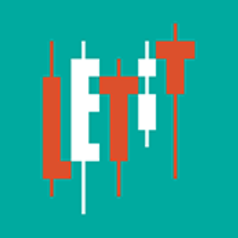 | 131033 | LETIT | Letit |
|  | 127159 | SVPN | Shadow Node |
| 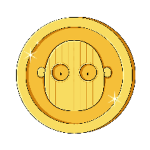 | 121817 | BOZO | BOZO |
|  | 99901 | GORA | Goracle Network |
|  | 112995 | WRKX | NFT Workx |
| 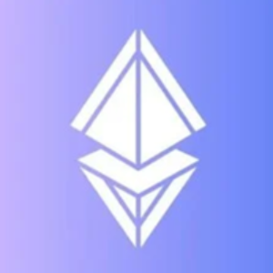 | 96031 | ETHF | EthereumFair |
| 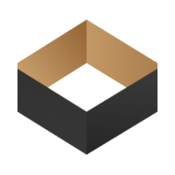 | 85011 | KWENTA | Kwenta |
| 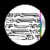 | 65071 | GENRE | GENRE |
|  | 55803 | PSYCHODOGE | Psycho Doge |
|  | 42881 | BNA | BananaTok |
|  | 131539 | MAGAA | MAGA AGAIN |
| 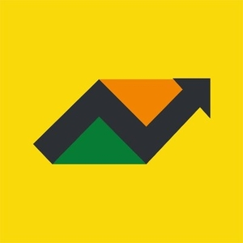 | 45899 | CHART | ChartEx |
| 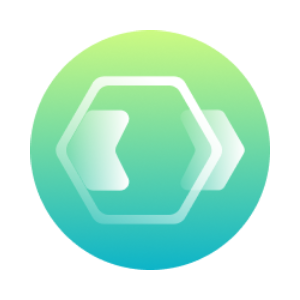 | 60885 | IDYP | iDeFiYieldProtocol |
| 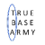 | 161733 | TBA | True Base Army |
| 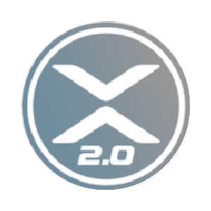 | 152247 | XRP2 | XRP2.0 |
| 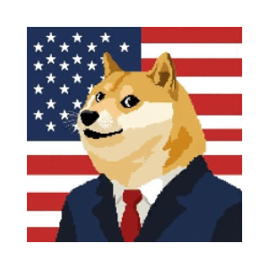 | 151185 | DOGEAI | DOGEai |
|  | 136529 | DEDA | DedaCoin |
| 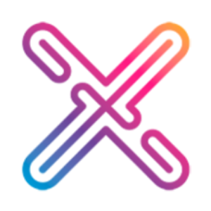 | 135441 | XHP | XHYPE |
|  | 141339 | PLYR | PLYR L1 |
|  | 142023 | SUPR | SuperDapp |
|  | 141655 | SIRIUS | Sirius |
| 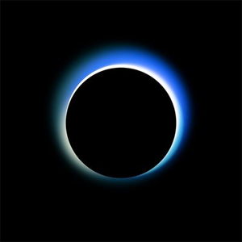 | 127583 | HST | HeadStarter |
|  | 123543 | BCT | BabyChita |
| 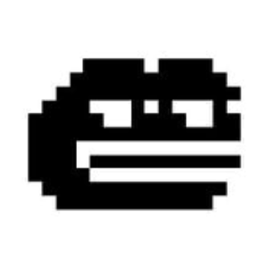 | 122259 | DEFROGS | DeFrogs |
| 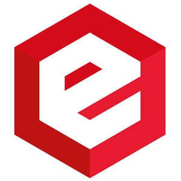 | 98607 | EQB | Equilibria Finance |
|  | 96941 | KCN | Kylacoin |
| 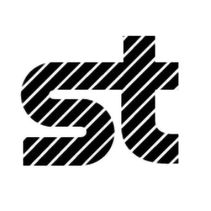 | 161553 | STAMP | STAMP |
|  | 154575 | WAV | WAVE |
| 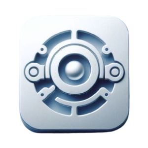 | 136237 | ISEC | IntelliSecure Systems |
| 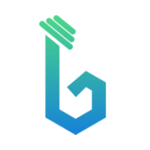 | 131269 | BNSAI | bonsAI Network |
|  | 89655 | SINSO | SINSO |
| 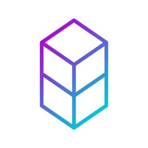 | 86669 | ARTE | ARTE |
|  | 69051 | WAG8 | Wrapped ATROMG8 |
| 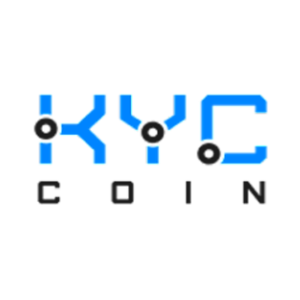 | 67171 | KYCC | KYCCOIN |
| 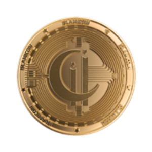 | 67177 | ISLAMI | ISLAMICOIN |
| 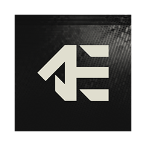 | 141865 | DAETA | DÆTA |
|  | 135671 | KLY | Klayr |
| 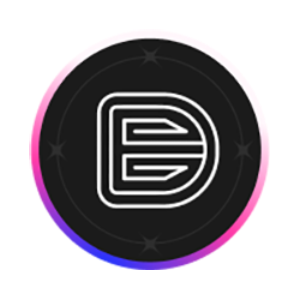 | 100139 | DUNG | Scarab Tools |
| 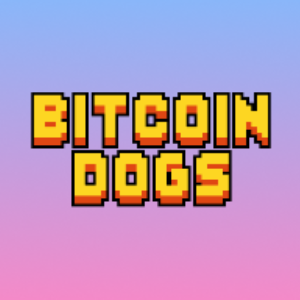 | 136595 | 0DOG | Bitcoin Dogs |
| 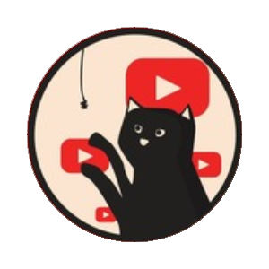 | 126845 | PAJAMAS | The First Youtube Cat |
|  | 125849 | CONVERGE | Converge Bot |
| 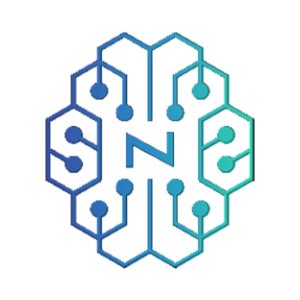 | 86189 | NEURONI | Neuroni AI |
| 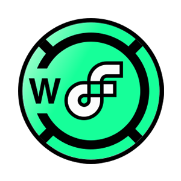 | 64237 | WFLOW | Wrapped Flow |
| 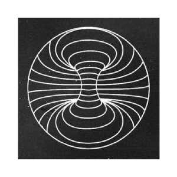 | 136649 | AGC | Argocoin |
|  | 49725 | SETS | Sensitrust |
| 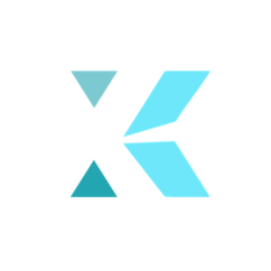 | 45999 | XSP | XSwap |
|  | 94503 | BRUCE | BRUCE pepe |
| 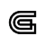 | 161673 | GRDM | Gridium AI |
|  | 146563 | MUSKIT | Musk It |
|  | 97453 | LOVESNOOPY | I LOVE SNOOPY |
|  | 60219 | CMCC | CMC Coin |
|  | 159115 | SUPFRIEND | Superfriend |
|  | 158611 | E | EAGLEBUILDER |
| 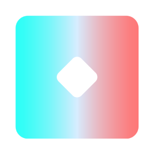 | 151595 | MAG | Magnetix |
|  | 137523 | NUTZ | NUTZ |
|  | 71495 | OCW | Online Cold Wallet |
| 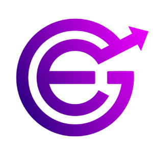 | 60365 | EGC | EcoG9coin |
|  | 56391 | BZP | BitZipp |
| 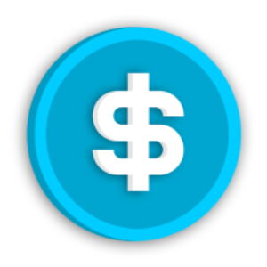 | 49269 | STRI | Strite |
| 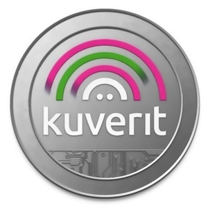 | 42453 | KUV | Kuverit |
| 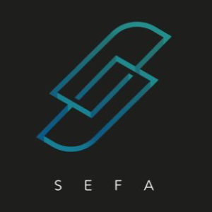 | 44143 | SEFA | MESEFA |
| 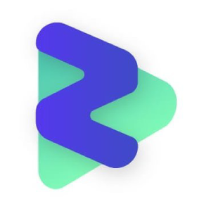 | 41411 | ZIK | Ziktalk |
| 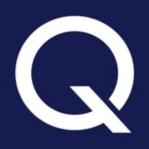 | 33583 | EQUAD | QuadrantProtocol |
| 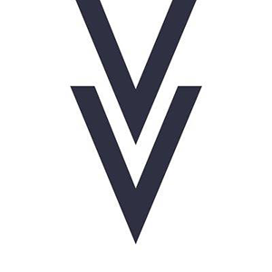 | 32859 | NUSD | nUSD |
| 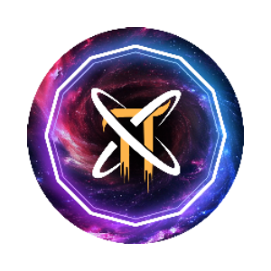 | 151799 | XPI | XPi |
| 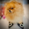 | 146973 | TOH | TeddyOnHeels |
| 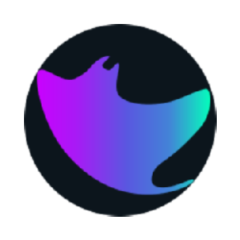 | 136811 | MNTA | Moneta |
| 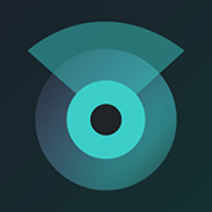 | 127599 | LAN | Lanify |
| 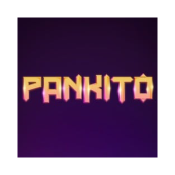 | 68345 | PAN | Pantos |
| 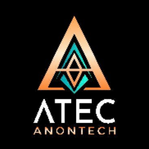 | 127901 | ATEC | AnonTech |
|  | 49471 | PAYN | PayNet Coin |
|  | 144919 | MONAI | Monai |
|  | 68539 | CAT+ | Capital Aggregator Token |
| 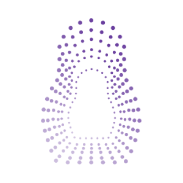 | 147247 | AITHER | Aither |
| 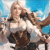 | 146527 | FREYA | Freya by Virtuals |
| 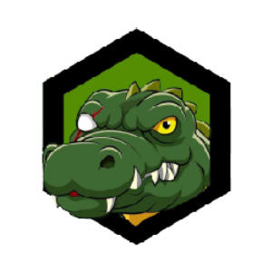 | 124883 | KINU | Kragger Inu |
| 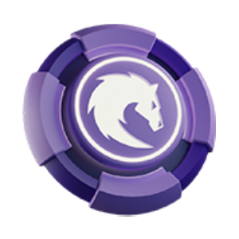 | 127505 | MUNITY | Metahorse Unity |
| 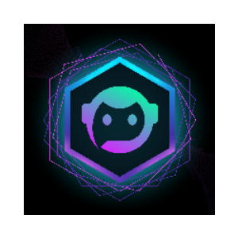 | 122851 | STBOT | SolTradingBot |
|  | 122591 | SPT | SeaPad |
| 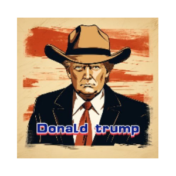 | 115373 | TRUMP2024 | Donald Trump |
| 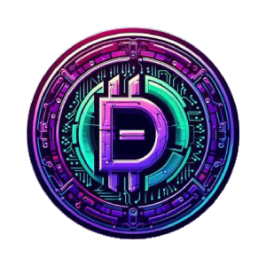 | 121677 | DFC | DeFinder Capital |
|  | 64841 | EKTA | Ekta |
| 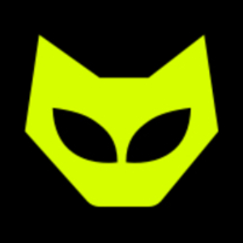 | 65821 | MEOW | MeowSwap Token |
|  | 150343 | WHISP | WHISP |
|  | 47010 | LADZ | LADZ |
|  | 46684 | GR | GROM |
| 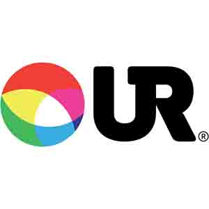 | 159471 | UR | URSWAP |
|  | 94289 | SLGO | Solalgo |
| 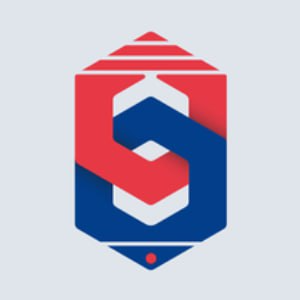 | 148645 | BRITTO | BRITTO |
| 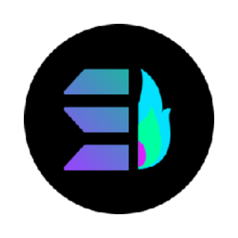 | 87251 | BSOL | BlazeStake Staked SOL |
|  | 77977 | MSTR | Monsterra |
| 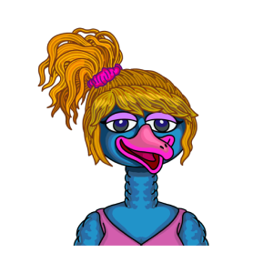 | 70397 | LILY | Solily Protocol |
| 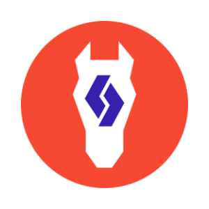 | 137951 | HRSE | The Winners Circle |
| 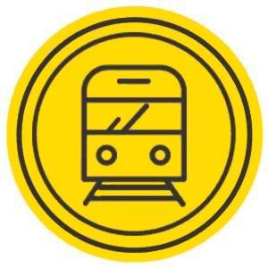 | 77737 | XCM | Coinmetro |
| 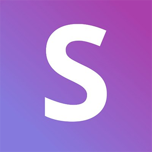 | 78243 | SNOV | Snovian.Space |
|  | 56395 | UCD | UniCandy |
|  | 161443 | RAN | Rank |
|  | 158989 | YND | YieldNest |
|  | 159063 | IMAGE | Imagen Network |
|  | 159477 | LUCYAI | Pitch Lucy AI |
|  | 150221 | ELON4AFD | Elon for AfD |
| 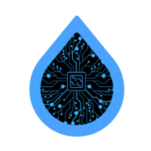 | 147137 | SUIDEPIN | Sui DePIN |
|  | 141573 | SLAP | CatSlap |
| 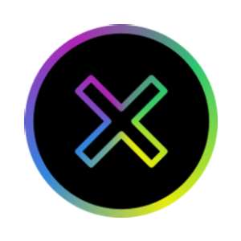 | 136573 | XOXNO | XOXNO |
| 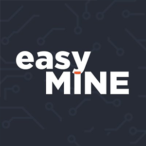 | 125823 | EMT | EmoTech |
|  | 122485 | FSC | Fileshare Platform |
|  | 114737 | FLIX | OmniFlix Network |
|  | 87171 | CRT | Cantina Royale |
|  | 76833 | SHIRYO | Shiryo |
| 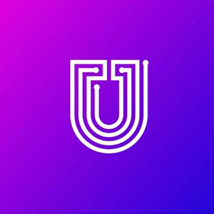 | 133483 | YOU | YOUWHO |
| 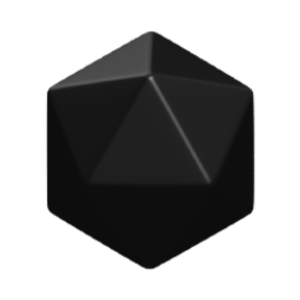 | 130315 | BORED | BORED |
| 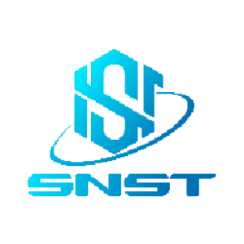 | 122517 | SNST | Smooth Network Solutions Token |
| 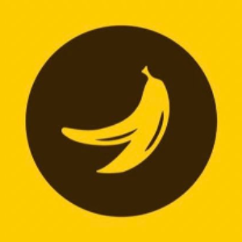 | 122963 | NANA | NANA Token |
| 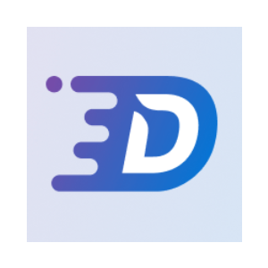 | 45484 | DIGEX | Digex |
| 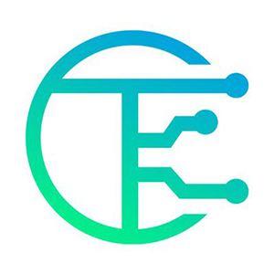 | 36443 | TMN | TranslateMe Network Token |
|  | 150225 | CATTON | Catton AI |
|  | 158447 | MASHA | Masha |
|  | 150877 | BYIN | BYIN |
| 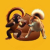 | 135315 | MSI | monkey shit inu |
| 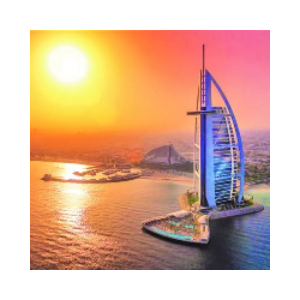 | 131131 | EARLY | EarlyFans |
|  | 122655 | NFTL | NFTLaunch |
| 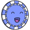 | 94459 | ROUL | ArbiRoul Casino Chip |
| 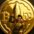 | 151481 | BUCKAZOIDS | Buckazoids |
|  | 127085 | LBK | LBK |
| 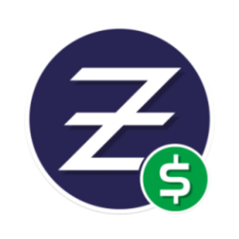 | 126363 | ZSD | Zephyr Protocol Stable Dollar |
|  | 121861 | GHOST | Ghost |
|  | 123407 | GPN | Gamepass Network |
| 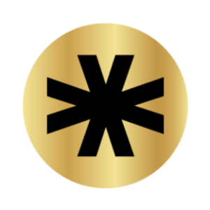 | 100085 | VCORE | IMVU |
| 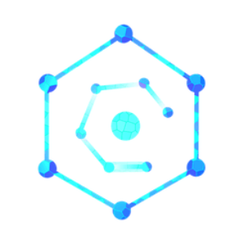 | 86469 | OBTC | Optical Bitcoin |
| 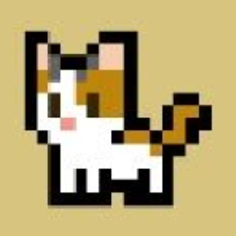 | 89905 | MEWC | Meowcoin |
| 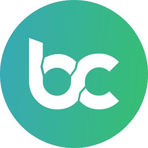 | 67007 | BCNA | BitCanna |
|  | 47307 | OXEN | Oxen |
|  | 45311 | SOLACE | Solace Coin |
| 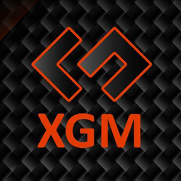 | 42634 | XGM | Grimm |
|  | 42007 | WTIP | Worktips |
|  | 42017 | OMB | Ombre |
|  | 34651 | ETNXP | Electronero Pulse |
|  | 41207 | XEQ | Equilibria |
|  | 34778 | XTNC | XtendCash |
|  | 41255 | INTU | INTUCoin |
|  | 36378 | RTO | Arto |
| 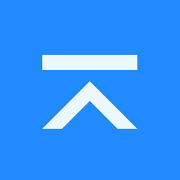 | 36611 | XLA | Scala |
| 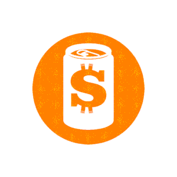 | 36567 | NAH | Strayacoin |
| 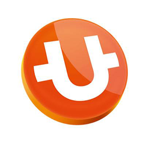 | 36410 | CUT | CUT coin |
| 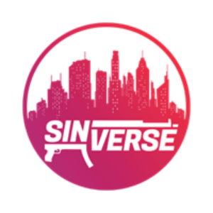 | 33916 | SIN | SINOVATE |
| 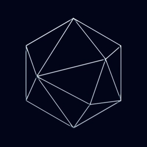 | 33703 | ARQ | Arqma |
| 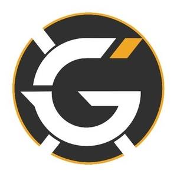 | 33489 | XGS | GenesisX |
| 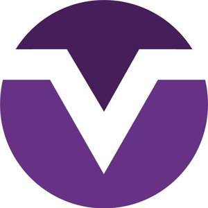 | 33434 | XMV | MoneroV  |
| 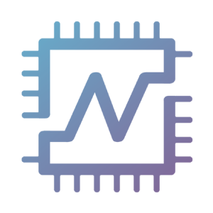 | 33395 | XNV | Nerva |
|  | 34495 | SLD | Soldo |
| 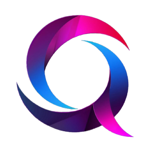 | 33400 | QUAN | Quantis Network |
|  | 33368 | ETNX | Electronero |
| 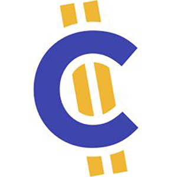 | 33903 | BITC | BitCash |
| 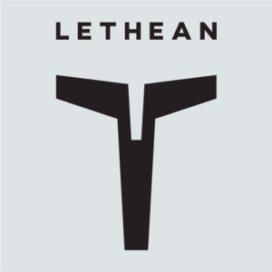 | 33194 | LTHN | Lethean |
|  | 33708 | SHB | SkyHub Coin |
| 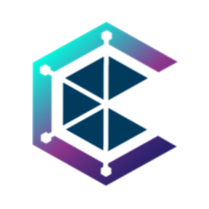 | 33623 | CIV | Civitas |
| 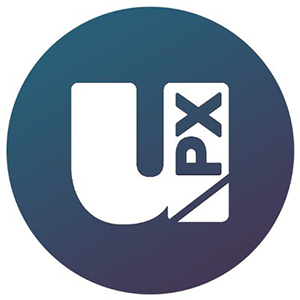 | 33469 | UPX | uPlexa |
| 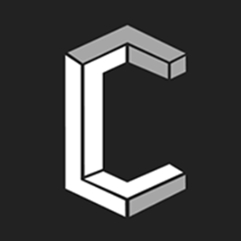 | 33271 | CCX | Conceal |
| 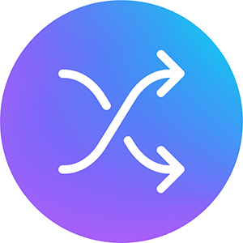 | 33603 | XWP | Swap |
| 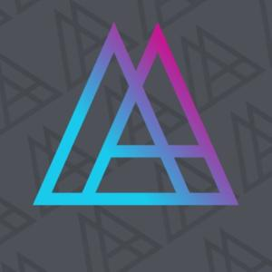 | 33351 | XAO | Alloy Project |
|  | 33360 | IRD | Iridium |
|  | 33143 | NCP | Newton Coin Project |
|  | 32725 | TUBE | BitTube |
| 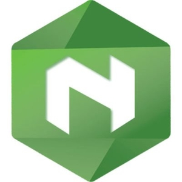 | 33042 | NBR | Niobio Cash |
|  | 10695 | MSR | Masari |
|  | 32968 | TRTL | Turtlecoin |
| 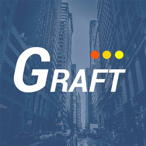 | 32555 | GRFT | Graft |
| 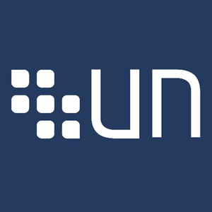 | 33037 | XUN | UltraNote Coin |
| 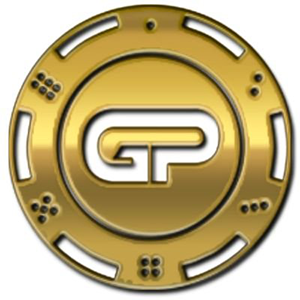 | 32987 | GPKR | Gold Poker |
|  | 33015 | BBS | BBSCoin |
| 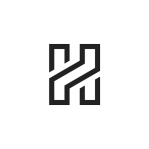 | 32524 | XHV | Haven Protocol |
|  | 3835 | PCN | PeepCoin |
| 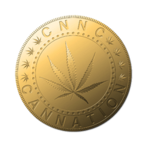 | 32335 | BTCP | Bitcoin Private |
|  | 1844 | COAL | Bitcoal |
| 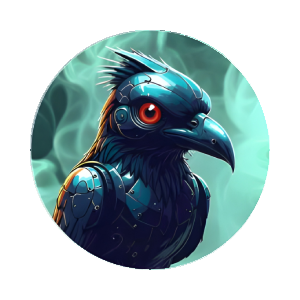 | 2605 | LUX | Luxcoin |
| 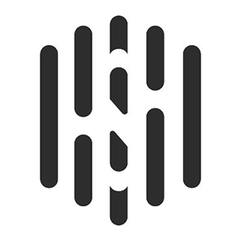 | 1894 | HUSH | Hush |
| 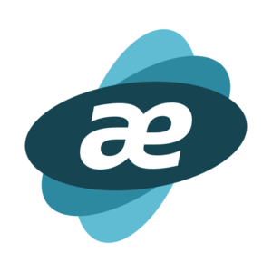 | 79 | AEON | Aeon |
| 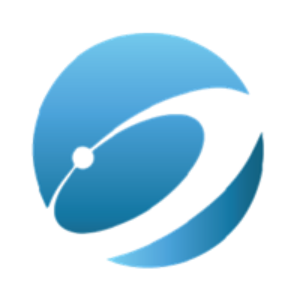 | 61 | NXS | Nexus |
| 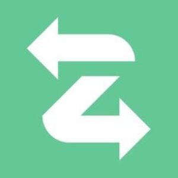 | 132691 | ZKGUN | zkGUN |
|  | 98743 | $CS | Child Support |
| 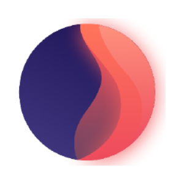 | 44430 | DAWN | Dawn Protocol |
| 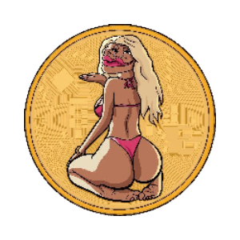 | 122899 | PEACHY | Peachy |
|  | 85069 | IPOR | IPOR |
|  | 126087 | OXN | 0xNumber |
|  | 122577 | REF | Ref Finance |
| 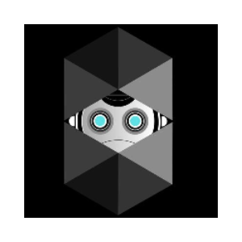 | 113303 | 0XDEV | DEVAI |
| 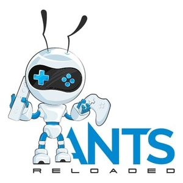 | 159209 | ANTS | ANTSCOIN |
|  | 159381 | RWAI | RWAI |
|  | 158931 | NTV | Nativ |
| 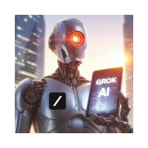 | 153799 | GROKAI | Grok AI Agent |
|  | 158941 | BEER2 | Beercoin 2 |
|  | 144283 | MEI | Mei Solutions |
|  | 136575 | MPAA | MPAA |
|  | 136213 | TORSY | TORSY |
|  | 131947 | RUM | RUM - Pirates of Arrland Token |
|  | 141989 | TUA | Atua AI |
| 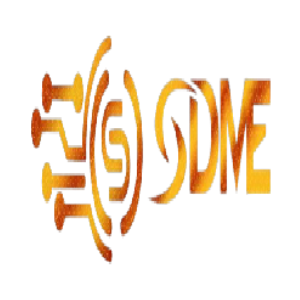 | 136631 | SDME | SDME |
|  | 131301 | CWA | Chris World Asset |
|  | 127333 | AAI | AutoAir AI |
| 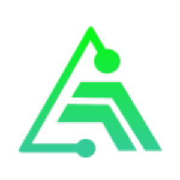 | 122193 | AGII | AGII |
| 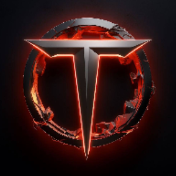 | 115657 | TESLAI | Tesla AI |
|  | 115217 | POKEMON | Pokemon |
|  | 114037 | T2T2 | T2T2 |
| 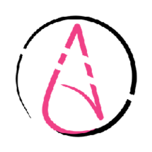 | 115645 | CAIR | Crypto-AI-Robo.com |
| 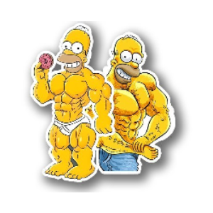 | 115643 | HOMER | Homer Simpson(Solana) |
| 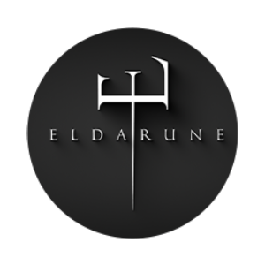 | 96107 | ELDA | Eldarune |
| 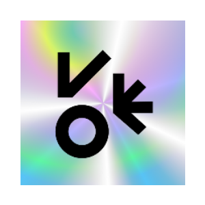 | 101829 | KAF | KAIF Platform |
| 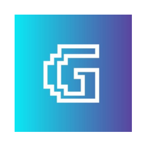 | 66481 | GINOA | Ginoa |
| 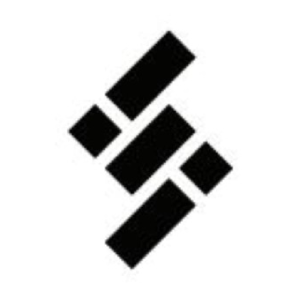 | 141689 | STRDY | Sturdy |
|  | 154317 | HIGHKEY | HighKey |
| 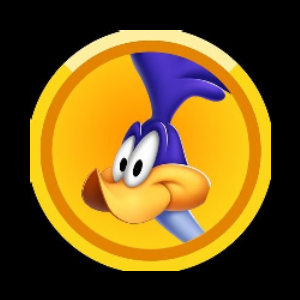 | 146545 | MIGMIG | MigMig |
| 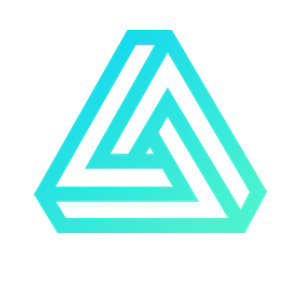 | 122199 | MXM | MixMob |
| 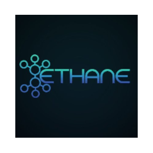 | 99561 | C2H6 | Ethane |
|  | 46666 | CHM | Cryptochrome |
|  | 125493 | 1000TROLL | 1000TROLL |
| 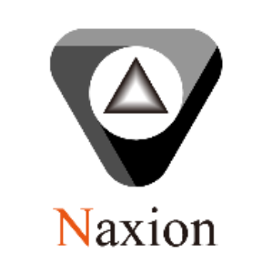 | 112967 | NXN | Naxion |
| 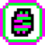 | 86229 | POI$ON | Poison Finance |
|  | 59495 | USDI | USDi0 |
|  | 91137 | YESP | Yesports |
|  | 94439 | AICODE | AI CODE |
|  | 69687 | ELU | Elumia |
|  | 49843 | METAMOON | MetaMoon |
| 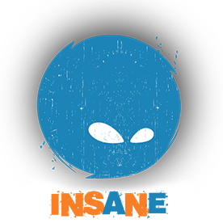 | 11102 | INSN | InsaneCoin |
| 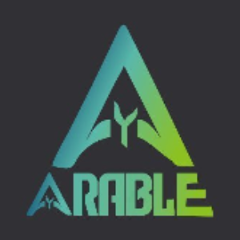 | 71743 | ACRE | Arable Protocol |
| 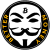 | 46311 | BETTER | Better Money |
| 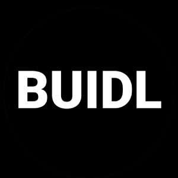 | 44291 | BUIDL | DFOhub |
|  | 159587 | GNESS | Gameness Token |
| 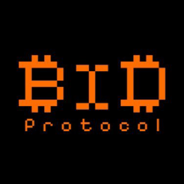 | 149781 | BIDP | BID Protocol |
| 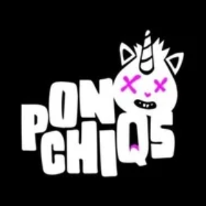 | 146625 | PONCH | Ponchiqs |
|  | 146419 | GOODBOY | GoodBoy |
|  | 135309 | RGOAT | RealGOAT |
| 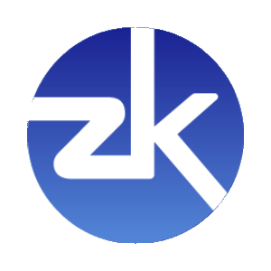 | 127263 | ZEND | zkLend |
|  | 126151 | OOFP | OOFP |
|  | 122845 | ISSP | ISSP |
| 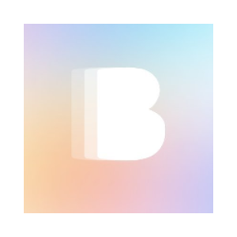 | 122921 | BIIS | biis (Ordinals) |
|  | 122683 | SON | SOUNI |
| 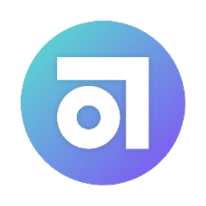 | 122201 | AMU | Amulet |
| 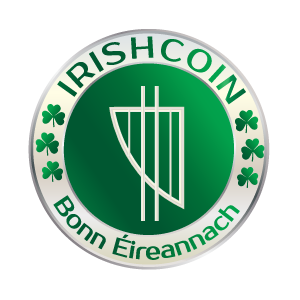 | 122335 | IRL | Rebase GG |
| 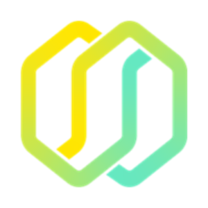 | 95705 | TRIBL | Tribal Token |
|  | 96001 | SRBP | Pikaster |
| 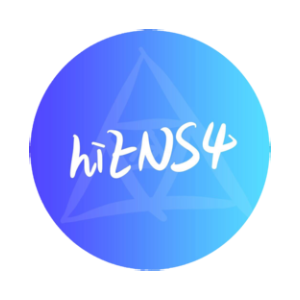 | 89803 | HIENS4 | hiENS4 |
| 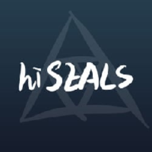 | 88185 | HISEALS | hiSEALS |
| 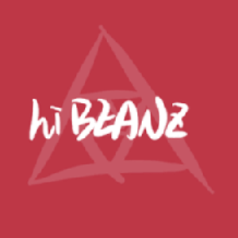 | 88595 | HIBEANZ | hiBEANZ |
| 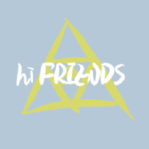 | 90227 | HIFRIENDS | hiFRIENDS |
| 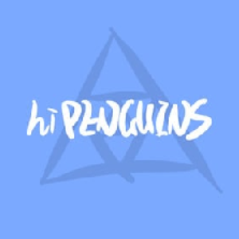 | 88189 | HIPENGUINS | hiPENGUINS |
| 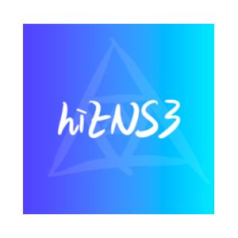 | 88857 | HIENS3 | hiENS3 |
|  | 71371 | RBP | Rare Ball Potion |
|  | 70685 | MLS | Pikaster |
|  | 77867 | NEER | Metaverse.Network Pioneer |
| 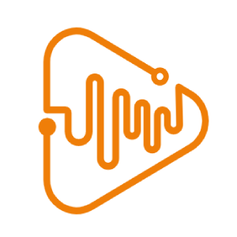 | 68279 | MELOS | Melos Studio |
|  | 65089 | SEX | Solidex |
| 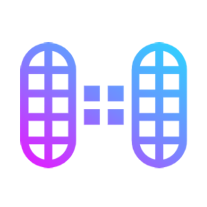 | 61789 | HBB | Hubble |
| 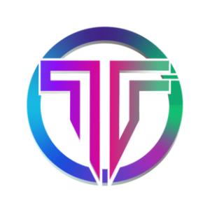 | 52009 | HAKA | TribeOne |
|  | 48889 | POLX | Polylastic |
| 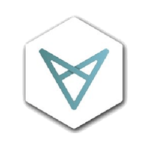 | 34654 | VXV | Vectorspace AI |
| 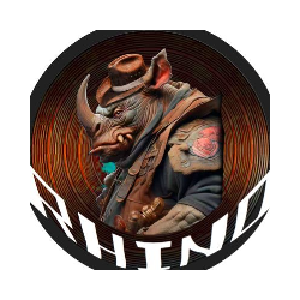 | 147377 | RHINO | Rhino Ninja |
| 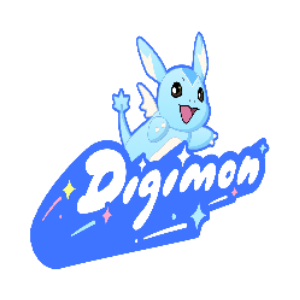 | 147131 | DIGIMON | Digimon |
|  | 131923 | BOBBY | Kennedy Coin |
| 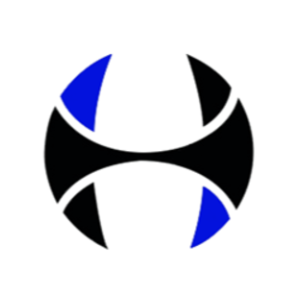 | 122457 | HALO | HALO NFT OFFICIAL |
|  | 114025 | ZAPEX | ZapExchange |
| 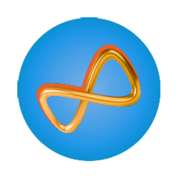 | 111459 | MOOX | MOOxMOO |
|  | 86251 | STATS | STATS |
| 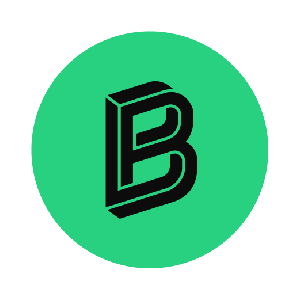 | 66585 | BEST | Bitpanda Ecosystem Token |
| 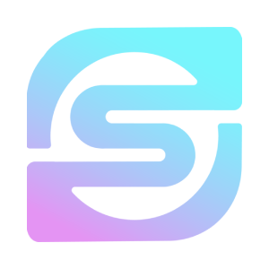 | 47405 | SPI | Shopping.io |
| 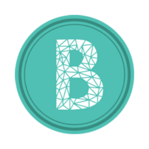 | 32852 | BNK | Bankera |
| 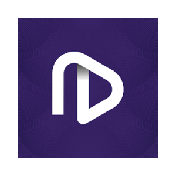 | 144309 | DVL | Develad |
| 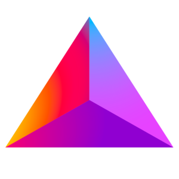 | 146589 | WYS | WYscale |
|  | 136841 | NOBL | NOBLEBLOCKS |
|  | 135359 | QSWAP | Quantum Network |
| 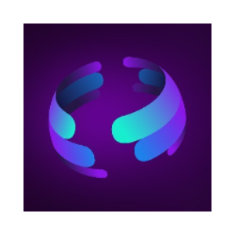 | 122549 | SWOT | Swot AI |
|  | 65299 | OH | Oh! Finance |
| 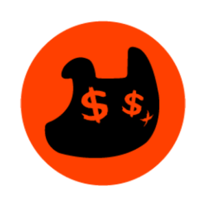 | 148031 | MDOGS | Money Dogs |
|  | 150957 | TAPS | TapSwap |
|  | 113449 | GOJOBSC | Gojo BSC |
| 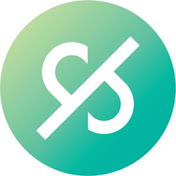 | 70129 | PESA | Pesabase |
|  | 142085 | TGRASS | Top Grass Club |
|  | 146607 | NEOTECH | NEOT |
| 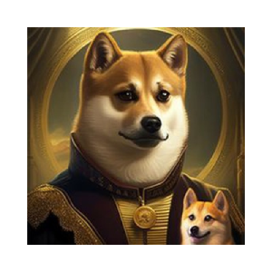 | 98167 | AIDOGEXLM | AIDOGE Stellar |
| 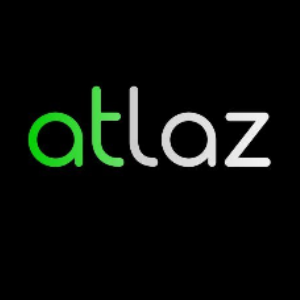 | 129623 | AAZ | ATLAZ |
| 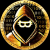 | 122873 | SATOSHI | Satoshi Nakamoto |
|  | 91165 | PROX | Proxima |
|  | 151341 | RICHIE | Richie Rich |
| 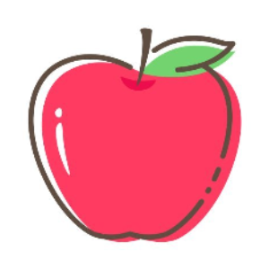 | 147897 | APPLE | dog with apple in mouth |
|  | 148569 | CENTS | Centience |
| 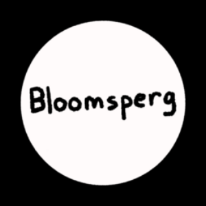 | 144789 | SPERG | Bloomsperg Terminal |
| 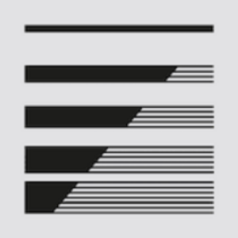 | 148443 | SHU | Shutter |
| 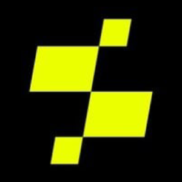 | 135665 | SYK | Stryke |
| 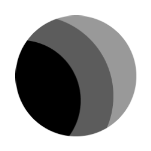 | 141831 | SING | SingSing |
| 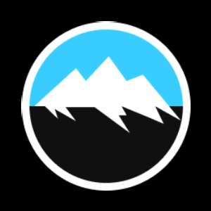 | 131127 | MENDI | Mendi Finance |
| 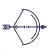 | 98561 | YOKEN | YOKEN |
| 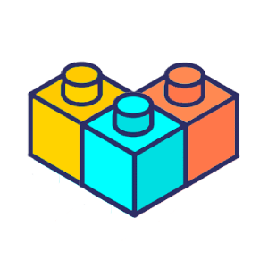 | 111591 | BRICK | r/FortNiteBR Bricks |
|  | 98149 | WOJAKINU | WojakInu |
| 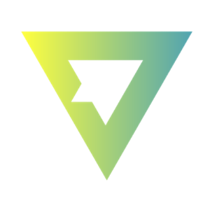 | 60827 | VPAD | VLaunch |
|  | 146767 | HACHI INU | Hachi Inu |
|  | 136409 | CHITAN | Chitan |
|  | 129737 | DIBC | DIBCOIN |
| 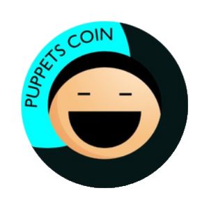 | 125021 | PUPPETS | Puppets Coin |
| 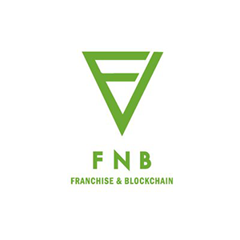 | 124759 | FNB | FinexboxToken |
| 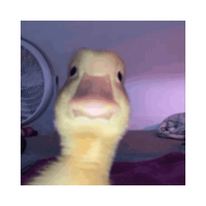 | 127049 | HAROLD | Harold |
| 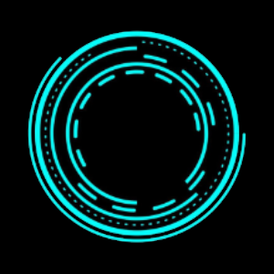 | 112675 | ICLICK | ICLICK Inu |
| 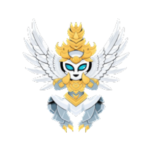 | 102757 | GARU | Garuda Coin |
| 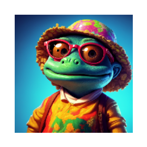 | 96809 | PEPI | Pepito BSC |
|  | 97817 | ROLS | RollerSwap |
|  | 99417 | FBURN | Forever Burn |
| 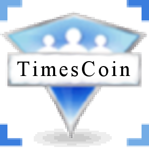 | 95757 | TMC | Tom Coin |
| 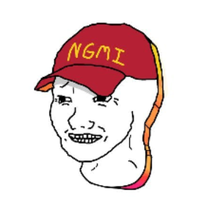 | 97515 | NGMI | NGMI Coin |
| 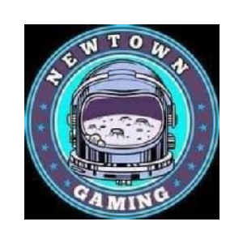 | 88625 | NTG | NEWTOWNGAMING |
|  | 90967 | HLPR | Helper Coin |
|  | 80035 | JPD | JackpotDoge |
|  | 79981 | MARIA | Maria |
|  | 80729 | IKOLF | IKOLF |
| 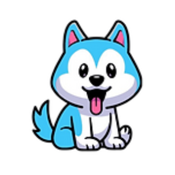 | 79123 | TINU | Telegram Inu |
| 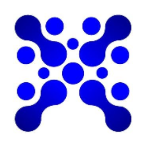 | 81461 | FORS | Forus |
|  | 78269 | XP | XP |
|  | 80193 | OKEY | OKEYCOIN |
|  | 81071 | MOONION | Moonions |
| 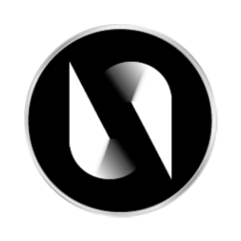 | 70679 | OLOID | OLOID |
|  | 70843 | PCASH | Pandora Cash |
|  | 70107 | CKRACING | Crypto Kart Racing |
| 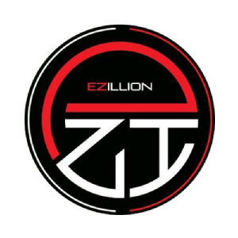 | 71069 | EZI | Ezillion |
| 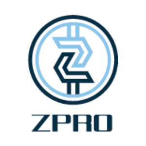 | 70919 | ZPRO | ZAT Project |
| 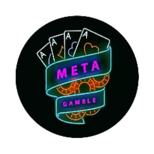 | 77533 | GAMBL | Metagamble |
|  | 69785 | VITY | Vitteey |
| 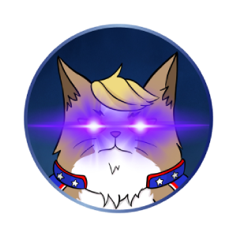 | 68697 | THECAT | The Cat Inu |
| 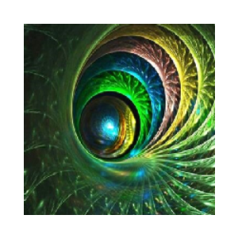 | 68239 | TVRS | TiraVerse |
|  | 69491 | RANTS | redFireAnts |
| 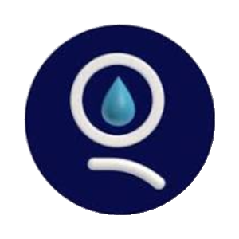 | 68327 | QDROP | QuizDrop |
|  | 69741 | AMG | Amgen |
|  | 65185 | ZUSD | ZUSD |
| 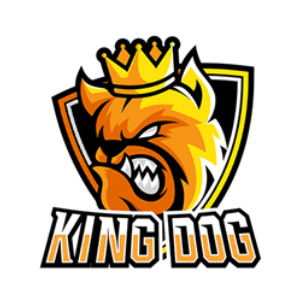 | 63859 | KINGDOG | King Dog Inu |
| 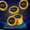 | 64413 | ICMX | iCOMEX |
| 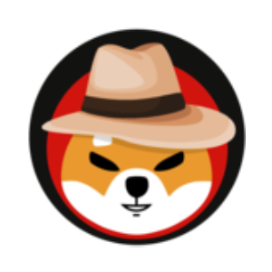 | 64103 | TOURISTS | Tourist Shiba Inu |
| 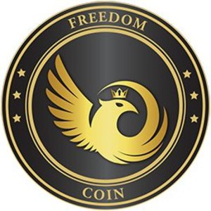 | 65527 | TFC | TheFlashCurrency |
| 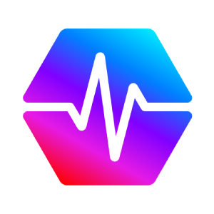 | 60609 | PLS | iPulse |
|  | 63163 | AGL | Agile |
|  | 59673 | TPV | TravGoPV |
|  | 58727 | FIWT | Firulais Wallet Token |
|  | 52175 | LHC | Lightcoin |
|  | 55171 | EDUX | Edufex |
| 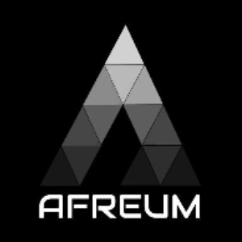 | 55135 | AFR | Afreum |
|  | 49131 | MGPC | MagpieCoin |
| 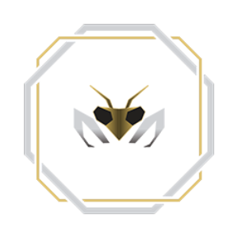 | 47513 | MNTIS | Mantis Network |
| 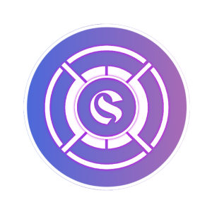 | 48055 | SHIELD | Shield Protocol |
|  | 44696 | STP | STPAY |
| 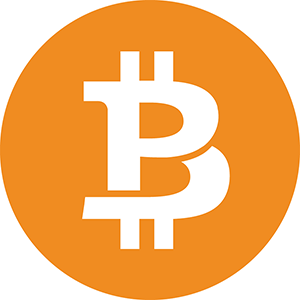 | 44702 | BPS | BitcoinPoS |
| 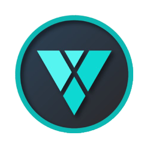 | 45006 | XFUEL | XFUEL |
|  | 42239 | SORA | SorachanCoin |
|  | 42534 | MTNS | OmotenashiCoin |
| 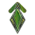 | 42932 | IBH | iBitHub |
| 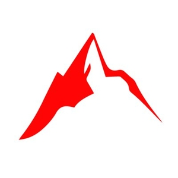 | 34528 | ACTN | Action Coin |
|  | 41451 | TNET | Title Network |
|  | 34682 | IMG | ImageCoin |
| 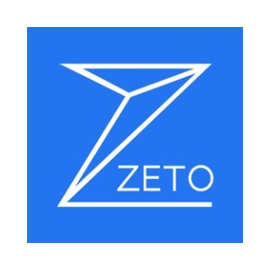 | 34753 | ZTC | Zent Cash |
| 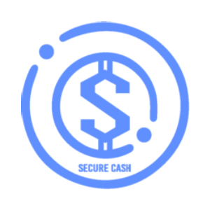 | 36387 | SCSX | Secure Cash |
| 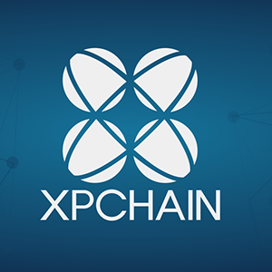 | 33567 | XPC | eXPerience Chain |
|  | 33506 | HNDC | HondaisCoin |
| 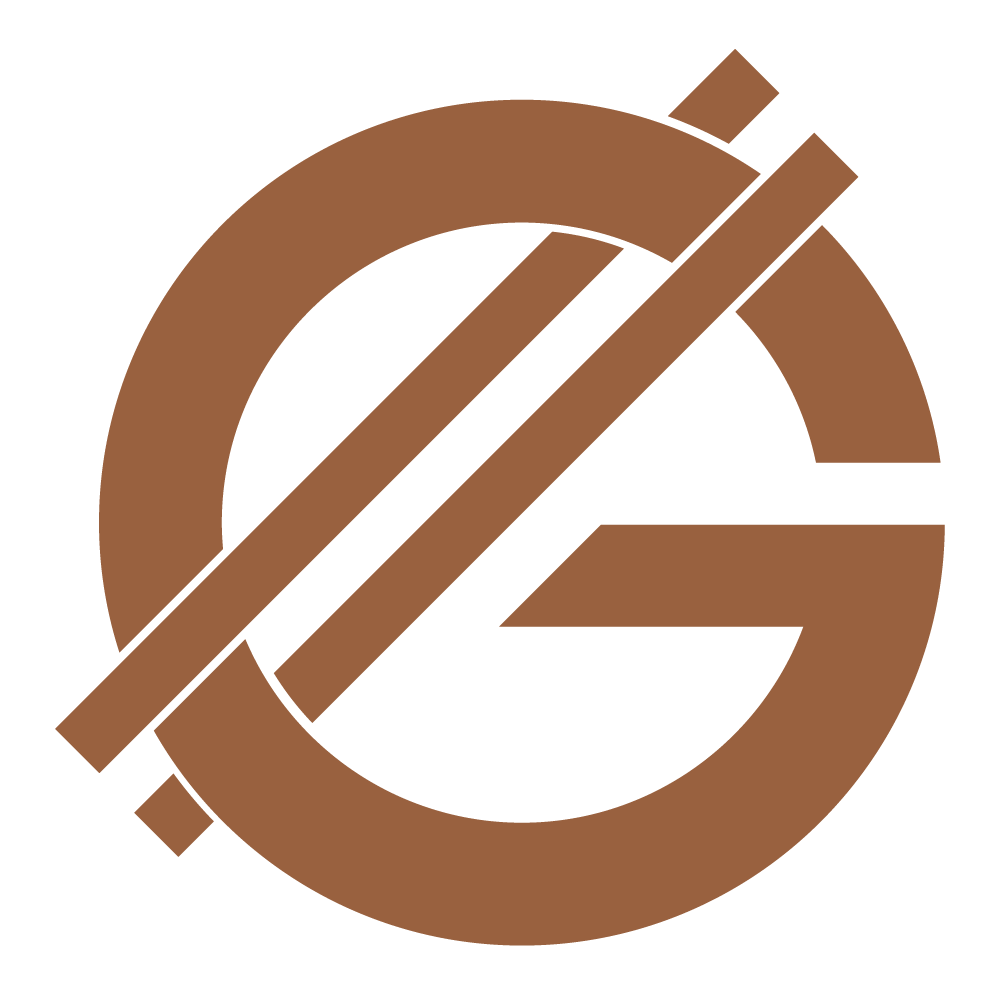 | 3275 | GLT | GlobalToken |
| 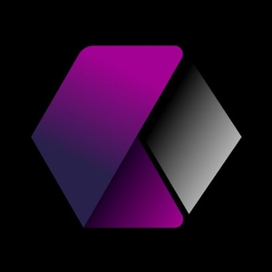 | 11060 | CTL | Citadel |
| 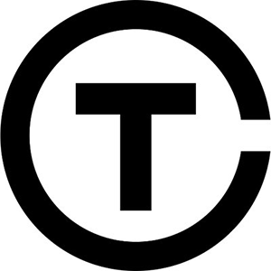 | 2620 | TZC | Trezarcoin |
| 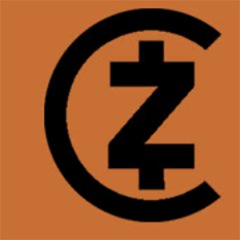 | 135 | ZCL | Zclassic |
|  | 2103 | PUT | PutinCoin |
| 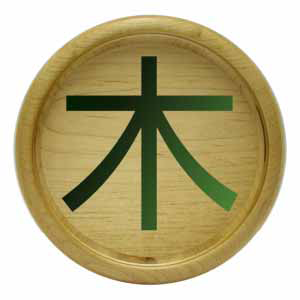 | 455 | LOG | WoodCoin |
| 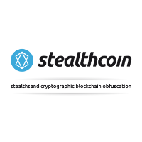 | 35 | XST | Stealth |
| 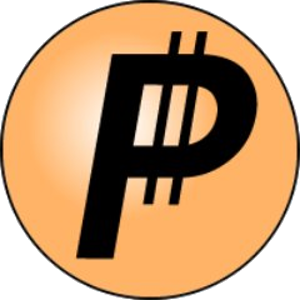 | 2948 | PASC | Pascal Coin |
| 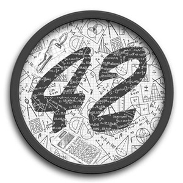 | 1951 | 42 | 42-coin |
| 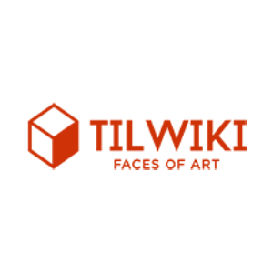 | 65675 | TLW | TilWiki |
| 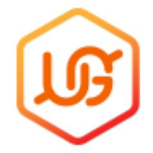 | 65925 | UGT | Unreal Finance |
|  | 59975 | TITAN | TitanSwap |
|  | 49159 | SCONEX | SCOneX |
| 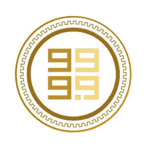 | 44979 | NNN | Novem NNN Gold Token |
| 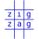 | 42580 | ZAG | ZigZag |
|  | 33868 | TRP | Tronipay |
|  | 80579 | SOCCER | SoccerInu |
| 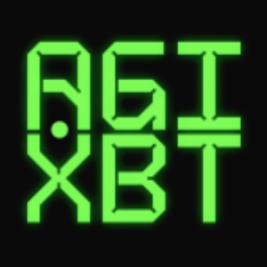 | 147171 | AGIXBT | AGIXBT by Virtuals |
| 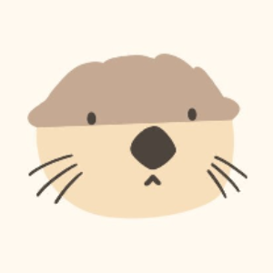 | 144361 | HASUI | Haedal Staked SUI |
| 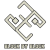 | 100225 | BXB | BlockbyBlock |
|  | 151519 | JINGLE | Jingle |
|  | 147151 | DVA | DeVap AI |
| 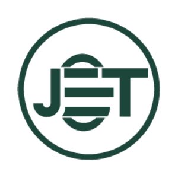 | 136487 | JSET | Jsetcoin |
| 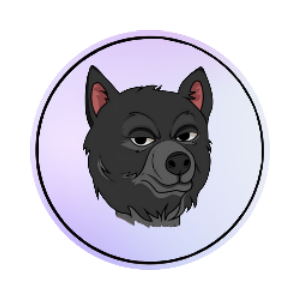 | 127527 | ZEBU | ZEBU |
|  | 113219 | SOW | SPOWARS |
| 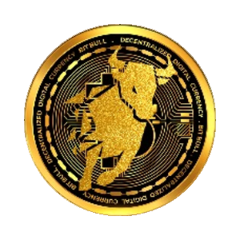 | 98543 | BITBULL | Bitbull |
|  | 97157 | BEN | Ben |
|  | 85181 | CO | Corite |
| 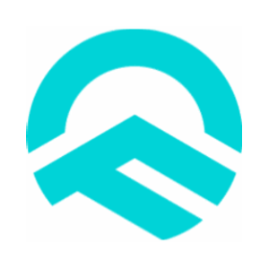 | 60347 | CRFI | CrossFi |
| 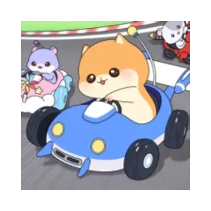 | 151365 | HENLO | henlo |
| 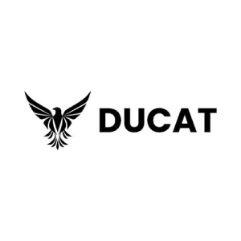 | 151629 | DUCAT | Ducat |
| 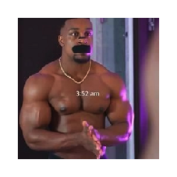 | 151547 | ROUTINE | Morning Routine |
| 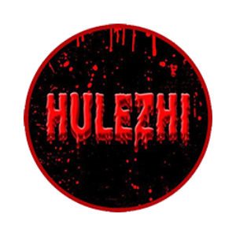 | 150913 | HULEZHI | HU LE ZHI |
|  | 131815 | FFM | Florence Finance Medici |
| 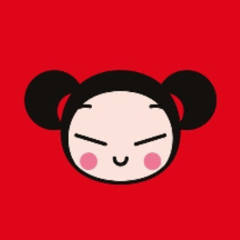 | 141295 | PUCCA | PUCCA |
| 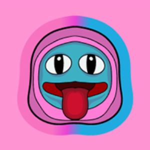 | 137139 | FROGLIC | Pink Hood Froglicker |
|  | 126973 | $MFER | mfercoin |
| 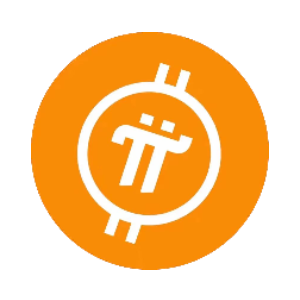 | 122381 | PIIN | piin  (Ordinals) |
| 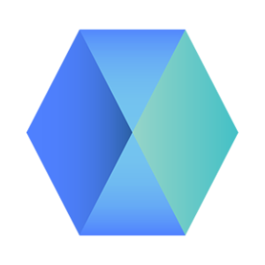 | 121909 | DEC | Decentr |
|  | 95005 | DAMEX | Damex Token |
|  | 66867 | PRXY | Proxy |
| 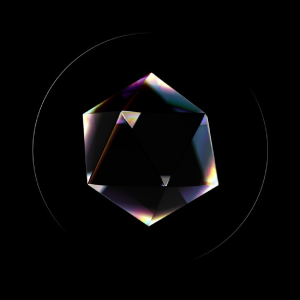 | 65345 | STF | Structure Finance |
| 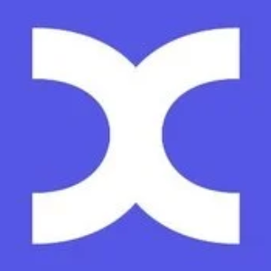 | 65189 | IDO | Idexo Token |
|  | 113721 | ROULETTEBO | RouletteBot |
|  | 151477 | $NOEL | AskNoel |
| 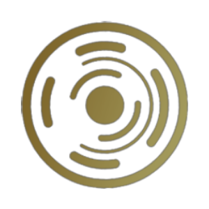 | 81229 | ADO | ADO.Network |
| 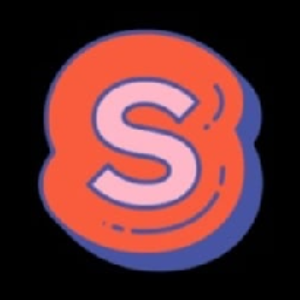 | 67923 | SDO | TheSolanDAO |
|  | 151727 | MCC | Meshchain Ai |
|  | 147189 | ANEX | AstroNexus |
|  | 136389 | AVACN | AVACOIN |
|  | 128861 | SOMDEJ | Somdejcoin |
|  | 79089 | LWC | Linework Coin |
| 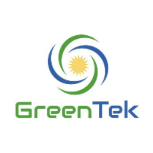 | 60455 | GTE | GreenTek |
| 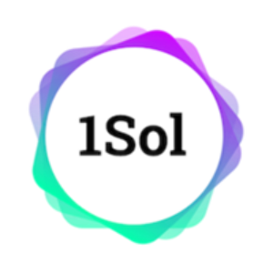 | 60543 | 1SOL | 1Sol |
|  | 42480 | GDR | Guider |
| 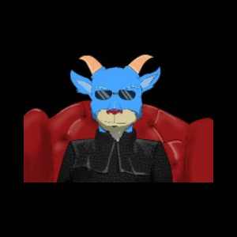 | 146687 | SENTAI | SentAI |
|  | 146923 | GROK AI | Grok Ai |
| 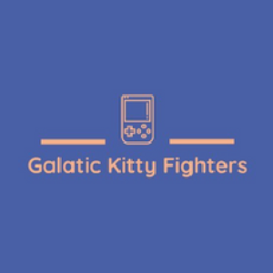 | 64201 | GKF | Galatic Kitty Fighters |
| 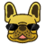 | 147181 | BONKERS | Bonkers Meme Token |
|  | 63911 | GS1 | NFTGamingStars |
|  | 154303 | VR1 | VR1 |
|  | 152167 | FULA | Functionland |
| 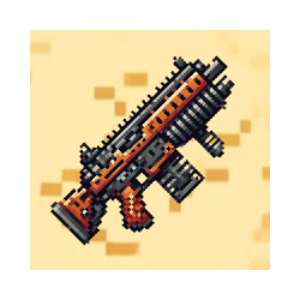 | 138019 | SR30 | SatsRush |
|  | 131537 | EGAX | Egochain |
|  | 132449 | GSTOP | GameStop |
|  | 128455 | TRUMPEPE | Trump Pepe |
| 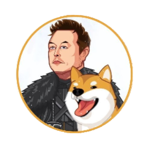 | 115573 | ELONDOGE | ELON DOGE |
|  | 112295 | JAB | Jable |
|  | 99821 | COINBT | CoinBot |
|  | 61463 | NAO | NFTDAO |
|  | 155567 | ROSSCOIN | Rosscoin |
|  | 154985 | PHANT | Phantom GhostDOG |
|  | 150191 | ANOK | Anokas Network |
|  | 146213 | ROSY | Rosy |
|  | 145993 | XTE | traaitt |
| 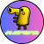 | 146039 | JUMP4EVER | Jump Forever |
|  | 146287 | OCV | Ocvcoin |
| 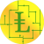 | 149117 | LCN | Lyncoin |
|  | 148979 | AIDP | AI-DePIN |
|  | 145631 | BTCW | BitcoinPoW |
| 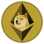 | 149251 | DOGETHER | Dogether |
|  | 149741 | AYIN | Ayin |
| 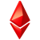 | 149885 | REDEV2 | Redecoin |
| 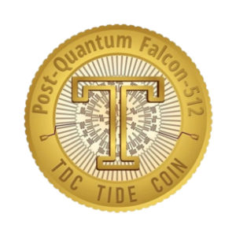 | 148511 | TDC | Tidecoin |
| 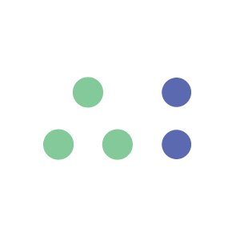 | 145901 | AITT | Aittcoin |
|  | 148937 | LRS | Larissa Blockchain |
|  | 146075 | DIAC | Diabase |
|  | 145365 | BGA | Bugna |
|  | 146329 | DOGM | Dogmcoin |
|  | 146045 | KFN | Kafenio Coin |
| 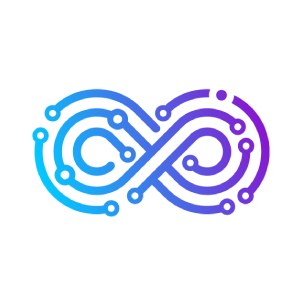 | 149969 | MTBC | Mateable |
| 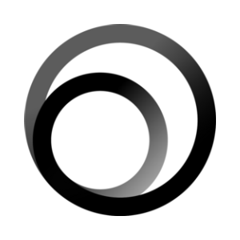 | 145409 | OSMI | Osmium |
|  | 126085 | 0XLP | 0xLiquidity |
|  | 126369 | ROD | SpaceXpanse |
| 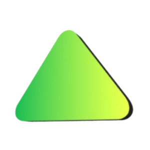 | 124717 | AVN | Avian |
| 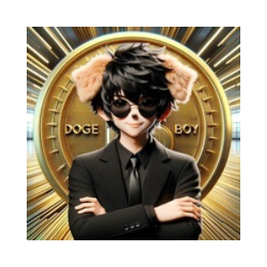 | 125165 | DOGB | DogeBoy |
| 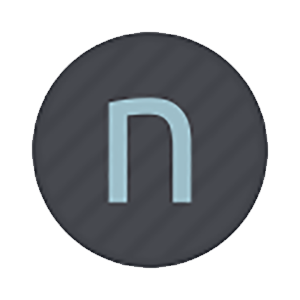 | 113815 | NRC | Nodes Reward Coin |
|  | 113623 | TRES | Tres Chain |
| 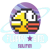 | 113911 | FEVO | Flappy Bird Evolution |
| 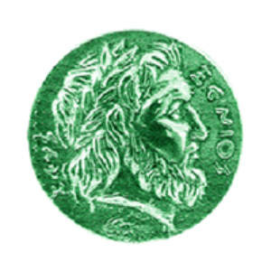 | 121791 | XNC | XeniosCoin |
| 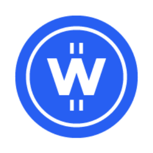 | 97791 | WECO | WECOIN |
| 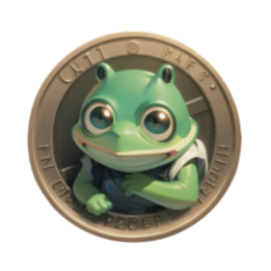 | 99125 | PEPEW | PEPEPOW |
| 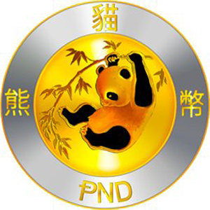 | 77849 | PND | Pandacoin |
|  | 71477 | PLSR | Pulsar Coin |
|  | 69233 | RIA | aRIA Currency |
|  | 65263 | IXI | IxiCash |
|  | 61139 | VGC | 5G-CASH |
| 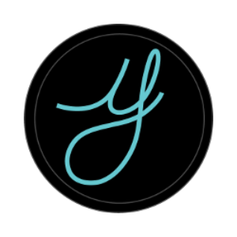 | 50735 | YDA | YadaCoin |
|  | 51647 | HRLD | Haroldcoin |
|  | 43039 | SWAMP | Swamp Coin |
| 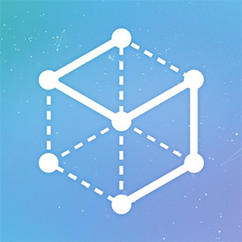 | 42775 | SUGAR | Sugarchain |
| 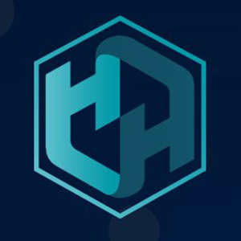 | 36394 | HTA | Historia |
|  | 36375 | RIL | Rilcoin |
|  | 36571 | YEC | Ycash |
| 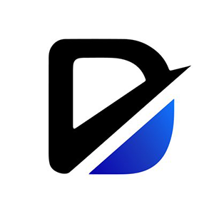 | 34412 | DVT | DeVault |
| 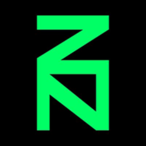 | 33901 | ZNN | Zenon |
|  | 33774 | S4F | S4FE |
| 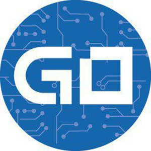 | 11844 | GBX | GoByte |
| 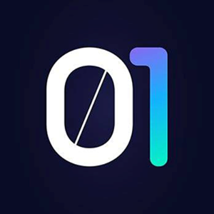 | 33304 | ZOC | 01coin |
| 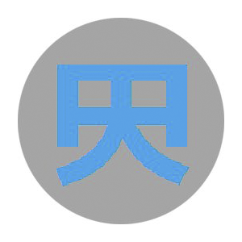 | 32573 | YTN | YENTEN |
| 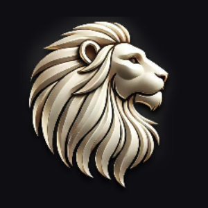 | 33144 | PGN | Pigeoncoin |
|  | 32741 | CLO | Callisto Network |
|  | 1796 | IFC | InfiniteCoin |
| 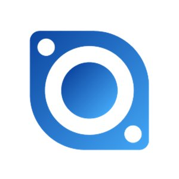 | 3111 | ESP | Espers |
| 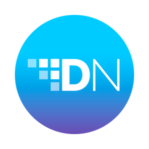 | 32 | XDN | DigitalNote |
| 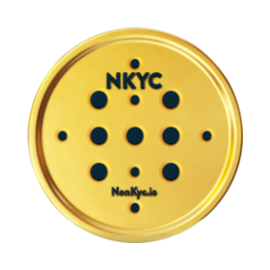 | 113007 | NKYC | NKYC Token |
| 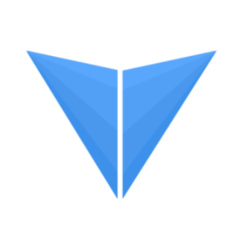 | 70243 | LITHO | Lithosphere |
| 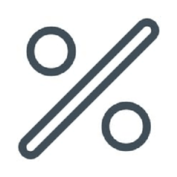 | 68723 | TAX | MetaToll |
|  | 55211 | ARTR | Artery |
| 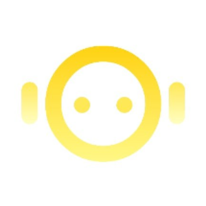 | 80461 | TKB | TokenBot |
| 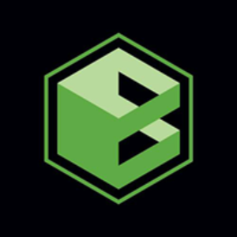 | 44081 | ANW | Anchor Neural World Token |
|  | 41939 | REDI | REDi |
|  | 55569 | PIXIU | Pixiu Finance |
|  | 90267 | EXD | Exorde |
| 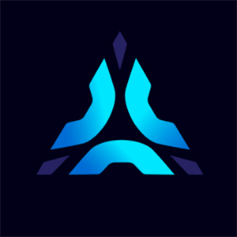 | 151539 | ADN | Aiden labs |
| 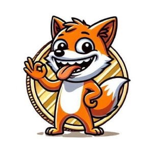 | 148041 | JFOX | JuniperFox AI |
|  | 128875 | DGNX | DegenX |
| 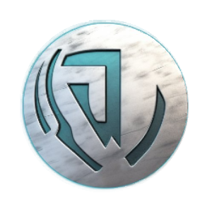 | 111975 | TIN | Token IN |
| 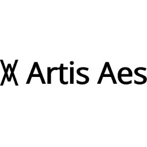 | 95787 | AES | Aqua Farm |
| 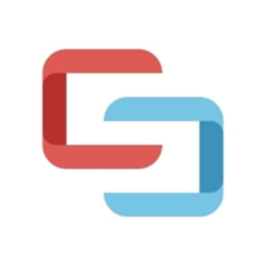 | 46792 | MSB | Misbloc |
| 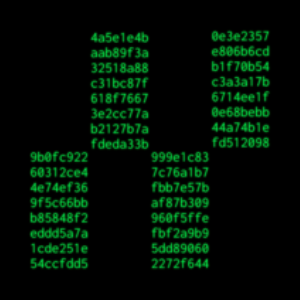 | 147077 | HTERM | Hiero Terminal |
|  | 146717 | SSDX | SpunkySDX |
| 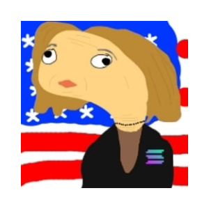 | 136411 | KAMA | Kamala Horris |
| 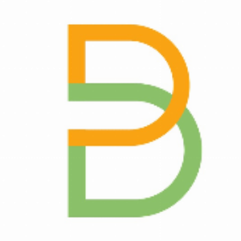 | 123401 | BDID | BDID |
|  | 70757 | XGBL | Xungible |
|  | 64773 | LOOMOLD | Loom Network (OLD) |
| 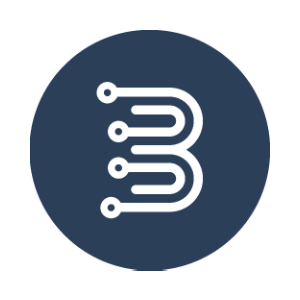 | 48355 | BRMV | BRMV Token |
|  | 48105 | BRCP | BRCP Token |
| 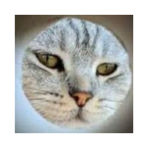 | 136161 | MUNCAT | MUNCAT |
| 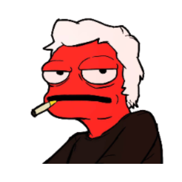 | 141677 | ZAPO | Zapo AI |
|  | 97225 | CAPO | IL CAPO OF CRYPTO |
| 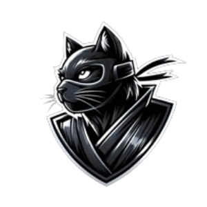 | 141557 | NINJACAT | NinjaCat |
|  | 127617 | GOLDCAT | GOLD CAT |
| 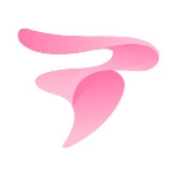 | 90469 | RAB | Rabbit Wallet |
| 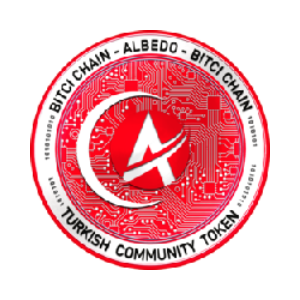 | 88891 | ALBEDO | ALBEDO |
| 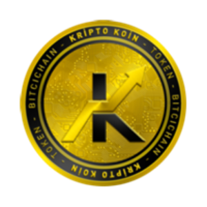 | 77863 | KRIPTO | Kripto |
| 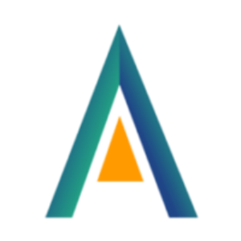 | 43188 | ASY | ASYAGRO |
| 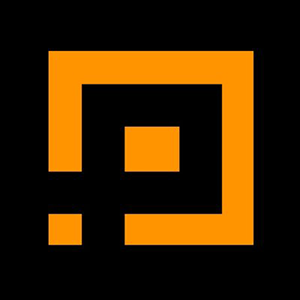 | 33584 | PXG | PlayGame |
|  | 32798 | SSP | Smartshare |
| 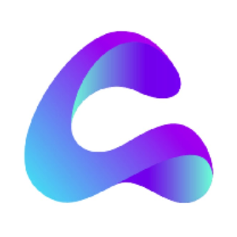 | 56197 | AGN | Agrinoble |
|  | 2732 | GXS | GXChain |
|  | 146603 | SETAI | SETAI Agents |
| 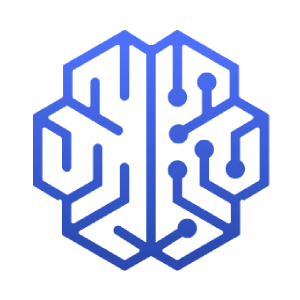 | 136463 | WBC | WorldBrain Coin |
| 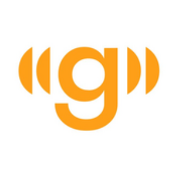 | 135319 | GROOVE | GROOVE |
| 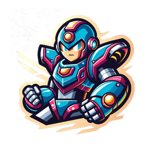 | 128581 | MEGAHERO | MEGAHERO |
| 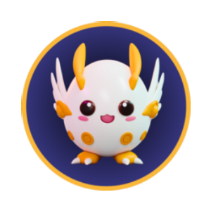 | 127143 | EGGY | EGGY |
| 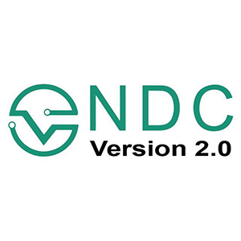 | 68173 | VNDC | VNDC |
| 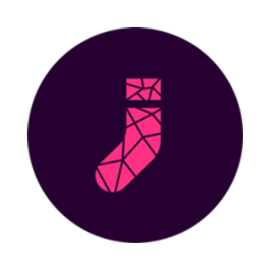 | 44171 | JACK | Jack Token |
|  | 148061 | SPACEM | SPACEM |
| 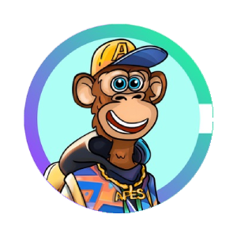 | 136375 | APES | APES |
|  | 125451 | RTC | Reaction |
| 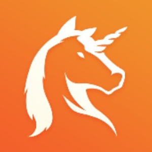 | 99537 | DSRUN | Derby Stars RUN |
| 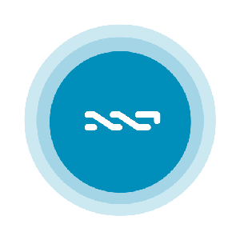 | 7 | NXT | NXT |
|  | 146899 | LLC | LNBG London Coin |
|  | 123061 | XRLM | xRealm.ai |
| 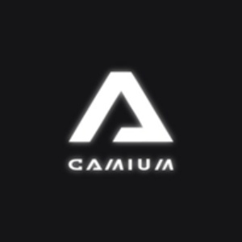 | 44887 | GMM | Gold Mining Members |
| 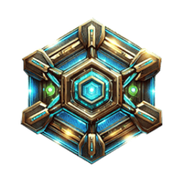 | 150907 | HEROESAI | HEROES AI |
| 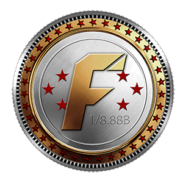 | 127571 | FIT | 300FIT NETWORK |
|  | 134289 | GTBOT | Gaming-T-Bot |
|  | 99867 | $FMB | FlappyMoonbird |
|  | 141847 | WAAC | Wrapped  AyeAyeCoin |
|  | 142309 | SAGE | Sage |
| 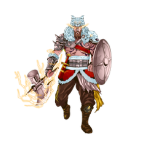 | 77319 | VIK | VIKTAMA |
| 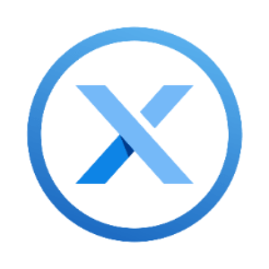 | 141843 | XNET | XNET Mobile |
|  | 80103 | HONR | DeltaFlare |
|  | 62813 | TBC | TeraBlock |
|  | 60329 | $DOGEALLY | Doge Alliance |
|  | 151001 | BRLN | Brillion |
|  | 146519 | VNTR | VentureMind AI |
| 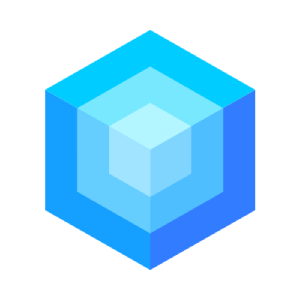 | 147145 | AWARE | ChainAware.ai |
| 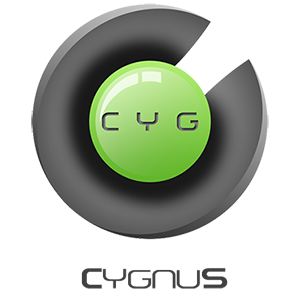 | 144641 | CYG | Cyclix Games |
| 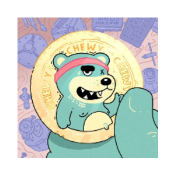 | 142049 | CHEWY | Chewy |
|  | 146827 | NEROX | NEROX AI |
| 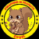 | 141355 | SQRL | Squirrel Swap |
|  | 148149 | SUIRWA | Sui RWA |
| 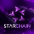 | 147231 | STRC | StarChain |
|  | 131921 | SOUTH | DeepSouth AI |
| 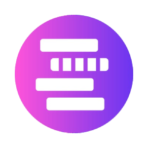 | 137705 | YIDO | Yidocy Plus |
|  | 131371 | VALOR | Valor Token |
|  | 126055 | SGE | Six Sigma |
| 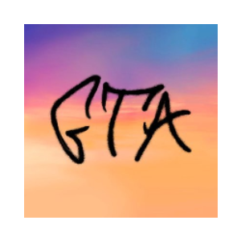 | 127087 | GTA | GTA Token |
|  | 126479 | NFTC | NFT Combining |
|  | 121943 | MMA | Meme Alliance |
| 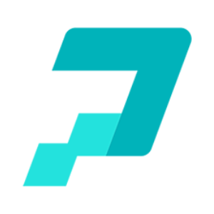 | 113037 | PAYS | Payslink Token |
| 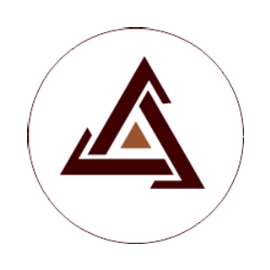 | 113965 | ATRNO | ATRNO |
|  | 102741 | GORILLA | Harry |
| 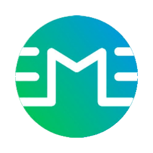 | 89869 | MOBX | MOBIX |
| 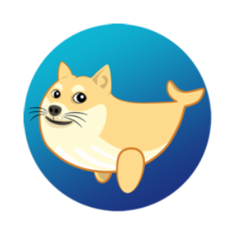 | 60859 | DOGEWHALE | Dogewhale |
|  | 61913 | COVN | Covenant |
|  | 57647 | GMEX | Game Coin |
| 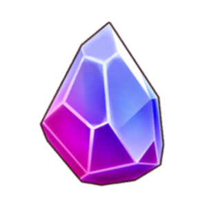 | 55053 | ETERNAL | CryptoMines |
| 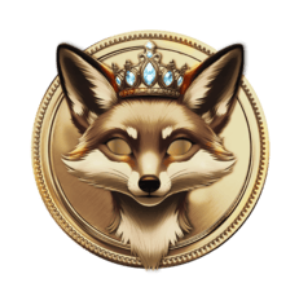 | 151777 | SHRX | Sherex |
|  | 71221 | PRANA | Nirvana prANA |
|  | 69749 | YAW | Yawww |
| 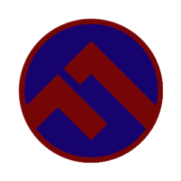 | 50043 | FUNDX | Funder One |
|  | 46349 | PAYT | PayAccept |
|  | 44583 | GUAP | Guapcoin |
|  | 42898 | EYES | EYES Protocol |
| 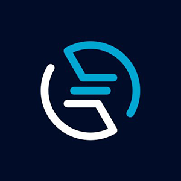 | 36478 | ENQ | Enecuum |
| 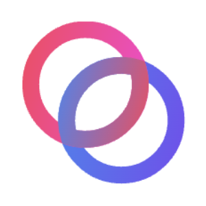 | 80165 | REBUS | Rebus |
|  | 46317 | AEL | Aelysir |
| 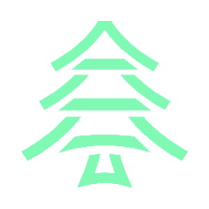 | 36646 | PINE | Pinecoin |
| 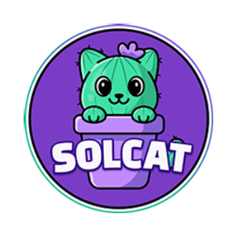 | 131581 | SOLCAT | CatSolHat |
| 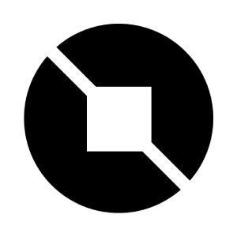 | 65287 | ODIN | Odin Protocol |
| 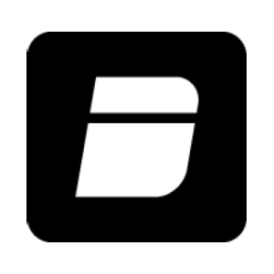 | 56183 | DBA | Digital Bank of Africa |
| 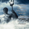 | 155287 | POSEIDON | Poseidon |
| 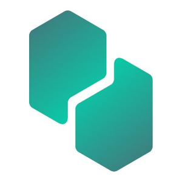 | 144293 | PAL | Pal |
| 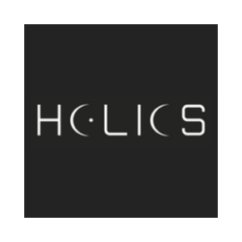 | 55177 | HELIOS | Mission Helios |
| 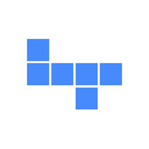 | 33181 | PASS | Blockpass |
| 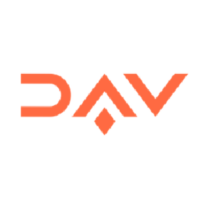 | 33474 | DAV | DAV Coin |
| 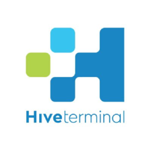 | 2937 | HVN | Hive Project |
|  | 131749 | STOG | Stooges |
|  | 49329 | BARMY | BscArmy |
|  | 141741 | COPA | COCO PARK |
|  | 143063 | SITY | Versity |
| 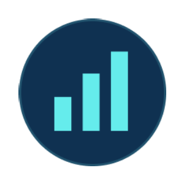 | 137439 | DENTX | DENTNet |
| 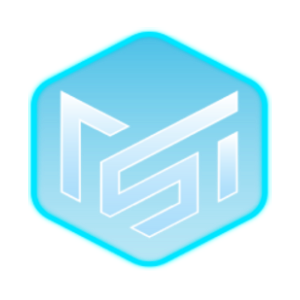 | 136525 | MTMS | MTMS Network |
| 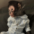 | 144539 | JORGIE | Monkey Taken By Police |
| 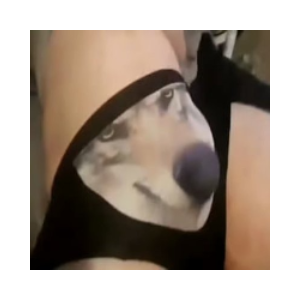 | 127435 | BALLZ | Wolf Wif |
| 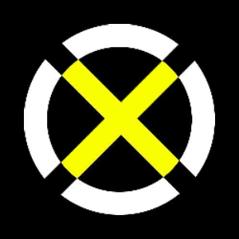 | 127411 | ICNX | Icon.X World |
| 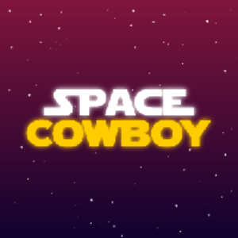 | 122697 | SCB | Sacabam |
|  | 126791 | SMOG | Smog |
|  | 125933 | MAAL | Maal Chain |
| 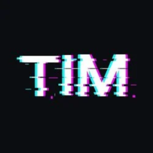 | 113559 | TIM | TIMTIM GAMES |
| 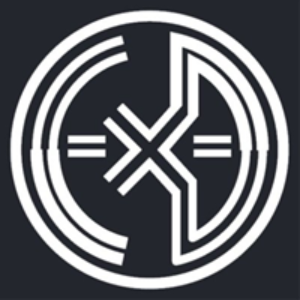 | 122171 | CDX | CodeXchain |
|  | 115571 | ELONMARS | ELON MARS |
| 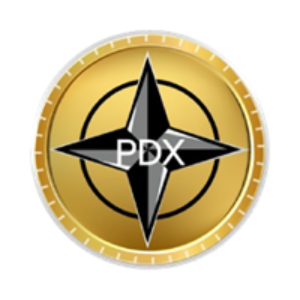 | 122121 | PDX | PDX Coin |
| 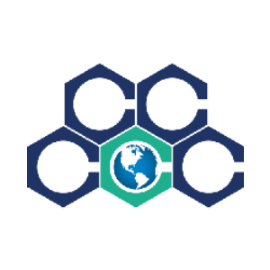 | 97733 | CLNX | Coloniume Network |
| 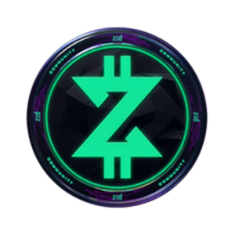 | 101617 | ZED | ZED Token |
| 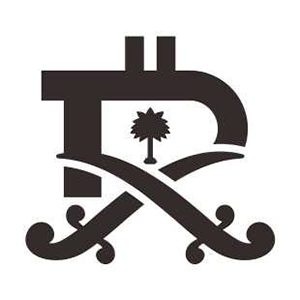 | 99105 | CR | Crypto Rangers |
|  | 93971 | KOY | Koyo |
| 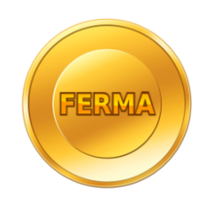 | 71303 | FERMA | Ferma |
| 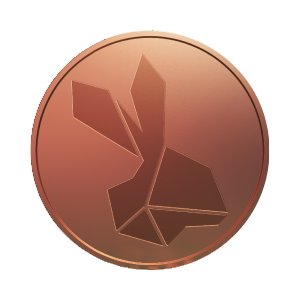 | 78351 | TOKKI | CRYPTOKKI |
| 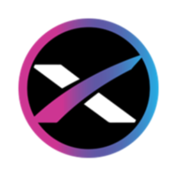 | 68103 | IPX | Tachyon Protocol |
| 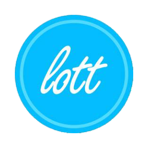 | 67783 | LOTT | LOT.TRADE |
| 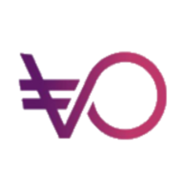 | 44120 | VRO | VeraOne |
|  | 33688 | ECTE | EurocoinToken |
| 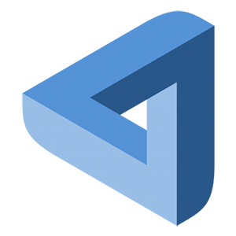 | 95 | MAID | MaidSafeCoin |
| 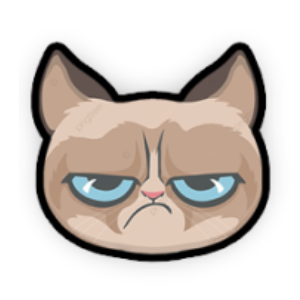 | 136731 | PONZIO | Ponzio The Cat |
| 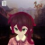 | 145711 | XLG | xiao lang gou |
|  | 132889 | CROW | Crow |
|  | 131691 | IVEX | IVEX Financial |
| 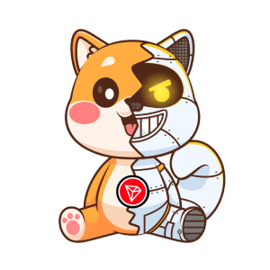 | 136465 | TRONDOG | TronDog |
| 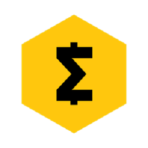 | 2309 | SMART | SmartCash |
| 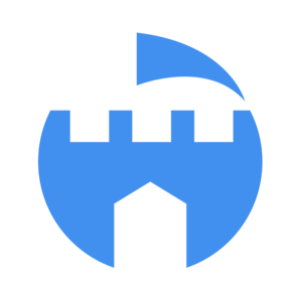 | 71487 | CASTLE | bitCastle |
| 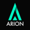 | 33030 | ARION | Arion |
|  | 144887 | LONK | Lonk |
| 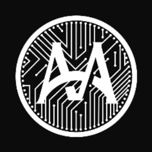 | 131025 | ROM | ROMCOIN |
| 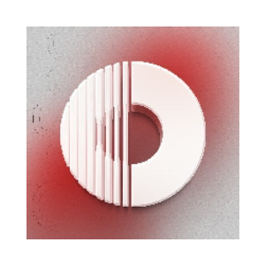 | 122219 | OPSEC | OpSec |
| 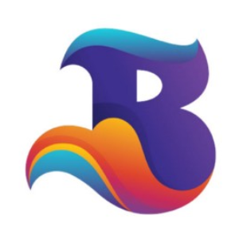 | 58167 | BSI | Bali Social Integrated |
|  | 146327 | BRAM | Defibox bRAM |
| 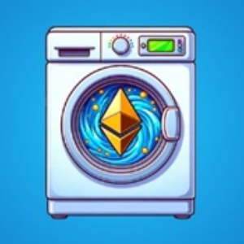 | 123359 | LNDRY | LNDRY |
|  | 96993 | 4CHAN | 4-CHAN |
| 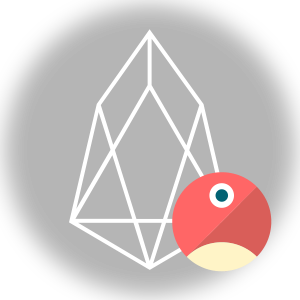 | 33891 | PEOS | pEOS |
|  | 131073 | IMARO | IMARO |
|  | 123043 | SIMP | SO-COL |
| 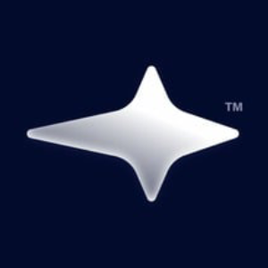 | 33831 | MON | Moneybyte |
|  | 151335 | VPT | Veritas Protocol |
|  | 151693 | CHPD | Chirppad |
| 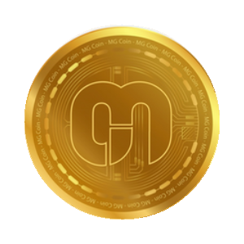 | 147533 | MGC | Meta Games Coin |
|  | 142869 | LAOS | LAOS Network |
|  | 146643 | RG | Real Games |
| 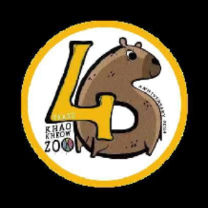 | 141713 | KHEOWZOO | khaokheowzoo |
| 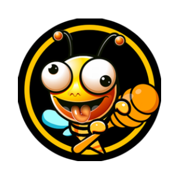 | 137485 | NCTR | Apillon |
| 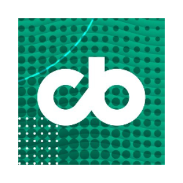 | 136513 | CBPAY | COINBAR PAY |
| 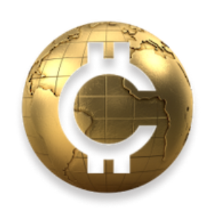 | 127023 | CRH | Crypto Hunters Coin |
| 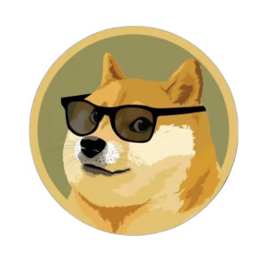 | 130307 | DOGE20 | Dogecoin20 |
| 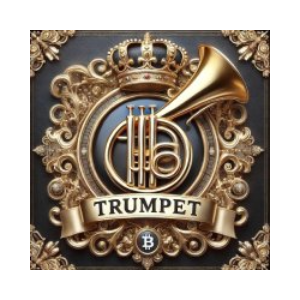 | 123059 | TTT | TabTrader Token |
|  | 113529 | W3F | Web3Frontier |
|  | 121811 | RPG | Rangers Protocol |
| 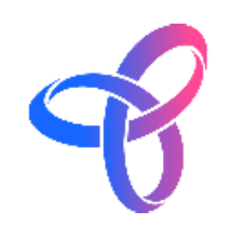 | 112533 | CEX | ChainEx |
|  | 102019 | GUC | Green Universe Coin |
|  | 100119 | RILLA | RillaFi |
|  | 80183 | MRST | Mars Token |
| 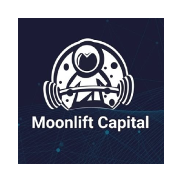 | 66895 | MLTPX | Moonlift Capital |
|  | 61595 | MOM | Mother of Memes |
|  | 55139 | TORG | TORG |
|  | 56361 | BHO | Bholdus Token |
|  | 51201 | FOY | Fund Of Yours |
|  | 48965 | TCAKE | PancakeTools |
| 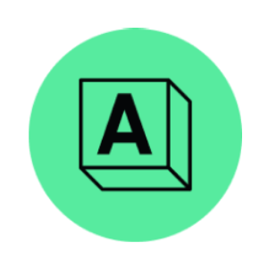 | 131891 | AIBCOIN | AIBLOCK |
|  | 99185 | DGLD | SPDR Gold Shares Defichain |
|  | 66881 | AXSET | Axie Infinity Shard (Wormhole) |
| 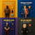 | 154673 | FIGURE | Action Figure |
| 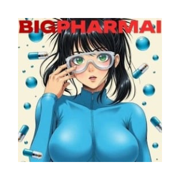 | 148335 | DRUGS | Big Pharmai |
|  | 61265 | VIBLO | VIBLO |
|  | 146595 | SIMAI | Simian AI |
|  | 113151 | RIOT | Riot Racers |
|  | 56613 | ADABOY | ADABoy |
|  | 45232 | DEXG | Dextoken Governance |
|  | 146611 | AIYP | Agent YP by Virtuals |
| 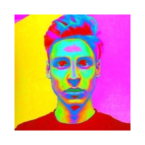 | 148141 | PASTERNAK | Ben Pasternak |
| 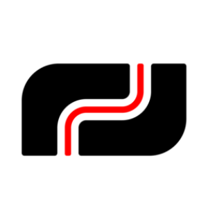 | 137497 | FU | FU coin |
|  | 136771 | REBD | REBORN |
| 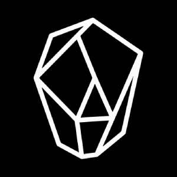 | 138731 | BSTC | BST Chain |
| 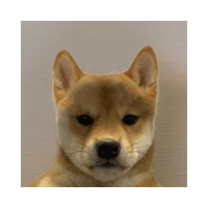 | 130965 | NOHAT | DogWifNoHat |
|  | 127261 | RIVUS | RivusDAO |
| 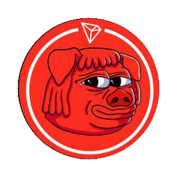 | 127317 | FOFAR | Fofar |
| 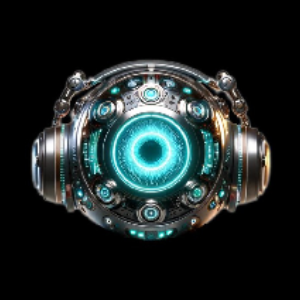 | 128213 | BABYSORA | Baby Sora |
|  | 127947 | AXO | Axo |
|  | 127951 | WALK | Walk Token |
|  | 127399 | BRIUN | Briun Armstrung |
| 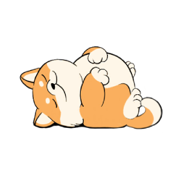 | 122399 | CHINU | Chinu |
|  | 126427 | PELF | PELFORT |
|  | 126189 | CHAX | CHAX |
| 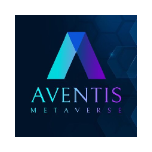 | 114553 | AVTM | Aventis Metaverse |
| 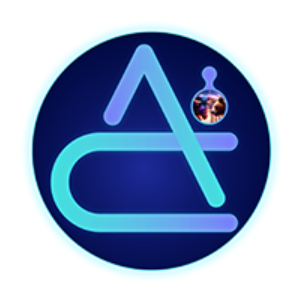 | 115357 | AICORE | AICORE |
|  | 111835 | IUS | Iustitia Coin |
|  | 100059 | ZKID | zkSync id |
|  | 79413 | NZERO | NETZERO |
| 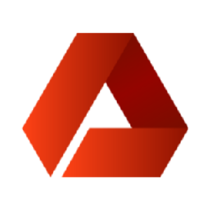 | 78739 | ATNT | Artizen |
|  | 68937 | UNM | UNIUM |
| 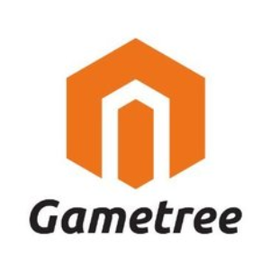 | 69225 | GTCOIN | Game Tree |
| 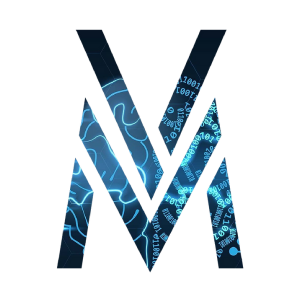 | 66869 | MVRS | Meta MVRS |
| 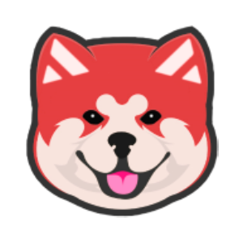 | 62053 | AKITAX | Akitavax |
|  | 54417 | TAB | TABANK |
| 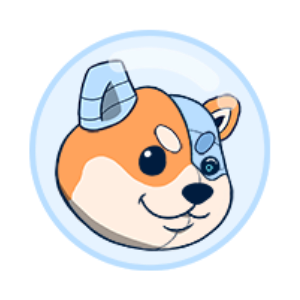 | 50743 | KODA | Koda Finance |
|  | 42715 | CICC | CAICA Coin |
| 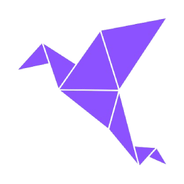 | 151715 | DISTRIBUTE | DISTRIBUTE |
| 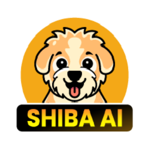 | 127407 | SHIBAAI | SHIBAAI |
| 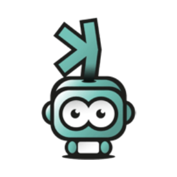 | 145343 | KASBOT | KASBOT |
| 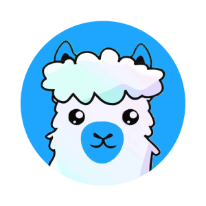 | 141373 | SUILAMA | Suilama |
|  | 142123 | WHISKEY | WHISKEY |
| 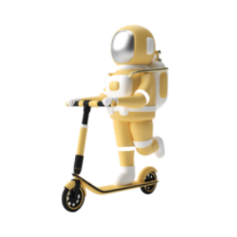 | 126929 | JOOPS | JOOPS |
|  | 89861 | GBSK | Gençlerbirliği Fan Token |
|  | 78107 | RFT | Rangers Fan Token |
|  | 67251 | BINO | Binopoly |
| 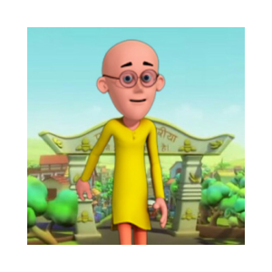 | 153925 | PATLU | Patlu |
|  | 146613 | MSCHINA | Miss China |
| 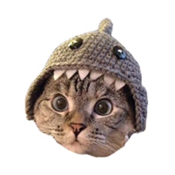 | 143119 | SHAR | SHARPEI |
|  | 113381 | EMOTI | EmotiCoin |
|  | 56737 | TUBE2 | TUBE2 |
|  | 150745 | FALCON | FalconsInu |
|  | 148737 | KDR | KDR |
|  | 142783 | MINGO | Mingo |
| 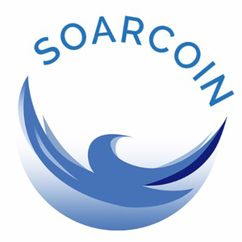 | 147227 | SOAR | Soarchain |
| 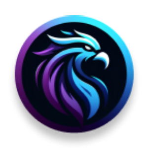 | 131595 | FALX | FalconX |
| 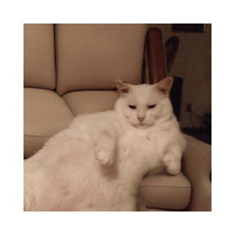 | 141385 | SOFAC | SofaCat |
| 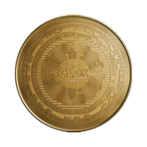 | 124419 | GLDX | Goldex Token |
| 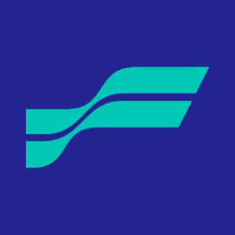 | 121931 | FWT | Freeway Token |
| 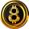 | 112531 | CB8 | chabit |
| 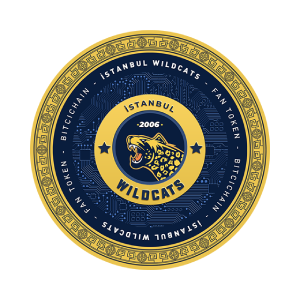 | 112747 | IWFT | İstanbul Wild Cats Fan Token |
| 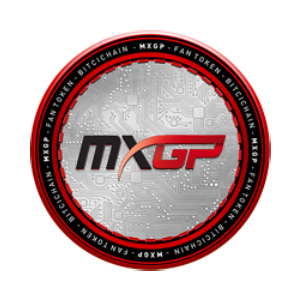 | 101705 | MXGP | MXGP Fan Token |
|  | 90137 | FILM | Decentralized Pictures |
| 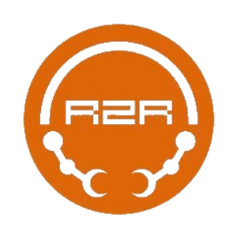 | 81539 | R2R | CitiOs |
|  | 79633 | MSCT | Muse ENT NFT |
| 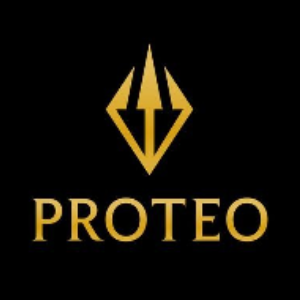 | 82297 | PROTEO | Proteo DeFi |
| 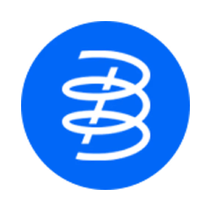 | 70993 | BENX | BlueBenx |
| 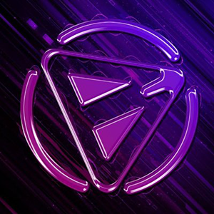 | 68783 | BTZC | BeatzCoin |
| 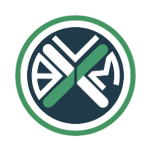 | 57103 | BLXM | bloXmove Token |
| 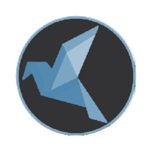 | 53469 | CLBR | Colibri Protocol |
| 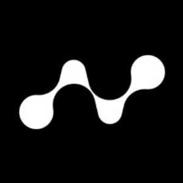 | 50585 | NC | Nayuta Coin |
|  | 46920 | YFB2 | Yearn Finance Bit2 |
|  | 45254 | BSY | Bestay |
| 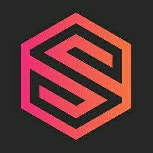 | 45238 | STOP | SatoPay |
| 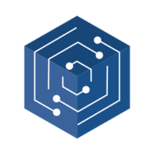 | 45036 | LIMEX | Limestone Network |
| 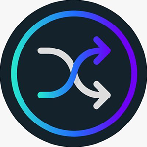 | 43056 | ESH | Switch |
|  | 44821 | UHP | Ulgen Hash Power |
|  | 42610 | GOC | GoCrypto Token |
| 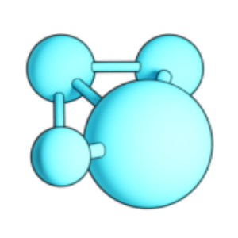 | 27 | CURE | CureCoin |
| 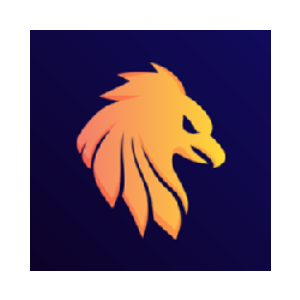 | 133017 | GENI | Genius |
| 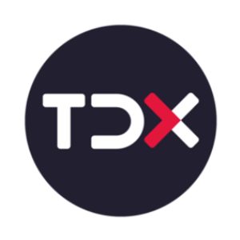 | 32556 | TDX | Tidex Token |
| 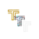 | 114063 | TRRXITTE | TRRXITTE International |
|  | 99347 | ECHO | Echo Bot |
|  | 80617 | TIKKY | Tikky Inu |
| 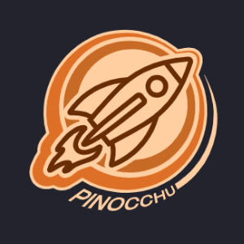 | 141271 | PINO | Pino |
|  | 133959 | COKE | Core Keeper |
| 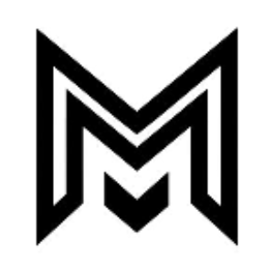 | 122687 | MZR | Mazuri GameFi |
|  | 148901 | ZTH | Zether |
|  | 126265 | MRGN | Mergen |
| 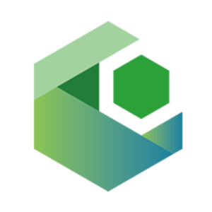 | 115195 | TROSS | Trossard |
|  | 113045 | PTSHP | Petshop.io |
|  | 112585 | MTGRD | MetaGuard |
|  | 113241 | ALIENB | AlienB |
|  | 113469 | LIDYA | Lidya |
| 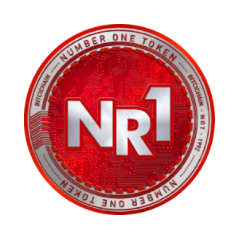 | 111869 | NR1 | Number 1 |
|  | 112985 | NPAI | NeuroPulse AI |
|  | 113287 | BEDU | Bitci EDU |
| 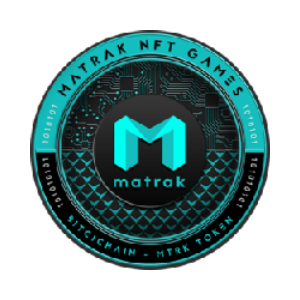 | 94673 | MTRK | Matrak Fan Token |
|  | 95147 | VRM | VRMARS |
| 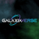 | 93899 | GLXIA | GalaxiaVerse |
|  | 95071 | GLFT | Global Fan Token |
| 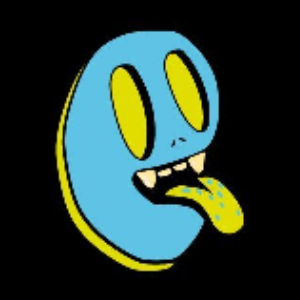 | 96531 | DELI | NFTDeli |
| 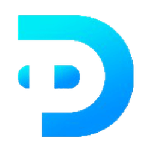 | 66645 | DAD | DAD |
| 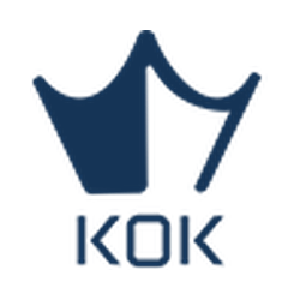 | 66061 | KOK | KOK Coin |
| 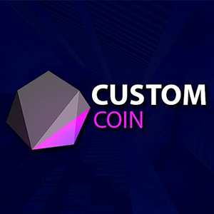 | 44589 | CHFT | Crypto Holding Frank Token |
| 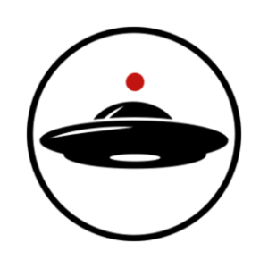 | 36441 | TRV | TrustVerse |
| 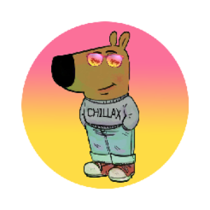 | 147115 | CHILLAX | Chillax |
|  | 146727 | MEAI | MeAI |
| 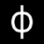 | 146485 | ASSAI | ASSAI |
| 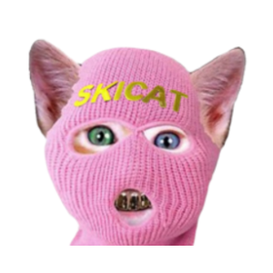 | 146499 | SKICAT | Ski Mask Cat |
| 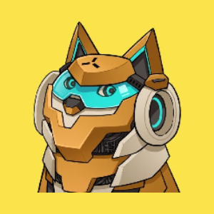 | 142155 | EDOG | EDOG |
| 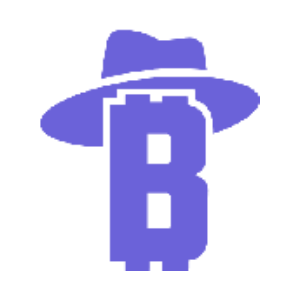 | 131787 | BARS | Banksters Token |
| 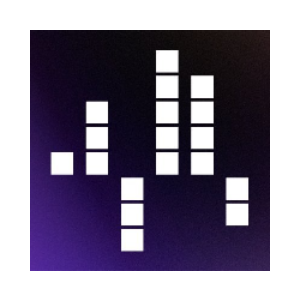 | 141801 | RECORD | Music Protocol |
| 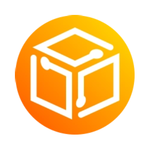 | 130375 | BDROP | BlockDrop |
|  | 121923 | GLINT | BeamSwap |
|  | 90783 | PIVN | PIVN |
|  | 79357 | TPY | Thrupenny |
| 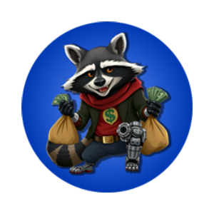 | 153339 | BANDIT | Bandit on Base |
|  | 151469 | GBB | GameBeeBSC |
|  | 137153 | CBAB | CreBit |
|  | 125751 | $AURA | $AURA |
| 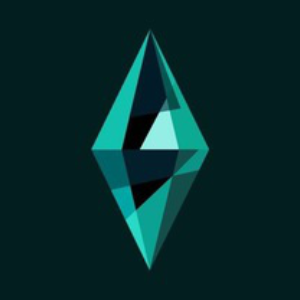 | 122285 | DGI | DGI Game |
|  | 113135 | SLK | Starlink Program |
| 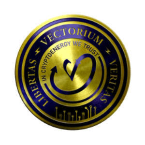 | 41257 | VECT | Vectorium Flash |
|  | 124875 | LGOLD | LYFE GOLD |
|  | 122203 | TLC | Trillioner |
|  | 93853 | $DOJO | Dojo Supercomputer |
|  | 94955 | CARTEL | Cartel Coin |
|  | 126533 | 4DC | 4DCoin |
|  | 111605 | GRG | RigoBlock |
| 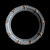 | 148751 | STARGATE | Stargate |
| 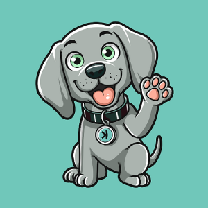 | 150573 | KPAW | KasPaw |
| 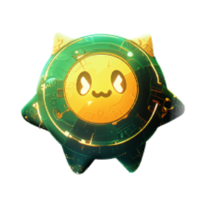 | 147089 | CATG | C.A.T (Crypto Agent Trading) |
|  | 113637 | MTMN | META MINE |
|  | 145273 | ARGY | Argy Bargy Token |
| 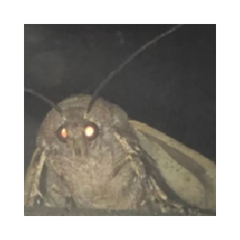 | 136211 | MOTH | MOTH |
|  | 68971 | JK | JK Coin |
| 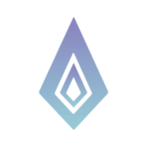 | 32994 | EGEM | EtherGem |
|  | 70333 | CLXY | Calaxy |
| 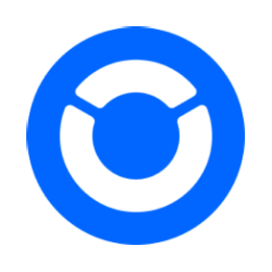 | 67829 | ONUS | ONUS |
| 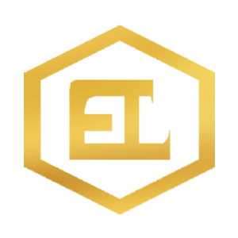 | 123409 | ETRL | Ethereal |
|  | 113023 | OTACON | Otacon AI |
| 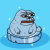 | 145567 | SUICY | SUICY the Seal |
| 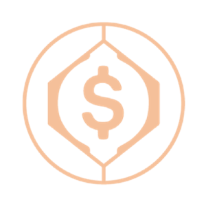 | 64717 | ALUSD | Alchemix USD |
| 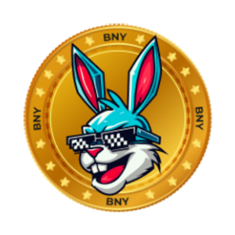 | 145185 | BNY | TaskBunny |
|  | 146139 | DED | DED |
|  | 141775 | LUMOS | Lumos |
|  | 141619 | DADDYCHILL | Daddy Chill |
|  | 132795 | XBLAZE | Trailblaze |
| 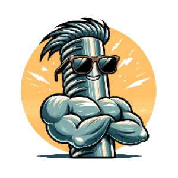 | 127615 | RODAI | ROD.AI |
| 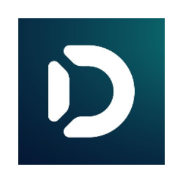 | 127523 | DCI | Decentralized Cloud Infrastructure |
|  | 128273 | COME | Community of Meme |
| 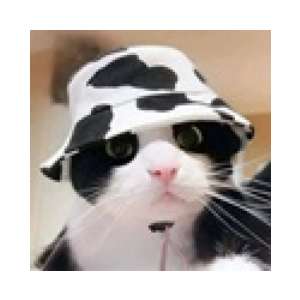 | 131649 | MOOCAT | MooCat |
| 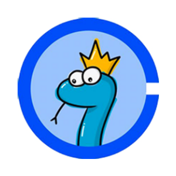 | 131627 | MAMBA | Mamba |
| 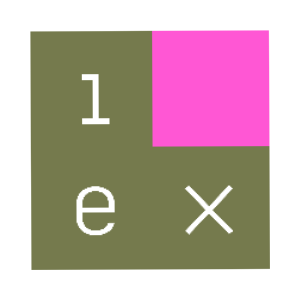 | 126089 | 1EX | 1ex |
| 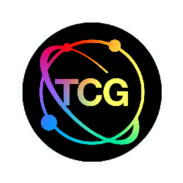 | 99723 | TCGC | TCG Verse |
| 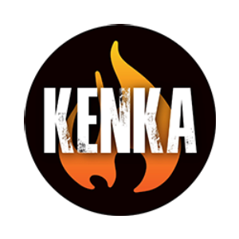 | 82159 | KENKA | KENKA METAVERSE |
| 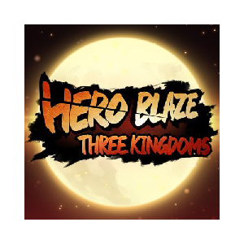 | 71089 | MUDOL2 | Hero Blaze: Three Kingdoms |
|  | 65091 | LFG | Gamerse |
|  | 55389 | UPPS | UppsMe |
|  | 46748 | MTTCOIN | MTTCoin |
|  | 34783 | MCM | Mochimo |
| 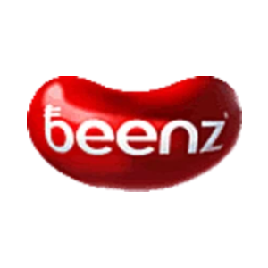 | 150227 | BEENZ | BEENZ |
|  | 146481 | TRENCHAI | Trenches AI |
| 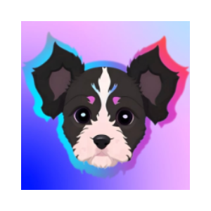 | 142685 | MYRE | Myre |
| 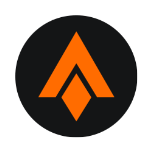 | 127695 | AGG | AGG |
|  | 130407 | SYNO | Synonym Finance |
|  | 122557 | KON | KONPAY |
| 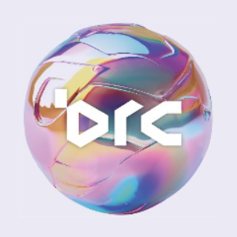 | 122811 | BRCT | BRC App |
| 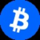 | 112473 | BIP1 | BIP1 |
|  | 79983 | INKZ | INKz |
| 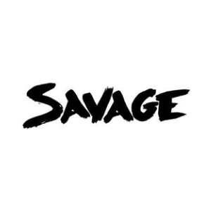 | 63309 | SAVG | SAVAGE |
|  | 60277 | SFIL | Filecoin Standard Full Hashrate |
|  | 47136 | DIXT | Dixt Finance |
| 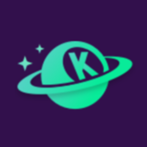 | 36583 | KGC | Krypton Galaxy Coin |
|  | 146079 | DAOT | Daoversal |
|  | 55573 | FIRU | Firulais |
| 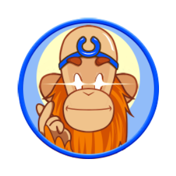 | 136359 | TYBENG | TYBENG |
| 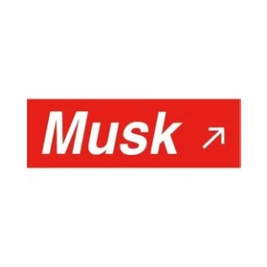 | 34589 | MUSK | Musk |
| 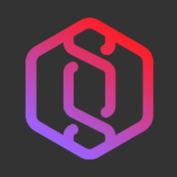 | 124361 | PGEN | Polygen |
| 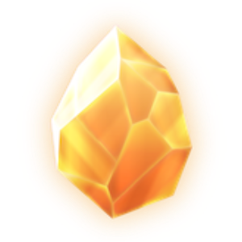 | 123691 | XGEM | Exchange Genesis Ethlas Medium |
|  | 112221 | HATCHY | HatchyPocket |
|  | 112165 | ZOLT | Rezolut |
| 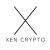 | 90757 | BXEN | XEN Crypto (BSC) |
| 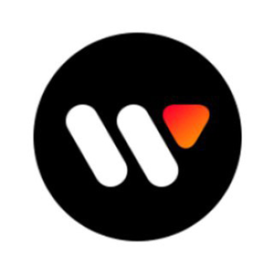 | 85599 | WET | Weble Ecosystem |
|  | 86813 | LIQR | Topshelf Finance |
|  | 80563 | OBX | OpenBlox |
|  | 79053 | BETS | BetSwirl |
|  | 70507 | SPORT | SPORT |
|  | 69649 | LOST | Lost World |
|  | 69323 | DLQ | Deliq |
|  | 69877 | QUICKCHART | QuickChart |
| 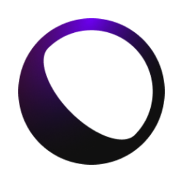 | 68763 | NXTT | Next Earth |
|  | 68315 | TUNDRA | Tundra Token |
| 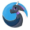 | 65593 | BABYQUICK | BabyQuick |
|  | 65285 | RACEX | RaceX |
| 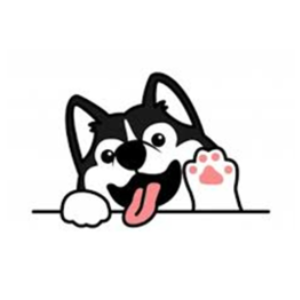 | 65027 | HUSKY | Husky AVAX |
|  | 66171 | BOOFI | Boo Finance |
|  | 65993 | 4INT | 4INT |
| 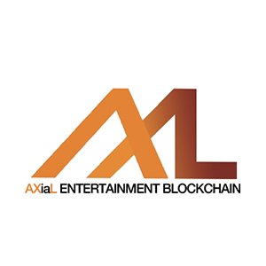 | 65393 | AXIAL | Axial Token |
|  | 65195 | SHIBX | Shibavax |
| 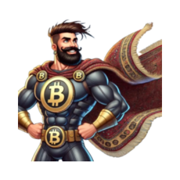 | 65687 | RUGPULL | Rugpull Prevention |
| 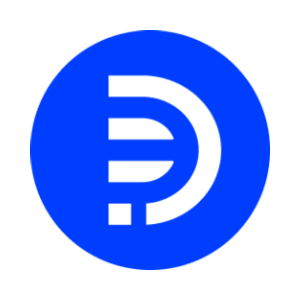 | 65237 | DFIAT | DeFiato |
| 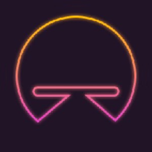 | 65359 | KACY | Kassandra |
|  | 64879 | YAK | Yield Yak |
| 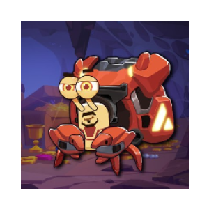 | 64901 | TUS | Treasure Under Sea |
| 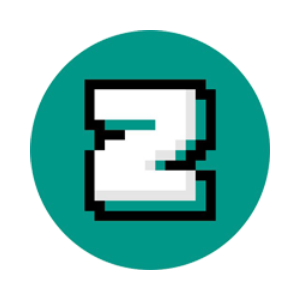 | 64937 | ZOO | ZooKeeper |
| 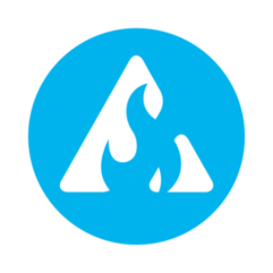 | 64733 | SAVAX | BENQI Liquid Staked AVAX |
|  | 64187 | ECD | Echidna |
|  | 61317 | ISA | Islander |
| 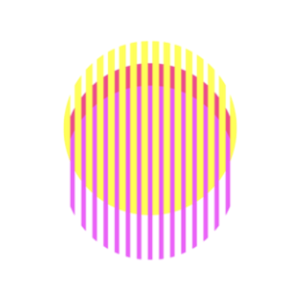 | 59837 | NEWO | New Order |
| 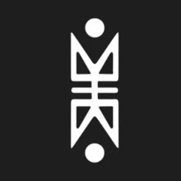 | 60635 | IME | Imperium Empires |
| 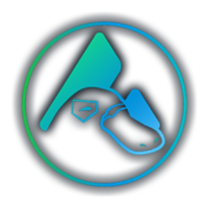 | 60447 | PTP | Platypus Finance |
|  | 58273 | CRA | Crabada |
|  | 48929 | PEFI | Penguin Finance |
| 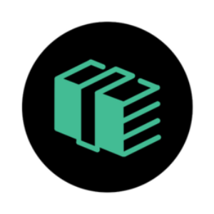 | 46936 | BUND | Bundles |
| 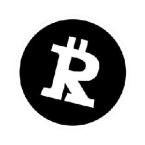 | 130981 | RSIC | RSIC•GENESIS•RUNE |
| 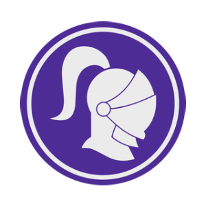 | 53981 | LANC | Lanceria |
| 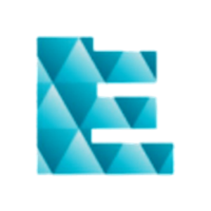 | 11025 | EKO | EchoLink |
| 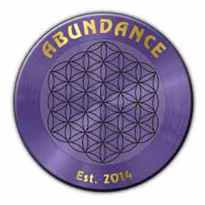 | 32658 | UTT | United Traders Token |
|  | 2985 | VIBE | VIBE |
| 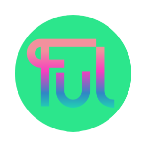 | 147859 | FUL | Fulcrom Finance |
| 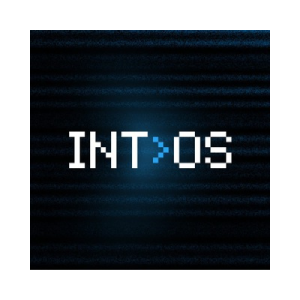 | 147291 | AIOS | INT OS |
| 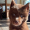 | 146635 | KOVU | Red Siberian Husky |
| 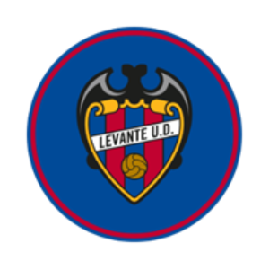 | 143205 | LEV | Lever Token |
|  | 136139 | PAXE | Paxe |
|  | 141823 | MARSO | Marso.Tech |
| 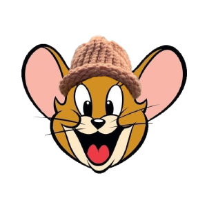 | 136763 | JWIF | Jerrywifhat |
|  | 122919 | PWC | PixelWorldCoin |
| 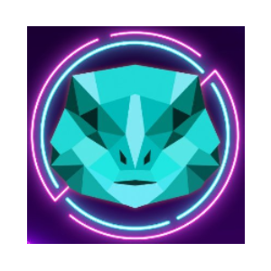 | 122739 | LIZA | Liza |
| 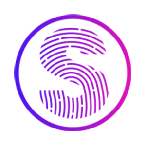 | 111843 | SELF | SELFCrypto |
|  | 89823 | LIS | Realis Network |
|  | 82387 | DGH | Digihealth |
|  | 86059 | 3P | Web3Camp |
|  | 86761 | ROND | ROND |
|  | 87189 | IPUNKS | CryptoPunks Fraction Token |
| 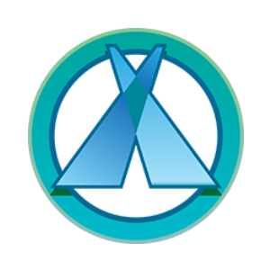 | 70913 | RNDX | Round X |
|  | 70999 | GOTG | Got Guaranteed |
| 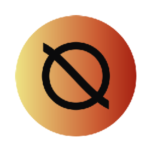 | 69375 | BLUES | Blueshift |
|  | 60855 | WZM | Woozoo Music |
|  | 57069 | ENNO | ENNO Cash |
|  | 57819 | MELI | Meli Games |
| 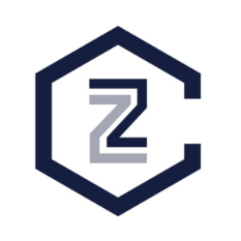 | 49857 | CZZ | ClassZZ |
| 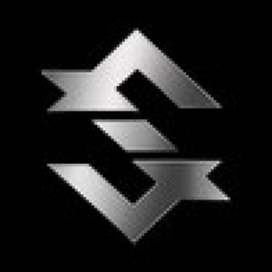 | 127069 | SPCT | Spectra Chain |

---

[← Prev](./list7.md) | [Next →](./list9.md)
