# Cryptocurrency list (page: 9)

[← Prev](./list8.md) | [Next →](./list10.md)

| Logo | ID | Symbol | Name |
|:----:|:--:|:------:|:-----|
|  | 8666 | HITBTC | HitBTC Token |
|  | 8667 | ACB | Aurora Cannabis Inc |
|  | 8668 | ABNB | Airbnb |
|  | 8669 | ARKK | ARK Innovation ETF |
|  | 8670 | APHA | Aphria Inc |
| 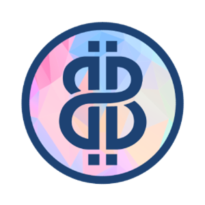 | 8671 | BABYB | Baby Bali |
|  | 8672 | BITW | Bitwise 10 Crypto Index Fund |
|  | 8673 | BNTX | BioNTech |
|  | 8674 | CGC | Canopy Growth Corp |
|  | 8675 | DKNG | DraftKings |
|  | 8676 | ETHE | Grayscale Ethereum Trust |
|  | 8677 | GLXY | Galaxy Digital Holdings |
|  | 8678 | GDXJ | VanEck Vectors Junior Gold Miners Etf |
|  | 8679 | SPDRGOLD | SPDR Gold Shares |
|  | 8681 | HOOD | Robinhood pre-IPO contract |
|  | 8682 | MRNA | Moderna |
|  | 8683 | MSTR | MicroStrategy |
|  | 8684 | NVDA | NVIDIA |
|  | 8685 | PENN | Penn National Gaming |
|  | 8686 | SQ | Square |
|  | 8687 | PYPL | Paypal |
|  | 8688 | TLRY | Tilray |
|  | 8689 | TWTR | Twitter |
|  | 8690 | TSM | Taiwan Semiconductor Mfg |
|  | 8691 | UBER | Uber |
|  | 8692 | USO | United States Oil Fund |
|  | 8694 | OMT | Mars Token |
|  | 8695 | MONARCH | TRUEMONARCH |
|  | 8696 | FLUID | Fluid |
|  | 8697 | PEA | Pea Farm |
|  | 8698 | TONTOKEN | TONToken |
|  | 8699 | FOODC | Food Club |
|  | 8700 | NEFTIPEDIA | NEFTiPEDiA |
|  | 8701 | SFUEL | SparkPoint Fuel |
| 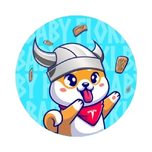 | 8702 | BABYFLOKI | BabyFloki |
|  | 8703 | PANGEA | PANGEA |
|  | 8704 | PYQ | PolyQuity |
|  | 8705 | PAPADOGE | Papa Doge |
|  | 8706 | PEEPS | The People’s Coin |
|  | 8707 | MM | Millimeter |
|  | 8708 | AIDI | Aidi Inu |
|  | 8709 | NBNG | Nobunaga Token |
|  | 8710 | MATPAD | MaticPad |
|  | 8711 | COGE | Cogecoin |
|  | 8712 | PINCHAIN | Pin |
|  | 8713 | INARI | Inari |
|  | 8714 | FOREVERUP | ForeverUp |
|  | 8715 | VRISE | VaporRISE |
|  | 8716 | BAKT | Backed Protocol |
|  | 8717 | ARTG | Goya Giant Token |
|  | 8718 | RAPDOGE | RapDoge |
|  | 8719 | RNBW | Rainbow Token |
|  | 8720 | 2CRZ | 2crazyNFT |
|  | 8721 | WCS | Weecoins |
|  | 8722 | SMBSWAP | SimbCoin Swap |
|  | 8723 | WLITI | wLITI |
|  | 8724 | PDOGE | PolkaDoge |
|  | 8725 | MO | Morality |
|  | 8726 | DEFISCALE | DeFiScale |
|  | 8727 | BYTZ | BYTZ |
|  | 8728 | SUPERBID | SuperBid |
|  | 8730 | MISHKA | Mishka Token |
|  | 8731 | ASTROLION | AstroLion |
|  | 8732 | XRUNE | Thorstarter |
|  | 8733 | DOOR | DOOR |
|  | 8734 | NPLC | Plus Coin |
|  | 8735 | FESS | Fesschain |
|  | 8736 | DDRST | DigiDinar StableToken |
|  | 8737 | G999 | G999 |
|  | 8738 | GREARN | GrEarn |
|  | 8739 | IQQ | Iqoniq |
|  | 8740 | ACXT | ACDX Exchange Token |
|  | 8741 | SLRS | Solrise Finance |
|  | 8742 | SGE | Society of Galactic Exploration |
|  | 8743 | KELPIE | Kelpie Inu |
|  | 8744 | PONZU | Ponzu Inu |
| 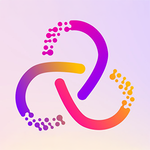 | 8745 | DRE | DoRen |
|  | 8746 | MINIDOGE | MiniDOGE |
|  | 8747 | ANDROTTWEILER | Androttweiler Token |
|  | 8748 | CFF | Coffe |
|  | 8749 | GTON | GTON Capital |
|  | 8750 | ZORT | Zort |
|  | 8751 | YLDY | Yieldly |
|  | 8752 | OFC | $OFC Coin |
|  | 8753 | MOK | MocktailSwap |
|  | 8754 | SHIBMERICAN | Shibmerican |
|  | 8755 | BABYELON | BabyElon |
|  | 8756 | GREY | Grey Token |
|  | 8757 | EFFT | Effort Economy |
|  | 8758 | QNX | QueenDex Coin |
|  | 8759 | PROGE | Protector Roge |
|  | 8760 | WPE | OPES (Wrapped PE) |
|  | 8761 | DAWGS | SpaceDawgs |
|  | 8762 | SIPC | SimpleChain |
|  | 8763 | JEFF | Jeff in Space |
|  | 8764 | SHUFFLE | SHUFFLE! |
|  | 8765 | ARTEX | Artex |
|  | 8766 | COLLG | Collateral Pay Governance |
|  | 8767 | CHY | Concern Poverty Chain |
| 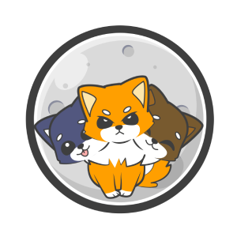 | 8768 | SHIBERUS | Shiberus Inu |
|  | 8769 | MINUTE | MINUTE Vault (NFTX) |
|  | 8770 | DINO | DinoSwap |
|  | 8771 | EXIP | EXIP |
|  | 8772 | SBRT | SaveBritney |
|  | 8773 | DIAMND | Projekt Diamond |
|  | 8774 | CVAG | Crypto Village Accelerator CVAG |
|  | 8775 | TENSHI | Tenshi |
|  | 8776 | TOKAU | Tokyo AU |
|  | 8777 | 1TRC | 1TRONIC |
|  | 8778 | ZOE | Zoe Cash |
|  | 8779 | WOLFY | WOLFY |
|  | 8780 | RELOADED | Doge Reloaded |
|  | 8781 | GODL | GODL |
|  | 8782 | XYZ | Universe.XYZ |
| 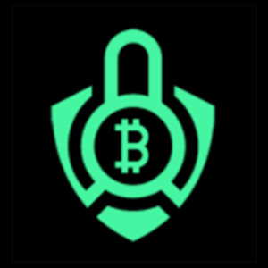 | 8783 | SBANK | SafeBank Token |
| 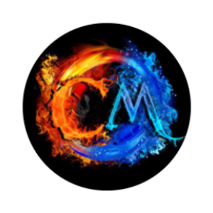 | 8784 | CMERGE | CoinMerge |
|  | 8785 | BABYCUBAN | Baby Cuban |
|  | 8786 | NVX | Novax Coin |
|  | 8787 | TKG | Takamaka Green Coin |
|  | 8788 | HANU | Hanu Yokia |
|  | 8789 | KIRBY | Kirby Inu |
|  | 8790 | TAIYO | Taiyo |
|  | 8791 | SHON | ShonToken |
|  | 8792 | CFLO | Chain Flowers |
|  | 8793 | INVESTEL | Investelly token |
|  | 8794 | ANB | Angryb |
|  | 8795 | BSCGIRL | Binance Smart Chain Girl |
|  | 8796 | JPYC | JPYC |
|  | 8797 | GSHIBA | Gambler Shiba |
| 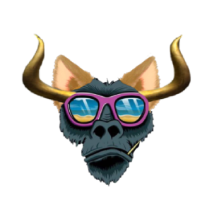 | 8798 | ABI | ApeBullInu |
|  | 8799 | UNCLE | Uncle |
|  | 8800 | MFUND | Memefund |
|  | 8801 | LKT | Locklet |
|  | 8802 | INVI | INVI Token |
|  | 8803 | YINBI | Yinbi |
|  | 8804 | BURP | CoinBurp |
|  | 8805 | PCHS | Peaches.Finance |
|  | 8806 | LCMS | LCMS |
|  | 8807 | CASPER | Casper DeFi |
|  | 8808 | LMAO | LMAO Finance |
|  | 8809 | ALITA | Alita Network |
|  | 8810 | MBCC | Blockchain-Based Distributed Super Computing Platform |
|  | 8811 | SPACE | Spacelens |
|  | 8812 | PYRAM | Pyram Token |
|  | 8813 | DAF | DaFIN |
|  | 8814 | UFI | PureFi |
|  | 8815 | F7 | Five7 |
|  | 8816 | DADDYDOGE | Daddy Doge |
|  | 8817 | 1-UP | 1-UP |
| 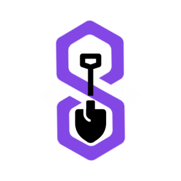 | 8818 | SPADE | PolygonFarm Finance |
|  | 8819 | KIRBYRELOADED | Kirby Reloaded |
|  | 8820 | DBZ | Diamond Boyz Coin |
|  | 8821 | BANKETH | BankEth |
|  | 8822 | VICEX | ViceToken |
|  | 8823 | FIG | FlowCom |
|  | 8824 | ZENIQ | Zeniq Coin |
|  | 8825 | GOPX | GOPX Token |
|  | 8826 | SHB4 | Super Heavy Booster 4 |
|  | 8827 | PVU | Plant vs Undead Token |
|  | 8828 | STARSH | StarShip Token |
|  | 8829 | EVAULT | EthereumVault |
|  | 8830 | BSATOSHI | BabySatoshi |
|  | 8831 | COVIDTOKEN | Covid Token |
|  | 8832 | FLOAT | Float Protocol |
|  | 8833 | AQUARI | Aquari |
|  | 8834 | ENERGYX | Safe Energy |
| 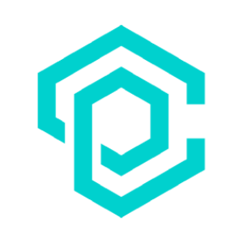 | 8835 | MINEN | Mine Network |
|  | 8836 | PIPT | Power Index Pool Token |
|  | 8837 | WASABI | WasabiX |
|  | 8838 | RULER | Ruler Protocol |
|  | 8840 | BASK | BasketDAO |
|  | 8841 | ZCON | Zcon Protocol |
|  | 8842 | GENIX | Genix |
|  | 8843 | BABYSAITAMA | Baby Saitama |
|  | 8844 | LANC | Lanceria |
|  | 8845 | MCF | MCFinance |
|  | 8846 | BRIGHTU | Bright Union |
|  | 8847 | SUNC | Sunrise |
|  | 8848 | KITSU | Kitsune Inu |
|  | 8849 | MYTHTOKEN | Myth Token |
|  | 8850 | CFL365 | CFL365 Finance |
|  | 8851 | A5T | Alpha5 |
|  | 8852 | MININGWATCHDOG | Miningwatchdog Smartchain |
|  | 8853 | ECLD | Ethernity Cloud |
|  | 8854 | SWOP | Swop |
|  | 8855 | CYCLUB | Cyclub |
|  | 8856 | AWO | AiWork |
|  | 8857 | CBANK | Crypto Bank |
|  | 8858 | FDO | Firdaos |
|  | 8859 | MMUI | MetaMUI |
|  | 8860 | SUM | SumSwap |
|  | 8861 | DID | Didcoin |
|  | 8862 | BOOSTCO | Boost |
|  | 8863 | PPN | Puppies Network |
|  | 8864 | SKT | Sukhavati Network |
|  | 8865 | LTRBT | Little Rabbit |
|  | 8866 | RYOSHI | Ryoshis Vision |
|  | 8867 | ASG | Asgard |
|  | 8868 | $TREAM | World Stream Finance |
|  | 8869 | WLUNA | Wrapped LUNA Token |
|  | 8870 | YAY | YAY Games |
|  | 8871 | SKU | Sakura |
|  | 8872 | AGPC | AGPC |
|  | 8873 | CW | CardWallet |
|  | 8874 | DBUY | Doont Buy |
|  | 8875 | CARDSWAP | CardSwap |
|  | 8876 | BORED | Bored Museum |
|  | 8877 | MGAMES | Meme Games |
|  | 8878 | BORUTO | Boruto Inu |
|  | 8879 | TSA | Teaswap Art |
|  | 8880 | KALYCOIN | KalyCoin |
|  | 8881 | BRNK | Brank |
|  | 8882 | PSLIP | Pinkslip Finance |
|  | 8883 | FLRS | Flourish Coin |
|  | 8884 | MINTYS | MintySwap |
|  | 8885 | MIA | MiamiCoin |
|  | 8886 | TXL | Autobahn Network |
|  | 8887 | BP | BunnyPark |
|  | 8888 | SNFT | Spanish National Team Fan Token |
|  | 8889 | BFTB | Brazil Fan Token |
|  | 8890 | ANKA | Ankaragücü Fan Token |
|  | 8891 | DNZ | Denizlispor Fan Token |
|  | 8892 | ESES | Eskişehir Fan Tokens |
|  | 8893 | KSK | Karsiyaka Taraftar Token |
|  | 8894 | KSTT | Kocaelispor Fan Token |
| 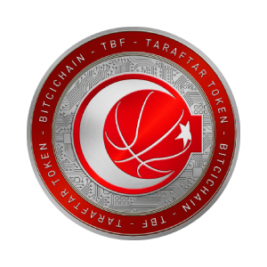 | 8895 | TBFT | Türkiye Basketbol Federasyon Token |
|  | 8896 | NR1 | Number 1 Token |
| 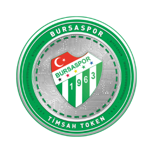 | 8897 | TMSH | Bursaspor Fan Token |
|  | 8899 | SAFESTAR | Safe Star |
|  | 8900 | BGLD | Based Gold |
|  | 8901 | PAPER | Dope Wars Paper |
|  | 8902 | FLURRY | Flurry Governance Token |
|  | 8903 | BARK | Bored Ark |
|  | 8904 | PETN | Pylon Eco Token |
|  | 8905 | FIFTY | FIFTYONEFIFTY |
|  | 8906 | LSP | Lumenswap |
|  | 8907 | VIDYX | VidyX |
|  | 8908 | SHARE | Seigniorage Shares |
|  | 8909 | POOL | PoolTogether |
|  | 8910 | ONC | One Cash |
|  | 8911 | PIG | Pig Finance |
|  | 8912 | SNY | Synthetify |
|  | 8913 | ONEX | ONE TECH |
|  | 8914 | TORG | TORG |
|  | 8915 | XLS | Elis |
|  | 8916 | YAXIS | yAxis |
|  | 8917 | STF | Structure Finance |
|  | 8918 | DOGGY | Doggy |
|  | 8919 | PLGR | Pledge Finance |
|  | 8920 | GRAVITYF | Gravity Finance |
|  | 8921 | XIASI | Xiasi Inu |
|  | 8922 | KEANU | Keanu Inu |
|  | 8923 | ZOON | CryptoZoon |
|  | 8924 | HOD | HoDooi.com |
|  | 8925 | BINEM | Binemon |
|  | 8926 | SMG | Smaugs NFT |
| 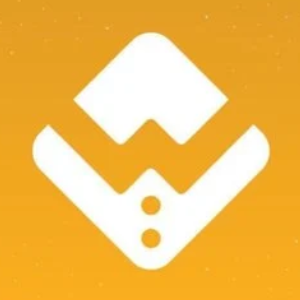 | 8927 | WSG | Wall Street Games |
|  | 8928 | HNST | Honest |
|  | 8929 | KCCPAD | KCCPad |
|  | 8930 | SISHI | Sishi Finance |
|  | 8931 | FEED | Feeder Finance |
|  | 8932 | HZN | Horizon Protocol |
|  | 8933 | HUNNY | Pancake Hunny |
|  | 8934 | ALLEY | NFT Alley |
|  | 8935 | RABBIT | Rabbit Finance |
|  | 8936 | TENFI | TEN |
|  | 8937 | HEROES | Dehero Community Token |
|  | 8938 | UNCL | UNCL |
|  | 8939 | WHEEL | Wheelers |
|  | 8940 | SHIBACASH | ShibaCash |
|  | 8941 | LONG | Longdrink Finance |
|  | 8942 | QBIT | Project Quantum |
|  | 8943 | COSMIC | CosmicSwap |
|  | 8944 | TENDIE | TendieSwap |
|  | 8945 | EIFI | EIFI FINANCE |
|  | 8946 | VTX | Vortex DeFi |
|  | 8947 | VENTION | Vention |
|  | 8948 | BBADGER | Badger Sett Badger |
|  | 8949 | OVO | Ovato |
|  | 8950 | DCB | Decubate |
|  | 8951 | IBG | iBG Token |
|  | 8952 | CRYPTOBEAST | CryptoBeast |
|  | 8953 | WENLAMBO | Wenlambo |
|  | 8954 | RICE | RiceFarm |
|  | 8955 | SHEESH | Sheesh it is bussin bussin |
|  | 8956 | PETG | Pet Games |
|  | 8957 | RELI | Relite Finance |
|  | 8958 | CHECOIN | CheCoin |
| 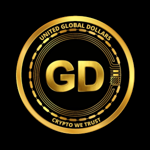 | 8959 | UGD | United Global Dollars |
|  | 8960 | NSFW | xxxNifty |
|  | 8961 | ECOFI | EcoFi |
|  | 8962 | INCAKE | InfinityCAKE |
|  | 8963 | MRF | Moonradar.finance |
| 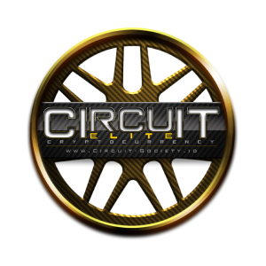 | 8964 | CRCTE | Circuit Society |
|  | 8965 | GEMG | GemGuardian |
|  | 8966 | FOREVERFOMO | ForeverFOMO |
|  | 8967 | DOGEGF | DogeGF |
|  | 8968 | XBN | Elastic BNB |
|  | 8969 | CXPAD | CoinxPad |
|  | 8970 | POODL | Poodl |
|  | 8971 | KRN | KRYZA Network |
|  | 8972 | KWS | Knight War Spirits |
|  | 8973 | BLADE | BladeWarrior |
|  | 8974 | PFY | Portify |
|  | 8975 | CHOPPER | Chopper Inu |
|  | 8976 | DOGEX | DogeHouse Capital |
|  | 8977 | RICKMORTY | Rick And Morty |
|  | 8978 | UZUMAKI | Uzumaki Inu |
|  | 8979 | WHEAT | Wheat Token |
|  | 8980 | YDR | YDragon |
|  | 8981 | FATCAKE | FatCake |
|  | 8982 | BHO | Bholdus Token |
|  | 8983 | JED | JEDSTAR |
|  | 8984 | SPHYNX | Sphynx Token |
|  | 8985 | BKR | Balkari Token |
|  | 8986 | ARATA | Arata |
|  | 8987 | ZMBE | RugZombie |
|  | 8988 | LPI | LPI DAO |
|  | 8989 | RAINBOW | Rainbow Token |
|  | 8990 | STEPH | Step Hero |
|  | 8991 | BOG | Bogged Finance |
|  | 8992 | SRP | Starpunk |
|  | 8993 | RICHIEV1 | Richie v1 |
|  | 8994 | PRV | PrivacySwap |
|  | 8995 | TRGI | The Real Golden Inu |
|  | 8996 | PKD | PetKingdom |
|  | 8997 | BMARS | Binamars |
|  | 8998 | DOGO | DogemonGo |
|  | 8999 | BUMN | BUMooN |
|  | 9000 | OSWAP | OpenSwap |
|  | 9001 | LOUD | Loud Market |
| 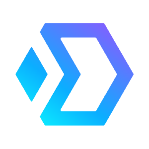 | 9002 | DXT | Dexit Finance |
|  | 9003 | CRDN | Cardence |
|  | 9004 | BPAY | BNBPay |
|  | 9005 | DMOD | Demodyfi Token |
|  | 9006 | DXB | DefiXBet |
|  | 9007 | MOONSHOT | Moonshot |
| 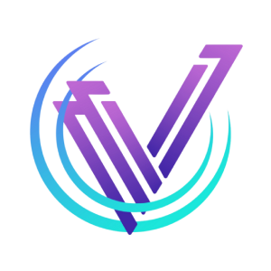 | 9008 | VFY | Verify Token |
|  | 9009 | BNBCH | BNB Cash |
|  | 9010 | ADAT | Adadex Tools |
|  | 9011 | CAKEMOON | CakeMoon |
|  | 9012 | MILK | Milkshake Swap |
|  | 9013 | MOUND | Mound Token |
|  | 9014 | MOONLIGHT | Moonlight Token |
|  | 9015 | FOC | TheForce Trade |
|  | 9016 | HASHT | HASH Token |
|  | 9017 | MARKETMOVE | MarketMove |
|  | 9018 | MOONARCH | Moonarch |
|  | 9019 | LEOS | Leonicorn Swap |
|  | 9020 | BZZONE | Bzzone |
|  | 9021 | EXZO | ExzoCoin 2.0 |
|  | 9022 | OWN | Ownly |
|  | 9023 | EFIL | Ethereum Wrapped Filecoin |
|  | 9024 | YAG | Yaki Gold |
|  | 9025 | EBOX | Ethbox Token |
|  | 9026 | ROOM | OptionRoom |
|  | 9027 | WSIENNA | Sienna ERC-20 |
|  | 9028 | SQG | Squid Token |
|  | 9029 | WELD | Weld |
|  | 9030 | SMILE | Smile Token |
|  | 9031 | LAIKA | Laika Protocol |
|  | 9032 | FOREVERPUMP | Forever Pump |
|  | 9033 | VFOX | VFOX |
|  | 9034 | SWAPZ | SWAPZ.app |
|  | 9035 | OCTAX | OctaX |
|  | 9036 | BUFF | Buffalo Swap |
|  | 9037 | COLL | Collateral Pay |
|  | 9038 | SAFEBULL | SafeBull |
|  | 9039 | BURNDOGE | BurnDoge |
|  | 9040 | SAFES | SafeSwap |
|  | 9041 | SCIX | Scientix |
|  | 9042 | SHIELDNET | Shield Network |
|  | 9043 | MELLO | Mello Token |
|  | 9044 | OBS | One Basis Cash |
|  | 9045 | SPE | Save Planet Earth |
|  | 9046 | PRINTS | FingerprintsDAO |
|  | 9047 | DOGEBNB | DogeBNB |
|  | 9048 | CUEX | Cuex |
|  | 9049 | RFG | Refugees Token |
|  | 9050 | SIL | SIL Finance Token V2 |
|  | 9051 | BONUSCAKE | Bonus Cake |
|  | 9052 | BUNNYROCKET | BunnyRocket |
|  | 9053 | DARKEN | Dark Energy Crystals |
|  | 9054 | CPAN | CryptoPlanes |
|  | 9055 | ZABAKU | Zabaku Inu |
|  | 9056 | BSCM | BSC MemePad |
|  | 9057 | PIKACHU | Pikachu Inu |
|  | 9058 | GOTEM | gotEM |
|  | 9059 | AU | AutoCrypto |
|  | 9060 | SLAM | Slam Token |
|  | 9061 | DEFIL | DeFIL |
|  | 9062 | DDN | Den Domains |
|  | 9063 | MANGA | Manga Token |
|  | 9064 | FILST | Filecoin Standard Hashrate Token |
|  | 9065 | AKTIO | Rayn |
|  | 9066 | KISHIMOTO | Kishimoto Inu |
|  | 9067 | GFN | Graphene |
|  | 9068 | PFT | Pitch Finance Token |
|  | 9069 | TORII | Torii Finance |
|  | 9070 | GOMA | GOMA Finance |
|  | 9071 | SHELLTOKEN | Shell Token |
|  | 9072 | KALA | Kalata Protocol |
|  | 9073 | POK | Pokmonsters |
|  | 9074 | BABYFB | Baby Floki Billionaire |
|  | 9075 | FWB | Friends With Benefits Pro |
|  | 9076 | VLXPAD | VelasPad |
|  | 9077 | BATH | Battle Hero |
|  | 9078 | EVRY | Evrynet |
|  | 9079 | CHLT | Chellitcoin |
|  | 9080 | HPAD | HarmonyPad |
|  | 9081 | SLA | SUPERLAUNCH |
|  | 9082 | GRIMEX | SpaceGrime |
|  | 9083 | EBSC | EarlyBSC |
|  | 9084 | RSUN | RisingSun |
|  | 9085 | APAD | Anypad |
|  | 9086 | WOLVERINU | WOLVERINU |
|  | 9087 | TZKI | Tsuzuki Inu |
|  | 9088 | INUYASHA | Inuyasha |
|  | 9089 | MINISHIB | miniSHIB ETH |
|  | 9090 | NAUSICAA | Nausicaa-Inu |
|  | 9091 | SAKATA | Sakata Inu |
|  | 9092 | BRTX | Bertinity |
|  | 9093 | YOCO | YocoinYOCO |
|  | 9094 | KITTYINU | Kitty Inu |
|  | 9095 | NXMC | NextMindCoin |
| 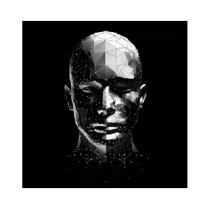 | 9096 | AITECH |  Solidus Ai Tech |
|  | 9097 | OH | Oh! Finance |
|  | 9098 | JRIT | JERITEX |
|  | 9099 | DINGER | Dinger Token |
|  | 9100 | KAC | KACO Finance |
|  | 9101 | 1INCHUP | Long 1INCH with Up to 4x Leverage |
|  | 9102 | 1INCHDOWN | Short 1INCH with Up to 4x Leverage |
|  | 9103 | ASS | Australian Safe Shepherd |
|  | 9104 | TRONPAD | TRONPAD |
|  | 9105 | SWAPP | SWAPP Protocol |
|  | 9106 | INU | INU Token |
|  | 9107 | BCHA | Bitcoin Cash ABC |
|  | 9108 | MEWTWO | Mewtwo Inu |
|  | 9109 | MSA | My Shiba Academia |
|  | 9110 | JPAW | Jpaw Inu |
|  | 9111 | L | L inu |
|  | 9112 | MADAGASCARTOKEN | Madagascar Token |
|  | 9113 | LUMI | LUMI Credits |
|  | 9114 | TUP | Tenup |
|  | 9115 | FOL | Folder Protocol |
|  | 9116 | RIL | Rilcoin |
|  | 9117 | KAREN | KarenCoin |
| 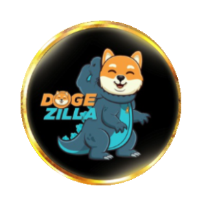 | 9118 | DOGEZILLA | DogeZilla |
|  | 9119 | GINUX | Green Shiba Inu |
|  | 9120 | SPWN | Bitspawn |
|  | 9121 | PIST | Pist Trust |
|  | 9122 | SIP | Space SIP |
|  | 9123 | POCO | Pocoland |
|  | 9124 | MONONOKEINU | Mononoke Inu |
|  | 9125 | BPRIVA | Privapp Network |
|  | 9126 | VPP | Virtue Poker Points |
|  | 9127 | SLOKI | Super Floki |
|  | 9128 | ENV | ENVOY |
|  | 9129 | AQUAP | Planet Finance |
|  | 9130 | NEET | NEET Finance |
|  | 9131 | HCT | HurricaneSwap Token |
|  | 9133 | NBL | Nobility |
|  | 9134 | WIFEDOGE | Wifedoge |
|  | 9135 | WOOF | Shibance Token |
|  | 9136 | IDTT | Identity |
|  | 9137 | NASADOGE | Nasa Doge |
|  | 9139 | TIKI | Tiki Token |
|  | 9140 | PARAB | Parabolic |
|  | 9141 | IBNB | iBNB |
|  | 9142 | MWAR | MemeWars (MWAR) |
|  | 9143 | CBRL | Crypto BRL |
|  | 9144 | APYS | APYSwap |
|  | 9145 | AVXL | Avaxlauncher |
|  | 9146 | PERA | Pera Finance |
|  | 9147 | AGF | Augmented Finance |
|  | 9148 | TIME1 | Wornderland |
|  | 9149 | POLL | Pollchain |
|  | 9150 | LC | Lotus Capital |
|  | 9151 | WARS | MetaWars |
|  | 9152 | DBA | Digital Bank of Africa |
|  | 9153 | SHIBAMOM | Shiba Mom |
|  | 9154 | OMNIR | Omni Real Estate Token |
|  | 9155 | BLS | Blocks Space |
|  | 9156 | CATZ | CatzCoin |
|  | 9157 | KCCM | KCC MemePad |
|  | 9158 | FBNB | ForeverBNB |
|  | 9159 | QDX | Quidax |
|  | 9160 | EMPIRE | Empire Token |
|  | 9161 | THESTANDARD | Standard Token |
|  | 9162 | BNPL | BNPL Pay |
|  | 9163 | FF | Forefront |
|  | 9164 | DFSG | DFSocial Gaming |
|  | 9165 | ZUNA | ZUNA |
|  | 9166 | LOCK | Contracto |
| 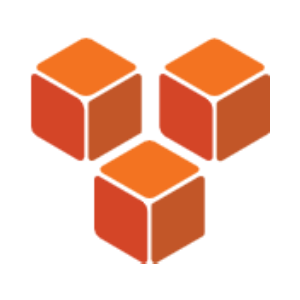 | 9167 | DAPPSY | Dappsy |
|  | 9168 | MERKLE | Merkle Network |
|  | 9169 | BNBH | BnbHeroes Token |
|  | 9170 | REU | REUCOIN |
|  | 9171 | ETERNAL | CryptoMines Eternal |
|  | 9172 | STKATOM | pSTAKE Staked ATOM |
|  | 9173 | BACON | BaconDAO |
|  | 9174 | DXCT | DNAxCAT |
|  | 9175 | STKXPRT | pSTAKE Staked XPRT |
|  | 9176 | DOGEDASH | Doge Dash |
|  | 9177 | BLOCKS | BLOCKS |
|  | 9178 | METACAT | MetaCat |
|  | 9179 | PAD | NearPad |
|  | 9180 | LEAG | LeagueDAO Governance Token |
|  | 9181 | SNOOP | SnoopDAO |
|  | 9182 | YEL | Yel.Finance |
|  | 9183 | STANDARD | Stakeborg DAO |
|  | 9184 | LMT | Lympo Market Token |
|  | 9185 | SWD | SW DAO |
|  | 9186 | GORILLAINU | Gorilla Inu |
|  | 9187 | SPAY | SpaceY 2025 |
|  | 9188 | OPA | Option Panda Platform |
|  | 9189 | HERA | Hero Arena |
|  | 9190 | AVN | AVNRich |
|  | 9191 | WAI | Wanaka Farm WAIRERE Token |
|  | 9192 | DNFT | DareNFT |
|  | 9193 | GODZ | Cryptogodz |
|  | 9194 | NORA | SnowCrash Token |
|  | 9195 | CHAMP | NFT Champions |
|  | 9196 | XNFT | xNFT Protocol |
|  | 9197 | KFT | Knit Finance |
|  | 9198 | ROCKI | Rocki |
|  | 9199 | GAIA | Gaia Everworld |
|  | 9200 | GNT | GreenTrust |
|  | 9201 | MARSRISE | MarsRise |
|  | 9202 | PLUGCN | Plug Chain |
|  | 9203 | WEYU | WEYU |
|  | 9204 | YIN | YIN Finance |
|  | 9205 | SHIBELON | ShibElon |
|  | 9206 | MELODITY | Melodity |
|  | 9207 | CPRX | Crypto Perx |
|  | 9208 | RAM | Ramifi Protocol |
|  | 9209 | BOSU | Bosu Inu |
|  | 9210 | APPEALUSD | Appeal dollar |
|  | 9212 | WNYC | Wrapped NewYorkCoin |
|  | 9213 | FREN | FREN |
|  | 9214 | SHAKE | Spaceswap SHAKE |
|  | 9215 | LTNM | Bitcoin Latinum |
|  | 9216 | OMIC | Omicron |
| 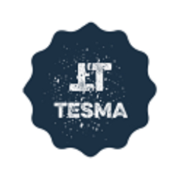 | 9217 | TESMA | TESKA Modern Accounting |
|  | 9218 | CCAR | CryptoCars |
|  | 9219 | DEXA | DEXA COIN |
|  | 9220 | MIMO | MIMO Parallel Governance Token |
|  | 9221 | DS | DeStorage |
|  | 9222 | PERI | PERI Finance |
|  | 9223 | MOCHISWAP | Mochiswap |
|  | 9224 | GN | GN |
|  | 9225 | DOE | Dogs Of Elon |
|  | 9226 | HKC | HK Coin |
|  | 9227 | LATTE | LatteSwap |
|  | 9228 | MEMEINU | Meme Inu |
|  | 9229 | CHARIZARD | Charizard Inu |
|  | 9230 | XPNET | XP Network |
|  | 9231 | SCAR | Velhalla |
|  | 9232 | PARAL | Parallel |
|  | 9233 | MONO | MonoX |
|  | 9234 | GREENMMT | Green Mining Movement Token |
|  | 9236 | SOHM | Staked Olympus |
|  | 9237 | WSOHM | Wrapped Staked Olympus |
|  | 9238 | QUBE | Qube |
|  | 9239 | ENEDEX | Enedex |
|  | 9240 | XPAY | Wallet Pay |
|  | 9241 | LUDO | Ludo |
|  | 9242 | OHMV2 | Olympus v2 |
|  | 9243 | NETCOIN | Netcoincapital |
|  | 9244 | LEOPARD | Leopard |
|  | 9245 | MNET | MINE Network |
|  | 9246 | RIFI | Rikkei Finance |
| 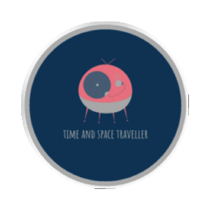 | 9247 | TRAVELLER | Time and Space Traveller |
|  | 9248 | CLNY | Colony |
|  | 9249 | FRDX | Frodo Tech |
|  | 9250 | VAIYO | Vaiyo |
|  | 9251 | UNIGRID | Unigrid |
| 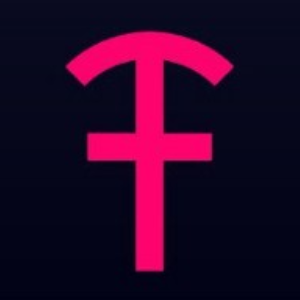 | 9252 | TDAO | TimeDAO |
|  | 9253 | ENO | Enotoken |
| 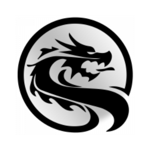 | 9254 | TETRIX | Tetrix Token |
|  | 9255 | CLVX | Calvex |
|  | 9256 | CEM | Crypto Emergency |
|  | 9257 | CINU | CHEEMS INU |
|  | 9258 | ETHOS | Ethos Project |
|  | 9259 | TR3 | Tr3zor |
|  | 9260 | RUX | Gacrux NFT |
|  | 9261 | BRGX | Bridge$ |
|  | 9262 | AGV | Astra Guild Ventures |
|  | 9263 | VLC | Volcano Uni |
|  | 9264 | BTCBR | Bitcoin BR |
|  | 9265 | JFIN | JFIN Coin |
|  | 9266 | MNS | Monnos |
|  | 9267 | KIRO | Kirobo |
|  | 9268 | MCS | MCS Token |
|  | 9269 | PDATA | PDATA |
|  | 9270 | OWNEX | Ownex.io |
|  | 9271 | MHT | Mouse Haunt |
|  | 9272 | HP | HeroPark |
|  | 9273 | E21 | E21 Coin |
|  | 9274 | DEVT | DeHorizon |
|  | 9275 | STKAAVE | Staked Aave |
|  | 9276 | STZEN | StakedZEN |
|  | 9277 | IBFR | iBuffer Token |
|  | 9278 | SHIBO | ShiBonk |
|  | 9279 | R1 | Recast1 |
|  | 9280 | SECO | Serum Ecosystem Token |
|  | 9281 | GATE | GATENet |
|  | 9282 | DIKO | Arkadiko |
|  | 9283 | TULIP | Tulip Protocol |
|  | 9284 | WOD | World of Defish |
|  | 9285 | HACHIKO | Hachiko Inu Token |
|  | 9286 | PONYO | Ponyo Impact |
|  | 9287 | NYANTE | Nyantereum International |
|  | 9288 | NNI | NeoNomad Exchange |
|  | 9289 | IMPACTXP | ImpactXP |
|  | 9290 | VADERPROTOCOL | Vader Protocol |
|  | 9291 | RDR | Rise of Defenders |
|  | 9292 | LUS | Luna Rush |
|  | 9293 | COVN | Covenant |
| 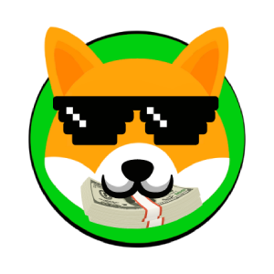 | 9294 | SHIBADOLLARS | Shiba Dollars |
|  | 9295 | PHONON | Phonon DAO |
|  | 9296 | WEB3 | WEB3 Inu |
|  | 9297 | COMT | Community Token |
|  | 9298 | ACCEL | Accel Defi |
|  | 9299 | WND | WonderHero |
|  | 9300 | SSG | Surviving Soldiers |
|  | 9301 | JBX | Juicebox |
|  | 9302 | ONLY | OnlyCam |
|  | 9303 | VGO | Vagabond |
|  | 9304 | BED | Bankless BED Index |
|  | 9305 | DPS | DEEPSPACE |
|  | 9306 | NS2DRP | New Silver Series 2 DROP |
|  | 9307 | GHOSTM | GhostMarket |
|  | 9308 | ASTROS | AstroSwap |
|  | 9309 | MTBC | Metabolic |
|  | 9310 | SHINJA | Shibnobi |
|  | 9311 | AVO | Avoteo |
|  | 9312 | SATS | SATS (Ordinals) |
|  | 9313 | IONZ | IONZ |
|  | 9314 | SOLARIX | SOLARIX |
| 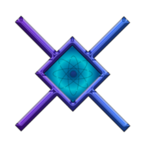 | 9315 | TRYF | Try.Finance |
|  | 9316 | OXD | 0xDAO |
|  | 9317 | ASH | ASH |
|  | 9318 | ABEY | Abey |
|  | 9319 | VOY | enVoy DeFi |
|  | 9320 | LOVE | Deesse |
|  | 9321 | MPT | Meetple |
|  | 9322 | PROP | Propeller |
|  | 9323 | CHMB | Chumbi Valley |
|  | 9324 | FREEROSS | FreeRossDAO |
|  | 9325 | MYCE | MY Ceremonial Event |
|  | 9326 | ARKER | Arker |
| 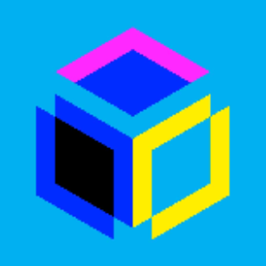 | 9327 | FTG | OnGO |
|  | 9328 | ZKT | zkTube |
|  | 9329 | SOLR | SolRazr |
|  | 9330 | RACEFI | RaceFi |
|  | 9331 | DAPPX | dAppstore |
|  | 9332 | DRONE | Drone Coin |
|  | 9333 | 1PECO | 1peco |
|  | 9334 | APXP | APEX Protocol |
|  | 9335 | ARTII | ARTII Token |
|  | 9336 | CHN | Chain |
|  | 9337 | CIND | Cindrum |
|  | 9338 | CRFI | CrossFi |
|  | 9339 | LPNT | Luxurious Pro Network Token |
|  | 9340 | MBET | MoonBet |
|  | 9341 | NT | NEXTYPE Finance |
|  | 9342 | LOOTEX | Lootex |
|  | 9343 | NINKY | Ninky |
|  | 9344 | XAEAXII | XAEA-Xii Token |
|  | 9345 | BPAD | BlokPad |
|  | 9346 | BLINU | Baby Lambo Inu |
|  | 9347 | CHEESUS | Cheesus |
|  | 9348 | BAOE | Business Age of Empires |
|  | 9349 | RADR | CoinRadr |
|  | 9350 | PERC | Perion Credits |
| 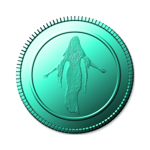 | 9351 | SSHARE | Specter Share |
|  | 9352 | XLD | Xcel Defi |
|  | 9353 | CFXT | Chainflix |
|  | 9354 | CLIFF | Clifford Inu |
|  | 9355 | PAF | Pacific |
|  | 9356 | FTS | Fortress Lending |
|  | 9357 | EPTT | Evident Proof Transaction Token |
|  | 9358 | CTPL | Cultiplan |
|  | 9359 | EWC | Erugo World Coin |
|  | 9360 | ALKI | Alkimi |
|  | 9361 | VDV | VDV Token |
|  | 9362 | JCC | Junca Cash |
|  | 9363 | TYCOON | CryptoTycoon |
|  | 9364 | ICA | Icarus Network |
|  | 9365 | MF1 | Meta Finance |
|  | 9366 | MQL | MiraQle |
|  | 9367 | NKCLC | NKCL Classic |
|  | 9368 | SBT | SOLBIT |
|  | 9369 | YEFI | YeFi |
|  | 9370 | EGI | eGame |
|  | 9371 | SURV | Survival Game Online |
|  | 9372 | MIKS | MIKS COIN |
|  | 9373 | FALCONS | Falcon Swaps |
|  | 9374 | ROAR | Alpha DEX |
|  | 9375 | FSHN | Fashion Coin |
|  | 9376 | MAINSTON | Ston |
|  | 9377 | DHS | Dirham Crypto |
|  | 9378 | MVPC | MVP Coin |
|  | 9379 | MONS | Monsters Clan |
|  | 9380 | LBLOCK | Lucky Block |
|  | 9381 | TRAVA | Trava Finance |
|  | 9382 | ONLYCUMIES | OnlyCumies |
|  | 9383 | OPENRI | Open Rights Exchange |
|  | 9384 | YUMMY | Yummy |
|  | 9385 | VODKA | Vodka Token |
|  | 9386 | MRFOX | Mr.FOX Token |
|  | 9387 | LEXI | LEXIT |
|  | 9388 | AFEN | AFEN Blockchain |
|  | 9389 | TCY | The Crypto You |
|  | 9390 | WRK | BlockWRK |
|  | 9391 | CODI | Codi Finance |
|  | 9392 | BEPR | Blockchain Euro Project |
|  | 9393 | THT | Thought |
|  | 9394 | WEC | Whole Earth Coin |
|  | 9395 | ZONO | Zono Swap |
|  | 9396 | BHAX | Bithashex |
|  | 9397 | YUCT | Yucreat |
|  | 9398 | CART | CryptoArt.Ai |
|  | 9399 | CSOV | Crown Sovereign |
|  | 9400 | USNOTA | NOTA |
|  | 9401 | VIBLO | VIBLO |
|  | 9402 | MGT | Megatech |
|  | 9403 | SHOP | Shoppi Coin |
|  | 9404 | VOX | Vox.Finance |
|  | 9405 | KALAM | Kalamint |
|  | 9406 | UNW | UniWorld |
|  | 9407 | GNNX | Gennix |
|  | 9408 | KAINET | KAINET |
|  | 9409 | I7 | ImpulseVen |
|  | 9410 | PTD | Pilot |
|  | 9411 | REFI | Realfinance Network |
|  | 9412 | UPR | Upfire |
|  | 9413 | OPENDAOSOS | OpenDAO |
|  | 9414 | HEP | Health Potion |
|  | 9415 | REVON | RevoNetwork |
|  | 9416 | GHD | Giftedhands |
|  | 9417 | ANTEX | Antex |
|  | 9418 | KIAN | Porta |
|  | 9419 | OOGI | OOGI |
|  | 9420 | ZUKI | Zuki Moba |
|  | 9421 | TWIN | Twinci |
|  | 9422 | IJC | IjasCoin |
|  | 9423 | PIGGY | Piggy |
|  | 9424 | UNBNK | Unbanked |
|  | 9425 | OVERLORD | Overlord |
|  | 9426 | TKING | Tiger King |
|  | 9427 | DDDD | People's Punk |
|  | 9428 | INFTT | iNFT Token |
|  | 9429 | DASHD | Dash Diamond |
|  | 9430 | MOO | MooMonster |
|  | 9431 | NEXM | Nexum |
|  | 9432 | PKN | Poken |
|  | 9433 | ASPO | ASPO Shards |
|  | 9434 | BSI | Bali Social Integrated |
|  | 9435 | VYNC | VYNK Chain |
|  | 9436 | LIQUI | Liquidus |
|  | 9437 | KIBA | Kiba Inu |
|  | 9438 | EGR | Egoras Rights |
|  | 9439 | GAMINGSHIBA | GamingShiba |
|  | 9440 | DEVO | DeVolution |
|  | 9441 | RETIRE | Retire Token |
|  | 9442 | ERON | ERON |
| 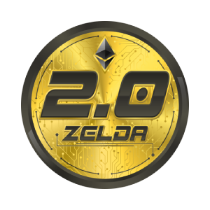 | 9443 | ZLDA | ZELDA 2.0 |
|  | 9444 | SDOG | Small Doge |
|  | 9445 | LORDZ | Meme Lordz |
|  | 9446 | SANA | Storage Area Network Anywhere |
|  | 9447 | SAPP | Sapphire |
|  | 9448 | GTFO | DumpBuster |
|  | 9449 | AFIN | Asian Fintech |
|  | 9450 | DNF | DNFT Protocol |
|  | 9451 | MVRS | Meta MVRS |
|  | 9452 | FURUKURU | Furukuru |
|  | 9453 | ANTIS | Antis Inu |
|  | 9454 | TDROP | ThetaDrop |
|  | 9455 | DODI | DoubleDice |
|  | 9456 | RAVE | Ravendex |
|  | 9457 | DBD | Day By Day |
|  | 9458 | SAUNA | SaunaFinance Token |
|  | 9459 | ACYC | All Coins Yield Capital |
|  | 9460 | IMC | i Money Crypto |
|  | 9461 | OUD | OUD |
|  | 9462 | PIZA | Half Pizza |
|  | 9463 | MRCR | Mercor Finance |
|  | 9464 | NEOM | New Earth Order Money |
| 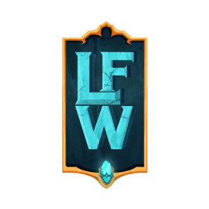 | 9465 | LFW | Legend of Fantasy War |
|  | 9466 | DVDX | Derived |
|  | 9467 | GMEX | Game Coin |
|  | 9468 | RTT | Restore Truth Token |
|  | 9469 | YARL | Yarloo |
|  | 9470 | GFCE | GFORCE |
|  | 9471 | NXD | Nexus Dubai |
|  | 9472 | WTON | Wrapped TON Crystal |
|  | 9473 | ZENITH | Zenith Chain |
|  | 9474 | LILFLOKI | Lil Floki |
|  | 9475 | MR | Meta Ruffy |
|  | 9476 | SRWD | ShibRWD |
|  | 9477 | MRXB | Wrapped BNB Metrix |
|  | 9478 | MYNE | ITSMYNE |
|  | 9479 | SMD | SMD Coin |
|  | 9480 | PPAY | Plasma Finance |
|  | 9481 | UNQ | UNQ |
|  | 9482 | WAGG | Waggle Network |
|  | 9483 | ARTI | Arti Project |
|  | 9484 | WEVE | veDAO |
|  | 9485 | BLIN | Blin Metaverse |
|  | 9486 | MEAN | Meanfi |
|  | 9487 | SHOE | ShoeFy |
|  | 9488 | LAVASWAP | Lavaswap |
|  | 9489 | TITA | Titan Hunters |
|  | 9490 | SUPE | Supe Infinity |
|  | 9491 | GZLR | Guzzler |
|  | 9492 | XCV | XCarnival |
|  | 9493 | BMIC | Bitmic |
|  | 9494 | SHAMAN | Shaman King Inu |
|  | 9495 | ZAMZAM | ZAMZAM |
|  | 9496 | CYFI | cYFI |
|  | 9497 | OBROK | OBRok |
|  | 9498 | CAAVE | cAAVE |
|  | 9499 | CMKR | cMKR |
|  | 9500 | CSUSHI | cSUSHI |
|  | 9501 | CLINK | cLINK |
|  | 9502 | SCRG | Scrooge Token |
|  | 9503 | UNQT | Unique Utility Token |
|  | 9504 | WKD | Wakanda Inu |
|  | 9505 | HPL | HappyLand (HPL) |
|  | 9506 | SHIELD | Crypto Shield |
|  | 9507 | DOGESWAP | Dogeswap Token (HECO) |
|  | 9508 | DEPTH | Depth Token |
|  | 9509 | MOONEY | Moon DAO |
| 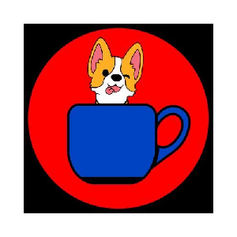 | 9510 | TCUP | TeaCup Inu |
|  | 9511 | GAMEIN | Game Infinity |
|  | 9512 | VCG | VCGamers |
|  | 9513 | MRHB | MRHB DeFi |
|  | 9514 | ARCADE | ARCADE |
|  | 9515 | SPELLFIRE | Spellfire |
|  | 9516 | PHCR | PhotoChromic |
|  | 9517 | STARLY | Starly |
|  | 9518 | PHAE | Phaeton |
|  | 9519 | ARKN | Ark Rivals |
|  | 9520 | MOLA | MoonLana |
|  | 9521 | QUIDD | Quidd |
|  | 9522 | CGU | Crypto Gaming United |
| 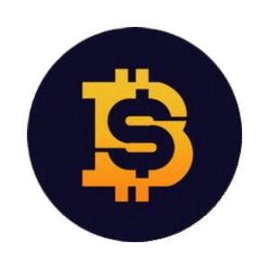 | 9523 | SHIBTC | ShibaBitcoin |
|  | 9524 | MOVD | MOVE Network |
|  | 9525 | BLUESPARROWOLD | BlueSparrowToken |
| 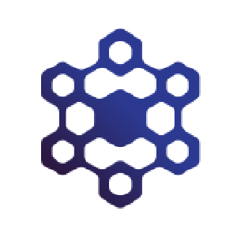 | 9526 | GRB | Global Reward Bank |
| 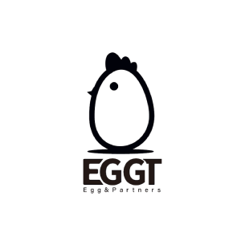 | 9527 | EGGT | Egg N Partners |
|  | 9528 | ESGC | ESG Chain |
| 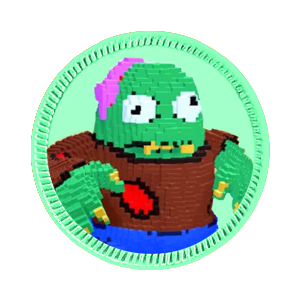 | 9529 | KEVINTOKENNET | Kevin (kevintoken.net) |
| 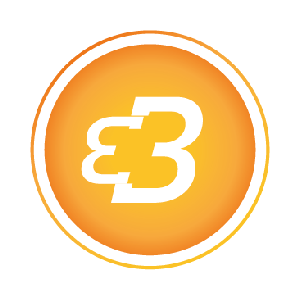 | 9530 | BTCBAM | BitCoin Bam |
|  | 9531 | SMARTLOX | SmartLOX |
|  | 9532 | BRCP | BRCP Token |
|  | 9533 | NITROE | NitroEX |
|  | 9534 | SOURCE | ReSource Protocol |
|  | 9535 | GAN | Galactic Arena: The NFTverse |
| 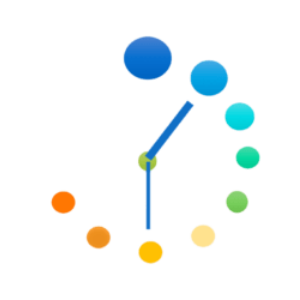 | 9536 | SCND | SECONDS |
|  | 9537 | BENT | Bent Finance |
|  | 9538 | ARCANE | Arcane Token |
|  | 9539 | ULTGG | UltimoGG |
|  | 9540 | ANN | Annex Finance |
|  | 9541 | FROG | FrogSwap |
|  | 9542 | CKT | Caketools |
|  | 9543 | JUSTICE | AssangeDAO |
|  | 9544 | ALIX | AlinX |
|  | 9545 | GDOGE | Golden Doge |
|  | 9546 | MQST | MonsterQuest |
|  | 9547 | MOOI | Moonai |
|  | 9548 | CROPPER | CropperFinance |
|  | 9549 | BRIGHT | Bright Token |
|  | 9550 | DRAGONMA | Dragon Mainland Shards |
|  | 9551 | CRAFT | TaleCraft |
|  | 9552 | DES | DeSpace Protocol |
|  | 9553 | WEX | WaultSwap |
|  | 9554 | GASDAO | Gas DAO |
|  | 9555 | GHC | Galaxy Heroes Coin |
|  | 9556 | GOAL | GOAL token |
|  | 9557 | GLASS | Glass Chain |
|  | 9558 | GOLDMIN | GoldMiner |
|  | 9559 | PRT | Parrot Protocol |
|  | 9560 | BEYOND | Beyond Protocol |
|  | 9561 | PSY | PsyOptions |
|  | 9562 | PSB | Planet Sandbox |
|  | 9563 | FLUXT | Flux Token |
|  | 9564 | ORO | Operon Origins |
|  | 9565 | PEX | Pexcoin |
|  | 9566 | PLM | Plasmonics |
|  | 9567 | ACETH | Acether |
|  | 9568 | CNDL | Candle |
|  | 9569 | VRN | Varen |
|  | 9570 | WGC | Green Climate World |
|  | 9571 | TERA2 | Terareum |
|  | 9572 | WIT | Witnet |
|  | 9573 | FTB | Fit&Beat |
|  | 9574 | EYES | Eyes Protocol |
|  | 9575 | EVAN | Evanesco Network |
|  | 9576 | BLUT | Bluetherium |
|  | 9577 | MOM | Mother of Memes |
|  | 9578 | KUR | Kuro |
|  | 9579 | TFS | TFS Token |
|  | 9580 | TAUR | Marnotaur |
|  | 9581 | TCANDY | TripCandy |
|  | 9582 | AWNEX | AWNEX token |
|  | 9583 | LOX | Lox Network |
|  | 9584 | LOV | LoveChain |
|  | 9585 | LCMG | ElysiumG |
|  | 9586 | FAYRE | Fayre |
|  | 9587 | ELV | Elvantis |
|  | 9588 | ISA | Islander |
|  | 9589 | KPC | KEEPs Coin |
|  | 9590 | BASHOS | Bashoswap |
|  | 9591 | IB | Iron Bank |
|  | 9592 | DSG | Dinosaureggs |
|  | 9593 | NTR | Nether |
|  | 9594 | HVE2 | Uhive |
|  | 9595 | FUS | Fus |
|  | 9596 | REFLECTO | Reflecto |
|  | 9597 | GLD | Goldario |
|  | 9598 | TRUEBIT | Truebit Protocol |
|  | 9599 | XUP | UPGRADE |
|  | 9600 | DFIS | DfiStarter |
|  | 9601 | AFX | Afrix |
|  | 9602 | PEPPER | Pepper Token |
|  | 9603 | SMARTNFT | SmartNFT |
|  | 9604 | USDU | Upper Dollar |
|  | 9605 | EURU | Upper Euro |
|  | 9606 | APED | Baddest Alpha Ape Bundle |
|  | 9607 | GAMEFI | GameFi Token |
|  | 9608 | ACET | Acet |
|  | 9609 | GORILLAD | Gorilla Diamond |
|  | 9610 | XPROT | X Protocol |
| 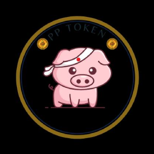 | 9611 | PPALPHA | PP ALPHA DAO |
|  | 9612 | POKEM | Pokemonio |
|  | 9613 | FFN | Fairy Forest |
|  | 9614 | MGLD | Metallurgy |
|  | 9615 | HEROESC | HeroesChained |
|  | 9616 | LIQ | LIQ Protocol |
|  | 9617 | MASTER | Mastercoin |
|  | 9618 | PBX | Probinex |
|  | 9620 | STAR | FileStar |
|  | 9621 | BRMV | BRMV Token |
|  | 9622 | GP | Wizards And Dragons |
|  | 9623 | MILLI | Million |
|  | 9624 | NOS | Nosana |
|  | 9625 | WZENIQ | Wrapped Zeniq (ETH) |
|  | 9626 | GOLD | CyberDragon Gold |
|  | 9627 | BZENIQ | Wrapped Zeniq (BNB) |
|  | 9628 | TMED | MDsquare |
|  | 9629 | QUASA | Quasacoin |
|  | 9630 | KPOP | KPOP Coin |
|  | 9631 | TITANO | Titano |
|  | 9632 | KTX | KwikTrust |
|  | 9633 | SCROOGE | Scrooge |
|  | 9634 | MDN | Modicoin |
|  | 9635 | CHAINCADE | ChainCade |
|  | 9636 | TRYC | TRYC |
|  | 9637 | CZZ | ClassZZ |
|  | 9638 | JETFUEL | Jetfuel Finance |
|  | 9639 | IMI | Influencer |
|  | 9640 | BOJI | BOJI Token |
|  | 9641 | GWT | Galaxy War |
|  | 9642 | LIST | KList Protocol |
|  | 9643 | TLB | Telebets |
|  | 9644 | MBT | Metablackout |
|  | 9645 | SEON | Seedon |
|  | 9646 | METAN | Metan Evolutions |
|  | 9647 | NEKO | The Neko |
|  | 9648 | HMRN | Homerun |
|  | 9649 | CHEDDA | Chedda |
|  | 9650 | SOLAR | Solar |
|  | 9651 | DINU | Dogey-Inu |
|  | 9652 | METADOGEV2 | MetaDoge V2 |
|  | 9653 | NTX | NuNet |
|  | 9654 | ENDLESS | Endless Board Game |
| 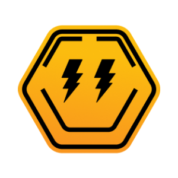 | 9655 | ARTY | Artyfact |
|  | 9656 | PHBD | Polygon HBD |
|  | 9657 | LMR | Lumerin |
|  | 9658 | HOLY | Holy Trinity |
|  | 9659 | WFLOW | Wrapped Flow |
| 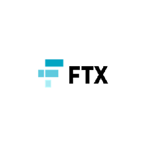 | 9661 | GRTBULL | 3X Long Graph Token Token |
|  | 9663 | GRTBEAR | 3X Short Graph Token Token |
|  | 9664 | ASDBULL | 3X Long AscendEx Token (BTMX) Token |
|  | 9665 | ASDHEDGE | 1X Short AscendEx Token (BTMX) Token |
|  | 9666 | ASDBEAR | 3X Short AscendEx Token (BTMX) Token |
|  | 9667 | BLURT | Blurt |
|  | 9668 | ROCK | Bedrock |
|  | 9669 | CHIRP | Chirp |
|  | 9670 | SQUAWK | Squawk |
|  | 9671 | DOLZ | DOLZ |
|  | 9672 | GHCV1 | Galaxy Heroes Coin v1 |
|  | 9673 | C2X | C2X |
|  | 9674 | WTFT | WTF Token |
|  | 9675 | KBOX | The Killbox |
| 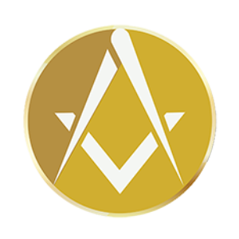 | 9676 | UNIK | Masonic Temple Token |
|  | 9677 | CHRONOS | Chronos Group Inc |

---

[← Prev](./list8.md) | [Next →](./list10.md)
