# Cryptocurrency list \#9

[← Prev](./list8.md) | [Next →](./list10.md)

| Logo | ID | Symbol | Name |
|:----:|:--:|:------:|:-----|
| 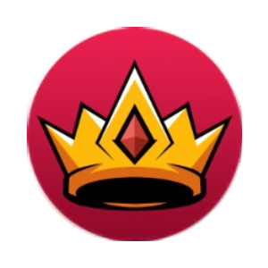 | 85583 | MAXI | Maximus |
|  | 78865 | SEOR | SEOR Network |
|  | 71155 | GRBT | Grinbit |
|  | 144851 | DASIA | DASIA |
| 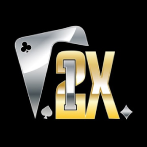 | 127999 | 21X | 21X |
|  | 112505 | SEED | Bonsai3 |
| 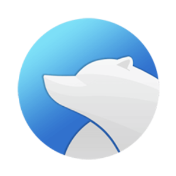 | 102099 | BRIUM | Bearium |
| 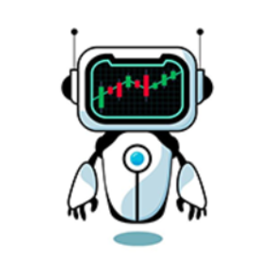 | 86793 | NFAI | Not Financial Advice |
| 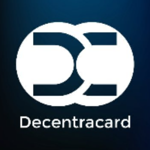 | 127475 | DCARD | DECENTRACARD |
|  | 67751 | BSKT | BasketCoin |
|  | 112275 | IBIT | InfinityBit Token |
| 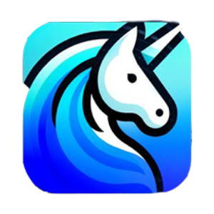 | 127477 | UIBT | Unibit |
| 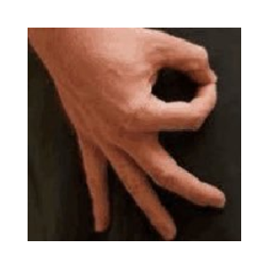 | 127453 | CIRCLE | You Looked |
| 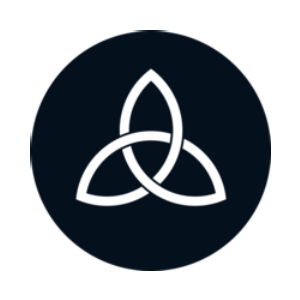 | 95827 | TNGBL | Tangible |
|  | 127481 | SOLAMB | SOLAMB |
| 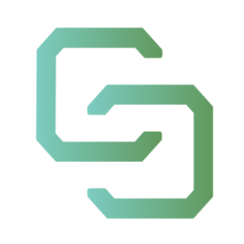 | 3207 | COLX | ColossusXT |
| 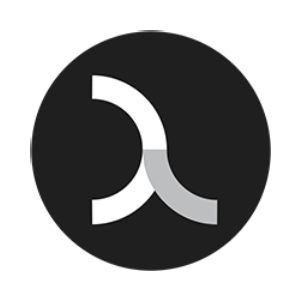 | 127459 | LAKE | Data Lake |
|  | 34421 | MRX | Metrix Coin |
| 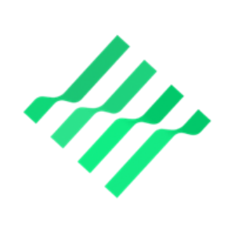 | 33798 | LIT | Lition |
|  | 125249 | LOAF | LOAF CAT |
| 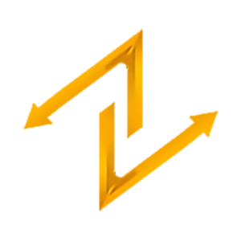 | 69279 | ZIRVE | Zirve Coin |
|  | 57809 | SA | Superalgos |
|  | 54257 | NFTBS | NFTBooks |
|  | 113657 | $PEEP | Peepo (SOL) |
| 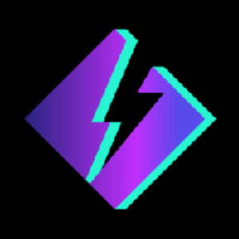 | 80179 | GENZ | GENZ Token |
| 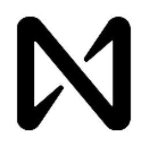 | 68183 | WNEAR | Wrapped Near |
| 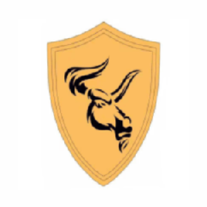 | 90969 | WOR | Hollywood Capital Group WARRIOR |
| 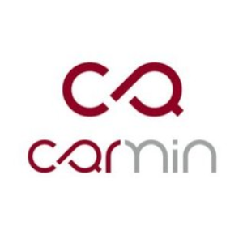 | 90207 | CARMIN | Carmin |
| 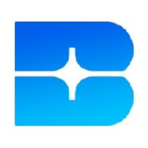 | 127743 | BUILD | BuildAI |
| 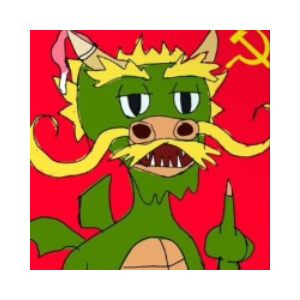 | 123505 | FENTANYL | Chinese Communist Dragon |
| 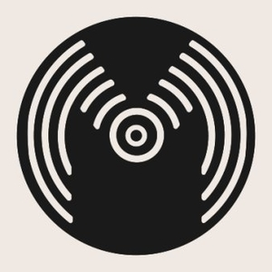 | 127497 | SAP | Satoshi Panda |
| 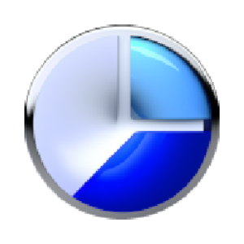 | 112449 | BSWAP | BaseSwap |
| 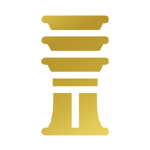 | 87197 | DJED | Djed |
| 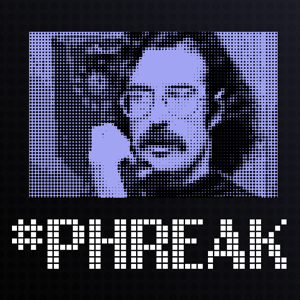 | 3957 | PHR | Phore |
|  | 66831 | PROTO | Protofi |
| 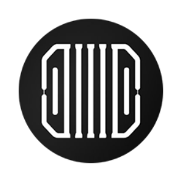 | 127783 | TPU | TensorSpace |
| 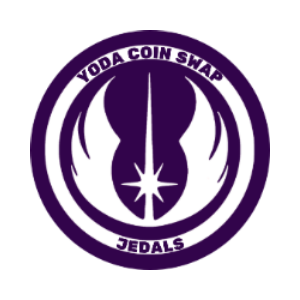 | 80879 | JEDALS | Yoda Coin Swap |
|  | 127075 | $NAP | SNAP |
|  | 82467 | SFIT | SENSE4FIT |
| 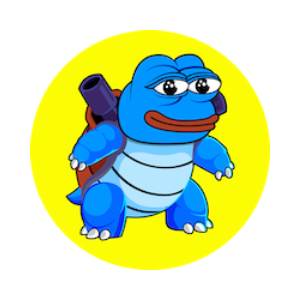 | 127515 | BEPE | Blast Pepe |
|  | 63363 | ABCD | Crypto Inu |
| 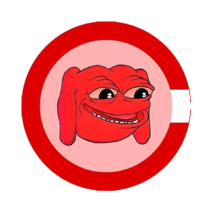 | 123843 | KEVIN | KEVIN |
| 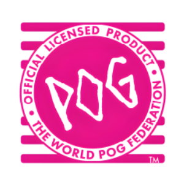 | 131123 | POGS | POG |
| 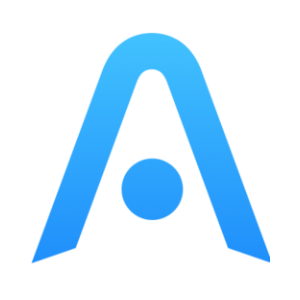 | 33596 | AWC | Atomic Wallet Coin |
| 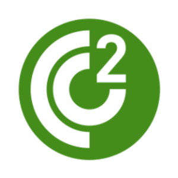 | 54575 | CYCE | Crypto Carbon Energy |
| 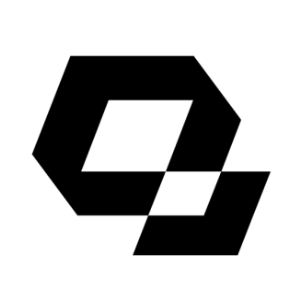 | 79049 | QBIT | Project Quantum |
|  | 126385 | MELON | Melon Dog |
|  | 33593 | JNB | Jinbi Token |
|  | 85131 | SONNE | Sonne Finance |
| 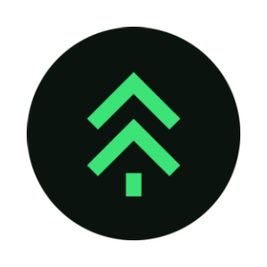 | 125253 | TREE | Tree |
| 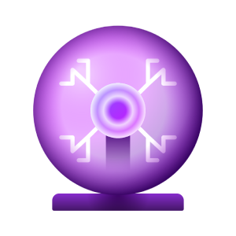 | 54551 | YEL | YEL.Finance |
| 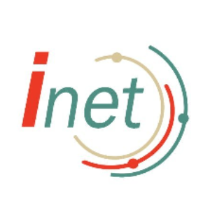 | 57847 | INET | Ideanet Token |
| 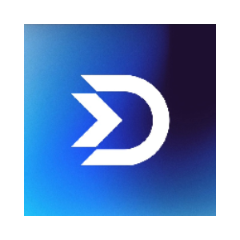 | 95017 | DUBBZ | Dubbz |
|  | 54373 | ESW | EmiSwap |
|  | 58565 | DEFIDO | DeFido |
| 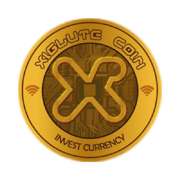 | 49609 | XGC | Xiglute Coin |
|  | 34419 | RAVEN | Raven Protocol |
|  | 65911 | STELLA | StellaSwap |
| 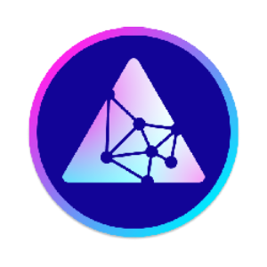 | 69881 | ITHEUM | Itheum |
| 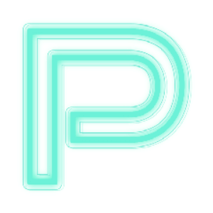 | 69763 | PAVIA | Pavia |
| 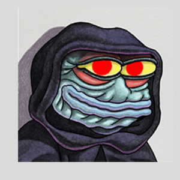 | 126999 | DLORD | DORK LORD |
|  | 96199 | Y2K | Y2K |
|  | 69787 | ANA | Nirvana ANA |
| 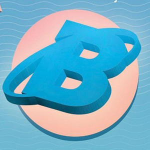 | 127471 | BASED | BASEDChad |
| 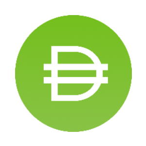 | 126979 | SDAI | Savings Dai |
| 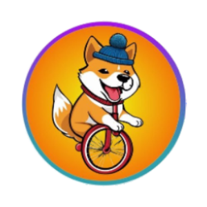 | 127509 | YIKES | Yikes Dog |
| 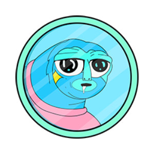 | 127065 | BLERF | BLERF |
|  | 127589 | BOGE | Boge |
|  | 48115 | VBSWAP | vBSWAP |
|  | 80117 | WDOG | Winterdog |
| 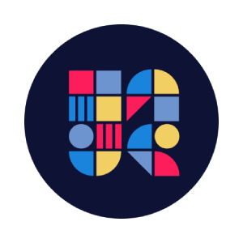 | 48891 | HAUS | DAOhaus |
| 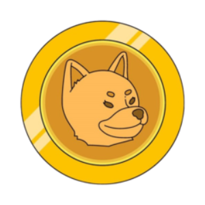 | 126441 | PONK | Ponk |
|  | 77827 | IBAT | Battle Infinity |
| 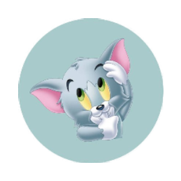 | 123309 | BABYTOMCAT | Baby Tomcat |
|  | 60601 | CAKESWAP | CakeSwap |
|  | 33808 | RPD | Rapids |
| 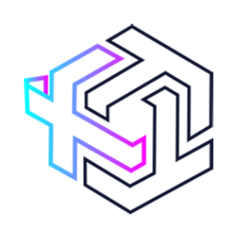 | 79057 | XTT | XSwap Treasure |
| 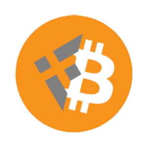 | 95345 | BNBTC | BNbitcoin |
|  | 70137 | RADIO | RadioShack |
| 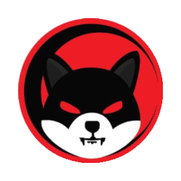 | 127533 | SHIV | Shiva Inu |
|  | 127531 | SPDR | Spiderswap |
|  | 127529 | ARBUZ | ARBUZ |
| 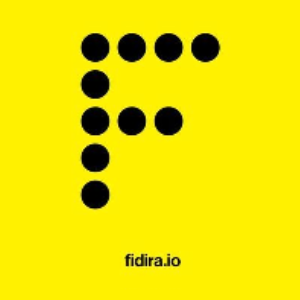 | 80915 | FID | Fidira |
|  | 131029 | SEAL | Seal |
|  | 127787 | SKO | Sugar Kingdom Odyssey |
| 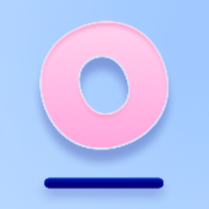 | 128209 | AGO | AgoDefi |
|  | 56977 | CHFU | Upper Swiss Franc |
| 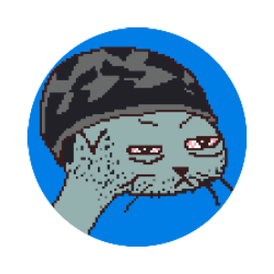 | 127885 | KATT | Katt Daddy |
|  | 128033 | KNOB | KNOB$ |
| 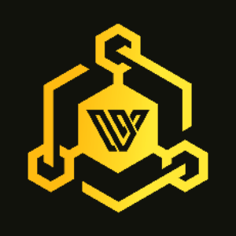 | 76949 | WMW | WoopMoney |
| 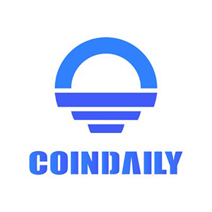 | 53623 | DAILY | Daily |
|  | 127271 | BOOK | Solbook |
| 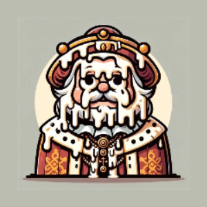 | 127265 | JIZZLORD | JizzLord |
| 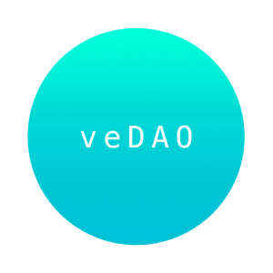 | 61949 | WEVE | veDAO |
|  | 60355 | PRED | Predictcoin |
|  | 49419 | RYIU | RYI Unity |
| 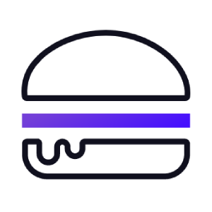 | 76945 | UMAMI | Umami Finance |
| 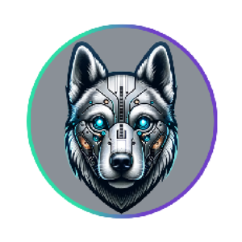 | 128007 | CDOGE | cyberdoge |
| 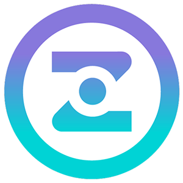 | 34515 | ZNZ | Zenzo |
| 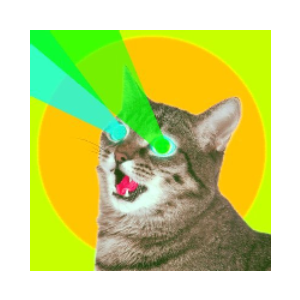 | 128171 | BTCAT | Bitcoin Cat |
| 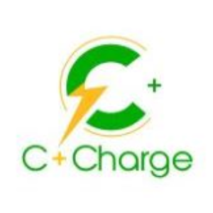 | 90649 | CCHG | C+Charge |
|  | 96535 | RENEC | RENEC |
| 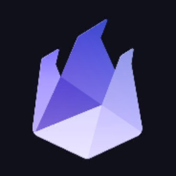 | 70065 | LFNTY | Lifinity |
| 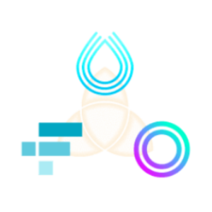 | 85523 | HOLY | HolyGrails.io |
| 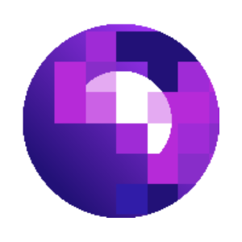 | 65177 | GENESIS | Genesis Worlds |
| 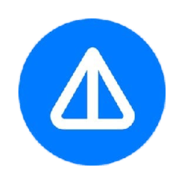 | 127341 | TGRAM | TG20 TGram |
| 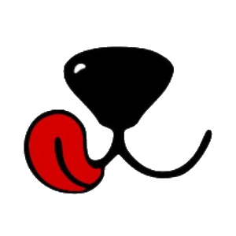 | 128757 | LICK | LICKGOAT |
| 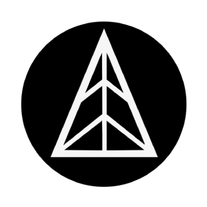 | 128985 | ANIM | Animalia |
|  | 129101 | MKC | Meta Kongz |
|  | 49509 | RGP | Rigel Protocol |
|  | 127349 | SOLALA | Solala |
| 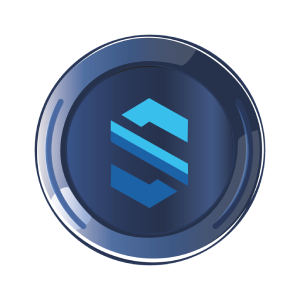 | 47067 | SFUEL | SparkPoint Fuel |
|  | 42224 | EMRX | Emirex Token |
|  | 128177 | POOP | Poopcoin |
| 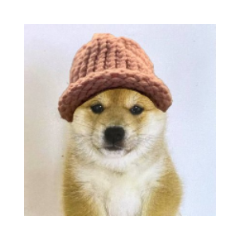 | 128079 | BABYWIF | babydogwifhat |
| 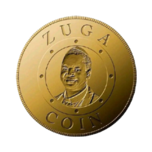 | 53499 | SZCB | Zugacoin |
| 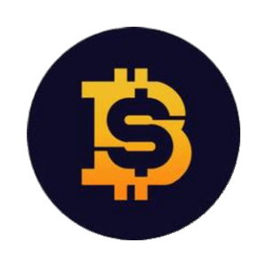 | 130439 | SHIBTC | ShibaBitcoin |
|  | 131031 | JOWNES | Alux Jownes |
|  | 130297 | CROB | Crob Coin |
|  | 131005 | DOKY | Donkey King |
|  | 131071 | BRITT | Britt |
|  | 102341 | JCO | JennyCo |
|  | 130275 | $MICHI | michi |
| 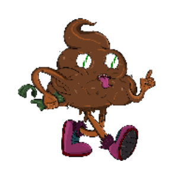 | 131083 | KAKAXA | KAKAXA |
| 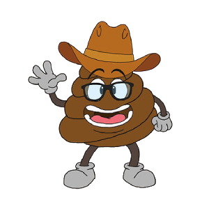 | 131113 | FECES | FECES |
| 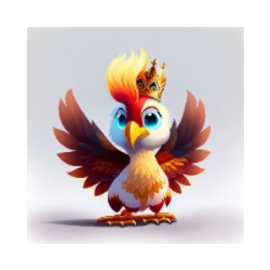 | 94941 | BIBI | BIBI |
|  | 97207 | ZPC | Zen Panda Coin |
| 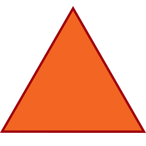 | 78073 | TRI | Trisolaris |
| 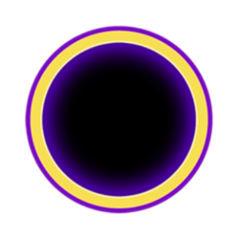 | 78003 | MTRM | Materium |
| 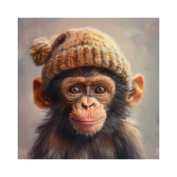 | 127291 | APEWIFHAT | ApeWifHat |
| 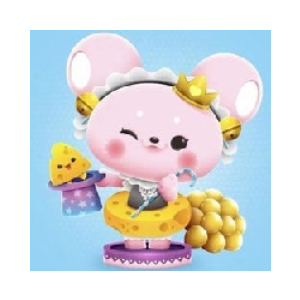 | 85275 | GERMANY | Germany Rabbit Token |
|  | 130447 | LUBE | Joe Lube Coin |
| 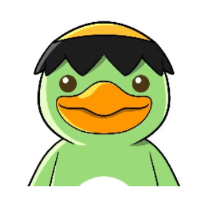 | 57755 | KAPPA | Kappa |
| 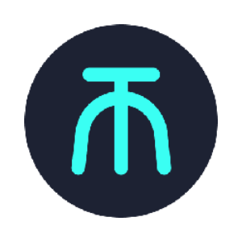 | 90505 | OT | Onchain Trade |
|  | 54591 | DLTA | delta.theta |
|  | 131001 | PEDRO | Pedro The Raccoon |
| 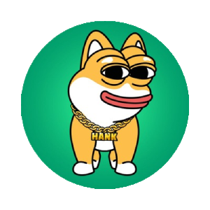 | 130975 | HANK | Hank |
| 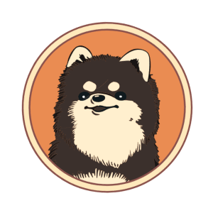 | 130335 | BOBAOPPA | Bobaoppa |
| 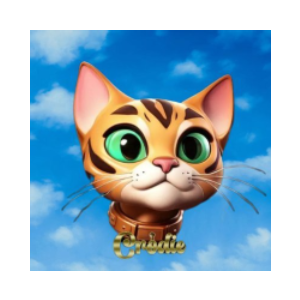 | 130983 | CRODIE | Crodie |
|  | 82307 | UPLOAD | Upload Token |
|  | 128095 | RBLZ | RebelSatoshi |
|  | 58661 | ELMON | Elemon |
|  | 130325 | CHATGPT | AI Dragon |
| 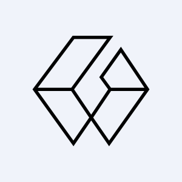 | 127243 | GBTC | Green Bitcoin |
|  | 69903 | CROGE | Crogecoin |
| 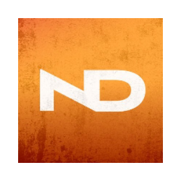 | 125345 | ND | Nemesis Downfall |
| 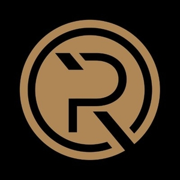 | 127681 | PRY | Perpy |
|  | 69933 | AMAZINGTEAM | AmazingTeamDAO |
|  | 80239 | FINN | Huckleberry |
| 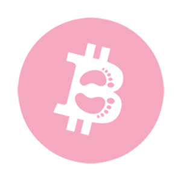 | 69939 | BABYBITC | BabyBitcoin |
| 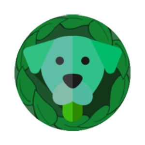 | 60123 | EBEN | Green Ben |
| 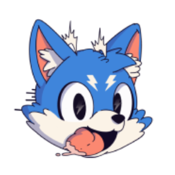 | 127207 | SPEEDY | Speedy |
| 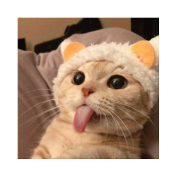 | 127175 | LUIS | Tongue Cat |
| 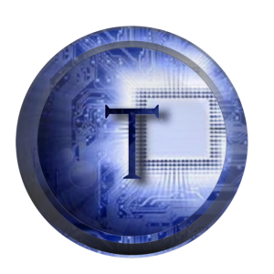 | 54873 | TECH | Cryptomeda |
|  | 49917 | SAFEMOONCASH | SafeMoonCash |
|  | 127709 | JAKE | Jake The Dog |
| 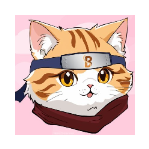 | 131011 | BOBUKI | Bobuki Neko |
| 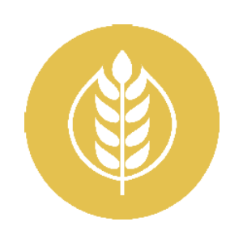 | 90851 | GRAIN | Granary |
| 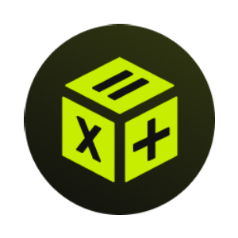 | 111657 | EQU | Equation |
| 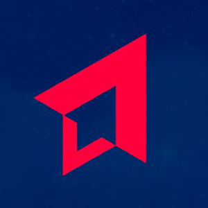 | 85369 | GGR | GAGARIN |
| 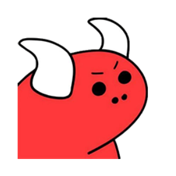 | 127225 | BUL | bul |
|  | 111543 | TKST | TokenSight |
|  | 90973 | HOOT | Hoot |
| 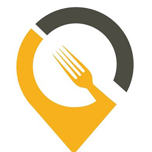 | 127667 | FORK | FlokiFork |
|  | 127665 | APPA | Dappad |
|  | 127663 | BANX | Banx.gg |
| 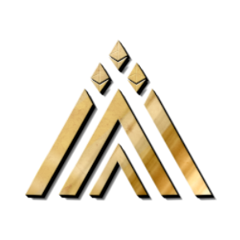 | 50231 | AMI | AMMYI Coin |
|  | 89097 | BTNTV2 | BitNautic Token |
| 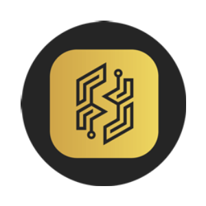 | 58123 | FIA | FIA Protocol |
| 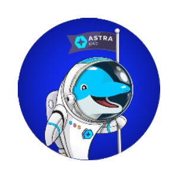 | 96247 | ASTRADAO | Astra DAO |
| 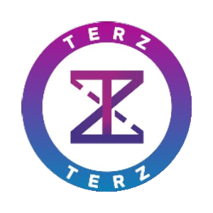 | 90197 | TERZ | SHELTERZ |
| 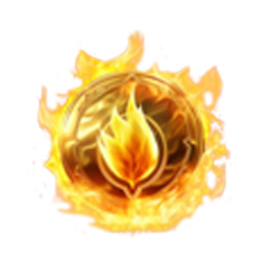 | 127789 | BURNS | Burnsdefi |
|  | 65451 | LTT | LocalTrade |
|  | 127735 | DAVINCI | Davincigraph |
|  | 33713 | MICRO | Micromines |
|  | 94471 | ARBS | Arbswap |
| 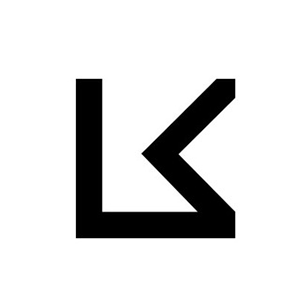 | 65145 | LINKA | LINKA |
|  | 127105 | CATWIF | CatWifHat |
|  | 46755 | WTK | WadzPay Token |
|  | 127153 | BONK2.0 | Bonk 2.0 |
| 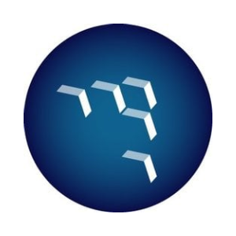 | 42169 | THT | Thought |
|  | 127147 | DCM | Ducky City |
|  | 44084 | MARTK | Martkist |
| 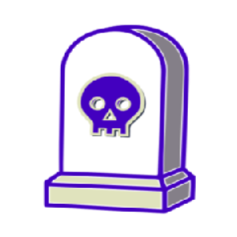 | 64735 | TSHARE | Tomb Shares |
|  | 77955 | SVN | Savanna |
| 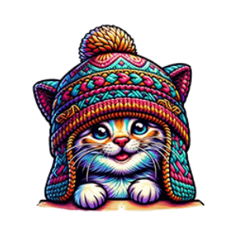 | 127141 | KITTENWIF | KittenWifHat |
| 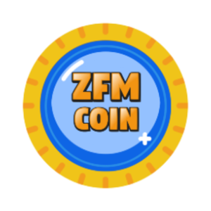 | 78569 | ZFM | ZFMCOIN |
| 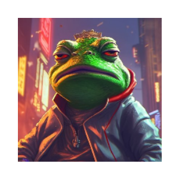 | 127119 | AIPEPE | AI PEPE KING |
|  | 69487 | NIRV | Nirvana NIRV |
|  | 127101 | LOOPY | Loopy |
| 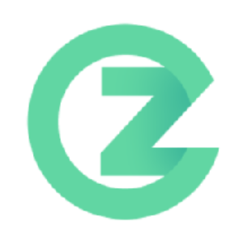 | 70991 | CZSHARES | CZshares |
| 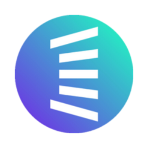 | 127089 | INTRO | 1INTRO |
| 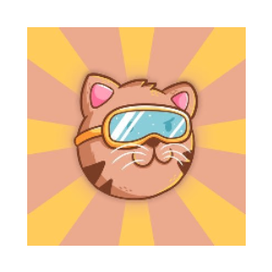 | 124401 | KITTI | KITTI TOKEN |
|  | 77103 | EAGLE | Eagle Token |
|  | 69551 | CHECKR | CheckerChain |
|  | 61495 | OXD | 0xDAO |
| 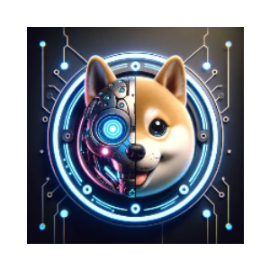 | 123987 | GROKINU | Grok Inu |
|  | 127117 | FUNGI | Fungi |
| 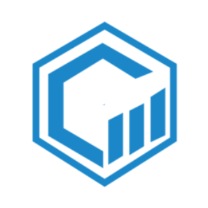 | 33709 | TCAT | The Currency Analytics |
|  | 127171 | FLOKITA | FLOKITA |
| 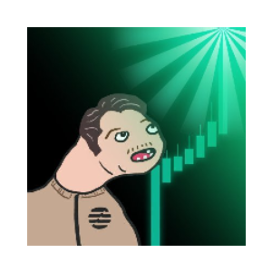 | 127237 | UPTOS | UPTOS |
|  | 60875 | TANK | CryptoTanks |
| 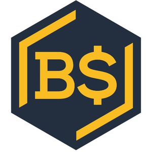 | 124041 | BITX | BitX Exchange |
|  | 70721 | BRRR | Burrow |
|  | 31403 | FLIXX | Flixxo |
| 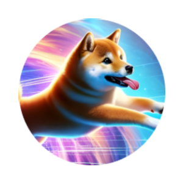 | 131723 | DOGEVERSE | DogeVerse |
| 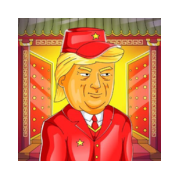 | 131523 | CHUANPU | Chuan Pu |
| 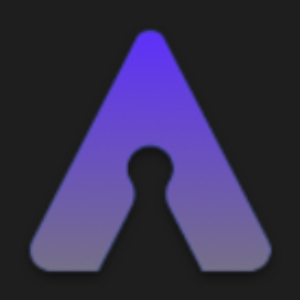 | 122617 | TROVE | Arbitrove Protocol |
| 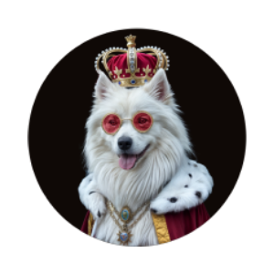 | 141661 | ALASKA | Alaska |
| 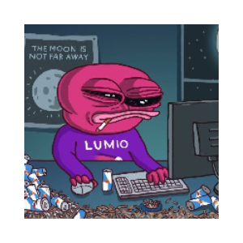 | 141681 | LUMIO | Solana Mascot |
| 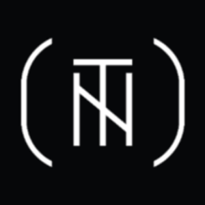 | 122495 | BYTES | Neo Tokyo |
| 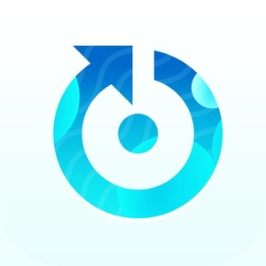 | 32629 | AMN | Amon |
| 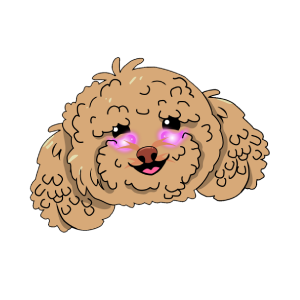 | 141839 | WINNIE | Winnie the Poodle |
|  | 136209 | YOUNES | YOUNES |
| 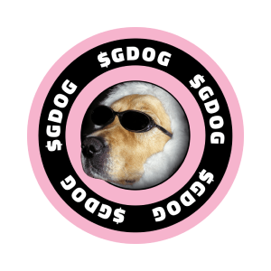 | 142021 | GDOG | GDOG |
|  | 136373 | LUNARLENS | Lunarlens coin |
| 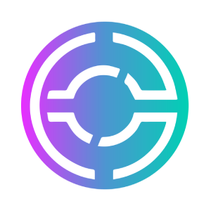 | 68715 | CLVX | Calvex |
| 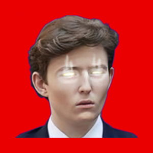 | 142157 | BARRON | Time Traveler |
| 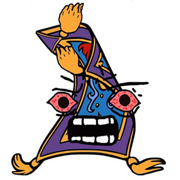 | 100125 | RUG | RUGAME |
| 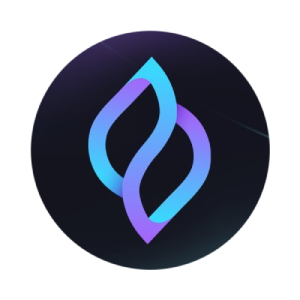 | 142269 | SNFTS | Seedify NFT Space |
| 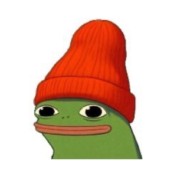 | 131615 | PEPEWIFHAT | Pepewifhat |
| 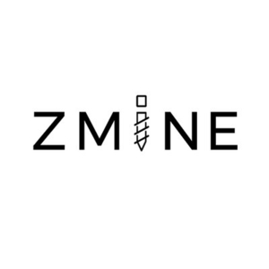 | 32921 | ZMN | ZMINE |
|  | 45546 | ACPT | Crypto Accept |
| 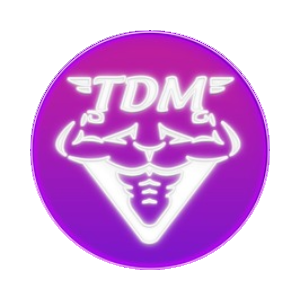 | 141755 | TDM | TDM |
| 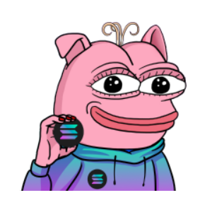 | 131593 | BUBBA | Bubba |
| 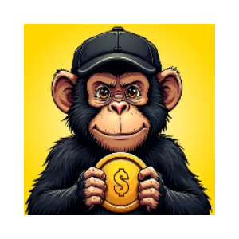 | 141933 | POUPE | Poupe |
|  | 141969 | BBUSD | BounceBit USD |
| 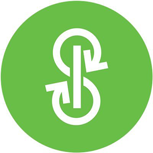 | 45556 | YFFII | YFFII Finance |
|  | 131901 | SONIC | sonic |
| 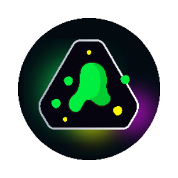 | 123075 | TALIS | Talis Protocol |
|  | 131903 | DICK | adDICKted |
| 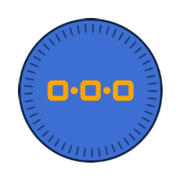 | 123053 | WSTOR | StorageChain |
| 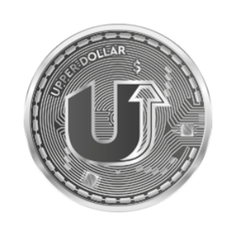 | 45601 | USDU | Upper Dollar |
| 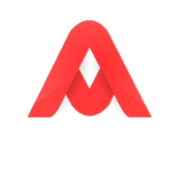 | 45150 | AGA | AGA Token |
|  | 131583 | TMANIA | Trump Mania |
| 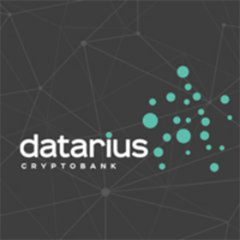 | 32747 | DTRC | Datarius Credit |
| 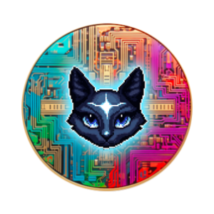 | 131843 | NYXC | Nyxia AI |
| 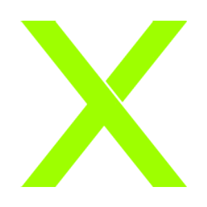 | 131965 | NPTX | NeptuneX |
| 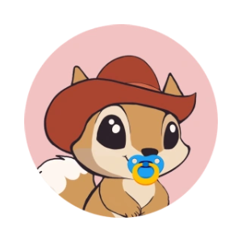 | 141683 | BABYPNUT | Baby Pnut |
|  | 136341 | HARRIS | Kamala Harris (kamalaharristoken.xyz) |
| 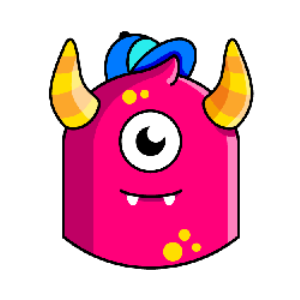 | 66699 | BSTS | Magic Beasties |
|  | 50625 | ETNA | ETNA Network |
| 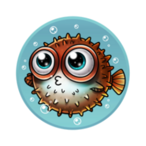 | 136457 | PUFFY | Puffy |
| 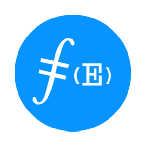 | 55957 | FILST | Filecoin Standard Hashrate Token |
|  | 71171 | H2ON | H2O Securities |
|  | 137145 | WCADAI | CADAI |
| 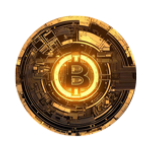 | 141637 | BKOK | BKOK FinTech |
| 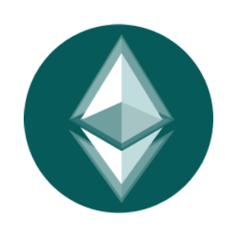 | 144319 | RSETH | Kelp DAO Restaked ETH |
|  | 144401 | WKAS | Wrapped Kaspa |
| 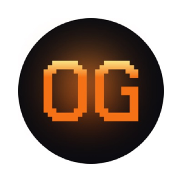 | 142397 | OGLG | OGLONG |
| 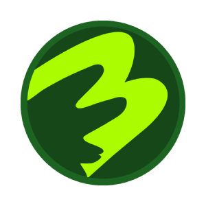 | 136571 | BORPA | Borpa |
| 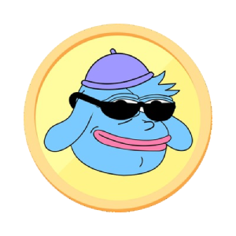 | 143045 | NOTDOG | NOTDOG |
| 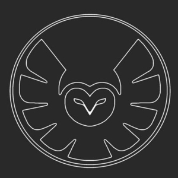 | 86893 | OWL | OwlDAO |
| 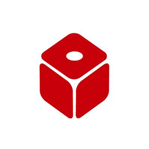 | 44200 | ANK | Apple Network |
| 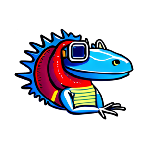 | 90241 | SLIZ | SolidLizard |
|  | 69005 | STRNGR | Stronger |
| 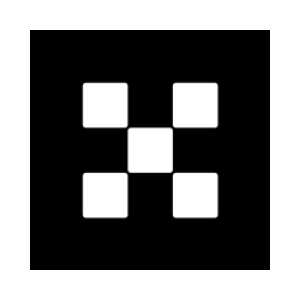 | 67561 | WOKT | Wrapped OKT |
|  | 64993 | TETU | TETU |
| 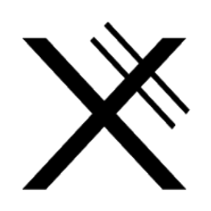 | 64855 | UXD | UXD Stablecoin |
|  | 145027 | DEPINS | DePINs |
|  | 44584 | BGL | Bitgesell |
| 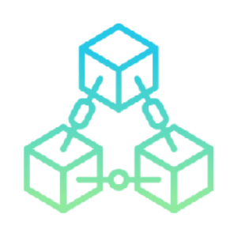 | 131419 | AGATA | Agatech |
| 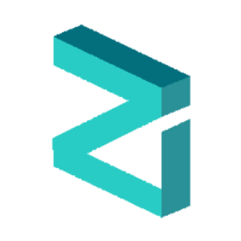 | 64823 | GZIL | governance ZIL |
|  | 70905 | PURR | Spartacats |
|  | 144535 | YELPE | Yellow Pepe |
| 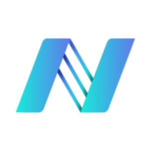 | 64939 | NVT | NerveNetwork |
|  | 55871 | GEIST | Geist Finance |
| 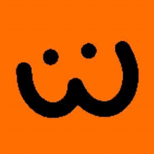 | 136547 | BUTT | Buttercat |
|  | 136539 | SCUBA | Scuba Dog |
| 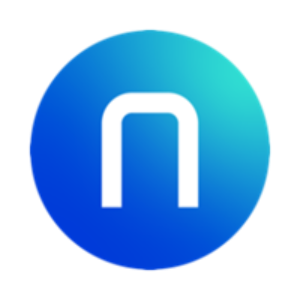 | 59295 | PTU | Pintu Token |
| 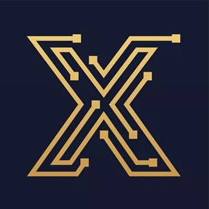 | 122701 | PLX | PLEXUS |
|  | 141807 | 47 | President Trump |
| 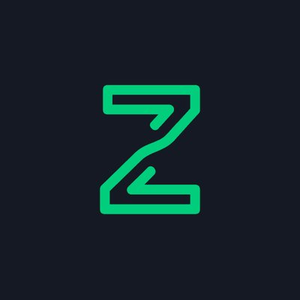 | 32832 | ZINC | ZINC |
| 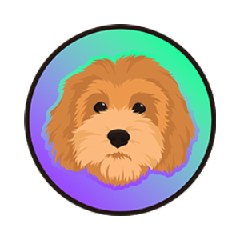 | 122533 | ROCKY | Rocky |
|  | 136511 | SNIBBU | Snibbu The Crab |
|  | 33019 | PRIV | PRiVCY |
| 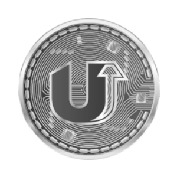 | 45448 | GBPU | Upper Pound |
|  | 132677 | DIG | Doge In Glasses |
| 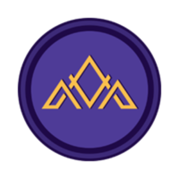 | 122035 | AMA | Mrweb Finance (new) |
|  | 121959 | SOV | Shib Original Vision |
|  | 62697 | SPIRIT | SpiritSwap |
| 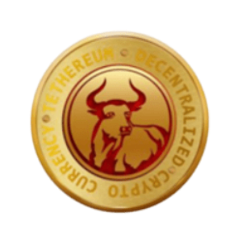 | 122031 | T99 | Tethereum |
|  | 121853 | HEC | Heroes Chained |
| 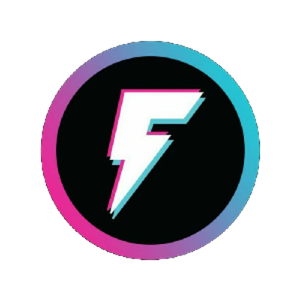 | 122025 | FLASH | Flashstake |
| 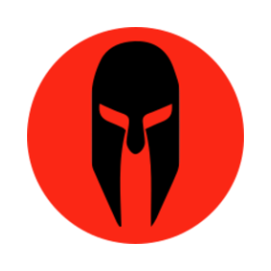 | 46011 | SPARTA | Spartan Protocol |
| 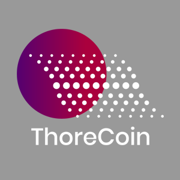 | 32937 | THR | ThoreCoin |
|  | 121741 | GG | Reboot |
| 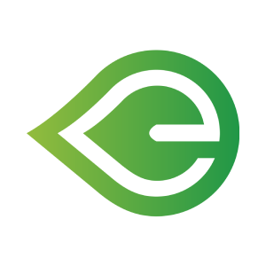 | 51503 | ENERGYX | Safe Energy |
| 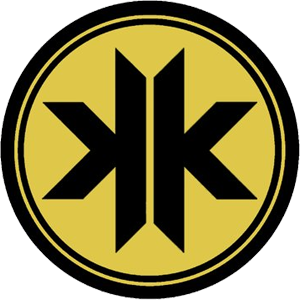 | 32990 | KLKS | Kalkulus |
|  | 132111 | MAGASHIB | MAGA SHIB |
| 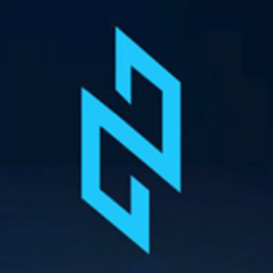 | 32609 | NTK | Neurotoken |
| 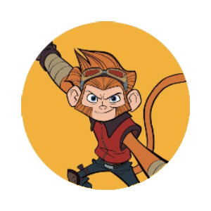 | 132169 | CMONK | CRAZY MONKEY |
| 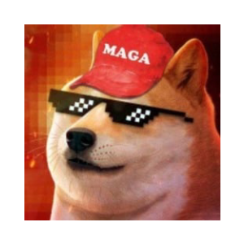 | 132233 | MAGADOGE | MAGA DOGE |
|  | 132265 | PEPEMAGA | PEPE MAGA |
| 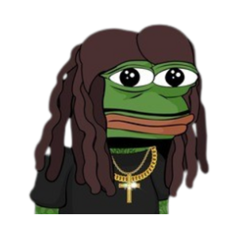 | 131701 | FLOCKA | Waka Flocka |
| 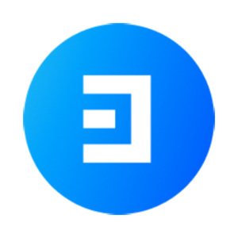 | 121689 | DEL | Decimal |
|  | 56231 | PARAS | Paras |
|  | 68677 | MTK | Metakings |
| 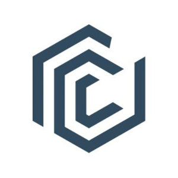 | 121699 | FCT | FirmaChain |
| 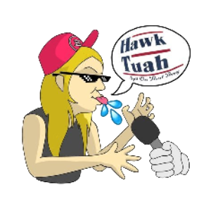 | 131485 | HAWKTUAH | Hawk Tuah |
| 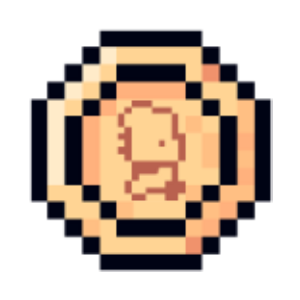 | 122195 | BPET | xPET tech BPET |
|  | 131251 | RPLAY | Replay |
| 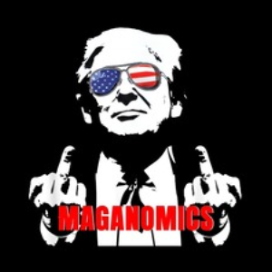 | 131495 | MAGANOMICS | Maganomics |
|  | 131385 | UTYAB | Utya Black |
|  | 131513 | HIF | Hedgehog in the fog |
|  | 68603 | STKXPRT | pSTAKE Staked XPRT |
| 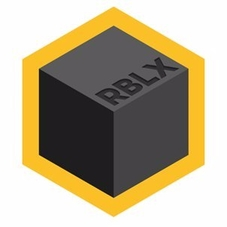 | 32611 | RBLX | Rublix |
| 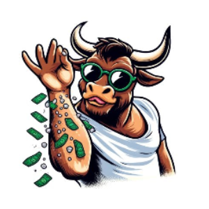 | 132039 | SBAE | Salt Bae For The People |
| 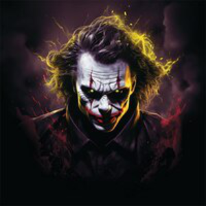 | 122905 | JOKER | JOKER |
| 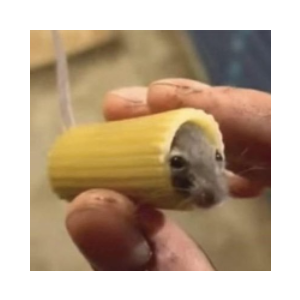 | 132053 | STUCK | mouse in pasta |
|  | 131557 | BWB | Bitget Wallet Token |
| 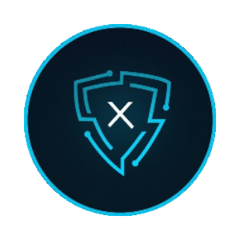 | 131829 | SCANS | 0xScans |
| 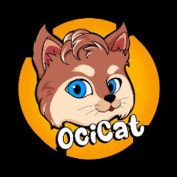 | 123131 | OCICAT | OciCat |
|  | 82273 | HQR | Hayya Qatar |
| 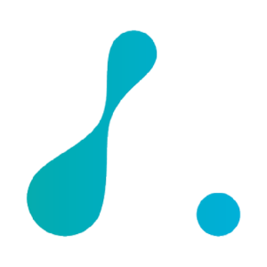 | 121867 | AIMX | Aimedis (new) |
|  | 131629 | SKING | Solo King |
| 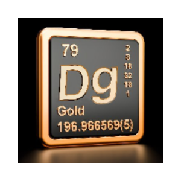 | 71243 | DIGAU | Dignity Gold |
|  | 122943 | FTHM | Fathom Protocol |
|  | 32543 | STAC | StarterCoin |
| 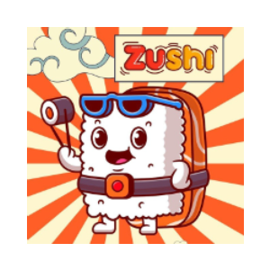 | 131741 | ZUSHI | ZUSHI |
| 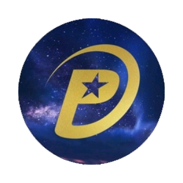 | 131761 | PCD | Phecda |
|  | 122893 | $FM | Flowmatic |
|  | 55231 | SCREAM | Scream |
|  | 121887 | PLY | Aurigami |
| 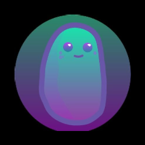 | 55137 | POTATO | Potato |
| 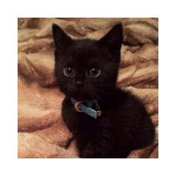 | 131825 | NIGI | Nigi |
| 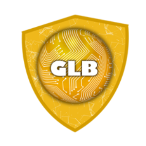 | 59231 | GLB | Golden Ball |
| 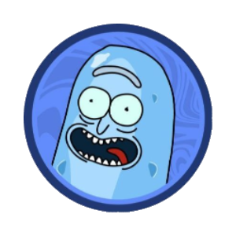 | 131671 | PRICK | Pickle Rick |
| 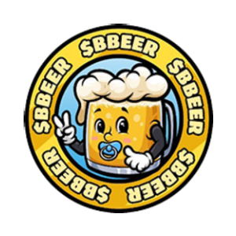 | 131805 | BBEER | BABY BEERCOIN |
| 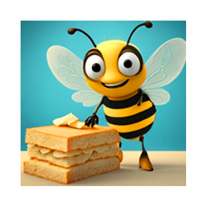 | 132061 | PAMBI | Pambicoin |
|  | 79191 | LUXY | Luxy |
|  | 122949 | NVX | NovaDEX |
| 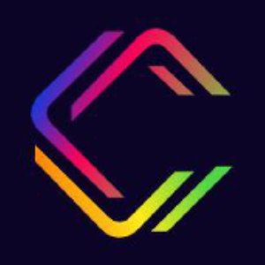 | 59339 | CRONA | CronaSwap |
| 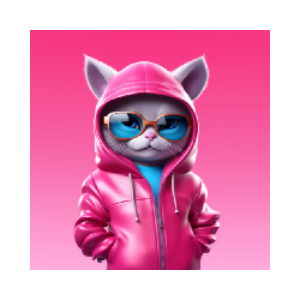 | 132079 | VOPO | VOPO |
|  | 122981 | JEUR | Jarvis Synthetic Euro |
|  | 122967 | HAY | HayCoin |
|  | 121947 | CATMAN | Catman |
|  | 45393 | EURU | Upper Euro |
|  | 122957 | CODEX | CODEX |
| 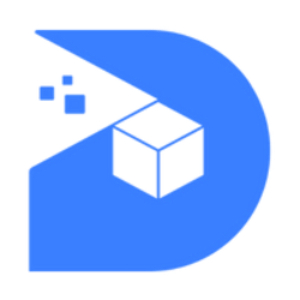 | 67507 | DIFX | Digital Financial Exchange |
|  | 136563 | MICRODOGE | MicroDoge |
|  | 64923 | TAROT | Tarot |
| 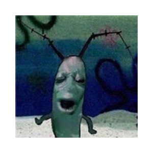 | 146405 | AAAHHM | Plankton in Pain |
| 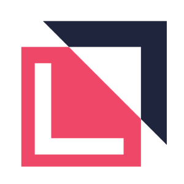 | 47721 | LPNT | Luxurious Pro Network Token |
| 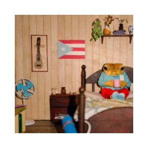 | 148137 | CONCHO | Sapo Concho |
| 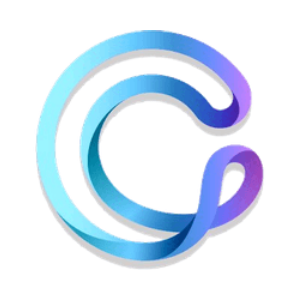 | 1777 | CMT | Comet |
|  | 141499 | BABYSOL | Baby Solana |
|  | 68413 | MINIFOOTBALL | Minifootball |
| 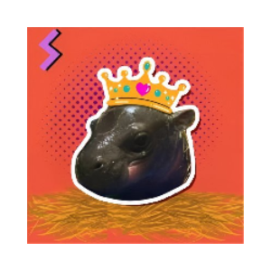 | 141629 | HAGGIS | New Born Haggis Pygmy Hippo |
| 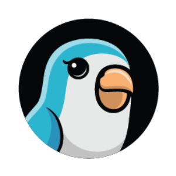 | 68437 | BIRB | Birb |
| 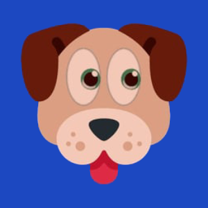 | 135291 | CHWY | CHEWY |
|  | 147127 | GNZ | gAInz |
|  | 2698 | VERI | Veritaseum |
|  | 50413 | HOTDOGE | Hot Doge |
|  | 136783 | GLDGOV | Gold DAO |
| 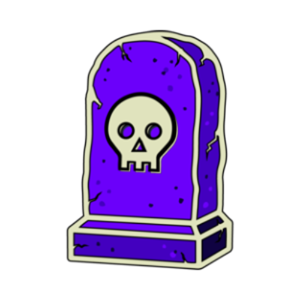 | 51247 | TOMB | Tomb |
| 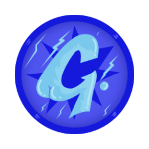 | 136835 | GORPLE | GorplesCoin |
| 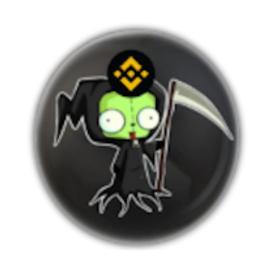 | 64163 | BR34P | BR34P |
| 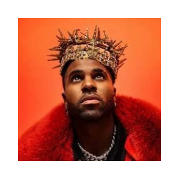 | 135271 | JASON | Jason Derulo |
|  | 82379 | IGUP | IGUP (IguVerse) |
| 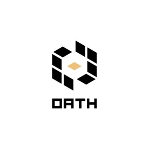 | 66227 | OATH | Oath |
| 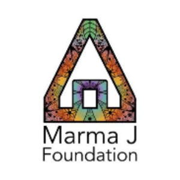 | 68249 | MARMAJ | Marmaj |
| 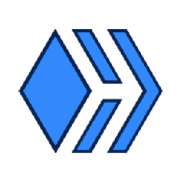 | 78897 | BHBD | bHBD |
| 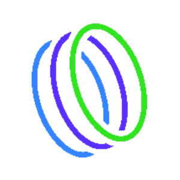 | 67801 | TCG2 | TCGCoin 2.0 |
| 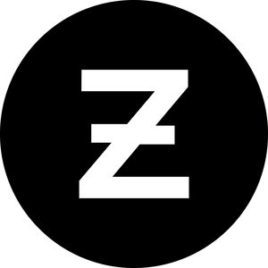 | 2023 | ZER | Zero |
|  | 135307 | REXHAT | rexwifhat |
|  | 111461 | USDV | Verified USD |
|  | 48033 | SCHO | Scholarship Coin |
|  | 148169 | LEGIT | LEGIT |
|  | 146679 | HERE | SphereX |
| 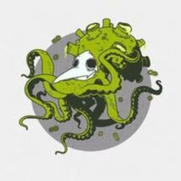 | 146669 | BOBLS | Boblles |
|  | 160 | TRST | WeTrust |
| 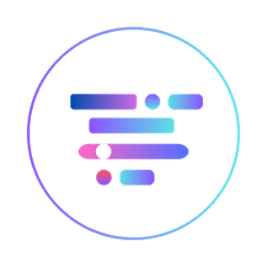 | 146653 | AIP | Pett.AI |
|  | 66133 | DXS | Dx Spot |
|  | 114585 | RCM | READ2N |
| 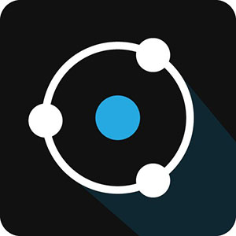 | 142 | ION | Ion |
|  | 87091 | FLIGHT | FlightClupcoin |
|  | 2923 | WGR | Wagerr |
| 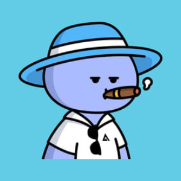 | 147085 | KUDAI | Kudai |
|  | 51359 | YEAR | Lightyears |
|  | 137967 | EBT | ELON BUYS TWITTER |
| 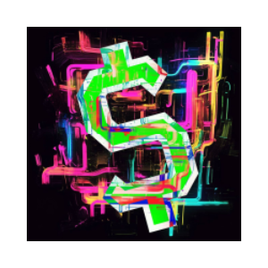 | 141523 | EFR | End Federal Reserve |
|  | 146821 | BIGJIM | Big Jim |
|  | 2947 | RVT | Rivetz |
|  | 141585 | EARL | earl |
|  | 45277 | TRIX | TriumphX |
|  | 122281 | TITANX | TitanX |
| 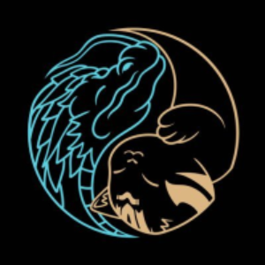 | 147257 | LIHUA | LIHUA |
| 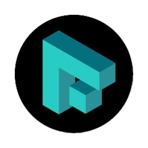 | 58203 | FEES | Unifees |
| 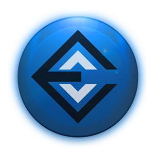 | 56697 | XTRA | XTRA Token |
|  | 135373 | MOOLA | Degen Forest |
|  | 44729 | 4ART | 4ART Coin |
| 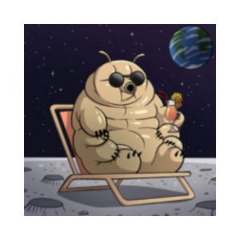 | 146567 | TARDI | Tardi |
|  | 88653 | COLLAB | Collab.Land |
| 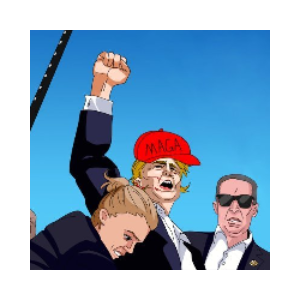 | 137531 | FIGHTMAGA | FIGHT MAGA |
| 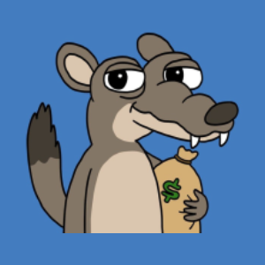 | 135269 | SCRAT | Scrat |
| 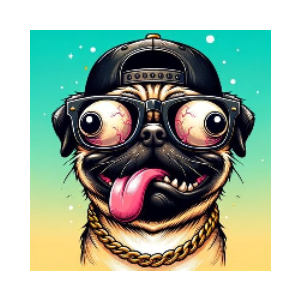 | 68217 | DAWG | DAWG |
|  | 135263 | LPM | Love Power Market |
|  | 135267 | $WATER | WATER |
| 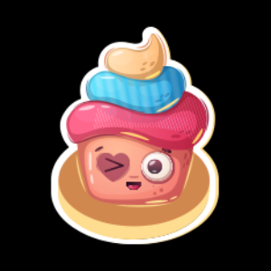 | 58979 | BSCAKE | Bunscake |
|  | 137605 | SUNNED | SUNNED |
| 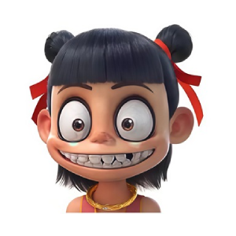 | 150923 | NEZHA | NEZHA |
| 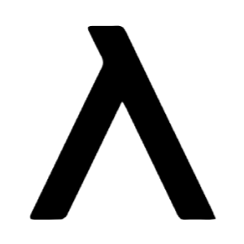 | 33123 | APL | Apollo Currency |
| 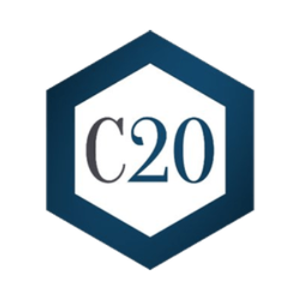 | 32370 | C20 | CRYPTO20 |
|  | 146505 | AIXCB | aixCB by Virtuals |
|  | 71143 | ACCG | Australian Crypto Coin Green |
|  | 49091 | VEN | ImpulseVen |
|  | 88783 | STAI | StereoAI |
| 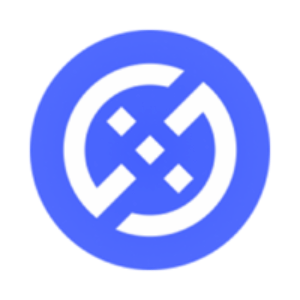 | 44268 | DXD | DXDao |
| 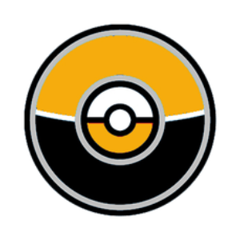 | 33120 | PKG | PKG Token |
|  | 50863 | PALLA | Pallapay |
|  | 89875 | ECS | eCredits |
|  | 47723 | MAYP | Maya Preferred. |
|  | 64931 | FHM | Fantohm |
| 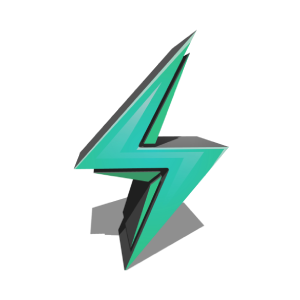 | 90161 | ZYB | Zyberswap |
| 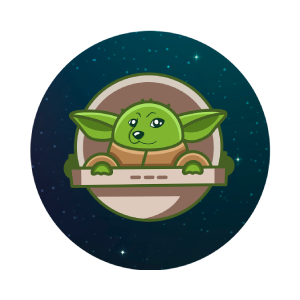 | 78293 | YODE | YodeSwap |
|  | 133139 | NORMIE | NORMIE |
|  | 56155 | UM | Continuum World |
| 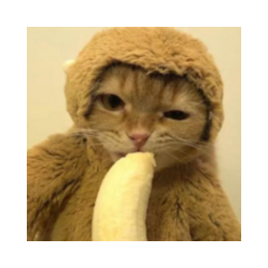 | 135619 | MONGY | MONGY |
|  | 146573 | TSM | Tusima Network |
| 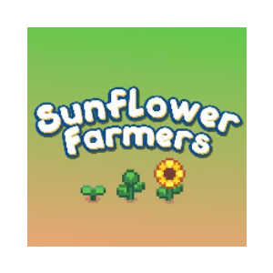 | 60801 | SFF | Sunflower Farm |
| 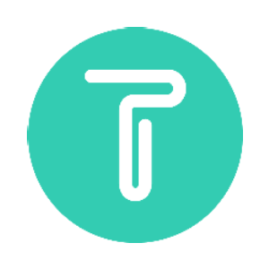 | 63551 | TITI | Titi Financial |
|  | 135413 | GRELF | GRELF |
| 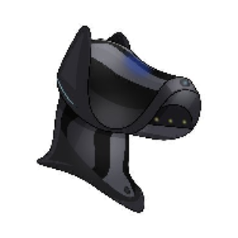 | 137633 | TIEDAN | TieDan |
|  | 78355 | KRS | Kingdom Raids |
| 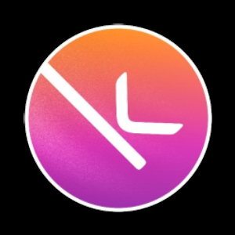 | 135655 | KERN | Kernel |
|  | 146599 | JAK | Jak |
| 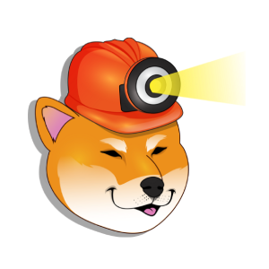 | 121839 | MINU | Minu |
| 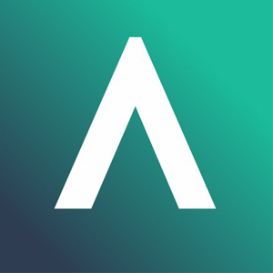 | 32519 | AID | AidCoin |
| 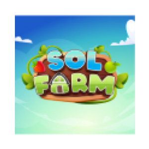 | 123105 | SFARM | SolFarm |
| 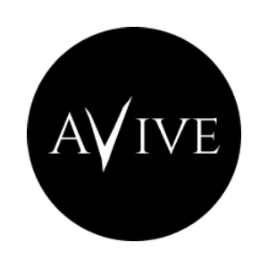 | 122113 | AVIVE | Avive World |
| 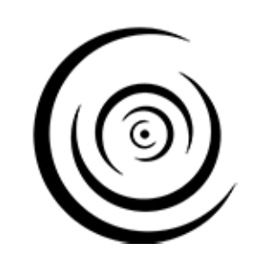 | 122479 | LQDX | Liquid Crypto |
|  | 127245 | GONE | GONE |
| 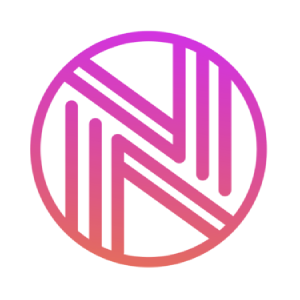 | 123065 | NT | NEXTYPE |
| 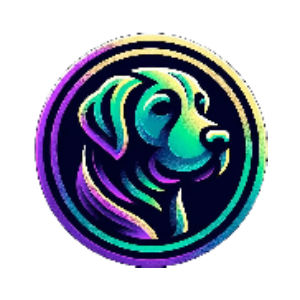 | 122705 | SOBER | Solabrador |
|  | 149863 | DOZY | Dozy (Ordinals) |
|  | 138223 | WIFC | dogwifceo |
|  | 132685 | CT | Challenge |
| 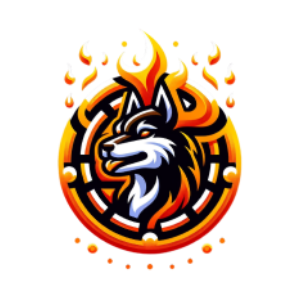 | 130449 | VATR | Vatra INU |
| 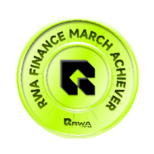 | 128283 | RWAS | RWA Finance |
|  | 125643 | GTM | ColonizeMars |
|  | 112941 | XUI | YouSUI |
|  | 112595 | MILLE | MILLE CHAIN |
|  | 89769 | DCRN | Decred-Next |
|  | 85937 | NTO | Neton |
| 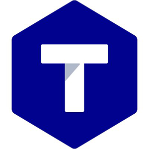 | 78521 | TTC | Tongtong Coin |
| 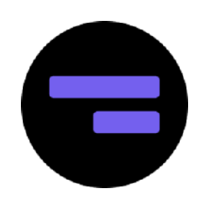 | 68731 | MILE | milestoneBased |
| 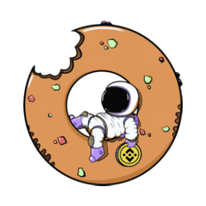 | 69243 | SNACK | Crypto Snack |
| 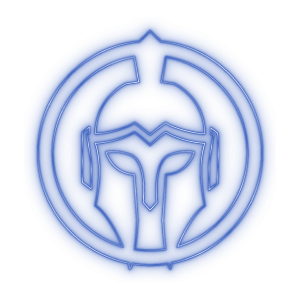 | 66337 | EARN | EarnGuild |
|  | 62857 | HRDG | HRDGCOIN |
|  | 60187 | EWC | Erugo World Coin |
|  | 54475 | SKU | Sakura |
|  | 45273 | SPIZ | SPACE-iZ |
| 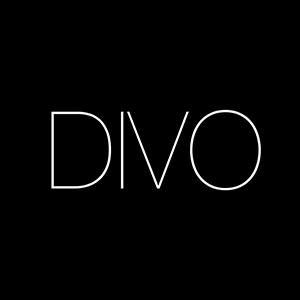 | 42725 | DIVO | DIVO Token |
| 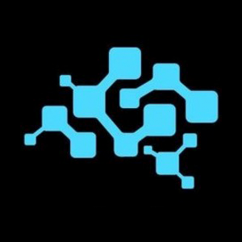 | 42659 | CNTM | Connectome |
|  | 43033 | HUSL | Hustle Token |
| 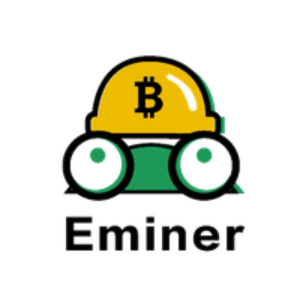 | 36573 | EM | Eminer |
| 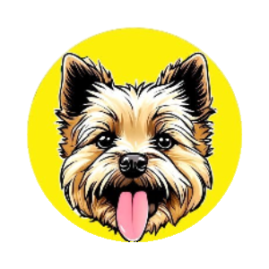 | 33007 | TOTO | Tourist Token |
|  | 33108 | MIB | MIB Coin |
| 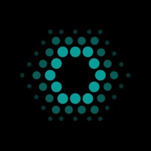 | 32651 | ATMOS | Atmos |
|  | 71611 | RESET | MetaReset |
| 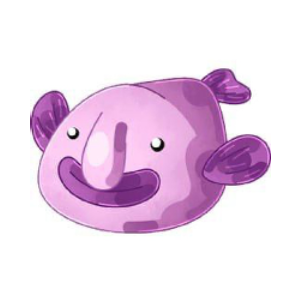 | 129201 | BLOB | Blob |
|  | 64973 | XIDR | XIDR |
| 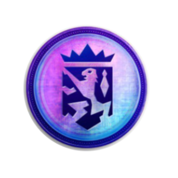 | 62029 | CSOV | Crown Sovereign |
|  | 43252 | WW | WayaWolfCoin |
| 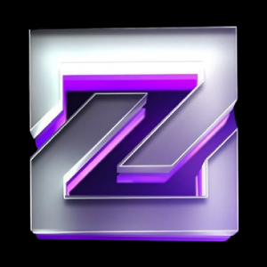 | 127781 | ZKLK | ZkLock |
|  | 124449 | XVC | Xave Coin |
| 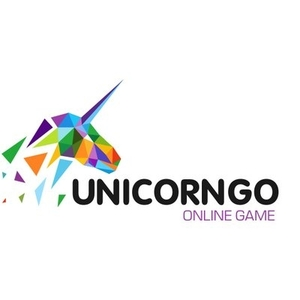 | 78083 | CANDY | TripCandy |
|  | 65537 | APEIN | Ape In |
|  | 123885 | LONGFU | LONGFU |
|  | 97955 | NEMS | The Nemesis |
| 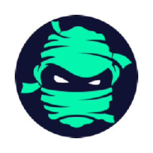 | 85973 | MMY | Mummy Finance |
| 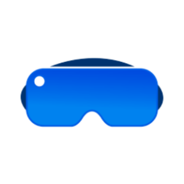 | 63847 | MEVR | Metaverse VR |
| 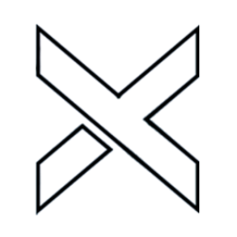 | 50927 | XIDO | Xido Finance |
|  | 49439 | LOTDOG | Lotdog |
|  | 127487 | JTC | Jurat |
|  | 47185 | CAMP | Camp |
| 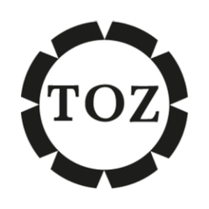 | 47859 | TOZ | Tozex |
|  | 125801 | AISC | AI Surf |
|  | 69379 | PS1 | POLYSPORTS |
|  | 65607 | HERMES | HERMES |
|  | 65913 | HSHARES | Hermes Shares |
|  | 50655 | DONK | Donkey |
|  | 129305 | BOMEDOGE | BOOK OF DOGE MEMES |
| 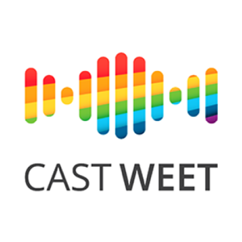 | 121851 | CTT | Cashtree Token |
| 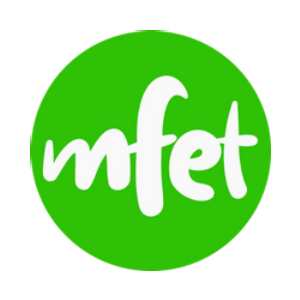 | 70311 | MFET | MFET |
| 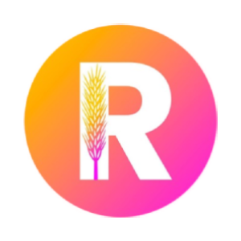 | 65739 | RAK | Rake Finance |
|  | 59105 | KAKA | KAKA NFT World |
|  | 2720 | ETP | Metaverse ETP |
| 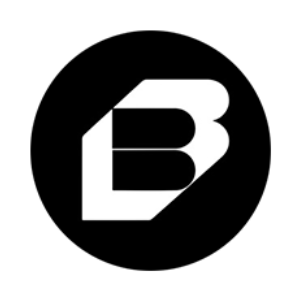 | 123117 | BUNDL | Bundl Tools |
|  | 112113 | FMXEN | Xen Crypto (Fantom) |
|  | 66261 | FWW | Farmers World Wood |
| 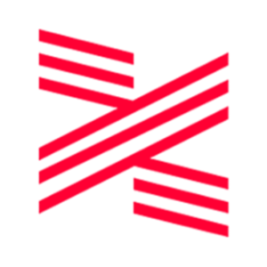 | 32793 | XMX | XMax |
|  | 127701 | XROOTAI | XRootAI |
|  | 94597 | ENXS | EtherNexus |
| 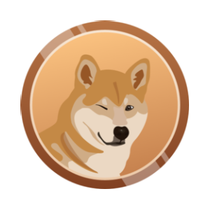 | 51523 | COGE | Cogecoin |
| 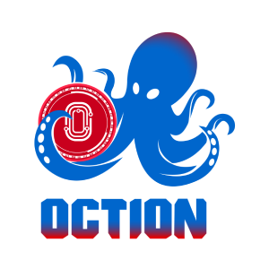 | 49089 | OCTI | Oction |
| 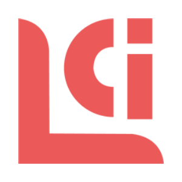 | 136997 | LCI | LOVECHAIN |
| 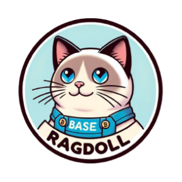 | 141653 | RAGDOLL | Ragdoll |
|  | 137307 | JLY | Jellyverse |
|  | 113807 | BITCOINAI | Bitcoin AI |
|  | 96921 | $NOOT | NOOT |
|  | 88813 | THE9 | THE9 |
| 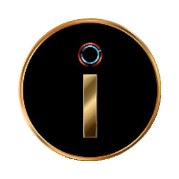 | 65349 | IAI | inheritance Art |
|  | 60845 | GMPD | GamesPad |
| 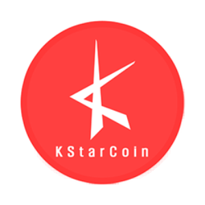 | 42051 | KSC | KStarCoin |
|  | 146117 | DU | DU Coin |
|  | 50531 | AQUARI | Aquari |
| 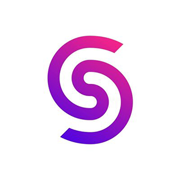 | 137043 | SWA | Swag Token |
|  | 112241 | HCFW | HumansCareFoundationWater |
| 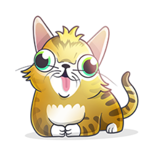 | 127763 | GOOGLY | Googly Cat |
|  | 148791 | PRAWN | Pepe the King Prawn |
|  | 145837 | BLAKE | BLAKE |
| 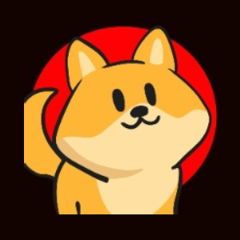 | 138005 | TROGE | Troge |
| 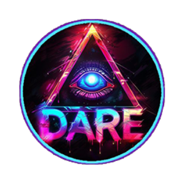 | 128139 | DARE | The Dare |
|  | 122863 | DARC | Konstellation Network |
| 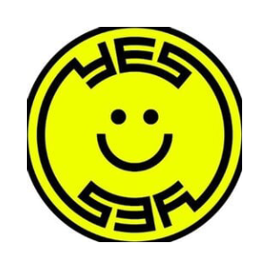 | 71383 | YES | Yes World |
| 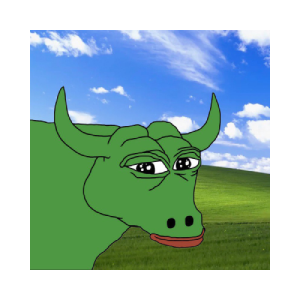 | 112439 | BEEF | BEEF |
| 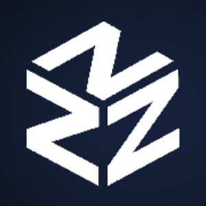 | 124967 | Z3 | Z-Cubed |
| 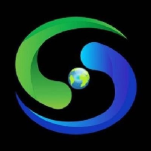 | 113775 | SMPF | SMP Finance |
| 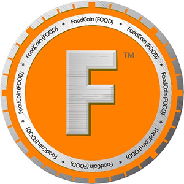 | 122435 | FOOD | FoodChain Global |
| 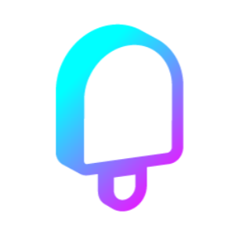 | 71137 | FAYRE | Fayre |
|  | 125163 | PGOLD | Polkagold |
| 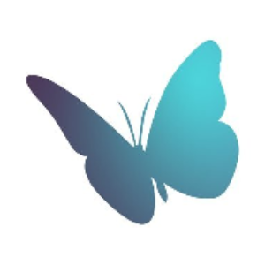 | 98291 | BCAU | BetaCarbon |
|  | 71031 | CHRO | Chronicum |
| 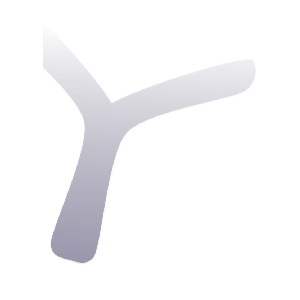 | 64239 | ZYR | Zyrri |
|  | 57129 | GLK | Glouki |
|  | 57725 | AFX | Afrix |
|  | 133287 | BDCL BSC | BorderCollieBSC |
|  | 32943 | SVD | savedroid |
| 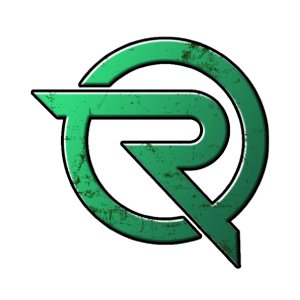 | 137947 | RUNNER | Runner |
|  | 69303 | $TIPSY | TipsyCoin |
|  | 111953 | FLOYX | Floyx |
|  | 68543 | $MAID | MaidCoin |
| 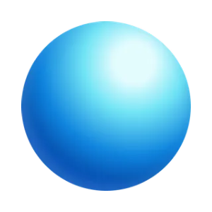 | 63303 | ZURR | ZURRENCY |
| 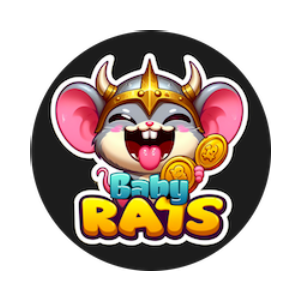 | 133253 | BABYRATS | Baby Rats |
|  | 112963 | BNYTA | Bonyta |
| 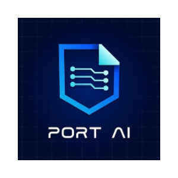 | 128129 | POAI | Port AI |
|  | 141401 | KIDEN | RoboKiden |
| 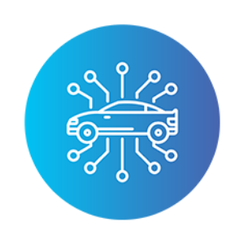 | 136369 | FASTAI | Fast And Ai |
| 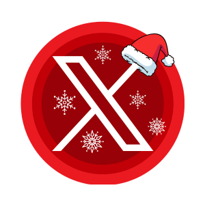 | 122621 | XMAS | Elon Xmas |
| 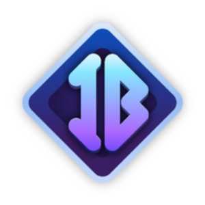 | 94615 | ITSB | ITSBLOC |
|  | 99935 | XFER | X Bridge Bot |
|  | 70087 | YUSE | Yuse |
|  | 70665 | MEND | Mend |
|  | 64981 | ABLOCK | ANY Blocknet |
|  | 125653 | INFICLOUD | InfiCloud |
|  | 79725 | SWIV | Swivel Governance |
|  | 79741 | X1 | MetaX |
| 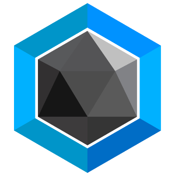 | 63495 | QTZ | Quartz |
|  | 3144 | ANC | Anoncoin |
|  | 141591 | JNFTC | Jumbo Blockchain |
| 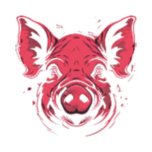 | 132031 | WSH | White Yorkshire |
| 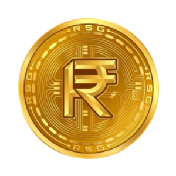 | 130421 | RSG | RSG TOKEN |
|  | 127821 | SORAI | SORA AI |
| 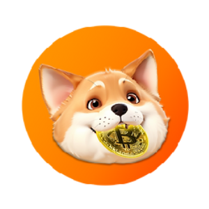 | 128815 | BONKCON | Bonkcon |
| 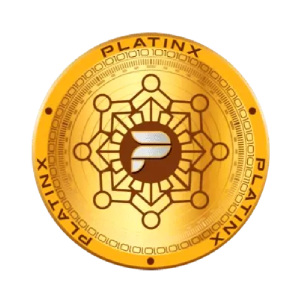 | 122923 | PTX | PlatinX |
| 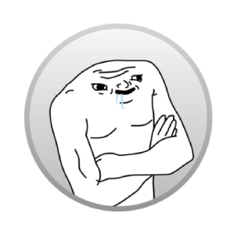 | 71459 | BLET | Blockearth |
|  | 67343 | MTG | MagnetGold |
|  | 55629 | APECOIN | Asia Pacific Electronic Coin |
|  | 51305 | ZOE | Zoe Cash |
|  | 45388 | VBIT | VALOBIT |
|  | 44095 | LEVELG | LEVELG |
| 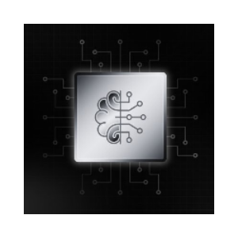 | 129123 | OPMND | Open Mind Network |
|  | 112251 | CTRL | Ctrl |
| 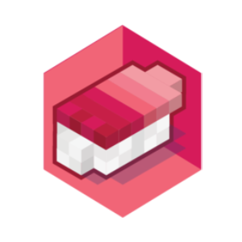 | 85049 | HAMI | Hamachi Finance |
|  | 63229 | TOMS | TomTomCoin |
|  | 60505 | A.O.T | Age Of Tanks |
| 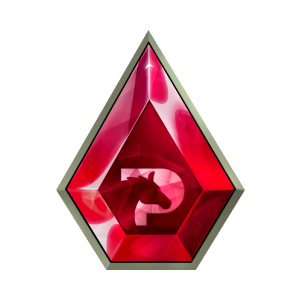 | 57395 | PGX | Pegaxy Stone |
| 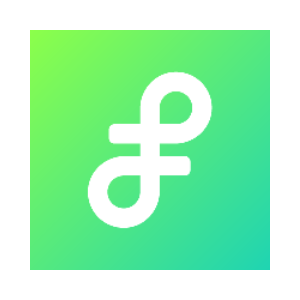 | 99479 | LAVITA | Lavita |
|  | 82425 | AFD | Animal Farm Dogs |
|  | 65619 | WHEY | WHEY |
| 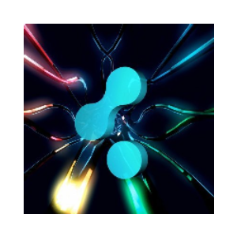 | 128081 | NEONAI | NeonAI |
|  | 122295 | LCSN | Lacostoken |
| 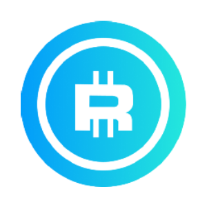 | 98871 | RIK | RIKEZA |
|  | 112567 | ZW | Zenith Wallet |
| 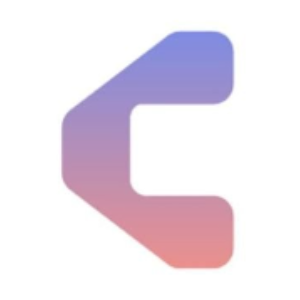 | 69707 | CRDC | Cardiocoin |
|  | 65019 | WIRTUAL | Wirtual |
| 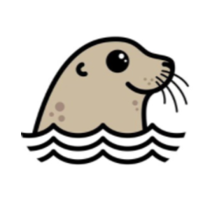 | 44161 | KALA | Kala |
| 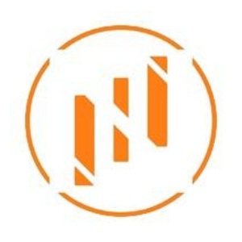 | 112989 | NEXBOX | NEXBOX |
|  | 147337 | MB28 | MBridge28 |
| 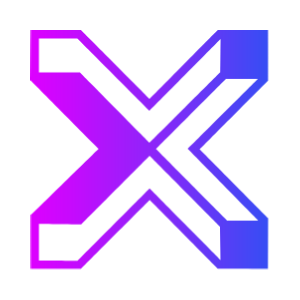 | 97495 | XACT | XActRewards |
|  | 67745 | A1A | Aonea Coin |
| 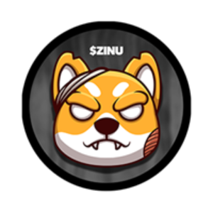 | 64849 | ZINU | Zombie Inu |
|  | 47119 | BAFI | Bafi Finance Token |
| 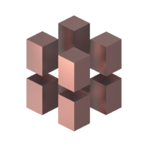 | 33720 | FOAM | FOAM |
| 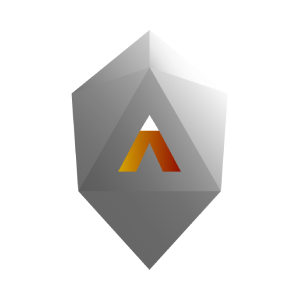 | 131599 | ALTR | Altranium |
| 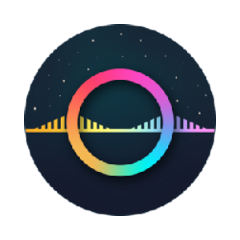 | 122329 | TRESTLE | TRESTLE |
|  | 112699 | JFISH | Jellyfish Mobile |
|  | 34399 | GRAT | Gratz |
|  | 36333 | FRAS | FRASINDO FRAS COIN |
|  | 127739 | VIRTU | VIRTUCLOUD |
| 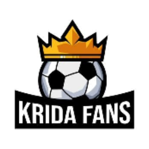 | 61577 | KRIDA | Krida Fans |
|  | 141809 | ABRA | Abraham Elite |
|  | 113073 | RIWA | Recycle Impact World Association |
|  | 88135 | EG | EG Token |
|  | 66393 | MATICPAD | Matic Launchpad |
|  | 66083 | STRIP | Stripto |
|  | 64007 | CNAME | Cloudname |
| 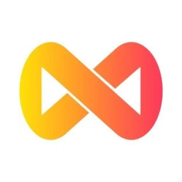 | 123197 | RB | REBorn(New) |
|  | 46996 | KTLYO | Katalyo |
| 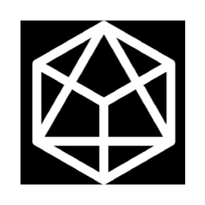 | 32399 | YEE | YEE |
|  | 144943 | PIGU | PIGU |
|  | 90549 | LOPES | Leandro Lopes |
|  | 90715 | SMTX | SUMOTEX |
|  | 64743 | USDX | USDX |
| 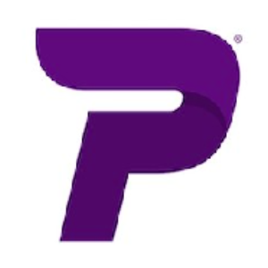 | 34497 | PTM | Potentiam |
|  | 112345 | 0XANON | 0xAnon |
|  | 42361 | LMY | Lunch Money |
| 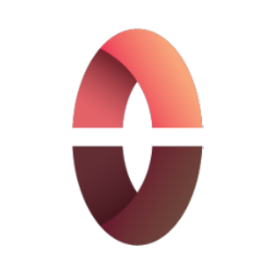 | 82175 | BAJU | Bajun Network |
| 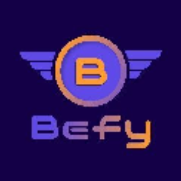 | 125217 | BEFY | Befy Protocol |
|  | 57727 | JRIT | JERITEX |
| 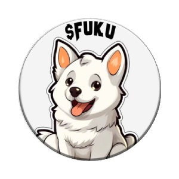 | 56921 | FUKU | Furukuru |
|  | 49863 | NOA | NOA PLAY |
| 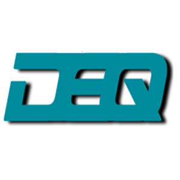 | 33829 | DEQ | Dequant |
| 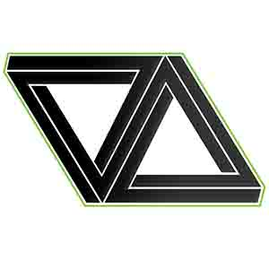 | 151 | TKS | Tokes |
|  | 145145 | BRUME | Brume |
|  | 130409 | DCC | Dogeconnect |
| 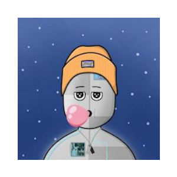 | 126527 | 404A | 404Aliens |
|  | 112099 | TRENDX | Trend X |
| 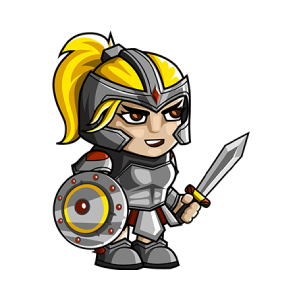 | 67541 | ACK | AcknoLedger |
| 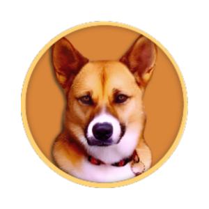 | 45176 | KEN | Keysians Network |
|  | 137937 | $BOOST | BoostAI |
|  | 129321 | BABYPORK | Baby Pepe Fork |
| 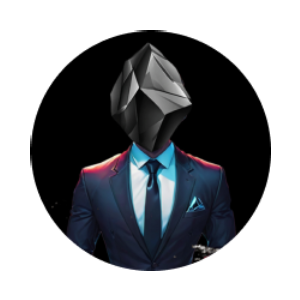 | 128733 | BLACKROCK | BlackRock |
|  | 96207 | WEMIX$ | WEMIX Dollar |
|  | 95087 | NDAU | Ndau |
| 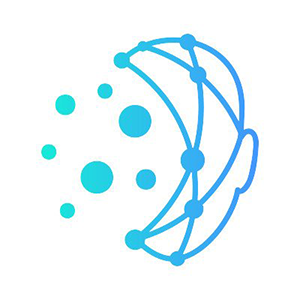 | 78991 | MAI | Mindsync |
| 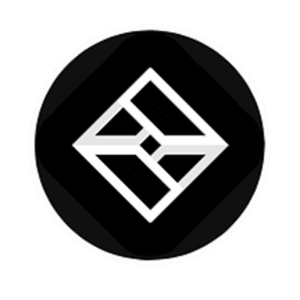 | 77947 | XOT | Okuru |
|  | 67839 | SHIBAMETA | ShibaMetaverse |
| 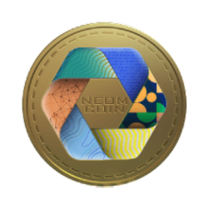 | 61895 | NEOM | New Earth Order Money |
|  | 42327 | BELL | Bellcoin |
| 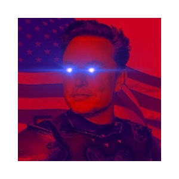 | 135625 | DELON | Dark Elon |
| 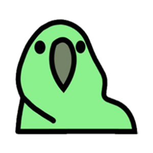 | 136033 | PARRY | Parry Parrot |
|  | 141605 | EBC | Epic Ballad Coin |
|  | 122601 | MILO DOG | MILO DOG |
|  | 131341 | SHC | School Hack Coin |
|  | 122825 | YUP | Yup |
| 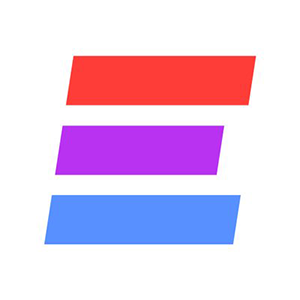 | 82551 | EST | Esports Token |
|  | 125339 | CHIBA | Chiba Neko |
|  | 141715 | TMPL | TMPL |
|  | 124251 | MYROWIF | MYROWIF |
|  | 51455 | CBIX-P | Cubiex Power |
| 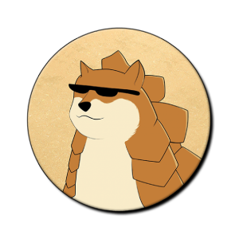 | 49457 | DOGIRA | Dogira |
|  | 142203 | DROP | DROP |
| 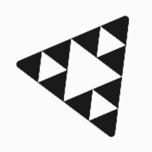 | 77575 | HLN | Holonus |
|  | 65907 | LEUR | Limited Euro |
| 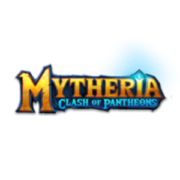 | 58537 | MYRA | Mytheria |
| 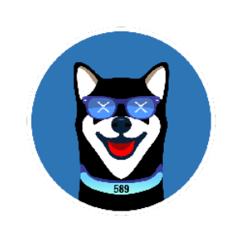 | 56997 | XRDOGE | XRdoge |
| 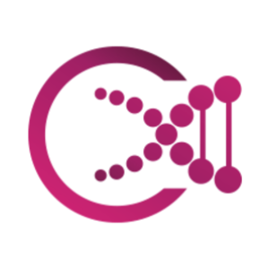 | 55701 | NKCLC | NKCL Classic |
|  | 86269 | ARCHAI | Archive AI |
|  | 60237 | CPTINU | Captain Inu |
|  | 50587 | DFNI | DeFini |
| 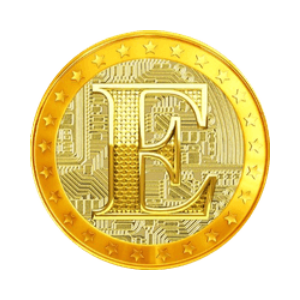 | 44834 | ESRC | EchoSoraCoin |
|  | 145443 | SWIO | Second World Games |
| 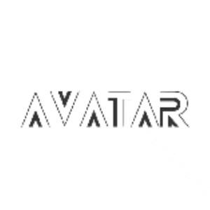 | 129515 | AVATAR | Avatar |
|  | 126339 | YOYO | Yoyo Market |
|  | 78913 | CUBIX | CUBIX |
| 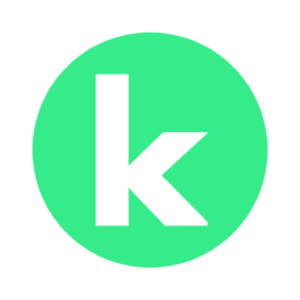 | 68337 | KTX | KwikTrust |
|  | 57093 | WNOW | WalletNow |
| 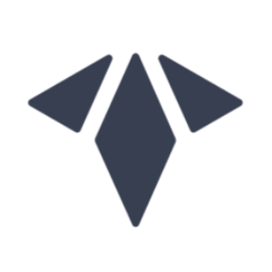 | 41634 | RAE | RAE Token |
| 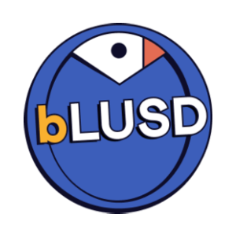 | 78835 | BLUSD | Boosted LUSD |
| 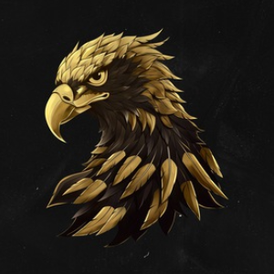 | 136495 | EGL | The Eagle Of Truth |
|  | 136467 | KAMALA | HARRIS (kamala.vip) |
| 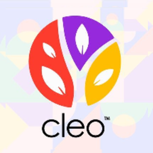 | 121825 | CLEO | Cleo Tech |
|  | 49533 | VSO | Verso |
|  | 46600 | KOMET | Komet |
|  | 142071 | TSLT | Tamkin |
| 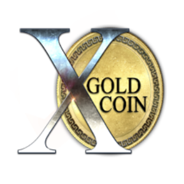 | 124511 | XGOLD | XGOLD COIN |
| 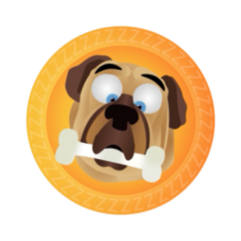 | 126365 | ZRPY | Zerpaay |
| 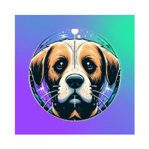 | 128141 | BPINKY | BPINKY |
| 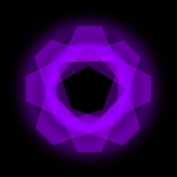 | 122403 | SOLAV | SOLAV TOKEN |
| 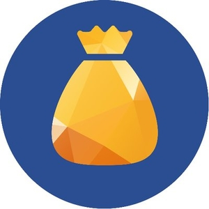 | 123103 | MNB | MN Bridge |
| 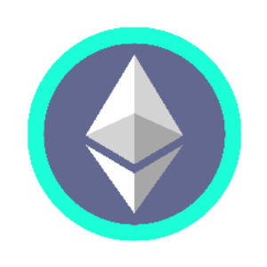 | 99433 | GOETH | goETH |
|  | 94451 | APD | Aptopad |
| 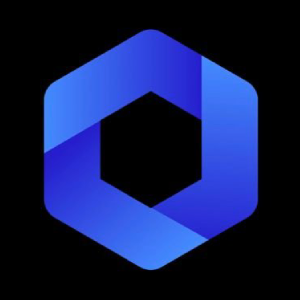 | 89843 | MMAI | MetamonkeyAi |
|  | 78247 | SPN | Sportzchain |
|  | 70263 | GOMT | GoMeat |
| 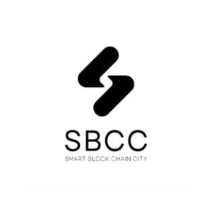 | 69355 | SBCC | Smart Block Chain City |
|  | 65461 | AVE | Avaware |
|  | 59615 | VGB | Vagabond |
|  | 59801 | SPRT | Sportium |
| 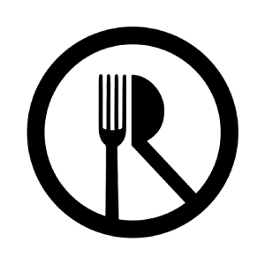 | 59441 | ORARE | OneRare |
|  | 56449 | PETS | MicroPets |
|  | 56157 | CPOS | CPOS Cloud Payment |
| 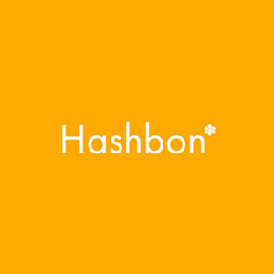 | 125625 | HASH | HashMind |
| 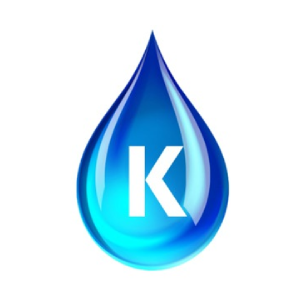 | 66379 | KANG3N | kang3n |
| 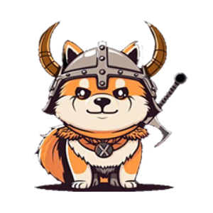 | 127831 | SHOKI | Shoki |
|  | 123033 | EPETS | Etherpets |
| 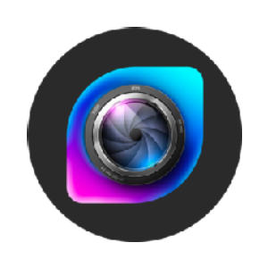 | 45153 | STYL | Yin Lang |
|  | 44946 | GTEX | GTEX |
|  | 44937 | TM2 | Traxia Movement |
|  | 42376 | VOTE | Agora |
| 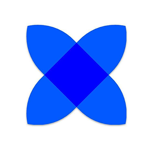 | 41294 | MTXLT | Tixl |
| 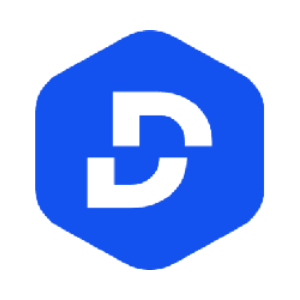 | 36588 | DEFI | Defi |
|  | 41194 | ENTRP | Hut34 Entropy |
|  | 36438 | CBIX | Cubiex |
| 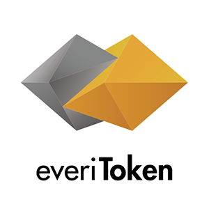 | 36604 | EVT | EveriToken |
| 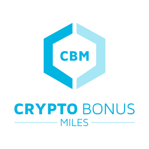 | 36586 | CBM | CryptoBonusMiles |
| 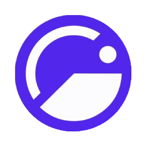 | 41409 | GIV | GIVLY Coin |
|  | 34407 | SLV | Silverway |
| 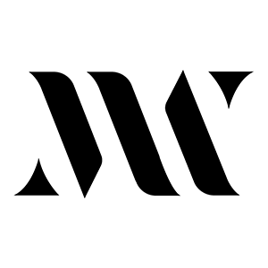 | 33841 | MZK | Muzika |
| 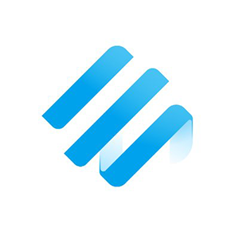 | 33565 | XBASE | Eterbase |
|  | 33642 | HYN | Hyperion |
| 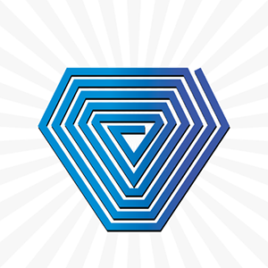 | 33581 | UND | Unification |
|  | 32729 | LOKI | Loki |
|  | 32459 | AXP | aXpire |
| 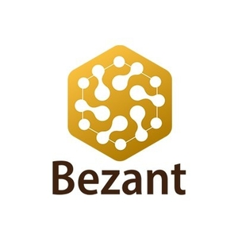 | 32763 | BZNT | Bezant |
|  | 32484 | CAN | CanYaCoin |
| 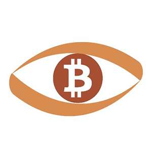 | 32799 | BKBT | BeeKan |
|  | 32567 | EQL | Equal |
| 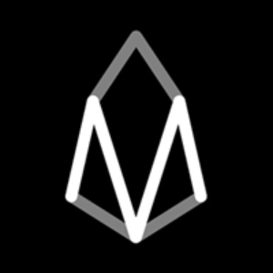 | 33193 | MEETONE | MEET.ONE |
|  | 33062 | NPXSXEM | Pundi X NEM |
|  | 2993 | ARN | Aeron |
|  | 2908 | ART | Maecenas |
| 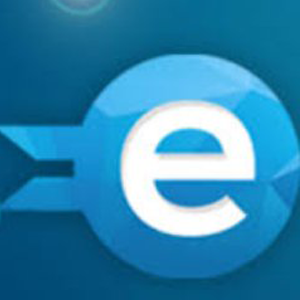 | 124 | EBST | eBoost |
|  | 146059 | EFCR | EFLANCER |
|  | 146043 | XTCASH | traaittXTCASH |
| 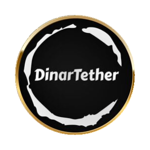 | 146061 | DINT | DinarTether |
| 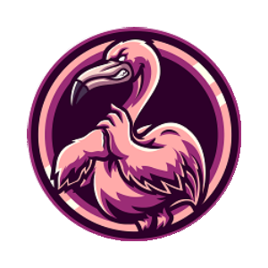 | 130211 | CRIMINGO | Criminal Flamingo |
|  | 131153 | ZDAI | Zydio AI |
|  | 126005 | ROSNET | Rosnet |
|  | 122065 | MDTK | MDtoken |
| 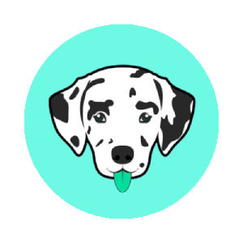 | 112237 | DALMA | Dalma Inu |
|  | 113085 | SMCN | SafeMineCoin |
|  | 113009 | NYANDOGE | NyanDOGE International |
|  | 86899 | PCA | Purchasa |
| 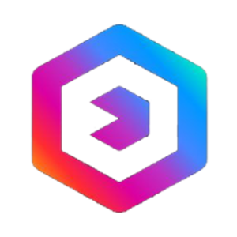 | 86403 | EVOAI | EvolveAI |
|  | 71453 | TFMC | Tap Fantasy MC |
|  | 69165 | SHARES | Cryptoshares |
| 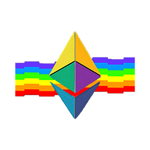 | 46671 | NYANTE | Nyantereum |
| 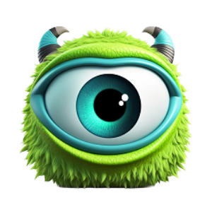 | 33284 | MKT | MarketCash |
|  | 23 | THC | HempCoin |
|  | 55739 | SCAN | Scan DeFi |
|  | 65279 | FAME | Fantom Maker |
| 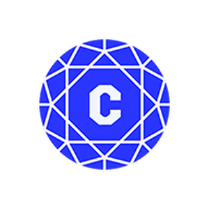 | 123857 | CENT | Centaurify |
| 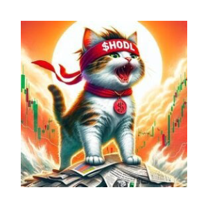 | 65381 | KITTY | Kitty Coin |
| 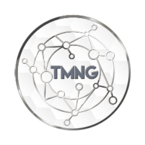 | 125897 | TMNG | Technology Metal Network Global |
|  | 66857 | WSWAP | Wallet Swap |
|  | 65271 | DMAGIC | Dark Magic |
|  | 126677 | NOON | HighNoon |
|  | 99477 | LAVE | Lavandos |
| 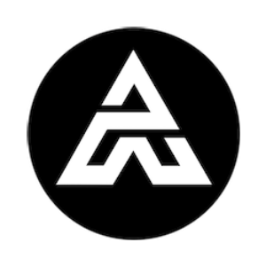 | 85985 | ACRIA | Acria.AI |
| 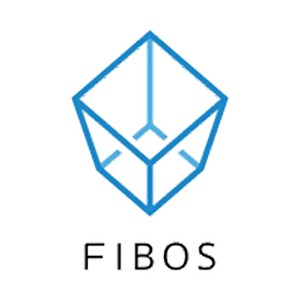 | 36581 | FO | FIBOS |
|  | 41906 | FRED | Fredenergy |
|  | 143403 | WOLF INU | WOLF INU |
| 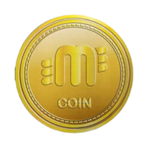 | 58621 | MMSC | MMS Coin |
|  | 61829 | ILUS | ILUS Coin |
| 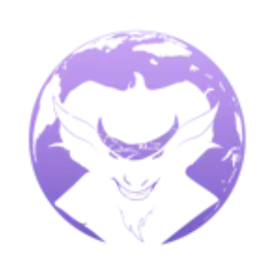 | 127621 | AMBO | Sheertopia |
|  | 66115 | AWO | AiWork |
|  | 56757 | TREEB | Treeb |
|  | 124233 | BABYMUSK | Baby Musk |
|  | 100005 | WMOXY | Wrapped MOXY |
| 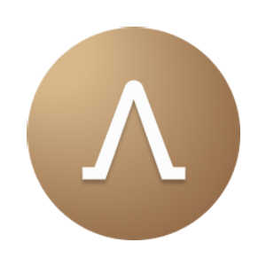 | 80553 | LSHARE | LIF3 LSHARE |
|  | 146951 | SLOF | Slof |
| 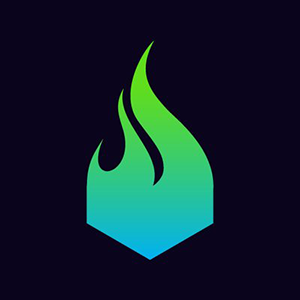 | 132081 | TKD | Tokuda |
|  | 136697 | HOMS | Heroes of memes |
|  | 137663 | TRUMPSHIBA | Trump Shiba |
|  | 127719 | MTGX | Montage Token |
| 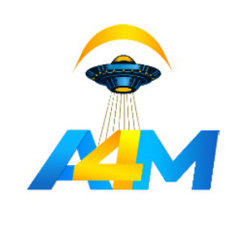 | 122583 | A4M | AlienForm |
|  | 68133 | WPCI | Wrapped Paycoin |
| 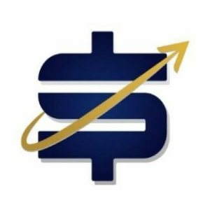 | 50475 | HZD | Horizon Dollar |
|  | 135369 | ATOPLUS | ATO+ |
| 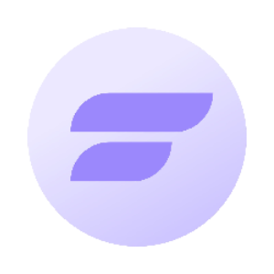 | 127285 | FI | Fideum |
|  | 127311 | GUUFY | Guufy |
|  | 123459 | LGBTQ | Gays Inu |
| 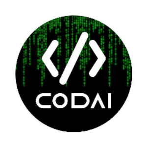 | 115399 | CODAI | CODAI |
|  | 122505 | GALAXY | Galaxy Coin |
| 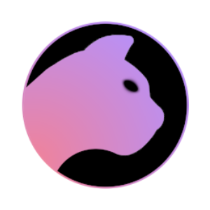 | 111593 | REUNI | Reunit Wallet |
|  | 112933 | XERT | XertiNet |
|  | 113019 | OWNER | OPENWORLDNFT |
|  | 98143 | MMVG | MEMEVENGERS |
| 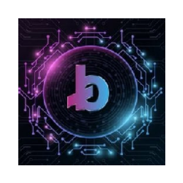 | 69423 | BRS | Broovs Projects |
|  | 51565 | DYNAMO | Dynamo Coin |
| 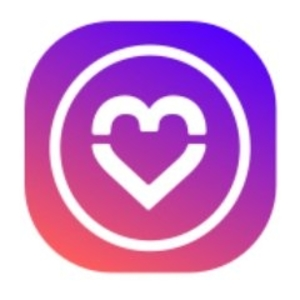 | 44121 | MNR | Mineral |
|  | 42130 | URX | UraniumX |
| 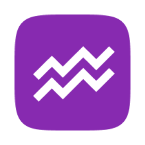 | 34496 | AQUA | Aquachain |
|  | 34521 | VRSC | Verus Coin |
| 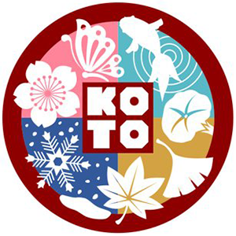 | 36403 | KOTO | KOTO |
| 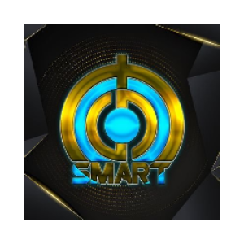 | 79099 | ECG | ECS Gold |
|  | 50865 | MONSTA | Cake Monster |
| 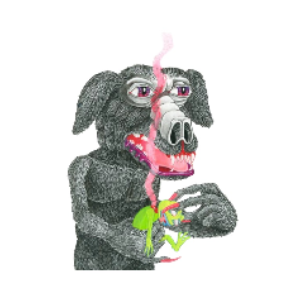 | 135277 | DOGGS | Doggensnout |
|  | 125193 | LEMON | Lemon Terminal |
| 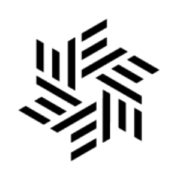 | 122033 | NEXT | ShopNEXT |
| 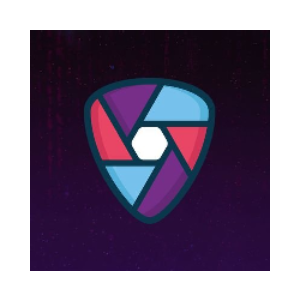 | 65357 | AVME | AVME |
|  | 44882 | AMSK | NoleWater |
|  | 145317 | OMOCHI | No1 tiktok frog (Omochi) |
| 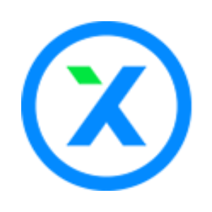 | 122461 | SOC | socrates |
|  | 65525 | CYCLE | Cycle Token |
| 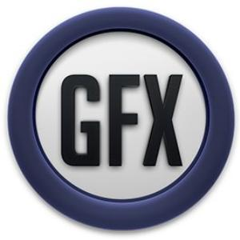 | 49059 | GFX | GamyFi Token |
|  | 34690 | RUNES | Runebase |
| 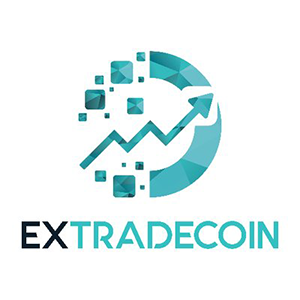 | 122613 | ETE | Ethereum Express |
|  | 145263 | SYDNEY | Sydney |
| 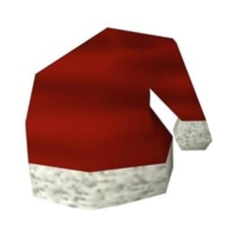 | 144955 | SANTAHAT | SANTA HAT |
|  | 145023 | MORUD | Morud |
| 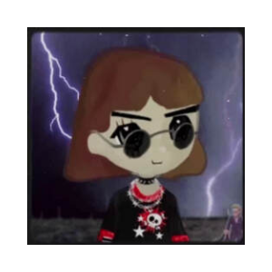 | 145235 | REMILIA | Remilia |
|  | 113591 | MEMEETF | Meme ETF |
| 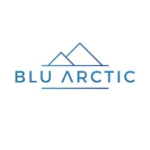 | 123709 | BARC | The Blu Arctic Water Company |
|  | 46350 | FMTA | Fundamenta |
|  | 33025 | EUNO | EUNO |
|  | 132763 | SOAI | SOAI |
|  | 111501 | FORE | FORE Protocol |
| 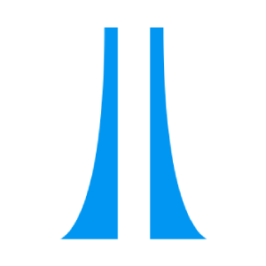 | 59437 | RBIF | Robo Inu Finance |
| 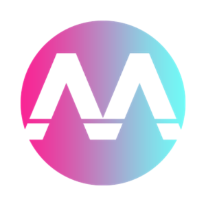 | 59657 | MODA | MODA DAO |
|  | 49961 | AGE | Agenor |
|  | 49737 | TBAKE | BakeryTools |
|  | 42298 | BTCMZ | BitcoinMono |
|  | 34693 | XSPC | Spectre Security Coin |
|  | 41263 | KEMA | KemaCoin |
| 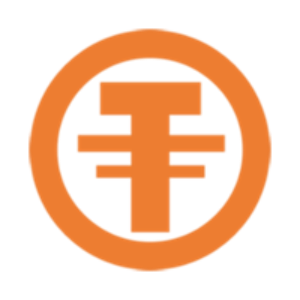 | 33570 | OTO | OTOCASH |
| 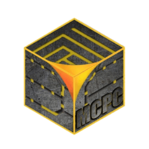 | 34403 | MCPC | Mobile Crypto Pay Coin |
| 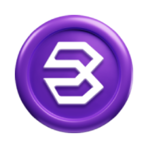 | 142791 | BITTON | Bitton |
|  | 77963 | BFR | Buffer Token |
| 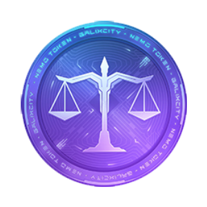 | 78369 | NEMO | NEMO |
|  | 122891 | UNDX | UNODEX |
| 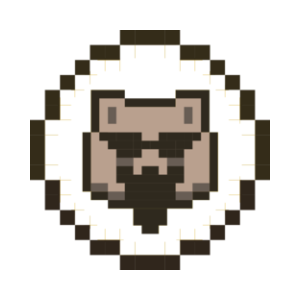 | 80547 | WMX | Wombex |
|  | 48653 | TFBX | TrueFeedBack |
|  | 125977 | NEBULA | Nebula |
|  | 94467 | ARBPAD | ArbitrumPad |
|  | 51147 | SCOOBI | Scoobi Doge |
|  | 60619 | KUNO | KunoichiX |
| 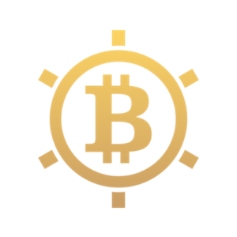 | 34737 | BTCV | BitcoinV |
|  | 113705 | RWA | Real World Assets |
| 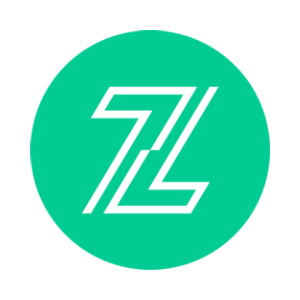 | 144637 | ZTK | Zefi |
|  | 99277 | STKC | Streakk Chain |
|  | 98565 | KUSDC | Fat Cat Killer |
|  | 69567 | GAMES | Gaming Stars |
| 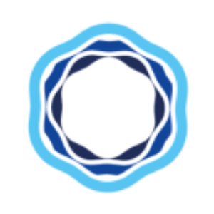 | 65117 | OCE | OceanEX Token |
|  | 41774 | MCN | Moneta Verde |
| 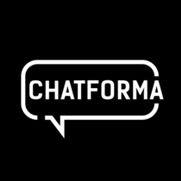 | 113813 | CBOT | CompanionBot |
|  | 113339 | DOCSWAP | Dex on Crypto |
|  | 112559 | YCH | YoCash |
|  | 94965 | CKING | CatKing |
| 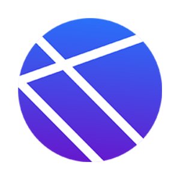 | 135667 | VALU | Value |
| 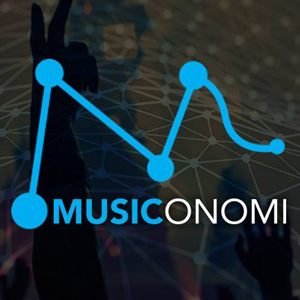 | 138979 | MCI | Marcus Cesar Inu |
| 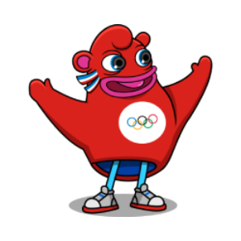 | 138931 | OLYMPE | OLYMPÉ |
|  | 137915 | SWIF | SUNwifHat |
| 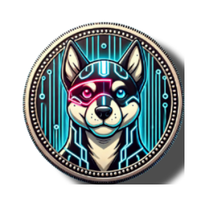 | 139003 | YORI | YORI |
| 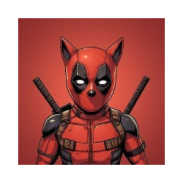 | 137725 | DPOOL | Deadpool Inu |
| 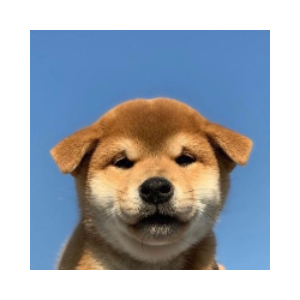 | 136537 | MOYA | MOYA |
| 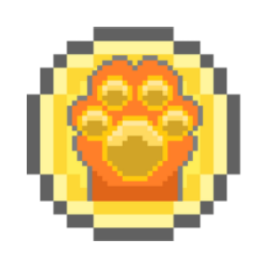 | 115245 | TITTY | TamaKitty |
| 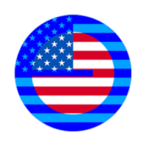 | 122803 | USA | DEDPRZ |
| 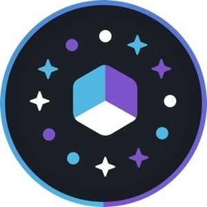 | 122653 | PGT | Price Gap |
| 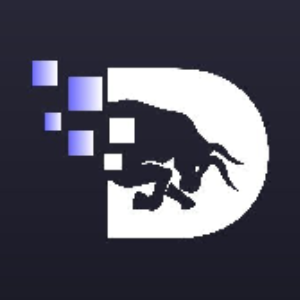 | 113341 | DTORO | DexToro |
|  | 68841 | BAVA | Baklava |
|  | 67649 | OSW | OpenStream World |
|  | 65621 | NFSG | NFT Soccer Games |
| 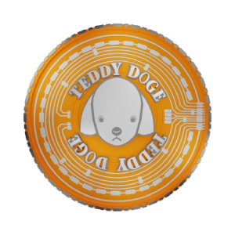 | 65543 | TEDDY | Teddy |
|  | 126097 | 16DAO | 16DAO |
| 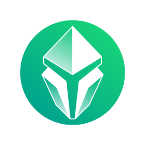 | 122023 | UBDN | UBD Network |
|  | 111801 | $LOCG | LOCG |
| 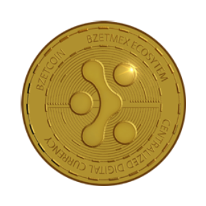 | 111569 | BZET | BzetCoin |
| 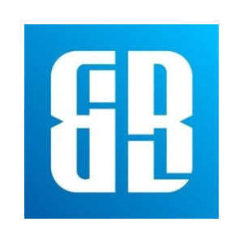 | 94943 | BIBL | Biblecoin |
|  | 78597 | ONEICHI | oneICHI |
| 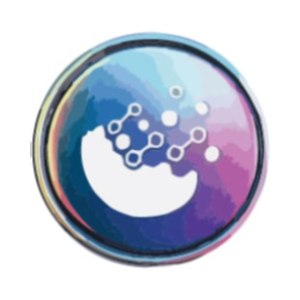 | 70839 | MLP | My Liquidity Partner |
|  | 112313 | SHIFO | Shibafomi |
| 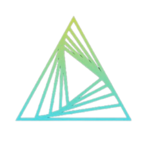 | 111453 | AQTIS | AQTIS |
| 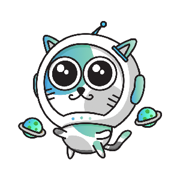 | 54537 | KCCM | KCC MemePad |
|  | 112981 | BNB WHALES | BNB Whales |
| 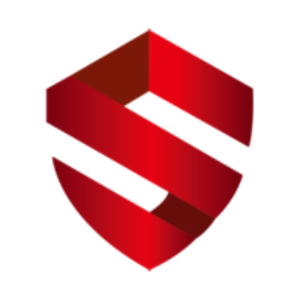 | 122009 | RUSH | RUSH COIN |
|  | 112343 | 0XAISWAP | 0xAISwap |
| 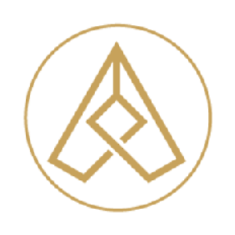 | 69681 | ARMA | Aarma |
|  | 54133 | CVAG | Crypto Village Accelerator |
|  | 122205 | AVAV | AVAV |
| 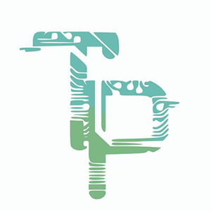 | 114969 | TXP | The X Protocol |
| 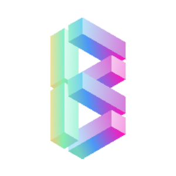 | 114487 | BRANA | Branaverse |
|  | 113043 | PCE | PEACE COIN |
|  | 78469 | REDLC | Redlight Chain |
| 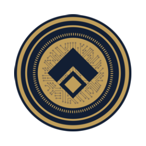 | 32823 | DGX | Digix Gold Token |
| 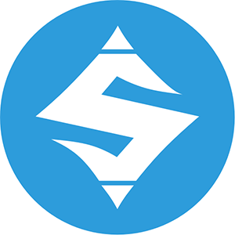 | 2145 | SUMO | Sumokoin |
|  | 126279 | UMAREUM | UMAREUM |
|  | 113403 | FUNDED | Funded |
|  | 99295 | FATP | Fat Pickle |
|  | 81171 | LUNG | LunaGens |
|  | 125975 | MYRO2.0 | MYRO 2.0 |
|  | 99521 | $MRPOTATO | Mr Potato Token |
| 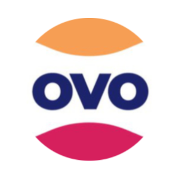 | 60371 | OVO | Ovato |
|  | 137797 | FIGHTRUMP | FIGHT TRUMP |
| 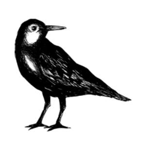 | 113611 | TIDE | Tidalflats |
| 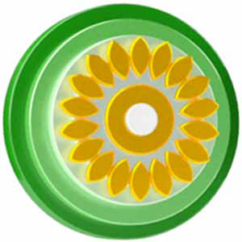 | 56429 | SMBR | Sombra |
|  | 54895 | SMD | SMD COIN |
|  | 115139 | NUR | Nurcoin |
|  | 99743 | TETRIS | Tetris |
|  | 45132 | XJP | eXciting Japan Coin |
|  | 131895 | ZUZU | ZUZU |
|  | 132037 | TGPT | Trading GPT |
|  | 131653 | KGB | KGB protocol |
| 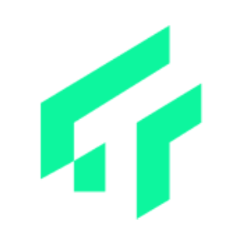 | 130371 | TTTU | T-Project |
|  | 131433 | MAGE | MAGE |
| 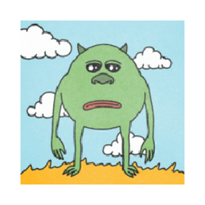 | 97349 | BRUH | BRUH |
| 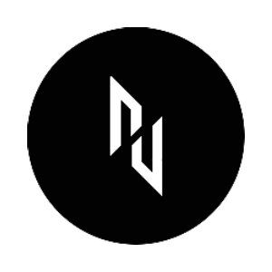 | 96545 | HTE | Hepton |
|  | 81251 | BLA | BlueArt |
|  | 70651 | HITOP | Hitop |
|  | 71269 | CENS | Cens World |
|  | 68285 | CTN | Continuum Finance |
|  | 32766 | GSC | Global Social Chain |
|  | 32583 | DAX | DAEX |
|  | 122513 | FCC | Freechat |
|  | 111695 | ASCN | AlphaScan |
|  | 79499 | ASAN | ASAN VERSE |
| 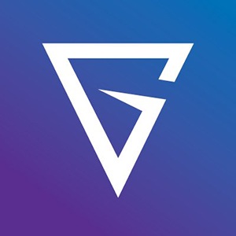 | 122815 | GTX | Gigantix Wallet Token |
|  | 113417 | GAIN$ | GainSpot |
|  | 56947 | ONEMOON | OneMoon |
| 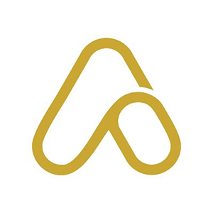 | 68069 | ATTR | Attrace |
|  | 44139 | KTV | Kmushicoin |
|  | 43104 | HDAO | HyperDAO |
|  | 90603 | BOW | Archerswap BOW |
|  | 79167 | BRO$ | BlockRock |
| 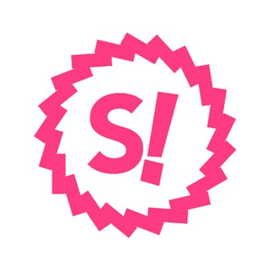 | 77831 | SPANK | SpankChain |
|  | 66015 | QLT | Quantland |
|  | 57983 | SHIBLITE | ShibaLite |
|  | 54387 | VAB | Vabble |
| 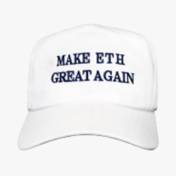 | 132651 | TRUMPHAT | Trump Hat |
| 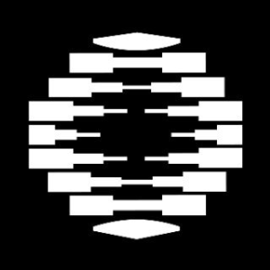 | 125191 | ORDIFI | OrdinalsFi |
|  | 137339 | VOIP | Voip Finance |
| 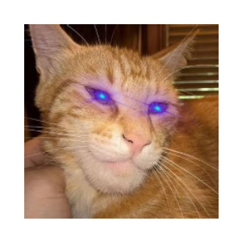 | 136637 | GCAT | Gigacat (gigacatsol.net) |
|  | 125887 | SPEERO | Speero |
|  | 122225 | VEC | Vector |
| 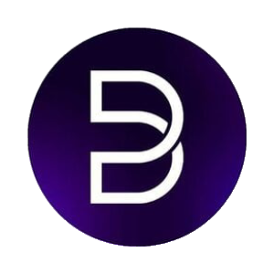 | 122255 | ROUP | roup (Ordinals) |
| 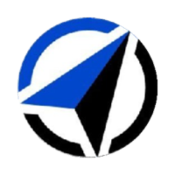 | 93943 | IPV | IPVERSE |
|  | 133033 | PEKA | PEKA |
| 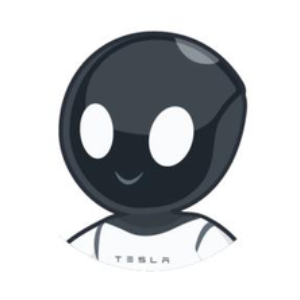 | 133827 | OPINU | Optimus Inu |
| 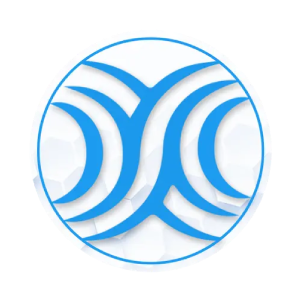 | 126911 | EXGO | EXGOLAND |
|  | 123009 | HTT | Hello Art |
| 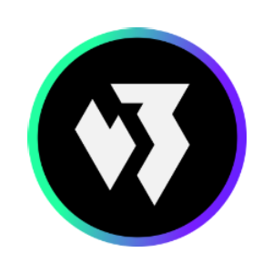 | 122569 | WGT | Web3Games.com |
|  | 99483 | LEAGUE | League Bot |
| 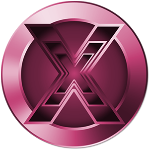 | 112485 | XXX | Black Whale |
| 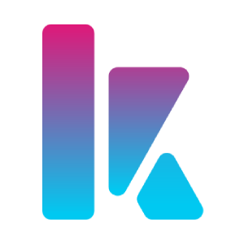 | 94637 | KPL | Kepple |
|  | 97379 | GREG | greg |
|  | 90399 | MWCC | Metaworld |
| 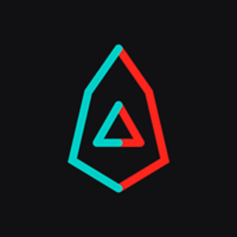 | 34550 | EOSC | EosForce |
|  | 113137 | STARRY | Starry |
|  | 112471 | CATBINGOLO | Bingo |
| 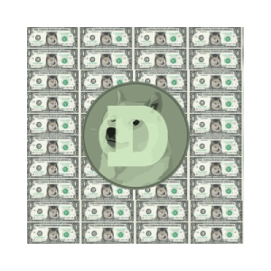 | 59851 | DOGEDI | DOGEDI |
|  | 126051 | SINDI | SINDI |
| 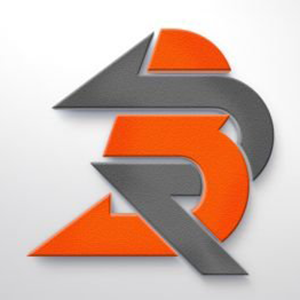 | 113693 | RBIT | Rabbit Inu |
| 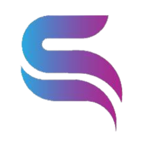 | 70753 | SMETA | StarkMeta |
| 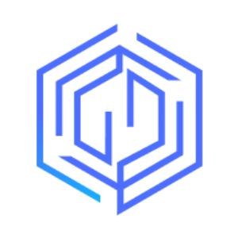 | 67899 | DPAD | Dpad Finance |
|  | 124755 | GEX | GLOBEX |
|  | 124753 | EOST | EOS TRUST |
|  | 124751 | CCN | CustomContractNetwork |
| 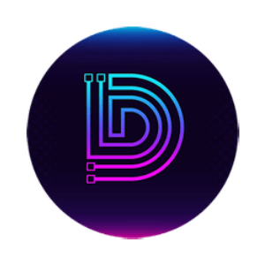 | 124749 | DCTO | Decentralized Crypto Token |
|  | 124747 | SHVR | Shivers |
| 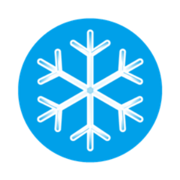 | 124745 | YUKI | YUKI |
| 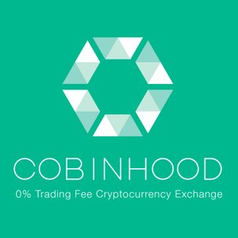 | 124739 | COB | Cobinhood |
| 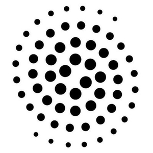 | 121933 | STM | Streamity |
| 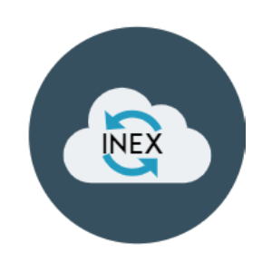 | 121979 | INEX | Inex Project |
|  | 122051 | OPCT | Opacity |
|  | 112833 | UU | Useless Utility |
| 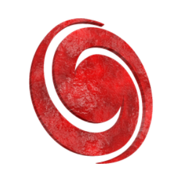 | 95189 | ESCE | Escroco Emerald |
|  | 81237 | DVRS | DaoVerse |
| 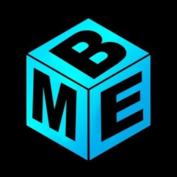 | 82399 | MBE | MxmBoxcEus Token |
|  | 76997 | JOL | Jolofcoin |
| 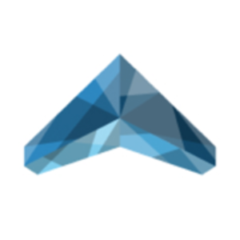 | 70385 | FJT | Fuji FJT |
| 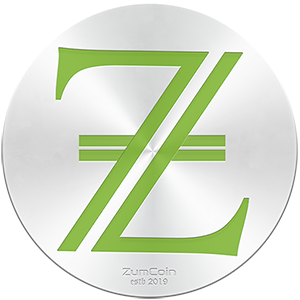 | 68177 | ZUM | ZUM TOKEN |
| 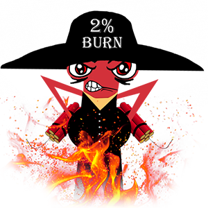 | 66411 | DYNMT | Dynamite Token |
| 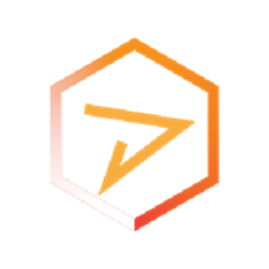 | 67445 | PLF | PlayFuel |
| 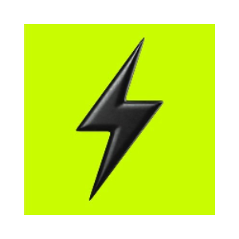 | 56881 | BXR | Blockster |
|  | 55007 | TIK | ChronoBase |
|  | 51517 | GHOUL | Ghoul Token |
|  | 46943 | TENT | TENT |
| 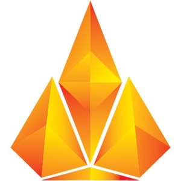 | 44581 | BALI | Bali Coin |
|  | 44905 | SST | SIMBA Storage Token |
|  | 45210 | NTOK | NTOK |
|  | 44816 | GTF | GLOBALTRUSTFUND TOKEN |
|  | 45078 | LBURST | LoanBurst |
| 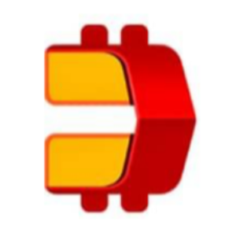 | 44870 | DGMT | DigiMax |
| 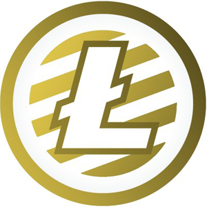 | 43932 | LTG | LiteGold |
| 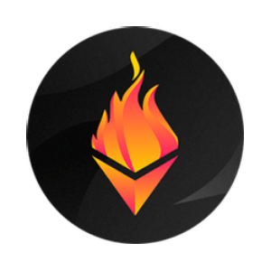 | 42890 | PYRO | PYRO Network |
|  | 44049 | ICH | IdeaChain |
| 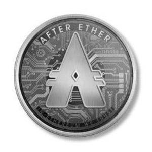 | 42465 | AET | AEROTOKEN |
| 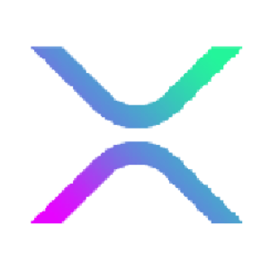 | 42478 | XRPC | XRP Classic |
| 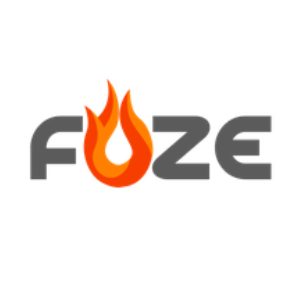 | 36560 | FUZE | FUZE Token |
| 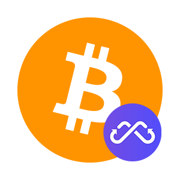 | 41887 | MBTC | MiniBitcoin |
| 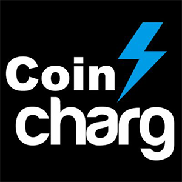 | 34637 | CHG | Charg Coin |
| 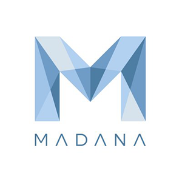 | 33820 | PAX | Paxos Standard Token |
| 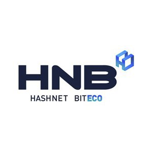 | 33834 | HNB | HashNet BitEco |
|  | 36386 | BTCUI | Bitcoin Unicorn |
| 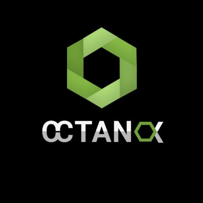 | 33825 | OTX | Octanox |
|  | 34655 | SNBL | Snowball |
| 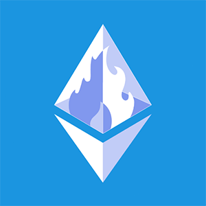 | 36448 | ETHPLO | ETHplode |
| 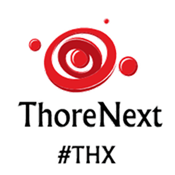 | 33857 | THX | ThoreNext |
|  | 33909 | BOMB | BOMB |
|  | 34416 | PAR | Parachute |
| 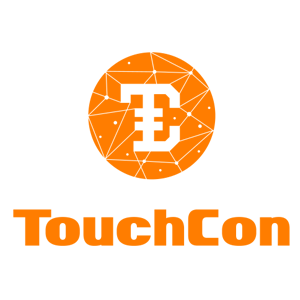 | 33884 | TOC | TouchCon |
| 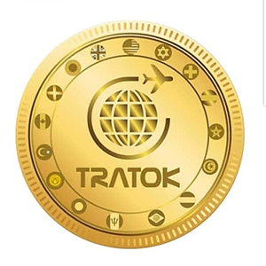 | 33843 | TRAT | Tratok |
|  | 33164 | YLC | YoloCash |
|  | 33463 | LTK | LitecoinToken |
| 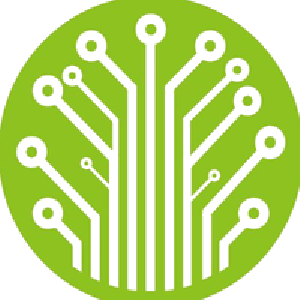 | 33737 | QCH | QChi |
| 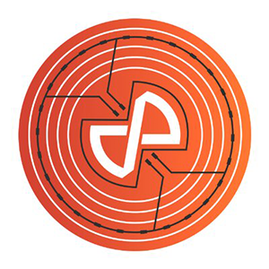 | 33146 | ROX | Robotina |
| 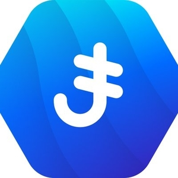 | 33131 | JOINT | Joint Ventures |
| 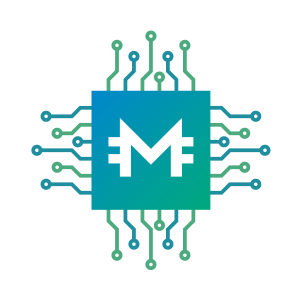 | 33111 | IMT | Moneytoken |
| 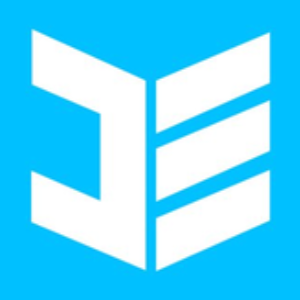 | 33113 | CMIT | CMITCOIN |
| 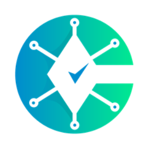 | 33133 | CTRT | Cryptrust |
|  | 33789 | SET | Save Environment Token |
|  | 33186 | AAA | Abulaba |
| 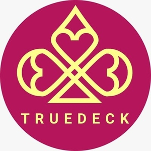 | 33639 | TDP | TrueDeck |
| 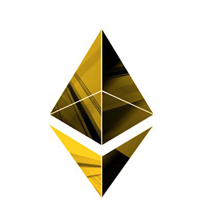 | 33621 | ETGP | Ethereum Gold Project |
|  | 33607 | F1C | Future1coin |
|  | 33600 | BHIG | BuckHathCoin |

---

[← Prev](./list8.md) | [Next →](./list10.md)
